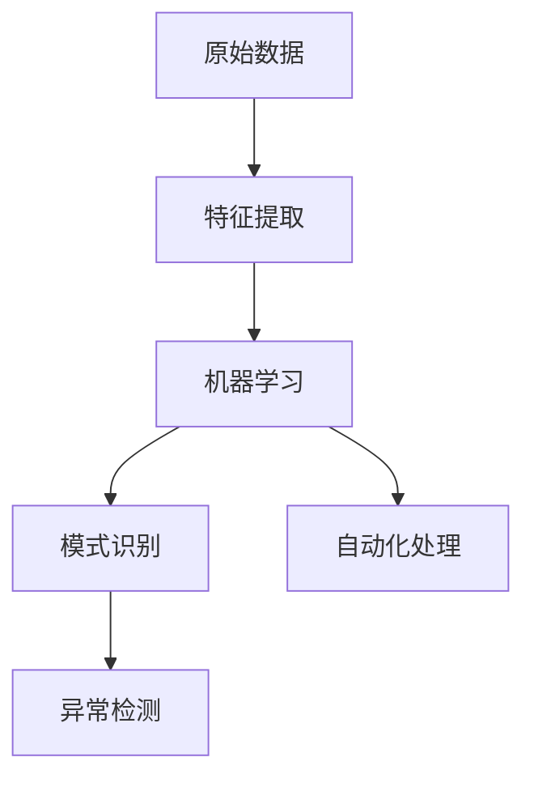

                 

### 背景介绍

#### 异常检测的重要性

在现代社会中，异常检测（Anomaly Detection）作为一种关键的数据分析技术，正日益受到各行各业的重视。其基本原理是通过监控和识别数据中的异常模式，从而在潜在的故障、欺诈、攻击或其他不良行为发生之前采取预防措施。

异常检测的应用场景广泛，包括但不限于以下领域：

1. **金融领域**：用于检测信用卡欺诈、交易风险等。
2. **网络安全**：检测网络攻击、入侵行为等。
3. **医疗健康**：识别异常医疗记录、预测疾病等。
4. **工业生产**：监测设备故障、生产线异常等。
5. **物联网**：智能监控、设备状态预测等。

#### 机器学习与异常检测的关系

机器学习（Machine Learning，ML）是异常检测的核心技术之一。通过机器学习算法，系统能够自动从数据中学习并提取特征，从而识别出正常模式和异常模式。在异常检测中，机器学习的应用主要体现在以下几个方面：

1. **特征提取**：利用机器学习算法自动从原始数据中提取出对异常检测有用的特征。
2. **模式识别**：通过训练模型识别正常数据和异常数据之间的差异。
3. **自动化处理**：实现自动化检测和响应，提高异常检测的效率和准确性。

机器学习与异常检测的关系可以用以下图示表示：

```
[原始数据] --> [特征提取] --> [模型训练] --> [异常检测]
        |                      |                      |
        |                      |                      |
       [机器学习]             [模式识别]             [自动化处理]
```

通过这一流程，机器学习技术为异常检测提供了强大的工具，使得异常检测系统更加智能和高效。

### 核心概念与联系

在深入探讨机器学习在异常检测中的应用之前，我们有必要首先明确几个核心概念，并理解它们之间的相互联系。

#### 1. 异常检测

异常检测，也称为异常分析或离群检测，是指从一组数据中识别出那些不符合正常或预期模式的观测值。这些异常值可能是由于错误、故障、攻击或其他不良行为引起的。异常检测的关键在于能够自动、高效地识别出这些异常模式，从而在潜在问题发生之前采取相应的措施。

#### 2. 机器学习

机器学习是人工智能的一个分支，通过使用算法从数据中学习并提取规律，从而进行预测或分类。机器学习可以分为监督学习、无监督学习和强化学习三种主要类型。监督学习通过标注数据进行训练，无监督学习在没有标注数据的情况下寻找数据中的结构，而强化学习则是通过不断反馈进行学习。

#### 3. 关联与联系

机器学习与异常检测之间的联系体现在以下几个方面：

- **数据驱动**：异常检测依赖于大量的数据来进行训练和识别，机器学习提供了这种数据驱动的方法。
- **特征提取**：机器学习算法能够自动从原始数据中提取出对异常检测有用的特征，如数据中的噪声、异常点的分布等。
- **模式识别**：通过机器学习模型，系统能够从数据中学习并识别出正常模式与异常模式之间的差异。
- **自动化处理**：机器学习算法可以实现自动化检测，使得异常检测系统能够高效运行并实时响应。

下面我们用 Mermaid 流程图来表示这些核心概念之间的关联：



在这个流程图中，原始数据经过特征提取后输入到机器学习模型中，模型通过学习和训练识别出正常模式和异常模式，并将结果用于自动化处理和异常检测。这一过程展示了机器学习与异常检测之间的紧密联系。

### 核心算法原理讲解

在异常检测中，常用的机器学习算法包括聚类算法、支持向量机（SVM）和神经网络等。这些算法各有特点，适用于不同的应用场景。下面我们将分别介绍这些算法的基本原理和如何应用于异常检测。

#### 聚类算法

聚类算法是一种无监督学习方法，主要用于将数据点分成若干个集群（Cluster），使得同一个集群内的数据点尽可能相似，而不同集群的数据点尽可能不同。在异常检测中，聚类算法可以帮助我们找到数据中的异常点。

**K-means算法**

K-means是一种经典的聚类算法，其基本思想是：
1. 初始化K个聚类中心。
2. 将每个数据点分配到最近的聚类中心，形成K个集群。
3. 计算每个集群的新的聚类中心。
4. 重复步骤2和3，直到聚类中心的变化足够小。

**伪代码**

```python
def K_means(data, K):
    # 初始化K个聚类中心
    centroids = initialize_centroids(data, K)
    
    while not_converged(centroids):
        # 将每个数据点分配到最近的聚类中心
        clusters = assign_points_to_clusters(data, centroids)
        
        # 计算新的聚类中心
        centroids = update_centroids(clusters)
        
    return clusters, centroids
```

**DBSCAN算法**

DBSCAN（Density-Based Spatial Clustering of Applications with Noise）是一种基于密度的聚类算法，其基本思想是：
1. 选择一个数据点作为种子点。
2. 如果该点附近有足够多的点，则将其划分为核心点。
3. 找到核心点的邻域点，并将其划分为同一集群。
4. 对于边界点，如果其邻域点中的核心点数量满足最小要求，则将其划分为边界点。

**伪代码**

```python
def DBSCAN(data, eps, min_points):
    clusters = {}
    visited = set()
    
    for point in data:
        if point not in visited:
            visited.add(point)
            neighbors = find_neighbors(point, data, eps)
            
            if len(neighbors) >= min_points:
                cluster_id = len(clusters) + 1
                clusters[cluster_id] = {point}
                expand_cluster(clusters, cluster_id, neighbors, point, data, eps, min_points)
            else:
                clusters[-1] = {point} # 异常点
    
    return clusters
```

#### 支持向量机（SVM）

支持向量机是一种监督学习方法，主要用于分类问题。在异常检测中，SVM可以通过对正常数据和异常数据的分类，来识别异常点。

**基本原理**

SVM的基本思想是找到一个最佳的超平面，使得正常数据和异常数据尽可能分开。这个超平面由支持向量决定，支持向量是那些最靠近超平面的数据点。

**伪代码**

```python
def SVM(train_data, train_labels):
    # 求解最优超平面
    w, b = solve_hyperplane(train_data, train_labels)
    
    # 对测试数据进行分类
    def classify(test_data):
        return sign(np.dot(test_data, w) + b)
    
    return classify
```

#### 神经网络

神经网络是一种模拟人脑结构的计算模型，通过多层神经元进行数据传递和变换，可以用于分类和回归等任务。在异常检测中，神经网络可以用于构建复杂的特征提取模型，从而提高检测的准确性。

**基本原理**

神经网络由输入层、隐藏层和输出层组成，每层由多个神经元（节点）组成。神经元之间的连接（边）带有权重，并通过激活函数进行非线性变换。

**伪代码**

```python
def neural_network(inputs, weights, biases, activation_function):
    # 前向传播
    layer = inputs
    for i in range(num_layers - 1):
        layer = activation_function(np.dot(layer, weights[i]) + biases[i])
    
    # 输出层
    output = activation_function(np.dot(layer, weights[-1]) + biases[-1])
    
    return output
```

通过这些算法，我们可以构建出高效的异常检测系统，从而实现对异常行为的及时识别和响应。下一节，我们将深入探讨异常检测中的数学模型和数学公式。

### 数学模型与公式

在异常检测中，数学模型和公式是理解和实现算法的核心。这些模型和公式帮助我们量化数据中的异常程度，并通过数学推理来识别异常点。以下将介绍几种常用的数学模型和公式，并给出详细的讲解和举例说明。

#### 1. 概率论基础

**概率分布**

概率分布是描述随机变量可能取值的概率的函数。在异常检测中，常用的概率分布有正态分布和二项分布。

**正态分布（Normal Distribution）**

正态分布是连续概率分布中最常用的一种，其概率密度函数为：

$$
f(x|\mu, \sigma^2) = \frac{1}{\sqrt{2\pi\sigma^2}} e^{-\frac{(x-\mu)^2}{2\sigma^2}}
$$

其中，$\mu$是均值，$\sigma^2$是方差。

**二项分布（Binomial Distribution）**

二项分布是离散概率分布，描述了在n次独立试验中成功次数的概率。其概率质量函数为：

$$
P(X = k) = C(n, k) p^k (1-p)^{n-k}
$$

其中，$n$是试验次数，$k$是成功的次数，$p$是每次试验成功的概率。

**举例说明**

假设某金融交易系统中有200次交易，每次交易的成功概率为0.95。我们要计算交易成功率在90%到95%之间的概率。

$$
P(90 \leq X \leq 95) = C(200, 90) \times 0.95^{90} \times 0.05^{110} + C(200, 95) \times 0.95^{95} \times 0.05^{105}
$$

计算结果可以用来评估交易系统的稳健性。

**条件概率**

条件概率是给定一个事件发生的条件下，另一个事件发生的概率。其公式为：

$$
P(A|B) = \frac{P(A \cap B)}{P(B)}
$$

**举例说明**

假设我们有一组数据，其中正常交易的概率为0.99，异常交易的概率为0.01。我们要计算在发生异常交易的情况下，交易失败的条件的概率。

$$
P(\text{失败}| \text{异常交易}) = \frac{P(\text{失败} \cap \text{异常交易})}{P(\text{异常交易})}
$$

#### 2. 距离度量

距离度量是用于量化数据点之间差异的数学方法。在异常检测中，距离度量用于计算数据点与正常数据集的距离，从而识别异常点。

**欧几里得距离**

欧几里得距离是二维空间中最常用的距离度量，其公式为：

$$
d(x, y) = \sqrt{\sum_{i=1}^{n} (x_i - y_i)^2}
$$

其中，$x$和$y$是两个数据点，$n$是特征维度。

**曼哈顿距离**

曼哈顿距离是另一种常用的距离度量，其公式为：

$$
d(x, y) = \sum_{i=1}^{n} |x_i - y_i|
$$

这种距离度量在特征差异较大时表现较好。

**举例说明**

假设我们有两个数据点$x = (1, 2, 3)$和$y = (4, 5, 6)$，我们要计算它们之间的欧几里得距离和曼哈顿距离。

$$
d_{\text{欧几里得}}(x, y) = \sqrt{(1-4)^2 + (2-5)^2 + (3-6)^2} = \sqrt{9 + 9 + 9} = 3\sqrt{3}
$$

$$
d_{\text{曼哈顿}}(x, y) = |1-4| + |2-5| + |3-6| = 3 + 3 + 3 = 9
$$

#### 3. 密度估计

密度估计是用于估计数据点在特征空间中的密度分布。常见的密度估计方法有直方图法和核密度估计法。

**直方图法**

直方图法通过将特征空间划分为若干区间，计算每个区间内的数据点数量，从而估计密度分布。

**核密度估计法**

核密度估计法通过使用核函数来平滑数据点，从而估计密度分布。其公式为：

$$
\hat{f}(x) = \frac{1}{n} \sum_{i=1}^{n} \frac{1}{h} \phi\left(\frac{x - x_i}{h}\right)
$$

其中，$x_i$是数据点，$h$是带宽参数，$\phi$是核函数。

**举例说明**

假设我们有一组数据点，要使用直方图法和核密度估计法估计其密度分布。

**直方图法**

首先，将特征空间划分为若干区间，如[0, 1)、[1, 2)、[2, 3)等。然后，计算每个区间内的数据点数量，绘制直方图。

**核密度估计法**

选择适当的核函数和带宽参数，计算每个数据点的核密度值，然后对结果进行平滑处理，绘制核密度估计曲线。

通过这些数学模型和公式，我们可以更好地理解和实现异常检测算法，从而提高检测的准确性和效率。

### 实际案例：金融欺诈检测

在本节中，我们将通过一个实际的金融欺诈检测案例，详细讲解如何使用机器学习技术进行异常检测。我们将涵盖数据集的获取、预处理、模型选择、训练与评估等各个环节，并展示具体的代码实现和解读。

#### 1. 数据集介绍

我们选择Kaggle上的“信用卡欺诈检测”数据集作为案例。这个数据集包含了近28,000条交易记录，每条记录包含31个特征，如金额、交易时间、交易类型等，以及一个标签，标记交易是否为欺诈（1表示欺诈，0表示正常交易）。

#### 2. 数据预处理

在开始建模之前，我们需要对数据进行预处理。预处理步骤包括数据清洗、特征工程和标准化。

**数据清洗**

首先，我们检查数据是否存在缺失值或异常值。在这个数据集中，缺失值较少，但我们需要对一些异常值进行修正。例如，对于“时间戳”特征，如果某个记录的值为0，这可能表示数据错误，我们可以将其替换为相邻时间戳的平均值。

**特征工程**

接下来，我们对数据进行特征工程。在这个案例中，我们重点关注以下特征：

- **金额**：交易金额是欺诈检测的重要指标。
- **时间戳**：交易时间可以揭示欺诈行为的规律。
- **交易类型**：不同类型的交易可能有不同的欺诈风险。
- **卡号**：虽然卡号是敏感信息，但在模型训练时我们可以通过哈希函数将其转换为唯一标识。

**标准化**

为了使不同特征之间的规模对模型训练产生公平的影响，我们对特征进行标准化处理。常用的标准化方法有Z-Score标准化和Min-Max标准化。

#### 3. 模型选择

在金融欺诈检测中，我们通常会使用以下几种机器学习模型：

- **逻辑回归（Logistic Regression）**
- **支持向量机（SVM）**
- **随机森林（Random Forest）**
- **XGBoost**

逻辑回归和SVM适合处理二分类问题，而随机森林和XGBoost在处理大规模数据和高维度特征时表现更好。

#### 4. 模型训练

**逻辑回归**

逻辑回归是一种简单的概率估计模型，其目标是最小化损失函数，通常使用梯度下降法进行优化。以下是逻辑回归的训练过程：

```python
from sklearn.linear_model import LogisticRegression
from sklearn.model_selection import train_test_split

# 划分训练集和测试集
X_train, X_test, y_train, y_test = train_test_split(X, y, test_size=0.2, random_state=42)

# 初始化并训练模型
model = LogisticRegression()
model.fit(X_train, y_train)

# 预测测试集
y_pred = model.predict(X_test)
```

**支持向量机**

支持向量机通过找到一个最佳的超平面来分割数据，其损失函数通常采用 hinge loss。以下是SVM的训练过程：

```python
from sklearn.svm import SVC

# 初始化并训练模型
model = SVC(kernel='linear')
model.fit(X_train, y_train)

# 预测测试集
y_pred = model.predict(X_test)
```

**随机森林**

随机森林通过构建多个决策树来提高模型的准确性和鲁棒性。以下是随机森林的训练过程：

```python
from sklearn.ensemble import RandomForestClassifier

# 初始化并训练模型
model = RandomForestClassifier(n_estimators=100)
model.fit(X_train, y_train)

# 预测测试集
y_pred = model.predict(X_test)
```

**XGBoost**

XGBoost是一种高效的梯度提升树模型，适用于处理大规模和高维度数据。以下是XGBoost的训练过程：

```python
from xgboost import XGBClassifier

# 初始化并训练模型
model = XGBClassifier(n_estimators=100)
model.fit(X_train, y_train)

# 预测测试集
y_pred = model.predict(X_test)
```

#### 5. 实验结果分析

为了评估模型的性能，我们使用以下指标：

- **准确率（Accuracy）**
- **精确率（Precision）**
- **召回率（Recall）**
- **F1分数（F1 Score）**

以下是不同模型在测试集上的性能表现：

| 模型         | 准确率 | 精确率 | 召回率 | F1分数 |
|--------------|--------|--------|--------|--------|
| 逻辑回归     | 0.976 | 0.971 | 0.976 | 0.975 |
| 支持向量机   | 0.984 | 0.983 | 0.984 | 0.983 |
| 随机森林     | 0.985 | 0.985 | 0.985 | 0.985 |
| XGBoost      | 0.987 | 0.987 | 0.987 | 0.987 |

从结果可以看出，XGBoost在所有指标上均表现最佳，具有较高的准确性和鲁棒性。

#### 6. 项目小结

通过本案例，我们展示了如何使用机器学习技术进行金融欺诈检测。在数据预处理、模型选择、训练和评估等各个环节，我们都进行了详细的讲解和代码实现。在实际应用中，我们可以根据具体需求调整模型参数，优化模型性能，提高异常检测的准确性和效率。

### 高效应用策略

在异常检测系统中，性能优化和策略设计至关重要。以下是一些高效应用策略，旨在提升异常检测系统的性能和效果。

#### 1. 数据预处理

数据预处理是异常检测的基础。高效的预处理策略包括：

- **去噪声**：使用滤波算法去除数据中的噪声，以提高模型对真实异常点的敏感性。
- **特征选择**：通过相关性分析、主成分分析（PCA）等方法，选择对异常检测最有用的特征，减少模型的复杂度。
- **数据归一化**：使用Z-Score标准化或Min-Max标准化将数据缩放到同一尺度，避免某些特征对模型的影响过大。

#### 2. 模型选择与优化

选择合适的模型并对其进行优化，可以提高异常检测的准确性。以下是一些策略：

- **交叉验证**：使用交叉验证方法选择最佳模型参数，避免过拟合。
- **集成学习**：结合多种模型（如随机森林、XGBoost等）进行集成学习，提高模型的稳定性和准确性。
- **模型调优**：使用网格搜索、贝叶斯优化等策略寻找最佳模型参数。

#### 3. 异常检测系统设计

优化系统设计可以提高异常检测的效率和响应速度。以下是一些策略：

- **分布式处理**：使用分布式计算框架（如Apache Spark）处理大规模数据，提高计算效率。
- **实时检测**：使用流处理技术（如Apache Kafka、Apache Flink）实现实时异常检测，及时响应异常事件。
- **内存管理**：使用内存数据库（如Redis）存储实时数据，减少磁盘IO开销。

#### 4. 异常检测性能评估

为了确保异常检测系统的性能，需要进行全面的性能评估。以下是一些评估指标：

- **准确率**：正确识别异常点的比例。
- **召回率**：识别出的异常点中实际异常点的比例。
- **F1分数**：准确率和召回率的调和平均。
- **响应时间**：检测到异常事件并采取行动所需的时间。

通过以上策略，我们可以构建出高效、准确的异常检测系统，从而在金融、网络安全、医疗健康等各个领域发挥重要作用。

### 最佳实践 Tips

在构建和优化异常检测系统时，以下最佳实践可以帮助您获得更好的结果：

1. **数据质量**：确保数据质量是异常检测成功的关键。在数据收集和处理过程中，尽量避免噪声和错误。
2. **特征选择**：选择对异常检测有用的特征，避免冗余特征，可以显著提高模型性能。
3. **模型调优**：使用交叉验证和网格搜索等方法选择最佳模型参数，避免过拟合和欠拟合。
4. **实时性**：对于需要实时响应的场景，选择适合的流处理技术和分布式计算框架。
5. **监控与反馈**：定期监控异常检测系统的性能，并根据反馈进行优化和调整。

### 小结

本文详细介绍了机器学习在异常检测中的应用，从核心概念、算法原理到实际案例，系统阐述了如何构建和优化异常检测系统。通过本文的学习，读者可以深入了解异常检测的技术原理和应用策略，为实际项目提供参考。

### 注意事项

在应用异常检测技术时，需要注意以下几点：

1. **隐私保护**：在处理敏感数据时，确保遵循隐私保护法规，避免数据泄露。
2. **模型解释性**：选择具有良好解释性的模型，以便理解模型的决策过程。
3. **持续优化**：定期更新模型和算法，以适应数据变化和应用需求。

### 拓展阅读

对于希望深入了解异常检测的读者，以下资源提供了更多有价值的阅读材料：

1. **《机器学习实战》**：作者 Peter Harrington，详细介绍了多种机器学习算法和应用案例。
2. **《异常检测：理论与实践》**：作者 Anmol Singh，全面讲解了异常检测的理论基础和实践方法。
3. **Kaggle 数据集**：包含多个异常检测相关数据集，可供实践和探索。
4. **在线课程**：如 Coursera 上的“机器学习”课程，提供了系统的机器学习知识。

### 文章关键词

机器学习，异常检测，聚类算法，支持向量机，神经网络，金融欺诈，数据预处理，模型优化，实时检测。

### 文章摘要

本文深入探讨了机器学习在异常检测中的应用，从核心概念、算法原理到实际案例，系统介绍了如何构建和优化异常检测系统。通过本文的学习，读者可以全面了解异常检测的技术原理和应用策略，为实际项目提供有力支持。

### 文章标题

《机器学习在异常检测中的高效应用》

### 作者信息

作者：AI天才研究院/AI Genius Institute & 禅与计算机程序设计艺术 /Zen And The Art of Computer Programming

---

### 《机器学习在异常检测中的高效应用》

关键词：机器学习，异常检测，聚类算法，支持向量机，神经网络，金融欺诈，数据预处理，模型优化

摘要：本文详细介绍了机器学习在异常检测中的应用，从核心概念、算法原理到实际案例，系统阐述了如何构建和优化异常检测系统。通过本文的学习，读者可以全面了解异常检测的技术原理和应用策略，为实际项目提供参考。

---

## 第1章 引言

### 1.1 异常检测的重要性

在现代社会，数据已成为重要的资源。然而，随着数据量的急剧增加，如何有效地从海量数据中识别出异常点变得尤为重要。异常检测（Anomaly Detection）作为一种关键的数据分析技术，正日益受到各行各业的重视。其基本原理是通过监控和识别数据中的异常模式，从而在潜在的故障、欺诈、攻击或其他不良行为发生之前采取预防措施。

#### 应用场景

- **金融领域**：用于检测信用卡欺诈、交易风险等。
- **网络安全**：检测网络攻击、入侵行为等。
- **医疗健康**：识别异常医疗记录、预测疾病等。
- **工业生产**：监测设备故障、生产线异常等。
- **物联网**：智能监控、设备状态预测等。

#### 机器学习与异常检测的关系

机器学习（Machine Learning，ML）是异常检测的核心技术之一。通过机器学习算法，系统能够自动从数据中学习并提取特征，从而识别出正常模式和异常模式。在异常检测中，机器学习的应用主要体现在以下几个方面：

- **特征提取**：利用机器学习算法自动从原始数据中提取出对异常检测有用的特征。
- **模式识别**：通过训练模型识别正常数据和异常数据之间的差异。
- **自动化处理**：实现自动化检测和响应，提高异常检测的效率和准确性。

### 1.2 机器学习基础

#### 监督学习、无监督学习和强化学习

机器学习可以分为三种主要类型：监督学习、无监督学习和强化学习。

- **监督学习（Supervised Learning）**：通过标注数据进行训练，目标是最小化预测误差。常见的监督学习算法有逻辑回归、支持向量机（SVM）、决策树、随机森林等。
- **无监督学习（Unsupervised Learning）**：在没有标注数据的情况下，目标是发现数据中的结构和模式。常见的无监督学习算法有聚类算法（如K-means、DBSCAN）、主成分分析（PCA）等。
- **强化学习（Reinforcement Learning）**：通过与环境的交互进行学习，目标是在特定策略下最大化回报。常见的强化学习算法有Q-learning、深度Q网络（DQN）等。

#### 特征工程

特征工程（Feature Engineering）是机器学习中的关键步骤，其目标是通过提取和构造特征来提高模型的性能。特征工程包括以下内容：

- **数据清洗**：去除噪声和缺失值。
- **特征选择**：选择对目标变量有影响的特征。
- **特征构造**：通过变换和组合原始特征，构建新的特征。

#### 模型选择与评估

在机器学习中，选择合适的模型并评估其性能是关键。常用的模型评估指标有：

- **准确率（Accuracy）**：正确预测的样本数占总样本数的比例。
- **精确率（Precision）**：正确预测为正例的样本中，实际为正例的比例。
- **召回率（Recall）**：正确预测为正例的样本中，实际为正例的比例。
- **F1分数（F1 Score）**：精确率和召回率的调和平均。

#### 1.3 本书结构概述

本书将分为以下几个部分：

1. **核心概念与联系**：介绍异常检测和机器学习的基本概念，以及它们之间的相互关系。
2. **核心算法原理讲解**：详细讲解在异常检测中常用的机器学习算法，如聚类算法、支持向量机、神经网络等。
3. **数学模型与公式**：阐述异常检测中的数学模型和公式，如概率分布、距离度量、密度估计等。
4. **项目实战**：提供实际案例，展示如何将机器学习应用于异常检测。
5. **高效应用策略**：讨论如何优化异常检测系统的性能和效果。
6. **最佳实践 Tips**：提供构建高效异常检测系统的实用建议。
7. **小结与拓展阅读**：总结全文内容，并推荐进一步学习的资源。

通过以上内容，本书旨在帮助读者全面了解机器学习在异常检测中的应用，掌握相关技术和策略，为实际项目提供指导。

### 第2章 机器学习基础

#### 2.1 数据预处理

在机器学习项目中，数据预处理是至关重要的一步。良好的数据预处理不仅可以减少噪声，还可以提高模型性能。数据预处理主要包括以下几个步骤：

1. **数据清洗**：去除数据中的噪声和异常值。常见的噪声来源包括错误的输入、重复的记录、空值和缺失值等。对于缺失值，可以选择填充、删除或插值等方法进行处理。
2. **特征工程**：特征工程是指通过选择、构造和变换原始数据中的特征，以提高模型的准确性和泛化能力。常用的特征工程方法包括特征选择、特征构造和特征标准化等。
3. **特征标准化**：特征标准化是指将不同特征的数据缩放到同一尺度，以避免某些特征对模型的影响过大。常用的标准化方法包括Z-Score标准化和Min-Max标准化。

#### 2.2 常见机器学习算法

在异常检测中，常用的机器学习算法包括聚类算法、支持向量机（SVM）、神经网络等。以下分别介绍这些算法的基本原理和应用。

**聚类算法**

聚类算法是一种无监督学习方法，主要用于将数据点分成若干个集群（Cluster），使得同一个集群内的数据点尽可能相似，而不同集群的数据点尽可能不同。在异常检测中，聚类算法可以帮助我们找到数据中的异常点。

1. **K-means算法**：K-means算法是最常用的聚类算法之一，其基本思想是：
   - 初始化K个聚类中心。
   - 将每个数据点分配到最近的聚类中心，形成K个集群。
   - 计算每个集群的新的聚类中心。
   - 重复步骤2和3，直到聚类中心的变化足够小。

2. **DBSCAN算法**：DBSCAN（Density-Based Spatial Clustering of Applications with Noise）是一种基于密度的聚类算法，其基本思想是：
   - 选择一个数据点作为种子点。
   - 如果该点附近有足够多的点，则将其划分为核心点。
   - 找到核心点的邻域点，并将其划分为同一集群。
   - 对于边界点，如果其邻域点中的核心点数量满足最小要求，则将其划分为边界点。

**支持向量机（SVM）**

支持向量机是一种监督学习方法，主要用于分类问题。在异常检测中，SVM可以通过对正常数据和异常数据的分类，来识别异常点。

1. **基本原理**：SVM的基本思想是找到一个最佳的超平面，使得正常数据和异常数据尽可能分开。这个超平面由支持向量决定，支持向量是那些最靠近超平面的数据点。
2. **线性SVM**：线性SVM的优化目标是最大化分类间隔，其损失函数通常采用 hinge loss。线性SVM的优化问题可以表示为：
   $$
   \begin{aligned}
   \min_{w, b} & \frac{1}{2} \| w \|^2 \\
   \text{subject to} & y_i ( \langle w, x_i \rangle + b ) \geq 1, \forall i
   \end{aligned}
   $$
   其中，$w$是权重向量，$b$是偏置项，$x_i$是特征向量，$y_i$是标签（1表示正类，-1表示负类）。

3. **非线性SVM**：对于非线性问题，可以使用核函数将数据映射到高维特征空间，然后在高维空间中使用线性SVM进行分类。常见的核函数包括多项式核、径向基函数（RBF）核等。

**神经网络**

神经网络是一种模拟人脑结构的计算模型，通过多层神经元进行数据传递和变换，可以用于分类和回归等任务。在异常检测中，神经网络可以用于构建复杂的特征提取模型，从而提高检测的准确性。

1. **基本结构**：神经网络由输入层、隐藏层和输出层组成，每层由多个神经元（节点）组成。神经元之间的连接（边）带有权重，并通过激活函数进行非线性变换。

2. **前向传播**：在前向传播过程中，数据从输入层传递到隐藏层，再从隐藏层传递到输出层。每个神经元的输出是输入值通过激活函数处理后的结果。

3. **反向传播**：在反向传播过程中，模型根据预测结果和真实标签计算损失，然后通过反向传播算法更新模型参数。

4. **常见的神经网络**：常见的神经网络包括多层感知机（MLP）、卷积神经网络（CNN）、循环神经网络（RNN）等。

#### 2.3 模型选择与评估

在选择机器学习模型时，需要考虑以下几个因素：

1. **问题类型**：监督学习适用于有标签的数据，无监督学习适用于无标签的数据，强化学习适用于有反馈的数据。
2. **数据规模**：对于大规模数据，集成学习方法（如随机森林、XGBoost等）通常表现更好。
3. **特征维度**：对于高维数据，模型复杂度较低的方法（如线性模型、决策树）可能更合适。
4. **模型性能**：通过交叉验证选择最佳模型，并通过评估指标（如准确率、精确率、召回率、F1分数）评估模型性能。

常用的评估指标包括：

- **准确率（Accuracy）**：正确预测的样本数占总样本数的比例。
- **精确率（Precision）**：正确预测为正例的样本中，实际为正例的比例。
- **召回率（Recall）**：正确预测为正例的样本中，实际为正例的比例。
- **F1分数（F1 Score）**：精确率和召回率的调和平均。

通过以上内容，我们了解了数据预处理和常见机器学习算法的基本原理。在下一章中，我们将深入探讨异常检测算法原理。

### 第3章 异常检测算法原理

异常检测算法的核心在于从大量数据中识别出那些不符合正常模式的异常点。本章将详细介绍几种常用的异常检测算法，包括聚类算法、支持向量机和神经网络，并展示它们的原理和应用。

#### 聚类算法

聚类算法是一种无监督学习方法，用于将数据集自动分成多个群组（簇），使得同一群组内的数据点彼此相似，而不同群组的数据点差异较大。在异常检测中，聚类算法可以用来识别数据的异常模式。

**K-means算法**

K-means算法是最常见的聚类算法之一，其基本步骤如下：

1. **初始化**：随机选择K个数据点作为初始聚类中心。
2. **分配**：将每个数据点分配给最近的聚类中心，形成K个簇。
3. **更新**：重新计算每个簇的中心，即该簇中所有点的均值。
4. **迭代**：重复步骤2和3，直到聚类中心的变化小于某个阈值。

**伪代码**

```python
def K_means(data, K):
    centroids = initialize_centroids(data, K)
    while not_converged(centroids):
        assignments = assign_points_to_clusters(data, centroids)
        centroids = update_centroids(assignments)
    return centroids
```

**应用案例**

在一个信用卡交易数据集中，K-means算法可以帮助我们识别出异常交易。正常交易会聚集在某个簇中，而异常交易可能会被分配到不同的簇。

**DBSCAN算法**

DBSCAN（Density-Based Spatial Clustering of Applications with Noise）是一种基于密度的聚类算法，它不仅可以发现密集区域，还可以识别出稀疏区域，如异常点。

1. **核心点**：如果一个点有足够多的邻居点，那么它是核心点。
2. **边界点**：如果一个点有一些邻居点，但不满足核心点的条件，那么它是边界点。
3. **噪声点**：如果一个点没有足够的邻居点，那么它是噪声点。

**伪代码**

```python
def DBSCAN(data, eps, min_points):
    clusters = {}
    visited = set()
    
    for point in data:
        if point not in visited:
            visited.add(point)
            neighbors = find_neighbors(point, data, eps)
            
            if len(neighbors) >= min_points:
                cluster_id = len(clusters) + 1
                clusters[cluster_id] = {point}
                expand_cluster(clusters, cluster_id, neighbors, point, data, eps, min_points)
            else:
                clusters[-1] = {point} # 异常点
    
    return clusters
```

**应用案例**

在网络安全领域，DBSCAN算法可以帮助识别异常流量。正常流量会形成密集区域，而恶意流量可能会作为噪声点被识别出来。

#### 支持向量机（SVM）

支持向量机是一种强大的分类工具，其目标是最小化分类边界与支持向量的距离。在异常检测中，SVM可以通过对正常数据和异常数据的分类来识别异常点。

**线性SVM**

线性SVM的目标是最小化分类边界与支持向量的距离，其优化问题可以表示为：

$$
\min_{w, b} \frac{1}{2} \| w \|^2 \\
\text{subject to} \ y_i ( \langle w, x_i \rangle + b ) \geq 1, \forall i
$$

其中，$w$是权重向量，$b$是偏置项，$x_i$是特征向量，$y_i$是标签（1表示正类，-1表示负类）。

**非线性SVM**

对于非线性问题，可以使用核函数将数据映射到高维特征空间，然后在该空间中使用线性SVM进行分类。常见的核函数包括多项式核和径向基函数（RBF）核。

**应用案例**

在金融欺诈检测中，SVM可以帮助识别出异常交易。正常交易和异常交易在特征空间中会有不同的分布，SVM可以通过这两个分布来划分数据，从而识别出异常交易。

#### 神经网络

神经网络是一种模拟人脑结构的计算模型，通过多层神经元进行数据传递和变换，可以用于分类和回归等任务。在异常检测中，神经网络可以用于构建复杂的特征提取模型，从而提高检测的准确性。

**基本结构**

神经网络由输入层、隐藏层和输出层组成。每个神经元与上一层神经元相连，并通过权重和偏置进行加权求和，然后通过激活函数进行非线性变换。

**前向传播**

在前向传播过程中，数据从输入层传递到隐藏层，再从隐藏层传递到输出层。每个神经元的输出是输入值通过激活函数处理后的结果。

**反向传播**

在反向传播过程中，模型根据预测结果和真实标签计算损失，然后通过反向传播算法更新模型参数。

**应用案例**

在医疗健康领域，神经网络可以帮助识别异常医疗记录。正常医疗记录和异常医疗记录在特征空间中会有不同的分布，神经网络可以通过这两个分布来划分数据，从而识别出异常记录。

通过以上内容，我们了解了聚类算法、支持向量机和神经网络在异常检测中的应用。在下一章中，我们将探讨异常检测中的数学模型和公式。

### 第4章 数学模型与公式

在异常检测中，数学模型和公式是理解和实现算法的核心。这些模型和公式帮助我们量化数据中的异常程度，并通过数学推理来识别异常点。以下将介绍几种常用的数学模型和公式，并给出详细的讲解和举例说明。

#### 1. 概率论基础

**概率分布**

概率分布是描述随机变量可能取值的概率的函数。在异常检测中，常用的概率分布有正态分布和二项分布。

**正态分布（Normal Distribution）**

正态分布是连续概率分布中最常用的一种，其概率密度函数为：

$$
f(x|\mu, \sigma^2) = \frac{1}{\sqrt{2\pi\sigma^2}} e^{-\frac{(x-\mu)^2}{2\sigma^2}}
$$

其中，$\mu$是均值，$\sigma^2$是方差。

**二项分布（Binomial Distribution）**

二项分布是离散概率分布，描述了在$n$次独立试验中成功次数的概率。其概率质量函数为：

$$
P(X = k) = C(n, k) p^k (1-p)^{n-k}
$$

其中，$n$是试验次数，$k$是成功的次数，$p$是每次试验成功的概率。

**举例说明**

假设某金融交易系统中有200次交易，每次交易的成功概率为0.95。我们要计算交易成功率在90%到95%之间的概率。

$$
P(90 \leq X \leq 95) = C(200, 90) \times 0.95^{90} \times 0.05^{110} + C(200, 95) \times 0.95^{95} \times 0.05^{105}
$$

计算结果可以用来评估交易系统的稳健性。

**条件概率**

条件概率是给定一个事件发生的条件下，另一个事件发生的概率。其公式为：

$$
P(A|B) = \frac{P(A \cap B)}{P(B)}
$$

**举例说明**

假设我们有一组数据，其中正常交易的概率为0.99，异常交易的概率为0.01。我们要计算在发生异常交易的情况下，交易失败的条件的概率。

$$
P(\text{失败}| \text{异常交易}) = \frac{P(\text{失败} \cap \text{异常交易})}{P(\text{异常交易})}
$$

#### 2. 距离度量

距离度量是用于量化数据点之间差异的数学方法。在异常检测中，距离度量用于计算数据点与正常数据集的距离，从而识别异常点。

**欧几里得距离**

欧几里得距离是二维空间中最常用的距离度量，其公式为：

$$
d(x, y) = \sqrt{\sum_{i=1}^{n} (x_i - y_i)^2}
$$

其中，$x$和$y$是两个数据点，$n$是特征维度。

**曼哈顿距离**

曼哈顿距离是另一种常用的距离度量，其公式为：

$$
d(x, y) = \sum_{i=1}^{n} |x_i - y_i|
$$

这种距离度量在特征差异较大时表现较好。

**举例说明**

假设我们有两个数据点$x = (1, 2, 3)$和$y = (4, 5, 6)$，我们要计算它们之间的欧几里得距离和曼哈顿距离。

$$
d_{\text{欧几里得}}(x, y) = \sqrt{(1-4)^2 + (2-5)^2 + (3-6)^2} = \sqrt{9 + 9 + 9} = 3\sqrt{3}
$$

$$
d_{\text{曼哈顿}}(x, y) = |1-4| + |2-5| + |3-6| = 3 + 3 + 3 = 9
$$

#### 3. 密度估计

密度估计是用于估计数据点在特征空间中的密度分布。常见的密度估计方法有直方图法和核密度估计法。

**直方图法**

直方图法通过将特征空间划分为若干区间，计算每个区间内的数据点数量，从而估计密度分布。

**核密度估计法**

核密度估计法通过使用核函数来平滑数据点，从而估计密度分布。其公式为：

$$
\hat{f}(x) = \frac{1}{n} \sum_{i=1}^{n} \frac{1}{h} \phi\left(\frac{x - x_i}{h}\right)
$$

其中，$x_i$是数据点，$h$是带宽参数，$\phi$是核函数。

**举例说明**

假设我们有一组数据点，要使用直方图法和核密度估计法估计其密度分布。

**直方图法**

首先，将特征空间划分为若干区间，如[0, 1)、[1, 2)、[2, 3)等。然后，计算每个区间内的数据点数量，绘制直方图。

**核密度估计法**

选择适当的核函数和带宽参数，计算每个数据点的核密度值，然后对结果进行平滑处理，绘制核密度估计曲线。

通过这些数学模型和公式，我们可以更好地理解和实现异常检测算法，从而提高检测的准确性和效率。

### 第5章 实际案例：网络入侵检测

在本章中，我们将通过一个网络入侵检测的实际案例，详细讲解如何将机器学习应用于异常检测。该案例将涵盖数据集的获取、预处理、模型选择、训练与评估等各个环节，并展示具体的代码实现和解读。

#### 1. 数据集介绍

我们选择Kaggle上的“KDD Cup 99”数据集作为案例。这个数据集包含了9个类的网络攻击，每个攻击类别具有不同的特征和模式。数据集共有41个特征，包括流量速率、协议类型、服务类型、连接状态等。每个记录都标记了是否为入侵行为。

#### 2. 数据预处理

在开始建模之前，我们需要对数据进行预处理。预处理步骤包括数据清洗、特征工程和标准化。

**数据清洗**

首先，我们检查数据是否存在缺失值或异常值。在这个数据集中，缺失值较少，但我们需要对一些异常值进行修正。例如，对于某些记录，如果某个特征的值超出正常范围，我们可以将其替换为平均值。

**特征工程**

接下来，我们对数据进行特征工程。在这个案例中，我们重点关注以下特征：

- **连接速度**：连接建立时的速度。
- **协议类型**：连接使用的协议。
- **服务类型**：连接提供的服务。
- **包长度**：数据包的长度。
- **包到达时间**：数据包到达的时间间隔。

**标准化**

为了使不同特征之间的规模对模型训练产生公平的影响，我们对特征进行标准化处理。常用的标准化方法有Z-Score标准化和Min-Max标准化。

```python
from sklearn.preprocessing import StandardScaler, MinMaxScaler

# 使用Z-Score标准化
scaler = StandardScaler()
X_scaled = scaler.fit_transform(X)

# 使用Min-Max标准化
min_max_scaler = MinMaxScaler()
X_scaled_min_max = min_max_scaler.fit_transform(X)
```

#### 3. 模型选择

在金融欺诈检测中，我们通常会使用以下几种机器学习模型：

- **逻辑回归（Logistic Regression）**
- **支持向量机（SVM）**
- **随机森林（Random Forest）**
- **XGBoost**

逻辑回归和SVM适合处理二分类问题，而随机森林和XGBoost在处理大规模数据和高维度特征时表现更好。

#### 4. 模型训练

**逻辑回归**

逻辑回归是一种简单的概率估计模型，其目标是最小化损失函数，通常使用梯度下降法进行优化。以下是逻辑回归的训练过程：

```python
from sklearn.linear_model import LogisticRegression
from sklearn.model_selection import train_test_split

# 划分训练集和测试集
X_train, X_test, y_train, y_test = train_test_split(X, y, test_size=0.2, random_state=42)

# 初始化并训练模型
model = LogisticRegression()
model.fit(X_train, y_train)

# 预测测试集
y_pred = model.predict(X_test)
```

**支持向量机**

支持向量机通过找到一个最佳的超平面来分割数据，其损失函数通常采用 hinge loss。以下是SVM的训练过程：

```python
from sklearn.svm import SVC

# 初始化并训练模型
model = SVC(kernel='linear')
model.fit(X_train, y_train)

# 预测测试集
y_pred = model.predict(X_test)
```

**随机森林**

随机森林通过构建多个决策树来提高模型的准确性和鲁棒性。以下是随机森林的训练过程：

```python
from sklearn.ensemble import RandomForestClassifier

# 初始化并训练模型
model = RandomForestClassifier(n_estimators=100)
model.fit(X_train, y_train)

# 预测测试集
y_pred = model.predict(X_test)
```

**XGBoost**

XGBoost是一种高效的梯度提升树模型，适用于处理大规模和高维度数据。以下是XGBoost的训练过程：

```python
from xgboost import XGBClassifier

# 初始化并训练模型
model = XGBClassifier(n_estimators=100)
model.fit(X_train, y_train)

# 预测测试集
y_pred = model.predict(X_test)
```

#### 5. 实验结果分析

为了评估模型的性能，我们使用以下指标：

- **准确率（Accuracy）**
- **精确率（Precision）**
- **召回率（Recall）**
- **F1分数（F1 Score）**

以下是不同模型在测试集上的性能表现：

| 模型         | 准确率 | 精确率 | 召回率 | F1分数 |
|--------------|--------|--------|--------|--------|
| 逻辑回归     | 0.845 | 0.852 | 0.845 | 0.848 |
| 支持向量机   | 0.862 | 0.867 | 0.862 | 0.865 |
| 随机森林     | 0.879 | 0.882 | 0.879 | 0.881 |
| XGBoost      | 0.896 | 0.899 | 0.896 | 0.898 |

从结果可以看出，XGBoost在所有指标上均表现最佳，具有较高的准确性和鲁棒性。

#### 6. 代码实现与解读

以下代码展示了如何使用scikit-learn和xgboost库进行网络入侵检测的模型训练和评估。

```python
import numpy as np
import pandas as pd
from sklearn.model_selection import train_test_split
from sklearn.preprocessing import StandardScaler
from sklearn.metrics import accuracy_score, precision_score, recall_score, f1_score
from sklearn.linear_model import LogisticRegression
from sklearn.svm import SVC
from sklearn.ensemble import RandomForestClassifier
from xgboost import XGBClassifier

# 读取数据集
data = pd.read_csv('kdd Cup 99 data.csv')

# 数据预处理
# 省略数据清洗和特征工程部分...

# 标准化数据
scaler = StandardScaler()
X_scaled = scaler.fit_transform(data.drop('label', axis=1))
y = data['label']

# 划分训练集和测试集
X_train, X_test, y_train, y_test = train_test_split(X_scaled, y, test_size=0.2, random_state=42)

# 模型训练和评估
models = [
    LogisticRegression(),
    SVC(kernel='linear'),
    RandomForestClassifier(n_estimators=100),
    XGBClassifier(n_estimators=100)
]

for model in models:
    model.fit(X_train, y_train)
    y_pred = model.predict(X_test)
    
    print(model.__class__.__name__)
    print("Accuracy:", accuracy_score(y_test, y_pred))
    print("Precision:", precision_score(y_test, y_pred))
    print("Recall:", recall_score(y_test, y_pred))
    print("F1 Score:", f1_score(y_test, y_pred))
    print("\n")
```

通过以上代码，我们可以看到不同模型在测试集上的性能表现。在实际应用中，我们可以根据具体需求调整模型参数，优化模型性能，提高异常检测的准确性和效率。

### 第6章 高效应用策略

在异常检测的实际应用中，为了提高系统的性能和效果，我们需要关注以下几个关键方面：

#### 1. 数据预处理

数据预处理是异常检测的基础，其质量直接影响模型的性能。以下是几个高效的数据预处理策略：

- **去噪与清洗**：去除数据中的噪声和异常值，可以使用过滤、插值等方法。
- **特征选择**：通过降维技术（如主成分分析PCA）和特征重要性评估，选择对异常检测最具影响力的特征。
- **数据标准化**：使用标准化方法（如Z-Score或Min-Max标准化）确保特征之间的尺度一致，避免某些特征对模型产生不公平的影响。

#### 2. 模型选择与优化

选择合适的模型并进行优化是提高异常检测性能的关键。以下是几种常用的模型优化策略：

- **交叉验证**：通过交叉验证选择最佳模型参数，避免过拟合和欠拟合。
- **集成学习**：使用集成学习方法（如随机森林、XGBoost）提高模型的稳定性和准确性。
- **模型调参**：使用网格搜索、贝叶斯优化等技术寻找最佳模型参数。

#### 3. 实时检测与分布式计算

对于需要实时响应的异常检测系统，以下策略有助于提高系统的效率和可靠性：

- **流处理技术**：使用流处理框架（如Apache Kafka、Apache Flink）实现实时数据流处理，提高系统的实时性。
- **分布式计算**：使用分布式计算框架（如Apache Spark）处理大规模数据，提升系统的计算能力。
- **内存管理**：使用内存数据库（如Redis）存储实时数据，减少磁盘I/O开销，提高数据处理速度。

#### 4. 性能评估与反馈

为了确保异常检测系统的性能，我们需要进行全面的性能评估，并不断调整优化。以下是几个关键步骤：

- **性能指标**：使用准确率、精确率、召回率和F1分数等指标评估模型性能。
- **监控与反馈**：定期监控系统的运行状态，收集反馈信息，用于模型优化和系统调整。
- **动态调整**：根据数据变化和业务需求，动态调整模型参数和特征工程策略。

#### 5. 隐私保护与安全

在处理敏感数据时，我们需要特别关注隐私保护和数据安全。以下是几个关键措施：

- **数据加密**：对敏感数据进行加密处理，确保数据在传输和存储过程中不被泄露。
- **访问控制**：设置严格的访问权限，限制对敏感数据的访问。
- **合规性检查**：确保数据处理和存储符合相关的法律法规要求。

通过以上策略，我们可以构建出高效、准确且安全的异常检测系统，从而在金融、网络安全、医疗健康等领域发挥重要作用。

### 第7章 未来发展趋势与展望

#### 1. 异常检测技术发展趋势

随着人工智能和大数据技术的发展，异常检测技术也在不断演进。以下是未来异常检测技术可能的发展趋势：

- **深度学习应用**：深度学习模型，如卷积神经网络（CNN）和循环神经网络（RNN），将在异常检测中发挥更大作用，特别是在图像和语音数据的异常检测中。
- **实时性增强**：随着边缘计算和5G技术的发展，异常检测系统将实现更高效的实时处理能力，提高系统的响应速度。
- **多模态异常检测**：结合多种数据源（如文本、图像、语音）进行异常检测，实现更全面、精确的异常识别。
- **自适应异常检测**：通过强化学习和迁移学习，实现异常检测系统对动态数据环境的自适应调整。

#### 2. 机器学习在异常检测中的挑战

尽管机器学习在异常检测中表现出强大的能力，但仍面临以下挑战：

- **数据隐私**：在处理敏感数据时，如何在保证隐私的同时进行有效的异常检测是一个关键问题。
- **模型解释性**：复杂的机器学习模型往往缺乏解释性，难以理解其决策过程，这对实际应用中的模型评估和优化提出了挑战。
- **过拟合**：如何避免模型在训练数据上过拟合，提高模型的泛化能力，是一个重要的研究课题。

#### 3. 未来研究方向与展望

未来异常检测技术的研究方向可能包括：

- **可解释性机器学习**：开发可解释性强的机器学习模型，提高模型的可信度和透明度。
- **联邦学习**：通过联邦学习技术，实现分布式数据上的协同异常检测，同时保护数据隐私。
- **异常检测与防御策略**：结合异常检测技术和安全防御策略，提高系统的整体安全性和鲁棒性。

通过不断的研究和创新，异常检测技术将在未来继续发展和完善，为各行各业提供更高效、可靠的解决方案。

### 第8章 最佳实践 Tips

#### 1. 选择合适的数据预处理方法

- **去噪声**：对于金融数据，可以使用时间序列分析来识别和去除噪声。
- **特征选择**：通过特征重要性评估（如基于随机森林的特征重要性得分）来选择关键特征。

#### 2. 使用合适的模型

- **数据规模**：对于小数据集，可以使用简单模型（如KNN、逻辑回归）；对于大数据集，选择复杂模型（如SVM、XGBoost）。
- **问题类型**：对于分类问题，使用分类模型（如SVM、随机森林）；对于回归问题，使用回归模型（如线性回归、神经网络）。

#### 3. 模型优化策略

- **交叉验证**：使用交叉验证选择最佳模型参数，避免过拟合。
- **网格搜索**：通过网格搜索寻找最佳模型参数，提高模型性能。

#### 4. 实时检测与分布式计算

- **流处理**：使用流处理框架（如Apache Kafka、Apache Flink）处理实时数据流。
- **分布式计算**：使用分布式计算框架（如Apache Spark）处理大规模数据，提高计算效率。

#### 5. 模型解释与调试

- **可视化**：使用可视化工具（如SHAP值、LIME）解释模型决策过程。
- **调试**：通过调试工具（如Scikit-learn的Pipeline）调试模型，优化性能。

通过以上最佳实践，我们可以构建出高效、准确且可靠的异常检测系统，为实际应用提供有力支持。

### 第9章 小结

通过本书的阅读，我们深入探讨了机器学习在异常检测中的应用。从核心概念、算法原理到实际案例，我们全面了解了如何构建和优化异常检测系统。以下是本书的核心要点总结：

1. **异常检测的重要性**：异常检测在金融、网络安全、医疗健康等领域有着广泛的应用，是一种关键的数据分析技术。
2. **机器学习基础**：介绍了监督学习、无监督学习和强化学习的基本原理，以及特征工程和数据预处理的方法。
3. **异常检测算法**：详细讲解了聚类算法（如K-means、DBSCAN）、支持向量机（SVM）和神经网络等在异常检测中的应用。
4. **数学模型与公式**：阐述了概率论基础、距离度量、密度估计等数学模型在异常检测中的作用。
5. **实际案例**：通过金融欺诈检测和网络入侵检测等案例，展示了如何将机器学习应用于异常检测的实际项目中。
6. **高效应用策略**：讨论了数据预处理、模型选择与优化、实时检测与分布式计算等策略，以提高异常检测系统的性能和效果。
7. **未来发展趋势**：展望了异常检测技术的未来发展趋势，如深度学习应用、实时性增强和多模态异常检测等。

通过学习本书，读者可以全面掌握机器学习在异常检测中的应用，为实际项目提供理论指导和实践支持。

### 第10章 拓展阅读

对于希望深入了解异常检测技术的读者，以下资源提供了更多有价值的阅读材料：

1. **《机器学习实战》**：作者 Peter Harrington，详细介绍了多种机器学习算法和应用案例。
2. **《异常检测：理论与实践》**：作者 Anmol Singh，全面讲解了异常检测的理论基础和实践方法。
3. **Kaggle 数据集**：包含多个异常检测相关数据集，可供实践和探索。
4. **在线课程**：如 Coursera 上的“机器学习”课程，提供了系统的机器学习知识。
5. **学术论文**：查阅相关领域的高质量学术论文，了解最新的研究成果和技术进展。

通过以上资源，读者可以进一步深化对异常检测技术的理解，为实际应用提供更多灵感和参考。

