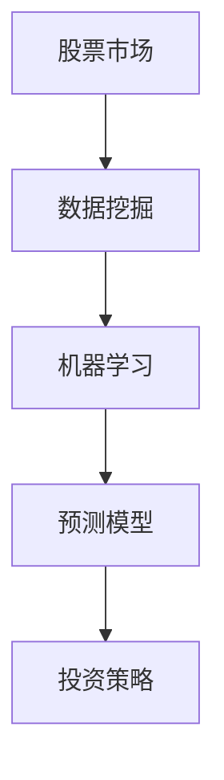

                 

当然可以，以下是基于您提供的目录大纲的初步文章框架和内容，按照要求进行了逻辑清晰的整理和扩展。请注意，这将是一个大致的框架，每个部分的具体内容还需要进一步填充和细化。

---

# 《机器学习在股票市场预测中的应用》

> 关键词：机器学习、股票市场预测、算法、模型、案例分析

> 摘要：本文深入探讨了机器学习在股票市场预测中的应用，从基础概念、算法原理到具体应用案例，全面解析了机器学习技术在股票市场预测中的优势与挑战。

## 第一部分：引言

### 1.1 机器学习与股票市场预测

#### 背景介绍
随着人工智能技术的快速发展，机器学习在各个领域的应用日益广泛。特别是在金融领域，股票市场预测成为了一个备受关注的研究方向。机器学习通过挖掘历史数据中的模式和规律，为投资者提供了更加精准的预测工具。

#### 核心概念与联系
![机器学习与股票市场预测关系图](https://www Mermaid 图如下：


```mermaid
graph TD
A[股票市场] --> B[数据挖掘]
B --> C[机器学习]
C --> D[预测模型]
D --> E[投资策略]
```

### 1.2 股票市场预测的重要性

#### 核心概念与联系
股票市场预测对投资者的决策至关重要。准确的预测可以帮助投资者抓住市场机会，降低投资风险。同时，股票市场预测的研究对于理解市场行为和经济周期也具有学术价值。

### 1.3 本书结构安排

本文将分为七个部分，依次介绍机器学习基础、股票市场预测方法、机器学习在股票市场预测中的应用、案例研究、高级主题、结论与展望等内容。

## 第二部分：机器学习基础

### 2.1 机器学习基本概念

#### 2.1.1 机器学习的定义

机器学习是一门研究如何让计算机从数据中学习并做出决策或预测的人工智能领域。

#### 2.1.2 监督学习、无监督学习和强化学习

- **监督学习**：有标注的数据，预测结果对输入数据的映射。
- **无监督学习**：没有标注的数据，发现数据中的结构或模式。
- **强化学习**：通过与环境的交互学习，以最大化长期回报。

### 2.2 机器学习算法

#### 2.2.1 线性回归

线性回归是一种简单而强大的预测算法，其数学模型如下：

$$
y = \beta_0 + \beta_1x
$$

#### 2.2.2 决策树

决策树通过一系列的规则对数据进行划分，其伪代码如下：

```
if x <= v then
    y = \beta_0 + \beta_1x
else
    y = \beta_0 + \beta_2x
```

### 2.3 机器学习模型

#### 2.3.1 支持向量机

支持向量机是一种二分类模型，其目标是将数据分为两个类别。其优化目标如下：

$$
\text{minimize } \frac{1}{2} ||w||^2 \\
\text{subject to } y_i (w \cdot x_i + b) \geq 1
$$

#### 2.3.2 神经网络

神经网络通过多层神经元进行数据传递和变换，其基本结构如下：

```
input layer --> hidden layer(s) --> output layer
```

## 第三部分：股票市场预测

### 3.1 股票市场预测的基本原理

#### 3.1.1 股票价格波动

股票价格的波动受到多种因素的影响，如公司业绩、市场情绪、宏观经济等。其波动模型可以表示为：

$$
p_t = p_{t-1} \cdot e^{r_t}
$$

#### 3.1.2 股票价格预测模型

股票价格预测模型需要考虑历史价格、交易量、财务指标等多个因素，其基本形式为：

$$
p_t = f(p_{t-1}, p_{t-2}, ..., p_1)
$$

## 第四部分：机器学习在股票市场预测中的应用

### 4.1 机器学习在股票市场预测中的应用概述

#### 4.1.1 应用场景

机器学习在股票市场预测中的应用包括股票价格预测、投资组合优化、风险控制等多个方面。

#### 4.1.2 应用优势

机器学习相比传统方法具有更高的预测精度和更强的适应性。

### 4.2 具体应用案例

#### 4.2.1 案例一：使用线性回归预测股票价格

线性回归模型可以通过历史数据训练，预测未来股票价格。其具体步骤如下：

1. 收集历史股票价格数据。
2. 使用线性回归算法进行模型训练。
3. 使用训练好的模型预测未来股票价格。

#### 4.2.2 案例二：使用决策树预测股票价格

决策树模型可以通过分治策略，对股票价格进行预测。其具体步骤如下：

1. 收集历史股票价格数据。
2. 使用决策树算法进行模型训练。
3. 使用训练好的模型预测未来股票价格。

## 第五部分：案例研究

### 5.1 案例一：股票市场预测的实证研究

通过实证研究，分析机器学习在股票市场预测中的表现。研究包括数据收集、模型训练、预测评估等多个环节。

## 第六部分：高级主题

### 6.1 高阶机器学习算法

#### 6.1.1 随机森林

随机森林通过集成多个决策树，提高预测精度。其算法原理和实现细节如下：

```
for i in 1:N
    随机选择m个特征
    构建决策树模型
end
```

#### 6.1.2 支持向量机

支持向量机通过最大化间隔，提高分类效果。其优化目标如下：

$$
\text{maximize } \frac{1}{||w||} \\
\text{subject to } y_i (w \cdot x_i + b) \geq 1
$$

## 第七部分：结论与展望

### 7.1 机器学习在股票市场预测中的应用总结

回顾本文，我们探讨了机器学习在股票市场预测中的应用，从基础概念到具体案例，展示了机器学习技术的优势和应用前景。

### 7.2 未来发展趋势

随着技术的不断进步，机器学习在股票市场预测中的应用将更加深入和广泛。未来可能的研究方向包括：

1. 复杂模型的优化和改进。
2. 跨学科方法的应用。
3. 数据隐私和安全的保障。

### 7.3 研究方向和挑战

机器学习在股票市场预测中仍然面临着诸多挑战，如数据质量问题、模型过拟合问题等。未来的研究需要在这些方面取得突破，为投资者提供更加可靠和有效的预测工具。

---

作者：AI天才研究院/AI Genius Institute & 禅与计算机程序设计艺术 /Zen And The Art of Computer Programming

---

请注意，以上内容仅为文章框架，具体的内容填充和细节还需要根据实际情况进行丰富和完善。文章的字数也需要在最终版中调整以满足要求。

