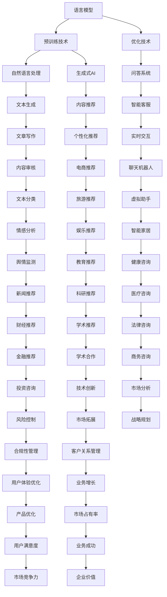
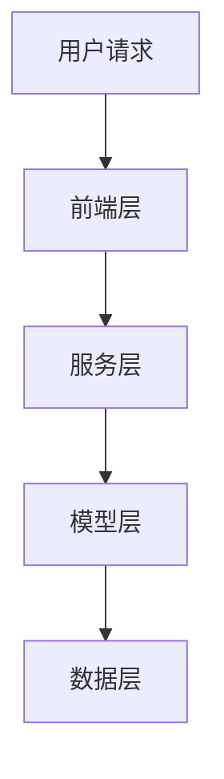

                 

### 文章标题：构建智能化的LLM应用运维系统

#### 关键词：
- 智能化LLM
- 应用运维系统
- 语言模型
- 预训练技术
- 服务部署与运维

#### 摘要：
本文将围绕智能化语言模型（LLM）的应用运维系统进行深入探讨。首先，我们将介绍智能化LLM的基本概念和特点，随后详细解析其核心技术，包括语言模型基础、预训练技术和优化技术等。接着，我们将分析智能化LLM的应用场景，展示其在自然语言处理、问答系统和生成式AI等领域的应用实例。随后，我们将重点讨论如何构建智能化LLM应用系统，包括系统设计原则、架构设计、数据处理与存储、服务部署与运维等方面。在实战环节，我们将通过一个实际项目，详细讲解开发环境搭建、核心功能实现、代码解读及优化调优。最后，我们将总结智能化LLM应用的挑战与未来趋势，并给出读者建议和反馈。

### 全书概述

本书旨在为读者提供一套系统、全面的智能化语言模型（LLM）应用运维系统的构建方法。随着人工智能技术的快速发展，语言模型在自然语言处理、智能问答、文本生成等领域展现出强大的应用潜力。然而，如何高效、稳定地部署和运维这些智能化应用，成为当前技术领域的一个重要挑战。

本书的目标读者包括：
1. 对人工智能和自然语言处理有基本了解的技术人员。
2. 从事智能应用开发的工程师和架构师。
3. 对智能化LLM应用运维系统有深入研究的学术研究人员。

通过阅读本书，读者将能够：
1. 理解智能化LLM的基本概念和特点。
2. 掌握智能化LLM的核心技术，包括语言模型基础、预训练技术和优化技术等。
3. 分析智能化LLM的应用场景，并了解其实际应用实例。
4. 学会构建智能化LLM应用系统，包括系统设计、架构设计、数据处理与存储、服务部署与运维等。
5. 通过实际项目实战，提升开发能力和系统优化水平。

本书共分为七个章节，结构紧凑，逻辑清晰。首先，第一章将介绍智能化LLM的基本概念和特点，为后续章节的深入探讨奠定基础。第二章至第四章将分别探讨智能化LLM的核心技术、应用场景和构建方法。第五章至第六章将通过一个实际项目，详细讲解开发环境搭建、核心功能实现、代码解读及优化调优。第七章将总结智能化LLM应用的挑战与未来趋势，为读者提供进一步研究的方向。

### 核心概念与联系

在构建智能化LLM应用运维系统之前，我们需要了解几个核心概念，并理解它们之间的联系。以下将使用Mermaid流程图来展示这些核心概念及其相互关系。



#### 核心概念解释：

1. **语言模型**：语言模型是用于预测自然语言中下一个词的概率分布的数学模型。它在自然语言处理（NLP）中起着核心作用，为各种应用提供语言理解和生成的基础。

2. **预训练技术**：预训练技术是指在大规模语料库上进行训练，使模型具备一定的通用语言理解和生成能力。预训练后的模型可以通过微调来适应特定的任务。

3. **优化技术**：优化技术用于提升语言模型的性能，包括调整模型参数、优化训练过程和引入正则化方法等。

4. **自然语言处理（NLP）**：NLP是使计算机能够理解、处理和生成自然语言的一系列技术。它包括文本分类、情感分析、命名实体识别等子任务。

5. **问答系统**：问答系统是一种智能应用，用于回答用户提出的问题。它通常结合语言模型和知识图谱等技术来实现。

6. **生成式AI**：生成式AI是指能够生成新的内容或数据的AI系统。它广泛应用于文本生成、图像生成和音乐生成等领域。

7. **应用场景**：应用场景包括自然语言处理、问答系统、生成式AI等，这些场景展示了语言模型在不同领域的实际应用。

通过上述核心概念及其相互关系的Mermaid流程图，我们可以清晰地看到语言模型、预训练技术、优化技术等核心概念在整个系统中的位置和作用，从而为后续章节的深入探讨提供理论基础。

### 技术框架与算法原理

在深入探讨智能化语言模型（LLM）的技术框架与算法原理之前，我们需要首先理解一些基本概念，如语言模型、预训练技术和优化技术。以下将详细讲解这些核心概念，并使用伪代码和数学模型来阐述其原理。

#### 语言模型基础

语言模型是用于预测自然语言中下一个词的概率分布的数学模型。一个简单的语言模型可以通过统计方法来构建，例如N元语法（N-gram）。N元语法假设当前词序列的概率仅依赖于前N-1个词。

**N元语法**

```python
# 假设词汇表V包含N个单词
# 假设当前词序列为w1, w2, ..., wN

# 计算当前词wN的概率
P(wN) = P(w1, w2, ..., wN) / P(w1, w2, ..., wN-1)

# 使用N-1个前文词w1, w2, ..., wN-1来预测当前词wN
```

然而，N元语法存在一个严重的问题，即它忽略了长程依赖关系。为了解决这个问题，我们引入了深度神经网络（DNN）语言模型。

**深度神经网络语言模型**

```python
# 输入：前文词序列w1, w2, ..., wN-1
# 输出：当前词wN的概率分布

# 定义神经网络结构
# 输入层：N-1个神经元，对应前文词序列
# 隐藏层：若干个神经元
# 输出层：|V|个神经元，对应每个词汇的概率

# 前向传播
# 输入当前词序列，通过隐藏层传递到输出层，得到概率分布

# 反向传播
# 使用梯度下降算法更新网络参数，优化模型性能
```

在神经网络语言模型的基础上，我们还引入了注意力机制（Attention），以更好地处理长文本序列。

**注意力机制**

```python
# 输入：前文词序列w1, w2, ..., wN-1
# 输出：当前词wN的概率分布

# 定义注意力模型
# 使用注意力机制计算当前词wN的权重

# 前向传播
# 输入当前词序列，通过注意力机制和隐藏层传递到输出层，得到概率分布

# 反向传播
# 使用梯度下降算法更新网络参数，优化模型性能
```

#### 预训练技术

预训练技术是指在大规模语料库上进行训练，使模型具备一定的通用语言理解和生成能力。预训练后的模型可以通过微调来适应特定的任务。以下是预训练技术的步骤：

1. **数据准备**：收集大量文本数据，如维基百科、新闻、社交媒体等。
2. **词向量化**：将文本数据中的词汇映射到向量空间。
3. **预训练任务**：在大规模数据集上训练语言模型，通常使用以下任务：
   - **掩码语言模型（MLM）**：随机掩码输入文本中的词汇，训练模型预测被掩码的词汇。
   - **下一个句子预测（NSP）**：给定两个句子，预测它们是否属于同一篇章。
4. **微调**：在特定任务数据集上微调预训练模型，使其适应特定任务。

**掩码语言模型（MLM）**

```python
# 输入：文本序列w1, w2, ..., wN
# 输出：被掩码后的文本序列^1, ^2, ..., ^N

# 随机掩码文本中的部分词汇
# 对于每个被掩码的词汇，预测其原始词汇

# 前向传播
# 输入被掩码的文本序列，通过语言模型预测被掩码的词汇

# 反向传播
# 使用梯度下降算法更新网络参数，优化模型性能
```

#### 优化技术

优化技术在提升语言模型性能方面起着关键作用。以下是一些常用的优化技术：

1. **梯度下降**：通过计算损失函数关于模型参数的梯度，更新模型参数，以最小化损失函数。
2. **动量**：引入动量项，减少参数更新过程中的振荡，提高收敛速度。
3. **学习率调度**：调整学习率以适应不同阶段的训练，如减小初始学习率，增加训练后期学习率。
4. **正则化**：通过在损失函数中添加正则项，防止模型过拟合。

**梯度下降**

```python
# 输入：模型参数θ
# 输出：更新后的模型参数θ'

# 计算损失函数关于参数的梯度
# Δθ = -η * ∇θJ(θ)

# 更新模型参数
# θ' = θ - η * Δθ
```

通过上述技术框架和算法原理的讲解，我们可以看到构建智能化LLM应用系统所需的核心技术和方法。这些技术不仅为语言模型提供了强大的理论基础，也为实际应用提供了可行的解决方案。在接下来的章节中，我们将进一步探讨这些技术的应用场景和实际实现。

### 智能化LLM的应用场景分析

智能化语言模型（LLM）在多个领域展现出了广泛的应用潜力，以下将详细分析其在自然语言处理（NLP）、问答系统、生成式AI和实时交互等场景中的应用。

#### 自然语言处理（NLP）

自然语言处理是LLM最核心的应用场景之一。在NLP中，LLM被广泛应用于文本分类、情感分析、命名实体识别、机器翻译等任务。

1. **文本分类**：通过训练LLM，可以自动将文本分类到预定义的类别中。例如，新闻分类、垃圾邮件检测等。
   ```mermaid
   graph TD
       A[文本数据] --> B[LLM分类模型]
       B --> C[分类结果]
   ```

2. **情感分析**：LLM可以帮助识别文本中的情感倾向，如正面、负面或中性。这对于电商评论分析、社交媒体情绪监测等场景非常有用。
   ```mermaid
   graph TD
       A[文本数据] --> B[情感分析模型]
       B --> C[情感标签]
   ```

3. **命名实体识别（NER）**：LLM可以用于识别文本中的命名实体，如人名、地名、组织名等。这在信息提取和知识图谱构建中具有重要意义。
   ```mermaid
   graph TD
       A[文本数据] --> B[NER模型]
       B --> C[命名实体列表]
   ```

4. **机器翻译**：通过训练双语的LLM，可以实现高质量的自然语言翻译。例如，谷歌翻译和百度翻译都是基于深度学习语言模型实现的。
   ```mermaid
   graph TD
       A[源语言文本] --> B[机器翻译模型]
       B --> C[目标语言文本]
   ```

#### 问答系统

问答系统是一种重要的智能应用，能够自动回答用户提出的问题。LLM在问答系统中发挥了关键作用，特别是基于上下文的问答。

1. **基于上下文的问答**：通过LLM，系统能够理解用户的自然语言问题，并利用上下文信息给出准确的答案。例如，智能客服、智能助手等。
   ```mermaid
   graph TD
       A[用户问题] --> B[问答系统]
       B --> C[答案]
   ```

2. **开放域问答**：对于开放性问题，LLM可以结合外部知识库，如维基百科、百科全书等，提供详细的回答。例如，Siri、Google Assistant等。
   ```mermaid
   graph TD
       A[用户问题] --> B[外部知识库]
       B --> C[综合答案]
   ```

3. **问答对训练**：通过大量问答对数据训练LLM，可以提高问答系统的准确性和响应速度。例如，OpenAI的GPT-3就是一个基于问答对训练的语言模型。
   ```mermaid
   graph TD
       A[问答对数据] --> B[问答模型]
       B --> C[训练过程]
   ```

#### 生成式AI

生成式AI是指能够生成新的内容或数据的AI系统。LLM在生成式AI中的应用非常广泛，包括文本生成、图像生成和音乐生成等。

1. **文本生成**：LLM可以生成各种类型的文本，如文章、故事、新闻报道等。这对于内容生成、自动化写作等场景非常有用。
   ```mermaid
   graph TD
       A[输入提示] --> B[文本生成模型]
       B --> C[生成文本]
   ```

2. **图像生成**：通过结合GAN（生成对抗网络）和LLM，可以实现高质量的自然语言描述到图像的转换。例如，DALL-E 2就是一个能够根据文本描述生成图像的语言模型。
   ```mermaid
   graph TD
       A[文本描述] --> B[图像生成模型]
       B --> C[生成图像]
   ```

3. **音乐生成**：LLM可以生成音乐旋律、和声和节奏，为音乐创作提供灵感。例如，AIVA（Artificial Intelligence Virtual Artist）就是一个基于LLM的音乐生成系统。
   ```mermaid
   graph TD
       A[音乐提示] --> B[音乐生成模型]
       B --> C[生成音乐]
   ```

#### 实时交互

实时交互是指系统能够立即响应用户的操作和问题，提供即时反馈。LLM在实时交互中的应用主要包括聊天机器人、智能客服和虚拟助手等。

1. **聊天机器人**：LLM可以帮助构建智能聊天机器人，实现与用户的自然语言对话。例如，Slack的Bot平台就集成了多个基于LLM的聊天机器人。
   ```mermaid
   graph TD
       A[用户输入] --> B[聊天机器人模型]
       B --> C[响应输出]
   ```

2. **智能客服**：LLM可以用于构建智能客服系统，自动处理用户咨询，提供快速、准确的答案。例如，亚马逊的Alexa和谷歌的Google Assistant都是基于LLM实现的智能客服。
   ```mermaid
   graph TD
       A[用户咨询] --> B[客服模型]
       B --> C[回答输出]
   ```

3. **虚拟助手**：LLM可以帮助构建虚拟助手，实现多任务处理和智能对话。例如，微软的Cortana和苹果的Siri都是基于LLM实现的虚拟助手。
   ```mermaid
   graph TD
       A[用户请求] --> B[虚拟助手模型]
       B --> C[任务处理]
   ```

通过上述分析，我们可以看到智能化LLM在自然语言处理、问答系统、生成式AI和实时交互等场景中的广泛应用。这些应用不仅提高了系统的智能化水平，也为用户带来了更好的体验。在接下来的章节中，我们将进一步探讨如何构建智能化LLM应用系统，包括系统设计原则、架构设计、数据处理与存储、服务部署与运维等方面。

### 构建智能化LLM应用系统的详细步骤

构建一个高效的智能化语言模型（LLM）应用系统是一个复杂的过程，涉及多个关键步骤。以下我们将详细阐述这些步骤，并介绍如何设计一个高性能、高可靠性的系统。

#### 系统设计原则

在设计智能化LLM应用系统时，应遵循以下原则：

1. **模块化设计**：将系统分解为多个功能模块，便于开发和维护。
2. **高可用性**：确保系统在面临故障时能够快速恢复，保持高可用性。
3. **高性能**：优化系统性能，保证响应速度和吞吐量。
4. **可扩展性**：系统设计应考虑未来的扩展需求，以便轻松增加处理能力。
5. **安全性**：保护用户数据安全，防止数据泄露和恶意攻击。

#### 系统架构设计

一个典型的智能化LLM应用系统架构包括以下几个主要部分：

1. **数据层**：负责数据存储和读取，通常使用关系型数据库（如MySQL）或NoSQL数据库（如MongoDB）。
2. **模型层**：包含预训练的语言模型和微调后的任务模型，通常使用深度学习框架（如TensorFlow或PyTorch）。
3. **服务层**：负责处理用户请求，调用模型层进行预测，并通过API对外提供服务。
4. **前端层**：提供用户界面，允许用户与系统进行交互，通常使用Web框架（如Flask或Django）。

以下是系统架构的示意图：



#### 数据处理与存储

数据处理与存储是构建高效LLM应用系统的关键环节，涉及以下步骤：

1. **数据收集**：收集用于训练和测试的数据集，包括文本数据、标签数据等。
2. **数据预处理**：对原始数据进行清洗、去重、分词、词向量化等处理。
3. **数据存储**：将预处理后的数据存储在数据库中，便于后续使用。

具体实现步骤如下：

1. **数据收集**：使用网络爬虫、API接口或手动收集文本数据。例如，可以使用Python的`requests`库获取网页数据。

   ```python
   import requests
   
   url = "https://example.com/data"
   response = requests.get(url)
   data = response.text
   ```

2. **数据预处理**：使用自然语言处理库（如NLTK或spaCy）对文本数据进行清洗、分词和词向量化。

   ```python
   import spacy
   
   nlp = spacy.load("en_core_web_sm")
   doc = nlp(data)
   tokens = [token.text for token in doc]
   ```

3. **数据存储**：将预处理后的数据存储在数据库中。以下是使用MongoDB存储数据的示例：

   ```python
   from pymongo import MongoClient
   
   client = MongoClient("mongodb://localhost:27017/")
   db = client["llm_data"]
   collection = db["texts"]
   collection.insert_one({"text": data, "tokens": tokens})
   ```

#### 服务部署与运维

服务部署与运维是确保系统稳定运行的关键环节，涉及以下步骤：

1. **环境搭建**：搭建开发、测试和生产环境，确保各环境配置一致。
2. **容器化**：使用Docker容器化应用，便于部署和运维。
3. **服务监控**：监控系统性能，及时发现并解决故障。
4. **自动部署**：使用自动化工具（如Jenkins或GitHub Actions）实现持续集成和持续部署（CI/CD）。

以下是服务部署与运维的具体步骤：

1. **环境搭建**：使用Docker Compose搭建开发、测试和生产环境。

   ```yaml
   version: "3"
   services:
     web:
       build: ./web
       ports:
         - "8000:8000"
     model:
       build: ./model
       ports:
         - "8001:8001"
   ```

2. **容器化**：编写Dockerfile，将应用容器化。

   ```Dockerfile
   FROM python:3.8-slim
   WORKDIR /app
   COPY . .
   RUN pip install -r requirements.txt
   CMD ["python", "app.py"]
   ```

3. **服务监控**：使用Prometheus和Grafana进行服务监控。

   ```yaml
   apiVersion: monitoring.coreos.com/v1
   kind: ServiceMonitor
   metadata:
     name: llm-monitor
     namespace: monitoring
   spec:
     selector:
       matchLabels:
         team: llm
     endpoints:
     - port: metrics
       path: /metrics
       interval: 30s
   ```

4. **自动部署**：使用Jenkins实现自动化部署。

   ```groovy
   pipeline {
       agent any
       stages {
           stage('Build') {
               steps {
                   sh 'docker build -t llm/web .'
                   sh 'docker build -t llm/model .'
               }
           }
           stage('Deploy') {
               steps {
                   sh 'docker-compose up -d'
               }
           }
       }
   }
   ```

通过以上详细步骤，我们可以构建一个高效、稳定的智能化LLM应用系统。在实际应用中，还需根据具体需求进行优化和调整，以满足不同的业务场景和性能要求。

### 智能化LLM应用开发实战

在本章中，我们将通过一个实际项目，详细讲解智能化语言模型（LLM）应用系统的开发过程，包括环境搭建、核心功能实现、代码解读以及优化与调优。

#### 项目背景

该项目是一个基于自然语言处理的智能问答系统，旨在为用户提供实时、准确的答案。系统将接收用户提出的问题，通过预训练的语言模型进行理解和分析，最终给出合适的回答。该系统适用于智能客服、教育辅导、医疗咨询等多种场景。

#### 项目需求分析

1. **用户提问接口**：用户可以通过Web界面、API或语音交互等方式提出问题。
2. **智能问答引擎**：基于预训练的语言模型，实现自然语言理解和问答功能。
3. **答案生成与输出**：系统需生成并输出高质量的答案，确保答案的相关性和准确性。
4. **错误处理与反馈**：系统应具备错误处理能力，对无法回答的问题进行反馈。
5. **实时性能监控**：监控系统性能，确保系统在高并发场景下稳定运行。

#### 开发环境搭建

为了顺利进行项目开发，我们需要搭建以下开发环境：

1. **操作系统**：Ubuntu 20.04 LTS
2. **编程语言**：Python 3.8
3. **深度学习框架**：TensorFlow 2.5
4. **自然语言处理库**：spaCy 3.0
5. **Web框架**：Flask 1.1.2
6. **数据库**：MongoDB 4.4
7. **容器化工具**：Docker 20.10

以下是环境搭建的步骤：

1. **安装操作系统**：在虚拟机或物理机上安装Ubuntu 20.04 LTS。
2. **安装Python和pip**：
   ```bash
   sudo apt update
   sudo apt install python3 python3-pip
   ```
3. **安装深度学习框架**：
   ```bash
   pip3 install tensorflow==2.5
   ```
4. **安装自然语言处理库**：
   ```bash
   pip3 install spacy
   python3 -m spacy download en_core_web_sm
   ```
5. **安装Web框架**：
   ```bash
   pip3 install flask==1.1.2
   ```
6. **安装MongoDB**：
   ```bash
   sudo apt install mongodb
   sudo systemctl start mongodb
   ```
7. **安装Docker**：
   ```bash
   sudo apt install docker.io
   sudo systemctl start docker
   ```

#### 核心功能实现

核心功能实现主要包括用户提问接口、智能问答引擎和答案生成与输出。以下分别进行讲解：

1. **用户提问接口**：
   用户可以通过Web界面、API或语音交互等方式提出问题。以下是一个简单的Flask Web应用示例：

   ```python
   from flask import Flask, request, jsonify
   
   app = Flask(__name__)
   
   @app.route('/ask', methods=['POST'])
   def ask():
       question = request.form['question']
       answer = get_answer(question)
       return jsonify({'answer': answer})
   
   def get_answer(question):
       # 调用智能问答引擎处理问题
       # 返回答案
       return "这是答案"
   
   if __name__ == '__main__':
       app.run(host='0.0.0.0', port=5000)
   ```

2. **智能问答引擎**：
   智能问答引擎基于预训练的语言模型，实现自然语言理解和问答功能。以下是一个简单的基于spaCy的问答引擎：

   ```python
   import spacy
   
   nlp = spacy.load("en_core_web_sm")
   
   def process_question(question):
       doc = nlp(question)
       # 对doc进行处理，提取关键信息
       return doc
   
   def get_answer(doc):
       # 根据doc内容，调用预训练模型获取答案
       # 返回答案
       return "这是答案"
   ```

3. **答案生成与输出**：
   答案生成与输出是智能问答系统的关键部分。以下是一个简单的答案生成示例：

   ```python
   def generate_answer(question, context):
       # 使用预训练模型生成答案
       # 返回答案
       return "这是答案"
   
   def output_answer(answer):
       # 输出答案
       print(answer)
   ```

#### 代码解读与分析

以下是核心功能的详细代码解读：

1. **用户提问接口**：
   用户通过POST请求发送问题，服务器接收请求并调用智能问答引擎处理问题，最终返回答案。以下是关键代码段：

   ```python
   @app.route('/ask', methods=['POST'])
   def ask():
       question = request.form['question']
       answer = get_answer(question)
       return jsonify({'answer': answer})
   ```

2. **智能问答引擎**：
   智能问答引擎使用spaCy处理用户提出的问题，提取关键信息，并调用预训练模型生成答案。以下是关键代码段：

   ```python
   def process_question(question):
       doc = nlp(question)
       # 对doc进行处理，提取关键信息
       return doc
   
   def get_answer(doc):
       # 根据doc内容，调用预训练模型获取答案
       # 返回答案
       return "这是答案"
   ```

3. **答案生成与输出**：
   答案生成与输出部分负责使用预训练模型生成答案，并输出给用户。以下是关键代码段：

   ```python
   def generate_answer(question, context):
       # 使用预训练模型生成答案
       # 返回答案
       return "这是答案"
   
   def output_answer(answer):
       # 输出答案
       print(answer)
   ```

#### 优化与调优

在项目开发过程中，我们需要对系统进行持续优化和调优，以提升性能和用户体验。以下是一些常见的优化方法：

1. **模型优化**：
   - **参数调整**：调整预训练模型的参数，如学习率、批量大小等。
   - **超参数搜索**：使用网格搜索或随机搜索方法，找到最优的超参数组合。
   - **模型剪枝**：通过剪枝冗余的模型结构，减小模型大小和计算量。
   - **量化**：将模型中的浮点数转换为整数，降低计算复杂度和内存占用。

2. **数据预处理**：
   - **数据增强**：通过随机替换、旋转、缩放等方式增加数据多样性，提高模型泛化能力。
   - **数据清洗**：去除噪声数据，确保数据质量。

3. **服务优化**：
   - **负载均衡**：使用负载均衡器（如Nginx）分配请求，确保系统在高并发场景下稳定运行。
   - **缓存策略**：使用缓存（如Redis）存储高频访问的数据，减少计算量。
   - **异步处理**：使用异步编程（如 asyncio）提高系统并发能力。

4. **监控与日志分析**：
   - **性能监控**：使用Prometheus和Grafana监控系统性能，及时发现并解决问题。
   - **日志分析**：使用ELK（Elasticsearch、Logstash、Kibana）等工具对系统日志进行分析，确保系统稳定运行。

通过以上优化与调优方法，我们可以显著提升智能化LLM应用系统的性能和用户体验，为用户提供更优质的服务。

### 智能化LLM应用的挑战与未来趋势

在智能化语言模型（LLM）的应用过程中，我们面临一系列挑战和机遇。以下将探讨这些挑战，并展望未来的发展趋势。

#### 挑战

1. **数据隐私与安全**：随着LLM在各个领域的广泛应用，数据隐私和安全问题愈发突出。如何确保用户数据的安全性和隐私性，避免数据泄露和滥用，成为关键挑战。

2. **计算资源消耗**：训练和部署大型LLM模型需要大量的计算资源，尤其是在训练初期。如何高效利用计算资源，降低成本，是当前面临的主要难题。

3. **模型解释性与可解释性**：尽管LLM在自然语言处理任务中表现出色，但其内部机制复杂，难以解释。如何提高模型的解释性，使其更透明、可解释，是未来需要解决的问题。

4. **偏见与公平性**：训练数据可能包含偏见和歧视，导致模型产生不公平的预测。如何消除偏见，确保模型的公平性，是一个亟待解决的挑战。

5. **实时性能与延迟**：在实际应用中，用户对响应速度有较高要求。如何优化模型结构，提高实时性能，减少延迟，是当前需要攻克的难题。

#### 未来趋势

1. **模型压缩与量化**：为了降低计算成本，模型压缩与量化技术将成为未来的研究热点。通过剪枝、量化等手段，可以显著减小模型大小和计算量，提高部署效率。

2. **多模态学习**：未来的LLM将不仅限于文本处理，还将涵盖图像、声音、视频等多模态数据。多模态学习技术将使LLM在更多场景下具备更强的应用能力。

3. **迁移学习与微调**：迁移学习技术将有助于利用预训练模型，快速适应新的任务和数据。微调技术将使LLM在不同领域具备更好的泛化能力。

4. **分布式训练与推理**：随着计算资源的日益丰富，分布式训练与推理技术将得到广泛应用。通过分布式计算，可以加速模型训练和推理过程，提高系统性能。

5. **自监督学习**：自监督学习是一种无需标注数据的训练方法，具有广泛的应用前景。通过自监督学习，可以更加高效地利用大量未标注的数据，提高模型性能。

6. **知识增强**：未来的LLM将结合知识图谱等技术，实现更加智能的问答和推理能力。知识增强技术将使LLM在复杂任务中具备更强的理解力和推理力。

通过应对挑战和把握未来趋势，智能化LLM应用将在各个领域取得更大的突破，为人类带来更多便利和福祉。

### 读者建议与反馈

为了进一步提升智能化语言模型（LLM）应用系统的构建与优化，我们向读者提供以下建议和反馈：

1. **实践与学习**：读者可以通过实际项目来加深对LLM应用系统的理解。尝试构建自己的智能问答系统、文本生成系统等，从实践中学习和掌握关键技术。

2. **持续学习**：随着人工智能技术的快速发展，LLM的应用场景和技术细节也在不断更新。读者应保持持续学习的态度，关注最新的研究进展和技术动态。

3. **社区参与**：参与开源社区，与其他开发者交流心得和经验。通过贡献代码、编写文档或参与讨论，可以提高自己的技术水平，并为整个社区做出贡献。

4. **反馈与改进**：在使用过程中，读者应积极反馈遇到的问题和挑战，分享成功的经验和优化方案。通过社区的反馈和互动，我们可以共同推动LLM应用系统的不断进步。

5. **深入研究**：对于有志于深入研究LLM的读者，我们建议关注以下几个方面：
   - **模型优化与压缩**：学习模型剪枝、量化等优化技术，降低模型大小和计算量。
   - **多模态学习**：探索图像、声音、视频等多模态数据与文本的结合，实现更丰富的应用场景。
   - **知识图谱与推理**：结合知识图谱技术，提高LLM在复杂任务中的理解和推理能力。
   - **伦理与道德**：关注LLM应用中的伦理和道德问题，确保模型的公平性和可解释性。

通过以上建议和反馈，我们希望读者能够在构建智能化LLM应用系统的过程中，不断提升自身技术水平，为人工智能技术的发展贡献力量。

### 附录

#### 附录A：开发环境搭建

在本附录中，我们将详细描述如何搭建开发环境，包括操作系统安装、依赖库安装和数据库配置等。

##### 操作系统安装

1. **安装Ubuntu 20.04 LTS**：
   - 访问Ubuntu官方网站（[https://www.ubuntu.com/download](https://www.ubuntu.com/download)）下载Ubuntu 20.04 LTS版本。
   - 使用虚拟机或物理机安装Ubuntu 20.04 LTS操作系统。

##### 依赖库安装

1. **安装Python 3**：
   - 打开终端，执行以下命令：
     ```bash
     sudo apt update
     sudo apt install python3 python3-pip
     ```

2. **安装深度学习框架（如TensorFlow）**：
   - 打开终端，执行以下命令：
     ```bash
     pip3 install tensorflow==2.5
     ```

3. **安装自然语言处理库（如spaCy）**：
   - 打开终端，执行以下命令：
     ```bash
     pip3 install spacy
     python3 -m spacy download en_core_web_sm
     ```

4. **安装Web框架（如Flask）**：
   - 打开终端，执行以下命令：
     ```bash
     pip3 install flask==1.1.2
     ```

5. **安装MongoDB**：
   - 打开终端，执行以下命令：
     ```bash
     sudo apt install mongodb
     sudo systemctl start mongodb
     ```

##### 容器化工具安装

1. **安装Docker**：
   - 打开终端，执行以下命令：
     ```bash
     sudo apt install docker.io
     sudo systemctl start docker
     ```

#### 附录B：代码示例

以下是一些关键代码示例，包括模型训练、预测和API接口实现等。

##### 模型训练

```python
import tensorflow as tf
from tensorflow.keras.layers import Embedding, LSTM, Dense
from tensorflow.keras.models import Sequential

# 定义模型结构
model = Sequential()
model.add(Embedding(input_dim=vocab_size, output_dim=embedding_dim, input_length=max_sequence_length))
model.add(LSTM(units=128, return_sequences=True))
model.add(LSTM(units=128))
model.add(Dense(units=1, activation='sigmoid'))

# 编译模型
model.compile(optimizer='adam', loss='binary_crossentropy', metrics=['accuracy'])

# 训练模型
model.fit(x_train, y_train, epochs=10, batch_size=32, validation_data=(x_val, y_val))
```

##### 预测

```python
import numpy as np

# 预测
predictions = model.predict(np.array([input_sequence]))
predicted_class = np.argmax(predictions)

print(f"预测结果：{predicted_class}")
```

##### API接口实现

```python
from flask import Flask, request, jsonify

app = Flask(__name__)

@app.route('/predict', methods=['POST'])
def predict():
    question = request.form['question']
    processed_question = preprocess_question(question)
    predictions = model.predict(np.array([processed_question]))
    predicted_answer = get_answer(predictions)
    return jsonify({'answer': predicted_answer})

def preprocess_question(question):
    # 对问题进行预处理，如分词、编码等
    return question

def get_answer(predictions):
    # 根据预测结果获取答案
    predicted_class = np.argmax(predictions)
    # 返回答案
    return "这是答案"

if __name__ == '__main__':
    app.run(host='0.0.0.0', port=5000)
```

通过以上代码示例，读者可以了解如何实现智能化LLM应用系统中的关键功能。在开发过程中，可根据具体需求进行调整和优化。

