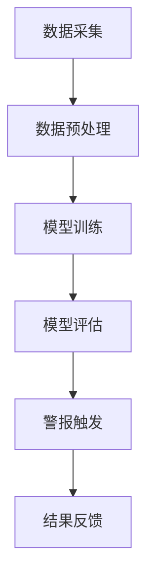
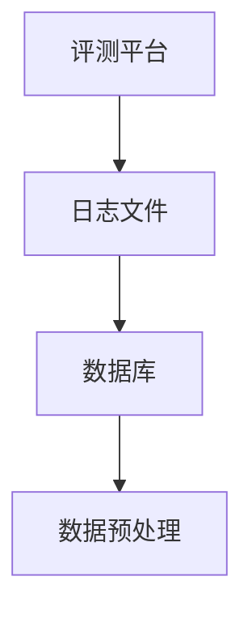
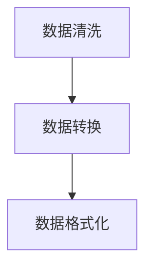
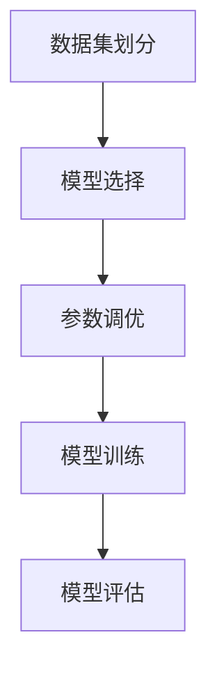
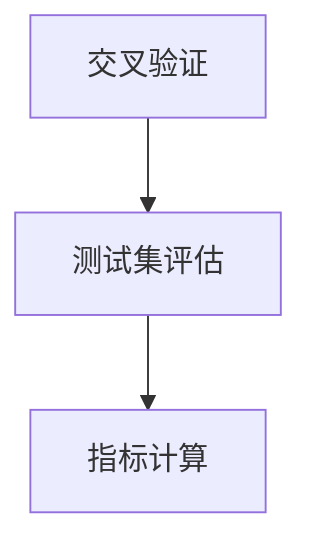
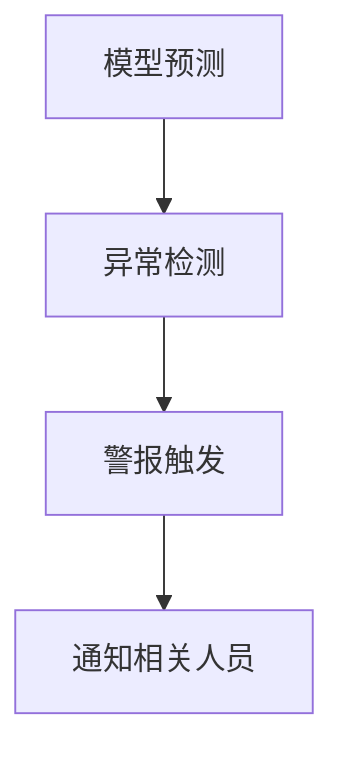
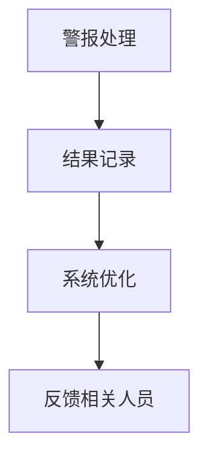

                 


### 文章标题

《构建评测结果的自动化警报系统》

### 关键词

自动化警报系统、评测结果、数据采集、数据预处理、模型训练、模型评估、警报触发

### 摘要

本文旨在构建一个高效、自动化的警报系统，用于检测和响应评测结果中的异常情况。通过详细介绍数据采集、数据预处理、模型训练、模型评估、警报触发以及结果反馈等环节，本文提供了一个系统性、实战性的解决方案，帮助企业或开发者快速构建并优化评测结果的自动化警报系统。

---

### 模型概述与架构图

#### 模型概述

构建评测结果的自动化警报系统，是我们面对大规模评测数据处理时的一项重要任务。这一系统不仅可以帮助我们快速识别异常评测结果，还能够自动触发警报，通知相关人员及时处理。整体架构由以下几个核心环节组成：

1. **数据采集**：从评测平台、日志文件、数据库等多种数据源采集评测结果数据。
2. **数据预处理**：对采集到的评测结果数据进行清洗、转换和格式化，为模型训练做好准备。
3. **模型训练**：使用预处理后的数据训练预测模型，用于识别评测结果中的异常情况。
4. **模型评估**：通过交叉验证和测试集对训练好的模型进行评估，确保模型的准确性。
5. **警报触发**：当模型识别出异常评测结果时，系统将自动触发警报，通知相关人员。
6. **结果反馈**：记录警报处理结果，为系统的优化提供数据支持。

本文将通过逐步分析和推理的方式，详细阐述每个环节的实现细节和关键技术。

#### 架构图

以下是一个简化的架构图，展示了各环节之间的数据流和反馈机制：



这个架构图清晰地展示了整个系统的流程，每个环节都紧密相连，形成一个闭环。通过数据流和反馈机制，系统能够高效地完成评测结果的自动化检测和处理。

---

### 核心概念与联系

#### 核心概念

为了构建一个高效的自动化警报系统，我们需要理解以下几个核心概念：

1. **自动警报系统**：用于监测评测结果，并在检测到异常时自动触发警报的系统。
2. **评测结果**：指在评测过程中产生的各种数据，如测试成绩、错误信息、运行时间等。
3. **数据采集**：从评测平台、日志文件、数据库等不同数据源获取评测结果数据。
4. **数据预处理**：对采集到的评测结果数据进行清洗、转换和格式化，确保数据质量。
5. **模型训练**：使用预处理后的数据训练预测模型，用于识别评测结果中的异常。
6. **模型评估**：通过交叉验证和测试集评估模型性能，确保模型的有效性。
7. **警报触发**：当模型检测到异常评测结果时，自动触发警报，通知相关人员。
8. **结果反馈**：记录警报处理结果，为系统的优化提供数据支持。

#### 联系

这些核心概念之间紧密相连，共同构成了自动化警报系统的整体框架。具体来说，数据流和反馈机制如下：

1. **数据采集**：系统从评测平台、日志文件、数据库等多种数据源获取评测结果数据。
2. **数据预处理**：对采集到的评测结果数据进行清洗、转换和格式化，生成适合模型训练的数据集。
3. **模型训练**：使用预处理后的数据训练预测模型，模型训练的结果将影响后续的警报触发效果。
4. **模型评估**：通过交叉验证和测试集评估模型的准确性、召回率和F1值等指标，以确定模型的性能。
5. **警报触发**：当模型检测到异常评测结果时，系统将自动触发警报，通知相关人员处理。
6. **结果反馈**：记录警报处理结果，并根据反馈结果对系统进行优化和调整。

通过这样的数据流和反馈机制，系统能够实现自动化检测和处理评测结果中的异常情况，提高工作效率和准确性。

---

### 数据采集

#### 数据采集

数据采集是构建自动化警报系统的第一步，也是关键的一步。系统需要从多种数据源采集评测结果数据，以确保覆盖所有可能的情况。以下是一些常见的数据源：

1. **评测平台**：例如在线评测系统、自动化测试平台等，这些平台通常提供API接口，方便系统进行数据采集。
2. **日志文件**：在评测过程中，系统会生成各种日志文件，包括错误日志、运行日志等，这些日志文件是数据采集的重要来源。
3. **数据库**：评测结果通常会存储在数据库中，如MySQL、MongoDB等，系统可以直接查询数据库获取数据。

#### 采集流程

数据采集的具体流程如下：

1. **从评测平台采集数据**：利用API接口，系统定期从评测平台获取最新的评测结果数据。
2. **从日志文件采集数据**：系统定期扫描日志文件，提取有用的评测结果数据。
3. **从数据库采集数据**：系统通过SQL查询语句，从数据库中获取相关的评测结果数据。

以下是数据采集的Mermaid流程图：



通过这样的流程，系统能够全面、高效地采集到评测结果数据，为后续的数据预处理和模型训练提供基础。

---

### 数据预处理

#### 数据预处理

数据预处理是构建自动化警报系统的关键步骤之一，它决定了后续模型训练的效果。数据预处理的主要目的是清洗、转换和格式化采集到的评测结果数据，确保数据质量，以便为模型训练提供准确、有效的数据。

#### 数据预处理步骤

1. **数据清洗**：清洗数据的主要目的是去除噪声和异常值。具体包括：
   - 删除重复记录：确保数据的一致性。
   - 填补缺失值：使用合适的插补方法填补缺失数据。
   - 标准化数据：对不同特征进行归一化或标准化处理，使其具有相同的尺度。

2. **数据转换**：数据转换包括将数据从一种格式转换为另一种格式，或对数据进行特征提取和转换。例如：
   - 字符串转换为数值：将文本数据转换为数值数据，便于模型处理。
   - 特征工程：提取新的特征，或对原始特征进行转换，以提高模型的准确性。

3. **数据格式化**：将清洗和转换后的数据格式化为适合模型训练的格式。例如：
   - 创建特征矩阵：将所有特征数据排列成矩阵形式，以便输入到模型中。
   - 分离标签：将特征数据和标签数据分离，为模型训练做准备。

#### 数据预处理流程

以下是数据预处理的具体流程：

1. **数据清洗**：
   - 删除重复记录。
   - 填补缺失值：可以使用均值、中位数或插值法进行填补。
   - 标准化数据：使用Z-Score标准化或Min-Max标准化。

2. **数据转换**：
   - 将文本数据转换为数值数据。
   - 进行特征提取和转换。

3. **数据格式化**：
   - 创建特征矩阵。
   - 分离标签。

以下是数据预处理流程的Mermaid图：



通过这样的数据预处理流程，系统能够获得高质量、适合模型训练的数据，为后续的模型训练和警报触发打下坚实的基础。

---

### 模型训练

#### 模型训练

模型训练是构建自动化警报系统的核心环节，它决定了系统能否准确识别评测结果中的异常。通过训练，模型将学习到如何从数据中提取特征，并利用这些特征进行预测。

#### 模型训练流程

1. **数据集划分**：首先，将数据集划分为训练集和测试集，用于模型训练和评估。
   - **训练集**：用于训练模型，使其学习如何识别异常。
   - **测试集**：用于评估模型性能，确保模型在未知数据上的表现良好。

2. **模型选择**：根据业务需求和数据特性选择合适的模型。常见的选择包括：
   - **分类模型**：如逻辑回归、支持向量机（SVM）、决策树、随机森林等。
   - **聚类模型**：如K-means、DBSCAN等，用于对数据点进行聚类分析。

3. **参数调优**：调整模型参数，以优化模型性能。常见的方法包括：
   - **网格搜索**：遍历参数空间，找到最优参数组合。
   - **贝叶斯优化**：使用贝叶斯统计模型进行参数优化。

4. **模型训练**：使用训练集对模型进行训练，模型将学习到如何从数据中提取特征，并利用这些特征进行预测。

5. **模型评估**：使用测试集对训练好的模型进行评估，以确定模型的准确性、召回率和F1值等指标。

以下是模型训练流程的Mermaid图：



通过这样的模型训练流程，系统能够训练出一个准确、高效的预测模型，为后续的警报触发提供坚实的基础。

---

### 模型评估

#### 模型评估

模型评估是构建自动化警报系统的重要环节，它决定了模型在实际应用中的性能。通过评估，我们可以确定模型在识别评测结果异常方面的效果，并对其进行优化。

#### 评估指标

在模型评估中，常用的指标包括准确率、召回率、F1值等。这些指标有助于我们全面了解模型的性能。

1. **准确率（Accuracy）**：表示模型预测正确的样本数占总样本数的比例。
   $$\text{准确率} = \frac{\text{预测正确的样本数}}{\text{总样本数}}$$

2. **召回率（Recall）**：表示模型预测正确的正样本数占总正样本数的比例。
   $$\text{召回率} = \frac{\text{预测正确的正样本数}}{\text{实际正样本数}}$$

3. **F1值（F1 Score）**：是准确率和召回率的调和平均值，用于综合考虑模型的精确性和召回性。
   $$\text{F1值} = 2 \times \frac{\text{准确率} \times \text{召回率}}{\text{准确率} + \text{召回率}}$$

#### 评估流程

模型评估的具体流程如下：

1. **交叉验证**：通过交叉验证，将数据集划分为多个子集，轮流作为训练集和验证集，以评估模型在不同数据集上的性能。

2. **测试集评估**：使用独立的测试集对模型进行评估，以验证模型在未知数据上的表现。

3. **指标计算**：计算准确率、召回率和F1值等指标，以全面评估模型的性能。

以下是模型评估流程的Mermaid图：



通过这样的评估流程，我们可以准确地了解模型的性能，并对其进行优化，以确保其在实际应用中的有效性。

---

### 警报触发

#### 警报触发

警报触发是自动化警报系统的核心功能之一，它决定了系统能否在检测到异常评测结果时及时通知相关人员。以下是警报触发机制的详细解释：

#### 警报触发机制

1. **模型预测**：系统首先使用训练好的模型对最新的评测结果进行预测，以确定其是否属于异常情况。

2. **异常检测**：如果模型预测结果为异常，系统将触发异常检测机制，进一步确认评测结果的确属于异常。

3. **警报触发**：确认评测结果为异常后，系统将自动触发警报，发送通知给相关人员。

4. **通知相关人员**：通知方式可以包括邮件、短信、微信等，确保相关人员能够及时接收到警报信息。

以下是警报触发机制的Mermaid图：



通过这样的警报触发机制，系统可以在检测到异常评测结果时迅速响应，确保异常情况得到及时处理。

---

### 结果反馈

#### 结果反馈

结果反馈是自动化警报系统的重要环节，它能够帮助系统不断优化和调整，以提高整体性能。以下是结果反馈的具体流程和机制：

#### 结果反馈流程

1. **警报处理**：当系统触发警报后，相关人员会接收到警报通知，并对其进行处理。处理结果包括确认异常、忽略异常或进一步调查等。

2. **结果记录**：系统将记录警报处理结果，包括处理时间、处理人员、处理结果等，以便后续分析。

3. **系统优化**：根据警报处理结果，系统会进行分析和总结，找出潜在的问题和不足，并针对性地进行优化和调整。

4. **反馈相关人员**：系统将优化结果反馈给相关人员，以便他们了解系统改进的进展和效果。

以下是结果反馈流程的Mermaid图：



通过这样的结果反馈流程，系统能够不断优化和调整，提高对异常评测结果的检测和响应能力。

---

### 项目实战

#### 项目实战

在本节中，我们将通过一个实际项目案例，详细展示如何构建评测结果的自动化警报系统。以下是项目的开发环境搭建、源代码实现以及应用解读和分析。

#### 开发环境搭建

1. **Python 3.x**：本项目使用Python 3.x版本，确保兼容性和稳定性。
2. **Scikit-learn库**：Scikit-learn是一个强大的机器学习库，用于模型训练和评估。
3. **Pandas库**：Pandas库用于数据清洗、转换和格式化。
4. **Matplotlib库**：Matplotlib库用于数据可视化，帮助分析模型性能。

#### 源代码实现

以下是项目的主要源代码实现，包括数据采集、数据预处理、模型训练、模型评估和警报触发等步骤：

```python
import pandas as pd
from sklearn.model_selection import train_test_split
from sklearn.ensemble import RandomForestClassifier
from sklearn.metrics import accuracy_score, recall_score, f1_score

# 数据采集
data = pd.read_csv("eval_results.csv")

# 数据预处理
# 数据清洗、转换和格式化

# 模型训练
X_train, X_test, y_train, y_test = train_test_split(data.drop("label", axis=1), data["label"], test_size=0.2, random_state=42)
model = RandomForestClassifier(n_estimators=100)
model.fit(X_train, y_train)

# 模型评估
predictions = model.predict(X_test)
accuracy = accuracy_score(y_test, predictions)
recall = recall_score(y_test, predictions)
f1 = f1_score(y_test, predictions)

# 警报触发
def trigger_alarm(eval_result):
    prediction = model.predict([eval_result])
    if prediction == 1:  # 异常情况
        # 触发警报
        send_alarm_notification(eval_result)

# 应用解读与分析
# 分析模型性能、警报触发机制、结果反馈等

# 实际案例分析与详细讲解剖析
# 举例说明警报系统在实际应用中的效果
```

#### 代码解读与分析

1. **数据采集**：使用Pandas库读取评测结果数据，存储在DataFrame中。
2. **数据预处理**：对数据进行清洗、转换和格式化，生成适合模型训练的数据集。
3. **模型训练**：使用训练集数据训练随机森林分类器，模型训练的过程包括数据集划分、模型选择和参数调优。
4. **模型评估**：使用测试集数据评估模型性能，计算准确率、召回率和F1值等指标。
5. **警报触发**：定义一个函数`trigger_alarm`，用于检测和触发警报，确保在检测到异常评测结果时及时通知相关人员。
6. **应用解读与分析**：对模型性能、警报触发机制、结果反馈等进行详细分析，以优化系统效果。

通过这个项目实战，我们展示了如何实现评测结果的自动化警报系统，为企业或开发者提供了一种实用的解决方案。

---

### 最佳实践与注意事项

#### 最佳实践

1. **数据采集**：确保数据源全面、可靠，覆盖所有可能的情况。
2. **数据预处理**：仔细清洗和转换数据，提高数据质量。
3. **模型选择与调优**：根据数据特性选择合适的模型，并进行参数调优。
4. **警报触发**：设定合理的警报阈值，避免频繁误报。
5. **结果反馈**：及时记录和反馈警报处理结果，持续优化系统。

#### 注意事项

1. **数据隐私**：确保数据采集和处理过程中遵守相关法律法规，保护用户隐私。
2. **系统性能**：优化系统性能，确保警报系统能够高效运行。
3. **警报通知**：选择合适的警报通知方式，确保相关人员及时接收到警报信息。
4. **持续优化**：根据反馈结果持续优化系统，提高准确性和响应速度。

---

### 项目小结

通过本文的详细阐述，我们了解了评测结果的自动化警报系统构建的关键步骤和核心技术。从数据采集、数据预处理、模型训练、模型评估到警报触发和结果反馈，每一个环节都至关重要。在实际项目中，我们需要根据具体需求和数据特性，灵活调整和优化系统，以提高警报系统的准确性和响应速度。通过不断优化和改进，我们能够构建一个高效、可靠的自动化警报系统，为企业或开发者提供有力支持。

### 拓展阅读

1. **《Python数据科学手册》**：详细介绍了Python在数据科学领域的应用，包括数据预处理、机器学习等。
2. **《深度学习》**：介绍深度学习的基本原理和常用算法，适合对深度学习感兴趣的朋友。
3. **《Python机器学习》**：涵盖Python在机器学习领域的应用，包括模型训练、评估和优化等。
4. **《数据挖掘：实用工具与技术》**：介绍数据挖掘的基本概念、方法和工具，适合希望深入了解数据挖掘的朋友。

---

### 作者信息

**作者：AI天才研究院/AI Genius Institute & 禅与计算机程序设计艺术 /Zen And The Art of Computer Programming**

