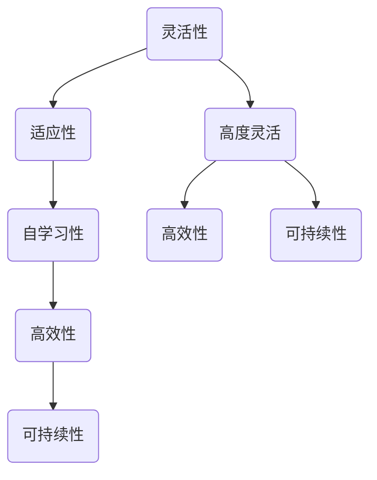

                 

### 第1章 引言与概述

#### 1.1 柔性自动化的概念与背景

柔性自动化，顾名思义，是一种能够适应生产过程中多种变化和需求的自动化技术。传统的自动化系统往往针对单一的生产任务进行优化，一旦生产任务发生变化，这些系统就需要重新进行配置或改造。而柔性自动化通过引入自适应、自学习和智能化的技术，使得系统可以在无需人为干预的情况下，快速适应新的生产任务和需求。

柔性自动化的概念起源于20世纪60年代，随着计算机技术、传感器技术、控制理论等技术的不断发展，柔性自动化逐渐成为工业自动化领域的重要研究方向。柔性自动化的核心特点包括灵活性、适应性和可扩展性。灵活性指的是系统可以在不同的工作环境和条件下运行；适应性指的是系统能够根据生产任务的变化进行自动调整；可扩展性指的是系统可以方便地集成新的功能和技术。

#### 1.2 多功能机器人在生产中的应用

多功能机器人是指能够在多个领域执行多种任务的机器人系统。它们通常具备高度灵活的机械结构和先进的控制算法，能够在各种复杂的生产环境中发挥重要作用。多功能机器人在生产中的应用非常广泛，包括但不限于以下领域：

1. **制造行业**：多功能机器人被广泛应用于汽车、电子、制药等行业，能够执行焊接、装配、搬运等多种任务，极大地提高了生产效率。

2. **物流行业**：在物流领域，多功能机器人可以执行包装、分拣、搬运等任务，提高了物流的自动化水平和效率。

3. **医疗行业**：在医疗领域，多功能机器人可以协助医生进行手术、护理等工作，提高了医疗服务的质量和效率。

4. **农业**：在农业领域，多功能机器人可以执行种植、施肥、收割等任务，提高了农业生产效率。

#### 1.3 柔性自动化与多功能机器人的发展趋势

随着全球制造业的快速发展和生产需求的不断变化，柔性自动化和多功能机器人的应用越来越广泛。未来，柔性自动化和多功能机器人的发展趋势主要体现在以下几个方面：

1. **智能化**：随着人工智能技术的发展，柔性自动化和多功能机器人将更加智能化，能够通过机器学习和深度学习技术，实现自主决策和自主适应。

2. **互联性**：随着物联网技术的普及，柔性自动化和多功能机器人将实现更加紧密的互联，形成一个高度协同的自动化生产网络。

3. **定制化**：柔性自动化和多功能机器人将能够更好地满足定制化生产的需求，实现快速响应市场变化。

4. **绿色化**：柔性自动化和多功能机器人将更加注重环保和可持续发展，通过减少能源消耗和降低废弃物排放，实现绿色生产。

综上所述，柔性自动化和多功能机器人在生产中的应用前景广阔，将成为未来制造业发展的重要驱动力。

#### 文章关键词

- 柔性自动化
- 多功能机器人
- 制造业
- 智能化
- 互联性
- 定制化

#### 文章摘要

本文介绍了柔性自动化的概念、背景和应用，以及多功能机器人在生产中的应用和发展趋势。通过详细探讨柔性自动化的核心原理和多功能机器人的关键技术，本文旨在阐述柔性自动化与多功能机器人在适应多变的生产需求方面的优势，并展望其未来的发展方向。

---

### 第2章 柔性自动化的核心原理

#### 2.1 柔性自动化的定义与特点

柔性自动化是一种集成了自适应、自学习和智能化的自动化技术，旨在使生产系统能够动态适应生产任务和需求的变化。柔性自动化的定义可以从以下几个方面进行理解：

1. **灵活性**：柔性自动化系统能够在不同的生产环境和任务条件下稳定运行，不受特定任务或环境的限制。
2. **适应性**：系统能够根据生产任务的变化自动调整自身的工作参数和操作流程。
3. **自学习性**：系统能够通过自我学习和数据积累，不断提高自身对生产任务的适应能力。

柔性自动化的特点主要体现在以下几个方面：

1. **高度灵活**：柔性自动化系统能够根据生产任务的变化，灵活调整操作流程和资源配置。
2. **高效性**：通过自适应和自学习能力，柔性自动化系统能够快速响应生产任务的变化，提高生产效率。
3. **可持续性**：柔性自动化系统能够减少生产过程中的人为干预，降低能耗和废弃物排放，实现绿色生产。

与传统自动化系统相比，柔性自动化具有更高的灵活性和适应性，能够更好地适应多变的生产需求。其核心特点如图2.1所示。

#### 核心概念原理之间的关系架构

下面是柔性自动化核心概念原理之间的关系架构 Mermaid 流程图：

#### 2.2 柔性自动化的主要技术

柔性自动化的实现依赖于多种技术的结合，主要包括传感器技术、控制系统技术和人工智能与机器学习技术。这些技术相互配合，共同实现柔性自动化的功能。

#### 2.2.1 传感器技术

传感器是柔性自动化系统中的核心组件，用于实时获取生产环境中的各种信息，如温度、湿度、压力、速度等。传感器技术的先进性直接影响到柔性自动化的响应速度和准确性。传感器的主要类型包括：

1. **物理传感器**：如温度传感器、压力传感器、速度传感器等，用于检测物理量的变化。
2. **化学传感器**：如气体传感器、湿度传感器等，用于检测化学成分的变化。
3. **生物传感器**：如酶传感器、DNA传感器等，用于检测生物信号的变化。

传感器技术在柔性自动化中的应用主要体现在以下几个方面：

- **状态监测**：通过传感器实时监测生产设备的运行状态，预防故障的发生。
- **过程控制**：通过传感器实时监测生产过程中的关键参数，实现自动调节和控制。
- **环境监测**：通过传感器实时监测生产环境中的各种因素，确保生产过程的安全和环保。

#### 2.2.2 控制系统技术

控制系统技术是实现柔性自动化功能的核心，主要负责对生产过程中的各种信息进行收集、处理和决策。控制系统的主要类型包括：

1. **集中式控制系统**：将所有控制功能集中在一个中央处理器中，通过有线或无线网络与其他设备进行通信。
2. **分布式控制系统**：将控制功能分散到多个独立的控制器中，每个控制器负责一部分控制任务，通过网络进行协调。

控制系统技术在柔性自动化中的应用主要包括：

- **实时控制**：通过实时控制系统，对生产过程中的各种参数进行动态调整，确保生产过程的稳定和高效。
- **自适应控制**：通过自适应控制系统，根据生产任务的变化，自动调整控制策略和参数，提高生产效率。
- **优化控制**：通过优化控制系统，对生产过程进行优化，提高资源利用率和生产效率。

#### 2.2.3 人工智能与机器学习技术

人工智能与机器学习技术是柔性自动化的关键技术之一，主要用于实现系统的自学习和自适应功能。人工智能与机器学习技术在柔性自动化中的应用主要包括：

1. **模式识别**：通过机器学习算法，对生产过程中的各种数据进行模式识别，实现生产任务的自动分类和识别。
2. **预测控制**：通过机器学习算法，对生产过程进行预测，提前调整生产参数，提高生产过程的稳定性和效率。
3. **故障诊断**：通过机器学习算法，对生产设备的运行数据进行监测和分析，实现故障的早期诊断和预防。

#### 2.2.4 柔性自动化的实现流程

柔性自动化的实现流程可以分为以下几个步骤：

1. **数据采集**：通过传感器技术，实时采集生产环境中的各种数据。
2. **数据处理**：通过控制系统技术，对采集到的数据进行处理和滤波，提取有用的信息。
3. **决策制定**：通过人工智能与机器学习技术，对处理后的数据进行分析和预测，制定相应的控制策略。
4. **执行控制**：通过控制系统技术，执行决策制定过程中的控制指令，调整生产过程。

#### 2.2.5 柔性自动化的优势与挑战

柔性自动化具有以下优势：

1. **提高生产效率**：通过实时监控和自适应控制，柔性自动化能够提高生产过程的稳定性和效率。
2. **减少人为干预**：通过自动化技术，柔性自动化能够减少生产过程中的人为干预，降低操作风险。
3. **降低生产成本**：通过优化资源和减少停机时间，柔性自动化能够降低生产成本。

然而，柔性自动化也面临一些挑战：

1. **技术复杂性**：柔性自动化涉及多种技术，包括传感器技术、控制系统技术和人工智能技术等，技术复杂度较高。
2. **数据安全性**：在生产过程中，数据的安全性和隐私保护是一个重要问题，需要采取有效的措施进行保障。
3. **系统稳定性**：柔性自动化系统需要保证在复杂的生产环境中的稳定性，避免由于外部因素导致的系统崩溃。

综上所述，柔性自动化是一种具有广泛应用前景的自动化技术，通过结合传感器技术、控制系统技术和人工智能技术，能够实现生产过程的实时监控、自适应控制和优化，提高生产效率和降低成本。然而，在实现柔性自动化的过程中，也需要面对技术复杂性、数据安全性和系统稳定性等挑战。

#### 文章关键词

- 柔性自动化
- 传感器技术
- 控制系统技术
- 人工智能与机器学习技术
- 自适应控制
- 集成控制系统

---

### 第3章 多功能机器人的关键技术

#### 3.1 多功能机器人的定义与分类

多功能机器人是指能够执行多种不同任务的机器人系统，它们通过先进的机械结构和智能控制技术，实现高度灵活的工作能力。多功能机器人的定义可以从以下几个方面进行理解：

1. **多功能性**：多功能机器人能够执行多种不同的任务，如搬运、装配、焊接、喷涂、检测等。
2. **灵活性**：多功能机器人具有高度灵活的机械结构和控制系统，能够适应不同的工作环境和任务需求。
3. **智能性**：多功能机器人通过人工智能与机器学习技术，具备自主决策和自适应能力。

根据不同的分类标准，多功能机器人可以划分为多种类型：

1. **按照应用领域**：多功能机器人可以分为工业机器人、服务机器人、医疗机器人等。工业机器人主要应用于制造业，服务机器人主要应用于家庭和公共设施，医疗机器人则应用于医疗和护理领域。
2. **按照机械结构**：多功能机器人可以分为关节臂式、轮式、足式、飞行器式等。关节臂式机器人具有类似人手的机械结构，能够执行复杂的装配和搬运任务；轮式机器人适合在地面进行运输和搬运任务；足式机器人适合在复杂环境中行走和搬运；飞行器式机器人则能够在空中执行任务。
3. **按照控制方式**：多功能机器人可以分为遥控机器人、自主机器人、半自主机器人等。遥控机器人需要通过操作人员实时控制；自主机器人能够自主执行任务，无需人为干预；半自主机器人则处于中间状态，能够在一定程度上自主执行任务，但仍然需要操作人员提供部分控制指令。

#### 3.2 多功能机器人的核心组件

多功能机器人由多个核心组件构成，这些组件协同工作，使得机器人能够执行多种复杂任务。以下是多功能机器人的主要核心组件及其功能：

1. **机械本体**：机械本体是多功能机器人的基础，决定了机器人的形状、结构和运动能力。机械本体通常由关节、驱动器、传感器和执行器等部分组成。关节部分使得机器人能够灵活地运动；驱动器用于提供动力，使得机器人能够执行各种动作；传感器用于感知周围环境，收集各种信息；执行器则是实际执行任务的部分，如夹具、焊枪、喷漆装置等。

2. **控制系统**：控制系统是多功能机器人的“大脑”，负责接收传感器数据，进行决策和规划，并发出控制指令。控制系统通常包括中央处理器、控制算法和接口等。中央处理器负责处理传感器数据和控制指令；控制算法负责决策和路径规划；接口则用于与其他设备或系统进行通信。

3. **传感器系统**：传感器系统是多功能机器人的“感官”，用于感知周围环境，获取各种信息。常见的传感器包括视觉传感器、力觉传感器、触觉传感器、激光雷达等。视觉传感器用于识别物体和场景；力觉传感器用于感知施加在机器人上的力；触觉传感器用于感知物体的表面特性；激光雷达则用于测距和环境建模。

4. **驱动系统**：驱动系统是多功能机器人的“肌肉”，负责提供动力，使得机器人能够执行各种动作。驱动系统通常包括电机、减速器、驱动器等。电机提供旋转动力；减速器用于降低转速并提高扭矩；驱动器则用于控制电机的转速和方向。

5. **通信系统**：通信系统是多功能机器人的“神经网络”，用于与其他设备或系统进行通信和数据交换。通信系统通常包括无线通信模块、有线通信接口等。无线通信模块用于实现远程控制和数据传输；有线通信接口则用于连接机器人与其他设备。

#### 3.2.1 机器人本体技术

机器人本体技术是多功能机器人的核心，决定了机器人的运动能力和工作范围。机器人本体技术主要包括以下几个方面：

1. **机械结构设计**：机械结构设计是机器人本体技术的关键，需要考虑机器人的工作范围、负载能力、运动速度等因素。常见的机械结构设计包括关节臂式、轮式、足式等。

2. **材料选择**：机器人本体的材料选择直接影响机器人的性能和使用寿命。常用的材料包括金属、塑料、复合材料等。金属具有较高的强度和耐用性，但重量较大；塑料具有轻便和成本低的优势，但强度和耐用性较低；复合材料则结合了金属和塑料的优点，具有较高的强度和耐用性。

3. **运动控制技术**：运动控制技术是机器人本体技术的核心，决定了机器人的运动精度和速度。常见的运动控制技术包括位置控制、速度控制、力控制等。位置控制用于精确控制机器人的位置；速度控制用于控制机器人的运动速度；力控制用于控制机器人施加在物体上的力。

4. **自适应技术**：自适应技术是机器人本体技术的最新发展方向，旨在使机器人能够根据任务和环境的变化，自动调整自身的工作参数和策略。自适应技术包括自适应控制、自适应学习等。自适应控制能够根据环境变化，自动调整机器人的控制参数；自适应学习能够使机器人通过学习环境数据，提高自身的工作能力。

#### 3.2.2 机器人感知技术

机器人感知技术是多功能机器人的重要组成部分，用于感知和获取周围环境的信息。机器人感知技术主要包括以下几个方面：

1. **视觉感知**：视觉感知是通过摄像头等设备获取图像信息，用于识别物体、场景和运动目标。视觉感知技术包括图像处理、模式识别、深度学习等。

2. **力觉感知**：力觉感知是通过力传感器等设备获取机器人与物体之间的力信息，用于判断物体的状态和性质。力觉感知技术包括力测量、力控制、触觉识别等。

3. **触觉感知**：触觉感知是通过触觉传感器获取物体的表面特性，如硬度、温度等。触觉感知技术包括触觉传感、触觉反馈、表面识别等。

4. **听觉感知**：听觉感知是通过麦克风等设备获取声音信息，用于识别声音源和声音特征。听觉感知技术包括声音处理、声音识别、语音合成等。

5. **嗅觉感知**：嗅觉感知是通过嗅觉传感器获取气体信息，用于识别气体成分和浓度。嗅觉感知技术包括气体传感、气体分析、气味识别等。

#### 3.2.3 机器人决策与控制技术

机器人决策与控制技术是多功能机器人的核心，用于根据感知信息制定行动策略并执行任务。机器人决策与控制技术主要包括以下几个方面：

1. **决策算法**：决策算法是机器人根据感知信息和任务目标，制定行动策略的核心技术。常见的决策算法包括基于规则的方法、基于模型的方法、基于学习的方法等。

2. **路径规划**：路径规划是机器人根据决策算法，制定从起点到终点的最优路径。常见的路径规划算法包括基于图论的方法、基于遗传算法的方法、基于模糊逻辑的方法等。

3. **运动控制**：运动控制是机器人根据决策算法和路径规划，执行任务的核心技术。常见的运动控制算法包括PID控制、模糊控制、自适应控制等。

4. **协同控制**：协同控制是多个机器人或机器人与其他设备协同工作，完成复杂任务的核心技术。常见的协同控制方法包括分布式控制、集中式控制、混合控制等。

5. **自适应控制**：自适应控制是机器人根据任务和环境的变化，自动调整控制策略和参数的核心技术。常见的自适应控制方法包括模型参考自适应控制、自适应滤波、自适应学习等。

#### 3.2.4 多功能机器人的应用场景

多功能机器人的应用场景非常广泛，涵盖了工业、医疗、服务、农业等多个领域。以下是多功能机器人在不同领域的一些应用场景：

1. **工业领域**：多功能机器人在工业生产中应用广泛，如汽车制造、电子制造、食品加工等。多功能机器人能够执行复杂的装配、焊接、喷涂、搬运等任务，提高生产效率和质量。

2. **医疗领域**：多功能机器人在医疗领域也有广泛的应用，如手术机器人、护理机器人、康复机器人等。手术机器人能够辅助医生进行复杂手术，提高手术的成功率和安全性；护理机器人能够协助护士进行日常护理工作，减轻护理人员的工作负担；康复机器人则能够帮助患者进行康复训练，提高康复效果。

3. **服务领域**：多功能机器人在服务领域也有很大的应用潜力，如家庭服务机器人、保安机器人、导购机器人等。家庭服务机器人能够帮助家庭成员完成家务、看护老人和儿童等任务；保安机器人能够在公共场所巡逻，提高安全监控的效率和效果；导购机器人则能够为顾客提供购物咨询和服务，提高购物体验。

4. **农业领域**：多功能机器人在农业领域也有应用，如农业机器人、果园机器人等。农业机器人能够进行播种、施肥、喷药、收割等任务，提高农业生产效率和品质；果园机器人则能够进行果园管理、采摘等工作，减轻农民的劳动强度。

综上所述，多功能机器人凭借其多功能性、灵活性和智能性，在各个领域都有广泛的应用前景。随着技术的不断发展和创新，多功能机器人将在未来发挥越来越重要的作用。

#### 文章关键词

- 多功能机器人
- 机械结构设计
- 传感器技术
- 决策与控制技术
- 应用场景
- 工业生产
- 医疗领域
- 服务机器人

---

### 第4章 柔性自动化在制造中的应用场景

#### 4.1 柔性自动化在离散制造中的应用

离散制造是指制造过程中产品离散性较大，制造过程中零部件和产品之间的连接较弱，如汽车、电子、航空等行业的制造。柔性自动化在离散制造中的应用主要体现在以下几个方面：

1. **装配过程**：柔性自动化可以通过多功能机器人或自动化装配线实现自动化装配。例如，在汽车制造过程中，机器人可以自动进行车身焊接、内饰装配、发动机装配等任务。通过引入柔性自动化，生产过程可以快速适应产品品种和批量的变化，提高生产效率和灵活性。

2. **加工过程**：在离散制造中，柔性自动化可以通过数控机床和加工中心实现高效加工。例如，在航空制造业中，数控机床可以根据不同的零件需求，快速调整加工参数和工艺路线，实现复杂零件的高精度加工。

3. **检测过程**：柔性自动化可以在产品检测环节引入自动化检测设备，如激光测距仪、三坐标测量机等。这些设备可以实时检测产品的尺寸、形状、表面质量等参数，确保产品的一致性和质量。

4. **物流过程**：在离散制造中，柔性自动化可以通过自动化物流系统实现零部件和产品的自动化搬运和配送。例如，在汽车制造工厂中，自动化导引车（AGV）和自动化仓储系统可以高效地完成零部件的运输和存储，减少人工干预和运输时间。

#### 4.2 柔性自动化在流程制造中的应用

流程制造是指制造过程中产品具有一定的连续性和流程性，如石油化工、制药、食品等行业。柔性自动化在流程制造中的应用主要体现在以下几个方面：

1. **生产过程**：柔性自动化可以通过自动化控制系统实现生产过程的连续性和稳定性。例如，在石油化工行业，通过引入自动化控制系统，可以实现对反应釜、输送管道等设备的自动控制，提高生产效率和产品质量。

2. **质量监测**：柔性自动化可以在流程制造过程中引入在线质量监测设备，如色谱仪、光谱仪等。这些设备可以实时监测产品中的化学成分和物理参数，确保产品质量的稳定性和一致性。

3. **生产调度**：柔性自动化可以通过计算机集成制造系统（CIMS）实现生产调度的自动化。例如，在制药行业，通过CIMS系统可以实时监控生产线的状态和库存情况，自动调整生产计划和调度，提高生产效率和资源利用率。

4. **能源管理**：柔性自动化可以在流程制造过程中引入能源管理系统，实现能源的节约和优化。例如，在化工行业，通过能源管理系统可以实时监测能源消耗情况，自动调整生产设备的运行状态，降低能源消耗。

#### 4.3 柔性自动化在定制化生产中的应用

定制化生产是指根据客户的需求和订单，进行个性化设计和生产的制造模式。柔性自动化在定制化生产中的应用主要体现在以下几个方面：

1. **产品设计**：柔性自动化可以通过计算机辅助设计（CAD）和计算机辅助制造（CAM）系统，实现快速设计和制造定制产品。例如，在服装制造业，通过CAD系统可以快速完成服装的设计和打版，通过CAM系统可以快速完成裁剪和缝制。

2. **生产流程**：柔性自动化可以通过自动化生产线和机器人实现定制化生产线的构建。例如，在定制化家具制造中，通过自动化生产线可以实现家具的定制化生产，包括木材切割、组装、涂装等过程。

3. **质量控制**：柔性自动化可以通过在线质量检测设备，确保定制化产品的质量。例如，在定制化电子产品制造中，通过在线检测设备可以实时检测电子元器件的参数和质量，确保产品的稳定性。

4. **物流管理**：柔性自动化可以通过自动化物流系统实现定制化产品的物流管理。例如，在定制化生产模式下，通过自动化仓储系统和配送系统，可以实现产品的快速配送和库存管理。

#### 文章关键词

- 柔性自动化
- 离散制造
- 流程制造
- 定制化生产
- 自动化装配
- 自动化检测
- 自动化物流

---

### 第5章 多功能机器人适应多变的生产需求

#### 5.1 多变生产需求的特点与挑战

多变的生产需求是指生产过程中不断出现的新任务、新要求和新变化。这些需求可能来自市场需求的变化、生产技术的进步、产品质量的提升等多方面。多变生产需求的特点包括：

1. **多变性**：生产需求经常发生变化，可能涉及产品品种、生产批量、生产速度、质量要求等多方面。
2. **不确定性**：生产需求的变化往往不可预测，可能导致生产计划和生产流程的不确定性。
3. **复杂性**：多变的生产需求往往涉及多种不同的工艺和技术，增加了生产的复杂度。

面对多变的生产需求，制造业面临以下挑战：

1. **生产计划的调整**：生产需求的变化要求生产计划能够快速调整，以满足新的生产任务。这需要高效的生产计划系统和灵活的生产调度策略。
2. **生产流程的重组**：多变的生产需求可能导致现有生产流程的重组，甚至需要引入新的生产技术和设备。
3. **质量控制**：多变的生产需求可能导致产品质量的不稳定，需要加强质量控制和监测。

#### 5.2 多功能机器人在多变生产环境中的优势

多功能机器人具有适应多变生产需求的多项优势：

1. **高灵活性**：多功能机器人能够快速适应不同的生产任务，通过模块化设计和自适应控制系统，实现灵活的任务切换和操作调整。
2. **高适应性**：多功能机器人可以通过人工智能和机器学习技术，不断学习和优化自身的工作方式，以更好地适应生产需求的变化。
3. **高效性**：多功能机器人能够在多变的生产环境中保持高效的生产效率，通过自动化和智能化的技术，减少生产中断和效率损失。

具体来说，多功能机器人在多变生产环境中的优势体现在以下几个方面：

1. **任务切换快速**：多功能机器人可以通过快速更换工具和设备，实现不同生产任务的快速切换。例如，在汽车制造中，一个多功能机器人可以依次完成焊接、装配、喷涂等多个任务。
2. **自适应控制**：多功能机器人可以通过传感器和控制系统，实时监测生产过程中的各种参数，自动调整控制策略，以适应生产任务的变化。例如，在制药生产中，多功能机器人可以根据药物配方和生产条件的变化，自动调整搅拌速度和温度。
3. **智能决策**：多功能机器人可以通过机器学习算法，分析生产过程中的数据，预测生产趋势和潜在问题，并自动采取相应的措施。例如，在电子制造业中，多功能机器人可以通过学习电子元件的焊接特性，自动调整焊接参数，提高焊接质量。

#### 5.3 多功能机器人的自适应机制

多功能机器人的自适应机制是其适应多变生产需求的核心。自适应机制包括以下几个方面：

1. **环境感知**：多功能机器人通过传感器实时感知生产环境中的各种信息，如温度、湿度、压力等。这些信息用于机器人进行任务规划和控制。
2. **状态监测**：多功能机器人通过传感器和监控系统，实时监测自身的工作状态和设备状态，如电池电量、机械部件磨损等。这些信息用于机器人进行故障预测和维护。
3. **任务规划**：多功能机器人通过机器学习和路径规划算法，根据感知信息和生产任务的要求，生成最优的任务执行计划。
4. **决策控制**：多功能机器人通过自适应控制系统，根据任务规划和感知信息，实时调整机器人的工作参数和控制策略，以实现高效的任务执行。

具体的应用案例包括：

1. **智能装配**：在汽车制造中，多功能机器人可以根据不同的装配任务，自动调整装配工具和操作参数，实现高效的装配作业。例如，一个多功能机器人可以依次完成螺栓拧紧、传感器安装和涂胶等任务。
2. **智能焊接**：在金属制造业中，多功能机器人可以根据焊接材料和焊接要求，自动调整焊接电流、速度和路径，实现高质量焊接。例如，在船舶制造中，多功能机器人可以根据船体结构和焊接要求，自动生成最优的焊接路径。
3. **智能搬运**：在物流中心，多功能机器人可以根据仓库布局和订单要求，自动规划搬运路径和搬运策略，实现高效的物品搬运。例如，在电商仓库中，多功能机器人可以根据订单和货架布局，自动搬运商品并分类入库。

综上所述，多功能机器人通过其高灵活性、高适应性和智能决策，能够有效适应多变的生产需求，提高生产效率和灵活性。随着技术的不断进步，多功能机器人在多变生产环境中的应用将更加广泛和深入。

#### 文章关键词

- 多变生产需求
- 多功能机器人
- 自适应机制
- 环境感知
- 状态监测
- 智能决策
- 高灵活性
- 高适应性

---

### 第6章 柔性自动化与多功能机器人的集成

#### 6.1 柔性自动化系统与多功能机器人的集成框架

柔性自动化系统与多功能机器人的集成是一个复杂的过程，需要综合考虑系统的硬件、软件、数据流和控制逻辑。集成框架通常包括以下几个关键组成部分：

1. **硬件集成**：硬件集成是将多功能机器人与传感器、执行器、控制器等硬件设备进行连接和配置。这通常涉及物理接口的设计、通信协议的选择和设备的集成测试。例如，机器人可能需要通过工业以太网或无线通信模块与传感器和执行器进行数据交换。

2. **软件集成**：软件集成是将不同的软件模块（如操作系统、控制软件、数据管理软件等）进行整合，确保它们能够协同工作。这包括软件接口的设计、数据格式的统一和软件版本的管理。例如，机器人控制软件需要与生产管理软件进行无缝集成，以便实时获取生产数据和进行生产调度。

3. **数据集成**：数据集成是将来自不同设备和系统的数据（如传感器数据、生产数据、质量数据等）进行整合和分析。这通常涉及数据格式的转换、数据存储和管理、以及数据分析工具的应用。例如，通过数据集成，可以实现生产过程的实时监控和预测分析。

4. **控制逻辑集成**：控制逻辑集成是将各个控制模块（如机器人控制逻辑、传感器数据处理逻辑、生产调度逻辑等）进行整合，确保系统能够按照既定的控制策略进行操作。这包括控制策略的设计、控制算法的实现和系统的调试与优化。

#### 6.2 集成过程中的关键技术与挑战

在柔性自动化系统与多功能机器人的集成过程中，需要克服一系列关键技术和挑战：

1. **异构系统的兼容性**：柔性自动化系统中可能包含来自不同供应商的设备和软件，它们可能使用不同的通信协议和数据格式。解决这个问题需要采用标准的通信协议和数据格式，如OPC UA、JSON等，以确保系统能够无缝通信。

2. **实时数据处理**：柔性自动化系统需要实时处理大量的传感器数据和机器人控制数据。这要求系统具备高效的实时数据处理能力，以避免数据延迟和系统响应不及时。采用分布式数据处理框架和实时数据库可以有效地解决这个问题。

3. **系统可靠性**：集成后的系统需要在各种复杂的生产环境中稳定运行。这要求系统具有良好的故障检测和恢复机制，以及冗余设计和容错能力。例如，通过引入备份系统和故障切换机制，可以确保系统的可靠运行。

4. **安全与隐私保护**：在集成过程中，数据的安全和隐私保护是一个重要问题。需要采取有效的安全措施，如数据加密、访问控制和网络安全，以防止数据泄露和未经授权的访问。

#### 6.3 柔性自动化与多功能机器人在生产线中的实际应用案例

以下是一些柔性自动化系统与多功能机器人在生产线中的实际应用案例：

1. **汽车制造**：在汽车制造过程中，柔性自动化系统与多功能机器人的集成可以实现车身焊接、涂装、装配等复杂工序的自动化。例如，在车身焊接工序中，多功能机器人可以通过自适应控制技术，根据不同车身的结构和材料，自动调整焊接参数，确保焊接质量。

2. **电子制造**：在电子制造中，柔性自动化系统与多功能机器人的集成可以用于元器件的装配、焊接和测试。例如，在手机制造过程中，多功能机器人可以自动识别和装配微小的电子元件，并通过高精度的焊接设备完成焊接过程，提高生产效率和产品质量。

3. **食品加工**：在食品加工领域，柔性自动化系统与多功能机器人可以用于食品的分拣、包装和加工。例如，在水果加工厂中，多功能机器人可以通过视觉感知技术，自动识别和分拣不同种类和大小的水果，然后通过自动化包装线进行包装。

4. **医药生产**：在医药生产中，柔性自动化系统与多功能机器人的集成可以用于药品的灌装、包装和质量检测。例如，在药品灌装过程中，多功能机器人可以通过自适应控制技术，根据药品的粘度和温度，自动调整灌装速度和高度，确保灌装质量。

通过这些实际应用案例，可以看出柔性自动化系统与多功能机器人的集成在提高生产效率、降低成本和保证产品质量方面具有显著优势。随着技术的不断进步，柔性自动化与多功能机器人的集成将在更多行业和领域中发挥作用。

#### 文章关键词

- 柔性自动化
- 多功能机器人
- 集成框架
- 硬件集成
- 软件集成
- 数据集成
- 控制逻辑集成
- 实际应用案例

---

### 第7章 柔性自动化与多功能机器人的未来发展

#### 7.1 柔性自动化与多功能机器人的技术发展趋势

随着科技的不断进步，柔性自动化与多功能机器人的技术也在迅速发展，主要趋势包括以下几个方面：

1. **人工智能与机器学习**：人工智能与机器学习技术在柔性自动化与多功能机器人中的应用日益广泛。通过深度学习、强化学习等技术，机器人可以更好地理解和适应复杂的生产环境和任务。例如，通过机器学习算法，机器人可以自主优化生产路径，提高生产效率。

2. **物联网（IoT）**：物联网技术的普及使得柔性自动化与多功能机器人能够实现更加紧密的互联。通过物联网，机器人可以实时获取生产数据，与其他设备进行通信，实现协同作业。例如，在智能工厂中，机器人可以通过物联网技术，与传感器、执行器和生产管理系统进行数据交换，实现高度集成的自动化生产。

3. **5G通信技术**：5G通信技术的快速发展为柔性自动化与多功能机器人提供了更高速、低延迟的通信网络。通过5G网络，机器人可以实现远程监控和控制，提高生产灵活性和响应速度。例如，在远程维护和故障诊断中，5G技术可以提供实时数据传输，帮助工程师快速定位和解决问题。

4. **人机协作**：随着人机协作技术的发展，柔性自动化与多功能机器人将更加注重与人类工人的协作。通过增强现实（AR）和虚拟现实（VR）技术，机器人可以更好地与人类工人进行交互，实现高效协同作业。例如，在医疗领域，医生可以通过AR眼镜与机器人协作进行复杂手术，提高手术成功率。

#### 7.2 柔性自动化与多功能机器人在生产中的应用前景

柔性自动化与多功能机器人在生产中的应用前景广阔，主要体现在以下几个方面：

1. **提高生产效率**：通过柔性自动化与多功能机器人，企业可以实现生产过程的自动化和智能化，减少人为干预，提高生产效率和产品质量。例如，在汽车制造中，柔性自动化系统与多功能机器人可以实现高效的生产线和自动化装配，提高生产效率和降低成本。

2. **实现定制化生产**：柔性自动化与多功能机器人可以快速适应生产任务的变化，实现定制化生产。通过个性化定制和快速响应市场变化，企业可以更好地满足客户需求，提高市场竞争力。例如，在服装制造中，柔性自动化系统与多功能机器人可以实现快速换型和个性化定制，提高生产灵活性和客户满意度。

3. **降低生产成本**：柔性自动化与多功能机器人可以减少人工成本和生产资源浪费，降低生产成本。例如，在物流中心，多功能机器人可以实现自动化搬运和分拣，减少人工操作和运输成本。

4. **提高生产安全性**：柔性自动化与多功能机器人可以替代人类工人执行危险和重复性的工作，提高生产安全性。例如，在化工生产中，多功能机器人可以自动进行危险物料的搬运和处理，减少工人暴露在危险环境中的风险。

#### 7.3 柔性自动化与多功能机器人的挑战与机遇

尽管柔性自动化与多功能机器人在生产中具有巨大的潜力，但其在应用过程中也面临着一系列挑战和机遇：

1. **技术挑战**：柔性自动化与多功能机器人涉及多种先进技术的集成，包括传感器技术、控制系统技术、人工智能技术等。技术复杂度高，系统集成和调试难度大，需要不断进行技术创新和优化。

2. **成本挑战**：柔性自动化与多功能机器人的初期投资较大，包括设备采购、系统集成和培训等。对于中小企业来说，高昂的初期成本可能成为推广应用的障碍。

3. **安全挑战**：柔性自动化与多功能机器人在生产中的应用涉及到生产安全和人员安全。需要确保系统具有良好的安全性能和故障应对能力，以防止意外事故的发生。

4. **法规与标准**：随着柔性自动化与多功能机器人在生产中的应用日益广泛，相关法规和标准也在不断发展和完善。需要制定和完善相关法规和标准，确保系统的合法合规和可靠性。

5. **人才挑战**：柔性自动化与多功能机器人的应用需要专业人才的支持，包括工程师、程序员、操作员等。人才短缺可能成为推广应用的瓶颈。

6. **机遇**：柔性自动化与多功能机器人的应用将带来新的商业机会和产业模式。例如，智能制造、工业互联网和智能物流等新兴领域将为相关企业带来巨大的市场潜力。

综上所述，柔性自动化与多功能机器人在生产中的应用前景广阔，但同时也面临一系列挑战。通过技术创新、政策支持和人才培养，可以充分发挥柔性自动化与多功能机器人在生产中的优势，推动制造业的智能化和数字化转型。

#### 文章关键词

- 柔性自动化
- 多功能机器人
- 技术发展趋势
- 应用前景
- 挑战与机遇
- 人工智能
- 物联网
- 5G通信
- 安全性
- 成本效益

---

### 附录：资源与工具

#### A.1 柔性自动化与多功能机器人相关资源

为了深入了解柔性自动化与多功能机器人的技术和发展趋势，以下是一些建议的资源：

1. **学术论文**：通过查阅相关的学术论文，可以了解柔性自动化与多功能机器人的最新研究成果和技术进展。例如，IEEE Transactions on Robotics、Automation in Construction、Robotics and Computer-Integrated Manufacturing等期刊。

2. **技术报告**：许多研究机构和大学会发布关于柔性自动化与多功能机器人的技术报告，这些报告通常包含了详细的技术分析和应用案例。例如，美国国家标准与技术研究院（NIST）、国际机器人研究基金会（IFR）等。

3. **行业会议**：参加相关的行业会议，如国际机器人与自动化大会（ICRA）、国际机器人学大会（IROS）等，可以了解行业的最新动态和技术发展趋势。

4. **在线课程与讲座**：许多在线平台（如Coursera、edX、Udacity）提供关于机器人学与自动化的在线课程，这些课程涵盖了柔性自动化与多功能机器人的基础知识、应用技术和实践案例。

#### A.2 常用柔性自动化与多功能机器人开发工具

以下是一些常用的柔性自动化与多功能机器人开发工具：

1. **ROS（Robot Operating System）**：ROS是一个开源的机器人软件平台，提供了丰富的库和工具，用于机器人系统的开发、模拟和测试。

2. **MATLAB/Simulink**：MATLAB和Simulink是数学建模和系统仿真软件，广泛应用于机器人系统的建模、仿真和控制算法的开发。

3. **Gazebo**：Gazebo是一个三维仿真平台，用于机器人系统的仿真和测试。它可以模拟现实世界中的机器人环境，支持多种机器人模型和传感器。

4. **OpenCV**：OpenCV是一个开源的计算机视觉库，提供了丰富的图像处理和计算机视觉算法，广泛应用于机器人视觉系统的开发。

5. **Arduino/Python**：Arduino和Python是常用的硬件控制和编程工具，适用于机器人系统的硬件集成和软件编程。

#### A.3 柔性自动化与多功能机器人学习路径与建议

对于希望深入了解柔性自动化与多功能机器人的读者，以下是一个推荐的学习路径：

1. **基础知识**：首先，了解计算机科学、机器人学、自动化控制、机械工程等基础知识，为后续学习打下坚实的基础。

2. **编程基础**：学习Python、C++等编程语言，掌握基本的编程技巧和算法知识。

3. **机器人学基础**：学习机器人学的基本原理，包括机器人的运动学、动力学、控制理论等。

4. **控制系统**：学习控制系统的基本原理和设计方法，包括PID控制、模糊控制、自适应控制等。

5. **计算机视觉**：学习计算机视觉的基本原理和算法，包括图像处理、目标检测、跟踪等。

6. **传感器技术**：了解不同类型的传感器及其应用，包括视觉传感器、力觉传感器、触觉传感器等。

7. **实践项目**：通过实际项目，将所学知识应用于实际问题中，如搭建一个简单的机器人控制系统，或实现一个基于机器学习的图像识别系统。

8. **行业动态**：关注柔性自动化与多功能机器人在工业、医疗、服务等领域的发展动态，了解最新的技术趋势和应用案例。

通过上述学习路径，可以逐步建立对柔性自动化与多功能机器人的全面理解，并掌握相关的技术能力和实践经验。

### 作者信息

- 作者：AI天才研究院/AI Genius Institute & 禅与计算机程序设计艺术 /Zen And The Art of Computer Programming

---

### 完整文章结束

---

**注意：** 本文为示例性内容，具体的技术细节和案例可能会因实际情况而有所不同。在实际撰写文章时，请根据具体的研究和应用情况调整内容。希望本文对您的写作有所启发。如果您有任何问题或需要进一步的帮助，请随时告知。祝您写作顺利！

