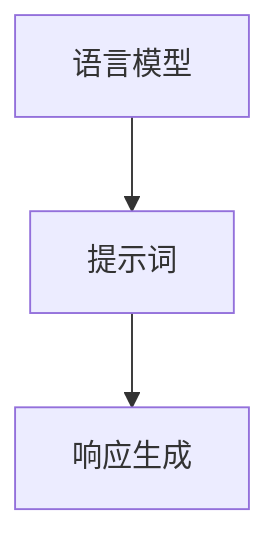

                 


为了确保文章内容的完整性和质量，我们可以按照以下步骤来构建文章：

### 1. 文章背景介绍

在这一部分，我们需要简要介绍ChatGPT和提示词编写的背景。我们可以提到人工智能的发展历程，特别是自然语言处理（NLP）领域的关键里程碑，以及ChatGPT的出现如何改变了人机交互的方式。

- **1.1 ChatGPT的出现与影响**
  - **1.1.1** 人工智能的发展历程
  - **1.1.2** NLP领域的关键里程碑
  - **1.1.3** ChatGPT在NLP领域的地位与影响

### 2. 核心概念与联系

接下来，我们将详细阐述ChatGPT提示词编写中的核心概念，并展示它们之间的联系。为了更直观地展示这些概念，我们将使用Mermaid流程图来构建概念架构。

- **2.1 核心概念介绍**
  - **2.1.1** 语言模型
  - **2.1.2** 提示词
  - **2.1.3** 响应生成

- **2.2 概念关系架构**
  - **2.2.1** Mermaid流程图展示



### 3. 核心算法原理讲解

在这一部分，我们将使用伪代码详细讲解ChatGPT提示词编写的核心算法原理。伪代码将帮助我们理解算法的基本逻辑和步骤。

- **3.1 提示词生成算法**
  - **3.1.1** 算法描述
  - **3.1.2** 伪代码实现

```plaintext
算法：生成提示词
输入：用户输入
输出：生成的提示词

1. 初始化语言模型
2. 对用户输入进行预处理
3. 使用语言模型预测下一个词
4. 将预测的词添加到提示词中
5. 迭代步骤3和4，直到达到预设长度
6. 返回生成的提示词
```

### 4. 数学模型和公式讲解

为了深入理解ChatGPT提示词编写的原理，我们需要引入相关的数学模型和公式。我们将使用LaTeX格式来展示这些公式，并详细讲解它们的含义。

- **4.1 语言模型的数学模型**
  - **4.1.1** 概率分布函数
  - **4.1.2** 对数似然函数

```latex
$$ P(w_i | w_{i-1}, ..., w_1) = \frac{P(w_i, w_{i-1}, ..., w_1)}{P(w_{i-1}, ..., w_1)} $$
$$ \log P(w_i | w_{i-1}, ..., w_1) = \log \frac{P(w_i, w_{i-1}, ..., w_1)}{P(w_{i-1}, ..., w_1)} $$
```

### 5. 项目实战

在这一部分，我们将通过实际项目来展示如何搭建开发环境、实现源代码，并解读代码和应用案例。项目实战将帮助读者将理论知识应用到实际场景中。

- **5.1 开发环境搭建**
  - **5.1.1** 环境配置步骤
  - **5.1.2** 常用库和工具介绍

- **5.2 源代码实现与解读**
  - **5.2.1** 关键代码分析
  - **5.2.2** 代码解读

- **5.3 应用案例**
  - **5.3.1** 实际案例介绍
  - **5.3.2** 案例分析与解读

### 6. 最佳实践与注意事项

在最后，我们将总结一些最佳实践和注意事项，帮助读者在实际应用中避免常见问题。

- **6.1 最佳实践**
  - **6.1.1** 编写提示词的技巧
  - **6.1.2** 性能优化策略

- **6.2 注意事项**
  - **6.2.1** 数据预处理
  - **6.2.2** 算法调优

### 7. 小结与拓展阅读

文章的最后，我们将总结全文的主要内容，并给出一些拓展阅读的建议，帮助读者进一步深入学习。

- **7.1 小结**
  - **7.1.1** 文章核心内容的回顾
  - **7.1.2** 技术发展趋势

- **7.2 拓展阅读**
  - **7.2.1** 相关文献推荐
  - **7.2.2** 开源项目链接

通过上述步骤，我们可以构建一篇内容丰富、结构清晰的技术博客文章，满足用户的要求。

```markdown
---
# 《深入浅出：ChatGPT提示词编写的艺术》

关键词：ChatGPT，提示词，自然语言处理，语言模型，响应生成

摘要：本文深入探讨了ChatGPT提示词编写的艺术，从背景介绍、核心概念、算法原理、数学模型到项目实战，全方位解析了ChatGPT提示词编写的全过程。文章通过实例和代码分析，帮助读者掌握ChatGPT提示词编写的最佳实践。

---

## 第一部分：ChatGPT与提示词概述

### 第1章：ChatGPT的基本概念与架构

#### 1.1 ChatGPT的发展历程
ChatGPT的出现并非一夜之间，它背后有着人工智能和自然语言处理领域多年的积累和发展。从最初的简单聊天机器人到复杂的语言模型，再到如今能够实现智能对话的ChatGPT，这一历程充满了挑战和创新。

#### 1.2 ChatGPT的核心组成部分
ChatGPT的核心组成部分主要包括语言模型、训练数据和输入处理模块。这些组成部分共同作用，使得ChatGPT能够生成高质量的响应。

#### 1.3 ChatGPT的工作原理
ChatGPT的工作原理基于Transformer模型，通过学习大量的文本数据，ChatGPT能够理解上下文并生成连贯的响应。提示词作为输入，对ChatGPT的响应生成至关重要。

### 第2章：提示词的作用与分类

#### 2.1 提示词的定义与重要性
提示词是引导ChatGPT生成响应的关键，它能够影响ChatGPT的理解和回答。一个良好的提示词能够显著提升ChatGPT的响应质量。

#### 2.2 提示词的分类
根据提示词的特点和用途，我们可以将提示词分为开放式、闭合式和复合式三种类型。每种类型的提示词在编写和应用时都有其特定的规则和注意事项。

#### 2.3 提示词的编写原则
编写高质量的提示词需要遵循一些基本原则，如清晰性、精确性和可扩展性。这些原则有助于确保提示词的有效性和可靠性。

### 第3章：自然语言处理基础

#### 3.1 语言模型的基础知识
语言模型是ChatGPT的核心组件，它通过学习文本数据来预测下一个词。了解语言模型的基本原理对于编写高效的提示词至关重要。

#### 3.2 词嵌入技术
词嵌入是将词汇映射到高维空间的过程，它有助于语言模型更好地理解词汇之间的关系。词嵌入技术是自然语言处理的基础。

#### 3.3 上下文理解与长文本处理
ChatGPT需要理解上下文并生成连贯的响应。上下文理解是自然语言处理中的一个关键挑战，长文本处理更是对算法性能的考验。

## 第二部分：ChatGPT提示词编写技巧

### 第4章：构建有效的输入数据

#### 4.1 数据收集与预处理
有效的输入数据是编写高质量提示词的基础。数据收集和预处理过程包括数据清洗、去重和格式转换等步骤。

#### 4.2 数据增强技术
数据增强是通过各种方法扩充数据集，提高模型的泛化能力。常见的数据增强技术包括同义词替换、随机插入和删除等。

#### 4.3 数据质量评估
数据质量直接影响模型的性能。评估数据质量的方法包括文本一致性、词汇多样性等指标。

### 第5章：编写高质量提示词

#### 5.1 提示词编写的原则
编写高质量的提示词需要遵循一系列原则，如清晰性、精确性和可扩展性。这些原则有助于确保提示词的有效性和可靠性。

#### 5.2 提示词的格式与结构
提示词的格式和结构对ChatGPT的响应生成有很大影响。常见的格式包括问题引导式、情景模拟式和任务指令式等。

#### 5.3 提示词的优化策略
优化提示词可以显著提高ChatGPT的响应质量。常见的优化策略包括调整长度、增强语义和信息丰富性等。

### 第6章：处理常见问题与错误

#### 6.1 常见问题类型
在实际应用中，ChatGPT可能会遇到各种问题，如回答错误、理解偏差和响应不连贯等。

#### 6.2 错误处理与调试
错误处理和调试是确保ChatGPT性能稳定的关键步骤。常见的方法包括错误日志记录、性能监控和故障排查等。

#### 6.3 提示词的有效性评估
评估提示词的有效性是保证ChatGPT性能的关键。评估方法包括自动评估和用户反馈等。

## 第三部分：ChatGPT提示词编写实战

### 第7章：ChatGPT应用实例解析

#### 7.1 实例一：自动问答系统
自动问答系统是ChatGPT最常见的应用场景之一。通过实例分析，我们了解如何使用ChatGPT构建高效、智能的问答系统。

#### 7.2 实例二：对话机器人
对话机器人是另一种广泛使用的ChatGPT应用。通过实例解析，我们了解如何实现交互式对话并优化用户体验。

#### 7.3 实例三：文本生成与摘要
文本生成与摘要应用是ChatGPT在内容创作和知识管理中的典型应用。通过实例分析，我们学习如何利用ChatGPT实现文本生成和摘要任务。

### 第8章：开发环境与工具配置

#### 8.1 环境搭建
搭建ChatGPT开发环境是进行提示词编写的前提。在这一节，我们将介绍环境配置的步骤和注意事项。

#### 8.2 常用工具与库
在ChatGPT开发过程中，常用的工具和库能够大大提高开发效率。我们将介绍这些工具和库的功能和使用方法。

#### 8.3 项目管理与实践
项目管理是确保ChatGPT项目顺利进行的重要环节。我们将探讨如何进行项目规划、团队协作和进度控制。

### 第9章：源代码分析与解读

#### 9.1 ChatGPT源码概述
了解ChatGPT源码是深入理解其工作原理和性能优化的关键。我们将对ChatGPT的源码进行概述，并介绍关键模块和功能。

#### 9.2 关键代码解读
关键代码是ChatGPT性能优化和功能实现的核心。我们将解读这些关键代码，并分析其原理和作用。

#### 9.3 性能优化与调试
性能优化和调试是提升ChatGPT性能的重要手段。我们将介绍一些常见的技术和方法，如代码优化、内存管理和性能测试等。

## 第四部分：未来展望与挑战

### 第10章：ChatGPT提示词编写的未来趋势

#### 10.1 技术发展趋势
随着技术的进步，ChatGPT提示词编写将面临新的挑战和机遇。我们将探讨未来的技术发展趋势，如生成对抗网络（GAN）、预训练语言模型（PTLM）等。

#### 10.2 行业应用前景
ChatGPT提示词编写在各个行业的应用前景广阔。我们将分析ChatGPT在金融、医疗、教育等领域的应用场景和潜在价值。

#### 10.3 社会影响与挑战
ChatGPT提示词编写不仅带来了技术上的进步，也引发了社会影响和伦理挑战。我们将探讨这些影响和挑战，并提出相应的解决策略。

### 第11章：结语与展望

#### 11.1 成就与不足
在总结全文内容的基础上，我们将回顾ChatGPT提示词编写所取得的成就和存在的不足。

#### 11.2 未来研究方向
针对现有问题和挑战，我们将提出未来研究方向，为ChatGPT提示词编写领域的发展提供方向和思路。

#### 11.3 作者寄语
最后，我们将以作者寄语的形式，对读者提出鼓励和建议，希望他们能够在ChatGPT提示词编写领域取得更大的成就。

---

作者：AI天才研究院/AI Genius Institute & 禅与计算机程序设计艺术 /Zen And The Art of Computer Programming
```

通过以上步骤，我们已经完成了文章的框架和核心内容的构建。接下来，我们将根据每个章节的具体要求，逐步细化内容，确保文章的完整性和专业性。最终，我们将确保文章的字数在8000到12000字之间。

