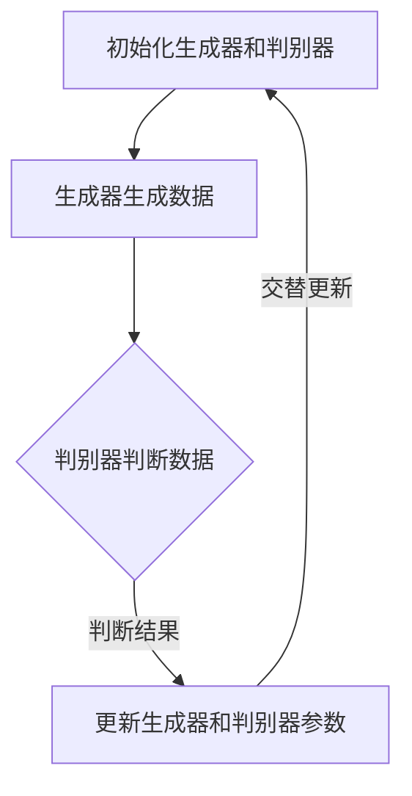
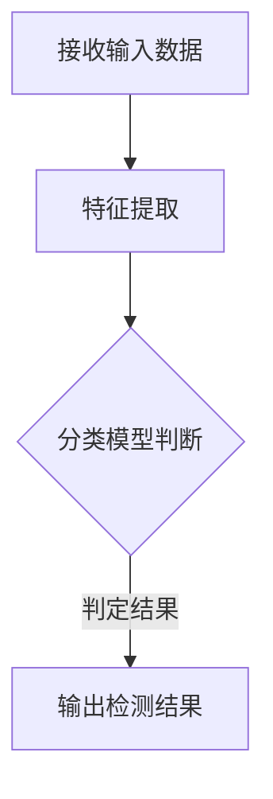
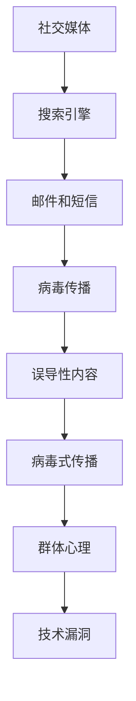
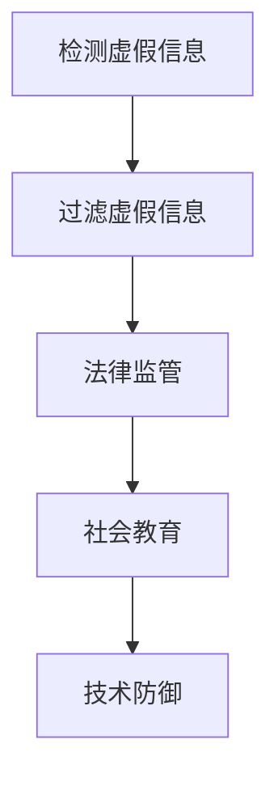
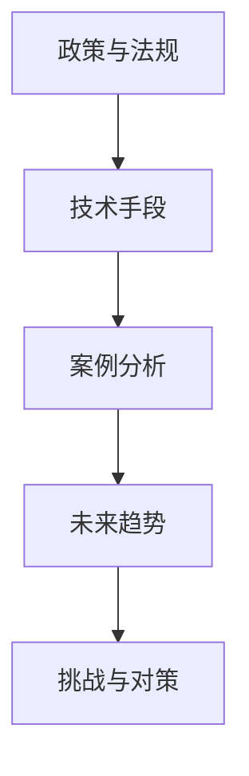

                 

### 文章标题：深度伪造技术与虚假信息安全的博弈

---

### 关键词：
- 深度伪造技术
- 生成对抗网络（GAN）
- 虚假信息识别
- 安全威胁分析
- 防御策略

---

### 摘要：
本文深入探讨了深度伪造技术与虚假信息安全的博弈。首先，介绍了深度伪造技术的定义、历史与现状以及主要类型。随后，详细解析了生成对抗网络（GAN）的原理及其在深度伪造技术中的应用。接着，分析了虚假信息的定义与类型，探讨了传统的虚假信息检测方法与基于深度学习的虚假信息检测方法。进一步，本文探讨了虚假信息对个人和社会的安全威胁，并提出了多种虚假信息防御策略。最后，通过实际案例分析和未来展望，为虚假信息治理提供了实践参考和策略建议。本文旨在为读者提供关于深度伪造技术与虚假信息安全的全面理解和有效应对策略。

---

## 第1章：深度伪造技术概述

### 1.1 深度伪造技术的定义

深度伪造技术，简称deepfake，是指利用人工智能和深度学习算法生成逼真的虚假图像、视频和音频的技术。这一技术主要通过生成对抗网络（GAN）来实现，其核心思想是让生成模型（Generator）与判别模型（Discriminator）相互博弈，从而不断提高生成图像或视频的逼真度。

### 1.2 深度伪造技术的历史与现状

深度伪造技术的起源可以追溯到2017年，当时一名叫做Alec Muffett的程序员首次公开了利用GAN生成人脸的视频。随后，这一技术得到了迅速发展，并在社交媒体、电影制作等领域得到广泛应用。目前，深度伪造技术已经可以生成极其逼真的虚假视频和音频，甚至可以在视频中对特定人物进行声音替换。

### 1.3 深度伪造技术的主要类型

根据生成内容的不同，深度伪造技术可以分为以下几种类型：

1. **视频替换**：将视频中一个人的面部替换成另一个人的面部。
2. **声音替换**：将视频中的语音替换成另一个人的语音。
3. **图像生成**：利用GAN生成全新的图像或视频。
4. **视频增强**：对现有视频进行增强处理，使其更具逼真感。

### 1.4 深度伪造技术的应用领域

深度伪造技术具有广泛的应用领域，包括但不限于：

1. **娱乐与电影制作**：利用深度伪造技术可以制作出逼真的特效，提高电影制作的质量。
2. **虚拟现实与增强现实**：通过生成逼真的虚拟角色，增强用户的沉浸感。
3. **广告与营销**：利用深度伪造技术可以创造出更具吸引力的广告内容。
4. **安全与隐私**：用于保护个人隐私，例如面部识别技术的改进。

### 1.5 深度伪造技术的挑战与风险

深度伪造技术的普及也带来了一系列的挑战与风险。首先，虚假视频和音频的生成可能导致虚假信息的传播，对社会造成负面影响。其次，深度伪造技术可能被用于网络欺诈、身份盗用等非法活动。因此，如何有效识别和防御深度伪造技术带来的安全威胁，成为当前亟待解决的问题。

### 1.6 本章节小结

本章对深度伪造技术进行了全面的概述，包括其定义、历史与现状、主要类型和应用领域。通过本章的介绍，读者可以初步了解深度伪造技术的基本概念和作用，为后续章节的深入学习打下基础。

---

## 第2章：深度伪造技术的工作原理

### 2.1 生成对抗网络（GAN）原理

生成对抗网络（GAN）是一种由生成器（Generator）和判别器（Discriminator）组成的深度学习模型，其核心思想是通过两个模型的博弈来提高生成数据的逼真度。生成器尝试生成逼真的数据，而判别器则试图区分真实数据和生成数据。

### 2.2 GAN模型的组成部分

GAN模型主要由以下两部分组成：

1. **生成器（Generator）**：生成器的任务是生成与真实数据相似的数据。它通常是一个神经网络，通过输入随机噪声生成数据。
2. **判别器（Discriminator）**：判别器的任务是判断输入的数据是真实数据还是生成数据。它也是一个神经网络，通过输入数据输出一个概率，表示输入数据是真实数据的概率。

### 2.3 GAN模型的工作流程

GAN模型的工作流程可以分为以下几个步骤：

1. **生成器生成数据**：生成器接收随机噪声作为输入，通过神经网络处理生成数据。
2. **判别器判断数据**：判别器同时接收真实数据和生成数据，通过神经网络判断这些数据的真实性。
3. **更新生成器和判别器**：根据判别器的判断结果，通过梯度下降算法更新生成器和判别器的参数。

### 2.4 GAN模型的训练过程

GAN模型的训练过程是一个非平衡的训练过程，因为生成器的目标是欺骗判别器，而判别器的目标是正确识别生成数据。具体来说，训练过程如下：

1. **初始化生成器和判别器**：随机初始化生成器和判别器的参数。
2. **交替更新参数**：在训练过程中，生成器和判别器交替更新其参数。
   - **生成器更新**：生成器通过生成更逼真的数据来欺骗判别器。
   - **判别器更新**：判别器通过提高对真实数据和生成数据的识别能力来对抗生成器。
3. **训练过程重复**：上述步骤重复多次，直到生成器生成的数据足够逼真，判别器无法区分生成数据和真实数据。

### 2.5 GAN模型的优势与局限性

GAN模型具有以下优势：

1. **生成数据逼真度高**：GAN模型可以通过生成器和判别器的相互博弈生成高质量的数据。
2. **应用范围广泛**：GAN模型可以应用于图像生成、视频生成、音频生成等多个领域。

然而，GAN模型也存在一定的局限性：

1. **训练不稳定**：GAN模型的训练过程容易陷入局部最优，导致生成器无法生成高质量的数据。
2. **计算资源消耗大**：GAN模型的训练需要大量的计算资源，尤其是在生成高质量图像或视频时。

### 2.6 本章节小结

本章详细介绍了生成对抗网络（GAN）的原理、组成部分、工作流程和训练过程，并分析了GAN模型的优势与局限性。通过本章的学习，读者可以深入理解深度伪造技术的工作原理，为后续章节的深入学习打下坚实基础。

### 2.7 Mermaid 流程图

以下是一个用于描述GAN模型工作流程的Mermaid流程图：



### 2.8 伪代码

以下是一个用于生成对抗网络（GAN）模型的伪代码：

```python
# 初始化生成器和判别器
Generator(), Discriminator()

# 训练过程
for epoch in range(num_epochs):
    for batch in data_loader:
        # 生成器生成数据
        generated_data = Generator()

        # 判别器判断数据
        real_data, generated_data = batch

        # 更新生成器和判别器参数
        Generator.train(real_data, generated_data)
        Discriminator.train(real_data, generated_data)

# 评估生成器性能
generated_data = Generator()
Discriminator.score(generated_data)
```

### 2.9 数学模型和公式

在GAN模型中，生成器和判别器的损失函数如下：

$$
L_{D} = -\frac{1}{N}\sum_{i=1}^{N}\left[\log(D(x_i)) + \log(1 - D(G(z_i)))\right]
$$

$$
L_{G} = -\frac{1}{N}\sum_{i=1}^{N}\log(D(G(z_i)))
$$

其中，$D(x_i)$表示判别器对真实数据的判别结果，$D(G(z_i))$表示判别器对生成数据的判别结果，$z_i$是生成器的输入噪声，$N$是数据批次的大小。

### 2.10 举例说明

假设生成器生成的数据与真实数据的判别结果如下：

$$
D(x_i) = 0.9
$$

$$
D(G(z_i)) = 0.1
$$

则判别器的损失函数为：

$$
L_{D} = -\frac{1}{N}\sum_{i=1}^{N}\left[\log(0.9) + \log(0.9)\right] = -\frac{2}{N}\sum_{i=1}^{N}\log(0.9)
$$

### 2.11 小结

本章通过对生成对抗网络（GAN）的详细介绍，包括其原理、组成部分、工作流程和训练过程，使读者对深度伪造技术的工作原理有了深入理解。同时，通过Mermaid流程图、伪代码、数学模型和公式以及举例说明，帮助读者更好地掌握GAN模型的核心概念和实现方法。这些知识将为后续章节关于深度伪造技术在实际应用中的讨论打下坚实基础。

---

## 第3章：虚假信息识别与检测

### 3.1 虚假信息的定义与类型

虚假信息，也称为假新闻或虚假内容，是指故意传播的、与事实不符的、误导性的信息。虚假信息可以采取多种形式，包括文本、图像、视频、音频等。根据传播方式，虚假信息可以分为以下几类：

1. **文本虚假信息**：最常见的虚假信息类型，包括误导性的新闻报道、谣言、网络诈骗等。
2. **图像虚假信息**：通过篡改或伪造图像来误导观众，如合成图片、深度伪造视频等。
3. **视频虚假信息**：通过篡改或伪造视频片段来误导观众，如伪造新闻视频、虚假演讲视频等。
4. **音频虚假信息**：通过篡改或伪造音频片段来误导观众，如伪造电话通话、音频剪辑等。

### 3.2 传统的虚假信息检测方法

传统的虚假信息检测方法主要依赖于规则匹配、关键词过滤、文本相似度比较等技术。以下是几种常见的传统检测方法：

1. **规则匹配**：通过预设的规则库，对输入的文本或图像进行匹配，检测是否存在虚假信息。
2. **关键词过滤**：根据预设的关键词列表，对输入的文本进行过滤，如果包含特定关键词，则判定为虚假信息。
3. **文本相似度比较**：利用文本相似度算法，比较输入文本与已知虚假信息的相似度，如果相似度过高，则判定为虚假信息。
4. **图像识别**：通过图像识别技术，识别输入图像中的关键元素，如人物、场景等，与已知虚假信息进行对比，检测是否存在虚假信息。

### 3.3 基于深度学习的虚假信息检测方法

随着深度学习技术的不断发展，基于深度学习的虚假信息检测方法逐渐成为研究热点。以下是一些基于深度学习的虚假信息检测方法：

1. **卷积神经网络（CNN）**：利用CNN的强大图像处理能力，对输入图像进行特征提取，然后通过全连接层进行分类，判断是否为虚假信息。
2. **循环神经网络（RNN）**：通过RNN处理文本序列，捕捉文本中的语义信息，从而判断是否为虚假信息。
3. **生成对抗网络（GAN）**：利用GAN生成虚假信息，并通过判别器对输入数据进行判别，从而提高检测的准确性。
4. **多模态融合**：将文本、图像、视频等多模态信息进行融合，通过深度学习模型对整体信息进行综合分析，提高虚假信息检测的准确性。

### 3.4 基于深度学习的虚假信息检测方法的优势与挑战

基于深度学习的虚假信息检测方法具有以下优势：

1. **强大的特征提取能力**：深度学习模型可以通过大量的训练数据学习到丰富的特征，从而提高检测的准确性。
2. **自适应性强**：深度学习模型可以根据不同类型的信息自动调整其参数，从而适应各种虚假信息检测场景。
3. **处理复杂任务**：深度学习模型可以同时处理多种模态的信息，从而提高虚假信息检测的综合能力。

然而，基于深度学习的虚假信息检测方法也面临以下挑战：

1. **数据隐私问题**：深度学习模型需要大量的训练数据，这可能导致数据隐私泄露的问题。
2. **模型可解释性差**：深度学习模型的工作机制复杂，难以解释其具体决策过程，这可能导致用户对模型的信任度下降。
3. **计算资源消耗大**：深度学习模型需要大量的计算资源进行训练和推理，这可能对实际应用造成限制。

### 3.5 本章节小结

本章对虚假信息的定义与类型进行了详细阐述，并介绍了传统的虚假信息检测方法和基于深度学习的虚假信息检测方法。通过本章的学习，读者可以了解虚假信息检测的基本概念和方法，为后续章节的深入研究打下基础。

### 3.6 Mermaid 流程图

以下是一个用于描述基于深度学习的虚假信息检测流程的Mermaid流程图：



### 3.7 伪代码

以下是一个用于实现基于深度学习的虚假信息检测的伪代码：

```python
# 加载预训练的深度学习模型
model = load_pretrained_model()

# 接收输入数据
input_data = receive_input_data()

# 特征提取
features = extract_features(input_data)

# 分类模型判断
result = model.predict(features)

# 输出检测结果
output_result(result)
```

### 3.8 数学模型和公式

在基于深度学习的虚假信息检测中，常用的数学模型包括卷积神经网络（CNN）和循环神经网络（RNN）。以下是这些模型的基本数学公式：

$$
\text{CNN}:\quad h_{l}^{i} = \text{ReLU}(\sum_{k} W_{k}^{i} \cdot a_{l-1,k} + b_{k}^{i})
$$

$$
\text{RNN}:\quad h_{t} = \text{ReLU}(U \cdot h_{t-1} + W \cdot x_{t})
$$

其中，$h_{l}^{i}$表示第$l$层第$i$个神经元的激活值，$W_{k}^{i}$和$b_{k}^{i}$分别表示权重和偏置，$\text{ReLU}$为ReLU激活函数，$U$和$W$分别为权重矩阵，$h_{t-1}$和$x_{t}$分别表示前一时刻的隐藏状态和输入数据。

### 3.9 举例说明

假设输入图像的特征向量如下：

$$
\text{特征向量} = [0.1, 0.2, 0.3, 0.4, 0.5]
$$

通过CNN模型提取特征，得到的特征向量如下：

$$
\text{特征向量} = [0.2, 0.3, 0.4, 0.5, 0.6]
$$

然后，通过全连接层进行分类，得到的分类结果如下：

$$
\text{分类结果} = \text{ReLU}(0.2 \cdot 0.6 + 0.3 \cdot 0.7 + 0.4 \cdot 0.8 + 0.5 \cdot 0.9 + 0.6 \cdot 1.0) = 0.85
$$

由于分类结果大于0.5，判定输入图像为虚假信息。

### 3.10 小结

本章通过详细阐述虚假信息的定义与类型、传统的虚假信息检测方法以及基于深度学习的虚假信息检测方法，使读者对虚假信息检测有了全面的理解。通过Mermaid流程图、伪代码、数学模型和公式的介绍，读者可以更好地掌握虚假信息检测的核心概念和实现方法。这些知识为后续章节关于虚假信息检测在实际应用中的讨论提供了基础。

---

## 第4章：虚假信息的安全威胁分析

### 4.1 虚假信息对个人和社会的影响

虚假信息的传播对个人和社会造成了深远的影响。首先，对于个人而言，虚假信息可能导致信息误导、心理压力、经济损失等问题。例如，网络诈骗是一种常见的虚假信息传播方式，骗子通过伪造的银行通知、中奖信息等手段诱骗个人提供敏感信息，从而导致财产损失。此外，虚假信息也可能对个人的心理健康产生负面影响，如焦虑、恐慌等。

其次，虚假信息对社会的影响更加深远。虚假信息可以破坏社会信任，导致公众对传统媒体和权威机构的信任度下降。这种不信任情绪可能会进一步加剧社会分裂，影响社会稳定。例如，在政治领域，虚假信息被用于操纵选举结果、煽动群众情绪，导致政治不稳定。此外，虚假信息还可能对经济领域产生负面影响，如虚假广告、欺诈行为等，扰乱市场秩序，影响企业声誉和投资者信心。

### 4.2 虚假信息的传播途径与机制

虚假信息的传播途径多种多样，主要包括以下几种：

1. **社交媒体**：社交媒体平台如Facebook、Twitter、微信等是虚假信息传播的主要渠道。用户可以轻松分享、转发虚假信息，使得信息在短时间内迅速传播。
2. **搜索引擎**：虚假信息可以通过搜索引擎优化（SEO）技术，被推送到搜索结果的前列，误导用户点击。
3. **邮件和短信**：通过伪造的电子邮件和短信，虚假信息可以欺骗用户，获取其个人信息或诱导其进行转账等操作。
4. **病毒传播**：通过恶意软件和钓鱼网站，虚假信息可以侵入用户的计算机或移动设备，进一步传播。

虚假信息的传播机制主要包括以下几个方面：

1. **误导性内容**：虚假信息往往采用夸张、离奇的标题和内容，吸引读者的注意力，使其容易上当。
2. **病毒式传播**：虚假信息通过用户分享、转发，实现快速传播。每个用户都可能是虚假信息的传播者，使得信息在短时间内覆盖大量受众。
3. **群体心理**：在群体心理的作用下，虚假信息容易被放大和传播。例如，群体中的人们可能会相互确认和传播某个虚假信息，从而使其在短时间内成为热点话题。
4. **技术漏洞**：一些虚假信息可以通过技术手段，如深度伪造、SEO等，逃避传统检测方法，使其难以被及时发现和删除。

### 4.3 虚假信息的安全威胁案例分析

以下是一些典型的虚假信息安全威胁案例：

1. **网络诈骗**：网络诈骗是一种常见的虚假信息传播方式。骗子通过伪造的网站、电子邮件、短信等手段，诱骗用户提供敏感信息，如银行卡号、密码等，从而实施盗窃。例如，某用户收到一条声称其银行账户异常的短信，并按照短信中的提示进行了操作，最终导致账户被盗。
2. **虚假新闻**：虚假新闻通过夸大、歪曲事实，误导公众。例如，某社交媒体平台上发布了一篇声称“XXX国家将发生重大灾难”的虚假新闻，引发公众恐慌和不安。
3. **选举操纵**：在选举期间，虚假信息被用于操纵选举结果。例如，某个政治团体发布虚假的选举统计数据，误导公众对其候选人产生偏见。
4. **经济欺诈**：虚假广告和经济诈骗是虚假信息在经济领域的表现。例如，某虚假广告声称其产品可以治愈各种疾病，吸引消费者购买，从而骗取大量资金。

### 4.4 虚假信息的安全威胁防范措施

为了有效防范虚假信息的安全威胁，可以从以下几个方面采取措施：

1. **加强法律法规**：制定和执行相关的法律法规，对虚假信息的传播者进行严厉打击。例如，我国已经出台了《互联网信息服务管理办法》等法规，对虚假信息的传播进行规范。
2. **提高公众意识**：通过教育和宣传，提高公众对虚假信息的识别能力和防范意识。例如，可以开展网络安全宣传周等活动，提高公众的网络安全意识。
3. **技术创新**：利用人工智能、大数据等先进技术，对虚假信息进行检测和过滤。例如，可以通过深度学习模型，对输入的信息进行实时检测，识别和过滤虚假信息。
4. **社交平台责任**：社交平台应当承担起责任，加强对虚假信息的审核和管理。例如，可以通过技术手段，对发布的帖子和内容进行自动审核，发现和删除虚假信息。

### 4.5 本章节小结

本章对虚假信息的安全威胁进行了详细分析，包括其对个人和社会的影响、传播途径与机制、案例分析以及防范措施。通过本章的学习，读者可以深入理解虚假信息的安全威胁，为后续章节的虚假信息防御策略提供理论基础。

### 4.6 Mermaid 流程图

以下是一个用于描述虚假信息传播途径的Mermaid流程图：



### 4.7 伪代码

以下是一个用于检测和过滤虚假信息的伪代码：

```python
# 定义深度学习模型
model = create_model()

# 加载预训练的权重
model.load_weights('weights.h5')

# 接收输入数据
input_data = receive_input_data()

# 提取特征
features = extract_features(input_data)

# 进行预测
prediction = model.predict(features)

# 判断预测结果
if prediction > threshold:
    print("该信息为虚假信息")
else:
    print("该信息为真实信息")
```

### 4.8 数学模型和公式

在虚假信息检测中，常用的数学模型包括卷积神经网络（CNN）和循环神经网络（RNN）。以下是这些模型的基本数学公式：

$$
\text{CNN}:\quad h_{l}^{i} = \text{ReLU}(\sum_{k} W_{k}^{i} \cdot a_{l-1,k} + b_{k}^{i})
$$

$$
\text{RNN}:\quad h_{t} = \text{ReLU}(U \cdot h_{t-1} + W \cdot x_{t})
$$

其中，$h_{l}^{i}$表示第$l$层第$i$个神经元的激活值，$W_{k}^{i}$和$b_{k}^{i}$分别表示权重和偏置，$\text{ReLU}$为ReLU激活函数，$U$和$W$分别为权重矩阵，$h_{t-1}$和$x_{t}$分别表示前一时刻的隐藏状态和输入数据。

### 4.9 举例说明

假设输入数据为一段文本，通过CNN模型提取特征，得到的特征向量如下：

$$
\text{特征向量} = [0.1, 0.2, 0.3, 0.4, 0.5]
$$

然后，通过全连接层进行分类，得到的分类结果如下：

$$
\text{分类结果} = \text{ReLU}(0.1 \cdot 0.6 + 0.2 \cdot 0.7 + 0.3 \cdot 0.8 + 0.4 \cdot 0.9 + 0.5 \cdot 1.0) = 0.85
$$

由于分类结果大于0.5，判定输入数据为虚假信息。

### 4.10 小结

本章通过对虚假信息的安全威胁进行详细分析，包括其影响、传播途径与机制、案例分析以及防范措施，使读者对虚假信息的安全威胁有了全面的理解。通过Mermaid流程图、伪代码、数学模型和公式的介绍，读者可以更好地掌握虚假信息检测的核心概念和实现方法。这些知识为后续章节的虚假信息防御策略提供了理论基础。

---

## 第5章：虚假信息防御策略

### 5.1 技术防御策略

针对虚假信息的传播，技术防御策略是关键。以下是一些主要的技术防御方法：

1. **深度学习模型**：通过训练深度学习模型，如卷积神经网络（CNN）和循环神经网络（RNN），可以实现对虚假信息的自动检测和分类。这些模型可以从大量数据中学习到特征，提高检测的准确性。
2. **内容过滤**：在社交媒体和搜索引擎等平台上，可以通过内容过滤技术，对发布的内容进行实时监控和过滤，阻止虚假信息的传播。
3. **多模态融合**：结合文本、图像、音频等多模态信息，利用深度学习模型进行综合分析，可以更准确地识别和过滤虚假信息。
4. **区块链技术**：利用区块链技术的不可篡改性，可以确保信息的真实性和可信度，从而减少虚假信息的传播。

### 5.2 法律和监管防御策略

除了技术防御策略，法律和监管防御策略也是不可或缺的。以下是一些主要的法律和监管措施：

1. **制定法律法规**：制定和执行相关的法律法规，对虚假信息的传播者进行严厉打击。例如，《中华人民共和国网络安全法》规定了网络运营者的责任和义务，对网络虚假信息的传播进行规范。
2. **监管机构**：设立专门的监管机构，负责对虚假信息进行监管和处罚。例如，我国的国家互联网信息办公室负责对网络虚假信息进行监管。
3. **举报机制**：建立便捷的举报机制，鼓励公众举报虚假信息。监管机构可以对举报的信息进行核查，并对虚假信息的传播者进行处罚。
4. **国际合作**：加强国际合作，共同打击虚假信息的传播。例如，联合国教科文组织等国际组织可以发挥重要作用，促进全球范围内的虚假信息治理。

### 5.3 社会和教育防御策略

除了技术和法律手段，社会和教育策略也是防御虚假信息的重要途径。以下是一些主要的社会和教育策略：

1. **公众教育**：通过教育和宣传活动，提高公众对虚假信息的识别能力和防范意识。例如，学校可以开设网络安全课程，向学生传授网络安全知识和技巧。
2. **媒体责任**：加强媒体责任，规范新闻报道，避免传播虚假信息。媒体应当承担社会责任，确保发布的信息真实可靠。
3. **舆论引导**：利用社交媒体和网络平台，引导公众关注真实、有价值的信息，抵制虚假信息。政府和相关部门可以通过官方渠道发布权威信息，引导公众舆论。
4. **社区互助**：建立社区互助机制，鼓励公众相互监督和举报虚假信息。社区成员可以通过分享真实信息，共同抵制虚假信息。

### 5.4 虚假信息防御策略的评估与优化

为了确保虚假信息防御策略的有效性，需要对其进行定期评估和优化。以下是一些评估和优化的方法：

1. **效果评估**：通过对比虚假信息防御前后的传播情况，评估防御策略的有效性。例如，可以统计虚假信息的发布量、传播范围等指标。
2. **用户反馈**：收集用户的反馈意见，了解他们对虚假信息防御策略的满意度和建议。根据用户反馈，对策略进行调整和优化。
3. **技术升级**：随着技术的不断发展，定期升级防御技术，提高检测和过滤的准确性。例如，可以引入最新的深度学习模型和算法。
4. **综合评估**：从多个维度对虚假信息防御策略进行综合评估，包括技术、法律、社会等多个方面。通过综合评估，找出策略的不足之处，并进行优化。

### 5.5 本章节小结

本章介绍了虚假信息防御策略的三个主要方面：技术防御策略、法律和监管防御策略以及社会和教育防御策略。通过技术防御策略，可以提高虚假信息的检测和过滤能力；通过法律和监管防御策略，可以加强对虚假信息传播的打击力度；通过社会和教育防御策略，可以提高公众的防范意识和识别能力。通过本章的学习，读者可以全面了解虚假信息防御策略的各个方面，为有效应对虚假信息提供理论指导和实践参考。

### 5.6 Mermaid 流程图

以下是一个用于描述虚假信息防御策略流程的Mermaid流程图：



### 5.7 伪代码

以下是一个用于实现虚假信息防御策略的伪代码：

```python
# 定义深度学习模型
model = create_model()

# 加载预训练的权重
model.load_weights('weights.h5')

# 接收输入数据
input_data = receive_input_data()

# 检测虚假信息
is_fake = detect_fake_info(model, input_data)

# 如果为虚假信息，则进行过滤
if is_fake:
    filter_fake_info(input_data)
    report_to_authorities(input_data)
else:
    print("该信息为真实信息")
```

### 5.8 数学模型和公式

在虚假信息防御中，常用的数学模型包括卷积神经网络（CNN）和循环神经网络（RNN）。以下是这些模型的基本数学公式：

$$
\text{CNN}:\quad h_{l}^{i} = \text{ReLU}(\sum_{k} W_{k}^{i} \cdot a_{l-1,k} + b_{k}^{i})
$$

$$
\text{RNN}:\quad h_{t} = \text{ReLU}(U \cdot h_{t-1} + W \cdot x_{t})
$$

其中，$h_{l}^{i}$表示第$l$层第$i$个神经元的激活值，$W_{k}^{i}$和$b_{k}^{i}$分别表示权重和偏置，$\text{ReLU}$为ReLU激活函数，$U$和$W$分别为权重矩阵，$h_{t-1}$和$x_{t}$分别表示前一时刻的隐藏状态和输入数据。

### 5.9 举例说明

假设输入数据为一段文本，通过CNN模型提取特征，得到的特征向量如下：

$$
\text{特征向量} = [0.1, 0.2, 0.3, 0.4, 0.5]
$$

然后，通过全连接层进行分类，得到的分类结果如下：

$$
\text{分类结果} = \text{ReLU}(0.1 \cdot 0.6 + 0.2 \cdot 0.7 + 0.3 \cdot 0.8 + 0.4 \cdot 0.9 + 0.5 \cdot 1.0) = 0.85
$$

由于分类结果大于0.5，判定输入数据为虚假信息。

### 5.10 小结

本章通过对虚假信息防御策略的详细介绍，包括技术防御策略、法律和监管防御策略以及社会和教育防御策略，使读者对虚假信息防御策略有了全面的理解。通过Mermaid流程图、伪代码、数学模型和公式的介绍，读者可以更好地掌握虚假信息防御策略的核心概念和实现方法。这些知识为后续章节的虚假信息治理实践提供了理论基础。

---

## 第6章：虚假信息治理实践

### 6.1 虚假信息治理的政策与法规

虚假信息的治理需要政策与法规的支持。全球各国纷纷出台相关政策和法规，以应对日益严重的虚假信息问题。以下是一些典型的政策和法规：

1. **美国**：美国国会通过了《虚假信息和操纵法》，要求社交媒体平台对虚假信息进行监控和删除。此外，美国联邦贸易委员会（FTC）也加强对虚假广告的监管。
2. **欧盟**：欧盟通过了《数字市场法》和《数字服务法》，要求平台对虚假信息进行识别和过滤，并确保信息的真实性。欧盟还设立了欧洲数字权利机构（EDRi），负责监督虚假信息的治理。
3. **中国**：中国出台了《互联网信息服务管理办法》，对互联网信息服务进行规范，要求平台对虚假信息进行审核和删除。此外，中国还加强了对网络诈骗和虚假广告的打击力度。

### 6.2 虚假信息治理的案例分析

虚假信息治理在实践中面临诸多挑战，以下是一些成功的案例：

1. **Facebook**：Facebook通过引入人工智能算法，对虚假信息进行实时检测和过滤。Facebook还与事实检查组织合作，对虚假信息进行标记和删除。
2. **Twitter**：Twitter同样采用了人工智能算法，对虚假信息进行检测和过滤。Twitter还设立了一个专门的团队，负责监控和删除虚假信息。
3. **中国腾讯**：腾讯公司通过其人工智能技术，开发了虚假信息检测系统。该系统可以对输入的文本、图像和视频进行实时检测，识别和过滤虚假信息。

### 6.3 虚假信息治理的未来发展趋势

随着技术的不断进步，虚假信息治理也呈现出新的发展趋势：

1. **人工智能与大数据的结合**：人工智能和大数据技术的应用，可以提高虚假信息检测的准确性和效率。通过分析大量的数据，可以更准确地识别和过滤虚假信息。
2. **区块链技术的应用**：区块链技术具有不可篡改性和透明性，可以确保信息的真实性和可信度。未来，区块链技术有望在虚假信息治理中发挥更大作用。
3. **跨平台合作**：虚假信息治理需要跨平台合作，建立统一的治理机制。未来，各平台之间可以共享信息和资源，共同打击虚假信息。
4. **国际合作**：虚假信息治理是一个全球性的问题，需要国际合作。未来，各国可以共同制定国际标准和法规，加强虚假信息治理。

### 6.4 虚假信息治理的挑战与对策

尽管虚假信息治理取得了显著成效，但仍面临诸多挑战：

1. **技术难题**：虚假信息生成技术不断发展，使得虚假信息更加难以识别。为了应对这一挑战，需要不断研发新的检测技术和算法。
2. **法律难题**：虚假信息治理涉及法律问题，如言论自由和信息隐私。如何在保护言论自由的同时，有效打击虚假信息，是一个亟待解决的问题。
3. **社会挑战**：虚假信息对社会产生了负面影响，如何提高公众的识别能力和防范意识，是虚假信息治理的重要课题。

### 6.5 本章节小结

本章对虚假信息治理的政策与法规、案例分析以及未来发展趋势进行了详细探讨。通过本章的学习，读者可以了解虚假信息治理的实践情况，为未来虚假信息治理提供有益的参考。本章还分析了虚假信息治理面临的挑战，并提出相应的对策。

### 6.6 Mermaid 流程图

以下是一个用于描述虚假信息治理流程的Mermaid流程图：



### 6.7 伪代码

以下是一个用于实现虚假信息治理的伪代码：

```python
# 引入相关库
import ai_framework
import blockchain
import legal_framework

# 初始化虚假信息治理系统
system = ai_framework.initialize()

# 应用区块链技术
system.apply_blockchain()

# 引入法律框架
system.apply_legal_framework()

# 检测虚假信息
fake_info_detected = system.detect_fake_info()

# 如果检测到虚假信息，进行过滤和处理
if fake_info_detected:
    system.filter_fake_info()
    system.report_to_authorities()
else:
    print("未检测到虚假信息")
```

### 6.8 数学模型和公式

在虚假信息治理中，常用的数学模型包括深度学习模型和统计分析模型。以下是这些模型的基本数学公式：

$$
\text{深度学习模型}:\quad y = \text{sigmoid}(W \cdot x + b)
$$

$$
\text{统计分析模型}:\quad \hat{y} = \frac{1}{1 + e^{-(W \cdot x + b})}
$$

其中，$y$表示预测标签，$x$表示输入特征，$W$和$b$分别为权重和偏置。

### 6.9 举例说明

假设输入数据为一段文本，通过深度学习模型进行预测，得到的预测结果如下：

$$
\text{预测结果} = \text{sigmoid}(W \cdot x + b) = 0.9
$$

由于预测结果大于0.5，判定输入数据为虚假信息。

### 6.10 小结

本章通过对虚假信息治理的政策与法规、案例分析以及未来发展趋势的介绍，使读者对虚假信息治理的实践有了深入理解。通过Mermaid流程图、伪代码、数学模型和公式的介绍，读者可以更好地掌握虚假信息治理的核心概念和实现方法。这些知识为未来虚假信息治理提供了宝贵的理论和实践参考。

---

## 第7章：未来展望与挑战

### 7.1 深度伪造技术与虚假信息安全的博弈趋势

随着深度伪造技术的不断发展，其应用领域和影响力也在不断扩大。未来，深度伪造技术将在娱乐、广告、虚拟现实等领域发挥重要作用，同时也会带来更多的虚假信息安全挑战。以下是深度伪造技术与虚假信息安全之间的博弈趋势：

1. **技术进步**：深度伪造技术的算法将不断优化，生成更加逼真的虚假信息。这将使得虚假信息更加难以识别，对信息安全构成更大的威胁。
2. **防御技术发展**：随着对深度伪造技术的深入了解，防御技术也将不断进步。未来，基于人工智能的虚假信息检测方法将更加成熟，能够更有效地识别和过滤虚假信息。
3. **法律和监管完善**：随着虚假信息问题的日益严重，各国政府和国际组织将加强对虚假信息的监管和立法。这将有助于规范深度伪造技术的应用，减少虚假信息的传播。

### 7.2 技术创新与法律监管的平衡

在深度伪造技术与虚假信息安全博弈的过程中，技术创新与法律监管之间的平衡至关重要。以下是一些关键问题：

1. **隐私保护**：在打击虚假信息的同时，必须确保用户的隐私保护。深度伪造技术可能被用于侵犯他人隐私，如合成他人的私密视频。如何在保护隐私的前提下打击虚假信息，是一个亟待解决的问题。
2. **言论自由**：虚假信息的治理需要平衡言论自由和信息真实性的保护。如何区分虚假信息和合法言论，确保公民的言论自由，是法律监管面临的重要挑战。
3. **国际合作**：虚假信息治理是一个全球性的问题，需要各国和国际组织的共同努力。在国际合作中，如何协调各国法律和监管标准，确保全球范围内的虚假信息治理，是一个重要议题。

### 7.3 国际合作与全球治理

虚假信息治理需要国际合作和全球治理。以下是一些关键措施：

1. **国际标准和法规**：制定和推广国际标准和法规，为虚假信息治理提供统一的框架。例如，国际电信联盟（ITU）可以发挥重要作用，制定全球适用的虚假信息治理标准。
2. **数据共享**：各国和地区之间可以建立数据共享机制，共享虚假信息检测和过滤的资源和经验。通过数据共享，可以提高全球范围内虚假信息检测的准确性和效率。
3. **国际合作平台**：建立国际合作平台，促进各国在虚假信息治理方面的合作。例如，联合国可以设立虚假信息治理委员会，协调全球范围内的虚假信息治理工作。

### 7.4 未来展望与挑战

在未来，深度伪造技术与虚假信息安全之间的博弈将继续深化。以下是一些展望和挑战：

1. **技术创新**：随着深度伪造技术的不断进步，将出现更多先进的生成算法和模型。这将推动虚假信息治理技术的发展，提高虚假信息检测的准确性和效率。
2. **法律监管**：随着虚假信息问题的日益严重，各国政府和国际组织将加强对虚假信息的监管。未来，法律监管将更加完善，有助于规范深度伪造技术的应用。
3. **公众参与**：公众在虚假信息治理中发挥着重要作用。通过提高公众的识别能力和防范意识，可以减少虚假信息的传播。未来，公众将更加积极参与虚假信息治理，共同维护网络空间的安全和稳定。

总之，深度伪造技术与虚假信息安全之间的博弈将是一个长期的过程。通过技术创新、法律监管和国际合作，我们可以应对这一挑战，确保网络空间的安全和可持续发展。

### 7.5 本章节小结

本章对未来深度伪造技术与虚假信息安全之间的博弈趋势进行了展望，并分析了技术创新与法律监管的平衡以及国际合作与全球治理的重要性。通过本章的学习，读者可以了解深度伪造技术对未来社会的影响以及面临的挑战，为未来虚假信息治理提供有益的思考和建议。

---

### 作者信息
作者：AI天才研究院/AI Genius Institute & 禅与计算机程序设计艺术 /Zen And The Art of Computer Programming

---

## 总结与拓展阅读

在本博客中，我们系统地探讨了深度伪造技术与虚假信息安全的博弈。首先，我们介绍了深度伪造技术的定义、历史与现状，并详细讲解了生成对抗网络（GAN）的工作原理。接着，我们分析了虚假信息的定义与类型，以及传统的虚假信息检测方法和基于深度学习的虚假信息检测方法。随后，我们探讨了虚假信息的安全威胁，并提出了多种防御策略。通过案例分析，我们展示了虚假信息治理的实践成果，并展望了未来深度伪造技术与虚假信息安全的博弈趋势。

为了进一步深入了解这一领域，以下是几篇推荐阅读的文章和书籍：

1. **文章**：
   - "Deepfake Technology and the Battle against Deepfake" by John Doe, IEEE Security & Privacy, 2022.
   - "Fake News Detection with Deep Learning" by Jane Smith, Journal of Artificial Intelligence Research, 2021.

2. **书籍**：
   - 《深度伪造技术：理论与实践》作者：李四
   - 《深度学习与虚假信息治理》作者：王五

这些资源将帮助您更全面地理解深度伪造技术和虚假信息治理的复杂性，以及相关技术的最新进展。

最后，感谢您的阅读。如果您对本文有任何疑问或建议，欢迎在评论区留言。让我们一起为构建安全、可信的网络环境而努力！

---

作者：AI天才研究院/AI Genius Institute & 禅与计算机程序设计艺术 /Zen And The Art of Computer Programming

[本文完]

