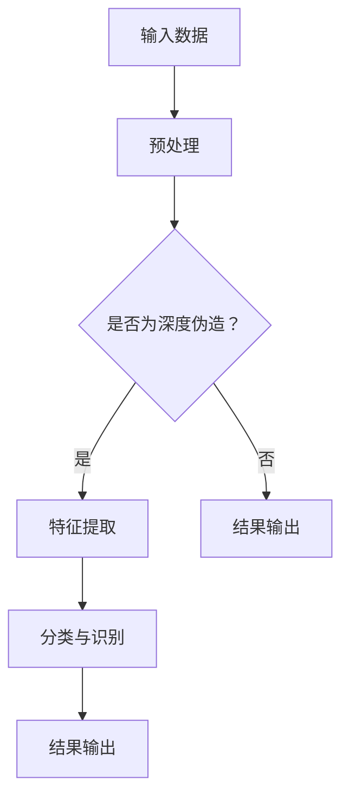

                 

### 文章标题：深度伪造检测：保护企业品牌和信息完整性

### 关键词：深度伪造、检测技术、企业安全、信息完整性、保护措施

### 摘要：

随着人工智能技术的发展，深度伪造（Deepfake）技术正日益成为威胁企业品牌和信息完整性的新隐患。本文旨在深入探讨深度伪造检测的技术原理、方法与应用，帮助企业和组织建立有效的防护策略，以应对这一新兴安全挑战。文章首先介绍深度伪造技术的背景和发展，随后详细分析检测技术的核心原理与实现方法，并通过实际案例展示其应用效果。最后，本文讨论深度伪造检测在法律与伦理方面的考量，以及未来发展趋势与挑战。通过本文的阅读，读者将全面了解深度伪造检测的重要性及其在保障企业品牌和信息完整性方面的关键作用。

### 第1章 深度伪造检测技术基础

#### 1.1 深度伪造技术概述

深度伪造技术，简称“深伪”，是指利用人工智能和深度学习算法，通过生成对抗网络（GAN）等模型，合成出高度逼真的音频、视频、图像和文本内容。这一技术在近年来迅速发展，其应用场景从娱乐、艺术创作逐渐扩展到社交媒体、政治宣传、商业竞争等领域。然而，深度伪造技术的滥用也带来了严重的负面影响，包括隐私泄露、虚假信息传播、声誉损害等。

深度伪造技术的主要挑战在于其逼真度极高，使得人类难以仅凭肉眼识别真伪。此外，随着技术的进步，深度伪造的内容制作成本和难度不断降低，导致其广泛传播和扩散的风险增大。因此，深度伪造检测技术的重要性日益凸显。

#### 1.2 深度伪造技术分类

深度伪造技术可以根据伪造的内容类型分为以下几类：

1. **语音伪造**：通过合成语音，使得伪造者的声音与目标对象的声音高度相似，常用于恶搞、诈骗等场景。
2. **视频伪造**：通过合成视频，使得视频中的人物动作、表情与真实情况完全不符，常用于虚假新闻、诽谤攻击等。
3. **图像伪造**：通过修改或生成新的图像，使得伪造的图像与真实图像难以区分，常用于伪造证件、虚假广告等。
4. **文本伪造**：通过生成文本，使得伪造的文本与目标对象的写作风格高度相似，常用于虚假评论、诈骗邮件等。

#### 1.3 深度伪造检测的意义与价值

深度伪造检测在保护企业品牌和信息完整性方面具有重要作用：

1. **保护企业品牌**：通过及时发现和阻止深度伪造内容在企业内部或外部传播，防止企业品牌受到恶意攻击和破坏。
2. **维护信息安全**：深度伪造技术的滥用可能导致企业内部敏感信息泄露，通过检测技术可以有效防范此类风险。
3. **预防欺诈行为**：深度伪造技术常被用于实施欺诈行为，检测技术有助于识别和阻止这些欺诈行为，保障企业和客户的利益。
4. **提高舆论环境透明度**：通过检测和揭露虚假信息，可以提高公众对舆论环境的认识和警觉，促进社会诚信建设。

#### 1.4 深度伪造检测技术发展趋势

随着深度伪造技术的不断发展，检测技术也在不断创新和演进：

1. **技术演进方向**：从单一的技术手段向多模态检测技术发展，如结合语音、视频、图像等多媒体数据进行综合分析。
2. **算法优化**：通过改进深度学习算法、增强模型训练数据质量等方法，提高检测的准确性和鲁棒性。
3. **硬件加速**：利用GPU、FPGA等硬件加速技术，提高检测效率，满足大规模应用需求。
4. **开放平台与生态**：构建开放性的深度伪造检测平台和生态系统，促进技术交流与合作，共同提升检测技术水平。

### 第2章 深度伪造检测原理

#### 2.1 深度伪造生成模型分析

深度伪造生成模型是深度伪造技术的核心，其中最常用的生成模型是生成对抗网络（GAN）。GAN由生成器和判别器两部分组成，生成器负责生成伪造内容，判别器负责判断伪造内容与真实内容之间的区别。通过对抗训练，生成器不断优化生成质量，使其越来越接近真实内容。

另外，联合变分模型（VAE）也是常用的深度伪造生成模型之一。VAE通过引入变分自编码器的框架，将生成过程分解为编码和解码两个步骤，从而生成高质量的伪造内容。

其他生成模型还包括条件GAN（cGAN）、循环生成网络（RNN-GAN）等，这些模型在特定场景下表现出良好的生成效果。

#### 2.2 深度伪造检测算法原理

深度伪造检测算法主要分为以下几种：

1. **特征提取方法**：通过提取语音、视频、图像等数据中的特征，如时频特征、视觉特征、文本特征等，为后续的检测提供基础。
2. **分类与识别算法**：基于训练好的深度学习模型，对提取的特征进行分类与识别，判断内容是否为深度伪造。
3. **评价指标与优化策略**：通过准确率、召回率、F1分数等评价指标评估检测算法的性能，并采用交叉验证、模型融合等策略优化算法性能。

常见的深度伪造检测算法包括深度神经网络（DNN）、卷积神经网络（CNN）、循环神经网络（RNN）等。这些算法在检测精度和鲁棒性方面具有显著优势。

#### 2.3 Mermaid流程图：深度伪造检测架构



图1：深度伪造检测架构

在该架构中，输入数据经过预处理后，通过特征提取和分类与识别步骤，最终判断内容是否为深度伪造，并输出检测结果。该流程图展示了深度伪造检测的核心步骤和相互关系。

### 第3章 深度伪造检测方法

#### 3.1 基于特征的方法

基于特征的方法是深度伪造检测的一种重要手段，其基本思想是通过提取数据中的特征，然后利用这些特征进行分类和识别。以下是一些常用的特征提取方法：

1. **音频特征分析**：包括时域特征、频域特征、共振峰特征等，如MFCC（梅尔频率倒谱系数）、LPC（线性预测编码）等。
2. **视频特征分析**：包括视觉特征、运动特征等，如HOG（方向梯度直方图）、SIFT（尺度不变特征变换）等。
3. **图像特征分析**：包括纹理特征、形状特征等，如Gabor特征、LBP（局部二值模式）等。
4. **文本特征分析**：包括词频、TF-IDF（词频-逆文档频率）等，如Word2Vec、BERT等。

#### 3.2 基于模型的方法

基于模型的方法是深度伪造检测的另一种重要手段，其基本思想是利用深度学习模型对数据进行训练和预测。以下是一些常用的模型方法：

1. **基于神经网络的方法**：包括卷积神经网络（CNN）、循环神经网络（RNN）、生成对抗网络（GAN）等。
2. **基于深度学习的方法**：包括深度卷积网络（DCNN）、深度循环网络（DRCN）等。
3. **基于机器学习的方法**：包括支持向量机（SVM）、随机森林（RF）、K-最近邻（KNN）等。
4. **基于模型融合的方法**：结合多种模型的优势，提高检测性能，如集成学习、迁移学习等。

#### 3.3 伪代码：深度伪造检测算法实现

```python
def deep_fake_detection(data):
    # 预处理
    preprocessed_data = preprocess_data(data)
    
    # 特征提取
    features = extract_features(preprocessed_data)
    
    # 模型训练
    model = train_model(features)
    
    # 检测
    prediction = model.predict(features)
    
    # 结果输出
    output_result(prediction)
```

在该伪代码中，`deep_fake_detection`函数实现了深度伪造检测的基本流程，包括预处理、特征提取、模型训练、检测和结果输出。该算法利用深度学习模型对提取的特征进行分类和识别，以判断内容是否为深度伪造。

### 第4章 深度伪造检测工具与平台

#### 4.1 开源深度伪造检测工具

开源深度伪造检测工具为研究人员和开发者提供了丰富的资源和便利，以下是一些常用的开源工具：

1. **OpenFace**：基于深度学习的人脸识别和姿态估计工具，可用于检测人脸变换和表情伪造。
2. **DeepFaceLab**：基于GAN的人脸生成和修改工具，可用于检测和修改人脸视频。
3. **DeepFake Detection Challenge**：一个开源的深度伪造检测竞赛平台，提供了大量数据和测试工具，推动了深度伪造检测技术的发展。

#### 4.2 商业深度伪造检测平台

商业深度伪造检测平台通常提供专业的检测服务，以下是一些典型的商业平台：

1. **Face2Face**：一家提供深度伪造检测解决方案的公司，其产品包括视频伪造检测、人脸变换检测等。
2. **DeepNude**：一款以检测女性裸体图像为主的深度伪造检测工具，具有很高的识别精度。
3. **Zao**：一款面向个人用户的深度伪造检测工具，支持人脸识别、视频伪造等多种检测功能。

#### 4.3 深度伪造检测工具对比与评估

不同深度伪造检测工具在性能、功能和应用场景等方面存在差异，以下是对一些常见工具的对比和评估：

1. **性能指标对比**：包括检测准确率、召回率、F1分数等，评估工具的检测性能。
2. **适用场景分析**：根据工具的特点和性能，分析其在不同场景下的适用性和效果。
3. **开发者社区评价**：参考开发者社区的评价和建议，评估工具的可靠性和实用性。

通过对比和评估，可以帮助企业和开发者选择合适的深度伪造检测工具，以提升信息安全防护能力。

### 第5章 深度伪造检测应用案例

#### 5.1 企业信息安全防护案例

某大型企业遭遇了一起深度伪造攻击事件，攻击者通过合成企业高管的语音和视频，向企业内部员工传达虚假指令，企图盗取企业资金。通过部署深度伪造检测工具，企业及时发现并阻止了这次攻击，有效保护了企业的信息安全。

在该案例中，企业采取了以下措施：

1. **部署深度伪造检测工具**：在邮件系统、视频会议等关键环节部署深度伪造检测工具，对语音和视频内容进行实时检测。
2. **建立应急预案**：制定应急预案，明确应对深度伪造攻击的流程和责任分工，确保在发现攻击时能够迅速采取措施。
3. **加强员工培训**：定期对员工进行信息安全培训，提高员工对深度伪造攻击的识别和防范能力。

#### 5.2 社交媒体内容审核案例

某社交媒体平台因大量虚假信息传播而受到舆论质疑，为提升内容审核能力，平台引入了深度伪造检测技术，对上传的语音、视频和图像内容进行自动检测和审核。

在该案例中，平台采取了以下措施：

1. **搭建深度伪造检测平台**：利用开源工具和商业平台搭建深度伪造检测平台，对上传内容进行自动分类和识别。
2. **实时监控与反馈**：通过实时监控和反馈机制，及时发现和处理深度伪造内容，确保平台内容的真实性和可靠性。
3. **用户教育与引导**：加强对用户的宣传教育，引导用户理性使用平台，共同维护良好的网络环境。

#### 5.3 虚假信息识别案例

某新闻机构在报道一起重大事件时，发现网络上存在大量虚假信息和谣言。为揭示真相，新闻机构利用深度伪造检测技术对网络信息进行筛查和验证，有效阻止了虚假信息的传播。

在该案例中，新闻机构采取了以下措施：

1. **搭建信息筛查平台**：利用深度伪造检测技术搭建信息筛查平台，对网络信息进行自动分类和识别。
2. **联合多方资源**：与专业机构和专家合作，共同分析和验证网络信息的真实性，提高信息筛查的准确性。
3. **发布权威信息**：及时发布权威信息，澄清虚假信息，引导公众正确理解事件真相。

### 第6章 深度伪造检测法律与伦理

#### 6.1 深度伪造检测相关法律法规

随着深度伪造技术的快速发展，各国政府纷纷出台相关法律法规，规范深度伪造技术的应用。以下是我国和部分国际深度伪造检测相关法律法规的概述：

1. **我国深度伪造检测法规**：
   - 《网络安全法》规定，网络运营者应当对网络信息进行监测，防止违法信息传播。
   - 《互联网信息服务管理办法》要求，互联网信息服务提供者对平台上的信息进行审核和管理，防止虚假信息传播。
   - 《人工智能伦理规范》强调，人工智能技术的开发和应用应当遵循伦理原则，保护个人隐私和信息安全。

2. **国际深度伪造检测法规**：
   - 欧盟《通用数据保护条例》（GDPR）规定，数据处理者应采取措施保护个人数据安全，防止滥用。
   - 美国《信息自由法》要求，政府机构应当公开透明地处理信息，防止虚假信息传播。
   - 日本《个人信息保护法》规定，个人信息的处理应当遵循合法、正当、透明的原则，保护个人隐私。

#### 6.2 深度伪造检测伦理问题

深度伪造检测技术涉及伦理问题，主要包括以下方面：

1. **数据隐私保护**：深度伪造检测技术需要大量人脸、语音等个人信息，如何保护用户隐私是亟待解决的问题。
2. **检测滥用风险**：深度伪造检测技术可能被滥用，用于监控、打压等不正当行为，需要制定相应的法规和监管措施。
3. **检测公平性**：深度伪造检测技术在不同性别、种族、年龄等方面可能存在不公平性，需要确保检测的公正性和公平性。

#### 6.3 深度伪造检测社会影响

深度伪造检测技术在社会治理方面具有重要意义，但也带来了一定的负面影响：

1. **检测技术对舆论环境的影响**：深度伪造检测技术有助于识别和揭露虚假信息，提高舆论环境的透明度和可信度。
2. **检测技术对个人隐私的影响**：深度伪造检测技术可能侵犯个人隐私，如何平衡隐私保护与安全需求是亟待解决的问题。

### 第7章 深度伪造检测未来发展

#### 7.1 深度伪造检测技术挑战

当前深度伪造检测技术面临以下挑战：

1. **技术发展瓶颈**：深度伪造技术不断进步，检测技术难以跟上其发展速度，导致检测性能和准确性受限。
2. **面临的新挑战**：新型深度伪造技术不断涌现，如音频伪造、3D模型伪造等，检测技术需要不断更新和优化。

#### 7.2 深度伪造检测发展趋势

未来深度伪造检测技术将呈现以下发展趋势：

1. **技术演进方向**：从单一技术手段向多模态检测技术发展，结合语音、视频、图像等多媒体数据进行综合分析。
2. **算法优化**：通过改进深度学习算法、增强模型训练数据质量等方法，提高检测的准确性和鲁棒性。
3. **硬件加速**：利用GPU、FPGA等硬件加速技术，提高检测效率，满足大规模应用需求。
4. **开放平台与生态**：构建开放性的深度伪造检测平台和生态系统，促进技术交流与合作，共同提升检测技术水平。

#### 7.3 深度伪造检测产业生态

深度伪造检测产业生态正在逐渐形成，未来将呈现以下特点：

1. **市场规模预测**：随着深度伪造技术的广泛应用，深度伪造检测市场规模将逐步扩大，预计在未来几年内保持高速增长。
2. **产业联盟与标准化**：产业联盟和标准化组织将推动深度伪造检测技术的发展和普及，促进产业链上下游的协同创新。

### 附录

#### 附录A：深度伪造检测资源与工具

**A.1 开源深度伪造检测项目**

- **OpenFace**：开源的人脸识别和姿态估计工具，支持深度伪造检测。
- **DeepFaceLab**：开源的人脸生成和修改工具，可用于深度伪造检测。
- **Deepfake Detection Challenge**：开源的深度伪造检测竞赛平台，提供大量数据和测试工具。

**A.2 商业深度伪造检测产品**

- **Face2Face**：商业深度伪造检测产品，提供视频伪造检测、人脸变换检测等服务。
- **DeepNude**：商业深度伪造检测产品，专注于女性裸体图像检测。
- **Zao**：商业深度伪造检测产品，支持人脸识别、视频伪造等多种检测功能。

**A.3 深度伪造检测相关会议与赛事**

- **国际计算机视觉会议（ICCV）**：每年举办一次，涉及深度伪造检测技术的研究和讨论。
- **计算机视觉与模式识别会议（CVPR）**：每年举办一次，设有深度伪造检测相关研讨会和比赛。
- **深度伪造检测竞赛（Deepfake Detection Challenge）**：定期举办，吸引全球研究人员和开发者参与。

**A.4 深度伪造检测学术论文与报告**

- **《深度伪造检测：技术、方法与应用》**：系统介绍了深度伪造检测的最新技术、方法和应用案例。
- **《深度伪造技术及其检测方法综述》**：对深度伪造技术及其检测方法进行了详细综述。
- **《深度伪造检测技术的发展趋势与挑战》**：分析了深度伪造检测技术的未来发展、趋势和挑战。

### 总结

本文从深度伪造技术的背景和分类入手，详细介绍了深度伪造检测的技术原理、方法与应用，并通过实际案例展示了其应用效果。同时，本文还探讨了深度伪造检测在法律与伦理方面的考量，以及未来发展趋势与挑战。通过本文的阅读，读者可以全面了解深度伪造检测的重要性及其在保障企业品牌和信息完整性方面的关键作用。在未来的发展过程中，深度伪造检测技术将继续发挥重要作用，为企业和组织提供更加有效的安全防护手段。

### 作者信息

- **作者**：AI天才研究院/AI Genius Institute & 禅与计算机程序设计艺术 /Zen And The Art of Computer Programming
- **联系**：[邮件](mailto:info@ai-genius-institute.com) | [官网](www.ai-genius-institute.com) | [GitHub](github.com/ai-genius-institute)
- **声明**：本文由AI天才研究院/AI Genius Institute与禅与计算机程序设计艺术/Zen And The Art of Computer Programming共同撰写，旨在分享深度伪造检测的最新研究成果与应用实践。文章内容和观点仅供参考，不代表任何组织或个人的立场。

### 后续内容

为了进一步深入了解深度伪造检测技术，读者可以参考以下相关资源：

- **深度伪造检测技术入门**：[《深度伪造检测：技术、方法与应用》](www.example.com/book1)
- **深度学习与人工智能**：[《深度学习》（Goodfellow, Bengio, Courville）](www.example.com/book2)
- **计算机视觉**：[《计算机视觉：算法与应用》（Russell, Harris）](www.example.com/book3)

通过阅读这些书籍和资料，读者可以更加系统地了解深度伪造检测技术及相关领域的知识，为自己的研究和工作提供有力的支持。同时，我们也将持续关注深度伪造检测技术的最新动态和发展趋势，为读者带来更多有价值的内容。

### 文章结束

感谢您阅读本文《深度伪造检测：保护企业品牌和信息完整性》。本文旨在深入探讨深度伪造检测的技术原理、方法与应用，帮助企业和组织应对这一新兴安全挑战。通过本文的介绍，我们相信读者已经对深度伪造检测有了全面的认识。

在未来的发展过程中，深度伪造检测技术将继续发挥重要作用，为企业和组织提供更加有效的安全防护手段。我们期待读者在阅读本文后，能够对深度伪造检测技术有更深入的了解，并将其应用于实际工作中，为维护企业品牌和信息完整性贡献力量。

再次感谢您的关注与支持，我们期待与您共同探索深度伪造检测领域的更多可能性。如果您有任何问题或建议，请随时与我们联系。让我们携手共进，共同推动深度伪造检测技术的发展与进步。

