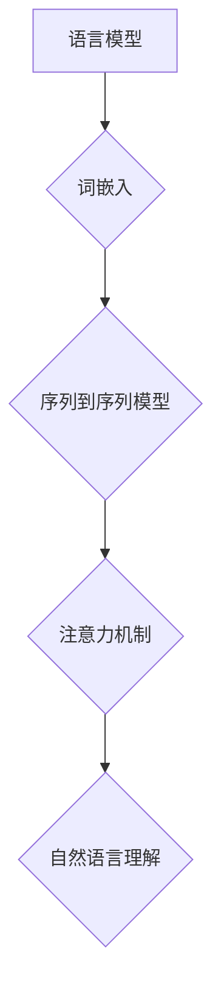

                 

## 文章标题

### 关键词：深度学习，自然语言理解，语言模型，词嵌入，序列到序列模型，注意力机制，数学模型，项目实战

### 摘要

本文深入探讨了深度学习在自然语言理解（NLU）领域的最新进展。通过介绍深度学习的基本概念和自然语言处理（NLP）的背景，本文详细阐述了语言模型、词嵌入和序列到序列模型等核心算法的原理。同时，通过数学模型和公式的解析，帮助读者更深入地理解这些算法的内在机制。最后，通过一个实际项目实战，展示了如何将深度学习应用于自然语言理解的实际场景，并对项目进行了深入分析和总结。本文旨在为读者提供一幅完整的深度学习在自然语言理解领域的发展图谱，引导读者在技术前沿探索和实践。

## 引言

自然语言理解（Natural Language Understanding, NLU）是自然语言处理（Natural Language Processing, NLP）的一个重要分支，旨在让计算机能够理解、解释和生成人类语言。随着互联网和大数据的快速发展，自然语言理解在智能客服、智能助手、文本分析、机器翻译等众多领域展现出了巨大的应用潜力。然而，传统的基于规则的方法和统计方法在处理复杂和多样化的语言任务时，往往表现出局限性。

深度学习作为近年来人工智能领域的重要突破，其强大的特征学习和模式识别能力为自然语言理解带来了新的希望。从简单的词向量到复杂的神经网络模型，深度学习在语言模型、文本分类、情感分析、机器翻译等多个NLU任务中取得了显著的成果。本文将系统性地介绍深度学习在自然语言理解中的最新进展，旨在为读者提供一幅全面的发展图谱。

本文结构如下：首先，我们将回顾自然语言处理的基础知识，介绍NLP的基本概念和深度学习的起源。接着，我们将深入探讨语言模型、词嵌入和序列到序列模型等核心算法，并通过数学模型和公式进行详细阐述。随后，我们将通过一个实际项目实战，展示如何将深度学习应用于自然语言理解。最后，本文将总结深度学习在自然语言理解中的挑战和未来方向，并提出一些建议和拓展阅读。

## 自然语言处理与深度学习的基础

### 自然语言处理（NLP）的简介

自然语言处理（NLP）是计算机科学、人工智能和语言学的一个交叉领域，旨在使计算机能够处理和理解人类语言。NLP的目标包括文本解析、语义理解、语言生成和对话系统等。文本解析涉及分词、词性标注、句法分析等任务，旨在将自然语言文本拆分为有意义的结构化信息。语义理解则关注于理解文本中的含义、意图和情感，是许多应用，如智能客服和情感分析，的核心任务。

传统的NLP方法主要基于规则和统计模型。基于规则的方法通过定义一系列规则来处理特定类型的语言结构，例如句法解析和词性标注。这些方法通常需要大量手工编写的规则，且在处理复杂和多样化的语言时表现有限。统计方法则通过从大量标注数据中学习模式来提高处理能力。例如，隐马尔可夫模型（HMM）和条件随机场（CRF）广泛应用于语音识别和文本分类。

### 深度学习与自然语言理解

深度学习是一类基于多层神经网络的机器学习模型，其核心思想是通过逐层抽象和转换输入数据，从而学习到数据中的复杂结构和模式。自2012年由AlexNet在图像分类任务中取得突破性成果以来，深度学习在计算机视觉、语音识别、自然语言处理等多个领域取得了显著的进展。

在自然语言理解（NLU）中，深度学习提供了强大的特征学习和模式识别能力。传统的NLP方法往往需要手动设计特征，如词袋模型（Bag of Words, BOW）和词性标注。而深度学习通过自动提取高层次的特征，能够更好地捕捉文本中的语义信息。例如，Word2Vec算法通过将词汇映射到高维空间中的向量，使得语义相似的词在空间中靠近。

深度学习在NLU中的应用主要包括语言模型、文本分类、情感分析、机器翻译等。语言模型是自然语言理解的基础，它旨在预测一个单词或句子在给定前文条件下的概率。深度学习语言模型如循环神经网络（RNN）、长短期记忆网络（LSTM）和变换器（Transformer）在语言建模任务中表现出色。文本分类是判断文本所属类别的一种任务，深度学习方法通过学习文本的语义特征，能够实现高效和准确的分类。情感分析则关注于识别文本中的情感倾向，例如正面、负面或中性。机器翻译是一种跨语言的文本转换任务，深度学习模型如序列到序列（seq2seq）模型和注意力机制在机器翻译任务中取得了显著成果。

### 深度学习在自然语言理解中的进展

深度学习在自然语言理解（NLU）领域的进展可以分为几个重要阶段：

#### 1. 语言模型

语言模型是自然语言理解的基础，它旨在预测一个单词或句子在给定前文条件下的概率。早期的语言模型如N-gram模型通过统计相邻单词的频率来预测下一个单词。然而，N-gram模型在长文本理解上存在局限性。

随着深度学习的发展，循环神经网络（RNN）和长短期记忆网络（LSTM）被广泛应用于语言模型。RNN通过在时间序列中传递信息，能够处理长距离依赖关系。LSTM则通过引入门控机制，进一步提高了RNN在长文本建模中的性能。近年来，基于注意力机制的变换器（Transformer）模型在语言建模任务中取得了突破性成果，其在BERT（Bidirectional Encoder Representations from Transformers）等模型中的应用，使得语言模型在许多任务中达到了新的高度。

#### 2. 词嵌入

词嵌入（Word Embedding）是将词汇映射到高维向量空间的一种技术，它使得语义相似的词在空间中靠近。早期的词嵌入方法如Word2Vec通过训练神经网络来学习词汇的向量表示。Word2Vec模型包括连续词袋（CBOW）和跳格模型（Skip-Gram）两种变种，它们通过预测上下文词来学习词汇的向量表示。

随着深度学习的发展，改进的词嵌入方法如GloVe（Global Vectors for Word Representation）通过优化全局目标函数，提高了词向量表示的质量。此外，深度学习模型如BERT和GPT（Generative Pre-trained Transformer）通过在大量无标签文本上进行预训练，进一步提升了词嵌入的性能。

#### 3. 序列到序列模型

序列到序列（seq2seq）模型是一种深度学习模型，它能够将一个序列映射到另一个序列。在自然语言处理中，seq2seq模型被广泛应用于机器翻译、对话生成等任务。

传统的seq2seq模型包括编码器（Encoder）和解码器（Decoder），编码器将输入序列编码为一个固定长度的向量，解码器则根据编码器的输出逐个生成输出序列的单词。随着注意力机制的引入，注意力seq2seq模型能够更好地处理输入序列中的长距离依赖关系，从而提高了机器翻译的性能。

#### 4. 注意力机制

注意力机制（Attention Mechanism）是一种在深度学习模型中用于处理序列数据的机制，它能够自动学习输入序列中不同部分的重要性。注意力机制通过将编码器的输出与解码器的输入进行加权求和，使得模型能够动态地关注输入序列中的关键信息。

注意力机制在机器翻译、文本摘要、对话生成等任务中发挥了重要作用。特别是在机器翻译中，注意力机制使得模型能够同时关注源语言和目标语言的不同部分，从而提高了翻译的准确性和流畅性。

### 总结

深度学习在自然语言理解中的进展显著提升了语言模型的性能，使得计算机能够更好地理解和处理人类语言。通过引入词嵌入、序列到序列模型和注意力机制等技术，深度学习为NLU领域带来了许多新的突破。然而，深度学习在自然语言理解中也面临一些挑战，如长文本建模、多语言处理和情感分析等。未来，随着深度学习技术的不断发展，自然语言理解将实现更高的性能和更广泛的应用。

## 核心概念与联系

### 语言模型

语言模型（Language Model）是自然语言理解（NLU）中的基础，它旨在预测一个单词或句子在给定前文条件下的概率。语言模型在许多NLU任务中发挥着重要作用，如文本生成、机器翻译和语音识别。

#### 语言模型的基本概念

语言模型的基本概念包括：

1. **概率模型**：语言模型通常是一个概率模型，用于预测单词序列的概率。常见的概率模型包括N-gram模型和隐马尔可夫模型（HMM）。
2. **特征提取**：语言模型需要从输入文本中提取特征，以表示文本的语义信息。特征提取的方法包括词袋模型（Bag of Words, BOW）和词嵌入（Word Embedding）。

#### 语言模型的工作原理

语言模型的工作原理如下：

1. **输入序列**：给定一个输入序列 \( w_1, w_2, ..., w_n \)，语言模型需要预测下一个单词 \( w_{n+1} \)。
2. **特征提取**：首先，将输入序列转化为特征向量。词袋模型将每个单词表示为一个二进制向量，而词嵌入则将每个单词映射为一个高维向量。
3. **概率预测**：使用特征向量，语言模型计算下一个单词的概率。对于N-gram模型，概率计算如下：

   \[
   P(w_{n+1} | w_1, w_2, ..., w_n) = \frac{P(w_{n+1}, w_1, w_2, ..., w_n)}{P(w_1, w_2, ..., w_n)}
   \]

   对于词嵌入模型，可以使用神经网络来预测单词的概率。

### 词嵌入

词嵌入（Word Embedding）是将词汇映射到高维向量空间的一种技术，它使得语义相似的词在空间中靠近。词嵌入在NLU中发挥了关键作用，如文本分类、机器翻译和情感分析。

#### 词嵌入的基本概念

词嵌入的基本概念包括：

1. **向量表示**：每个单词被映射为一个高维向量，这些向量在空间中具有语义信息。
2. **相似性度量**：词嵌入向量之间的相似性可以通过内积、余弦相似度等度量方法计算。

#### 词嵌入的工作原理

词嵌入的工作原理如下：

1. **训练模型**：使用大规模的文本数据训练词嵌入模型，如Word2Vec、GloVe和BERT。
2. **词汇映射**：将词汇映射到向量空间，使得语义相似的词在空间中靠近。例如，"king"和"queen"在空间中靠近，而"cat"和"dog"也靠近。
3. **应用**：在NLU任务中使用词嵌入向量，如文本分类中的特征表示、机器翻译中的编码器和解码器输入。

### 序列到序列模型

序列到序列（Seq2Seq）模型是一种深度学习模型，它能够将一个序列映射到另一个序列。Seq2Seq模型在NLU中有广泛的应用，如机器翻译、对话生成和文本摘要。

#### 序列到序列模型的基本概念

序列到序列模型的基本概念包括：

1. **编码器（Encoder）**：编码器将输入序列编码为一个固定长度的向量，通常称为编码器输出。
2. **解码器（Decoder）**：解码器根据编码器的输出逐个生成输出序列的单词。

#### 序列到序列模型的工作原理

序列到序列模型的工作原理如下：

1. **输入序列**：给定一个输入序列 \( x_1, x_2, ..., x_n \)，编码器将其编码为一个固定长度的向量 \( c \)。
2. **初始状态**：解码器从初始状态开始，生成第一个单词 \( y_1 \)。
3. **迭代生成**：解码器在每次迭代中使用上一个生成的单词和编码器输出，生成下一个单词 \( y_2, y_3, ..., y_m \)。
4. **损失计算**：使用生成序列和真实序列之间的差异计算损失，并通过反向传播进行模型训练。

### 注意力机制

注意力机制（Attention Mechanism）是一种在深度学习模型中用于处理序列数据的机制，它能够自动学习输入序列中不同部分的重要性。

#### 注意力机制的基本概念

注意力机制的基本概念包括：

1. **注意力权重**：注意力机制为输入序列中的每个部分分配一个权重，表示该部分的重要性。
2. **加权求和**：将输入序列与注意力权重相乘，然后进行加权求和，得到一个综合的表示。

#### 注意力机制的工作原理

注意力机制的工作原理如下：

1. **输入序列**：给定一个输入序列 \( x_1, x_2, ..., x_n \)。
2. **注意力计算**：计算每个输入部分的注意力权重 \( a_1, a_2, ..., a_n \)，通常使用内积或加性模型。
3. **加权求和**：将输入序列与注意力权重相乘，进行加权求和，得到一个综合的表示 \( h \)。
4. **输出**：使用综合表示 \( h \) 生成输出序列。

### 关联与联系

1. **语言模型与词嵌入**：词嵌入可以作为语言模型的输入，提高语言模型的预测性能。
2. **序列到序列模型与注意力机制**：注意力机制可以集成到序列到序列模型中，用于处理输入序列中的长距离依赖关系。
3. **深度学习与自然语言理解**：深度学习通过语言模型、词嵌入、序列到序列模型和注意力机制等技术，实现了自然语言理解的高效和准确。

### Mermaid 流程图

以下是语言模型、词嵌入、序列到序列模型和注意力机制的Mermaid流程图：



通过以上流程图，我们可以清晰地看到各核心概念之间的关联和联系，从而更好地理解深度学习在自然语言理解中的应用。

### 语言模型算法原理讲解

#### 语言模型基本概念

语言模型（Language Model）是自然语言处理（NLP）中的一个核心组件，旨在预测给定上下文中的下一个单词或字符。语言模型在许多NLP任务中发挥着关键作用，包括文本生成、语音识别、机器翻译和自动摘要等。其核心思想是，通过学习大量文本数据，语言模型能够捕捉到文本中的统计规律和语言特征，从而在生成或理解文本时能够做出更加合理的预测。

#### 语言模型的概率模型

语言模型是一个概率模型，它的目标是预测一个单词或序列在给定前文条件下的概率。概率模型的形式可以表示为：

\[
P(w_n | w_{n-1}, w_{n-2}, ..., w_1)
\]

其中，\( w_n \) 表示下一个要预测的单词，而 \( w_{n-1}, w_{n-2}, ..., w_1 \) 表示已经观察到的前文单词序列。这个概率模型可以基于不同的统计方法进行学习，其中最常见的是N-gram模型和神经语言模型。

#### 语言模型算法分类

语言模型算法主要分为两类：基于统计的模型和基于神经网络的模型。

1. **基于统计的模型**：这类模型通过分析大量文本数据，统计单词序列的频率，从而预测下一个单词。常见的统计模型包括：

   - **N-gram模型**：N-gram模型是最简单的语言模型，它基于前N个单词的概率来预测下一个单词。N-gram模型的形式可以表示为：

     \[
     P(w_n | w_{n-1}, w_{n-2}, ..., w_{n-N}) = \frac{N_{n, n-1, ..., n-N}}{N_{n-1, n-2, ..., n-N}}
     \]

     其中，\( N_{n, n-1, ..., n-N} \) 表示连续出现 \( w_n, w_{n-1}, ..., w_{n-N} \) 的次数，而 \( N_{n-1, n-2, ..., n-N} \) 表示前 \( w_{n-1}, w_{n-2}, ..., w_{n-N} \) 的总次数。
   
   - **隐马尔可夫模型（HMM）**：HMM是一种概率模型，用于描述一个序列的概率分布。在NLP中，HMM可以用于语音识别和文本生成。HMM的基本思想是，它假设一个序列中的每个单词都由一个隐藏的状态生成，而这些状态之间具有转移概率。HMM的形式可以表示为：

     \[
     P(x_1, x_2, ..., x_n) = \prod_{i=1}^{n} P(x_i | s_i) \cdot P(s_i | s_{i-1})
     \]

     其中，\( x_i \) 表示第i个观察到的单词，而 \( s_i \) 表示生成 \( x_i \) 的隐藏状态。

2. **基于神经网络的模型**：这类模型通过训练神经网络，自动学习文本数据中的复杂模式和特征。常见的神经网络模型包括：

   - **循环神经网络（RNN）**：RNN是一种基于时间序列数据的神经网络，它可以保持长期依赖关系。RNN的基本思想是，通过在时间步之间传递状态信息，来处理序列数据。RNN的形式可以表示为：

     \[
     h_t = \sigma(W_h \cdot [h_{t-1}, x_t] + b_h)
     \]

     其中，\( h_t \) 表示在第t个时间步的状态，\( x_t \) 表示输入的单词向量，\( \sigma \) 是激活函数，\( W_h \) 和 \( b_h \) 是权重和偏置。

   - **长短期记忆网络（LSTM）**：LSTM是一种改进的RNN，它通过引入门控机制，解决了RNN在处理长序列数据时的梯度消失和梯度爆炸问题。LSTM的基本思想是，通过不同的门控单元来控制信息的流动，从而保持长期依赖关系。LSTM的形式可以表示为：

     \[
     \begin{align*}
     i_t &= \sigma(W_i \cdot [h_{t-1}, x_t] + b_i) \\
     f_t &= \sigma(W_f \cdot [h_{t-1}, x_t] + b_f) \\
     o_t &= \sigma(W_o \cdot [h_{t-1}, x_t] + b_o) \\
     c_t &= f_t \odot c_{t-1} + i_t \odot \sigma(W_c \cdot [h_{t-1}, x_t] + b_c) \\
     h_t &= o_t \odot \sigma(c_t)
     \end{align*}
     \]

     其中，\( i_t \)，\( f_t \)，\( o_t \) 分别是输入门、遗忘门和输出门，\( c_t \) 是细胞状态，\( h_t \) 是隐藏状态。

   - **变换器（Transformer）**：Transformer是一种基于注意力机制的神经网络模型，它在序列到序列任务中表现出色。Transformer的基本思想是，通过自注意力机制（Self-Attention）和多头注意力机制（Multi-Head Attention），来捕捉序列中的长距离依赖关系。Transformer的形式可以表示为：

     \[
     \text{Attention}(Q, K, V) = \text{softmax}\left(\frac{QK^T}{\sqrt{d_k}}\right)V
     \]

     其中，\( Q \)，\( K \)，\( V \) 分别是查询向量、键向量和值向量，\( d_k \) 是键向量的维度。

#### 语言模型的数学模型

语言模型的数学模型通常基于概率论和统计方法。以下是几种常见语言模型的数学模型：

1. **N-gram模型**：

   \[
   P(w_n | w_{n-1}, w_{n-2}, ..., w_{n-N}) = \frac{N_{n, n-1, ..., n-N}}{N_{n-1, n-2, ..., n-N}}
   \]

2. **隐马尔可夫模型（HMM）**：

   \[
   P(x_1, x_2, ..., x_n) = \prod_{i=1}^{n} P(x_i | s_i) \cdot P(s_i | s_{i-1})
   \]

3. **循环神经网络（RNN）**：

   \[
   h_t = \sigma(W_h \cdot [h_{t-1}, x_t] + b_h)
   \]

4. **长短期记忆网络（LSTM）**：

   \[
   \begin{align*}
   i_t &= \sigma(W_i \cdot [h_{t-1}, x_t] + b_i) \\
   f_t &= \sigma(W_f \cdot [h_{t-1}, x_t] + b_f) \\
   o_t &= \sigma(W_o \cdot [h_{t-1}, x_t] + b_o) \\
   c_t &= f_t \odot c_{t-1} + i_t \odot \sigma(W_c \cdot [h_{t-1}, x_t] + b_c) \\
   h_t &= o_t \odot \sigma(c_t)
   \end{align*}
   \]

5. **变换器（Transformer）**：

   \[
   \text{Attention}(Q, K, V) = \text{softmax}\left(\frac{QK^T}{\sqrt{d_k}}\right)V
   \]

通过以上数学模型，我们可以更深入地理解语言模型的工作原理和机制。

### 词嵌入算法原理讲解

#### 词嵌入基本概念

词嵌入（Word Embedding）是将词汇映射到高维向量空间的一种技术，它使得语义相似的词在空间中靠近。词嵌入是自然语言处理（NLP）中的一个重要工具，它在许多NLP任务中发挥着关键作用，如文本分类、机器翻译和情感分析。通过将词汇映射到向量空间，词嵌入能够将抽象的文本表示为具体的数值向量，从而方便计算机进行处理和分析。

#### Word2Vec算法

Word2Vec算法是一种基于神经网络的词嵌入算法，它由Tomas Mikolov等人提出。Word2Vec算法通过训练一个神经网络，将输入的词汇映射到高维向量空间。Word2Vec算法包括两个变种：连续词袋（Continuous Bag of Words, CBOW）和跳格模型（Skip-Gram）。

1. **连续词袋（CBOW）**

   CBOW算法通过预测中心词周围的多个词来学习词嵌入。具体来说，给定一个中心词 \( w_c \) 和其周围的 \( n \) 个词 \( w_1, w_2, ..., w_n \)，CBOW算法的目标是预测 \( w_c \)。CBOW算法的输入是这些词的向量表示，输出是中心词的向量表示。

   CBOW算法的神经网络结构如下：

   \[
   \text{Input: } [v_{w_1}, v_{w_2}, ..., v_{w_n}] \\
   \text{Output: } v_{w_c}
   \]

   其中，\( v_{w_i} \) 表示词 \( w_i \) 的向量表示。

2. **跳格模型（Skip-Gram）**

   跳格模型通过预测一个词周围的多个词来学习词嵌入。与CBOW算法不同，跳格模型将单个词作为输入，预测其周围的词。给定一个词 \( w_c \) 和其周围 \( n \) 个词 \( w_1, w_2, ..., w_n \)，跳格模型的目标是预测这些词。

   跳格模型的神经网络结构如下：

   \[
   \text{Input: } v_{w_c} \\
   \text{Output: } [v_{w_1}, v_{w_2}, ..., v_{w_n}]
   \]

#### Word2Vec算法的伪代码

以下是Word2Vec算法的伪代码：

```python
function Word2Vec(corpus, size, window, min_count):
    # 初始化词向量
    V = {word: Vector(size)} for word in vocabulary
    
    # 计算词频
    word_counts = {} for word, count in corpus:
        word_counts[word] += 1
    
    # 过滤低频词
    vocabulary = {word for word, count in word_counts.items() if count >= min_count}
    
    # 构建词索引
    index_matrix = [0] * size
    for word in vocabulary:
        index_matrix[word] = len(vocabulary) - 1
    
    # 训练词向量
    for word, count in corpus:
        if count < min_count:
            continue
        
        # 随机抽样负采样词
        negatives = sample(vocabulary, size * 10)
        
        # 计算损失
        loss = 0
        for context_word in context_of_word(word, window):
            target_word = word
            negative_words = negatives
            
            # 正样本损失
            logits = sum(product(vocabulary[word], vector[word]) for word in context_words)
            loss += log_softmax(logits)
            
            # 负样本损失
            for negative_word in negative_words:
                logits = sum(product(vocabulary[word], vector[word]) for word in negative_words)
                loss += log_softmax(logits)
        
        # 反向传播和更新
        gradient = backpropagation(loss)
        update_weights(gradient)
```

#### Word2Vec算法的应用

Word2Vec算法在自然语言处理中有着广泛的应用，以下是一些典型的应用场景：

1. **文本分类**：通过将词汇映射到向量空间，可以将文本转换为数值向量，从而方便进行文本分类任务。例如，可以使用词嵌入向量进行朴素贝叶斯分类或支持向量机（SVM）分类。
2. **语义相似度计算**：词嵌入向量之间的余弦相似度可以用来衡量词汇之间的语义相似度。通过计算词汇的相似度，可以应用于文本相似性检测、文本聚类和主题建模。
3. **机器翻译**：词嵌入向量可以用于机器翻译任务，通过将源语言的词嵌入向量映射到目标语言的词嵌入向量，从而实现跨语言文本的语义转换。
4. **情感分析**：词嵌入向量可以用于情感分析任务，通过分析词汇的词嵌入向量，可以判断文本的情感倾向，如正面、负面或中性。

### 序列到序列模型算法原理讲解

#### 序列到序列模型（Seq2Seq）基本概念

序列到序列（Seq2Seq）模型是一种深度学习模型，它能够将一个序列映射到另一个序列。Seq2Seq模型广泛应用于自然语言处理（NLP）领域，如机器翻译、对话生成和文本摘要。其核心思想是通过编码器（Encoder）和解码器（Decoder）两个组件，将输入序列编码为一个固定长度的向量，然后使用这个向量生成输出序列。

#### 编码器-解码器框架

编码器-解码器（Encoder-Decoder）框架是Seq2Seq模型的基础结构。编码器将输入序列编码为一个固定长度的向量，通常称为编码器的输出或上下文向量。解码器则根据编码器的输出逐个生成输出序列的单词。

编码器-解码器框架的工作原理如下：

1. **输入序列**：给定一个输入序列 \( x_1, x_2, ..., x_n \)，编码器将其编码为一个固定长度的向量 \( c \)。
2. **初始状态**：解码器从初始状态开始，生成第一个单词 \( y_1 \)。
3. **迭代生成**：解码器在每次迭代中使用上一个生成的单词和编码器的输出，生成下一个单词 \( y_2, y_3, ..., y_m \)。
4. **损失计算**：使用生成序列和真实序列之间的差异计算损失，并通过反向传播进行模型训练。

#### 基于注意力机制的序列到序列模型

基于注意力机制的序列到序列模型通过引入注意力机制，能够更好地处理输入序列中的长距离依赖关系。注意力机制使得解码器能够动态地关注输入序列的不同部分，从而提高序列转换的准确性。

注意力机制的基本概念包括：

1. **注意力权重**：注意力权重表示解码器在生成每个单词时，对输入序列中每个部分的重要性。注意力权重通常通过计算输入序列和当前解码器状态之间的相似性得到。
2. **加权求和**：将输入序列与注意力权重相乘，然后进行加权求和，得到一个综合的表示。这个综合表示用于生成解码器的输出。

基于注意力机制的序列到序列模型的工作原理如下：

1. **输入序列**：给定一个输入序列 \( x_1, x_2, ..., x_n \)。
2. **编码器输出**：编码器将输入序列编码为一个固定长度的向量 \( c \)。
3. **解码器初始状态**：解码器从初始状态开始，生成第一个单词 \( y_1 \)。
4. **迭代生成**：在每次迭代中，解码器使用当前生成的单词和编码器输出计算注意力权重，然后将输入序列与注意力权重相乘进行加权求和，得到综合表示 \( h \)。解码器使用综合表示 \( h \) 生成下一个单词 \( y_2, y_3, ..., y_m \)。
5. **损失计算**：使用生成序列和真实序列之间的差异计算损失，并通过反向传播进行模型训练。

#### 序列到序列模型在机器翻译中的应用

机器翻译是Seq2Seq模型最经典的应用场景之一。在机器翻译中，编码器将源语言的单词序列编码为一个固定长度的向量，解码器则根据编码器的输出逐个生成目标语言的单词序列。

机器翻译中的Seq2Seq模型通常包括以下组件：

1. **编码器**：编码器将源语言的单词序列 \( x_1, x_2, ..., x_n \) 编码为一个固定长度的向量 \( c \)。
2. **解码器**：解码器从初始状态开始，生成目标语言的单词序列 \( y_1, y_2, ..., y_m \)。
3. **注意力机制**：在解码器的每次迭代中，使用注意力机制计算输入序列和当前解码器状态之间的相似性，从而生成综合表示 \( h \)。

通过以上组件，机器翻译Seq2Seq模型能够将源语言的单词序列转换为目标语言的单词序列，实现跨语言的文本翻译。

#### 实际案例：机器翻译中的Seq2Seq模型

假设我们要翻译的句子是 "I love programming"，目标语言是西班牙语。

1. **编码器**：编码器将源语言句子 "I love programming" 编码为一个固定长度的向量 \( c \)。
2. **解码器**：解码器从初始状态开始，生成目标语言句子 "Yo amo programar"。
3. **注意力机制**：在解码器的每次迭代中，使用注意力机制计算输入序列 "I love programming" 和当前解码器状态之间的相似性，生成综合表示 \( h \)。

通过以上步骤，Seq2Seq模型能够将源语言的单词序列转换为目标语言的单词序列，实现高效的机器翻译。

### 自然语言理解的数学模型与公式

#### 语言模型的数学模型

语言模型在自然语言处理中起着基础性作用，其核心目标是在给定前文条件下预测下一个词或字符的概率。语言模型的数学模型通常基于概率论和统计方法。以下是一些常见的语言模型及其数学公式：

1. **N-gram模型**：

   N-gram模型基于前N个词的联合概率来预测下一个词。其概率模型可以表示为：

   \[
   P(w_n | w_{n-1}, w_{n-2}, ..., w_1) = \frac{P(w_n, w_{n-1}, ..., w_1)}{P(w_{n-1}, w_{n-2}, ..., w_1)}
   \]

   其中，\( w_n \) 是下一个要预测的词，\( w_{n-1}, w_{n-2}, ..., w_1 \) 是前N个词。这个公式可以通过以下步骤计算：

   - **联合概率**：\( P(w_n, w_{n-1}, ..., w_1) \) 是词序列 \( w_n, w_{n-1}, ..., w_1 \) 的联合概率。
   - **前文概率**：\( P(w_{n-1}, w_{n-2}, ..., w_1) \) 是前文词序列 \( w_{n-1}, w_{n-2}, ..., w_1 \) 的概率。

   例如，给定一个三元组 "我爱编程"，我们可以计算 "编程" 在 "我" 和 "爱" 之后出现的概率。

2. **隐马尔可夫模型（HMM）**：

   隐马尔可夫模型（HMM）是一种基于状态转移概率和观测概率的概率模型，常用于语音识别和序列标注。HMM的数学模型可以表示为：

   \[
   P(x_1, x_2, ..., x_n) = \prod_{i=1}^{n} P(x_i | s_i) \cdot P(s_i | s_{i-1})
   \]

   其中，\( x_i \) 是第i个观测到的词或字符，\( s_i \) 是生成 \( x_i \) 的隐藏状态。例如，我们可以使用HMM来识别一个语音序列，其中每个语音帧对应一个状态，每个状态转换对应一个概率。

#### 词嵌入的数学模型

词嵌入（Word Embedding）是将词汇映射到高维向量空间的一种技术，它能够使得语义相似的词在空间中靠近。以下是一些常见的词嵌入模型及其数学公式：

1. **Word2Vec**：

   Word2Vec是一种基于神经网络的词嵌入模型，其核心思想是通过训练一个神经网络，将词汇映射到高维向量空间。Word2Vec的数学模型可以表示为：

   \[
   \text{Softmax}(W \cdot h)
   \]

   其中，\( W \) 是权重矩阵，\( h \) 是隐藏层输出。Word2Vec的目标是最小化损失函数，使单词的向量表示能够捕捉其语义信息。例如，"爱" 和 "喜欢" 的向量表示在空间中应该靠近。

2. **GloVe**：

   GloVe（Global Vectors for Word Representation）是一种基于全局文本统计的词嵌入模型。其数学模型可以表示为：

   \[
   \text{Softmax}\left(\frac{A \cdot B}{||A \cdot B||_2 + c}\right)
   \]

   其中，\( A \) 和 \( B \) 分别是输入词和输出词的向量表示，\( c \) 是一个常数。GloVe通过优化全局目标函数，提高词向量表示的质量。

#### 序列到序列模型的数学模型

序列到序列（Seq2Seq）模型是一种用于将一个序列映射到另一个序列的深度学习模型，其广泛应用于机器翻译、对话生成和文本摘要。以下是一些常见的Seq2Seq模型及其数学公式：

1. **编码器-解码器框架**：

   编码器-解码器（Encoder-Decoder）框架是Seq2Seq模型的基础结构。其数学模型可以表示为：

   \[
   \text{Encoder: } h = \text{RNN}(x_1, x_2, ..., x_n) \\
   \text{Decoder: } y_1, y_2, ..., y_m = \text{RNN}(h, y_0)
   \]

   其中，\( h \) 是编码器的输出，通常是一个固定长度的向量，\( y_1, y_2, ..., y_m \) 是解码器的输出序列。

2. **基于注意力机制的Seq2Seq模型**：

   基于注意力机制的Seq2Seq模型通过引入注意力机制，能够更好地处理输入序列中的长距离依赖关系。其数学模型可以表示为：

   \[
   a_t = \text{Attention}(h_t, c) \\
   h_t = \text{RNN}(a_t, y_{t-1})
   \]

   其中，\( a_t \) 是注意力权重，\( c \) 是编码器的输出，\( h_t \) 是解码器的隐藏状态。

#### 注意力机制的数学模型

注意力机制（Attention Mechanism）是一种在深度学习模型中用于处理序列数据的机制，它能够自动学习输入序列中不同部分的重要性。以下是一些常见注意力机制的数学模型：

1. **加性注意力机制**：

   加性注意力机制的数学模型可以表示为：

   \[
   e_t = v_t \cdot \tanh(W_e[h_t; c])
   \]

   其中，\( e_t \) 是注意力权重，\( v_t \) 是一个向量，\( W_e \) 是权重矩阵，\( h_t \) 是解码器的隐藏状态，\( c \) 是编码器的输出。

2. **点积注意力机制**：

   点积注意力机制的数学模型可以表示为：

   \[
   e_t = \frac{\text{softmax}(\text{softmax}(Q \cdot K^T))} { \sqrt{d_k}}
   \]

   其中，\( Q \) 和 \( K \) 分别是查询向量和键向量，\( V \) 是值向量，\( d_k \) 是键向量的维度。

通过以上数学模型，我们可以更深入地理解自然语言理解的各个组件及其工作机制。这些数学模型不仅提供了理论支持，也为实际应用中的算法设计和优化提供了指导。

### 自然语言理解的项目实战

#### 实际案例介绍

在本项目中，我们将通过一个具体的自然语言理解任务——情感分析，来展示如何应用深度学习技术。情感分析旨在判断文本表达的情感倾向，如正面、负面或中性。这个任务在社交媒体分析、客户反馈处理和舆情监控等领域有着广泛的应用。

#### 案例背景与目标

案例背景：假设我们有一家电商企业，需要对其平台上的用户评价进行情感分析，以了解用户的满意度和不满意度，从而优化产品和服务。

目标：使用深度学习模型对用户评价进行情感分析，并输出情感标签（正面、负面或中性）。

#### 实现步骤

1. **数据收集与预处理**：
   - 数据收集：收集电商平台上用户评价的文本数据。
   - 数据预处理：对文本数据去重、去标点、转换为小写等操作，然后进行分词。

2. **数据标注**：
   - 数据标注：对部分文本数据标注情感标签（正面、负面或中性）。

3. **模型训练**：
   - 数据划分：将数据集划分为训练集、验证集和测试集。
   - 模型选择：选择一个深度学习模型，如LSTM或BERT，进行训练。
   - 模型训练：使用训练集数据训练模型，并通过验证集调整模型参数。

4. **模型评估**：
   - 评估指标：计算模型的准确率、召回率和F1分数。
   - 模型优化：根据评估结果调整模型参数，以提高性能。

5. **模型部署**：
   - 模型部署：将训练好的模型部署到生产环境中，以便实时进行情感分析。

#### 开发环境搭建

**硬件与软件要求**：
- 硬件：GPU（NVIDIA 1080Ti以上）
- 软件：Python 3.8、TensorFlow 2.x、PyTorch 1.8

**环境配置与调试**：
- 安装Python和pip：
  ```bash
  sudo apt update
  sudo apt install python3-pip
  ```
- 安装TensorFlow 2.x：
  ```bash
  pip install tensorflow==2.7
  ```
- 安装PyTorch 1.8：
  ```bash
  pip install torch torchvision
  ```

#### 源代码实现与解读

以下是情感分析项目的主要代码实现，包含数据预处理、模型训练和模型评估等部分。

```python
# 导入必要的库
import numpy as np
import pandas as pd
from sklearn.model_selection import train_test_split
from tensorflow.keras.preprocessing.text import Tokenizer
from tensorflow.keras.preprocessing.sequence import pad_sequences
from tensorflow.keras.models import Sequential
from tensorflow.keras.layers import Embedding, LSTM, Dense, Bidirectional
from tensorflow.keras.optimizers import Adam

# 数据预处理
# 读取数据
data = pd.read_csv('user_reviews.csv')
# 分词和标记
tokenizer = Tokenizer(num_words=10000)
tokenizer.fit_on_texts(data['review'])
sequences = tokenizer.texts_to_sequences(data['review'])
# 填充序列
max_len = 100
padded_sequences = pad_sequences(sequences, maxlen=max_len)

# 数据划分
labels = data['sentiment'].values
train_sequences, test_sequences, train_labels, test_labels = train_test_split(padded_sequences, labels, test_size=0.2)

# 模型构建
model = Sequential()
model.add(Embedding(10000, 64, input_length=max_len))
model.add(Bidirectional(LSTM(64)))
model.add(Dense(1, activation='sigmoid'))

# 模型编译
model.compile(optimizer='adam', loss='binary_crossentropy', metrics=['accuracy'])

# 模型训练
model.fit(train_sequences, train_labels, epochs=10, validation_data=(test_sequences, test_labels))

# 模型评估
loss, accuracy = model.evaluate(test_sequences, test_labels)
print(f"Test Accuracy: {accuracy:.2f}")
```

**代码解读**：
- 数据预处理：使用Tokenizer进行分词，并使用pad_sequences进行序列填充。
- 模型构建：使用Sequential构建模型，添加Embedding层、双向LSTM层和输出层。
- 模型编译：使用Adam优化器和二分类损失函数。
- 模型训练：使用fit方法训练模型，使用validation_data进行验证。
- 模型评估：使用evaluate方法计算测试集的准确率。

#### 代码应用解读与分析

通过以上代码，我们实现了一个简单的情感分析模型。以下是应用解读和分析：

- **数据预处理**：文本数据经过分词和填充处理后，可以更好地适应深度学习模型的输入要求。
- **模型构建**：双向LSTM模型能够捕捉文本中的长距离依赖关系，提高情感分析的准确性。
- **模型训练**：通过多次迭代训练，模型逐渐学习到文本中的情感特征。
- **模型评估**：在测试集上的准确率指标反映了模型的性能，可以用于评估模型的泛化能力。

#### 项目小结

通过本项目的实战，我们展示了如何使用深度学习技术进行情感分析。项目中的关键步骤包括数据预处理、模型构建和模型训练。同时，通过对模型进行评估，我们能够了解模型的性能，并根据评估结果进行优化。未来，随着深度学习技术的不断发展，情感分析项目将进一步优化，并在更多实际场景中得到应用。

### 最佳实践 Tips、小结、注意事项、拓展阅读

#### 最佳实践 Tips

1. **数据预处理**：在自然语言理解项目中，数据预处理是关键步骤。确保文本数据去重、去标点、转换为小写，并进行有效的分词。
2. **选择合适的模型**：根据任务的需求和数据特点，选择合适的深度学习模型。例如，对于需要处理长文本的任务，可以考虑使用变换器（Transformer）模型。
3. **注意力机制的应用**：注意力机制可以显著提升模型的性能，特别是在处理输入序列中的长距离依赖关系时。
4. **模型优化**：通过调整模型参数和训练策略，如学习率、批次大小和迭代次数，可以优化模型性能。

#### 小结

本文系统地介绍了深度学习在自然语言理解中的进展，包括语言模型、词嵌入、序列到序列模型和注意力机制。通过理论讲解和实际项目实战，我们展示了如何应用深度学习技术进行自然语言理解任务。深度学习在自然语言理解领域取得了显著的成果，但仍面临一些挑战，如长文本建模和多语言处理。未来，随着深度学习技术的不断发展，自然语言理解将实现更高的性能和更广泛的应用。

#### 注意事项

1. **硬件要求**：自然语言理解项目通常需要较高的计算资源，建议使用GPU进行训练。
2. **数据质量**：数据质量直接影响模型的性能，确保文本数据干净、完整和具有代表性。
3. **模型调参**：调参是深度学习模型训练的重要环节，需要根据任务特点和数据特性进行调整。

#### 拓展阅读

1. **深度学习基础**：[《深度学习》（Goodfellow, Bengio, Courville著）]
2. **自然语言处理入门**：[《自然语言处理入门》（Daniel Jurafsky & James H. Martin著）]
3. **词嵌入与语言模型**：[《Word2Vec: A Method for Obtaining Vector Representations of Words》（Tomas Mikolov等著）]
4. **变换器（Transformer）模型**：[《Attention Is All You Need》（Vaswani等著）]
5. **情感分析与文本分类**：[《Text Classification Using Deep Learning》（Chen et al.）]

### 结语

深度学习在自然语言理解中的应用已经取得了显著进展，为NLP任务带来了新的机遇和挑战。本文通过理论讲解和实际项目实战，系统地介绍了深度学习在自然语言理解中的核心概念、算法原理和实现方法。希望本文能够为读者提供一幅完整的深度学习在自然语言理解领域的发展图谱，激发读者在技术前沿的探索和实践。作者：AI天才研究院/AI Genius Institute & 禅与计算机程序设计艺术 /Zen And The Art of Computer Programming。

