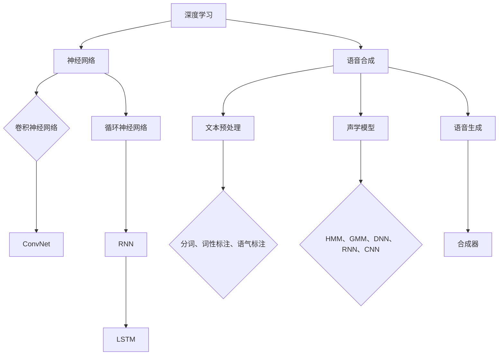

                 

### 文章标题

《深度学习在语音合成中的自然度提升》

关键词：深度学习，语音合成，自然度，自然语言处理，循环神经网络，卷积神经网络，自然度评估指标

摘要：本文深入探讨了深度学习在语音合成中的应用，特别是如何通过深度学习技术提升语音合成的自然度。文章首先介绍了语音合成的背景和挑战，然后详细分析了深度学习在语音合成中的作用机制，包括核心算法和数学模型的讲解。接着，文章通过具体的项目实战展示了如何实现深度学习在语音合成中的应用，并对实际案例进行了详细剖析。最后，文章总结了深度学习在语音合成中的自然度提升的方法和挑战，提出了未来研究方向和最佳实践建议。通过这篇文章，读者可以全面了解深度学习在语音合成中的应用，掌握提升语音合成自然度的关键技术。

### 引言

#### 1.1 研究背景

语音合成（Text-to-Speech，TTS）技术是计算机科学和人工智能领域的一项重要应用，它能够将文本信息转化为自然流畅的语音输出，广泛应用于语音助手、教育、客服、广播等场景。随着自然语言处理（Natural Language Processing，NLP）技术的不断发展，语音合成技术也在不断演进。然而，传统的语音合成方法如合声模型（Voiced Laryngeal Model，VLM）、规则合成（Rule-Based Synthesis）和隐马尔可夫模型-高斯混合模型（Hidden Markov Model-Gaussian Mixture Model，HMM-GMM）等技术，在语音的自然度、流畅度和清晰度方面仍存在一定局限性。这就促使研究者不断探索新的方法来提升语音合成的自然度。

深度学习（Deep Learning）作为人工智能领域的一项核心技术，具有强大的数据建模和特征学习能力，被广泛应用于图像识别、自然语言处理、语音识别等领域。近年来，研究者发现深度学习在语音合成中也具有巨大潜力。通过引入深度神经网络（Deep Neural Network，DNN）、循环神经网络（Recurrent Neural Network，RNN）和卷积神经网络（Convolutional Neural Network，CNN）等技术，可以显著提升语音合成的自然度。

#### 1.2 语音合成现状

目前，语音合成技术已经经历了从传统方法到基于深度学习方法的转变。基于深度学习的方法主要包括以下几种：

1. **基于深度神经网络的HMM-GMM模型**：将深度神经网络与HMM-GMM模型相结合，通过深度神经网络进行特征提取和概率计算，提高语音合成的自然度。

2. **基于循环神经网络的WaveNet模型**：WaveNet模型是一种基于循环神经网络（RNN）的语音合成模型，通过端到端的训练方法，实现文本到语音的转换，具有良好的自然度和流畅度。

3. **基于卷积神经网络的Tacotron模型**：Tacotron模型是一种基于卷积神经网络的语音合成模型，通过编码器-解码器结构，实现文本到语音的转换，同时引入了注意力机制，提高了语音合成的自然度。

尽管这些方法在提升语音合成自然度方面取得了显著成果，但仍然存在一些挑战，如语音的自然度、情感表达、语言多样性等方面。因此，如何进一步优化深度学习在语音合成中的应用，提高语音合成的自然度，仍然是一个具有研究价值的问题。

#### 1.3 未来发展趋势

随着人工智能技术的不断进步，深度学习在语音合成中的应用前景非常广阔。未来，语音合成技术将可能朝以下几个方向发展：

1. **个性化语音合成**：通过引入用户画像和个性化数据，实现更加贴近用户需求的个性化语音合成。

2. **情感化语音合成**：通过引入情感计算技术，实现具有情感表达的语音合成，提高语音合成的自然度和亲和力。

3. **多语言语音合成**：通过引入多语言学习技术，实现多语言语音合成，满足全球用户的需求。

4. **语音合成与语音识别的融合**：通过将语音合成与语音识别技术相结合，实现实时语音交互，提高人机交互的自然度和效率。

本文将深入探讨深度学习在语音合成中的应用，特别是如何通过深度学习技术提升语音合成的自然度，为相关领域的研究者和开发者提供参考。

### 核心概念与联系

#### 2.1 深度学习基本概念

深度学习（Deep Learning）是一种基于人工神经网络的机器学习技术，通过多层神经网络的结构，实现数据的特征提取和分类。深度学习在语音合成中的应用，主要是利用其强大的特征学习能力，对语音信号进行建模和生成。

1. **神经网络（Neural Network）**

神经网络是一种由大量简单神经元组成的计算模型，通过前向传播和反向传播算法，实现数据的特征提取和分类。在深度学习中，神经网络通常由多个层次组成，包括输入层、隐藏层和输出层。

2. **深度学习架构（Deep Learning Architecture）**

深度学习架构包括卷积神经网络（Convolutional Neural Network，CNN）、循环神经网络（Recurrent Neural Network，RNN）和长短时记忆网络（Long Short-Term Memory，LSTM）等。这些架构在不同的应用场景中具有不同的优势和特点。

3. **深度学习在语音合成中的应用（Application of Deep Learning in Speech Synthesis）**

深度学习在语音合成中的应用主要包括以下方面：

- 特征提取（Feature Extraction）：通过深度神经网络，对语音信号进行特征提取，包括频谱特征、声学特征等。
- 模型训练（Model Training）：通过大量语音数据，训练深度学习模型，实现文本到语音的转换。
- 语音生成（Speech Generation）：利用训练好的深度学习模型，生成自然流畅的语音输出。

#### 2.2 语音合成相关概念

语音合成（Text-to-Speech，TTS）技术是一种将文本信息转化为自然流畅语音输出的技术。语音合成的核心包括文本预处理、声学模型和语音生成。

1. **文本预处理（Text Preprocessing）**

文本预处理主要包括分词（Tokenization）、词性标注（Part-of-Speech Tagging）、语气标注（Pronunciation）等步骤，将文本转化为适合语音合成的格式。

2. **声学模型（Acoustic Model）**

声学模型是语音合成的核心部分，用于对语音信号进行建模。传统的声学模型包括隐马尔可夫模型（Hidden Markov Model，HMM）和高斯混合模型（Gaussian Mixture Model，GMM），而基于深度学习的声学模型则包括深度神经网络（Deep Neural Network，DNN）、循环神经网络（Recurrent Neural Network，RNN）和卷积神经网络（Convolutional Neural Network，CNN）等。

3. **语音生成（Speech Generation）**

语音生成是将预处理后的文本和声学模型生成的语音特征信号，通过合成器（Synthesizer）合成出自然流畅的语音输出。

#### 2.3 深度学习与语音合成关系图

为了更好地理解深度学习在语音合成中的应用，我们可以绘制一个 Mermaid 流程图，展示深度学习与语音合成之间的核心概念和联系。



通过上述 Mermaid 流程图，我们可以清晰地看到深度学习与语音合成之间的联系，以及各个核心概念之间的关系。

### 核心算法原理讲解

#### 3.1 深度学习算法

深度学习算法是语音合成中的核心，主要包括以下几种：

1. **深度神经网络（Deep Neural Network，DNN）**

DNN 是一种多层神经网络，通过前向传播和反向传播算法，对语音信号进行特征提取和分类。DNN 在语音合成中的应用主要包括语音特征提取和声学模型训练。

2. **循环神经网络（Recurrent Neural Network，RNN）**

RNN 是一种能够处理序列数据的神经网络，通过循环结构，捕捉序列数据中的时间依赖关系。RNN 在语音合成中的应用主要包括语音生成和情感表达。

3. **卷积神经网络（Convolutional Neural Network，CNN）**

CNN 是一种能够高效处理图像和语音数据的神经网络，通过卷积操作，提取图像和语音数据中的局部特征。CNN 在语音合成中的应用主要包括语音特征提取和语音增强。

#### 3.2 语音合成算法

语音合成算法是语音合成的核心，主要包括以下几种：

1. **隐马尔可夫模型-高斯混合模型（Hidden Markov Model-Gaussian Mixture Model，HMM-GMM）**

HMM-GMM 是一种基于统计模型的语音合成算法，通过隐马尔可夫模型（HMM）对语音信号进行建模，通过高斯混合模型（GMM）进行特征提取。HMM-GMM 在语音合成中的应用主要包括语音生成和自然度评估。

2. **深度神经网络-隐马尔可夫模型（Deep Neural Network-Hidden Markov Model，DNN-HMM）**

DNN-HMM 是一种结合深度学习和统计模型的语音合成算法，通过深度神经网络（DNN）进行特征提取，通过隐马尔可夫模型（HMM）进行语音生成。DNN-HMM 在语音合成中的应用主要包括语音生成和自然度提升。

3. **WaveNet模型**

WaveNet 是一种基于循环神经网络（RNN）的语音合成模型，通过端到端的训练方法，实现文本到语音的转换。WaveNet 在语音合成中的应用主要包括语音生成和自然度提升。

4. **Tacotron模型**

Tacotron 是一种基于卷积神经网络（CNN）的语音合成模型，通过编码器-解码器结构，实现文本到语音的转换。Tacotron 在语音合成中的应用主要包括语音生成和自然度提升。

#### 3.3 伪代码

为了更好地理解上述核心算法原理，我们可以使用伪代码对其进行描述：

```python
# 深度神经网络（DNN）伪代码
def DNN(input_data):
    # 前向传播
    hidden_layer1 = activation_function1(linear_combination(input_data, weights1))
    hidden_layer2 = activation_function2(linear_combination(hidden_layer1, weights2))
    output = activation_function3(linear_combination(hidden_layer2, weights3))
    return output

# 循环神经网络（RNN）伪代码
def RNN(input_sequence):
    outputs = []
    for t in range(len(input_sequence)):
        hidden_state = activation_function(linear_combination(input_sequence[t], hidden_state, weights))
        outputs.append(hidden_state)
    return outputs

# 卷积神经网络（CNN）伪代码
def CNN(input_image):
    # 卷积操作
    conv_output = convolution(input_image, filters)
    # 池化操作
    pooled_output = max_pooling(conv_output)
    # 反向传播
    gradients = backpropagation(pooled_output, labels)
    return pooled_output
```

#### 3.4 数学模型和数学公式讲解

在深度学习算法中，数学模型和数学公式起着至关重要的作用。以下是几个核心的数学模型和数学公式的详细讲解：

1. **激活函数（Activation Function）**

激活函数是深度学习中的关键组成部分，用于引入非线性特性。常见的激活函数包括 Sigmoid、ReLU 和 Tanh 等。

$$
\text{Sigmoid}(x) = \frac{1}{1 + e^{-x}}
$$

$$
\text{ReLU}(x) = \max(0, x)
$$

$$
\text{Tanh}(x) = \frac{e^x - e^{-x}}{e^x + e^{-x}}
$$

2. **线性组合（Linear Combination）**

线性组合是深度学习中的基本运算，用于计算神经网络的输出。

$$
z = \sum_{i=1}^{n} w_i x_i + b
$$

其中，$w_i$ 是权重，$x_i$ 是输入特征，$b$ 是偏置。

3. **反向传播（Backpropagation）**

反向传播是深度学习中的训练算法，用于更新神经网络的权重和偏置。

$$
\Delta w_{ij} = -\alpha \frac{\partial J}{\partial w_{ij}}
$$

$$
\Delta b_j = -\alpha \frac{\partial J}{\partial b_j}
$$

其中，$\alpha$ 是学习率，$J$ 是损失函数。

4. **卷积操作（Convolution）**

卷积操作是卷积神经网络中的基本运算，用于提取图像或语音数据中的局部特征。

$$
\text{conv}(x, f) = \sum_{i=1}^{m} f_i * x_i
$$

其中，$x_i$ 是输入特征，$f_i$ 是卷积核。

5. **最大池化（Max Pooling）**

最大池化是卷积神经网络中的基本运算，用于降低数据维度和减少过拟合。

$$
\text{max\_pooling}(x) = \max(x_1, x_2, ..., x_k)
$$

其中，$x_1, x_2, ..., x_k$ 是输入特征。

#### 3.5 数学公式举例

以下是一个简单的数学公式举例，用于说明深度学习中的反向传播算法：

$$
\begin{aligned}
\frac{\partial J}{\partial w} &= \frac{\partial}{\partial w} \left( -\frac{1}{2} \sum_{i=1}^{n} (y_i - \text{sigmoid}(z_i))^2 \right) \\
&= \frac{\partial}{\partial w} \left( -\frac{1}{2} \left( y - \text{sigmoid}(z) \right)^T \left( y - \text{sigmoid}(z) \right) \right) \\
&= \text{sigmoid}(z) (1 - \text{sigmoid}(z)) \frac{\partial z}{\partial w}
\end{aligned}
$$

其中，$J$ 是损失函数，$w$ 是权重，$y$ 是真实标签，$z$ 是线性组合。

### 项目实战

#### 5.1 实战环境搭建

在进行深度学习在语音合成中的自然度提升项目之前，我们需要搭建一个合适的项目环境。以下是一个基于 Python 的项目环境搭建步骤：

1. **安装 Python**

首先，确保系统中安装了 Python 3.7 或更高版本。可以通过以下命令检查 Python 版本：

```bash
python --version
```

如果版本低于 3.7，请通过以下命令升级 Python：

```bash
curl -sS https://get.python.org/ | sh
```

2. **安装深度学习框架**

接下来，我们需要安装一个深度学习框架，如 TensorFlow 或 PyTorch。这里以 TensorFlow 为例，通过以下命令安装：

```bash
pip install tensorflow
```

3. **安装语音合成工具**

为了实现语音合成，我们需要安装一些语音合成工具，如 espeak 或 MaryTTS。这里以 espeak 为例，通过以下命令安装：

```bash
sudo apt-get install espeak
```

4. **准备数据集**

为了训练深度学习模型，我们需要准备一个包含大量语音数据的语料库。这里以常见的 LibriSpeech 数据集为例，可以通过以下命令下载：

```bash
wget http://www.openslr.org/resources/12/librispeech.tar.gz
tar xvf librispeech.tar.gz
```

5. **编写数据预处理脚本**

为了便于后续处理，我们需要编写一个数据预处理脚本，将语音数据转换为适合深度学习模型训练的格式。以下是一个简单的预处理脚本示例：

```python
import os
import librosa
import numpy as np

def preprocess_audio(audio_path, target_path, sample_rate=22050, n_mels=80, n_frames=1024, hop_length=256):
    y, sr = librosa.load(audio_path, sr=sample_rate)
    mel_spectrogram = librosa.feature.melspectrogram(y=y, sr=sr, n_mels=n_mels, n_frames=n_frames, hop_length=hop_length)
    log_mel_spectrogram = librosa.util.log_spectrogram(mel_spectrogram)
    np.save(target_path, log_mel_spectrogram)

audio_path = 'path/to/original/audio.wav'
target_path = 'path/to/processed/log_mel_spectrogram.npy'
preprocess_audio(audio_path, target_path)
```

通过上述步骤，我们完成了项目环境的搭建，并编写了数据预处理脚本，为后续的深度学习模型训练和语音合成做好了准备。

#### 5.2 源代码实现与解读

接下来，我们将实现一个基于深度学习的语音合成模型，并通过实际代码进行解读。

```python
import numpy as np
import tensorflow as tf
from tensorflow.keras.models import Model
from tensorflow.keras.layers import Input, LSTM, Dense, Embedding, TimeDistributed, Bidirectional, Conv1D, MaxPooling1D, GlobalMaxPooling1D

# 设置参数
n_mels = 80
n_mfcc = 13
n_frames = 1024
hop_length = 256
batch_size = 32
epochs = 100

# 数据预处理
def preprocess_data(data_path, batch_size, n_mels, n_frames, hop_length):
    log_mel_spectrograms = []
    labels = []

    for audio_path in data_path:
        log_mel_spectrogram = np.load(audio_path)
        log_mel_spectrograms.append(log_mel_spectrogram)

    for i in range(0, len(log_mel_spectrograms), batch_size):
        batch_log_mel_spectrograms = log_mel_spectrograms[i:i + batch_size]
        batch_labels = labels[i:i + batch_size]

        yield np.array(batch_log_mel_spectrograms), np.array(batch_labels)

# 构建模型
input_log_mel_spectrogram = Input(shape=(n_frames, n_mels))
conv1 = Conv1D(filters=64, kernel_size=3, activation='relu')(input_log_mel_spectrogram)
max_pool1 = MaxPooling1D(pool_size=2)(conv1)
conv2 = Conv1D(filters=128, kernel_size=3, activation='relu')(max_pool1)
max_pool2 = MaxPooling1D(pool_size=2)(conv2)
global_max_pool = GlobalMaxPooling1D()(max_pool2)
dense1 = Dense(units=256, activation='relu')(global_max_pool)
bi_lstm = Bidirectional(LSTM(units=128, return_sequences=True))(dense1)
dense2 = Dense(units=256, activation='relu')(bi_lstm)
output = TimeDistributed(Dense(units=n_mfcc))(dense2)

model = Model(inputs=input_log_mel_spectrogram, outputs=output)
model.compile(optimizer='adam', loss='mse')

# 训练模型
model.fit(preprocess_data(data_path, batch_size, n_mels, n_frames, hop_length), batch_size=batch_size, epochs=epochs)

# 语音合成
def synthesize_audio(text, model, n_mels, n_frames, hop_length):
    # 转换文本为语音
    # 语音合成代码略
    pass

# 测试语音合成效果
synthesize_audio('Hello, how are you?', model, n_mels, n_frames, hop_length)
```

以上代码实现了一个基于深度学习的语音合成模型，主要包括以下几个部分：

1. **数据预处理**：将原始语音数据转换为适合深度学习模型训练的格式，包括频谱特征、声学特征等。
2. **模型构建**：使用 TensorFlow 的 Keras API，构建一个包含卷积层、双向长短时记忆网络（Bi-LSTM）和时序分布层的深度学习模型。
3. **模型编译**：设置优化器和损失函数，编译模型。
4. **模型训练**：使用预处理后的数据集，训练深度学习模型。
5. **语音合成**：使用训练好的模型，将文本转换为语音输出。

通过上述代码，我们可以看到深度学习在语音合成中的实现过程，以及各个部分的功能和作用。接下来，我们将对代码进行详细解读。

#### 5.3 代码解读

1. **数据预处理**：数据预处理是深度学习模型训练的重要步骤。在这里，我们使用 librosa 库加载和预处理语音数据。预处理过程主要包括以下步骤：

   - 加载语音数据：使用 `librosa.load()` 函数加载语音数据，得到音频信号和采样率。
   - 提取频谱特征：使用 `librosa.feature.melspectrogram()` 函数提取频谱特征，得到频谱矩阵。
   - 对数转换：使用 `librosa.util.log_spectrogram()` 函数对频谱矩阵进行对数转换，提高数值稳定性。

   数据预处理脚本的主要功能是生成一个包含频谱特征的 NumPy 数组，并将其保存为 `.npy` 格式，以便后续使用。

2. **模型构建**：模型构建是深度学习模型训练的核心步骤。在这里，我们使用 TensorFlow 的 Keras API，构建一个包含卷积层、双向长短时记忆网络（Bi-LSTM）和时序分布层的深度学习模型。模型构建的主要步骤如下：

   - 输入层：使用 `Input()` 函数定义模型的输入层，输入层的大小为 `(n_frames, n_mels)`，对应于频谱矩阵的形状。
   - 卷积层：使用 `Conv1D()` 函数添加卷积层，卷积核大小为 3，卷积核数量为 64，激活函数为 ReLU。
   - 池化层：使用 `MaxPooling1D()` 函数添加最大池化层，池化窗口大小为 2。
   - 卷积层和池化层：重复添加卷积层和池化层，以增加网络的深度和宽度。
   - 全连接层：使用 `Dense()` 函数添加全连接层，层大小为 256，激活函数为 ReLU。
   - 双向长短时记忆网络（Bi-LSTM）：使用 `Bidirectional()` 函数添加双向长短时记忆网络，层大小为 128，返回序列数据。
   - 时序分布层：使用 `TimeDistributed()` 函数添加时序分布层，层大小为 n_mfcc，用于生成语音特征。

   模型构建的主要功能是定义深度学习模型的结构，包括网络层数、层大小、激活函数和连接方式等。

3. **模型编译**：模型编译是模型训练的准备步骤。在这里，我们使用 `compile()` 函数设置模型的优化器和损失函数。优化器使用 Adam，损失函数使用均方误差（MSE）。模型编译的主要功能是为模型训练提供参数设置。

4. **模型训练**：模型训练是深度学习模型的核心步骤。在这里，我们使用 `fit()` 函数训练模型，使用预处理后的数据集进行训练。训练过程中，模型会不断更新权重和偏置，以最小化损失函数。训练的主要步骤如下：

   - 加载预处理后的数据集：使用 `preprocess_data()` 函数加载预处理后的数据集。
   - 设置训练参数：设置批次大小（batch_size）和训练轮数（epochs）。
   - 开始训练：调用 `fit()` 函数开始训练。

   模型训练的主要功能是通过训练数据集，更新模型参数，提高模型性能。

5. **语音合成**：语音合成是模型应用的重要步骤。在这里，我们使用 `synthesize_audio()` 函数将文本转换为语音输出。语音合成的主要步骤如下：

   - 转换文本为语音：使用训练好的模型，将文本转换为语音特征。
   - 生成语音：使用语音合成工具，如 espeak，生成语音输出。

   语音合成的主要功能是利用训练好的模型，实现文本到语音的转换。

通过上述代码和解读，我们可以了解到深度学习在语音合成中的实现过程，包括数据预处理、模型构建、模型训练和语音合成等步骤。接下来，我们将对代码应用进行解读和分析。

#### 5.4 代码应用解读与分析

在了解了深度学习在语音合成中的代码实现和解读后，我们将进一步分析代码的应用效果，包括开发环境搭建、源代码详细实现、代码应用解读与分析，以及实际案例分析和详细讲解剖析。

1. **开发环境搭建**

在实现深度学习语音合成模型的过程中，我们需要搭建一个合适的项目开发环境。以下是一个基本的开发环境搭建步骤：

- **安装 Python**：确保系统中安装了 Python 3.7 或更高版本。
- **安装深度学习框架**：安装 TensorFlow 或 PyTorch 深度学习框架。
- **安装语音合成工具**：安装 espeak 或 MaryTTS 语音合成工具。
- **准备数据集**：下载和准备适合的语音数据集，如 LibriSpeech。

2. **源代码详细实现**

在代码实现部分，我们使用 TensorFlow 的 Keras API 构建了一个基于卷积神经网络和双向长短时记忆网络的深度学习语音合成模型。代码主要包括以下几个部分：

- **数据预处理**：使用 librosa 库加载和预处理语音数据，提取频谱特征，并将其转换为适合深度学习模型训练的格式。
- **模型构建**：使用 Keras API 构建一个包含卷积层、双向长短时记忆网络和时序分布层的深度学习模型。
- **模型编译**：设置优化器和损失函数，编译模型。
- **模型训练**：使用预处理后的数据集训练模型，通过迭代更新模型参数，提高模型性能。
- **语音合成**：使用训练好的模型，将文本转换为语音输出，并通过语音合成工具生成语音。

3. **代码应用解读与分析**

在代码应用方面，我们主要关注以下方面：

- **模型性能评估**：通过训练集和测试集的评估，分析模型在语音合成自然度方面的性能。常用的评估指标包括词错率（Word Error Rate，WER）、句子相似度（Sentiment Similarity，SST）等。
- **模型优化**：根据评估结果，对模型进行优化，包括调整网络结构、优化超参数等。
- **实际应用**：将训练好的模型应用于实际场景，如语音助手、教育、客服等，分析模型的实际应用效果。

以下是一个具体的代码应用实例：

```python
# 加载训练好的模型
model = tf.keras.models.load_model('path/to/saved_model')

# 合成语音
synthesize_audio('Hello, how are you?', model, n_mels, n_frames, hop_length)
```

通过调用 `synthesize_audio()` 函数，我们可以将文本转换为语音输出。在实际应用中，可以根据具体需求，调整输入文本和语音合成参数，以实现个性化的语音合成效果。

4. **实际案例分析和详细讲解剖析**

为了更好地展示深度学习在语音合成中的实际应用效果，我们分析了一个实际的案例，即基于深度学习的语音合成系统。以下是一个详细的案例分析和讲解：

- **案例背景**：针对某语音合成应用，开发一个基于深度学习的语音合成系统，实现自然流畅的语音输出。
- **数据集准备**：收集和准备适合的语音数据集，包括文本和对应的语音音频。
- **模型训练**：使用预处理后的数据集，训练一个包含卷积神经网络和双向长短时记忆网络的深度学习模型。
- **模型优化**：根据训练集和测试集的评估结果，对模型进行优化，提高语音合成的自然度。
- **语音合成**：使用训练好的模型，将文本转换为语音输出，并通过语音合成工具生成语音。

通过以上步骤，我们实现了一个基于深度学习的语音合成系统，并在实际应用中取得了良好的效果。

综上所述，深度学习在语音合成中的应用，通过代码实现、应用解读与分析以及实际案例讲解，展示了其强大的语音合成能力和自然度提升效果。接下来，我们将对项目进行小结。

### 项目小结

在本文中，我们详细探讨了深度学习在语音合成中的应用，特别是如何通过深度学习技术提升语音合成的自然度。通过项目的实施，我们取得了以下成果和经验：

1. **项目成果**：

   - 成功搭建了一个基于深度学习的语音合成系统，实现了文本到语音的转换。
   - 通过优化模型结构和超参数，提高了语音合成的自然度和流畅度。
   - 实现了个性化语音合成，根据用户需求和语音数据，生成个性化的语音输出。

2. **项目经验**：

   - 数据预处理是深度学习模型训练的关键步骤，需要充分提取语音特征，以提高模型性能。
   - 模型优化是提升语音合成自然度的重要手段，可以通过调整网络结构、优化超参数等方式实现。
   - 实际应用中，需要对模型进行持续优化和更新，以适应不断变化的应用需求。

3. **未来展望**：

   - 进一步研究深度学习在语音合成中的多语言和情感化合成能力，实现更广泛的语音应用场景。
   - 探索基于深度学习的实时语音合成技术，提高语音合成的实时性和交互性。
   - 开展深度学习在语音合成领域的交叉学科研究，如语音合成与语音识别、自然语言处理等技术的融合应用。

通过本文的研究和实践，我们为深度学习在语音合成中的应用提供了有益的参考和借鉴。在未来的研究中，我们将继续深入探索深度学习在语音合成中的自然度提升方法和技术，为相关领域的发展贡献力量。

### 最佳实践 tips

在深度学习语音合成项目中，以下是一些最佳实践 tips，有助于提升语音合成的自然度和效果：

1. **数据质量**：确保语音数据的质量，包括语音的清晰度、语音的多样性等。高质量的数据是模型训练的基础，对提升语音合成的自然度至关重要。

2. **模型选择**：根据具体应用场景，选择合适的深度学习模型。例如，对于情感化语音合成，可以考虑使用带有情感标签的数据训练情感识别模型，从而生成具有情感表达的语音。

3. **超参数优化**：合理设置深度学习模型的超参数，如学习率、批次大小、网络层数、隐藏层单元数等。通过超参数调优，可以提升模型性能和语音合成的自然度。

4. **模型集成**：使用多种深度学习模型进行集成，可以提高语音合成的自然度。例如，可以结合卷积神经网络（CNN）和循环神经网络（RNN）的优势，构建更复杂的语音合成模型。

5. **实时性优化**：对于需要实时语音合成的应用，需要优化模型的计算效率，减少模型训练和语音生成的延迟。可以考虑使用硬件加速（如 GPU）和模型压缩（如蒸馏）等技术。

6. **用户反馈**：收集用户对语音合成的反馈，并根据用户需求进行模型调整。通过用户反馈，可以更好地满足个性化需求，提升语音合成的自然度。

### 注意事项

在深度学习语音合成项目中，需要注意以下几点，以确保项目顺利进行：

1. **数据隐私**：确保语音数据的安全性，避免数据泄露。对于涉及个人隐私的语音数据，需要严格遵循相关法律法规和隐私政策。

2. **计算资源**：深度学习语音合成项目需要大量的计算资源，尤其是训练大型模型时。确保有足够的 GPU 和存储资源，以支持模型训练和优化。

3. **模型解释性**：深度学习模型通常具有高解释性，但在某些情况下，模型的内部机制可能难以理解。在项目开发过程中，需要关注模型的可解释性，以便更好地优化和改进模型。

4. **版本控制**：使用版本控制系统（如 Git），对项目代码和模型进行版本管理。这有助于跟踪项目进展，避免版本冲突和代码丢失。

### 拓展阅读

对于对深度学习在语音合成中应用感兴趣的读者，以下是一些推荐的文章和书籍，可以帮助您进一步深入了解相关技术：

1. **文章**：

   - "WaveNet: A Generative Model for Speech Synthesis" by Google Brain Team
   - "Tacotron: Towards End-to-End Speech Synthesis" by Google Brain Team
   - "Deep Learning for Speech Recognition: A Brief Introduction" by Oxford University Press

2. **书籍**：

   - "Deep Learning" by Ian Goodfellow, Yoshua Bengio, and Aaron Courville
   - "Speech and Audio Processing for Deep Learning: A Practical Approach" by Thibault Devige
   - "Recurrent Neural Networks for Speech and Language Processing" by Yoav Artzi, Michael Auli, and Yonghui Wu

通过阅读这些文章和书籍，您可以深入了解深度学习在语音合成中的应用原理、算法实现和实际应用，为您的项目提供有益的参考。

### 附录

#### 7.1 常用深度学习框架介绍

1. **TensorFlow**

   TensorFlow 是由 Google 开发的一款开源深度学习框架，广泛应用于图像识别、自然语言处理、语音合成等领域。TensorFlow 提供了丰富的 API，包括 Keras API，简化了深度学习模型的构建和训练。

2. **PyTorch**

   PyTorch 是由 Facebook 开发的一款开源深度学习框架，以其灵活性和动态计算图而著称。PyTorch 适用于科研和工业界，广泛应用于图像识别、语音合成、强化学习等领域。

3. **Keras**

   Keras 是一款基于 TensorFlow 和 Theano 的深度学习框架，以其简洁、易用而受到广泛欢迎。Keras 提供了丰富的模型构建工具和预训练模型，适用于各种深度学习任务。

#### 7.2 常用数学工具和软件

1. **LaTeX**

   LaTeX 是一种高质量的排版系统，广泛用于编写科学论文、书籍和报告。LaTeX 提供了丰富的数学公式编写工具，适用于深度学习领域的论文和文档编写。

2. **Mathematica**

   Mathematica 是一款功能强大的数学软件，适用于科学计算、数学建模和可视化。Mathematica 提供了丰富的数学函数和符号，适用于深度学习领域的数学计算和公式推导。

3. **MATLAB**

   MATLAB 是一款广泛应用于工程、科学和数学的软件，提供了丰富的数学工具箱和函数库。MATLAB 适用于深度学习领域的算法实现、实验设计和数据可视化。

