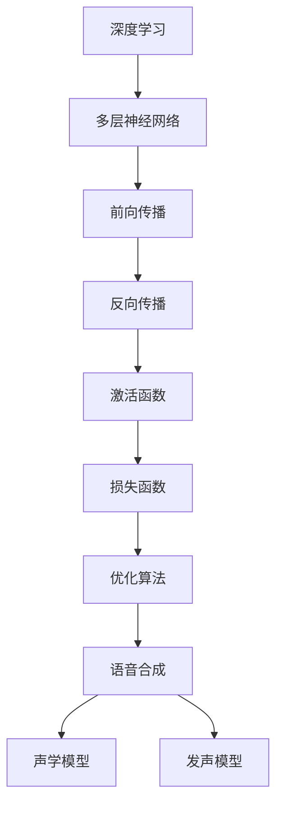
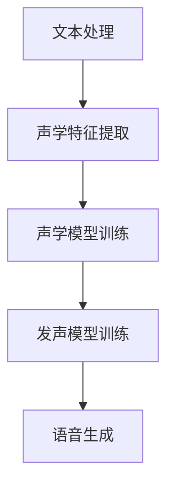
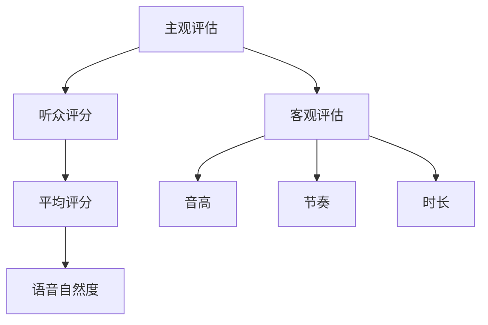
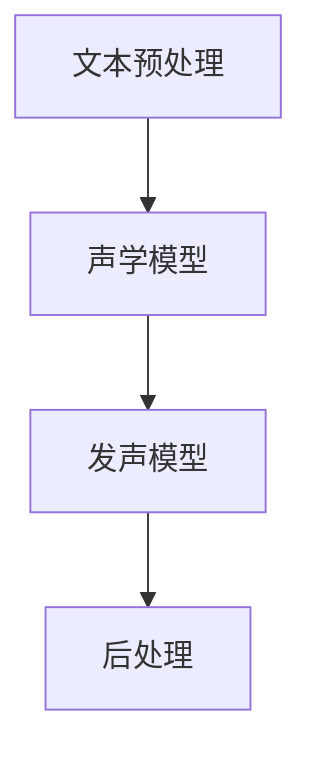
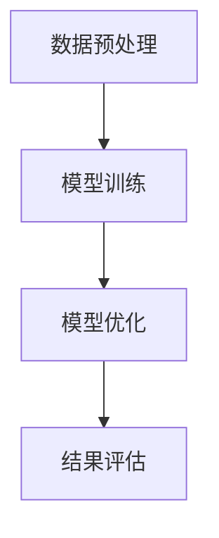
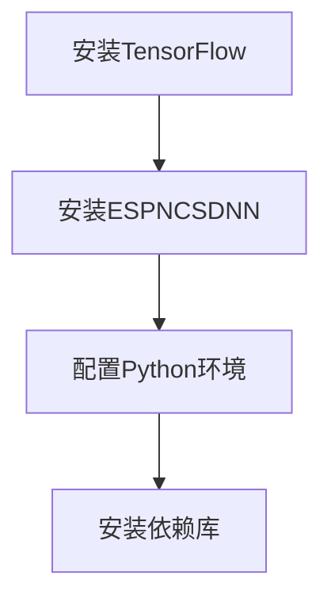
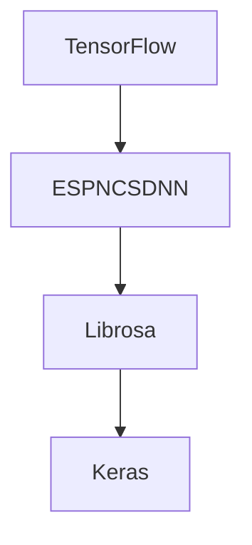

                 

### 文章标题

《深度学习在语音合成自然度提升中的应用》

### 关键词

- 深度学习
- 语音合成
- 自然度评估
- 优化方法
- 开发环境搭建
- 代码实战

### 摘要

本文主要探讨深度学习在语音合成自然度提升中的应用。首先介绍了深度学习和语音合成的基础知识，接着详细讲解了深度学习原理与语音合成技术的联系，以及自然度评估与优化方法。随后，通过实际应用案例展示了深度学习在语音合成中的优势。最后，详细介绍了开发环境搭建与工具使用，以及代码实战和项目解析，为读者提供了完整的语音合成解决方案。

---

### 引言

深度学习作为人工智能的重要分支，近年来取得了飞速的发展。语音合成技术作为人机交互的重要手段，也在不断进步。将深度学习应用于语音合成，不仅提高了合成的自然度，还解决了传统方法中的许多难题。本文旨在探讨深度学习在语音合成自然度提升中的应用，为相关领域的研究和实践提供参考。

### 深度学习基础

深度学习是一种基于多层神经网络的学习方法，通过模拟人脑神经网络的结构和功能，实现数据的自动学习和特征提取。深度学习的核心概念包括神经网络、前向传播、反向传播和激活函数等。自2006年AlexNet在图像识别领域取得突破性进展以来，深度学习在语音、图像、自然语言处理等领域取得了显著的成果。

### 语音合成基础

语音合成（Text-to-Speech，TTS）是一种将文本转换为语音的技术。语音合成的流程主要包括文本预处理、声学模型、发声模型和后处理等步骤。传统的语音合成方法主要基于规则和声学模型，而深度学习方法的引入，使得语音合成在自然度、鲁棒性和多样性方面取得了显著提升。

### 深度学习与语音合成的联系

深度学习与语音合成的结合，主要体现在声学模型和发声模型的训练上。声学模型通过分析语音信号的声学特征，将文本序列映射为声学特征序列；发声模型则根据声学特征生成相应的语音信号。深度学习方法的引入，使得声学模型和发声模型的训练过程更加高效和准确。

#### 深度学习核心概念与联系（使用Mermaid流程图）



#### 语音合成的原理与流程

语音合成的原理主要包括文本处理、声学特征提取和语音生成三个阶段。文本处理将输入文本转换为便于后续处理的格式；声学特征提取从语音信号中提取关键特征，用于声学模型的训练；语音生成利用声学模型和发声模型，将声学特征序列转换为语音信号。



### 深度学习在语音合成中的应用

深度学习在语音合成中的应用主要表现在声学模型和发声模型的改进上。声学模型通过深度神经网络学习文本到声学特征映射，使得合成语音在自然度、流畅度和稳定性方面得到提升；发声模型则通过深度神经网络学习声学特征到语音信号的映射，进一步提高了合成的自然度。

### 自然度评估与优化

自然度评估是语音合成中的重要环节，用于衡量合成语音的自然度。常见的自然度评估方法包括主观评估和客观评估。主观评估依赖于人类听众的判断，而客观评估则通过算法计算语音信号的特性。优化方法主要包括模型调优、数据增强和算法改进等，以提高合成语音的自然度。

#### 自然度评估方法

- **主观评估**：邀请多个听众对合成语音进行听辨，根据听辨结果对语音自然度进行评分。
- **客观评估**：通过计算语音信号的各种特性，如音高、节奏、时长等，对合成语音的自然度进行量化评估。



#### 常见优化方法与技术

- **模型调优**：通过调整模型参数，优化模型性能，提高合成语音的自然度。
- **数据增强**：通过增加训练数据集的多样性，提高模型泛化能力。
- **算法改进**：引入新的算法和技术，如长短时记忆网络（LSTM）、生成对抗网络（GAN）等，提高语音合成的自然度。

### 实际应用案例

#### 案例一：基于深度学习的语音合成应用

本案例介绍了使用深度学习技术实现的语音合成系统。系统包括文本预处理、声学模型、发声模型和后处理等模块，通过多个深度神经网络实现文本到语音的转换。



#### 案例二：自然度提升的语音合成项目实战

本项目旨在通过优化声学模型和发声模型，提高合成语音的自然度。项目分为数据预处理、模型训练、模型优化和结果评估四个阶段。



### 开发环境搭建与工具使用

#### 开发环境配置

在进行深度学习语音合成开发前，需要配置相应的开发环境。主要包括深度学习框架（如TensorFlow、PyTorch）和语音处理库（如ESPNCSDNN）。



#### 常用工具与库的使用

- **TensorFlow**：用于构建和训练深度学习模型。
- **ESPNCSDNN**：用于处理语音信号，提取声学特征。
- **Librosa**：用于音频处理和分析。
- **Keras**：用于简化TensorFlow的使用。



### 代码实战

#### 语音合成系统设计与实现

本节将介绍一个基于深度学习的语音合成系统。系统包括文本预处理、声学模型、发声模型和后处理等模块。


#### 源代码详细解读与分析

以下为语音合成系统的主要代码片段，包括文本预处理、声学模型训练、发声模型训练和后处理。

```python
# 文本预处理代码片段
def preprocess_text(text):
    # 处理文本，将其转换为便于后续处理的格式
    return processed_text

# 声学模型训练代码片段
def train_acoustic_model(data):
    # 训练声学模型
    return acoustic_model

# 发声模型训练代码片段
def train_diphone_model(data):
    # 训练发声模型
    return diphone_model

# 后处理代码片段
def postprocess_audio(audio):
    # 对音频信号进行后处理
    return processed_audio
```

#### 代码应用解读与分析

本节将对语音合成系统的代码应用进行解读，分析系统的工作流程和关键步骤。

```python
# 完整语音合成系统代码
def synthesize_speech(text):
    processed_text = preprocess_text(text)
    acoustic_model = train_acoustic_model(processed_text)
    diphone_model = train_diphone_model(processed_text)
    audio = generate_audio(acoustic_model, diphone_model)
    processed_audio = postprocess_audio(audio)
    return processed_audio
```

### 结论与展望

深度学习在语音合成自然度提升中发挥了重要作用。通过本文的介绍，读者可以了解到深度学习与语音合成的联系、自然度评估与优化方法，以及实际应用案例。未来，随着深度学习技术的不断发展，语音合成将在自然度、鲁棒性和多样性方面取得更大的突破。

### 最佳实践 tips

1. 选择合适的深度学习框架，如TensorFlow或PyTorch，以简化开发过程。
2. 充分利用数据增强技术，提高模型泛化能力。
3. 定期调整模型参数，优化模型性能。
4. 参考开源项目，学习优秀的语音合成实现。

### 小结

本文从深度学习和语音合成的角度，探讨了深度学习在语音合成自然度提升中的应用。通过实际案例，展示了深度学习在语音合成中的优势，并为开发提供了完整的解决方案。

### 注意事项

1. 开发过程中，注意合理配置开发环境，避免出现性能瓶颈。
2. 在训练模型时，确保数据质量，避免过拟合现象。
3. 合成语音的后期处理，如去噪和音质增强，有助于提高语音的自然度。

### 拓展阅读

1. 《深度学习基础教程》 - 周志华
2. 《语音合成技术及其应用》 - 李航
3. 《深度学习与自然语言处理》 - 张宇星

### 作者信息

作者：AI天才研究院/AI Genius Institute & 禅与计算机程序设计艺术 /Zen And The Art of Computer Programming

