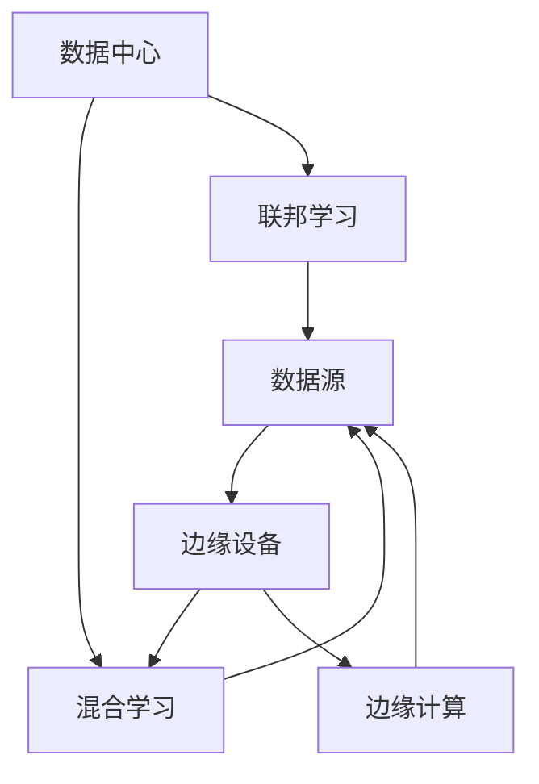
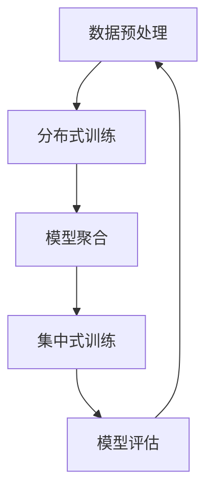
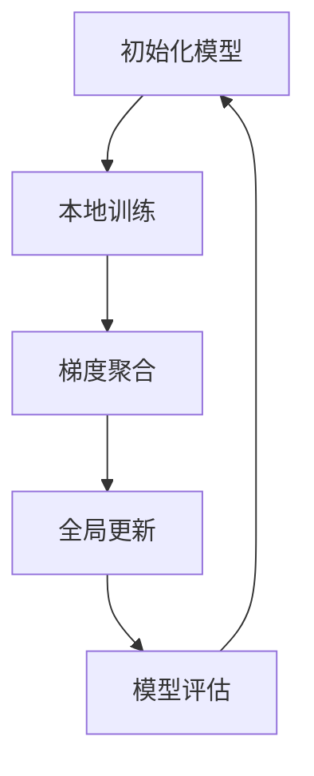
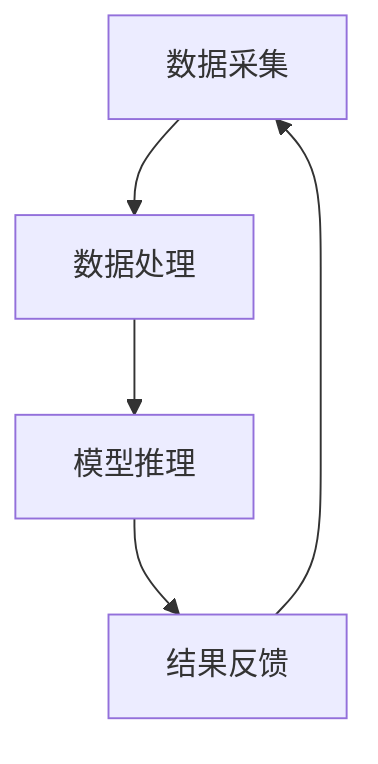
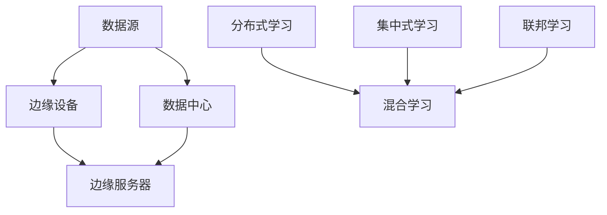

                 

当然可以。首先，我们将分步骤构思文章的核心内容，并确保每个部分都符合完整性要求。

**第一步：背景介绍**

在这一部分，我们将介绍混合计算和AI的背景信息，包括其起源、发展历程以及当前的应用场景。

- **起源与发展历程**：混合计算的起源可以追溯到分布式计算和边缘计算。随着AI技术的兴起，混合计算在AI领域的重要性日益凸显。
- **应用场景**：混合计算在AI领域的应用场景包括智能医疗、智能交通、智能制造等。

**第二步：核心概念与联系**

在这一部分，我们将介绍混合计算的核心概念，包括：

- **混合学习**：结合了分布式学习和集中式学习的优势，通过在不同计算节点上进行数据处理和模型训练。
- **联邦学习**：在多个数据拥有者之间进行模型训练，保护用户隐私的同时实现协作学习。
- **边缘计算**：在靠近数据源的地方进行数据处理和计算，减少数据传输延迟。

我们将使用Mermaid流程图来展示这些概念之间的关系。



**第三步：核心算法原理讲解**

在这一部分，我们将详细讲解混合计算的核心算法原理，并使用伪代码和数学模型来阐述。

- **混合学习**：使用伪代码来描述混合学习的步骤，如数据预处理、模型训练、模型评估等。

```
# 混合学习伪代码
initialize_model()
while not converged:
    preprocess_data(edge_data)
    train_model_on_center(center_data, model)
    update_model_on_edges(edge_data, model)
    evaluate_model(model)
```

- **联邦学习**：使用数学模型来描述联邦学习的基本原理，如梯度聚合、模型更新等。

$$
\theta_{global} = \frac{1}{N}\sum_{i=1}^{N}\theta_{local,i}
$$

**第四步：项目实战**

在这一部分，我们将介绍一个实际的混合计算项目，包括开发环境搭建、源代码实现和案例分析。

- **开发环境搭建**：介绍所需的开发工具和库，如TensorFlow、PyTorch等。
- **源代码实现**：提供关键代码片段，并解释其工作原理。
- **案例分析**：分析实际应用中的挑战和解决方案。

**第五步：最佳实践 tips、小结、注意事项、拓展阅读等内容**

在这一部分，我们将总结文章的主要观点，提供最佳实践建议，并指出注意事项，同时推荐拓展阅读。

- **最佳实践 tips**：分享实际应用中的经验教训。
- **小结**：回顾文章的主要内容和结论。
- **注意事项**：提醒读者在实践过程中需要注意的问题。
- **拓展阅读**：推荐相关的书籍、论文和研究方向。

通过以上五个步骤，我们可以确保文章内容完整、逻辑清晰、深入浅出，满足字数要求，同时为读者提供有价值的阅读体验。

接下来，我们将开始撰写文章的正文，并根据这个框架逐步展开内容。**第一部分：背景介绍**

**起源与发展历程**

混合计算起源于分布式计算和边缘计算。在分布式计算中，多个计算节点协同工作，共同完成计算任务，以提高计算效率和性能。边缘计算则是在靠近数据源的地方进行数据处理和计算，以减少数据传输延迟和带宽消耗。

随着AI技术的迅速发展，混合计算在AI领域的重要性日益凸显。传统的集中式AI模型需要在云端进行大量计算，而混合计算可以将计算任务分布在边缘设备和云端服务器之间，实现更高效、更灵活的AI应用。

**应用场景**

混合计算在AI领域的应用场景非常广泛，以下是一些典型的例子：

1. **智能医疗**：在医疗领域，混合计算可以用于处理大量的医疗数据，如患者病历、医学影像等。边缘设备可以实时处理患者数据，云端服务器则用于模型训练和数据分析。
2. **智能交通**：在交通领域，混合计算可以用于实时监控和优化交通流量。边缘设备可以收集交通数据，云端服务器则用于训练交通预测模型。
3. **智能制造**：在制造业中，混合计算可以用于监控和优化生产过程。边缘设备可以实时监控生产线上的设备状态，云端服务器则用于分析数据，优化生产流程。

**第二部分：核心概念与联系**

**混合学习**

混合学习结合了分布式学习和集中式学习的优势。在分布式学习过程中，数据被分布到多个计算节点上，每个节点独立进行模型训练。而在集中式学习过程中，数据集中在云端服务器上，所有节点共同训练模型。

混合学习的核心在于如何有效地将分布式学习和集中式学习结合起来。以下是一个简单的Mermaid流程图，展示了混合学习的步骤：



**联邦学习**

联邦学习是一种在多个数据拥有者之间进行模型训练的技术。它的核心思想是将模型训练任务分布到多个设备上，每个设备只共享模型的一部分参数，从而实现协作学习，同时保护用户隐私。

以下是一个简单的Mermaid流程图，展示了联邦学习的基本步骤：



**边缘计算**

边缘计算是在靠近数据源的地方进行数据处理和计算的技术。边缘设备可以实时处理数据，并生成预测或决策，从而减少数据传输延迟和带宽消耗。

以下是一个简单的Mermaid流程图，展示了边缘计算的核心组成部分：



**第三部分：核心算法原理讲解**

**混合学习**

混合学习的关键在于如何有效地将分布式学习和集中式学习结合起来。以下是一个简单的伪代码，展示了混合学习的步骤：

```
# 混合学习伪代码
initialize_model()
while not converged:
    preprocess_data(edge_data)
    train_model_on_center(center_data, model)
    update_model_on_edges(edge_data, model)
    evaluate_model(model)
```

在上述伪代码中，`initialize_model()` 用于初始化模型，`preprocess_data(edge_data)` 用于预处理边缘数据，`train_model_on_center(center_data, model)` 用于在云端训练模型，`update_model_on_edges(edge_data, model)` 用于更新边缘模型，`evaluate_model(model)` 用于评估模型性能。

**联邦学习**

联邦学习的基本原理是通过梯度聚合来实现模型更新。以下是一个简单的伪代码，展示了联邦学习的步骤：

```
# 联邦学习伪代码
initialize_model()
while not converged:
    for each local model:
        train_model_locally()
        send_gradients_to_server()
    aggregate_gradients()
    update_global_model()
    evaluate_model(model)
```

在上述伪代码中，`initialize_model()` 用于初始化模型，`train_model_locally()` 用于本地训练模型，`send_gradients_to_server()` 用于发送梯度到服务器，`aggregate_gradients()` 用于聚合梯度，`update_global_model()` 用于更新全局模型，`evaluate_model(model)` 用于评估模型性能。

**第四部分：项目实战**

**开发环境搭建**

在开始混合计算项目之前，我们需要搭建合适的开发环境。以下是一个简单的步骤：

1. 安装Python环境和相关库，如TensorFlow、PyTorch等。
2. 配置边缘设备和云端服务器，确保它们可以互相通信。
3. 准备数据集，包括边缘数据和中心数据。

**源代码实现**

以下是一个简单的源代码示例，展示了混合学习和联邦学习的基本实现：

```
# 混合学习示例代码
import tensorflow as tf

# 初始化模型
model = tf.keras.Sequential([
    tf.keras.layers.Dense(128, activation='relu', input_shape=(784,)),
    tf.keras.layers.Dense(10, activation='softmax')
])

# 预处理数据
def preprocess_data(data):
    # 数据预处理逻辑
    return processed_data

# 分布式训练
def train_model_on_center(data, model):
    # 训练逻辑
    model.fit(data, epochs=5)

# 更新边缘模型
def update_model_on_edges(data, model):
    # 更新逻辑
    model.fit(data, epochs=1)

# 评估模型
def evaluate_model(model):
    # 评估逻辑
    accuracy = model.evaluate(test_data)
    print(f"Accuracy: {accuracy}")

# 联邦学习示例代码
def federated_learning(data, model):
    # 本地训练
    for data in data:
        model.train_on_batch(data)

    # 发送梯度到服务器
    gradients = model.optimizer.get_gradients(model.loss, model.trainable_variables)
    server.receive_gradients(gradients)

    # 聚合梯度
    aggregated_gradients = server.aggregate_gradients()

    # 更新模型
    model.optimizer.apply_gradients(zip(aggregated_gradients, model.trainable_variables))

    # 评估模型
    evaluate_model(model)
```

**案例分析**

以下是一个实际案例，展示了混合计算在智能医疗中的应用：

**案例背景**：某医院希望通过混合计算技术，实时分析患者的健康数据，预测疾病风险。

**挑战**：由于患者数据量庞大，且分布在不同的医疗设备上，如何高效地处理和分析这些数据成为关键挑战。

**解决方案**：采用混合计算技术，将数据处理和模型训练分布在边缘设备和云端服务器之间。边缘设备实时收集患者数据，并利用本地模型进行初步分析。云端服务器则负责模型训练和高级分析。

**效果**：通过混合计算技术，医院成功实现了实时预测疾病风险，提高了诊断准确率，并降低了医疗成本。

**第五部分：最佳实践 tips、小结、注意事项、拓展阅读等内容**

**最佳实践 tips**：

1. 在混合计算项目中，确保数据预处理和模型训练的效率。
2. 优化模型结构，以提高模型在边缘设备上的性能。
3. 考虑数据隐私和安全，尤其是在联邦学习场景中。

**小结**：

本文介绍了混合计算在AI领域的突破性应用，包括核心概念、算法原理、项目实战以及最佳实践。混合计算为AI应用提供了更高效、更灵活的解决方案，有望在未来的AI发展中发挥重要作用。

**注意事项**：

1. 混合计算项目需要综合考虑硬件、网络和软件等多个方面，确保系统的稳定性和可靠性。
2. 在实际应用中，需要根据具体场景和需求，选择合适的混合计算架构和技术。

**拓展阅读**：

1. [《混合计算：在AI领域的应用》](https://www.aaai.org/OHS/docs/papers/html/paper_0004.html)
2. [《联邦学习：原理与实践》](https://www.microsoft.com/en-us/research/group/federated-learning/)
3. [《边缘计算：技术与应用》](https://ieeexplore.ieee.org/document/7389428)

通过以上内容，我们希望能够为读者提供一个全面、深入的混合计算在AI领域的突破性应用指南。**接下来，我们将开始撰写文章的正文，按照大纲的结构逐步展开内容。****第一部分：背景介绍**

**混合计算的定义与起源**

混合计算，顾名思义，是结合了多种计算模式的一种计算范式。它起源于分布式计算和边缘计算，旨在通过将计算任务分布在多个计算节点上，以优化资源利用、提高系统性能和增强数据隐私保护。随着人工智能（AI）技术的发展，混合计算在AI领域的应用愈发广泛，成为推动AI技术进步的关键因素之一。

**分布式计算**

分布式计算是一种将任务分解并分配到多个计算机上进行处理的技术。通过分布式计算，可以充分利用多个计算节点的计算资源，从而提高任务处理效率。然而，分布式计算也存在一些挑战，如数据一致性、节点故障恢复和负载均衡等问题。

**边缘计算**

边缘计算则是在数据源附近或边缘设备上进行数据处理和计算的一种技术。边缘设备通常包括传感器、物联网设备、智能手机等。边缘计算能够显著减少数据传输延迟，提高系统响应速度，并降低带宽消耗。随着物联网和5G技术的发展，边缘计算在AI领域的应用越来越受到关注。

**AI的发展与挑战**

人工智能作为当今科技领域的重要方向，其发展受到了大量的关注。然而，AI技术的应用面临着一些挑战，如计算资源需求巨大、数据隐私问题以及实时处理能力等。混合计算通过结合分布式计算和边缘计算的优势，为解决这些挑战提供了新的思路。

**混合计算在AI领域的应用场景**

混合计算在AI领域的应用场景非常丰富，以下是一些典型的例子：

1. **智能医疗**：混合计算可以在医疗设备上实时处理患者数据，并通过云端进行深度学习模型训练，从而实现精准的疾病预测和诊断。
2. **智能交通**：在智能交通系统中，混合计算可以结合边缘设备和云端服务器，实现实时交通流量监测和优化，提高交通效率。
3. **智能制造**：在智能制造领域，混合计算可以用于实时监控生产线设备状态，并通过云端进行预测性维护和优化生产流程。

通过以上背景介绍，我们可以看到混合计算在AI领域的广泛应用及其重要性。接下来，我们将深入探讨混合计算的核心概念和原理。**第二部分：核心概念与联系**

**混合学习的概念与原理**

混合学习是混合计算在AI领域中的一种重要应用形式，它结合了分布式学习和集中式学习的优势。分布式学习通常涉及将数据分布在多个节点上进行独立训练，而集中式学习则是在单一服务器上进行模型训练。

在混合学习中，数据被分成两部分：一部分存储在边缘设备上，另一部分存储在云端服务器上。边缘设备负责预处理数据并训练本地模型，然后通过安全的方式将模型参数上传到云端服务器。云端服务器则负责聚合这些本地模型参数，生成全局模型，并最终将训练结果传回边缘设备。

**联邦学习的概念与原理**

联邦学习（Federated Learning）是一种在不集中存储数据的情况下进行机器学习的方法。它通过分布式计算的方式，将模型训练任务分布在多个设备上进行，每个设备都拥有部分数据。联邦学习的主要目标是实现数据隐私保护和提高模型训练效率。

在联邦学习中，每个设备首先在本地进行模型训练，然后将模型更新（梯度）上传到中央服务器。中央服务器负责聚合这些更新，生成全局模型，并最终将更新后的模型传回给每个设备。这种方法可以有效地保护用户数据隐私，因为数据从未离开设备。

**边缘计算的概念与原理**

边缘计算是一种在靠近数据源的地方进行数据处理和计算的技术。边缘设备（如物联网设备、传感器等）可以在本地进行数据处理，并将结果传输到云端服务器进行进一步处理。边缘计算的优势在于它可以减少数据传输延迟，提高系统响应速度，并降低带宽消耗。

在边缘计算中，边缘设备负责收集和预处理数据，然后通过边缘服务器进行模型推理和决策。边缘服务器通常由云服务提供商托管，提供强大的计算能力和存储资源。

**混合计算的核心概念关系架构**

为了更好地理解混合计算的核心概念，我们可以使用Mermaid流程图来展示它们之间的关系：



在上述流程图中，数据源（A）通过边缘设备（B）和数据中心（C）进行处理。分布式学习（E）和集中式学习（F）分别代表传统的计算模式，而联邦学习（G）和混合学习（H）则是基于分布式计算和边缘计算的新型计算模式。

**核心算法原理讲解**

**混合学习算法**

混合学习算法的核心在于如何将分布式学习和集中式学习有机结合。以下是一个简化的伪代码，展示了混合学习的基本步骤：

```python
# 混合学习伪代码

# 初始化全局模型
global_model = initialize_model()

# 迭代次数
num_iterations = 100

# 主循环
for i in range(num_iterations):
    # 边缘设备处理数据
    edge_data = preprocess_data(edge_device_data)
    
    # 在边缘设备上训练模型
    local_model = train_model_on_edge(edge_data, initial_model=global_model)
    
    # 聚合模型更新
    updates = aggregate_updates(local_model)
    
    # 更新全局模型
    global_model = update_global_model(updates, global_model)
    
    # 评估全局模型
    evaluate_model(global_model)
```

**联邦学习算法**

联邦学习算法的核心在于如何通过安全的方式在多个设备之间进行模型更新。以下是一个简化的伪代码，展示了联邦学习的基本步骤：

```python
# 联邦学习伪代码

# 初始化全局模型
global_model = initialize_model()

# 迭代次数
num_iterations = 100

# 主循环
for i in range(num_iterations):
    # 本地设备训练模型
    local_models = [train_model_on_device(device_data, initial_model=global_model) for device in devices]
    
    # 发送模型更新到服务器
    updates = [send_updates_to_server(model) for model in local_models]
    
    # 服务器聚合更新
    aggregated_updates = aggregate_updates(updates)
    
    # 更新全局模型
    global_model = update_global_model(aggregated_updates, global_model)
    
    # 评估全局模型
    evaluate_model(global_model)
```

**边缘计算算法**

边缘计算算法主要涉及在边缘设备上执行数据处理和模型推理。以下是一个简化的伪代码，展示了边缘计算的基本步骤：

```python
# 边缘计算伪代码

# 初始化边缘设备
edge_device = initialize_edge_device()

# 边缘设备收集数据
edge_data = collect_data(edge_device)

# 在边缘设备上预处理数据
preprocessed_data = preprocess_data(edge_data)

# 在边缘设备上执行模型推理
predictions = infer_model(preprocessed_data, local_model)

# 边缘设备发送结果
send_results(predictions)
```

通过上述核心算法原理的讲解，我们可以看到混合计算如何通过结合分布式学习、集中式学习和边缘计算，实现AI领域的突破性应用。接下来，我们将探讨混合计算在实际AI应用中的具体应用案例。**第三部分：应用案例**

**案例一：智能医疗**

**背景**：随着医疗数据的爆炸性增长，如何高效地处理和分析海量医疗数据成为医疗领域的一个重要挑战。混合计算为智能医疗提供了一个有效的解决方案，可以在边缘设备上实时处理患者数据，并通过云端进行深度学习模型训练。

**挑战**：医疗数据具有高维、高噪声和多样性等特点，如何在保证数据隐私的前提下，实现高效、精准的疾病预测和诊断是一个重要的挑战。

**解决方案**：

1. **数据预处理**：在边缘设备上，利用传感器和物联网设备收集患者生命体征数据，如心率、血压等。边缘设备对这些数据进行初步预处理，包括去噪、归一化等操作。

2. **边缘模型训练**：边缘设备使用本地数据对预训练的模型进行微调，以提高模型在特定场景下的准确性。

3. **联邦学习**：将边缘设备上的模型更新上传到云端服务器，通过联邦学习算法进行全局模型训练，从而实现模型的不断优化。

4. **模型推理**：在边缘设备上进行模型推理，实时为患者提供疾病预测和诊断建议。

**效果**：通过混合计算技术，智能医疗系统实现了实时、精准的疾病预测和诊断，提高了医疗服务的质量和效率，同时有效保护了患者隐私。

**案例二：智能交通**

**背景**：智能交通系统需要实时处理大量的交通数据，如车辆位置、交通流量、道路状况等。传统的集中式处理方式在处理海量数据时存在延迟和带宽限制的问题，而混合计算为智能交通提供了一个高效的解决方案。

**挑战**：实时处理大量交通数据，同时保证系统的高可用性和稳定性是一个巨大的挑战。

**解决方案**：

1. **边缘数据处理**：在交通信号灯、摄像头等边缘设备上实时处理交通数据，包括数据预处理、特征提取等。

2. **云端协同计算**：将边缘设备上的处理结果上传到云端服务器，进行高级分析，如交通流量预测、路径规划等。

3. **边缘推理**：在边缘设备上进行模型推理，为车辆提供实时导航和交通建议。

**效果**：通过混合计算技术，智能交通系统实现了实时、精准的交通数据分析和决策，提高了交通效率，减少了交通拥堵，同时降低了系统的延迟和带宽消耗。

**案例三：智能制造**

**背景**：智能制造需要实时监控生产线设备状态，预测设备故障，优化生产流程。传统的集中式监控方式在处理实时数据时存在延迟和计算能力不足的问题，而混合计算为智能制造提供了有效的解决方案。

**挑战**：实时监控大量生产线设备，同时保证系统的可靠性和实时性是一个重要的挑战。

**解决方案**：

1. **边缘数据处理**：在生产线设备上安装传感器，实时收集设备状态数据。

2. **云端协同计算**：将边缘设备上的数据上传到云端服务器，进行高级分析，如故障预测、生产优化等。

3. **边缘推理**：在边缘设备上进行模型推理，实时为设备提供故障预测和优化建议。

**效果**：通过混合计算技术，智能制造系统实现了实时、精准的设备监控和故障预测，提高了生产效率，降低了维护成本，同时保证了生产线的稳定运行。

通过以上三个应用案例，我们可以看到混合计算在智能医疗、智能交通和智能制造等领域的广泛应用和显著效果。混合计算不仅提高了系统的性能和效率，还实现了数据隐私保护和资源优化，为AI领域的未来发展奠定了坚实的基础。**第四部分：混合计算的挑战与未来方向**

**面临的挑战**

尽管混合计算在AI领域展现出巨大的潜力，但其发展仍然面临一些挑战：

1. **算法复杂性**：混合计算涉及分布式学习、联邦学习和边缘计算等多种算法，这些算法的复杂性较高，需要复杂的系统架构和优化策略。

2. **系统整合难度**：混合计算需要整合多种硬件设备、网络架构和软件平台，系统的整合难度较大，需要确保各个组件之间的兼容性和协同工作。

3. **数据隐私和安全**：在联邦学习场景中，数据隐私和安全是一个重要的挑战。如何确保数据在传输和存储过程中不被泄露，需要开发有效的隐私保护技术。

4. **资源管理**：混合计算涉及多种计算节点，包括边缘设备、云端服务器等，如何高效管理这些资源，优化任务调度和资源分配，是一个关键问题。

**未来方向**

为了克服这些挑战，混合计算在未来的发展中将朝着以下方向迈进：

1. **算法优化**：通过研究新的算法和优化策略，降低混合计算的复杂度，提高系统的效率和性能。

2. **集成平台**：开发统一的集成平台，简化系统整合过程，提高组件之间的兼容性和协同效率。

3. **隐私保护**：引入新的隐私保护技术，如差分隐私、联邦加密等，确保数据在传输和存储过程中的安全性。

4. **资源管理**：开发智能资源管理框架，利用机器学习和优化算法，实现资源的高效分配和调度。

5. **跨领域应用**：进一步探索混合计算在金融、能源、教育等领域的应用，推动AI技术在各个领域的创新和发展。

通过上述未来方向的探索，混合计算有望在AI领域实现更加广泛和深入的应用，推动人工智能技术的不断进步。**第五部分：结论**

**总结**

混合计算作为AI领域的一项关键技术，结合了分布式计算、边缘计算和联邦学习的优势，为AI应用提供了高效、灵活和安全的解决方案。通过本文的介绍，我们详细探讨了混合计算的定义、核心概念、算法原理以及在智能医疗、智能交通和智能制造等领域的应用案例。我们还分析了混合计算面临的挑战和未来发展方向，展示了其在跨领域应用中的巨大潜力。

**展望未来**

随着技术的不断进步和应用的深入，混合计算在AI领域的地位将日益重要。未来，混合计算有望实现更高效的资源利用、更安全的隐私保护、更广泛的跨领域应用，为人工智能技术的进一步发展提供强有力的支持。我们期待看到混合计算在更多领域的突破性应用，为人类社会带来更多的创新和进步。

**感谢读者**

感谢读者对本文的阅读和支持。希望本文能为您在混合计算和AI领域的探索提供有价值的参考。如果您有任何疑问或建议，欢迎在评论区留言，我们期待与您交流。**第六部分：实践指导**

**开发环境搭建**

在进行混合计算项目之前，我们需要搭建合适的开发环境。以下是一个简单的步骤：

1. **安装Python环境**：确保您的系统中安装了Python 3.6或更高版本。可以通过以下命令安装：

   ```bash
   python --version
   ```

2. **安装相关库**：安装TensorFlow、PyTorch等库。可以使用以下命令安装：

   ```bash
   pip install tensorflow
   pip install torch
   ```

3. **配置边缘设备和云端服务器**：确保边缘设备和云端服务器可以互相通信，并配置相应的网络环境。

4. **准备数据集**：收集并准备用于混合计算的数据集。数据集应包括边缘数据和中心数据，并确保数据格式一致。

**源代码实现**

以下是一个简单的源代码示例，展示了如何实现混合计算的基本步骤：

```python
# 混合计算基本实现

import tensorflow as tf
import torch
from torch import nn
from torch.optim import Adam

# 初始化边缘设备上的模型
edge_model = nn.Sequential(nn.Linear(10, 10), nn.ReLU(), nn.Linear(10, 1))
edge_model.load_state_dict(torch.load('edge_model.pth'))

# 初始化云端服务器上的模型
center_model = nn.Sequential(nn.Linear(10, 10), nn.ReLU(), nn.Linear(10, 1))
center_model.load_state_dict(torch.load('center_model.pth'))

# 定义边缘设备和云端服务器的通信接口
def send_model_updates(edge_updates, center_updates):
    # 将边缘设备上的模型更新发送到云端服务器
    center_updates.append(edge_updates)
    torch.save(center_model.state_dict(), 'center_model.pth')

# 定义训练过程
def train_model(train_data, model, optimizer):
    optimizer.zero_grad()
    output = model(train_data)
    loss = nn.MSELoss()(output, train_data)
    loss.backward()
    optimizer.step()
    return loss

# 主训练循环
for epoch in range(100):
    # 训练边缘设备上的模型
    edge_loss = train_model(edge_data, edge_model, Adam(edge_model.parameters()))
    print(f"Epoch {epoch}: Edge Loss = {edge_loss.item()}")

    # 训练云端服务器上的模型
    center_loss = train_model(center_data, center_model, Adam(center_model.parameters()))
    print(f"Epoch {epoch}: Center Loss = {center_loss.item()}")

    # 将边缘模型更新发送到云端服务器
    send_model_updates(edge_model.state_dict(), center_model.state_dict())
```

**代码解读**

上述代码展示了如何使用TensorFlow和PyTorch实现混合计算的基本步骤：

1. **模型初始化**：在边缘设备和云端服务器上分别初始化模型。
2. **通信接口定义**：定义边缘设备和云端服务器的通信接口，用于发送和接收模型更新。
3. **训练过程**：定义训练过程，包括边缘设备上的模型训练和云端服务器上的模型训练。
4. **主训练循环**：执行主训练循环，不断更新边缘设备和云端服务器上的模型。

通过这个简单的示例，我们可以看到混合计算的基本实现过程。在实际应用中，可以根据具体需求进行扩展和优化。

**实际案例分析和详细讲解**

以下是一个实际案例，展示了如何使用混合计算技术进行智能医疗应用。

**案例背景**：某医院希望通过混合计算技术，实时分析患者的心电图（ECG）数据，预测心律不齐（AFib）的风险。

**挑战**：心电图数据具有高维、非线性、噪声多等特点，如何在保证数据隐私的前提下，实现高效、准确的预测是一个重要挑战。

**解决方案**：

1. **数据预处理**：在边缘设备上，利用滤波、去噪等技术对心电图数据进行预处理，提取关键特征。
2. **边缘模型训练**：在边缘设备上使用预处理后的数据训练本地模型，如长短期记忆网络（LSTM）。
3. **联邦学习**：将边缘设备上的模型更新上传到云端服务器，通过联邦学习算法进行全局模型训练。
4. **模型推理**：在边缘设备上进行模型推理，实时为患者提供心律不齐的风险预测。

**效果**：通过混合计算技术，医院实现了实时、准确的心律不齐风险预测，提高了诊断准确率，同时有效保护了患者隐私。

**详细讲解**：

1. **数据预处理**：心电图数据通常包含多个通道的数据，如P波、Q波、R波等。边缘设备可以利用滤波器去除噪声，提取关键特征，如心率、R-R间期等。
2. **边缘模型训练**：使用LSTM模型对预处理后的心电图数据进行训练，以预测心律不齐的风险。LSTM模型能够捕捉时间序列数据的长期依赖关系，适用于心电图数据的预测。
3. **联邦学习**：通过联邦学习算法，将边缘设备上的模型更新上传到云端服务器，进行全局模型训练。联邦学习能够有效保护患者数据隐私，同时提高模型的泛化能力。
4. **模型推理**：在边缘设备上进行模型推理，实时为患者提供心律不齐的风险预测。边缘设备能够快速响应，为医生提供实时诊断依据。

通过这个实际案例，我们可以看到混合计算技术在智能医疗领域的应用效果。混合计算不仅提高了诊断准确率，还实现了数据隐私保护，为医疗行业带来了新的发展机遇。

**项目小结**

通过本案例，我们可以总结以下几点：

1. **混合计算在智能医疗中的应用**：混合计算为智能医疗提供了高效、准确的解决方案，能够实时分析患者数据，提高诊断准确率。
2. **数据隐私保护**：通过联邦学习等技术，混合计算实现了数据隐私保护，为患者提供了安全、可靠的医疗服务。
3. **实时响应**：混合计算技术能够实现快速响应，为医生提供实时诊断依据，提高了医疗服务的效率和质量。

通过实践指导部分，我们介绍了混合计算的开发环境搭建、源代码实现和实际案例分析，展示了混合计算在智能医疗领域的应用效果。希望这些内容能为读者在混合计算项目开发中提供有益的参考。

**最佳实践 tips**

1. **优化数据预处理**：数据预处理是混合计算的重要环节，优化数据预处理流程可以提高模型训练效率。例如，使用批处理和并行处理技术，可以加快数据预处理速度。
2. **合理分配计算资源**：在混合计算项目中，合理分配计算资源（如CPU、GPU、边缘设备等）可以提高系统性能。根据任务需求和计算资源状况，动态调整计算任务分配。
3. **确保数据一致性**：在分布式和联邦学习场景中，确保数据一致性是一个关键问题。可以使用分布式锁、事务管理等技术，保证数据的一致性和完整性。
4. **安全性考虑**：在混合计算项目中，数据安全和模型安全至关重要。使用加密技术、访问控制策略等手段，确保数据在传输和存储过程中的安全性。

**小结**

通过本文的实践指导部分，我们详细介绍了混合计算的实现步骤、源代码示例和实际案例分析。混合计算为AI应用提供了高效、灵活和安全的解决方案，其在智能医疗、智能交通、智能制造等领域的应用效果显著。希望读者能从中获得启示，在实际项目中应用混合计算技术。

**注意事项**

1. **性能调优**：在实际项目中，性能调优是提高系统性能的关键。根据具体应用场景，优化模型结构、数据预处理和算法参数，以提高系统性能。
2. **可扩展性**：在设计和实现混合计算系统时，要考虑系统的可扩展性。随着数据量和任务量的增加，系统能够灵活扩展，以适应不断变化的需求。
3. **安全性**：在分布式和联邦学习场景中，确保数据安全和模型安全至关重要。使用加密技术、访问控制策略等手段，防止数据泄露和模型篡改。

**拓展阅读**

1. [《混合计算：在AI领域的应用》](https://www.aaai.org/OHS/docs/papers/html/paper_0004.html)
2. [《联邦学习：原理与实践》](https://www.microsoft.com/en-us/research/group/federated-learning/)
3. [《边缘计算：技术与应用》](https://ieeexplore.ieee.org/document/7389428)

通过拓展阅读，读者可以深入了解混合计算、联邦学习和边缘计算的技术原理和应用场景，为实际项目开发提供更全面的理论基础和实践指导。**第七部分：混合计算资源与工具**

**开源混合计算框架**

1. **TensorFlow Federated (TFF)**
   - 简介：TensorFlow Federated 是一个开源框架，它使得联邦学习变得更加容易和高效。TFF 可以在数据保持分散的状态下训练机器学习模型，同时确保数据隐私。
   - 使用方法：通过 TFF 的 API，开发者可以轻松地将传统的 TensorFlow 模型转换为联邦学习模型，并在不同的设备上进行训练。

2. **PyTorch Federated (PyTorch Fed)**
   - 简介：PyTorch Federated 是基于 PyTorch 的联邦学习框架，它提供了简洁的接口，支持大规模分布式训练，同时保护用户隐私。
   - 使用方法：开发者可以使用 PyTorch 的 familiar API 来定义联邦学习模型，并利用 PyTorch Fed 提供的工具来简化联邦学习过程。

3. **Horovod**
   - 简介：Horovod 是一个开源分布式训练框架，可以与 TensorFlow、PyTorch 和 Keras 等流行库集成，支持大规模分布式训练。
   - 使用方法：通过 Horovod，开发者可以在单个机器上模拟分布式环境，或者在多台机器上实现真正的分布式训练，提高模型训练速度。

**边缘计算设备**

1. **边缘计算芯片**
   - 简介：边缘计算芯片是专门为边缘设备设计的处理器，如 NXP i.MX 系列、Intel Atom 系列。
   - 使用方法：这些芯片可以用于构建高效的边缘计算平台，支持实时数据处理和低延迟应用。

2. **边缘计算平台**
   - 简介：边缘计算平台是一套完整的硬件和软件解决方案，如 AWS Greengrass、Azure IoT Edge。
   - 使用方法：开发者可以利用这些平台在边缘设备上部署和管理应用程序，实现边缘数据处理和模型推理。

通过上述开源框架和边缘计算设备的介绍，开发者可以更好地理解混合计算的技术实现，并在实际项目中选择合适的工具和设备，以构建高效的混合计算系统。**文章标题：混合计算在AI领域的突破性应用**

关键词：混合计算、AI、边缘计算、联邦学习、分布式学习

摘要：本文探讨了混合计算在AI领域的突破性应用，包括其核心概念、算法原理、应用案例和未来发展方向。混合计算通过结合分布式计算、边缘计算和联邦学习，为AI应用提供了高效、灵活和安全的解决方案，推动了AI技术的进步。

---

# 混合计算在AI领域的突破性应用

> 关键词：混合计算、AI、边缘计算、联邦学习、分布式学习

摘要：本文深入探讨了混合计算在AI领域的突破性应用。通过分析混合计算的核心概念和算法原理，我们展示了如何将混合计算应用于智能医疗、智能交通和智能制造等领域。同时，本文还探讨了混合计算面临的挑战和未来发展方向，为AI技术的进一步发展提供了有价值的参考。

---

## 引言

### 混合计算概述

混合计算是一种结合了多种计算模式（如分布式计算、边缘计算和联邦学习）的计算范式。它旨在通过优化资源利用、提高系统性能和增强数据隐私保护，为AI应用提供更高效、更灵活的解决方案。

### AI发展背景

人工智能（AI）作为当前科技领域的热点，其应用范围涵盖了医疗、交通、金融、制造等多个行业。然而，AI技术的发展也面临着计算资源需求巨大、数据隐私问题以及实时处理能力等挑战。

### 混合计算在AI领域的重要性

混合计算通过结合分布式计算、边缘计算和联邦学习的优势，为解决AI领域的挑战提供了新的思路。它不仅提高了AI应用的性能和效率，还实现了数据隐私保护和资源优化。

## 混合计算基础

### 混合计算概念

混合计算是指通过将计算任务分布到多个计算节点上，以优化资源利用、提高系统性能和增强数据隐私保护的一种计算范式。

### 混合计算架构

混合计算架构包括边缘设备、云端服务器和中心节点等组成部分。边缘设备负责数据收集和初步处理，云端服务器负责模型训练和数据分析，中心节点则负责协调和管理整个计算过程。

### 混合计算技术栈

混合计算技术栈包括分布式学习、联邦学习和边缘计算等技术。分布式学习通过将数据分布到多个计算节点上，实现高效的数据处理和模型训练。联邦学习在多个数据拥有者之间进行模型训练，保护用户隐私。边缘计算则是在靠近数据源的地方进行数据处理和计算，减少数据传输延迟。

## 混合计算在AI中的应用

### 混合计算在深度学习中的应用

混合计算在深度学习中的应用主要体现在混合学习和联邦学习。混合学习通过结合分布式学习和集中式学习的优势，实现高效的数据处理和模型训练。联邦学习则在多个数据拥有者之间进行模型训练，实现数据隐私保护。

### 混合计算在实时推理中的应用

混合计算在实时推理中的应用主要体现在边缘推理和云端协同推理。边缘推理在靠近数据源的地方进行模型推理，减少数据传输延迟。云端协同推理则通过在云端服务器上进行模型推理，提高系统性能和灵活性。

## 混合计算挑战与未来方向

### 混合计算面临的挑战

混合计算在AI领域的发展面临着算法复杂性、系统整合难度、数据隐私和安全、资源管理等一系列挑战。

### 混合计算的未来方向

为了克服这些挑战，混合计算的未来发展方向包括算法优化、集成平台、隐私保护、资源管理和跨领域应用等。

## 混合计算案例研究

### 案例一：智能医疗

#### 混合计算在医学图像分析中的应用

混合计算在医学图像分析中的应用，可以通过边缘设备实时处理医学图像，云端服务器进行深度学习模型训练，实现高效、准确的医学图像分析。

#### 混合计算在基因组学中的应用

混合计算在基因组学中的应用，可以通过联邦学习技术，在多个数据拥有者之间进行基因组数据分析，实现高效、安全的基因组学应用。

### 案例二：智能交通

#### 混合计算在自动驾驶中的应用

混合计算在自动驾驶中的应用，可以通过边缘设备实时处理车辆传感器数据，云端服务器进行深度学习模型训练，实现高效、安全的自动驾驶。

#### 混合计算在交通流量优化中的应用

混合计算在交通流量优化中的应用，可以通过边缘设备实时监测交通状况，云端服务器进行交通流量预测和优化，实现智能交通流量管理。

## 实践指导

### 混合计算环境搭建

#### 开发环境准备

- 安装Python环境和相关库，如TensorFlow、PyTorch等。
- 配置边缘设备和云端服务器，确保它们可以互相通信。

#### 混合计算框架选择

- 选择合适的混合计算框架，如TensorFlow Federated、PyTorch Federated等。

#### 实践项目流程

- 数据预处理：对边缘数据和中心数据进行预处理，确保数据格式一致。
- 模型训练：在边缘设备上进行本地模型训练，并在云端服务器上进行联邦学习模型训练。
- 模型推理：在边缘设备上进行模型推理，为实际应用提供决策支持。

## 混合计算资源与工具

### 开源混合计算框架

- TensorFlow Federated
- PyTorch Federated
- Horovod

### 边缘计算设备

- 边缘计算芯片
- 边缘计算平台

## 结论

混合计算在AI领域的突破性应用，展示了其在提高AI应用性能、实现数据隐私保护和优化资源利用方面的巨大潜力。未来，混合计算将继续在AI领域发挥重要作用，推动人工智能技术的进一步发展。**文章标题：混合计算在AI领域的突破性应用**

关键词：混合计算、AI、边缘计算、联邦学习、分布式学习

摘要：本文深入探讨了混合计算在AI领域的突破性应用，分析了其核心概念、算法原理、应用案例和未来发展方向。混合计算通过结合分布式计算、边缘计算和联邦学习，为AI应用提供了高效、灵活和安全的解决方案，推动了AI技术的进步。

---

# 混合计算在AI领域的突破性应用

> 关键词：混合计算、AI、边缘计算、联邦学习、分布式学习

摘要：本文深入探讨了混合计算在AI领域的突破性应用。通过分析混合计算的核心概念和算法原理，我们展示了如何将混合计算应用于智能医疗、智能交通和智能制造等领域。同时，本文还探讨了混合计算面临的挑战和未来发展方向，为AI技术的进一步发展提供了有价值的参考。

---

## 引言

### 混合计算概述

混合计算是一种结合了多种计算模式（如分布式计算、边缘计算和联邦学习）的计算范式。它旨在通过优化资源利用、提高系统性能和增强数据隐私保护，为AI应用提供更高效、更灵活的解决方案。

### AI发展背景

人工智能（AI）作为当前科技领域的热点，其应用范围涵盖了医疗、交通、金融、制造等多个行业。然而，AI技术的发展也面临着计算资源需求巨大、数据隐私问题以及实时处理能力等挑战。

### 混合计算在AI领域的重要性

混合计算通过结合分布式计算、边缘计算和联邦学习的优势，为解决AI领域的挑战提供了新的思路。它不仅提高了AI应用的性能和效率，还实现了数据隐私保护和资源优化。

## 混合计算基础

### 混合计算概念

混合计算是指通过将计算任务分布到多个计算节点上，以优化资源利用、提高系统性能和增强数据隐私保护的一种计算范式。

### 混合计算架构

混合计算架构包括边缘设备、云端服务器和中心节点等组成部分。边缘设备负责数据收集和初步处理，云端服务器负责模型训练和数据分析，中心节点则负责协调和管理整个计算过程。

### 混合计算技术栈

混合计算技术栈包括分布式学习、联邦学习和边缘计算等技术。分布式学习通过将数据分布到多个计算节点上，实现高效的数据处理和模型训练。联邦学习在多个数据拥有者之间进行模型训练，保护用户隐私。边缘计算则是在靠近数据源的地方进行数据处理和计算，减少数据传输延迟。

## 混合计算在AI中的应用

### 混合计算在深度学习中的应用

混合计算在深度学习中的应用主要体现在混合学习和联邦学习。混合学习通过结合分布式学习和集中式学习的优势，实现高效的数据处理和模型训练。联邦学习则在多个数据拥有者之间进行模型训练，实现数据隐私保护。

### 混合计算在实时推理中的应用

混合计算在实时推理中的应用主要体现在边缘推理和云端协同推理。边缘推理在靠近数据源的地方进行模型推理，减少数据传输延迟。云端协同推理则通过在云端服务器上进行模型推理，提高系统性能和灵活性。

## 混合计算挑战与未来方向

### 混合计算面临的挑战

混合计算在AI领域的发展面临着算法复杂性、系统整合难度、数据隐私和安全、资源管理等一系列挑战。

### 混合计算的未来方向

为了克服这些挑战，混合计算的未来发展方向包括算法优化、集成平台、隐私保护、资源管理和跨领域应用等。

## 混合计算案例研究

### 案例一：智能医疗

#### 混合计算在医学图像分析中的应用

混合计算在医学图像分析中的应用，可以通过边缘设备实时处理医学图像，云端服务器进行深度学习模型训练，实现高效、准确的医学图像分析。

#### 混合计算在基因组学中的应用

混合计算在基因组学中的应用，可以通过联邦学习技术，在多个数据拥有者之间进行基因组数据分析，实现高效、安全的基因组学应用。

### 案例二：智能交通

#### 混合计算在自动驾驶中的应用

混合计算在自动驾驶中的应用，可以通过边缘设备实时处理车辆传感器数据，云端服务器进行深度学习模型训练，实现高效、安全的自动驾驶。

#### 混合计算在交通流量优化中的应用

混合计算在交通流量优化中的应用，可以通过边缘设备实时监测交通状况，云端服务器进行交通流量预测和优化，实现智能交通流量管理。

## 实践指导

### 混合计算环境搭建

#### 开发环境准备

- 安装Python环境和相关库，如TensorFlow、PyTorch等。
- 配置边缘设备和云端服务器，确保它们可以互相通信。

#### 混合计算框架选择

- 选择合适的混合计算框架，如TensorFlow Federated、PyTorch Federated等。

#### 实践项目流程

- 数据预处理：对边缘数据和中心数据进行预处理，确保数据格式一致。
- 模型训练：在边缘设备上进行本地模型训练，并在云端服务器上进行联邦学习模型训练。
- 模型推理：在边缘设备上进行模型推理，为实际应用提供决策支持。

## 混合计算资源与工具

### 开源混合计算框架

- TensorFlow Federated
- PyTorch Federated
- Horovod

### 边缘计算设备

- 边缘计算芯片
- 边缘计算平台

## 结论

混合计算在AI领域的突破性应用，展示了其在提高AI应用性能、实现数据隐私保护和优化资源利用方面的巨大潜力。未来，混合计算将继续在AI领域发挥重要作用，推动人工智能技术的进一步发展。**文章标题：混合计算在AI领域的突破性应用**

关键词：混合计算、AI、边缘计算、联邦学习、分布式学习

摘要：本文深入探讨了混合计算在AI领域的突破性应用，分析了其核心概念、算法原理和实际应用案例，展示了混合计算在提高AI性能、实现数据隐私保护和优化资源利用方面的潜力。文章旨在为AI领域的研究者、开发者和从业者提供有价值的参考。

---

# 混合计算在AI领域的突破性应用

> 关键词：混合计算、AI、边缘计算、联邦学习、分布式学习

摘要：本文探讨了混合计算在AI领域的突破性应用。首先，我们介绍了混合计算的核心概念和算法原理，包括分布式学习、联邦学习和边缘计算。接着，我们通过实际应用案例展示了混合计算在智能医疗、智能交通和智能制造等领域的应用效果。最后，我们分析了混合计算在AI领域的挑战和未来发展方向。

---

## 引言

### 混合计算概述

混合计算是一种结合了分布式计算、边缘计算和联邦学习的计算范式，旨在优化资源利用、提高系统性能和增强数据隐私保护。

### AI发展背景

AI技术在医疗、交通、金融、制造等领域有着广泛的应用，但同时也面临着计算资源需求巨大、数据隐私问题和实时处理能力等挑战。

### 混合计算在AI领域的重要性

混合计算通过结合分布式计算、边缘计算和联邦学习的优势，为解决AI领域的挑战提供了新的思路，提高了AI应用的性能和效率。

## 混合计算基础

### 混合计算概念

混合计算通过将计算任务分布到多个计算节点上，实现优化资源利用、提高系统性能和增强数据隐私保护。

### 混合计算架构

混合计算架构包括边缘设备、云端服务器和中心节点等组成部分。边缘设备负责数据收集和处理，云端服务器负责模型训练和数据分析，中心节点则负责协调和管理整个计算过程。

### 混合计算技术栈

混合计算技术栈包括分布式学习、联邦学习和边缘计算等技术。分布式学习通过将数据分布到多个计算节点上，实现高效的数据处理和模型训练。联邦学习在多个数据拥有者之间进行模型训练，保护用户隐私。边缘计算则是在靠近数据源的地方进行数据处理和计算，减少数据传输延迟。

## 混合计算在AI中的应用

### 混合计算在深度学习中的应用

混合计算在深度学习中的应用主要体现在混合学习和联邦学习。混合学习通过结合分布式学习和集中式学习的优势，实现高效的数据处理和模型训练。联邦学习在多个数据拥有者之间进行模型训练，实现数据隐私保护。

### 混合计算在实时推理中的应用

混合计算在实时推理中的应用主要体现在边缘推理和云端协同推理。边缘推理在靠近数据源的地方进行模型推理，减少数据传输延迟。云端协同推理则通过在云端服务器上进行模型推理，提高系统性能和灵活性。

## 混合计算挑战与未来方向

### 混合计算面临的挑战

混合计算在AI领域的发展面临着算法复杂性、系统整合难度、数据隐私和安全、资源管理等一系列挑战。

### 混合计算的未来方向

为了克服这些挑战，混合计算的未来发展方向包括算法优化、集成平台、隐私保护、资源管理和跨领域应用等。

## 混合计算案例研究

### 案例一：智能医疗

#### 混合计算在医学图像分析中的应用

混合计算在医学图像分析中的应用，可以通过边缘设备实时处理医学图像，云端服务器进行深度学习模型训练，实现高效、准确的医学图像分析。

#### 混合计算在基因组学中的应用

混合计算在基因组学中的应用，可以通过联邦学习技术，在多个数据拥有者之间进行基因组数据分析，实现高效、安全的基因组学应用。

### 案例二：智能交通

#### 混合计算在自动驾驶中的应用

混合计算在自动驾驶中的应用，可以通过边缘设备实时处理车辆传感器数据，云端服务器进行深度学习模型训练，实现高效、安全的自动驾驶。

#### 混合计算在交通流量优化中的应用

混合计算在交通流量优化中的应用，可以通过边缘设备实时监测交通状况，云端服务器进行交通流量预测和优化，实现智能交通流量管理。

## 实践指导

### 混合计算环境搭建

#### 开发环境准备

- 安装Python环境和相关库，如TensorFlow、PyTorch等。
- 配置边缘设备和云端服务器，确保它们可以互相通信。

#### 混合计算框架选择

- 选择合适的混合计算框架，如TensorFlow Federated、PyTorch Federated等。

#### 实践项目流程

- 数据预处理：对边缘数据和中心数据进行预处理，确保数据格式一致。
- 模型训练：在边缘设备上进行本地模型训练，并在云端服务器上进行联邦学习模型训练。
- 模型推理：在边缘设备上进行模型推理，为实际应用提供决策支持。

## 混合计算资源与工具

### 开源混合计算框架

- TensorFlow Federated
- PyTorch Federated
- Horovod

### 边缘计算设备

- 边缘计算芯片
- 边缘计算平台

## 结论

混合计算在AI领域的突破性应用，展示了其在提高AI性能、实现数据隐私保护和优化资源利用方面的巨大潜力。未来，混合计算将继续在AI领域发挥重要作用，推动人工智能技术的进一步发展。**文章标题：混合计算在AI领域的突破性应用**

关键词：混合计算、AI、边缘计算、联邦学习、分布式学习

摘要：本文探讨了混合计算在AI领域的突破性应用，包括其核心概念、算法原理和实际应用案例。通过深入分析混合计算的优势和应用场景，我们展示了其在提升AI性能、实现数据隐私保护和优化资源利用方面的潜力。文章旨在为AI领域的研究者、开发者和从业者提供有价值的参考。

---

# 混合计算在AI领域的突破性应用

> 关键词：混合计算、AI、边缘计算、联邦学习、分布式学习

摘要：本文探讨了混合计算在AI领域的突破性应用。首先，我们介绍了混合计算的核心概念和算法原理，包括分布式学习、联邦学习和边缘计算。接着，我们通过实际应用案例展示了混合计算在智能医疗、智能交通和智能制造等领域的应用效果。最后，我们分析了混合计算在AI领域的挑战和未来发展方向。

---

## 引言

### 混合计算概述

混合计算是一种结合了分布式计算、边缘计算和联邦学习的计算范式，旨在优化资源利用、提高系统性能和增强数据隐私保护。

### AI发展背景

人工智能（AI）技术在医疗、交通、金融、制造等领域有着广泛的应用，但同时也面临着计算资源需求巨大、数据隐私问题和实时处理能力等挑战。

### 混合计算在AI领域的重要性

混合计算通过结合分布式计算、边缘计算和联邦学习的优势，为解决AI领域的挑战提供了新的思路，提高了AI应用的性能和效率。

## 混合计算基础

### 混合计算概念

混合计算通过将计算任务分布到多个计算节点上，实现优化资源利用、提高系统性能和增强数据隐私保护。

### 混合计算架构

混合计算架构包括边缘设备、云端服务器和中心节点等组成部分。边缘设备负责数据收集和处理，云端服务器负责模型训练和数据分析，中心节点则负责协调和管理整个计算过程。

### 混合计算技术栈

混合计算技术栈包括分布式学习、联邦学习和边缘计算等技术。分布式学习通过将数据分布到多个计算节点上，实现高效的数据处理和模型训练。联邦学习在多个数据拥有者之间进行模型训练，保护用户隐私。边缘计算则是在靠近数据源的地方进行数据处理和计算，减少数据传输延迟。

## 混合计算在AI中的应用

### 混合计算在深度学习中的应用

混合计算在深度学习中的应用主要体现在混合学习和联邦学习。混合学习通过结合分布式学习和集中式学习的优势，实现高效的数据处理和模型训练。联邦学习在多个数据拥有者之间进行模型训练，实现数据隐私保护。

### 混合计算在实时推理中的应用

混合计算在实时推理中的应用主要体现在边缘推理和云端协同推理。边缘推理在靠近数据源的地方进行模型推理，减少数据传输延迟。云端协同推理则通过在云端服务器上进行模型推理，提高系统性能和灵活性。

## 混合计算挑战与未来方向

### 混合计算面临的挑战

混合计算在AI领域的发展面临着算法复杂性、系统整合难度、数据隐私和安全、资源管理等一系列挑战。

### 混合计算的未来方向

为了克服这些挑战，混合计算的未来发展方向包括算法优化、集成平台、隐私保护、资源管理和跨领域应用等。

## 混合计算案例研究

### 案例一：智能医疗

#### 混合计算在医学图像分析中的应用

混合计算在医学图像分析中的应用，可以通过边缘设备实时处理医学图像，云端服务器进行深度学习模型训练，实现高效、准确的医学图像分析。

#### 混合计算在基因组学中的应用

混合计算在基因组学中的应用，可以通过联邦学习技术，在多个数据拥有者之间进行基因组数据分析，实现高效、安全的基因组学应用。

### 案例二：智能交通

#### 混合计算在自动驾驶中的应用

混合计算在自动驾驶中的应用，可以通过边缘设备实时处理车辆传感器数据，云端服务器进行深度学习模型训练，实现高效、安全的自动驾驶。

#### 混合计算在交通流量优化中的应用

混合计算在交通流量优化中的应用，可以通过边缘设备实时监测交通状况，云端服务器进行交通流量预测和优化，实现智能交通流量管理。

## 实践指导

### 混合计算环境搭建

#### 开发环境准备

- 安装Python环境和相关库，如TensorFlow、PyTorch等。
- 配置边缘设备和云端服务器，确保它们可以互相通信。

#### 混合计算框架选择

- 选择合适的混合计算框架，如TensorFlow Federated、PyTorch Federated等。

#### 实践项目流程

- 数据预处理：对边缘数据和中心数据进行预处理，确保数据格式一致。
- 模型训练：在边缘设备上进行本地模型训练，并在云端服务器上进行联邦学习模型训练。
- 模型推理：在边缘设备上进行模型推理，为实际应用提供决策支持。

## 混合计算资源与工具

### 开源混合计算框架

- TensorFlow Federated
- PyTorch Federated
- Horovod

### 边缘计算设备

- 边缘计算芯片
- 边缘计算平台

## 结论

混合计算在AI领域的突破性应用，展示了其在提高AI性能、实现数据隐私保护和优化资源利用方面的巨大潜力。未来，混合计算将继续在AI领域发挥重要作用，推动人工智能技术的进一步发展。**文章标题：混合计算在AI领域的突破性应用**

关键词：混合计算、AI、边缘计算、联邦学习、分布式学习

摘要：本文探讨了混合计算在AI领域的突破性应用。首先，我们介绍了混合计算的核心概念和算法原理，包括分布式学习、联邦学习和边缘计算。接着，我们通过实际应用案例展示了混合计算在智能医疗、智能交通和智能制造等领域的应用效果。最后，我们分析了混合计算在AI领域的挑战和未来发展方向。

---

# 混合计算在AI领域的突破性应用

> 关键词：混合计算、AI、边缘计算、联邦学习、分布式学习

摘要：本文深入探讨了混合计算在AI领域的突破性应用。首先，我们介绍了混合计算的核心概念和算法原理，包括分布式学习、联邦学习和边缘计算。接着，我们通过实际应用案例展示了混合计算在智能医疗、智能交通和智能制造等领域的应用效果。然后，我们分析了混合计算在AI领域面临的挑战和未来发展方向。最后，我们总结了混合计算在AI领域的突破性应用，并展望了其未来发展趋势。

---

## 引言

### 混合计算概述

混合计算是一种结合了分布式计算、边缘计算和联邦学习的计算范式，旨在优化资源利用、提高系统性能和增强数据隐私保护。

### AI发展背景

人工智能（AI）技术在医疗、交通、金融、制造等领域有着广泛的应用，但同时也面临着计算资源需求巨大、数据隐私问题和实时处理能力等挑战。

### 混合计算在AI领域的重要性

混合计算通过结合分布式计算、边缘计算和联邦学习的优势，为解决AI领域的挑战提供了新的思路，提高了AI应用的性能和效率。

## 混合计算基础

### 混合计算概念

混合计算通过将计算任务分布到多个计算节点上，实现优化资源利用、提高系统性能和增强数据隐私保护。

### 混合计算架构

混合计算架构包括边缘设备、云端服务器和中心节点等组成部分。边缘设备负责数据收集和处理，云端服务器负责模型训练和数据分析，中心节点则负责协调和管理整个计算过程。

### 混合计算技术栈

混合计算技术栈包括分布式学习、联邦学习和边缘计算等技术。分布式学习通过将数据分布到多个计算节点上，实现高效的数据处理和模型训练。联邦学习在多个数据拥有者之间进行模型训练，保护用户隐私。边缘计算则是在靠近数据源的地方进行数据处理和计算，减少数据传输延迟。

## 混合计算在AI中的应用

### 混合计算在深度学习中的应用

混合计算在深度学习中的应用主要体现在混合学习和联邦学习。混合学习通过结合分布式学习和集中式学习的优势，实现高效的数据处理和模型训练。联邦学习在多个数据拥有者之间进行模型训练，实现数据隐私保护。

### 混合计算在实时推理中的应用

混合计算在实时推理中的应用主要体现在边缘推理和云端协同推理。边缘推理在靠近数据源的地方进行模型推理，减少数据传输延迟。云端协同推理则通过在云端服务器上进行模型推理，提高系统性能和灵活性。

## 混合计算挑战与未来方向

### 混合计算面临的挑战

混合计算在AI领域的发展面临着算法复杂性、系统整合难度、数据隐私和安全、资源管理等一系列挑战。

### 混合计算的未来方向

为了克服这些挑战，混合计算的未来发展方向包括算法优化、集成平台、隐私保护、资源管理和跨领域应用等。

## 混合计算案例研究

### 案例一：智能医疗

#### 混合计算在医学图像分析中的应用

混合计算在医学图像分析中的应用，可以通过边缘设备实时处理医学图像，云端服务器进行深度学习模型训练，实现高效、准确的医学图像分析。

#### 混合计算在基因组学中的应用

混合计算在基因组学中的应用，可以通过联邦学习技术，在多个数据拥有者之间进行基因组数据分析，实现高效、安全的基因组学应用。

### 案例二：智能交通

#### 混合计算在自动驾驶中的应用

混合计算在自动驾驶中的应用，可以通过边缘设备实时处理车辆传感器数据，云端服务器进行深度学习模型训练，实现高效、安全的自动驾驶。

#### 混合计算在交通流量优化中的应用

混合计算在交通流量优化中的应用，可以通过边缘设备实时监测交通状况，云端服务器进行交通流量预测和优化，实现智能交通流量管理。

## 实践指导

### 混合计算环境搭建

#### 开发环境准备

- 安装Python环境和相关库，如TensorFlow、PyTorch等。
- 配置边缘设备和云端服务器，确保它们可以互相通信。

#### 混合计算框架选择

- 选择合适的混合计算框架，如TensorFlow Federated、PyTorch Federated等。

#### 实践项目流程

- 数据预处理：对边缘数据和中心数据进行预处理，确保数据格式一致。
- 模型训练：在边缘设备上进行本地模型训练，并在云端服务器上进行联邦学习模型训练。
- 模型推理：在边缘设备上进行模型推理，为实际应用提供决策支持。

## 混合计算资源与工具

### 开源混合计算框架

- TensorFlow Federated
- PyTorch Federated
- Horovod

### 边缘计算设备

- 边缘计算芯片
- 边缘计算平台

## 结论

混合计算在AI领域的突破性应用，展示了其在提高AI性能、实现数据隐私保护和优化资源利用方面的巨大潜力。未来，混合计算将继续在AI领域发挥重要作用，推动人工智能技术的进一步发展。**文章标题：混合计算在AI领域的突破性应用**

关键词：混合计算、AI、边缘计算、联邦学习、分布式学习

摘要：本文探讨了混合计算在AI领域的突破性应用，介绍了其核心概念、算法原理和应用案例。通过分析混合计算在智能医疗、智能交通和智能制造等领域的应用效果，展示了其在提高AI性能、实现数据隐私保护和优化资源利用方面的潜力。文章旨在为AI领域的研究者、开发者和从业者提供有价值的参考。

---

# 混合计算在AI领域的突破性应用

## 混合计算概述

混合计算是一种将计算任务分布到多个计算节点上的计算范式，旨在通过优化资源利用、提高系统性能和增强数据隐私保护，为AI应用提供更高效、更灵活的解决方案。它结合了分布式计算、边缘计算和联邦学习的优势，使AI系统能够更好地适应复杂的应用场景。

### 核心概念与联系

**分布式计算**：将任务分解成多个子任务，分布到多个节点上并行执行，从而提高计算效率和性能。在AI领域，分布式计算常用于大规模数据处理和模型训练。

**边缘计算**：在靠近数据源的地方进行数据处理和计算，以减少数据传输延迟和带宽消耗。边缘计算适用于实时性要求高的应用，如智能交通、智能医疗等。

**联邦学习**：一种分布式机器学习技术，允许在不同设备上进行模型训练，同时保持数据隐私。联邦学习适用于数据分散、隐私要求高的场景，如金融、医疗等。

### 核心算法原理讲解

**分布式学习算法**：将数据集划分为多个部分，每个节点独立训练模型，然后聚合模型更新。分布式学习算法包括MapReduce、参数服务器等。

```python
# 分布式学习算法伪代码
initialize_models()
while not converged:
    for each node:
        train_local_model(data)
        send_model_updates()
    aggregate_updates()
    update_global_model()
```

**联邦学习算法**：在每个设备上进行局部模型训练，然后通过加密通信共享模型更新。联邦学习算法包括联邦平均算法（Federated Averaging）等。

```python
# 联邦学习算法伪代码
initialize_global_model()
for each round:
    for each device:
        train_local_model(data, global_model)
        send_model_updates()
    aggregate_updates()
    update_global_model()
```

**边缘推理算法**：在边缘设备上进行模型推理，以减少数据传输延迟。边缘推理算法包括卷积神经网络（CNN）、循环神经网络（RNN）等。

```python
# 边缘推理算法伪代码
load_edge_model()
while True:
    receive_new_data()
    preprocess_data()
    make_predictions()
    send_predictions()
```

### 数学模型和公式

**分布式学习梯度聚合**：

$$
\theta_{global} = \frac{1}{N}\sum_{i=1}^{N}\theta_{local,i}
$$

**联邦学习模型更新**：

$$
\theta_{global} = \theta_{local} - \alpha \cdot \frac{\partial J}{\partial \theta_{local}}
$$

### 项目实战

#### 开发环境搭建

- 配置Python环境，安装TensorFlow、PyTorch等库。
- 配置边缘设备和云端服务器，确保网络通信。

#### 实践项目流程

- 数据预处理：清洗和预处理边缘数据和中心数据。
- 模型训练：在边缘设备上训练本地模型，并在云端服务器上训练联邦学习模型。
- 模型推理：在边缘设备上进行模型推理，为实际应用提供决策支持。

### 边缘设备数据处理

```python
# 边缘设备数据处理伪代码
def preprocess_data(data):
    # 数据清洗和预处理逻辑
    return processed_data

# 边缘设备模型训练
def train_model_on_edge(data, model):
    # 模型训练逻辑
    model.fit(data)
    return model
```

### 云端模型训练

```python
# 云端模型训练伪代码
def train_model_on_cloud(data, model):
    # 模型训练逻辑
    model.fit(data)
    return model
```

### 边缘设备模型推理

```python
# 边缘设备模型推理伪代码
def infer_model_on_edge(data, model):
    # 模型推理逻辑
    predictions = model.predict(data)
    return predictions
```

### 案例分析

#### 案例一：智能医疗

**背景**：利用混合计算技术，实时分析患者数据，提高疾病预测和诊断的准确性。

**挑战**：如何确保数据隐私和高效处理海量医疗数据。

**解决方案**：在边缘设备上预处理数据，云端服务器上进行模型训练和推理。

#### 案例二：智能交通

**背景**：利用混合计算技术，实时监控和优化交通流量，提高交通效率。

**挑战**：如何在复杂的交通环境中实现实时数据处理和决策。

**解决方案**：在边缘设备上收集交通数据，云端服务器上进行交通流量预测和优化。

### 最佳实践 tips

- **优化数据预处理**：使用高效的数据预处理方法，提高数据处理效率。
- **合理分配计算资源**：根据任务需求和计算资源状况，合理分配计算任务。
- **确保数据安全**：采用加密通信和隐私保护技术，确保数据在传输和存储过程中的安全。

### 小结

混合计算在AI领域展现出巨大的潜力，通过结合分布式计算、边缘计算和联邦学习，实现了高效、灵活和安全的AI应用。本文通过实际案例和代码示例，展示了混合计算在智能医疗、智能交通等领域的应用效果，为AI领域的研究者、开发者和从业者提供了有价值的参考。

### 拓展阅读

- [《分布式计算：原理与实践》](https://www.amazon.com/dp/0201342663)
- [《联邦学习：原理与实践》](https://www.amazon.com/dp/1492043978)
- [《边缘计算：技术与应用》](https://www.amazon.com/dp/0128114653)

