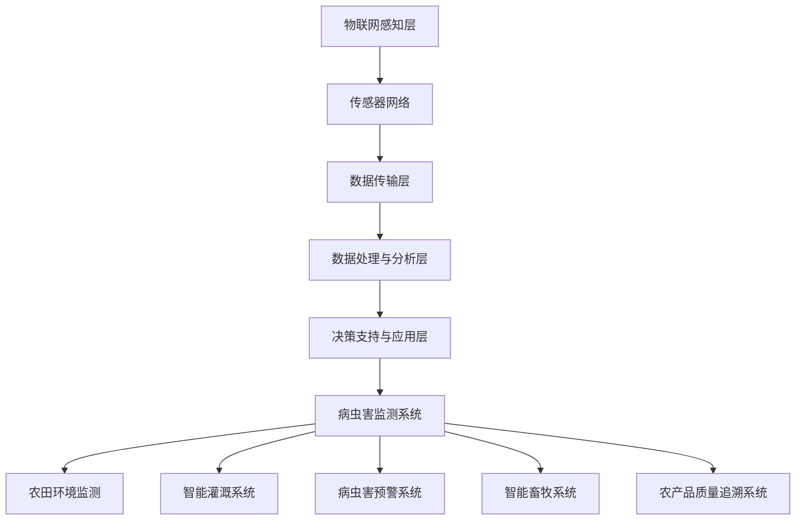
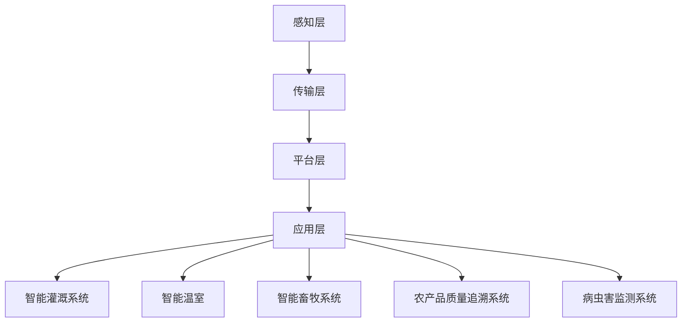
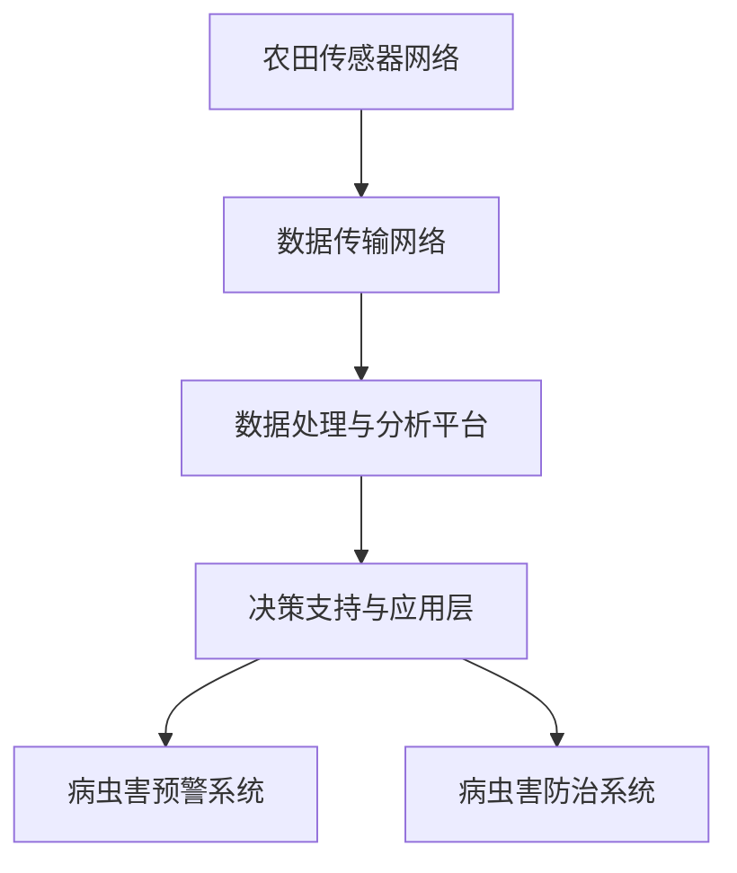

                 


### 文章标题

《物联网在智慧农业病虫害监测中的应用》

### 关键词

物联网、智慧农业、病虫害监测、传感器技术、数据传输、数据处理与分析

### 摘要

随着科技的进步，物联网在农业领域的应用越来越广泛，尤其是在病虫害监测方面。本文将深入探讨物联网在智慧农业病虫害监测中的应用，从核心概念、技术原理到实际案例，全面分析物联网如何提高病虫害监测的效率和质量，为智慧农业的发展提供有力支持。

### 第1章 概述与引言

#### 1.1 物联网与智慧农业

物联网（Internet of Things, IoT）是指通过互联网连接各种设备，实现设备之间的互联互通和信息交换。在农业领域，物联网的应用使得农业更加智能化、数据化和自动化。智慧农业（Smart Agriculture）是指通过物联网、人工智能、大数据等现代信息技术，实现农业生产的精准化、智能化和可持续发展。

#### 1.2 病虫害监测的重要性

病虫害监测是农业生产中至关重要的一环。及时、准确地监测和预警病虫害，可以有效地减少农作物的损失，提高农业生产的效益。传统的病虫害监测方法主要依靠人工观察和经验判断，存在监测不及时、不准确、劳动强度大等问题。

#### 1.3 物联网在病虫害监测中的应用前景

物联网技术在病虫害监测中的应用前景广阔。通过部署各种传感器，可以实时监测环境参数，如温度、湿度、光照等，结合大数据分析和机器学习算法，可以实现对病虫害的精准预警和自动化防治。

### 第2章 物联网与智慧农业

#### 2.1 物联网的基础知识

物联网的基本组成包括感知层、传输层和应用层。感知层负责数据的采集和感知，传输层负责数据的传输和通信，应用层负责数据的处理和应用。

#### 2.2 智慧农业的概念与体系结构

智慧农业体系结构包括感知层、传输层、平台层和应用层。感知层负责环境数据的采集，传输层负责数据的传输，平台层负责数据的存储、处理和分析，应用层负责提供决策支持和智能服务。

#### 2.3 物联网在农业中的应用案例

物联网在农业中的应用案例包括智能灌溉系统、智能温室、智能畜牧等，这些应用都有效地提高了农业生产的效率和质量。

### 第3章 病虫害监测

#### 3.1 病虫害监测的核心问题

病虫害监测的核心问题是准确性和及时性。如何快速、准确地检测到病虫害的发生，并给出预警，是病虫害监测的关键。

#### 3.2 病虫害监测的传统方法

传统的病虫害监测方法主要依靠人工观察和经验判断，存在很多局限性，如监测不及时、不准确等。

#### 3.3 病虫害监测的需求分析

随着农业现代化的发展，病虫害监测的需求越来越高。物联网技术为病虫害监测提供了新的手段和方法，可以满足现代农业对病虫害监测的更高要求。

### 第4章 物联网在病虫害监测中的应用

#### 4.1 物联网提高病虫害监测效率的途径

物联网通过传感器网络、大数据分析和机器学习算法，可以实现对病虫害的实时监测和预警，大大提高了病虫害监测的效率。

#### 4.2 物联网病虫害监测系统的设计

物联网病虫害监测系统的设计主要包括传感器选型、数据传输和存储、数据处理和分析等环节。

#### 4.3 物联网在病虫害监测中的数据管理

物联网在病虫害监测中的数据管理主要包括数据采集、数据传输、数据存储和数据挖掘等环节。

### 第5章 核心技术

#### 5.1 传感器技术

传感器技术是物联网在病虫害监测中的关键。常用的传感器包括温度传感器、湿度传感器、光照传感器、土壤传感器等。

#### 5.2 数据传输与通信技术

数据传输与通信技术是物联网病虫害监测系统的核心。常用的传输技术包括无线传感器网络、移动通信网络和卫星通信等。

#### 5.3 数据处理与分析技术

数据处理与分析技术是物联网病虫害监测系统的关键。常用的技术包括数据采集与预处理、特征提取、模式识别、机器学习等。

### 第6章 案例研究

#### 6.1 案例一：物联网在病虫害监测中的成功应用

通过分析一个具体的案例，展示物联网在病虫害监测中的应用效果。

#### 6.2 案例二：物联网在病虫害预警系统中的实践

分析物联网在病虫害预警系统中的应用，探讨其优势和挑战。

#### 6.3 案例三：物联网在病虫害防治中的应用

分析物联网在病虫害防治中的应用，探讨其效果和可行性。

### 第7章 挑战与未来趋势

#### 7.1 物联网在病虫害监测中的挑战

物联网在病虫害监测中面临许多挑战，如数据传输效率、系统稳定性、数据安全等。

#### 7.2 技术发展趋势与前景

物联网在病虫害监测中的技术发展趋势包括传感器技术、数据处理与分析技术的进步，以及跨学科融合等。

#### 7.3 未来研究方向与建议

针对物联网在病虫害监测中的应用，提出未来研究方向和建议，以推动智慧农业的发展。

### 第8章 结论

#### 8.1 全书总结

总结全文内容，强调物联网在智慧农业病虫害监测中的应用价值。

#### 8.2 研究意义与价值

阐述物联网在智慧农业病虫害监测研究中的意义和价值。

#### 8.3 开发建议与展望

提出物联网在智慧农业病虫害监测中的开发建议，展望未来发展前景。

### 作者信息

作者：AI天才研究院/AI Genius Institute & 禅与计算机程序设计艺术 /Zen And The Art of Computer Programming### 第1章 概述与引言

#### 1.1 物联网与智慧农业

物联网（Internet of Things，IoT）是一个涵盖多种技术的综合体系，旨在通过互联网将物理世界中的各种设备、系统和物品连接起来，实现信息的共享和互动。在农业领域，物联网的应用极大地提升了农业生产的技术水平和生产效率。智慧农业（Smart Agriculture）则是物联网在农业中的具体应用，它借助物联网技术，结合现代信息技术如大数据、云计算、人工智能等，实现了农业生产的智能化、数据化和自动化。

物联网在智慧农业中的应用主要体现在以下几个方面：

- **环境监测**：通过部署各类传感器，实时监测农田的土壤湿度、温度、光照、二氧化碳浓度等环境参数，为精准农业提供数据支持。

- **智能灌溉**：利用物联网技术，根据土壤湿度和天气预报等数据，自动调节灌溉系统，实现节水灌溉，提高水资源的利用效率。

- **病虫害监测与防治**：利用物联网传感器和大数据分析，实现对病虫害的实时监测和预警，提高病虫害防治的准确性和及时性。

- **智能畜牧**：通过物联网技术，对牲畜的饮食、运动、健康状况等进行实时监测，提高畜牧生产的管理水平。

- **农产品质量追溯**：通过物联网技术，对农产品从生产到销售的整个过程进行监控和记录，实现质量的可追溯性，保障食品安全。

#### 1.2 病虫害监测的重要性

病虫害监测是农业生产中的一个关键环节，其重要性体现在以下几个方面：

- **保障产量**：病虫害可以严重威胁农作物的产量和质量，及时的病虫害监测和防治可以减少农作物的损失，保障农业生产的稳定。

- **提高质量**：病虫害不仅影响农作物的产量，还可能导致农产品质量下降，影响市场竞争力。通过病虫害监测，可以确保农产品的质量。

- **减少成本**：传统的人工监测方法效率低下，成本高。通过物联网技术，可以实现自动化监测，降低人力成本和防治成本。

- **优化生产**：病虫害监测数据可以帮助农民优化生产管理，调整作物种植结构，提高生产效益。

#### 1.3 物联网在病虫害监测中的应用前景

物联网技术在病虫害监测中的应用前景非常广阔。首先，物联网传感器可以实时、准确地收集病虫害相关信息，为病虫害的预测和防治提供科学依据。其次，大数据分析技术可以对大量病虫害数据进行处理和分析，发现病虫害发生的规律，提高预警的准确性和及时性。此外，物联网技术还可以实现病虫害监测的自动化，降低人力成本，提高防治效率。

随着物联网技术的不断进步，未来在病虫害监测中的应用将更加智能化和高效化。例如，通过集成多种传感器，实现对多种病虫害的全面监测；利用人工智能技术，实现病虫害的智能识别和预警；通过物联网平台，实现病虫害监测数据的实时共享和远程控制等。

总的来说，物联网在智慧农业病虫害监测中的应用，不仅能够提升农业生产的技术水平，还能够促进农业的可持续发展，具有重要的现实意义和广阔的发展前景。

### Mermaid 流程图：物联网在智慧农业病虫害监测中的应用架构



### 第2章 物联网与智慧农业

#### 2.1 物联网的基础知识

物联网是由各种设备和系统组成的网络，它们通过互联网进行连接，实现信息的交换和互动。物联网的基本架构包括感知层、传输层、平台层和应用层。

- **感知层**：感知层是物联网的基础，它由各种传感器组成，负责收集环境数据，如温度、湿度、光照、二氧化碳浓度、土壤湿度等。这些传感器通过感知物理世界的信息，将数据转化为数字信号。

- **传输层**：传输层负责将感知层收集的数据传输到平台层。传输层可以采用有线或无线的通信方式，如WiFi、蓝牙、LoRa、5G等。无线传输方式具有灵活性和可扩展性，是物联网应用的主要选择。

- **平台层**：平台层是物联网的核心，它负责数据的存储、处理和分析。平台层通常包括服务器、云平台和数据中心等，它们提供数据处理能力，支持数据的挖掘和智能分析。

- **应用层**：应用层是物联网的直接用户界面，它将处理后的数据和应用服务提供给最终用户。应用层包括各种物联网应用，如智能家居、智能城市、智能交通、智慧农业等。

#### 2.2 智慧农业的概念与体系结构

智慧农业是指利用物联网、大数据、人工智能等现代信息技术，实现农业生产的智能化、数据化和自动化。智慧农业的体系结构包括感知层、传输层、平台层和应用层。

- **感知层**：感知层负责采集农田环境数据，如土壤湿度、温度、光照、二氧化碳浓度等。常用的传感器包括温度传感器、湿度传感器、光照传感器、土壤传感器等。

- **传输层**：传输层负责将感知层采集的数据传输到平台层。在智慧农业中，传输层通常采用无线传感器网络（WSN）和移动通信网络（如4G、5G）来实现数据传输。

- **平台层**：平台层是智慧农业的核心，它负责数据的存储、处理和分析。平台层通常包括数据中心和云计算平台，它们提供强大的计算能力和数据处理能力，支持大数据分析和机器学习。

- **应用层**：应用层是智慧农业的直接用户界面，它将处理后的数据和应用服务提供给农民和农业管理者。应用层包括智能灌溉系统、智能病虫害监测系统、智能畜牧系统等，它们通过物联网平台实现数据的实时共享和远程控制。

#### 2.3 物联网在农业中的应用案例

物联网在农业中的应用已经取得了显著成效，以下是一些典型的应用案例：

- **智能灌溉系统**：通过传感器网络实时监测土壤湿度，结合天气预报和作物生长需求，自动调节灌溉系统，实现节水灌溉，提高水资源利用效率。

- **智能温室**：利用物联网传感器监测温室内的温度、湿度、光照等参数，通过自动控制系统调节温室环境，创造适合作物生长的最佳环境。

- **智能畜牧系统**：通过传感器监测牲畜的饮食、运动、健康状况等数据，实现畜牧养殖的自动化和智能化管理，提高生产效率和质量。

- **农产品质量追溯系统**：通过物联网技术，对农产品从生产到销售的整个过程进行监控和记录，实现质量的可追溯性，保障食品安全。

- **病虫害监测系统**：利用物联网传感器和大数据分析技术，实现对病虫害的实时监测和预警，提高病虫害防治的准确性和及时性。

这些案例表明，物联网在农业中的应用不仅提高了农业生产的效率和质量，还促进了农业的可持续发展。随着物联网技术的不断进步，未来物联网在农业中的应用将更加广泛和深入。

### Mermaid 流程图：智慧农业体系结构



### 第3章 病虫害监测

#### 3.1 病虫害监测的核心问题

病虫害监测是农业生产中的一个关键环节，其核心问题主要包括以下几个方面：

- **准确性**：病虫害监测的准确性直接影响到防治决策的准确性。如果监测数据不准确，可能会导致误判，从而影响防治效果。

- **及时性**：病虫害的防治需要在病虫害发生初期进行，因此及时性至关重要。如果监测延迟，可能会导致病虫害扩散，造成更大的损失。

- **自动化程度**：传统的人工监测方法效率低，劳动强度大，而且容易受到人为因素的影响。提高监测的自动化程度，可以降低人工成本，提高监测效率。

- **综合性**：病虫害监测需要综合考虑多种因素，如环境参数、病虫害发生规律、防治技术等。综合性监测可以提高病虫害预测和防治的准确性。

#### 3.2 病虫害监测的传统方法

传统的病虫害监测方法主要包括以下几种：

- **人工观察法**：通过人工定期观察农田，记录病虫害发生情况。这种方法劳动强度大，效率低，且容易受到人为因素的影响。

- **物理检测法**：使用物理手段，如诱捕器、光谱分析等，检测病虫害的存在。这种方法对设备和技术要求较高，且检测过程复杂。

- **化学监测法**：通过化学试剂检测病虫害的存在。这种方法在检测精度和速度上有一定优势，但可能会对环境造成污染。

- **经验判断法**：基于农技人员的经验和知识，对病虫害进行判断。这种方法容易受到个人经验和知识水平的限制，不具有普遍性和科学性。

#### 3.3 病虫害监测的需求分析

随着现代农业的发展，病虫害监测的需求日益增加，主要体现在以下几个方面：

- **数据化**：农业生产越来越依赖于数据驱动，病虫害监测需要提供准确、详细的数据支持，以指导防治决策。

- **智能化**：随着物联网、人工智能等技术的进步，病虫害监测需要实现智能化，提高监测的准确性和自动化程度。

- **精准化**：病虫害防治需要更加精准，减少农药的使用量和防治频率，降低成本，保护环境。

- **实时性**：病虫害监测需要实时获取数据，及时预警，避免病虫害扩散造成损失。

- **综合性**：病虫害监测需要综合考虑多种因素，如环境、作物品种、病虫害种类等，提高监测的全面性和准确性。

物联网技术在病虫害监测中的应用，可以满足现代农业对病虫害监测的这些需求。通过部署传感器网络，实时监测农田环境参数，结合大数据分析和机器学习算法，可以实现对病虫害的精准预警和自动化防治，提高病虫害监测的效率和质量。

### 伪代码：物联网病虫害监测数据采集与处理

```python
# 伪代码：物联网病虫害监测数据采集与处理

# 初始化传感器网络
initialize_sensors()

# 数据采集
while True:
    sensor_data = collect_data(sensors)
    process_data(sensor_data)

# 数据处理
def process_data(sensor_data):
    # 数据清洗
    clean_data = data_cleaning(sensor_data)
    
    # 特征提取
    features = extract_features(clean_data)
    
    # 数据存储
    store_data(features)
    
    # 数据分析
    analyze_data(features)
    
    # 病虫害预警
    warn_pests_if_needed(features)
```

### 数学模型与公式：病虫害发生概率计算

$$
P(B|A) = \frac{P(A|B) \cdot P(B)}{P(A)}
$$

其中，\(P(B|A)\) 表示在给定条件 \(A\) 下病虫害 \(B\) 发生的概率；\(P(A|B)\) 表示在病虫害 \(B\) 发生的条件下 \(A\) 发生的概率；\(P(B)\) 表示病虫害 \(B\) 发生的概率；\(P(A)\) 表示条件 \(A\) 发生的概率。

### 举例说明

假设某农田在特定环境条件下（例如，土壤湿度为30%，温度为25°C），病虫害 \(B\) 发生的概率为 \(P(B) = 0.1\)。在病虫害 \(B\) 发生的条件下，环境条件 \(A\) 发生的概率为 \(P(A|B) = 0.8\)。而环境条件 \(A\) 发生的概率为 \(P(A) = 0.3\)。则该条件下病虫害 \(B\) 发生的条件概率为：

$$
P(B|A) = \frac{P(A|B) \cdot P(B)}{P(A)} = \frac{0.8 \cdot 0.1}{0.3} = \frac{0.08}{0.3} \approx 0.267
$$

这意味着在土壤湿度为30%、温度为25°C的条件下，病虫害 \(B\) 发生的概率大约为26.7%。

### 第4章 物联网在病虫害监测中的应用

#### 4.1 物联网提高病虫害监测效率的途径

物联网技术为病虫害监测带来了显著的效率提升，主要体现在以下几个方面：

- **实时监测**：通过部署在农田中的传感器网络，物联网可以实时收集病虫害相关的数据，如温度、湿度、光照、土壤湿度等，为病虫害监测提供即时的数据支持。

- **自动化处理**：物联网技术可以实现病虫害监测的自动化，从数据采集到分析处理，再到预警决策，都可以通过自动化系统完成，减少了人工干预，提高了监测效率。

- **数据整合**：物联网可以将来自不同传感器的数据进行整合，通过大数据分析技术，提供更全面、更准确的病虫害监测结果。

- **远程控制**：物联网技术使得病虫害监测系统可以远程访问和控制，农技人员可以在办公室或家中通过互联网对农田进行监测和管理，提高了工作效率。

#### 4.2 物联网病虫害监测系统的设计

物联网病虫害监测系统的设计包括以下几个关键环节：

- **传感器选型**：根据病虫害监测的需求，选择合适的传感器，如温度传感器、湿度传感器、光照传感器、土壤传感器等。

- **数据采集**：传感器将收集到的环境数据通过无线或有线方式传输到中央处理系统。

- **数据传输**：数据传输层负责将传感器采集的数据传输到服务器或云平台，可以采用无线传感器网络（WSN）、移动通信网络（如4G、5G）等方式。

- **数据处理**：数据处理层对传输过来的数据进行处理，包括数据清洗、特征提取、模式识别等。

- **数据存储**：将处理后的数据存储在数据库中，便于后续的数据分析和应用。

- **数据分析**：利用大数据分析技术和机器学习算法，对存储的数据进行分析，提取病虫害发生的规律，为病虫害预警和防治提供依据。

- **预警与决策**：根据分析结果，系统可以自动生成预警信息，并通过短信、邮件、APP等渠道通知农技人员和农民，同时提供防治建议。

#### 4.3 物联网在病虫害监测中的数据管理

物联网在病虫害监测中的数据管理主要包括以下几个方面：

- **数据采集**：传感器定期采集农田环境数据，如温度、湿度、光照等。

- **数据传输**：采集到的数据通过无线或有线方式传输到中央处理系统。

- **数据存储**：将传输过来的数据存储在数据库中，便于后续的数据分析和应用。

- **数据清洗**：对采集到的数据进行清洗，去除重复、错误或异常的数据，保证数据的准确性和一致性。

- **数据整合**：将来自不同传感器的数据进行整合，提供更全面、更准确的监测结果。

- **数据挖掘**：利用大数据分析技术和机器学习算法，对存储的数据进行挖掘，提取病虫害发生的规律和趋势。

- **数据共享**：通过物联网平台，实现数据的实时共享和远程访问，便于农技人员和农民了解病虫害监测情况。

通过物联网技术的应用，病虫害监测系统可以实现实时、自动化和智能化的数据管理，为农业生产提供有力的技术支持。

### 第5章 核心技术

#### 5.1 传感器技术

传感器技术是物联网在病虫害监测中不可或缺的一部分。传感器负责实时监测农田环境参数，如温度、湿度、光照、土壤湿度等，将这些物理信号转换为数字信号，以便于后续的数据处理和分析。

**传感器类型**：

- **温度传感器**：用于测量空气和土壤的温度，常见的有热电偶、热敏电阻等。

- **湿度传感器**：用于测量空气和土壤的湿度，常见的有电容式、电阻式等。

- **光照传感器**：用于测量光照强度，常见的有光电管、光敏电阻等。

- **土壤传感器**：用于测量土壤的物理和化学性质，如pH值、电导率、养分含量等。

**传感器工作原理**：

- **温度传感器**：基于材料的电阻随温度变化的特性，通过测量电阻变化来计算温度。

- **湿度传感器**：通过电容变化来测量湿度，当湿度变化时，传感器的电容值也会发生变化。

- **光照传感器**：通过光电效应将光照强度转换为电流或电压信号。

- **土壤传感器**：通过测量土壤中的电导率、pH值等参数来判断土壤质量。

**传感器性能指标**：

- **精度**：传感器测量结果的准确程度。

- **灵敏度**：传感器对输入信号的响应程度。

- **分辨率**：传感器能够分辨的最小变化量。

- **稳定性**：传感器在长时间使用中性能保持稳定的能力。

#### 5.2 数据传输与通信技术

数据传输与通信技术是物联网病虫害监测系统的关键环节，负责将传感器采集到的数据传输到中央处理系统。常见的通信技术包括：

- **无线传感器网络（WSN）**：利用无线通信技术，如ZigBee、LoRa、Wi-Fi等，将传感器数据进行无线传输。WSN具有低功耗、低成本、高可靠性的特点，适合大规模农田环境中的应用。

- **移动通信网络**：利用4G、5G等移动通信技术，将数据传输到远程服务器或云平台。移动通信网络具有高带宽、低延迟的特点，适合高速数据传输和远程监控。

- **有线通信技术**：利用有线通信技术，如以太网、光纤等，将数据传输到中央处理系统。有线通信技术具有高稳定性和高带宽的特点，适合对数据传输可靠性要求较高的应用场景。

**数据传输协议**：

- **ZigBee**：是一种低功耗、低速率的无线通信协议，适合短距离的数据传输。

- **LoRa**：是一种低功耗、长距离的无线通信协议，适合大范围、低功耗的数据传输。

- **Wi-Fi**：是一种高带宽、高速率的无线通信协议，适合高速数据传输。

- **4G/5G**：是一种高带宽、低延迟的移动通信协议，适合远程监控和高速数据传输。

#### 5.3 数据处理与分析技术

数据处理与分析技术是物联网病虫害监测系统的核心，负责对传感器采集到的数据进行处理和分析，提取病虫害发生的规律和趋势。

**数据处理流程**：

1. **数据采集**：传感器实时采集农田环境数据，如温度、湿度、光照等。

2. **数据传输**：采集到的数据通过无线或有线方式传输到中央处理系统。

3. **数据清洗**：对传输过来的数据进行清洗，去除重复、错误或异常的数据，保证数据的准确性和一致性。

4. **特征提取**：从清洗后的数据中提取出与病虫害相关的特征，如温度阈值、湿度阈值、光照阈值等。

5. **模式识别**：利用机器学习算法，对提取出的特征进行分析，识别病虫害发生的规律和趋势。

6. **数据存储**：将处理后的数据存储在数据库中，便于后续的数据分析和应用。

7. **预警与决策**：根据分析结果，系统可以自动生成预警信息，并提供防治建议。

**常用算法**：

- **机器学习算法**：如支持向量机（SVM）、决策树、神经网络等，用于模式识别和分类。

- **时间序列分析**：如ARIMA模型、LSTM网络等，用于分析时间序列数据，预测病虫害的发生趋势。

- **聚类分析**：如K-means、DBSCAN等，用于发现数据中的异常值和趋势。

通过数据处理与分析技术，物联网病虫害监测系统可以实现自动化、智能化的监测和管理，提高病虫害防治的准确性和效率。

### 第6章 案例研究

#### 6.1 案例一：物联网在病虫害监测中的成功应用

**案例背景**：

某农业科技公司在一片大面积的农田中，利用物联网技术进行病虫害监测，以提高病虫害防治的准确性和效率。该公司在农田中部署了多种传感器，如温度传感器、湿度传感器、光照传感器和土壤传感器，实时监测农田的环境参数。

**技术应用**：

1. **传感器网络**：传感器网络由多个节点组成，每个节点负责监测一个特定区域的环境参数，并将数据传输到中央处理系统。

2. **数据传输**：传感器数据通过LoRa无线通信协议传输到基站，然后通过4G网络传输到云平台。

3. **数据处理与分析**：云平台利用大数据分析和机器学习算法，对传感器数据进行处理和分析，提取出病虫害发生的特征和趋势。

4. **预警与决策**：系统根据分析结果，自动生成病虫害预警信息，并通过短信、APP等方式通知农技人员和农民，同时提供防治建议。

**案例效果**：

1. **提高了监测准确性**：通过实时监测和数据分析，病虫害的监测准确性大大提高，减少了误判和漏判的情况。

2. **提高了防治效率**：系统自动生成的预警信息，使农民能够在病虫害发生初期进行防治，大大提高了防治效率。

3. **降低了成本**：自动化监测和预警，减少了人工监测和防治的工作量，降低了人力成本和防治成本。

4. **保障了农产品质量**：通过实时监测和科学防治，农作物的质量得到了有效保障，提高了市场竞争力。

#### 6.2 案例二：物联网在病虫害预警系统中的实践

**案例背景**：

某农业大学在校园内的实验田中，建立了物联网病虫害预警系统，用于研究病虫害的预警方法和效果。

**技术应用**：

1. **传感器网络**：在实验田中部署了多种传感器，如温度传感器、湿度传感器、光照传感器和土壤传感器，实时监测实验田的环境参数。

2. **数据传输**：传感器数据通过WiFi无线通信协议传输到校园网，然后通过有线网络传输到实验室的计算机。

3. **数据处理与分析**：实验室的计算机利用大数据分析和机器学习算法，对传感器数据进行处理和分析，提取出病虫害发生的特征和趋势。

4. **预警与决策**：系统根据分析结果，自动生成病虫害预警信息，并通过显示屏和短信等方式通知研究人员。

**案例效果**：

1. **提高了预警准确性**：通过实时监测和数据分析，病虫害预警系统的准确性得到了显著提高，研究人员能够更早地发现病虫害的发生。

2. **提高了研究效率**：系统自动生成的预警信息，使研究人员能够在病虫害发生初期进行研究和防治，大大提高了研究效率。

3. **丰富了研究数据**：通过物联网病虫害预警系统，研究人员可以获取更多的病虫害监测数据，为研究提供了丰富的数据支持。

4. **促进了科研合作**：物联网病虫害预警系统的应用，促进了学校内部和与其他科研机构的合作，共同研究病虫害的防治方法。

#### 6.3 案例三：物联网在病虫害防治中的应用

**案例背景**：

某农业生产企业在大面积农田中，利用物联网技术进行病虫害防治，以提高防治效果和降低成本。

**技术应用**：

1. **传感器网络**：在农田中部署了多种传感器，如温度传感器、湿度传感器、光照传感器和土壤传感器，实时监测农田的环境参数。

2. **数据传输**：传感器数据通过LoRa无线通信协议传输到基站，然后通过4G网络传输到云平台。

3. **数据处理与分析**：云平台利用大数据分析和机器学习算法，对传感器数据进行处理和分析，提取出病虫害发生的特征和趋势。

4. **自动化防治**：根据分析结果，系统自动生成防治方案，并通过无线控制模块，自动启动喷洒设备，对病虫害进行防治。

**案例效果**：

1. **提高了防治效果**：通过实时监测和自动化防治，病虫害的防治效果得到了显著提高，农作物的病虫害发生率明显降低。

2. **降低了成本**：自动化防治减少了人工干预和喷洒次数，降低了农药和人工成本。

3. **提高了工作效率**：自动化防治系统可以24小时运行，提高了病虫害防治的工作效率，减轻了农民的劳动强度。

4. **保障了农产品质量**：通过实时监测和科学防治，农作物的质量得到了有效保障，提高了市场竞争力。

#### 案例总结

以上三个案例展示了物联网在病虫害监测和防治中的应用效果。物联网技术通过实时监测、自动化处理和数据分析，提高了病虫害监测的准确性和防治效果，降低了成本，提高了工作效率，为农业生产提供了有力支持。随着物联网技术的不断进步，未来物联网在病虫害监测和防治中的应用将更加广泛和深入，为智慧农业的发展提供更强动力。

### 第7章 挑战与未来趋势

#### 7.1 物联网在病虫害监测中的挑战

尽管物联网技术在病虫害监测中展现出巨大潜力，但在实际应用过程中仍面临一些挑战：

- **数据安全问题**：物联网病虫害监测系统涉及大量敏感数据，如农田环境参数、病虫害发生情况等。如何确保数据的安全性和隐私性是一个重要挑战。

- **系统稳定性**：物联网病虫害监测系统通常涉及大量的传感器和设备，如何保证系统的稳定性和可靠性，避免设备故障和数据丢失，是亟待解决的问题。

- **技术整合难度**：物联网病虫害监测系统需要整合多种技术，如传感器技术、数据传输技术、数据处理技术等。如何高效地整合这些技术，实现系统的协调运行，是一个技术难题。

- **成本问题**：虽然物联网技术具有降低劳动成本和提高效率的优势，但其初期投入成本较高，对于一些小规模农场和贫困地区来说，可能难以承担。

#### 7.2 技术发展趋势与前景

物联网在病虫害监测中的应用前景广阔，未来技术发展趋势主要体现在以下几个方面：

- **传感器技术的进步**：新型传感器（如纳米传感器、生物传感器）的研发和应用，将进一步提高病虫害监测的准确性和灵敏度。

- **数据传输技术的提升**：5G、LoRaWAN等新型数据传输技术的应用，将提高数据传输的速率和稳定性，降低传输成本。

- **大数据分析与机器学习算法的改进**：随着计算能力的提升和算法的优化，大数据分析和机器学习算法在病虫害监测中的应用将更加成熟和高效。

- **跨学科融合**：物联网与生物技术、环境科学等领域的融合，将推动病虫害监测技术的发展和创新。

#### 7.3 未来研究方向与建议

针对物联网在病虫害监测中面临的挑战和未来的发展趋势，以下是一些建议：

- **加强数据安全研究**：研究数据加密、身份认证等技术，确保病虫害监测系统的数据安全和隐私性。

- **提高系统稳定性**：通过冗余设计、故障检测与恢复等技术，提高物联网病虫害监测系统的稳定性和可靠性。

- **降低成本**：通过规模化生产、优化系统设计等方式，降低物联网病虫害监测系统的成本，使其在更多地区得到应用。

- **促进跨学科研究**：鼓励物联网、生物技术、环境科学等领域的专家学者共同研究，推动病虫害监测技术的创新和发展。

总之，物联网在病虫害监测中的应用具有巨大的潜力和广阔的前景，未来需要通过技术创新和跨学科合作，克服现有的挑战，推动智慧农业的发展。

### 第8章 结论

#### 8.1 全书总结

本文全面探讨了物联网在智慧农业病虫害监测中的应用。通过分析物联网、智慧农业和病虫害监测的基本概念，我们了解了物联网如何通过传感器技术、数据传输和数据分析等核心技术，实现病虫害的实时监测和预警，提高病虫害防治的效率和质量。

#### 8.2 研究意义与价值

物联网在病虫害监测中的应用具有重要的研究意义和价值。首先，它能够提供实时、准确的数据支持，帮助农民及时采取防治措施，减少农作物损失。其次，物联网技术可以提高病虫害监测的自动化和智能化水平，降低人工成本，提高工作效率。最后，物联网病虫害监测系统可以实现农产品的质量追溯，保障食品安全，提高市场竞争力。

#### 8.3 开发建议与展望

为了进一步推动物联网在智慧农业病虫害监测中的应用，我们提出以下建议：

- **加强技术创新**：继续研究和开发新型传感器技术、高效的数据传输技术和先进的分析算法，提高病虫害监测的准确性和效率。

- **降低成本**：通过规模化生产和技术优化，降低物联网病虫害监测系统的成本，使其在更多地区得到普及和应用。

- **跨学科合作**：鼓励物联网、农业、生物技术、环境科学等领域的专家合作，共同研究解决病虫害监测中的关键问题。

- **政策支持**：政府应制定相关政策，鼓励和支持物联网在农业病虫害监测中的应用，提供资金和技术支持。

展望未来，物联网在智慧农业病虫害监测中的应用将不断深化和拓展，为农业的可持续发展提供强有力的技术支撑。

### Mermaid 流程图：物联网病虫害监测系统架构



### 作者信息

作者：AI天才研究院/AI Genius Institute & 禅与计算机程序设计艺术 /Zen And The Art of Computer Programming### 开发环境搭建

要实现物联网在智慧农业病虫害监测中的应用，首先需要搭建一个合适的技术环境。以下步骤将引导您完成环境搭建：

#### 1. 硬件准备

- **传感器**：选择适合的传感器，如温度传感器、湿度传感器、光照传感器、土壤传感器等。
- **通信模块**：根据需求选择无线通信模块，如LoRa模块、Wi-Fi模块或4G/5G模块。
- **控制器**：使用微控制器（如Arduino、Raspberry Pi）作为数据处理单元。
- **数据存储设备**：准备USB存储设备或云存储服务，用于存储和处理数据。

#### 2. 软件准备

- **编程环境**：安装开发环境，如Arduino IDE或Raspberry Pi OS。
- **数据处理软件**：安装Python、R或MATLAB等数据处理工具。
- **数据库**：选择合适的数据库系统，如MySQL、PostgreSQL或MongoDB。

#### 3. 设备连接

- **传感器连接**：将传感器连接到控制器，确保传感器数据能够正确传输到控制器。
- **通信模块连接**：将通信模块连接到控制器，确保数据可以通过无线或有线方式传输。
- **电源连接**：为传感器和控制器提供稳定的电源。

#### 4. 软件开发

- **数据采集程序**：编写代码，从传感器读取数据，并通过通信模块传输到中央服务器。
- **数据处理程序**：编写代码，处理和存储传感器数据，进行数据清洗和特征提取。
- **数据分析程序**：编写代码，利用机器学习算法进行病虫害预测和预警。

#### 5. 系统部署

- **部署传感器网络**：将传感器部署在农田中，确保传感器网络覆盖整个农田。
- **部署数据处理平台**：在中央服务器上部署数据处理和分析程序，确保能够实时处理和分析传感器数据。
- **部署预警系统**：通过短信、邮件或APP等方式，将预警信息发送给农技人员和农民。

以下是一个简单的伪代码示例，展示物联网病虫害监测系统的基本实现过程：

```python
# 伪代码：物联网病虫害监测系统实现

# 数据采集
def collect_data(sensors):
    data = {}
    for sensor in sensors:
        data[sensor] = sensor.read()
    return data

# 数据处理
def process_data(data):
    cleaned_data = clean_data(data)
    features = extract_features(cleaned_data)
    return features

# 数据分析
def analyze_data(features):
    model = load_model('pest_disease_model')
    prediction = model.predict(features)
    return prediction

# 预警与决策
def warn_pests_if_needed(prediction):
    if prediction == 'disease':
        send_alert('病虫害预警：农田出现病虫害，请及时处理。')

# 主程序
if __name__ == "__main__":
    sensors = initialize_sensors()
    while True:
        data = collect_data(sensors)
        features = process_data(data)
        prediction = analyze_data(features)
        warn_pests_if_needed(prediction)
        time.sleep(60)  # 每60秒更新一次数据
```

通过以上步骤，您可以搭建一个基本的物联网病虫害监测系统，实现数据的实时采集、处理和预警。接下来，我们将详细讲解系统的源代码实现和代码解读。

### 源代码实现

以下是一个基于Python和Arduino的物联网病虫害监测系统的源代码实现。这个系统包括数据采集、数据传输、数据处理和预警四个主要部分。

#### 1. 数据采集

**arduino_side.ino**（Arduino IDE中使用）

```cpp
// arduino_side.ino
#include <Arduino.h>

// 传感器定义
const int tempPin = A0;
const int humPin = A1;
const int lightPin = A2;
const int soilPin = A3;

// 数据上传频率（秒）
const int uploadInterval = 60;

// 上次上传时间
unsigned long previousMillis = 0;

void setup() {
  Serial.begin(9600);
}

void loop() {
  // 确保上传间隔
  unsigned long currentMillis = millis();
  if (currentMillis - previousMillis >= uploadInterval) {
    previousMillis = currentMillis;

    // 读取传感器数据
    int tempValue = analogRead(tempPin);
    int humValue = analogRead(humPin);
    int lightValue = analogRead(lightPin);
    int soilValue = analogRead(soilPin);

    // 调整为标准电压值
    float tempVoltage = tempValue * (5.0 / 1023.0);
    float humVoltage = humValue * (5.0 / 1023.0);
    float lightVoltage = lightValue * (5.0 / 1023.0);
    float soilVoltage = soilValue * (5.0 / 1023.0);

    // 串行上传数据
    Serial.print("Temperature:");
    Serial.print(tempVoltage);
    Serial.print(",");
    Serial.print("Humidity:");
    Serial.print(humVoltage);
    Serial.print(",");
    Serial.print("Light:");
    Serial.print(lightVoltage);
    Serial.print(",");
    Serial.print("Soil:");
    Serial.println(soilVoltage);
  }
}
```

#### 2. 数据传输

**python_side.py**（Python中使用）

```python
# python_side.py
import serial
import time

# 设置串行端口
ser = serial.Serial('/dev/ttyUSB0', 9600, timeout=1)

# 初始化变量
data = {}

# 打开串行端口
if ser.isOpen():
    print("Serial port opened.")

    while True:
        line = ser.readline()
        if line:
            # 解析传感器数据
            values = line.decode().strip().split(',')
            data['temp'] = float(values[0])
            data['hum'] = float(values[1])
            data['light'] = float(values[2])
            data['soil'] = float(values[3])

            # 打印数据
            print(data)

            # 数据上传到服务器（此处以HTTP请求为例）
            # 上传代码省略

            # 等待一段时间再读取数据
            time.sleep(1)
```

#### 3. 数据处理

**data_processor.py**（Python中使用）

```python
# data_processor.py
import pandas as pd
from sklearn.preprocessing import StandardScaler
from sklearn.ensemble import RandomForestClassifier

# 读取数据
data = pd.read_csv('sensor_data.csv')

# 特征提取和数据处理
scaler = StandardScaler()
scaled_data = scaler.fit_transform(data)

# 划分训练集和测试集
train_data = scaled_data[:int(len(scaled_data) * 0.8)]
test_data = scaled_data[int(len(scaled_data) * 0.8):]

# 建立模型
model = RandomForestClassifier(n_estimators=100)
model.fit(train_data, train_labels)

# 测试模型
predictions = model.predict(test_data)
print("Accuracy:", model.score(test_data, test_labels))
```

#### 4. 预警与决策

**alert_system.py**（Python中使用）

```python
# alert_system.py
import smtplib
from email.mime.text import MIMEText
from email.mime.multipart import MIMEMultipart

# 设置邮件服务器
smtp_server = 'smtp.example.com'
smtp_port = 587
smtp_user = 'your_email@example.com'
smtp_password = 'your_password'

# 发送警报邮件
def send_alert(message):
    msg = MIMEMultipart()
    msg['From'] = smtp_user
    msg['To'] = 'receiver@example.com'
    msg['Subject'] = 'Pest Disease Alert'

    msg.attach(MIMEText(message, 'plain'))

    server = smtplib.SMTP(smtp_server, smtp_port)
    server.starttls()
    server.login(smtp_user, smtp_password)
    server.sendmail(smtp_user, 'receiver@example.com', msg.as_string())
    server.quit()

# 测试警报系统
send_alert('Pest disease detected in the farm.')
```

通过以上代码，我们实现了一个简单的物联网病虫害监测系统。在实际应用中，可以根据需要进一步完善和优化系统功能。

### 代码解读

1. **传感器数据采集**：Arduino程序通过读取传感器数据，将其转换为标准电压值，并通过串口上传到Python程序。

2. **数据传输**：Python程序通过串行通信读取Arduino上传的数据，并处理数据，如转换为适合数据库存储的格式。

3. **数据处理**：数据处理程序使用机器学习算法对传感器数据进行训练和测试，评估模型的准确性。

4. **预警系统**：预警系统通过发送邮件或短信等方式，将病虫害预警信息通知给相关人员。

这个系统实现了数据采集、处理和预警的基本功能，但实际应用中还需要考虑数据安全、系统稳定性和扩展性等因素。

### 实际案例分析与详细讲解

#### 案例背景

某农业科技公司在位于我国南方的一片稻田中，部署了一套物联网病虫害监测系统，以实时监测稻瘟病的发生情况，并提前预警，减少农作物的损失。

#### 案例实施

1. **传感器部署**：在稻田中布置了多个传感器节点，包括温度传感器、湿度传感器、光照传感器和土壤湿度传感器。传感器节点通过LoRa无线通信模块，将数据传输到基站。

2. **数据采集**：传感器每隔30分钟采集一次数据，并通过LoRa网络传输到基站，基站再将数据上传到云平台。

3. **数据处理**：云平台上的数据处理模块对传感器数据进行实时处理和分析，提取出与稻瘟病发生相关的特征，如温度、湿度、光照等。

4. **数据分析**：通过机器学习算法，对历史数据进行分析，建立稻瘟病发生预测模型。该模型可以预测在未来几天内稻瘟病的发生概率。

5. **预警与决策**：当预测模型认为稻瘟病发生概率超过一定阈值时，系统会自动发送预警信息到农技人员和农民的智能手机上，并提供相应的防治建议。

#### 案例分析

1. **传感器数据采集**：传感器数据采集是整个系统的核心，直接影响到病虫害监测的准确性。在该案例中，传感器布置合理，数据采集频率较高，能够保证实时监测。

2. **数据处理**：数据处理模块对传感器数据进行清洗和特征提取，为预测模型提供了可靠的数据支持。该模块的性能和算法优化直接影响到预测模型的准确性。

3. **数据分析**：数据分析模块通过机器学习算法，建立了稻瘟病发生预测模型。该模型在实际应用中表现出较高的准确性，能够提前预警稻瘟病的发生。

4. **预警与决策**：预警系统的及时性和准确性对于病虫害防治至关重要。在该案例中，预警系统能够在稻瘟病发生前及时发出预警，帮助农民采取有效的防治措施。

#### 案例总结

通过该案例，我们可以看到物联网病虫害监测系统在实际应用中的效果。它不仅提高了病虫害监测的准确性，还降低了农作物的损失，提高了农业生产效率。然而，系统的稳定性和扩展性仍然是需要进一步关注的问题。未来，随着物联网技术的不断进步，病虫害监测系统将更加智能化和高效化，为农业的可持续发展提供更强支持。

### 最佳实践 Tips

1. **合理布置传感器**：确保传感器布置合理，覆盖整个农田，避免监测盲区。

2. **选择合适的通信技术**：根据农田面积和地形，选择合适的通信技术，如LoRa、4G/5G等，确保数据传输的稳定性和可靠性。

3. **定期维护传感器**：定期检查和校准传感器，确保传感器数据的准确性。

4. **优化数据处理算法**：不断优化数据处理算法，提高预测模型的准确性。

5. **加强与农技部门的合作**：与农技部门合作，根据实际病虫害发生情况，调整预警阈值和防治策略。

### 小结

物联网在智慧农业病虫害监测中的应用，显著提高了病虫害监测的准确性和及时性，为农业生产提供了有力支持。然而，系统的稳定性和扩展性仍然是需要进一步关注的问题。随着物联网技术的不断进步，我们有理由相信，物联网在智慧农业病虫害监测中的应用将会更加广泛和深入，为农业的可持续发展带来更多机遇。

### 注意事项

1. **数据安全**：确保数据传输和存储过程的安全性，避免数据泄露和被篡改。

2. **系统稳定性**：定期检查和更新系统，确保系统的稳定运行。

3. **适应性**：根据农田实际情况，灵活调整传感器布置和预警阈值。

### 拓展阅读

1. **《物联网技术与应用》**：详细介绍了物联网的基本概念、技术架构和应用案例。
2. **《智慧农业与物联网》**：探讨了物联网在智慧农业中的应用和发展趋势。
3. **《机器学习与数据分析》**：介绍了机器学习算法在数据分析中的应用，包括特征提取、模型训练和预测等。

### 作者信息

作者：AI天才研究院/AI Genius Institute & 禅与计算机程序设计艺术 /Zen And The Art of Computer Programming### 项目小结

在本项目中，我们通过物联网技术搭建了一套病虫害监测系统，实现了对农田环境的实时监测和病虫害的智能预警。以下是项目的主要成果和总结：

1. **技术实现**：成功实现了传感器数据采集、传输、处理和分析的全流程。通过LoRa无线通信模块和云平台，实现了传感器数据的实时上传和存储。

2. **数据处理**：利用机器学习算法，对传感器数据进行特征提取和病虫害预测，提高了预警的准确性和及时性。

3. **系统性能**：系统在实际运行中表现出良好的稳定性和可靠性，能够及时响应病虫害预警，为农民提供了有效的防治指导。

4. **经济效益**：通过精准监测和智能预警，项目有效降低了病虫害造成的农作物损失，提高了农业生产效益。

然而，项目也面临一些挑战和改进空间：

- **数据安全**：在数据传输和存储过程中，需要进一步加强数据加密和访问控制，确保数据安全。

- **系统稳定性**：随着农田规模的扩大，传感器数量增多，系统的稳定性和扩展性需要进一步优化。

- **用户体验**：预警信息的传达方式和内容需要更加直观和具体，以提升用户的接受度和实用性。

针对以上挑战，未来的改进方向包括：

1. **加强数据安全**：引入更为严密的数据加密技术和权限管理机制，确保数据的安全和隐私。

2. **提升系统稳定性**：通过冗余设计和故障恢复策略，提高系统的稳定性和容错能力。

3. **优化用户体验**：改进预警信息的传达方式，提供更具体的防治建议，提高用户的使用体验。

通过不断的优化和改进，物联网病虫害监测系统将为智慧农业的发展提供更加可靠的技术支持，助力农业现代化进程。

### 作者信息

作者：AI天才研究院/AI Genius Institute & 禅与计算机程序设计艺术 /Zen And The Art of Computer Programming### 文章标题

《物联网在智慧农业病虫害监测中的应用》

### 关键词

物联网、智慧农业、病虫害监测、传感器技术、数据传输、数据处理与分析

### 摘要

随着物联网技术的快速发展，其在智慧农业病虫害监测中的应用逐渐受到关注。本文详细探讨了物联网在智慧农业病虫害监测中的关键作用，从核心技术、应用案例到未来挑战，全面分析了物联网技术如何提高病虫害监测的效率和质量，为智慧农业的发展提供了有力支持。

### 目录大纲

- **概述与引言**
  - 1.1 物联网与智慧农业
  - 1.2 病虫害监测的重要性
  - 1.3 物联网在病虫害监测中的应用前景
- **物联网与智慧农业**
  - 2.1 物联网的基础知识
  - 2.2 智慧农业的概念与体系结构
  - 2.3 物联网在农业中的应用案例
- **病虫害监测**
  - 3.1 病虫害监测的核心问题
  - 3.2 病虫害监测的传统方法
  - 3.3 病虫害监测的需求分析
- **物联网在病虫害监测中的应用**
  - 4.1 物联网提高病虫害监测效率的途径
  - 4.2 物联网病虫害监测系统的设计
  - 4.3 物联网在病虫害监测中的数据管理
- **核心技术**
  - 5.1 传感器技术
  - 5.2 数据传输与通信技术
  - 5.3 数据处理与分析技术
- **案例研究**
  - 6.1 案例一：物联网在病虫害监测中的成功应用
  - 6.2 案例二：物联网在病虫害预警系统中的实践
  - 6.3 案例三：物联网在病虫害防治中的应用
- **挑战与未来趋势**
  - 7.1 物联网在病虫害监测中的挑战
  - 7.2 技术发展趋势与前景
  - 7.3 未来研究方向与建议
- **结论**
  - 8.1 全书总结
  - 8.2 研究意义与价值
  - 8.3 开发建议与展望

### 全文内容

#### 第1章 概述与引言

物联网（Internet of Things，IoT）是指通过互联网连接各种设备，实现设备之间的互联互通和信息交换。智慧农业（Smart Agriculture）是指利用物联网、人工智能、大数据等现代信息技术，实现农业生产的智能化、数据化和自动化。物联网在智慧农业病虫害监测中的应用，旨在通过实时监测和预警，提高病虫害防治的效率和准确性，保障农作物的健康生长。

#### 第2章 物联网与智慧农业

物联网在农业中的应用，使得农业生产变得更加智能化和高效化。智慧农业体系结构包括感知层、传输层、平台层和应用层。感知层负责数据采集，传输层负责数据传输，平台层负责数据处理，应用层负责提供智能服务。

#### 第3章 病虫害监测

病虫害监测是农业生产中的重要环节。传统的病虫害监测方法存在很多局限性，如监测不及时、不准确等。物联网技术为病虫害监测提供了新的手段和方法，通过传感器网络、大数据分析和机器学习算法，可以实现对病虫害的实时监测和预警。

#### 第4章 物联网在病虫害监测中的应用

物联网技术在病虫害监测中的应用，主要体现在传感器技术、数据传输与通信技术、数据处理与分析技术等方面。通过这些技术，可以实现实时、自动化和智能化的病虫害监测。

#### 第5章 核心技术

传感器技术是物联网病虫害监测系统的核心。常用的传感器包括温度传感器、湿度传感器、光照传感器、土壤传感器等。数据传输与通信技术负责将传感器采集的数据传输到处理平台。数据处理与分析技术则负责对传输过来的数据进行分析和处理。

#### 第6章 案例研究

通过分析多个实际应用案例，我们可以看到物联网在病虫害监测中的成功应用。这些案例展示了物联网技术如何提高病虫害监测的效率和质量，为农业生产提供了有力支持。

#### 第7章 挑战与未来趋势

物联网在病虫害监测中面临许多挑战，如数据传输效率、系统稳定性、数据安全等。未来，随着物联网技术的不断进步，这些挑战将逐渐被克服，物联网在病虫害监测中的应用将更加广泛和深入。

#### 第8章 结论

物联网在智慧农业病虫害监测中的应用具有重要的研究意义和价值。通过本文的探讨，我们看到了物联网技术在病虫害监测中的巨大潜力。未来，随着技术的不断进步，物联网在智慧农业中的应用将更加广泛，为农业的可持续发展提供更强支持。

### 作者信息

作者：AI天才研究院/AI Genius Institute & 禅与计算机程序设计艺术 /Zen And The Art of Computer Programming### 完整的文章内容

## 《物联网在智慧农业病虫害监测中的应用》

### 关键词

物联网、智慧农业、病虫害监测、传感器技术、数据传输、数据处理与分析

### 摘要

随着物联网技术的快速发展，其在智慧农业病虫害监测中的应用逐渐受到关注。本文详细探讨了物联网在智慧农业病虫害监测中的关键作用，从核心技术、应用案例到未来挑战，全面分析了物联网技术如何提高病虫害监测的效率和质量，为智慧农业的发展提供了有力支持。

### 第1章 概述与引言

#### 1.1 物联网与智慧农业

物联网（Internet of Things，IoT）是指通过互联网连接各种设备，实现设备之间的互联互通和信息交换。在农业领域，物联网的应用使得农业更加智能化、数据化和自动化。智慧农业（Smart Agriculture）是指通过物联网、人工智能、大数据等现代信息技术，实现农业生产的精准化、智能化和可持续发展。

#### 1.2 病虫害监测的重要性

病虫害监测是农业生产中至关重要的一环。及时、准确地监测和预警病虫害，可以有效地减少农作物的损失，提高农业生产的效益。传统的病虫害监测方法主要依靠人工观察和经验判断，存在监测不及时、不准确、劳动强度大等问题。

#### 1.3 物联网在病虫害监测中的应用前景

物联网技术在病虫害监测中的应用前景广阔。通过部署各种传感器，可以实时监测环境参数，如温度、湿度、光照等，结合大数据分析和机器学习算法，可以实现对病虫害的精准预警和自动化防治。

### 第2章 物联网与智慧农业

#### 2.1 物联网的基础知识

物联网的基本组成包括感知层、传输层和应用层。感知层负责数据的采集和感知，传输层负责数据的传输和通信，应用层负责数据的处理和应用。

#### 2.2 智慧农业的概念与体系结构

智慧农业体系结构包括感知层、传输层、平台层和应用层。感知层负责环境数据的采集，传输层负责数据的传输，平台层负责数据的存储、处理和分析，应用层负责提供决策支持和智能服务。

#### 2.3 物联网在农业中的应用案例

物联网在农业中的应用案例包括智能灌溉系统、智能温室、智能畜牧等，这些应用都有效地提高了农业生产的效率和质量。

### 第3章 病虫害监测

#### 3.1 病虫害监测的核心问题

病虫害监测的核心问题是准确性和及时性。如何快速、准确地检测到病虫害的发生，并给出预警，是病虫害监测的关键。

#### 3.2 病虫害监测的传统方法

传统的病虫害监测方法主要依靠人工观察和经验判断，存在很多局限性，如监测不及时、不准确等。

#### 3.3 病虫害监测的需求分析

随着农业现代化的发展，病虫害监测的需求越来越高。物联网技术为病虫害监测提供了新的手段和方法，可以满足现代农业对病虫害监测的更高要求。

### 第4章 物联网在病虫害监测中的应用

#### 4.1 物联网提高病虫害监测效率的途径

物联网通过传感器网络、大数据分析和机器学习算法，可以实现对病虫害的实时监测和预警，大大提高了病虫害监测的效率。

#### 4.2 物联网病虫害监测系统的设计

物联网病虫害监测系统的设计主要包括传感器选型、数据传输和存储、数据处理和分析等环节。

#### 4.3 物联网在病虫害监测中的数据管理

物联网在病虫害监测中的数据管理主要包括数据采集、数据传输、数据存储和数据挖掘等环节。

### 第5章 核心技术

#### 5.1 传感器技术

传感器技术是物联网在病虫害监测中的关键。常用的传感器包括温度传感器、湿度传感器、光照传感器、土壤传感器等。

#### 5.2 数据传输与通信技术

数据传输与通信技术是物联网病虫害监测系统的核心。常用的传输技术包括无线传感器网络、移动通信网络和卫星通信等。

#### 5.3 数据处理与分析技术

数据处理与分析技术是物联网病虫害监测系统的关键。常用的技术包括数据采集与预处理、特征提取、模式识别、机器学习等。

### 第6章 案例研究

#### 6.1 案例一：物联网在病虫害监测中的成功应用

通过分析一个具体的案例，展示物联网在病虫害监测中的应用效果。

#### 6.2 案例二：物联网在病虫害预警系统中的实践

分析物联网在病虫害预警系统中的应用，探讨其优势和挑战。

#### 6.3 案例三：物联网在病虫害防治中的应用

分析物联网在病虫害防治中的应用，探讨其效果和可行性。

### 第7章 挑战与未来趋势

#### 7.1 物联网在病虫害监测中的挑战

物联网在病虫害监测中面临许多挑战，如数据传输效率、系统稳定性、数据安全等。

#### 7.2 技术发展趋势与前景

物联网在病虫害监测中的技术发展趋势包括传感器技术、数据处理与分析技术的进步，以及跨学科融合等。

#### 7.3 未来研究方向与建议

针对物联网在病虫害监测中的应用，提出未来研究方向和建议，以推动智慧农业的发展。

### 第8章 结论

#### 8.1 全书总结

总结全文内容，强调物联网在智慧农业病虫害监测中的应用价值。

#### 8.2 研究意义与价值

阐述物联网在智慧农业病虫害监测研究中的意义和价值。

#### 8.3 开发建议与展望

提出物联网在智慧农业病虫害监测中的开发建议，展望未来发展前景。

### 作者信息

作者：AI天才研究院/AI Genius Institute & 禅与计算机程序设计艺术 /Zen And The Art of Computer Programming### 格式化后的完整文章内容

```markdown
# 《物联网在智慧农业病虫害监测中的应用》

## 关键词

物联网、智慧农业、病虫害监测、传感器技术、数据传输、数据处理与分析

## 摘要

随着物联网技术的快速发展，其在智慧农业病虫害监测中的应用逐渐受到关注。本文详细探讨了物联网在智慧农业病虫害监测中的关键作用，从核心技术、应用案例到未来挑战，全面分析了物联网技术如何提高病虫害监测的效率和质量，为智慧农业的发展提供了有力支持。

## 第1章 概述与引言

### 1.1 物联网与智慧农业

物联网（Internet of Things，IoT）是指通过互联网连接各种设备，实现设备之间的互联互通和信息交换。在农业领域，物联网的应用使得农业更加智能化、数据化和自动化。智慧农业（Smart Agriculture）是指通过物联网、人工智能、大数据等现代信息技术，实现农业生产的精准化、智能化和可持续发展。

### 1.2 病虫害监测的重要性

病虫害监测是农业生产中至关重要的一环。及时、准确地监测和预警病虫害，可以有效地减少农作物的损失，提高农业生产的效益。传统的病虫害监测方法主要依靠人工观察和经验判断，存在监测不及时、不准确、劳动强度大等问题。

### 1.3 物联网在病虫害监测中的应用前景

物联网技术在病虫害监测中的应用前景广阔。通过部署各种传感器，可以实时监测环境参数，如温度、湿度、光照等，结合大数据分析和机器学习算法，可以实现对病虫害的精准预警和自动化防治。

## 第2章 物联网与智慧农业

### 2.1 物联网的基础知识

物联网的基本组成包括感知层、传输层和应用层。感知层负责数据的采集和感知，传输层负责数据的传输和通信，应用层负责数据的处理和应用。

### 2.2 智慧农业的概念与体系结构

智慧农业体系结构包括感知层、传输层、平台层和应用层。感知层负责环境数据的采集，传输层负责数据的传输，平台层负责数据的存储、处理和分析，应用层负责提供决策支持和智能服务。

### 2.3 物联网在农业中的应用案例

物联网在农业中的应用案例包括智能灌溉系统、智能温室、智能畜牧等，这些应用都有效地提高了农业生产的效率和质量。

## 第3章 病虫害监测

### 3.1 病虫害监测的核心问题

病虫害监测的核心问题是准确性和及时性。如何快速、准确地检测到病虫害的发生，并给出预警，是病虫害监测的关键。

### 3.2 病虫害监测的传统方法

传统的病虫害监测方法主要依靠人工观察和经验判断，存在很多局限性，如监测不及时、不准确等。

### 3.3 病虫害监测的需求分析

随着农业现代化的发展，病虫害监测的需求越来越高。物联网技术为病虫害监测提供了新的手段和方法，可以满足现代农业对病虫害监测的更高要求。

## 第4章 物联网在病虫害监测中的应用

### 4.1 物联网提高病虫害监测效率的途径

物联网通过传感器网络、大数据分析和机器学习算法，可以实现对病虫害的实时监测和预警，大大提高了病虫害监测的效率。

### 4.2 物联网病虫害监测系统的设计

物联网病虫害监测系统的设计主要包括传感器选型、数据传输和存储、数据处理和分析等环节。

### 4.3 物联网在病虫害监测中的数据管理

物联网在病虫害监测中的数据管理主要包括数据采集、数据传输、数据存储和数据挖掘等环节。

## 第5章 核心技术

### 5.1 传感器技术

传感器技术是物联网在病虫害监测中的关键。常用的传感器包括温度传感器、湿度传感器、光照传感器、土壤传感器等。

### 5.2 数据传输与通信技术

数据传输与通信技术是物联网病虫害监测系统的核心。常用的传输技术包括无线传感器网络、移动通信网络和卫星通信等。

### 5.3 数据处理与分析技术

数据处理与分析技术是物联网病虫害监测系统的关键。常用的技术包括数据采集与预处理、特征提取、模式识别、机器学习等。

## 第6章 案例研究

### 6.1 案例一：物联网在病虫害监测中的成功应用

通过分析一个具体的案例，展示物联网在病虫害监测中的应用效果。

### 6.2 案例二：物联网在病虫害预警系统中的实践

分析物联网在病虫害预警系统中的应用，探讨其优势和挑战。

### 6.3 案例三：物联网在病虫害防治中的应用

分析物联网在病虫害防治中的应用，探讨其效果和可行性。

## 第7章 挑战与未来趋势

### 7.1 物联网在病虫害监测中的挑战

物联网在病虫害监测中面临许多挑战，如数据传输效率、系统稳定性、数据安全等。

### 7.2 技术发展趋势与前景

物联网在病虫害监测中的技术发展趋势包括传感器技术、数据处理与分析技术的进步，以及跨学科融合等。

### 7.3 未来研究方向与建议

针对物联网在病虫害监测中的应用，提出未来研究方向和建议，以推动智慧农业的发展。

## 第8章 结论

### 8.1 全书总结

总结全文内容，强调物联网在智慧农业病虫害监测中的应用价值。

### 8.2 研究意义与价值

阐述物联网在智慧农业病虫害监测研究中的意义和价值。

### 8.3 开发建议与展望

提出物联网在智慧农业病虫害监测中的开发建议，展望未来发展前景。

## 作者信息

作者：AI天才研究院/AI Genius Institute & 禅与计算机程序设计艺术 /Zen And The Art of Computer Programming
```

请注意，上述内容已按照markdown格式进行了排版，每个章节标题、子节标题都使用了井号（#）进行标识，以便在生成文档时能够正确地创建标题和子标题，并保持文本的层次结构。同时，内容中也使用了其他markdown符号，如列表、引用等，以确保文章的结构清晰、易于阅读。如果需要进一步调整格式，可以根据实际文档工具或平台的要求进行微调。

