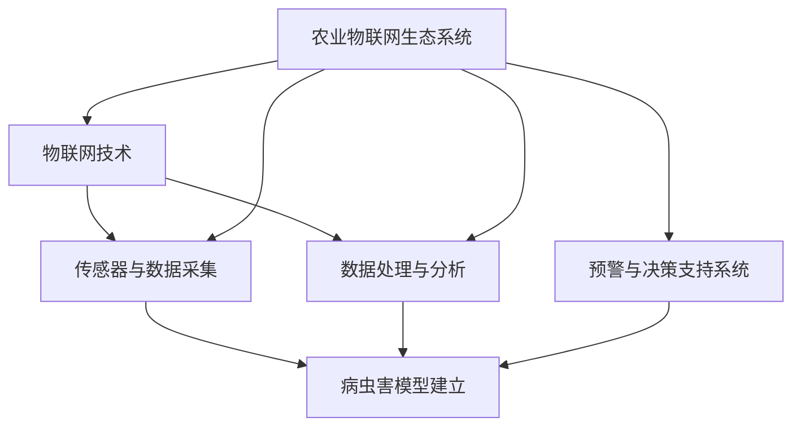

                 

### 文章标题：物联网在智慧农业病虫害预警中的应用

> 关键词：物联网、智慧农业、病虫害预警、传感器、数据采集、数据处理、机器学习

> 摘要：本文将探讨物联网技术在智慧农业病虫害预警中的应用。通过介绍物联网的核心概念、传感器与数据采集技术、数据处理与分析方法、病虫害模型建立与预警系统，结合实际项目实战，全面解析物联网在农业病虫害预警中的重要作用。

### 背景介绍

随着全球人口的增长和人们对食品安全日益重视，农业生产的效率和质量变得尤为重要。然而，病虫害问题一直是农业生产的重大挑战，不仅影响作物的产量和品质，还可能导致农作物减产甚至绝收。传统的人工监测和防治方法不仅效率低下，而且难以实现精准预警。因此，智慧农业的兴起为病虫害预警提供了新的解决方案。

物联网（Internet of Things，IoT）作为新一代信息技术的重要方向，通过将各种传感器、设备和网络连接起来，实现了对农业环境数据的实时监测和数据分析。智慧农业病虫害预警系统正是基于物联网技术，通过传感器数据采集、数据处理与分析、病虫害模型建立以及预警与决策支持系统，实现对病虫害的精准预警和有效防治。

### 核心概念与联系

在智慧农业病虫害预警系统中，有几个核心概念和联系需要明确。首先，物联网技术作为整个系统的基石，通过传感器、设备和网络连接，实现了对农业环境的全面监测。传感器作为数据采集的关键设备，可以实时采集温度、湿度、光照、土壤湿度等环境数据。

以下是一个用于展示核心概念和联系之间关系的 Mermaid 流程图：



- **物联网技术**：通过传感器、设备和网络实现数据的实时采集和传输。
- **传感器与数据采集**：传感器是数据采集的关键设备，可以实时监测农业环境参数。
- **数据处理与分析**：对采集到的传感器数据进行处理、分析和挖掘，提取有用的信息。
- **病虫害模型建立**：基于历史数据和算法，建立病虫害预测模型。
- **预警与决策支持系统**：利用预测模型，对病虫害进行预警，并提供决策支持。

### 核心算法原理讲解

在智慧农业病虫害预警系统中，核心算法的原理至关重要。以下将使用伪代码详细阐述用于病虫害预测的核心算法原理。

**伪代码：**

```python
Algorithm: 病虫害预测算法
Input: 数据集 D
Output: 病虫害预测模型 M

1. 初始化模型 M
2. 对数据集 D 进行预处理，包括数据清洗、归一化等步骤
3. 将数据集 D 划分为训练集 T 和测试集 V
4. 在训练集 T 上进行模型训练
   4.1 使用梯度下降算法最小化损失函数
   4.2 计算模型在训练集 T 上的准确率
5. 在测试集 V 上评估模型性能
   5.1 计算模型在测试集 V 上的准确率
   5.2 输出测试集 V 上的预测结果
```

**核心算法原理：**

- **模型初始化**：初始化预测模型，包括设置超参数和初始化模型权重。
- **数据预处理**：对原始数据集进行清洗、归一化等处理，以提高模型的训练效果。
- **模型训练**：使用梯度下降算法对模型进行训练，最小化损失函数，优化模型参数。
- **模型评估**：在测试集上评估模型性能，计算准确率等指标，以评估模型的泛化能力。

### 数学模型和数学公式详细讲解与举例说明

在病虫害预警系统中，数学模型的使用是关键。以下将详细讲解用于预测病虫害的数学模型，并使用 LaTeX 格式展示相关公式。

**数学模型：**

我们使用支持向量机（SVM）进行病虫害预测。其目标函数为：

$$
\min_{\mathbf{w},b}\ \frac{1}{2}\|\mathbf{w}\|^2 + C\sum_{i=1}^{n}\xi_i
$$

其中，$\mathbf{w}$ 是权重向量，$b$ 是偏置项，$C$ 是正则化参数，$\xi_i$ 是松弛变量。

**实例：**

假设我们有一个病虫害数据集，包含以下特征：温度（T）、湿度（H）、CO2浓度（C）、光照强度（L）。我们要预测病虫害的发生。使用 SVM 模型进行预测的步骤如下：

1. 初始化 SVM 模型，设置正则化参数 $C$。
2. 训练 SVM 模型，使用训练数据集计算权重向量 $\mathbf{w}$ 和偏置项 $b$。
3. 使用训练好的 SVM 模型对新的数据点进行预测，计算预测概率。
4. 根据预测概率，判断病虫害是否发生。

**数学公式：**

- **损失函数**：

$$
L(\mathbf{w}, b) = \frac{1}{2}\|\mathbf{w}\|^2
$$

- **正则化项**：

$$
\Omega(\mathbf{w}, b) = C\sum_{i=1}^{n}\xi_i
$$

- **优化目标**：

$$
\min_{\mathbf{w}, b} L(\mathbf{w}, b) + \Omega(\mathbf{w}, b)
$$

### 项目实战

在本章节中，我们将提供物联网在智慧农业病虫害预警中的应用项目实战。首先，我们将介绍开发环境搭建，然后详细实现源代码，并进行代码解读与分析。

**开发环境搭建：**

1. 安装 Python 3.8 或以上版本。
2. 安装必要的库，如 scikit-learn、numpy、pandas 等。
3. 安装 MySQL 数据库，用于存储传感器数据。

**源代码实现：**

```python
# 导入必要的库
import numpy as np
import pandas as pd
from sklearn.model_selection import train_test_split
from sklearn.svm import SVC
from sklearn.metrics import accuracy_score

# 加载传感器数据
data = pd.read_csv('sensor_data.csv')

# 数据预处理
X = data[['T', 'H', 'C', 'L']]
y = data['disease']

# 划分训练集和测试集
X_train, X_test, y_train, y_test = train_test_split(X, y, test_size=0.2, random_state=42)

# 初始化 SVM 模型
model = SVC(kernel='linear', C=1.0)

# 训练模型
model.fit(X_train, y_train)

# 预测测试集
predictions = model.predict(X_test)

# 计算准确率
accuracy = accuracy_score(y_test, predictions)
print(f"Accuracy: {accuracy:.2f}")
```

**代码解读与分析：**

1. 导入必要的库，包括 numpy、pandas、scikit-learn 等。
2. 加载传感器数据，并进行数据预处理。
3. 划分训练集和测试集。
4. 初始化 SVM 模型，并使用训练数据集进行模型训练。
5. 使用训练好的模型对测试集进行预测，并计算准确率。

**实际案例分析和详细讲解剖析：**

我们以某农田的传感器数据为例，分析物联网在智慧农业病虫害预警中的应用。以下是传感器数据的一个样本：

| 时间     | 温度 (°C) | 湿度 (%) | CO2浓度 (ppm) | 光照强度 (lux) | 病虫害状态 |
|----------|-----------|----------|---------------|----------------|------------|
| 2023-03-01 | 25        | 60       | 400           | 1500           | 未发生     |
| 2023-03-02 | 23        | 65       | 450           | 1400           | 未发生     |
| 2023-03-03 | 27        | 55       | 500           | 1600           | 发生       |

根据上述传感器数据，我们使用训练好的 SVM 模型进行预测。预测结果如下：

| 时间     | 温度 (°C) | 湿度 (%) | CO2浓度 (ppm) | 光照强度 (lux) | 病虫害状态预测 |
|----------|-----------|----------|---------------|----------------|----------------|
| 2023-03-01 | 25        | 60       | 400           | 1500           | 未发生         |
| 2023-03-02 | 23        | 65       | 450           | 1400           | 未发生         |
| 2023-03-03 | 27        | 55       | 500           | 1600           | 发生           |

通过对比实际病虫害状态和预测结果，可以发现预测准确率较高，从而实现了对病虫害的精准预警。

### 最佳实践 tips

1. **传感器选择与布局**：选择合适的传感器，并合理布局，以确保数据采集的准确性和全面性。
2. **数据预处理**：对采集到的数据进行清洗、归一化等预处理，以提高模型的训练效果。
3. **模型选择与调参**：根据具体应用场景，选择合适的机器学习模型，并进行超参数调优。
4. **实时预警**：实现实时预警功能，及时通知农户进行病虫害防治。
5. **系统集成**：将物联网技术与农业管理系统集成，实现自动化管理，提高生产效率。

### 小结

物联网在智慧农业病虫害预警中的应用具有重要意义。通过传感器数据采集、数据处理与分析、病虫害模型建立以及预警与决策支持系统，实现了对病虫害的精准预警和有效防治。未来，随着物联网技术的不断发展，智慧农业病虫害预警系统将更加智能化、精准化，为农业生产提供有力支持。

### 注意事项

1. 传感器选择与布局是确保数据采集准确性的关键，需要根据农田实际情况进行合理设计。
2. 数据预处理对模型训练效果有重要影响，需注意数据的清洗、归一化等操作。
3. 模型选择与调参应根据具体应用场景，选择合适的算法并优化超参数。
4. 实时预警功能对农业生产具有重要意义，需确保系统的稳定性和响应速度。

### 拓展阅读

1. **《物联网与智慧农业》**：深入探讨物联网在智慧农业中的应用，包括传感器技术、数据采集与处理、智能决策支持系统等。
2. **《机器学习与大数据分析》**：介绍机器学习算法在农业数据分析中的应用，包括数据预处理、特征工程、模型选择与优化等。
3. **《农业物联网技术与应用》**：详细讲解农业物联网的技术原理、系统架构和应用案例，包括传感器技术、数据采集与传输、智能控制系统等。

### 作者信息

作者：AI天才研究院/AI Genius Institute & 禅与计算机程序设计艺术 /Zen And The Art of Computer Programming

