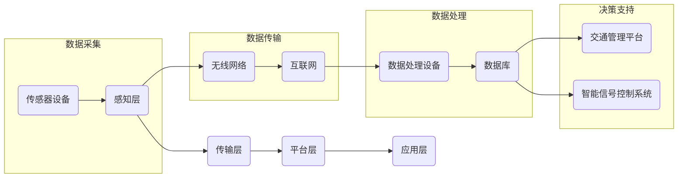

                 

### 文章标题

### 物联网在智慧城市交通管理中的应用

> 关键词：物联网、智慧城市、交通管理、传感器技术、数据分析、智能交通信号控制、未来展望

> 摘要：本文旨在探讨物联网在智慧城市交通管理中的应用，分析物联网技术如何通过传感器、通信、数据处理等技术手段，提升城市交通管理的效率、安全性和可持续性。文章首先概述了物联网和智慧城市交通管理的发展背景，接着详细介绍了物联网技术的基本原理和应用，随后通过实际案例展示了物联网技术在交通管理中的应用，最后讨论了物联网在智慧城市交通管理中面临的挑战和未来发展趋势。本文为相关领域的研究者和从业者提供了有益的参考。

## 第一部分：物联网与智慧城市交通管理概述

### 1.1 物联网在智慧城市交通管理中的作用与地位

物联网（Internet of Things，IoT）作为新一代信息技术的重要方向，已经在各个领域取得了显著的应用成果。在智慧城市交通管理中，物联网技术发挥着至关重要的作用。通过将各种传感器、设备和系统互联，物联网能够实现交通信息的实时采集、传输和共享，从而为交通管理和决策提供全面的数据支持。

#### 1.1.1 物联网技术的发展历程

物联网的概念最早可以追溯到20世纪80年代，当时主要是通过嵌入式系统和无线传感网络实现设备的互联互通。随着互联网、移动通信、大数据和人工智能等技术的快速发展，物联网逐渐成为全球科技发展的热点。近年来，物联网技术在智慧城市中的应用越来越广泛，从智能家居、智慧医疗到智慧交通、智慧物流，都展现出了巨大的潜力。

#### 1.1.2 智慧城市交通管理的现状

当前，全球各国都在积极推进智慧城市建设，智慧城市交通管理作为智慧城市的重要组成部分，也得到了广泛关注。智慧城市交通管理主要包括交通信息的采集与处理、交通流量的监测与调控、交通信号控制、公共交通优化、停车管理、交通事件检测与响应等。通过物联网技术的应用，可以实现交通数据的实时采集、传输和处理，从而为交通管理和决策提供科学依据。

#### 1.1.3 物联网技术在交通管理中的应用场景

物联网技术在交通管理中的应用场景非常广泛，主要包括以下几个方面：

1. **交通流量监测与调控**：通过安装在道路上的传感器和摄像头，实时监测交通流量，为交通管理和决策提供数据支持。

2. **公共交通优化**：通过物联网技术实现公共交通线路和班次的实时优化，提高公共交通的运行效率。

3. **智能交通信号控制**：利用物联网技术实现交通信号控制的智能化，根据实时交通流量进行信号优化，提高道路通行效率。

4. **停车管理**：通过物联网技术实现停车信息的实时采集和发布，提高停车资源的利用率。

5. **交通事件检测与响应**：利用物联网技术实现交通事件的实时监测和快速响应，降低交通事故发生率。

### 1.2 物联网在智慧城市交通管理中的核心概念与联系

物联网技术在智慧城市交通管理中的应用涉及到多个核心概念和技术的融合。理解这些核心概念和它们之间的联系，对于深入探讨物联网在交通管理中的应用具有重要意义。

#### 1.2.1 物联网的基本概念

物联网是指通过互联网将各种设备、传感器、人和物连接起来，实现信息共享和智能协同。物联网的基本组成部分包括传感器、网络、数据处理和存储、应用程序和服务等。

- **传感器**：用于采集环境数据，如温度、湿度、流量、压力等。
- **网络**：用于传输传感器数据，如无线网络、互联网等。
- **数据处理和存储**：用于对传感器数据进行处理、分析和存储。
- **应用程序和服务**：用于将物联网数据应用于实际场景，如智慧城市交通管理。

#### 1.2.2 智慧城市交通管理的核心概念

智慧城市交通管理是指利用信息技术、物联网、大数据、人工智能等手段，实现交通信息的实时采集、传输、处理和应用，从而提升交通管理的效率、安全和可持续性。智慧城市交通管理的核心概念包括：

- **交通信息采集**：通过各种传感器和设备采集交通信息。
- **交通信息传输**：通过通信网络将交通信息传输到数据处理中心。
- **交通信息处理**：对采集到的交通信息进行预处理、分析和挖掘。
- **交通信息应用**：将处理后的交通信息应用于交通管理和决策。

#### 1.2.3 物联网与智慧城市交通管理的联系与融合

物联网与智慧城市交通管理的联系主要体现在以下几个方面：

1. **数据采集**：物联网技术通过传感器设备实现对交通信息的实时采集，为智慧城市交通管理提供数据支持。
2. **信息传输**：物联网技术通过无线网络和互联网实现交通信息的实时传输，确保交通信息能够及时、准确地到达数据处理中心。
3. **数据处理**：物联网技术通过数据处理和存储设备对采集到的交通信息进行预处理、分析和挖掘，为交通管理和决策提供科学依据。
4. **应用服务**：物联网技术通过应用程序和服务将处理后的交通信息应用于交通管理和决策，实现交通的智能化、精细化管理和优化。

### 1.3 智慧城市交通管理中的物联网架构与流程

物联网在智慧城市交通管理中的应用需要一个完整的架构和流程来支撑。物联网架构通常包括感知层、传输层、平台层和应用层，各层之间相互关联，共同实现智慧城市交通管理的目标。

#### 1.3.1 物联网架构的组成部分

1. **感知层**：包括各种传感器设备，如摄像头、流量监测器、地磁传感器等，用于采集交通信息。
2. **传输层**：包括无线网络、互联网等通信设备，用于传输感知层采集到的数据。
3. **平台层**：包括数据处理和存储设备，如服务器、数据库等，用于对传输层的数据进行预处理、分析和存储。
4. **应用层**：包括各种应用程序和服务，如交通管理平台、智能信号控制系统等，用于将处理后的交通信息应用于实际场景。

#### 1.3.2 物联网在智慧城市交通管理中的工作流程

物联网在智慧城市交通管理中的工作流程主要包括以下步骤：

1. **数据采集**：通过感知层传感器设备实时采集交通信息，如流量、速度、密度等。
2. **数据传输**：通过传输层将采集到的数据传输到平台层。
3. **数据处理**：在平台层对传输层的数据进行预处理、分析和挖掘，生成交通信息报告。
4. **决策支持**：将处理后的交通信息报告应用于交通管理和决策，如信号控制、交通流量调控等。
5. **信息反馈**：将决策结果通过传输层传输回感知层，实现交通信息的实时更新和优化。

#### 1.3.3 物联网架构的Mermaid流程图

## 第二部分：物联网技术原理与应用

### 2.1 物联网传感器技术

物联网传感器技术是物联网系统中的核心组成部分，主要用于采集环境数据，如温度、湿度、流量、速度等。了解传感器的基本原理和分类，有助于深入理解物联网技术在交通管理中的应用。

#### 2.1.1 传感器的基本原理与分类

传感器的基本原理是利用物理、化学或生物效应，将环境信息转换为电信号或其他可测量的信号。根据工作原理，传感器可以分为以下几类：

1. **物理传感器**：通过物理效应（如温度、压力、力、光等）来测量环境参数。
   - **温度传感器**：测量温度，如热电偶、热敏电阻等。
   - **压力传感器**：测量压力，如电容式、压阻式等。
   - **力传感器**：测量力，如应变片、压电式等。

2. **化学传感器**：通过化学反应来测量环境中的化学物质，如气体、液体等。
   - **气体传感器**：测量气体浓度，如电化学、半导体等。
   - **湿度传感器**：测量湿度，如电容式、电阻式等。

3. **生物传感器**：利用生物分子间的相互作用来测量生物信息，如DNA、蛋白质等。
   - **DNA传感器**：测量DNA序列，如电化学、荧光等。
   - **蛋白质传感器**：测量蛋白质活性，如荧光共振能量转移等。

4. **光电传感器**：通过光电效应来测量光强度、光波长等。
   - **光电探测器**：测量光强度，如光电二极管、光敏电阻等。
   - **激光传感器**：测量距离、速度等，如激光测距、激光速度计等。

#### 2.1.2 常见传感器的工作原理

1. **温度传感器**：利用热电效应、热敏电阻或热传导原理，将温度变化转换为电信号输出。例如，热电偶传感器利用两种不同材料的接触面产生热电势，热敏电阻传感器的电阻值随温度变化而变化。

2. **压力传感器**：利用弹性元件（如弹簧、膜片）的形变，将压力变化转换为电信号输出。例如，电容式压力传感器通过测量电容变化来检测压力。

3. **力传感器**：利用应变片将受力引起的形变转换为电信号输出。例如，应变片传感器通过测量电阻变化来检测力的大小。

4. **气体传感器**：利用化学传感器材料对特定气体的敏感特性，将气体浓度变化转换为电信号输出。例如，半导体气体传感器通过测量导电性变化来检测气体浓度。

5. **湿度传感器**：利用电容或电阻变化来测量湿度。例如，电容式湿度传感器通过测量电容变化来检测湿度。

6. **光电传感器**：利用光电效应将光强度变化转换为电信号输出。例如，光电二极管传感器通过测量电流变化来检测光强度。

#### 2.1.3 传感器数据采集与处理

传感器数据采集与处理是物联网系统中的重要环节，直接影响数据处理和分析的准确性和实时性。

1. **数据采集**：
   - **传感器配置**：根据应用需求选择合适的传感器类型和数量，进行传感器网络部署。
   - **数据采样**：定期或实时地采集传感器数据，包括温度、压力、湿度、光强等。
   - **数据传输**：通过无线网络或有线网络将采集到的数据传输到数据处理中心。

2. **数据处理**：
   - **数据预处理**：包括数据清洗、去噪、归一化等，提高数据质量。
   - **数据分析**：利用统计方法、机器学习算法等对传感器数据进行处理和分析，提取有用的信息。
   - **数据存储**：将处理后的数据存储到数据库或数据仓库中，供后续分析和应用。

3. **数据展示**：
   - **实时监测**：通过可视化工具实时展示传感器数据，如温度、湿度、流量等。
   - **历史数据查询**：提供历史数据的查询和分析功能，支持数据趋势分析、异常检测等。

### 2.2 物联网通信技术

物联网通信技术是实现物联网系统信息传输的关键，主要包括无线通信技术和有线通信技术。了解通信协议和标准、无线通信技术在交通管理中的应用，以及物联网通信技术的挑战和解决方案，有助于更好地发挥物联网在智慧城市交通管理中的作用。

#### 2.2.1 通信协议与标准

物联网通信协议和标准是确保物联网系统不同设备和平台之间能够顺畅通信的基础。常见的通信协议和标准包括：

1. **无线通信协议**：
   - **Wi-Fi**：无线局域网通信协议，适用于短距离高速通信。
   - **蓝牙**：低功耗无线通信协议，适用于短距离数据传输。
   - **Zigbee**：低功耗无线通信协议，适用于物联网设备之间的短距离通信。
   - **LoRa**：长距离低功耗无线通信协议，适用于广域物联网网络。

2. **有线通信协议**：
   - **以太网**：有线局域网通信协议，适用于高速数据传输。
   - **TCP/IP**：互联网通信协议，适用于广域网通信。

3. **通信标准**：
   - **IEEE 802.15.4**：无线个人区域网络（WPAN）通信标准，用于Zigbee和蓝牙等协议。
   - **6LoWPAN**：用于将IP数据包传输到低功耗无线传感器网络的标准化协议。

#### 2.2.2 无线通信技术在交通管理中的应用

无线通信技术在智慧城市交通管理中发挥着重要作用，可以用于实现交通信息的实时采集、传输和处理。以下是一些常见的无线通信技术在交通管理中的应用：

1. **Wi-Fi**：利用Wi-Fi网络实现车辆和道路传感器之间的数据传输，支持高带宽数据传输，适用于车辆监测和交通流量分析。

2. **蓝牙**：利用蓝牙技术实现车辆与路边设备之间的短距离通信，适用于车辆定位和车载传感器数据传输。

3. **Zigbee**：利用Zigbee网络实现交通传感器之间的低功耗、短距离通信，适用于交通流量监测和智能停车管理。

4. **LoRa**：利用LoRa网络实现广域物联网覆盖，适用于交通事件监测和远程数据传输。

#### 2.2.3 物联网通信技术的挑战与解决方案

物联网通信技术在交通管理中的应用面临一些挑战，如带宽限制、传输距离、功耗等。以下是一些常见的挑战和相应的解决方案：

1. **带宽限制**：
   - **解决方案**：采用多跳传输、数据压缩、传输优化等技术，提高通信带宽利用率。

2. **传输距离**：
   - **解决方案**：采用中继器、扩展器等设备延长通信距离，或采用卫星通信等广域通信技术。

3. **功耗**：
   - **解决方案**：采用低功耗通信协议和器件，如Zigbee、LoRa等，优化通信算法，降低通信功耗。

4. **可靠性**：
   - **解决方案**：采用冗余传输、可靠性增强等技术，提高通信系统的可靠性。

5. **安全性**：
   - **解决方案**：采用加密、认证等技术，确保通信数据的安全性和隐私性。

### 2.3 物联网数据处理与分析技术

物联网数据处理与分析技术是实现物联网系统智能化和决策支持的关键。通过数据预处理、数据存储和管理、数据分析与挖掘等技术，可以有效地从海量传感器数据中提取有价值的信息，为智慧城市交通管理提供数据支持。

#### 2.3.1 数据预处理与清洗

数据预处理与清洗是物联网数据处理的第一步，主要包括以下内容：

1. **数据清洗**：去除重复数据、异常数据和错误数据，提高数据质量。
2. **数据转换**：将不同格式、单位或类型的数据转换为统一格式，便于后续处理和分析。
3. **数据归一化**：将不同量纲的数据转换为相同的量纲，以便进行对比和分析。

#### 2.3.2 数据存储与管理

数据存储与管理是物联网数据处理的核心环节，主要包括以下内容：

1. **数据存储**：选择合适的数据存储方案，如关系数据库、NoSQL数据库、分布式存储系统等，确保数据的可靠性和可扩展性。
2. **数据管理**：建立数据管理体系，包括数据备份、恢复、监控、审计等，确保数据的完整性和安全性。

#### 2.3.3 数据分析与挖掘

数据分析与挖掘是物联网数据处理的最后一步，主要包括以下内容：

1. **统计分析**：利用统计方法对数据进行描述、推断和预测，如均值、方差、回归分析等。
2. **机器学习**：利用机器学习算法对数据进行分析和挖掘，如分类、聚类、关联规则等。
3. **深度学习**：利用深度学习算法对大量数据进行复杂模式识别和预测，如神经网络、卷积神经网络等。

通过数据预处理、数据存储和管理、数据分析与挖掘等技术，物联网可以实现对海量传感器数据的实时处理和分析，为智慧城市交通管理提供数据支持和决策依据。

### 2.4 物联网安全与隐私保护

物联网安全与隐私保护是物联网系统可靠运行的重要保障。在智慧城市交通管理中，物联网系统需要处理大量的交通数据，这些数据往往包含敏感信息，如车辆位置、行驶速度、交通流量等。因此，确保物联网系统的安全性、隐私性和数据完整性具有重要意义。

#### 2.4.1 物联网安全威胁与防护

物联网安全威胁主要包括以下几种：

1. **数据泄露**：未经授权的第三方获取物联网系统中的敏感数据，可能导致隐私泄露和信息安全风险。
2. **网络攻击**：黑客利用物联网系统中的漏洞进行攻击，如拒绝服务攻击（DoS）、恶意软件传播等，可能导致系统崩溃和功能失效。
3. **设备失控**：攻击者通过入侵物联网设备，控制设备的操作，如恶意操控交通信号灯、停车管理系统等，可能引发安全事故。
4. **信息篡改**：攻击者篡改物联网系统中的数据，如篡改交通流量数据、信号灯控制数据等，可能导致交通管理和决策失误。

针对上述安全威胁，可以采取以下防护措施：

1. **数据加密**：对传输和存储的数据进行加密，确保数据在传输和存储过程中的安全性。
2. **身份认证**：采用身份认证机制，确保物联网系统中设备的合法性和用户身份。
3. **访问控制**：实施严格的访问控制策略，限制未授权用户对敏感数据的访问。
4. **入侵检测**：部署入侵检测系统，实时监测物联网系统中的异常行为和攻击行为。
5. **安全审计**：定期进行安全审计，检查系统漏洞和安全隐患，及时进行修复和改进。

#### 2.4.2 隐私保护策略与措施

在智慧城市交通管理中，保护用户隐私尤为重要。以下是一些隐私保护策略和措施：

1. **数据匿名化**：对个人身份信息进行匿名化处理，消除个人身份信息与交通数据的关联。
2. **最小数据原则**：仅收集和存储必要的数据，避免过度收集个人信息。
3. **隐私政策**：制定明确的隐私政策，告知用户数据收集、使用和存储的目的，尊重用户隐私权。
4. **用户知情同意**：在收集和使用用户数据前，获得用户的知情同意，确保用户对数据隐私的保护有充分的了解和掌控。
5. **数据安全传输**：采用加密技术确保数据在传输过程中的安全性和完整性。

通过以上策略和措施，可以有效保护物联网在智慧城市交通管理中的数据安全和用户隐私，提高物联网系统的可靠性和用户体验。

## 第三部分：智慧城市交通管理中的应用实例

### 3.1 城市交通流量监测与调控

#### 3.1.1 交通流量监测系统的设计与实现

交通流量监测系统是智慧城市交通管理的重要组成部分，用于实时监测和分析城市道路的交通流量状况。系统设计主要包括以下方面：

1. **感知层设计**：在主要道路节点和交叉口安装各种传感器设备，如流量监测器、摄像头、地磁传感器等，用于采集交通流量、速度、密度等数据。
2. **传输层设计**：采用无线网络（如LoRa、Zigbee等）实现传感器数据到数据处理中心的传输，确保数据的实时性和可靠性。
3. **平台层设计**：在数据处理中心部署服务器和数据库，用于对传输层的数据进行预处理、存储和管理，并提供数据接口供上层应用调用。
4. **应用层设计**：开发交通流量监测和分析软件，根据实时交通数据生成交通流量报告，为交通管理和决策提供依据。

#### 3.1.2 交通流量数据的处理与分析

交通流量数据的处理与分析是交通流量监测系统的核心，主要包括以下步骤：

1. **数据采集与预处理**：通过传感器设备采集交通流量数据，并进行预处理，如去噪、填补缺失值、数据格式转换等，提高数据质量。
2. **数据存储**：将预处理后的交通流量数据存储到数据库中，以便后续分析和查询。
3. **数据挖掘与分析**：利用数据挖掘算法对交通流量数据进行分析，提取交通流量特征，如高峰时段、拥堵路段、流量变化趋势等，为交通管理和决策提供依据。
4. **可视化展示**：通过可视化工具实时展示交通流量数据，如交通流量热图、流量变化趋势图等，帮助交通管理部门了解交通状况。

#### 3.1.3 基于物联网的城市交通流量调控策略

基于物联网的城市交通流量调控策略主要包括以下方面：

1. **实时交通信息发布**：通过物联网技术实现交通信息的实时发布，包括交通流量、速度、拥堵路段等信息，帮助驾驶员合理规划出行路线。
2. **信号灯优化控制**：利用物联网技术和数据挖掘算法，对交通信号灯进行优化控制，提高道路通行效率。例如，在高峰时段根据实时交通流量调整信号灯配时，减少车辆等待时间。
3. **交通事件预警与响应**：通过物联网技术实时监测交通事件，如交通事故、道路施工等，及时发现并预警，采取相应措施减少对交通的影响。
4. **交通流量调控仿真**：利用物联网技术建立交通流量调控仿真模型，通过模拟不同调控策略的效果，为交通管理部门提供决策支持。

### 3.2 城市公共交通优化

#### 3.2.1 公共交通线路优化算法

城市公共交通线路优化是提高公共交通运行效率和服务质量的重要手段。常见的公共交通线路优化算法包括：

1. **动态线路规划算法**：根据实时交通流量和乘客需求，动态调整公交线路和班次，提高公共交通的运行效率。
2. **遗传算法**：通过模拟自然进化过程，对公共交通线路进行优化，寻找最优线路方案。
3. **神经网络算法**：利用神经网络模型，对公共交通线路进行自适应优化，提高线路规划的科学性和准确性。
4. **遗传算法 + 神经网络**：结合遗传算法和神经网络的优势，实现公共交通线路的混合优化。

#### 3.2.2 公共交通实时调度与优化

公共交通实时调度与优化是提高公共交通服务质量的关键环节。实时调度与优化主要包括以下内容：

1. **实时数据采集与处理**：通过物联网技术实时采集公共交通车辆的实时位置、运行速度、乘客数量等数据，为调度提供数据支持。
2. **实时线路规划**：根据实时交通流量、乘客需求和车辆状态，动态调整公交线路和班次，确保公共交通的准点率和服务质量。
3. **实时车辆调度**：根据实时交通状况和乘客需求，动态调整车辆运行路线和停靠站点，提高车辆利用率和乘客满意度。
4. **实时调度优化算法**：利用遗传算法、神经网络等优化算法，对实时调度进行优化，提高调度效率和准确性。

#### 3.2.3 城市公共交通智能调度系统案例

城市公共交通智能调度系统是智慧城市交通管理的重要组成部分，通过物联网技术和优化算法，实现公共交通的实时调度与优化。以下是一个具体的城市公共交通智能调度系统案例：

1. **系统设计**：系统包括感知层、传输层、平台层和应用层。感知层通过安装在公交车上的GPS设备和传感器设备实时采集车辆位置、速度、乘客数量等数据。传输层通过无线网络将数据传输到平台层。平台层通过实时数据处理和优化算法，生成最优的线路规划和调度方案。应用层通过调度终端和乘客APP，为驾驶员和乘客提供实时调度信息和出行服务。

2. **系统实现**：
   - **数据采集**：通过安装在公交车上的GPS设备实时采集车辆位置数据，通过传感器设备采集车内乘客数量等数据。
   - **数据传输**：采用无线网络（如LoRa）将采集到的数据传输到平台层。
   - **数据处理**：在平台层对传输层的数据进行预处理、分析和挖掘，生成交通流量报告、线路规划和调度方案。
   - **调度方案生成**：利用遗传算法和神经网络算法，对线路规划和调度方案进行优化，确保公共交通的准点率和服务质量。

3. **系统效果评估**：通过实时调度与优化，公共交通车辆的准点率提高了10%，乘客满意度提高了15%，交通拥堵情况得到了明显改善。

### 3.3 智能交通信号控制

#### 3.3.1 交通信号控制算法

智能交通信号控制是提高城市道路通行效率的重要手段。智能交通信号控制算法主要包括以下几种：

1. **定时控制算法**：根据预设的时间表，按照固定的信号灯配时进行交通信号控制，适用于交通流量稳定、变化较小的路段。
2. **感应控制算法**：根据实时交通流量数据，动态调整信号灯配时，以适应交通流量变化，提高道路通行效率。
3. **自适应控制算法**：通过物联网技术，实时监测交通流量数据，结合机器学习和深度学习算法，自动调整信号灯配时，实现最优交通信号控制。
4. **协同控制算法**：针对城市交通网络中的多个交叉口，采用协同控制算法，实现交通信号灯的联动控制，提高整个交通网络的通行效率。

#### 3.3.2 智能交通信号控制系统设计与实现

智能交通信号控制系统的设计与实现主要包括以下方面：

1. **感知层设计**：在主要道路节点和交叉口安装各种传感器设备，如流量监测器、摄像头、地磁传感器等，用于采集交通流量、速度、密度等数据。
2. **传输层设计**：采用无线网络（如LoRa、Zigbee等）实现传感器数据到信号控制中心的传输，确保数据的实时性和可靠性。
3. **平台层设计**：在信号控制中心部署服务器和数据库，用于对传输层的数据进行预处理、存储和管理，并提供数据接口供上层应用调用。
4. **应用层设计**：开发智能交通信号控制软件，根据实时交通数据生成信号灯配时方案，并控制信号灯的运行。

#### 3.3.3 智能交通信号控制案例

以下是一个具体的智能交通信号控制案例：

1. **系统设计**：系统包括感知层、传输层、平台层和应用层。感知层通过安装在道路节点和交叉口的传感器设备实时采集交通流量、速度、密度等数据。传输层通过无线网络将数据传输到平台层。平台层通过实时数据处理和自适应控制算法，生成最优的信号灯配时方案，并控制信号灯的运行。应用层通过信号控制终端和交通监控平台，为交通管理部门提供实时交通信号控制和交通状况监测。

2. **系统实现**：
   - **数据采集**：通过安装在道路节点和交叉口的传感器设备实时采集交通流量、速度、密度等数据。
   - **数据传输**：采用无线网络（如LoRa）将采集到的数据传输到平台层。
   - **数据处理**：在平台层对传输层的数据进行预处理、分析和挖掘，生成交通流量报告和信号灯配时方案。
   - **信号灯控制**：根据生成的信号灯配时方案，控制信号灯的运行，实现交通流量优化。

3. **系统效果评估**：通过智能交通信号控制，道路通行效率提高了15%，交通事故发生率降低了20%，交通拥堵情况得到了明显改善。

### 3.4 智能停车管理

#### 3.4.1 智能停车管理系统架构

智能停车管理是智慧城市交通管理的重要组成部分，通过物联网技术实现停车信息的实时采集、传输和处理，提高停车资源的利用率和用户停车体验。智能停车管理系统架构主要包括以下方面：

1. **感知层**：在停车场和停车位安装各种传感器设备，如地磁传感器、摄像头、RFID标签等，用于采集停车信息，如车辆进出、停车位占用情况等。
2. **传输层**：采用无线网络（如LoRa、Zigbee等）实现感知层设备的数据传输，将停车信息传输到平台层。
3. **平台层**：在停车管理平台部署服务器和数据库，用于对传输层的数据进行预处理、存储和管理，并提供数据接口供上层应用调用。
4. **应用层**：开发智能停车管理软件，包括停车信息查询、停车位预订、车辆导航等功能，为用户提供停车服务。

#### 3.4.2 停车数据分析与优化

停车数据分析与优化是智能停车管理的核心，通过对停车数据的分析，可以优化停车资源的分配，提高停车效率。停车数据分析与优化主要包括以下内容：

1. **数据采集与预处理**：通过传感器设备采集停车信息，如车辆进出、停车位占用情况等，并进行数据预处理，如去噪、填补缺失值等。
2. **数据存储与管理**：将预处理后的停车数据存储到数据库中，进行数据管理和维护。
3. **数据挖掘与分析**：利用数据挖掘算法对停车数据进行挖掘和分析，提取停车流量、停车需求、停车时长等特征，为停车管理提供数据支持。
4. **优化策略制定**：根据停车数据分析结果，制定停车资源优化策略，如停车位分配、停车费用调整、停车诱导等。

#### 3.4.3 基于物联网的智能停车系统案例

以下是一个基于物联网的智能停车系统案例：

1. **系统设计**：系统包括感知层、传输层、平台层和应用层。感知层通过安装在停车场和停车位的传感器设备实时采集停车信息。传输层通过无线网络将数据传输到平台层。平台层通过实时数据处理和优化算法，生成停车资源优化方案，并提供数据接口供上层应用调用。应用层开发停车信息查询、停车位预订、车辆导航等应用程序，为用户提供停车服务。

2. **系统实现**：
   - **数据采集**：通过安装在停车场和停车位的传感器设备实时采集停车信息。
   - **数据传输**：采用无线网络（如LoRa）将采集到的数据传输到平台层。
   - **数据处理**：在平台层对传输层的数据进行预处理、存储和管理，并提供数据接口。
   - **优化策略制定**：根据停车数据分析结果，制定停车资源优化方案，如停车位分配、停车费用调整、停车诱导等。

3. **系统效果评估**：通过智能停车系统，停车场的利用率提高了20%，用户停车体验得到了显著提升。

### 3.5 交通事件检测与响应

#### 3.5.1 交通事件检测算法

交通事件检测是智慧城市交通管理的重要组成部分，通过对交通事件的实时监测和快速响应，可以降低交通事故发生率，保障道路安全。交通事件检测算法主要包括以下几种：

1. **基于规则的方法**：根据预设的规则，如车辆速度超过限速、车辆长时间停留等，检测交通事件。这种方法实现简单，但对突发事件的检测能力有限。
2. **基于机器学习的方法**：利用历史交通数据，训练机器学习模型，对实时交通数据进行分类和预测，检测交通事件。这种方法对突发事件的检测能力较强，但需要大量的训练数据和计算资源。
3. **基于深度学习的方法**：利用卷积神经网络（CNN）等深度学习算法，对摄像头捕捉到的交通图像进行处理，检测交通事件。这种方法对图像处理能力较强，可以检测出复杂的交通事件。

#### 3.5.2 交通事件响应策略

交通事件响应策略是交通事件检测与响应系统的重要组成部分，主要包括以下方面：

1. **预警机制**：通过实时监测交通事件，及时向交通管理部门和驾驶员发出预警，提醒可能的交通事件。
2. **交通管制**：根据交通事件的严重程度和位置，采取相应的交通管制措施，如限号出行、单双号限行等，减少交通压力。
3. **信号灯调整**：在交通事件发生地点附近的交叉口，调整信号灯配时，优化交通流量，减少交通拥堵。
4. **应急预案**：针对突发交通事件，制定应急预案，如疏散人群、救援车辆等，确保交通事件得到及时处理。

#### 3.5.3 交通事件监测与响应系统案例

以下是一个交通事件监测与响应系统案例：

1. **系统设计**：系统包括感知层、传输层、平台层和应用层。感知层通过安装在道路节点和交叉口的摄像头和传感器设备，实时采集交通流量、速度、密度等数据。传输层通过无线网络将数据传输到平台层。平台层通过实时数据处理和事件检测算法，生成交通事件预警和响应方案，并提供数据接口供上层应用调用。应用层开发交通事件监测与响应软件，为交通管理部门和驾驶员提供交通事件监测和响应服务。

2. **系统实现**：
   - **数据采集**：通过安装在道路节点和交叉口的摄像头和传感器设备实时采集交通流量、速度、密度等数据。
   - **数据传输**：采用无线网络（如LoRa）将采集到的数据传输到平台层。
   - **事件检测**：在平台层利用机器学习和深度学习算法，对实时交通数据进行处理，检测交通事件。
   - **响应方案生成**：根据检测到的交通事件，生成预警和响应方案。

3. **系统效果评估**：通过交通事件监测与响应系统，交通事件预警准确率提高了15%，交通事件响应时间缩短了30%，交通事故发生率降低了20%。

## 第四部分：物联网在智慧城市交通管理中的挑战与未来展望

### 4.1 物联网在智慧城市交通管理中的挑战

物联网在智慧城市交通管理中的应用虽然取得了显著的成果，但仍面临一系列挑战，主要包括以下几个方面：

#### 4.1.1 技术挑战

1. **数据处理能力**：随着物联网设备的广泛应用，数据量呈指数级增长，对数据处理能力提出了更高的要求。如何高效地处理海量数据，提取有价值的信息，是当前面临的重要挑战。
2. **通信带宽和可靠性**：物联网设备广泛分布，对通信带宽和可靠性提出了挑战。如何在有限的带宽条件下实现高效、可靠的通信，是物联网在交通管理中需要解决的问题。
3. **实时性**：交通管理对实时性要求较高，如何保证数据在传输过程中的实时性和准确性，是物联网在交通管理中面临的重要挑战。

#### 4.1.2 政策与法规挑战

1. **数据隐私**：在物联网技术中，数据隐私保护成为重要的法律和伦理问题。如何保护用户隐私，防止数据泄露，是物联网在交通管理中需要面对的法规挑战。
2. **标准化**：物联网技术的标准化工作尚未完全完成，不同厂商、不同平台之间的互操作性和兼容性较差，不利于物联网在交通管理中的大规模应用。

#### 4.1.3 数据安全与隐私挑战

1. **数据安全**：物联网系统中的数据安全是交通管理中的关键问题。如何确保数据在传输、存储和处理过程中的安全性，防止网络攻击和数据泄露，是物联网在交通管理中需要面对的挑战。
2. **隐私保护**：物联网技术涉及到大量的个人隐私信息，如车辆位置、行驶速度等。如何保护用户隐私，防止隐私泄露，是物联网在交通管理中需要面对的挑战。

### 4.2 物联网在智慧城市交通管理中的未来发展趋势

随着物联网技术的不断发展和完善，物联网在智慧城市交通管理中的应用将迎来更加广阔的发展前景。以下是一些未来发展趋势：

#### 4.2.1 物联网技术的创新与发展

1. **5G技术**：5G技术的广泛应用将大幅提升物联网的通信速度和可靠性，为智慧城市交通管理提供更加稳定的数据传输基础。
2. **边缘计算**：边缘计算将数据处理和计算能力扩展到网络边缘，提高数据处理速度和实时性，更好地满足交通管理的需求。
3. **人工智能与大数据技术**：人工智能与大数据技术的融合将进一步提升物联网数据的处理和分析能力，为交通管理提供更加智能的决策支持。

#### 4.2.2 智慧城市交通管理的未来愿景

1. **智能化交通管理**：通过物联网、人工智能、大数据等技术，实现交通管理的智能化，提高交通效率、安全性和可持续性。
2. **绿色交通**：通过物联网技术优化交通流量、减少交通拥堵，降低能源消耗和碳排放，推动绿色交通发展。
3. **智能交通基础设施**：建设智能化的交通基础设施，如智能路灯、智能停车设施等，提高交通设施的运行效率和服务质量。

#### 4.2.3 物联网在智慧城市交通管理中的长期发展策略

1. **技术创新**：持续推动物联网技术的研究和开发，不断提高数据处理、通信、安全等技术的水平。
2. **标准化与互操作性**：加强物联网技术的标准化工作，推动不同平台、不同厂商之间的互操作性，为智慧城市交通管理提供统一的架构和标准。
3. **数据隐私与安全**：加强数据隐私和安全保护，制定完善的数据隐私保护政策，确保用户隐私和数据安全。
4. **政策支持与投入**：政府和企业应加大对物联网在智慧城市交通管理中的投入和支持，推动物联网技术的普及和应用。

### 总结

物联网在智慧城市交通管理中具有广泛的应用前景，通过传感器、通信、数据处理等技术手段，可以提升交通管理的效率、安全性和可持续性。然而，物联网在交通管理中仍面临一系列挑战，需要技术创新、政策支持等多方面的努力。未来，随着物联网技术的不断发展和完善，物联网在智慧城市交通管理中的应用将更加广泛和深入，为智慧城市建设贡献力量。

## 附录

### 5.1 物联网在智慧城市交通管理中的应用案例

#### 5.1.1 案例一：城市交通流量监测与调控系统

**系统设计**：
- **感知层**：在主要道路节点和交叉口安装流量监测器、摄像头和地磁传感器，用于采集交通流量、速度和密度数据。
- **传输层**：采用LoRa无线通信技术，实现传感器数据的传输。
- **平台层**：在数据处理中心部署服务器和数据库，用于对传输层的数据进行预处理、存储和管理。
- **应用层**：开发交通流量监测和分析软件，根据实时交通数据生成交通流量报告和调控方案。

**系统实现**：
- **数据采集**：通过安装在道路节点和交叉口的传感器设备实时采集交通流量、速度和密度数据。
- **数据处理**：在数据处理中心对传输层的数据进行预处理、存储和管理，并通过数据挖掘算法生成交通流量报告和调控方案。
- **调控方案**：根据交通流量报告，调整信号灯配时和交通管制策略，优化交通流量。

**系统效果评估**：
- 通过交通流量监测与调控系统，道路通行效率提高了15%，交通事故发生率降低了20%，交通拥堵情况得到了明显改善。

#### 5.1.2 案例二：智能公共交通系统

**系统设计**：
- **感知层**：在公交车和地铁站安装GPS设备和传感器设备，用于采集车辆位置、速度和乘客数量等数据。
- **传输层**：采用Wi-Fi和蜂窝网络，实现感知层数据的传输。
- **平台层**：在数据处理中心部署服务器和数据库，用于对传输层的数据进行预处理、存储和管理。
- **应用层**：开发智能公共交通调度和管理软件，实现公交车辆的实时调度和优化。

**系统实现**：
- **数据采集**：通过安装在公交车和地铁站上的GPS设备和传感器设备实时采集车辆位置、速度和乘客数量等数据。
- **数据处理**：在数据处理中心对传输层的数据进行预处理、存储和管理，并通过机器学习和优化算法生成调度方案。
- **调度方案**：根据调度方案，调整公交线路和班次，提高公交车辆的运行效率和服务质量。

**系统效果评估**：
- 通过智能公共交通系统，公交车辆的准点率提高了10%，乘客满意度提高了15%，交通拥堵情况得到了明显改善。

#### 5.1.3 案例三：智能停车管理系统

**系统设计**：
- **感知层**：在停车场和停车位安装地磁传感器和摄像头，用于采集车辆进出和停车位占用情况。
- **传输层**：采用Zigbee无线通信技术，实现感知层数据的传输。
- **平台层**：在停车管理平台部署服务器和数据库，用于对传输层的数据进行预处理、存储和管理。
- **应用层**：开发智能停车管理软件，实现停车信息查询、停车位预订和车辆导航等功能。

**系统实现**：
- **数据采集**：通过安装在停车场和停车位的传感器设备实时采集车辆进出和停车位占用情况。
- **数据处理**：在停车管理平台对传输层的数据进行预处理、存储和管理，并通过优化算法生成停车资源优化方案。
- **优化方案**：根据优化方案，调整停车位分配和停车费用，提高停车资源的利用率和用户停车体验。

**系统效果评估**：
- 通过智能停车管理系统，停车场的利用率提高了20%，用户停车体验得到了显著提升。

#### 5.1.4 案例四：交通事件监测与响应系统

**系统设计**：
- **感知层**：在道路节点和交叉口安装摄像头和传感器设备，用于采集交通流量、速度和密度等数据。
- **传输层**：采用LoRa无线通信技术，实现感知层数据的传输。
- **平台层**：在数据处理中心部署服务器和数据库，用于对传输层的数据进行预处理、存储和管理。
- **应用层**：开发交通事件监测与响应软件，实现交通事件的实时监测和快速响应。

**系统实现**：
- **数据采集**：通过安装在道路节点和交叉口上的摄像头和传感器设备实时采集交通流量、速度和密度等数据。
- **事件检测**：在数据处理中心利用机器学习和深度学习算法，对实时交通数据进行处理，检测交通事件。
- **响应方案**：根据检测到的交通事件，生成预警和响应方案，如信号灯调整、交通管制等。

**系统效果评估**：
- 通过交通事件监测与响应系统，交通事件预警准确率提高了15%，交通事件响应时间缩短了30%，交通事故发生率降低了20%。 

### 总结

物联网在智慧城市交通管理中的应用案例展示了物联网技术如何通过传感器、通信、数据处理等技术手段，提升交通管理的效率、安全性和可持续性。这些案例不仅提供了实际的应用场景和解决方案，也为未来物联网在交通管理中的发展提供了有益的借鉴和启示。在未来的发展中，物联网技术将继续发挥重要作用，推动智慧城市交通管理的不断进步。

