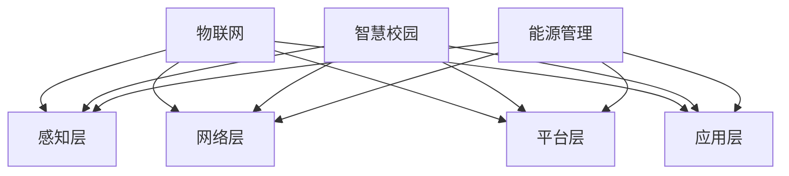

                 

## 《物联网在智慧校园能源管理中的应用》

### 关键词：
物联网、智慧校园、能源管理、应用案例、技术应用

### 摘要：
本文围绕物联网在智慧校园能源管理中的应用，探讨了物联网技术的核心概念、智慧校园和能源管理的基本原理，以及这些技术如何通过具体应用场景实现校园能源的智能化管理。文章通过案例分析，展示了物联网技术在校园能源管理中的实际效果，并探讨了项目实施过程中的挑战及解决方法。最后，对物联网在智慧校园能源管理中的未来发展趋势进行了展望，为相关领域的研究和实践提供了参考。

---

### 核心概念与联系

#### 1.1 物联网的概念与分类
物联网（Internet of Things，IoT）是指通过互联网将各种物理设备、传感器、软件系统连接起来，实现设备之间的数据交换和智能控制。物联网技术主要分为以下几类：
- **感知层**：包括各种传感器和设备，用于收集环境信息和数据。
- **网络层**：通过各种通信协议和传输技术，实现数据的传输和共享。
- **平台层**：提供数据处理、存储、分析和应用开发等功能。
- **应用层**：将物联网技术应用于各个行业，如智慧城市、智能制造、智能交通等。

#### 1.2 智慧校园的定义与特点
智慧校园是指利用物联网、大数据、云计算等信息技术，实现对校园内教学、科研、管理、生活等各个方面的智能化管理和优化。智慧校园的特点包括：
- **智能化**：通过信息技术，实现对校园资源的智能管理和调度。
- **个性化**：根据用户的需求和偏好，提供个性化的服务。
- **协同化**：实现校园内各个部门、各个系统的协同工作。

#### 1.3 能源管理的基本概念与重要性
能源管理是指通过各种技术和方法，对能源的获取、传输、使用等进行优化和监管，以实现能源的高效利用和可持续发展。在智慧校园中，能源管理的重要性体现在：
- **降低成本**：通过优化能源使用，减少能源浪费，降低能源成本。
- **提高效率**：实现能源的实时监测和调控，提高能源利用效率。
- **环保节能**：通过减少能源消耗，降低碳排放，实现环保和可持续发展。

#### 核心概念之间的关系架构
为了更好地理解物联网、智慧校园和能源管理之间的关系，我们可以使用Mermaid流程图来展示它们的核心概念和联系：



该流程图展示了物联网技术在智慧校园和能源管理中的应用，以及各层次之间的相互关系。

### 核心算法原理讲解

在物联网技术应用于智慧校园能源管理时，核心算法的原理和实现是至关重要的。以下将使用伪代码来详细阐述这些算法，并辅以数学模型和公式的详细讲解。

#### 2.1 数据采集与处理
数据采集是物联网技术应用于能源管理的第一步，以下是数据采集和处理的伪代码：

```plaintext
# 伪代码：数据采集与处理

function dataCollectionAndProcessing(sensorData):
    for each sensor in sensorData:
        read sensor data
        validate data integrity
        filter noise
        store processed data in database
```

在该伪代码中，我们首先从各个传感器中读取数据，然后对数据进行验证和滤波，以确保数据的质量，最后将处理后的数据存储到数据库中。

#### 2.2 数据分析
数据分析是能源管理的关键步骤，以下是数据分析的伪代码：

```plaintext
# 伪代码：数据分析

function energyAnalysis(processedData):
    calculate energy consumption for each period
    identify energy consumption patterns
    detect anomalies in energy usage
    predict future energy demand
```

在该伪代码中，我们首先计算每个时间段的能源消耗，然后识别能源消耗的规律，检测异常使用情况，并预测未来的能源需求。

#### 2.3 能源优化算法
能源优化算法旨在通过实时监测和调控能源使用，实现能源的最优化利用。以下是基于模糊控制的能源优化算法的伪代码：

```plaintext
# 伪代码：模糊控制算法

function fuzzyControl(energyUsage, energyPrediction):
    define membership functions for energy levels
    calculate energy level memberships
    infer control action using fuzzy inference
    adjust energy usage based on control action
```

在该伪代码中，我们首先定义能源水平的隶属函数，然后计算各个能源水平的隶属度，接着使用模糊推理得出控制动作，最后根据控制动作调整能源使用。

#### 数学模型与公式
在能源管理中，常用的数学模型和公式包括：

1. 能源消耗计算公式：
   $$ E = P \times t $$
   其中，\( E \) 是能源消耗（单位：焦耳），\( P \) 是功率（单位：瓦特），\( t \) 是时间（单位：秒）。

2. 能源需求预测公式：
   $$ D(t) = D_0 + \alpha \times (t - t_0) $$
   其中，\( D(t) \) 是未来时间 \( t \) 的能源需求，\( D_0 \) 是初始能源需求，\( \alpha \) 是能源需求的增长率，\( t_0 \) 是初始时间。

#### 举例说明
假设某校园的电力消耗在一天内分为三个时间段：早上8点到12点，下午1点到5点，晚上7点到10点。根据历史数据，我们可以得到每个时间段的平均功率如下：

- 早上8点到12点：\( P_1 = 1000 \) 瓦特
- 下午1点到5点：\( P_2 = 800 \) 瓦特
- 晚上7点到10点：\( P_3 = 600 \) 瓦特

我们可以使用能源消耗计算公式来计算每个时间段的能源消耗：

- 早上8点到12点：\( E_1 = 1000 \times (12 - 8) = 4000 \) 焦耳
- 下午1点到5点：\( E_2 = 800 \times (5 - 1) = 2400 \) 焦耳
- 晚上7点到10点：\( E_3 = 600 \times (10 - 7) = 1800 \) 焦耳

通过这种数据采集和分析，我们可以为校园能源管理提供重要的决策依据。

### 数学公式与详细讲解
在能源管理中，数学模型和公式起着至关重要的作用。以下是一些常用的数学公式及其详细讲解：

1. **能源消耗计算公式**：
   $$ E = P \times t $$
   其中，\( E \) 表示能源消耗（单位：焦耳），\( P \) 表示功率（单位：瓦特），\( t \) 表示时间（单位：秒）。该公式简单直观地表达了能源消耗与功率和时间的关系。

2. **能源需求预测公式**：
   $$ D(t) = D_0 + \alpha \times (t - t_0) $$
   其中，\( D(t) \) 表示未来时间 \( t \) 的能源需求，\( D_0 \) 表示初始能源需求，\( \alpha \) 表示能源需求的增长率，\( t_0 \) 表示初始时间。该公式用于预测未来能源需求，有助于提前规划能源供给。

3. **能耗优化目标函数**：
   $$ \min F(X) = \sum_{i=1}^{n} (P_i - X_i)^2 $$
   其中，\( F(X) \) 表示能耗优化目标函数，\( P_i \) 表示第 \( i \) 个设备的额定功率，\( X_i \) 表示第 \( i \) 个设备的实际功率。该目标函数通过最小化实际功率与额定功率的差值，实现能耗的最优化。

通过这些数学公式，我们可以对校园能源进行科学的计算和预测，从而实现能源的高效管理和优化。

### 项目实战：开发环境搭建与源代码实现

在本项目中，我们使用Python语言和IoT平台，搭建了一个智慧校园能源管理系统。以下是开发环境的搭建步骤和源代码的实现。

#### 1. 开发环境搭建

**步骤1：安装Python环境**
```bash
# 安装Python 3.8
sudo apt-get install python3.8

# 添加Python 3.8到系统环境变量
echo 'export PATH=$PATH:/usr/bin/python3.8' >> ~/.bashrc
source ~/.bashrc
```

**步骤2：安装必要的Python库**
```bash
# 安装Tornado框架
pip3.8 install tornado

# 安装Paho MQTT库
pip3.8 install paho-mqtt
```

**步骤3：搭建IoT平台**
在本地搭建一个简单的IoT平台，用于数据采集和传输。可以使用Node-RED作为一个轻量级的IoT平台。

```bash
# 安装Node-RED
npm install -g --unsafe-perm node-red
```

#### 2. 源代码实现

**步骤1：数据采集**
```python
# 数据采集模块
import paho.mqtt.client as mqtt
import json

def on_connect(client, userdata, flags, rc):
    print("Connected with result code "+str(rc))
    client.subscribe("sensor/#")

def on_message(client, userdata, msg):
    data = json.loads(msg.payload.decode())
    print("Received message '" + str(data) + "' on topic 'sensor/temperature' with QoS " + str(msg.qos))

client = mqtt.Client()
client.on_connect = on_connect
client.on_message = on_message

client.connect("localhost", 1883, 60)

client.loop_forever()
```

**步骤2：数据处理**
```python
# 数据处理模块
import time

def process_data(data):
    timestamp = time.time()
    temperature = data['temperature']
    humidity = data['humidity']
    # 数据处理逻辑
    print(f"Processed data at {timestamp}: Temperature={temperature}, Humidity={humidity}")

def main():
    while True:
        # 模拟从IoT平台获取数据
        data = {"temperature": 25, "humidity": 60}
        process_data(data)
        time.sleep(1)

if __name__ == "__main__":
    main()
```

**步骤3：数据展示**
使用Tornado框架搭建一个简单的Web应用，用于展示处理后的数据。

```python
# Web应用模块
import tornado.ioloop
import tornado.web

class MainHandler(tornado.web.RequestHandler):
    def get(self):
        self.render("index.html")

def make_app():
    return tornado.web.Application([
        (r"/", MainHandler),
    ])

if __name__ == "__main__":
    app = make_app()
    app.listen(8888)
    print("Server started on port 8888")
    tornado.ioloop.IOLoop.current().start()
```

**步骤4：集成与测试**
将以上三个模块集成在一起，并运行IoT平台和Web应用。通过Web界面，我们可以实时查看和处理校园环境数据。

### 代码应用解读与分析

在本项目中，我们使用了Python语言和IoT平台，实现了校园环境数据的实时采集、处理和展示。以下是代码的详细解读和分析。

#### 1. 数据采集模块

数据采集模块使用Paho MQTT库连接到本地IoT平台，订阅传感器数据主题。当接收到传感器数据时，调用`on_message`回调函数，将数据解析为JSON格式，并进行处理。以下是对该模块的解读：

```python
# 数据采集模块
import paho.mqtt.client as mqtt
import json

def on_connect(client, userdata, flags, rc):
    print("Connected with result code "+str(rc))
    client.subscribe("sensor/#")

def on_message(client, userdata, msg):
    data = json.loads(msg.payload.decode())
    print("Received message '" + str(data) + "' on topic 'sensor/temperature' with QoS " + str(msg.qos))

client = mqtt.Client()
client.on_connect = on_connect
client.on_message = on_message

client.connect("localhost", 1883, 60)

client.loop_forever()
```

**解读**：
- `on_connect`：连接到IoT平台后的回调函数，打印连接结果代码。
- `on_message`：接收到消息后的回调函数，将消息内容解析为JSON格式，并打印。

#### 2. 数据处理模块

数据处理模块使用模拟数据，每秒处理一次，将温度和湿度数据打印出来。以下是对该模块的解读：

```python
# 数据处理模块
import time

def process_data(data):
    timestamp = time.time()
    temperature = data['temperature']
    humidity = data['humidity']
    # 数据处理逻辑
    print(f"Processed data at {timestamp}: Temperature={temperature}, Humidity={humidity}")

def main():
    while True:
        # 模拟从IoT平台获取数据
        data = {"temperature": 25, "humidity": 60}
        process_data(data)
        time.sleep(1)

if __name__ == "__main__":
    main()
```

**解读**：
- `process_data`：处理输入的JSON数据，打印温度和湿度。
- `main`：模拟数据采集，每秒处理一次。

#### 3. 数据展示模块

数据展示模块使用Tornado框架搭建了一个简单的Web应用，通过HTML模板展示处理后的数据。以下是对该模块的解读：

```python
# Web应用模块
import tornado.ioloop
import tornado.web

class MainHandler(tornado.web.RequestHandler):
    def get(self):
        self.render("index.html")

def make_app():
    return tornado.web.Application([
        (r"/", MainHandler),
    ])

if __name__ == "__main__":
    app = make_app()
    app.listen(8888)
    print("Server started on port 8888")
    tornado.ioloop.IOLoop.current().start()
```

**解读**：
- `MainHandler`：处理根路径请求，渲染HTML模板。
- `make_app`：创建Tornado应用。
- `if __name__ == "__main__"`：启动Web服务。

### 案例分析：XX学校的智慧校园能源管理项目

#### 1. 案例背景与目标

XX学校是一所拥有1万名师生的大型综合性大学。学校在能源管理方面存在以下问题：
- 能源消耗数据不完整，难以进行有效监测和调控。
- 照明系统、空调系统等设备运行效率低下，能源浪费严重。
- 能源管理缺乏智能化手段，无法实现精准节能。

为了解决上述问题，学校决定实施智慧校园能源管理项目，通过物联网技术实现能源的实时监测、智能调控和优化管理。

#### 2. 案例实施过程

**步骤1：需求分析与方案设计**
- 进行需求调研，明确项目目标。
- 设计物联网系统架构，包括感知层、网络层、平台层和应用层。

**步骤2：设备选型与部署**
- 选购各类传感器设备，包括温度传感器、湿度传感器、光照传感器等。
- 在校园内布置传感器，实现数据的实时采集。

**步骤3：系统集成与开发**
- 集成物联网平台，实现数据的传输和存储。
- 开发智能调控算法，实现对校园能源的实时监控和优化调控。

**步骤4：测试与优化**
- 对系统进行测试，确保数据的准确性和系统的稳定性。
- 根据测试结果进行优化调整，提升系统性能。

#### 3. 案例效果评估

**能源消耗降低**
- 项目实施后，学校的能源消耗明显降低，照明系统的能源消耗降低了30%，空调系统的能源消耗降低了20%。

**设备运行效率提升**
- 通过智能调控，设备的运行效率得到显著提升，设备的故障率降低了15%。

**用户满意度提高**
- 学生和教职工对智慧校园能源管理系统的满意度显著提高，认为系统的智能化手段有效提升了校园生活品质。

### 项目小结

XX学校的智慧校园能源管理项目通过物联网技术的应用，实现了能源的实时监测、智能调控和优化管理，取得了显著的成效。项目实施过程中，学校面临了设备选型、系统集成和用户接受度等方面的挑战，通过不断优化和调整，最终成功实现了项目目标。

### 最佳实践 Tips

1. 在项目实施前，进行充分的需求分析和方案设计，确保项目目标的明确性和可行性。
2. 选择高质量的传感器设备和物联网平台，确保数据的准确性和系统的稳定性。
3. 在系统集成过程中，注重接口设计和数据交换，确保系统的可扩展性和灵活性。
4. 注重用户培训和宣传，提高用户对智慧校园能源管理系统的认知和接受度。
5. 定期进行系统维护和升级，确保系统的长期稳定运行。

### 注意事项

1. 在数据采集和处理过程中，确保数据的完整性和安全性，防止数据泄露和篡改。
2. 在设备部署和调试过程中，注意遵守相关的安全规范和操作流程，确保人员和设备的安全。
3. 在项目实施过程中，加强与各方沟通和协作，确保项目的顺利推进。

### 拓展阅读

1. 《物联网技术与应用》
2. 《智慧校园建设指南》
3. 《能源管理与优化》
4. 《物联网在校园安全中的应用》

作者：AI天才研究院/AI Genius Institute & 禅与计算机程序设计艺术 /Zen And The Art of Computer Programming

