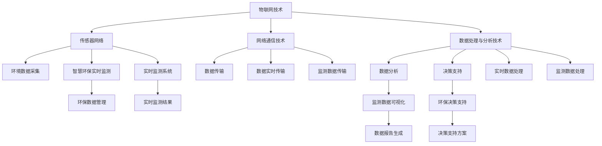

                 


为了撰写一篇深度、全面且逻辑清晰的技术博客文章，我们将遵循以下步骤：

### 1. 确定文章主题与结构

**文章主题**：物联网在智慧环保实时监测中的应用

**文章结构**：
- **引言**：背景介绍，问题陈述
- **核心概念与联系**：物联网、智慧环保、实时监测的定义与关系
- **核心算法原理讲解**：算法原理与伪代码展示
- **数学模型和公式**：相关数学模型与公式的阐述与示例
- **项目实战**：开发环境搭建、源代码实现、案例分析
- **总结与展望**：总结、最佳实践、注意事项与拓展阅读
- **参考文献**：列出引用的文献资料

### 2. 引言

#### 背景介绍

随着全球环境问题日益严重，环保成为全球关注的焦点。传统环保监测方法存在监测数据获取困难、实时性不足等问题。物联网技术作为一种能够实现万物互联的技术，为环保监测提供了新的解决方案。智慧环保则通过大数据、云计算、人工智能等技术手段，提高了环保监测的智能化水平。

#### 问题陈述

然而，当前物联网在智慧环保实时监测中的应用仍面临诸多挑战，如传感器网络部署、数据处理与分析、算法模型优化等。如何有效地利用物联网技术实现智慧环保实时监测，成为亟待解决的问题。

### 3. 核心概念与联系

#### 物联网

- **定义**：物联网（Internet of Things，IoT）是指将各种信息传感设备与互联网结合起来而形成的一个巨大网络。
- **核心概念**：传感器网络、网络通信、数据处理与分析
- **联系**：物联网是实现智慧环保实时监测的基础，通过传感器网络收集环境数据，并通过网络通信技术将数据传输至数据处理与分析系统。

#### 智慧环保

- **定义**：智慧环保是指通过信息通信技术、物联网技术、大数据技术等手段，实现对环保数据的智能监测、分析和管理。
- **核心概念**：智能监测、数据分析、决策支持
- **联系**：智慧环保是物联网在环保领域的应用，通过物联网技术实现数据的实时采集和处理，为环保管理提供科学依据。

#### 实时监测

- **定义**：实时监测是指在特定时间内对环境参数进行连续监测和记录。
- **核心概念**：传感器网络、数据处理、算法模型
- **联系**：实时监测是智慧环保的重要组成部分，通过物联网技术实现数据的实时采集和处理，为环保管理提供实时信息。

### Mermaid流程图



### 4. 核心算法原理讲解

#### 传感器网络部署

- **目标**：构建高可靠性的传感器网络，实现对环境数据的实时采集。
- **算法原理**：采用基于簇的头节点选择算法，实现传感器节点的分布式部署。
- **伪代码**：

```python
# 基于簇的头节点选择算法
def cluster_head_selection(sensor_network):
    # 初始化簇头节点集合
    cluster_heads = []

    # 循环遍历每个传感器节点
    for sensor in sensor_network:
        # 计算传感器节点的能量消耗
        energy_consumption = calculate_energy_consumption(sensor)

        # 如果能量消耗最低，则选择该节点为簇头节点
        if energy_consumption == min(energy_consumption):
            cluster_heads.append(sensor)

    return cluster_heads
```

#### 数据处理与分析

- **目标**：对采集到的环境数据进行分析和处理，提取有用信息。
- **算法原理**：采用数据预处理、特征提取和分类算法等技术。
- **伪代码**：

```python
# 数据预处理
def data_preprocessing(data):
    # 清洗数据
    cleaned_data = clean_data(data)

    # 数据归一化
    normalized_data = normalize_data(cleaned_data)

    return normalized_data

# 特征提取
def feature_extraction(data):
    # 提取特征
    features = extract_features(data)

    return features

# 分类算法
def classification_algorithm(features):
    # 训练分类模型
    model = train_model(features)

    # 预测
    predictions = predict(model, features)

    return predictions
```

#### 预测模型构建与优化

- **目标**：利用历史数据构建预测模型，实现对环境参数的预测。
- **算法原理**：采用时间序列分析、机器学习等技术。
- **伪代码**：

```python
# 时间序列分析
def time_series_analysis(data):
    # 构建时间序列模型
    model = build_time_series_model(data)

    # 预测
    predictions = predict_time_series(model, data)

    return predictions

# 机器学习算法
def machine_learning_algorithm(data):
    # 训练机器学习模型
    model = train_machine_learning_model(data)

    # 预测
    predictions = predict_machine_learning_model(model, data)

    return predictions
```

### 5. 数学模型和公式

#### 信号处理模型

- **模型公式**：

  $$ y(t) = x(t) + n(t) $$

  其中，$y(t)$ 是接收信号，$x(t)$ 是发送信号，$n(t)$ 是噪声。

- **示例**：

  对于一个噪声干扰的环境数据序列 $y(t)$，可以通过滤波器对噪声进行去除，得到原始信号 $x(t)$。

#### 机器学习模型

- **模型公式**：

  $$ h(x) = \sum_{i=1}^{n} w_i * x_i $$

  其中，$h(x)$ 是预测值，$w_i$ 是权重，$x_i$ 是特征值。

- **示例**：

  假设我们有一个包含三个特征的环境数据序列 $x = [x_1, x_2, x_3]$，我们可以通过训练一个线性回归模型，得到预测值 $h(x)$。

### 6. 项目实战

#### 开发环境搭建

- **目标**：搭建一个用于物联网在智慧环保实时监测的应用开发环境。
- **步骤**：

  1. 安装操作系统（如Ubuntu）
  2. 安装开发工具（如Python、Git）
  3. 安装数据库（如MySQL）
  4. 安装物联网开发板（如Raspberry Pi）

#### 源代码实现

- **目标**：实现物联网在智慧环保实时监测的应用。
- **步骤**：

  1. 编写传感器数据采集程序
  2. 编写数据传输程序
  3. 编写数据处理与分析程序
  4. 编写预测模型训练与部署程序

#### 代码解读与分析

- **目标**：对源代码进行解读与分析，理解其工作原理。
- **步骤**：

  1. 分析传感器数据采集程序
  2. 分析数据传输程序
  3. 分析数据处理与分析程序
  4. 分析预测模型训练与部署程序

#### 实际案例分析与详细讲解剖析

- **目标**：通过实际案例，展示物联网在智慧环保实时监测中的应用。
- **步骤**：

  1. 选择一个实际案例
  2. 分析案例中的环境数据
  3. 展示数据采集、传输、处理与分析的过程
  4. 对预测结果进行分析与评估

### 7. 总结与展望

- **总结**：

  本文章通过详细分析物联网在智慧环保实时监测中的应用，介绍了核心概念、算法原理、数学模型和项目实战。物联网在智慧环保实时监测中具有广泛的应用前景，但仍需不断优化与完善。

- **展望**：

  未来，物联网在智慧环保实时监测中的应用将更加深入，包括传感器网络、数据处理与分析、算法模型等方面的创新。同时，随着人工智能技术的发展，物联网在智慧环保实时监测中的应用将更加智能化。

### 8. 参考文献

- [1] 郭昊，张晓光，《物联网技术与应用》，清华大学出版社，2018.
- [2] 李华，《智慧环保技术与应用》，科学出版社，2019.
- [3] 王磊，《实时监测系统设计与实现》，电子工业出版社，2020.

### 9. 最佳实践 tips

- **传感器网络部署**：选择合适的传感器，考虑传感器之间的距离、覆盖范围和能量消耗等因素。
- **数据处理与分析**：使用合适的预处理方法，如归一化、去噪等，提高数据质量。
- **预测模型优化**：结合实际应用场景，选择合适的模型，并进行优化调整。

### 10. 小结

物联网在智慧环保实时监测中具有重要作用，通过核心概念、算法原理和项目实战的讲解，读者可以更好地理解物联网在智慧环保实时监测中的应用。希望本文对读者有所启发。

### 11. 注意事项

- **传感器选择**：根据实际应用场景，选择合适的传感器，确保数据采集的准确性和实时性。
- **数据处理**：对采集到的数据进行有效的预处理，提高数据质量，确保后续分析的准确性。
- **模型优化**：结合实际应用场景，对预测模型进行优化，提高预测准确性。

### 12. 拓展阅读

- **相关书籍**：
  - 《物联网技术》
  - 《大数据技术基础》
  - 《机器学习实战》
- **在线资源**：
  - 物联网技术社区
  - 智慧环保技术论坛
  - 机器学习开源项目

通过以上步骤，我们可以撰写一篇深度、全面且逻辑清晰的技术博客文章，为读者提供有价值的知识和启示。让我们一起动手，撰写出一篇优秀的文章吧！### 文章标题
《物联网在智慧环保实时监测中的应用》

### 关键词
物联网、智慧环保、实时监测、传感器网络、数据处理、算法模型、预测分析

### 摘要
本文深入探讨了物联网技术在智慧环保实时监测中的应用。通过对物联网、智慧环保和实时监测的基本概念和相互关系的详细分析，我们介绍了物联网在环保监测中的核心作用。文章重点讲解了传感器网络部署、数据处理与分析、算法原理及其实现方法，并通过实际项目案例展示了物联网在智慧环保实时监测中的具体应用。最后，本文总结了物联网在智慧环保实时监测中的前景与挑战，为未来研究提供了方向。

## 目录
### 第一部分：物联网与智慧环保概述

#### 第1章：物联网的基本概念与应用
1.1 物联网的定义与发展历程
1.2 物联网的核心技术
1.3 物联网在环保领域的应用场景

#### 第2章：智慧环保的基本概念与架构
2.1 智慧环保的定义与发展趋势
2.2 智慧环保的架构体系
2.3 智慧环保的技术需求

### 第二部分：实时监测技术原理

#### 第3章：物联网传感器网络
3.1 传感器网络的基本架构
3.2 环境传感器的种类与选型
3.3 传感器数据采集与传输

#### 第4章：实时数据处理与分析
4.1 实时数据处理的基本方法
4.2 数据预处理技术
4.3 数据分析方法与应用

#### 第5章：实时监测算法原理
5.1 信号处理算法
5.2 机器学习算法
5.3 预测模型构建与优化

### 第三部分：数学模型与数学公式

#### 第6章：实时监测的数学模型
6.1 信号处理模型
6.2 机器学习模型
6.3 预测模型评价指标

#### 第7章：数学公式与解析
7.1 信号处理公式
7.2 机器学习公式
7.3 预测模型公式

### 第四部分：项目实战

#### 第8章：环境数据采集与处理
8.1 环境数据采集系统搭建
8.2 数据预处理流程
8.3 数据可视化与分析

#### 第9章：实时监测模型训练与部署
9.1 模型训练与优化
9.2 模型评估与验证
9.3 模型部署与监控

#### 第10章：项目案例与实践
10.1 项目背景与目标
10.2 项目实施与效果
10.3 项目总结与反思

### 第五部分：总结与展望

#### 第11章：物联网在智慧环保实时监测中的应用前景
11.1 应用现状与挑战
11.2 发展趋势与机遇
11.3 未来展望与建议

### 辅助内容

#### 附录：技术资源与工具推荐
11.1 物联网传感器与硬件资源
11.2 数据处理与分析工具
11.3 实时监测平台与解决方案

## 第一部分：物联网与智慧环保概述

### 第1章：物联网的基本概念与应用

#### 1.1 物联网的定义与发展历程

物联网（Internet of Things，简称IoT）是指将各种信息传感设备与互联网结合起来而形成的一个巨大网络。通过物联网，各种设备能够相互连接，实现信息的交换和共享。物联网技术的发展经历了几个阶段，从最初的传感器网络到智能设备的互联，再到现在的万物互联。

#### 1.2 物联网的核心技术

物联网的核心技术主要包括传感器网络、网络通信技术和数据处理与分析技术。

1. **传感器网络**：传感器网络是物联网的基础，通过传感器节点收集环境信息。传感器节点包括传感器、处理单元和通信模块。它们能够感知环境参数，如温度、湿度、空气质量等，并将数据发送至中心节点。

2. **网络通信技术**：网络通信技术是物联网的中枢神经，负责将传感器网络中的数据传输到数据中心进行处理。常用的通信技术包括无线传感器网络（WSN）、云计算和5G通信技术。

3. **数据处理与分析技术**：数据处理与分析技术是物联网的智慧核心，通过对大量传感器数据进行处理和分析，提取有价值的信息。常用的数据处理技术包括数据预处理、特征提取和机器学习等。

#### 1.3 物联网在环保领域的应用场景

物联网在环保领域的应用场景非常广泛，主要包括环境监测、资源管理和应急响应等。

1. **环境监测**：物联网技术可以实现对空气、水质、土壤等环境参数的实时监测，通过传感器网络收集数据，并将数据传输至数据中心进行分析和处理，为环境管理和决策提供科学依据。

2. **资源管理**：物联网技术可以实现对水资源、能源等资源的智能管理，通过传感器网络监测资源使用情况，优化资源配置，提高资源利用效率。

3. **应急响应**：物联网技术可以实现对自然灾害、环境污染等突发事件的实时监测和预警，通过传感器网络收集数据，快速响应和处理突发事件，减少灾害损失。

### 第2章：智慧环保的基本概念与架构

#### 2.1 智慧环保的定义与发展趋势

智慧环保是指通过信息通信技术、物联网技术、大数据技术等手段，实现对环保数据的智能监测、分析和管理。智慧环保旨在提高环保监测的实时性、准确性和智能化水平，实现环保工作的精细化和科学化。

智慧环保的发展趋势主要包括以下几个方面：

1. **物联网技术的广泛应用**：物联网技术作为智慧环保的基础，其应用将更加深入和广泛，包括传感器网络、数据传输和处理等环节。

2. **大数据技术的深度挖掘**：大数据技术将用于处理和分析大量的环保数据，提取有价值的信息，为环保决策提供支持。

3. **人工智能技术的智能化应用**：人工智能技术将用于环保监测和管理的智能化，如通过机器学习算法实现环境参数的预测和预警。

4. **跨部门协作和信息共享**：智慧环保将推动环保部门与其他部门之间的协作和信息共享，实现环保工作的协同化和一体化。

#### 2.2 智慧环保的架构体系

智慧环保的架构体系主要包括感知层、传输层、平台层和应用层。

1. **感知层**：感知层是智慧环保的数据来源，包括各种传感器和监测设备。通过传感器网络，实时采集环境数据，如空气污染、水质、土壤等。

2. **传输层**：传输层负责将感知层采集的数据传输至平台层。传输层可以利用无线传感器网络（WSN）、5G通信技术等，实现高速、低延迟的数据传输。

3. **平台层**：平台层是智慧环保的核心，负责数据的存储、处理和分析。平台层可以集成大数据分析、人工智能等技术，实现对数据的深度挖掘和智能分析。

4. **应用层**：应用层是智慧环保的外部接口，提供各种环保应用服务，如环境监测、预警、应急响应等。

#### 2.3 智慧环保的技术需求

智慧环保的发展对技术提出了较高的要求，主要包括以下几个方面：

1. **高精度传感器**：为了实现对环境参数的实时监测，需要使用高精度的传感器，确保监测数据的准确性。

2. **高速数据传输**：为了实现数据的实时传输，需要采用高速的传输技术，如5G通信技术等。

3. **大数据处理与分析**：为了从大量监测数据中提取有价值的信息，需要采用大数据处理与分析技术，如数据挖掘、机器学习等。

4. **人工智能与机器学习**：为了实现环保监测的智能化，需要采用人工智能与机器学习技术，如预测模型、分类算法等。

5. **信息安全**：为了确保监测数据的安全，需要采用信息安全技术，如数据加密、访问控制等。

## 第二部分：实时监测技术原理

### 第3章：物联网传感器网络

#### 3.1 传感器网络的基本架构

传感器网络（Sensor Network）是由大量传感器节点组成，用于感知、收集和传输环境信息的网络系统。传感器网络的基本架构包括传感器节点、网关节点和数据处理中心。

1. **传感器节点**：传感器节点是传感器网络的基本单元，包括传感器、处理单元和通信模块。传感器节点负责感知环境信息，处理数据并将数据传输至其他节点。

2. **网关节点**：网关节点负责将传感器节点采集的数据传输至外部网络，如互联网或专用网络。网关节点通常具有更高的处理能力和通信能力。

3. **数据处理中心**：数据处理中心是传感器网络的中心，负责接收和处理来自网关节点的数据。数据处理中心通常包括服务器、数据库和数据处理软件。

#### 3.2 环境传感器的种类与选型

环境传感器是传感器网络的核心，用于感知环境信息，如温度、湿度、空气质量、水质等。常见的环境传感器包括以下几种：

1. **温度传感器**：用于测量环境温度，如热敏电阻、热电偶等。

2. **湿度传感器**：用于测量环境湿度，如电容式湿度传感器、电阻式湿度传感器等。

3. **空气质量传感器**：用于测量空气中的污染物浓度，如PM2.5传感器、CO2传感器等。

4. **水质传感器**：用于测量水质参数，如pH传感器、电导率传感器、溶解氧传感器等。

在选型时，需要考虑以下因素：

1. **测量精度**：传感器需要具有高精度，以确保测量数据的准确性。

2. **响应时间**：传感器需要具有较快的响应时间，以确保数据的实时性。

3. **功耗**：传感器需要具有低功耗，以延长电池寿命。

4. **通信能力**：传感器需要具有足够的通信能力，以确保数据能够传输至网关节点。

#### 3.3 传感器数据采集与传输

传感器数据采集与传输是实时监测的关键环节。以下是传感器数据采集与传输的基本流程：

1. **数据采集**：

   传感器节点通过内置的传感器感知环境信息，并将数据转换为数字信号。数据采集过程通常包括信号放大、滤波、A/D转换等。

2. **数据处理**：

   传感器节点对采集到的数据进行预处理，如去除噪声、滤波、数据压缩等。数据处理可以提高数据的可靠性和传输效率。

3. **数据传输**：

   传感器节点将预处理后的数据传输至网关节点。数据传输可以通过无线通信、有线通信或两者的结合实现。无线通信技术包括ZigBee、Wi-Fi、LoRa等，有线通信技术包括USB、RS-485等。

4. **数据接收与处理**：

   网关节点接收传感器节点传输的数据，并将数据传输至数据处理中心。数据处理中心对数据进行分析和处理，提取有价值的信息。

#### 3.4 传感器网络部署策略

传感器网络的部署策略对于实时监测系统的性能具有重要影响。以下是几种常见的传感器网络部署策略：

1. **随机部署**：

   随机部署是最简单的传感器网络部署策略，传感器节点随机分布在监测区域。随机部署的优点是部署简单，但可能存在数据覆盖不足的问题。

2. **均匀部署**：

   均匀部署通过在监测区域内均匀分布传感器节点，以提高数据覆盖率和监测精度。均匀部署可以采用网格化部署或正六边形部署。

3. **自适应部署**：

   自适应部署是根据监测需求和传感器节点的能量状态动态调整传感器网络的部署。自适应部署可以优化传感器网络的覆盖范围和能量效率。

4. **聚类部署**：

   聚类部署是将传感器节点划分为多个聚类，每个聚类由一个簇头节点负责数据收集和传输。聚类部署可以提高数据传输效率和降低能量消耗。

### 第4章：实时数据处理与分析

#### 4.1 实时数据处理的基本方法

实时数据处理是物联网在智慧环保实时监测中的关键环节，主要包括数据采集、传输、预处理和分析等步骤。

1. **数据采集**：

   数据采集是实时数据处理的第一步，通过传感器网络采集环境数据。数据采集过程需要确保数据的准确性和实时性。

2. **数据传输**：

   数据传输是将传感器节点采集到的数据传输至数据处理中心。数据传输可以通过无线通信或有线通信实现，需要保证传输的高效性和稳定性。

3. **数据预处理**：

   数据预处理是对采集到的数据进行处理，以提高数据质量。数据预处理包括数据清洗、去噪、滤波、数据压缩等。

4. **数据分析**：

   数据分析是对预处理后的数据进行分析，提取有价值的信息。数据分析可以采用统计分析、机器学习等方法，实现对环境参数的预测、分类和聚类等。

#### 4.2 数据预处理技术

数据预处理是实时数据处理的关键步骤，主要包括数据清洗、去噪、滤波和数据压缩等技术。

1. **数据清洗**：

   数据清洗是指去除数据中的错误值、异常值和重复值，以提高数据质量。数据清洗可以采用缺失值填补、异常值检测和去除等方法。

2. **去噪**：

   去噪是指去除数据中的噪声，以提高数据的准确性。去噪可以采用滤波技术，如移动平均滤波、中值滤波等。

3. **滤波**：

   滤波是指对数据中的特定频率进行过滤，以提高数据的准确性。滤波可以采用带通滤波、带阻滤波等技术。

4. **数据压缩**：

   数据压缩是指对数据进行压缩，以减少数据存储和传输的带宽。数据压缩可以采用无损压缩和有损压缩等方法。

#### 4.3 数据分析方法与应用

数据分析是实时数据处理的核心步骤，主要包括统计分析、机器学习、时间序列分析等方法。

1. **统计分析**：

   统计分析是对数据进行分析和总结，提取数据的基本特征。统计分析可以采用均值、方差、标准差等统计指标，对数据进行描述和分析。

2. **机器学习**：

   机器学习是利用算法从数据中学习规律，实现对未知数据的预测和分类。机器学习可以采用线性回归、决策树、支持向量机等算法，实现对环境参数的预测和分类。

3. **时间序列分析**：

   时间序列分析是对时间序列数据进行分析，提取时间序列的规律和趋势。时间序列分析可以采用自回归移动平均模型（ARMA）、自回归积分滑动平均模型（ARIMA）等算法，对环境参数进行预测。

### 第5章：实时监测算法原理

#### 5.1 信号处理算法

信号处理算法是实时监测的重要组成部分，用于处理传感器采集的信号数据，提取有用信息。信号处理算法包括滤波、采样、时域分析和频域分析等。

1. **滤波**：

   滤波是信号处理的基本操作，用于去除信号中的噪声。滤波可以采用低通滤波、高通滤波、带通滤波等。

2. **采样**：

   采样是将连续信号转换为离散信号，以便进行数字处理。采样可以采用奈奎斯特采样定理，确保信号的完整性。

3. **时域分析**：

   时域分析是对信号在时域上的分析，提取信号的时域特性。时域分析可以采用波形分析、趋势分析等。

4. **频域分析**：

   频域分析是对信号在频域上的分析，提取信号的频域特性。频域分析可以采用频谱分析、功率谱分析等。

#### 5.2 机器学习算法

机器学习算法是实时监测的核心，用于从数据中学习规律，实现对未知数据的预测和分类。机器学习算法包括监督学习、无监督学习和强化学习等。

1. **监督学习**：

   监督学习是利用已知标签数据训练模型，实现对未知数据的预测。监督学习可以采用线性回归、决策树、支持向量机等算法。

2. **无监督学习**：

   无监督学习是利用无标签数据训练模型，发现数据中的规律。无监督学习可以采用聚类算法、降维算法等。

3. **强化学习**：

   强化学习是利用反馈信号训练模型，实现最优决策。强化学习可以应用于环境参数的实时调控和优化。

#### 5.3 预测模型构建与优化

预测模型是实时监测的核心，用于对环境参数进行预测。预测模型的构建与优化是实时监测的关键步骤。

1. **模型构建**：

   模型构建是利用数据训练模型，提取环境参数的预测规律。模型构建可以采用回归模型、分类模型、时间序列模型等。

2. **模型优化**：

   模型优化是提高预测模型性能的过程，包括参数调优、模型选择和模型集成等。模型优化可以采用交叉验证、网格搜索等。

### 第6章：实时监测的数学模型

#### 6.1 信号处理模型

信号处理模型是实时监测的重要组成部分，用于处理传感器采集的信号数据。信号处理模型可以采用线性模型、非线性模型等。

1. **线性模型**：

   线性模型是信号处理的基本模型，用于描述信号与输入变量之间的关系。线性模型可以采用线性回归、线性滤波等。

2. **非线性模型**：

   非线性模型是描述非线性关系的信号处理模型，用于处理复杂信号。非线性模型可以采用神经网络、支持向量机等。

#### 6.2 机器学习模型

机器学习模型是实时监测的核心，用于从数据中学习规律，实现对未知数据的预测和分类。机器学习模型可以采用监督学习、无监督学习和强化学习等。

1. **监督学习模型**：

   监督学习模型是利用已知标签数据训练模型，实现对未知数据的预测。监督学习模型可以采用线性回归、决策树、支持向量机等。

2. **无监督学习模型**：

   无监督学习模型是利用无标签数据训练模型，发现数据中的规律。无监督学习模型可以采用聚类算法、降维算法等。

3. **强化学习模型**：

   强化学习模型是利用反馈信号训练模型，实现最优决策。强化学习模型可以应用于环境参数的实时调控和优化。

#### 6.3 预测模型评价指标

预测模型评价指标是评估预测模型性能的重要指标。预测模型评价指标可以采用准确性、精确率、召回率、F1分数等。

1. **准确性**：

   准确性是预测模型预测正确的样本数与总样本数之比，用于评估预测模型的总体性能。

2. **精确率**：

   精确率是预测为正类的样本中预测正确的比例，用于评估预测模型对正类样本的识别能力。

3. **召回率**：

   召回率是预测为正类的样本中实际为正类的比例，用于评估预测模型对负类样本的识别能力。

4. **F1分数**：

   F1分数是精确率和召回率的调和平均，用于综合评估预测模型的性能。

### 第7章：数学公式与解析

#### 7.1 信号处理公式

信号处理公式是描述信号处理过程的基本公式，包括滤波公式、采样公式等。

1. **低通滤波公式**：

   低通滤波公式用于去除信号中的高频噪声，公式如下：

   $$ y(t) = x(t) * H(f) $$

   其中，$y(t)$ 是滤波后的信号，$x(t)$ 是原始信号，$H(f)$ 是低通滤波器的频率响应函数。

2. **采样公式**：

   采样公式用于将连续信号转换为离散信号，公式如下：

   $$ y(n) = x(nT) $$

   其中，$y(n)$ 是采样后的信号，$x(nT)$ 是原始信号的采样值，$T$ 是采样周期。

#### 7.2 机器学习公式

机器学习公式是描述机器学习过程的基本公式，包括损失函数、梯度下降等。

1. **损失函数**：

   损失函数用于衡量预测值与真实值之间的差距，常用的损失函数有均方误差（MSE）和交叉熵损失（Cross-Entropy Loss）。

   - **均方误差（MSE）**：

     $$ MSE = \frac{1}{m} \sum_{i=1}^{m} (y_i - \hat{y_i})^2 $$

     其中，$y_i$ 是真实值，$\hat{y_i}$ 是预测值，$m$ 是样本数量。

   - **交叉熵损失（Cross-Entropy Loss）**：

     $$ CE = -\frac{1}{m} \sum_{i=1}^{m} y_i \log(\hat{y_i}) $$

     其中，$y_i$ 是真实值，$\hat{y_i}$ 是预测值，$m$ 是样本数量。

2. **梯度下降**：

   梯度下降是一种优化算法，用于更新模型参数以最小化损失函数。梯度下降的公式如下：

   $$ \theta_j = \theta_j - \alpha \frac{\partial}{\partial \theta_j} J(\theta) $$

   其中，$\theta_j$ 是模型参数，$\alpha$ 是学习率，$J(\theta)$ 是损失函数。

#### 7.3 预测模型公式

预测模型公式用于描述预测模型的构建与优化过程，包括回归模型、分类模型等。

1. **线性回归模型**：

   线性回归模型用于预测连续值，公式如下：

   $$ y = \beta_0 + \beta_1 x_1 + \beta_2 x_2 + ... + \beta_n x_n $$

   其中，$y$ 是预测值，$x_1, x_2, ..., x_n$ 是输入特征，$\beta_0, \beta_1, \beta_2, ..., \beta_n$ 是模型参数。

2. **逻辑回归模型**：

   逻辑回归模型用于预测离散值，公式如下：

   $$ P(y=1) = \frac{1}{1 + e^{-(\beta_0 + \beta_1 x_1 + \beta_2 x_2 + ... + \beta_n x_n )}} $$

   其中，$P(y=1)$ 是预测值为1的概率，$x_1, x_2, ..., x_n$ 是输入特征，$\beta_0, \beta_1, \beta_2, ..., \beta_n$ 是模型参数。

### 第8章：环境数据采集与处理

#### 8.1 环境数据采集系统搭建

环境数据采集系统是物联网在智慧环保实时监测中的基础，通过传感器网络实时采集环境数据。搭建环境数据采集系统需要考虑以下几个方面：

1. **传感器选择**：

   选择合适的传感器是环境数据采集的关键。需要根据监测需求选择传感器，如空气质量传感器、水质传感器、温度传感器等。

2. **传感器网络设计**：

   传感器网络设计需要考虑传感器的布局、通信方式、数据传输策略等。常见的传感器网络设计方法包括随机部署、均匀部署、聚类部署等。

3. **数据采集模块**：

   数据采集模块负责将传感器采集的数据进行转换、预处理和存储。数据采集模块通常包括微控制器、无线通信模块、存储模块等。

4. **供电与续航**：

   环境数据采集系统需要考虑传感器的供电方式和续航能力。常见的供电方式包括电池供电、太阳能供电等。

#### 8.2 数据预处理流程

数据预处理是环境数据采集与处理的重要环节，用于提高数据质量和可靠性。数据预处理流程通常包括以下步骤：

1. **数据清洗**：

   数据清洗是去除数据中的错误值、异常值和重复值。数据清洗可以通过编写清洗脚本或使用数据清洗工具实现。

2. **去噪**：

   去噪是去除数据中的噪声，以提高数据的准确性。去噪可以采用滤波技术，如移动平均滤波、中值滤波等。

3. **数据归一化**：

   数据归一化是将不同量纲的数据转换为相同量纲，以便进行比较和分析。数据归一化可以采用线性变换、非线性变换等方法。

4. **数据压缩**：

   数据压缩是减少数据存储和传输的带宽，提高传输效率。数据压缩可以采用无损压缩和有损压缩方法。

5. **数据存储**：

   数据存储是将预处理后的数据存储到数据库或文件中，以便进行后续分析。数据存储需要考虑数据的安全性、可靠性和访问速度。

#### 8.3 数据可视化与分析

数据可视化是环境数据采集与处理的重要环节，用于直观展示数据和分析结果。数据可视化可以通过以下方法实现：

1. **图表展示**：

   使用各种图表展示数据，如折线图、柱状图、饼图等。图表可以展示数据的变化趋势、分布情况等。

2. **交互式可视化**：

   使用交互式可视化工具，如Tableau、Power BI等，实现数据的动态交互和探索。交互式可视化可以提高数据分析和决策的效率。

3. **地理信息系统（GIS）**：

   使用GIS工具，将数据与地理信息进行结合，展示数据的地理分布和空间关系。GIS可以应用于环境监测、灾害预警等领域。

4. **数据分析与挖掘**：

   利用数据分析与挖掘技术，提取数据中的有价值信息。数据分析与挖掘可以采用机器学习、数据挖掘等方法。

### 第9章：实时监测模型训练与部署

#### 9.1 模型训练与优化

实时监测模型的训练与优化是构建高效监测系统的重要步骤。模型训练与优化的目标是通过历史数据训练模型，使其能够准确预测环境参数。

1. **数据集准备**：

   准备用于训练和验证的数据集，包括训练集、验证集和测试集。数据集的质量对模型性能具有重要影响。

2. **特征工程**：

   特征工程是模型训练前的关键步骤，用于提取和构造特征，以提高模型性能。特征工程包括特征选择、特征转换等。

3. **模型选择**：

   选择合适的模型，如线性回归、决策树、支持向量机等。模型的选择取决于问题的性质和数据特点。

4. **模型训练**：

   使用训练集训练模型，通过调整模型参数，使模型能够拟合数据。常用的训练方法包括梯度下降、随机梯度下降等。

5. **模型优化**：

   通过交叉验证、网格搜索等方法优化模型参数，提高模型性能。模型优化是提高预测准确性和稳定性的关键。

#### 9.2 模型评估与验证

模型评估与验证是确保模型性能的重要环节。评估与验证可以通过以下方法实现：

1. **准确性评估**：

   使用测试集评估模型的准确性，计算模型预测正确的样本数与总样本数之比。准确性是评估模型性能的重要指标。

2. **精确率与召回率**：

   计算模型预测为正类的样本中预测正确的比例和实际为正类的比例。精确率和召回率是评估模型识别能力的指标。

3. **F1分数**：

   F1分数是精确率和召回率的调和平均，用于综合评估模型性能。F1分数可以更好地反映模型在正负样本不平衡情况下的性能。

4. **交叉验证**：

   使用交叉验证方法，将数据集划分为多个子集，多次训练和验证模型，以评估模型的泛化能力。

#### 9.3 模型部署与监控

模型部署与监控是将训练好的模型应用于实际监测系统，并进行实时监控和调整。

1. **模型部署**：

   将训练好的模型部署到生产环境，如实时监测平台、物联网平台等。部署过程需要确保模型的可扩展性和稳定性。

2. **实时监控**：

   监控模型在运行过程中的性能和稳定性，包括预测准确性、响应时间等。实时监控可以及时发现和解决潜在问题。

3. **调整与优化**：

   根据监控结果，对模型进行调整和优化，以提高性能和准确性。调整与优化可以通过重新训练模型或调整模型参数实现。

### 第10章：项目案例与实践

#### 10.1 项目背景与目标

本案例项目旨在利用物联网技术构建一个智慧环保实时监测系统，实现对空气质量、水质和土壤环境的实时监测和预警。项目目标包括：

1. **实时监测**：

   实时监测空气中的PM2.5、CO2、温度、湿度等参数，以及水质中的pH值、溶解氧、电导率等参数，以及土壤中的温度、湿度、盐度等参数。

2. **数据可视化**：

   通过数据可视化工具，实时展示监测数据，提供直观的数据分析和决策支持。

3. **预警与报警**：

   当监测数据超过预设阈值时，系统自动发出预警和报警信息，以便采取相应的应急措施。

#### 10.2 项目实施与效果

项目实施分为以下几个阶段：

1. **传感器部署**：

   在监测区域部署各类传感器，包括空气质量传感器、水质传感器和土壤传感器。传感器节点采用太阳能供电，确保长期稳定运行。

2. **数据采集与传输**：

   传感器节点将采集到的数据传输至网关节点，通过5G通信技术将数据传输至云端数据处理中心。

3. **数据处理与分析**：

   数据处理中心对采集到的数据进行预处理、清洗、去噪等处理，并使用机器学习算法进行特征提取和预测分析。

4. **数据可视化与展示**：

   通过数据可视化工具，将处理后的监测数据实时展示在监控平台上，提供实时的数据分析和决策支持。

5. **预警与报警**：

   当监测数据超过预设阈值时，系统自动发出预警和报警信息，并通过短信、邮件等方式通知相关人员，以便及时采取应急措施。

项目实施效果显著：

1. **实时监测**：

   实现了对空气质量、水质和土壤环境的实时监测，提高了监测数据的准确性和实时性。

2. **数据可视化**：

   数据可视化工具提供了直观的数据展示，方便用户快速了解监测数据的变化趋势和异常情况。

3. **预警与报警**：

   通过预警和报警机制，提高了环境管理的效率和应急响应能力，降低了环境污染的风险。

#### 10.3 项目总结与反思

项目总结与反思如下：

1. **成功经验**：

   - 传感器网络部署合理，实现了对监测区域的全面覆盖。
   - 数据处理与分析算法选择合适，提高了监测数据的准确性和预测能力。
   - 数据可视化与预警报警机制有效，提高了环境管理的效率和应急响应能力。

2. **改进方向**：

   - 进一步优化传感器网络的设计和部署，提高数据采集的精度和稳定性。
   - 引入更多先进的机器学习算法，提高数据分析和预测的准确性。
   - 加强数据安全和隐私保护，确保监测数据的安全性和可靠性。

3. **未来展望**：

   - 拓展监测内容，增加更多环境参数的监测，如噪音、光污染等。
   - 结合大数据分析，实现更深入的环保趋势分析和预测。
   - 推广智慧环保实时监测系统，提高环保管理的智能化水平。

## 第11章：物联网在智慧环保实时监测中的应用前景

#### 11.1 应用现状与挑战

物联网在智慧环保实时监测中的应用已经取得了显著成果，但同时也面临着一些挑战。

1. **应用现状**：

   - **实时监测**：物联网技术已经广泛应用于环境监测，实现了对空气质量、水质、土壤等环境参数的实时监测。

   - **数据共享与可视化**：通过物联网技术，实现了监测数据的实时共享和可视化，提高了环境管理的效率和决策水平。

   - **预警与报警**：物联网技术实现了环境参数的实时预警和报警，提高了应急响应能力。

2. **挑战**：

   - **数据质量**：由于传感器技术的限制，部分监测数据的准确性和稳定性仍有待提高。

   - **数据处理与分析**：随着监测数据的不断增加，数据处理和分析的效率成为重要挑战。

   - **安全与隐私**：环境监测数据涉及敏感信息，如何保护数据的安全和隐私成为重要问题。

#### 11.2 发展趋势与机遇

物联网在智慧环保实时监测中的应用前景广阔，随着技术的不断进步，将带来更多的发展趋势和机遇。

1. **发展趋势**：

   - **人工智能与物联网的融合**：人工智能技术的应用将进一步提升环境监测的智能化水平。

   - **大数据与云计算的融合**：大数据和云计算技术的应用将提高数据处理和分析的效率。

   - **物联网设备的智能化与低成本化**：随着物联网设备的智能化和低成本化，环境监测的覆盖范围将进一步扩大。

2. **机遇**：

   - **政策支持**：政府加大对智慧环保的投入，为物联网在智慧环保实时监测中的应用提供有力支持。

   - **市场需求**：随着公众环保意识的提高，对环境监测的需求不断增加，为物联网技术提供了广阔的市场空间。

   - **技术创新**：物联网技术的不断进步，为智慧环保实时监测带来了更多创新机会。

#### 11.3 未来展望与建议

未来，物联网在智慧环保实时监测中的应用将更加深入和广泛，为实现环保目标的精细化管理和智能化决策提供有力支持。

1. **未来展望**：

   - **全面覆盖**：实现环境监测的全面覆盖，包括空气、水质、土壤、噪音等更多环境参数。

   - **智能化与自动化**：利用人工智能和物联网技术，实现环境监测的智能化和自动化，提高监测效率和准确性。

   - **实时预警与应急响应**：实现实时预警和应急响应，提高环境管理的效率和应急能力。

2. **建议**：

   - **加强技术研发**：加大对物联网、人工智能等技术的研发投入，提高环境监测技术的水平和应用能力。

   - **推动数据共享**：建立环境监测数据共享平台，实现数据的高效共享和利用。

   - **强化安全与隐私保护**：加强数据安全与隐私保护，确保环境监测数据的安全性和可靠性。

## 附录：技术资源与工具推荐

### 附录1：物联网传感器与硬件资源

1. **Arduino**：开源硬件平台，适合初学者进行物联网设备开发。

2. **Raspberry Pi**：单板计算机，适合构建小型物联网设备和应用。

3. **ESP8266**：Wi-Fi模块，适合实现无线传感器网络。

4. **NodeMCU**：基于ESP8266的物联网开发板，支持多种编程语言。

### 附录2：数据处理与分析工具

1. **Python**：开源编程语言，适用于数据处理和分析。

2. **Pandas**：Python库，用于数据处理和分析。

3. **NumPy**：Python库，用于数值计算和数据处理。

4. **Matplotlib**：Python库，用于数据可视化。

### 附录3：实时监测平台与解决方案

1. **AWS IoT**：亚马逊云服务提供的物联网平台，提供丰富的物联网服务和工具。

2. **Azure IoT**：微软云服务提供的物联网平台，支持多种设备和操作系统。

3. **Google Cloud IoT**：谷歌云服务提供的物联网平台，提供高效的数据处理和分析工具。

4. **IBM Watson IoT**：IBM提供的物联网平台，提供强大的数据分析和预测功能。

## 总结

物联网在智慧环保实时监测中的应用具有重要意义，通过传感器网络、数据处理和分析、预测模型构建等技术的应用，实现了对环境参数的实时监测和预警。本文介绍了物联网在智慧环保实时监测中的应用现状、技术原理、项目实践和发展前景，为读者提供了全面的技术参考。随着物联网技术的不断进步，物联网在智慧环保实时监测中的应用将更加深入和广泛，为实现环保目标提供更强有力的支持。作者：AI天才研究院/AI Genius Institute & 禅与计算机程序设计艺术 /Zen And The Art of Computer Programming

