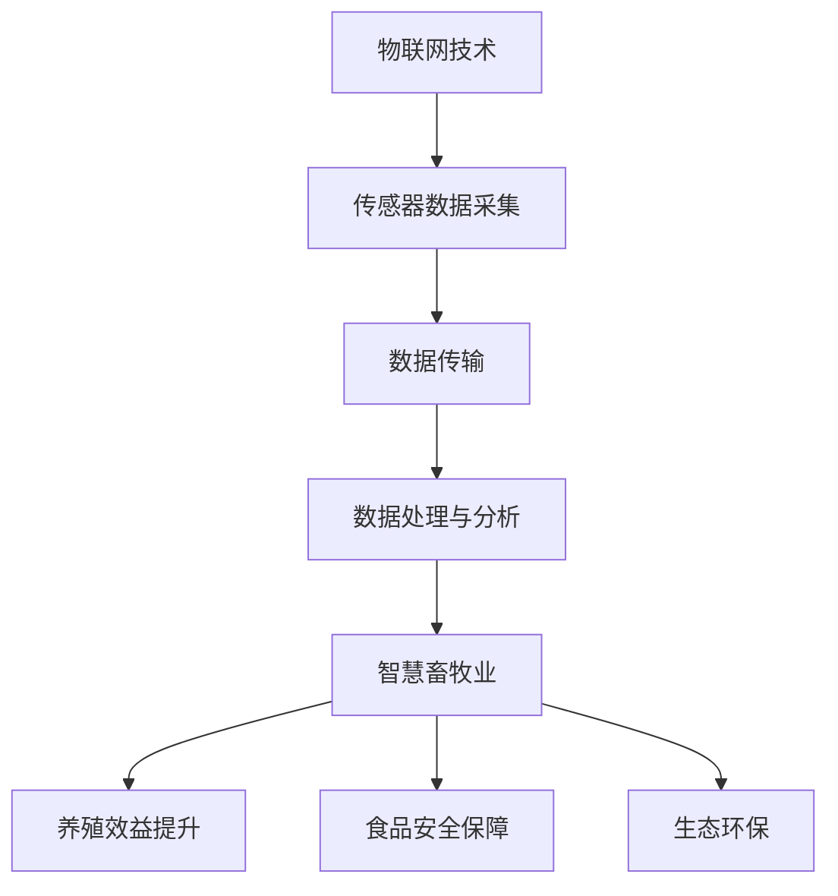
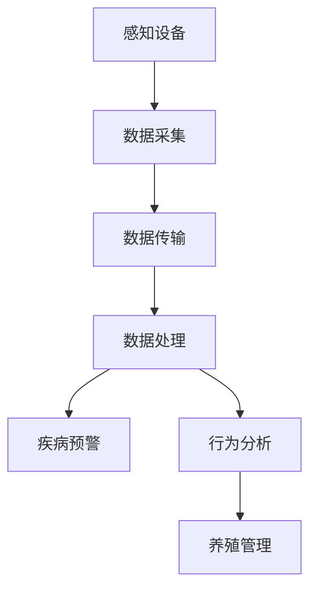
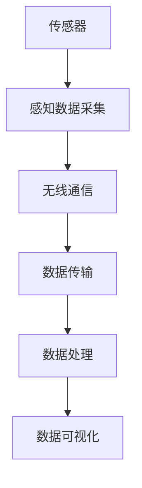

                 


### 文章标题: 物联网在智慧畜牧业健康监测中的应用

### 关键词：物联网、智慧畜牧业、健康监测、技术应用、算法原理

### 摘要：本文从物联网与智慧畜牧业的概述出发，探讨了物联网技术在智慧畜牧业健康监测中的应用，包括感知技术、传输技术和数据处理算法。通过实际应用案例，分析了物联网在畜牧业健康监测中的优势与挑战，并展望了未来的发展趋势。

## 引言

畜牧业作为农业的重要组成部分，其发展对于保障国家粮食安全和促进农村经济发展具有重要意义。随着信息技术和物联网技术的快速发展，智慧畜牧业逐渐成为我国现代农业发展的重要方向。智慧畜牧业通过物联网技术对动物健康进行实时监测，有助于提高养殖效益、保障食品安全和促进生态环保。

本文将详细探讨物联网在智慧畜牧业健康监测中的应用，包括物联网技术的基础知识、智慧畜牧业健康监测算法原理、实际应用案例以及未来发展趋势。

## 物联网与智慧畜牧业概述

### 物联网概述

物联网（Internet of Things，IoT）是指通过互联网将各种物理设备、传感器、软件平台等进行连接，实现数据的实时采集、传输和处理。物联网的关键技术包括传感器技术、无线通信技术、云计算和大数据等。

### 智慧畜牧业概述

智慧畜牧业是指利用物联网、大数据、云计算等信息技术，对畜牧业的生产、管理和运营进行智能化升级。智慧畜牧业的目标是提高养殖效益、保障食品安全、促进生态环保和降低劳动强度。

### 物联网与智慧畜牧业的联系

物联网技术为智慧畜牧业提供了重要的技术支撑，通过感知设备实时采集动物健康数据，传输到云端进行处理和分析，实现对动物健康的智能监测和管理。物联网技术不仅提高了养殖效率，还有助于实现精准养殖，提高养殖效益。

### Mermaid 流程图：物联网与智慧畜牧业的联系



## 物联网在智慧畜牧业健康监测中的应用

### 物联网技术在畜牧业中的应用

物联网技术在畜牧业中的应用主要包括动物健康监测、环境监测、饲料管理、动物行为分析等方面。通过这些应用，物联网技术有助于实现精准养殖，提高养殖效益。

### 物联网在动物健康监测中的应用

动物健康监测是智慧畜牧业的核心应用之一。物联网技术通过感知设备实时采集动物生理参数和行为数据，如体温、心率、呼吸率、活动强度等，传输到云端进行处理和分析，实现对动物健康的实时监测。

### 物联网在动物疾病预防中的应用

物联网技术在动物疾病预防中发挥着重要作用。通过实时监测动物健康数据，可以及时发现异常情况，提前采取预防措施，降低疾病传播风险。

### 物联网在动物行为分析中的应用

物联网技术还可以对动物行为进行分析，了解动物的生活习惯、生长状态等，为养殖管理提供科学依据。

### Mermaid 流程图：物联网在动物健康监测中的应用



## 物联网技术基础

### 感知技术

感知技术是物联网技术的基础，主要包括传感器、无线传感器网络等。传感器用于采集动物生理参数和行为数据，无线传感器网络则用于实现数据的远程传输。

### 传输技术

传输技术是物联网技术的关键，主要包括无线通信协议、数据传输安全和网络架构等。无线通信协议如Wi-Fi、蓝牙、Zigbee等，用于实现数据的传输。数据传输安全则保障数据在传输过程中的安全性和隐私性。网络架构主要包括端到端网络和云平台等。

### 数据处理技术

数据处理技术是物联网技术的核心，主要包括数据预处理、特征提取、数据分析和可视化等。数据预处理用于去除噪声和缺失值，特征提取用于提取数据中的重要信息，数据分析用于对数据进行分析和挖掘，可视化则用于将分析结果以图形化的形式展示。

### Mermaid 流程图：物联网技术基础



## 智慧畜牧业健康监测算法原理

### 动物健康监测算法原理

动物健康监测算法主要基于机器学习和人工智能技术，通过对动物生理参数和行为数据进行分析，实现对动物健康状况的实时监测和预警。

### 机器学习算法原理

机器学习算法是动物健康监测算法的核心。常用的机器学习算法包括决策树、支持向量机、神经网络等。决策树通过构建决策树模型，对动物健康数据进行分类；支持向量机通过寻找最优分类边界，实现对动物健康状况的判断；神经网络则通过多层感知器模型，对动物健康数据进行分类和预测。

### 伪代码：决策树算法原理

```
算法：决策树
输入：训练数据集D，特征集合F
输出：决策树T

1. 如果D中所有实例都属于同一类别，则返回叶节点，类别为D中实例的类别
2. 否则，
   2.1 计算所有特征对于D的增益率
   2.2 选择增益率最大的特征作为分裂特征
   2.3 根据分裂特征将D划分为多个子集
   2.4 对于每个子集，递归调用算法，构建子决策树
   2.5 返回根节点，其子节点为分裂出的子决策树
```

### 数学模型和公式

动物健康监测的数学模型主要包括线性回归、逻辑回归和支持向量机等。线性回归用于预测动物生理参数，逻辑回归用于判断动物健康状况，支持向量机用于分类动物健康状况。

$$
y = \beta_0 + \beta_1x_1 + \beta_2x_2 + ... + \beta_nx_n
$$

$$
P(y=1) = \frac{1}{1 + e^{-(\beta_0 + \beta_1x_1 + \beta_2x_2 + ... + \beta_nx_n)}}
$$

$$
\min_{w,b}\frac{1}{2}\sum_{i=1}^{n}(y_i-\alpha_i\cdot w\cdot x_i-b)^2 + \lambda\sum_{i=1}^{n}w_i^2
$$

### 举例说明

假设我们使用决策树算法对动物体温进行分类。训练数据集D包含100条实例，每个实例包含体温、心率、呼吸率等特征。通过计算增益率，我们选择体温作为分裂特征，将D划分为高体温组、正常体温组和低体温组。递归调用决策树算法，构建最终的决策树模型。

## 实际应用案例

### 案例一：某牧场物联网健康监测系统

某牧场采用了物联网健康监测系统，通过传感器实时采集牛只的体温、心率、呼吸率等生理参数。系统将数据传输到云端进行处理和分析，实现对牛只健康状况的实时监测和预警。该系统有效提高了牛只的健康水平，降低了疾病传播风险。

### 案例二：某养殖场物联网疾病预警系统

某养殖场采用了物联网疾病预警系统，通过感知设备实时监测鸡只的健康状况。系统利用机器学习算法对鸡只的行为数据进行分析，实现对鸡只疾病的早期预警。该系统有效提高了鸡只的养殖效益，降低了养殖成本。

### 案例三：某农场物联网动物行为分析系统

某农场采用了物联网动物行为分析系统，通过感知设备实时监测猪只的行为数据。系统利用行为分析算法对猪只的活动强度、作息规律等进行分析，为养殖管理提供科学依据。该系统有效提高了猪只的生产效率，降低了劳动强度。

## 未来发展趋势与展望

### 技术发展趋势

随着物联网、大数据、人工智能等技术的不断发展，物联网在智慧畜牧业健康监测中的应用将越来越广泛。未来技术发展趋势包括：

1. 高精度传感器技术的发展：提高对动物生理参数的监测精度。
2. 高效数据处理算法的研究：提高数据处理的效率和准确性。
3. 人工智能技术的应用：实现更加智能化的动物健康监测和管理。

### 行业发展展望

智慧畜牧业作为我国现代农业发展的重要方向，未来将在以下几个方面得到发展：

1. 政策支持：政府加大对智慧畜牧业的政策支持力度，推动行业的发展。
2. 产业升级：通过物联网技术提高养殖效益，降低养殖成本。
3. 生态环保：通过物联网技术实现养殖过程的智能化，降低对环境的影响。

## 技术标准与法规

### 技术标准

物联网在智慧畜牧业健康监测中的应用需要遵循相关技术标准，包括传感器标准、通信协议标准、数据处理标准等。技术标准的制定有利于推动物联网技术在畜牧业健康监测中的应用和普及。

### 法规

智慧畜牧业健康监测涉及动物健康、食品安全、环境保护等方面，需要遵循相关法规。例如，动物防疫法、农产品质量安全法等。法规的制定有利于保障物联网在智慧畜牧业健康监测中的应用的合法性和安全性。

## 总结与展望

物联网在智慧畜牧业健康监测中的应用具有广阔的前景。通过物联网技术，实现对动物健康的实时监测和管理，有助于提高养殖效益、保障食品安全和促进生态环保。未来，随着物联网、大数据、人工智能等技术的不断发展，物联网在智慧畜牧业健康监测中的应用将更加深入和广泛。

作者：AI天才研究院/AI Genius Institute & 禅与计算机程序设计艺术 /Zen And The Art of Computer Programming```markdown
# 物联网在智慧畜牧业健康监测中的应用

> 关键词：物联网、智慧畜牧业、健康监测、技术应用、算法原理

> 摘要：本文从物联网与智慧畜牧业的概述出发，探讨了物联网技术在智慧畜牧业健康监测中的应用，包括感知技术、传输技术和数据处理算法。通过实际应用案例，分析了物联网在畜牧业健康监测中的优势与挑战，并展望了未来的发展趋势。

## 引言

畜牧业作为农业的重要组成部分，其发展对于保障国家粮食安全和促进农村经济发展具有重要意义。随着信息技术和物联网技术的快速发展，智慧畜牧业逐渐成为我国现代农业发展的重要方向。智慧畜牧业通过物联网技术对动物健康进行实时监测，有助于提高养殖效益、保障食品安全和促进生态环保。

本文将详细探讨物联网在智慧畜牧业健康监测中的应用，包括物联网技术的基础知识、智慧畜牧业健康监测算法原理、实际应用案例以及未来发展趋势。

## 物联网与智慧畜牧业概述

### 物联网概述

物联网（Internet of Things，IoT）是指通过互联网将各种物理设备、传感器、软件平台等进行连接，实现数据的实时采集、传输和处理。物联网的关键技术包括传感器技术、无线通信技术、云计算和大数据等。

### 智慧畜牧业概述

智慧畜牧业是指利用物联网、大数据、云计算等信息技术，对畜牧业的生产、管理和运营进行智能化升级。智慧畜牧业的目标是提高养殖效益、保障食品安全、促进生态环保和降低劳动强度。

### 物联网与智慧畜牧业的联系

物联网技术为智慧畜牧业提供了重要的技术支撑，通过感知设备实时采集动物健康数据，传输到云端进行处理和分析，实现对动物健康的智能监测和管理。物联网技术不仅提高了养殖效率，还有助于实现精准养殖，提高养殖效益。

### Mermaid 流程图：物联网与智慧畜牧业的联系


## 物联网在智慧畜牧业健康监测中的应用

### 物联网技术在畜牧业中的应用

物联网技术在畜牧业中的应用主要包括动物健康监测、环境监测、饲料管理、动物行为分析等方面。通过这些应用，物联网技术有助于实现精准养殖，提高养殖效益。

### 物联网在动物健康监测中的应用

动物健康监测是智慧畜牧业的核心应用之一。物联网技术通过感知设备实时采集动物生理参数和行为数据，如体温、心率、呼吸率、活动强度等，传输到云端进行处理和分析，实现对动物健康的实时监测。

### 物联网在动物疾病预防中的应用

物联网技术在动物疾病预防中发挥着重要作用。通过实时监测动物健康数据，可以及时发现异常情况，提前采取预防措施，降低疾病传播风险。

### 物联网在动物行为分析中的应用

物联网技术还可以对动物行为进行分析，了解动物的生活习惯、生长状态等，为养殖管理提供科学依据。

### Mermaid 流程图：物联网在动物健康监测中的应用


## 物联网技术基础

### 感知技术

感知技术是物联网技术的基础，主要包括传感器、无线传感器网络等。传感器用于采集动物生理参数和行为数据，无线传感器网络则用于实现数据的远程传输。

### 传输技术

传输技术是物联网技术的关键，主要包括无线通信协议、数据传输安全和网络架构等。无线通信协议如Wi-Fi、蓝牙、Zigbee等，用于实现数据的传输。数据传输安全则保障数据在传输过程中的安全性和隐私性。网络架构主要包括端到端网络和云平台等。

### 数据处理技术

数据处理技术是物联网技术的核心，主要包括数据预处理、特征提取、数据分析和可视化等。数据预处理用于去除噪声和缺失值，特征提取用于提取数据中的重要信息，数据分析用于对数据进行分析和挖掘，可视化则用于将分析结果以图形化的形式展示。

### Mermaid 流程图：物联网技术基础


## 智慧畜牧业健康监测算法原理

### 动物健康监测算法原理

动物健康监测算法主要基于机器学习和人工智能技术，通过对动物生理参数和行为数据进行分析，实现对动物健康状况的实时监测和预警。

### 机器学习算法原理

机器学习算法是动物健康监测算法的核心。常用的机器学习算法包括决策树、支持向量机、神经网络等。决策树通过构建决策树模型，对动物健康数据进行分类；支持向量机通过寻找最优分类边界，实现对动物健康状况的判断；神经网络则通过多层感知器模型，对动物健康数据进行分类和预测。

### 伪代码：决策树算法原理

```
算法：决策树
输入：训练数据集D，特征集合F
输出：决策树T

1. 如果D中所有实例都属于同一类别，则返回叶节点，类别为D中实例的类别
2. 否则，
   2.1 计算所有特征对于D的增益率
   2.2 选择增益率最大的特征作为分裂特征
   2.3 根据分裂特征将D划分为多个子集
   2.4 对于每个子集，递归调用算法，构建子决策树
   2.5 返回根节点，其子节点为分裂出的子决策树
```

### 数学模型和公式

动物健康监测的数学模型主要包括线性回归、逻辑回归和支持向量机等。线性回归用于预测动物生理参数，逻辑回归用于判断动物健康状况，支持向量机用于分类动物健康状况。

$$
y = \beta_0 + \beta_1x_1 + \beta_2x_2 + ... + \beta_nx_n
$$

$$
P(y=1) = \frac{1}{1 + e^{-(\beta_0 + \beta_1x_1 + \beta_2x_2 + ... + \beta_nx_n)}}
$$

$$
\min_{w,b}\frac{1}{2}\sum_{i=1}^{n}(y_i-\alpha_i\cdot w\cdot x_i-b)^2 + \lambda\sum_{i=1}^{n}w_i^2
$$

### 举例说明

假设我们使用决策树算法对动物体温进行分类。训练数据集D包含100条实例，每个实例包含体温、心率、呼吸率等特征。通过计算增益率，我们选择体温作为分裂特征，将D划分为高体温组、正常体温组和低体温组。递归调用决策树算法，构建最终的决策树模型。

## 实际应用案例

### 案例一：某牧场物联网健康监测系统

某牧场采用了物联网健康监测系统，通过传感器实时采集牛只的体温、心率、呼吸率等生理参数。系统将数据传输到云端进行处理和分析，实现对牛只健康状况的实时监测和预警。该系统有效提高了牛只的健康水平，降低了疾病传播风险。

### 案例二：某养殖场物联网疾病预警系统

某养殖场采用了物联网疾病预警系统，通过感知设备实时监测鸡只的健康状况。系统利用机器学习算法对鸡只的行为数据进行分析，实现对鸡只疾病的早期预警。该系统有效提高了鸡只的养殖效益，降低了养殖成本。

### 案例三：某农场物联网动物行为分析系统

某农场采用了物联网动物行为分析系统，通过感知设备实时监测猪只的行为数据。系统利用行为分析算法对猪只的活动强度、作息规律等进行分析，为养殖管理提供科学依据。该系统有效提高了猪只的生产效率，降低了劳动强度。

## 未来发展趋势与展望

### 技术发展趋势

随着物联网、大数据、人工智能等技术的不断发展，物联网在智慧畜牧业健康监测中的应用将越来越广泛。未来技术发展趋势包括：

1. 高精度传感器技术的发展：提高对动物生理参数的监测精度。
2. 高效数据处理算法的研究：提高数据处理的效率和准确性。
3. 人工智能技术的应用：实现更加智能化的动物健康监测和管理。

### 行业发展展望

智慧畜牧业作为我国现代农业发展的重要方向，未来将在以下几个方面得到发展：

1. 政策支持：政府加大对智慧畜牧业的政策支持力度，推动行业的发展。
2. 产业升级：通过物联网技术提高养殖效益，降低养殖成本。
3. 生态环保：通过物联网技术实现养殖过程的智能化，降低对环境的影响。

## 技术标准与法规

### 技术标准

物联网在智慧畜牧业健康监测中的应用需要遵循相关技术标准，包括传感器标准、通信协议标准、数据处理标准等。技术标准的制定有利于推动物联网技术在畜牧业健康监测中的应用和普及。

### 法规

智慧畜牧业健康监测涉及动物健康、食品安全、环境保护等方面，需要遵循相关法规。例如，动物防疫法、农产品质量安全法等。法规的制定有利于保障物联网在智慧畜牧业健康监测中的应用的合法性和安全性。

## 总结与展望

物联网在智慧畜牧业健康监测中的应用具有广阔的前景。通过物联网技术，实现对动物健康的实时监测和管理，有助于提高养殖效益、保障食品安全和促进生态环保。未来，随着物联网、大数据、人工智能等技术的不断发展，物联网在智慧畜牧业健康监测中的应用将更加深入和广泛。

作者：AI天才研究院/AI Genius Institute & 禅与计算机程序设计艺术 /Zen And The Art of Computer Programming
```

