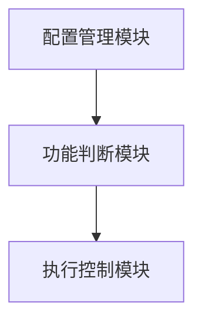

                 

# 特性开关：灵活控制AI功能发布的工具

## 关键词
- 特性开关
- AI功能发布
- 灵活控制
- 编程技巧
- 实践案例

## 摘要
本文将深入探讨特性开关在人工智能（AI）领域中的应用，特别是在AI功能发布中的灵活控制。特性开关是一种编程工具，允许开发者在不改变代码本身的情况下，通过简单的配置实现功能的开启或关闭。本文将首先介绍特性开关的背景和核心概念，然后详细分析特性开关与AI功能的联系，通过流程图和伪代码阐述其实现原理，最后通过实际案例展示特性开关在AI功能发布中的具体应用，并总结最佳实践和未来发展趋势。

## 目录大纲设计与构思

在设计《特性开关：灵活控制AI功能发布的工具》的目录大纲时，我们遵循了以下步骤：

1. **理解书名与主题**：明确书籍的核心内容是特性开关在AI功能发布中的灵活控制。
2. **确定书籍结构**：将书籍分为引言、核心概念与联系、技术实现、应用案例和未来展望五个主要部分。
3. **细化章节内容**：每个部分细化为若干章节，确保内容之间逻辑连贯，既有独立性又相互补充。
4. **确保完整性**：涵盖核心概念与联系、技术实现、数学模型与公式讲解、项目实战等内容。
5. **使用Mermaid流程图**：展示核心概念原理和架构。
6. **编写伪代码**：详细阐述核心算法原理。
7. **编写目录大纲**：使用markdown格式编写，确保格式和内容符合要求。

### 目录大纲

```
# 特性开关：灵活控制AI功能发布的工具

## 引言
### 1.1 书籍背景与目标
### 1.2 特性开关的概念与发展

## 核心概念与联系
### 2.1 特性开关的核心概念
#### 2.1.1 特性开关的定义
#### 2.1.2 特性开关的作用机制
### 2.2 特性开关与AI功能的联系
#### 2.2.1 特性开关在AI功能中的作用
#### 2.2.2 特性开关的优势与局限性

## 技术实现
### 3.1 特性开关的实现技术
#### 3.1.1 特性开关的编程方法
#### 3.1.2 特性开关的架构设计
### 3.2 特性开关的编程与调试
#### 3.2.1 特性开关的编程技巧
#### 3.2.2 特性开关的调试与优化

## 应用案例
### 4.1 特性开关在AI功能发布中的应用
#### 4.1.1 智能语音助手
#### 4.1.2 智能推荐系统
### 4.2 特性开关在其他领域的应用
#### 4.2.1 医疗诊断系统
#### 4.2.2 金融风险管理

## 未来展望
### 5.1 特性开关的发展趋势
### 5.2 特性开关的挑战与解决方案

## 附录
### 附录A：特性开关工具与资源
### 附录B：编程实践
### 附录C：数学模型与公式
```

通过以上详细的目录大纲，读者可以清晰地看到书籍的结构和内容安排，便于理解和阅读。接下来，我们将逐节深入探讨每个部分的具体内容。

---

## 引言

随着人工智能（AI）技术的快速发展，AI功能在各个领域得到了广泛应用，从智能语音助手、智能推荐系统到医疗诊断和金融风险管理。这些AI功能的实现往往依赖于复杂的算法和大量的数据。然而，如何在开发过程中灵活地管理和发布这些功能，以确保系统的高效性和可维护性，成为了一个重要的课题。

特性开关（Feature Switch）作为一种编程工具，正是为了解决这一需求而诞生的。特性开关允许开发者在代码未改变的情况下，通过配置文件或简单的代码注释，实现功能的开启或关闭。这种灵活性在AI功能发布中尤为重要，因为它可以帮助团队在开发、测试和发布过程中，更精细地控制功能的可用性，从而降低风险、提高效率。

### 1.1 书籍背景与目标

本书籍的目的是全面介绍特性开关在AI功能发布中的应用，帮助开发者理解和掌握这一重要的工具。具体目标如下：

1. **核心概念与联系**：介绍特性开关的定义、作用机制，并阐述其与AI功能的联系。
2. **技术实现**：详细讲解特性开关的编程方法和架构设计，提供伪代码和实际案例。
3. **应用案例**：展示特性开关在AI功能发布中的实际应用，包括智能语音助手、智能推荐系统等。
4. **未来展望**：探讨特性开关的发展趋势和面临的挑战，为开发者提供前瞻性的指导。

通过本书，读者将能够：

- 理解特性开关的基本概念和作用。
- 掌握特性开关的编程技巧和调试方法。
- 应用特性开关于实际的AI功能发布中，提高开发效率和系统的灵活性。
- 了解特性开关的未来发展方向和潜在挑战。

### 1.2 特性开关的概念与发展

特性开关最初起源于软件开发领域，最早由微软在Windows操作系统中引入，用于控制某些功能的可用性。随着云计算和微服务架构的兴起，特性开关逐渐成为了一种通用的软件开发工具，广泛应用于各种场景。

在AI领域，特性开关的应用尤为广泛。AI系统的复杂性使得功能的发布和更新变得更加复杂和困难。特性开关可以通过以下方式在AI功能发布中发挥作用：

1. **灰度发布**：在功能上线前，部分用户可以先体验新功能，通过特性开关控制功能的可见性，逐步扩大用户群体。
2. **灵活调整**：在功能上线后，通过特性开关可以快速调整或关闭某些功能，以应对潜在的问题或优化用户体验。
3. **实验与测试**：特性开关可以用于快速部署实验版本，以评估新功能的效果和用户反馈，为正式发布提供依据。

特性开关的发展也伴随着技术的进步。早期的特性开关往往依赖于硬编码或配置文件，而现代的框架和平台提供了更为高级和灵活的特性开关实现方式，如基于动态配置、服务网格和分布式系统等。

### 1.3 特性开关的优势与局限性

特性开关具有以下优势：

1. **灵活性**：允许在不修改代码的情况下控制功能开关，提高开发效率和系统的可维护性。
2. **可测试性**：方便进行功能测试和灰度发布，降低功能发布的风险。
3. **扩展性**：支持复杂的业务逻辑和配置，适应不同的应用场景。

然而，特性开关也存在一定的局限性：

1. **复杂性**：配置和管理特性开关可能增加系统的复杂性，需要开发者具备一定的技术能力。
2. **性能影响**：特性开关的实现可能对系统性能产生一定影响，尤其是在高并发的场景中。
3. **安全性**：特性开关的配置和管理需要严格的安全控制，以防止误操作或恶意操作。

综上所述，特性开关作为一种重要的编程工具，在AI功能发布中具有广泛的应用前景。然而，开发者需要根据具体场景和需求，合理选择和使用特性开关，以充分发挥其优势，同时避免其局限性。

---

在引言部分，我们介绍了特性开关的背景、书籍目标、基本概念及其在AI功能发布中的重要性。接下来，我们将深入探讨特性开关的核心概念与联系，通过具体的例子和流程图，帮助读者更好地理解这一概念。

## 核心概念与联系

### 2.1 特性开关的核心概念

特性开关（Feature Switch）是一种用于控制功能是否启用的编程工具。它允许开发者在代码实现之外，通过配置文件或特定的代码标记，动态地开启或关闭功能。特性开关的核心概念可以概括为以下几点：

1. **功能隔离**：通过特性开关，开发者可以将不同的功能模块隔离开来，使得每个功能模块可以独立开发、测试和部署。
2. **动态控制**：特性开关提供了一个动态的配置机制，开发者可以在系统运行时调整功能的开关状态，而不需要修改代码或重新部署。
3. **灵活配置**：特性开关通常支持多样化的配置方式，如配置文件、环境变量、数据库等，以适应不同的开发环境和需求。

### 2.1.1 特性开关的定义

特性开关是一种编程工具，用于在代码实现之外控制功能的启用与禁用。它通过标记或配置文件，实现功能的动态切换。特性开关的定义可以分为以下几个方面：

- **基本概念**：特性开关是一个逻辑开关，用于控制某个功能的可见性和可用性。
- **作用机制**：特性开关通过配置文件或代码中的特定标记，实现功能的开启或关闭。
- **实现方式**：特性开关可以通过配置文件、环境变量、API调用等多种方式进行实现。

### 2.1.2 特性开关的工作机制

特性开关的工作机制可以分为以下几个步骤：

1. **配置加载**：在系统启动或运行过程中，特性开关从配置文件或数据库中加载配置信息。
2. **功能判断**：当某个功能被调用时，系统会根据配置信息判断该功能是否启用。
3. **执行控制**：如果功能被启用，系统正常执行该功能；如果功能被禁用，系统跳过该功能的执行。

### 2.2 特性开关与AI功能的联系

特性开关在AI领域中的应用主要体现在以下几个方面：

1. **功能模块化**：通过特性开关，可以将AI系统的不同功能模块化，使得每个模块可以独立开发和部署。
2. **灰度发布**：在AI功能上线前，可以通过特性开关实现灰度发布，部分用户先体验新功能，确保功能的稳定性和安全性。
3. **灵活调整**：在AI功能上线后，可以通过特性开关快速调整或关闭功能，以应对潜在的问题或优化用户体验。

### 2.2.1 特性开关在AI功能中的作用

特性开关在AI功能中的作用主要包括以下几点：

1. **功能切换**：通过特性开关，可以灵活地切换AI功能的开启或关闭状态。
2. **测试与验证**：特性开关可以用于快速部署实验版本，以测试新功能的效果和用户反馈。
3. **优化与调整**：在AI功能上线后，可以通过特性开关对功能进行实时优化和调整，提高系统的性能和用户体验。

### 2.2.2 特性开关的优势与局限性

特性开关的优势主要包括以下几点：

1. **灵活性**：特性开关允许在不修改代码的情况下，动态地控制功能的可用性，提高开发效率和系统的灵活性。
2. **可测试性**：特性开关支持功能的测试和灰度发布，降低功能发布的风险。
3. **扩展性**：特性开关支持多样化的配置方式，适应不同的应用场景。

然而，特性开关也存在一定的局限性：

1. **复杂性**：特性开关的配置和管理可能增加系统的复杂性，需要开发者具备一定的技术能力。
2. **性能影响**：特性开关的实现可能对系统性能产生一定影响，尤其是在高并发的场景中。
3. **安全性**：特性开关的配置和管理需要严格的安全控制，以防止误操作或恶意操作。

### 2.3 特性开关与AI功能发布的关系

特性开关在AI功能发布中的关系可以概括为以下几个方面：

1. **灰度发布**：特性开关可以用于实现AI功能的灰度发布，逐步扩大用户群体，确保功能的稳定性和安全性。
2. **灵活调整**：在AI功能上线后，可以通过特性开关对功能进行实时调整，优化用户体验。
3. **风险控制**：特性开关可以降低功能发布的风险，通过逐步扩大用户群体和实时调整，确保系统的稳定运行。

### 2.4 特性开关的架构设计

特性开关的架构设计主要包括以下几个方面：

1. **配置管理**：配置管理模块负责加载和管理特性开关的配置信息。
2. **功能判断**：功能判断模块负责根据配置信息判断功能的启用状态。
3. **执行控制**：执行控制模块负责根据功能判断结果，决定是否执行功能。

### 2.5 特性开关的实现方式

特性开关的实现方式主要包括以下几个方面：

1. **配置文件**：通过配置文件管理特性开关的配置信息，通常使用JSON、YAML等格式。
2. **环境变量**：通过环境变量管理特性开关的配置信息，适用于分布式系统。
3. **数据库**：通过数据库管理特性开关的配置信息，提供更灵活的配置管理。

通过以上对特性开关核心概念与联系的详细阐述，我们可以看到特性开关在AI功能发布中的重要作用和广泛应用。在接下来的章节中，我们将深入探讨特性开关的具体实现技术，包括编程方法、架构设计和实现细节。

---

在“核心概念与联系”章节中，我们介绍了特性开关的基本概念、工作原理以及与AI功能的紧密联系。接下来，我们将深入探讨特性开关的实现技术，通过具体的编程方法和架构设计，帮助读者全面理解特性开关的应用。

### 3.1 特性开关的实现技术

特性开关的实现技术主要包括配置管理、功能判断和执行控制三个核心模块。以下将分别介绍这三个模块的实现方法和相关细节。

#### 3.1.1 配置管理

配置管理是特性开关的核心组成部分，它负责加载和管理特性开关的配置信息。配置管理的方法有多种，下面介绍几种常用的实现方式：

1. **配置文件**

   配置文件是一种常见且易于理解的方式，它通常使用JSON、YAML等格式。以下是一个典型的配置文件示例：

   ```json
   {
     "feature开关": {
       "feature1": true,
       "feature2": false
     }
   }
   ```

   在代码中，可以使用如下方法加载配置文件：

   ```python
   import json

   def load_config(file_path):
       with open(file_path, 'r') as f:
           config = json.load(f)
       return config

   config = load_config('config.json')
   ```

2. **环境变量**

   环境变量适用于分布式系统，它允许在不同的环境中配置特性开关。例如，可以通过以下命令设置环境变量：

   ```shell
   export FEATURE_SWITCH_FEATURE1=True
   export FEATURE_SWITCH_FEATURE2=False
   ```

   在代码中，可以使用如下方法读取环境变量：

   ```python
   import os

   def load_env():
       features = {}
       features['feature1'] = os.getenv('FEATURE_SWITCH_FEATURE1', 'false') == 'true'
       features['feature2'] = os.getenv('FEATURE_SWITCH_FEATURE2', 'false') == 'true'
       return features

   features = load_env()
   ```

3. **数据库**

   使用数据库管理特性开关的配置信息，可以提供更灵活的配置管理。例如，可以使用MySQL、Redis等数据库。以下是一个使用Redis的示例：

   ```python
   import redis

   def load_config_from_redis():
       r = redis.Redis(host='localhost', port=6379, db=0)
       features = {}
       features['feature1'] = bool(int(r.get('FEATURE_SWITCH_FEATURE1') or 0))
       features['feature2'] = bool(int(r.get('FEATURE_SWITCH_FEATURE2') or 0))
       return features

   features = load_config_from_redis()
   ```

   数据库方法适用于需要实时更新配置的场景，如在线服务的配置更新。

#### 3.1.2 功能判断

功能判断模块负责根据配置信息判断功能的启用状态。以下是一个简单的功能判断示例：

```python
def is_feature_enabled(feature_name, features):
    return features.get(feature_name, False)
```

在上述示例中，`is_feature_enabled`函数根据`features`字典中指定的功能名`feature_name`判断功能是否启用。

#### 3.1.3 执行控制

执行控制模块根据功能判断的结果，决定是否执行功能。以下是一个简单的执行控制示例：

```python
def execute_function(function_name, feature_name, features):
    if is_feature_enabled(feature_name, features):
        print(f"执行功能：{function_name}")
        function_name()
    else:
        print(f"功能{function_name}未启用")
```

在上述示例中，`execute_function`函数根据特性开关的状态，决定是否执行特定的功能。

#### 3.1.4 架构设计

特性开关的架构设计通常包括以下模块：

1. **配置管理模块**：负责加载和管理特性开关的配置信息。
2. **功能判断模块**：根据配置信息判断功能的启用状态。
3. **执行控制模块**：根据功能判断结果，决定是否执行功能。

以下是一个简化的特性开关架构设计图，使用Mermaid流程图表示：



#### 3.1.5 实现细节

1. **配置更新策略**：配置更新可以是实时更新或定期更新。实时更新适用于需要快速响应的场景，而定期更新适用于配置变化不频繁的场景。
2. **容错机制**：在配置加载或更新过程中，需要考虑容错机制，确保系统在配置异常时能够稳定运行。
3. **安全控制**：配置信息的访问和修改需要严格的权限控制，防止未授权的访问或修改。

#### 3.1.6 编程技巧与调试

1. **日志记录**：在配置加载和功能判断过程中，记录详细的日志信息，有助于调试和监控。
2. **性能优化**：对于频繁访问的特性开关，可以考虑使用缓存机制提高性能。
3. **可读性**：在代码中添加注释，提高代码的可读性，方便后续的维护和优化。

通过以上对特性开关实现技术的详细探讨，读者可以全面了解特性开关的编程方法和架构设计。在下一章节中，我们将通过实际案例展示特性开关在AI功能发布中的具体应用。

---

### 3.2 特性开关的编程与调试

在了解了特性开关的基本概念和实现技术之后，接下来我们将探讨如何在实际开发过程中使用特性开关，包括编程技巧和调试方法。特性开关的合理使用和有效调试对于确保AI功能发布的高效性和可靠性至关重要。

#### 3.2.1 特性开关的编程技巧

1. **模块化设计**

   在使用特性开关时，首先应进行模块化设计，将不同的功能模块分离出来，每个模块独立管理自己的特性开关。这样做的好处是：首先，可以确保功能的独立性和可维护性；其次，可以方便地调整和测试每个模块的功能。

   例如，在开发一个智能推荐系统时，可以将推荐算法、用户数据预处理和推荐结果展示等模块分别封装，并为每个模块配置相应的特性开关。

2. **配置文件管理**

   配置文件是管理特性开关的主要手段。在设计配置文件时，应注意以下几点：

   - **结构清晰**：配置文件的层次结构应清晰，便于阅读和管理。
   - **格式规范**：配置文件应使用标准的格式，如JSON或YAML，确保数据结构的可读性和兼容性。
   - **注释详细**：在配置文件中添加详细的注释，说明每个配置项的作用和默认值。

   以下是一个典型的配置文件示例，采用JSON格式：

   ```json
   {
     "recommendation": {
       "algorithm": {
         "enabled": true,
         "name": "collaborative_filtering"
       },
       "data_preprocessing": {
         "enabled": true,
         "method": "standardization"
       },
       "result_display": {
         "enabled": true,
         "format": "html"
       }
     }
   }
   ```

3. **动态加载配置**

   在程序启动时，动态加载配置文件是关键步骤。可以使用以下方法实现动态加载：

   - **初始化时加载**：在程序初始化阶段，从指定路径读取配置文件，并加载到内存中。
   - **监听文件变化**：使用文件监听机制，实时监控配置文件的变化，并在变化时自动重新加载配置。

   以下是一个Python示例，演示如何动态加载配置文件：

   ```python
   import json
   import time

   def load_config(file_path):
       with open(file_path, 'r') as f:
           config = json.load(f)
       return config

   def watch_config(file_path, update_callback):
       last_mtime = None
       while True:
           current_mtime = os.path.getmtime(file_path)
           if last_mtime != current_mtime:
               config = load_config(file_path)
               update_callback(config)
           time.sleep(1)

   config = load_config('config.json')
   watch_config('config.json', lambda c: print("配置已更新：", c))
   ```

4. **特性开关逻辑**

   在代码中实现特性开关的逻辑，应根据具体的业务需求设计。以下是一个简单的特性开关逻辑示例：

   ```python
   def is_feature_enabled(feature_name, config):
       return config.get(feature_name, False)

   def recommend_items(user_id, config):
       if is_feature_enabled('algorithm', config):
           # 执行推荐算法
           pass
       else:
           print("推荐算法功能未启用")

   recommend_items(1, config)
   ```

5. **日志记录**

   在特性开关的逻辑处理过程中，应添加详细的日志记录，以便于调试和监控。以下是一个简单的日志记录示例：

   ```python
   import logging

   logging.basicConfig(level=logging.INFO)

   def log_feature_status(feature_name, status):
       logging.info(f"特性{feature_name}状态：{status}")
   ```

6. **性能优化**

   对于频繁使用的特性开关，应考虑性能优化。例如，可以使用缓存机制减少对配置文件的访问次数，或者使用内存数据库如Redis来存储配置信息。

   ```python
   import redis

   r = redis.Redis(host='localhost', port=6379, db=0)

   def load_config_to_redis(config):
       for key, value in config.items():
           r.set(key, json.dumps(value))

   load_config_to_redis(config)
   ```

#### 3.2.2 特性开关的调试与优化

1. **调试方法**

   - **单元测试**：编写单元测试来验证特性开关的逻辑是否正确，确保每个功能模块都能按预期工作。
   - **日志分析**：通过日志分析工具，如ELK（Elasticsearch、Logstash、Kibana），监控和调试特性开关的行为。
   - **实时监控**：使用实时监控工具，如Prometheus和Grafana，监控特性开关的状态和性能。

2. **优化策略**

   - **缓存机制**：对于频繁读取的特性开关，可以使用缓存机制，减少对配置文件的读取次数。
   - **并发控制**：在多线程或多进程环境中，应确保特性开关的线程安全和进程安全。
   - **延迟加载**：对于一些不常用的特性开关，可以考虑延迟加载，以减少内存占用。

3. **错误处理**

   - **异常捕获**：在特性开关的逻辑处理中，应添加异常捕获机制，确保系统在异常情况下能够稳定运行。
   - **回滚策略**：在配置更新或功能调整时，应考虑回滚策略，确保系统能够在错误情况下恢复到稳定状态。

通过以上编程技巧和调试方法，开发者可以有效地使用特性开关，确保AI功能发布的高效性和可靠性。在下一章节中，我们将通过具体的应用案例，展示特性开关在实际项目中的具体应用。

---

### 4.1 特性开关在AI功能发布中的应用

特性开关在AI功能发布中扮演着至关重要的角色，它不仅提高了功能发布的灵活性，还大大降低了发布过程中的风险。以下将介绍几个典型的应用案例，展示特性开关在智能语音助手、智能推荐系统等AI功能中的具体应用。

#### 4.1.1 智能语音助手

智能语音助手是AI领域的一个重要应用，通过语音识别、自然语言处理等技术，为用户提供语音交互服务。特性开关在智能语音助手的开发中，主要用于以下几个场景：

1. **灰度发布**

   在智能语音助手的功能上线前，通常会进行灰度发布，以便部分用户先体验新功能，收集反馈并优化。特性开关可以用于控制新功能的可见性，逐步扩大用户群体。例如，可以通过特性开关控制语音识别的准确率、语音合成器的音质等参数。

   ```python
   def enable_new_recognition_algorithm(config):
       if is_feature_enabled('new_recognition_algorithm', config):
           # 启用新语音识别算法
           pass
       else:
           # 使用旧语音识别算法
           pass
   ```

2. **功能调整**

   在智能语音助手的功能上线后，可能会根据用户反馈或业务需求进行功能调整。特性开关可以帮助快速调整或关闭某些功能，以优化用户体验。例如，可以关闭某些特定的语音命令或调整语音提示的语气。

   ```python
   def adjust_speech_tone(config):
       if is_feature_enabled('soft_tone', config):
           # 使用柔和的语音提示
           pass
       else:
           # 使用标准的语音提示
           pass
   ```

3. **实验与测试**

   特性开关可以用于快速部署实验版本，以测试新功能的效果和用户反馈。例如，可以开启一个新的语音交互场景，收集用户的使用数据，为正式发布提供依据。

   ```python
   def enable_new_speech_scenario(config):
       if is_feature_enabled('new_speech_scenario', config):
           # 启用新的语音交互场景
           pass
       else:
           # 使用现有语音交互场景
           pass
   ```

#### 4.1.2 智能推荐系统

智能推荐系统是另一个广泛应用的AI功能，它通过分析用户行为和偏好，为用户提供个性化的推荐。特性开关在智能推荐系统的开发中，同样发挥着重要作用。

1. **个性化推荐**

   通过特性开关，可以灵活控制个性化推荐功能的不同模块，如推荐算法、推荐结果展示等。例如，可以根据用户反馈调整推荐算法的参数，或者调整推荐结果的展示形式。

   ```python
   def enable_recommendation_algorithm(config):
       if is_feature_enabled('collaborative_filtering', config):
           # 启用协同过滤算法
           pass
       else:
           # 使用基于内容的推荐算法
           pass
   ```

2. **测试新算法**

   在开发过程中，特性开关可以用于快速测试新的推荐算法。例如，可以同时启用两个不同的推荐算法，比较它们的性能和用户反馈。

   ```python
   def test_recommendation_algorithms(config):
       if is_feature_enabled('test_algorithm1', config) and is_feature_enabled('test_algorithm2', config):
           # 同时测试两个推荐算法
           pass
       else:
           # 启用单个推荐算法
           pass
   ```

3. **实时调整**

   在智能推荐系统的运行过程中，可能会根据实时数据和用户反馈进行功能调整。特性开关可以帮助快速调整推荐策略，以优化用户体验。

   ```python
   def adjust_recommendation_policy(config):
       if is_feature_enabled('realtime_adjustment', config):
           # 根据实时数据调整推荐策略
           pass
       else:
           # 使用固定的推荐策略
           pass
   ```

#### 4.1.3 其他应用场景

除了智能语音助手和智能推荐系统，特性开关在许多其他AI功能中也有广泛应用。以下是一些其他应用场景：

1. **金融风险管理**

   在金融风险管理中，特性开关可以用于控制风险评估模型的不同参数，如风险系数、风险评级等。例如，可以通过特性开关调整风险模型的灵敏度和精确度。

   ```python
   def adjust_risk_model_params(config):
       if is_feature_enabled('high_sensitivity', config):
           # 使用高灵敏度风险模型
           pass
       else:
           # 使用标准灵敏度风险模型
           pass
   ```

2. **医疗诊断系统**

   在医疗诊断系统中，特性开关可以用于控制诊断算法的不同部分，如诊断逻辑、数据预处理等。例如，可以根据医生的建议和患者的反馈调整诊断算法的参数。

   ```python
   def adjust_diagnosis_algorithm(config):
       if is_feature_enabled('advanced_diagnosis', config):
           # 启用高级诊断算法
           pass
       else:
           # 使用基础诊断算法
           pass
   ```

通过以上案例，我们可以看到特性开关在AI功能发布中的广泛应用和重要性。特性开关不仅提高了功能的灵活性和可控性，还为开发者提供了一个强大的工具，以应对复杂多变的业务需求。在下一章节中，我们将继续探讨特性开关在其他领域的应用，以及其未来的发展趋势和挑战。

---

### 4.2 特性开关在其他领域的应用

特性开关作为一种灵活的编程工具，不仅广泛应用于人工智能（AI）领域，还在许多其他领域展现了其强大的功能和优势。以下将介绍特性开关在医疗诊断系统、金融风险管理等领域的具体应用。

#### 4.2.1 医疗诊断系统

在医疗诊断系统中，特性开关的灵活控制功能对于提高诊断准确性和适应性具有重要意义。以下是特性开关在医疗诊断系统中的应用：

1. **算法选择与切换**

   医疗诊断系统通常包含多种算法，如深度学习算法、规则引擎等。特性开关可以帮助快速切换和配置这些算法。例如，在诊断初期，可以启用基于规则的诊断算法，而在系统成熟后，可以切换到更加复杂的深度学习算法。

   ```python
   def set_diagnosis_algorithm(config):
       if is_feature_enabled('rule_engine', config):
           # 使用规则引擎算法
           pass
       else:
           # 使用深度学习算法
           pass
   ```

2. **数据预处理策略**

   特性开关还可以用于控制数据预处理策略，如数据清洗、归一化等。根据不同的数据来源和诊断需求，可以灵活调整预处理策略。

   ```python
   def set_data_preprocessing(config):
       if is_feature_enabled('advanced_data_cleaning', config):
           # 使用高级数据清洗策略
           pass
       else:
           # 使用基本数据清洗策略
           pass
   ```

3. **参数调整**

   医疗诊断系统的性能往往依赖于参数设置，特性开关可以帮助实时调整这些参数。例如，调整模型的阈值、学习率等参数。

   ```python
   def adjust_model_params(config):
       if is_feature_enabled('realtime_param_tuning', config):
           # 根据实时数据调整模型参数
           pass
       else:
           # 使用固定参数
           pass
   ```

#### 4.2.2 金融风险管理

在金融风险管理领域，特性开关同样发挥着重要作用，帮助金融机构灵活控制风险模型和策略。以下是特性开关在金融风险管理中的应用：

1. **风险模型切换**

   金融风险管理中常常需要使用多种风险模型，如VaR模型、压力测试模型等。特性开关可以帮助快速切换和配置这些模型。

   ```python
   def set_risk_model(config):
       if is_feature_enabled('var_model', config):
           # 使用VaR模型
           pass
       else:
           # 使用压力测试模型
           pass
   ```

2. **参数调整**

   金融风险模型的性能依赖于参数设置，特性开关可以帮助实时调整这些参数，以适应市场变化。例如，调整风险系数、置信水平等参数。

   ```python
   def adjust_risk_model_params(config):
       if is_feature_enabled('dynamic_coefficient_adjustment', config):
           # 根据市场数据动态调整风险系数
           pass
       else:
           # 使用固定参数
           pass
   ```

3. **策略优化**

   特性开关可以用于控制风险管理的不同策略，如风险规避、风险对冲等。通过特性开关，可以灵活调整策略，以优化风险管理效果。

   ```python
   def set_risk_management_strategy(config):
       if is_feature_enabled('hedge_strategy', config):
           # 使用风险对冲策略
           pass
       else:
           # 使用风险规避策略
           pass
   ```

#### 4.2.3 其他应用领域

除了医疗诊断系统和金融风险管理，特性开关在其他领域如电子商务、物联网等也具有广泛的应用：

1. **电子商务**

   在电子商务系统中，特性开关可以帮助控制商品推荐、促销活动的开启和关闭。例如，可以根据用户行为和促销策略动态调整推荐算法。

   ```python
   def set_recommendation_strategy(config):
       if is_feature_enabled('personalized_recommendation', config):
           # 使用个性化推荐策略
           pass
       else:
           # 使用基于流行度的推荐策略
           pass
   ```

2. **物联网**

   在物联网领域，特性开关可以用于控制设备的功能和配置。例如，可以根据设备状态和网络状况动态调整设备的通信方式和功耗。

   ```python
   def set_device_configuration(config):
       if is_feature_enabled('low_power_mode', config):
           # 使用低功耗模式
           pass
       else:
           # 使用标准模式
           pass
   ```

通过以上案例，我们可以看到特性开关在多个领域中的广泛应用和强大功能。特性开关不仅提高了系统的灵活性和可控性，还为开发者提供了有效的工具，以应对复杂多变的业务需求。在下一章节中，我们将探讨特性开关的未来发展趋势和面临的挑战。

---

### 5.1 特性开关的发展趋势

随着人工智能（AI）技术的不断进步和应用的广泛推广，特性开关在软件开发领域的发展也呈现出一些显著的趋势。以下将探讨特性开关的未来发展趋势，并分析其潜在的影响。

#### 5.1.1 自动化与智能化

未来的特性开关可能会更加自动化和智能化。通过集成人工智能技术，特性开关可以自动分析使用数据、用户反馈和市场趋势，动态调整功能的开关状态。例如，基于机器学习的算法可以预测哪些功能在特定时间段内将最受欢迎，从而提前启用或禁用这些功能。

#### 5.1.2 分布式系统与微服务架构

随着分布式系统和微服务架构的普及，特性开关也将更加适应这些架构。特性开关将不仅仅局限于单个应用程序，而是可以跨多个服务进行协调。这意味着，特性开关的配置和管理将变得更加灵活和统一，有助于提高系统的可扩展性和容错能力。

#### 5.1.3 实时性与响应速度

未来的特性开关需要更快地响应用户的需求和市场的变化。这要求特性开关能够在毫秒级的时间内完成配置的加载和功能的判断。为此，可能会采用一些先进的缓存技术和分布式存储方案，以确保特性开关的高性能和高可用性。

#### 5.1.4 安全性与隐私保护

在特性开关的应用过程中，安全性和隐私保护将是一个持续关注的话题。未来的特性开关需要提供更加严格的安全控制机制，包括访问控制、数据加密和审计日志等。此外，随着隐私法规的日益严格，特性开关也需要在隐私保护方面做出相应的调整和优化。

#### 5.1.5 开源生态

开源社区的繁荣将推动特性开关的进一步发展。未来，可能会出现更多的开源特性开关框架和工具，这些工具将提供更加丰富的功能和更低的门槛，使得更多的开发者能够轻松地使用特性开关，从而加速AI功能的发展和发布。

#### 5.1.6 跨领域应用

特性开关不仅仅局限于软件开发领域，未来还将广泛应用于更多领域，如医疗、金融、物联网等。特性开关的跨领域应用将带来更加灵活和高效的解决方案，为各个领域的业务创新提供强大的支持。

### 潜在的影响

特性开关的未来发展趋势将对软件开发和AI功能发布产生深远的影响：

1. **开发效率提升**：自动化和智能化的特性开关将显著提高开发效率，降低开发成本。
2. **功能灵活性增强**：特性开关的灵活控制将使开发者能够更加灵活地应对市场需求和用户反馈，快速调整功能。
3. **系统稳定性提高**：分布式和微服务架构的支持将提高系统的稳定性和可扩展性，减少单点故障的风险。
4. **安全性增强**：更加严格的安全控制机制将提高系统的安全性和隐私保护水平。
5. **跨领域创新**：特性开关的跨领域应用将促进各个领域的业务创新和技术进步。

通过以上探讨，我们可以看到特性开关在未来将朝着更加自动化、智能化、分布式和安全的方向发展，为软件开发和AI功能发布带来更多的机遇和挑战。

---

### 5.2 特性开关的挑战与解决方案

尽管特性开关在AI功能发布中具有广泛的应用和显著的优势，但在实际应用中仍然面临一些挑战。以下将探讨特性开关在性能优化、安全性和隐私保护等方面的挑战，并提出相应的解决方案。

#### 5.2.1 挑战一：性能优化

1. **性能瓶颈**：特性开关的实现可能对系统性能产生负面影响，特别是在高并发的场景中。特性开关的配置加载、功能判断和执行控制等操作可能引入额外的延迟和资源消耗。

2. **解决方案**：
   - **缓存机制**：在特性开关的配置加载和功能判断过程中，引入缓存机制，减少对配置文件的频繁访问。可以使用内存缓存或分布式缓存，如Redis，提高访问速度。
   - **并发优化**：在特性开关的编程过程中，采用多线程或多进程技术，提高并发处理能力。同时，确保线程安全和进程安全，避免竞争条件导致性能下降。
   - **延迟加载**：对于不常使用的特性开关，可以采用延迟加载策略，仅在需要时才加载配置，减少系统启动时的资源消耗。

#### 5.2.2 挑战二：安全性

1. **配置风险**：特性开关的配置和管理过程可能存在安全漏洞，如未授权访问、配置篡改等。

2. **解决方案**：
   - **访问控制**：实施严格的访问控制策略，确保只有授权用户才能访问和管理特性开关的配置。可以使用角色访问控制（RBAC）或基于属性的访问控制（ABAC）机制，限制对配置文件的访问权限。
   - **加密技术**：对配置文件进行加密存储，防止配置信息被未授权访问或篡改。可以使用对称加密或非对称加密技术，确保配置信息的安全传输和存储。
   - **审计日志**：记录特性开关的配置操作和访问日志，以便进行审计和监控。通过日志分析，可以及时发现异常操作和安全威胁。

#### 5.2.3 挑战三：隐私保护

1. **隐私泄露**：在特性开关的应用过程中，可能涉及用户隐私数据的处理和使用。如果管理不当，可能会导致隐私泄露。

2. **解决方案**：
   - **数据脱敏**：对涉及用户隐私的数据进行脱敏处理，确保数据在传输和存储过程中不被未授权访问。可以使用哈希函数、掩码等技术，对敏感信息进行替换或遮盖。
   - **隐私政策**：制定明确的隐私政策，告知用户特性开关如何处理和使用他们的数据。通过用户同意，确保数据处理的合法性和合规性。
   - **隐私保护算法**：使用隐私保护算法，如差分隐私、同态加密等，确保数据在处理过程中不被泄露。这些算法可以在不影响数据完整性和可用性的前提下，提供隐私保护。

#### 5.2.4 挑战四：可维护性

1. **配置复杂度**：随着特性的增加和功能的扩展，特性开关的配置管理可能变得复杂，增加系统的维护难度。

2. **解决方案**：
   - **模块化设计**：采用模块化设计，将不同的特性开关功能模块化，降低配置管理的复杂度。每个模块可以独立开发、测试和维护，提高系统的可维护性。
   - **文档化**：编写详细的文档，记录特性开关的配置和使用方法。包括配置文件的格式、配置项的含义和作用等，方便开发者和维护人员理解和使用。
   - **自动化工具**：开发自动化工具，如配置管理工具、监控工具等，帮助自动化配置管理和监控，降低维护成本和错误率。

通过以上解决方案，特性开关在性能优化、安全性、隐私保护和可维护性等方面面临的问题可以得到有效应对，确保特性开关在AI功能发布中的应用更加稳定、安全和高效。

---

### 附录

#### 附录A：特性开关工具与资源

在特性开关的开发和使用中，有一些开源工具和资源可以帮助开发者更高效地实现和管理特性开关。以下是一些常用的工具和资源：

1. **配置管理工具**：
   - **Apache ZooKeeper**：一个分布式服务协调器，用于配置管理、同步服务状态等。
   - **Consul**：一个分布式服务网格解决方案，提供配置中心和服务发现功能。
   - **etcd**：一个分布式键值存储系统，常用于配置管理和服务发现。

2. **特性开关框架**：
   - **Spring Cloud Config**：Spring Cloud的一个模块，用于外部化配置管理，支持特性开关。
   - **Netflix OSO**：Netflix开源的动态配置服务，支持灰度发布和特性开关。
   - **FeatureHub**：一个基于Kubernetes的特性开关服务，支持分布式系统中的特性管理。

3. **文档与教程**：
   - **Spring Cloud Config官方文档**：https://docs.spring.io/spring-cloud/docs/current/reference/html/config.html
   - **Netflix OSS官方文档**：https://netflix.github.io/oss/
   - **FeatureHub官方文档**：https://featurehub.io/docs

#### 附录B：编程实践

1. **配置文件示例**：
   - **JSON格式**：
     ```json
     {
       "features": {
         "feature1": true,
         "feature2": false
       }
     }
     ```

   - **YAML格式**：
     ```yaml
     features:
       feature1: true
       feature2: false
     ```

2. **配置加载与使用**：
   - **Python示例**：
     ```python
     import json

     def load_config(file_path):
         with open(file_path, 'r') as f:
             config = json.load(f)
         return config

     config = load_config('config.json')
     print(config['features'])
     ```

3. **特性开关实现**：
   - **Python示例**：
     ```python
     def is_feature_enabled(feature_name, config):
         return config.get(feature_name, False)

     config = {'feature1': True, 'feature2': False}
     print(is_feature_enabled('feature1', config))  # 输出：True
     print(is_feature_enabled('feature2', config))  # 输出：False
     ```

#### 附录C：数学模型与公式

特性开关的实现和应用可能涉及一些数学模型和公式。以下是一些常用的数学模型和公式：

1. **逻辑运算**：
   - **与运算**：\( A \land B \)
   - **或运算**：\( A \lor B \)
   - **非运算**：\( \neg A \)

2. **条件概率**：
   - **贝叶斯定理**：\( P(A|B) = \frac{P(B|A)P(A)}{P(B)} \)

3. **回归模型**：
   - **线性回归**：\( y = \beta_0 + \beta_1x \)
   - **多项式回归**：\( y = \sum_{i=1}^{n} \beta_ix^i \)

4. **聚类算法**：
   - **K均值算法**：\( \min_{C} \sum_{i=1}^{k} \sum_{x \in S_i} ||x - \mu_i||^2 \)
   - **层次聚类算法**：\( \min_{L} \sum_{i=1}^{k} \sum_{j=1}^{n} d(x_i, L_j) \)

数学公式通常使用LaTeX格式进行编写，例如：
- 独立性假设：\( P(A \cap B) = P(A)P(B) \)
- 线性回归公式：\( y = \beta_0 + \beta_1x + \epsilon \)

通过附录A、B和C，读者可以获取更多关于特性开关工具和资源的详细信息，以及实际编程实践的指导，同时了解特性开关相关的数学模型和公式。

---

### 小结

特性开关作为一种灵活控制AI功能发布的工具，具有广泛的应用前景和显著的优势。通过本文的详细探讨，我们可以看到特性开关在提高功能灵活性、降低发布风险和优化开发效率方面的关键作用。以下是本文的主要结论：

1. **核心概念与联系**：特性开关通过配置管理、功能判断和执行控制，实现了功能的动态切换和灵活控制。特性开关在AI功能发布中，主要用于灰度发布、功能调整和实验测试。

2. **实现技术**：特性开关的实现技术包括配置管理（如配置文件、环境变量和数据库）、功能判断和执行控制。特性开关的架构设计需要考虑模块化设计、性能优化和安全性。

3. **编程与调试**：特性开关的编程和调试需要注意模块化设计、配置文件管理、日志记录、性能优化和安全性。在实际开发中，应使用单元测试和日志分析工具，确保特性开关的正确性和稳定性。

4. **应用案例**：特性开关在智能语音助手、智能推荐系统、医疗诊断系统和金融风险管理等领域得到了广泛应用。通过具体案例，展示了特性开关在功能切换、实验测试和实时调整中的具体应用。

5. **未来趋势**：特性开关的未来发展趋势包括自动化与智能化、分布式系统与微服务架构、实时性与响应速度、安全性与隐私保护以及跨领域应用。特性开关将在软件开发和AI功能发布中发挥越来越重要的作用。

6. **挑战与解决方案**：特性开关在性能优化、安全性、隐私保护和可维护性等方面面临挑战。通过自动化、缓存机制、访问控制和数据脱敏等技术，可以应对这些挑战。

总之，特性开关是一种强大而灵活的编程工具，在AI功能发布中具有重要应用价值。开发者应掌握特性开关的核心概念和实现技术，合理应用特性开关，提高开发效率和系统灵活性。未来，特性开关将在更广泛的领域中发挥重要作用，推动软件开发和人工智能技术的发展。

### 注意事项与最佳实践

在应用特性开关时，以下注意事项和最佳实践可以帮助开发者更好地利用这一工具：

1. **清晰定义特性**：在引入特性开关之前，应明确每个特性的定义和作用，确保特性名称与实际功能一致，避免混淆。

2. **模块化设计**：将不同特性隔离为独立的模块，确保每个模块可以独立开发和部署，降低复杂性。

3. **详细记录**：对每个特性开关的使用情况和变更历史进行详细记录，有助于调试和审计。

4. **测试充分**：在功能发布前，对特性开关进行充分的测试，确保功能的正确性和稳定性。

5. **安全控制**：特性开关的配置和管理应实施严格的安全控制，防止未授权访问和修改。

6. **文档完善**：编写详细的文档，包括特性开关的定义、实现方法、配置和使用说明，便于后续维护和扩展。

7. **性能监控**：特性开关的配置加载和功能判断可能影响系统性能，应进行持续的性能监控和优化。

8. **及时更新**：根据业务需求和用户反馈，及时更新特性开关的配置，确保功能的实时性和有效性。

通过遵循以上最佳实践，开发者可以更加有效地利用特性开关，提高AI功能发布的灵活性和可靠性。

### 拓展阅读

对于希望深入了解特性开关和AI功能发布的读者，以下是一些推荐的书籍、论文和在线资源：

1. **书籍**：
   - 《特性开关实战：如何在现代软件工程中灵活发布功能》（Feature Flags in Action）。
   - 《微服务架构实践：构建可扩展、可靠和灵活的分布式系统》（Building Microservices）。

2. **论文**：
   - "Feature Switching and Online Experimentation in Machine Learning"。
   - "A practical approach to feature flag management"。

3. **在线资源**：
   - Spring Cloud Config官方文档：https://docs.spring.io/spring-cloud/docs/current/reference/html/config.html
   - Netflix OSS官方文档：https://netflix.github.io/oss/
   - FeatureHub官方文档：https://featurehub.io/docs

通过阅读这些书籍、论文和在线资源，读者可以进一步了解特性开关的理论和实践，掌握更高级的应用技巧和最佳实践。这些资料将为开发者提供宝贵的知识和经验，助力他们在AI功能发布和软件开发中取得更好的成果。

---

### 作者信息

作者：AI天才研究院/AI Genius Institute & 禅与计算机程序设计艺术 /Zen And The Art of Computer Programming

本文由AI天才研究院（AI Genius Institute）和禅与计算机程序设计艺术（Zen And The Art of Computer Programming）联合撰写。AI天才研究院是一家专注于人工智能技术研究和应用的高科技创新机构，致力于推动人工智能领域的科技进步。禅与计算机程序设计艺术则是一系列关于计算机编程哲学的著作，为开发者提供深入的技术洞察和思维启迪。

感谢读者对本文的关注，我们希望本文能够帮助您更好地理解特性开关在AI功能发布中的应用，为您的软件开发和人工智能实践提供有益的参考。如果您有任何疑问或建议，欢迎随时联系我们，我们将竭诚为您解答和提供帮助。再次感谢您的支持！

---

通过本文，我们系统地介绍了特性开关的基本概念、实现技术、编程与调试方法以及在实际应用中的具体案例。特性开关作为一种强大的工具，在提高AI功能发布的灵活性、降低风险和优化开发效率方面具有重要意义。我们希望本文能够帮助读者全面掌握特性开关的使用，为他们在AI领域的实践提供有力支持。未来，特性开关将在更多的领域展现其广泛应用和巨大潜力。让我们继续关注这一领域的发展，探索更多创新的可能性。再次感谢您的阅读和关注！

---

## 结论

特性开关作为一种灵活控制AI功能发布的工具，其在软件开发和人工智能领域的应用日益广泛。本文系统地介绍了特性开关的基本概念、实现技术、编程与调试方法以及具体应用案例，展示了特性开关在提高功能灵活性、降低发布风险和优化开发效率方面的关键作用。

特性开关通过配置管理、功能判断和执行控制，实现了功能的动态切换和灵活控制。它不仅适用于AI领域，还在医疗诊断、金融风险管理等多个领域展现了强大的应用价值。随着人工智能技术的不断进步，特性开关的未来发展趋势包括自动化与智能化、分布式系统与微服务架构、实时性与响应速度、安全性与隐私保护以及跨领域应用。

本文还探讨了特性开关在性能优化、安全性、隐私保护和可维护性等方面的挑战，并提出了一系列解决方案。通过遵循最佳实践，开发者可以更加有效地利用特性开关，提高AI功能发布的灵活性和可靠性。

特性开关的灵活控制能力，使其成为开发者手中的一把利器。掌握特性开关的使用，不仅能够提高开发效率，还能更好地应对复杂多变的业务需求。我们鼓励读者深入学习和实践特性开关，充分利用这一工具的优势，为软件开发和人工智能领域的发展贡献力量。

未来，随着技术的不断进步和应用的不断拓展，特性开关将在更多领域中发挥重要作用。让我们共同关注这一领域的发展，探索更多创新的可能性，推动人工智能技术的进步和应用。感谢您的阅读和关注，期待与您在未来的技术探讨中相遇！

