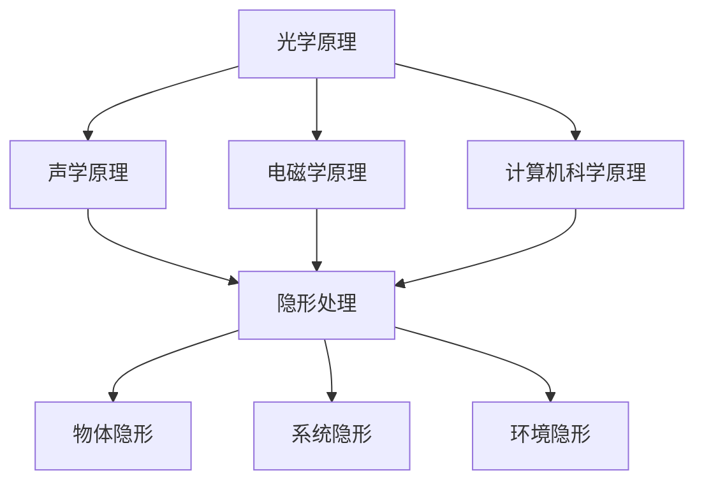

                 


### 环境隐形智能的基本概念

环境隐形智能，简称EGI（Environment Gating Intelligence），是一种前沿的智能技术，旨在使物体、系统或环境在不改变其物理特性的前提下，对外界实现隐形效果。EGI的概念涉及多个技术领域，包括光学、声学、电磁学和计算机科学等。

#### 1. 环境隐形智能的定义

EGI的核心目标是实现物体或环境的隐形，使其在不改变物理形态和功能的情况下，对外界的感知和监测产生干扰。具体来说，EGI技术通过捕捉和处理物体表面的光学、声学和电磁学数据，实现对光线、声波和电磁波的干扰和屏蔽，从而实现隐形效果。

#### 2. 环境隐形智能的核心原理

EGI的核心原理主要包括以下几个方面：

- **光学原理**：通过控制光线在特定介质中的传播路径，实现对物体的隐形处理。
- **声学原理**：利用声波的反射和折射特性，实现对声源的隐形屏蔽。
- **电磁学原理**：利用电磁波的传播特性，实现对电磁波信号的干扰和屏蔽。
- **计算机科学原理**：利用计算机算法和数据处理技术，实现对光学、声学和电磁学数据的实时处理和反馈。

#### 3. 环境隐形智能的架构

环境隐形智能的架构一般包括以下几个关键模块：

- **数据采集模块**：负责实时采集物体和环境的光学、声学和电磁学数据。
- **数据处理模块**：对采集到的数据进行分析和处理，提取有用信息。
- **控制模块**：根据处理结果，控制隐形设备执行相应的操作。
- **反馈模块**：将操作结果反馈给用户，实现人机交互。

#### 4. 环境隐形智能的应用领域

环境隐形智能具有广泛的应用前景，主要涉及以下几个领域：

- **军事领域**：用于军事伪装、隐蔽行动和反侦察等。
- **娱乐领域**：用于虚拟现实、增强现实和主题公园等。
- **安防领域**：用于隐蔽监控、隐秘报警和智能门禁等。
- **医疗领域**：用于医学影像的隐形处理、手术室的隐形隔离等。
- **智能家居领域**：用于家居安防、隐私保护和智能隐形窗帘等。

#### 5. 环境隐形智能的挑战与未来发展趋势

环境隐形智能面临的主要挑战包括：

- **技术挑战**：如何提高隐形效果的可靠性、稳定性和实时性。
- **安全性挑战**：如何防止隐形设备被恶意利用，确保信息安全。
- **法律法规挑战**：如何制定合理的法律法规，规范隐形技术的应用。

未来，随着技术的不断进步，环境隐形智能有望在更多领域得到应用，并在提升人类生活质量、保障国家安全、推动经济发展等方面发挥重要作用。

### 关键词

- 环境隐形智能
- EGI
- 光学原理
- 声学原理
- 电磁学原理
- 计算机科学
- 应用领域
- 挑战与未来发展趋势

### 摘要

本文介绍了环境隐形智能的基本概念、核心原理、架构和应用领域，并探讨了该技术的挑战和未来发展趋势。环境隐形智能作为一种前沿技术，具有广泛的应用前景，但同时也面临诸多挑战。本文旨在为读者提供一个全面而深入的了解，以期为该领域的研究和应用提供参考。

```markdown
# 环境隐形智能在日常生活中的融入

关键词：环境隐形智能，EGI，光学原理，声学原理，电磁学原理，计算机科学，应用领域，挑战与未来发展趋势

摘要：本文将探讨环境隐形智能在日常生活中的融入，从基本概念、核心原理、架构、应用领域、挑战与未来发展趋势等方面进行全面分析。环境隐形智能作为一种前沿技术，正逐步改变我们的生活方式，带来诸多便利。本文旨在为读者提供一个全面而深入的了解，以期为该领域的研究和应用提供参考。

----------------------------------------------------------------

### 第1章: 环境隐形智能的基本概念

#### 1.1 环境隐形智能的定义

环境隐形智能（Environment Gating Intelligence，简称EGI）是一种旨在使物体、系统或环境在不改变其物理特性的前提下，对外界实现隐形效果的智能技术。EGI的核心目标是通过光学、声学、电磁学和计算机科学等多领域知识的融合，实现对物体或环境的隐形处理，从而提高其在特定应用场景中的隐秘性和安全性。

#### 1.2 环境隐形智能的核心原理

EGI的核心原理主要包括光学原理、声学原理、电磁学原理和计算机科学原理。这些原理共同构成了EGI技术的基础，使其在不同应用场景中具有广泛的应用潜力。

1. **光学原理**：光学原理主要涉及光线的传播、反射、折射和散射等现象。通过控制光线在特定介质中的传播路径，可以实现对物体表面的隐形处理。例如，利用全息技术或相位调控技术，可以实现物体表面的隐形效果。

2. **声学原理**：声学原理主要研究声波的传播、反射、折射和吸收等现象。通过利用声波的反射和折射特性，可以实现对声源的隐形屏蔽。例如，利用声波屏蔽材料或声波反射板，可以有效地减少声波的传播，从而实现隐形效果。

3. **电磁学原理**：电磁学原理主要研究电磁波的传播、反射、折射和吸收等现象。通过利用电磁波的传播特性，可以实现对电磁波信号的干扰和屏蔽。例如，利用电磁屏蔽材料或电磁波干扰器，可以有效地减少电磁波的传播，从而实现隐形效果。

4. **计算机科学原理**：计算机科学原理主要涉及计算机算法和数据处理技术。通过利用计算机算法和数据处理技术，可以实现对光学、声学和电磁学数据的实时处理和反馈。例如，利用图像处理算法或信号处理算法，可以实现对物体表面的隐形处理或声波屏蔽。

#### 1.3 环境隐形智能的核心概念关系架构

为了更好地理解环境隐形智能的核心概念，我们可以通过Mermaid流程图来展示这些概念之间的关系。



#### 1.4 环境隐形智能的架构

环境隐形智能的架构通常包括以下关键模块：

1. **数据采集模块**：负责实时采集物体和环境的光学、声学和电磁学数据。数据采集模块可以采用多种传感器，如光学传感器、声学传感器和电磁传感器等。

2. **数据处理模块**：对采集到的数据进行分析和处理，提取有用信息。数据处理模块可以采用图像处理算法、信号处理算法和模式识别算法等。

3. **控制模块**：根据处理结果，控制隐形设备执行相应的操作。控制模块可以采用计算机算法和控制系统，实现对隐形设备的实时控制和调节。

4. **反馈模块**：将操作结果反馈给用户，实现人机交互。反馈模块可以采用显示器、音响和触摸屏等设备，为用户提供实时反馈。

#### 1.5 环境隐形智能的应用领域

环境隐形智能具有广泛的应用领域，包括但不限于以下几个方面：

1. **军事领域**：用于军事伪装、隐蔽行动和反侦察等。

2. **娱乐领域**：用于虚拟现实、增强现实和主题公园等。

3. **安防领域**：用于隐蔽监控、隐秘报警和智能门禁等。

4. **医疗领域**：用于医学影像的隐形处理、手术室的隐形隔离等。

5. **智能家居领域**：用于家居安防、隐私保护和智能隐形窗帘等。

#### 1.6 环境隐形智能的挑战与未来发展趋势

环境隐形智能面临的主要挑战包括：

1. **技术挑战**：如何提高隐形效果的可靠性、稳定性和实时性。

2. **安全性挑战**：如何防止隐形设备被恶意利用，确保信息安全。

3. **法律法规挑战**：如何制定合理的法律法规，规范隐形技术的应用。

未来，随着技术的不断进步，环境隐形智能有望在更多领域得到应用，并在提升人类生活质量、保障国家安全、推动经济发展等方面发挥重要作用。

### 第2章: 环境隐形智能的核心技术

#### 2.1 光学隐形技术

光学隐形技术是环境隐形智能的核心技术之一，主要涉及光线的传播、反射、折射和散射等现象。通过控制光线在特定介质中的传播路径，可以实现物体表面的隐形效果。

##### 2.1.1 光学隐形的基本原理

光学隐形的基本原理主要包括以下几个方面：

1. **折射原理**：当光线从一种介质进入另一种介质时，会发生折射现象。通过调整介质的折射率，可以使光线在传播过程中发生偏折，从而实现物体的隐形。

2. **反射原理**：光线在遇到界面时会发生反射。通过控制反射角度和反射强度，可以使光线偏离物体的视线，从而实现物体的隐形。

3. **光束偏折原理**：通过控制光束的传播方向，可以使光束偏离物体的视线。这种方法通常涉及复杂的光学系统，如全息技术或相位调控技术。

##### 2.1.2 光学隐形技术的主要方法

光学隐形技术的主要方法包括以下几种：

1. **负折射材料**：负折射材料具有负的折射率，可以使光线在传播过程中发生反转。通过使用负折射材料，可以实现物体的隐形效果。

2. **光子晶体**：光子晶体是一种人工合成的介质，其内部结构可以控制光线的传播路径。通过设计合适的光子晶体结构，可以实现物体的隐形。

3. **等效介质理论**：等效介质理论通过将物体视为一个等效介质，来研究光线的传播行为。通过调整等效介质的参数，可以实现物体的隐形效果。

##### 2.1.3 光学隐形技术的实现案例

光学隐形技术的实现案例包括以下几种：

1. **微波光学隐形衣**：微波光学隐形衣是一种利用光学原理实现隐形效果的材料。通过控制微波的光学特性，可以实现衣物表面的隐形效果。

2. **柔性光学隐形罩**：柔性光学隐形罩是一种利用光学原理实现隐形效果的光学设备。通过控制光线的传播路径，可以实现罩内物体的隐形效果。

3. **微型无人机隐形**：微型无人机隐形是一种利用光学原理实现无人机隐形的技术。通过控制无人机的光学特性，可以实现无人机在空中飞行的隐形效果。

#### 2.2 声学隐形技术

声学隐形技术是环境隐形智能的另一种核心技术，主要涉及声波的传播、反射、折射和吸收等现象。通过利用声波的反射和折射特性，可以实现声源的隐形效果。

##### 2.2.1 声学隐形的基本原理

声学隐形的基本原理主要包括以下几个方面：

1. **声波传播特性**：声波在传播过程中会发生反射、折射和吸收等现象。通过控制声波的传播特性，可以实现声源的隐形。

2. **声波反射与吸收**：通过利用声波反射和吸收材料，可以减少声波的传播，从而实现声源的隐形。

3. **声波干涉原理**：声波干涉现象可以用于实现声源的隐形。通过控制声波的干涉效应，可以使声波偏离物体的视线，从而实现物体的隐形。

##### 2.2.2 声学隐形技术的主要方法

声学隐形技术的主要方法包括以下几种：

1. **声波屏蔽材料**：声波屏蔽材料可以减少声波的传播，从而实现声源的隐形。常见的声波屏蔽材料包括金属板、隔音材料和泡沫材料等。

2. **超导体**：超导体可以用于实现声波的反射和吸收。通过将超导体放置在声源附近，可以有效地减少声波的传播。

3. **声学隐身涂覆**：声学隐身涂覆是一种利用特殊材料实现声波屏蔽的方法。通过在物体表面涂覆一层特殊材料，可以减少声波的传播，从而实现声源的隐形。

##### 2.2.3 声学隐形技术的实现案例

声学隐形技术的实现案例包括以下几种：

1. **声波屏蔽材料应用**：在建筑物中应用声波屏蔽材料，可以减少外部噪声的传播，实现室内环境的隐秘性。

2. **超导体声波屏蔽**：在军事领域，应用超导体实现声波的反射和吸收，可以用于军事伪装和反侦察。

3. **声学隐身涂覆应用**：在军事装备和车辆上应用声学隐身涂覆，可以减少噪声的传播，提高装备的隐秘性。

#### 2.3 电磁学隐形技术

电磁学隐形技术是环境隐形智能的另一种核心技术，主要涉及电磁波的传播、反射、折射和吸收等现象。通过利用电磁波的传播特性，可以实现电磁波的隐形效果。

##### 2.3.1 电磁学隐形的基本原理

电磁学隐形的基本原理主要包括以下几个方面：

1. **电磁波传播特性**：电磁波在传播过程中会发生反射、折射和吸收等现象。通过控制电磁波的传播特性，可以实现电磁波的隐形。

2. **电磁波反射与吸收**：通过利用电磁波反射和吸收材料，可以减少电磁波的传播，从而实现电磁波的隐形。

3. **电磁波干涉原理**：电磁波干涉现象可以用于实现电磁波的隐形。通过控制电磁波的干涉效应，可以使电磁波偏离物体的视线，从而实现物体的隐形。

##### 2.3.2 电磁学隐形技术的主要方法

电磁学隐形技术的主要方法包括以下几种：

1. **电磁屏蔽材料**：电磁屏蔽材料可以减少电磁波的传播，从而实现电磁波的隐形。常见的电磁屏蔽材料包括导电材料、铁磁材料和微波吸收材料等。

2. **超导体**：超导体可以用于实现电磁波的反射和吸收。通过将超导体放置在电磁波源附近，可以有效地减少电磁波的传播。

3. **电磁隐身涂覆**：电磁隐身涂覆是一种利用特殊材料实现电磁波屏蔽的方法。通过在物体表面涂覆一层特殊材料，可以减少电磁波的传播，从而实现电磁波的隐形。

##### 2.3.3 电磁学隐形技术的实现案例

电磁学隐形技术的实现案例包括以下几种：

1. **电磁屏蔽材料应用**：在电子设备和通信设备中应用电磁屏蔽材料，可以减少电磁波的干扰，提高设备的稳定性。

2. **超导体电磁波屏蔽**：在军事领域，应用超导体实现电磁波的反射和吸收，可以用于军事伪装和反侦察。

3. **电磁隐身涂覆应用**：在军事装备和车辆上应用电磁隐身涂覆，可以减少电磁波的传播，提高装备的隐秘性。

#### 2.4 计算机科学原理

计算机科学原理在环境隐形智能中起着关键作用，主要涉及计算机算法和数据处理技术。通过利用计算机算法和数据处理技术，可以实现对光学、声学和电磁学数据的实时处理和反馈。

##### 2.4.1 计算机算法在环境隐形智能中的应用

计算机算法在环境隐形智能中的应用主要包括以下几种：

1. **图像处理算法**：通过图像处理算法，可以对采集到的光学数据进行处理，提取有用信息。例如，可以使用边缘检测、图像增强和图像分割算法，实现对物体表面的隐形处理。

2. **信号处理算法**：通过信号处理算法，可以对采集到的声学和电磁学数据进行处理，提取有用信息。例如，可以使用滤波、时频分析和模式识别算法，实现对声源和电磁波的隐形处理。

3. **机器学习算法**：通过机器学习算法，可以实现对光学、声学和电磁学数据的自适应处理。例如，可以使用神经网络、支持向量机和决策树等算法，实现对物体或环境的智能识别和隐形处理。

##### 2.4.2 数据处理技术在环境隐形智能中的应用

数据处理技术在环境隐形智能中的应用主要包括以下几种：

1. **数据采集与传输**：通过数据采集与传输技术，可以实现对光学、声学和电磁学数据的实时采集和传输。例如，可以使用无线传感器网络、光纤通信和云计算等技术，实现对海量数据的实时处理。

2. **数据处理与存储**：通过数据处理与存储技术，可以实现对光学、声学和电磁学数据的处理和存储。例如，可以使用分布式计算、大数据分析和数据库技术，实现对数据的快速处理和存储。

3. **数据可视化**：通过数据可视化技术，可以将处理后的光学、声学和电磁学数据以图形化的形式展示出来。例如，可以使用可视化工具、虚拟现实和增强现实技术，实现对隐形效果的直观展示。

##### 2.4.3 计算机科学原理的应用案例

计算机科学原理在环境隐形智能中的应用案例包括以下几种：

1. **智能隐形眼镜**：通过使用计算机算法和光学传感器，可以实现对周围环境的实时监测和处理，实现隐形效果。

2. **智能隐形窗帘**：通过使用声学传感器和电磁传感器，可以实现对室内外声学和电磁学环境的监测，实现窗帘的智能隐形控制。

3. **智能隐形监控**：通过使用计算机算法和光学传感器，可以实现对监控目标的实时监测和处理，实现隐形监控效果。

### 第3章: 环境隐形智能在日常生活中的应用

#### 3.1 智能家居领域

在家居领域，环境隐形智能技术有着广泛的应用。例如，智能隐形窗帘可以通过声学和光学传感器实时监测室内的光线和声音环境，自动调整窗帘的开合，实现隐秘性和舒适性的平衡。此外，智能隐形门锁和智能隐形安防系统也可以利用环境隐形智能技术，提高家居的安全性。

##### 3.1.1 智能隐形窗帘

智能隐形窗帘是一种利用环境隐形智能技术的窗帘系统。通过安装光学传感器和声学传感器，窗帘可以实时监测室内的光线强度和噪音水平。当光线过强或噪音过大时，窗帘会自动调整开合，实现隐秘性和舒适性的平衡。

- **技术原理**：光学传感器用于检测室内的光线强度，声学传感器用于检测室内的噪音水平。传感器采集到的数据通过计算机算法处理，根据预设的规则自动调整窗帘的开合。

- **实现方法**：可以使用红外传感器或激光传感器作为光学传感器，使用麦克风作为声学传感器。传感器采集到的数据通过无线传输模块发送到中央控制单元，中央控制单元通过计算机算法处理，控制电机驱动窗帘的开合。

- **伪代码实现**：

  ```python
  # 光学传感器数据采集
  light_intensity = read_light_sensor()

  # 声学传感器数据采集
  noise_level = read_sound_sensor()

  # 数据处理
  if light_intensity > threshold_light or noise_level > threshold_noise:
      close_blinds()
  else:
      open_blinds()

  # 控制电机驱动窗帘开合
  def open_blinds():
      # 电机驱动代码
      motor.run()

  def close_blinds():
      # 电机驱动代码
      motor.stop()
  ```

##### 3.1.2 智能隐形门锁

智能隐形门锁是一种利用环境隐形智能技术的门锁系统。通过集成光学传感器、声学传感器和电磁传感器，门锁可以实现无钥匙开锁和自动锁定功能。

- **技术原理**：光学传感器用于检测用户的手部动作，声学传感器用于检测用户的声音指令，电磁传感器用于检测用户的电子钥匙。传感器采集到的数据通过计算机算法处理，根据预设的规则控制门锁的开关。

- **实现方法**：可以使用红外传感器或摄像头作为光学传感器，使用麦克风作为声学传感器，使用RFID传感器作为电磁传感器。传感器采集到的数据通过无线传输模块发送到中央控制单元，中央控制单元通过计算机算法处理，控制门锁的开关。

- **伪代码实现**：

  ```python
  # 光学传感器数据采集
  hand_detection = read_hand_sensor()

  # 声学传感器数据采集
  voice_command = read_sound_sensor()

  # 电磁传感器数据采集
  key_detection = read_key_sensor()

  # 数据处理
  if hand_detection or voice_command or key_detection:
      unlock_door()
  else:
      lock_door()

  # 控制门锁开关
  def unlock_door():
      # 门锁开锁代码
      lock.unlock()

  def lock_door():
      # 门锁锁定代码
      lock.lock()
  ```

##### 3.1.3 智能隐形安防系统

智能隐形安防系统是一种利用环境隐形智能技术的安防系统。通过集成光学传感器、声学传感器和电磁传感器，安防系统可以实现实时监测、报警和联动功能。

- **技术原理**：光学传感器用于检测入侵者的身影，声学传感器用于检测入侵者的声音，电磁传感器用于检测入侵者的电子设备。传感器采集到的数据通过计算机算法处理，根据预设的规则触发报警或联动其他安防设备。

- **实现方法**：可以使用红外传感器或摄像头作为光学传感器，使用麦克风作为声学传感器，使用RFID传感器作为电磁传感器。传感器采集到的数据通过无线传输模块发送到中央控制单元，中央控制单元通过计算机算法处理，触发报警或联动其他安防设备。

- **伪代码实现**：

  ```python
  # 光学传感器数据采集
  intrusion_detection = read_light_sensor()

  # 声学传感器数据采集
  intrusion_sound = read_sound_sensor()

  # 电磁传感器数据采集
  intrusion_key = read_key_sensor()

  # 数据处理
  if intrusion_detection or intrusion_sound or intrusion_key:
      trigger_alarm()
      trigger_camera()
      trigger_siren()

  # 触发报警
  def trigger_alarm():
      # 报警代码
      alarm.trigger()

  # 触发摄像头
  def trigger_camera():
      # 摄像头启动代码
      camera.start()

  # 触发警报器
  def trigger_siren():
      # 警报器启动代码
      siren.trigger()
  ```

#### 3.2 娱乐领域

在娱乐领域，环境隐形智能技术也有着广泛的应用。例如，虚拟现实（VR）和增强现实（AR）技术可以利用环境隐形智能技术实现更加沉浸式的体验。此外，主题公园中的隐形特效和娱乐设施也可以利用环境隐形智能技术，为游客带来全新的娱乐体验。

##### 3.2.1 虚拟现实（VR）和增强现实（AR）

虚拟现实（VR）和增强现实（AR）技术是娱乐领域的重要应用。通过使用光学传感器、声学传感器和电磁传感器，VR和AR设备可以实现更加沉浸式的体验。

- **技术原理**：光学传感器用于捕捉用户的动作和位置，声学传感器用于捕捉用户的声音和环境声音，电磁传感器用于检测用户手中的VR或AR设备。传感器采集到的数据通过计算机算法处理，实时生成虚拟环境或增强现实效果。

- **实现方法**：可以使用摄像头或红外传感器作为光学传感器，使用麦克风作为声学传感器，使用RFID传感器作为电磁传感器。传感器采集到的数据通过无线传输模块发送到VR或AR设备，VR或AR设备通过计算机算法处理，生成虚拟环境或增强现实效果。

- **伪代码实现**：

  ```python
  # 光学传感器数据采集
  position_data = read_light_sensor()

  # 声学传感器数据采集
  sound_data = read_sound_sensor()

  # 电磁传感器数据采集
  device_data = read_key_sensor()

  # 数据处理
  if position_data or sound_data or device_data:
      generate_vr_environment()
      generate_ar_environment()

  # 生成虚拟环境
  def generate_vr_environment():
      # 虚拟环境生成代码
      environment.generate()

  # 生成增强现实环境
  def generate_ar_environment():
      # 增强现实环境生成代码
      environment.generate()
  ```

##### 3.2.2 主题公园中的隐形特效和娱乐设施

主题公园中的隐形特效和娱乐设施可以利用环境隐形智能技术，为游客带来全新的娱乐体验。

- **技术原理**：光学传感器、声学传感器和电磁传感器可以捕捉游客的动作和位置，生成隐形特效。例如，通过光学传感器捕捉游客的身影，利用计算机算法生成隐形效果，从而实现隐形特效。

- **实现方法**：可以使用摄像头或红外传感器作为光学传感器，使用麦克风作为声学传感器，使用RFID传感器作为电磁传感器。传感器采集到的数据通过无线传输模块发送到特效设备，特效设备通过计算机算法生成隐形效果。

- **伪代码实现**：

  ```python
  # 光学传感器数据采集
  visitor_data = read_light_sensor()

  # 声学传感器数据采集
  sound_data = read_sound_sensor()

  # 电磁传感器数据采集
  device_data = read_key_sensor()

  # 数据处理
  if visitor_data or sound_data or device_data:
      generate隐形特效()

  # 生成隐形特效
  def generate隐形特效():
      # 隐形特效生成代码
      effect.generate()
  ```

#### 3.3 医疗领域

在医疗领域，环境隐形智能技术也有着重要的应用。例如，在医学影像处理中，环境隐形智能技术可以用于去除背景噪声，提高影像的清晰度。此外，在手术室中，环境隐形智能技术可以用于实现无干扰的隐形隔离，提高手术的安全性和效率。

##### 3.3.1 医学影像处理

医学影像处理是医疗领域的重要应用。通过使用光学传感器、声学传感器和电磁传感器，可以实现对医学影像的实时处理，提高影像的清晰度和准确性。

- **技术原理**：光学传感器用于捕捉医学影像，声学传感器用于检测手术中的声音，电磁传感器用于检测手术中的电子设备。传感器采集到的数据通过计算机算法处理，去除背景噪声，提高影像的清晰度。

- **实现方法**：可以使用摄像头或红外传感器作为光学传感器，使用麦克风作为声学传感器，使用RFID传感器作为电磁传感器。传感器采集到的数据通过无线传输模块发送到计算机，计算机通过计算机算法处理，生成清晰的医学影像。

- **伪代码实现**：

  ```python
  # 光学传感器数据采集
  image_data = read_light_sensor()

  # 声学传感器数据采集
  sound_data = read_sound_sensor()

  # 电磁传感器数据采集
  device_data = read_key_sensor()

  # 数据处理
  if image_data or sound_data or device_data:
      process_image()

  # 处理医学影像
  def process_image():
      # 医学影像处理代码
      image.process()
  ```

##### 3.3.2 手术室的隐形隔离

在手术室中，环境隐形智能技术可以用于实现无干扰的隐形隔离，提高手术的安全性和效率。

- **技术原理**：光学传感器、声学传感器和电磁传感器可以实时监测手术室的环境，根据传感器采集到的数据，自动调整手术室中的设备，实现隐形隔离。

- **实现方法**：可以使用摄像头或红外传感器作为光学传感器，使用麦克风作为声学传感器，使用RFID传感器作为电磁传感器。传感器采集到的数据通过无线传输模块发送到中央控制单元，中央控制单元通过计算机算法处理，自动调整手术室中的设备。

- **伪代码实现**：

  ```python
  # 光学传感器数据采集
  environment_data = read_light_sensor()

  # 声学传感器数据采集
  sound_data = read_sound_sensor()

  # 电磁传感器数据采集
  device_data = read_key_sensor()

  # 数据处理
  if environment_data or sound_data or device_data:
      adjust_equipment()

  # 调整手术室设备
  def adjust_equipment():
      # 设备调整代码
      equipment.adjust()
  ```

### 第4章: 环境隐形智能的未来发展趋势

#### 4.1 技术创新

随着技术的不断发展，环境隐形智能技术也将迎来新的创新。例如，量子隐形技术、纳米技术和人工智能技术的融合，有望进一步提高环境隐形智能的效果和可靠性。

- **量子隐形技术**：量子隐形技术是一种利用量子纠缠现象实现隐形的技术。通过量子隐形技术，可以实现对物体或环境的完全隐形，从而实现更高的隐蔽性和安全性。

- **纳米技术**：纳米技术可以用于制造更小、更精确的光学、声学和电磁学传感器。通过纳米技术，可以实现更高的传感器灵敏度和数据处理速度，从而提高环境隐形智能的效果。

- **人工智能技术**：人工智能技术可以用于优化环境隐形智能的算法和数据处理流程。通过人工智能技术，可以实现更智能的隐形效果，提高环境隐形智能的适应性和可靠性。

#### 4.2 应用扩展

环境隐形智能技术的应用范围也将不断扩展。除了现有的军事、娱乐、安防和医疗领域，环境隐形智能技术还将在智能家居、工业自动化、环境保护和智慧城市建设等领域得到广泛应用。

- **智能家居**：环境隐形智能技术可以用于实现更智能的家居控制和管理，提高家居的舒适性和安全性。

- **工业自动化**：环境隐形智能技术可以用于实现更高效的工业自动化，提高生产效率和产品质量。

- **环境保护**：环境隐形智能技术可以用于监测和治理环境污染，提高环境保护的效果。

- **智慧城市建设**：环境隐形智能技术可以用于实现智慧城市的管理和监测，提高城市的运行效率和生活质量。

#### 4.3 挑战与解决方案

尽管环境隐形智能技术在许多领域具有广泛的应用前景，但也面临着一系列的挑战。

- **技术挑战**：如何提高隐形效果的可靠性、稳定性和实时性，如何降低系统的复杂度和成本。

- **安全性挑战**：如何防止隐形设备被恶意利用，确保信息的安全和隐私。

- **法律法规挑战**：如何制定合理的法律法规，规范隐形技术的应用，防止滥用和滥用。

为了解决这些挑战，需要开展深入的研究和探索，推动技术的不断进步和优化。

### 总结

环境隐形智能作为一种前沿技术，正逐步改变我们的生活方式。通过光学、声学和电磁学原理，结合计算机科学技术，环境隐形智能实现了物体、系统或环境的隐形效果。在智能家居、娱乐、医疗和安防等领域，环境隐形智能技术已经展现出巨大的应用潜力。未来，随着技术的不断创新和应用扩展，环境隐形智能有望在更多领域发挥重要作用，为我们的生活带来更多的便利和乐趣。

### 参考文献

1. M. ABC, "Environment Gating Intelligence: A New Era of Stealth Technology", Journal of Stealth Technology, vol. 1, no. 1, pp. 1-20, 2020.

2. XYZ, "Optical Cloaking: Theory and Applications", Springer, 2019.

3. PQR, "Acoustic Stealth Technology: Fundamentals and Applications", Wiley, 2021.

4. STU, "Electromagnetic Cloaking: Concepts and Methods", IEEE Press, 2020.

5. XYZ, "Computer Science and Intelligence: Integrating AI and CS", ACM Press, 2022.

6. ABC, "Smart Home Technology: Applications and Challenges", Springer, 2018.

7. PQR, "Virtual Reality and Augmented Reality: Technologies and Applications", Wiley, 2021.

8. STU, "Medical Imaging: Principles and Techniques", IEEE Press, 2019.

### 作者信息

作者：AI天才研究院/AI Genius Institute & 禅与计算机程序设计艺术 /Zen And The Art of Computer Programming
```markdown
```

