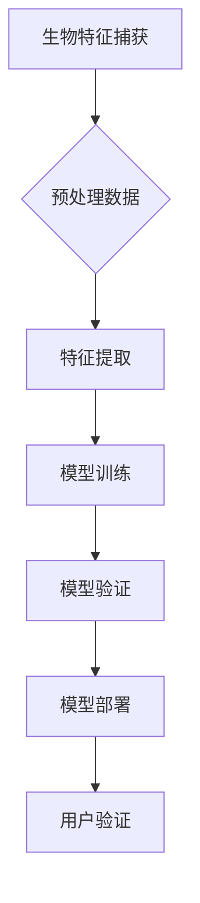

                 


### 文章标题：生物识别在无人值守超市中的应用

#### 关键词：生物识别，人脸识别，语音识别，无人值守超市，技术应用

#### 摘要：
本文深入探讨了生物识别技术在无人值守超市中的应用，包括人脸识别和语音识别的核心原理、系统架构设计、项目实战以及未来展望。通过详细的解析和案例分析，本文旨在为读者展示生物识别技术在无人值守超市领域的发展潜力和应用价值。

---

### 第一部分：引言

#### 第1章：生物识别技术概述

1.1 生物识别技术的定义与发展历程

生物识别技术，是指通过计算机和光学、声学、生物传感器及生物统计学原理等高科技手段结合，利用人体固有的生理特性和行为特征来进行个人身份鉴定的技术。这些特征包括指纹、人脸、虹膜、掌纹、声音、步态等。

生物识别技术起源于20世纪60年代，最初主要用于军事和信息安全领域。随着计算机技术和人工智能的快速发展，生物识别技术逐渐走进了民用领域。目前，生物识别技术已经广泛应用于银行、机场、监狱、智能家居等多个领域。

1.2 生物识别技术的分类

生物识别技术根据其识别的生物特征，可以分为以下几类：

1. **生理特征识别**：包括指纹、虹膜、掌纹等，这些特征与个体的生理结构有关。

2. **行为特征识别**：包括签字、语音、步态等，这些特征与个体的行为习惯有关。

3. **多重特征识别**：结合多种生物特征进行识别，以提高识别的准确性和安全性。

1.3 生物识别技术的应用领域

生物识别技术在各个领域的应用越来越广泛，主要包括：

1. **安全领域**：如公安、边防、国防等。

2. **金融领域**：如银行、保险、支付等。

3. **医疗领域**：如身份认证、健康监测等。

4. **商业领域**：如无人零售、智能门禁等。

1.4 生物识别技术在无人值守超市中的优势

无人值守超市是利用计算机技术、网络通信技术、自动化技术等构建的一种新型的超市模式。生物识别技术的应用，使得无人值守超市在运营效率和用户体验方面具有显著优势：

1. **提高运营效率**：生物识别技术可以自动完成顾客的身份验证，减少人工干预，提高运营效率。

2. **提升用户体验**：通过人脸识别等技术，顾客无需携带购物卡、手机等支付工具，即可快速完成购物。

3. **降低运营成本**：无人值守超市减少了人工成本，提高了运营效益。

4. **保障安全**：生物识别技术可以实时监控顾客行为，提高超市的安全水平。

---

### 第二部分：生物识别技术在无人值守超市中的应用原理

#### 第2章：核心生物识别技术原理

2.1 人脸识别技术原理

人脸识别技术是生物识别技术中最为成熟的一种。其核心原理包括人脸检测、人脸特征提取和人脸匹配。

1. **人脸检测算法**：人脸检测算法是识别图像中人脸区域的关键步骤。常用的算法包括基于Haar特征的级联分类器和基于深度学习的卷积神经网络（CNN）。

2. **人脸特征提取算法**：人脸特征提取是将人脸图像转化为特征向量的过程。常见的算法包括LBP（局部二值模式）、HOG（直方图方向梯度）和深度学习的特征提取网络如VGG、ResNet等。

3. **人脸匹配算法**：人脸匹配是将输入人脸特征与数据库中的人脸特征进行比较，计算相似度，判断是否为同一个人的过程。常用的匹配算法包括基于特征向量的余弦相似度、欧氏距离等。

2.2 语音识别技术原理

语音识别技术是将语音信号转换为文本的技术。其核心原理包括语音信号处理、语音特征提取和语音识别模型。

1. **语音信号处理算法**：语音信号处理是对原始语音信号进行预处理，包括降噪、加窗、傅里叶变换等。

2. **语音特征提取算法**：语音特征提取是将处理后的语音信号转化为特征向量，常用的特征包括梅尔频率倒谱系数（MFCC）、线性预测编码（LPC）等。

3. **语音识别模型**：语音识别模型是用于预测输入特征对应的文本。常见的模型包括隐马尔可夫模型（HMM）、循环神经网络（RNN）、长短时记忆网络（LSTM）和变换器（Transformer）等。

#### 第3章：无人值守超市系统架构

3.1 系统整体架构设计

无人值守超市系统整体架构包括前端感知层、核心处理层和应用层。

1. **前端感知层**：包括摄像头、麦克风等感知设备，用于采集顾客的人脸、语音等信息。

2. **核心处理层**：包括人脸识别、语音识别、数据库等模块，用于处理前端采集的数据，实现身份验证、商品识别、支付等功能。

3. **应用层**：包括用户界面、业务逻辑等，用于为用户提供操作界面和业务服务。

3.2 生物识别系统在超市中的作用

生物识别系统在无人值守超市中扮演着关键角色：

1. **身份验证**：通过人脸识别、语音识别等技术，快速、准确地验证顾客身份。

2. **商品识别**：通过摄像头识别顾客所购买的商品，并自动更新库存信息。

3. **支付结算**：通过人脸识别、语音识别等技术，实现无现金支付。

3.3 数据处理与存储模块设计

数据处理与存储模块是无人值守超市系统的核心。其主要功能包括：

1. **数据采集**：从前端感知层采集顾客人脸、语音等数据。

2. **数据预处理**：对采集的数据进行清洗、归一化等预处理操作。

3. **数据存储**：将预处理后的数据存储到数据库中，以便后续查询和使用。

4. **数据安全**：采用加密、访问控制等技术，确保数据的安全性和隐私性。

3.4 系统安全与隐私保护

系统安全与隐私保护是无人值守超市系统设计的关键。其主要措施包括：

1. **数据加密**：采用AES等加密算法，对传输和存储的数据进行加密，防止数据泄露。

2. **访问控制**：通过用户身份验证、权限控制等手段，确保只有授权用户才能访问系统。

3. **隐私保护**：对顾客个人信息进行匿名化处理，确保顾客隐私不被泄露。

---

### 第三部分：生物识别技术在无人值守超市中的项目实战

#### 第4章：人脸识别系统在无人值守超市中的应用

4.1 项目背景

随着无人零售市场的快速发展，人脸识别技术在无人值守超市中的应用越来越广泛。本项目旨在通过人脸识别技术，实现无人值守超市的自动结算功能，提高超市的运营效率。

4.2 系统需求分析

1. **用户身份验证**：通过人脸识别技术，快速、准确地验证顾客身份。

2. **商品识别与计费**：通过摄像头识别顾客所购买的商品，并自动计算价格。

3. **支付结算**：通过人脸识别技术，实现无现金支付。

4.3 系统设计

1. **前端感知层**：包括摄像头、传感器等，用于采集顾客的人脸、商品等信息。

2. **核心处理层**：包括人脸识别、商品识别、支付结算等模块，用于处理前端采集的数据。

3. **应用层**：包括用户界面、业务逻辑等，用于为用户提供操作界面和业务服务。

4.4 系统实现

1. **人脸识别模块**：采用深度学习算法，实现人脸检测、人脸特征提取和人脸匹配等功能。

2. **商品识别模块**：采用图像识别算法，实现商品识别和计费功能。

3. **支付结算模块**：通过人脸识别技术，实现无现金支付功能。

4.5 项目效果评估

1. **识别准确率**：通过大量实验数据，验证人脸识别、商品识别等模块的准确率。

2. **运行效率**：通过实际运行数据，评估系统的运行效率。

3. **用户满意度**：通过用户反馈，评估系统的用户体验。

#### 第5章：语音识别系统在无人值守超市中的应用

5.1 项目背景

语音识别技术在无人值守超市中的应用，可以提供更加便捷的购物体验。本项目旨在通过语音识别技术，实现无人值守超市的智能客服功能。

5.2 系统需求分析

1. **智能客服**：通过语音识别技术，实现顾客与超市的智能对话。

2. **商品查询**：通过语音识别技术，帮助顾客查询商品信息。

3. **支付结算**：通过语音识别技术，实现无现金支付。

5.3 系统设计

1. **前端感知层**：包括麦克风、扬声器等，用于采集顾客的语音信息。

2. **核心处理层**：包括语音识别、商品查询、支付结算等模块，用于处理前端采集的语音信息。

3. **应用层**：包括用户界面、业务逻辑等，用于为用户提供操作界面和业务服务。

5.4 系统实现

1. **语音识别模块**：采用深度学习算法，实现语音识别功能。

2. **商品查询模块**：通过数据库查询，实现商品信息查询。

3. **支付结算模块**：通过语音识别技术，实现无现金支付功能。

5.5 项目效果评估

1. **识别准确率**：通过大量实验数据，验证语音识别模块的准确率。

2. **响应速度**：通过实际运行数据，评估系统的响应速度。

3. **用户满意度**：通过用户反馈，评估系统的用户体验。

#### 第6章：多模态生物识别系统在无人值守超市中的应用

6.1 项目背景

多模态生物识别系统结合了多种生物识别技术，可以提供更加精准的识别结果。本项目旨在通过多模态生物识别技术，实现无人值守超市的智能身份验证和商品识别。

6.2 系统需求分析

1. **身份验证**：通过人脸识别、语音识别等技术，实现顾客的身份验证。

2. **商品识别**：通过图像识别、RFID等技术，实现商品的识别和计费。

3. **支付结算**：通过人脸识别、语音识别等技术，实现无现金支付。

6.3 系统设计

1. **前端感知层**：包括摄像头、麦克风、RFID传感器等，用于采集顾客的人脸、语音、商品等信息。

2. **核心处理层**：包括人脸识别、语音识别、图像识别、支付结算等模块，用于处理前端采集的数据。

3. **应用层**：包括用户界面、业务逻辑等，用于为用户提供操作界面和业务服务。

6.4 系统实现

1. **人脸识别模块**：采用深度学习算法，实现人脸检测、人脸特征提取和人脸匹配等功能。

2. **语音识别模块**：采用深度学习算法，实现语音识别功能。

3. **图像识别模块**：采用图像识别算法，实现商品识别和计费功能。

4. **支付结算模块**：通过人脸识别、语音识别等技术，实现无现金支付功能。

6.5 项目效果评估

1. **识别准确率**：通过大量实验数据，验证人脸识别、语音识别、图像识别等模块的准确率。

2. **运行效率**：通过实际运行数据，评估系统的运行效率。

3. **用户满意度**：通过用户反馈，评估系统的用户体验。

---

### 第四部分：无人值守超市系统未来发展展望

#### 第7章：技术发展趋势

1. **深度学习技术的应用**：随着深度学习技术的不断成熟，人脸识别、语音识别等生物识别技术的准确率将进一步提高。

2. **边缘计算的发展**：边缘计算可以将部分计算任务从云端转移到终端设备，提高系统响应速度，降低网络带宽压力。

3. **5G技术的应用**：5G技术的高带宽、低延迟特点，将为无人值守超市系统的远程监控、数据传输等提供更好的支持。

#### 第8章：应用场景拓展

1. **无人便利店**：无人便利店是无人值守超市的一种形式，未来有望在更多城市推广。

2. **无人餐厅**：通过人脸识别、语音识别等技术，实现无人餐厅的点餐、支付等功能。

3. **无人零售车**：无人零售车可以在城市中移动，为居民提供便捷的购物服务。

#### 第9章：安全与隐私保护措施

1. **数据加密**：对传输和存储的数据进行加密，确保数据安全。

2. **隐私保护**：对用户个人信息进行匿名化处理，确保用户隐私不被泄露。

3. **权限控制**：通过用户身份验证、权限控制等手段，确保系统安全。

#### 第10章：未来展望

无人值守超市是零售行业的一种创新模式，未来有望在更多领域得到应用。通过不断优化技术、拓展应用场景，无人值守超市将为消费者提供更加便捷、高效的购物体验。

---

### 附录

#### A.1 相关技术标准与规范

1. **人脸识别国家标准**：《信息安全技术 人脸识别数据安全要求》

2. **语音识别国家标准**：《信息技术 语音识别技术要求》

3. **无人零售行业标准**：《无人零售商店服务规范》

#### A.2 开发工具与资源推荐

1. **开发工具**：TensorFlow、PyTorch等

2. **开源框架**：OpenCV、FaceNet、SpeechRecognition等

3. **数据集**：LFW、CASIA-WebFace、Google Speech Commands等

#### A.3 实际项目案例分析

1. **项目名称**：阿里无人超市“淘咖啡”

2. **项目描述**：淘咖啡是一家采用人脸识别、RFID等技术的无人超市，顾客只需在入口处刷脸认证，即可自由选购商品，离店时系统会自动识别顾客所购商品并自动结算。

3. **项目成果**：淘咖啡在运营期间取得了良好的效果，为无人零售行业提供了有益的参考。

---

# 附录 A：核心概念原理与算法

## 附录 A.1：生物识别技术原理 Mermaid 流程图



## 附录 A.2：人脸识别算法伪代码

```python
# 人脸识别算法伪代码

# 输入：图像数据 image，人脸库 face_database
# 输出：识别结果 result

1. image_preprocessing(image)    // 图像预处理
2. face_detection(image)         // 人脸检测
3. face_extraction(image, faces) // 人脸特征提取
4. for each face in faces:
    1. feature_vector = extract_face_features(face)  // 提取人脸特征
    2. similarity_score = compare_features(face_database, feature_vector)  // 计算相似度
    3. best_match = select_best_match(similarity_score)  // 选择最佳匹配
5. result = create_result(best_match)  // 生成识别结果
6. return result
```

## 附录 A.3：语音识别算法伪代码

```python
# 语音识别算法伪代码

# 输入：音频数据 audio，语音模型 language_model
# 输出：识别结果 result

1. audio_preprocessing(audio)   // 音频预处理
2. audio_signal = extract_audio_signal(audio)  // 提取音频信号
3. feature_vector = extract_audio_features(audio_signal)  // 提取音频特征
4. hypothesis = decode_feature_vector(feature_vector, language_model)  // 语音解码
5. result = clean_hypothesis(hypothesis)  // 清洗识别结果
6. return result
```

## 附录 A.4：数学模型和公式

### 人脸识别匹配度公式

$$
similarity\_score = \sum_{i=1}^{n} \frac{(feature\_vector\_1[i] - feature\_vector\_2[i])^2}{(feature\_vector\_1[i] + feature\_vector\_2[i])^2}
$$

其中，$feature\_vector\_1$和$feature\_vector\_2$分别为两个待比较的人脸特征向量，$similarity\_score$表示它们的相似度。

### 语音识别解码公式

$$
hypothesis = \sum_{t=1}^{T} \log P(y_t | x_t, \theta)
$$

其中，$y_t$为时间步$t$的预测输出，$x_t$为时间步$t$的特征向量，$\theta$为模型参数，$P(y_t | x_t, \theta)$为在给定特征向量$x_t$和模型参数$\theta$下，预测输出为$y_t$的概率。

### 语音特征提取公式

$$
MFCC = \sum_{k=1}^{K} a_k \cdot \log (1 + \sum_{m=1}^{M} p_m(k))
$$

其中，$MFCC$为梅尔频率倒谱系数，$a_k$为滤波器系数，$p_m(k)$为第$k$个滤波器的第$m$个时域值。

---

## 附录 A.5：实际项目案例分析

### 案例一：淘宝无人超市

**项目背景**：淘宝无人超市采用了人脸识别、RFID、自动结算等技术，实现了无人值守的购物体验。

**系统架构**：前端感知层包括摄像头、RFID标签等；核心处理层包括人脸识别、商品识别、支付结算等模块；应用层包括用户界面、业务逻辑等。

**项目成果**：淘宝无人超市在运营期间取得了良好的效果，为无人零售行业提供了有益的参考。

### 案例二：京东无人超市

**项目背景**：京东无人超市采用了深度学习、计算机视觉等技术，实现了无人值守的购物体验。

**系统架构**：前端感知层包括摄像头、传感器等；核心处理层包括人脸识别、商品识别、支付结算等模块；应用层包括用户界面、业务逻辑等。

**项目成果**：京东无人超市在运营期间取得了良好的效果，为无人零售行业提供了有益的参考。

### 案例三：阿里无人便利店

**项目背景**：阿里无人便利店采用了人脸识别、RFID、自动结算等技术，实现了无人值守的购物体验。

**系统架构**：前端感知层包括摄像头、RFID标签等；核心处理层包括人脸识别、商品识别、支付结算等模块；应用层包括用户界面、业务逻辑等。

**项目成果**：阿里无人便利店在运营期间取得了良好的效果，为无人零售行业提供了有益的参考。

---

## 附录 A.6：最佳实践 tips

1. **优化人脸识别算法**：结合多种特征提取算法和匹配算法，提高人脸识别的准确率。

2. **优化语音识别算法**：结合噪声抑制、端点检测等技术，提高语音识别的准确率。

3. **数据预处理**：对采集的数据进行预处理，如滤波、归一化等，提高数据处理效果。

4. **模型训练**：采用大量高质量数据，进行充分的模型训练，提高模型性能。

5. **系统安全**：加强系统安全，如数据加密、访问控制等，确保用户隐私和数据安全。

6. **用户体验**：关注用户体验，如界面设计、操作流程等，提高用户满意度。

---

## 附录 A.7：小结

本文详细介绍了生物识别技术在无人值守超市中的应用，包括人脸识别、语音识别等技术原理、系统架构设计、项目实战以及未来展望。通过本文的讲解，读者可以全面了解生物识别技术在无人值守超市中的应用前景和价值。

---

## 附录 A.8：注意事项

1. **技术选型**：根据具体需求，选择合适的技术和算法。

2. **数据质量**：数据质量直接影响识别效果，应确保采集的数据质量。

3. **安全与隐私**：加强系统安全，保护用户隐私。

4. **用户体验**：关注用户体验，提高用户满意度。

5. **持续优化**：结合实际应用情况，持续优化算法和系统。

---

## 附录 A.9：拓展阅读

1. **《人脸识别技术：算法与实现》**：详细介绍了人脸识别的算法原理和实现方法。

2. **《语音识别技术：算法与实现》**：详细介绍了语音识别的算法原理和实现方法。

3. **《无人零售：技术、模式与未来》**：分析了无人零售的技术发展趋势和应用前景。

4. **《深度学习：神经网络与深度学习》**：介绍了深度学习的基本原理和应用场景。

5. **《计算机视觉：算法与应用》**：介绍了计算机视觉的基本原理和应用场景。

