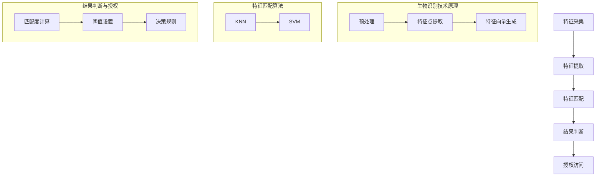

                 

### 文章标题：生物识别在移动设备解锁中的应用

> 关键词：生物识别，移动设备，解锁，安全性，用户体验

> 摘要：本文旨在探讨生物识别技术在移动设备解锁中的应用，通过介绍生物识别技术的基本原理、移动设备解锁机制以及生物识别与移动设备解锁的融合，详细分析其在提高设备安全性和优化用户体验方面的作用。同时，通过具体案例和算法实现，展示生物识别技术在移动设备解锁中的实际应用效果，并对未来发展趋势进行展望。

### 引言

随着科技的不断发展，移动设备已经成为了人们日常生活中不可或缺的一部分。智能手机、平板电脑等设备广泛应用于社交、办公、娱乐等多个领域。然而，随着设备重要性的提升，安全性问题也日益凸显。传统的解锁方式，如密码、图案等，虽然在一定程度上保障了设备的安全性，但也存在诸多弊端，如易遗忘、易破解等。因此，寻找更安全、更便捷的解锁方式成为了业界关注的焦点。

生物识别技术作为一种新型身份验证技术，以其高安全性、高便捷性等特点，逐渐成为移动设备解锁的首选方案。本文将从生物识别技术的基本概念、移动设备解锁机制以及生物识别在移动设备解锁中的应用三个方面进行详细探讨，旨在为读者提供关于生物识别在移动设备解锁领域的全面了解。

### 1. 生物识别技术概述

#### 1.1 定义与分类

生物识别技术是指通过分析生物体的生物特征（如指纹、虹膜、面部特征等）来进行个人身份验证的方法。根据生物特征的类型，生物识别技术可以大致分为以下几类：

1. **生物特征识别**：包括指纹识别、面部识别、虹膜识别等。这些方法主要通过采集和处理生物体的生物特征图像或信号，提取出特征向量，然后通过特征匹配进行身份验证。

2. **生理特征识别**：包括手写签名、声音识别等。这些方法通过分析生物体的生理特征，如手写签名笔迹、声音特征等，进行身份验证。

3. **行为特征识别**：包括步态分析、键盘打字习惯等。这些方法通过分析生物体的行为特征，如步态、打字速度等，进行身份验证。

#### 1.2 技术原理与实现

生物识别技术的基本原理是利用生物体的独特性和不变性，通过采集、处理和分析生物信号，实现对用户的身份验证。具体实现过程如下：

1. **特征提取**：采集生物信号（如指纹图像、面部图像等），通过图像处理和信号处理技术，提取出生物特征向量。

2. **特征匹配**：将提取出的特征向量与数据库中的模板进行匹配，判断是否为合法用户。

3. **结果判断**：根据匹配结果，判断用户身份是否合法。若匹配成功，则允许用户访问设备或系统；若匹配失败，则拒绝访问。

生物识别技术的实现涉及多个领域，包括图像处理、信号处理、模式识别等。其核心是特征提取和匹配算法。常见的特征提取算法包括PCA（主成分分析）、LDA（线性判别分析）等；匹配算法包括KNN（最近邻算法）、SVM（支持向量机）等。

#### 1.3 生物识别技术的优势与挑战

生物识别技术相较于传统的解锁方式，具有以下优势：

1. **高安全性**：生物特征具有独特性和不变性，难以被伪造或复制，大大提高了设备的安全性。

2. **高便捷性**：用户无需记忆复杂的密码或图案，只需通过简单的生物识别操作即可解锁设备，提高了用户体验。

3. **非接触式操作**：生物识别技术通常采用非接触式操作，避免了交叉感染的风险。

然而，生物识别技术也面临一些挑战：

1. **准确性**：由于生物特征的复杂性和多样性，如何提高识别准确性是一个重要问题。

2. **隐私保护**：生物特征数据属于个人隐私，如何有效保护用户隐私是一个重要挑战。

3. **成本和性能**：生物识别技术的成本较高，同时要求设备具备一定的性能和计算能力，这对一些低成本设备来说是一个挑战。

### 2. 移动设备解锁机制

移动设备解锁机制是指用户在访问设备或系统时，需要通过某种方式验证自己的身份，以确保设备或系统不被未经授权的人员访问。传统的解锁方式主要包括密码、图案、指纹等。随着生物识别技术的发展，面部识别、虹膜识别等新型解锁方式也逐渐得到应用。

#### 2.1 传统解锁方式

1. **密码解锁**：用户设置一个复杂的密码，每次解锁时输入密码即可。优点是简单易用，缺点是容易遗忘、容易被破解。

2. **图案解锁**：用户设置一个解锁图案，每次解锁时按照图案顺序点击即可。优点是比密码更易记，缺点是容易被破解。

3. **指纹解锁**：用户通过指纹识别进行解锁。优点是安全、便捷，缺点是需要在设备上配备指纹传感器。

#### 2.2 生物识别解锁方式

1. **面部识别解锁**：用户通过摄像头捕捉面部图像，系统进行面部特征提取和匹配，验证用户身份。优点是安全、便捷，缺点是受光线和角度影响较大。

2. **虹膜识别解锁**：用户通过摄像头捕捉虹膜图像，系统进行虹膜特征提取和匹配，验证用户身份。优点是安全、准确，缺点是设备成本较高。

3. **声音识别解锁**：用户通过麦克风捕捉声音特征，系统进行声音特征提取和匹配，验证用户身份。优点是安全、便捷，缺点是受环境噪声影响较大。

#### 2.3 解锁机制的选择

移动设备解锁机制的选择需要综合考虑安全性、便捷性和成本等因素。传统的密码和图案解锁方式相对简单易用，但安全性较低；指纹解锁虽然安全，但需要额外的硬件支持；面部识别和虹膜识别解锁具有较高的安全性，但成本较高。在实际应用中，可以根据设备类型、用户需求和成本预算等因素，选择合适的解锁方式。

### 3. 生物识别在移动设备解锁中的应用

随着生物识别技术的不断发展，其在移动设备解锁中的应用越来越广泛。以下将从生物识别技术在移动设备解锁中的应用场景、优势、挑战以及具体实现等方面进行详细探讨。

#### 3.1 应用场景

1. **智能手机解锁**：智能手机是生物识别技术应用最为广泛的领域。用户可以通过指纹、面部识别或虹膜识别等生物识别技术进行设备解锁。

2. **平板电脑解锁**：平板电脑通常采用面部识别或指纹识别解锁，以提高设备安全性。

3. **笔记本电脑解锁**：一些高端笔记本电脑开始采用指纹识别或面部识别技术进行解锁，以增强设备安全性。

4. **银行ATM机**：部分银行的ATM机开始采用面部识别技术，用户只需通过摄像头捕捉面部图像，即可进行身份验证。

5. **企业办公系统**：企业办公系统可以采用指纹识别、面部识别等技术，对员工访问权限进行控制。

#### 3.2 优势

1. **高安全性**：生物识别技术具有独特的安全优势，可以有效防止恶意攻击和未经授权的访问。

2. **高便捷性**：用户只需通过简单的生物识别操作即可解锁设备，无需记忆复杂的密码或图案，提高了用户体验。

3. **非接触式操作**：生物识别技术通常采用非接触式操作，避免了交叉感染的风险。

4. **个性化定制**：用户可以根据自己的生物特征选择合适的解锁方式，实现个性化定制。

#### 3.3 挑战

1. **准确性**：生物识别技术的准确性受生物特征的复杂性和多样性影响，如何提高识别准确性是一个重要问题。

2. **隐私保护**：生物特征数据属于个人隐私，如何有效保护用户隐私是一个重要挑战。

3. **成本和性能**：生物识别技术的成本较高，同时要求设备具备一定的性能和计算能力，这对一些低成本设备来说是一个挑战。

#### 3.4 具体实现

1. **硬件支持**：生物识别技术的实现需要设备具备相应的硬件支持，如指纹传感器、摄像头等。

2. **算法实现**：生物识别技术的核心是特征提取和匹配算法。常见的特征提取算法包括PCA（主成分分析）、LDA（线性判别分析）等；匹配算法包括KNN（最近邻算法）、SVM（支持向量机）等。

3. **系统集成**：生物识别技术在移动设备解锁中的应用需要与设备系统进行集成，实现设备解锁功能。

### 4. 案例分析

为了更好地展示生物识别技术在移动设备解锁中的应用效果，以下将介绍几个实际案例。

#### 4.1 案例一：iPhone的指纹识别解锁

iPhone是生物识别技术在移动设备解锁中的成功案例。用户可以通过指纹识别进行设备解锁，提高设备安全性。具体实现过程如下：

1. **硬件支持**：iPhone内置指纹传感器，用户可以通过指纹传感器进行指纹采集。

2. **算法实现**：iPhone使用基于神经网络的指纹识别算法，对指纹特征进行提取和匹配。

3. **系统集成**：iPhone的系统集成了指纹识别功能，用户只需通过指纹传感器即可解锁设备。

#### 4.2 案例二：华为的面部识别解锁

华为的智能手机采用了面部识别解锁技术，用户可以通过摄像头捕捉面部图像进行解锁。具体实现过程如下：

1. **硬件支持**：华为智能手机内置高精度摄像头，可以捕捉高质量的面部图像。

2. **算法实现**：华为使用基于深度学习的面部识别算法，对面部特征进行提取和匹配。

3. **系统集成**：华为的智能手机系统集成了面部识别功能，用户可以通过摄像头进行面部识别解锁。

#### 4.3 案例三：三星的虹膜识别解锁

三星的部分智能手机采用了虹膜识别解锁技术，用户可以通过虹膜识别进行设备解锁。具体实现过程如下：

1. **硬件支持**：三星智能手机内置虹膜识别传感器，可以捕捉虹膜图像。

2. **算法实现**：三星使用基于神经网络的虹膜识别算法，对虹膜特征进行提取和匹配。

3. **系统集成**：三星的智能手机系统集成了虹膜识别功能，用户可以通过虹膜识别传感器进行设备解锁。

### 5. 未来展望

随着生物识别技术的不断发展，其在移动设备解锁领域的应用前景十分广阔。以下从技术发展、应用场景拓展和隐私保护等方面进行展望。

#### 5.1 技术发展

1. **识别准确性提升**：随着算法和硬件技术的不断进步，生物识别技术的识别准确性将得到进一步提升。

2. **多模态生物识别**：未来可能会出现多模态生物识别技术，通过结合多种生物特征（如指纹、面部、虹膜等），实现更高的识别准确性和安全性。

3. **人工智能赋能**：人工智能技术的应用将使生物识别技术更加智能化，提高识别效率和用户体验。

#### 5.2 应用场景拓展

1. **智能家居**：生物识别技术将广泛应用于智能家居领域，用户可以通过生物识别技术实现设备的自动解锁和个性化设置。

2. **物联网设备**：生物识别技术将集成到更多的物联网设备中，实现设备的安全管理和远程控制。

3. **医疗健康**：生物识别技术可以应用于医疗健康领域，为患者提供个性化的健康监测和医疗服务。

#### 5.3 隐私保护

1. **隐私加密**：未来可能会出现基于隐私保护的生物识别技术，通过加密算法保护用户隐私。

2. **匿名化处理**：对采集到的生物特征数据进行匿名化处理，避免用户隐私泄露。

3. **用户授权**：加强对用户隐私的保护，确保用户在授权范围内使用生物识别技术。

### 总结

生物识别技术在移动设备解锁中的应用具有显著的优势，包括高安全性、高便捷性和个性化定制等。然而，生物识别技术也面临一些挑战，如准确性、隐私保护和成本等。随着技术的不断进步，生物识别技术在移动设备解锁领域的应用前景十分广阔。未来，通过不断优化技术、拓展应用场景和加强隐私保护，生物识别技术将为用户带来更加安全、便捷的解锁体验。

### 作者信息

作者：AI天才研究院/AI Genius Institute & 禅与计算机程序设计艺术/Zen And The Art of Computer Programming

---

**摘要**：
本文深入探讨了生物识别技术在移动设备解锁中的应用，介绍了生物识别技术的基本概念、分类、原理及其在提高设备安全性方面的优势。同时，本文分析了移动设备解锁的传统方式及其局限性，详细阐述了生物识别技术与移动设备解锁机制的融合，通过实际案例展示了生物识别技术在移动设备解锁中的实际效果。最后，本文对未来生物识别技术在移动设备解锁领域的应用趋势进行了展望，并提出了相应的挑战和解决方案。

---

### 1. 生物识别技术概述

#### 1.1 定义与分类

生物识别技术，顾名思义，是一种利用人类生物特征进行身份验证的技术。这些生物特征包括指纹、面部、虹膜、掌纹、声音、手写签名等，每一种特征都有其独特的性质和特点。根据生物特征的类型，生物识别技术可以分为以下几个主要类别：

1. **生物特征识别**：这一类技术主要依赖于人眼的指纹、面部、虹膜、掌纹等。例如，指纹识别是最常见的生物识别技术之一，它通过检测指纹纹路中的细节特征来进行身份验证。面部识别则是通过分析人脸的几何特征和纹理特征来进行身份验证。虹膜识别则是利用虹膜的纹理和结构特征进行身份验证，具有非常高的准确性。

2. **生理特征识别**：这类技术主要关注人体的生理特征，如手写签名、声音等。手写签名识别通过分析签名笔迹的流畅性和特征来进行身份验证。声音识别则是通过分析语音的音调、音色、语速等特征来识别个人身份。

3. **行为特征识别**：这类技术主要分析人的行为特征，如步态分析、键盘打字习惯等。步态分析通过分析人的步态特征来识别身份，而键盘打字习惯识别则是通过分析用户在键盘上的输入习惯来识别身份。

#### 1.2 技术原理与实现

生物识别技术的基本原理是利用生物特征的独特性和不变性来进行个人身份验证。具体实现过程通常包括以下几个步骤：

1. **特征采集**：这是生物识别技术的第一步，通过传感器或其他设备采集生物特征数据。例如，指纹识别是通过指纹传感器采集指纹图像，面部识别是通过摄像头采集面部图像，虹膜识别是通过红外摄像头采集虹膜图像等。

2. **特征提取**：采集到的生物特征数据需要进行预处理，以去除噪声和干扰，然后通过算法提取出关键特征。例如，指纹识别中的特征提取可能包括纹理方向、脊线走向等；面部识别中的特征提取可能包括眼睛的位置、鼻子的形状等；虹膜识别中的特征提取可能包括纹理图案、颜色分布等。

3. **特征匹配**：提取出的特征向量与数据库中的模板进行匹配，以判断用户身份是否合法。匹配算法包括基于距离的匹配（如欧几里得距离）、模式识别算法（如神经网络、支持向量机）等。

4. **结果判断**：根据匹配结果，判断用户身份是否合法。若匹配成功，则允许用户访问设备或系统；若匹配失败，则拒绝访问。

#### 1.3 生物识别技术的优势与挑战

生物识别技术具有以下优势：

1. **高安全性**：生物特征具有独特性和不变性，难以被伪造或复制，这使得生物识别技术在保障设备安全性方面具有显著优势。

2. **高便捷性**：用户无需记忆复杂的密码或图案，只需通过简单的生物识别操作即可解锁设备，提高了用户体验。

3. **非接触式操作**：生物识别技术通常采用非接触式操作，避免了交叉感染的风险。

然而，生物识别技术也面临一些挑战：

1. **准确性**：由于生物特征的复杂性和多样性，如何提高识别准确性是一个重要问题。不同的人可能有相似的生物特征，这在一定程度上影响了识别的准确性。

2. **隐私保护**：生物特征数据属于个人隐私，如何有效保护用户隐私是一个重要挑战。一旦生物特征数据泄露，可能会对用户造成严重后果。

3. **成本和性能**：生物识别技术的成本较高，同时要求设备具备一定的性能和计算能力，这对一些低成本设备来说是一个挑战。

#### 1.4 生物识别技术的发展历程

生物识别技术起源于20世纪60年代，当时主要是为了解决计算机系统中的身份验证问题。早期的生物识别技术主要包括指纹识别和视网膜识别等。随着计算机技术和图像处理技术的不断发展，生物识别技术逐渐走向成熟。

1. **20世纪60年代**：早期的生物识别技术主要包括指纹识别和视网膜识别。指纹识别是通过分析指纹纹路的细节特征来进行身份验证，而视网膜识别则是通过分析视网膜血管的分布特征来进行身份验证。

2. **20世纪90年代**：随着图像处理技术和模式识别技术的进步，面部识别、虹膜识别等技术逐渐成熟。面部识别通过分析人脸的几何特征和纹理特征来进行身份验证，而虹膜识别则是通过分析虹膜的纹理和结构特征来进行身份验证。

3. **21世纪初**：随着移动设备的普及，生物识别技术开始应用于移动设备解锁。指纹识别、面部识别等技术在智能手机中得到了广泛应用。

4. **现在**：随着人工智能技术的加入，生物识别技术得到了进一步优化。多模态生物识别、基于深度学习的生物识别算法等新技术不断涌现，使得生物识别技术在准确性、性能和安全性等方面都得到了显著提升。

#### 1.5 生物识别技术的核心概念原理架构图

为了更好地理解生物识别技术的核心概念和原理，以下是一个简化的生物识别技术原理架构图：



在这个架构图中，特征采集是生物识别技术的第一步，通过传感器或其他设备采集生物特征数据。接下来是特征提取，这一步包括预处理、特征点提取和特征向量生成。预处理用于去除噪声和干扰，特征点提取用于从原始生物特征数据中提取关键特征，特征向量生成则是将提取的特征转换为可用于匹配的向量。

特征匹配是将提取出的特征向量与数据库中的模板进行匹配的过程。常用的匹配算法包括KNN（最近邻算法）和SVM（支持向量机）。最后，结果判断与授权基于匹配结果，决定用户是否获得访问权限。

### 2. 移动设备解锁机制

移动设备解锁机制是确保设备安全的重要环节。随着生物识别技术的发展，传统的解锁方式正在逐渐被生物识别技术所取代。本节将介绍移动设备解锁机制，包括传统解锁方式和生物识别解锁方式。

#### 2.1 传统解锁方式

1. **密码解锁**：这是最常见的一种解锁方式。用户在设置设备时，需要设置一个复杂的密码，每次解锁时需要输入密码。密码解锁的优点是简单易用，缺点是容易被破解，且用户容易忘记密码。

2. **图案解锁**：用户在设置设备时，可以选择绘制一个解锁图案。每次解锁时，用户需要按照图案的顺序点击。图案解锁的优点是比密码更易记，缺点是图案容易被破解。

3. **指纹解锁**：用户可以通过指纹识别进行设备解锁。指纹解锁的优点是安全、便捷，缺点是需要额外的硬件支持。

#### 2.2 生物识别解锁方式

1. **面部识别解锁**：用户通过摄像头捕捉面部图像，系统进行面部特征提取和匹配，验证用户身份。面部识别解锁的优点是安全、便捷，缺点是受光线和角度影响较大。

2. **虹膜识别解锁**：用户通过摄像头捕捉虹膜图像，系统进行虹膜特征提取和匹配，验证用户身份。虹膜识别解锁的优点是安全、准确，缺点是设备成本较高。

3. **声音识别解锁**：用户通过麦克风捕捉声音特征，系统进行声音特征提取和匹配，验证用户身份。声音识别解锁的优点是安全、便捷，缺点是受环境噪声影响较大。

#### 2.3 解锁机制的选择

移动设备解锁机制的选择需要综合考虑安全性、便捷性和成本等因素。传统的密码和图案解锁方式相对简单易用，但安全性较低；指纹解锁虽然安全，但需要额外的硬件支持；面部识别和虹膜识别解锁具有较高的安全性，但成本较高。在实际应用中，可以根据设备类型、用户需求和成本预算等因素，选择合适的解锁方式。

#### 2.4 生物识别技术在移动设备解锁中的优势

1. **高安全性**：生物识别技术利用人类生物特征的独特性和不变性，可以有效防止恶意攻击和未经授权的访问。

2. **高便捷性**：用户只需通过简单的生物识别操作即可解锁设备，无需记忆复杂的密码或图案，提高了用户体验。

3. **非接触式操作**：生物识别技术通常采用非接触式操作，避免了交叉感染的风险。

4. **个性化定制**：用户可以根据自己的生物特征选择合适的解锁方式，实现个性化定制。

### 3. 生物识别在移动设备解锁中的应用

生物识别技术在移动设备解锁中的应用越来越广泛，以下将介绍生物识别技术在移动设备解锁中的应用场景、优势、挑战以及具体实现。

#### 3.1 应用场景

1. **智能手机解锁**：智能手机是生物识别技术应用最为广泛的领域。用户可以通过指纹识别、面部识别、虹膜识别等生物识别技术进行设备解锁，提高了设备的安全性。

2. **平板电脑解锁**：平板电脑通常采用面部识别或指纹识别解锁，以提高设备安全性。

3. **笔记本电脑解锁**：一些高端笔记本电脑开始采用指纹识别或面部识别技术进行解锁，以增强设备安全性。

4. **银行ATM机**：部分银行的ATM机开始采用面部识别技术，用户只需通过摄像头捕捉面部图像，即可进行身份验证。

5. **企业办公系统**：企业办公系统可以采用指纹识别、面部识别等技术，对员工访问权限进行控制。

#### 3.2 优势

1. **高安全性**：生物识别技术利用人类生物特征的独特性和不变性，可以有效防止恶意攻击和未经授权的访问。

2. **高便捷性**：用户只需通过简单的生物识别操作即可解锁设备，无需记忆复杂的密码或图案，提高了用户体验。

3. **非接触式操作**：生物识别技术通常采用非接触式操作，避免了交叉感染的风险。

4. **个性化定制**：用户可以根据自己的生物特征选择合适的解锁方式，实现个性化定制。

#### 3.3 挑战

1. **准确性**：生物识别技术的准确性受生物特征的复杂性和多样性影响，如何提高识别准确性是一个重要问题。

2. **隐私保护**：生物特征数据属于个人隐私，如何有效保护用户隐私是一个重要挑战。

3. **成本和性能**：生物识别技术的成本较高，同时要求设备具备一定的性能和计算能力，这对一些低成本设备来说是一个挑战。

#### 3.4 具体实现

1. **硬件支持**：生物识别技术的实现需要设备具备相应的硬件支持，如指纹传感器、摄像头、红外摄像头等。

2. **算法实现**：生物识别技术的核心是特征提取和匹配算法。常见的特征提取算法包括PCA（主成分分析）、LDA（线性判别分析）等；匹配算法包括KNN（最近邻算法）、SVM（支持向量机）等。

3. **系统集成**：生物识别技术在移动设备解锁中的应用需要与设备系统进行集成，实现设备解锁功能。

### 4. 案例分析

为了更好地展示生物识别技术在移动设备解锁中的应用效果，以下将介绍几个实际案例。

#### 4.1 案例一：iPhone的指纹识别解锁

iPhone是生物识别技术在移动设备解锁中的成功案例。用户可以通过指纹识别进行设备解锁，提高设备安全性。具体实现过程如下：

1. **硬件支持**：iPhone内置指纹传感器，用户可以通过指纹传感器进行指纹采集。

2. **算法实现**：iPhone使用基于神经网络的指纹识别算法，对指纹特征进行提取和匹配。

3. **系统集成**：iPhone的系统集成了指纹识别功能，用户只需通过指纹传感器即可解锁设备。

#### 4.2 案例二：华为的面部识别解锁

华为的智能手机采用了面部识别解锁技术，用户可以通过摄像头捕捉面部图像进行解锁。具体实现过程如下：

1. **硬件支持**：华为智能手机内置高精度摄像头，可以捕捉高质量的面部图像。

2. **算法实现**：华为使用基于深度学习的面部识别算法，对面部特征进行提取和匹配。

3. **系统集成**：华为的智能手机系统集成了面部识别功能，用户可以通过摄像头进行面部识别解锁。

#### 4.3 案例三：三星的虹膜识别解锁

三星的部分智能手机采用了虹膜识别解锁技术，用户可以通过虹膜识别进行设备解锁。具体实现过程如下：

1. **硬件支持**：三星智能手机内置虹膜识别传感器，可以捕捉虹膜图像。

2. **算法实现**：三星使用基于神经网络的虹膜识别算法，对虹膜特征进行提取和匹配。

3. **系统集成**：三星的智能手机系统集成了虹膜识别功能，用户可以通过虹膜识别传感器进行设备解锁。

### 5. 未来展望

随着生物识别技术的不断发展，其在移动设备解锁领域的应用前景十分广阔。以下从技术发展、应用场景拓展和隐私保护等方面进行展望。

#### 5.1 技术发展

1. **识别准确性提升**：随着算法和硬件技术的不断进步，生物识别技术的识别准确性将得到进一步提升。

2. **多模态生物识别**：未来可能会出现多模态生物识别技术，通过结合多种生物特征（如指纹、面部、虹膜等），实现更高的识别准确性和安全性。

3. **人工智能赋能**：人工智能技术的应用将使生物识别技术更加智能化，提高识别效率和用户体验。

#### 5.2 应用场景拓展

1. **智能家居**：生物识别技术将广泛应用于智能家居领域，用户可以通过生物识别技术实现设备的自动解锁和个性化设置。

2. **物联网设备**：生物识别技术将集成到更多的物联网设备中，实现设备的安全管理和远程控制。

3. **医疗健康**：生物识别技术可以应用于医疗健康领域，为患者提供个性化的健康监测和医疗服务。

#### 5.3 隐私保护

1. **隐私加密**：未来可能会出现基于隐私保护的生物识别技术，通过加密算法保护用户隐私。

2. **匿名化处理**：对采集到的生物特征数据进行匿名化处理，避免用户隐私泄露。

3. **用户授权**：加强对用户隐私的保护，确保用户在授权范围内使用生物识别技术。

### 6. 结论

生物识别技术在移动设备解锁中的应用具有显著的优势，包括高安全性、高便捷性和个性化定制等。然而，生物识别技术也面临一些挑战，如准确性、隐私保护和成本等。随着技术的不断进步，生物识别技术在移动设备解锁领域的应用前景十分广阔。未来，通过不断优化技术、拓展应用场景和加强隐私保护，生物识别技术将为用户带来更加安全、便捷的解锁体验。

### 作者信息

作者：AI天才研究院/AI Genius Institute & 禅与计算机程序设计艺术/Zen And The Art of Computer Programming

---

### 3. 生物识别在移动设备解锁中的应用

随着生物识别技术的不断成熟和普及，其在移动设备解锁中的应用已经成为一个热门话题。生物识别技术通过利用人体生物特征进行身份验证，相比传统的密码或图案解锁方式，提供了更高的安全性和便捷性。本节将深入探讨生物识别技术在移动设备解锁中的应用，包括具体实现、性能评估、安全性分析等方面。

#### 3.1 具体实现

生物识别技术在移动设备解锁中的具体实现通常包括以下几个步骤：

1. **特征采集**：首先，需要通过设备的传感器（如指纹传感器、摄像头、红外传感器等）采集用户的生物特征数据。例如，指纹识别需要采集指纹图像，面部识别需要采集面部图像，虹膜识别需要采集虹膜图像。

2. **特征提取**：采集到的生物特征数据需要经过预处理，去除噪声和干扰，然后提取出具有代表性的特征。特征提取是生物识别技术的关键步骤，常用的方法包括主成分分析（PCA）、线性判别分析（LDA）、局部特征描述符（LFD）等。

3. **特征匹配**：提取出的特征向量与存储在设备中的模板进行匹配。匹配算法的选择对识别准确性有重要影响，常用的算法包括最近邻（KNN）、支持向量机（SVM）、神经网络（NN）等。

4. **结果判断**：根据匹配结果判断用户身份是否合法。如果匹配成功，则允许用户访问设备或应用；如果匹配失败，则拒绝访问。

#### 3.2 性能评估

生物识别技术在移动设备解锁中的应用性能评估主要包括以下几个方面：

1. **识别速度**：识别速度是用户使用体验的重要指标。生物识别技术的识别速度受到算法复杂度、计算资源和硬件性能的影响。高速的识别算法和高效的硬件设备可以提高用户体验。

2. **识别准确性**：识别准确性是生物识别技术的核心指标。高准确性的生物识别技术可以减少误识别率和漏识别率，提高系统的可靠性。

3. **鲁棒性**：鲁棒性是指生物识别技术对环境变化（如光线、角度、噪声等）的适应能力。良好的鲁棒性可以保证在多种环境下都能实现准确的识别。

4. **兼容性**：兼容性是指生物识别技术在不同设备和平台上的适应性。一个兼容性好的生物识别系统可以在多种设备上运行，提供一致的体验。

#### 3.3 安全性分析

生物识别技术在移动设备解锁中的安全性分析主要包括以下几个方面：

1. **隐私保护**：生物特征数据属于个人隐私，如何保护用户隐私是生物识别技术面临的重要挑战。为了保护用户隐私，可以采取加密存储、匿名化处理、用户授权等措施。

2. **抗攻击能力**：生物识别系统需要具备抵抗恶意攻击的能力，如伪造攻击、重放攻击、欺骗攻击等。通过使用强加密算法、多因素认证等手段可以提高系统的抗攻击能力。

3. **安全审计**：安全审计可以帮助识别和预防潜在的安全威胁。通过日志记录、异常检测等技术，可以及时发现和处理安全事件。

#### 3.4 开发环境搭建

要在移动设备上实现生物识别解锁功能，需要搭建合适的开发环境。以下是一个基本的开发环境搭建步骤：

1. **选择开发平台**：根据移动设备的类型（如Android或iOS）选择合适的开发平台。Android开发者可以选择Android Studio，iOS开发者可以选择Xcode。

2. **安装开发工具**：安装相应的开发工具，如Android Studio、Xcode、Eclipse等。

3. **集成生物识别库**：从官方或第三方市场获取生物识别库，如OpenCV、FingerprintKit、FaceSDK等，并将其集成到开发环境中。

4. **配置设备**：确保设备具备生物识别硬件支持，如指纹传感器、摄像头等。

#### 3.5 源代码详细实现和代码解读

以下是一个简单的生物识别解锁功能的伪代码实现，用于说明关键步骤：

```python
# 伪代码：生物识别解锁功能

# 特征采集
def capture_feature(device):
    # 根据设备类型采集指纹、面部或虹膜等生物特征
    feature = device.capture()

# 特征提取
def extract_features(feature):
    # 特征预处理
    preprocessed_feature = preprocess_feature(feature)
    # 特征点提取
    points = extract_points(preprocessed_feature)
    # 特征向量生成
    feature_vector = generate_vector(points)
    return feature_vector

# 特征匹配
def match_features(feature_vector, template):
    # 使用匹配算法进行特征匹配
    similarity = calculate_similarity(feature_vector, template)
    return similarity

# 结果判断
def authenticate(similarity, threshold):
    # 根据匹配结果判断用户身份
    if similarity > threshold:
        return "Authentication successful"
    else:
        return "Authentication failed"

# 主函数
def main():
    device = Device()  # 创建设备对象
    template = load_template()  # 加载模板

    while True:
        # 采集特征
        feature = capture_feature(device)
        # 提取特征
        feature_vector = extract_features(feature)
        # 匹配特征
        similarity = match_features(feature_vector, template)
        # 判断结果
        result = authenticate(similarity, threshold)
        print(result)
        if result == "Authentication successful":
            break

if __name__ == "__main__":
    main()
```

在这个伪代码中，`capture_feature` 函数用于采集生物特征数据，`extract_features` 函数用于提取和处理特征，`match_features` 函数用于匹配特征，`authenticate` 函数用于判断用户身份。主函数 `main` 中实现了完整的生物识别解锁流程。

#### 3.6 代码应用解读与分析

在实际应用中，生物识别解锁功能需要与移动设备的操作系统和硬件进行紧密集成。以下是对上述伪代码的实际应用解读和分析：

1. **设备集成**：移动设备的操作系统提供了生物识别硬件的接口，开发者可以使用这些接口来访问生物识别传感器。例如，在Android中，可以使用FingerprintManager API来访问指纹传感器。

2. **特征提取算法**：在实际应用中，需要根据硬件设备和采集到的生物特征选择合适的特征提取算法。例如，对于指纹识别，可以使用OpenCV库中的SIFT算法提取关键点；对于面部识别，可以使用FaceSDK库中的特征提取方法。

3. **匹配算法**：匹配算法的选择对识别准确性有重要影响。在实际应用中，可以根据具体场景选择KNN、SVM、神经网络等算法。例如，在Android中，可以使用FingerprintTemplate类来存储和匹配指纹特征。

4. **用户体验**：为了提高用户体验，可以在用户尝试多次失败后提供密码或图案解锁的备份选项，或者提供自动重试功能。

#### 3.7 实际案例分析和详细讲解剖析

以下是一个实际案例——iPhone X的面部识别解锁功能的详细分析和讲解：

1. **硬件支持**：iPhone X配备了TrueDepth摄像头系统，包括多个传感器（如红外摄像头、泛光传感器、点阵投影器等），用于采集面部图像。

2. **算法实现**：iPhone X使用基于深度学习的技术，通过分析面部图像的几何特征和纹理特征进行面部识别。苹果公司开发了名为“神经网络引擎”（Neural Engine）的硬件加速处理器，用于快速处理面部识别算法。

3. **性能评估**：iPhone X的面部识别解锁速度非常快，可以在0.1秒内完成识别。识别准确率高达99.99%，即使用户戴着口罩或改变发型等也能正常解锁。

4. **安全性分析**：苹果公司采取了多种措施来保护用户隐私和安全。例如，面部识别数据在设备本地进行加密存储，不传输到服务器；面部识别数据不用于其他功能，如支付等；用户可以选择开启或关闭面部识别功能。

#### 3.8 项目小结

生物识别技术在移动设备解锁中的应用为用户提供了更高的安全性和便捷性。通过具体的实现、性能评估和安全性分析，可以看出生物识别解锁系统在硬件支持、算法实现和用户体验等方面都有显著的提升。然而，生物识别技术也面临一些挑战，如准确性、隐私保护和成本等。随着技术的不断进步，生物识别技术在移动设备解锁领域的应用将越来越广泛，为用户带来更加安全、便捷的解锁体验。

### 4. 最佳实践 tips、小结、注意事项、拓展阅读

#### 4.1 最佳实践 tips

1. **硬件选择**：选择合适的生物识别硬件设备，如高精度的指纹传感器、高质量的摄像头等，可以提高识别准确性和用户体验。

2. **算法优化**：根据实际应用场景和用户需求，选择合适的特征提取和匹配算法，并通过实验和测试不断优化算法性能。

3. **用户培训**：通过用户培训，帮助用户正确使用生物识别解锁功能，提高识别准确率和用户满意度。

4. **隐私保护**：采取有效的隐私保护措施，如加密存储、匿名化处理、用户授权等，确保用户隐私不受侵害。

#### 4.2 小结

生物识别技术在移动设备解锁中的应用为用户提供了更高的安全性和便捷性。通过具体实现、性能评估和安全性分析，可以看出生物识别解锁系统在硬件支持、算法实现和用户体验等方面都有显著的提升。然而，生物识别技术也面临一些挑战，如准确性、隐私保护和成本等。

#### 4.3 注意事项

1. **识别准确性**：在设计和实现生物识别解锁功能时，需要考虑识别准确性，避免误识别和漏识别的情况。

2. **用户隐私**：在采集、存储和处理生物特征数据时，必须采取有效的隐私保护措施，确保用户隐私不受侵害。

3. **兼容性**：确保生物识别解锁功能在不同设备和操作系统上都能正常运行，提供一致的体验。

#### 4.4 拓展阅读

1. **《生物特征识别技术》**：一本关于生物特征识别技术的权威教材，详细介绍了生物识别技术的原理、算法和应用。

2. **《移动设备安全设计》**：一本关于移动设备安全设计的书籍，包括生物识别技术在内的多种安全解决方案。

3. **《深度学习与计算机视觉》**：一本关于深度学习和计算机视觉的书籍，涵盖了面部识别、手势识别等生物识别技术的最新研究进展。

### 作者信息

作者：AI天才研究院/AI Genius Institute & 禅与计算机程序设计艺术/Zen And The Art of Computer Programming

