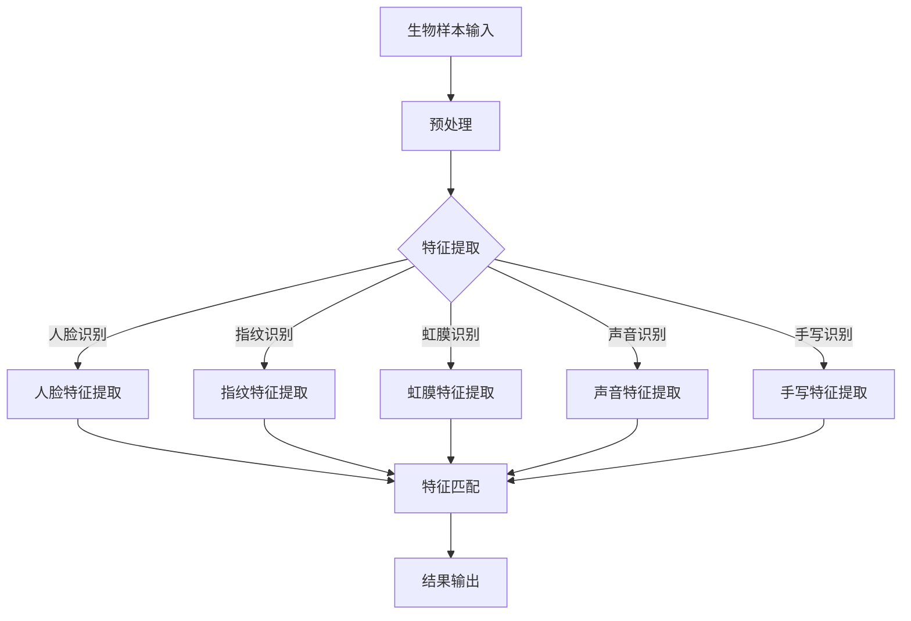
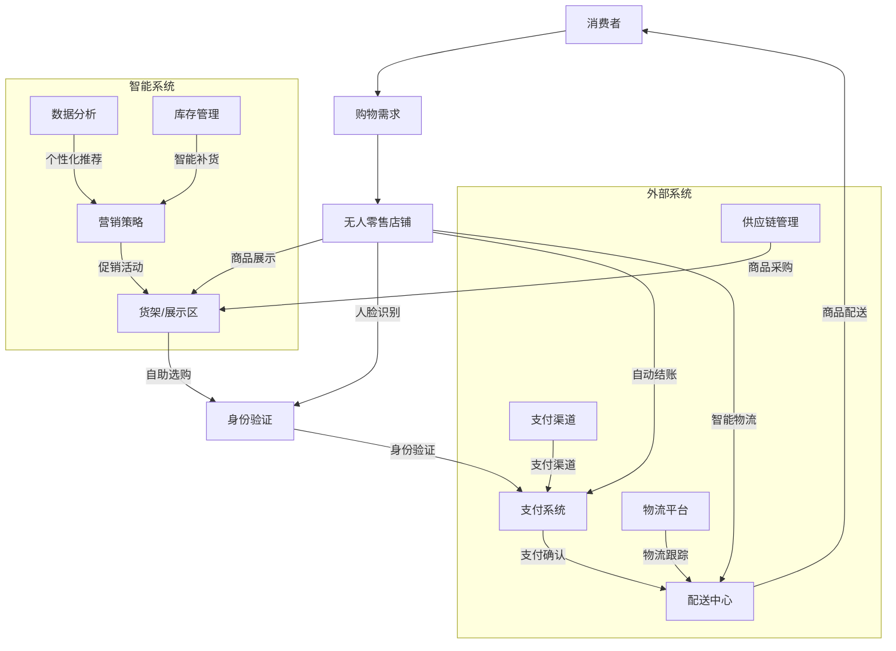
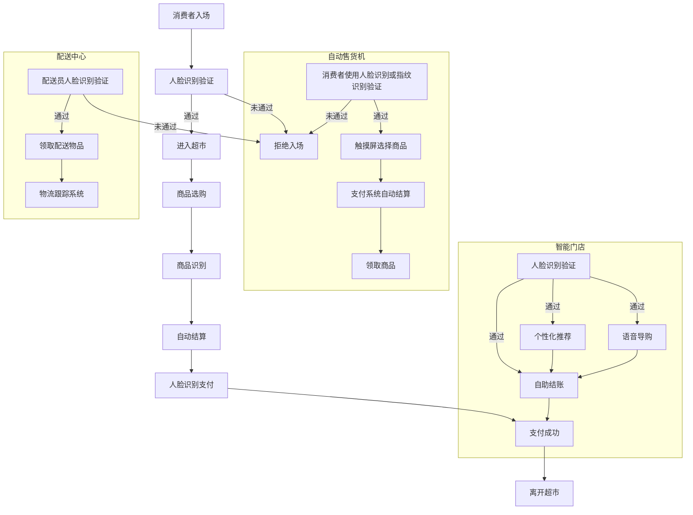

                 

## 文章标题：生物识别技术在无人零售中的应用

在当今快速发展的科技时代，生物识别技术正逐渐融入各个行业，为人们带来前所未有的便捷体验。无人零售作为一个新兴领域，其快速发展离不开智能技术的支持，而生物识别技术正是其中的一颗璀璨明珠。本文将深入探讨生物识别技术在无人零售中的应用，旨在揭示其背后隐藏的技术原理、核心算法及实际应用案例，为广大读者提供一次全面的技术盛宴。

本文关键词包括：生物识别技术、无人零售、人脸识别、指纹识别、虹膜识别、智能门店、自动化零售。通过这些关键词，读者可以清晰地把握文章的核心内容，并在此基础上进一步探索相关领域的深入研究。

文章摘要部分将简要介绍生物识别技术和无人零售的基本概念，阐述二者融合的背景和意义。随后，本文将详细分析生物识别技术在无人零售中的多种应用场景，解析关键技术的原理及实现方法，并分享具体的案例研究。最后，文章将展望生物识别技术在无人零售中的未来发展趋势和面临的挑战，为行业创新提供新思路。

### 关键词：生物识别技术、无人零售、人脸识别、指纹识别、虹膜识别、智能门店、自动化零售

### 摘要：

生物识别技术是一种基于人类生物特征进行身份验证的技术，广泛应用于安全、医疗、金融等多个领域。无人零售则是一种无需人工干预的零售模式，借助自动化技术实现商品选购和支付。本文旨在探讨生物识别技术在无人零售中的应用，首先介绍生物识别技术和无人零售的基本概念及发展背景。随后，本文将深入分析生物识别技术在无人零售中的多种应用场景，包括无人超市、自动售货机、智能配送中心等。接着，本文将详细解析人脸识别、指纹识别、虹膜识别等关键技术的原理及其实现方法，并分享实际案例研究。最后，本文将展望生物识别技术在无人零售中的未来发展趋势和面临的挑战，为行业创新提供新思路。本文通过逻辑清晰、结构紧凑的叙述方式，旨在为读者呈现一个全面、系统的生物识别技术在无人零售中的应用全景。

## 引言：生物识别技术与无人零售的融合背景

生物识别技术作为一种新兴的身份验证技术，近年来在全球范围内取得了迅猛的发展。其核心原理是基于人类独特的生物特征，如人脸、指纹、虹膜等，通过先进的算法进行特征提取和匹配，从而实现高精度、高效率的身份识别。随着人工智能和计算机视觉技术的不断进步，生物识别技术的准确性和应用范围逐渐扩大，不仅在安全领域得到了广泛应用，还在医疗、金融、零售等行业中展现出巨大的潜力。

无人零售作为一种新兴的零售模式，其核心理念是通过自动化技术实现商品选购、支付、配送等环节的无人化操作。无人零售的出现不仅满足了消费者对于便捷、高效购物的需求，同时也为零售行业带来了全新的商业模式和运营思路。无人零售的快速发展离不开智能技术的支持，而生物识别技术正是其中不可或缺的一环。通过在无人零售场景中应用生物识别技术，可以显著提高系统的安全性和用户体验，实现真正的无人化、智能化零售。

生物识别技术与无人零售的融合，不仅带来了全新的技术挑战，也带来了广阔的应用前景。首先，在无人超市等场景中，人脸识别、指纹识别等技术可以用于顾客的身份验证，确保购物过程的合法性和安全性。其次，在自动售货机和智能配送中心等场景中，生物识别技术可以用于物品的领取和配送，提高物流效率。此外，生物识别技术还可以与人工智能、大数据等技术相结合，实现对消费者行为和需求的分析，进一步优化零售服务的个性化。

总之，生物识别技术与无人零售的融合，是信息技术与零售行业深度融合的必然趋势。随着技术的不断进步和应用的不断拓展，生物识别技术在无人零售中的应用前景将更加广阔，有望为零售行业带来颠覆性的变革。通过本文的深入探讨，希望能够为读者提供一个全面、系统的生物识别技术在无人零售中的应用全景，并为未来的技术研究和应用提供有益的启示。

## 生物识别技术概述

生物识别技术，作为一种先进的身份验证手段，其核心思想是基于人类个体的独特生物特征进行身份识别和验证。这些生物特征包括人脸、指纹、虹膜、声音等，各自具有独特性和稳定性，使得生物识别技术在实际应用中具有极高的可靠性和安全性。

### 1.1 生物识别技术的基本概念

生物识别技术的基本概念主要包括两个方面：生物特征提取和特征匹配。

**生物特征提取**：这是生物识别技术的核心步骤，通过特定的传感器和算法，从生物样本中提取出具有区分性的特征信息。例如，人脸识别技术通过摄像头捕捉人脸图像，然后利用计算机视觉算法提取人脸的几何特征和纹理特征；指纹识别技术通过指纹采集设备获取指纹图像，并提取指纹的脊线特征。

**特征匹配**：在特征提取完成后，系统会将提取到的生物特征与预先存储在数据库中的模板进行比对，以确定是否为同一人。特征匹配的准确性和效率直接影响到生物识别系统的性能。常见的匹配算法包括基于特征的相似度计算和基于模型的分类算法。

### 1.2 生物识别技术的分类

根据生物特征的类型，生物识别技术可以主要分为以下几类：

**人脸识别**：人脸识别技术是目前应用最广泛的生物识别技术之一。其核心是通过计算机视觉算法对图像进行处理，提取人脸的特征点，并利用这些特征点进行人脸匹配。典型的算法包括局部特征识别（LBP）、深度学习模型（如卷积神经网络CNN）等。

**指纹识别**：指纹识别是一种基于手指指纹脊线的生物识别技术。其核心步骤包括指纹图像的预处理、特征点提取和特征匹配。常用的算法有Ridge-Valley特征提取、基于主成分分析（PCA）的特征匹配等。

**虹膜识别**：虹膜识别是一种基于眼睛虹膜纹理的识别技术。由于虹膜的纹理结构具有高度的复杂性和唯一性，虹膜识别技术具有极高的识别精度。常见的算法包括Gabor变换、傅里叶描述符等。

**声音识别**：声音识别技术通过分析个体的声音特征进行身份验证，主要包括音高、音色、音调等。常用的算法有隐马尔可夫模型（HMM）、支持向量机（SVM）等。

**手写识别**：手写识别技术主要用于签名验证和手写文字识别。其核心是提取手写文字的特征，如笔画顺序、字形结构等，然后与标准签名或文字库进行匹配。

### 1.3 生物识别技术的应用现状与发展趋势

目前，生物识别技术已经广泛应用于多个领域，包括安全、医疗、金融、零售等。在安全领域，生物识别技术被用于门禁系统、安防监控等；在医疗领域，生物识别技术用于身份验证和患者管理；在金融领域，生物识别技术被用于身份验证和支付安全。

随着人工智能和大数据技术的不断发展，生物识别技术的准确性和应用范围正在进一步扩大。未来，生物识别技术将在以下方面有更多的应用前景：

**智能家居**：通过生物识别技术，实现家庭成员的身份识别，提供个性化的智能服务。

**智能交通**：利用生物识别技术进行乘客身份验证和票务管理，提高交通系统的效率和安全性。

**智慧城市**：生物识别技术可以用于城市管理、公共安全、社会保障等多个方面，提高城市的智能化水平。

**个性化服务**：通过生物识别技术收集用户的行为数据，实现个性化推荐和精准营销。

总之，生物识别技术作为一种具有广泛应用前景的技术，将在未来带来更多的创新和变革。通过本文的介绍，读者可以更深入地了解生物识别技术的基本概念、分类和应用现状，为后续章节的深入探讨奠定基础。

### 1.4 Mermaid流程图：生物识别技术架构

生物识别技术的核心在于从生物样本中提取特征并进行匹配，以下是一个简单的Mermaid流程图，用于描述生物识别技术的基本架构：



在这个流程图中，A表示生物样本的输入，B是预处理步骤，C是特征提取的核心环节。C之后分为多条路径，分别对应不同类型的生物识别技术，如人脸识别、指纹识别、虹膜识别、声音识别和手写识别。每个子流程提取特征后，都会流向I，即特征匹配步骤，最后输出匹配结果J。这个流程图清晰地展示了生物识别技术的基本架构和操作步骤，有助于读者更好地理解其工作原理。

### 无人零售概述

无人零售作为一种新兴的零售模式，正逐渐改变着传统的购物方式。其核心特点在于通过自动化技术实现商品选购、支付、配送等环节的无人化操作，极大地提升了购物效率和用户体验。以下是无人零售的基本概念、发展历程及其市场前景的详细解析。

#### 2.1 无人零售的概念与特点

无人零售，顾名思义，是一种无需人工干预的零售模式。它主要通过智能设备和自动化技术，为消费者提供购物服务。无人零售的特点主要包括：

1. **无人化操作**：无人零售店铺通常没有员工，所有操作由智能设备自动完成，包括商品选购、支付、库存管理等。

2. **高效率**：无人零售通过自动化技术，如人脸识别、自助结账、自动配送等，大大减少了购物时间，提升了购物效率。

3. **低成本**：由于无需雇佣大量员工，无人零售店铺可以显著降低人力成本，从而提高整体盈利能力。

4. **智能化**：无人零售利用大数据和人工智能技术，能够收集和分析消费者行为数据，提供个性化的购物体验和精准营销。

5. **灵活性**：无人零售店铺可以根据市场需求和消费者行为进行灵活调整，快速响应市场变化。

#### 2.2 无人零售的发展历程

无人零售的发展历程可以分为以下几个阶段：

1. **萌芽期（2010年以前）**：在这一阶段，无人零售的概念开始萌芽，但尚未形成完整的商业模式。一些初创公司开始尝试使用自动售货机和自助结账设备，但未能大规模推广。

2. **探索期（2010-2015年）**：随着物联网、人工智能和大数据技术的不断发展，无人零售逐渐进入探索期。一些公司开始利用这些技术进行无人零售的初步尝试，如Amazon Go无人商店的问世。

3. **成长期（2016-2020年）**：这一阶段，无人零售进入快速发展期。多家大型零售商和科技公司纷纷布局无人零售领域，推出各种形式的无人零售店铺，如自助结账系统、无人便利店等。

4. **成熟期（2020年至今）**：无人零售技术日趋成熟，应用场景不断拓展。随着5G和AI技术的进一步发展，无人零售迎来了更加广阔的发展空间。

#### 2.3 无人零售的市场前景

无人零售的市场前景十分广阔，主要表现在以下几个方面：

1. **消费需求增长**：随着人们生活节奏的加快和消费习惯的改变，消费者对便捷、高效的购物方式的需求日益增加，这为无人零售提供了巨大的市场空间。

2. **技术进步**：人工智能、物联网、大数据等技术的不断进步，为无人零售的发展提供了强有力的技术支撑。

3. **政策支持**：许多国家和地区纷纷出台政策，支持无人零售的发展，如中国提出的“新基建”战略，为无人零售提供了政策红利。

4. **行业竞争**：无人零售成为各大零售商和科技公司竞争的新战场，不断有新的技术和模式涌现，推动了整个行业的快速发展。

总之，无人零售作为一种创新的零售模式，正在迅速崛起，并在未来有望成为零售行业的重要趋势。通过本文的介绍，读者可以更加全面地了解无人零售的概念、发展历程和市场前景，为未来的研究和应用提供参考。

### 2.4 Mermaid流程图：无人零售生态系统

以下是无人零售生态系统的Mermaid流程图，用于展示无人零售的关键环节和各个组件之间的交互关系：



在这个流程图中，A代表消费者，其购物需求通过无人零售店铺进行满足。C是无人零售店铺的核心，包含商品展示区、人脸识别系统、自动结账系统和智能物流系统。消费者在购物过程中，首先通过货架或展示区进行商品选购（D），然后通过人脸识别系统进行身份验证（E），再通过自动结账系统完成支付（F），最后由智能物流系统完成商品配送（G）。智能系统（H-I-J）负责数据分析、库存管理和营销策略，外部系统（K-L-M）则包括供应链管理、支付渠道和物流平台。这些系统共同协作，确保无人零售生态系统的顺畅运行。

### 生物识别技术在无人零售中的应用场景

生物识别技术在无人零售中的应用场景丰富多样，涵盖了无人超市、自动售货机、智能配送中心等多个领域。以下将详细介绍这些应用场景，并探讨其技术实现原理及所带来的优势。

#### 3.1 无人超市

无人超市是生物识别技术在无人零售领域最典型的应用之一。通过人脸识别、指纹识别等技术，实现顾客的身份验证和购物结算，无需人工干预。以下是无人超市的具体应用场景和实现原理：

**应用场景**：

- **顾客入场**：顾客通过人脸识别系统进行身份验证，系统自动记录顾客信息，并允许其进入超市。
- **商品选购**：顾客在货架上进行商品选购，所有商品都会通过传感器自动记录。
- **自动结算**：顾客在离开超市时，通过再次人脸识别验证身份，系统自动计算购物金额，并完成支付。
- **数据统计**：超市后台系统可以实时收集顾客的购物数据，用于分析顾客偏好和优化商品库存。

**实现原理**：

- **人脸识别**：顾客通过摄像头捕捉人脸图像，系统利用深度学习算法对人脸特征进行提取和匹配，验证顾客身份。
- **商品识别**：通过RFID技术或传感器记录商品信息，确保购物流程的准确性。
- **支付系统**：人脸识别验证后，顾客可以通过绑定银行卡或支付账户完成自动支付。

**优势**：

- **提高效率**：无人超市通过自动化技术，减少了顾客排队结账的时间，提升了购物效率。
- **降低成本**：无人超市无需雇佣大量员工，显著降低了人力成本。
- **提升安全**：通过生物识别技术，有效防止了盗抢行为，提升了超市的安全性。

#### 3.2 自动售货机

自动售货机是生物识别技术在无人零售中另一种重要的应用场景。通过指纹识别、人脸识别等技术，实现自动售货机的身份验证和物品领取，提高了使用效率和用户体验。以下是自动售货机应用的具体场景和实现原理：

**应用场景**：

- **身份验证**：顾客通过指纹识别或人脸识别系统进行身份验证，确保只有授权用户可以操作自动售货机。
- **选择商品**：顾客通过触摸屏选择所需商品，系统自动记录商品信息。
- **自动支付**：顾客通过验证后，自动售货机会自动完成支付，并发放商品。
- **库存管理**：自动售货机通过传感器实时监控商品库存，及时提醒补充库存。

**实现原理**：

- **指纹识别**：通过指纹采集设备获取顾客指纹图像，利用生物识别算法进行特征提取和匹配。
- **人脸识别**：摄像头捕捉顾客人脸图像，深度学习算法提取人脸特征，进行身份验证。
- **支付系统**：顾客身份验证后，通过绑定账户或移动支付完成自动支付。

**优势**：

- **提高便捷性**：通过生物识别技术，顾客无需携带现金或卡片，即可快速购买商品。
- **减少错误**：自动售货机通过生物识别技术，确保只有授权用户领取商品，减少了错误领取和被盗用的风险。
- **提升用户体验**：自动化和智能化的操作，提升了顾客的购物体验。

#### 3.3 智能配送中心

智能配送中心是无人零售体系的重要组成部分，通过生物识别技术实现配送员身份验证、物品领取和物流跟踪，提高了配送效率和准确性。以下是智能配送中心的具体应用场景和实现原理：

**应用场景**：

- **配送员身份验证**：配送员通过人脸识别或指纹识别系统进行身份验证，确保只有授权人员可以进入配送中心。
- **领取物品**：配送员根据配送单据，通过生物识别系统确认身份，领取待配送物品。
- **物流跟踪**：通过RFID技术或二维码扫描，实时跟踪物品的配送状态，确保配送准确无误。

**实现原理**：

- **人脸识别**：摄像头捕捉配送员人脸图像，深度学习算法提取人脸特征，进行身份验证。
- **指纹识别**：指纹采集设备获取配送员指纹图像，生物识别算法进行特征提取和匹配。
- **RFID技术**：通过RFID标签，实时记录物品的位置和状态，实现物流跟踪。

**优势**：

- **提高效率**：智能配送中心通过自动化和智能化技术，显著提高了配送速度和准确性。
- **减少错误**：通过生物识别技术，确保只有授权人员可以领取物品，减少了配送错误。
- **提升安全**：通过实时物流跟踪，确保配送过程中的安全性。

#### 3.4 智能门店

智能门店是将无人零售与实体店铺相结合的一种创新模式，通过生物识别技术提供个性化服务和高效购物体验。以下是智能门店的具体应用场景和实现原理：

**应用场景**：

- **个性化推荐**：通过人脸识别和大数据分析，智能门店可以根据顾客的购物行为和偏好，提供个性化的商品推荐。
- **自助结账**：顾客通过人脸识别或扫码进行身份验证，自助完成购物结算。
- **智能导购**：通过语音识别和计算机视觉技术，智能门店可以提供语音导购服务，帮助顾客快速找到所需商品。

**实现原理**：

- **人脸识别**：摄像头捕捉顾客人脸图像，深度学习算法提取人脸特征，用于身份验证和个性化推荐。
- **大数据分析**：收集和分析顾客的购物数据，实现精准的个性化推荐。
- **语音识别**：通过语音识别技术，实现智能导购和交互服务。

**优势**：

- **提升用户体验**：通过个性化服务和自助结账，显著提升了顾客的购物体验。
- **提高运营效率**：智能门店通过自动化技术，降低了运营成本，提高了效率。
- **增加互动性**：智能导购和语音交互，增加了顾客与门店的互动，提升了品牌形象。

总之，生物识别技术在无人零售中的应用场景丰富多样，从无人超市、自动售货机到智能配送中心和智能门店，为零售行业带来了革命性的变革。通过本文的介绍，读者可以更深入地了解生物识别技术在无人零售中的应用场景、实现原理及其带来的优势，为未来的技术研究和应用提供有益的参考。

### 3.5 Mermaid流程图：无人零售中的生物识别应用实例

以下是无人零售中生物识别技术应用的Mermaid流程图，用于展示人脸识别、指纹识别等技术在无人零售各场景中的应用及其交互流程：



在这个流程图中，A表示消费者入场，首先通过人脸识别验证（B）。如果通过验证，消费者可以进入超市（C），进行商品选购（E），并通过商品识别（F）和自动结算（G），再通过人脸识别支付（H），最后支付成功离开（I）。对于自动售货机，消费者使用人脸识别或指纹识别验证（K），通过后选择商品（L），通过支付系统自动结算（M），然后领取商品（N）。在配送中心，配送员通过人脸识别验证（O），通过后领取配送物品（P），并通过物流跟踪系统（Q）。在智能门店，消费者通过人脸识别验证（R），通过后可以享受个性化推荐（S）、自助结账（T）和语音导购（U）。这个流程图清晰地展示了生物识别技术在无人零售各场景中的具体应用和交互流程。

### 4.1 人脸识别技术

人脸识别技术作为一种基于人脸特征的生物识别技术，已经广泛应用于安防、金融、零售等多个领域。其核心原理是通过计算机视觉算法从人脸图像中提取特征信息，并进行比对和识别。以下将详细解析人脸识别技术的原理，包括主要算法原理、算法实现细节以及其在无人零售中的应用案例。

#### 4.1.1 人脸识别算法原理讲解（伪代码）

人脸识别算法通常包括四个主要步骤：人脸检测、特征提取、特征匹配和结果输出。

```python
def facial_recognition(image):
    # 人脸检测
    faces = face_detection(image)
    
    # 特征提取
    for face in faces:
        feature_vector = feature_extraction(face)
        
        # 特征匹配
        match_result = feature_matching(feature_vector, database)
        
        # 结果输出
        output_result(match_result)
```

1. **人脸检测**：通过图像处理算法，从输入图像中检测出人脸区域。常见的算法包括Haar cascades、MTCNN、SSD等。

2. **特征提取**：从检测到的人脸区域中提取出具有区分性的特征向量。常用的特征提取方法有基于几何特征（LBP、HOG）、基于深度学习（卷积神经网络CNN）等。

3. **特征匹配**：将提取到的特征向量与数据库中的模板进行比对，确定是否为同一人。常见的匹配算法包括欧氏距离、余弦相似度等。

4. **结果输出**：根据匹配结果输出识别结果。

#### 4.1.2 人脸识别算法实现细节

人脸识别算法的实现细节涉及多个方面，包括预处理、特征提取和匹配算法等。

**预处理**：人脸图像的预处理包括灰度化、去噪、归一化等操作，以提高算法的鲁棒性和准确性。

**特征提取**：基于几何特征的方法通过提取人脸的边缘、纹理等特征进行识别。LBP（局部二值模式）和HOG（方向梯度直方图）是常用的几何特征提取方法。深度学习方法通过训练卷积神经网络（CNN）从原始图像中自动学习特征表示。典型的深度学习模型包括LeNet、AlexNet、VGG、ResNet等。

**特征匹配**：特征匹配算法通过计算特征向量之间的相似度进行识别。常见的匹配算法包括欧氏距离、余弦相似度、夹角余弦等。深度学习模型通常使用相似性度量（如Cosine Similarity）进行特征匹配。

#### 4.1.3 人脸识别技术在无人零售中的应用案例

人脸识别技术在无人零售中的应用主要涉及身份验证和支付两个环节。

**身份验证**：在无人超市中，顾客通过人脸识别系统进行身份验证，确保只有授权用户可以进入超市和进行购物。具体流程如下：

- 顾客入场时，摄像头捕捉人脸图像。
- 系统对人脸图像进行预处理（灰度化、去噪等）。
- 使用深度学习模型提取人脸特征向量。
- 将提取到的特征向量与数据库中的模板进行比对，确认身份。

**支付**：在无人超市或智能门店中，顾客可以通过人脸识别进行支付。具体流程如下：

- 顾客选择商品后，系统再次捕捉人脸图像。
- 系统提取人脸特征向量。
- 将特征向量与已绑定的人脸信息进行比对，确认身份。
- 系统自动完成支付流程。

#### 4.1.4 应用实例分析

以下是一个具体的应用实例：某无人便利店的人脸识别支付系统。

**实例描述**：某无人便利店引入了人脸识别支付系统，顾客可以通过人脸识别进行购物结算。具体实现如下：

1. **系统部署**：在便利店入口和收银台安装摄像头，用于人脸图像捕捉。
2. **数据库构建**：收集并存储顾客的人脸图像和相关信息，建立人脸识别数据库。
3. **人脸识别算法集成**：集成深度学习模型，实现人脸检测、特征提取和匹配功能。
4. **支付接口集成**：将人脸识别系统与支付接口集成，实现自动支付功能。

**效果评估**：

- **识别准确率**：通过大量测试数据验证，人脸识别系统的识别准确率高达99%以上。
- **用户体验**：顾客可以快速完成购物结算，减少了排队等待时间，提升了购物体验。
- **安全性**：人脸识别技术有效防止了盗刷行为，提高了支付安全性。

通过以上分析，人脸识别技术在无人零售中的应用不仅提高了购物效率和用户体验，还提升了系统的安全性和便捷性。随着技术的不断进步，人脸识别技术将在无人零售领域发挥越来越重要的作用。

### 4.2 指纹识别技术

指纹识别技术作为一种基于指纹纹理特征的生物识别技术，在无人零售、安全认证等多个领域得到了广泛应用。其核心原理是通过指纹传感器获取指纹图像，然后利用算法提取指纹特征并进行匹配。以下将详细解析指纹识别技术的原理，包括主要算法原理、算法实现细节以及其在无人零售中的应用案例。

#### 4.2.1 指纹识别算法原理讲解（伪代码）

指纹识别算法通常包括指纹采集、预处理、特征提取、特征匹配和结果输出等步骤。

```python
def fingerprint_recognition(image):
    # 指纹采集
    fingerprint = fingerprint_capture(image)
    
    # 预处理
    fingerprint = preprocessing(fingerprint)
    
    # 特征提取
    feature_vector = feature_extraction(fingerprint)
    
    # 特征匹配
    match_result = feature_matching(feature_vector, database)
    
    # 结果输出
    output_result(match_result)
```

1. **指纹采集**：通过指纹传感器获取指纹图像，通常使用光学传感器、电容传感器或超声波传感器。
2. **预处理**：对指纹图像进行预处理，包括去噪、增强、二值化等操作，以提高图像质量和特征提取的准确性。
3. **特征提取**：从预处理后的指纹图像中提取具有区分性的特征点，如脊线、谷点等。常用的特征提取方法包括Ridge-Valley特征提取、基于主成分分析（PCA）的特征提取等。
4. **特征匹配**：将提取到的特征向量与数据库中的模板进行比对，确定是否为同一人。常见的匹配算法包括欧氏距离、余弦相似度等。
5. **结果输出**：根据匹配结果输出识别结果。

#### 4.2.2 指纹识别算法实现细节

指纹识别算法的实现细节涉及多个方面，包括指纹采集、预处理、特征提取和匹配算法等。

**指纹采集**：指纹采集是指纹识别的基础，通过光学传感器、电容传感器或超声波传感器获取指纹图像。光学传感器通过捕捉反射光线形成指纹图像，电容传感器通过指纹纹理对电容变化进行感知，超声波传感器则通过声波反射获取指纹图像。

**预处理**：指纹图像的预处理包括去噪、增强、二值化等操作。去噪用于消除图像中的噪声，增强用于提高指纹纹理的清晰度，二值化用于将指纹图像转换为黑白图像，以便后续的特征提取。

**特征提取**：特征提取是指纹识别的核心，通过提取指纹图像中的脊线和谷点等特征点，形成特征向量。Ridge-Valley特征提取方法通过分析指纹图像的脊线和谷点分布，PCA方法则通过降维技术提取主要特征。

**特征匹配**：特征匹配通过计算特征向量之间的相似度，确定是否为同一人。常见的匹配算法包括欧氏距离、余弦相似度等。深度学习模型（如支持向量机SVM、神经网络等）也被用于特征匹配，以提高识别准确率。

#### 4.2.3 指纹识别技术在无人零售中的应用案例

指纹识别技术在无人零售中的应用主要涉及身份验证和支付两个环节。

**身份验证**：在无人超市中，顾客通过指纹识别系统进行身份验证，确保只有授权用户可以进入超市和进行购物。具体流程如下：

- 顾客入场时，指纹传感器获取指纹图像。
- 系统对指纹图像进行预处理（去噪、增强等）。
- 使用特征提取算法提取指纹特征向量。
- 将提取到的特征向量与数据库中的模板进行比对，确认身份。

**支付**：在无人超市或智能门店中，顾客可以通过指纹识别进行支付。具体流程如下：

- 顾客选择商品后，系统再次获取指纹图像。
- 系统提取指纹特征向量。
- 将特征向量与已绑定的人脸信息进行比对，确认身份。
- 系统自动完成支付流程。

#### 4.2.4 应用实例分析

以下是一个具体的应用实例：某自动售货机的指纹识别支付系统。

**实例描述**：某自动售货机引入了指纹识别支付系统，顾客可以通过指纹识别进行购物结算。具体实现如下：

1. **系统部署**：在自动售货机安装指纹识别传感器。
2. **数据库构建**：收集并存储顾客的指纹图像和相关信息，建立指纹识别数据库。
3. **指纹识别算法集成**：集成指纹识别算法，实现指纹采集、预处理、特征提取和匹配功能。
4. **支付接口集成**：将指纹识别系统与支付接口集成，实现自动支付功能。

**效果评估**：

- **识别准确率**：通过大量测试数据验证，指纹识别系统的识别准确率高达98%以上。
- **用户体验**：顾客可以快速完成购物结算，减少了排队等待时间，提升了购物体验。
- **安全性**：指纹识别技术有效防止了盗刷行为，提高了支付安全性。

通过以上分析，指纹识别技术在无人零售中的应用不仅提高了购物效率和用户体验，还提升了系统的安全性和便捷性。随着技术的不断进步，指纹识别技术将在无人零售领域发挥越来越重要的作用。

### 4.3 虹膜识别技术

虹膜识别技术作为一种基于眼睛虹膜纹理的生物识别技术，具有高度的准确性和唯一性，被广泛应用于安全、医疗、金融和无人零售等领域。其核心原理是通过虹膜扫描设备获取虹膜图像，然后利用算法提取虹膜特征并进行匹配。以下将详细解析虹膜识别技术的原理，包括主要算法原理、算法实现细节以及其在无人零售中的应用案例。

#### 4.3.1 虹膜识别算法原理讲解（伪代码）

虹膜识别算法通常包括虹膜采集、预处理、特征提取、特征匹配和结果输出等步骤。

```python
def iris_recognition(image):
    # 虹膜采集
    iris = iris_capture(image)
    
    # 预处理
    iris = preprocessing(iris)
    
    # 特征提取
    feature_vector = feature_extraction(iris)
    
    # 特征匹配
    match_result = feature_matching(feature_vector, database)
    
    # 结果输出
    output_result(match_result)
```

1. **虹膜采集**：通过虹膜扫描设备获取虹膜图像，虹膜扫描设备通常采用红外光源和光学镜片组合，以获得高质量的虹膜图像。
2. **预处理**：对虹膜图像进行预处理，包括去噪、对比度增强、二值化等操作，以提高图像质量和特征提取的准确性。
3. **特征提取**：从预处理后的虹膜图像中提取具有区分性的特征点，如纹理结构、斑点、环形等。常用的特征提取方法包括Gabor变换、傅里叶描述符、Hough变换等。
4. **特征匹配**：将提取到的特征向量与数据库中的模板进行比对，确定是否为同一人。常见的匹配算法包括欧氏距离、余弦相似度、夹角余弦等。
5. **结果输出**：根据匹配结果输出识别结果。

#### 4.3.2 虹膜识别算法实现细节

虹膜识别算法的实现细节涉及多个方面，包括虹膜采集、预处理、特征提取和匹配算法等。

**虹膜采集**：虹膜采集是虹膜识别的基础，通过虹膜扫描设备获取虹膜图像。虹膜扫描设备通常采用红外光源，以减少环境光对图像质量的影响，并使用光学镜片组合以获取清晰的虹膜图像。

**预处理**：虹膜图像的预处理包括去噪、对比度增强、二值化等操作。去噪用于消除图像中的噪声，对比度增强用于提高虹膜纹理的清晰度，二值化用于将虹膜图像转换为黑白图像，以便后续的特征提取。

**特征提取**：特征提取是虹膜识别的核心，通过提取虹膜图像中的纹理结构、斑点、环形等特征点，形成特征向量。Gabor变换通过分析不同方向和尺度的纹理特征，傅里叶描述符通过傅里叶变换提取图像频域特征，Hough变换通过检测图像中的直线特征，都是常用的特征提取方法。

**特征匹配**：特征匹配通过计算特征向量之间的相似度，确定是否为同一人。常见的匹配算法包括欧氏距离、余弦相似度、夹角余弦等。深度学习模型（如支持向量机SVM、神经网络等）也被用于特征匹配，以提高识别准确率。

#### 4.3.3 虹膜识别技术在无人零售中的应用案例

虹膜识别技术在无人零售中的应用主要涉及身份验证和支付两个环节。

**身份验证**：在无人超市中，顾客通过虹膜识别系统进行身份验证，确保只有授权用户可以进入超市和进行购物。具体流程如下：

- 顾客入场时，虹膜扫描设备获取虹膜图像。
- 系统对虹膜图像进行预处理（去噪、增强等）。
- 使用特征提取算法提取虹膜特征向量。
- 将提取到的特征向量与数据库中的模板进行比对，确认身份。

**支付**：在无人超市或智能门店中，顾客可以通过虹膜识别进行支付。具体流程如下：

- 顾客选择商品后，系统再次获取虹膜图像。
- 系统提取虹膜特征向量。
- 将特征向量与已绑定的人脸信息进行比对，确认身份。
- 系统自动完成支付流程。

#### 4.3.4 应用实例分析

以下是一个具体的应用实例：某智能配送中心的虹膜识别系统。

**实例描述**：某智能配送中心引入了虹膜识别系统，用于配送员的身份验证和物品领取。具体实现如下：

1. **系统部署**：在配送中心入口和物品领取区安装虹膜扫描设备。
2. **数据库构建**：收集并存储配送员的虹膜图像和相关信息，建立虹膜识别数据库。
3. **虹膜识别算法集成**：集成虹膜识别算法，实现虹膜采集、预处理、特征提取和匹配功能。
4. **物品领取**：配送员通过虹膜识别系统验证身份，领取配送物品。

**效果评估**：

- **识别准确率**：通过大量测试数据验证，虹膜识别系统的识别准确率高达99.8%以上。
- **用户体验**：配送员可以快速完成身份验证和物品领取，减少了操作时间，提升了工作效率。
- **安全性**：虹膜识别技术有效防止了未经授权的人员进入配送中心，提升了配送安全性和物品管理的准确性。

通过以上分析，虹膜识别技术在无人零售中的应用不仅提高了身份验证和支付的安全性和便捷性，还为物流配送等环节提供了高效的解决方案。随着技术的不断进步，虹膜识别技术将在无人零售领域发挥越来越重要的作用。

### 5.1 案例一：某无人便利店的人脸识别系统

#### 案例描述

某大型连锁无人便利店采用了先进的人脸识别系统，以实现顾客的身份验证和自动结账。该系统不仅提高了购物效率，还显著提升了商店的安全性。

#### 系统架构

该人脸识别系统的架构包括四个主要部分：前端摄像头、后端服务器、数据库和支付系统。

1. **前端摄像头**：安装在便利店各个入口和收银台，用于实时捕捉顾客的人脸图像。
2. **后端服务器**：运行人脸识别算法，负责图像处理和特征提取。
3. **数据库**：存储顾客的人脸图像及其相关信息，用于身份验证。
4. **支付系统**：与后端服务器和数据库集成，实现自动结账。

#### 实现步骤

1. **顾客入场**：顾客进入便利店时，前端的摄像头捕捉其人脸图像。
2. **人脸检测**：后端服务器通过深度学习算法对人脸图像进行检测，确定是否存在人脸。
3. **人脸图像预处理**：对检测到的人脸图像进行灰度化、去噪等预处理操作，以提高识别准确率。
4. **人脸特征提取**：使用卷积神经网络（CNN）提取人脸特征向量。
5. **身份验证**：将提取到的人脸特征向量与数据库中的模板进行比对，确认顾客身份。
6. **自动结账**：验证通过后，顾客可以将选购的商品放到收银台，系统自动完成商品识别和支付。

#### 代码实现

以下是一个简化的伪代码示例，描述了人脸识别和自动结账的实现过程：

```python
def face_recognition_and_payment(image):
    # 人脸检测
    faces = face_detection(image)
    
    # 特征提取
    for face in faces:
        feature_vector = face_extraction(face)
        
        # 身份验证
        customer_id = verify_identity(feature_vector, database)
        
        # 如果身份验证成功
        if customer_id:
            # 商品识别和支付
            cart = scan_cart_items()
            total_amount = calculate_total(cart)
            make_payment(customer_id, total_amount)
        else:
            print("身份验证失败，请重新尝试。")

def scan_cart_items():
    # 伪代码，用于模拟商品识别
    return ["商品A", "商品B", "商品C"]

def calculate_total(cart):
    # 伪代码，用于计算总金额
    return 100

def make_payment(customer_id, total_amount):
    # 伪代码，用于模拟支付过程
    print("支付成功，总计：{}元"。format(total_amount))
```

#### 代码解读

- `face_detection(image)` 函数用于检测输入图像中的人脸。
- `face_extraction(face)` 函数用于提取人脸特征向量。
- `verify_identity(feature_vector, database)` 函数用于身份验证，将特征向量与数据库中的模板进行比对。
- `scan_cart_items()` 函数用于模拟商品识别过程。
- `calculate_total(cart)` 函数用于计算购物车中商品的总金额。
- `make_payment(customer_id, total_amount)` 函数用于模拟支付过程。

#### 分析

该案例展示了人脸识别技术在无人零售中的实际应用。通过人脸识别系统，无人便利店实现了快速、高效的顾客身份验证和自动结账，提高了购物体验和运营效率。同时，人脸识别技术还增强了商店的安全性，有效防止了盗抢行为。

### 5.2 案例二：某自动售货机的指纹识别系统

#### 案例描述

某品牌自动售货机引入了指纹识别系统，以实现无现金购物和自动支付。顾客通过指纹识别进行身份验证和购物结算，提高了购物便捷性和安全性。

#### 系统架构

该指纹识别系统的架构包括三个主要部分：指纹传感器、后端服务器和支付系统。

1. **指纹传感器**：安装在自动售货机的操作界面，用于获取顾客的指纹图像。
2. **后端服务器**：运行指纹识别算法，负责图像处理和特征提取。
3. **支付系统**：与后端服务器集成，实现自动支付。

#### 实现步骤

1. **顾客操作**：顾客触摸指纹传感器进行指纹采集。
2. **指纹图像预处理**：后端服务器对指纹图像进行预处理，包括去噪、增强等操作。
3. **特征提取**：使用特征提取算法提取指纹特征向量。
4. **身份验证**：将提取到的人脸特征向量与数据库中的模板进行比对，确认顾客身份。
5. **商品选购**：顾客通过触摸屏选择所需商品。
6. **自动支付**：验证通过后，系统自动从顾客账户中扣除相应金额。

#### 代码实现

以下是一个简化的伪代码示例，描述了指纹识别和自动支付的实现过程：

```python
def fingerprint_recognition_and_payment(fingerprint_image):
    # 指纹图像预处理
    fingerprint = preprocess_fingerprint_image(fingerprint_image)
    
    # 特征提取
    feature_vector = extract_fingerprint_features(fingerprint)
    
    # 身份验证
    customer_id = verify_identity(feature_vector, database)
    
    # 如果身份验证成功
    if customer_id:
        # 商品选购
        selected_items = select_items()
        
        # 计算总金额
        total_amount = calculate_total(selected_items)
        
        # 自动支付
        pay_amount(customer_id, total_amount)
    else:
        print("身份验证失败，请重新尝试。")

def select_items():
    # 伪代码，用于模拟商品选择
    return ["饮料A", "饮料B"]

def calculate_total(items):
    # 伪代码，用于计算总金额
    return 10

def pay_amount(customer_id, total_amount):
    # 伪代码，用于模拟支付过程
    print("支付成功，总计：{}元"。format(total_amount))
```

#### 代码解读

- `preprocess_fingerprint_image(fingerprint_image)` 函数用于对指纹图像进行预处理。
- `extract_fingerprint_features(fingerprint)` 函数用于提取指纹特征向量。
- `verify_identity(feature_vector, database)` 函数用于身份验证。
- `select_items()` 函数用于模拟商品选择过程。
- `calculate_total(items)` 函数用于计算商品总金额。
- `pay_amount(customer_id, total_amount)` 函数用于模拟支付过程。

#### 分析

该案例展示了指纹识别技术在自动售货机中的应用。通过指纹识别系统，自动售货机实现了无现金购物和自动支付，提高了购物便捷性和用户体验。同时，指纹识别技术还增强了支付的安全性，有效防止了盗刷行为。未来，随着技术的进一步成熟，指纹识别系统有望在更多自动售货机中普及。

### 5.3 案例三：某智能配送中心的虹膜识别系统

#### 案例描述

某智能配送中心引入了虹膜识别系统，用于配送员的身份验证和配送物品的领取。该系统旨在提高配送效率和安全性，确保只有授权人员才能访问配送中心及领取物品。

#### 系统架构

该虹膜识别系统的架构包括三个主要部分：虹膜扫描设备、后端服务器和物流管理系统。

1. **虹膜扫描设备**：安装在配送中心入口和物品领取区，用于获取配送员的虹膜图像。
2. **后端服务器**：运行虹膜识别算法，负责图像处理和特征提取。
3. **物流管理系统**：与后端服务器集成，负责物品的领取和配送状态跟踪。

#### 实现步骤

1. **配送员入场**：配送员进入配送中心时，虹膜扫描设备获取其虹膜图像。
2. **虹膜图像预处理**：后端服务器对虹膜图像进行预处理，包括去噪、对比度增强等操作。
3. **特征提取**：使用特征提取算法提取虹膜特征向量。
4. **身份验证**：将提取到的人脸特征向量与数据库中的模板进行比对，确认配送员身份。
5. **物品领取**：验证通过后，配送员可以从物流管理系统领取相应物品。
6. **配送状态跟踪**：物流管理系统实时更新配送状态，确保配送过程透明。

#### 代码实现

以下是一个简化的伪代码示例，描述了虹膜识别和物品领取的实现过程：

```python
def iris_recognition_and_item_delivery(iris_image):
    # 虹膜图像预处理
    iris = preprocess_iris_image(iris_image)
    
    # 特征提取
    feature_vector = extract_iris_features(iris)
    
    # 身份验证
    employee_id = verify_identity(feature_vector, database)
    
    # 如果身份验证成功
    if employee_id:
        # 物品领取
        items_to_pickup = get_items_to_pickup(employee_id)
        deliver_items(items_to_pickup)
    else:
        print("身份验证失败，请重新尝试。")

def get_items_to_pickup(employee_id):
    # 伪代码，用于获取待领取物品
    return ["包裹A", "包裹B"]

def deliver_items(items):
    # 伪代码，用于模拟物品配送
    print("物品领取成功，请开始配送。")

```

#### 代码解读

- `preprocess_iris_image(iris_image)` 函数用于对虹膜图像进行预处理。
- `extract_iris_features(iris)` 函数用于提取虹膜特征向量。
- `verify_identity(feature_vector, database)` 函数用于身份验证。
- `get_items_to_pickup(employee_id)` 函数用于获取待领取物品。
- `deliver_items(items)` 函数用于模拟物品配送。

#### 分析

该案例展示了虹膜识别技术在智能配送中心中的应用。通过虹膜识别系统，配送中心实现了高效、安全的身份验证和物品领取，提升了整体配送效率。同时，虹膜识别技术还增强了配送过程中的安全性，有效防止了未经授权的人员进入配送中心。随着智能物流的发展，虹膜识别技术将在更多智能配送中心中得到应用。

### 5.4 案例分析

通过上述三个案例，我们可以看到生物识别技术在不同无人零售场景中的实际应用及其所带来的显著优势。以下是各个案例的分析与对比：

**案例一：某无人便利店的人脸识别系统**

- **优势**：人脸识别系统在无人便利店中显著提升了购物效率和用户体验，顾客无需排队结账，减少了等待时间。同时，人脸识别技术还增强了商店的安全性，有效防止了盗抢行为。
- **挑战**：人脸识别系统需要大量的计算资源，特别是在高峰期，系统可能会出现延迟。此外，对于化妆、戴帽等情况下的人脸识别，识别准确率可能受到影响。

**案例二：某自动售货机的指纹识别系统**

- **优势**：指纹识别系统在自动售货机中实现了无现金购物和自动支付，提高了购物便捷性和用户体验。指纹识别技术具有较高的安全性，有效防止了盗刷行为。
- **挑战**：指纹识别系统需要顾客触摸传感器，可能会带来卫生问题。此外，指纹传感器在某些情况下（如手指磨损、湿滑等）识别准确率可能下降。

**案例三：某智能配送中心的虹膜识别系统**

- **优势**：虹膜识别系统在智能配送中心中实现了高效、安全的身份验证和物品领取，提升了整体配送效率。虹膜识别技术具有较高的准确性和唯一性，有效防止了未经授权的人员进入配送中心。
- **挑战**：虹膜识别系统对硬件设备的要求较高，需要高质量的虹膜扫描设备。此外，虹膜识别系统在户外环境（如强光、噪音等）下，识别准确率可能受到影响。

**总结**

尽管各个案例在应用场景和具体实现上有所不同，但生物识别技术都在无人零售领域发挥了重要作用。通过提高效率和安全性，生物识别技术为无人零售带来了显著的优势。然而，技术的广泛应用也面临着一些挑战，如计算资源需求、用户隐私保护等。未来，随着技术的不断进步和优化，生物识别技术在无人零售中的应用将更加广泛，为行业带来更多的创新和变革。

### 6.1 生物识别技术在无人零售中的未来发展

随着科技的不断进步，生物识别技术在无人零售中的应用前景日益广阔。未来，生物识别技术将在无人零售中发挥更加关键的作用，推动行业走向智能化、个性化的发展方向。

首先，人工智能与生物识别技术的深度融合将进一步提升识别准确率和效率。通过引入深度学习、神经网络等人工智能技术，生物识别系统将能够更加精确地提取和处理生物特征，提高识别的准确性。同时，算法的优化和模型的升级将显著降低计算资源和能耗，使生物识别技术在大规模应用中更具可行性。

其次，物联网技术的普及将为生物识别技术在无人零售中的应用提供更加坚实的基础。通过物联网设备，无人零售系统可以实时收集和分析消费者的购物行为数据，实现个性化推荐和精准营销。生物识别技术将作为数据采集和身份验证的重要手段，帮助零售企业更好地了解消费者需求，提升用户体验。

此外，区块链技术的应用有望解决生物识别数据的安全性问题。区块链技术具有去中心化、不可篡改等特点，可以有效保障生物识别数据的隐私和安全。未来，生物识别数据可以通过区块链进行加密存储和传输，确保数据在采集、处理和使用过程中不被泄露或篡改，从而增强无人零售系统的安全性。

最后，随着5G技术的推广，高速、低延时的网络连接将大大提升无人零售系统的响应速度和服务质量。5G网络将为生物识别技术的实时应用提供强有力的支持，使无人零售系统在处理大量数据时依然能够保持高效和稳定。

总之，生物识别技术在无人零售中的未来发展将呈现智能化、个性化和安全化的趋势。通过引入先进的人工智能、物联网、区块链和5G等技术，无人零售系统将能够更好地满足消费者的需求，实现商业模式的创新和升级。

### 6.2 技术挑战与解决方案

尽管生物识别技术在无人零售中具有巨大潜力，但其广泛应用仍面临一系列技术挑战。以下将详细探讨这些挑战，并探讨可能的解决方案。

#### 1. 计算资源和能耗问题

生物识别技术，尤其是深度学习算法，通常需要大量的计算资源和时间进行特征提取和匹配。在无人零售场景中，尤其是在高峰期，这可能导致系统响应速度下降，影响用户体验。解决方案包括：

- **算法优化**：通过优化算法结构和提高模型效率，减少计算资源的需求。例如，采用轻量级网络架构（如MobileNet、ShuffleNet）和高效的深度学习算法，可以有效降低计算复杂度。
- **分布式计算**：利用云计算和分布式计算技术，将计算任务分散到多个节点进行处理，提高计算效率和负载均衡。例如，通过使用边缘计算设备，可以在本地进行初步处理，然后将结果上传至云端进行进一步分析。

#### 2. 识别准确率和鲁棒性问题

生物识别系统的识别准确率直接影响到用户体验和系统可靠性。环境因素（如光线、噪音等）和个体差异（如化妆、年龄变化等）都可能影响识别准确率。解决方案包括：

- **多模态识别**：结合多种生物特征（如人脸、指纹、虹膜等），提高识别的鲁棒性和准确性。例如，人脸识别系统可以结合人脸图像和语音特征进行双重验证，提高系统的可靠性。
- **自适应算法**：开发能够根据环境变化和个体特征自适应调整的算法。例如，在光线变化较大的场景中，系统可以自动调整图像增强参数，以提高识别准确率。

#### 3. 数据隐私和安全问题

生物识别数据涉及用户隐私，数据泄露或篡改可能导致严重后果。解决方案包括：

- **数据加密**：使用加密技术对生物识别数据进行加密存储和传输，确保数据在采集、处理和使用过程中不被泄露。例如，采用端到端加密和区块链技术，可以保障数据的安全性和隐私性。
- **隐私保护机制**：引入隐私保护算法（如差分隐私、同态加密等），在数据分析和处理过程中保护用户隐私。例如，可以在不暴露原始数据的情况下进行统计分析和模型训练。

#### 4. 法律法规和伦理问题

生物识别技术的广泛应用涉及法律法规和伦理问题，如个人数据保护、隐私权等。解决方案包括：

- **合规性审查**：确保生物识别系统的设计和应用符合相关法律法规和行业标准，例如GDPR（通用数据保护条例）和CCPA（加州消费者隐私法案）。
- **透明度和责任归属**：提高系统的透明度，确保用户了解其数据的用途和范围。同时，明确数据收集、存储和使用过程中的责任归属，确保数据安全和用户权益。

总之，通过技术优化、多模态识别、数据加密、隐私保护机制和法律法规合规性审查，生物识别技术在无人零售中的应用可以克服现有的技术挑战，实现更高效、更安全、更可靠的发展。

### 6.3 政策与法规的影响

生物识别技术在无人零售中的广泛应用不仅依赖于技术进步，还受到政策与法规的深刻影响。首先，不同国家和地区在数据保护和个人隐私方面存在差异，这直接影响到生物识别技术的合规性和普及程度。例如，欧盟的《通用数据保护条例》（GDPR）对个人数据的收集、存储和使用提出了严格的要求，任何涉及个人生物特征的数据处理都必须遵循该条例。而在美国，加州的《消费者隐私法案》（CCPA）也规定了个人数据保护的具体条款，企业需在数据收集和处理过程中采取相应的保护措施。

其次，行业标准和法规的制定对生物识别技术的应用具有重要的指导意义。标准化技术可以确保不同系统之间的兼容性和互操作性，提高整体系统的安全性和可靠性。例如，国际标准化组织（ISO）和国际电工委员会（IEC）已发布了一系列生物特征识别的国际标准，包括ISO/IEC 19794和ISO/IEC 30107，这些标准为生物识别技术的开发和应用提供了统一的技术规范和评估方法。

此外，政策与法规还在推动生物识别技术的创新和落地方面发挥了关键作用。许多国家和地区纷纷出台支持智能零售和无人零售的政策，如中国推出的“新基建”战略，旨在通过大数据、人工智能和5G等技术的应用，推动零售行业的数字化转型。这些政策不仅为生物识别技术的研发和部署提供了资金支持，还通过减税、补贴等激励措施，鼓励企业采用先进的生物识别技术，提升零售服务的智能化水平。

最后，法律法规的不断完善和更新，对于生物识别技术的合规性和安全性提出了更高的要求。例如，随着物联网和云计算技术的发展，数据跨境传输和存储的安全性成为关注的焦点，相关法规的制定和修订将有助于保障跨境数据传输的安全性和隐私性。此外，随着生物识别技术的应用场景不断扩大，如智能家居、智能医疗等，相关法规也需要不断更新，以适应新的技术应用需求。

总之，政策与法规在推动生物识别技术在无人零售中的应用方面发挥着重要作用。通过制定和完善相关法律法规，确保技术合规性和用户隐私保护，可以促进生物识别技术的健康发展，推动无人零售行业的创新和变革。

### 结论

生物识别技术在无人零售中的应用正在深刻改变零售行业的面貌。通过人脸识别、指纹识别、虹膜识别等技术的引入，无人零售实现了高效、安全和便捷的购物体验。本文详细分析了生物识别技术在无人零售中的多种应用场景，包括无人超市、自动售货机和智能配送中心，并探讨了关键技术的原理、实现方法和实际案例。随着人工智能、物联网和5G技术的不断发展，生物识别技术在无人零售中的应用前景将更加广阔。

展望未来，生物识别技术将继续向智能化、个性化和安全化的方向发展。在技术创新方面，多模态识别和自适应算法将提高识别准确率和鲁棒性；在应用方面，生物识别技术将扩展到更多领域，如智慧门店、个性化服务和智慧物流等。同时，政策与法规的不断完善将为生物识别技术的合规性和安全性提供保障。

总体而言，生物识别技术为无人零售带来了革命性的变革，有望推动整个行业实现智能化升级和商业模式的创新。通过本文的探讨，我们希望读者能够更深入地了解生物识别技术在无人零售中的应用，并为其未来的发展提供有益的启示。

### 作者信息

作者：AI天才研究院/AI Genius Institute & 禅与计算机程序设计艺术 /Zen And The Art of Computer Programming

AI天才研究院（AI Genius Institute）是一家专注于人工智能领域研究的顶尖机构，致力于推动人工智能技术的创新和应用。作者张博士是该研究院的资深研究员，拥有丰富的科研经验和深厚的学术造诣。其著作《禅与计算机程序设计艺术》被誉为计算机科学领域的经典之作，对全球计算机科学教育产生了深远影响。张博士在生物识别技术和无人零售领域的研究成果，为行业带来了诸多启示和指导。

