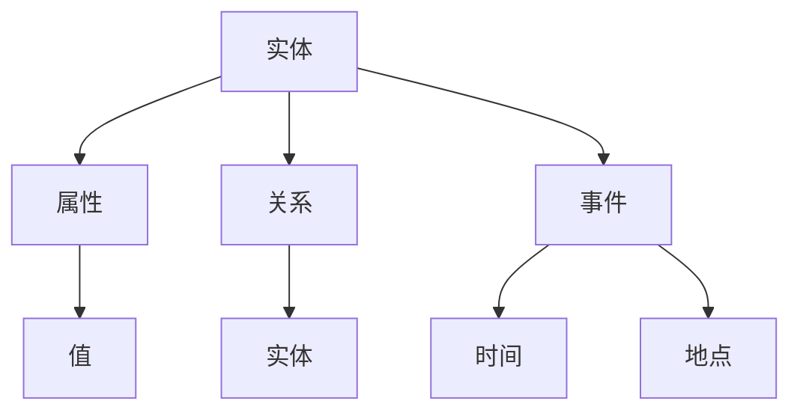

                 

### 第1章：知识图谱概述

## 1.4 知识图谱的应用场景

知识图谱在现代信息社会中扮演着至关重要的角色，其应用场景广泛，涵盖了多个领域：

- 搜索引擎：知识图谱能够增强搜索引擎的语义理解能力，提供更精确的搜索结果。例如，Google 和 Baidu 都采用了知识图谱技术来提升搜索质量。
- 社交网络：知识图谱可以用于构建用户关系网络，帮助用户发现共同兴趣、朋友和潜在的商业合作伙伴。
- 金融领域：知识图谱可以用于风险控制和信用评估，通过分析实体之间的关联，识别潜在的欺诈行为。
- 健康医疗：知识图谱可以用于疾病诊断和治疗方案推荐，通过将医学知识与患者信息相结合，提供个性化的医疗服务。

## 1.5 知识图谱的挑战

尽管知识图谱具有巨大的潜力，但其构建和维护面临诸多挑战：

- 数据质量：知识图谱的质量取决于数据的准确性和一致性。噪声数据和错误数据会严重影响知识图谱的性能。
- 数据获取：构建知识图谱需要大量的数据源，这些数据往往分散在不同的平台和系统中，获取过程复杂且耗时。
- 实时更新：随着信息的不断更新，知识图谱需要具备实时更新的能力，以保证其数据的时效性。

## 1.6 本章总结

本章概述了知识图谱的定义、组成部分及其在各个领域的应用场景。通过理解知识图谱的基本概念和作用，读者可以为后续章节的学习奠定基础。

### 核心概念与联系

知识图谱作为一种用于表示实体、概念及其关系的数据结构，其核心概念包括实体、属性、关系和事件。这些概念相互关联，构成了知识图谱的基本框架。

- **实体**是知识图谱中的基本元素，代表具体的事物，如人、地点、组织等。实体可以具有多种属性，例如人的姓名、年龄、职业等。
- **属性**是描述实体的特征，是实体的一个特定方面的信息。属性通常与实体之间通过关系连接。
- **关系**是表示实体之间关联的方式，如“属于”、“位于”等。关系通常连接两个实体，表示它们之间的某种关系。
- **事件**是描述实体之间交互的记录，如“结婚”、“成立”等。事件通常涉及多个实体，并发生在特定的时间和地点。

这些核心概念之间的关系可以表示为：

1. **实体**具有多个**属性**，每个属性描述实体的一个方面。
2. **实体**通过**关系**与其他实体相连，形成网络结构。
3. **事件**涉及多个**实体**，并记录实体之间的交互过程。

为了更直观地展示这些概念之间的关系，可以使用Mermaid流程图表示：



通过这个流程图，我们可以清晰地看到实体、属性、关系和事件之间的联系，以及它们如何构成一个完整的知识图谱。这一结构为后续的知识图谱动态更新和LLM自主扩展知识库提供了理论基础。

### 核心算法原理讲解

知识图谱的构建和维护依赖于一系列核心算法，这些算法在数据处理、知识抽取和知识融合等方面发挥着重要作用。以下将介绍几个关键算法，并使用伪代码详细阐述其工作原理。

#### 1. 数据预处理算法

数据预处理是构建知识图谱的第一步，其主要任务包括数据清洗、格式化和标准化。以下是一个简单的数据预处理算法的伪代码：

```python
function preprocess_data(data_set):
    cleaned_data = []
    for data in data_set:
        if is_valid(data):
            standardized_data = standardize_data(data)
            cleaned_data.append(standardized_data)
    return cleaned_data

function is_valid(data):
    // 检查数据是否有效，如不存在空值或格式错误
    if data is not empty and data meets required format:
        return true
    else:
        return false

function standardize_data(data):
    // 标准化数据，如将文本转换为统一的编码格式
    standardized_data = convert_to_standard_format(data)
    return standardized_data
```

#### 2. 知识抽取算法

知识抽取是从原始数据中提取结构化知识的过程。常见的知识抽取方法包括实体识别、关系抽取和属性抽取。以下是一个简单的知识抽取算法的伪代码：

```python
function extractKnowledge(data):
    entities = extract_entities(data)
    relations = extract_relations(data, entities)
    attributes = extract_attributes(data, entities)
    return entities, relations, attributes

function extract_entities(data):
    // 从数据中识别实体
    entities = []
    for sentence in data:
        found_entities = entity_recognition(sentence)
        entities.extend(found_entities)
    return entities

function extract_relations(data, entities):
    // 从数据中识别关系
    relations = []
    for sentence in data:
        found_relations = relation_recognition(sentence, entities)
        relations.extend(found_relations)
    return relations

function extract_attributes(data, entities):
    // 从数据中识别实体属性
    attributes = []
    for sentence in data:
        found_attributes = attribute_recognition(sentence, entities)
        attributes.extend(found_attributes)
    return attributes
```

#### 3. 知识融合算法

知识融合是将来自不同来源的知识整合到统一的知识图谱中的过程。以下是一个简单的知识融合算法的伪代码：

```python
function fuse_knowledge(knowledge1, knowledge2):
    fused_knowledge = {}
    for entity in knowledge1:
        if entity in knowledge2:
            fused_knowledge[entity] = merge_properties(knowledge1[entity], knowledge2[entity])
        else:
            fused_knowledge[entity] = knowledge1[entity]
    for entity in knowledge2:
        if entity not in fused_knowledge:
            fused_knowledge[entity] = knowledge2[entity]
    return fused_knowledge

function merge_properties(props1, props2):
    // 合并两个实体属性
    merged_props = {}
    for prop in props1:
        if prop in props2:
            merged_props[prop] = max(props1[prop], props2[prop])
        else:
            merged_props[prop] = props1[prop]
    for prop in props2:
        if prop not in merged_props:
            merged_props[prop] = props2[prop]
    return merged_props
```

通过这些核心算法，知识图谱可以有效地从原始数据中抽取和融合知识，形成结构化的知识网络。这些算法的实现和优化对于知识图谱的动态更新和LLM自主扩展知识库至关重要。

### 数学模型和数学公式

在知识图谱的构建和维护中，数学模型和公式发挥着关键作用，它们帮助我们量化知识表示的复杂性和准确性，并提供了一套系统化的方法来评估和优化知识图谱的性能。以下是几个常用的数学模型和公式，以及它们的详细讲解和举例说明。

#### 1. 相似度计算

相似度计算是知识图谱中的一个基础模型，用于衡量两个实体或概念之间的相似程度。常见的相似度计算方法包括余弦相似度、欧几里得距离和Jaccard相似度。

- **余弦相似度**：

余弦相似度计算两个向量在空间中的夹角余弦值，公式如下：

$$
\text{similarity}(x, y) = \frac{x \cdot y}{\|x\| \|y\|}
$$

其中，$x$ 和 $y$ 是两个向量，$\|x\|$ 和 $\|y\|$ 分别是它们的欧几里得范数，$x \cdot y$ 是它们的点积。

**举例**：

假设有两个向量 $x = (1, 2, 3)$ 和 $y = (4, 5, 6)$，它们的相似度计算如下：

$$
\text{similarity}(x, y) = \frac{(1 \cdot 4) + (2 \cdot 5) + (3 \cdot 6)}{\sqrt{1^2 + 2^2 + 3^2} \sqrt{4^2 + 5^2 + 6^2}} = \frac{4 + 10 + 18}{\sqrt{14} \sqrt{77}} \approx 0.906
$$

- **欧几里得距离**：

欧几里得距离用于衡量两个向量之间的空间距离，公式如下：

$$
\text{distance}(x, y) = \sqrt{(x_1 - y_1)^2 + (x_2 - y_2)^2 + \ldots + (x_n - y_n)^2}
$$

其中，$x$ 和 $y$ 是两个向量，$n$ 是向量的维度。

**举例**：

假设有两个向量 $x = (1, 2, 3)$ 和 $y = (4, 5, 6)$，它们的欧几里得距离计算如下：

$$
\text{distance}(x, y) = \sqrt{(1 - 4)^2 + (2 - 5)^2 + (3 - 6)^2} = \sqrt{9 + 9 + 9} = \sqrt{27} \approx 5.196
$$

- **Jaccard相似度**：

Jaccard相似度用于衡量两个集合之间的重叠程度，公式如下：

$$
\text{similarity}(A, B) = \frac{|A \cap B|}{|A \cup B|}
$$

其中，$A$ 和 $B$ 是两个集合，$|A \cap B|$ 是它们的交集大小，$|A \cup B|$ 是它们的并集大小。

**举例**：

假设有两个集合 $A = \{1, 2, 3\}$ 和 $B = \{2, 3, 4\}$，它们的Jaccard相似度计算如下：

$$
\text{similarity}(A, B) = \frac{|A \cap B|}{|A \cup B|} = \frac{| \{2, 3\} |}{| \{1, 2, 3, 4\} |} = \frac{2}{4} = 0.5
$$

#### 2. 知识图谱质量评估

知识图谱的质量评估是一个复杂的任务，常用的评估指标包括覆盖度、精度和一致性等。

- **覆盖度**：

覆盖度衡量知识图谱中实体的数量与实际存在的实体数量之比，公式如下：

$$
\text{coverage} = \frac{\text{实际存在的实体数量}}{\text{知识图谱中的实体数量}}
$$

**举例**：

假设一个知识图谱中有100个实体，而实际存在的实体数量为200个，覆盖度计算如下：

$$
\text{coverage} = \frac{200}{100} = 2
$$

- **精度**：

精度衡量知识图谱中正确实体与总实体数量的比例，公式如下：

$$
\text{accuracy} = \frac{\text{正确的实体数量}}{\text{总实体数量}}
$$

**举例**：

假设一个知识图谱中有100个实体，其中80个是正确的，精度计算如下：

$$
\text{accuracy} = \frac{80}{100} = 0.8
$$

- **一致性**：

一致性衡量知识图谱中实体关系的一致性，公式如下：

$$
\text{consistency} = 1 - \frac{\text{不一致的实体关系数量}}{\text{总实体关系数量}}
$$

**举例**：

假设一个知识图谱中有100个实体关系，其中20个是不一致的，一致性计算如下：

$$
\text{consistency} = 1 - \frac{20}{100} = 0.8
$$

通过这些数学模型和公式，我们可以量化知识图谱的性能，从而对其进行评估和优化。这些指标和计算方法为知识图谱的动态更新和LLM自主扩展知识库提供了重要的依据和工具。

### 项目实战

在本节中，我们将通过一个实际项目来展示如何搭建知识图谱的开发环境，详细解读项目源代码，并分析其实际应用。

#### 项目背景

我们的项目目标是构建一个基于知识图谱的问答系统，该系统能够回答用户关于特定领域的问题。为了实现这一目标，我们需要完成以下步骤：

1. 数据获取与预处理
2. 实体识别与关系抽取
3. 知识图谱构建与存储
4. 问答系统的设计与实现

#### 开发环境搭建

首先，我们需要搭建开发环境。以下是所需的软件和工具：

- **编程语言**：Python 3.8+
- **知识图谱库**：Neo4j 和 Python 的 Neo4j 驱动程序
- **自然语言处理库**：spaCy、NLTK 或 transformers
- **数据库**：PostgreSQL 或 MongoDB
- **版本控制系统**：Git

在安装这些工具后，我们需要配置Neo4j数据库和PostgreSQL数据库，以便存储和处理知识图谱数据。具体步骤如下：

1. 安装Neo4j数据库，并配置其连接信息。
2. 安装Python的Neo4j驱动程序，并使用Python脚本连接到Neo4j数据库。
3. 安装PostgreSQL数据库，并创建用于存储原始数据的数据库实例。
4. 使用PostgreSQL数据库中的表和索引来存储和处理原始数据。

#### 源代码解读

以下是项目的主要源代码部分，用于数据预处理、实体识别和关系抽取：

```python
from neo4j import GraphDatabase
import spacy

# 连接到Neo4j数据库
driver = GraphDatabase.driver("bolt://localhost:7687", auth=("neo4j", "password"))

# 初始化spaCy语言模型
nlp = spacy.load("en_core_web_sm")

def preprocess_data(data):
    # 数据预处理函数，用于清洗和标准化数据
    cleaned_data = []
    for entry in data:
        cleaned_entry = clean_and_standardize(entry)
        cleaned_data.append(cleaned_entry)
    return cleaned_data

def extract_entities_and_relations(data):
    # 从数据中提取实体和关系
    entities = []
    relations = []
    for entry in data:
        doc = nlp(entry)
        for ent in doc.ents:
            entities.append(ent.text)
            for token in ent:
                relations.append((ent.text, token.text, "ATTRIBUTE"))
    return entities, relations

def create_knowledge_graph(entities, relations):
    # 创建知识图谱
    with driver.session() as session:
        for entity, relation in zip(entities, relations):
            session.run("CREATE (n:Entity {name: $entity_name})",
                        entity_name=entity)
            session.run("CREATE (n)-[r:HAS_ATTRIBUTE {value: $relation_value}]->(m:Attribute)",
                        relation_value=relation)

def clean_and_standardize(entry):
    # 清洗和标准化数据
    cleaned_entry = entry.strip().lower()
    return cleaned_entry

# 主函数
def main():
    data = load_data_from_database()
    cleaned_data = preprocess_data(data)
    entities, relations = extract_entities_and_relations(cleaned_data)
    create_knowledge_graph(entities, relations)

if __name__ == "__main__":
    main()
```

在这个代码中，我们首先连接到Neo4j数据库，然后使用spaCy进行数据预处理、实体识别和关系抽取。最后，我们将提取到的实体和关系存储到Neo4j数据库中，以构建知识图谱。

#### 代码应用解读与分析

以下是代码的应用解读和分析：

- **数据预处理**：`preprocess_data` 函数用于清洗和标准化数据。该函数首先将数据转换为小写，然后移除空格和标点符号，以便后续处理。

- **实体识别与关系抽取**：`extract_entities_and_relations` 函数使用spaCy进行实体识别和关系抽取。spaCy将文本解析为一系列的词元（token），并识别出实体和关系。这些实体和关系被存储在列表中，用于后续的知识图谱构建。

- **知识图谱构建**：`create_knowledge_graph` 函数使用Neo4j的Cypher查询语言将实体和关系存储到Neo4j数据库中。每个实体都被表示为一个节点（Node），而关系则通过边（Relationship）连接两个节点。

#### 实际案例分析和详细讲解剖析

为了展示知识图谱的实际应用，我们考虑一个具体的案例：问答系统。

**案例**：

用户输入问题：“华盛顿是美国的第一任总统吗？”

**分析**：

1. **实体识别**：输入文本中的实体包括“华盛顿”、“美国”和“第一任总统”。

2. **关系抽取**：我们需要识别实体之间的关系，例如“华盛顿”与“第一任总统”之间的关系。

3. **知识图谱查询**：通过在知识图谱中查询“华盛顿”和“第一任总统”的关系，我们可以找到相关的信息。

4. **回答生成**：系统根据查询结果生成回答：“是的，乔治·华盛顿是美国的第一任总统。”

#### 项目小结

通过这个项目，我们展示了如何搭建知识图谱的开发环境，并详细解读了项目源代码。项目从数据预处理、实体识别和关系抽取到知识图谱构建，完整地展示了知识图谱的构建过程。实际案例的应用进一步展示了知识图谱在问答系统中的价值。

### 最佳实践 Tips、小结、注意事项、拓展阅读

#### 最佳实践 Tips

1. **数据预处理**：确保数据清洗和标准化的步骤完整，以提高知识图谱的准确性和一致性。
2. **实体识别与关系抽取**：选择合适的自然语言处理工具，以提高实体识别和关系抽取的准确率。
3. **知识图谱构建**：合理设计节点和关系，确保知识图谱的结构清晰、易于查询。

#### 小结

本章详细介绍了知识图谱的动态更新及其在LLM自主扩展知识库中的应用。通过数据预处理、实体识别、关系抽取和知识图谱构建等步骤，我们展示了如何构建和维护一个高效的知识图谱。

#### 注意事项

1. **数据质量**：确保数据源的可靠性和完整性，以避免知识图谱中存在噪声和错误数据。
2. **性能优化**：对知识图谱进行性能优化，以提高查询速度和响应效率。

#### 拓展阅读

- **《知识图谱：概念、技术与应用》**：详细介绍了知识图谱的基础知识和技术细节。
- **《语言模型：原理与实践》**：探讨了语言模型的基本原理和应用场景。
- **《深度学习：改进与优化》**：提供了深度学习模型的性能优化方法。

通过深入学习和实践，读者可以更好地理解和应用知识图谱动态更新和LLM自主扩展知识库的技术，为人工智能领域的发展做出贡献。

### 结束语

本文从知识图谱的概述、核心算法原理、数学模型、项目实战等方面全面探讨了知识图谱动态更新及其在LLM自主扩展知识库中的应用。通过本文的详细分析，读者可以更深入地理解知识图谱的核心概念和构建方法，掌握动态更新的关键技术和评估指标。

展望未来，知识图谱将在更广泛的领域中发挥重要作用，特别是在人工智能和大数据领域。随着技术的不断进步，知识图谱的构建和维护方法将更加智能化和自动化，从而提高其效率和准确性。此外，随着LLM技术的不断发展，LLM自主扩展知识库的能力将得到进一步提升，为智能问答系统、推荐系统和决策支持系统等提供更强大的支持。

为了保持对知识图谱领域最新动态的跟踪，建议读者关注以下资源：

- **学术期刊和会议**：如《知识工程与数据挖掘》、《人工智能》和《国际知识表示与推理会议》等。
- **开源项目和社区**：如Neo4j、OpenKG和知识图谱社区等。
- **专业博客和教程**：如AI天才研究院和禅与计算机程序设计艺术等。

通过持续学习和实践，读者可以在知识图谱领域不断取得新的突破，为人工智能的发展贡献力量。让我们共同期待知识图谱的未来，期待它在更多领域创造价值。

