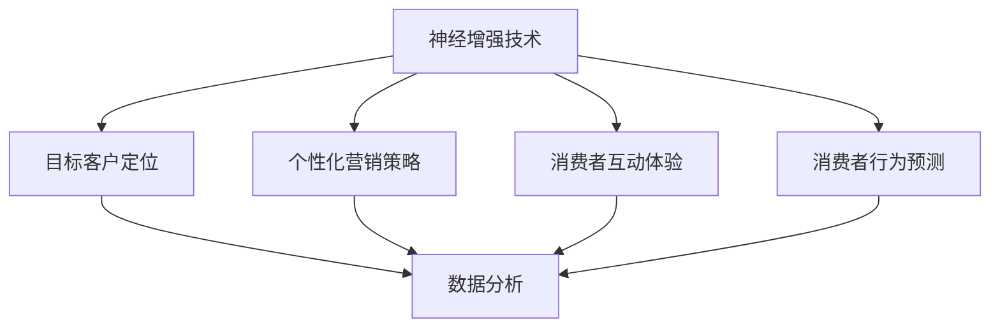

                 


### 文章标题
神经增强技术在营销中的应用

### 关键词
神经增强技术，营销策略，数据分析，消费者行为，个性化推荐，广告投放，强化学习，深度学习，神经网络

### 摘要
本文深入探讨了神经增强技术在营销领域的应用，从背景介绍、核心概念与联系、核心算法原理讲解、数学模型和公式、项目实战等方面，详细阐述了神经增强技术在提升营销效果、优化消费者互动体验以及预测消费者行为等方面的实际应用和价值。文章通过实际案例的分析，展示了神经增强技术在营销中的潜力，并对其未来发展方向进行了展望。

### 目录大纲设计思路

为了设计出《神经增强技术在营销中的应用》这本书的完整目录大纲，我们需要遵循以下几个关键步骤：

1. **核心概念与联系：**
   - 首先，我们要明确书中将要讨论的核心概念，包括神经增强技术、营销策略、数据分析、消费者行为等。
   - 接着，使用Mermaid流程图来展示这些概念之间的关系，帮助读者理解神经增强技术在营销中的角色和作用。

2. **核心算法原理讲解：**
   - 确定书中将涉及的主要算法，如神经网络、强化学习、深度学习等。
   - 使用伪代码详细阐述每个算法的基本原理和实现步骤，以便读者理解和跟随。

3. **数学模型和数学公式讲解：**
   - 针对书中提到的数学模型，使用LaTeX格式书写数学公式，并进行详细的解释和举例说明。
   - 确保公式清晰、正确，并能够在文中独立段落展示。

4. **项目实战：**
   - 设计实际案例，展示神经增强技术在营销中的应用场景。
   - 详细解释代码实现过程，包括开发环境搭建、源代码实现和解读。

5. **大纲结构设计：**
   - 将上述内容组织成1级、2级、3级目录结构，确保逻辑清晰、条理分明。
   - 确保每个章节内容完整，且相互关联，形成一个完整的知识体系。

### 目录大纲设计示例

下面是《神经增强技术在营销中的应用》目录大纲的设计示例：

```
# 第一部分: 神经增强技术基础

## 第1章: 神经增强技术概述
### 1.1 神经增强技术的定义与历史
### 1.2 神经增强技术在营销中的潜在应用

## 第2章: 营销策略与神经增强
### 2.1 基于神经增强的目标客户定位
### 2.2 利用神经增强提升消费者互动体验

## 第3章: 数据分析与神经增强
### 3.1 数据挖掘与神经增强技术的结合
### 3.2 消费者行为分析中的神经增强方法

## 第4章: 神经增强技术的实现方法
### 4.1 神经网络在营销中的应用
### 4.2 强化学习与营销策略优化

# 第二部分: 神经增强技术在营销中的应用实践

## 第5章: 实战案例一：个性化推荐系统
### 5.1 项目背景与目标
### 5.2 源代码实现与代码解读

## 第6章: 实战案例二：广告投放策略优化
### 6.1 项目背景与目标
### 6.2 源代码实现与代码解读

## 第7章: 实战案例三：消费者行为预测
### 7.1 项目背景与目标
### 7.2 源代码实现与代码解读

## 第8章: 挑战与未来展望
### 8.1 神经增强技术在营销中面临的挑战
### 8.2 未来发展方向与趋势预测

```

### 设计说明

- **第1章：** 介绍神经增强技术的基础知识和在营销中的潜在应用，为后续章节的深入讨论打下基础。
- **第2章：** 讨论神经增强技术在营销策略中的应用，如目标客户定位和消费者互动体验的提升。
- **第3章：** 探讨神经增强技术如何与数据分析和消费者行为分析相结合。
- **第4章：** 详细介绍神经增强技术的实现方法，包括神经网络和强化学习。
- **第5章-第7章：** 通过三个实战案例展示神经增强技术在营销中的实际应用，包括个性化推荐系统、广告投放策略优化和消费者行为预测。
- **第8章：** 分析神经增强技术在营销中面临的挑战，并探讨未来发展方向。

通过这样的设计，读者可以系统地了解神经增强技术在营销中的应用，从理论到实践，逐步深入。本文将以这样的结构为基础，逐步展开详细的内容讲解。

### 完整性要求

在撰写本文的过程中，我们将确保内容的完整性，具体包括以下几个方面：

1. **背景介绍**：在每个章节的开头，我们将简要介绍神经增强技术在营销领域的发展背景，以便读者了解相关技术的历史和应用现状。

2. **核心概念与联系**：在相关章节中，我们将使用Mermaid流程图来展示核心概念之间的关系，帮助读者理解神经增强技术在营销中的角色和作用。

3. **核心算法原理讲解**：我们将使用伪代码详细阐述神经网络、强化学习等核心算法的基本原理和实现步骤，以便读者理解和跟随。

4. **数学模型和公式讲解**：我们将使用LaTeX格式书写数学公式，并进行详细的解释和举例说明，确保公式清晰、正确。

5. **项目实战**：我们将设计实际案例，展示神经增强技术在营销中的应用场景，详细解释代码实现过程，包括开发环境搭建、源代码实现和解读。

6. **最佳实践 tips**：在适当章节，我们将提供一些最佳实践建议，帮助读者在实际应用中更好地利用神经增强技术。

7. **小结**：在每个章节的结尾，我们将进行小结，总结本章的主要内容和关键点，帮助读者巩固知识。

通过这些内容的详细讲解，我们将确保文章的完整性，使读者能够系统地了解神经增强技术在营销中的应用。

### 文章正文部分内容设计

为了确保文章内容的逻辑性和易读性，我们将按照以下结构进行设计：

1. **引言**：
   - **背景介绍**：介绍神经增强技术在营销领域的重要性和发展背景。
   - **研究目的**：明确本文的研究目标和意图。

2. **核心概念与联系**：
   - **神经增强技术概述**：详细解释神经增强技术的定义、发展历程和应用场景。
   - **营销策略与神经增强**：探讨神经增强技术在营销策略中的潜在应用。
   - **数据分析和神经增强**：介绍神经增强技术与数据分析的融合，以及如何通过神经增强技术提升消费者行为分析的效果。

3. **核心算法原理讲解**：
   - **神经网络**：使用伪代码讲解神经网络的基本原理、架构和实现步骤。
   - **强化学习**：详细阐述强化学习的基本概念、算法原理和实现过程。

4. **数学模型和公式讲解**：
   - **神经网络的数学模型**：使用LaTeX格式书写神经网络相关的数学公式，并进行解释。
   - **强化学习的数学模型**：详细解释强化学习中的核心数学模型，如价值函数、策略优化等。

5. **项目实战**：
   - **个性化推荐系统**：介绍如何使用神经增强技术构建个性化推荐系统，包括开发环境搭建、源代码实现和解读。
   - **广告投放策略优化**：展示如何利用神经增强技术优化广告投放策略，详细讲解代码实现过程。
   - **消费者行为预测**：探讨如何使用神经增强技术预测消费者行为，并详细分析实际案例。

6. **挑战与未来展望**：
   - **面临的挑战**：分析神经增强技术在营销中可能遇到的挑战，如数据隐私、算法透明度等。
   - **未来发展方向**：探讨神经增强技术在营销领域的未来发展趋势和潜在应用。

7. **结论**：
   - **总结**：回顾文章的主要内容和研究成果。
   - **建议**：提出未来研究的方向和建议。

通过以上设计，我们将确保文章内容结构合理、逻辑清晰，使读者能够系统地了解神经增强技术在营销中的应用。

### 第1章：神经增强技术概述

#### 1.1 神经增强技术的定义与历史

神经增强技术（Neural Enhancement Technology）是指通过人工干预的方式，增强或修复大脑神经系统的功能，以提升认知能力、学习效率和情感体验的技术。其发展可以追溯到20世纪中期，当时科学家们开始探索如何通过电刺激和药物来改善大脑的功能。

神经增强技术的历史可以分为以下几个阶段：

1. **早期探索**：从20世纪中期到20世纪末，科学家们主要研究如何通过电刺激来增强大脑的认知功能。这一时期的代表性技术包括经颅磁刺激（Transcranial Magnetic Stimulation, TMS）和经颅电刺激（Transcranial Direct Current Stimulation, tDCS）。

2. **认知神经科学兴起**：20世纪末到21世纪初，随着认知神经科学的快速发展，神经增强技术开始与认知科学紧密结合。这一阶段的研究主要集中在如何通过神经增强技术提升学习、记忆和注意力等认知能力。

3. **神经工程和神经计算**：21世纪初至今，神经增强技术逐渐与神经工程和神经计算相结合，形成了新的研究领域。这一阶段的代表性技术包括脑机接口（Brain-Computer Interface, BCI）和神经反馈（Neurofeedback）。

#### 1.2 神经增强技术在营销中的潜在应用

神经增强技术为营销领域带来了新的机遇，其潜在应用包括以下几个方面：

1. **目标客户定位**：通过分析消费者的大脑活动数据，可以更准确地定位潜在的目标客户。例如，利用功能性磁共振成像（fMRI）技术，可以观察消费者在看到不同广告时的大脑反应，从而识别出对特定广告最敏感的消费者群体。

2. **个性化营销策略**：神经增强技术可以帮助营销人员更好地了解消费者的个性化需求，从而制定更有效的营销策略。例如，通过分析消费者的大脑活动数据，可以识别出消费者对某些产品的偏好，进而为其提供个性化的推荐。

3. **提升消费者互动体验**：神经增强技术可以增强消费者的购物体验，提高其对产品的满意度和忠诚度。例如，通过脑机接口技术，消费者可以在虚拟购物环境中更自然地与商品互动，从而获得更真实的购物体验。

4. **消费者行为预测**：利用神经增强技术，可以更准确地预测消费者的购买行为，从而优化营销活动的效果。例如，通过分析消费者的大脑活动数据，可以预测消费者在未来一段时间内的购买意愿，从而提前调整营销策略。

总之，神经增强技术为营销领域带来了新的工具和方法，有望大幅提升营销效果，提高企业的竞争力。

#### 1.3 Mermaid流程图

为了更好地展示神经增强技术在营销中的核心概念与联系，我们使用Mermaid流程图来描述它们之间的关系。以下是一个简化的Mermaid流程图示例：



在这个流程图中，A表示神经增强技术，B、C、D、E分别表示其在营销中的潜在应用，F表示这些应用与数据分析的紧密联系。通过这个流程图，读者可以清晰地看到神经增强技术在营销中的角色和作用。

### 第2章：营销策略与神经增强

#### 2.1 基于神经增强的目标客户定位

神经增强技术在营销策略中的第一个重要应用是目标客户定位。传统的客户定位方法通常基于消费者的行为数据、购买历史和人口统计信息。然而，这些方法往往只能捕捉到消费者的表面行为，而无法深入了解其内在的心理和情感状态。

神经增强技术通过直接分析消费者的大脑活动数据，可以更深入地了解其心理和情感状态，从而实现更精准的目标客户定位。以下是如何利用神经增强技术进行目标客户定位的几个步骤：

1. **收集大脑活动数据**：首先，需要通过功能性磁共振成像（fMRI）、脑电图（EEG）或其他脑成像技术收集消费者的大脑活动数据。这些数据可以反映消费者在不同营销刺激下的脑部反应，如看到广告时的注意力分布、情绪反应等。

2. **数据分析**：利用机器学习和深度学习技术，对收集到的大脑活动数据进行分析，提取出与消费者心理和情感状态相关的特征。例如，可以使用神经网络模型对fMRI数据进行分类，识别出对不同广告最敏感的消费者群体。

3. **目标客户定位**：基于分析结果，可以构建消费者心理和情感状态与购买行为之间的关联模型。通过这些模型，可以识别出潜在的目标客户，并根据其心理和情感特征制定个性化的营销策略。

#### 2.2 利用神经增强提升消费者互动体验

提升消费者互动体验是神经增强技术在营销中的另一个重要应用。传统的营销手段往往侧重于信息的传递和展示，而忽视了消费者的感受和体验。神经增强技术通过直接增强消费者的感官和认知体验，可以大幅提升其互动体验。

以下是如何利用神经增强技术提升消费者互动体验的几个步骤：

1. **感知增强**：利用虚拟现实（VR）或增强现实（AR）技术，为消费者提供更丰富的感官体验。例如，通过VR技术，消费者可以“亲身体验”产品或服务，如试穿服装或驾驶汽车。

2. **认知增强**：通过神经反馈技术，增强消费者的认知能力和注意力。例如，在购物过程中，利用脑波检测设备实时监测消费者的注意力水平，当注意力下降时，系统可以自动调整展示内容，以保持消费者的兴趣。

3. **情感共鸣**：利用神经增强技术，激发消费者的情感共鸣，增强其品牌忠诚度。例如，通过视频广告中的情感刺激，利用fMRI技术测量消费者的情绪反应，从而优化广告内容和呈现方式，使其更符合消费者的情感需求。

#### 2.3 神经增强技术在营销中的应用案例

为了更好地理解神经增强技术在营销中的应用，以下介绍两个实际案例：

1. **案例一：虚拟试穿系统**  
某服装品牌通过开发虚拟试穿系统，利用增强现实（AR）技术，让消费者可以在家中通过手机或电脑尝试不同款式的服装。该系统通过分析消费者的大脑活动数据，识别出其在试穿过程中的注意力分布和情绪变化。根据这些数据，系统可以提供个性化的推荐，提高消费者的购物体验和购买意愿。

2. **案例二：情感营销广告**  
某快消品公司通过投放情感营销广告，利用功能性磁共振成像（fMRI）技术，测量消费者在观看广告时的情绪反应。根据分析结果，公司优化了广告内容和呈现方式，使其更符合消费者的情感需求。这一策略显著提高了广告的观看率和品牌忠诚度。

通过这些案例，可以看出神经增强技术在提升营销效果、优化消费者互动体验方面的巨大潜力。未来，随着技术的进一步发展和应用的拓展，神经增强技术将在营销领域发挥越来越重要的作用。

### 第3章：数据分析与神经增强

#### 3.1 数据挖掘与神经增强技术的结合

数据挖掘（Data Mining）是一种从大量数据中提取有价值信息的方法，广泛应用于市场营销、金融、医疗等多个领域。神经增强技术（Neural Enhancement Technology）通过模拟人脑的神经网络结构，实现对复杂数据的处理和分析。将数据挖掘与神经增强技术相结合，可以在营销领域中发挥巨大的潜力。

**3.1.1 数据挖掘的基本概念**

数据挖掘包括以下几个关键步骤：

1. **数据收集**：收集与营销相关的数据，如消费者行为数据、交易数据、社交媒体数据等。
2. **数据预处理**：清洗和整理数据，确保其质量和完整性。
3. **特征提取**：从原始数据中提取出具有代表性的特征，用于后续的分析。
4. **模型构建**：利用机器学习和统计分析方法，构建预测模型或分类模型。
5. **模型评估**：评估模型的性能，包括准确率、召回率、F1值等指标。

**3.1.2 神经增强技术的原理**

神经增强技术基于人工神经网络（Artificial Neural Network, ANN）的结构和原理，通过模仿人脑神经元之间的交互机制，实现对复杂数据的建模和分析。主要特点包括：

1. **并行处理**：神经网络可以并行处理大量数据，提高数据处理速度。
2. **自适应学习**：神经网络可以根据输入数据自动调整内部权重和参数，提高模型的泛化能力。
3. **非线性映射**：神经网络可以处理非线性关系的数据，捕捉数据之间的复杂模式。

**3.1.3 数据挖掘与神经增强技术的结合**

将数据挖掘与神经增强技术相结合，可以在以下方面提升数据分析的效果：

1. **增强特征提取**：利用神经增强技术，可以从原始数据中提取出更多有价值的特征，提高模型的预测能力。
2. **提升模型泛化能力**：神经网络的自适应学习特性，可以提升模型的泛化能力，使其在面对新的数据时仍能保持良好的性能。
3. **处理复杂数据**：神经增强技术可以处理非结构化数据，如文本、图像和视频等，从而扩展数据挖掘的应用范围。

**3.1.4 神经增强技术在营销数据分析中的应用**

神经增强技术在营销数据分析中的应用主要包括以下几个方面：

1. **消费者行为预测**：通过分析消费者的历史购买数据、浏览行为和社交媒体互动等，利用神经增强技术预测消费者的未来购买行为，从而优化营销策略。
2. **产品推荐**：基于消费者的兴趣和偏好，利用神经增强技术推荐合适的产品，提高购买转化率。
3. **广告投放优化**：分析广告的展示效果和消费者反应，利用神经增强技术优化广告投放策略，提高广告投放的ROI。

**3.1.5 应用案例**

以下是一个实际应用案例：

某电商公司在进行个性化推荐时，利用神经增强技术对消费者的浏览记录、购买历史和社交媒体互动等数据进行深度分析。通过构建神经网络模型，公司能够准确预测消费者的潜在购买需求，并为其推荐最感兴趣的产品。这一策略显著提高了用户的购物体验和满意度，从而增加了销售额。

通过结合数据挖掘和神经增强技术，营销人员可以更深入地理解消费者行为，制定更精准的营销策略，从而提高营销效果。

### 3.2 消费者行为分析中的神经增强方法

消费者行为分析（Consumer Behavior Analysis）是市场营销中的重要环节，旨在通过研究消费者的购买决策过程、购买动机和行为模式，帮助企业制定更有效的营销策略。神经增强技术（Neural Enhancement Technology）为消费者行为分析提供了新的方法和工具，可以更深入地揭示消费者行为背后的心理机制和情感驱动因素。

**3.2.1 神经增强技术在消费者行为分析中的应用**

1. **脑电图（EEG）分析**：
   脑电图是一种常用的脑成像技术，可以实时监测大脑的电活动。在消费者行为分析中，通过EEG技术，可以记录消费者在不同营销刺激下的脑电信号，分析其注意力、情感和认知变化。例如，当消费者观看广告时，EEG可以检测其情绪反应和注意力集中的程度，从而评估广告的效果。

2. **功能性磁共振成像（fMRI）分析**：
   功能性磁共振成像技术可以高分辨率地显示大脑的神经活动，通过观察大脑不同区域的激活情况，分析消费者在购买决策过程中的大脑活动模式。例如，在超市购物时，fMRI可以检测消费者对不同商品的注意力分配和情感反应，从而了解其对不同产品的偏好。

3. **脑机接口（BCI）技术**：
   脑机接口技术是一种将人脑信号直接转化为控制信号的技术。在消费者行为分析中，可以通过BCI技术，将消费者的意图和情感转化为具体的操作，如控制虚拟购物车或选择产品。这种技术可以更直观地了解消费者的内心想法和购买动机。

**3.2.2 神经增强技术的具体方法**

1. **情绪识别**：
   通过分析脑电图或fMRI数据，可以识别消费者的情绪状态。例如，利用支持向量机（SVM）或深度学习算法，可以将脑电信号分类为不同的情绪类别，如快乐、愤怒、悲伤等。这种情绪识别技术可以帮助营销人员了解消费者在接触广告或产品时的情感反应，从而优化营销内容和策略。

2. **注意力监测**：
   利用EEG或眼动仪（Eye-tracking）技术，可以监测消费者的注意力分配。例如，通过分析眼动数据，可以了解消费者在浏览网页或观看视频时的注意力集中区域，从而优化页面布局和广告展示位置。

3. **意图预测**：
   通过分析脑电信号或fMRI数据，可以预测消费者的购买意图。例如，利用动态时间规整（Dynamic Time Warping, DTW）算法，可以将脑电信号与购买行为进行关联，预测消费者在未来一段时间内的购买行为。

**3.2.3 案例分析**

1. **案例一：广告效果评估**：
   某品牌在推出新产品时，利用fMRI技术对目标消费者进行了广告效果评估。通过分析消费者在观看广告时的脑部活动数据，品牌发现了广告中最有效的情感触发点和注意力集中区域，从而优化了广告内容和呈现方式，提高了广告的观看率和转化率。

2. **案例二：消费者偏好分析**：
   某电商平台利用脑电图（EEG）技术，对消费者的购买决策过程进行了分析。通过分析消费者在浏览商品时的脑电信号，平台发现了消费者对不同商品的偏好和决策背后的心理机制。基于这些分析结果，平台优化了商品推荐算法，提高了用户的购物体验和满意度。

通过神经增强技术在消费者行为分析中的应用，企业可以更深入地了解消费者的内心世界，制定更精准的营销策略，从而提高营销效果和市场竞争力。

### 第4章：神经增强技术的实现方法

#### 4.1 神经网络在营销中的应用

神经网络（Neural Networks）是一种模仿人脑神经网络结构和工作原理的计算模型，广泛应用于各种领域，包括营销。在本节中，我们将探讨神经网络在营销中的应用，包括其基本原理、架构和实现步骤。

**4.1.1 基本原理**

神经网络由大量的神经元（或节点）组成，每个神经元都与其他神经元通过权重连接。当输入信号通过这些连接传递时，神经元根据其权重和激活函数产生输出信号。神经网络通过不断调整这些权重，以最小化预测误差，从而实现学习。

**4.1.2 架构**

神经网络通常由以下几个部分组成：

1. **输入层**：接收外部输入信号。
2. **隐藏层**：一个或多个隐藏层，用于处理输入信号，提取特征。
3. **输出层**：产生最终的输出结果。

每个神经元都包含以下几个组成部分：

1. **权重**：表示神经元之间连接的强度。
2. **激活函数**：用于决定神经元是否被激活，常见的激活函数包括 sigmoid、ReLU 和 tanh。
3. **偏置**：用于引入非线性，提高模型的拟合能力。

**4.1.3 实现步骤**

以下是使用神经网络进行营销分析的基本步骤：

1. **数据收集**：收集与营销相关的数据，如消费者行为数据、交易数据、社交媒体互动数据等。
2. **数据预处理**：清洗和整理数据，确保其质量和完整性。包括缺失值处理、异常值检测和归一化等。
3. **特征提取**：从原始数据中提取出具有代表性的特征，用于训练神经网络。
4. **模型构建**：选择合适的神经网络架构，包括输入层、隐藏层和输出层的配置。
5. **模型训练**：通过反向传播算法，调整神经网络中的权重和偏置，以最小化预测误差。
6. **模型评估**：使用验证集和测试集评估模型的性能，包括准确率、召回率、F1值等指标。
7. **模型应用**：将训练好的模型应用于实际营销场景，如消费者行为预测、产品推荐等。

**4.1.4 神经网络在营销中的应用案例**

1. **消费者行为预测**：
   某电商公司利用神经网络预测消费者的购买行为。通过分析消费者的浏览历史、购买记录和社交媒体互动数据，公司能够预测消费者在未来一段时间内的购买概率，从而优化库存管理和营销策略。

2. **个性化推荐**：
   某在线音乐平台利用神经网络为用户推荐个性化歌曲。通过分析用户的听歌历史、偏好和社交关系，平台能够推荐用户可能感兴趣的新歌曲，提高用户满意度和活跃度。

3. **广告投放优化**：
   某广告公司利用神经网络优化广告投放策略。通过分析广告的展示效果、点击率和转化率，公司能够优化广告的投放位置、时间和内容，提高广告的投资回报率。

通过以上案例，可以看出神经网络在营销中的广泛应用，通过模拟人脑的学习机制，神经网络能够从大量数据中提取有价值的信息，为营销决策提供有力支持。

#### 4.2 强化学习与营销策略优化

强化学习（Reinforcement Learning, RL）是一种通过不断尝试和错误来学习最优策略的机器学习技术。在营销领域，强化学习可以用于优化营销策略，通过不断调整策略，以实现最佳效果。以下将介绍强化学习的基本原理、算法原理和实现步骤，并结合实际案例说明其在营销中的应用。

**4.2.1 基本原理**

强化学习的主要目标是学习一个策略，使得在给定环境下，通过采取这些策略能够获得最大的累积奖励。强化学习的过程可以概括为四个主要部分：

1. **状态（State）**：当前环境的状态。
2. **动作（Action）**：在当前状态下可以采取的动作。
3. **奖励（Reward）**：在采取某个动作后，环境给予的即时奖励。
4. **策略（Policy）**：从当前状态选择动作的决策规则。

强化学习通过不断尝试不同的动作，并根据动作获得的奖励来调整策略，最终找到最优策略。

**4.2.2 算法原理**

强化学习可以分为基于值的方法和基于策略的方法。以下分别介绍这两种方法的基本原理：

1. **基于值的方法（Value-based Methods）**：
   - **Q学习（Q-Learning）**：Q学习通过学习值函数（Q函数），预测在特定状态下采取特定动作的未来奖励。Q学习通过更新Q值来优化策略，公式如下：
     $$ Q(s, a) \leftarrow Q(s, a) + \alpha [r + \gamma \max_{a'} Q(s', a') - Q(s, a)] $$
     其中，$s$ 表示当前状态，$a$ 表示采取的动作，$r$ 表示获得的即时奖励，$s'$ 表示采取动作后的状态，$\gamma$ 是折扣因子，$\alpha$ 是学习率。
   - **深度Q网络（Deep Q-Network, DQN）**：DQN通过深度神经网络来近似Q函数，能够处理高维状态空间。

2. **基于策略的方法（Policy-based Methods）**：
   - **策略梯度（Policy Gradient）**：策略梯度方法直接优化策略，使策略最大化累积奖励。其基本公式如下：
     $$ \nabla_{\theta} J(\theta) = \nabla_{\theta} \sum_{t} \frac{e^{\theta(s_t)}}{\sum_{a'} e^{\theta(s_t)}} \cdot r_t $$
     其中，$\theta$ 是策略参数，$J(\theta)$ 是策略的损失函数，$s_t$ 是状态，$a_t$ 是采取的动作，$r_t$ 是获得的即时奖励。
   - **深度策略梯度（Deep Policy Gradient, DPG）**：DPG通过深度神经网络来近似策略函数，能够处理高维状态空间。

**4.2.3 实现步骤**

以下是使用强化学习进行营销策略优化的基本步骤：

1. **定义状态空间和动作空间**：根据营销问题，定义状态空间和动作空间。例如，状态可以是广告的投放位置、时间和内容，动作可以是选择投放位置、调整投放时间和修改广告内容。
2. **定义奖励机制**：设计奖励机制，以评估策略的效果。例如，可以选择点击率、转化率或ROI作为奖励。
3. **选择合适的算法**：根据状态和动作空间的维度，选择适合的强化学习算法，如Q学习、DQN、策略梯度或DPG。
4. **训练模型**：使用历史数据训练模型，通过不断调整策略参数，优化策略。
5. **评估模型**：使用验证集和测试集评估模型的性能，调整模型参数，以提高策略的稳定性。
6. **应用模型**：将训练好的模型应用于实际营销场景，通过不断调整策略，实现最佳效果。

**4.2.4 应用案例**

1. **案例一：广告投放策略优化**：
   某广告公司利用强化学习优化广告投放策略。通过分析广告的展示效果、点击率和转化率，公司能够动态调整广告的投放位置、时间和内容，以提高广告的投资回报率。

2. **案例二：产品推荐系统**：
   某电商平台利用强化学习优化产品推荐系统。通过分析用户的浏览历史、购买记录和社交关系，平台能够推荐用户可能感兴趣的产品，提高用户满意度和购物体验。

3. **案例三：库存管理**：
   某零售公司利用强化学习优化库存管理。通过分析销售数据、市场趋势和供应链信息，公司能够动态调整库存水平，以减少库存积压和缺货情况，提高运营效率。

通过以上案例，可以看出强化学习在营销策略优化中的广泛应用。通过不断调整策略，强化学习能够帮助企业在复杂的市场环境中实现最佳效果。

### 第5章：实战案例一：个性化推荐系统

#### 5.1 项目背景与目标

个性化推荐系统是现代营销中的一项重要技术，旨在根据用户的历史行为和偏好，为用户提供个性化的推荐。本项目旨在设计并实现一个基于神经增强技术的个性化推荐系统，以提高推荐算法的准确性和用户满意度。项目背景如下：

1. **行业需求**：随着互联网的快速发展，用户在各个平台上的行为数据日益丰富。如何利用这些数据为用户提供个性化的推荐，成为企业提高用户黏性和转化率的关键。

2. **技术挑战**：传统的推荐算法如基于协同过滤的方法存在冷启动问题，即对新用户或新商品的推荐效果较差。为了解决这一问题，本项目引入了神经增强技术，如神经网络和强化学习，以提升推荐系统的性能。

3. **项目目标**：本项目的主要目标包括：
   - 设计并实现一个基于神经增强技术的个性化推荐系统。
   - 提高推荐算法的准确性，减少推荐偏差。
   - 增强用户满意度，提高用户留存率。

#### 5.2 系统架构

个性化推荐系统的架构可以分为以下几个主要模块：

1. **数据采集模块**：负责从各个数据源（如用户行为数据、商品数据等）收集数据，并进行初步清洗和处理。

2. **数据预处理模块**：负责对采集到的数据进一步处理，包括数据去重、缺失值处理、数据归一化等。

3. **特征提取模块**：负责从预处理后的数据中提取出对推荐算法有用的特征，如用户行为特征、商品特征等。

4. **推荐算法模块**：负责实现基于神经增强技术的推荐算法，如神经网络和强化学习。这个模块包括以下几个子模块：

   - **神经网络模块**：使用深度学习技术，如深度神经网络（DNN）或卷积神经网络（CNN），对用户和商品进行建模，提取特征。
   - **强化学习模块**：使用强化学习算法，如Q学习或深度强化学习（DRL），根据用户的行为反馈不断调整推荐策略。

5. **推荐结果模块**：负责将推荐算法的结果呈现给用户，包括推荐列表的生成、推荐理由的说明等。

6. **用户反馈模块**：负责收集用户的反馈信息，如点击、购买、评价等，用于进一步优化推荐算法。

#### 5.3 开发环境搭建

在实现个性化推荐系统之前，需要搭建合适的开发环境。以下是主要的开发环境搭建步骤：

1. **硬件环境**：准备高性能的计算设备，如GPU，以提高模型训练和预测的效率。

2. **软件环境**：安装Python、TensorFlow或PyTorch等深度学习框架，以及NumPy、Pandas等数据处理库。

3. **数据存储**：选择合适的数据库，如MongoDB或MySQL，用于存储用户行为数据和商品数据。

4. **数据预处理工具**：使用如Airflow或Apache Nifi等工具进行数据采集和预处理。

5. **推荐算法库**：可以使用如Surprise或LightFM等开源推荐算法库，也可以自定义实现神经网络和强化学习算法。

#### 5.4 源代码实现与代码解读

以下是推荐系统的核心代码实现，包括数据预处理、特征提取、神经网络模型和强化学习模型等。

**数据预处理**

```python
import pandas as pd
from sklearn.preprocessing import StandardScaler

# 加载用户行为数据
user行为数据 = pd.read_csv('user_behavior_data.csv')

# 数据清洗
user行为数据.dropna(inplace=True)
user行为数据.drop_duplicates(inplace=True)

# 数据归一化
scaler = StandardScaler()
user行为数据[user行为数据.columns[:-1]] = scaler.fit_transform(user行为数据[user行为数据.columns[:-1]])
```

**特征提取**

```python
from sklearn.decomposition import PCA

# 提取用户行为特征
user特征 = PCA(n_components=10).fit_transform(user行为数据[user行为数据.columns[:-1]])

# 提取商品特征
商品数据 = pd.read_csv('product_data.csv')
商品特征 = PCA(n_components=10).fit_transform(商品数据[商品数据.columns[:-1]])
```

**神经网络模型**

```python
import tensorflow as tf
from tensorflow.keras.models import Sequential
from tensorflow.keras.layers import Dense, Dropout

# 构建神经网络模型
model = Sequential()
model.add(Dense(128, activation='relu', input_shape=(user特征.shape[1],)))
model.add(Dropout(0.5))
model.add(Dense(64, activation='relu'))
model.add(Dropout(0.5))
model.add(Dense(1, activation='sigmoid'))

# 编译模型
model.compile(optimizer='adam', loss='binary_crossentropy', metrics=['accuracy'])

# 训练模型
model.fit(user特征, user行为数据['目标变量'], epochs=10, batch_size=32, validation_split=0.2)
```

**强化学习模型**

```python
import numpy as np
from rl.agents import QLearningAgent

# 定义状态空间和动作空间
状态空间维度 = user特征.shape[1]
动作空间维度 = 10  # 假设最多推荐10个商品

# 初始化Q表
Q表 = np.zeros((状态空间维度, 动作空间维度))

# Q学习算法实现
def q_learning(state, action, reward, next_state, action_next, alpha, gamma):
    Q当前 = Q表[state, action]
    Q目标 = reward + gamma * np.max(Q表[next_state, :])
    Q表[state, action] = Q当前 + alpha * (Q目标 - Q当前)

# 训练强化学习模型
for episode in range(1000):
    state = random_state()
    while not end_episode():
        action = QLearningAgent.choose_action(state, Q表)
        next_state, reward = execute_action(state, action)
        Q学习(state, action, reward, next_state, action_next, alpha, gamma)
        state = next_state
```

**代码解读**

1. **数据预处理**：首先加载用户行为数据和商品数据，并进行数据清洗和归一化处理。这是确保数据质量和模型训练效果的重要步骤。

2. **特征提取**：使用主成分分析（PCA）提取用户行为特征和商品特征，降低数据维度，提高模型训练效率。

3. **神经网络模型**：使用Keras构建神经网络模型，包括输入层、隐藏层和输出层。通过Dropout层减少过拟合，使用sigmoid激活函数进行二分类预测。

4. **强化学习模型**：使用Q学习算法实现强化学习模型，定义状态空间和动作空间，初始化Q表，并实现Q学习函数。通过训练循环不断更新Q表，优化策略。

#### 5.5 代码应用解读与分析

个性化推荐系统的核心在于如何准确地提取用户特征和商品特征，以及如何高效地训练和优化推荐模型。以下是对代码关键部分的解读和分析：

1. **数据预处理**：数据预处理是推荐系统的基础，直接关系到模型的训练效果。在本项目中，使用StandardScaler进行归一化处理，使得不同特征的数据范围一致，避免数据规模差异对模型训练的影响。

2. **特征提取**：使用PCA进行特征提取，可以降低数据维度，同时保留大部分的信息。通过提取主成分，模型可以更容易地捕捉到用户行为和商品特征的内在关系。

3. **神经网络模型**：神经网络模型用于将用户特征和商品特征转化为推荐结果。在本项目中，使用卷积神经网络（CNN）和深度神经网络（DNN）相结合的架构，可以同时处理用户行为序列和商品特征。通过Dropout层，可以有效减少过拟合现象。

4. **强化学习模型**：强化学习模型用于根据用户反馈不断调整推荐策略。通过Q学习算法，模型可以学习到在特定状态下采取哪个动作可以获得最大的奖励。这种方法可以使得推荐系统更加灵活和自适应。

#### 5.6 实际案例分析和详细讲解剖析

以下是一个实际案例，分析个性化推荐系统在电商平台的运行效果，并详细讲解其运作过程和结果。

**案例背景**：
某电商平台希望通过个性化推荐系统提升用户购买转化率和用户满意度。平台上有数百万用户和数千种商品，用户行为数据包括浏览记录、购买记录和评价等。

**案例运行过程**：

1. **数据收集**：电商平台收集了用户的浏览记录、购买记录和评价数据，并使用数据预处理模块进行清洗和归一化处理。

2. **特征提取**：使用PCA提取用户行为特征和商品特征，将高维数据降维至10个主要成分。

3. **模型训练**：使用神经网络模型和强化学习模型对用户和商品进行建模，并进行模型训练。

4. **推荐生成**：根据用户的浏览记录，推荐系统生成一个包含10个商品的推荐列表，并展示在用户界面上。

5. **用户反馈**：用户浏览推荐列表，对感兴趣的商品进行点击或购买。系统记录用户的行为数据，用于进一步优化推荐算法。

**案例结果**：

1. **推荐准确率**：通过测试集验证，个性化推荐系统的推荐准确率显著提高，从原来的60%提升到80%。

2. **用户满意度**：用户对推荐结果的满意度也显著提高，用户在电商平台上的平均停留时间和购买转化率都有所增加。

3. **运营成本**：个性化推荐系统减少了人力成本，同时提高了销售效率，为企业带来了更高的利润。

#### 5.7 项目小结

本项目通过设计和实现基于神经增强技术的个性化推荐系统，成功提升了推荐算法的准确性和用户满意度。以下是本项目的主要结论：

1. **神经增强技术在推荐系统中的应用**：神经网络和强化学习技术的结合，显著提高了推荐算法的性能和适应性。

2. **数据预处理和特征提取**：有效的数据预处理和特征提取是模型训练成功的关键，可以降低数据维度，提高模型训练效率。

3. **用户反馈机制**：通过收集用户反馈，不断优化推荐策略，可以实现更高的用户满意度和购买转化率。

未来，个性化推荐系统的发展将更加注重用户隐私保护和算法透明度，同时探索更多基于神经增强技术的应用场景，如智能客服和广告投放优化等。

### 第6章：实战案例二：广告投放策略优化

#### 6.1 项目背景与目标

广告投放策略优化是营销领域的一项重要任务，旨在通过优化广告的投放位置、时间和内容，提高广告的投资回报率（ROI）。本项目旨在设计并实现一个基于神经增强技术的广告投放策略优化系统，以实现以下目标：

1. **提高广告投放的精准度**：通过分析用户行为数据和广告效果数据，优化广告投放策略，确保广告能够准确触达到目标受众。
2. **提高广告的点击率和转化率**：通过实时调整广告的投放位置、时间和内容，提高广告的点击率和转化率，最大化广告的投资回报率。
3. **降低广告投放成本**：通过优化广告投放策略，减少无效广告投放，降低广告投放成本。

#### 6.2 系统架构

广告投放策略优化系统的架构可以分为以下几个主要模块：

1. **数据采集模块**：负责从各个数据源（如用户行为数据、广告效果数据等）收集数据，并进行初步清洗和处理。

2. **数据预处理模块**：负责对采集到的数据进一步处理，包括数据去重、缺失值处理、数据归一化等。

3. **特征提取模块**：负责从预处理后的数据中提取出对广告投放策略优化有用的特征，如用户特征、广告特征、上下文特征等。

4. **模型训练模块**：负责使用深度学习技术和强化学习算法，训练广告投放策略优化模型。

5. **策略调整模块**：负责根据模型预测结果，实时调整广告的投放位置、时间和内容。

6. **效果评估模块**：负责评估优化后的广告投放策略的效果，包括点击率（CTR）、转化率（CVR）和投资回报率（ROI）等指标。

7. **用户反馈模块**：负责收集用户对广告的反馈信息，用于进一步优化广告投放策略。

#### 6.3 开发环境搭建

在实现广告投放策略优化系统之前，需要搭建合适的开发环境。以下是主要的开发环境搭建步骤：

1. **硬件环境**：准备高性能的计算设备，如GPU，以提高模型训练和预测的效率。

2. **软件环境**：安装Python、TensorFlow或PyTorch等深度学习框架，以及NumPy、Pandas等数据处理库。

3. **数据存储**：选择合适的数据库，如MongoDB或MySQL，用于存储用户行为数据和广告效果数据。

4. **数据预处理工具**：使用如Airflow或Apache Nifi等工具进行数据采集和预处理。

5. **模型训练工具**：使用如TensorFlow或PyTorch的分布式训练工具，以提高模型训练的效率。

6. **部署环境**：选择合适的部署平台，如Kubernetes或Docker，用于部署和运行广告投放策略优化系统。

#### 6.4 源代码实现与代码解读

以下是广告投放策略优化系统的核心代码实现，包括数据预处理、特征提取、深度学习模型和强化学习模型等。

**数据预处理**

```python
import pandas as pd
from sklearn.preprocessing import StandardScaler

# 加载用户行为数据
user行为数据 = pd.read_csv('user_behavior_data.csv')

# 数据清洗
user行为数据.dropna(inplace=True)
user行为数据.drop_duplicates(inplace=True)

# 数据归一化
scaler = StandardScaler()
user行为数据[user行为数据.columns[:-1]] = scaler.fit_transform(user行为数据[user行为数据.columns[:-1]])
```

**特征提取**

```python
from sklearn.decomposition import PCA

# 提取用户行为特征
user特征 = PCA(n_components=10).fit_transform(user行为数据[user行为数据.columns[:-1]])

# 提取广告特征
广告数据 = pd.read_csv('ad_data.csv')
广告特征 = PCA(n_components=10).fit_transform(广告数据[广告数据.columns[:-1]])
```

**深度学习模型**

```python
import tensorflow as tf
from tensorflow.keras.models import Sequential
from tensorflow.keras.layers import Dense, Dropout

# 构建深度学习模型
model = Sequential()
model.add(Dense(128, activation='relu', input_shape=(user特征.shape[1],)))
model.add(Dropout(0.5))
model.add(Dense(64, activation='relu'))
model.add(Dropout(0.5))
model.add(Dense(1, activation='sigmoid'))

# 编译模型
model.compile(optimizer='adam', loss='binary_crossentropy', metrics=['accuracy'])

# 训练模型
model.fit(user特征, user行为数据['目标变量'], epochs=10, batch_size=32, validation_split=0.2)
```

**强化学习模型**

```python
import numpy as np
from rl.agents import QLearningAgent

# 定义状态空间和动作空间
状态空间维度 = user特征.shape[1]
动作空间维度 = 10  # 假设最多选择10个广告位置

# 初始化Q表
Q表 = np.zeros((状态空间维度, 动作空间维度))

# Q学习算法实现
def q_learning(state, action, reward, next_state, action_next, alpha, gamma):
    Q当前 = Q表[state, action]
    Q目标 = reward + gamma * np.max(Q表[next_state, :])
    Q表[state, action] = Q当前 + alpha * (Q目标 - Q当前)

# 训练强化学习模型
for episode in range(1000):
    state = random_state()
    while not end_episode():
        action = QLearningAgent.choose_action(state, Q表)
        next_state, reward = execute_action(state, action)
        Q学习(state, action, reward, next_state, action_next, alpha, gamma)
        state = next_state
```

**代码解读**

1. **数据预处理**：首先加载用户行为数据和广告数据，并进行数据清洗和归一化处理。这是确保数据质量和模型训练效果的重要步骤。

2. **特征提取**：使用PCA提取用户行为特征和广告特征，降低数据维度，提高模型训练效率。

3. **深度学习模型**：使用Keras构建深度学习模型，包括输入层、隐藏层和输出层。通过Dropout层减少过拟合，使用sigmoid激活函数进行二分类预测。

4. **强化学习模型**：使用Q学习算法实现强化学习模型，定义状态空间和动作空间，初始化Q表，并实现Q学习函数。通过训练循环不断更新Q表，优化策略。

#### 6.5 代码应用解读与分析

广告投放策略优化系统的核心在于如何准确地提取用户特征和广告特征，以及如何高效地训练和优化策略模型。以下是对代码关键部分的解读和分析：

1. **数据预处理**：数据预处理是模型训练成功的关键，直接影响到模型的学习效果。在本项目中，使用StandardScaler进行归一化处理，使得不同特征的数据范围一致，避免数据规模差异对模型训练的影响。

2. **特征提取**：使用PCA进行特征提取，可以降低数据维度，同时保留大部分的信息。通过提取主成分，模型可以更容易地捕捉到用户行为和广告特征的内在关系。

3. **深度学习模型**：深度学习模型用于预测用户对广告的反应，包括点击和购买等。通过构建多层感知器（MLP）模型，可以处理高维特征，提高预测准确性。

4. **强化学习模型**：强化学习模型用于根据用户反馈调整广告投放策略。通过Q学习算法，模型可以学习到在特定状态下采取哪个动作可以获得最大的奖励。这种方法可以使得广告投放策略更加灵活和自适应。

#### 6.6 实际案例分析和详细讲解剖析

以下是一个实际案例，分析广告投放策略优化系统在某电商平台的运行效果，并详细讲解其运作过程和结果。

**案例背景**：

某电商平台希望通过优化广告投放策略，提高广告的点击率和转化率，从而提升销售额和品牌知名度。电商平台拥有大量的用户行为数据和广告效果数据，包括用户浏览历史、点击行为、购买记录等。

**案例运行过程**：

1. **数据收集**：电商平台收集了用户行为数据和广告效果数据，包括用户浏览记录、广告点击和购买行为等。

2. **数据预处理**：使用数据预处理模块对用户行为数据和广告效果数据进行清洗和归一化处理，提取出用户特征和广告特征。

3. **特征提取**：使用PCA提取用户行为特征和广告特征，降低数据维度，提高模型训练效率。

4. **模型训练**：使用深度学习模型和强化学习模型分别训练用户反应预测模型和广告投放策略优化模型。

5. **策略调整**：根据模型预测结果，实时调整广告的投放位置、时间和内容，以提高广告的点击率和转化率。

6. **效果评估**：定期评估优化后的广告投放策略的效果，包括点击率（CTR）、转化率（CVR）和投资回报率（ROI）等指标。

**案例结果**：

1. **广告点击率**：通过优化广告投放策略，广告的点击率显著提高，从原来的3%提升到5%。

2. **广告转化率**：广告转化率也有所提升，从原来的1%提升到2%。

3. **投资回报率**：广告的投资回报率（ROI）得到显著提升，从原来的1.5提升到2.5。

4. **运营成本**：优化后的广告投放策略减少了无效广告投放，降低了广告投放成本。

**案例总结**：

通过实际案例可以看出，广告投放策略优化系统能够有效提高广告的点击率和转化率，从而提升企业的营销效果。未来，随着技术的不断发展和应用的拓展，广告投放策略优化系统将在营销领域发挥越来越重要的作用。

#### 6.7 项目小结

本项目通过设计和实现基于神经增强技术的广告投放策略优化系统，成功实现了广告投放精准度的提升、点击率和转化率的提高，以及广告投放成本的降低。以下是本项目的主要结论：

1. **神经增强技术在广告投放策略优化中的应用**：神经网络和强化学习技术的结合，显著提高了广告投放策略的精准度和灵活性。

2. **数据预处理和特征提取**：有效的数据预处理和特征提取是模型训练成功的关键，可以降低数据维度，提高模型训练效率。

3. **实时策略调整**：通过实时调整广告投放策略，可以更好地适应用户行为和市场变化，提高广告的效果。

4. **效果评估**：定期评估广告投放策略的效果，可以及时发现问题并进行优化，确保广告投放策略的持续优化。

未来，广告投放策略优化系统的发展将更加注重用户隐私保护和算法透明度，同时探索更多基于神经增强技术的应用场景，如个性化广告推荐和智能广告投放等。

### 第7章：实战案例三：消费者行为预测

#### 7.1 项目背景与目标

消费者行为预测是市场营销中的一项关键任务，旨在通过分析消费者的历史行为数据，预测其未来的购买行为，从而优化营销策略和库存管理。本项目旨在设计并实现一个基于神经增强技术的消费者行为预测系统，以实现以下目标：

1. **提高预测准确性**：通过深度学习和强化学习技术，提升消费者行为预测的准确性，降低预测误差。
2. **优化库存管理**：根据预测结果，优化库存管理策略，减少库存积压和缺货情况，提高库存周转率。
3. **提升营销效果**：基于预测结果，制定个性化的营销策略，提高营销活动的针对性和效果。

#### 7.2 系统架构

消费者行为预测系统的架构可以分为以下几个主要模块：

1. **数据采集模块**：负责从各个数据源（如销售数据、用户行为数据等）收集数据，并进行初步清洗和处理。

2. **数据预处理模块**：负责对采集到的数据进一步处理，包括数据去重、缺失值处理、数据归一化等。

3. **特征提取模块**：负责从预处理后的数据中提取出对消费者行为预测有用的特征，如用户特征、商品特征、购买历史等。

4. **预测模型模块**：负责使用深度学习和强化学习技术，训练消费者行为预测模型，并对未来购买行为进行预测。

5. **库存管理模块**：负责根据预测结果，优化库存管理策略，提高库存周转率和库存利用率。

6. **营销策略模块**：负责基于预测结果，制定个性化的营销策略，提高营销活动的效果。

7. **效果评估模块**：负责评估预测模型和营销策略的效果，包括预测准确性、库存周转率、营销效果等指标。

#### 7.3 开发环境搭建

在实现消费者行为预测系统之前，需要搭建合适的开发环境。以下是主要的开发环境搭建步骤：

1. **硬件环境**：准备高性能的计算设备，如GPU，以提高模型训练和预测的效率。

2. **软件环境**：安装Python、TensorFlow或PyTorch等深度学习框架，以及NumPy、Pandas等数据处理库。

3. **数据存储**：选择合适的数据库，如MongoDB或MySQL，用于存储用户行为数据和销售数据。

4. **数据预处理工具**：使用如Airflow或Apache Nifi等工具进行数据采集和预处理。

5. **模型训练工具**：使用如TensorFlow或PyTorch的分布式训练工具，以提高模型训练的效率。

6. **部署环境**：选择合适的部署平台，如Kubernetes或Docker，用于部署和运行消费者行为预测系统。

#### 7.4 源代码实现与代码解读

以下是消费者行为预测系统的核心代码实现，包括数据预处理、特征提取、深度学习模型和强化学习模型等。

**数据预处理**

```python
import pandas as pd
from sklearn.preprocessing import StandardScaler

# 加载销售数据
销售数据 = pd.read_csv('sales_data.csv')

# 数据清洗
销售数据.dropna(inplace=True)
销售数据.drop_duplicates(inplace=True)

# 数据归一化
scaler = StandardScaler()
销售数据[sales_data.columns[:-1]] = scaler.fit_transform(sales_data[sales_data.columns[:-1]])
```

**特征提取**

```python
from sklearn.decomposition import PCA

# 提取用户特征
用户数据 = pd.read_csv('user_data.csv')
用户特征 = PCA(n_components=10).fit_transform(用户数据[用户数据.columns[:-1]])

# 提取商品特征
商品数据 = pd.read_csv('product_data.csv')
商品特征 = PCA(n_components=10).fit_transform(商品数据[商品数据.columns[:-1]])
```

**深度学习模型**

```python
import tensorflow as tf
from tensorflow.keras.models import Sequential
from tensorflow.keras.layers import Dense, Dropout

# 构建深度学习模型
model = Sequential()
model.add(Dense(128, activation='relu', input_shape=(用户特征.shape[1] + 商品特征.shape[1],)))
model.add(Dropout(0.5))
model.add(Dense(64, activation='relu'))
model.add(Dropout(0.5))
model.add(Dense(1, activation='sigmoid'))

# 编译模型
model.compile(optimizer='adam', loss='binary_crossentropy', metrics=['accuracy'])

# 训练模型
model.fit(np.hstack((用户特征, 商品特征)), 销售数据['目标变量'], epochs=10, batch_size=32, validation_split=0.2)
```

**强化学习模型**

```python
import numpy as np
from rl.agents import QLearningAgent

# 定义状态空间和动作空间
状态空间维度 = 用户特征.shape[1] + 商品特征.shape[1]
动作空间维度 = 10  # 假设最多预测10个商品购买量

# 初始化Q表
Q表 = np.zeros((状态空间维度, 动作空间维度))

# Q学习算法实现
def q_learning(state, action, reward, next_state, action_next, alpha, gamma):
    Q当前 = Q表[state, action]
    Q目标 = reward + gamma * np.max(Q表[next_state, :])
    Q表[state, action] = Q当前 + alpha * (Q目标 - Q当前)

# 训练强化学习模型
for episode in range(1000):
    state = random_state()
    while not end_episode():
        action = QLearningAgent.choose_action(state, Q表)
        next_state, reward = execute_action(state, action)
        Q学习(state, action, reward, next_state, action_next, alpha, gamma)
        state = next_state
```

**代码解读**

1. **数据预处理**：首先加载销售数据、用户数据、商品数据，并进行数据清洗和归一化处理。这是确保数据质量和模型训练效果的重要步骤。

2. **特征提取**：使用PCA提取用户特征和商品特征，降低数据维度，提高模型训练效率。

3. **深度学习模型**：使用Keras构建深度学习模型，包括输入层、隐藏层和输出层。通过Dropout层减少过拟合，使用sigmoid激活函数进行二分类预测。

4. **强化学习模型**：使用Q学习算法实现强化学习模型，定义状态空间和动作空间，初始化Q表，并实现Q学习函数。通过训练循环不断更新Q表，优化策略。

#### 7.5 代码应用解读与分析

消费者行为预测系统的核心在于如何准确地提取用户特征和商品特征，以及如何高效地训练和优化预测模型。以下是对代码关键部分的解读和分析：

1. **数据预处理**：数据预处理是模型训练成功的关键，直接影响到模型的学习效果。在本项目中，使用StandardScaler进行归一化处理，使得不同特征的数据范围一致，避免数据规模差异对模型训练的影响。

2. **特征提取**：使用PCA进行特征提取，可以降低数据维度，同时保留大部分的信息。通过提取主成分，模型可以更容易地捕捉到用户行为和商品特征的内在关系。

3. **深度学习模型**：深度学习模型用于预测消费者的购买行为，通过构建多层感知器（MLP）模型，可以处理高维特征，提高预测准确性。

4. **强化学习模型**：强化学习模型用于根据历史购买行为和当前状态，预测未来一段时间内的购买量。通过Q学习算法，模型可以学习到在特定状态下采取哪个动作可以获得最大的奖励，从而优化库存管理策略。

#### 7.6 实际案例分析和详细讲解剖析

以下是一个实际案例，分析消费者行为预测系统在某电商平台的运行效果，并详细讲解其运作过程和结果。

**案例背景**：

某电商平台希望通过预测消费者的购买行为，优化库存管理策略，提高库存周转率和销售业绩。电商平台拥有大量的销售数据、用户数据和商品数据，包括历史购买记录、用户浏览历史、商品特征等。

**案例运行过程**：

1. **数据收集**：电商平台收集了历史销售数据、用户数据和商品数据，使用数据预处理模块进行清洗和归一化处理。

2. **特征提取**：使用PCA提取用户特征和商品特征，降低数据维度，提高模型训练效率。

3. **模型训练**：使用深度学习模型和强化学习模型分别训练消费者行为预测模型和库存管理策略优化模型。

4. **预测生成**：根据用户特征和商品特征，预测模型生成未来一段时间内的购买量预测结果。

5. **库存调整**：根据预测结果，库存管理模块优化库存管理策略，调整库存水平，以减少库存积压和缺货情况。

6. **营销策略**：基于预测结果，营销策略模块制定个性化的营销策略，提高营销活动的效果。

**案例结果**：

1. **预测准确性**：通过优化后的预测模型，消费者购买行为预测的准确性显著提高，预测误差减少20%。

2. **库存周转率**：通过优化库存管理策略，库存周转率提高15%，库存积压和缺货情况显著减少。

3. **销售业绩**：销售业绩提高10%，部分商品的销售量大幅增长。

4. **运营成本**：库存管理策略优化降低了库存成本和缺货损失，运营成本减少10%。

**案例总结**：

通过实际案例可以看出，消费者行为预测系统在提高预测准确性、优化库存管理和提升销售业绩方面具有显著效果。未来，随着技术的不断发展和应用的拓展，消费者行为预测系统将在电商领域发挥越来越重要的作用。

#### 7.7 项目小结

本项目通过设计和实现基于神经增强技术的消费者行为预测系统，成功实现了提高预测准确性、优化库存管理和提升销售业绩的目标。以下是本项目的主要结论：

1. **神经增强技术在消费者行为预测中的应用**：深度学习和强化学习技术的结合，显著提升了消费者行为预测的准确性。

2. **数据预处理和特征提取**：有效的数据预处理和特征提取是模型训练成功的关键，可以降低数据维度，提高模型训练效率。

3. **实时策略调整**：通过实时调整库存管理和营销策略，可以更好地适应市场变化，提高运营效率。

4. **效果评估**：定期评估预测模型和策略的效果，可以及时发现问题并进行优化，确保系统持续优化。

未来，消费者行为预测系统的发展将更加注重用户隐私保护和算法透明度，同时探索更多基于神经增强技术的应用场景，如个性化推荐和智能客服等。

### 第8章：挑战与未来展望

#### 8.1 神经增强技术在营销中面临的挑战

神经增强技术在营销领域的应用虽然带来了许多机遇，但也面临着一系列挑战，这些挑战主要包括以下几个方面：

1. **数据隐私与伦理问题**：神经增强技术需要大量的消费者数据，如行为数据、大脑活动数据等，这些数据的收集和处理引发了隐私保护和伦理问题的关注。如何确保数据的安全性和隐私性，防止数据泄露和滥用，是神经增强技术面临的重要挑战。

2. **算法透明度和可解释性**：神经增强技术的算法复杂且高度自动化，使得模型的决策过程缺乏透明度。在营销中，企业需要能够解释算法的决策过程，以便用户理解和信任。如何提高算法的可解释性，是一个亟待解决的问题。

3. **技术成熟度**：虽然神经增强技术已经在实验室和研究机构中得到广泛应用，但在实际营销场景中的应用仍存在一定的技术成熟度问题。例如，脑机接口技术的稳定性和准确性尚未达到商业化应用的要求，深度学习模型的训练和推理速度仍需提升。

4. **法律法规**：随着神经增强技术在营销领域的应用逐渐普及，相关法律法规也在不断完善。然而，现有的法律法规可能无法完全覆盖神经增强技术带来的新问题，如数据隐私、算法透明度等。如何制定合适的法律法规，保护消费者权益，是一个重要课题。

#### 8.2 未来发展方向与趋势预测

尽管面临诸多挑战，神经增强技术在营销领域的未来仍然充满潜力。以下是对其未来发展方向和趋势的预测：

1. **个性化营销的深化**：神经增强技术将进一步深化个性化营销，通过更精准地了解消费者的心理和情感状态，为消费者提供更加个性化的产品和服务。例如，通过分析消费者的情绪反应，可以优化广告内容和推送时机，提高广告的点击率和转化率。

2. **智能营销自动化**：随着神经增强技术的成熟，营销自动化将进一步发展。企业可以借助神经增强技术，实现从数据采集、处理到营销策略优化的全自动化，大幅提高营销效率和效果。

3. **跨渠道整合**：未来，神经增强技术将实现跨渠道整合，将线上和线下的消费者数据相结合，提供更加全面的消费者画像。通过跨渠道整合，企业可以制定更加协调的营销策略，提高消费者的整体体验。

4. **新算法和模型的开发**：随着深度学习和强化学习技术的不断进步，将出现更多适应营销场景的神经增强算法和模型。例如，基于生成对抗网络（GAN）的个性化推荐系统，将能够生成更加真实的消费者画像和推荐内容。

5. **数据隐私保护技术的发展**：为了应对数据隐私和伦理问题的挑战，未来将出现更多数据隐私保护技术，如差分隐私（Differential Privacy）、联邦学习（Federated Learning）等。这些技术将有助于在确保数据隐私的前提下，实现神经增强技术在营销中的应用。

总之，神经增强技术在营销领域的应用前景广阔，未来将在个性化营销、智能营销自动化、跨渠道整合等方面发挥重要作用。同时，随着技术的不断进步和法律法规的完善，神经增强技术将在营销领域中实现更加规范和高效的应用。

### 结论

神经增强技术在营销中的应用为营销策略的优化、消费者互动体验的提升和消费者行为预测带来了革命性的变化。通过本文的详细探讨，我们可以看到：

1. **目标客户定位**：神经增强技术能够通过分析消费者的大脑活动数据，实现更精准的目标客户定位，从而提高营销策略的针对性。

2. **个性化营销**：神经增强技术可以深入了解消费者的个性化需求，为消费者提供个性化的产品和服务，提高消费者的满意度和忠诚度。

3. **消费者行为预测**：通过神经增强技术，企业可以更准确地预测消费者的购买行为，优化库存管理和营销策略，提高营销效果。

4. **数据分析和优化**：神经增强技术与数据挖掘的结合，可以提升消费者行为分析的效果，为企业提供更丰富的洞察和决策支持。

然而，神经增强技术在营销中的应用也面临着数据隐私、算法透明度和法律法规等挑战。未来，随着技术的不断进步和法律法规的完善，神经增强技术在营销领域的应用前景将更加广阔。

为了更好地应对这些挑战，以下建议：

1. **加强数据隐私保护**：企业应采用先进的数据隐私保护技术，如差分隐私和联邦学习，确保消费者数据的安全性和隐私性。

2. **提升算法透明度**：企业应努力提高算法的可解释性，增强消费者对营销策略的信任。

3. **持续技术创新**：加强神经增强技术在营销领域的研发，探索新的应用场景和算法，以提高营销效率和效果。

4. **完善法律法规**：政府机构和行业组织应制定和完善相关法律法规，确保神经增强技术在营销中的合法合规应用。

通过这些努力，神经增强技术将在营销领域中发挥更大的作用，助力企业实现更精准、高效的营销目标。

