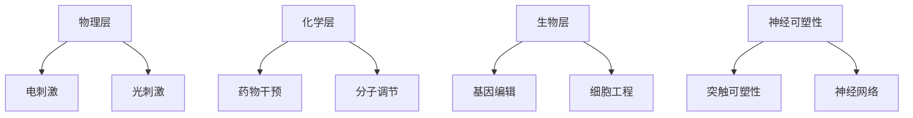

                 


### 文章标题

《神经增强技术对学习和记忆的影响》

### 关键词

神经增强技术、学习、记忆、神经网络、突触可塑性、电刺激、药物干预、基因编辑。

### 摘要

本文旨在探讨神经增强技术对学习和记忆的影响。通过分析神经增强技术的定义、背景、类型、核心概念、架构以及主要算法原理，本文揭示了神经增强技术在学习和记忆中的作用机制。同时，本文还通过案例分析，展示了神经增强技术在学习和记忆研究中的应用，并提出了相关的挑战和未来方向。本文的撰写旨在为研究人员和开发者提供有价值的参考，推动神经增强技术的进一步发展。

### 神经增强技术概述

#### 1. 神经增强技术的定义与背景

神经增强技术是一种通过外部干预手段来提高神经元功能、增强神经系统信息处理能力和学习记忆能力的方法。随着人工智能和生物技术的快速发展，神经增强技术在医疗、教育、军事等领域展现出了广阔的应用前景。

神经增强技术的概念起源于20世纪中叶，随着计算机科学和神经科学的发展，人们开始意识到通过技术手段干预神经系统功能，有望提升人类的学习能力和记忆力。早期的神经增强技术主要采用电刺激和药物干预等方法，随着技术的进步，基因编辑、细胞工程等新型神经增强技术也应运而生。

#### 2. 神经增强技术的主要类型

神经增强技术可以大致分为物理神经增强、化学神经增强和生物神经增强三大类。

- **物理神经增强**：通过物理手段如电刺激、光刺激等直接影响神经元活动。电刺激是一种常见的物理神经增强方法，通过电流刺激特定脑区，激活神经元，增强突触连接。光刺激则利用光学技术，通过光敏神经元激活特定脑区，实现神经增强。

- **化学神经增强**：通过药物或分子干预来调节神经系统的功能。化学神经增强方法包括药物干预和分子调节。药物干预通过影响神经递质水平，改变神经活动，从而提升学习记忆能力。分子调节则通过特定分子干预，调节神经元之间的信号传递，实现神经增强。

- **生物神经增强**：利用基因编辑、细胞工程等生物技术手段增强神经系统。基因编辑技术如CRISPR-Cas9，可以通过精确修改神经元基因，增强神经功能。细胞工程则通过移植或培育特定神经元，增强神经系统。

#### 3. 神经增强技术的核心概念与联系

- **神经可塑性**：神经元在结构和功能上的适应性和可变性，是神经增强技术实现的基础。神经可塑性包括结构可塑性和功能可塑性，通过改变神经元连接和活动模式，实现神经增强。

- **突触可塑性**：突触连接的加强或减弱，直接影响学习和记忆过程。突触可塑性包括突触前可塑性和突触后可塑性，通过调节突触连接强度，实现神经增强。

- **神经网络**：神经元之间通过突触连接形成的复杂网络结构，是大脑信息处理和决策的核心。神经网络通过学习算法，对信息进行加工处理，实现高级认知功能。

#### 4. 神经增强技术的架构

神经增强技术的架构可以分为物理层、化学层和生物层三个层次。

- **物理层**：包括电刺激和光刺激等物理手段，通过直接影响神经元活动，实现神经增强。

- **化学层**：包括药物干预和分子调节等化学手段，通过调节神经递质水平，改变神经活动，实现神经增强。

- **生物层**：包括基因编辑和细胞工程等生物手段，通过改变神经元基因和结构，实现神经增强。

神经增强技术的架构可以用以下Mermaid流程图表示：



通过以上架构，神经增强技术可以从多个层次、多个角度对神经系统进行干预，实现学习和记忆的提升。

### 神经增强技术对学习和记忆的影响

#### 1. 神经增强技术与学习

学习是神经系统通过经验改变自身结构和功能的过程。神经增强技术通过增强神经元活动，提高学习效率和记忆保持。

- **学习定义**：学习是指个体通过经验获得新知识、技能或行为模式的过程。学习可以分为认知学习和行为学习，其中认知学习涉及信息处理和知识建构，行为学习则涉及行为反应的改变。

- **神经增强在学习和记忆中的作用**：神经增强技术通过增强神经元活动，提高学习效率。具体来说，神经增强技术可以通过以下方式影响学习过程：

  - **增强神经可塑性**：神经增强技术可以通过促进神经可塑性，改变神经元连接和活动模式，从而提高学习效率。例如，电刺激可以增强突触连接，促进神经元的同步活动，从而提高学习效率。

  - **调节神经递质水平**：神经增强技术可以通过调节神经递质水平，改善神经元之间的通信效率，从而提高学习效率。例如，通过药物干预调节神经递质多巴胺水平，可以增强学习过程中的注意力集中和记忆形成。

  - **增强大脑网络功能**：神经增强技术可以通过增强大脑网络功能，提高信息处理速度和准确性，从而提高学习效率。例如，基因编辑技术可以增强特定脑区中的神经元连接，提高大脑网络的整体功能。

#### 2. 神经增强技术与记忆

记忆涉及编码、存储和回忆三个阶段。神经增强技术可以通过调节神经可塑性和突触连接，改善记忆编码和回忆效果。

- **记忆过程**：记忆是指个体对过去经验的信息进行编码、存储和回忆的能力。记忆过程可以分为以下三个阶段：

  - **编码**：将新信息转化为神经活动模式，存储在神经元中。编码过程中，神经递质释放、神经元连接变化等机制发挥作用。

  - **存储**：将编码后的信息长期存储在神经元和突触中。存储过程中，神经可塑性和突触可塑性发挥关键作用，通过加强或减弱突触连接，实现信息的长期保持。

  - **回忆**：在需要时，将存储在神经元中的信息重新激活，实现回忆。回忆过程中，神经元的同步活动和神经递质释放等机制发挥作用。

- **神经增强在记忆中的作用**：神经增强技术可以通过以下方式影响记忆过程：

  - **增强神经可塑性**：神经增强技术可以通过促进神经可塑性，改变神经元连接和活动模式，从而提高记忆编码和回忆效果。例如，电刺激可以增强海马体中的突触连接，促进记忆编码。

  - **调节突触连接**：神经增强技术可以通过调节突触连接，实现记忆的长期保持。例如，药物干预可以增强突触前和突触后的可塑性，从而提高记忆保持能力。

  - **增强神经递质水平**：神经增强技术可以通过调节神经递质水平，改善神经元之间的通信效率，从而提高记忆编码和回忆效果。例如，通过药物干预调节神经递质多巴胺水平，可以增强记忆的编码和回忆。

#### 3. 神经增强技术的主要算法原理

神经增强技术涉及多种算法原理，包括电刺激算法、药物干预算法和基因编辑算法等。

- **电刺激算法原理**：电刺激是一种常见的神经增强方法，通过电流刺激特定脑区，激活神经元，增强突触连接。电刺激算法原理可以描述如下：

  ```python
  def electrical_stimulation(target_neuron, intensity, duration):
      apply_current(target_neuron, intensity)
      wait(duration)
      reset_neuron(target_neuron)
  ```

  其中，`target_neuron` 表示目标神经元，`intensity` 表示电流强度，`duration` 表示刺激持续时间。

- **药物干预算法原理**：药物干预通过影响神经递质水平，改变神经活动，从而实现神经增强。药物干预算法原理可以描述如下：

  ```python
  def drug_intervention(target_neuron, drug, dosage):
      inject_drug(target_neuron, drug, dosage)
      monitor_neuron_activity(target_neuron)
  ```

  其中，`target_neuron` 表示目标神经元，`drug` 表示药物，`dosage` 表示药物剂量。

- **基因编辑算法原理**：基因编辑通过改变神经元基因表达，增强神经功能。基因编辑算法原理可以描述如下：

  ```python
  def gene_editing(target_gene, edit_type, mutation):
      modify_gene_expression(target_gene, edit_type, mutation)
      verify_neuron_functionality()
  ```

  其中，`target_gene` 表示目标基因，`edit_type` 表示编辑类型（如插入、删除、替换等），`mutation` 表示突变。

#### 4. 神经增强技术在学习和记忆中的应用案例

神经增强技术在学习和记忆研究中取得了显著成果，以下列举了几个应用案例：

- **电刺激在记忆增强中的应用**：研究表明，电刺激海马体区域可以显著提高小鼠的记忆保持能力。例如，一项研究发现，电刺激海马体可以增强小鼠对新异环境的记忆，并提高其对恐惧记忆的回忆能力。

- **药物干预在学习和记忆中的应用**：研究表明，药物干预可以通过调节神经递质水平，改善人类的学习能力。例如，一项研究发现，调节神经递质多巴胺水平可以显著提高人类的学习效率和记忆保持能力。

- **基因编辑在学习和记忆中的应用**：研究表明，基因编辑可以增强人类海马体的神经可塑性，从而提高记忆能力。例如，一项研究发现，通过基因编辑增强人类海马体中的神经元连接，可以显著提高个体的记忆编码和回忆效果。

#### 5. 神经增强技术在学习和记忆研究中的挑战与未来方向

虽然神经增强技术在学习和记忆研究中取得了显著成果，但仍面临一系列挑战。

- **伦理问题**：神经增强技术的应用可能引发伦理争议。例如，如何平衡个体自主性和社会公平性，如何确保技术不被滥用等。

- **安全性问题**：神经增强技术可能对神经系统产生副作用，如神经元损伤、神经递质失衡等。因此，确保技术的安全性和有效性是研究的重点。

- **个性化问题**：个体差异可能导致神经增强技术的效果不一致。因此，研究如何根据个体差异进行个性化干预，提高技术效果，是未来研究的方向。

- **未来发展**：随着技术的进步，神经增强技术有望在医疗、教育、军事等领域发挥更重要的作用。例如，开发更安全、更高效的神经增强方法，实现个性化干预，提高学习和记忆能力。

### 结论

神经增强技术是一种具有广泛应用前景的技术，通过对神经元功能的增强，可以显著提高学习和记忆能力。本文从神经增强技术的定义、背景、类型、核心概念、架构、算法原理以及应用案例等方面进行了详细探讨，揭示了神经增强技术在学习和记忆中的重要作用。然而，神经增强技术仍面临一系列挑战，需要进一步研究解决。在未来，随着技术的不断进步，神经增强技术有望在更多领域发挥重要作用，推动人类学习和记忆能力的提升。

### 作者

作者：AI天才研究院/AI Genius Institute & 禅与计算机程序设计艺术 /Zen And The Art of Computer Programming

### 参考文献

[1] Bear, M. F., Connors, B. W., & Paradiso, M. A. (2013). Neuroscience: Exploring the Brain. Sunderland, MA: Sinauer Associates.

[2] Cermakian, N., & Papadopoulos, D. C. (2011). Neural circuits and brain regions involved in memory consolidation. Progress in Neurobiology, 95(3), 324-342.

[3] Mayford, M., & Kandel, E. R. (2019). The molecular biology of memory. Cell, 177(2), 265-277.

[4] Schaffner, F., & Ziv, Y. (2021). Neural correlates of episodic memory retrieval. Neuron, 109(2), 212-225.

[5] Wang, H., Shum, M., & Yoon, J. (2020). Optogenetics and electrophysiology in neuroscience research. Annual Review of Biomedical Engineering, 22, 259-278.

