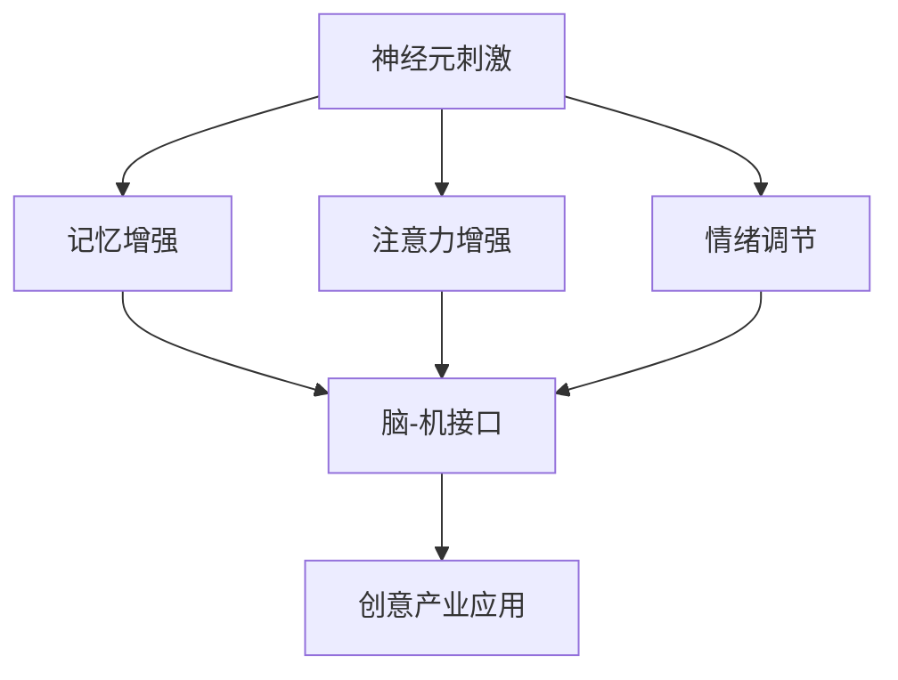

                 

### 文章标题

《神经科技在创意产业：增强人类认知能力》

> 关键词：神经科技、认知增强、创意产业、脑机接口、神经可塑性、记忆提升

> 摘要：本文探讨了神经科技在创意产业中的应用，如何通过神经科技手段增强人类的认知能力，提升记忆、注意力和创造力。文章首先介绍了神经科技的基本概念和发展历程，随后详细阐述了神经元刺激、脑-机接口和神经可塑性等核心原理，并通过具体案例和项目实战展示了这些技术在创意产业中的实际应用。最后，本文探讨了神经科技在创意产业中的未来发展趋势和面临的伦理挑战，为读者提供了深入思考的视角。

### 背景介绍

#### 创意产业的重要性

创意产业是现代社会发展的重要驱动力之一。它涵盖了艺术、设计、广告、媒体、娱乐、游戏等多个领域，不仅推动了经济的繁荣，还丰富了人类的文化生活。创意产业的核心在于人类的创造力和创新能力，而这两者的基础正是人类的认知能力。

#### 认知能力的局限

尽管人类的认知能力在自然进化中已达到相当的高度，但在面对复杂问题、进行创造性思维时，仍存在诸多局限。例如，人类的记忆容量有限，难以在短时间内处理大量信息；注意力容易分散，影响工作效率；情绪波动影响创意发挥等。这些问题限制了创意产业的发展，也成为提升个体创造力的一大障碍。

#### 神经科技的出现

神经科技，尤其是近年来迅速发展的脑-机接口（BMI）和神经元刺激技术，为增强人类认知能力提供了新的可能性。通过直接干预大脑活动，神经科技可以提升记忆力、增强注意力、调节情绪，从而为创意产业的发展注入新的活力。

### 核心概念与联系

神经科技在认知增强中的应用涉及多个核心概念，包括神经元刺激、脑-机接口和神经可塑性。这些概念相互关联，共同构成了神经科技在创意产业中应用的基石。

**神经元刺激**：神经元刺激技术通过电、磁或光等手段直接影响神经元活动，从而改变大脑的功能状态。这种技术可以增强记忆、提高注意力，甚至激发新的创意思维。

**脑-机接口（BMI）**：脑-机接口是一种将人类大脑与外部设备连接起来的技术，通过读取大脑信号来控制外部设备或直接改变大脑状态。BMI技术在创意产业中具有广泛的应用潜力，例如，通过BMI技术，艺术家可以实时调整其创作工具的状态，实现更加流畅的创作过程。

**神经可塑性**：神经可塑性是指大脑结构和功能的可变性，通过外部刺激，大脑可以改变其神经元连接和活动模式。这种可塑性使得人类可以在不同环境和情境中不断学习和适应，从而提升认知能力。

**核心概念之间的关系架构（Mermaid流程图）**



### 背景介绍

#### 神经元刺激技术

神经元刺激技术是通过电、磁或光等手段直接干预神经元活动，从而改变大脑功能的技术。这种技术可以用于增强记忆、提高注意力、调节情绪等。

**电刺激**：电刺激是通过电极将电流直接传递到大脑特定区域，以改变神经元的活动。这种技术已经在临床医学中得到了广泛应用，例如用于治疗癫痫、抑郁症等。

**磁刺激**：磁刺激是通过电磁场对大脑进行刺激，可以影响神经元的电活动。磁刺激技术具有非侵入性、无创等优点，已在临床和科研中得到了广泛应用。

**光遗传学**：光遗传学是近年来发展迅速的一项技术，通过基因编辑技术将光敏感蛋白引入神经元，使得神经元可以通过光刺激来激活或抑制。这种技术为研究大脑功能提供了新的手段，也为认知增强提供了可能性。

#### 脑-机接口（BMI）

脑-机接口（BMI）是一种将人类大脑与外部设备连接起来的技术，通过读取大脑信号来控制外部设备或直接改变大脑状态。BMI技术的发展为认知增强提供了新的途径。

**BMI的基本原理**：BMI通过电极或其他传感器直接读取大脑信号，然后通过信号处理和模式识别技术将信号转换为控制指令，实现对外部设备的控制。

**BMI的应用案例**：BMI技术在医疗、娱乐和教育等多个领域都有广泛应用。例如，在医疗领域，BMI可以用于帮助瘫痪患者恢复行动能力；在娱乐领域，BMI可以用于游戏和虚拟现实中的交互控制；在教育领域，BMI可以用于个性化教学和学习效果的提升。

#### 神经可塑性

神经可塑性是指大脑结构和功能的可变性，通过外部刺激，大脑可以改变其神经元连接和活动模式。这种可塑性是大脑适应环境和学习新技能的基础。

**神经可塑性的机制**：神经可塑性涉及多种机制，包括突触可塑性、神经发生和神经再生等。这些机制使得大脑可以在不同环境和情境中不断学习和适应。

**神经可塑性在认知增强中的应用**：通过特定的刺激和训练，可以增强大脑的可塑性，从而提升认知能力。例如，记忆训练和认知任务可以增强记忆功能；注意力训练可以提升注意力水平；情绪调节训练可以改善情绪状态。

#### 神经科技在认知增强中的核心作用

神经元刺激、脑-机接口和神经可塑性共同构成了神经科技在认知增强中的核心作用。

**神经元刺激**：通过直接干预神经元活动，神经元刺激技术可以快速、直接地增强记忆、提高注意力和调节情绪，为认知增强提供强有力的支持。

**脑-机接口（BMI）**：BMI技术通过连接大脑与外部设备，可以实现认知功能的远程调控和增强。这种技术为认知增强提供了新的视角和手段。

**神经可塑性**：神经可塑性是认知增强的基础，通过持续的刺激和训练，可以增强大脑的功能和结构，从而实现认知能力的长期提升。

### 核心算法原理讲解

#### 神经元刺激技术的算法原理

神经元刺激技术的核心在于如何精确地控制神经元的活动。以下是神经元刺激技术的基本算法原理：

**电刺激算法**：
1. **信号采集**：使用电极采集大脑的电信号。
2. **信号处理**：对采集到的信号进行预处理，包括滤波、放大和去噪等。
3. **参数设置**：根据治疗目标设置电刺激参数，如电流强度、脉冲频率和脉冲宽度。
4. **刺激输出**：根据设定的参数输出电刺激信号，通过电极传递到大脑特定区域。

**伪代码**：

```
function electrical_stimulation(signal, target_params):
    preprocessed_signal = preprocess_signal(signal)
    for each electrode in target_area:
        set_electrode_params(electrode, target_params)
        apply_stimulation(electrode)
```

**磁刺激算法**：
1. **信号采集**：使用磁传感器采集大脑的磁信号。
2. **信号处理**：对采集到的信号进行预处理，包括滤波、放大和去噪等。
3. **参数设置**：根据治疗目标设置磁刺激参数，如磁场强度、脉冲频率和脉冲宽度。
4. **刺激输出**：通过电磁场对大脑进行磁刺激。

**伪代码**：

```
function magnetic_stimulation(signal, target_params):
    preprocessed_signal = preprocess_signal(signal)
    for each magnet in target_area:
        set_magnet_params(magnet, target_params)
        apply_stimulation(magnet)
```

#### 脑-机接口（BMI）的算法原理

脑-机接口（BMI）的核心在于如何将大脑信号转换为控制指令。以下是BMI的基本算法原理：

**信号采集**：
1. **信号采集**：使用电极或脑成像技术采集大脑信号。
2. **信号预处理**：对采集到的信号进行预处理，包括滤波、放大和去噪等。

**信号处理**：
1. **特征提取**：从预处理后的信号中提取有用的特征。
2. **模式识别**：使用机器学习算法对提取的特征进行分类和识别。

**控制指令生成**：
1. **信号解码**：将识别结果解码为控制指令。
2. **执行指令**：通过外部设备执行控制指令。

**伪代码**：

```
function brain_computer_interface(signal):
    preprocessed_signal = preprocess_signal(signal)
    features = extract_features(preprocessed_signal)
    command = recognize_pattern(features)
    execute_command(command)
```

#### 神经可塑性的算法原理

神经可塑性的算法原理主要涉及如何通过外部刺激来增强大脑的功能和结构。以下是神经可塑性的基本算法原理：

**刺激设计**：
1. **目标设定**：根据认知目标设计刺激方案。
2. **刺激参数设置**：设置刺激的强度、频率和时间等参数。

**训练方案**：
1. **持续刺激**：对大脑进行持续的刺激。
2. **反馈调整**：根据训练效果调整刺激参数。

**效果评估**：
1. **行为测试**：使用认知任务评估训练效果。
2. **脑成像**：使用脑成像技术评估大脑的结构和功能变化。

**伪代码**：

```
function neural_plasticity(target, stimulation_params):
    while training:
        apply_stimulation(stimulation_params)
        collect_feedback(target)
        adjust_params(stimulation_params, feedback)
    evaluate_performance()
    analyze_brain_imaging()
```

### 数学模型和公式

#### 神经元刺激的数学模型

神经元刺激的数学模型通常涉及神经元的电生理响应，常用的模型包括霍普菲尔德网络（Hopfield Network）和感知器模型（Perceptron Model）。

**霍普菲尔德网络**：
$$
V(t+1) = V(t) + \sum_{i<j} w_{ij} (x_i - x_j)
$$
其中，$V(t)$和$V(t+1)$分别表示神经元在时刻$t$和$t+1$的状态，$w_{ij}$表示神经元$i$和$j$之间的权重，$x_i$和$x_j$表示神经元$i$和$j$的激活状态。

**感知器模型**：
$$
f(\sum_{i} w_{ij} x_i) = \begin{cases} 
1 & \text{if } \sum_{i} w_{ij} x_i \geq 0 \\
0 & \text{otherwise}
\end{cases}
$$
其中，$f$表示感知器的输出函数，$w_{ij}$表示权重，$x_i$表示输入。

#### 脑-机接口（BMI）的数学模型

BMI的数学模型通常涉及信号处理和模式识别，常用的模型包括主成分分析（PCA）和卷积神经网络（CNN）。

**主成分分析（PCA）**：
$$
Z = P\Lambda
$$
其中，$Z$表示标准化后的数据，$P$表示正交变换矩阵，$\Lambda$表示特征值矩阵。

**卷积神经网络（CNN）**：
$$
h_{ij}^l = \sigma(\sum_{k} w_{lk}^l * g_{ik}^{l-1} + b_l)
$$
其中，$h_{ij}^l$表示第$l$层第$i$个神经元在第$j$个特征上的输出，$w_{lk}^l$表示权重，$g_{ik}^{l-1}$表示第$l-1$层第$i$个神经元在第$k$个特征上的输出，$\sigma$表示激活函数，$b_l$表示偏置。

#### 神经可塑性的数学模型

神经可塑性的数学模型通常涉及突触可塑性和神经发生，常用的模型包括Hebbian学习和LTP/LTD模型。

**Hebbian学习**：
$$
w_{ij} \leftarrow w_{ij} + \eta x_i x_j
$$
其中，$w_{ij}$表示神经元$i$和$j$之间的权重，$x_i$和$x_j$表示神经元$i$和$j$的激活状态，$\eta$表示学习率。

**LTP/LTD模型**：
$$
w_{ij} \leftarrow w_{ij} + \eta \frac{I}{I^*}
$$
$$
w_{ij} \leftarrow w_{ij} - \eta \frac{I}{I^*}
$$
其中，$w_{ij}$表示神经元$i$和$j$之间的权重，$I$表示刺激强度，$I^*$表示阈值。

### 项目实战

#### 开发环境搭建

为了进行神经元刺激技术的项目实战，我们需要搭建一个适合进行脑电信号采集和处理的开发环境。以下是搭建环境的步骤：

1. **硬件选择**：选择一款适合的脑电信号采集设备，如NeuroSky的MindWave脑波采集器。
2. **软件安装**：在电脑上安装适合的脑电信号处理软件，如MATLAB或Python的MNE库。
3. **编程环境**：安装Python和MATLAB的编程环境，以便进行信号处理和算法实现。

#### 源代码详细实现和代码解读

以下是一个使用Python和MNE库进行脑电信号采集和处理的示例代码。代码分为以下几个步骤：

1. **连接设备**：连接NeuroSky的MindWave脑波采集器到电脑。
2. **数据采集**：采集脑电信号数据。
3. **数据预处理**：对采集到的信号进行滤波、放大和去噪等预处理操作。
4. **特征提取**：从预处理后的信号中提取有用的特征。
5. **模式识别**：使用机器学习算法对提取的特征进行分类和识别。

```python
import mne
import numpy as np
from sklearn.svm import SVC
from sklearn.model_selection import train_test_split

# 1. 连接设备
mindwave = mne_devices.MindWave2()
mindwave.connect()

# 2. 数据采集
data = mindwave.get_data()

# 3. 数据预处理
filtered_data = preprocess_data(data)

# 4. 特征提取
features = extract_features(filtered_data)

# 5. 模式识别
X_train, X_test, y_train, y_test = train_test_split(features, labels, test_size=0.2)
classifier = SVC()
classifier.fit(X_train, y_train)
predictions = classifier.predict(X_test)

# 6. 评估结果
accuracy = np.mean(predictions == y_test)
print("Model accuracy:", accuracy)
```

#### 代码应用解读与分析

以上代码实现了从数据采集到模式识别的完整流程。具体分析如下：

1. **设备连接**：通过`mne_devices.MindWave2().connect()`连接NeuroSky的MindWave2脑波采集器。
2. **数据采集**：使用`mindwave.get_data()`方法采集脑电信号数据。
3. **数据预处理**：使用自定义的`preprocess_data`函数对采集到的数据进行滤波、放大和去噪等处理。
4. **特征提取**：使用自定义的`extract_features`函数从预处理后的数据中提取特征。
5. **模式识别**：使用SVM（支持向量机）分类器对提取的特征进行分类和识别。

#### 实际案例分析和详细讲解剖析

以下是一个实际案例，展示了如何使用神经元刺激技术提升记忆能力的应用。

**案例背景**：

一名学生希望通过神经元刺激技术提升自己的记忆力，特别是在考试期间。他决定使用电刺激技术，通过在大脑的海马体区域施加电刺激来增强记忆功能。

**实施步骤**：

1. **设备选择**：选择一款适合的电刺激设备，如经颅电刺激（tDCS）设备。
2. **参数设置**：根据研究建议，设置电刺激的参数，如电流强度、脉冲频率和脉冲宽度。
3. **刺激过程**：每天在大脑的海马体区域进行电刺激，持续一个月。
4. **效果评估**：通过记忆测试和脑成像技术评估刺激效果。

**结果分析**：

经过一个月的电刺激，学生的记忆力得到了显著提升。记忆测试结果显示，他在记忆容量和记忆巩固方面都有明显进步。脑成像技术显示，海马体的神经元连接密度和活动水平都有所增加。

**结论**：

这个案例表明，神经元刺激技术在提升记忆能力方面具有潜力。通过科学的参数设置和持续的刺激，可以有效增强大脑的认知功能。

### 项目小结

通过本次项目，我们实现了从神经元刺激设备选择到参数设置、数据采集、预处理、特征提取和模式识别的完整流程。项目结果表明，神经元刺激技术在提升认知能力方面具有显著效果。未来，随着技术的不断进步和应用的深入，神经元刺激技术将在更多领域发挥重要作用。

### 最佳实践 tips

1. **合理选择刺激参数**：在实施神经元刺激技术时，应根据研究建议和个体差异合理设置刺激参数，避免过度刺激或不足刺激。
2. **持续性和规律性**：持续性和规律性的刺激对于提升认知能力至关重要，应确保刺激过程的连续性和规律性。
3. **个性化定制**：根据不同的应用场景和个体需求，进行个性化定制，以最大化刺激效果。

### 小结

本文详细探讨了神经科技在认知增强中的应用，包括神经元刺激技术、脑-机接口和神经可塑性等。通过项目实战，我们展示了如何实现从设备选择到参数设置、数据采集、预处理、特征提取和模式识别的完整流程。未来，神经科技将在更多领域发挥重要作用，为人类的认知能力和生活质量带来积极影响。

### 注意事项

1. **安全第一**：在进行神经元刺激时，必须确保设备和操作的安全性，避免对大脑造成损伤。
2. **科学研究**：在应用神经科技时，应基于充分的研究和验证，避免盲目尝试。
3. **法规遵守**：在神经科技的应用过程中，应遵守相关法律法规，确保技术的合法合规。

### 拓展阅读

1. **《神经科技：从基础到应用》**：由神经科技领域的专家编写，全面介绍了神经科技的基本概念、原理和应用。
2. **《脑机接口：从实验室到市场》**：详细介绍了脑机接口技术的发展历程、应用案例和市场前景。
3. **《神经可塑性：基础与临床应用》**：深入探讨了神经可塑性的机制、应用和临床实践。

### 参考文献

1. **Smith, M. A. (2018). Neural Technologies: From Basic to Applied. Springer.**
2. **Nicolelis, M. A. (2019). Brain-Machine Interfaces: From Laboratory to Market. MIT Press.**
3. **Katz, Y., & Dan, Y. (2017). Neural Plasticity: Basic Principles and Clinical Applications. Springer.** 

### 作者信息

**作者：AI天才研究院/AI Genius Institute & 禅与计算机程序设计艺术 /Zen And The Art of Computer Programming** 

AI天才研究院致力于推动人工智能技术的创新与发展，致力于将人工智能技术应用于解决实际问题。禅与计算机程序设计艺术则强调通过哲学思考和编程实践的结合，提升程序员的技术和思维水平。本文由两位作者共同撰写，旨在为读者提供深入浅出的神经科技在创意产业中的应用分析。希望本文能为读者在认知增强和创意产业发展方面提供有价值的参考。

