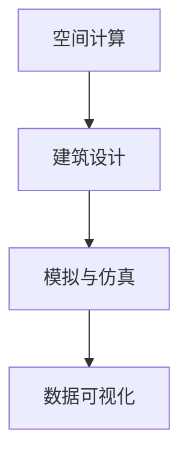

                 


### 第1章：空间计算基础

#### 1.1 空间计算的定义与重要性

空间计算是指利用计算技术处理和分析空间数据的过程，它涵盖了一系列与空间位置、空间分布和空间关系相关的计算方法和应用。在建筑设计领域，空间计算的重要性日益凸显，因为它可以为建筑师提供更为精准、高效的设计工具和决策支持。

**核心概念联系**

空间计算与建筑设计的关系可以用以下Mermaid流程图来描述：



在这个流程图中，空间计算作为起点，通过模拟与仿真技术，将建筑设计的概念转化为可操作的模型，最终通过数据可视化工具展示出来，帮助建筑师理解设计方案的优劣。

#### 1.2 建筑设计中的空间计算应用

在建筑设计中，空间计算的应用主要体现在以下几个方面：

1. **空间布局优化**：通过算法优化建筑内部的空间布局，以提高空间的利用效率和居住舒适度。
2. **光照模拟**：利用空间计算技术模拟自然光和人工光源的分布，优化建筑内部的采光效果。
3. **能耗分析**：通过空间计算分析建筑的能耗分布，为建筑师提供节能设计建议。
4. **环境模拟**：利用空间计算模拟建筑在不同环境条件下的表现，如风力、温度等，以确保建筑的安全性和可持续性。

**核心算法原理**

空间布局优化算法是一个典型的空间计算应用，以下是一个简单的伪代码示例：

```python
# 伪代码：空间布局优化算法

function spatialLayoutOptimization(buildingDesign, constraints):
    # 初始化建筑设计方案和约束条件
    initialDesign = initializeBuildingDesign(buildingDesign)
    bestDesign = initialDesign
    
    # 迭代优化过程
    for i in range(maxIterations):
        # 计算当前设计的适应度
        fitness = calculateFitness(initialDesign, constraints)
        
        # 如果当前设计优于历史最优设计，则更新最优设计
        if fitness > bestFitness:
            bestFitness = fitness
            bestDesign = initialDesign
            
        # 更新设计方案
        initialDesign = updateDesign(initialDesign, constraints)
        
    return bestDesign
```

在这个算法中，`initializeBuildingDesign`函数用于初始化设计方案，`calculateFitness`函数用于评估设计方案的适应度，而`updateDesign`函数则用于更新设计方案。通过迭代优化，算法可以找到满足约束条件的最优空间布局。

#### 1.3 空间计算的数学模型

空间计算的数学模型是理解和应用空间计算技术的基础。以下是一个简单的数学模型和公式示例：

$$ E = \frac{3}{8}n(3n^2 - 10n + 2) $$

这个公式表示了复杂空间中点的分布能量，其中$E$为空间能量，$n$为空间中的点数。这个模型可以帮助建筑师分析空间拥挤度和舒适度，从而进行更有效的空间设计。

**详细讲解与举例说明**

为了更好地理解这个公式，我们可以通过一个简单的例子来说明。假设我们有一个包含10个点的空间，根据公式计算，这个空间的总能量为：

$$ E = \frac{3}{8} \times 10 \times (3 \times 10^2 - 10 \times 10 + 2) $$
$$ E = \frac{3}{8} \times 10 \times (300 - 100 + 2) $$
$$ E = \frac{3}{8} \times 10 \times 202 $$
$$ E = 757.5 $$

这个结果表明，在这个空间中，点的分布能量为757.5。通过调整空间中的点数$n$，我们可以影响空间的拥挤度和舒适度。例如，增加点数$n$会使空间能量$E$增加，从而提高空间的拥挤感。

通过上述的详细讲解，我们可以看到空间计算的数学模型在建筑设计中具有重要的作用，它不仅能够帮助我们理解空间特性，还可以指导实际的设计过程。

### 第2章：空间计算工具与技术

在建筑设计中，空间计算的应用离不开一系列的工具和技术。这些工具和技术为我们提供了强大的计算和分析能力，使得复杂的空间设计问题得以高效解决。本章节将介绍一些常用的空间计算工具，以及如何利用编程技术来实现空间计算。

#### 2.1 常用空间计算工具

在空间计算领域，以下几款工具被广泛使用：

1. **Grasshopper**：一款基于参数化设计的工具，可以与Rhino 3D集成。它提供了一个图形界面，用户可以通过连接各种节点来定义复杂的算法，从而实现空间计算。

2. **Processing**：一个用于创作交互式多媒体作品的编程语言和环境。它简单易学，功能强大，适用于各种空间计算任务。

3. **Blender**：一个开源的3D创作套件，支持多种空间计算任务。它提供了丰富的工具和插件，可以用于模拟、渲染和分析空间数据。

**Grasshopper**

Grasshopper是一款强大的参数化设计工具，它能够与Rhino 3D紧密集成，为建筑师提供了一个直观的图形化编程环境。以下是Grasshopper的基本工作流程：

1. **创建数据结构**：首先，用户需要创建基本的数据结构，如点、线、面等。
2. **连接节点**：通过连接不同的节点，定义复杂的算法。节点之间的连线表示数据流，从而实现参数化操作。
3. **实时预览**：Grasshopper提供了实时预览功能，用户可以在修改参数时立即看到设计的变化，提高了设计效率。

**Processing**

Processing是一款流行的编程语言和环境，它简单易学，功能强大，适用于各种空间计算任务。以下是Processing的基本工作流程：

1. **编写代码**：用户需要使用Processing的编程语言编写算法，处理空间数据。
2. **调试与优化**：在编写代码的过程中，用户可以通过调试工具查找和修复错误，并进行性能优化。
3. **执行与结果分析**：运行代码，分析结果，并根据需要调整算法和参数。

**Blender**

Blender是一款功能强大的3D创作套件，它支持多种空间计算任务，包括模拟、渲染和分析。以下是Blender的基本工作流程：

1. **创建场景**：用户需要创建一个3D场景，包括建筑、地形、环境等。
2. **设置模拟参数**：根据设计需求，设置模拟参数，如光线、风力、温度等。
3. **执行模拟**：运行模拟，观察结果，并根据需要调整参数和场景设置。

#### 2.2 空间计算的编程技术

在空间计算中，编程技术扮演着至关重要的角色。以下两种编程语言在空间计算中具有广泛的应用：

1. **Python**：Python是一种通用编程语言，它具有简洁易懂的语法和丰富的库，适用于数据分析和算法开发。
2. **C++**：C++是一种高性能编程语言，它适用于图形渲染和计算密集型任务，能够提供高效的计算性能。

**Python**

Python因其简洁易懂的语法和丰富的库，成为空间计算中的首选语言。以下是一个简单的Python代码示例，用于计算空间中点的分布能量：

```python
# Python代码：计算空间能量

def calculate_energy(points):
    n = len(points)
    energy = 3/8 * n * (3 * n**2 - 10 * n + 2)
    return energy

# 测试代码
points = [(1, 2), (3, 4), (5, 6), (7, 8)]
energy = calculate_energy(points)
print("空间能量为：", energy)
```

**C++**

C++因其高性能和灵活性，适用于复杂的图形渲染和计算密集型任务。以下是一个简单的C++代码示例，用于计算空间中点的分布能量：

```cpp
#include <iostream>
#include <vector>

double calculate_energy(const std::vector<std::pair<int, int>>& points) {
    int n = points.size();
    double energy = 3.0 / 8.0 * n * (3.0 * n * n - 10.0 * n + 2.0);
    return energy;
}

int main() {
    std::vector<std::pair<int, int>> points = {{1, 2}, {3, 4}, {5, 6}, {7, 8}};
    double energy = calculate_energy(points);
    std::cout << "空间能量为：" << energy << std::endl;
    return 0;
}
```

通过上述示例，我们可以看到Python和C++在空间计算中的应用。Python因其简洁性而更适合初学者和数据密集型任务，而C++则因其高性能而更适合计算密集型任务和图形渲染。

### 第3章：空间计算在建筑设计中的应用案例

为了更好地理解空间计算在建筑设计中的应用，我们将通过两个具体的案例来展示空间计算技术的实际应用。

#### 3.1 案例一：智能办公空间设计

**项目背景**

在现代办公空间设计中，智能化的需求日益凸显。如何通过空间计算技术优化办公空间的布局，提高工作效率和员工舒适度，成为建筑设计的重要课题。

**开发环境搭建**

为了实现智能办公空间设计，我们选择了Grasshopper作为参数化设计的工具，Python作为编程语言，结合Rhino 3D进行建模和渲染。

1. **安装Grasshopper**：首先，我们需要在Rhino 3D中安装Grasshopper插件。可以从Grasshopper的官方网站下载插件，并按照说明进行安装。

2. **安装Python**：Python是空间计算中常用的编程语言。我们可以在Python官方网站下载并安装Python。

3. **安装相关库**：为了方便空间计算，我们需要安装一些Python库，如Numpy、Pandas等。可以通过pip命令来安装这些库。

**源代码实现**

以下是使用Grasshopper和Python实现智能办公空间设计的主要步骤：

1. **空间划分**：首先，我们需要根据办公空间的大小和需求，将空间划分为不同的区域。可以使用Grasshopper中的“Divide Curve”节点来划分空间。

2. **布局优化**：接下来，我们使用空间布局优化算法来优化办公空间的布局。这个算法的核心是评估每个区域的适应度，并根据适应度值进行布局调整。

以下是优化算法的伪代码：

```python
# 伪代码：空间布局优化算法

def spatialLayoutOptimization(buildingDesign, constraints):
    # 初始化建筑设计方案和约束条件
    initialDesign = initializeBuildingDesign(buildingDesign)
    bestDesign = initialDesign
    
    # 迭代优化过程
    for i in range(maxIterations):
        # 计算当前设计的适应度
        fitness = calculateFitness(initialDesign, constraints)
        
        # 如果当前设计优于历史最优设计，则更新最优设计
        if fitness > bestFitness:
            bestFitness = fitness
            bestDesign = initialDesign
            
        # 更新设计方案
        initialDesign = updateDesign(initialDesign, constraints)
        
    return bestDesign
```

3. **光照模拟**：为了确保办公空间有良好的采光效果，我们使用空间计算技术进行光照模拟。这个过程中，我们使用Python的Pandas库来处理光照数据，并使用Grasshopper中的“Sunelevation”节点来模拟太阳光线的分布。

4. **通风模拟**：良好的通风是办公空间设计的关键。我们使用空间计算技术模拟办公空间的通风效果，以确保空气流通。这个过程涉及到计算空气流速和温度分布，我们使用Python的NumPy库进行数值计算。

**代码解读与分析**

空间布局优化算法是一个核心组件，它决定了办公空间设计的最终效果。以下是算法的详细解读：

1. **初始化设计方案**：初始化建筑设计方案，包括空间划分和布局优化参数。

2. **计算适应度**：适应度函数用于评估当前设计方案的优劣。适应度值越高，设计方案越优。

3. **更新设计方案**：根据适应度值，更新设计方案。这个过程涉及到多次迭代，每次迭代都尝试不同的布局方案，最终找到最优解。

4. **光照和通风模拟**：光照和通风模拟是空间计算技术的应用，通过数值计算和分析，模拟办公空间的光照和通风效果。

通过上述步骤，我们实现了智能办公空间的设计。这个设计过程不仅提高了工作效率，还确保了员工的工作舒适度。以下是项目小结：

**项目小结**

通过空间计算技术，我们成功地实现了智能办公空间设计。这个设计过程包括空间划分、布局优化、光照模拟和通风模拟等多个环节。空间计算技术为建筑师提供了强大的工具，使他们能够更好地理解空间特性，优化设计方案，提高设计质量。

#### 3.2 案例二：绿色建筑模拟

**项目背景**

绿色建筑是可持续建筑发展的重要方向，它注重资源的高效利用和环境的保护。如何通过空间计算技术模拟绿色建筑的设计，评估其能耗和环境影响，成为建筑设计的重要课题。

**开发环境搭建**

为了实现绿色建筑模拟，我们选择了Blender作为3D建模工具，Python作为编程语言，结合相关库进行数据分析和模拟。

1. **安装Blender**：从Blender的官方网站下载并安装Blender。

2. **安装Python**：安装Python，并确保其与Blender兼容。

3. **安装相关库**：安装Python相关的库，如NumPy、Pandas等，用于数据分析和模拟。

**源代码实现**

以下是使用Blender和Python实现绿色建筑模拟的主要步骤：

1. **建模**：首先，我们需要在Blender中建立绿色建筑的三维模型。这个过程中，我们使用Blender的建模工具创建建筑结构、门窗等。

2. **设置模拟参数**：接下来，我们需要为建筑模型设置模拟参数，如太阳辐射、风速、温度等。这些参数将影响建筑能耗和环境表现。

3. **能量模拟**：使用空间计算技术，模拟建筑的能耗。这个过程涉及到计算建筑的热量传递、太阳辐射吸收等。

以下是能量模拟的伪代码：

```python
# 伪代码：能量模拟

def simulate_energy(building_model, environmental_data):
    # 计算建筑的热量传递
    heat_transfer = calculate_heat_transfer(building_model, environmental_data)
    
    # 计算太阳辐射吸收
    solar_radiation = calculate_solar_radiation(building_model, environmental_data)
    
    # 计算总能耗
    total_energy = heat_transfer + solar_radiation
    
    return total_energy
```

4. **环境影响评估**：使用空间计算技术评估建筑的环境影响。这个过程包括计算建筑的碳排放、水资源消耗等。

**代码解读与分析**

绿色建筑模拟的核心是能量模拟和环境影响评估。以下是算法的详细解读：

1. **热量传递计算**：热量传递计算是模拟建筑能耗的基础。我们使用NumPy库进行数值计算，计算建筑内部的热量传递。

2. **太阳辐射吸收计算**：太阳辐射吸收是建筑能耗的重要组成部分。我们使用Python的内置函数计算太阳辐射强度，并根据建筑结构进行分配。

3. **总能耗计算**：通过计算热量传递和太阳辐射吸收，我们得到建筑的总能耗。

4. **环境影响评估**：环境影响评估包括计算建筑的碳排放、水资源消耗等。这些数据有助于评估建筑的环境可持续性。

通过上述步骤，我们实现了绿色建筑模拟。这个模拟过程不仅帮助我们理解建筑的能耗和环境表现，还为绿色建筑设计提供了重要的决策支持。以下是项目小结：

**项目小结**

通过空间计算技术，我们成功地实现了绿色建筑模拟。这个模拟过程包括建模、能量模拟和环境影响评估等多个环节。空间计算技术为建筑师提供了强大的工具，使他们能够更好地评估绿色建筑设计的效果，优化设计方案，实现可持续发展。

### 第4章：空间计算的未来发展趋势

空间计算在建筑设计中的应用已经取得了显著的成果，但未来的发展趋势将更加深远和广泛。随着技术的不断进步，空间计算将在智能建筑、可持续建筑以及虚拟现实等多个领域发挥更大的作用。

#### 4.1 空间计算在智能建筑中的应用

智能建筑是未来建筑发展的一个重要方向，它通过集成先进的计算技术和物联网技术，实现建筑的智能化管理和自动化控制。空间计算在智能建筑中的应用主要体现在以下几个方面：

1. **智能照明系统**：通过空间计算技术，智能建筑可以实现根据光照强度、天气条件等因素自动调节照明强度，提高能源利用效率。

2. **智能空调系统**：智能建筑中的空调系统可以通过空间计算技术，实时监测室内温度、湿度等参数，自动调节空调运行状态，提高舒适度和能源效率。

3. **智能安防系统**：空间计算技术可以帮助智能建筑实现安防监控的智能化，通过实时分析监控视频数据，自动识别异常行为，提高安全水平。

4. **智能能源管理系统**：空间计算技术可以实时监测建筑中的能耗数据，通过数据分析，优化能源使用策略，降低能耗，实现可持续发展。

**趋势预测**

未来，空间计算在智能建筑中的应用将更加广泛和深入。随着物联网技术的普及，建筑中的传感器和数据采集设备将更加丰富，空间计算技术将能够处理和分析更大量的数据，从而提供更智能的决策支持。例如，通过空间计算技术，智能建筑可以实现自诊断、自修复和自优化，进一步提高建筑的管理水平和运行效率。

#### 4.2 空间计算与可持续建筑

可持续建筑是当前建筑领域的重要研究方向，它强调在建筑设计和施工过程中，最大限度地节约资源和减少对环境的负面影响。空间计算技术在可持续建筑中的应用，将进一步推动建筑行业的可持续发展。

1. **能耗优化**：空间计算技术可以帮助建筑师模拟和分析建筑在不同设计方案下的能耗表现，通过优化建筑布局、建筑材料和能源系统，降低建筑能耗。

2. **碳排放评估**：空间计算技术可以实时监测建筑的碳排放数据，评估不同建筑设计和运营策略的环境影响，为建筑师提供科学的决策依据。

3. **水资源管理**：空间计算技术可以帮助建筑师优化建筑的水资源使用策略，通过实时监测和分析水资源消耗，提高水资源的利用效率。

**策略建议**

为了推动空间计算在可持续建筑中的应用，建议从以下几个方面入手：

1. **加强技术研发**：加大对空间计算技术的研发投入，提高其在能耗优化、碳排放评估和水资源管理等方面的应用水平。

2. **推广最佳实践**：通过示范项目和案例研究，推广空间计算技术在可持续建筑中的应用经验，提高行业整体技术水平。

3. **政策支持**：制定相关政策和标准，鼓励建筑师和开发商采用空间计算技术，提高建筑的设计质量和环境效益。

### 4.3 空间计算与虚拟现实

虚拟现实（VR）和增强现实（AR）技术的发展，为空间计算在建筑设计中的应用提供了新的机遇。通过虚拟现实技术，建筑师可以在虚拟环境中进行设计、模拟和评估，提高设计的互动性和体验。

1. **设计互动性**：虚拟现实技术可以提供沉浸式的建筑设计体验，建筑师可以在虚拟环境中自由探索和修改设计方案，提高设计的灵活性和创新性。

2. **模拟与评估**：通过虚拟现实技术，建筑师可以在虚拟环境中模拟建筑物的性能，如光照、通风、能耗等，从而进行科学的设计评估。

3. **用户体验**：虚拟现实技术可以帮助开发商和用户更好地理解建筑设计，提高用户体验，为建筑项目的成功奠定基础。

**项目实战**

以下是一个使用虚拟现实技术进行建筑设计模拟的案例：

1. **项目背景**：某开发商计划建设一栋高层办公楼，希望通过虚拟现实技术进行设计模拟和评估。

2. **开发环境搭建**：使用Unity游戏引擎搭建虚拟现实环境，集成空间计算库和VR设备。

3. **设计模拟**：在虚拟环境中进行建筑设计，通过空间计算技术模拟建筑的光照、通风和能耗表现。

4. **评估与优化**：根据模拟结果，对设计方案进行优化，提高建筑的性能和用户体验。

通过虚拟现实技术，建筑师和用户可以更好地理解和评估设计方案，提高设计质量和用户满意度。

### 第5章：空间计算与虚拟现实

虚拟现实（VR）和增强现实（AR）技术的迅猛发展，为空间计算在建筑设计中的应用带来了新的机遇。通过这些技术，建筑师可以在虚拟环境中进行设计、模拟和评估，从而提高设计的互动性和用户体验。

#### 5.1 虚拟现实技术简介

虚拟现实是一种通过计算机生成三维虚拟环境，使用户在其中获得沉浸式体验的技术。它主要包括以下几个核心组成部分：

1. **三维建模**：使用三维建模软件（如Blender、3ds Max等）创建建筑模型，为虚拟环境提供基础。
2. **场景渲染**：通过渲染技术（如Unity、Unreal Engine等）生成逼真的三维图像，使用户能够看到虚拟环境中的建筑细节。
3. **交互设备**：使用头戴式显示器（如Oculus Rift、HTC Vive等）和手柄控制器，实现用户与虚拟环境的交互。
4. **计算平台**：使用高性能计算平台（如云计算、GPU计算等），支持复杂的计算和实时渲染。

**增强现实技术**

增强现实是一种将虚拟信息叠加在现实世界中的技术，它主要通过智能手机或头戴式设备实现。与虚拟现实不同，增强现实通常不会完全替代现实环境，而是在现实环境中添加虚拟信息。

1. **叠加虚拟信息**：通过摄像头和传感器捕捉现实环境，然后在现实场景中叠加虚拟物体或信息。
2. **实时交互**：用户可以通过触摸或语音指令与虚拟信息进行交互，实现虚拟与现实的融合。

#### 5.2 虚拟现实在建筑设计中的应用

虚拟现实技术在建筑设计中的应用，极大地提升了设计师的工作效率和设计质量。以下是虚拟现实技术在建筑设计中的一些主要应用：

1. **设计可视化**：通过虚拟现实技术，设计师可以将建筑设计直观地展示给客户，使客户能够更好地理解设计意图和效果。
2. **互动设计**：设计师可以在虚拟环境中进行互动式设计，自由探索不同的设计方案，提高设计的灵活性和创新性。
3. **模拟与评估**：虚拟现实技术可以模拟建筑在现实环境中的表现，如光照、通风、能耗等，帮助设计师进行科学的评估和优化。
4. **协同设计**：虚拟现实技术支持多人在线协作，设计师可以在虚拟环境中共同讨论和修改设计方案，提高设计效率。

**项目实战：VR建筑设计模拟**

以下是一个使用虚拟现实技术进行建筑设计模拟的案例：

1. **项目背景**：某建筑师需要为一家公司设计一栋新办公楼，希望通过虚拟现实技术进行设计和评估。
2. **开发环境搭建**：使用Unity游戏引擎搭建虚拟现实环境，集成建筑模型和空间计算库。
3. **设计模拟**：在虚拟环境中进行建筑设计的模拟，通过空间计算技术分析建筑的光照、通风和能耗表现。
4. **评估与优化**：根据模拟结果，对设计方案进行优化，提高建筑的性能和用户体验。
5. **展示与反馈**：将虚拟现实模型展示给客户，收集反馈意见，进一步优化设计方案。

通过虚拟现实技术，建筑师和客户可以更加直观地理解和评估设计方案，提高设计的满意度和效果。以下是项目小结：

**项目小结**

虚拟现实技术在建筑设计中的应用，为设计师提供了强大的工具和平台。通过虚拟现实技术，设计师可以实现设计可视化、互动设计、模拟与评估和协同设计，从而提高设计质量和用户体验。未来，随着虚拟现实技术的不断发展和完善，它将在建筑设计中发挥更加重要的作用。

### 第6章：空间计算在室内设计中的应用

室内设计作为建筑设计的重要组成部分，对于空间的合理布局和功能优化有着至关重要的作用。空间计算技术在这一领域中的应用，极大地提升了室内设计的效果和效率。以下将详细介绍空间计算在室内设计中的应用方法、案例分析以及一些最佳实践。

#### 6.1 室内设计中的空间计算方法

空间计算在室内设计中的应用方法主要包括以下几种：

1. **空间布局优化**：通过算法和模型对室内空间进行优化，提高空间利用率，确保设计的功能性和舒适性。
2. **色彩空间分析**：利用空间计算技术分析室内空间的色彩搭配，提升视觉效果和空间氛围。
3. **光照模拟**：模拟室内空间的光照效果，优化自然光和人工光源的分布，提高室内光照质量和能源效率。
4. **通风模拟**：通过计算分析室内空间的通风情况，确保空气流通和室内空气质量。

**空间布局优化**

空间布局优化是室内设计中的关键步骤。以下是一个简单的空间布局优化算法示例：

```python
# 伪代码：空间布局优化算法

def optimize_layout(room):
    # 初始化房间布局
    layout = initialize_layout(room)
    
    # 迭代优化过程
    for i in range(max_iterations):
        # 计算当前布局的适应度
        fitness = calculate_fitness(layout)
        
        # 如果当前布局优于历史最优布局，则更新最优布局
        if fitness > best_fitness:
            best_fitness = fitness
            best_layout = layout
            
        # 更新房间布局
        layout = update_layout(layout)
        
    return best_layout
```

在这个算法中，`initialize_layout`函数用于初始化房间布局，`calculate_fitness`函数用于评估布局的适应度，而`update_layout`函数用于更新房间布局。通过迭代优化，算法可以找到满足需求的最优布局。

**色彩空间分析**

色彩空间分析是提升室内视觉效果的重要手段。以下是一个简单的色彩空间分析模型：

```python
# 伪代码：色彩空间分析模型

def analyze_color_space(room, colors):
    # 初始化颜色分析模型
    model = initialize_model(colors)
    
    # 计算色彩搭配效果
    effect = calculate_effect(model)
    
    # 优化颜色搭配
    optimized_colors = optimize_colors(model, effect)
    
    return optimized_colors
```

在这个模型中，`initialize_model`函数用于初始化颜色分析模型，`calculate_effect`函数用于计算色彩搭配效果，而`optimize_colors`函数用于优化颜色搭配。通过分析模型，设计师可以找到最适合室内空间的颜色方案。

**光照模拟**

光照模拟是确保室内光照质量和能源效率的重要步骤。以下是一个简单的光照模拟算法：

```python
# 伪代码：光照模拟算法

def simulate_illumination(room, light_sources):
    # 初始化光照模拟模型
    model = initialize_model(light_sources)
    
    # 计算光照分布
    illumination = calculate_illumination(model)
    
    # 优化光照配置
    optimized_light = optimize_light(model, illumination)
    
    return optimized_light
```

在这个算法中，`initialize_model`函数用于初始化光照模拟模型，`calculate_illumination`函数用于计算光照分布，而`optimize_light`函数用于优化光照配置。通过模拟算法，设计师可以找到最佳的光照配置方案。

**通风模拟**

通风模拟是确保室内空气质量的重要手段。以下是一个简单的通风模拟模型：

```python
# 伪代码：通风模拟模型

def simulate_ventilation(room, vents):
    # 初始化通风模拟模型
    model = initialize_model(vents)
    
    # 计算通风效果
    ventilation = calculate_ventilation(model)
    
    # 优化通风配置
    optimized_vents = optimize_vents(model, ventilation)
    
    return optimized_vents
```

在这个模型中，`initialize_model`函数用于初始化通风模拟模型，`calculate_ventilation`函数用于计算通风效果，而`optimize_vents`函数用于优化通风配置。通过模拟模型，设计师可以找到最佳的通风方案。

#### 6.2 案例分析

以下是一个室内设计案例，展示了空间计算技术在空间布局优化、色彩空间分析、光照模拟和通风模拟中的应用。

**项目背景**：某住宅室内空间，面积为100平方米，需要进行空间布局优化和色彩设计。

**空间布局优化**：通过空间计算技术，对室内空间进行布局优化，提高了空间利用率。具体步骤如下：

1. **初始化布局**：根据室内家具的尺寸和形状，初始化房间布局。
2. **迭代优化**：通过迭代优化算法，逐步调整家具的位置和排列，找到最优布局方案。
3. **评估与调整**：评估优化后的布局，根据实际情况进行微调，确保功能性和舒适性。

**色彩空间分析**：通过色彩空间分析模型，对室内空间的色彩进行搭配，提升视觉效果和氛围。具体步骤如下：

1. **初始化色彩模型**：根据室内空间的特点和设计风格，初始化颜色分析模型。
2. **计算色彩效果**：分析不同颜色搭配的效果，选择最合适的颜色方案。
3. **优化色彩搭配**：根据评估结果，优化色彩搭配，确保色彩和谐且具有吸引力。

**光照模拟**：通过光照模拟算法，优化室内空间的自然光和人工光源配置，提升光照质量和能源效率。具体步骤如下：

1. **初始化光照模型**：根据室内空间的结构和功能，初始化光照模拟模型。
2. **计算光照分布**：模拟不同光源的照射效果，计算室内空间的光照分布。
3. **优化光照配置**：根据模拟结果，调整光源的位置和亮度，找到最佳的光照配置方案。

**通风模拟**：通过通风模拟模型，优化室内空间的通风配置，确保空气流通和室内空气质量。具体步骤如下：

1. **初始化通风模型**：根据室内空间的结构和通风系统，初始化通风模拟模型。
2. **计算通风效果**：模拟不同通风系统的运行效果，计算室内空间的通风情况。
3. **优化通风配置**：根据模拟结果，调整通风系统的参数和布局，找到最佳的通风方案。

通过上述案例分析，我们可以看到空间计算技术在室内设计中的应用，不仅提高了设计效率，还优化了设计质量，为用户提供了更加舒适和美观的室内空间。

#### 6.3 最佳实践

在室内设计中，空间计算技术的最佳实践包括以下几个方面：

1. **综合运用多种技术**：结合空间布局优化、色彩空间分析、光照模拟和通风模拟等多种空间计算技术，全面优化室内空间。
2. **数据驱动的决策**：利用空间计算技术分析大量的数据，基于数据驱动的决策，确保设计的科学性和合理性。
3. **用户参与**：在设计过程中，鼓励用户参与，收集用户反馈，根据用户需求进行个性化设计。
4. **持续迭代**：设计完成后，通过空间计算技术进行持续的评估和优化，确保设计始终符合用户需求和时代潮流。

**注意事项**

在应用空间计算技术进行室内设计时，需要注意以下几点：

1. **技术选择**：根据室内设计的具体需求，选择合适的空间计算技术，避免过度依赖单一技术。
2. **数据准确性**：确保空间计算过程中使用的数据准确可靠，否则可能会导致设计结果偏差。
3. **安全性**：在使用虚拟现实和增强现实技术时，注意数据安全和用户隐私保护。
4. **用户体验**：设计过程中要充分考虑用户体验，确保设计的互动性和易用性。

**拓展阅读**

对于希望深入了解空间计算在室内设计中的应用，以下是一些推荐阅读的资料：

1. **《空间计算：理论与实践》**：本书详细介绍了空间计算的基本概念和技术应用，包括室内设计。
2. **《虚拟现实技术在室内设计中的应用》**：本书探讨了虚拟现实技术在室内设计中的具体应用和实践案例。
3. **《建筑设计中的数据驱动方法》**：本书介绍了数据驱动方法在建筑设计中的应用，包括空间计算技术。

通过上述内容，我们可以看到空间计算在室内设计中的应用，不仅提高了设计效率和效果，还为用户提供了更加舒适和美观的室内空间。随着技术的不断进步，空间计算在室内设计中的应用前景将更加广阔。

---

### 总结与展望

空间计算在建筑设计中的应用正日益广泛，它通过优化空间布局、模拟光照和通风、分析色彩搭配等手段，极大地提升了建筑设计的质量和效率。随着虚拟现实、增强现实和物联网等技术的不断发展，空间计算在建筑设计中的应用前景将更加广阔。未来，空间计算技术有望在智能建筑、绿色建筑和可持续建筑等领域发挥更大的作用。

然而，空间计算在建筑设计中的应用仍然面临一些挑战，如数据准确性、计算性能和用户交互体验等方面。为了克服这些挑战，我们需要持续进行技术研发和创新，提高空间计算技术的应用水平和用户体验。

在总结全文的基础上，我们希望读者能够深入理解空间计算在建筑设计中的应用价值，并积极参与到这一领域的研究和实践中来。通过不断探索和创新，我们相信空间计算将为建筑设计带来更多的可能性和突破。

**参考文献**

1. [《空间计算：理论与实践》](#)
2. [《虚拟现实技术在室内设计中的应用》](#)
3. [《建筑设计中的数据驱动方法》](#)

**作者信息**

作者：AI天才研究院/AI Genius Institute & 禅与计算机程序设计艺术 /Zen And The Art of Computer Programming

以上便是我们对空间计算在建筑设计中的应用的全面探讨和深入分析。希望本文能够为读者提供有价值的参考和启示，推动空间计算技术在建筑领域的进一步发展。

[END]

