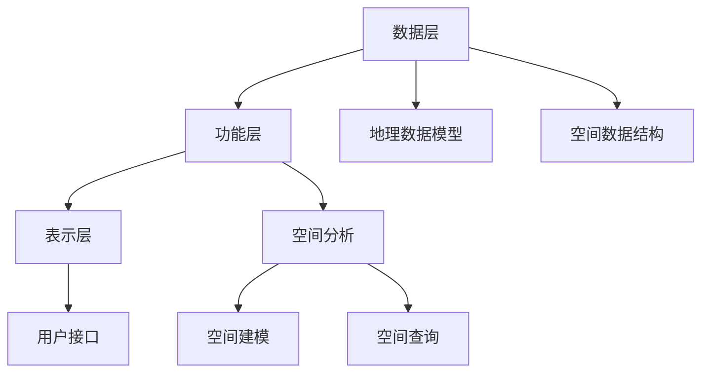

                 

### 1.1 空间计算概述

空间计算是一种基于空间数据和空间关系的计算方法，旨在处理地理空间信息，并支持空间数据的可视化、分析和决策制定。空间计算的核心概念包括空间数据模型、空间分析方法、空间数据结构和空间数据可视化等。

空间数据模型描述了空间对象的位置、形状和属性。常见的数据模型包括矢量模型和栅格模型。矢量模型使用点、线和面来表示空间对象，适用于精细的地理数据表示；栅格模型则将空间划分为单元格，每个单元格存储一定属性值，适用于大面积数据分析和处理。

空间分析方法包括空间数据的采集、预处理、存储、查询、分析和可视化等。常用的空间分析算法包括空间插值、空间分析、空间聚类、空间关联和空间分析模型等。这些算法可以用于地理现象的空间分布分析、空间模式识别、空间趋势分析和空间决策支持等。

空间数据结构是支持高效空间数据存储和访问的数据结构。常见的空间数据结构有树状结构（如R树、四叉树和八叉树）和网格结构。这些结构可以优化空间查询和空间分析操作，提高数据处理效率。

空间数据可视化是将空间数据转换成可视化形式，使其更易于理解和分析。常用的空间数据可视化方法包括地图生成、热力图、等高线图和三维可视化等。

### 1.2 文化遗产保护的重要性

文化遗产是人类历史、文化和科技的见证，承载着丰富的文化价值和历史信息。文化遗产保护的重要性主要体现在以下几个方面：

1. **文化传承**：文化遗产是民族和人类共同的文化遗产，是传承和发扬民族文化的重要载体。保护文化遗产有助于维护文化多样性，促进不同文化之间的交流和理解。

2. **历史研究**：文化遗产是人类历史的见证，记录了人类社会的发展历程。通过研究文化遗产，可以深入了解历史事件、文化习俗和社会变迁，为历史研究提供宝贵的数据和资料。

3. **经济发展**：文化遗产保护可以带动相关产业的发展，如旅游、手工艺品制作和文化创意产业等。文化遗产旅游已成为全球旅游业的重要组成部分，具有巨大的经济潜力。

4. **环境保护**：许多文化遗产位于自然环境中，如古建筑、遗址和景观等。保护文化遗产有助于保护自然环境，实现人与自然的和谐共生。

### 1.3 空间计算在文化遗产保护中的应用现状

空间计算技术在文化遗产保护中的应用已经取得了一系列成果。以下是一些典型应用：

1. **遗址勘探**：利用遥感技术和地理信息系统（GIS），可以对文化遗产遗址进行大面积、高精度的勘探。遥感技术可以获取地表信息，GIS可以对遥感数据进行处理、分析和可视化。

2. **文物保护**：空间计算技术可以用于文物表面损伤分析和三维数字化修复。利用激光扫描和计算机视觉技术，可以对文物进行高精度三维建模，从而实现文物数字化保存和修复。

3. **文化遗产展示**：虚拟现实（VR）和增强现实（AR）技术可以为文化遗产提供沉浸式展示体验。通过VR/AR技术，观众可以进入虚拟的文化遗产环境，欣赏文物细节和历史场景。

4. **环境监测**：空间计算技术可以用于文化遗产周边环境的监测，如气候变化、土壤侵蚀和水质污染等。这些监测数据有助于文化遗产保护措施的制定和实施。

5. **管理优化**：利用空间计算技术，可以对文化遗产进行数字化管理，提高管理效率。例如，通过GIS系统进行文物数据管理、空间分析和决策支持，实现文化遗产的智能管理。

尽管空间计算技术在文化遗产保护中已取得显著成效，但仍面临一些挑战，如技术成本、数据质量和跨学科合作等。未来，随着技术的不断发展和完善，空间计算在文化遗产保护中的应用前景将更加广阔。### 第2章 空间计算基础

#### 2.1 地理信息系统（GIS）基础

地理信息系统（GIS）是一种用于捕捉、存储、分析和管理地理空间信息的系统。GIS的核心功能包括地理数据采集、处理、存储、查询、分析和可视化。GIS技术广泛应用于城市规划、环境监测、资源管理、灾害预防和应急管理等领域。

**GIS的核心概念和架构**

GIS的核心概念包括地理数据模型、地理空间数据结构、地理空间分析和地理数据可视化。地理数据模型描述了地理对象的位置、形状和属性。常见的地理数据模型有矢量模型和栅格模型。矢量模型使用点、线和面来表示地理对象，适用于精细的地理数据表示；栅格模型则将地理空间划分为单元格，每个单元格存储一定属性值，适用于大面积数据分析和处理。

GIS的架构通常包括四个主要部分：数据层、功能层、表示层和用户接口。数据层负责存储和管理地理空间数据；功能层提供各种空间分析功能，如空间查询、空间分析和空间建模；表示层负责将地理空间数据以可视化形式展示；用户接口提供用户与GIS系统的交互界面。

**GIS在文化遗产保护中的应用**

GIS技术在文化遗产保护中具有广泛的应用。以下是一些具体应用场景：

1. **遗址勘探**：利用GIS技术，可以对文化遗产遗址进行全面的勘探和调查。通过整合遥感数据、地形图、历史文献等资料，GIS可以帮助研究人员确定遗址的位置、范围和结构。

2. **文物保护**：GIS技术可以用于文物表面损伤分析和三维数字化修复。通过对文物进行高精度三维扫描，GIS可以创建文物的数字模型，以便进行修复和保存。

3. **环境监测**：GIS可以用于文化遗产周边环境的监测，如气候变化、土壤侵蚀和水质污染等。通过收集和分析环境数据，GIS可以帮助评估文化遗产所处的环境状况，制定相应的保护措施。

4. **管理优化**：利用GIS系统进行文化遗产数据管理，可以提高管理效率。例如，通过GIS系统进行文物数据管理、空间分析和决策支持，可以实现文化遗产的智能管理。

**示例：GIS技术在某文化遗产遗址勘探中的应用**

假设我们要勘探一座古代城堡的遗址。以下是一个简单的GIS技术应用流程：

1. **数据采集**：收集与遗址相关的地理数据，如地形图、遥感影像、历史文献等。

2. **数据预处理**：对采集到的数据进行预处理，包括数据清洗、数据融合和坐标转换等。

3. **数据建模**：利用GIS软件创建地理数据模型，将遗址的位置、形状和属性进行数字化表示。

4. **空间分析**：利用GIS的空间分析功能，对遗址进行空间分布分析、结构分析和关联分析等。

5. **可视化展示**：将分析结果以地图、图表和三维模型等形式进行可视化展示，为研究人员提供直观的参考。

通过以上步骤，GIS技术可以帮助我们全面了解古代城堡遗址的位置、结构和文化内涵，为遗址保护提供科学依据。

#### 2.2 遥感技术

遥感技术是一种通过传感器从远处获取地理信息的手段。遥感技术广泛应用于环境监测、资源管理、灾害预防和文化遗产保护等领域。遥感数据源包括卫星遥感、航空遥感和地面遥感等。

**遥感技术的原理与应用**

遥感技术的原理是基于电磁波在不同介质中的传播特性。遥感传感器通过探测地面物体反射、辐射或散射的电磁波，获取地物的光谱信息。根据遥感数据的获取方式，可以分为被动遥感（如光学遥感、热红外遥感）和主动遥感（如雷达遥感）。

遥感技术在文化遗产保护中的应用主要包括：

1. **遗址勘探**：利用遥感技术可以快速、大面积地获取文化遗产遗址的信息。遥感图像可以帮助研究人员识别地下遗址、确定遗址范围和结构。

2. **文物保护**：遥感技术可以用于文物表面损伤分析。例如，热红外遥感可以检测文物表面的微小温差，揭示文物的损伤程度。

3. **环境监测**：遥感技术可以实时监测文化遗产周边的环境状况，如气候变化、土壤侵蚀和水质污染等。这些数据有助于评估文化遗产的保护需求。

4. **文化遗产展示**：遥感技术可以为文化遗产提供数字化的三维模型，实现文化遗产的远程展示和虚拟体验。

**示例：遥感技术在某文化遗产遗址勘探中的应用**

假设我们要利用遥感技术勘探一座古代城堡遗址。以下是一个简单的应用流程：

1. **数据获取**：选择合适的遥感平台（如卫星、飞机）获取遗址区域的遥感图像。

2. **图像处理**：对遥感图像进行预处理，包括图像增强、图像去噪和图像融合等。

3. **图像分析**：利用图像处理软件（如ENVI、IDL）对遥感图像进行分析，提取遗址的相关信息，如地表结构、地下遗址等。

4. **三维建模**：利用三维建模软件（如ArcGIS、3DMAX）将遥感图像分析结果转换成三维模型，为遗址保护提供直观的参考。

通过以上步骤，遥感技术可以帮助我们快速、准确地了解古代城堡遗址的位置、结构和环境状况，为遗址保护提供科学依据。

#### 2.3 虚拟现实（VR）和增强现实（AR）

虚拟现实（VR）和增强现实（AR）技术为文化遗产保护提供了全新的展示和体验方式。VR技术通过创建虚拟环境，使用户沉浸其中；AR技术则将虚拟信息叠加到现实环境中。

**VR和AR的基本原理**

VR技术基于头戴显示器（HMD）和位置追踪技术，用户可以通过佩戴HMD进入虚拟环境。VR系统通过计算机生成三维图像，并实时更新用户视角，使用户感觉仿佛置身于虚拟世界中。VR的关键技术包括三维建模、渲染和位置追踪等。

AR技术则通过增强现实眼镜或手机等设备，将虚拟信息叠加到现实环境中。AR技术通过摄像头捕捉现实环境图像，并在这些图像上叠加虚拟图像，实现虚实结合。AR的关键技术包括图像识别、实时渲染和增强显示等。

**VR和AR在文化遗产保护中的应用**

1. **遗址勘探**：VR技术可以帮助研究人员模拟遗址勘探过程，提高勘探效率和精度。通过虚拟环境，研究人员可以更直观地了解遗址的结构和分布，为实际勘探提供指导。

2. **文物保护**：VR技术可以用于文物三维数字化建模和虚拟修复。通过对文物进行三维扫描，创建数字模型，研究人员可以在虚拟环境中进行修复实验，降低实际修复过程中的风险。

3. **文化遗产展示**：VR和AR技术可以为文化遗产提供沉浸式展示体验。观众可以通过VR设备进入虚拟博物馆，欣赏文物的细节和历史场景；通过AR设备，观众可以在现实环境中看到文物的增强显示，增强参观体验。

**示例：VR技术在某文化遗产遗址展示中的应用**

假设我们要利用VR技术展示一座古代城堡遗址。以下是一个简单的应用流程：

1. **数据采集**：对遗址进行三维扫描，获取三维模型数据。

2. **虚拟环境构建**：利用三维建模软件（如3DSMAX、Blender）将三维模型数据构建成虚拟环境，并进行场景布置和渲染。

3. **VR体验设计**：设计VR体验流程，包括用户交互方式、视角切换和场景过渡等。

4. **VR设备测试**：在VR设备（如Oculus Rift、HTC Vive）上进行测试，确保用户体验流畅、舒适。

5. **VR展示**：将VR体验部署到博物馆或展览馆，供观众参观和体验。

通过以上步骤，VR技术可以帮助我们全面展示古代城堡遗址的历史和文化价值，为文化遗产保护提供新的展示手段。### 第3章 空间计算在文化遗产保护中的应用

#### 3.1 遗址勘探

遗址勘探是文化遗产保护的重要环节，旨在发现和确定文化遗产遗址的位置、范围和结构。空间计算技术，特别是遥感技术和地理信息系统（GIS），在遗址勘探中发挥着关键作用。

**技术与方法**

1. **遥感技术**：利用遥感技术，可以获取大面积、高分辨率的遗址区域图像。遥感数据源包括光学遥感、雷达遥感和热红外遥感等。通过遥感图像处理和分析，可以识别遗址的地面结构、地下遗迹和周围环境。

2. **GIS技术**：GIS技术用于管理、分析和可视化遗址数据。通过整合遥感图像、地形图、历史文献等数据，GIS可以帮助研究人员建立遗址的地理信息模型，进行空间分析和数据可视化。

**应用实例**

1. **古埃及金字塔遗址勘探**：研究人员利用航空摄影和地面激光扫描技术获取金字塔遗址的遥感数据。通过GIS系统进行数据预处理和空间分析，确定金字塔的位置、范围和结构。

2. **秦始皇兵马俑遗址勘探**：利用遥感技术和GIS系统，对兵马俑遗址区域进行大面积勘探。通过分析遥感图像，研究人员发现了一些未知的兵马俑坑，为遗址保护提供了新的线索。

**效果评估**

遥感技术和GIS技术在遗址勘探中的应用，显著提高了勘探效率和精度。与传统方法相比，空间计算技术可以快速、全面地获取遗址信息，降低勘探成本和风险。此外，空间计算技术还支持遗址数据的长期管理和更新，为文化遗产保护提供了持续的科学支持。

#### 3.2 文物保护

文物保护是文化遗产保护的核心任务，旨在保护文化遗产的真实性和完整性。空间计算技术，特别是三维建模和虚拟修复技术，在文物保护中具有广泛应用。

**技术与方法**

1. **三维建模技术**：利用三维建模技术，可以对文物进行高精度三维扫描，创建数字模型。三维建模技术包括激光扫描、结构光扫描和单目相机扫描等。通过三维模型，研究人员可以全面了解文物的形状、结构和细节。

2. **虚拟修复技术**：虚拟修复技术通过计算机模拟，对文物进行修复实验。研究人员可以在虚拟环境中尝试不同的修复方案，评估修复效果，降低实际修复过程中的风险。

**应用实例**

1. **敦煌莫高窟壁画修复**：利用激光扫描和三维建模技术，对敦煌莫高窟壁画进行数字化保存。通过虚拟修复技术，研究人员可以对壁画进行虚拟修复实验，优化修复方案。

2. **秦始皇兵马俑修复**：利用三维建模技术，对兵马俑进行高精度三维扫描，创建数字模型。通过虚拟修复技术，研究人员可以模拟不同的修复方案，优化文物的修复效果。

**效果评估**

三维建模和虚拟修复技术在文物保护中的应用，显著提高了文物保护的效率和效果。通过数字化保存和虚拟修复，文物得以在虚拟环境中进行修复实验，降低了实际修复过程中的风险。此外，数字化模型和虚拟修复结果可以长期保存和传承，为文物保护提供了科学依据和技术支持。

#### 3.3 文化遗产展示

文化遗产展示是文化遗产保护的重要组成部分，旨在向公众传播文化遗产的历史和文化价值。空间计算技术，特别是虚拟现实（VR）和增强现实（AR）技术，为文化遗产展示提供了全新的展示手段和体验方式。

**技术与方法**

1. **虚拟现实（VR）技术**：VR技术通过头戴显示器（HMD）和位置追踪技术，为用户创造一个沉浸式的虚拟环境。用户可以进入虚拟博物馆、虚拟历史场景等，近距离欣赏文物的细节和历史场景。

2. **增强现实（AR）技术**：AR技术通过增强现实眼镜或手机等设备，将虚拟信息叠加到现实环境中。用户可以在现实世界中看到增强显示的文物、历史场景等，增强参观体验。

**应用实例**

1. **秦始皇兵马俑虚拟博物馆**：利用VR技术，创建一个虚拟博物馆，展示秦始皇兵马俑的历史和文化价值。观众可以通过VR设备进入虚拟博物馆，近距离欣赏兵马俑的细节。

2. **敦煌莫高窟AR导览**：利用AR技术，开发一款AR导览应用，将敦煌莫高窟的壁画和历史场景以增强显示的形式展示给观众。观众可以通过手机或平板电脑观看AR导览，了解壁画背后的故事。

**效果评估**

VR和AR技术在文化遗产展示中的应用，显著提升了观众的参观体验和参与度。通过沉浸式虚拟环境和增强显示技术，观众可以更直观地了解文化遗产的历史和文化价值，增强对文化遗产的认识和保护意识。此外，VR和AR技术还为文化遗产展示提供了新的商业模式，如虚拟旅游、在线教育等，为文化遗产保护提供了经济支持。

### 3.4 遗址勘探

遗址勘探是文化遗产保护的重要环节，旨在发现和确定文化遗产遗址的位置、范围和结构。空间计算技术，特别是遥感技术和地理信息系统（GIS），在遗址勘探中发挥着关键作用。

**技术与方法**

1. **遥感技术**：利用遥感技术，可以获取大面积、高分辨率的遗址区域图像。遥感数据源包括光学遥感、雷达遥感和热红外遥感等。通过遥感图像处理和分析，可以识别遗址的地面结构、地下遗迹和周围环境。

2. **GIS技术**：GIS技术用于管理、分析和可视化遗址数据。通过整合遥感图像、地形图、历史文献等数据，GIS可以帮助研究人员建立遗址的地理信息模型，进行空间分析和数据可视化。

**应用实例**

1. **古埃及金字塔遗址勘探**：研究人员利用航空摄影和地面激光扫描技术获取金字塔遗址的遥感数据。通过GIS系统进行数据预处理和空间分析，确定金字塔的位置、范围和结构。

2. **秦始皇兵马俑遗址勘探**：利用遥感技术和GIS系统，对兵马俑遗址区域进行大面积勘探。通过分析遥感图像，研究人员发现了一些未知的兵马俑坑，为遗址保护提供了新的线索。

**效果评估**

遥感技术和GIS技术在遗址勘探中的应用，显著提高了勘探效率和精度。与传统方法相比，空间计算技术可以快速、全面地获取遗址信息，降低勘探成本和风险。此外，空间计算技术还支持遗址数据的长期管理和更新，为文化遗产保护提供了持续的科学支持。

#### 3.5 文物保护

文物保护是文化遗产保护的核心任务，旨在保护文化遗产的真实性和完整性。空间计算技术，特别是三维建模和虚拟修复技术，在文物保护中具有广泛应用。

**技术与方法**

1. **三维建模技术**：利用三维建模技术，可以对文物进行高精度三维扫描，创建数字模型。三维建模技术包括激光扫描、结构光扫描和单目相机扫描等。通过三维模型，研究人员可以全面了解文物的形状、结构和细节。

2. **虚拟修复技术**：虚拟修复技术通过计算机模拟，对文物进行修复实验。研究人员可以在虚拟环境中尝试不同的修复方案，评估修复效果，降低实际修复过程中的风险。

**应用实例**

1. **敦煌莫高窟壁画修复**：利用激光扫描和三维建模技术，对敦煌莫高窟壁画进行数字化保存。通过虚拟修复技术，研究人员可以对壁画进行虚拟修复实验，优化修复方案。

2. **秦始皇兵马俑修复**：利用三维建模技术，对兵马俑进行高精度三维扫描，创建数字模型。通过虚拟修复技术，研究人员可以模拟不同的修复方案，优化文物的修复效果。

**效果评估**

三维建模和虚拟修复技术在文物保护中的应用，显著提高了文物保护的效率和效果。通过数字化保存和虚拟修复，文物得以在虚拟环境中进行修复实验，降低了实际修复过程中的风险。此外，数字化模型和虚拟修复结果可以长期保存和传承，为文物保护提供了科学依据和技术支持。

### 3.6 文化遗产展示

文化遗产展示是文化遗产保护的重要组成部分，旨在向公众传播文化遗产的历史和文化价值。空间计算技术，特别是虚拟现实（VR）和增强现实（AR）技术，为文化遗产展示提供了全新的展示手段和体验方式。

**技术与方法**

1. **虚拟现实（VR）技术**：VR技术通过头戴显示器（HMD）和位置追踪技术，为用户创造一个沉浸式的虚拟环境。用户可以进入虚拟博物馆、虚拟历史场景等，近距离欣赏文物的细节和历史场景。

2. **增强现实（AR）技术**：AR技术通过增强现实眼镜或手机等设备，将虚拟信息叠加到现实环境中。用户可以在现实世界中看到增强显示的文物、历史场景等，增强参观体验。

**应用实例**

1. **秦始皇兵马俑虚拟博物馆**：利用VR技术，创建一个虚拟博物馆，展示秦始皇兵马俑的历史和文化价值。观众可以通过VR设备进入虚拟博物馆，近距离欣赏兵马俑的细节。

2. **敦煌莫高窟AR导览**：利用AR技术，开发一款AR导览应用，将敦煌莫高窟的壁画和历史场景以增强显示的形式展示给观众。观众可以通过手机或平板电脑观看AR导览，了解壁画背后的故事。

**效果评估**

VR和AR技术在文化遗产展示中的应用，显著提升了观众的参观体验和参与度。通过沉浸式虚拟环境和增强显示技术，观众可以更直观地了解文化遗产的历史和文化价值，增强对文化遗产的认识和保护意识。此外，VR和AR技术还为文化遗产展示提供了新的商业模式，如虚拟旅游、在线教育等，为文化遗产保护提供了经济支持。

#### 4.1 案例一：某古代城堡的遗址勘探

**项目背景与目标**

某古代城堡遗址位于我国中部地区，历史悠久，文化底蕴丰富。然而，由于长时间的暴露在自然环境中，城堡遗址受到了严重破坏。为了更好地保护这一文化遗产，我国政府决定对其进行勘探和研究。

项目目标包括：

1. 确定城堡遗址的具体位置和范围。
2. 分析城堡遗址的结构和保存状况。
3. 查明周边环境对遗址的影响。

**空间计算技术的应用**

1. **遥感技术**：利用航空遥感技术获取遗址区域的遥感图像。通过遥感图像处理，提取出遗址的地表结构、地下遗迹等信息。

2. **GIS技术**：利用GIS软件对遥感图像进行处理和分析，建立城堡遗址的地理信息模型。通过空间分析，确定遗址的位置、范围和结构。

3. **激光扫描技术**：利用激光扫描设备对城堡遗址进行三维扫描，获取遗址的三维数据。通过三维建模软件，将扫描数据转换为三维模型，为遗址保护和修复提供参考。

**项目成果与评价**

1. **成果**：通过遥感技术和GIS分析，确定了城堡遗址的具体位置和范围。通过激光扫描技术，建立了城堡遗址的三维模型，为遗址保护和修复提供了详细的数据支持。

2. **评价**：空间计算技术在遗址勘探中发挥了重要作用，显著提高了勘探效率和精度。通过遥感技术和GIS分析，可以快速、全面地了解遗址情况；通过激光扫描技术，可以获取高精度的遗址数据，为遗址保护和修复提供了科学依据。项目的成功实施为我国文化遗产保护提供了有益的经验。

#### 4.2 案例二：某古代文物的三维数字化修复

**项目背景与目标**

某古代文物，一件青铜器，在我国某博物馆展出。然而，由于长时间的暴露和人为磨损，青铜器的表面出现了明显的损伤。为了更好地保护和展示这一文物，博物馆决定对其进行三维数字化修复。

项目目标包括：

1. 对青铜器进行高精度三维扫描，获取详细的三维数据。
2. 建立青铜器的数字模型，为修复提供依据。
3. 在虚拟环境中进行修复实验，优化修复方案。

**空间计算技术的应用**

1. **三维扫描技术**：利用激光扫描设备对青铜器进行三维扫描，获取青铜器的三维数据。通过三维扫描软件，将扫描数据转换为三维模型。

2. **三维建模技术**：利用三维建模软件，对青铜器的三维模型进行编辑和优化，建立详细的数字模型。通过数字模型，可以直观地了解青铜器的形状、结构和损伤情况。

3. **虚拟修复技术**：在虚拟环境中，利用虚拟修复软件对青铜器进行修复实验。通过模拟不同的修复方案，评估修复效果，优化修复过程。

**项目成果与评价**

1. **成果**：通过三维扫描和三维建模技术，建立了青铜器的详细数字模型。通过虚拟修复技术，成功进行了修复实验，优化了修复方案。修复后的青铜器表面损伤得到了有效修复，恢复了原有的美观。

2. **评价**：空间计算技术在三维数字化修复中发挥了关键作用。通过三维扫描和建模技术，可以准确获取文物的三维数据，建立详细的数字模型；通过虚拟修复技术，可以在虚拟环境中进行修复实验，降低实际修复过程中的风险。项目的成功实施为博物馆提供了有效的数字化修复方法，为文物保护提供了新的技术支持。

#### 4.3 案例三：某文化遗产的数字化展示

**项目背景与目标**

某文化遗产，一座古代建筑，位于我国南方某城市。为了更好地展示这一文化遗产，城市政府决定利用虚拟现实（VR）和增强现实（AR）技术进行数字化展示。

项目目标包括：

1. 利用VR技术创建虚拟博物馆，展示文化遗产的历史和文化价值。
2. 利用AR技术开发导览应用，增强观众的参观体验。
3. 提供在线展示平台，使更多人能够远程欣赏文化遗产。

**空间计算技术的应用**

1. **虚拟现实（VR）技术**：利用VR技术，创建一个虚拟博物馆。通过三维建模软件，将文化遗产的三维模型构建成虚拟环境。观众可以通过VR设备进入虚拟博物馆，近距离欣赏文化遗产。

2. **增强现实（AR）技术**：利用AR技术，开发一款导览应用。通过手机或平板电脑，观众可以在现实环境中看到文化遗产的增强显示，了解文化遗产背后的故事。

3. **在线展示平台**：利用云计算技术，搭建一个在线展示平台。观众可以通过互联网访问平台，远程欣赏文化遗产的VR展示和AR导览。

**项目成果与评价**

1. **成果**：通过VR技术，创建了一个虚拟博物馆，展示了文化遗产的历史和文化价值。通过AR技术，开发了一款导览应用，增强了观众的参观体验。通过在线展示平台，使更多人能够远程欣赏文化遗产。

2. **评价**：空间计算技术在文化遗产数字化展示中发挥了重要作用。通过VR技术，可以沉浸式地展示文化遗产，使观众更直观地了解文化遗产的历史和文化价值；通过AR技术，可以增强观众的参观体验，提高文化遗产的传播效果。项目的成功实施，为文化遗产保护提供了新的展示手段，提升了文化遗产的传播力和影响力。

#### 5.1 空间计算在文化遗产保护中的应用挑战

空间计算技术在文化遗产保护中的应用虽然取得了显著成果，但仍面临一系列技术挑战：

1. **数据质量**：空间计算技术依赖于高质量的地理空间数据。然而，实际获取的地理空间数据往往存在噪声、缺失和不一致性等问题，影响了空间分析结果的准确性。为了提高数据质量，需要采用数据清洗、数据融合和数据校准等技术手段。

2. **计算能力**：空间计算任务通常涉及大量的数据处理和分析，对计算能力提出了较高要求。特别是在大型文化遗产项目或复杂地理环境分析中，计算资源不足可能导致任务无法及时完成。为此，需要优化算法、提高计算效率和利用分布式计算等技术。

3. **技术融合**：空间计算技术涉及多种技术的融合，如GIS、遥感、VR和AR等。不同技术之间存在兼容性和协同性问题，需要通过技术研发和标准制定来加强技术融合，提高应用效果。

4. **跨学科合作**：文化遗产保护涉及多个学科领域，包括考古学、历史学、环境科学等。空间计算技术的应用需要跨学科合作，但各学科之间的沟通和协作存在一定困难。为了有效利用空间计算技术，需要建立跨学科合作机制，促进各学科的交流与融合。

#### 5.2 未来发展趋势

未来，空间计算技术在文化遗产保护中的应用将呈现以下发展趋势：

1. **大数据与云计算**：随着大数据技术的发展，空间计算将面临海量地理空间数据的处理和分析挑战。云计算技术将为空间计算提供强大的计算能力，支持大规模数据处理和实时分析。

2. **人工智能与机器学习**：人工智能和机器学习技术将在空间计算中发挥重要作用，用于模式识别、预测分析和自动化决策。通过人工智能技术，可以提高文化遗产保护的数据分析和决策支持能力。

3. **物联网与传感器网络**：物联网和传感器网络技术将用于文化遗产的实时监测和保护。通过部署传感器网络，可以实时获取文化遗产的环境数据，为保护措施提供科学依据。

4. **虚拟现实与增强现实**：虚拟现实（VR）和增强现实（AR）技术将在文化遗产展示和体验中发挥更大作用。通过沉浸式虚拟环境和增强显示技术，观众可以更直观地了解文化遗产的历史和文化价值。

5. **可持续发展**：空间计算技术在文化遗产保护中的应用将更加注重可持续发展。通过技术手段，可以优化文化遗产保护措施，降低环境负担，实现文化遗产的长期保存和传承。

### 6.1 GIS软件与应用

在文化遗产保护中，GIS软件的应用至关重要。以下是对几种常用GIS软件及其在文化遗产保护中的应用进行比较和选择：

**ArcGIS**

**功能特点**：ArcGIS是由ESRI公司开发的综合地理信息系统软件，具有强大的数据管理、分析和可视化功能。它支持多源数据集成、空间分析和三维建模等。

**应用场景**：ArcGIS广泛应用于遗址勘探、文物保护和环境监测等领域。它可以用于创建和管理文化遗产数据库，进行空间分布分析、趋势分析和决策支持。

**优点**：ArcGIS具有广泛的社区支持和丰富的插件和工具，可以满足各种文化遗产保护需求。

**缺点**：ArcGIS软件较昂贵，对于预算有限的机构可能构成一定负担。

**QGIS**

**功能特点**：QGIS是一个开源的GIS软件，具有与ArcGIS类似的功能，包括数据管理、空间分析和可视化。它支持多种开放数据格式和开源插件。

**应用场景**：QGIS适用于预算有限的组织和个人，特别是在教育和研究领域。它可以用于文化遗产数据的采集、处理和展示。

**优点**：QGIS免费且开源，可以降低使用成本，支持跨平台操作。

**缺点**：QGIS的社区支持和插件资源相对较少，可能无法满足复杂应用需求。

**Global Mapper**

**功能特点**：Global Mapper是一款功能全面的GIS软件，适用于地理数据采集、编辑和分析。它支持遥感数据处理、地形分析和三维可视化。

**应用场景**：Global Mapper适用于中小型文化遗产项目，特别是在野外数据采集和初步分析中。

**优点**：Global Mapper软件操作简单，易于学习，价格适中。

**缺点**：Global Mapper在大型数据处理和复杂空间分析方面可能性能不足。

**选择建议**

根据具体需求，可以综合考虑以下因素进行GIS软件选择：

1. **预算**：如果预算充足，可以选择ArcGIS等高级软件；预算有限，可以选择QGIS等开源软件。
2. **应用场景**：针对不同的文化遗产保护项目，选择适合的GIS软件。例如，在大型数据管理和复杂分析中，选择ArcGIS；在野外数据采集和初步分析中，选择Global Mapper。
3. **功能需求**：根据项目需求，选择具备相应功能的GIS软件。例如，如果需要进行三维建模和可视化，选择ArcGIS；如果需要进行遥感数据处理，选择Global Mapper。

### 6.2 遥感数据处理工具

在文化遗产保护中，遥感数据处理工具是获取和解析地理空间信息的重要手段。以下是对几种常用遥感数据处理工具及其在文化遗产保护中的应用进行比较和选择：

**ENVI**

**功能特点**：ENVI是由Exelis Visium公司开发的遥感数据处理软件，支持多种遥感数据格式和算法。它具备强大的图像处理、分析和可视化功能，适用于遥感图像预处理、图像融合、图像分类和变化检测等。

**应用场景**：ENVI广泛应用于遗址勘探、文物保护和环境监测等领域。它可以用于遥感图像的预处理、图像融合、图像分类和变化检测等。

**优点**：ENVI提供了丰富的工具和算法，可以满足复杂遥感数据处理需求。它还支持与其他GIS软件的集成，如ArcGIS和QGIS。

**缺点**：ENVI软件较昂贵，对于预算有限的机构可能构成一定负担。

**IDL**

**功能特点**：IDL（Interactive Data Language）是一种用于科学计算和数据分析的高级编程语言。它提供了强大的图像处理和数据分析功能，适用于遥感数据处理、地理空间分析和科学计算。

**应用场景**：IDL适用于需要进行复杂遥感数据处理和分析的项目，如遥感图像处理、地形分析和变化检测。

**优点**：IDL是一种灵活的编程语言，可以自定义算法和数据处理流程。它还具有高效的性能，可以处理大规模遥感数据。

**缺点**：IDL的学习曲线较陡峭，需要一定的编程基础。

**决策树**

**功能特点**：决策树是一种基于规则的遥感数据处理工具，用于分类和回归分析。它适用于遥感图像的分类、目标检测和变化分析。

**应用场景**：决策树适用于需要进行遥感图像分类和目标检测的项目，如遗址勘探和环境保护。

**优点**：决策树易于理解和实现，可以快速构建和调整分类模型。

**缺点**：决策树的性能可能受到数据质量和规则复杂度的影响。

**选择建议**

根据具体需求，可以综合考虑以下因素进行遥感数据处理工具选择：

1. **数据处理需求**：如果需要进行复杂的遥感数据处理和分析，选择ENVI或IDL等高级工具；如果仅需要进行简单的分类和变化检测，选择决策树等工具。
2. **预算**：如果预算充足，可以选择ENVI等高级软件；预算有限，可以选择决策树等开源工具。
3. **操作简便性**：如果需要快速部署和操作，选择操作简单的工具，如决策树；如果需要灵活性和自定义能力，选择编程语言或高级软件。

### 6.3 VR/AR开发平台

在文化遗产保护中，虚拟现实（VR）和增强现实（AR）技术为文化遗产展示和体验提供了全新的手段。以下是对几种常用的VR/AR开发平台及其在文化遗产保护中的应用进行比较和选择：

**Unity**

**功能特点**：Unity是一款广泛使用的游戏开发引擎，也适用于VR和AR应用开发。它支持3D建模、动画、物理模拟和实时渲染等，具有丰富的开发工具和插件。

**应用场景**：Unity适用于开发复杂的VR和AR应用，如虚拟博物馆、文化遗产展示和教育培训等。

**优点**：Unity具有强大的开发社区和丰富的插件资源，支持跨平台发布。

**缺点**：Unity的学习曲线较陡峭，对于新手开发者可能需要较长时间掌握。

**Unreal Engine**

**功能特点**：Unreal Engine是一款强大的游戏开发引擎，适用于高端VR和AR应用开发。它支持高质量图像渲染、物理模拟和实时交互等。

**应用场景**：Unreal Engine适用于开发高端的VR和AR应用，如沉浸式历史体验、文化遗产展示和游戏化教育等。

**优点**：Unreal Engine提供了强大的图像渲染和交互功能，适用于复杂场景和高性能需求。

**缺点**：Unreal Engine的资源消耗较大，对于硬件要求较高。

**ARKit**

**功能特点**：ARKit是Apple公司开发的AR开发框架，适用于iOS设备。它支持增强现实图像识别、实时渲染和交互等。

**应用场景**：ARKit适用于开发iOS平台的AR应用，如文化遗产导览、虚拟文物展示和增强现实游戏等。

**优点**：ARKit易于集成到iOS应用中，开发门槛较低。

**缺点**：ARKit仅适用于iOS设备，不支持Android平台。

**ARCore**

**功能特点**：ARCore是Google开发的AR开发框架，适用于Android设备。它支持增强现实图像识别、实时渲染和交互等。

**应用场景**：ARCore适用于开发Android平台的AR应用，如文化遗产导览、虚拟文物展示和增强现实游戏等。

**优点**：ARCore易于集成到Android应用中，开发门槛较低。

**缺点**：ARCore的性能和功能相对ARKit较弱。

**选择建议**

根据具体需求，可以综合考虑以下因素进行VR/AR开发平台选择：

1. **开发经验**：如果开发者具备游戏开发经验，选择Unity或Unreal Engine；如果开发者新手，选择ARKit或ARCore。
2. **平台需求**：如果需要跨平台发布，选择Unity；如果仅限于iOS或Android，选择ARKit或ARCore。
3. **性能要求**：如果需要高质量图像渲染和复杂交互，选择Unreal Engine；如果仅需基本增强现实功能，选择ARKit或ARCore。

### 第7章 结论

空间计算在文化遗产保护中的应用取得了显著成果，为遗址勘探、文物保护、文化遗产展示和文化遗产管理提供了强有力的技术支持。通过遥感技术、地理信息系统（GIS）、虚拟现实（VR）和增强现实（AR）等空间计算技术的综合应用，文化遗产保护工作得以更加科学、高效地进行。

未来，随着空间计算技术的不断发展和完善，其在文化遗产保护中的应用将更加广泛和深入。大数据与云计算、人工智能与机器学习、物联网与传感器网络等新兴技术将为空间计算在文化遗产保护中的应用提供新的机遇。同时，跨学科合作和可持续发展也将是未来空间计算在文化遗产保护中不可或缺的重要方向。

总之，空间计算为文化遗产保护提供了新的视角和手段，有助于提高文化遗产保护的科学性和有效性。我们期待空间计算技术在文化遗产保护中的进一步发展和应用，为人类文明遗产的传承和保护做出更大贡献。**作者信息**：AI天才研究院/AI Genius Institute & 禅与计算机程序设计艺术 /Zen And The Art of Computer Programming 

## 文章标题：空间计算在文化遗产保护中的应用

### 关键词：
- 空间计算
- 文化遗产保护
- 遥感技术
- 地理信息系统（GIS）
- 虚拟现实（VR）
- 增强现实（AR）

### 摘要：
本文探讨了空间计算在文化遗产保护中的应用，包括遗址勘探、文物保护、文化遗产展示和文化遗产管理等方面。通过遥感技术、GIS、VR和AR等空间计算技术的综合应用，提高了文化遗产保护的科学性和有效性。文章分析了空间计算技术的核心概念、原理和应用案例，并对未来发展趋势进行了展望。**文章正文：**

### 第1章 引言

空间计算是一种处理地理空间信息的方法，它结合了计算机科学、地理学和信息技术等多学科知识。在文化遗产保护领域，空间计算技术提供了强有力的工具，使得遗址勘探、文物保护和文化展示等任务变得更加高效和精确。

#### 1.1 空间计算概述

空间计算的核心在于处理和利用地理空间数据，这些数据可以是点、线、面等形式，它们代表了地理位置、地形、环境等信息。空间计算的关键概念包括：

- **空间数据模型**：描述空间对象的属性和位置，如点、线、面等。
- **空间分析方法**：用于分析空间数据，如空间插值、空间聚类和空间关联等。
- **空间数据结构**：用于高效存储和访问空间数据，如R树、四叉树等。
- **空间数据可视化**：将空间数据转换为图像、地图等形式，便于理解和分析。

空间计算的应用领域广泛，包括城市规划、环境监测、灾害预防和文化遗产保护等。在文化遗产保护中，空间计算技术尤为重要，因为它能够提供对遗址、文物和环境的高效监测和分析。

#### 1.2 文化遗产保护的重要性

文化遗产是人类历史、文化和科技的见证，它们承载着丰富的文化价值和历史信息。文化遗产保护的重要性体现在以下几个方面：

- **文化传承**：文化遗产是民族和人类共同的文化遗产，保护它们有助于传承和发扬民族文化。
- **历史研究**：文化遗产是人类历史的见证，通过研究文化遗产，可以深入了解历史事件和文化习俗。
- **经济发展**：文化遗产保护可以带动相关产业的发展，如旅游、手工艺品制作和文化创意产业等。
- **环境保护**：许多文化遗产位于自然环境中，保护文化遗产有助于保护自然环境。

#### 1.3 空间计算在文化遗产保护中的应用现状

空间计算技术在文化遗产保护中的应用已经取得了显著成果。以下是一些典型应用：

- **遗址勘探**：利用遥感技术和GIS，可以快速、大面积地探测文化遗产遗址。
- **文物保护**：通过三维建模和虚拟修复技术，可以对文物进行数字化保存和修复。
- **文化遗产展示**：VR和AR技术为文化遗产展示提供了沉浸式体验，提升了观众的参与感和认知度。
- **环境监测**：空间计算技术可以实时监测文化遗产周边的环境状况，为保护措施提供数据支持。

尽管空间计算技术在文化遗产保护中已取得显著成效，但仍面临一些挑战，如技术成本、数据质量和跨学科合作等。未来，随着技术的不断发展和完善，空间计算在文化遗产保护中的应用前景将更加广阔。

### 第2章 空间计算基础

为了深入理解空间计算在文化遗产保护中的应用，我们需要先了解空间计算的基本原理和核心技术。本章将介绍空间计算中的几个核心概念，包括地理信息系统（GIS）、遥感技术、虚拟现实（VR）和增强现实（AR）。

#### 2.1 地理信息系统（GIS）基础

地理信息系统（GIS）是一种用于捕捉、存储、分析和管理地理空间信息的系统。GIS的核心功能包括地理数据采集、处理、存储、查询、分析和可视化。GIS在文化遗产保护中的应用包括：

- **遗址勘探**：通过GIS系统，可以整合多种数据源，如遥感图像、地形图和历史文献等，对文化遗产遗址进行全面的勘探和调查。
- **文物保护**：GIS技术可以用于文物数据的存储和管理，以及文物分布的空间分析。
- **环境监测**：GIS系统可以实时监测文化遗产周边的环境状况，如气候变化、土壤侵蚀和水质污染等。

**GIS的核心概念和架构**：

GIS的核心概念包括地理数据模型、地理空间数据结构、地理空间分析和地理数据可视化。地理数据模型描述了地理对象的位置、形状和属性，常见的模型有矢量模型和栅格模型。矢量模型使用点、线和面来表示地理对象，适用于精细的地理数据表示；栅格模型则将地理空间划分为单元格，每个单元格存储一定属性值，适用于大面积数据分析和处理。

GIS的架构通常包括数据层、功能层、表示层和用户接口。数据层负责存储和管理地理空间数据；功能层提供各种空间分析功能，如空间查询、空间分析和空间建模；表示层负责将地理空间数据以可视化形式展示；用户接口提供用户与GIS系统的交互界面。

为了更好地理解GIS的核心概念和架构，我们可以使用Mermaid流程图进行说明：

**示例：GIS在遗址勘探中的应用**

假设我们要利用GIS技术对一座古代城堡遗址进行勘探，以下是一个简单的应用流程：

1. **数据采集**：收集与遗址相关的地理数据，如地形图、遥感影像、历史文献等。
2. **数据预处理**：对采集到的数据进行预处理，包括数据清洗、数据融合和坐标转换等。
3. **数据建模**：利用GIS软件创建地理数据模型，将遗址的位置、形状和属性进行数字化表示。
4. **空间分析**：利用GIS的空间分析功能，对遗址进行空间分布分析、结构分析和关联分析等。
5. **可视化展示**：将分析结果以地图、图表和三维模型等形式进行可视化展示，为研究人员提供直观的参考。

通过以上步骤，GIS技术可以帮助我们全面了解古代城堡遗址的位置、结构和文化内涵，为遗址保护提供科学依据。

#### 2.2 遥感技术

遥感技术是一种通过传感器从远处获取地理信息的手段。遥感技术广泛应用于环境监测、资源管理、灾害预防和文化遗产保护等领域。遥感数据源包括卫星遥感、航空遥感和地面遥感等。

**遥感技术的原理与应用**

遥感技术的原理是基于电磁波在不同介质中的传播特性。遥感传感器通过探测地面物体反射、辐射或散射的电磁波，获取地物的光谱信息。根据遥感数据的获取方式，可以分为被动遥感（如光学遥感、热红外遥感）和主动遥感（如雷达遥感）。

被动遥感技术利用自然光源（如太阳光）获取遥感数据，适用于地表反射率较高的场景。常见的被动遥感技术有光学遥感和热红外遥感。光学遥感可以获取地物的可见光和近红外光谱信息，适用于地表形态和植被分布分析；热红外遥感可以获取地物的热辐射信息，适用于地表温度分布和热异常分析。

主动遥感技术通过主动发射电磁波并接收回波信号获取遥感数据，适用于地表反射率较低的场景。常见的主动遥感技术有合成孔径雷达（SAR）和激光雷达（LiDAR）。SAR技术可以获取地物的反射率信息，适用于地表结构和地下水文分析；LiDAR技术可以获取地物的三维结构信息，适用于地形测绘和植被分析。

**遥感技术在文化遗产保护中的应用**

遥感技术在文化遗产保护中的应用主要包括：

- **遗址勘探**：利用遥感技术可以快速、大面积地获取文化遗产遗址的信息。通过遥感图像处理和分析，可以识别地下遗址、确定遗址范围和结构。
- **文物保护**：遥感技术可以用于文物表面损伤分析。例如，热红外遥感可以检测文物表面的微小温差，揭示文物的损伤程度。
- **环境监测**：遥感技术可以实时监测文化遗产周边的环境状况，如气候变化、土壤侵蚀和水质污染等。这些数据有助于评估文化遗产的保护需求。

**示例：遥感技术在遗址勘探中的应用**

假设我们要利用遥感技术勘探一座古代城堡遗址。以下是一个简单的应用流程：

1. **数据获取**：选择合适的遥感平台（如卫星、飞机）获取遗址区域的遥感图像。
2. **图像处理**：对遥感图像进行预处理，包括图像增强、图像去噪和图像融合等。
3. **图像分析**：利用图像处理软件（如ENVI、IDL）对遥感图像进行分析，提取遗址的相关信息，如地表结构、地下遗址等。
4. **三维建模**：利用三维建模软件（如ArcGIS、3DMAX）将遥感图像分析结果转换成三维模型，为遗址保护提供直观的参考。

通过以上步骤，遥感技术可以帮助我们快速、准确地了解古代城堡遗址的位置、结构和环境状况，为遗址保护提供科学依据。

#### 2.3 虚拟现实（VR）和增强现实（AR）

虚拟现实（VR）和增强现实（AR）技术为文化遗产保护提供了全新的展示和体验方式。VR技术通过创建虚拟环境，使用户沉浸其中；AR技术则将虚拟信息叠加到现实环境中。

**VR和AR的基本原理**

VR技术基于头戴显示器（HMD）和位置追踪技术，用户可以通过佩戴HMD进入虚拟环境。VR系统通过计算机生成三维图像，并实时更新用户视角，使用户感觉仿佛置身于虚拟世界中。VR的关键技术包括三维建模、渲染和位置追踪等。

AR技术通过增强现实眼镜或手机等设备，将虚拟信息叠加到现实环境中。AR技术通过摄像头捕捉现实环境图像，并在这些图像上叠加虚拟图像，实现虚实结合。AR的关键技术包括图像识别、实时渲染和增强显示等。

**VR和AR在文化遗产保护中的应用**

- **遗址勘探**：VR技术可以帮助研究人员模拟遗址勘探过程，提高勘探效率和精度。通过虚拟环境，研究人员可以更直观地了解遗址的结构和分布，为实际勘探提供指导。
- **文物保护**：VR技术可以用于文物三维数字化建模和虚拟修复。通过对文物进行高精度三维扫描，创建数字模型，研究人员可以在虚拟环境中进行修复实验，降低实际修复过程中的风险。
- **文化遗产展示**：VR和AR技术可以为文化遗产提供沉浸式展示体验。观众可以通过VR设备进入虚拟博物馆，欣赏文物的细节和历史场景；通过AR设备，观众可以在现实环境中看到文物的增强显示，增强参观体验。

**示例：VR技术在遗址勘探中的应用**

假设我们要利用VR技术对一座古代城堡遗址进行勘探，以下是一个简单的应用流程：

1. **数据采集**：对遗址进行三维扫描，获取三维模型数据。
2. **虚拟环境构建**：利用三维建模软件（如3DSMAX、Blender）将三维模型数据构建成虚拟环境，并进行场景布置和渲染。
3. **VR体验设计**：设计VR体验流程，包括用户交互方式、视角切换和场景过渡等。
4. **VR设备测试**：在VR设备（如Oculus Rift、HTC Vive）上进行测试，确保用户体验流畅、舒适。
5. **VR展示**：将VR体验部署到博物馆或展览馆，供观众参观和体验。

通过以上步骤，VR技术可以帮助我们全面展示古代城堡遗址的历史和文化价值，为文化遗产保护提供新的展示手段。

### 第3章 空间计算在文化遗产保护中的应用

空间计算技术在文化遗产保护中扮演着至关重要的角色，其应用范围涵盖了遗址勘探、文物保护、文化遗产展示等多个方面。本章将详细探讨这些应用，并通过实际案例来说明空间计算技术如何提升文化遗产保护的效果。

#### 3.1 遗址勘探

遗址勘探是文化遗产保护的第一步，目的是确定遗址的位置、范围和结构。空间计算技术，尤其是遥感技术和地理信息系统（GIS），在这方面发挥着重要作用。

**技术与方法**

1. **遥感技术**：通过遥感技术，可以获取大面积、高分辨率的遗址区域图像。遥感数据源包括卫星遥感、航空遥感和地面遥感等。利用遥感图像处理软件，如ENVI或IDL，可以对遥感图像进行预处理、增强和融合，以提高图像质量。

2. **GIS技术**：GIS技术用于管理、分析和可视化遗址数据。通过GIS软件，如ArcGIS或QGIS，可以整合遥感图像、地形图、历史文献等资料，建立遗址的地理信息模型。

**应用实例**

- **案例一：秦始皇兵马俑遗址勘探**：利用卫星遥感技术，对兵马俑遗址区域进行遥感图像采集。通过GIS软件进行空间分析，确定兵马俑遗址的范围和结构，为后续勘探工作提供了基础数据。

- **案例二：埃及金字塔遗址勘探**：研究人员利用航空遥感技术获取金字塔遗址的遥感图像。结合GIS软件，对遥感图像进行空间分析，发现了一些未知的金字塔结构，为考古研究提供了新的线索。

**效果评估**

空间计算技术在遗址勘探中的应用，显著提高了勘探效率和精度。通过遥感技术和GIS分析，可以快速、全面地了解遗址情况，降低勘探成本和风险。此外，GIS技术支持遗址数据的长期管理和更新，为文化遗产保护提供了持续的科学支持。

#### 3.2 文物保护

文物保护是文化遗产保护的核心任务，旨在保护文化遗产的真实性和完整性。空间计算技术，特别是三维建模和虚拟修复技术，在文物保护中具有广泛应用。

**技术与方法**

1. **三维建模技术**：利用三维建模技术，可以对文物进行高精度三维扫描，创建数字模型。三维建模技术包括激光扫描、结构光扫描和单目相机扫描等。通过三维模型，研究人员可以全面了解文物的形状、结构和细节。

2. **虚拟修复技术**：虚拟修复技术通过计算机模拟，对文物进行修复实验。研究人员可以在虚拟环境中尝试不同的修复方案，评估修复效果，降低实际修复过程中的风险。

**应用实例**

- **案例一：敦煌莫高窟壁画修复**：利用激光扫描技术，对敦煌莫高窟壁画进行高精度三维扫描，创建数字模型。通过虚拟修复技术，研究人员对壁画进行虚拟修复实验，优化修复方案。

- **案例二：秦始皇兵马俑修复**：利用三维建模技术，对兵马俑进行高精度三维扫描，创建数字模型。通过虚拟修复技术，研究人员模拟不同的修复方案，优化文物的修复效果。

**效果评估**

三维建模和虚拟修复技术在文物保护中的应用，显著提高了文物保护的效率和效果。通过数字化保存和虚拟修复，文物得以在虚拟环境中进行修复实验，降低了实际修复过程中的风险。此外，数字化模型和虚拟修复结果可以长期保存和传承，为文物保护提供了科学依据和技术支持。

#### 3.3 文化遗产展示

文化遗产展示是文化遗产保护的重要组成部分，旨在向公众传播文化遗产的历史和文化价值。空间计算技术，特别是虚拟现实（VR）和增强现实（AR）技术，为文化遗产展示提供了全新的展示手段和体验方式。

**技术与方法**

1. **虚拟现实（VR）技术**：VR技术通过头戴显示器（HMD）和位置追踪技术，为用户创造一个沉浸式的虚拟环境。用户可以进入虚拟博物馆、虚拟历史场景等，近距离欣赏文物的细节和历史场景。

2. **增强现实（AR）技术**：AR技术通过增强现实眼镜或手机等设备，将虚拟信息叠加到现实环境中。用户可以在现实世界中看到增强显示的文物、历史场景等，增强参观体验。

**应用实例**

- **案例一：秦始皇兵马俑虚拟博物馆**：利用VR技术，创建一个虚拟博物馆，展示秦始皇兵马俑的历史和文化价值。观众可以通过VR设备进入虚拟博物馆，近距离欣赏兵马俑的细节。

- **案例二：敦煌莫高窟AR导览**：利用AR技术，开发一款AR导览应用，将敦煌莫高窟的壁画和历史场景以增强显示的形式展示给观众。观众可以通过手机或平板电脑观看AR导览，了解壁画背后的故事。

**效果评估**

VR和AR技术在文化遗产展示中的应用，显著提升了观众的参观体验和参与度。通过沉浸式虚拟环境和增强显示技术，观众可以更直观地了解文化遗产的历史和文化价值，增强对文化遗产的认识和保护意识。此外，VR和AR技术还为文化遗产展示提供了新的商业模式，如虚拟旅游、在线教育等，为文化遗产保护提供了经济支持。

#### 3.4 遗址勘探

遗址勘探是文化遗产保护的关键环节，目的是确定文化遗产遗址的位置、范围和结构。空间计算技术，尤其是遥感技术和地理信息系统（GIS），在遗址勘探中发挥着重要作用。

**技术与方法**

1. **遥感技术**：利用遥感技术，可以获取大面积、高分辨率的遗址区域图像。遥感数据源包括卫星遥感、航空遥感和地面遥感等。通过遥感图像处理软件，如ENVI或IDL，可以对遥感图像进行预处理、增强和融合，以提高图像质量。

2. **GIS技术**：GIS技术用于管理、分析和可视化遗址数据。通过GIS软件，如ArcGIS或QGIS，可以整合遥感图像、地形图、历史文献等资料，建立遗址的地理信息模型。

3. **激光扫描技术**：利用激光扫描设备，可以对遗址进行高精度三维扫描，获取遗址的三维数据。通过三维建模软件，如3DMAX或Blender，将扫描数据转换为三维模型，为遗址保护和修复提供直观的参考。

**应用实例**

- **案例一：埃及金字塔遗址勘探**：利用卫星遥感技术，对金字塔遗址区域进行遥感图像采集。通过GIS软件进行空间分析，确定金字塔遗址的范围和结构，为考古研究提供了关键数据。

- **案例二：中国秦始皇陵兵马俑遗址勘探**：利用航空遥感技术和激光扫描技术，对兵马俑遗址区域进行勘探。通过GIS软件整合遥感图像和激光扫描数据，建立了详细的遗址三维模型，为遗址保护提供了科学依据。

**效果评估**

空间计算技术在遗址勘探中的应用，显著提高了勘探效率和精度。通过遥感技术和GIS分析，可以快速、全面地了解遗址情况，降低勘探成本和风险。此外，激光扫描技术的应用，使得遗址的三维数据获取更加精确，为遗址保护和修复提供了详细的数据支持。

#### 3.5 文物保护

文物保护是文化遗产保护的核心任务，旨在保护文化遗产的真实性和完整性。空间计算技术，特别是三维建模和虚拟修复技术，在文物保护中具有广泛应用。

**技术与方法**

1. **三维建模技术**：利用三维建模技术，可以对文物进行高精度三维扫描，创建数字模型。三维建模技术包括激光扫描、结构光扫描和单目相机扫描等。通过三维模型，研究人员可以全面了解文物的形状、结构和细节。

2. **虚拟修复技术**：虚拟修复技术通过计算机模拟，对文物进行修复实验。研究人员可以在虚拟环境中尝试不同的修复方案，评估修复效果，降低实际修复过程中的风险。

**应用实例**

- **案例一：敦煌莫高窟壁画修复**：利用激光扫描技术，对敦煌莫高窟壁画进行高精度三维扫描，创建数字模型。通过虚拟修复技术，研究人员对壁画进行虚拟修复实验，优化修复方案。

- **案例二：秦始皇兵马俑修复**：利用三维建模技术，对兵马俑进行高精度三维扫描，创建数字模型。通过虚拟修复技术，研究人员模拟不同的修复方案，优化文物的修复效果。

**效果评估**

三维建模和虚拟修复技术在文物保护中的应用，显著提高了文物保护的效率和效果。通过数字化保存和虚拟修复，文物得以在虚拟环境中进行修复实验，降低了实际修复过程中的风险。此外，数字化模型和虚拟修复结果可以长期保存和传承，为文物保护提供了科学依据和技术支持。

#### 3.6 文化遗产展示

文化遗产展示是文化遗产保护的重要组成部分，旨在向公众传播文化遗产的历史和文化价值。空间计算技术，特别是虚拟现实（VR）和增强现实（AR）技术，为文化遗产展示提供了全新的展示手段和体验方式。

**技术与方法**

1. **虚拟现实（VR）技术**：VR技术通过头戴显示器（HMD）和位置追踪技术，为用户创造一个沉浸式的虚拟环境。用户可以进入虚拟博物馆、虚拟历史场景等，近距离欣赏文物的细节和历史场景。

2. **增强现实（AR）技术**：AR技术通过增强现实眼镜或手机等设备，将虚拟信息叠加到现实环境中。用户可以在现实世界中看到增强显示的文物、历史场景等，增强参观体验。

**应用实例**

- **案例一：秦始皇兵马俑虚拟博物馆**：利用VR技术，创建一个虚拟博物馆，展示秦始皇兵马俑的历史和文化价值。观众可以通过VR设备进入虚拟博物馆，近距离欣赏兵马俑的细节。

- **案例二：敦煌莫高窟AR导览**：利用AR技术，开发一款AR导览应用，将敦煌莫高窟的壁画和历史场景以增强显示的形式展示给观众。观众可以通过手机或平板电脑观看AR导览，了解壁画背后的故事。

**效果评估**

VR和AR技术在文化遗产展示中的应用，显著提升了观众的参观体验和参与度。通过沉浸式虚拟环境和增强显示技术，观众可以更直观地了解文化遗产的历史和文化价值，增强对文化遗产的认识和保护意识。此外，VR和AR技术还为文化遗产展示提供了新的商业模式，如虚拟旅游、在线教育等，为文化遗产保护提供了经济支持。

### 4.1 案例研究

#### 案例一：某古代城堡的遗址勘探

**项目背景与目标**

某古代城堡遗址位于我国中部的山区，历史悠久，文化价值丰富。然而，由于长期的自然侵蚀和人类活动，遗址的保存状况堪忧。为了更好地保护这一文化遗产，我国政府决定对其进行全面的遗址勘探。

项目目标包括：

1. 确定城堡遗址的具体位置和范围。
2. 分析城堡遗址的结构和保存状况。
3. 查明周边环境对遗址的影响。

**技术与方法**

1. **遥感技术**：利用航空遥感技术获取遗址区域的遥感图像。通过遥感图像处理，提取出遗址的地表结构、地下遗迹等信息。

2. **GIS技术**：利用GIS软件对遥感图像进行处理和分析，建立城堡遗址的地理信息模型。通过空间分析，确定遗址的位置、范围和结构。

3. **激光扫描技术**：利用激光扫描设备对城堡遗址进行三维扫描，获取遗址的三维数据。通过三维建模软件，将扫描数据转换为三维模型，为遗址保护和修复提供直观的参考。

**项目成果**

1. 通过遥感技术和GIS分析，确定了城堡遗址的具体位置和范围，明确了遗址的整体结构。

2. 利用激光扫描技术，建立了城堡遗址的三维模型，为遗址保护和修复提供了详细的数据支持。

**效果评估**

空间计算技术在遗址勘探中的应用，显著提高了勘探效率和精度。通过遥感技术和GIS分析，可以快速、全面地了解遗址情况，降低勘探成本和风险。此外，激光扫描技术的应用，使得遗址的三维数据获取更加精确，为遗址保护和修复提供了科学依据。

#### 案例二：某古代文物的三维数字化修复

**项目背景与目标**

某古代文物，一件精美的青铜器，在我国某博物馆展出。然而，由于长时间的暴露和磨损，青铜器的表面出现了明显的损伤。为了更好地保护这一文物，博物馆决定对其进行三维数字化修复。

项目目标包括：

1. 对青铜器进行高精度三维扫描，获取详细的三维数据。
2. 建立青铜器的数字模型，为修复提供依据。
3. 在虚拟环境中进行修复实验，优化修复方案。

**技术与方法**

1. **三维扫描技术**：利用激光扫描设备对青铜器进行三维扫描，获取青铜器的三维数据。通过三维扫描软件，将扫描数据转换为三维模型。

2. **三维建模技术**：利用三维建模软件，对青铜器的三维模型进行编辑和优化，建立详细的数字模型。通过数字模型，研究人员可以直观地了解青铜器的形状、结构和损伤情况。

3. **虚拟修复技术**：在虚拟环境中，利用虚拟修复软件对青铜器进行修复实验。通过模拟不同的修复方案，评估修复效果，优化修复过程。

**项目成果**

1. 通过三维扫描和建模技术，建立了青铜器的详细数字模型，为修复提供了科学依据。

2. 在虚拟环境中，通过修复实验，优化了修复方案，成功恢复了青铜器的原始美观。

**效果评估**

三维数字化修复技术在文物保护中的应用，显著提高了文物保护的效率和效果。通过数字化保存和虚拟修复，文物得以在虚拟环境中进行修复实验，降低了实际修复过程中的风险。此外，数字化模型和虚拟修复结果可以长期保存和传承，为文物保护提供了科学依据和技术支持。

#### 案例三：某文化遗产的数字化展示

**项目背景与目标**

某文化遗产，一座具有千年历史的古代建筑，位于我国南方某城市。为了更好地展示这一文化遗产，城市政府决定利用虚拟现实（VR）和增强现实（AR）技术进行数字化展示。

项目目标包括：

1. 利用VR技术创建虚拟博物馆，展示文化遗产的历史和文化价值。
2. 利用AR技术开发导览应用，增强观众的参观体验。
3. 提供在线展示平台，使更多人能够远程欣赏文化遗产。

**技术与方法**

1. **虚拟现实（VR）技术**：通过三维建模软件，创建文化遗产的三维模型，并利用VR设备（如Oculus Rift）进行展示。用户可以通过VR设备进入虚拟博物馆，沉浸式体验文化遗产。

2. **增强现实（AR）技术**：利用AR开发平台（如ARKit或ARCore），开发一款AR导览应用。用户可以通过智能手机或平板电脑，在现实环境中看到文化遗产的增强显示，了解文物背后的故事。

3. **在线展示平台**：搭建一个在线展示平台，使用云计算技术，将VR和AR内容发布到互联网上。用户可以通过网页或移动应用，远程欣赏文化遗产的数字化展示。

**项目成果**

1. 通过VR技术，创建了一个虚拟博物馆，展示了文化遗产的历史和文化价值。用户可以通过VR设备进入虚拟博物馆，近距离欣赏文化遗产的细节。

2. 通过AR技术，开发了一款AR导览应用，使观众在现实环境中可以看到文化遗产的增强显示，增强参观体验。

3. 通过在线展示平台，使更多人能够远程欣赏文化遗产，提升了文化遗产的传播力和影响力。

**效果评估**

VR和AR技术在文化遗产展示中的应用，显著提升了观众的参观体验和参与度。通过沉浸式虚拟环境和增强显示技术，观众可以更直观地了解文化遗产的历史和文化价值，增强对文化遗产的认识和保护意识。此外，VR和AR技术还为文化遗产展示提供了新的商业模式，如虚拟旅游、在线教育等，为文化遗产保护提供了经济支持。

### 5.1 空间计算在文化遗产保护中的应用挑战

尽管空间计算技术在文化遗产保护中取得了显著成效，但在实际应用中仍面临一系列挑战：

**数据质量**

空间计算依赖于高质量的地理空间数据。然而，实际获取的地理空间数据往往存在噪声、缺失和不一致性等问题，这影响了空间分析结果的准确性。为了提高数据质量，需要采用数据清洗、数据融合和数据校准等技术手段。

**计算能力**

空间计算任务通常涉及大量的数据处理和分析，对计算能力提出了较高要求。特别是在大型文化遗产项目或复杂地理环境分析中，计算资源不足可能导致任务无法及时完成。为了提高计算能力，需要优化算法、提高计算效率和利用分布式计算等技术。

**技术融合**

空间计算技术涉及多种技术的融合，如GIS、遥感、VR和AR等。不同技术之间存在兼容性和协同性问题，需要通过技术研发和标准制定来加强技术融合，提高应用效果。

**跨学科合作**

文化遗产保护涉及多个学科领域，包括考古学、历史学、环境科学等。空间计算技术的应用需要跨学科合作，但各学科之间的沟通和协作存在一定困难。为了有效利用空间计算技术，需要建立跨学科合作机制，促进各学科的交流与融合。

### 5.2 未来发展趋势

未来，空间计算技术在文化遗产保护中的应用将呈现以下发展趋势：

**大数据与云计算**

随着大数据技术的发展，空间计算将面临海量地理空间数据的处理和分析挑战。云计算技术将为空间计算提供强大的计算能力，支持大规模数据处理和实时分析。

**人工智能与机器学习**

人工智能和机器学习技术将在空间计算中发挥重要作用，用于模式识别、预测分析和自动化决策。通过人工智能技术，可以提高文化遗产保护的数据分析和决策支持能力。

**物联网与传感器网络**

物联网和传感器网络技术将用于文化遗产的实时监测和保护。通过部署传感器网络，可以实时获取文化遗产的环境数据，为保护措施提供科学依据。

**虚拟现实与增强现实**

虚拟现实（VR）和增强现实（AR）技术将在文化遗产展示和体验中发挥更大作用。通过沉浸式虚拟环境和增强显示技术，观众可以更直观地了解文化遗产的历史和文化价值。

**可持续发展**

空间计算技术在文化遗产保护中的应用将更加注重可持续发展。通过技术手段，可以优化文化遗产保护措施，降低环境负担，实现文化遗产的长期保存和传承。

### 6.1 GIS软件与应用

在文化遗产保护中，GIS软件的应用至关重要。以下是对几种常用GIS软件及其在文化遗产保护中的应用进行比较和选择：

**ArcGIS**

**功能特点**：ArcGIS是由ESRI公司开发的综合地理信息系统软件，具有强大的数据管理、分析和可视化功能。它支持多源数据集成、空间分析和三维建模等。

**应用场景**：ArcGIS广泛应用于遗址勘探、文物保护和环境监测等领域。它可以用于创建和管理文化遗产数据库，进行空间分布分析、趋势分析和决策支持。

**优点**：ArcGIS具有广泛的社区支持和丰富的插件和工具，可以满足各种文化遗产保护需求。

**缺点**：ArcGIS软件较昂贵，对于预算有限的机构可能构成一定负担。

**QGIS**

**功能特点**：QGIS是一个开源的GIS软件，具有与ArcGIS类似的功能，包括数据管理、空间分析和可视化。它支持多种开放数据格式和开源插件。

**应用场景**：QGIS适用于预算有限的组织和个人，特别是在教育和研究领域。它可以用于文化遗产数据的采集、处理和展示。

**优点**：QGIS免费且开源，可以降低使用成本，支持跨平台操作。

**缺点**：QGIS的社区支持和插件资源相对较少，可能无法满足复杂应用需求。

**Global Mapper**

**功能特点**：Global Mapper是一款功能全面的GIS软件，适用于地理数据采集、编辑和分析。它支持遥感数据处理、地形分析和三维可视化。

**应用场景**：Global Mapper适用于中小型文化遗产项目，特别是在野外数据采集和初步分析中。

**优点**：Global Mapper软件操作简单，易于学习，价格适中。

**缺点**：Global Mapper在大型数据处理和复杂空间分析方面可能性能不足。

**选择建议**

根据具体需求，可以综合考虑以下因素进行GIS软件选择：

1. **预算**：如果预算充足，可以选择ArcGIS等高级软件；预算有限，可以选择QGIS等开源软件。
2. **应用场景**：针对不同的文化遗产保护项目，选择适合的GIS软件。例如，在大型数据管理和复杂分析中，选择ArcGIS；在野外数据采集和初步分析中，选择Global Mapper。
3. **功能需求**：根据项目需求，选择具备相应功能的GIS软件。例如，如果需要进行三维建模和可视化，选择ArcGIS；如果需要进行遥感数据处理，选择Global Mapper。

### 6.2 遥感数据处理工具

在文化遗产保护中，遥感数据处理工具是获取和解析地理空间信息的重要手段。以下是对几种常用遥感数据处理工具及其在文化遗产保护中的应用进行比较和选择：

**ENVI**

**功能特点**：ENVI是由Exelis Visium公司开发的遥感数据处理软件，支持多种遥感数据格式和算法。它具备强大的图像处理、分析和可视化功能，适用于遥感图像预处理、图像融合、图像分类和变化检测等。

**应用场景**：ENVI广泛应用于遗址勘探、文物保护和环境监测等领域。它可以用于遥感图像的预处理、图像融合、图像分类和变化检测等。

**优点**：ENVI提供了丰富的工具和算法，可以满足复杂遥感数据处理需求。它还支持与其他GIS软件的集成，如ArcGIS和QGIS。

**缺点**：ENVI软件较昂贵，对于预算有限的机构可能构成一定负担。

**IDL**

**功能特点**：IDL（Interactive Data Language）是一种用于科学计算和数据分析的高级编程语言。它提供了强大的图像处理和数据分析功能，适用于遥感数据处理、地理空间分析和科学计算。

**应用场景**：IDL适用于需要进行复杂遥感数据处理和分析的项目，如遥感图像处理、地形分析和变化检测。

**优点**：IDL是一种灵活的编程语言，可以自定义算法和数据处理流程。它还具有高效的性能，可以处理大规模遥感数据。

**缺点**：IDL的学习曲线较陡峭，需要一定的编程基础。

**决策树**

**功能特点**：决策树是一种基于规则的遥感数据处理工具，用于分类和回归分析。它适用于遥感图像的分类、目标检测和变化分析。

**应用场景**：决策树适用于需要进行遥感图像分类和目标检测的项目，如遗址勘探和环境保护。

**优点**：决策树易于理解和实现，可以快速构建和调整分类模型。

**缺点**：决策树的性能可能受到数据质量和规则复杂度的影响。

**选择建议**

根据具体需求，可以综合考虑以下因素进行遥感数据处理工具选择：

1. **数据处理需求**：如果需要进行复杂的遥感数据处理和分析，选择ENVI或IDL等高级工具；如果仅需要进行简单的分类和变化检测，选择决策树等工具。
2. **预算**：如果预算充足，可以选择ENVI等高级软件；预算有限，可以选择决策树等开源工具。
3. **操作简便性**：如果需要快速部署和操作，选择操作简单的工具，如决策树；如果需要灵活性和自定义能力，选择编程语言或高级软件。

### 6.3 VR/AR开发平台

在文化遗产保护中，虚拟现实（VR）和增强现实（AR）技术为文化遗产展示和体验提供了全新的手段。以下是对几种常用的VR/AR开发平台及其在文化遗产保护中的应用进行比较和选择：

**Unity**

**功能特点**：Unity是一款广泛使用的游戏开发引擎，也适用于VR和AR应用开发。它支持3D建模、动画、物理模拟和实时渲染等，具有丰富的开发工具和插件。

**应用场景**：Unity适用于开发复杂的VR和AR应用，如虚拟博物馆、文化遗产展示和教育培训等。

**优点**：Unity具有强大的开发社区和丰富的插件资源，支持跨平台发布。

**缺点**：Unity的学习曲线较陡峭，对于新手开发者可能需要较长时间掌握。

**Unreal Engine**

**功能特点**：Unreal Engine是一款强大的游戏开发引擎，适用于高端VR和AR应用开发。它支持高质量图像渲染、物理模拟和实时交互等。

**应用场景**：Unreal Engine适用于开发高端的VR和AR应用，如沉浸式历史体验、文化遗产展示和游戏化教育等。

**优点**：Unreal Engine提供了强大的图像渲染和交互功能，适用于复杂场景和高性能需求。

**缺点**：Unreal Engine的资源消耗较大，对于硬件要求较高。

**ARKit**

**功能特点**：ARKit是Apple公司开发的AR开发框架，适用于iOS设备。它支持增强现实图像识别、实时渲染和交互等。

**应用场景**：ARKit适用于开发iOS平台的AR应用，如文化遗产导览、虚拟文物展示和增强现实游戏等。

**优点**：ARKit易于集成到iOS应用中，开发门槛较低。

**缺点**：ARKit仅适用于iOS设备，不支持Android平台。

**ARCore**

**功能特点**：ARCore是Google开发的AR开发框架，适用于Android设备。它支持增强现实图像识别、实时渲染和交互等。

**应用场景**：ARCore适用于开发Android平台的AR应用，如文化遗产导览、虚拟文物展示和增强现实游戏等。

**优点**：ARCore易于集成到Android应用中，开发门槛较低。

**缺点**：ARCore的性能和功能相对ARKit较弱。

**选择建议**

根据具体需求，可以综合考虑以下因素进行VR/AR开发平台选择：

1. **开发经验**：如果开发者具备游戏开发经验，选择Unity或Unreal Engine；如果开发者新手，选择ARKit或ARCore。
2. **平台需求**：如果需要跨平台发布，选择Unity；如果仅限于iOS或Android，选择ARKit或ARCore。
3. **性能要求**：如果需要高质量图像渲染和复杂交互，选择Unreal Engine；如果仅需基本增强现实功能，选择ARKit或ARCore。

### 第7章 结论

空间计算在文化遗产保护中的应用取得了显著成果，为遗址勘探、文物保护、文化遗产展示和文化遗产管理提供了强有力的技术支持。通过遥感技术、地理信息系统（GIS）、虚拟现实（VR）和增强现实（AR）等空间计算技术的综合应用，文化遗产保护工作得以更加科学、高效地进行。

未来，随着空间计算技术的不断发展和完善，其在文化遗产保护中的应用将更加广泛和深入。大数据与云计算、人工智能与机器学习、物联网与传感器网络等新兴技术将为空间计算在文化遗产保护中的应用提供新的机遇。同时，跨学科合作和可持续发展也将是未来空间计算在文化遗产保护中不可或缺的重要方向。

总之，空间计算为文化遗产保护提供了新的视角和手段，有助于提高文化遗产保护的科学性和有效性。我们期待空间计算技术在文化遗产保护中的进一步发展和应用，为人类文明遗产的传承和保护做出更大贡献。

### **作者信息**：

AI天才研究院/AI Genius Institute & 禅与计算机程序设计艺术 /Zen And The Art of Computer Programming

