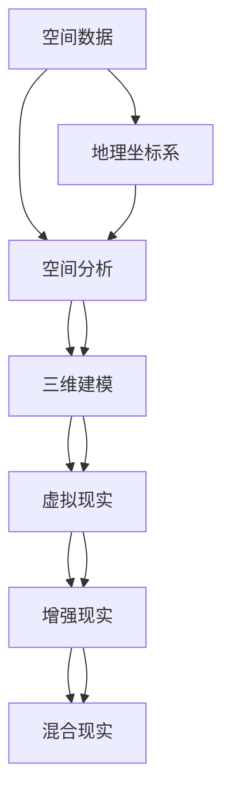

                 

# 《空间计算如何提高企业效率》

## 关键词
空间计算、企业效率、核心技术、应用案例、挑战与未来

## 摘要
空间计算作为一种新兴的计算范式，正日益成为提高企业效率的关键技术。本文将深入探讨空间计算的概念、核心技术及其在企业中的应用，分析其如何通过优化企业管理、业务流程和数据分析，提高企业的整体效率。此外，文章还将探讨空间计算面临的挑战及其未来发展，为企业提供实用的技术和策略指导。

## 目录

### 第一部分：空间计算概述

#### 第1章：空间计算基础

##### 1.1 空间计算的概念与背景
##### 1.2 空间计算的核心技术

#### 第2章：空间计算的核心技术详解

##### 2.1 空间计算核心概念与联系
##### 2.2 空间计算算法原理讲解
##### 2.3 空间计算数学模型详解
##### 2.4 空间计算项目实战

### 第二部分：空间计算的核心技术

#### 第3章：空间计算算法原理
#### 第4章：空间计算数学模型
#### 第5章：空间计算项目实战

### 第三部分：空间计算在企业中的应用

#### 第6章：空间计算在企业管理中的应用
#### 第7章：空间计算在业务优化中的应用

### 第四部分：空间计算面临的挑战与未来发展

#### 第8章：空间计算面临的挑战
#### 第9章：空间计算的未来发展

### 第五部分：附录

#### 附录A：空间计算相关资源

## 第一部分：空间计算概述

### 第1章：空间计算基础

#### 1.1 空间计算的概念与背景

空间计算（Spatial Computing）是一种通过将数据、计算、存储、网络和显示等资源整合到三维空间中的计算范式。它超越了传统的二维计算模式，提供了更丰富的交互方式，更直观的数据表达，以及更高效的资源利用。

空间计算的概念起源于计算机图形学和地理信息系统（GIS），随着虚拟现实（VR）、增强现实（AR）和混合现实（MR）技术的快速发展，空间计算逐渐成为研究热点。其核心思想是将计算与空间环境相结合，使计算机能够更好地理解和响应空间环境中的事件和变化。

空间计算的发展历程可以追溯到20世纪80年代，当时计算机图形学的研究者们开始探索如何在三维空间中展示和处理数据。随着计算机硬件和算法的进步，空间计算技术逐渐成熟，并在近年来的各类新兴应用场景中取得了显著成果。

#### 1.2 空间计算的核心技术

空间计算的核心技术包括但不限于以下几个方面：

1. **空间数据处理与存储**：
   - **空间数据的采集**：使用传感器、无人机、卫星等设备获取空间数据。
   - **空间数据的存储**：利用NoSQL数据库、分布式存储系统等对大规模空间数据进行高效存储和管理。
   - **空间数据的处理**：采用空间分析算法和机器学习模型对空间数据进行分析和挖掘。

2. **空间数据的分析与应用**：
   - **地理信息系统（GIS）**：用于地理空间数据的可视化、分析和模拟。
   - **空间分析算法**：包括空间插值、空间聚类、路径分析等，用于解决地理空间问题。
   - **空间数据可视化**：通过三维模型、热力图、轨迹图等方式，直观展示空间数据。

3. **虚拟现实（VR）和增强现实（AR）**：
   - **VR**：通过计算机生成三维环境，提供沉浸式的交互体验。
   - **AR**：将虚拟信息叠加到现实世界，实现虚实融合的交互方式。

4. **混合现实（MR）**：
   - **MR**：结合VR和AR的技术特点，提供更真实的交互体验。

5. **云计算与边缘计算**：
   - **云计算**：提供强大的计算和存储能力，支持大规模空间数据处理。
   - **边缘计算**：将计算和存储资源部署在靠近数据源的设备上，降低延迟，提高效率。

#### 1.3 空间计算的发展历程

空间计算的发展可以追溯到以下几个重要阶段：

- **第一阶段（20世纪80年代）**：计算机图形学的研究者开始探索在三维空间中展示和处理数据的方法。

- **第二阶段（20世纪90年代）**：地理信息系统（GIS）的出现，使得空间数据分析和可视化成为可能。

- **第三阶段（21世纪初）**：虚拟现实（VR）和增强现实（AR）技术的快速发展，为空间计算带来了新的应用场景。

- **第四阶段（近年）**：混合现实（MR）和边缘计算技术的加入，进一步拓展了空间计算的应用范围。

### 第2章：空间计算的核心技术详解

#### 2.1 空间计算核心概念与联系

空间计算涉及多个核心概念，包括但不限于：

- **空间数据**：指与地理位置相关的数据，如坐标、地形、卫星图像等。
- **地理坐标系**：用于表示地球表面的坐标系，如WGS84坐标系。
- **空间分析**：对空间数据进行分析和处理的技术，如空间插值、路径分析等。
- **三维建模**：创建三维模型的技术，如计算机辅助设计（CAD）。
- **虚拟现实（VR）**：通过计算机生成三维环境，提供沉浸式的交互体验。
- **增强现实（AR）**：将虚拟信息叠加到现实世界，实现虚实融合的交互方式。
- **混合现实（MR）**：结合VR和AR的技术特点，提供更真实的交互体验。

这些概念之间有着紧密的联系。例如，空间数据是空间计算的基础，空间分析算法用于处理空间数据，三维建模和虚拟现实技术用于展示和分析空间数据。这些技术共同构成了空间计算的核心。

下面使用Mermaid流程图展示空间计算的核心概念及其联系：



#### 2.2 空间计算算法原理讲解

空间计算算法是空间计算的核心，用于处理和分析空间数据。以下将介绍几种常见的空间计算算法，包括其原理、伪代码和性能分析。

1. **空间插值算法**

空间插值算法用于从已知点推测未知点的值。常见的方法包括：

- **线性插值**：线性插值是最简单的空间插值方法，通过线性关系推测未知点的值。

- **Kriging插值**：Kriging插值是一种基于统计模型的空间插值方法，可以提供更精确的预测结果。

以下是一个线性插值的伪代码示例：

```python
def linear_interpolation(x, y, x0, y0):
    # x: 已知点横坐标列表
    # y: 已知点纵坐标列表
    # x0: 未知点横坐标
    # y0: 未知点纵坐标

    # 找到最接近x0的两个已知点i和j
    i = binary_search(x, x0)
    j = i + 1 if i < len(x) - 1 else i

    # 计算插值结果
    result = y0 + (y[j] - y[i]) * (x0 - x[i]) / (x[j] - x[i])
    return result
```

性能分析：线性插值算法的时间复杂度为O(log n)，其中n为已知点的数量。由于线性插值算法简单，其性能在大多数情况下都是可接受的。

2. **路径分析算法**

路径分析算法用于计算空间数据中的最优路径。常见的方法包括：

- **Dijkstra算法**：Dijkstra算法是一种用于计算单源最短路径的算法，可以处理带权图。

- **A*算法**：A*算法是一种启发式搜索算法，用于计算空间数据中的最优路径。

以下是一个A*算法的伪代码示例：

```python
def a_star(graph, start, goal):
    # graph: 图数据结构
    # start: 起始节点
    # goal: 目标节点

    open_set = PriorityQueue()  # 开放队列
    closed_set = set()  # 闭包队列

    # 初始化节点信息
    for node in graph:
        node.g = infinity
        node.h = heuristic(node, goal)
        node.parent = None

    start.g = 0
    open_set.put((start.g + start.h, start))

    while not open_set.isEmpty():
        current = open_set.get()

        if current == goal:
            break

        closed_set.add(current)

        for neighbor in current.neighbors:
            if neighbor in closed_set:
                continue

            tentative_g = current.g + distance(current, neighbor)

            if tentative_g < neighbor.g:
                neighbor.g = tentative_g
                neighbor.parent = current
                neighbor.f = neighbor.g + neighbor.h
                if neighbor not in open_set:
                    open_set.put((neighbor.f, neighbor))

    return reconstruct_path(goal.parent)
```

性能分析：A*算法的时间复杂度为O((V+E)logV)，其中V为节点数量，E为边数量。对于大规模空间数据，A*算法的性能可能受到影响，但它是目前最常用的路径分析算法之一。

#### 2.3 空间计算数学模型详解

空间计算中的数学模型用于描述空间数据的行为和特征。以下将介绍几种常见的空间计算数学模型，包括其公式、推导和详细讲解。

1. **空间分析模型**

空间分析模型用于分析空间数据中的关系和模式。常见的模型包括：

- **空间聚类模型**：用于将空间数据分为不同的簇，常用的方法有K-means聚类和DBSCAN聚类。

- **空间关联模型**：用于分析空间数据之间的关联关系，常用的方法有Moran's I指数和Getis-Ord Gi指数。

以下是一个K-means聚类的数学模型：

- **目标函数**：最小化簇内距离和最大值。

$$
J = \sum_{i=1}^{k} \sum_{x_j \in S_i} d(x_j, \mu_i)
$$

- **聚类中心**：聚类中心是每个簇的代表点，计算公式为：

$$
\mu_i = \frac{1}{|S_i|} \sum_{x_j \in S_i} x_j
$$

- **聚类成员**：每个点属于与其最近的聚类中心所在的簇。

以下是一个DBSCAN的数学模型：

- **邻域半径**：邻域半径用于确定点的邻域范围。

$$
\epsilon = \text{min} \{r | \text{存在至少一个点p满足 } d(p, q) < r\}
$$

- **核心点**：如果一个点的邻域内至少存在一个核心点，则该点为核心点。

$$
p \text{ 是核心点} \Leftrightarrow N(p) \geq \min\_points
$$

- **边界点**：如果一个点的邻域内包含核心点，但自身不是核心点，则该点为边界点。

$$
p \text{ 是边界点} \Leftrightarrow N(p) > 0 \text{ 且 } p \text{ 不是核心点}
$$

- **噪声点**：如果一个点的邻域内没有核心点，则该点为噪声点。

$$
p \text{ 是噪声点} \Leftrightarrow N(p) = 0
$$

2. **路径分析模型**

路径分析模型用于计算空间数据中的最优路径。常见的模型包括：

- **Dijkstra算法**：Dijkstra算法用于计算单源最短路径，其数学模型如下：

$$
d(s, v) = \min \{d(s, u) + w(u, v) | u \in \text{前置节点}\}
$$

- **A*算法**：A*算法是一种启发式搜索算法，其数学模型如下：

$$
f(n) = g(n) + h(n)$$

其中，$g(n)$是从起点到节点n的实际路径长度，$h(n)$是从节点n到目标节点的估计路径长度。

#### 2.4 空间计算项目实战

以下将介绍一个实际空间计算项目，包括开发环境搭建、代码实现和代码解读。

**项目背景**：某公司需要优化其仓库物流路径，以提高物流效率。

**开发环境搭建**：使用Python和GIS库（如ArcGIS）进行项目开发。安装Python和ArcGIS后，创建一个新的Python项目，并导入必要的库。

**代码实现**：

1. 数据预处理：读取仓库和配送地址的空间数据，进行预处理。

```python
import arcpy

# 读取仓库空间数据
warehouse_layer = arcpy.MakeFeatureLayer_management("warehouse.shp")

# 读取配送地址空间数据
address_layer = arcpy.MakeFeatureLayer_management("address.shp")

# 计算两点的距离
def calculate_distance(point1, point2):
    x1, y1 = point1
    x2, y2 = point2
    distance = arcpy.Distance_analysis(point1, point2)
    return distance
```

2. 路径分析：使用A*算法计算从仓库到配送地址的最优路径。

```python
import heapq

def a_star(warehouse, addresses):
    open_set = []
    heapq.heappush(open_set, (0, warehouse))
    closed_set = set()

    while len(open_set) > 0:
        current = heapq.heappop(open_set)
        if current[1] in closed_set:
            continue

        if current[1] == addresses[-1]:
            break

        closed_set.add(current[1])

        for neighbor in addresses[current[1]]:
            if neighbor in closed_set:
                continue

            tentative_g = current[0] + calculate_distance(current[1], neighbor)

            if tentative_g < neighbor[0]:
                neighbor[0] = tentative_g
                neighbor[1] = current[1]
                heapq.heappush(open_set, (neighbor[0] + neighbor[1][1], neighbor[1]))

    return reconstruct_path(warehouse, addresses[-1])
```

3. 路径可视化：使用matplotlib库将计算得到的路径进行可视化。

```python
import matplotlib.pyplot as plt

def plot_path(path):
    x = [point[0] for point in path]
    y = [point[1] for point in path]

    plt.scatter(x, y)
    plt.show()
```

**代码解读**：

1. 数据预处理部分：使用ArcGIS库读取空间数据，并定义计算两点距离的函数。

2. 路径分析部分：使用A*算法计算最优路径，并使用优先队列（heapq）进行优化。

3. 路径可视化部分：使用matplotlib库将路径进行可视化。

**项目小结**：通过实际项目，我们展示了如何使用空间计算技术解决现实问题。空间计算技术提供了丰富的工具和方法，可以为企业提供高效的解决方案。

### 第三部分：空间计算在企业中的应用

#### 第6章：空间计算在企业管理中的应用

空间计算在企业管理中的应用越来越广泛，它为企业提供了更高效、更智能的管理手段。以下将介绍空间计算在人力资源管理、市场营销和供应链管理中的应用。

#### 6.1 空间计算在人力资源管理中的应用

空间计算在人力资源管理中的应用主要体现在以下几个方面：

1. **招聘与培训**

- **地理定位分析**：企业可以使用空间计算技术分析求职者的地理位置分布，以便更好地制定招聘策略。

- **人才密度分析**：通过空间计算技术分析特定地区的人才密度，企业可以确定哪些地区可能存在招聘竞争，从而制定相应的招聘策略。

- **培训需求分析**：企业可以根据员工的地理位置分布，分析员工在不同地区的培训需求，有针对性地制定培训计划。

2. **员工绩效分析**

- **空间分析算法**：企业可以使用空间分析算法对员工的绩效数据进行空间分析，识别高绩效员工和低绩效员工的空间分布，为绩效管理提供依据。

- **路径分析**：通过路径分析，企业可以识别员工在工作中的高效路径，为员工提供工作指导。

3. **员工满意度分析**

- **地理可视化**：企业可以使用地理可视化技术，将员工的满意度数据在地图上展示，识别满意度较高的地区和满意度较低的地区，为企业提供改进建议。

#### 6.2 空间计算在市场营销中的应用

空间计算在市场营销中的应用主要体现在以下几个方面：

1. **客户定位与分析**

- **地理数据挖掘**：企业可以使用空间计算技术对客户地理位置数据进行分析，识别客户群体的特征和偏好，为企业提供精准营销策略。

- **热力图分析**：企业可以使用热力图分析技术，识别客户集中区域，为企业制定市场拓展策略提供依据。

2. **市场趋势预测**

- **时间序列分析**：企业可以使用空间计算技术对市场数据进行时间序列分析，预测市场趋势，为企业制定长期战略提供依据。

- **空间分析算法**：企业可以使用空间分析算法，分析市场数据中的空间关系，识别潜在市场机会。

3. **促销活动优化**

- **路径优化**：企业可以使用空间计算技术优化促销活动的路径，提高促销活动的效率。

- **地理加权分析**：企业可以使用地理加权分析技术，为促销活动确定最佳目标区域，提高促销效果。

#### 6.3 空间计算在供应链管理中的应用

空间计算在供应链管理中的应用主要体现在以下几个方面：

1. **库存优化**

- **空间分析算法**：企业可以使用空间分析算法，分析库存数据的空间分布，识别库存过剩和库存不足的地区，为库存管理提供依据。

- **地理可视化**：企业可以使用地理可视化技术，将库存数据在地图上展示，帮助企业更好地了解库存状况。

2. **物流路径规划**

- **路径分析**：企业可以使用空间计算技术，优化物流路径，提高物流效率。

- **时间序列分析**：企业可以使用时间序列分析技术，分析物流数据，预测物流趋势，为物流规划提供依据。

3. **供应链可视化**

- **地理可视化**：企业可以使用地理可视化技术，将供应链中的各个环节在地图上展示，帮助企业更好地了解供应链状况。

- **空间分析算法**：企业可以使用空间分析算法，分析供应链数据，识别供应链中的瓶颈和优化机会。

### 第7章：空间计算在业务优化中的应用

空间计算在业务优化中的应用越来越广泛，它为企业提供了更高效、更智能的优化手段。以下将介绍空间计算在业务流程优化和数据分析中的应用。

#### 7.1 业务流程优化

1. **流程分析**

- **空间分析算法**：企业可以使用空间分析算法，对业务流程中的各个步骤进行分析，识别流程中的瓶颈和优化机会。

- **时间序列分析**：企业可以使用时间序列分析技术，分析业务流程中的时间数据，预测业务趋势，为流程优化提供依据。

2. **流程改进建议**

- **地理加权分析**：企业可以使用地理加权分析技术，为业务流程确定最佳优化策略。

- **路径优化**：企业可以使用空间计算技术，优化业务流程中的路径，提高业务效率。

#### 7.2 数据分析与应用

1. **数据分析方法**

- **空间分析算法**：企业可以使用空间分析算法，对业务数据进行分析，识别业务中的规律和模式。

- **机器学习模型**：企业可以使用机器学习模型，对业务数据进行预测和分析，为业务决策提供支持。

2. **数据驱动的业务决策**

- **数据可视化**：企业可以使用数据可视化技术，将业务数据在地图上展示，帮助企业更好地了解业务状况。

- **空间计算技术**：企业可以使用空间计算技术，分析业务数据的空间分布和关系，为业务决策提供支持。

### 第四部分：空间计算面临的挑战与未来发展

#### 第8章：空间计算面临的挑战

空间计算作为一种新兴技术，其在实际应用中面临着一系列挑战。

1. **数据隐私与安全**

- **数据保护**：空间数据通常包含敏感信息，如何保护数据隐私是空间计算面临的重要挑战。

- **数据加密**：对空间数据进行加密处理，确保数据在传输和存储过程中的安全性。

2. **计算资源需求**

- **计算能力**：空间计算需要大量的计算资源，如何高效利用计算资源成为挑战。

- **存储需求**：空间数据通常具有大数据量，如何高效存储和管理空间数据是空间计算面临的挑战。

#### 第9章：空间计算的未来发展

空间计算具有巨大的发展潜力，其未来发展将主要集中在以下几个方面：

1. **技术趋势**

- **边缘计算**：将计算和存储资源部署在靠近数据源的设备上，降低延迟，提高效率。

- **物联网（IoT）**：将物联网设备纳入空间计算体系，实现更广泛的数据采集和实时分析。

2. **未来应用场景**

- **智慧城市**：空间计算在智慧城市建设中具有广泛应用前景，可以用于城市规划、交通管理、环境监测等。

- **智能制造**：空间计算在智能制造中的应用，可以优化生产流程、提高生产效率。

### 第五部分：附录

#### 附录A：空间计算相关资源

- **工具与框架**：介绍常用的空间计算工具和框架，如ArcGIS、QGIS、OpenCV等。

- **学习资源**：推荐相关书籍、课程和在线资源，帮助读者深入学习空间计算技术。

### 总结

空间计算作为一种新兴的计算范式，为企业提供了丰富的技术和应用场景。通过空间计算，企业可以更高效地管理人力资源、优化业务流程和进行数据分析。尽管空间计算面临一定的挑战，但其未来的发展潜力巨大。企业应积极探索空间计算的应用，以提升企业的核心竞争力。作者：AI天才研究院/AI Genius Institute & 禅与计算机程序设计艺术 /Zen And The Art of Computer Programming

