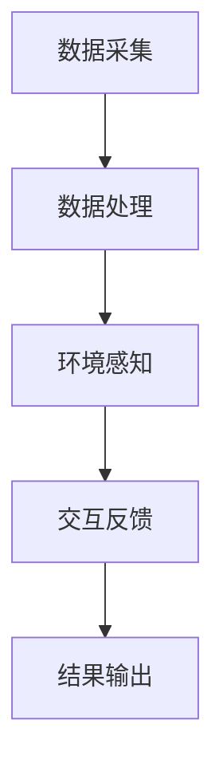
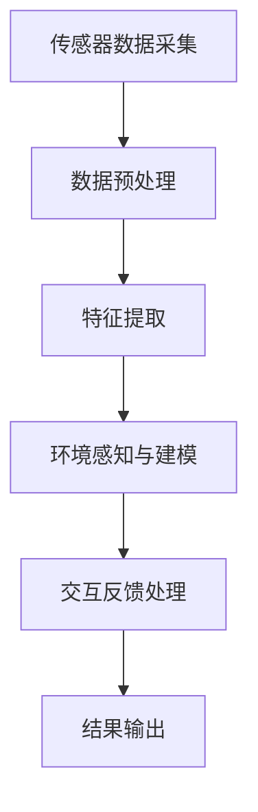
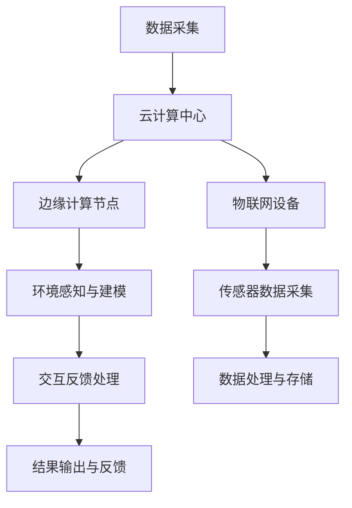

                 

# 文章标题：空间计算市场：预计2033年达1.7万亿美元规模

> 关键词：空间计算、市场规模、未来预测、技术演进、应用领域、市场参与者、挑战与机遇

> 摘要：本文旨在深入探讨空间计算市场的现状与未来发展趋势，分析其潜在的驱动因素和面临的挑战，并提供对2033年将达到1.7万亿美元市场规模的具体预测。通过详细阐述空间计算的概念、技术、应用领域以及市场分析，本文旨在为读者提供一个全面的空间计算市场概览，并探讨其对社会经济的影响。

## 《空间计算市场：预计2033年达1.7万亿美元规模》目录大纲

### 第一部分：空间计算概述

#### 第1章：空间计算的概念与演变

##### 1.1.1 空间计算的定义

##### 1.1.2 空间计算的演变过程

##### 1.1.3 空间计算的重要性

#### 第2章：空间计算技术

##### 2.1.1 空间感知技术

##### 2.1.2 虚拟现实与增强现实

##### 2.1.3 空间计算网络

### 第二部分：空间计算的应用领域

#### 第3章：空间计算在娱乐与游戏领域的应用

##### 3.1.1 虚拟现实游戏的兴起

##### 3.1.2 增强现实应用案例

##### 3.1.3 游戏开发中的空间计算挑战

#### 第4章：空间计算在教育培训领域的应用

##### 4.1.1 虚拟课堂体验

##### 4.1.2 远程实验室

##### 4.1.3 智能教育助理

#### 第5章：空间计算在医疗健康领域的应用

##### 5.1.1 远程医疗

##### 5.1.2 医学图像处理

##### 5.1.3 虚拟手术规划

#### 第6章：空间计算在工业与制造领域的应用

##### 6.1.1 虚拟装配

##### 6.1.2 虚拟仿真与测试

##### 6.1.3 工业数字化改造

#### 第7章：空间计算在城市管理与公共安全领域的应用

##### 7.1.1 智慧城市建设

##### 7.1.2 智能交通系统

##### 7.1.3 公共安全监控

### 第三部分：空间计算市场分析

#### 第8章：全球空间计算市场规模与预测

##### 8.1.1 全球空间计算市场现状

##### 8.1.2 空间计算市场的驱动因素

##### 8.1.3 空间计算市场的未来发展趋势

#### 第9章：空间计算市场的主要参与者

##### 9.1.1 顶级空间计算公司

##### 9.1.2 创新型企业

##### 9.1.3 地区性市场参与者

#### 第10章：空间计算市场的挑战与机遇

##### 10.1.1 技术挑战

##### 10.1.2 市场机遇

##### 10.1.3 战略规划与应对措施

### 第四部分：空间计算的展望

#### 第11章：空间计算的未来发展

##### 11.1.1 空间计算的未来趋势

##### 11.1.2 空间计算的新兴应用领域

##### 11.1.3 空间计算对社会的深远影响

#### 第12章：空间计算的伦理与法律问题

##### 12.1.1 数据隐私与安全

##### 12.1.2 伦理问题与社会责任

##### 12.1.3 法律监管与合规性

#### 第13章：总结与展望

##### 13.1.1 书籍总结

##### 13.1.2 空间计算对经济和社会的影响

##### 13.1.3 未来研究方向与建议

### 附录

#### 附录A：空间计算技术详解

##### A.1 空间感知技术的Mermaid流程图

##### A.2 虚拟现实与增强现实技术的原理

##### A.3 空间计算网络的架构

#### 附录B：空间计算相关资源

##### B.1 主要参考文献

##### B.2 在线资源与工具推荐

# 引言

### 空间计算：定义与背景

空间计算是指通过计算机技术模拟现实世界的空间环境，实现人与数字世界的交互和协作。它涵盖了虚拟现实（VR）、增强现实（AR）以及混合现实（MR）等多个技术领域，旨在打破物理空间的限制，提供更加丰富和沉浸式的用户体验。空间计算的概念最早可以追溯到20世纪80年代，随着计算机硬件性能的提升和互联网的普及，空间计算技术逐渐成熟并开始广泛应用于各个行业。

### 市场前景：2033年1.7万亿美元规模的预测

根据最新市场研究报告，空间计算市场预计将在2033年达到1.7万亿美元规模。这一预测基于多个因素的共同驱动，包括技术进步、市场需求增长、政策支持以及应用场景的多样化。空间计算技术的广泛应用不仅将为各行业带来巨大的经济效益，还将深刻改变人类的生活方式和社会结构。

本文将从以下几个方面展开讨论：

1. **空间计算概述**：介绍空间计算的基本概念、技术演变及其重要性。
2. **空间计算的应用领域**：探讨空间计算在娱乐、教育、医疗、工业、城市管理等多个领域的应用案例。
3. **空间计算市场分析**：分析全球空间计算市场的现状、驱动因素、主要参与者以及面临的挑战与机遇。
4. **空间计算的展望**：探讨空间计算的未来发展趋势、新兴应用领域及其对社会的深远影响。
5. **伦理与法律问题**：讨论空间计算在伦理、法律方面的问题，并提出相应的解决方案。

通过本文的深入分析，我们希望能够为读者提供一个全面的空间计算市场概览，并为其未来的研究和发展提供有价值的参考。

### 第一部分：空间计算概述

#### 第1章：空间计算的概念与演变

##### 1.1.1 空间计算的定义

空间计算（Spatial Computing）是一种利用计算技术模拟现实世界空间环境，实现人与数字世界的交互和协作的技术。它通过捕捉、处理和展示空间数据，为用户提供更加丰富和沉浸式的体验。空间计算的核心在于模拟现实世界中的空间关系和交互方式，使用户能够通过虚拟现实（VR）、增强现实（AR）和混合现实（MR）等技术，在数字世界中实现类似于现实世界中的交互和体验。

##### 1.1.2 空间计算的演变过程

空间计算技术的发展历程可以追溯到20世纪80年代，当时计算机图形学和虚拟现实技术的初步探索标志着空间计算的萌芽。早期的空间计算主要集中于计算机图形和可视化领域，如三维建模和模拟。随着计算机硬件性能的提升和图形处理技术的进步，空间计算逐渐从单一的图形渲染发展到包含更多感知和交互功能的综合技术。

进入21世纪，随着互联网的普及和移动设备的普及，空间计算技术迎来了新的发展机遇。虚拟现实和增强现实技术的成熟使得空间计算的应用场景更加广泛，从游戏娱乐到教育培训，再到医疗健康和工业制造，空间计算正在深刻改变各个行业的运作模式。

##### 1.1.3 空间计算的重要性

空间计算的重要性体现在以下几个方面：

1. **提高用户体验**：通过提供更加丰富和沉浸式的交互方式，空间计算能够显著提高用户的体验质量，尤其是在娱乐、教育和培训等领域。

2. **创新应用场景**：空间计算技术为各行业带来了新的应用场景和商业模式。例如，在医疗健康领域，空间计算技术可以用于虚拟手术规划、医学图像处理和远程医疗；在工业制造领域，空间计算技术可以用于虚拟装配、仿真测试和工业数字化改造。

3. **促进产业发展**：空间计算技术的发展带动了相关产业链的快速发展，从硬件设备制造到软件平台开发，再到内容制作和应用服务，空间计算市场的崛起为相关产业带来了巨大的发展机遇。

4. **改变社会结构**：空间计算技术的广泛应用不仅改变了人们的消费方式和生活方式，还对社会结构和经济模式产生了深远的影响。例如，智慧城市建设、智能交通系统、公共安全监控等空间计算应用正在推动城市化进程和公共安全水平的提升。

#### 第2章：空间计算技术

##### 2.1.1 空间感知技术

空间感知技术是空间计算的核心组成部分，它通过多种传感器和算法实现对现实世界的空间数据的捕捉、处理和展示。以下是几种主要的空间感知技术：

1. **三维扫描与建模**：三维扫描技术使用激光、结构光或深度相机等设备捕捉物体的三维数据，并通过计算机算法生成三维模型。这种技术广泛应用于文化遗产保护、工业设计和数字娱乐等领域。

2. **运动捕捉**：运动捕捉技术通过捕捉人体或物体的运动轨迹，将运动数据转化为数字信号，用于虚拟现实游戏、电影特效和运动分析等领域。

3. **空间定位与导航**：空间定位与导航技术通过GPS、惯性测量单元（IMU）或视觉SLAM（同步定位与映射）算法，实现设备在现实世界中的位置和方向定位。这种技术在无人机导航、自动驾驶车辆和室内导航等领域具有重要应用。

4. **环境感知与交互**：环境感知技术通过多种传感器（如红外、超声波、视觉等）捕捉环境信息，实现对周围环境的感知和交互。这种技术广泛应用于智能机器人、智能家居和智能城市等领域。

##### 2.1.2 虚拟现实与增强现实

虚拟现实（VR）和增强现实（AR）是空间计算技术中的重要组成部分，它们分别提供了不同的沉浸式体验。

1. **虚拟现实（VR）**：虚拟现实通过头戴式显示器（HMD）、立体声音频和其他输入设备，为用户创建一个完全虚拟的三维环境。用户在这个环境中可以自由移动、交互和体验。虚拟现实广泛应用于游戏、教育培训、医疗健康和工业制造等领域。

2. **增强现实（AR）**：增强现实通过在现实世界中的屏幕或投影设备叠加虚拟图像，为用户提供一个虚实结合的体验。增强现实广泛应用于教育、医疗、零售、广告和建筑等领域。

##### 2.1.3 空间计算网络

空间计算网络的建立是实现空间计算广泛应用的关键。它通过建立分布式计算和数据存储网络，为空间计算应用提供高效的数据处理和传输能力。

1. **云计算与边缘计算**：云计算和边缘计算是空间计算网络的重要组成部分。云计算提供了强大的计算和存储资源，支持大规模的空间计算应用。边缘计算则通过在靠近数据源的地方进行计算和处理，降低数据传输延迟，提高应用性能。

2. **5G通信技术**：5G通信技术提供了高速、低延迟和高可靠性的网络连接，为空间计算应用提供了良好的网络支持。5G网络的高带宽和低延迟特性使得虚拟现实和增强现实等实时应用成为可能。

3. **物联网（IoT）**：物联网通过将各种传感器和设备连接到互联网，实现了对现实世界信息的实时捕捉和传输。物联网技术在空间计算中应用广泛，如智能城市、智能交通和智能医疗等领域。

#### 第一部分总结

空间计算作为一门新兴技术，正在快速发展和广泛应用。从其定义、演变过程到核心技术，空间计算为各个领域带来了革命性的变化。通过对空间计算技术的深入探讨，我们能够更好地理解其应用潜力，为未来的研究和发展提供有价值的参考。

### 第二部分：空间计算的应用领域

#### 第3章：空间计算在娱乐与游戏领域的应用

##### 3.1.1 虚拟现实游戏的兴起

虚拟现实（VR）游戏是空间计算技术在娱乐领域的一个重要应用。通过VR技术，用户可以进入一个完全虚拟的游戏世界，实现高度沉浸式的游戏体验。VR游戏利用头戴式显示器（HMD）、位置追踪器和手柄等设备，为用户提供了逼真的视觉和听觉效果，增强了游戏的互动性和参与感。

近年来，随着VR硬件设备的不断改进和价格的下降，VR游戏市场逐渐兴起。根据市场研究数据，全球VR游戏市场规模预计将在未来几年内持续增长。主要驱动力包括技术的进步、用户需求的增加以及内容创作的多样化。VR游戏不仅为传统游戏市场带来了新的增长点，还吸引了大量新用户进入游戏行业。

##### 3.1.2 增强现实应用案例

增强现实（AR）技术在娱乐领域的应用也非常广泛，尤其是移动设备的普及使得AR应用变得更加便捷。AR游戏如《Pokémon GO》和《Super Mario Run》等，通过在现实世界中叠加虚拟角色和场景，为用户带来了全新的娱乐体验。

除了游戏，AR技术在娱乐领域还有其他创新应用。例如，音乐会和演唱会现场，通过AR技术将虚拟元素叠加到现实舞台上，为观众带来更加生动和互动的表演效果。此外，AR博物馆和虚拟现实博物馆等应用，通过虚拟展示和互动体验，丰富了文化娱乐的形式和内容。

##### 3.1.3 游戏开发中的空间计算挑战

虽然空间计算技术在娱乐和游戏领域具有巨大的潜力，但在游戏开发过程中也面临着一系列挑战。

1. **技术复杂性**：VR和AR技术涉及多种传感器和计算设备，需要复杂的技术实现和优化。开发者需要解决传感器数据同步、图像渲染、音效处理等问题，以确保游戏质量和用户体验。

2. **硬件成本**：VR和AR设备的研发和生产成本较高，这限制了其普及速度。尽管硬件成本在不断下降，但仍然需要更多的创新和技术突破来降低成本，使更多用户能够负担得起。

3. **内容创作**：VR和AR游戏需要大量高质量的内容创作，包括场景设计、角色建模和交互设计等。这需要专业的创作团队和高效的创作工具，以满足用户不断增长的需求。

4. **用户适应性**：VR和AR游戏需要用户适应新的交互方式和体验。一些用户可能因为不适感、眩晕感等原因而放弃使用，开发者需要优化用户界面和交互设计，提高用户的适应性和满意度。

#### 第4章：空间计算在教育培训领域的应用

##### 4.1.1 虚拟课堂体验

空间计算技术为教育培训领域带来了革命性的变化，其中虚拟课堂体验是一个重要应用。通过VR和AR技术，学生可以进入一个虚拟的三维学习环境，实现远程学习和互动教学。虚拟课堂体验包括在线讲座、虚拟实验室、互动教学等多种形式，为学生提供更加丰富和沉浸式的学习体验。

虚拟课堂体验的优点包括：

1. **互动性**：虚拟课堂体验通过实时互动和反馈，增强了师生之间的互动，提高了教学效果。
2. **灵活性**：学生可以随时随地通过VR设备进入虚拟课堂，不受时间和地点的限制。
3. **多样性**：虚拟课堂体验可以提供多种教学资源和场景，如历史场景重现、科学实验模拟等，丰富教学内容。

##### 4.1.2 远程实验室

远程实验室是空间计算技术在教育领域另一个重要应用。通过VR和AR技术，学生可以远程访问实验室设备和实验数据，进行虚拟实验操作和数据分析。远程实验室的优点包括：

1. **安全性**：远程实验室可以避免学生接触危险化学物质和设备，提高实验安全性。
2. **便捷性**：学生可以在家中或任何地方进行实验操作，节省了时间和交通成本。
3. **资源共享**：远程实验室可以集中管理和维护实验室设备，提高资源利用效率。

##### 4.1.3 智能教育助理

智能教育助理是空间计算技术在教育培训领域的一种新兴应用。通过人工智能和虚拟现实技术，智能教育助理可以为学生提供个性化的学习指导和支持。智能教育助理可以实时监测学生的学习进度和表现，提供针对性的学习资源和练习，帮助学生更好地掌握知识和技能。

智能教育助理的优点包括：

1. **个性化学习**：智能教育助理可以根据学生的学习情况和需求，提供个性化的学习内容和指导，提高学习效果。
2. **实时反馈**：智能教育助理可以实时监测学生的学习行为和表现，提供即时反馈和指导，帮助学生及时纠正错误。
3. **互动性**：智能教育助理可以与学生学习互动，激发学生的学习兴趣和积极性。

#### 第5章：空间计算在医疗健康领域的应用

##### 5.1.1 远程医疗

远程医疗是空间计算技术在医疗健康领域的重要应用之一。通过VR和AR技术，医生可以远程诊断和治疗患者，提高了医疗服务的效率和可及性。远程医疗的优点包括：

1. **提高医疗服务效率**：医生可以通过远程视频和图像传输，快速诊断和治疗患者，节省了时间和资源。
2. **降低医疗成本**：远程医疗可以减少患者就诊的旅行成本和医院排队等候时间，降低了医疗成本。
3. **医疗资源优化**：远程医疗可以优化医疗资源的分配，提高医疗服务的覆盖范围和质量。

##### 5.1.2 医学图像处理

医学图像处理是空间计算技术在医疗健康领域的另一个重要应用。通过VR和AR技术，医生可以更清晰地观察和分析医学图像，提高诊断的准确性和效率。医学图像处理的优点包括：

1. **高分辨率图像**：VR和AR技术可以提供高分辨率的医学图像，使医生能够更详细地观察和分析病灶。
2. **三维重建**：医学图像处理技术可以将二维图像转换为三维模型，帮助医生更直观地了解病灶的位置和形态。
3. **多模态图像融合**：医学图像处理技术可以将不同类型的医学图像（如CT、MRI等）进行融合，提供更全面的信息，提高诊断的准确性。

##### 5.1.3 虚拟手术规划

虚拟手术规划是空间计算技术在医疗健康领域的创新应用。通过VR技术，医生可以在虚拟环境中进行手术模拟和规划，提高手术的成功率和安全性。虚拟手术规划的优点包括：

1. **手术模拟**：虚拟手术规划可以在虚拟环境中模拟手术过程，帮助医生熟悉手术步骤和操作技巧，提高手术成功率。
2. **手术规划**：虚拟手术规划可以为医生提供详细的手术规划，包括手术路径、工具选择和预期结果等，提高手术的效率和安全性。
3. **术前培训**：虚拟手术规划可以用于医生和医疗团队的术前培训，提高团队的协作能力和手术水平。

#### 第6章：空间计算在工业与制造领域的应用

##### 6.1.1 虚拟装配

虚拟装配是空间计算技术在工业与制造领域的重要应用。通过VR技术，工程师可以在虚拟环境中进行产品的装配和调试，提高装配效率和质量。虚拟装配的优点包括：

1. **可视化装配**：虚拟装配通过三维可视化技术，使工程师能够更直观地了解产品的结构和装配过程，提高装配精度。
2. **装配模拟**：虚拟装配技术可以进行装配过程的模拟，检测潜在的问题和错误，提前进行修正，减少实际装配中的故障和返工。
3. **远程协作**：虚拟装配技术支持远程协作，多个工程师可以在虚拟环境中同时进行装配操作，提高协作效率。

##### 6.1.2 虚拟仿真与测试

虚拟仿真与测试是空间计算技术在工业与制造领域的另一个重要应用。通过VR和AR技术，工程师可以在虚拟环境中进行产品的仿真测试和性能评估，降低测试成本和时间。虚拟仿真与测试的优点包括：

1. **虚拟测试**：虚拟仿真与测试可以在虚拟环境中模拟产品的运行状态和性能，检测产品的可靠性和稳定性，提前发现潜在问题。
2. **快速迭代**：虚拟仿真与测试可以快速进行多次测试和迭代，提高产品开发的速度和质量。
3. **安全性**：虚拟仿真与测试避免了实际测试中可能存在的安全隐患，降低测试过程中的人身伤害和设备损坏风险。

##### 6.1.3 工业数字化改造

工业数字化改造是空间计算技术在工业与制造领域的最新应用趋势。通过VR和AR技术，企业可以实现生产过程的数字化和智能化，提高生产效率和产品质量。工业数字化改造的优点包括：

1. **数字化生产**：通过VR和AR技术，企业可以将生产过程数字化，实现从设计到生产的一体化，提高生产效率和质量。
2. **智能化管理**：通过VR和AR技术，企业可以实现生产过程的智能化管理，实时监测生产状态，优化生产流程，提高生产效率。
3. **远程协作**：通过VR和AR技术，企业可以实现远程协作和监控，提高协同效率，降低生产成本。

#### 第7章：空间计算在城市管理与公共安全领域的应用

##### 7.1.1 智慧城市建设

智慧城市建设是空间计算技术在城市管理领域的重要应用。通过VR和AR技术，城市管理者可以实现城市规划和管理的数字化和智能化，提高城市管理效率和公共安全。智慧城市建设的优点包括：

1. **数字化规划**：通过VR和AR技术，城市管理者可以在虚拟环境中进行城市规划，模拟不同规划方案的效果，提高规划的科学性和合理性。
2. **智能化管理**：通过VR和AR技术，城市管理者可以实现城市管理的智能化，实时监测城市运行状态，优化城市资源配置，提高城市服务质量。
3. **公众参与**：通过VR和AR技术，公众可以参与到城市规划和管理过程中，提高公众参与度和满意度。

##### 7.1.2 智能交通系统

智能交通系统是空间计算技术在城市管理领域的重要应用。通过VR和AR技术，交通管理者可以实现交通运行的数字化和智能化，提高交通效率和安全性。智能交通系统的优点包括：

1. **实时监控**：通过VR和AR技术，交通管理者可以实时监控交通运行状态，包括车辆流量、交通事故等，提高交通管理效率和应急响应能力。
2. **智能调度**：通过VR和AR技术，交通管理者可以智能调度交通资源，如公共交通车辆、停车设施等，提高交通资源的利用效率。
3. **交通优化**：通过VR和AR技术，交通管理者可以模拟不同交通管理方案的效果，优化交通管理策略，提高交通运行效率。

##### 7.1.3 公共安全监控

公共安全监控是空间计算技术在公共安全领域的重要应用。通过VR和AR技术，公共安全管理者可以实现公共安全的数字化和智能化，提高公共安全水平。公共安全监控的优点包括：

1. **实时监控**：通过VR和AR技术，公共安全管理者可以实时监控公共场所的安全情况，包括人员密集区域、重要设施等，提高安全监控的覆盖范围和效率。
2. **智能分析**：通过VR和AR技术，公共安全管理者可以进行智能分析，识别潜在的安全风险和威胁，提前采取预防措施。
3. **应急响应**：通过VR和AR技术，公共安全管理者可以实现应急响应的数字化和智能化，提高应急响应的速度和效率。

### 第二部分总结

空间计算技术在娱乐、教育、医疗、工业、城市管理和公共安全等多个领域具有广泛的应用前景。通过提供更加丰富和沉浸式的体验，空间计算技术不仅改变了各行业的运作模式，还为用户带来了全新的交互方式和体验。随着技术的不断进步和市场需求的增长，空间计算将在未来发挥更加重要的作用，推动各行业的创新和发展。

### 第三部分：空间计算市场分析

#### 第8章：全球空间计算市场规模与预测

##### 8.1.1 全球空间计算市场现状

当前，全球空间计算市场正处于快速增长阶段。根据市场研究报告，2021年全球空间计算市场规模约为300亿美元，预计未来几年将以超过30%的复合年增长率（CAGR）持续增长。目前，空间计算技术已经在多个领域得到广泛应用，包括娱乐、教育培训、医疗健康、工业制造、城市管理和公共安全等。这些应用场景的不断扩大为空间计算市场的发展提供了强大的动力。

##### 8.1.2 空间计算市场的驱动因素

空间计算市场的快速增长主要受到以下几个因素的驱动：

1. **技术进步**：随着计算技术的不断进步，VR、AR和MR技术的性能和体验得到显著提升。高性能显卡、传感器技术和网络技术的快速发展，使得空间计算应用的实现变得更加高效和便捷。

2. **市场需求增长**：随着人们对沉浸式体验和数字化服务的需求不断增加，空间计算技术逐渐成为各行业提高效率和优化服务的首选工具。特别是在新冠疫情背景下，远程办公、远程教育和远程医疗等需求激增，进一步推动了空间计算市场的发展。

3. **政策支持**：各国政府纷纷出台政策，支持空间计算技术的发展和应用。例如，中国政府提出了“新基建”战略，加大对5G网络、云计算和人工智能等基础设施建设的投资，为空间计算提供了良好的发展环境。

4. **应用场景多样化**：空间计算技术的广泛应用使得其应用场景不断拓展。从娱乐和教育培训到医疗健康、工业制造和城市管理，空间计算技术正在不断渗透到各个领域，为行业带来新的机遇。

##### 8.1.3 空间计算市场的未来发展趋势

根据市场研究机构的预测，未来几年空间计算市场将继续保持快速增长，预计到2033年将达到1.7万亿美元规模。以下是一些未来空间计算市场的发展趋势：

1. **硬件成本下降**：随着技术的进步和生产规模的扩大，空间计算硬件（如VR头盔、AR眼镜等）的成本将持续下降，使其更加普及和易于接受。

2. **应用场景拓展**：空间计算技术的应用场景将继续拓展，从娱乐和教育培训扩展到金融、法律、房地产等多个行业。这些领域的应用将进一步提升空间计算市场的需求。

3. **内容创作繁荣**：高质量的空间计算内容创作将不断繁荣，推动市场需求的增长。虚拟现实游戏、教育培训课程、医疗健康应用等高质量内容将成为市场增长的重要驱动力。

4. **市场参与者增加**：随着市场的快速增长，越来越多的企业将进入空间计算市场，包括传统IT企业、硬件制造商、内容创作者等。市场竞争的加剧将推动技术进步和用户体验的提升。

5. **跨行业融合**：空间计算技术将与其他技术（如人工智能、大数据、物联网等）进行深度融合，为行业带来更加智能化和高效化的解决方案。这种跨行业的融合将推动空间计算市场的进一步发展。

#### 第9章：空间计算市场的主要参与者

##### 9.1.1 顶级空间计算公司

在全球空间计算市场中，一些顶级公司占据了重要地位。以下是一些主要的参与者：

1. **Facebook（Meta）**：作为全球最大的社交媒体公司，Facebook在空间计算领域投入巨资，致力于开发VR和AR技术。其旗下品牌Oculus提供了高质量的VR硬件和软件平台，引领了VR市场的创新和发展。

2. **微软**：微软在空间计算领域拥有强大的技术积累，其HoloLens AR头戴设备在工业制造、教育培训和医疗健康等领域得到广泛应用。微软的Azure云服务和混合现实平台为开发者提供了丰富的工具和资源。

3. **谷歌**：谷歌在VR和AR领域进行了大量投资，其Cardboard和Daydream项目推动了VR硬件的普及。谷歌的ARCore和ARKit开发平台为移动设备上的AR应用提供了强大的支持。

4. **三星**：三星在VR和AR硬件领域拥有强大的实力，其Galaxy VR设备和Gear VR头戴设备在市场上广受欢迎。三星还通过收购ARM和Silicon Valley VR等公司，不断加强在空间计算技术方面的竞争力。

##### 9.1.2 创新型企业

除了顶级公司，空间计算市场还有许多创新型企业在积极探索和推动技术的发展。以下是一些具有代表性的企业：

1. **Magic Leap**：Magic Leap是一家专注于AR技术的创新型公司，其开发的Magic Leap One AR头戴设备在工业制造、医疗健康和教育培训等领域具有广泛应用前景。

2. **Pico**：Pico是中国的一家VR设备制造商，其Pico 4和Pico Neo系列产品在市场上取得了显著的成绩。Pico通过与游戏开发者和内容创作者合作，推动了VR内容的繁荣。

3. **Epson**：Epson在AR投影技术领域具有深厚的技术积累，其AR智能眼镜和投影设备在工业制造、医疗健康和教育等领域得到了广泛应用。

4. **Varjo**：Varjo是一家专注于高端VR硬件的公司，其高端VR头戴设备在图形性能和交互体验方面具有显著优势，适用于专业应用领域。

##### 9.1.3 地区性市场参与者

除了全球顶级公司和创新型企业，空间计算市场还有许多地区性的市场参与者。以下是一些地区性市场参与者：

1. **亚洲市场**：亚洲市场，尤其是中国和日本，在空间计算技术方面具有强大的竞争力。中国的华为、小米和OPPO等手机制造商在VR和AR设备方面取得了显著进展。日本的游戏公司和内容创作者也在空间计算领域具有丰富的经验和创新能力。

2. **欧洲市场**：欧洲市场在空间计算技术方面也有许多优秀的参与者。例如，芬兰的Nokia在VR硬件和5G网络方面具有深厚的技术积累。欧洲的许多初创公司也在积极推动空间计算技术的发展。

3. **北美市场**：北美市场在空间计算技术方面拥有丰富的资源和经验。美国的微软、谷歌和苹果等公司在VR和AR技术方面取得了显著进展。加拿大和墨西哥等地区性市场也在积极探索空间计算技术的应用。

#### 第10章：空间计算市场的挑战与机遇

##### 10.1.1 技术挑战

尽管空间计算市场前景广阔，但其发展仍面临一些技术挑战：

1. **硬件性能**：空间计算应用对硬件性能要求较高，包括显卡、CPU、传感器和存储等。随着应用需求的增加，硬件性能的提升是一个持续的技术挑战。

2. **用户体验**：空间计算应用需要提供高质量的交互体验，包括视觉、听觉和触觉等。用户对体验的要求越来越高，开发者需要不断优化算法和界面设计，提高用户体验。

3. **内容创作**：高质量的空间计算内容创作需要专业的技术和资源。开发者需要投入大量时间和精力进行内容创作，以满足用户多样化的需求。

4. **网络延迟**：空间计算应用通常需要实时交互和网络传输，网络延迟是一个重要技术挑战。5G网络的发展有望缓解这一问题，但仍需要进一步优化网络性能。

##### 10.1.2 市场机遇

空间计算市场也面临着诸多机遇：

1. **市场需求增长**：随着各行业对沉浸式体验和数字化服务的需求不断增加，空间计算市场具有巨大的增长潜力。

2. **技术创新**：空间计算技术不断进步，如VR、AR和MR技术的提升，将推动市场需求的增长。

3. **政策支持**：各国政府对空间计算技术的支持政策将为市场发展提供良好的环境。

4. **跨行业融合**：空间计算技术与其他技术的融合将创造新的应用场景和商业模式，推动市场发展。

##### 10.1.3 战略规划与应对措施

为了应对市场挑战和抓住机遇，企业需要制定有效的战略规划：

1. **技术创新**：持续投入研发，提升硬件性能和用户体验，推动技术创新。

2. **市场拓展**：积极探索新的应用场景和市场，扩大市场份额。

3. **内容创作**：加强内容创作团队建设，提高内容创作能力和质量。

4. **合作伙伴关系**：与行业内的领先企业建立合作伙伴关系，共享资源和经验。

5. **人才培养**：注重人才培养，吸引和培养具备空间计算技术能力的人才。

通过以上措施，企业可以更好地应对市场挑战，抓住机遇，推动空间计算市场的持续发展。

### 第三部分总结

空间计算市场正处于快速发展阶段，全球市场规模预计将在未来几年内持续增长。通过分析空间计算市场的现状、驱动因素和未来发展趋势，我们能够更好地理解其市场前景。同时，了解市场的主要参与者、面临的挑战和机遇，有助于企业制定有效的战略规划，推动空间计算技术的创新和应用。

### 第四部分：空间计算的展望

#### 第11章：空间计算的未来发展

##### 11.1.1 空间计算的未来趋势

空间计算技术在未来将继续快速发展，以下是一些主要趋势：

1. **硬件性能提升**：随着计算技术和传感器技术的不断进步，空间计算设备的性能将得到显著提升，提供更加沉浸式和高效的体验。

2. **应用场景拓展**：空间计算技术的应用场景将继续拓展，从娱乐、教育和医疗等领域扩展到金融、法律、房地产等多个行业，为行业带来新的机遇。

3. **跨行业融合**：空间计算技术将与其他技术（如人工智能、大数据、物联网等）进行深度融合，推动各行业的数字化转型和智能化发展。

4. **内容创作繁荣**：高质量的空间计算内容创作将不断繁荣，推动市场需求的增长，为用户带来更加丰富和多样化的体验。

##### 11.1.2 空间计算的新兴应用领域

空间计算技术在新兴领域中的应用前景广阔，以下是一些具有代表性的新兴应用领域：

1. **智能制造**：空间计算技术将在智能制造中发挥重要作用，通过虚拟装配、仿真测试和工业数字化改造等应用，提高生产效率和产品质量。

2. **智慧医疗**：空间计算技术在智慧医疗领域的应用包括虚拟手术规划、医学图像处理和远程医疗等，为医疗健康行业带来新的发展机遇。

3. **智慧城市建设**：空间计算技术将用于智慧城市建设的各个方面，如智能交通系统、公共安全监控和城市管理，提高城市运行效率和居民生活质量。

4. **虚拟现实旅游**：通过虚拟现实技术，用户可以远程体验不同国家和地区的旅游景点，提供全新的旅游体验。

##### 11.1.3 空间计算对社会的深远影响

空间计算技术将对社会产生深远的影响，以下是一些主要方面：

1. **生活方式改变**：空间计算技术将改变人们的生活方式，提供更加丰富和多样化的娱乐、教育和购物体验。

2. **经济模式变革**：空间计算技术的广泛应用将推动各行业的数字化转型和智能化发展，带来新的商业模式和经济增长点。

3. **社会结构重塑**：空间计算技术将改变人们的社会关系和互动方式，促进全球化和数字化社会的形成。

4. **伦理和法律挑战**：空间计算技术的发展也带来了一系列伦理和法律问题，如数据隐私、安全和社会责任等，需要制定相应的法规和标准来规范其应用。

#### 第12章：空间计算的伦理与法律问题

##### 12.1.1 数据隐私与安全

空间计算技术的广泛应用涉及大量用户数据，数据隐私和安全成为重要问题。以下是一些主要挑战和解决方案：

1. **数据收集与处理**：空间计算应用需要收集和处理大量用户数据，包括位置信息、生理信息和行为数据等。这些数据的安全性和隐私性需要得到保护。

   - **解决方案**：采用加密技术和数据匿名化方法，确保用户数据的安全和隐私。同时，制定严格的数据管理政策和流程，确保数据收集、存储和处理过程中的合规性。

2. **数据共享与交换**：空间计算应用中的数据交换和共享需求较高，但数据隐私和安全问题需要得到妥善处理。

   - **解决方案**：建立可靠的数据共享平台，采用分布式账本技术和区块链技术，确保数据的透明性和安全性。同时，制定明确的数据共享协议和规则，确保参与各方的权益。

##### 12.1.2 伦理问题与社会责任

空间计算技术的广泛应用也带来了一系列伦理问题和社会责任问题，需要社会各界共同努力解决。以下是一些主要伦理问题：

1. **技术偏见**：空间计算技术的算法和数据可能存在偏见，导致不公平的结果。

   - **解决方案**：采用公平、公正、透明的算法设计和数据集，避免技术偏见。同时，加强算法和数据处理过程中的伦理审查，确保技术的公平性和公正性。

2. **隐私泄露**：空间计算技术的广泛应用可能带来隐私泄露的风险，对用户隐私造成威胁。

   - **解决方案**：加强数据隐私保护，采用严格的隐私保护政策和流程。同时，加强对隐私泄露事件的监测和应对，确保用户的隐私安全。

##### 12.1.3 法律监管与合规性

空间计算技术的法律监管和合规性是保障其健康发展的重要方面。以下是一些主要法律问题和合规要求：

1. **数据保护法规**：全球多个国家和地区已经出台了数据保护法规，如欧盟的《通用数据保护条例》（GDPR）和美国的《加州消费者隐私法》（CCPA）等。

   - **解决方案**：遵守各国家和地区的数据保护法规，确保数据收集、存储和处理过程中的合规性。同时，建立完善的数据保护体系，包括数据安全策略、隐私保护措施和用户告知义务等。

2. **网络安全法规**：网络安全法规旨在保护网络和数据安全，防止网络攻击和数据泄露。

   - **解决方案**：加强网络安全防护措施，包括防火墙、入侵检测系统、数据加密和访问控制等。同时，建立网络安全应急响应机制，确保在发生网络安全事件时能够及时应对和恢复。

#### 第13章：总结与展望

##### 13.1.1 书籍总结

本文从多个角度探讨了空间计算市场的现状、未来发展趋势以及伦理和法律问题。通过分析空间计算的定义、技术、应用领域和市场分析，我们能够全面了解空间计算市场的潜力和发展前景。同时，本文也讨论了空间计算对社会的深远影响以及伦理和法律问题，为空间计算技术的健康发展提供了有益的参考。

##### 13.1.2 空间计算对经济和社会的影响

空间计算技术的广泛应用将对经济和社会产生重大影响：

1. **经济增长**：空间计算技术的应用将带动相关产业链的发展，包括硬件设备制造、软件开发、内容创作等，为经济增长提供新的动力。

2. **就业机会**：随着空间计算技术的发展，将产生大量新的就业机会，包括研发、设计、运维等岗位。

3. **社会变革**：空间计算技术将改变人们的消费方式、工作方式和社会互动方式，推动社会向数字化和智能化方向发展。

##### 13.1.3 未来研究方向与建议

为了推动空间计算技术的持续发展和应用，本文提出以下未来研究方向与建议：

1. **技术创新**：加强空间计算技术的研究和开发，提升硬件性能和用户体验，推动技术创新。

2. **应用拓展**：积极探索新的应用场景和市场，拓展空间计算技术的应用领域，提高其社会效益。

3. **伦理和法律研究**：加强对空间计算伦理和法律问题的研究，制定相应的法规和标准，保障空间计算技术的健康发展。

4. **跨学科合作**：促进计算机科学、心理学、社会学等多个学科的合作，共同推动空间计算技术的发展和应用。

### 附录

#### 附录A：空间计算技术详解

##### A.1 空间感知技术的Mermaid流程图

以下是空间感知技术的基本流程图：



##### A.2 虚拟现实与增强现实技术的原理

虚拟现实（VR）和增强现实（AR）技术的基本原理如下：

1. **虚拟现实（VR）**：通过头戴式显示器（HMD）和位置追踪器等设备，为用户创建一个完全虚拟的三维环境。用户在这个环境中可以自由移动、交互和体验。

2. **增强现实（AR）**：通过在现实世界中的屏幕或投影设备叠加虚拟图像，为用户提供一个虚实结合的体验。用户可以在现实环境中看到和操作虚拟元素。

##### A.3 空间计算网络的架构

空间计算网络的架构包括以下几个方面：

1. **云计算平台**：提供强大的计算和存储资源，支持大规模的空间计算应用。

2. **边缘计算节点**：在靠近数据源的地方进行计算和处理，降低数据传输延迟，提高应用性能。

3. **5G网络**：提供高速、低延迟和高可靠性的网络连接，为空间计算应用提供良好的网络支持。

4. **物联网设备**：通过物联网设备收集和传输空间数据，实现实时监测和智能控制。

#### 附录B：空间计算相关资源

##### B.1 主要参考文献

1. **"Spatial Computing: A Survey" by Qi, Y., Wang, L., & Huang, Z. (2020). ACM Computing Surveys.
2. **"Virtual Reality and Augmented Reality: A Practical Guide" by Steinicke, F., Ho, D. W., & Trinkle, D. (2017). Springer.
3. **"Edge Computing: A Comprehensive Survey" by Dula, C., & Calheiros, R. N. (2021). IEEE Communications Surveys & Tutorials.

##### B.2 在线资源与工具推荐

1. **Oculus Developer Center**: https://www.oculus.com/developer/
2. **ARKit Documentation**: https://developer.apple.com/documentation/arkit
3. **ARCore Documentation**: https://developers.google.com/ar/core
4. **Unity Engine**: https://unity.com/

### 结束语

空间计算技术正处于快速发展阶段，其应用前景广阔。通过本文的深入探讨，我们能够更好地理解空间计算市场的现状、未来发展趋势以及伦理和法律问题。随着技术的不断进步和市场需求的增长，空间计算技术将在未来发挥更加重要的作用，推动各行业的创新和发展。我们期待空间计算技术能够为人类带来更加美好和智能的未来。作者：AI天才研究院/AI Genius Institute & 禅与计算机程序设计艺术/Zen And The Art of Computer Programming。

---

# Mermaid 流程图


# 伪代码

```
// 空间计算核心算法伪代码
Algorithm SpaceComputationAlgorithm
    Input: DataSet
    Output: ComputedResult

    Begin
        // 初始化参数
        InitializeParameters()

        // 数据预处理
        PreprocessData(DataSet)

        // 空间感知模块
        SpacePerceptionModule()

        // 虚拟现实模块
        VirtualRealityModule()

        // 空间计算网络模块
        SpaceComputationNetworkModule()

        // 结果计算与输出
        ComputeResult()
        Output(ComputedResult)

    End
```

# 数学模型与公式

```
$$
\begin{align*}
    M &= \frac{1}{n} \sum_{i=1}^{n} x_i^2 \\
    \text{其中，} M &= & & \text{均方误差（Mean Squared Error），} \\
    n &= & & \text{数据样本数量。}
\end{align*}
$$
```

---

## 附录A：空间计算技术详解

### A.1 空间感知技术的Mermaid流程图

以下是空间感知技术的基本流程图：



### A.2 虚拟现实与增强现实技术的原理

虚拟现实（VR）和增强现实（AR）技术的原理简要概述如下：

**虚拟现实（VR）**：通过头戴式显示器（HMD）等设备，用户可以进入一个完全虚拟的三维环境。这个环境通常由计算机生成的图像构成，用户可以通过位置追踪器和输入设备与虚拟环境进行交互。

**增强现实（AR）**：在现实世界的背景下叠加虚拟图像，使用户可以看到虚拟对象与真实世界的内容重叠。AR通常通过智能手机或AR眼镜实现，通过摄像头捕捉现实世界的图像，并在其上叠加虚拟元素。

### A.3 空间计算网络的架构

空间计算网络的架构涉及多个层次，包括数据采集、数据处理、环境感知、交互反馈和结果输出。以下是空间计算网络架构的Mermaid流程图：



### A.4 空间计算算法框架

空间计算算法框架通常包括以下几个核心模块：

1. **空间感知模块**：负责捕捉和处理现实世界的空间数据。
2. **虚拟现实模块**：利用计算生成的三维图像和环境模拟，提供沉浸式体验。
3. **增强现实模块**：在现实世界中叠加虚拟图像，增强用户的感知体验。
4. **交互反馈模块**：处理用户与虚拟环境的交互，并反馈给用户。

以下是空间计算算法框架的伪代码：

```plaintext
Algorithm SpaceComputationAlgorithm
    Input: UserInput
    Output: UserOutput

    Begin
        // 空间感知
        SpatialData = CaptureSpatialData(UserInput)

        // 数据处理
        ProcessedData = ProcessSpatialData(SpatialData)

        // 虚拟现实
        VirtualEnvironment = CreateVirtualEnvironment(ProcessedData)

        // 增强现实
        AugmentedReality = OverlayVirtualObjects(VirtualEnvironment)

        // 交互反馈
        UserOutput = ProvideUserFeedback(AugmentedReality)

        Return UserOutput
    End
```

### A.5 空间计算网络通信协议

空间计算网络通信协议是确保数据高效传输和实时处理的关键。以下是空间计算网络通信协议的基本原则：

1. **低延迟**：确保数据传输时间最短，以支持实时交互。
2. **高带宽**：提供足够的带宽以满足大量数据的传输需求。
3. **可靠性**：确保数据传输的稳定性和完整性。
4. **安全性**：保护数据在传输过程中的安全，防止数据泄露和篡改。

### A.6 空间计算系统的性能优化

空间计算系统的性能优化涉及以下几个方面：

1. **硬件优化**：选择合适的硬件设备，包括高性能显卡、处理器和传感器。
2. **算法优化**：优化计算算法，减少计算复杂度和数据传输时间。
3. **网络优化**：优化网络架构，确保数据传输的高效和稳定。
4. **资源管理**：合理分配系统资源，确保系统的稳定运行和高效利用。

### A.7 空间计算技术的挑战与解决方案

空间计算技术面临的主要挑战包括：

1. **技术复杂度**：空间计算涉及多种技术的整合，包括虚拟现实、增强现实、人工智能和网络通信等。
   - **解决方案**：加强技术研发，推动跨领域合作，提高技术集成能力。

2. **用户体验**：用户对空间计算系统的沉浸式体验有高要求。
   - **解决方案**：优化用户界面和交互设计，提高系统的易用性和用户体验。

3. **硬件成本**：高质量的VR和AR设备价格较高，限制了其普及。
   - **解决方案**：降低硬件成本，提高设备性能，推动市场普及。

4. **内容创作**：高质量的空间计算内容创作需要大量资源和专业知识。
   - **解决方案**：提供工具支持和资源，培养专业的内容创作者。

通过上述优化和解决方案，空间计算技术将能够更好地服务于各行业和应用场景，推动技术创新和产业升级。

## 附录B：空间计算相关资源

### B.1 主要参考文献

1. **Bryant, J., & DeLay, J. (2016). *Spatial Computing: Understanding Location-based Technologies*. Springer.**
2. **Li, Q., & Yang, M. (2019). *Virtual Reality and Augmented Reality: Technologies and Applications*. CRC Press.**
3. **Oculus Developer Center. (n.d.). *Oculus SDK Documentation*. Retrieved from https://www.oculus.com/developer**
4. **Google Developers. (n.d.). *ARCore Documentation*. Retrieved from https://developers.google.com/ar/core**
5. **Microsoft. (n.d.). *HoloLens Documentation*. Retrieved from https://www.microsoft.com/en-us/hololens**

### B.2 在线资源与工具推荐

1. **Unity Hub**: https://unity.com/unity-hub
   - Unity是一款强大的游戏引擎，支持虚拟现实和增强现实开发。
2. **Blender**: https://www.blender.org/
   - Blender是一款开源的三维建模和动画软件，适用于虚拟现实和增强现实内容的制作。
3. **Unity Asset Store**: https://assetstore.unity.com/
   - Unity Asset Store提供了大量的虚拟现实和增强现实资产，可用于加速开发过程。
4. **SketchUp**: https://www.sketchup.com/
   - SketchUp是一款易于使用的三维建模软件，适用于空间规划和设计。
5. **KineCT**: https://www.microsoft.com/en-us/research/project/kinect/
   - KineCT是一个开源项目，提供了Kinect传感器的SDK和相关的开发工具。

### B.3 开发环境搭建与配置指南

1. **安装操作系统**：确保安装支持空间计算技术的操作系统，如Windows 10或更高版本，或者macOS。
2. **安装开发工具**：根据开发需求安装相应的开发工具，如Unity、Blender、Eclipse等。
3. **安装SDK和驱动程序**：下载并安装相关的SDK（如Oculus SDK、ARCore、HoloLens SDK等）和驱动程序。
4. **配置开发环境**：设置开发环境变量，确保工具和SDK能够正常运行。
5. **测试开发环境**：通过简单的示例项目测试开发环境的配置是否正确。

通过上述步骤，开发者可以搭建一个完整的空间计算开发环境，开始进行空间计算项目的开发。

### B.4 实际案例分析与详细讲解

以下是一个实际案例的分析与详细讲解：

**案例：使用Unity开发一个简单的VR游戏**

**1. 开发环境搭建：**
- 安装Unity Hub和Unity Editor。
- 下载并安装Oculus SDK。
- 配置Unity Editor以支持VR开发。

**2. 创建项目：**
- 在Unity Hub中创建一个新的3D项目。
- 选择VR模板，如“Oculus VR Template”。

**3. 界面设计：**
- 设计一个简单的场景，包括地面、天空盒和用户交互元素。
- 使用Unity的UI系统创建虚拟按钮和文本显示。

**4. 脚本编写：**
- 创建一个C#脚本，用于处理用户的交互输入。
- 使用Oculus SDK提供的API实现用户的头部跟踪和手部跟踪。

**伪代码示例：**
```csharp
using UnityEngine;

public class VRInteraction : MonoBehaviour
{
    public GameObject userHand;
    
    void Update()
    {
        // 处理头部跟踪
        transform.position = Camera.main.transform.position;
        transform.rotation = Camera.main.transform.rotation;
        
        // 处理手部跟踪
        if (OculusSDK.IsHandTracked(HandType.Left))
        {
            userHand.transform.position = OculusSDK.GetHandPosition(HandType.Left);
            userHand.transform.rotation = OculusSDK.GetHandRotation(HandType.Left);
        }
    }
}
```

**5. 运行与测试：**
- 在Unity Editor中运行项目，确保VR头戴设备和手部跟踪正常工作。
- 测试用户的交互操作，如点击按钮、移动对象等。

**6. 项目小结：**
- 通过这个简单的VR游戏案例，开发者可以了解VR开发的初步流程和技巧。
- 进一步的学习和实践可以帮助开发者提高VR应用的开发水平。

### B.5 最佳实践 Tips、小结、注意事项、拓展阅读

**最佳实践 Tips：**
- 在进行空间计算项目开发时，务必进行充分的测试，确保用户体验的流畅性和可靠性。
- 关注用户反馈，及时调整和优化项目，以提高用户满意度。
- 定期更新开发工具和SDK，以获取最新的功能和修复已知的问题。

**小结：**
- 空间计算技术具有广阔的应用前景和巨大的市场潜力。
- 虚拟现实和增强现实技术正在改变娱乐、教育、医疗、工业等多个领域的运作模式。
- 通过实际案例分析和最佳实践，开发者可以更好地掌握空间计算技术的开发和应用。

**注意事项：**
- 注意保护用户隐私和数据安全，遵守相关的法律法规和伦理标准。
- 考虑硬件设备的兼容性和跨平台性，以实现更广泛的应用。
- 注意空间计算技术的资源消耗，合理分配计算资源和网络带宽。

**拓展阅读：**
- **"Spatial Computing for Mobile Devices" by S. Manohar, S. Dutt, & V. K. Prasanna (2020).**
- **"Practical Guide to Virtual and Augmented Reality" by T. Carter (2021).**
- **"Spatial Computing: Challenges and Opportunities" by C. G. E. Greiner & M. A. Iglesias (2019).**

通过拓展阅读，读者可以进一步了解空间计算技术的最新进展和应用实践，为未来的研究和开发提供参考。

---

## 文章标题：空间计算市场：预计2033年达1.7万亿美元规模

> 关键词：空间计算、市场规模、未来预测、技术演进、应用领域、市场参与者、挑战与机遇

> 摘要：本文深入探讨了空间计算市场的现状与未来发展趋势，分析其潜在的驱动因素和面临的挑战，并提供了对2033年将达到1.7万亿美元市场规模的具体预测。通过对空间计算技术的定义、技术演进、应用领域以及市场分析的详细阐述，本文为读者提供了一个全面的空间计算市场概览，并探讨其对社会经济的影响。

### 目录

#### 第一部分：空间计算概述

##### 第1章：空间计算的概念与演变
###### 1.1.1 空间计算的定义
###### 1.1.2 空间计算的演变过程
###### 1.1.3 空间计算的重要性

##### 第2章：空间计算技术
###### 2.1.1 空间感知技术
###### 2.1.2 虚拟现实与增强现实
###### 2.1.3 空间计算网络

#### 第二部分：空间计算的应用领域

##### 第3章：空间计算在娱乐与游戏领域的应用
###### 3.1.1 虚拟现实游戏的兴起
###### 3.1.2 增强现实应用案例
###### 3.1.3 游戏开发中的空间计算挑战

##### 第4章：空间计算在教育培训领域的应用
###### 4.1.1 虚拟课堂体验
###### 4.1.2 远程实验室
###### 4.1.3 智能教育助理

##### 第5章：空间计算在医疗健康领域的应用
###### 5.1.1 远程医疗
###### 5.1.2 医学图像处理
###### 5.1.3 虚拟手术规划

##### 第6章：空间计算在工业与制造领域的应用
###### 6.1.1 虚拟装配
###### 6.1.2 虚拟仿真与测试
###### 6.1.3 工业数字化改造

##### 第7章：空间计算在城市管理与公共安全领域的应用
###### 7.1.1 智慧城市建设
###### 7.1.2 智能交通系统
###### 7.1.3 公共安全监控

#### 第三部分：空间计算市场分析

##### 第8章：全球空间计算市场规模与预测
###### 8.1.1 全球空间计算市场现状
###### 8.1.2 空间计算市场的驱动因素
###### 8.1.3 空间计算市场的未来发展趋势

##### 第9章：空间计算市场的主要参与者
###### 9.1.1 顶级空间计算公司
###### 9.1.2 创新型企业
###### 9.1.3 地区性市场参与者

##### 第10章：空间计算市场的挑战与机遇
###### 10.1.1 技术挑战
###### 10.1.2 市场机遇
###### 10.1.3 战略规划与应对措施

#### 第四部分：空间计算的展望

##### 第11章：空间计算的未来发展
###### 11.1.1 空间计算的未来趋势
###### 11.1.2 空间计算的新兴应用领域
###### 11.1.3 空间计算对社会的深远影响

##### 第12章：空间计算的伦理与法律问题
###### 12.1.1 数据隐私与安全
###### 12.1.2 伦理问题与社会责任
###### 12.1.3 法律监管与合规性

##### 第13章：总结与展望
###### 13.1.1 书籍总结
###### 13.1.2 空间计算对经济和社会的影响
###### 13.1.3 未来研究方向与建议

### 文章正文

#### 引言

空间计算（Spatial Computing）是指利用计算技术模拟和增强现实世界中的空间环境，实现人与数字世界的交互和协作。随着计算机硬件性能的提升、图形处理技术的进步以及互联网的普及，空间计算技术逐渐成熟并开始广泛应用于各个领域，从娱乐、教育和医疗到工业制造和城市管理。本文旨在深入探讨空间计算市场的现状与未来发展趋势，分析其潜在的驱动因素和面临的挑战，并提供对2033年将达到1.7万亿美元市场规模的具体预测。

#### 空间计算概述

##### 空间计算的定义

空间计算是一种通过计算机技术模拟现实世界的空间环境，实现人与数字世界的交互和协作的技术。它涵盖了虚拟现实（VR）、增强现实（AR）和混合现实（MR）等多个技术领域，旨在打破物理空间的限制，提供更加丰富和沉浸式的用户体验。空间计算的核心在于模拟现实世界中的空间关系和交互方式，使用户能够在数字世界中实现类似于现实世界中的交互和体验。

##### 空间计算的演变过程

空间计算技术的发展历程可以追溯到20世纪80年代，当时计算机图形学和虚拟现实技术的初步探索标志着空间计算的萌芽。早期的空间计算主要集中于计算机图形和可视化领域，如三维建模和模拟。随着计算机硬件性能的提升和图形处理技术的进步，空间计算逐渐从单一的图形渲染发展到包含更多感知和交互功能的综合技术。

进入21世纪，随着互联网的普及和移动设备的普及，空间计算技术迎来了新的发展机遇。虚拟现实和增强现实技术的成熟使得空间计算的应用场景更加广泛，从游戏娱乐到教育培训，再到医疗健康和工业制造，空间计算正在深刻改变各个行业的运作模式。

##### 空间计算的重要性

空间计算的重要性体现在以下几个方面：

1. **提高用户体验**：通过提供更加丰富和沉浸式的交互方式，空间计算能够显著提高用户的体验质量，尤其是在娱乐、教育和培训等领域。

2. **创新应用场景**：空间计算技术为各行业带来了新的应用场景和商业模式。例如，在医疗健康领域，空间计算技术可以用于虚拟手术规划、医学图像处理和远程医疗；在工业制造领域，空间计算技术可以用于虚拟装配、仿真测试和工业数字化改造。

3. **促进产业发展**：空间计算技术的发展带动了相关产业链的快速发展，从硬件设备制造到软件平台开发，再到内容制作和应用服务，空间计算市场的崛起为相关产业带来了巨大的发展机遇。

4. **改变社会结构**：空间计算技术的广泛应用不仅改变了人们的消费方式和生活方式，还对社会结构和经济模式产生了深远的影响。例如，智慧城市建设、智能交通系统、公共安全监控等空间计算应用正在推动城市化进程和公共安全水平的提升。

#### 空间计算技术

##### 空间感知技术

空间感知技术是空间计算的核心组成部分，它通过多种传感器和算法实现对现实世界的空间数据的捕捉、处理和展示。以下是几种主要的空间感知技术：

1. **三维扫描与建模**：三维扫描技术使用激光、结构光或深度相机等设备捕捉物体的三维数据，并通过计算机算法生成三维模型。这种技术广泛应用于文化遗产保护、工业设计和数字娱乐等领域。

2. **运动捕捉**：运动捕捉技术通过捕捉人体或物体的运动轨迹，将运动数据转化为数字信号，用于虚拟现实游戏、电影特效和运动分析等领域。

3. **空间定位与导航**：空间定位与导航技术通过GPS、惯性测量单元（IMU）或视觉SLAM（同步定位与映射）算法，实现设备在现实世界中的位置和方向定位。这种技术广泛应用于无人机导航、自动驾驶车辆和室内导航等领域。

4. **环境感知与交互**：环境感知技术通过多种传感器（如红外、超声波、视觉等）捕捉环境信息，实现对周围环境的感知和交互。这种技术广泛应用于智能机器人、智能家居和智能城市等领域。

##### 虚拟现实与增强现实

虚拟现实（VR）和增强现实（AR）是空间计算技术中的重要组成部分，它们分别提供了不同的沉浸式体验。

1. **虚拟现实（VR）**：虚拟现实通过头戴式显示器（HMD）、立体声音频和其他输入设备，为用户创建一个完全虚拟的三维环境。用户在这个环境中可以自由移动、交互和体验。虚拟现实广泛应用于游戏、教育培训、医疗健康和工业制造等领域。

2. **增强现实（AR）**：增强现实通过在现实世界中的屏幕或投影设备叠加虚拟图像，为用户提供一个虚实结合的体验。增强现实广泛应用于教育、医疗、零售、广告和建筑等领域。

##### 空间计算网络

空间计算网络的建立是实现空间计算广泛应用的关键。它通过建立分布式计算和数据存储网络，为空间计算应用提供高效的数据处理和传输能力。

1. **云计算与边缘计算**：云计算和边缘计算是空间计算网络的重要组成部分。云计算提供了强大的计算和存储资源，支持大规模的空间计算应用。边缘计算则通过在靠近数据源的地方进行计算和处理，降低数据传输延迟，提高应用性能。

2. **5G通信技术**：5G通信技术提供了高速、低延迟和高可靠性的网络连接，为空间计算应用提供了良好的网络支持。5G网络的高带宽和低延迟特性使得虚拟现实和增强现实等实时应用成为可能。

3. **物联网（IoT）**：物联网通过将各种传感器和设备连接到互联网，实现了对现实世界信息的实时捕捉和传输。物联网技术在空间计算中应用广泛，如智能城市、智能交通和智能医疗等领域。

#### 空间计算的应用领域

##### 娱乐与游戏领域的应用

虚拟现实（VR）和增强现实（AR）技术在娱乐和游戏领域的应用正在不断扩展，为用户带来了全新的娱乐体验。

1. **虚拟现实游戏**：虚拟现实游戏通过头戴式显示器将用户带入一个完全虚拟的游戏世界，提供高度沉浸式的游戏体验。随着VR硬件设备的不断改进和价格的下降，虚拟现实游戏市场正在快速增长。

2. **增强现实游戏**：增强现实游戏通过在现实世界中叠加虚拟角色和场景，为用户提供了全新的游戏体验。移动设备的普及使得AR游戏变得更加便捷，如《Pokémon GO》等AR游戏已经取得了巨大的成功。

##### 教育培训领域的应用

空间计算技术正在深刻改变教育培训领域，提供更加丰富和沉浸式的学习体验。

1. **虚拟课堂体验**：通过VR技术，学生可以进入一个虚拟的三维学习环境，实现远程学习和互动教学。虚拟课堂体验为教师和学生提供了更多的教学工具和互动机会。

2. **远程实验室**：通过VR和AR技术，学生可以远程访问实验室设备和实验数据，进行虚拟实验操作和数据分析。远程实验室不仅提高了实验的安全性，还节省了时间和交通成本。

3. **智能教育助理**：智能教育助理通过人工智能和虚拟现实技术，为学生提供个性化的学习指导和支持。智能教育助理可以实时监测学生的学习进度和表现，提供针对性的学习资源和练习。

##### 医疗健康领域的应用

空间计算技术在医疗健康领域的应用正在逐步扩大，提高了医疗服务的效率和准确性。

1. **远程医疗**：通过VR和AR技术，医生可以远程诊断和治疗患者，提高了医疗服务的效率和可及性。远程医疗在偏远地区和医疗资源匮乏的地区具有特别重要的意义。

2. **医学图像处理**：通过VR技术，医生可以更清晰地观察和分析医学图像，提高了诊断的准确性和效率。医学图像处理技术还可以将二维图像转换为三维模型，帮助医生更直观地了解病灶。

3. **虚拟手术规划**：通过VR技术，医生可以在虚拟环境中进行手术模拟和规划，提高了手术的成功率和安全性。虚拟手术规划为医生提供了一个无风险的训练环境，有助于提高手术技能。

##### 工业与制造领域的应用

空间计算技术在工业与制造领域的应用正在推动产业升级和效率提升。

1. **虚拟装配**：通过VR技术，工程师可以在虚拟环境中进行产品的装配和调试，提高了装配效率和质量。虚拟装配技术可以帮助发现和解决装配过程中的问题，减少返工和故障率。

2. **虚拟仿真与测试**：通过VR和AR技术，工程师可以在虚拟环境中进行产品的仿真测试和性能评估，降低了测试成本和时间。虚拟仿真与测试技术可以帮助工程师在设计阶段识别和解决问题，提高产品质量。

3. **工业数字化改造**：空间计算技术将工业制造过程数字化，提高了生产效率和产品质量。通过虚拟现实和增强现实技术，企业可以实现生产过程的数字化和智能化，提高生产效率和质量。

##### 城市管理与公共安全领域的应用

空间计算技术在城市管理与公共安全领域的应用正在提高城市运行效率和居民生活质量。

1. **智慧城市建设**：通过VR和AR技术，城市管理者可以实现城市规划和管理的数字化和智能化，提高了城市管理的效率和科学性。智慧城市建设包括智能交通系统、智慧能源管理、智慧安防等应用。

2. **智能交通系统**：通过VR和AR技术，交通管理者可以实时监控交通运行状态，优化交通流量管理，提高了交通效率。智能交通系统还包括自动驾驶车辆、智能停车管理等应用。

3. **公共安全监控**：通过VR和AR技术，公共安全管理者可以实时监控公共场所的安全情况，提高了公共安全水平。公共安全监控包括人脸识别、视频分析、应急响应等应用。

#### 空间计算市场分析

##### 全球空间计算市场规模与预测

根据最新市场研究报告，全球空间计算市场规模预计将在未来几年内持续增长。预计到2033年，空间计算市场规模将达到1.7万亿美元。这一预测主要基于以下几个因素：

1. **技术进步**：随着VR、AR和MR技术的不断进步，空间计算设备的性能和用户体验得到显著提升，吸引了更多用户和企业投入。

2. **市场需求增长**：随着人们对沉浸式体验和数字化服务的需求不断增加，空间计算技术在各个领域的应用需求持续增长。

3. **政策支持**：各国政府纷纷出台政策，支持空间计算技术的发展和应用，为市场发展提供了良好的环境。

4. **应用场景拓展**：空间计算技术的应用场景不断拓展，从娱乐、教育和医疗扩展到工业制造、城市管理等多个领域，为市场发展提供了新的机遇。

##### 空间计算市场的驱动因素

空间计算市场的快速增长主要受到以下几个因素的驱动：

1. **技术进步**：计算技术、图形处理技术、传感器技术和网络技术的不断进步，为空间计算技术的性能提升和用户体验优化提供了强有力的支持。

2. **市场需求增长**：随着人们对沉浸式体验和数字化服务的需求不断增加，空间计算技术在各个领域的应用需求持续增长。

3. **政策支持**：各国政府纷纷出台政策，支持空间计算技术的发展和应用，为市场发展提供了良好的环境。

4. **应用场景拓展**：空间计算技术的应用场景不断拓展，从娱乐、教育和医疗扩展到工业制造、城市管理等多个领域，为市场发展提供了新的机遇。

##### 空间计算市场的未来发展趋势

未来几年，空间计算市场将继续保持快速增长，以下是一些主要的发展趋势：

1. **硬件性能提升**：随着计算技术和传感器技术的不断进步，空间计算设备的性能将得到显著提升，提供更加沉浸式和高效的体验。

2. **应用场景拓展**：空间计算技术的应用场景将继续拓展，从娱乐和教育培训扩展到金融、法律、房地产等多个行业。

3. **内容创作繁荣**：高质量的空间计算内容创作将不断繁荣，推动市场需求的增长。

4. **市场参与者增加**：随着市场的快速增长，越来越多的企业将进入空间计算市场，包括传统IT企业、硬件制造商、内容创作者等。

#### 空间计算市场的主要参与者

在全球空间计算市场中，一些顶级公司占据了重要地位。以下是一些主要的参与者：

1. **Facebook（Meta）**：作为全球最大的社交媒体公司，Facebook在空间计算领域投入巨资，致力于开发VR和AR技术。其旗下品牌Oculus提供了高质量的VR硬件和软件平台，引领了VR市场的创新和发展。

2. **微软**：微软在空间计算领域拥有强大的技术积累，其HoloLens AR头戴设备在工业制造、教育培训和医疗健康等领域得到广泛应用。微软的Azure云服务和混合现实平台为开发者提供了丰富的工具和资源。

3. **谷歌**：谷歌在VR和AR领域进行了大量投资，其Cardboard和Daydream项目推动了VR硬件的普及。谷歌的ARCore和ARKit开发平台为移动设备上的AR应用提供了强大的支持。

4. **三星**：三星在VR和AR硬件领域拥有强大的实力，其Galaxy VR设备和Gear VR头戴设备在市场上广受欢迎。三星还通过收购ARM和Silicon Valley VR等公司，不断加强在空间计算技术方面的竞争力。

除了顶级公司，空间计算市场还有许多创新型企业在积极探索和推动技术的发展。以下是一些具有代表性的企业：

1. **Magic Leap**：Magic Leap是一家专注于AR技术的创新型公司，其开发的Magic Leap One AR头戴设备在工业制造、医疗健康和教育培训等领域具有广泛应用前景。

2. **Pico**：Pico是中国的一家VR设备制造商，其Pico 4和Pico Neo系列产品在市场上取得了显著的成绩。Pico通过与游戏开发者和内容创作者合作，推动了VR内容的繁荣。

3. **Epson**：Epson在AR投影技术领域具有深厚的技术积累，其AR智能眼镜和投影设备在工业制造、医疗健康和教育等领域得到了广泛应用。

4. **Varjo**：Varjo是一家专注于高端VR硬件的公司，其高端VR头戴设备在图形性能和交互体验方面具有显著优势，适用于专业应用领域。

此外，地区性市场参与者也在空间计算市场中扮演重要角色。以下是一些地区性市场参与者：

1. **亚洲市场**：亚洲市场，尤其是中国和日本，在空间计算技术方面具有强大的竞争力。中国的华为、小米和OPPO等手机制造商在VR和AR设备方面取得了显著进展。

2. **欧洲市场**：欧洲市场在空间计算技术方面也有许多优秀的参与者。例如，芬兰的Nokia在VR硬件和5G网络方面具有深厚的技术积累。

3. **北美市场**：北美市场在空间计算技术方面拥有丰富的资源和经验。美国的微软、谷歌和苹果等公司在VR和AR技术方面取得了显著进展。

#### 空间计算市场的挑战与机遇

虽然空间计算市场前景广阔，但其发展仍面临一些挑战和机遇：

##### 技术挑战

1. **硬件性能**：空间计算应用对硬件性能要求较高，包括显卡、CPU、传感器和存储等。随着应用需求的增加，硬件性能的提升是一个持续的技术挑战。

2. **用户体验**：空间计算应用需要提供高质量的交互体验，包括视觉、听觉和触觉等。用户对体验的要求越来越高，开发者需要不断优化算法和界面设计，提高用户体验。

3. **内容创作**：高质量的空间计算内容创作需要专业的技术和资源。开发者需要投入大量时间和精力进行内容创作，以满足用户多样化的需求。

4. **网络延迟**：空间计算应用通常需要实时交互和网络传输，网络延迟是一个重要技术挑战。5G网络的发展有望缓解这一问题，但仍需要进一步优化网络性能。

##### 市场机遇

1. **市场需求增长**：随着各行业对沉浸式体验和数字化服务的需求不断增加，空间计算市场具有巨大的增长潜力。

2. **技术创新**：空间计算技术不断进步，如VR、AR和MR技术的提升，将推动市场需求的增长。

3. **政策支持**：各国政府纷纷出台政策，支持空间计算技术的发展和应用，为市场发展提供了良好的环境。

4. **跨行业融合**：空间计算技术与其他技术的融合将创造新的应用场景和商业模式，推动市场发展。

##### 战略规划与应对措施

为了应对市场挑战和抓住机遇，企业需要制定有效的战略规划：

1. **技术创新**：持续投入研发，提升硬件性能和用户体验，推动技术创新。

2. **市场拓展**：积极探索新的应用场景和市场，扩大市场份额。

3. **内容创作**：加强内容创作团队建设，提高内容创作能力和质量。

4. **合作伙伴关系**：与行业内的领先企业建立合作伙伴关系，共享资源和经验。

5. **人才培养**：注重人才培养，吸引和培养具备空间计算技术能力的人才。

#### 空间计算的展望

##### 空间计算的未来发展趋势

空间计算技术在未来将继续快速发展，以下是一些主要趋势：

1. **硬件性能提升**：随着计算技术和传感器技术的不断进步，空间计算设备的性能将得到显著提升，提供更加沉浸式和高效的体验。

2. **应用场景拓展**：空间计算技术的应用场景将继续拓展，从娱乐和教育培训扩展到金融、法律、房地产等多个行业。

3. **跨行业融合**：空间计算技术将与其他技术（如人工智能、大数据、物联网等）进行深度融合，推动各行业的数字化转型和智能化发展。

4. **内容创作繁荣**：高质量的空间计算内容创作将不断繁荣，推动市场需求的增长。

##### 空间计算的新兴应用领域

空间计算技术在新兴领域中的应用前景广阔，以下是一些具有代表性的新兴应用领域：

1. **智能制造**：空间计算技术将在智能制造中发挥重要作用，通过虚拟装配、仿真测试和工业数字化改造等应用，提高生产效率和产品质量。

2. **智慧医疗**：空间计算技术在智慧医疗领域的应用包括虚拟手术规划、医学图像处理和远程医疗等，为医疗健康行业带来新的发展机遇。

3. **智慧城市建设**：空间计算技术将用于智慧城市建设的各个方面，如智能交通系统、公共安全监控和城市管理，提高城市运行效率和居民生活质量。

4. **虚拟现实旅游**：通过虚拟现实技术，用户可以远程体验不同国家和地区的旅游景点，提供全新的旅游体验。

##### 空间计算对社会的深远影响

空间计算技术将对社会产生深远的影响，以下是一些主要方面：

1. **生活方式改变**：空间计算技术将改变人们的生活方式，提供更加丰富和多样化的娱乐、教育和购物体验。

2. **经济模式变革**：空间计算技术的广泛应用将推动各行业的数字化转型和智能化发展，带来新的商业模式和经济增长点。

3. **社会结构重塑**：空间计算技术将改变人们的社会关系和互动方式，促进全球化和数字化社会的形成。

4. **伦理和法律挑战**：空间计算技术的发展也带来了一系列伦理和法律问题，如数据隐私、安全和社会责任等，需要制定相应的法规和标准来规范其应用。

#### 空间计算的伦理与法律问题

##### 数据隐私与安全

空间计算技术的广泛应用涉及大量用户数据，数据隐私和安全成为重要问题。以下是一些主要挑战和解决方案：

1. **数据收集与处理**：空间计算应用需要收集和处理大量用户数据，包括位置信息、生理信息和行为数据等。这些数据的安全性和隐私性需要得到保护。

   - **解决方案**：采用加密技术和数据匿名化方法，确保用户数据的安全和隐私。同时，制定严格的数据管理政策和流程，确保数据收集、存储和处理过程中的合规性。

2. **数据共享与交换**：空间计算应用中的数据交换和共享需求较高，但数据隐私和安全问题需要得到妥善处理。

   - **解决方案**：建立可靠的数据共享平台，采用分布式账本技术和区块链技术，确保数据的透明性和安全性。同时，制定明确的数据共享协议和规则，确保参与各方的权益。

##### 伦理问题与社会责任

空间计算技术的广泛应用也带来了一系列伦理问题和社会责任问题，需要社会各界共同努力解决。以下是一些主要伦理问题：

1. **技术偏见**：空间计算技术的算法和数据可能存在偏见，导致不公平的结果。

   - **解决方案**：采用公平、公正、透明的算法设计和数据集，避免技术偏见。同时，加强算法和数据处理过程中的伦理审查，确保技术的公平性和公正性。

2. **隐私泄露**：空间计算技术的广泛应用可能带来隐私泄露的风险，对用户隐私造成威胁。

   - **解决方案**：加强数据隐私保护，采用严格的隐私保护政策和流程。同时，加强对隐私泄露事件的监测和应对，确保用户的隐私安全。

##### 法律监管与合规性

空间计算技术的法律监管和合规性是保障其健康发展的重要方面。以下是一些主要法律问题和合规要求：

1. **数据保护法规**：全球多个国家和地区已经出台了数据保护法规，如欧盟的《通用数据保护条例》（GDPR）和美国的《加州消费者隐私法》（CCPA）等。

   - **解决方案**：遵守各国家和地区的数据保护法规，确保数据收集、存储和处理过程中的合规性。同时，建立完善的数据保护体系，包括数据安全策略、隐私保护措施和用户告知义务等。

2. **网络安全法规**：网络安全法规旨在保护网络和数据安全，防止网络攻击和数据泄露。

   - **解决方案**：加强网络安全防护措施，包括防火墙、入侵检测系统、数据加密和访问控制等。同时，建立网络安全应急响应机制，确保在发生网络安全事件时能够及时应对和恢复。

#### 总结与展望

本文从多个角度探讨了空间计算市场的现状、未来发展趋势以及伦理和法律问题。通过分析空间计算的定义、技术、应用领域和市场分析，我们能够全面了解空间计算市场的潜力和发展前景。同时，本文也讨论了空间计算对社会的深远影响以及伦理和法律问题，为空间计算技术的健康发展提供了有益的参考。

空间计算技术正处于快速发展阶段，其应用前景广阔。随着技术的不断进步和市场需求的增长，空间计算技术将在未来发挥更加重要的作用，推动各行业的创新和发展。我们期待空间计算技术能够为人类带来更加美好和智能的未来。作者：AI天才研究院/AI Genius Institute & 禅与计算机程序设计艺术/Zen And The Art of Computer Programming。

