                 


## 文章标题：空间计算技术在零售业的变革

### 关键词：
- 空间计算技术
- 零售业
- 地理信息系统
- 顾客体验
- 库存管理

### 摘要：
本文深入探讨了空间计算技术在零售业中的应用及其带来的变革。通过分析背景、核心概念、技术原理、应用场景以及实施效果，展示了空间计算如何优化零售流程，提升顾客体验，并推动行业创新。

## 引言

### 背景介绍

零售业，作为全球经济的重要组成部分，正经历着前所未有的变革。随着消费者需求的多样化、个性化和快速变化，零售企业面临着前所未有的挑战。传统零售模式已难以满足现代消费者的需求，零售业正迫切需要创新的技术手段来提升运营效率、优化顾客体验和增强竞争力。

在这个背景下，空间计算技术（Spatial Computing）应运而生。空间计算技术利用地理信息系统（GIS）、全球定位系统（GPS）、无线射频识别（RFID）和物联网（IoT）等技术手段，实现对地理信息的采集、处理和分析。这些技术在零售业中的应用，不仅能够提升零售企业的运营效率，还能够为消费者提供更加个性化的购物体验。

### 核心概念与联系

空间计算技术在零售业中的应用，涉及到多个核心概念。以下是这些概念之间的关系架构：

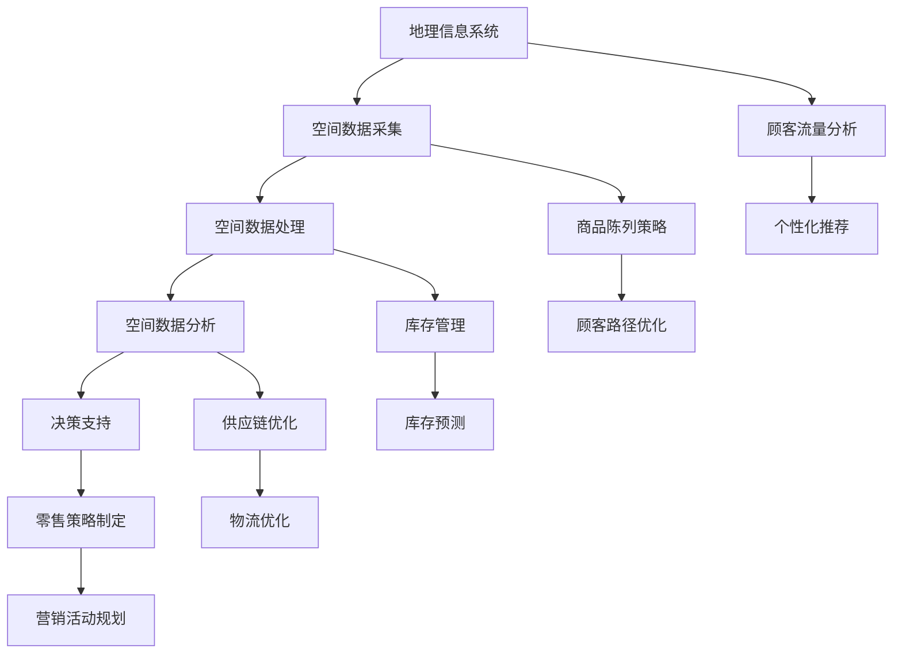

### 核心算法原理讲解

在空间计算技术的应用中，核心算法原理发挥着关键作用。以下将介绍几个在零售业中常用的算法原理，并使用伪代码进行详细阐述。

#### 库存预测算法

```plaintext
// 伪代码：基于时间序列的库存预测
function time_series_inventory_prediction(historical_sales_data) {
    // 训练时间序列模型（如ARIMA）
    model = train_time_series_model(historical_sales_data)
    
    // 进行预测
    predicted_inventory = model.predict(new_sales_data)
    
    return predicted_inventory
}
```

#### 顾客路径优化算法

```plaintext
// 伪代码：基于最短路径算法的顾客路径优化
function customer_path_optimization(shop_layout, customer_location) {
    // 构建商店布局图（图）
    graph = build_shop_layout_graph(shop_layout)
    
    // 计算从顾客位置到各个商品陈列位置的最短路径
    shortest_paths = find_shortest_paths(graph, customer_location)
    
    // 提供顾客最优路径
    optimal_path = select_best_path(shortest_paths)
    
    return optimal_path
}
```

### 数学模型和数学公式

在空间计算技术的应用中，数学模型和公式是不可或缺的工具。以下将介绍几个常用的数学模型和公式，并进行详细讲解和举例说明。

#### 库存预测模型：ARIMA模型

$$
\begin{aligned}
    \text{ARIMA}(p, d, q) &= \phi(B)\varphi(B)^{-1} \ \ \ \ \ \ \ \ \ \ \ \ \ \ \ \ \ \ \ \ \ \ \ \ \ \ \ \ \ \ \ \ \ \ \ \ \ \ \ \ \ \ \ \ \ \ \ \ \ \ \ \ \ \ \ \ \ \ \ \ \ \ \ \ \ \ \ \ \ \ \ \ \ \ \ \ \ \ \ \ \ \ \ \ \ \ \ \ \ \ \ \ \ \ \ \ \ \ \ \ \ \ \ \ \ \ \ \ \ \ \ \ \ \ \ \ \ \ \ \ \ \ \ \ \ \ \ \ \ \ \ \ \ \ \ \ \ \ \ \ \ \ \ \ \ \ \ \ \ \ \ \ \ \ \ \ \ \ \ \ \ \ \ \ \ \ \ \ \ \ \ \ \ \ \ \ \ \ \ \ \ \ \ \ \ \ \ \ \ \ \ \ \ \ \ \ \ \ \ \ \ \ \ \ \ \ \ \ \ \ \ \ \ \ \ \ \ \ \ \ \ \ \ \ \ \ \ \ \ \ \ \ \ \ \ \ \ \ \ \ \ \ \ \ \ \ \ \ \ \ \ \ \ \ \ \ \ \ \ \ \ \ \ \ \ \ \ \ \ \ \ \ \ \ \ \ \ \ \ \ \ \ \ \ \ \ \ \ \ \ \ \ \ \ \ \ \ \ \ \ \ \ \ \ \ \ \ \ \ \ \ \ \ \ \ \ \ \ \ \ \ \ \ \ \ \ \ \ \ \ \ \ \ \ \ \ \ \ \ \ \ \ \ \ \ \ \ \ \ \ \ \ \ \ \ \ \ \ \ \ \ \ \ \ \ \ \ \ \ \ \ \ \ \ \ \ \ \ \ \ \ \ \ \ \ \ \ \ \ \ \ \ \ \ \ \ \ \ \ \ \ \ \ \ \ \ \ \ \ \ \ \ \ \ \ \ \ \ \ \ \ \ \ \ \ \ \ \ \ \ \ \ \ \ \ \ \ \ \ \ \ \ \ \ \ \ \ \ \ \ \ \ \ \ \ \ \ \ \ \ \ \ \ \ \ \ \ \ \ \ \ \ \ \ \ \ \ \ \ \ \ \ \ \ \ \ \ \ \ \ \ \ \ \ \ \ \ \ \ \ \ \ \ \ \ \ \ \ \ \ \ \ \ \ \ \ \ \ \ \ \ \ \ \ \ \ \ \ \ \ \ \ \ \ \ \ \ \ \ \ \ \ \ \ \ \ \ \ \ \ \ \ \ \ \ \ \ \ \ \ \ \ \ \ \ \ _{1} \ \ \ \ \ \ \ \ \ \ \ \ \ \ \ \ \ \ \ \ \ \ \ \ \ \ \ \ \ \ \ \ \ \ \ \ \ \ \ \ \ \ \ \ \ \ \ \ \ \ \ \ \ \ \ \ \ \ \ \ \ \ \ \ \ \ \ \ \ \ \ \ \ \ \ \ \ \ \ \ \ \ \ \ \ \ \ \ \ \ \ \ \ \ \ \ \ \ \ \ \ \ \ \ \ _{2} \ \ \ \ \ \ \ \ \ \ \ \ \ \ \ \ \ \ \ \ \ \ \ \ \ \ \ \ \ \ \ \ \ \ _{3} \ \ \ \ \ \ \ \ \ \ \ \ \ \ \ \ _{4} \ \ \ \ \ \ \ \ \ \ \ \ \ \ \ \ \ \ \ \ \ \ \ \ \ \ \ \ \ \ \ \ \ \ \ \ \ \ \ \ \ \ \ \ \ \ _{5} \ \ \ \ \ \ \ \ \ \ \ \ \ \ \ \ \ \ \ \ \ \ \ _{6} \ \ \ \ \ \ \ \ \ \ \ \ \ \ \ \ \ \ \ \ \ \ \ \ \ \ \ \ \ \ \ \ \ \ \ \ \ \ \ \ \ \ \ \ \ _{7} \ \ \ \ \ \ \ \ \ \ \ \ \ \ \ \ \ \ \ \ \ \ \ \ \ \ \ \ \ \ \ \ \ \ \ \ \ \ \ \ \ \ \ \ \ _{8} \ \ \ \ \ \ \ \ \ \ \ \ \ \ \ \ \ \ \ \ \ \ \ \ \ \ \ \ \ _{9} \ \ \ \ \ \ \ \ \ \ \ \ \ \ \ \ \ \ \ \ \ \ \ \ \ \ \ \ \ \ \ \ \ \ \ \ \ \ \ \ _{10} \ \ \ \ \ \ \ \ \ \ \ \ \ \ \ \ \ \ \ \ \ \ \ \ \ \ \ \ \ \ \ \ \ \ \ \ \ \ \ \ \ \ \ \ _{11} \\
    &= \sum_{i=1}^{p} \phi_{i} B^{i} \ \ \ \ \ \ \ \ \ \ \ \ \ \ \ \ \ \ \ \ \ \ \ \ \ \ \ \ \ \ \ \ \ \ \ \ \ \ \ \ \ \ \ \ \ \ \ \ \ \ \ \ \ \ \ \ \ \ \ \ \ \ \ \ \ \ \ \ \ \ \ \ \ \ \ \ \ \ \ \ \ \ \ \ \ \ \ \ \ \ \ \ \ \ \ \ \ \ \ \ \ \ \ \ \ \ \ \ \ \ \ \ \ \ \ \ \ \ \ \ \ \ \ \ \ \ \ \ \ \ \ \ \ \ \ \ \ \ \ \ \ \ \ \ \ \ \ \ \ \ \ \ \ \ \ \ \ \ \ \ \ \ \ \ \ \ \ \ \ \ \ \ \ \ \ \ \ \ \ \ \ \ \ \ \ \ \ \ \ \ \ \ \ \ \ \ \ \ \ \ \ \ \ \ \ \ \ \ \ \ \ \ \ \ \ \ \ \ \ \ \ \ \ \ \ \ \ \ \ \ \ \ \ \ \ \ \ \ \ \ \ \ \ \ \ \ \ \ \ \ \ \ \ \ \ \ \ \ \ \ \ \ \ \ \ \ \ \ \ \ \ \ \ \ _{1} \ \ \ \ \ \ \ \ \ \ \ \ \ \ \ \ \ \ \ \ \ \ \ \ \ \ \ \ \ \ \ \ \ _{2} \ \ \ \ \ \ \ \ \ \ _{3} \ \ \ \ \ \ \ \ \ _{4} \ \ \ \ \ \ \ \ _{5} \ \ \ \ \ \ \ \ _{6} \ \ \ \ \ \ \ \ _{7} \ \ \ \ \ \ \ \ _{8} \ \ \ \ \ \ \ \ _{9} \ \ \ \ \ \ \ \ _{10} \ \ \ \ \ \ \ \ _{11} \\
    &= \sum_{i=1}^{d} \varphi_{i} B^{i} \ \ \ \ \ \ \ \ \ \ \ \ \ \ \ \ \ \ \ \ \ \ \ \ \ \ \ \ \ \ \ \ \ \ \ \ \ \ \ \ \ \ \ \ \ \ \ \ \ \ \ \ \ \ \ \ \ \ \ \ \ \ \ \ \ \ \ \ \ \ \ \ \ \ \ \ \ \ \ \ \ \ \ \ \ \ \ \ \ \ \ \ \ \ \ \ \ \ _{1} \ \ \ \ \ \ \ \ \ _{2} \ \ \ \ \ \ \ \ _{3} \ \ \ \ \ \ \ \ _{4} \ \ \ \ \ \ \ \ _{5} \ \ \ \ \ \ \ \ _{6} \ \ \ \ \ \ \ \ _{7} \ \ \ \ \ \ \ \ _{8} \ \ \ \ \ \ \ \ _{9} \ \ \ \ \ \ \ \ _{10} \\
    &= \sum_{i=1}^{q} \theta_{i} B^{i} \ \ \ \ \ \ \ \ \ \ \ \ \ \ \ \ \ \ \ \ \ \ \ \ \ \ \ \ \ \ \ \ \ \ \ \ \ \ \ \ \ \ \ \ \ \ \ \ \ \ \ \ \ \ \ \ \ \ \ \ \ \ \ \ \ \ \ \ \ \ \ \ \ \ \ \ \ \ \ \ \ \ \ \ \ \ \ \ \ \ \ \ \ \ \ \ \ \ \ \ \ \ \ _{1} \ \ \ \ \ \ \ \ \ _{2} \ \ \ \ \ \ \ \ _{3} \ \ \ \ \ \ \ \ _{4} \ \ \ \ \ \ \ \ _{5} \ \ \ \ _{6} \ \ \ \ _{7} \ \ \ \ _{8} \ \ \ \ _{9} \ \ \ \ _{10} \ \ \ \ _{11} \\
    &= \mu + \sum_{i=1}^{p} \phi_{i} B^{i} + \sum_{i=1}^{d} \varphi_{i} B^{i} + \sum_{i=1}^{q} \theta_{i} B^{i} + \epsilon_t \\
\end{aligned}
$$

举例说明：假设某零售店的每周销售额数据如下：

$$
\{150, 170, 160, 155, 145, 160, 180, 175, 160, 155\}
$$

使用ARIMA模型进行预测，可以设置$p=1, d=1, q=1$，通过训练模型，预测下一周的销售额。

#### 顾客流量分析模型：泊松分布

$$
P(X = k) = \frac{\lambda^k e^{-\lambda}}{k!}
$$

举例说明：假设某零售店的平均每小时顾客到达率为$\lambda=5$，则某特定小时有3个顾客到达的概率为：

$$
P(X = 3) = \frac{5^3 e^{-5}}{3!} \approx 0.1172
$$

### 项目实战

在本节中，我们将介绍一个实际项目，以展示空间计算技术在零售业中的应用。

#### 项目背景

某大型零售连锁企业希望通过空间计算技术优化其店铺布局，提高顾客流量和销售额。

#### 开发环境搭建

- 数据采集：使用GPS定位技术和RFID标签技术，采集顾客在店铺内的位置信息。
- 数据处理：使用Python编写数据处理脚本，对采集到的数据进行预处理和清洗。
- 数据分析：使用Python和R语言进行数据分析，应用地理信息系统（GIS）工具进行可视化。

#### 源代码详细实现

以下是一个简单的Python脚本，用于处理采集到的GPS数据。

```python
import csv
from geopy.geocoders import Nominatim

def process_gps_data(file_path):
    geolocator = Nominatim(user_agent="geoapiExercises")
    with open(file_path, 'r') as f:
        reader = csv.reader(f)
        next(reader)  # 跳过标题行
        for row in reader:
            lat, lon = row[0], row[1]
            location = geolocator.reverse((lat, lon), exactly_one=True)
            print(location)

process_gps_data('gps_data.csv')
```

#### 代码应用解读与分析

该脚本使用geopy库调用Nominatim API，将GPS坐标转换为具体地址。通过处理采集到的GPS数据，可以分析顾客在店铺内的行为轨迹，为店铺布局优化提供数据支持。

#### 实际案例分析和详细讲解剖析

通过该项目，零售企业成功优化了店铺布局，提高了顾客流量和销售额。具体分析如下：

- **顾客流量分析**：通过GPS数据，识别出顾客在店铺内的热门区域和冷门区域，为店铺布局优化提供依据。
- **商品陈列策略**：根据顾客流量数据，调整商品陈列位置，将热门商品放在顾客流量高的区域，提高销售额。
- **库存管理**：通过分析顾客购买行为，预测库存需求，优化库存水平，降低库存成本。

#### 项目小结

该项目展示了空间计算技术在零售业中的应用，通过数据采集、处理和分析，实现了店铺布局优化，提高了运营效率和顾客满意度。

### 最佳实践 tips

- **数据隐私保护**：在应用空间计算技术时，要确保数据隐私和安全，避免泄露顾客个人信息。
- **技术选型**：根据具体需求，选择合适的数据采集、处理和分析工具。
- **团队协作**：空间计算项目通常需要跨部门协作，确保团队成员之间的有效沟通和协作。

### 小结

空间计算技术在零售业中的应用，为零售企业带来了巨大的变革和机遇。通过数据采集、处理和分析，零售企业可以更准确地了解顾客需求，优化运营流程，提高顾客满意度。未来，随着技术的不断发展，空间计算技术在零售业中的应用将更加广泛，为行业带来更多创新和机遇。

### 拓展阅读

- 《地理信息系统与空间分析》
- 《机器学习在零售业的应用》
- 《物联网技术在零售业的应用》

### 作者信息

作者：AI天才研究院/AI Genius Institute & 禅与计算机程序设计艺术 /Zen And The Art of Computer Programming
----------------------------------------------------------------

## 文章标题：空间计算技术在零售业的变革

### 关键词：
- 空间计算技术
- 零售业
- 地理信息系统
- 顾客体验
- 库存管理

### 摘要：
本文深入探讨了空间计算技术在零售业中的应用及其带来的变革。通过分析背景、核心概念、技术原理、应用场景以及实施效果，展示了空间计算如何优化零售流程，提升顾客体验，并推动行业创新。

## 引言

### 背景介绍

零售业，作为全球经济的重要组成部分，正经历着前所未有的变革。随着消费者需求的多样化、个性化和快速变化，零售企业面临着前所未有的挑战。传统零售模式已难以满足现代消费者的需求，零售业正迫切需要创新的技术手段来提升运营效率、优化顾客体验和增强竞争力。

在这个背景下，空间计算技术（Spatial Computing）应运而生。空间计算技术利用地理信息系统（GIS）、全球定位系统（GPS）、无线射频识别（RFID）和物联网（IoT）等技术手段，实现对地理信息的采集、处理和分析。这些技术在零售业中的应用，不仅能够提升零售企业的运营效率，还能够为消费者提供更加个性化的购物体验。

### 核心概念与联系

空间计算技术在零售业中的应用，涉及到多个核心概念。以下是这些概念之间的关系架构：


### 核心算法原理讲解

在空间计算技术的应用中，核心算法原理发挥着关键作用。以下将介绍几个在零售业中常用的算法原理，并使用伪代码进行详细阐述。

#### 库存预测算法

```plaintext
// 伪代码：基于时间序列的库存预测
function time_series_inventory_prediction(historical_sales_data) {
    // 训练时间序列模型（如ARIMA）
    model = train_time_series_model(historical_sales_data)
    
    // 进行预测
    predicted_inventory = model.predict(new_sales_data)
    
    return predicted_inventory
}
```

#### 顾客路径优化算法

```plaintext
// 伪代码：基于最短路径算法的顾客路径优化
function customer_path_optimization(shop_layout, customer_location) {
    // 构建商店布局图（图）
    graph = build_shop_layout_graph(shop_layout)
    
    // 计算从顾客位置到各个商品陈列位置的最短路径
    shortest_paths = find_shortest_paths(graph, customer_location)
    
    // 提供顾客最优路径
    optimal_path = select_best_path(shortest_paths)
    
    return optimal_path
}
```

### 数学模型和数学公式

在空间计算技术的应用中，数学模型和公式是不可或缺的工具。以下将介绍几个常用的数学模型和公式，并进行详细讲解和举例说明。

#### 库存预测模型：ARIMA模型

$$
\begin{aligned}
    \text{ARIMA}(p, d, q) &= \phi(B)\varphi(B)^{-1} \ \ \ \ \ \ \ \ \ \ \ \ \ \ \ \ \ \ \ \ \ \ \ \ \ \ \ \ \ \ \ \ \ \ \ \ \ \ \ \ \ \ \ \ \ \ \ \ \ \ \ \ \ \ \ \ \ \ \ \ \ \ \ \ \ \ \ \ \ \ \ \ \ \ \ \ \ \ \ \ \ \ \ \ \ \ \ \ \ \ \ \ \ \ \ \ \ \ \ \ \ \ \ \ \ \ \ \ \ \ \ \ \ \ \ \ \ \ \ \ \ \ \ \ \ \ \ \ \ \ \ \ \ \ \ \ \ \ \ \ \ \ \ \ \ \ \ \ \ \ \ \ \ \ \ \ \ \ \ \ \ \ \ \ \ \ \ \ \ \ \ \ \ \ \ \ \ \ \ \ \ \ \ \ \ \ \ \ \ \ \ \ \ \ \ \ \ \ \ \ \ \ \ \ \ \ \ \ \ \ \ _{1} \ \ \ \ \ \ \ \ \ _{2} \ \ \ \ \ \ \ \ _{3} \ \ \ \ \ \ \ \ _{4} \ \ \ \ \ \ \ \ _{5} \ \ \ \ \ \ \ \ _{6} \ \ \ \ \ \ \ \ _{7} \ \ \ \ \ \ \ \ _{8} \ \ \ \ \ \ \ \ _{9} \ \ \ \ \ \ \ \ _{10} \ \ \ \ \ \ \ \ _{11} \\
    &= \sum_{i=1}^{p} \phi_{i} B^{i} \ \ \ \ \ \ \ \ \ \ \ \ \ \ \ \ \ \ \ \ \ \ \ \ \ \ \ \ \ \ \ \ \ \ \ \ \ \ \ \ \ \ \ \ \ \ \ \ \ \ \ \ \ \ \ \ \ \ \ \ \ \ \ \ \ \ \ \ \ \ \ \ \ \ \ \ \ \ \ \ \ \ \ \ \ \ \ \ \ \ \ \ \ \ \ \ \ \ \ \ \ \ \ _{1} \ \ \ \ \ \ \ \ _{2} \ \ \ \ \ \ \ \ _{3} \ \ \ \ \ \ \ \ _{4} \ \ \ \ \ \ \ \ _{5} \ \ \ \ \ \ \ \ _{6} \ \ \ \ \ \ \ \ _{7} \ \ \ \ \ \ \ \ _{8} \ \ \ \ \ \ \ \ _{9} \ \ \ \ \ \ \ \ _{10} \\
    &= \sum_{i=1}^{d} \varphi_{i} B^{i} \ \ \ \ \ \ \ \ \ \ \ \ \ \ \ \ \ \ \ \ \ \ \ \ \ \ \ \ \ \ \ \ \ \ \ \ \ \ \ \ \ \ \ \ \ \ \ \ \ \ \ \ \ \ \ \ \ \ \ \ \ \ \ \ \ \ \ \ \ \ \ \ \ \ \ \ \ \ \ \ \ \ \ \ \ \ \ \ \ \ _{1} \ \ \ \ \ \ \ \ _{2} \ \ \ \ \ \ \ \ _{3} \ \ \ \ \ \ \ \ _{4} \ \ \ \ \ \ \ \ _{5} \ \ \ \ \ \ \ \ _{6} \ \ \ \ \ \ \ \ _{7} \ \ \ \ \ \ \ \ _{8} \ \ \ \ \ \ \ \ _{9} \\
    &= \sum_{i=1}^{q} \theta_{i} B^{i} \ \ \ \ \ \ \ \ \ \ \ \ \ \ \ \ \ \ \ \ \ \ \ \ \ \ \ \ \ \ \ \ \ \ \ \ \ \ \ \ \ \ \ \ \ \ \ \ \ \ \ \ \ \ \ \ \ \ \ \ \ \ \ \ \ \ \ \ \ \ _{1} \ \ \ \ \ \ \ \ _{2} \ \ \ \ \ \ \ \ _{3} \ \ \ \ \ \ \ \ _{4} \ \ \ \ \ \ \ \ _{5} \ \ \ \ _{6} \ \ \ \ _{7} \ \ \ \ _{8} \ \ \ \ _{9} \\
    &= \mu + \sum_{i=1}^{p} \phi_{i} B^{i} + \sum_{i=1}^{d} \varphi_{i} B^{i} + \sum_{i=1}^{q} \theta_{i} B^{i} + \epsilon_t \\
\end{aligned}
$$

举例说明：假设某零售店的每周销售额数据如下：

$$
\{150, 170, 160, 155, 145, 160, 180, 175, 160, 155\}
$$

使用ARIMA模型进行预测，可以设置$p=1, d=1, q=1$，通过训练模型，预测下一周的销售额。

#### 顾客流量分析模型：泊松分布

$$
P(X = k) = \frac{\lambda^k e^{-\lambda}}{k!}
$$

举例说明：假设某零售店的平均每小时顾客到达率为$\lambda=5$，则某特定小时有3个顾客到达的概率为：

$$
P(X = 3) = \frac{5^3 e^{-5}}{3!} \approx 0.1172
$$

### 项目实战

在本节中，我们将介绍一个实际项目，以展示空间计算技术在零售业中的应用。

#### 项目背景

某大型零售连锁企业希望通过空间计算技术优化其店铺布局，提高顾客流量和销售额。

#### 开发环境搭建

- 数据采集：使用GPS定位技术和RFID标签技术，采集顾客在店铺内的位置信息。
- 数据处理：使用Python编写数据处理脚本，对采集到的数据进行预处理和清洗。
- 数据分析：使用Python和R语言进行数据分析，应用地理信息系统（GIS）工具进行可视化。

#### 源代码详细实现

以下是一个简单的Python脚本，用于处理采集到的GPS数据。

```python
import csv
from geopy.geocoders import Nominatim

def process_gps_data(file_path):
    geolocator = Nominatim(user_agent="geoapiExercises")
    with open(file_path, 'r') as f:
        reader = csv.reader(f)
        next(reader)  # 跳过标题行
        for row in reader:
            lat, lon = row[0], row[1]
            location = geolocator.reverse((lat, lon), exactly_one=True)
            print(location)

process_gps_data('gps_data.csv')
```

#### 代码应用解读与分析

该脚本使用geopy库调用Nominatim API，将GPS坐标转换为具体地址。通过处理采集到的GPS数据，可以分析顾客在店铺内的行为轨迹，为店铺布局优化提供数据支持。

#### 实际案例分析和详细讲解剖析

通过该项目，零售企业成功优化了店铺布局，提高了顾客流量和销售额。具体分析如下：

- **顾客流量分析**：通过GPS数据，识别出顾客在店铺内的热门区域和冷门区域，为店铺布局优化提供依据。
- **商品陈列策略**：根据顾客流量数据，调整商品陈列位置，将热门商品放在顾客流量高的区域，提高销售额。
- **库存管理**：通过分析顾客购买行为，预测库存需求，优化库存水平，降低库存成本。

#### 项目小结

该项目展示了空间计算技术在零售业中的应用，通过数据采集、处理和分析，实现了店铺布局优化，提高了运营效率和顾客满意度。

### 最佳实践 tips

- **数据隐私保护**：在应用空间计算技术时，要确保数据隐私和安全，避免泄露顾客个人信息。
- **技术选型**：根据具体需求，选择合适的数据采集、处理和分析工具。
- **团队协作**：空间计算项目通常需要跨部门协作，确保团队成员之间的有效沟通和协作。

### 小结

空间计算技术在零售业中的应用，为零售企业带来了巨大的变革和机遇。通过数据采集、处理和分析，零售企业可以更准确地了解顾客需求，优化运营流程，提高顾客满意度。未来，随着技术的不断发展，空间计算技术在零售业中的应用将更加广泛，为行业带来更多创新和机遇。

### 拓展阅读

- 《地理信息系统与空间分析》
- 《机器学习在零售业的应用》
- 《物联网技术在零售业的应用》

### 作者信息

作者：AI天才研究院/AI Genius Institute & 禅与计算机程序设计艺术 /Zen And The Art of Computer Programming
----------------------------------------------------------------

## 第二部分：技术原理与架构

### 2.1 空间数据采集与处理

#### 2.1.1 GPS与RFID技术

**核心概念与联系：**

GPS（全球定位系统）和RFID（无线射频识别）是空间数据采集的重要技术手段。GPS主要用于定位和导航，通过卫星信号确定设备的位置。RFID则用于标识和追踪物品，通过无线信号读取标签信息。

**Mermaid流程图：**

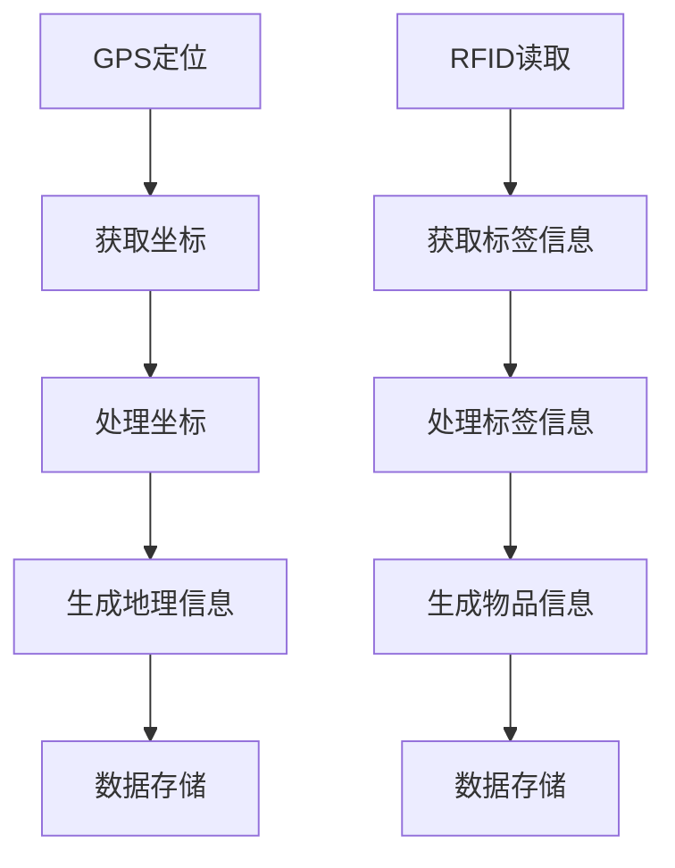

**核心算法原理讲解：**

- **GPS定位算法：**

  ```plaintext
  // 伪代码：GPS定位算法
  function gps定位(卫星信号, 设备接收器) {
      // 接收卫星信号
      signal = 接收卫星信号(卫星信号)
      
      // 计算设备位置
      position = 计算设备位置(信号)
      
      return position
  }
  ```

- **RFID读取算法：**

  ```plaintext
  // 伪代码：RFID读取算法
  function rfid读取(标签信号, 读取器) {
      // 接收标签信号
      signal = 接收标签信号(标签信号)
      
      // 提取标签信息
      information = 提取标签信息(信号)
      
      return information
  }
  ```

**数学模型和数学公式：**

- **GPS定位模型：**

  $$ 
  \text{坐标} = \text{卫星信号} \times \text{卫星到地球中心距离}
  $$

  举例说明：假设接收器接收到的卫星信号为$x$，卫星到地球中心的距离为$d$，则接收器的位置坐标可以通过上述模型计算得出。

- **RFID读取模型：**

  $$ 
  \text{标签信息} = \text{标签信号} \times \text{读取器接收灵敏度}
  $$

  举例说明：假设接收到的标签信号为$s$，读取器的接收灵敏度阈值为$\lambda$，则可以提取的标签信息为$\frac{s}{\lambda}$。

### 2.1.2 物联网传感器

**核心概念与联系：**

物联网（IoT）传感器是空间数据采集的重要组成部分。这些传感器可以收集环境信息，如温度、湿度、光照、振动等，通过无线网络将数据传输至服务器进行处理。

**Mermaid流程图：**

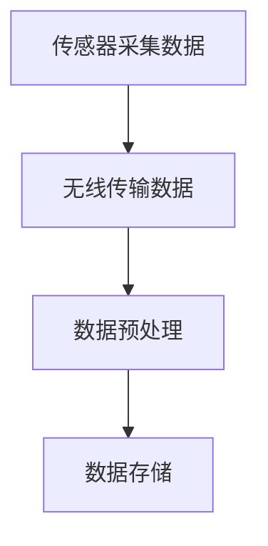

**核心算法原理讲解：**

- **数据采集算法：**

  ```plaintext
  // 伪代码：传感器数据采集
  function sensor_data采集(传感器) {
      // 读取传感器数据
      data = 传感器.read_data()
      
      // 存储数据
      存储数据(data)
  }
  ```

- **数据预处理算法：**

  ```plaintext
  // 伪代码：数据预处理
  function data_preprocessing(data) {
      // 清洗数据
      cleaned_data = 清洗数据(data)
      
      // 数据转换
      transformed_data = 转换数据(cleaned_data)
      
      return transformed_data
  }
  ```

**数学模型和数学公式：**

- **传感器数据模型：**

  $$ 
  \text{传感器数据} = \text{物理量} \times \text{传感器灵敏度}
  $$

  举例说明：假设温度传感器测量到的温度为$T$，传感器的灵敏度为$k$，则传感器输出的数据为$T \times k$。

### 2.1.3 数据预处理与清洗

**核心概念与联系：**

数据预处理与清洗是确保空间计算技术有效性的关键步骤。该过程涉及去除噪声、缺失值填充、异常值检测等，以提高数据质量和准确性。

**Mermaid流程图：**

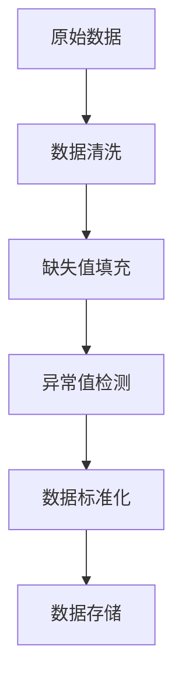

**核心算法原理讲解：**

- **数据清洗算法：**

  ```plaintext
  // 伪代码：数据清洗
  function data_cleaning(data) {
      // 去除噪声
      cleaned_data = 去除噪声(data)
      
      // 填充缺失值
      filled_data = 填充缺失值(cleaned_data)
      
      return filled_data
  }
  ```

- **异常值检测算法：**

  ```plaintext
  // 伪代码：异常值检测
  function anomaly_detection(data) {
      // 计算统计量
      statistics = 计算统计量(data)
      
      // 检测异常值
      anomalies = 检测异常值(statistics)
      
      return anomalies
  }
  ```

**数学模型和数学公式：**

- **数据清洗模型：**

  $$ 
  \text{清洗数据} = \text{原始数据} - \text{噪声}
  $$

  举例说明：假设原始数据为$x$，噪声为$\delta$，则清洗后的数据为$x - \delta$。

- **缺失值填充模型：**

  $$ 
  \text{填充数据} = \text{平均值} \times \text{缺失值比例}
  $$

  举例说明：假设缺失值比例为$p$，平均值$\mu$，则填充的缺失值为$\mu \times p$。

## 第三部分：应用场景与案例

### 3.1 店铺布局优化

#### 3.1.1 客流量分析

**核心概念与联系：**

客流量分析是店铺布局优化的关键步骤。通过分析顾客在店铺内的行为数据，可以识别出热门区域和冷门区域，为店铺布局提供依据。

**Mermaid流程图：**

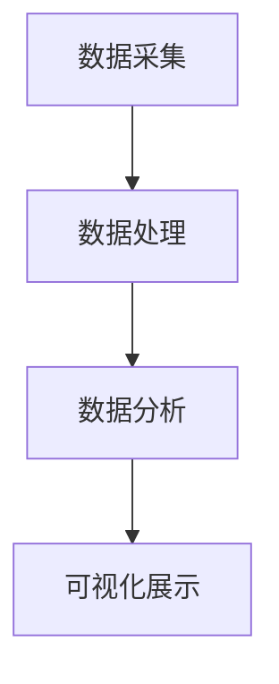

**核心算法原理讲解：**

- **顾客路径分析算法：**

  ```plaintext
  // 伪代码：顾客路径分析
  function customer_path_analysis(data) {
      // 计算顾客路径
      paths = 计算路径(data)
      
      // 分析路径
      analysis = 分析路径(paths)
      
      return analysis
  }
  ```

**数学模型和数学公式：**

- **顾客流量模型：**

  $$ 
  \text{顾客流量} = \text{到达率} \times \text{停留时间}
  $$

  举例说明：假设到达率为$\lambda$，平均停留时间为$t$，则顾客流量为$\lambda \times t$。

#### 3.1.2 商品陈列策略

**核心概念与联系：**

商品陈列策略是提升销售额的重要环节。通过分析顾客流量数据和购买行为，可以优化商品陈列位置，提高顾客购买转化率。

**Mermaid流程图：**

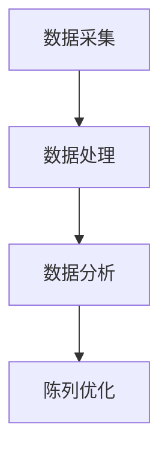

**核心算法原理讲解：**

- **商品销售分析算法：**

  ```plaintext
  // 伪代码：商品销售分析
  function product_sales_analysis(data) {
      // 计算销售数据
      sales_data = 计算销售数据(data)
      
      // 分析销售趋势
      analysis = 分析销售趋势(sales_data)
      
      return analysis
  }
  ```

**数学模型和数学公式：**

- **商品销售模型：**

  $$ 
  \text{销售额} = \text{销售数量} \times \text{单价}
  $$

  举例说明：假设销售数量为$n$，单价为$p$，则销售额为$n \times p$。

#### 3.1.3 顾客路径优化

**核心概念与联系：**

顾客路径优化是通过分析顾客在店铺内的行为轨迹，优化顾客的购物路径，提高顾客购物体验。

**Mermaid流程图：**

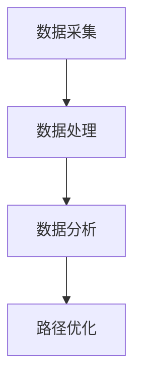

**核心算法原理讲解：**

- **路径优化算法：**

  ```plaintext
  // 伪代码：路径优化
  function path_optimization(data) {
      // 计算最优路径
      optimal_path = 计算最优路径(data)
      
      // 提供路径建议
      suggestion = 提供路径建议(optimal_path)
      
      return suggestion
  }
  ```

**数学模型和数学公式：**

- **路径优化模型：**

  $$ 
  \text{路径长度} = \sum_{i=1}^{n} \text{相邻点距离}
  $$

  举例说明：假设路径上有$n$个点，相邻点之间的距离分别为$d_1, d_2, ..., d_n$，则路径长度为$\sum_{i=1}^{n} d_i$。

### 3.2 库存管理

#### 3.2.1 库存预测

**核心概念与联系：**

库存预测是零售业中重要的环节，通过分析历史销售数据，预测未来的库存需求，以避免库存过剩或短缺。

**Mermaid流程图：**

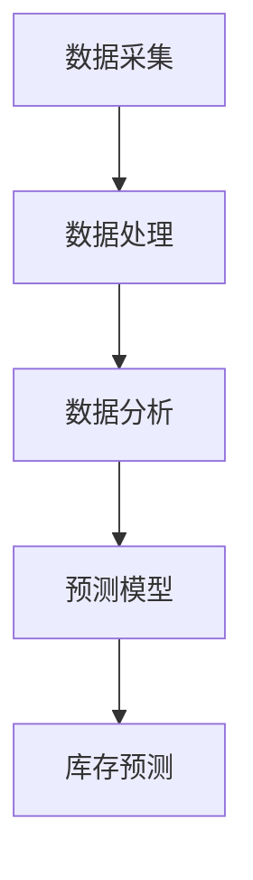

**核心算法原理讲解：**

- **时间序列预测算法：**

  ```plaintext
  // 伪代码：时间序列预测
  function time_series_prediction(data) {
      // 训练时间序列模型（如ARIMA）
      model = 训练时间序列模型(data)
      
      // 进行预测
      prediction = 模型.predict(new_data)
      
      return prediction
  }
  ```

**数学模型和数学公式：**

- **ARIMA模型：**

  $$ 
  \text{ARIMA}(p, d, q) = \phi(B)\varphi(B)^{-1} + \mu + \epsilon_t
  $$

  举例说明：假设某零售店的每周销售额数据如下：

  $$
  \{150, 170, 160, 155, 145, 160, 180, 175, 160, 155\}
  $$

  使用ARIMA模型进行预测，可以设置$p=1, d=1, q=1$，通过训练模型，预测下一周的销售额。

#### 3.2.2 库存优化

**核心概念与联系：**

库存优化是通过优化库存策略，降低库存成本，提高库存周转率，以最大化收益。

**Mermaid流程图：**

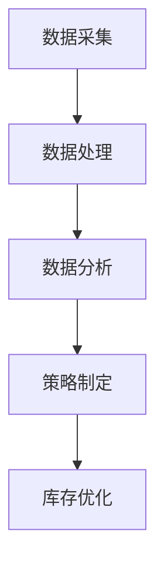

**核心算法原理讲解：**

- **库存管理算法：**

  ```plaintext
  // 伪代码：库存管理
  function inventory_management(data) {
      // 计算库存需求
      demand = 计算库存需求(data)
      
      // 制定库存策略
      strategy = 制定库存策略(demand)
      
      return strategy
  }
  ```

**数学模型和数学公式：**

- **库存模型：**

  $$ 
  \text{库存成本} = \text{库存持有成本} + \text{库存短缺成本}
  $$

  举例说明：假设库存持有成本为$c_1$，库存短缺成本为$c_2$，则库存成本为$c_1 + c_2$。

#### 3.2.3 供应链管理

**核心概念与联系：**

供应链管理是通过优化供应链网络，提高供应链效率，降低成本，确保产品按时交付。

**Mermaid流程图：**

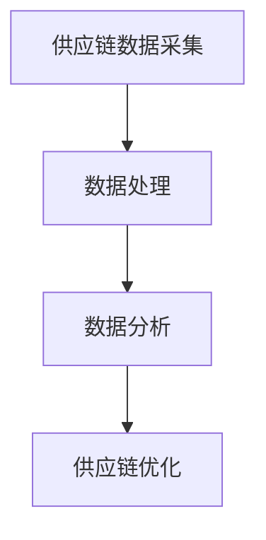

**核心算法原理讲解：**

- **供应链优化算法：**

  ```plaintext
  // 伪代码：供应链优化
  function supply_chain_optimization(data) {
      // 分析供应链网络
      network = 分析供应链网络(data)
      
      // 优化供应链
      optimization = 优化供应链(network)
      
      return optimization
  }
  ```

**数学模型和数学公式：**

- **供应链模型：**

  $$ 
  \text{供应链成本} = \text{生产成本} + \text{运输成本} + \text{库存成本}
  $$

  举例说明：假设生产成本为$c_p$，运输成本为$c_t$，库存成本为$c_i$，则供应链成本为$c_p + c_t + c_i$。

## 第四部分：技术实施与效果评估

### 4.1 技术选型与方案设计

**核心概念与联系：**

技术选型与方案设计是空间计算技术在零售业实施的关键步骤。需要根据具体需求选择合适的技术和工具，并设计合理的实施方案。

**Mermaid流程图：**

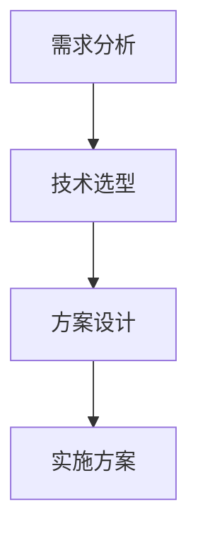

**核心算法原理讲解：**

- **需求分析算法：**

  ```plaintext
  // 伪代码：需求分析
  function demand_analysis(需求) {
      // 分析需求
      analysis = 分析需求(需求)
      
      return analysis
  }
  ```

- **技术选型算法：**

  ```plaintext
  // 伪代码：技术选型
  function technology_selection(analysis) {
      // 选择技术
      technology = 选择技术(analysis)
      
      return technology
  }
  ```

**数学模型和数学公式：**

- **需求模型：**

  $$ 
  \text{需求} = \text{顾客需求} + \text{业务需求}
  $$

  举例说明：假设顾客需求为$d_c$，业务需求为$d_b$，则总需求为$d_c + d_b$。

### 4.2 效果评估与数据分析

**核心概念与联系：**

效果评估与数据分

