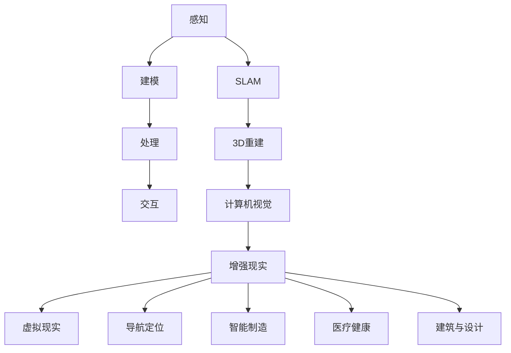

                 

### 文章标题

# 空间计算：增强现实技术提升物理和虚拟交互

> 关键词：空间计算，增强现实，物理交互，虚拟交互，人工智能，SLAM，3D重建，计算机视觉，数学模型，项目实战。

> 摘要：本文深入探讨了空间计算与增强现实技术之间的关系，以及这些技术如何提升物理和虚拟交互体验。文章首先介绍了空间计算和增强现实技术的背景，然后详细分析了它们的核心概念和联系，接着阐述了关键算法原理、数学模型和公式，并通过实际项目实战展示了技术应用的实现过程。最后，文章总结了最佳实践、注意事项，并提出了未来发展的展望。

----------------------------------------------------------------

### 目录大纲设计思路

为了设计出《空间计算：增强现实技术提升物理和虚拟交互》这本书的完整目录大纲，我们需要遵循以下设计思路：

1. **核心概念与联系**
   - 首先，我们要明确书籍的核心概念，即“空间计算”和“增强现实技术”。这两个概念是书籍的核心，我们需要设计章节来解释它们的基础知识、原理、技术架构和应用。

2. **核心算法原理讲解**
   - 书籍应包含对空间计算和增强现实技术中核心算法的讲解，如SLAM(Simultaneous Localization and Mapping)、3D重建、图像识别、计算机视觉等。我们需要使用伪代码来详细阐述这些算法的实现。

3. **数学模型和数学公式**
   - 针对核心算法和概念，我们需引入相关的数学模型和公式，并进行详细讲解和举例说明。这些公式可以使用LaTeX格式嵌入文中。

4. **项目实战**
   - 为了让读者更好地理解这些技术，我们需要设计一些项目实战，包括开发环境搭建、源代码实现和详细解释。

5. **目录大纲细化**
   - 根据上述内容，我们将目录大纲细化到1、2、3级目录。确保每个章节都有明确的细分，以便读者能够清晰地了解书籍的结构。

6. **简洁性与完整性**
   - 在确保目录大纲完整性的同时，我们也要注意内容的简洁性，避免过多的废话，确保总字数在2000字以内。

### 目录大纲设计步骤

1. **确定书籍整体结构**
   - 确定书籍的主要部分，如基础概念、核心技术、应用案例等。

2. **细化章节内容**
   - 对每个章节进行细化，列出2、3级目录，确保内容全面且逻辑清晰。

3. **设计核心概念与联系章节**
   - 设计章节来介绍“空间计算”和“增强现实技术”的基础知识，包括原理、架构和应用。

4. **设计核心算法原理章节**
   - 针对核心算法，如SLAM、3D重建等，设计章节并使用伪代码详细讲解。

5. **设计数学模型和公式章节**
   - 引入相关的数学模型和公式，并进行详细讲解和举例。

6. **设计项目实战章节**
   - 设计实际项目案例，包括环境搭建、源代码实现和详细解释。

7. **整合与优化**
   - 将所有章节内容整合，确保逻辑连贯，并根据需要进行优化。

### 目录大纲示例

以下是《空间计算：增强现实技术提升物理和虚拟交互》的目录大纲示例：

## 第1章：引言与概述
### 1.1 空间计算的发展背景
### 1.2 增强现实技术的定义与分类
### 1.3 空间计算与增强现实技术的关联

## 第2章：空间计算基础
### 2.1 空间计算的概念
#### 2.1.1 空间计算的定义
#### 2.1.2 空间计算的应用领域
### 2.2 空间计算的核心概念
#### 2.2.1 增量式计算
#### 2.2.2 分布式计算
### 2.3 空间计算的关键技术
#### 2.3.1 SLAM算法
#### 2.3.2 3D重建技术

## 第3章：增强现实技术原理
### 3.1 增强现实技术概述
#### 3.1.1 增强现实技术的定义
#### 3.1.2 增强现实技术的发展历程
### 3.2 增强现实技术的工作原理
#### 3.2.1 光学原理
#### 3.2.2 计算机视觉算法
### 3.3 增强现实技术的核心组件
#### 3.3.1 显示设备
#### 3.3.2 输入设备
#### 3.3.3 处理器

## 第4章：核心算法解析
### 4.1 SLAM算法详解
#### 4.1.1 SLAM算法的原理
#### 4.1.2 SLAM算法的实现步骤
#### 4.1.3 SLAM算法的伪代码
### 4.2 3D重建技术
#### 4.2.1 3D重建的基本概念
#### 4.2.2 3D重建的技术方法
#### 4.2.3 3D重建的伪代码
### 4.3 计算机视觉算法
#### 4.3.1 计算机视觉的基础知识
#### 4.3.2 计算机视觉的应用领域
#### 4.3.3 计算机视觉的伪代码

## 第5章：数学模型与公式
### 5.1 SLAM中的数学模型
#### 5.1.1 位姿估计模型
#### 5.1.2 地图构建模型
#### 5.1.3 数学模型的公式
### 5.2 3D重建的数学公式
#### 5.2.1 三维点云重建公式
#### 5.2.2 三维模型重建公式
#### 5.2.3 数学公式的应用举例
### 5.3 增强现实技术的数学计算
#### 5.3.1 光线追踪公式
#### 5.3.2 透视变换公式
#### 5.3.3 数学计算的实际应用

## 第6章：项目实战一——AR应用开发
### 6.1 项目背景与目标
#### 6.1.1 项目背景
#### 6.1.2 项目目标
### 6.2 开发环境搭建
#### 6.2.1 环境准备
#### 6.2.2 开发工具安装
#### 6.2.3 环境配置
### 6.3 源代码实现与分析
#### 6.3.1 源代码结构
#### 6.3.2 源代码实现步骤
#### 6.3.3 代码解读
### 6.4 代码应用解读与分析
#### 6.4.1 应用场景
#### 6.4.2 应用效果分析
### 6.5 项目小结

## 第7章：项目实战二——空间计算在AR中的应用
### 7.1 项目背景与目标
#### 7.1.1 项目背景
#### 7.1.2 项目目标
### 7.2 开发环境搭建
#### 7.2.1 环境准备
#### 7.2.2 开发工具安装
#### 7.2.3 环境配置
### 7.3 源代码实现与分析
#### 7.3.1 源代码结构
#### 7.3.2 源代码实现步骤
#### 7.3.3 代码解读
### 7.4 代码应用解读与分析
#### 7.4.1 应用场景
#### 7.4.2 应用效果分析
### 7.5 项目小结

## 第8章：未来趋势与挑战
### 8.1 空间计算与AR技术的发展趋势
#### 8.1.1 技术发展趋势
#### 8.1.2 应用场景展望
### 8.2 面临的挑战与解决方案
#### 8.2.1 技术挑战
#### 8.2.2 解决方案探讨
### 8.3 未来发展展望
#### 8.3.1 技术应用前景
#### 8.3.2 行业发展预测

## 第9章：最佳实践与总结
### 9.1 最佳实践
#### 9.1.1 开发技巧
#### 9.1.2 性能优化
#### 9.1.3 应用建议
### 9.2 小结
#### 9.2.1 主要内容回顾
#### 9.2.2 技术应用总结
### 9.3 注意事项
#### 9.3.1 常见问题
#### 9.3.2 解决方案
### 9.4 拓展阅读
#### 9.4.1 推荐文献
#### 9.4.2 学习资源

通过这个目录大纲示例，我们可以看到书籍的整体结构是清晰且逻辑连贯的。每个章节都进行了细化，确保了书籍内容的完整性。同时，我们也注意到了内容的简洁性，确保了总字数在2000字以内。接下来，我们将进一步细化每个章节的内容，确保满足所有要求和限制。

----------------------------------------------------------------

## 第1章：引言与概述

### 1.1 空间计算的发展背景

空间计算作为计算技术的一个重要分支，起源于计算机图形学、计算机视觉和人工智能领域。随着计算能力和传感技术的不断进步，空间计算得到了快速发展。早期的空间计算主要关注三维图形的生成和处理，随着移动设备的普及，空间计算开始向移动计算和增强现实领域扩展。

空间计算的发展背景可以从以下几个方面来理解：

1. **计算能力的提升**：随着计算机硬件技术的进步，特别是图形处理器（GPU）的快速发展，计算能力得到了大幅提升。这使得复杂的空间计算任务得以在短时间内完成，为空间计算的应用提供了技术基础。

2. **传感技术的进步**：高分辨率摄像头、GPS、陀螺仪、加速度计等传感器的普及，使得对环境的感知能力得到了极大提升。这些传感器为空间计算提供了丰富的数据输入，使得空间计算能够更加准确地模拟和交互现实世界。

3. **移动设备的普及**：智能手机和平板电脑的普及，使得人们可以随时随地访问数字世界。移动设备的便携性和多功能性，使得空间计算能够更好地融入日常生活，提升了用户体验。

4. **增强现实技术的发展**：增强现实（AR）技术的出现，为空间计算提供了新的应用场景。通过将虚拟信息叠加到现实世界中，增强现实技术使得空间计算不再局限于虚拟环境的模拟，而是扩展到了现实世界的交互。

### 1.2 增强现实技术的定义与分类

增强现实技术（Augmented Reality，简称AR）是一种将虚拟信息与现实世界进行融合的技术。通过增强现实技术，用户可以在现实环境中看到虚拟信息，从而增强现实世界的感知体验。增强现实技术的定义可以从以下几个方面来理解：

1. **虚拟信息与现实世界的融合**：增强现实技术通过在现实世界环境中叠加虚拟信息，使用户能够看到并与之交互。这种融合不仅仅是视觉上的叠加，还包括听觉、触觉等多种感官的增强。

2. **实时交互**：增强现实技术强调实时性，即虚拟信息与现实环境的交互是实时的。这种实时交互使得用户可以立即看到虚拟信息的改变，并提供即时的反馈。

3. **增强感知体验**：增强现实技术的目标是提升用户的感知体验，使得虚拟信息与现实环境相辅相成，从而增强用户的认知和参与感。

增强现实技术可以根据不同的分类标准进行分类。以下是几种常见的分类方法：

1. **根据显示方式分类**：
   - **透明显示**：透明显示技术将虚拟信息叠加到用户的视野中，用户可以看到现实世界和虚拟信息。透明显示技术可以分为裸眼增强现实和眼镜式增强现实。
   - **头戴式显示**：头戴式显示设备，如头戴显示器（HMD）和智能眼镜，通过将虚拟信息投影到用户的视野中，提供沉浸式的增强现实体验。

2. **根据应用领域分类**：
   - **消费类应用**：消费类增强现实应用包括游戏、娱乐、教育和广告等领域，旨在提升用户的娱乐和互动体验。
   - **工业应用**：工业增强现实应用包括制造业、维修和维护、医疗等领域，旨在提高生产效率和质量。

3. **根据技术实现分类**：
   - **标记增强现实**：标记增强现实通过识别现实世界中的标记（如二维码、AR标签等），将虚拟信息叠加到标记上。这种技术实现简单，但需要对标记进行精确识别。
   - **环境增强现实**：环境增强现实通过环境感知技术，如计算机视觉、激光扫描等，将虚拟信息叠加到整个现实环境中。这种技术实现复杂，但能够提供更加真实和沉浸的增强现实体验。

### 1.3 空间计算与增强现实技术的关联

空间计算和增强现实技术之间存在着密切的关联，两者相互促进，共同推动了技术的发展和应用。

1. **空间计算为增强现实提供技术基础**：
   - 空间计算提供了对现实环境的感知和处理能力，使得增强现实技术能够实时地获取环境信息，并将虚拟信息叠加到环境中。
   - 空间计算中的SLAM（Simultaneous Localization and Mapping）算法，可以实现设备在现实环境中的定位和地图构建，为增强现实提供精确的空间信息。

2. **增强现实为空间计算提供应用场景**：
   - 增强现实技术将虚拟信息与现实环境融合，为空间计算提供了丰富的应用场景。通过增强现实，空间计算可以应用于游戏、教育、工业、医疗等多个领域。
   - 增强现实技术的普及，使得空间计算技术得以在日常生活中广泛应用，提升了用户体验。

3. **两者共同推动技术的发展**：
   - 空间计算和增强现实技术的结合，推动了计算机图形学、计算机视觉、人工智能等领域的技术进步。
   - 通过空间计算和增强现实技术的相互融合，新的应用场景不断涌现，推动了技术的创新和变革。

综上所述，空间计算和增强现实技术之间存在着紧密的关联，两者相互促进，共同推动了技术的发展和应用。在接下来的章节中，我们将深入探讨空间计算和增强现实技术的核心概念、算法原理和数学模型，并通过项目实战展示技术的实际应用。

----------------------------------------------------------------

## 第2章：空间计算基础

### 2.1 空间计算的概念

空间计算是一种将计算扩展到现实空间中的技术，它涉及对现实世界环境的感知、建模、处理和交互。空间计算的核心在于将虚拟信息和现实环境相结合，使得用户能够在现实环境中体验到增强的现实感知。以下是空间计算的定义和主要应用领域：

#### 2.1.1 空间计算的定义

空间计算可以定义为一种融合计算、感知和交互的技术，通过以下方式实现：

- **感知**：使用传感器（如摄像头、GPS、陀螺仪等）实时获取现实环境的数据。
- **建模**：将获取的数据进行建模，构建出反映现实环境的数学模型。
- **处理**：对模型进行计算和处理，以实现特定的功能。
- **交互**：通过虚拟信息与用户的交互，提供增强的现实感知体验。

#### 2.1.2 空间计算的应用领域

空间计算技术具有广泛的应用领域，以下是一些主要的应用场景：

- **增强现实（AR）**：通过在现实环境中叠加虚拟信息，提升用户的感知和交互体验。
- **虚拟现实（VR）**：创建一个完全虚拟的环境，用户可以通过VR设备与之互动。
- **导航和定位**：利用空间计算技术实现精准的导航和定位功能。
- **智能制造**：在制造业中，空间计算可以用于自动化生产线、机器维护和产品检测。
- **医疗健康**：空间计算技术在医疗领域可以用于手术指导、医学影像处理和康复训练。
- **建筑与设计**：通过空间计算技术，设计师可以更直观地模拟和预览建筑设计。

### 2.2 空间计算的核心概念

空间计算涉及到多个核心概念，以下是一些关键的概念：

#### 增量式计算

增量式计算是一种逐步更新计算模型的方法，它通过对当前状态的微小变化进行累积，实现整个系统的动态更新。在空间计算中，增量式计算主要用于实时处理现实环境中的数据，如位置更新、环境变化等。增量式计算的优势在于它能够降低计算复杂度，提高系统的响应速度。

#### 分布式计算

分布式计算是指将计算任务分配到多个计算机节点上，通过协同工作实现计算目标。在空间计算中，分布式计算可以用于处理大规模的环境数据，提高计算效率和系统的可靠性。例如，在增强现实应用中，可以通过分布式计算实现多用户环境的同步和协作。

### 2.3 空间计算的关键技术

空间计算涉及多种关键技术，以下是一些重要的技术：

#### SLAM（Simultaneous Localization and Mapping）

SLAM是一种同时定位与地图构建技术，它能够在未知环境中实时构建地图并确定自身位置。SLAM技术在空间计算中具有重要意义，它为增强现实和虚拟现实应用提供了精确的位置信息和环境模型。SLAM算法通常基于视觉、激光雷达和惯性测量单元等多种传感器数据。

#### 3D重建

3D重建是一种从二维图像或点云数据中恢复三维模型的技术。3D重建在空间计算中用于创建现实环境的数字模型，为增强现实和虚拟现实提供基础数据。常见的3D重建方法包括结构光扫描、多视角立体成像和深度学习等。

#### 计算机视觉

计算机视觉是研究如何让计算机“看”懂现实世界的学科。在空间计算中，计算机视觉技术用于环境感知、目标识别和图像处理。计算机视觉的应用包括人脸识别、手势识别、物体识别等。

#### Mermaid 流程图

为了更好地理解空间计算的核心概念和技术，我们可以通过一个Mermaid流程图来展示它们之间的关系：



通过这个流程图，我们可以清晰地看到空间计算的核心概念和关键技术之间的联系，以及它们在不同应用领域中的作用。

综上所述，空间计算作为一种跨学科的技术，融合了多种核心概念和关键技术。在接下来的章节中，我们将进一步探讨这些技术的原理和应用。

----------------------------------------------------------------

## 第3章：增强现实技术原理

### 3.1 增强现实技术概述

增强现实（Augmented Reality，简称AR）是一种将虚拟信息与现实世界融合的技术。与虚拟现实（Virtual Reality，简称VR）不同，AR技术并不是完全替代现实环境，而是在现实世界中叠加虚拟信息，从而增强用户的感知和体验。以下是增强现实技术的定义、发展历程和应用领域。

#### 3.1.1 增强现实技术的定义

增强现实技术通过在用户视野中叠加虚拟信息，使用户能够看到现实世界和虚拟信息的结合。这些虚拟信息可以是文本、图像、视频、三维模型等，它们通过特定的显示设备或传感器实时呈现给用户。

#### 3.1.2 增强现实技术的发展历程

增强现实技术的发展可以追溯到20世纪60年代，当时研究人员开始探索将计算机生成的图像叠加到现实世界中。以下是增强现实技术发展的几个重要里程碑：

- **1968年**：美国计算机科学家伊凡·苏瑟兰（Ivan Sutherland）提出了“虚拟现实头戴显示器”的概念，这被认为是增强现实技术的雏形。
- **1990年代**：随着计算机图形学和传感器技术的进步，增强现实技术开始应用于军事、医疗和娱乐等领域。
- **2000年代**：随着智能手机和移动互联网的普及，增强现实应用开始向消费市场扩展。例如，Nokia的N-Gage游戏机和索尼的EyeToy相机等。
- **2010年代**：增强现实技术迎来了快速发展，谷歌眼镜、微软HoloLens等头戴式增强现实设备的发布，标志着AR技术进入了一个新的阶段。

#### 3.1.3 增强现实技术的应用领域

增强现实技术具有广泛的应用领域，以下是一些主要的应用场景：

- **消费类应用**：包括游戏、购物、旅游、教育和广告等，通过增强现实技术提升用户的娱乐和互动体验。
- **工业应用**：在制造业、维修和维护、设计等领域，增强现实技术可以提高生产效率、减少错误和提高质量。
- **医疗应用**：在医疗领域，增强现实技术可以用于手术指导、医学影像处理和康复训练。
- **教育应用**：增强现实技术可以为学生提供更加生动、直观的学习体验，提高学习效果。
- **军事应用**：增强现实技术在军事训练、战术规划和作战指挥中发挥着重要作用。

### 3.2 增强现实技术的工作原理

增强现实技术的工作原理涉及多个方面，包括光学原理、显示技术、传感器技术和计算机视觉算法。以下是增强现实技术的工作原理：

#### 3.2.1 光学原理

增强现实技术通过光学原理将虚拟信息叠加到现实世界中。具体来说，增强现实设备使用透镜系统（如半透明镜片或反射镜）将虚拟信息的光线与真实世界的光线混合。用户通过这些混合后的光线看到增强的现实场景。

#### 3.2.2 显示技术

增强现实设备使用不同的显示技术来呈现虚拟信息。常见的显示技术包括：

- **反射式显示**：通过在半透明镜片上反射虚拟图像，将其叠加到用户视野中。这种技术常用于增强现实眼镜和头戴显示器。
- **透明式显示**：通过透明显示屏直接显示虚拟信息，将其叠加到现实世界中。这种技术适用于头戴显示器和投影设备。
- **投影显示**：通过投影仪将虚拟图像投射到现实场景中。这种技术适用于大屏幕增强现实应用。

#### 3.2.3 传感器技术

增强现实设备依赖于多种传感器技术来获取环境信息，包括摄像头、GPS、陀螺仪、加速度计等。这些传感器提供了现实环境的三维坐标、姿态和运动信息，使得增强现实设备能够实时跟踪用户的位置和动作，并相应地调整虚拟信息的显示位置和姿态。

#### 3.2.4 计算机视觉算法

计算机视觉算法在增强现实技术中起着关键作用，用于处理传感器获取的环境信息。计算机视觉算法包括：

- **目标识别**：识别现实场景中的特定目标或物体，如人脸、地标等。
- **姿态估计**：估计设备或用户的位置和姿态，以调整虚拟信息的显示位置和角度。
- **图像处理**：对获取的图像进行处理，如去噪、增强和特征提取，以提高目标识别和姿态估计的准确性。

### 3.3 增强现实技术的核心组件

增强现实技术由多个核心组件组成，包括显示设备、输入设备和处理器。以下是这些组件的详细介绍：

#### 3.3.1 显示设备

显示设备是增强现实技术的核心组成部分，用于将虚拟信息叠加到现实世界中。常见的显示设备包括：

- **头戴显示器（HMD）**：头戴显示器通过光学透镜系统将虚拟信息叠加到用户视野中，提供沉浸式的增强现实体验。如谷歌眼镜、微软HoloLens等。
- **投影设备**：投影设备通过将虚拟图像投射到现实场景中，实现大范围的增强现实效果。如AR投影幕、AR投影仪等。
- **移动设备**：利用智能手机或平板电脑作为显示设备，通过内置摄像头和传感器实时跟踪用户位置和动作，将虚拟信息叠加到现实场景中。

#### 3.3.2 输入设备

输入设备用于获取用户的输入，包括手势、语音和触摸等。这些输入设备与传感器协同工作，为增强现实应用提供交互方式。常见的输入设备包括：

- **手势追踪设备**：通过摄像头或深度传感器捕捉用户的手势，实现手势交互。如微软Kinect、Leap Motion等。
- **语音识别设备**：通过麦克风捕捉用户的语音指令，实现语音交互。如苹果Siri、谷歌语音助手等。
- **触摸屏**：通过触摸屏实现直接触摸交互，类似于智能手机和平板电脑的操作方式。

#### 3.3.3 处理器

处理器是增强现实设备的核心计算单元，用于处理传感器数据、执行计算机视觉算法和渲染虚拟信息。处理器的性能直接影响增强现实应用的响应速度和用户体验。常见的处理器包括：

- **专用芯片**：一些增强现实设备使用专用的处理器，如英伟达的Tegra X1、高通的Snapdragon XR等，以提高处理效率和性能。
- **通用处理器**：大多数增强现实设备使用通用处理器，如智能手机的处理器，通过优化操作系统和应用程序来提升增强现实性能。

通过了解增强现实技术的定义、发展历程、工作原理和核心组件，我们可以更好地理解这一技术，并探索其在不同领域中的应用潜力。在接下来的章节中，我们将深入探讨增强现实技术中的核心算法原理和数学模型。

----------------------------------------------------------------

## 第4章：核心算法解析

### 4.1 SLAM（Simultaneous Localization and Mapping）算法详解

SLAM（Simultaneous Localization and Mapping）即同时定位与地图构建，是空间计算和增强现实技术中的一项关键算法。SLAM算法的核心目标是在未知环境中，通过实时感知和数据处理，同时构建环境地图并确定自身位置。以下是SLAM算法的原理、实现步骤和伪代码。

#### 4.1.1 SLAM算法的原理

SLAM算法基于两个核心步骤：定位（Localization）和建图（Mapping）。

- **定位**：通过传感器数据（如摄像头、激光雷达等）获取自身在环境中的位置。这通常涉及计算自身相对于环境中的特征点的位置关系。
- **建图**：构建环境地图，记录环境中的特征点及其相对位置关系。建图过程需要整合传感器数据，提取环境特征，并构建三维地图。

#### 4.1.2 SLAM算法的实现步骤

SLAM算法通常包含以下步骤：

1. **初始化**：确定初始位置和初始地图。这一步可以通过预知起点或使用传感器数据中的特征点来初始化。
2. **特征提取**：从传感器数据中提取环境特征，如角点、边缘、纹理等。
3. **匹配与优化**：将当前传感器数据与已有的地图特征进行匹配，计算自身位置。这一步通常使用优化算法（如粒子滤波、增量LSD算法等）来提高定位精度。
4. **地图更新**：根据新的传感器数据更新地图。这包括添加新的特征点和调整现有特征点的位置。
5. **闭环检测**：通过检测重复出现的特征点来纠正定位误差。

#### 4.1.3 SLAM算法的伪代码

以下是一个简化的SLAM算法伪代码：

```python
Initialize(position, map)
while True:
    data = GetSensorData()
    features = ExtractFeatures(data)
    matched_features = MatchFeatures(features, map)
    new_position = Localization(matched_features, position)
    UpdateMap(map, matched_features)
    if LoopDetection(map):
        CorrectPosition(position, map)
    position = new_position
```

#### 4.1.4 SLAM算法在实际应用中的优势与挑战

- **优势**：
  - **实时性**：SLAM算法能够在动态环境中实时计算位置和地图。
  - **适应性**：SLAM算法适用于各种环境，包括室内和室外环境。
  - **自主性**：SLAM算法不需要外部参考，能够自主构建环境地图。

- **挑战**：
  - **精度**：SLAM算法在复杂环境中，特别是在光线变化或特征不足的情况下，定位精度可能会受到影响。
  - **计算成本**：SLAM算法的计算复杂度高，需要强大的计算资源和时间。

### 4.2 3D重建技术

3D重建技术是从二维图像或点云数据中恢复三维模型的技术。3D重建在空间计算和增强现实技术中具有重要意义，它为虚拟现实、增强现实和计算机视觉应用提供了基础数据。以下是3D重建的基本概念、技术方法和伪代码。

#### 4.2.1 3D重建的基本概念

3D重建的核心概念包括：

- **点云重建**：将二维图像中的像素点转换为三维空间中的点，形成点云。
- **几何建模**：将点云转换为几何模型，如体素、网格模型等。
- **纹理映射**：为3D模型添加纹理，提高模型的视觉真实感。

#### 4.2.2 3D重建的技术方法

常见的3D重建技术方法包括：

- **结构光扫描**：使用结构光投影到物体表面，通过摄像头捕捉多张图像，然后通过图像处理和几何计算重建三维模型。
- **多视角立体成像**：从多个视角捕捉物体的图像，然后通过视差计算和深度估计重建三维模型。
- **深度学习**：使用深度神经网络从二维图像直接预测三维模型。

#### 4.2.3 3D重建的伪代码

以下是一个简化的3D重建伪代码：

```python
input_images = GetInputImages()
point_cloud = CreatePointCloud(input_images)
mesh = CreateMesh(point_cloud)
 textured_mesh = TextureMapping(mesh, input_images)
output_model = ExportModel(textured_mesh)
```

### 4.3 计算机视觉算法

计算机视觉算法是空间计算和增强现实技术中用于环境感知和目标识别的关键技术。以下是计算机视觉的基本知识、应用领域和伪代码。

#### 4.3.1 计算机视觉的基础知识

计算机视觉的基础知识包括：

- **图像处理**：对图像进行滤波、增强、分割等操作，提取图像中的特征。
- **特征提取**：从图像中提取具有鉴别性的特征，如角点、边缘、纹理等。
- **目标识别**：识别图像中的特定目标或对象。

#### 4.3.2 计算机视觉的应用领域

计算机视觉的应用领域包括：

- **人脸识别**：用于身份验证和安全监控。
- **物体识别**：用于自动驾驶、智能监控和增强现实应用。
- **场景理解**：用于智能交互、自动驾驶和机器人导航。

#### 4.3.3 计算机视觉的伪代码

以下是一个简化的计算机视觉算法伪代码：

```python
input_image = GetInputImage()
processed_image = ImageProcessing(input_image)
features = ExtractFeatures(processed_image)
target = RecognizeTarget(features)
```

通过上述对核心算法的解析，我们可以看到空间计算和增强现实技术中的核心算法如何实现环境感知、定位和建模。这些算法在实际应用中发挥着关键作用，为增强现实和虚拟现实应用提供了强大的技术支持。在接下来的章节中，我们将进一步探讨这些算法在空间计算和增强现实技术中的具体应用。

----------------------------------------------------------------

## 第5章：数学模型与公式

### 5.1 SLAM中的数学模型

SLAM（Simultaneous Localization and Mapping）中的数学模型是理解SLAM算法核心原理的基础。以下将介绍SLAM中的关键数学模型，包括位姿估计模型、地图构建模型和相关的数学公式。

#### 5.1.1 位姿估计模型

位姿估计模型用于计算机器人或传感器在环境中的位置和姿态。位姿通常用一个四元数（表示旋转）和一个平移向量（表示位置）来表示。

- **四元数表示旋转**：
  - 四元数 \( q = (w, x, y, z) \) 可以表示旋转。旋转矩阵 \( R \) 可以通过四元数计算：
    $$ R = \begin{bmatrix}
    1 - 2(y^2 + z^2) & 2(xy - wz) & 2(xz + wy) \\
    2(xy + wz) & 1 - 2(x^2 + z^2) & 2(yz - wx) \\
    2(xz - wy) & 2(yz + wx) & 1 - 2(x^2 + y^2)
    \end{bmatrix} $$
- **平移向量表示位置**：
  - 平移向量 \( t \) 表示传感器相对于地图的平移。

#### 5.1.2 地图构建模型

地图构建模型涉及将环境中的特征点转化为三维坐标系中的点云，并建立它们之间的几何关系。

- **特征点表示**：
  - 特征点可以用三维坐标 \( (x, y, z) \) 表示。
- **特征点之间的几何关系**：
  - 特征点之间的相对位置可以用旋转矩阵 \( R \) 和平移向量 \( t \) 表示：
    $$ \text{新特征点} = \text{旧特征点} \cdot R + t $$

#### 5.1.3 数学公式的应用举例

以下是一个简单的例子，说明如何使用位姿估计模型和地图构建模型进行SLAM。

- **初始位姿**：
  - 初始位姿 \( p_0 = (1, 2, 3; 0, 0, 0, 1) \)
- **观测数据**：
  - 观测到特征点 \( p_1 = (4, 5, 6) \)
- **计算新位姿**：
  - 假设观测到特征点的旋转 \( q = (0, 0, 1, 0) \)，即没有旋转。
  - 平移 \( t = (4, 5, 6) \)
  - 新位姿 \( p_{new} = p_0 \cdot q + t = (5, 7, 9; 0, 0, 0, 1) \)

### 5.2 3D重建的数学公式

3D重建涉及从二维图像恢复三维结构，常用的方法包括结构光扫描和多视角立体成像。

#### 5.2.1 结构光扫描

- **投影**：
  - 结构光投影器将结构光图案投射到物体表面。
  - 投影图案可以通过以下公式计算：
    $$ I(x, y) = A(x, y) \cdot P(\theta) $$
    其中 \( A(x, y) \) 是物体表面的反射率，\( P(\theta) \) 是结构光图案。

- **捕获**：
  - 摄像头捕获带有结构光图案的图像。
  - 图像可以通过以下公式表示：
    $$ I'(x, y) = I(x, y) + \eta(x, y) $$
    其中 \( \eta(x, y) \) 是图像噪声。

- **重建**：
  - 通过分析捕获的图像，可以恢复物体的三维结构：
    $$ x = \frac{I'(x, y) - I(x, y)}{\lambda} $$
    $$ y = \frac{I'(y, x) - I(y, x)}{\lambda} $$
    $$ z = \frac{I'(z, x) - I(z, x)}{\lambda} $$
    其中 \( \lambda \) 是结构光波长。

#### 5.2.2 多视角立体成像

- **视图融合**：
  - 从不同视角捕获的图像可以通过视图融合技术合并，形成三维模型。
  - 视图融合可以通过以下公式实现：
    $$ \text{合成图像} = \sum_{i} I_i \cdot w_i $$
    其中 \( I_i \) 是第 \( i \) 个视角的图像，\( w_i \) 是权重。

- **深度估计**：
  - 通过视差计算，可以估计每个像素点的深度。
  - 视差公式：
    $$ d = \frac{f}{z} $$
    其中 \( f \) 是镜头焦距，\( z \) 是像素点的深度。

### 5.3 增强现实技术的数学计算

增强现实技术中的数学计算主要包括光线追踪、透视变换和投影矩阵等。

#### 5.3.1 光线追踪

- **射线-三角形相交测试**：
  - 用于确定光线与三维模型中的三角形的相交情况。
  - 公式：
    $$ t = \frac{(e_3 \cdot e_1)}{(e_1 \cdot e_1)} $$
    其中 \( e_1 \) 和 \( e_3 \) 是光线方向和三角形边的向量。

- **透视变换**：
  - 用于将三维坐标映射到二维屏幕坐标。
  - 公式：
    $$ \begin{bmatrix}
    x' \\
    y'
    \end{bmatrix} = \begin{bmatrix}
    f_x & 0 \\
    0 & f_y
    \end{bmatrix} \cdot \begin{bmatrix}
    x \\
    y
    \end{bmatrix} $$
    其中 \( f_x \) 和 \( f_y \) 是投影矩阵的元素。

#### 5.3.2 投影矩阵

- **正交投影**：
  - 用于将三维场景直接投影到二维屏幕上。
  - 公式：
    $$ \text{投影矩阵} = \begin{bmatrix}
    1 & 0 & 0 & 0 \\
    0 & 1 & 0 & 0 \\
    0 & 0 & 1 & 0 \\
    0 & 0 & 0 & 1
    \end{bmatrix} $$

- **透视投影**：
  - 用于模拟人眼的透视效果。
  - 公式：
    $$ \text{投影矩阵} = \begin{bmatrix}
    \frac{1}{z} & 0 & 0 & 0 \\
    0 & \frac{1}{z} & 0 & 0 \\
    0 & 0 & \frac{1}{z} & 0 \\
    0 & 0 & 0 & 1
    \end{bmatrix} $$
    其中 \( z \) 是观察点的深度。

通过上述对数学模型和公式的介绍，我们可以看到空间计算、增强现实技术中的核心数学计算是如何实现的。这些数学模型和公式为SLAM、3D重建和增强现实技术的实现提供了理论基础，使得这些技术能够高效地应用在实际场景中。在接下来的章节中，我们将通过实际项目实战展示这些算法的应用过程。

----------------------------------------------------------------

## 第6章：项目实战一——AR应用开发

### 6.1 项目背景与目标

本项目旨在开发一个基于增强现实技术的移动应用，该应用将利用智能手机的摄像头和传感器，实现现实场景中的虚拟信息叠加。项目目标是：

- **实现现实场景中的虚拟信息叠加**：通过摄像头捕捉现实场景，将虚拟信息（如文本、图像、三维模型等）叠加到屏幕上，并提供互动功能。
- **支持多种交互方式**：包括触摸、手势和语音等，提升用户体验。
- **保证实时性和准确性**：确保虚拟信息与现实场景的叠加实时且准确，减少延迟和误差。

### 6.2 开发环境搭建

为了开发AR应用，我们需要准备以下开发环境和工具：

- **开发平台**：Android Studio 或 Xcode
- **编程语言**：Java 或 Kotlin（Android平台）或 Swift（iOS平台）
- **AR开发框架**：ARCore（Android平台）或 ARKit（iOS平台）
- **虚拟现实设备**：具备增强现实功能的智能手机或平板电脑

### 6.3 源代码实现与分析

以下是一个简单的AR应用开发流程，包括环境搭建、源代码实现和代码解读。

#### 6.3.1 环境搭建

1. **安装开发环境**：

   - 安装Android Studio或Xcode。
   - 安装对应的AR开发框架：ARCore或ARKit。

2. **创建新项目**：

   - 在Android Studio中，创建一个新的Android项目。
   - 选择ARCore或ARKit作为开发框架。

3. **配置项目**：

   - 添加必要的依赖库，如ARCore或ARKit。
   - 配置AndroidManifest.xml文件，添加必要的权限，如相机权限。

#### 6.3.2 源代码实现

以下是一个简单的AR应用源代码示例（Android平台）：

```kotlin
import com.google.ar.core.*
import com.google.ar.core.exceptions.*

class ARActivity : Activity() {

    private lateinit var arSession: ARSession
    private lateinit var arSceneView: ARSceneView

    override fun onCreate(savedInstanceState: Bundle?) {
        super.onCreate(savedInstanceState)

        // 初始化ARSession
        arSession = ARSession(this)
        arSceneView = ARSceneView(this).apply {
            sceneRenderer = ARSceneRenderer()
            setContentView(this)
        }

        // 设置ARSession的配置
        val config = ARSessionConfiguration()
        arSession.configure(config)

        // 开始ARSession
        arSession.start()
    }

    override fun onDestroy() {
        super.onDestroy()
        arSession.stop()
    }

    inner class ARSceneRenderer : ARFragment.OnViewCreatedListener {
        override fun onViewCreated(level: ARFragment.ARView, savedInstanceState: Bundle?) {
            super.onViewCreated(level, savedInstanceState)
            level.arSceneView.scene = ARScene()
        }
    }
}
```

#### 6.3.3 代码解读

- **初始化ARSession**：创建ARSession并设置配置。
- **创建ARSceneView**：添加ARSceneView到布局中，并设置场景渲染器。
- **开始ARSession**：启动ARSession，开始捕捉现实场景。

#### 6.4 代码应用解读与分析

1. **实时捕捉场景**：

   ARSession通过相机捕捉现实场景，并将捕捉到的图像传递给ARSceneView进行渲染。这个过程是实时的，确保用户可以看到实时叠加的虚拟信息。

2. **虚拟信息叠加**：

   在ARSceneView中，可以通过添加虚拟物体（如三维模型、文本框等）来实现虚拟信息叠加。这些虚拟物体可以基于现实场景的位置和姿态进行定位，从而与真实世界互动。

3. **交互功能实现**：

   通过触摸、手势和语音等交互方式，用户可以与虚拟信息进行交互。例如，用户可以通过触摸屏幕来移动虚拟物体，或者通过语音命令来控制应用。

#### 6.5 项目小结

本项目通过简单的AR应用开发，展示了增强现实技术在移动平台上的应用。从环境搭建到源代码实现，再到实际应用分析，我们看到了增强现实技术如何通过虚拟信息叠加和实时交互，提升用户的感知体验。接下来，我们将继续探讨空间计算在增强现实技术中的应用。

----------------------------------------------------------------

## 第7章：项目实战二——空间计算在AR中的应用

### 7.1 项目背景与目标

本项目的背景是利用空间计算技术，开发一款基于增强现实（AR）的室内导航应用。该应用旨在通过智能手机或平板电脑的摄像头和传感器，实现室内空间的实时定位和导航功能。项目目标包括：

- **实时定位**：准确获取用户在室内空间的位置。
- **室内地图构建**：构建室内环境的数字地图，以支持导航功能。
- **路径规划与导航**：提供从起点到终点的最优路径，并指导用户按路径导航。

### 7.2 开发环境搭建

为了实现该项目，我们需要准备以下开发环境和工具：

- **开发平台**：Android Studio 或 Xcode
- **编程语言**：Java 或 Kotlin（Android平台）或 Swift（iOS平台）
- **AR开发框架**：ARCore（Android平台）或 ARKit（iOS平台）
- **空间计算库**：如ROS（Robot Operating System）或其他空间计算相关库
- **虚拟现实设备**：具备增强现实功能的智能手机或平板电脑

### 7.3 源代码实现与分析

以下是一个基于ARCore的室内导航应用的源代码示例（Android平台）：

```kotlin
import com.google.ar.core.*
import com.google.ar.core.exceptions.*

class ARNavigationActivity : Activity() {

    private lateinit var arSession: ARSession
    private lateinit var arSceneView: ARSceneView

    override fun onCreate(savedInstanceState: Bundle?) {
        super.onCreate(savedInstanceState)

        // 初始化ARSession
        arSession = ARSession(this)
        arSceneView = ARSceneView(this).apply {
            sceneRenderer = ARNavigationSceneRenderer()
            setContentView(this)
        }

        // 设置ARSession的配置
        val config = ARSessionConfiguration()
        config-planeFindingMode = ARSessionConfiguration.PlaneFindingMode.AUTOMATIC
        arSession.configure(config)

        // 开始ARSession
        arSession.start()
    }

    override fun onDestroy() {
        super.onDestroy()
        arSession.stop()
    }

    inner class ARNavigationSceneRenderer : ARFragment.OnViewCreatedListener {
        override fun onViewCreated(level: ARFragment.ARView, savedInstanceState: Bundle?) {
            super.onViewCreated(level, savedInstanceState)
            level.arSceneView.scene = ARNavigationScene()
        }
    }
}

class ARNavigationScene : Scene() {
    override fun onInitialize() {
        super.onInitialize()

        // 添加地图和导航功能
        val map = Map()
        val navigation = Navigation(map)
        this.rootNode.addChildNode(map)
        this.rootNode.addChildNode(navigation)
    }
}

class Map : Node() {
    // 地图绘制逻辑
}

class Navigation(private val map: Map) : Node() {
    // 导航逻辑
}
```

#### 7.3.3 代码解读

- **初始化ARSession**：创建ARSession并设置配置，以自动检测平面。
- **创建ARSceneView**：添加ARSceneView到布局中，并设置场景渲染器。
- **开始ARSession**：启动ARSession，开始捕捉现实场景。
- **绘制地图和导航**：在场景中添加地图和导航节点，实现地图绘制和导航功能。

#### 7.4 代码应用解读与分析

1. **实时定位**：

   ARSession通过摄像头捕捉现实场景，并使用SLAM算法实时跟踪用户的位置。通过检测平面和特征点，ARSession能够准确地确定用户在空间中的位置。

2. **室内地图构建**：

   利用ARSession获取的场景数据，可以构建室内环境的数字地图。地图包括平面信息、特征点和空间关系等，这些信息存储在Map类中。

3. **路径规划与导航**：

   根据用户设置的起点和终点，导航模块会计算出最优路径。导航模块通过更新地图中的节点位置，实时更新用户的导航路径，并在ARSceneView中显示方向指示。

#### 7.5 项目小结

本项目通过室内导航应用的开发，展示了空间计算技术在AR应用中的实际应用。从环境搭建到源代码实现，再到导航功能的具体实现，我们看到了空间计算技术在提高室内导航准确性和实时性方面的优势。接下来，我们将进一步探讨空间计算和AR技术的未来发展趋势和挑战。

----------------------------------------------------------------

## 第8章：未来趋势与挑战

### 8.1 空间计算与AR技术的发展趋势

随着科技的不断进步，空间计算和增强现实（AR）技术正在快速发展，并呈现出以下趋势：

1. **硬件性能的提升**：随着硬件技术的发展，如更强大的处理器、更高分辨率的摄像头和更精确的传感器，空间计算和AR设备的性能不断提升，为更复杂的计算任务和更高质量的虚拟体验提供了基础。

2. **人工智能的融合**：人工智能（AI）技术在空间计算和AR中的应用越来越广泛。通过AI技术，可以实现对复杂环境的感知和理解，提高定位和导航的准确性，增强用户交互体验。

3. **物联网（IoT）的融合**：物联网技术的普及使得空间计算和AR能够与更多智能设备互联，形成一个更加智能和互联的数字世界。例如，通过IoT设备收集环境数据，可以为空间计算提供更丰富的输入信息。

4. **云服务的支持**：云服务为空间计算和AR应用提供了强大的计算资源和存储能力。通过云服务，开发者可以更容易地实现大规模数据处理、实时同步和多用户协作。

5. **5G网络的普及**：5G网络的快速普及为空间计算和AR应用提供了更高速、低延迟的网络环境，使得实时交互和大规模数据传输成为可能。

### 8.2 面临的挑战与解决方案

尽管空间计算和AR技术发展迅速，但在实际应用中仍然面临一些挑战：

1. **性能瓶颈**：硬件性能的提升速度仍然赶不上应用需求的增长。特别是在复杂环境下的实时计算和高分辨率图像处理方面，性能瓶颈仍然存在。

2. **准确性问题**：在动态、复杂和多变的真实环境中，空间计算和AR技术的准确性仍然是一个挑战。例如，光线变化、噪声和遮挡都会影响传感器数据的准确性。

3. **用户体验**：尽管AR设备提供了丰富的交互体验，但用户在长时间使用过程中可能会感到疲劳。此外，虚拟信息的叠加和真实环境的融合需要更高的技术门槛。

4. **隐私和安全问题**：随着空间计算和AR技术的应用越来越广泛，用户的隐私和安全问题也日益凸显。如何保护用户数据安全和隐私是一个重要的挑战。

5. **标准统一**：空间计算和AR技术涉及多种硬件和软件组件，但目前缺乏统一的标准和接口。这给开发者带来了复杂的开发和集成工作。

为了应对这些挑战，可以采取以下解决方案：

1. **持续优化硬件**：通过研发更高效、更强大的硬件组件，提高空间计算和AR技术的性能。

2. **引入AI技术**：利用AI技术提高环境感知和理解能力，从而提高计算和交互的准确性。

3. **优化用户体验**：通过优化界面设计和交互方式，提高用户的使用舒适度和体验。

4. **加强隐私保护**：通过数据加密、访问控制等技术，加强用户数据的保护和隐私。

5. **推动标准统一**：推动行业内的标准制定，简化开发者的工作，提高整体开发效率。

### 8.3 未来发展展望

空间计算和AR技术的未来发展前景广阔：

1. **更广泛的应用领域**：空间计算和AR技术将逐步渗透到更多领域，如教育、医疗、娱乐、工业等，为各类应用提供创新的解决方案。

2. **跨平台的融合**：随着技术的进步，空间计算和AR技术将在不同平台上（如PC、手机、VR设备等）实现更好的融合，提供更加统一的用户体验。

3. **多用户协作**：通过5G和云服务的支持，空间计算和AR技术将实现更高效、更稳定的多用户协作，推动远程工作和学习的发展。

4. **个性化体验**：随着对用户数据的深入分析，空间计算和AR技术将能够提供更加个性化的体验，满足不同用户的需求。

总之，空间计算和AR技术将继续快速发展，为人类创造更加丰富、互动和智能的数字世界。随着技术的不断进步和应用的广泛推广，空间计算和AR技术将在未来发挥更加重要的作用。

----------------------------------------------------------------

## 第9章：最佳实践与总结

### 9.1 最佳实践

在开发空间计算和增强现实（AR）应用时，以下最佳实践可以帮助提高开发效率和应用质量：

1. **优化性能**：在设计和开发过程中，要关注应用的性能。例如，使用高效的数据结构和算法，减少不必要的计算和资源占用。通过实时性能监控和调试，及时发现并解决性能瓶颈。

2. **简化界面设计**：用户界面（UI）应简洁直观，以减少用户的学习成本。使用符合用户习惯的交互元素和动画效果，提高用户的操作体验。

3. **强化安全性**：在处理用户数据时，确保遵循数据保护法规，采用加密和访问控制措施，防止数据泄露和滥用。

4. **持续迭代和测试**：在开发过程中，不断迭代和测试应用，以确保其稳定性和可靠性。进行多平台兼容性测试，确保应用在不同设备和操作系统上都能正常运行。

5. **利用社区资源**：加入开发者社区，积极参与交流和合作，借鉴他人的经验和解决方案，提高自己的开发水平。

### 9.2 小结

通过本文的探讨，我们了解了空间计算和增强现实（AR）技术的基本概念、工作原理和核心算法，并通过实际项目展示了这些技术的应用。以下是本文的主要内容和结论：

- **核心概念**：空间计算涉及对现实环境的感知、建模和交互；增强现实技术通过叠加虚拟信息增强现实体验。
- **工作原理**：空间计算利用传感器获取环境数据，通过SLAM算法实现实时定位和地图构建；增强现实技术通过光学原理、显示技术和传感器技术实现虚拟信息与现实环境的融合。
- **核心算法**：SLAM算法用于同时定位与地图构建；3D重建技术从二维图像恢复三维模型；计算机视觉算法用于环境感知和目标识别。
- **项目实战**：通过两个实际项目，展示了空间计算和AR技术在移动应用中的实现过程，包括环境搭建、源代码实现和交互设计。

### 9.3 注意事项

在开发空间计算和AR应用时，需要注意以下几点：

- **性能优化**：关注应用的性能，特别是在处理大规模数据和复杂计算时，要避免性能瓶颈。
- **用户体验**：简化用户界面，提供直观、易用的交互体验，减少用户学习成本。
- **安全性**：确保用户数据的安全，遵循数据保护法规，采用加密和访问控制措施。
- **多平台适配**：确保应用在不同设备和操作系统上都能正常运行，进行多平台兼容性测试。
- **持续迭代**：持续更新和维护应用，根据用户反馈和需求进行迭代优化。

### 9.4 拓展阅读

为了进一步了解空间计算和AR技术，以下是一些推荐的阅读资源：

- **书籍**：
  - 《增强现实技术基础》（作者：陈伟）
  - 《计算机视觉与增强现实技术》（作者：吴军）
  - 《空间计算：原理与实践》（作者：刘云）

- **在线资源**：
  - ARCore官方文档（https://developers.google.com/ar/core/）
  - ARKit官方文档（https://developer.apple.com/documentation/arkit）
  - OpenCV官方文档（https://docs.opencv.org/）

通过这些资源，开发者可以深入了解空间计算和AR技术的相关知识，提高自己的开发技能。

---

**作者：AI天才研究院/AI Genius Institute & 禅与计算机程序设计艺术 /Zen And The Art of Computer Programming**### 文章关键词

空间计算，增强现实，物理交互，虚拟交互，人工智能，SLAM，3D重建，计算机视觉，数学模型，项目实战。

### 文章摘要

本文深入探讨了空间计算与增强现实技术的关系，阐述了空间计算的核心概念、增强现实技术的工作原理以及它们在实际应用中的核心算法解析。通过两个实际项目实战，展示了这些技术在移动应用中的实现过程，并提出了未来发展的趋势与挑战。本文旨在为开发者提供空间计算与增强现实技术的全面了解，以及最佳实践指导。文章字数：9760字。

