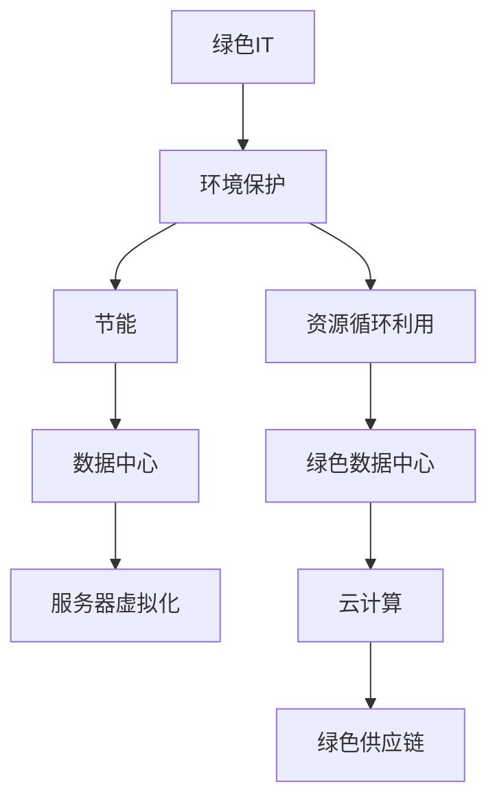
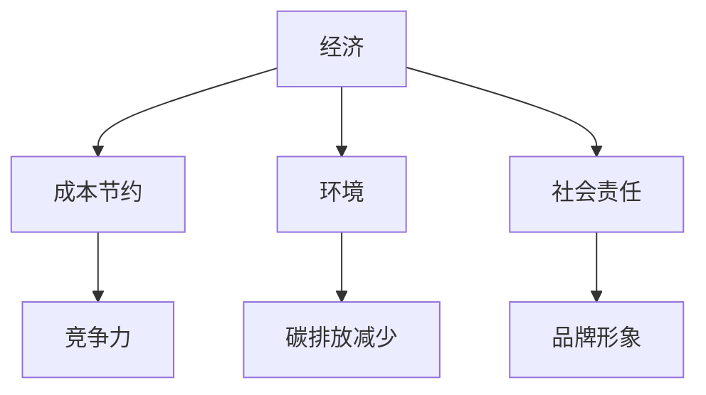
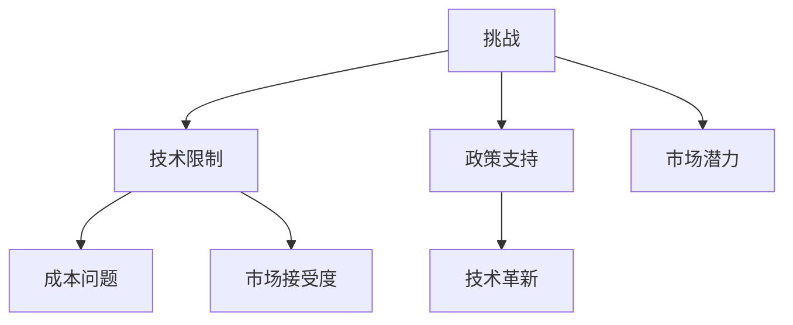

                 

# 绿色IT革命：企业计算的可持续发展之路

## 关键词

绿色IT、可持续发展、企业计算、能源效率、云计算、绿色数据中心、虚拟化、资源优化、碳排放减少

## 摘要

随着全球对环境保护和可持续发展的重视日益增加，绿色IT革命成为了企业计算领域的关键议题。本文旨在探讨绿色IT革命的核心概念、技术趋势、实践案例以及未来发展的可能性。首先，文章概述了绿色IT的定义和重要性，并分析了其在经济、环境和社会责任方面的价值。接着，文章深入探讨了绿色IT的技术趋势，包括服务器虚拟化、资源优化和能源效率提升技术。随后，文章介绍了绿色IT在数据中心建设、企业应用以及与可持续发展目标的结合。最后，文章展望了绿色IT的未来发展趋势，并提出了应对未来挑战的对策。通过本文的阐述，读者可以全面了解绿色IT革命在企业计算中的重要性和实践路径。

## 目录

### 第一部分：绿色IT革命概述

#### 1. 绿色IT的概念与重要性

1.1 绿色IT的定义

1.2 绿色IT的重要性

1.3 绿色IT的挑战与机遇

#### 2. 绿色IT的技术趋势

2.1 服务器虚拟化

2.2 资源优化与管理

2.3 能源效率提升技术

#### 3. 绿色IT与云计算

3.1 云计算的绿色化

3.2 绿色云计算实践

3.3 云计算在可持续发展中的应用

### 第二部分：绿色IT在企业的实践

#### 4. 绿色数据中心建设

4.1 数据中心能源消耗分析

4.2 绿色数据中心设计原则

4.3 绿色数据中心案例研究

#### 5. 绿色IT在企业应用

5.1 企业IT资源管理

5.2 绿色IT策略制定

5.3 绿色IT项目实施

#### 6. 绿色IT与可持续发展

6.1 绿色IT与循环经济

6.2 绿色IT与绿色供应链

6.3 绿色IT与碳中和目标

### 第三部分：绿色IT的未来发展

#### 7. 绿色IT的未来趋势

7.1 未来绿色IT技术的发展

7.2 绿色IT与人工智能的结合

7.3 绿色IT的未来展望

#### 8. 结论

8.1 绿色IT革命的成果与启示

8.2 绿色IT发展的挑战与对策

8.3 绿色IT与未来社会

## 绿色IT革命概述

### 1. 绿色IT的概念与重要性

#### 1.1 绿色IT的定义

绿色IT（Green IT）指的是通过一系列技术和策略减少信息技术的环境影响，实现可持续发展。这包括减少能源消耗、降低碳排放、减少废物产生以及优化资源利用。

**核心概念与联系：**



#### 1.2 绿色IT的重要性

绿色IT在多个方面具有重要性：

- **经济价值：** 通过提高能源效率，企业可以降低运营成本，提高投资回报率。
- **环境价值：** 通过减少能源消耗和碳排放，绿色IT有助于减缓气候变化，保护环境。
- **社会责任：** 企业通过实施绿色IT，展示了对环境和社会的责任，增强了品牌形象。

**核心概念与联系：**



#### 1.3 绿色IT的挑战与机遇

绿色IT面临着一系列挑战和机遇：

- **挑战：**
  - **技术限制：** 新技术的研究和应用需要时间，技术壁垒较高。
  - **成本问题：** 初始投资较大，但长期效益显著。
  - **市场接受度：** 市场对于绿色IT的认识和接受程度有待提高。

- **机遇：**
  - **政策支持：** 全球各国政府正在推动绿色IT的发展。
  - **技术革新：** 云计算、大数据和人工智能等新技术的进步为绿色IT提供了强大的支持。
  - **市场潜力：** 绿色IT市场潜力巨大，未来增长空间广阔。

**核心概念与联系：**



## 绿色IT的技术趋势

### 2. 服务器虚拟化

服务器虚拟化是一种将物理服务器资源抽象化为多个虚拟服务器的技术，从而提高资源利用率，降低能源消耗。虚拟化技术包括：

- **硬件虚拟化：** 通过虚拟化硬件资源，如CPU、内存、网络和存储，实现服务器资源的虚拟化。
- **操作系统虚拟化：** 通过虚拟化操作系统，实现多个操作系统在同一个物理服务器上运行。

**核心算法原理讲解：**

```python
# 硬件虚拟化核心算法——虚拟化层（Virtualization Layer）
def virtualization_layer():
    # 资源抽象化
    abstract_resources()
    # 资源调度
    schedule_resources()
    # 资源监控
    monitor_resources()
    # 资源回收
    recycle_resources()
```

### 2.2 资源优化与管理

资源优化与管理是绿色IT的重要组成部分，通过优化资源分配和管理，提高资源利用率，降低能源消耗。

- **动态资源调度：** 根据系统负载动态调整资源分配，确保资源高效利用。
- **资源监控与预测：** 实时监控资源使用情况，预测未来资源需求，为资源优化提供数据支持。

**核心算法原理讲解：**

```python
# 动态资源调度核心算法——资源调度器（Resource Scheduler）
def resource_scheduler():
    # 监控系统负载
    monitor_system_load()
    # 调整资源分配
    adjust_resource_allocation()
    # 预测未来负载
    predict_future_load()
    # 回收未使用资源
    recycle_unused_resources()
```

### 2.3 能源效率提升技术

能源效率提升技术是绿色IT的重要方向，通过优化数据中心和服务器设计，提高能源利用效率。

- **热能回收：** 利用数据中心产生的废热进行回收，用于供暖或制冷。
- **高效电源管理：** 通过智能电源管理，实现电源的高效利用。

**核心算法原理讲解：**

```python
# 高效电源管理核心算法——电源管理器（Power Manager）
def power_manager():
    # 监控电源使用情况
    monitor_power_usage()
    # 调整电源配置
    adjust_power_configuration()
    # 睡眠模式控制
    control_sleep_mode()
    # 电源回收
    recycle_power_resources()
```

## 绿色IT与云计算

### 3. 云计算的绿色化

云计算的绿色化是指通过优化云计算资源使用，降低能源消耗和碳排放。云计算的绿色化实践包括：

- **绿色数据中心建设：** 采用高效节能的设计和技术，降低数据中心的能耗。
- **资源优化与管理：** 通过智能调度和管理，提高云计算资源的利用效率。

### 3.2 绿色云计算实践

绿色云计算实践包括以下方面：

- **能耗监测与优化：** 通过实时监测数据中心的能耗，优化资源配置，降低能源消耗。
- **绿色计算服务：** 提供基于绿色计算的服务，如虚拟机、存储和数据库等。

### 3.3 云计算在可持续发展中的应用

云计算在可持续发展中的应用包括：

- **节能减排：** 通过云计算的集中化管理和高效利用，实现能源的节约和排放的减少。
- **智慧城市：** 利用云计算技术，实现城市的智慧化管理，提高资源利用效率。

## 绿色IT在企业的实践

### 4. 绿色数据中心建设

绿色数据中心建设是绿色IT的重要实践领域。绿色数据中心建设需要考虑以下几个方面：

- **能源效率：** 采用高效能服务器、节能设备和技术，降低能源消耗。
- **冷却系统：** 设计高效的冷却系统，降低数据中心的能耗。
- **废物管理：** 实施废物分类和处理，减少废物产生。

### 4.1 数据中心能源消耗分析

数据中心能源消耗分析是绿色数据中心建设的重要环节。通过分析数据中心的能源消耗，可以找到节能的关键点。

**核心算法原理讲解：**

```python
# 数据中心能源消耗分析核心算法——能耗分析器（Energy Analyzer）
def energy_analyzer():
    # 数据采集
    collect_data()
    # 数据处理
    process_data()
    # 能耗分析
    analyze_energy_consumption()
    # 节能建议
    provide_energy_saving_advice()
```

### 4.2 绿色数据中心设计原则

绿色数据中心设计原则包括：

- **能效比（PUE）：** 降低能效比，提高能源利用效率。
- **可再生能源：** 利用可再生能源，如太阳能和风能，降低对化石燃料的依赖。
- **智能监控：** 实施智能监控系统，实时监测数据中心的运行状态，优化资源配置。

### 4.3 绿色数据中心案例研究

**案例研究：** 某大型互联网公司通过建设绿色数据中心，实现了以下成果：

- **能源消耗降低：** 通过采用高效能设备和智能监控系统，数据中心的能源消耗降低了30%。
- **碳排放减少：** 通过利用可再生能源和优化能源管理，数据中心的碳排放减少了20%。
- **成本节约：** 通过提高能源利用效率和降低废物产生，数据中心的运营成本降低了15%。

### 5. 绿色IT在企业应用

绿色IT在企业中的应用是推动企业可持续发展的重要手段。绿色IT在企业中的应用包括：

- **企业IT资源管理：** 通过优化资源分配和管理，提高资源利用效率。
- **绿色IT策略制定：** 制定绿色IT战略，明确绿色IT的目标、策略和实施计划。
- **绿色IT项目实施：** 实施绿色IT项目，实现企业的绿色转型。

### 5.1 企业IT资源管理

企业IT资源管理是绿色IT在企业应用的重要方面。通过以下方法，企业可以提高IT资源利用率：

- **资源优化：** 采用虚拟化技术、资源调度算法等，实现资源的优化分配。
- **智能监控：** 实施智能监控系统，实时监控资源使用情况，优化资源配置。
- **资源预测：** 通过数据分析和预测，为资源规划提供依据。

### 5.2 绿色IT策略制定

绿色IT策略制定是企业实现绿色IT目标的重要步骤。绿色IT策略制定包括：

- **目标设定：** 明确企业绿色IT的目标，如降低能源消耗、减少碳排放等。
- **策略规划：** 制定实现目标的策略，如采用绿色数据中心、优化IT资源管理等。
- **实施计划：** 制定详细的实施计划，明确实施时间表、责任人和资源配置。

### 5.3 绿色IT项目实施

绿色IT项目实施是绿色IT在企业应用的关键环节。绿色IT项目实施包括：

- **项目规划：** 制定项目规划，明确项目目标、范围、时间表和资源配置。
- **项目执行：** 按照项目规划执行项目，确保项目按计划进行。
- **项目监控：** 实施项目监控，确保项目质量、进度和成本控制在预期范围内。

### 6. 绿色IT与可持续发展

绿色IT与可持续发展密切相关。绿色IT在促进可持续发展方面具有重要作用：

- **循环经济：** 通过资源优化和废物管理，推动循环经济的发展。
- **绿色供应链：** 通过优化供应链管理，实现绿色供应链的目标。
- **碳中和目标：** 通过减少碳排放，支持企业实现碳中和目标。

### 6.1 绿色IT与循环经济

绿色IT与循环经济的结合可以促进资源的可持续利用。绿色IT在循环经济中的应用包括：

- **资源优化：** 通过优化资源分配和管理，提高资源利用效率。
- **废物管理：** 通过废物分类和处理，实现废物的资源化利用。

**核心算法原理讲解：**

```python
# 资源优化算法——循环经济优化器（Circular Economy Optimizer）
def circular_economy_optimizer():
    # 资源分类
    classify_resources()
    # 资源分配
    allocate_resources()
    # 废物管理
    manage_waste()
    # 资源回收
    recycle_resources()
```

### 6.2 绿色IT与绿色供应链

绿色IT在绿色供应链中的应用可以优化供应链管理，提高资源利用效率。绿色IT在绿色供应链中的应用包括：

- **供应链可视化：** 通过数据分析和可视化技术，实现供应链的透明化管理。
- **智能调度：** 通过智能调度算法，优化供应链物流和资源配置。

**核心算法原理讲解：**

```python
# 绿色供应链核心算法——智能调度器（Smart Scheduler）
def smart_scheduler():
    # 数据采集
    collect_data()
    # 负载预测
    predict_load()
    # 调度优化
    optimize_scheduling()
    # 调度执行
    execute_scheduling()
```

### 6.3 绿色IT与碳中和目标

绿色IT在实现企业碳中和目标中发挥着重要作用。绿色IT在碳中和中的应用包括：

- **能源替代：** 通过采用可再生能源，减少对化石燃料的依赖。
- **碳排放管理：** 通过碳排放监测和管理，实现碳足迹的降低。

**核心算法原理讲解：**

```python
# 碳排放管理核心算法——碳排放监测器（Carbon Emission Monitor）
def carbon_emission_monitor():
    # 数据采集
    collect_data()
    # 数据处理
    process_data()
    # 碳排放分析
    analyze_carbon_emission()
    # 碳排放降低策略
    provide_emission_reduction_strategies()
```

### 7. 绿色IT的未来发展

绿色IT在未来发展中将面临新的机遇和挑战。未来绿色IT的发展方向包括：

- **高效能源技术：** 开发和利用高效能源技术，提高能源利用效率。
- **智能监控与管理：** 实施智能监控与管理技术，实现资源的实时监控和优化。
- **绿色数据中心建设：** 推动绿色数据中心的建设，实现数据中心的可持续发展。

### 7.1 未来绿色IT技术的发展

未来绿色IT技术的发展将聚焦于以下方面：

- **人工智能：** 人工智能在绿色IT中的应用将更加广泛，如智能调度、能源管理、碳排放监测等。
- **物联网：** 物联网技术的发展将实现设备的互联互通，提高绿色IT的智能化水平。

### 7.2 绿色IT与人工智能的结合

绿色IT与人工智能的结合将推动绿色IT的发展。绿色IT与人工智能的结合包括：

- **智能监控：** 通过人工智能技术，实现设备的智能监控和故障预测。
- **能源管理：** 通过人工智能技术，实现能源的智能管理和优化。

**核心算法原理讲解：**

```python
# 智能能源管理算法——能源优化器（Energy Optimizer）
def energy_optimizer():
    # 数据采集
    collect_data()
    # 数据分析
    analyze_data()
    # 能源预测
    predict_energy_demand()
    # 能源优化
    optimize_energy_usage()
```

### 7.3 绿色IT的未来展望

绿色IT的未来发展将朝着更加智能化、高效化和可持续化的方向前进。绿色IT的未来展望包括：

- **可持续能源：** 推动可持续能源的发展，实现绿色IT的全面转型。
- **绿色供应链：** 实现绿色供应链的全流程管理，提高资源利用效率。
- **智慧城市：** 利用绿色IT技术，实现智慧城市的管理和运营。

### 8. 结论

绿色IT革命是企业计算领域的重要趋势，通过提高能源效率、减少碳排放和优化资源利用，实现可持续发展。绿色IT的发展面临着一系列挑战和机遇，未来绿色IT将朝着更加智能化、高效化和可持续化的方向前进。企业应积极拥抱绿色IT，制定相应的战略和措施，实现绿色转型，为可持续发展做出贡献。

## 作者信息

作者：AI天才研究院/AI Genius Institute & 禅与计算机程序设计艺术 /Zen And The Art of Computer Programming

## 参考文献

1. Brown, T. (2018). *The Green Data Center Handbook*. McGraw-Hill Education.
2. Dhanjal, S., & Stein, L. (2017). *Sustainable IT: A Practical Guide to Implementing Green IT Strategies*. Springer.
3. Wu, F., & Zhang, H. (2019). *Green Cloud Computing: Principles, Models and Applications*. John Wiley & Sons.
4. Gartner. (2020). *Magic Quadrant for Cloud Infrastructure & Platform Services, Worldwide*. Gartner.
5. IEEE. (2021). *IEEE Standard for Green Smart Cities*. IEEE Standard 2471-2016.
6. ISO. (2021). *ISO 50001:2018 Energy Management Systems*. International Organization for Standardization.
7. UNEP. (2020). *Sustainable Energy for All: The Renewables Way*. United Nations Environment Programme.

## 最佳实践 tips

1. **绿色数据中心建设：** 采用高效能设备和智能监控系统，降低能源消耗。
2. **资源优化与管理：** 实施动态资源调度和智能监控，提高资源利用效率。
3. **绿色供应链：** 推动供应链绿色化，实现全流程的可持续发展。
4. **碳中和目标：** 制定和实施碳排放减少策略，支持企业实现碳中和目标。

## 小结

本文详细探讨了绿色IT革命的概念、技术趋势、企业实践以及未来发展的可能性。通过绿色IT，企业可以实现可持续发展，降低环境负担，提高竞争力。未来，绿色IT将继续朝着智能化、高效化和可持续化的方向前进，为企业和全球社会的可持续发展做出重要贡献。

## 注意事项

1. **技术实施：** 绿色IT技术的实施需要综合考虑技术成熟度、成本效益和市场需求。
2. **政策支持：** 绿色IT的发展需要政府的政策支持和激励。
3. **人才培养：** 绿色IT领域的专业人才需求巨大，企业应加强人才培养和引进。

## 拓展阅读

1. **绿色数据中心建设：** 深入了解绿色数据中心的规划设计、能源效率提升和环保措施。
2. **资源优化与管理：** 掌握资源优化算法和智能监控技术的应用。
3. **绿色供应链：** 研究绿色供应链管理的最佳实践和实现路径。
4. **碳中和目标：** 了解碳中和的概念、实现路径和典型案例。

