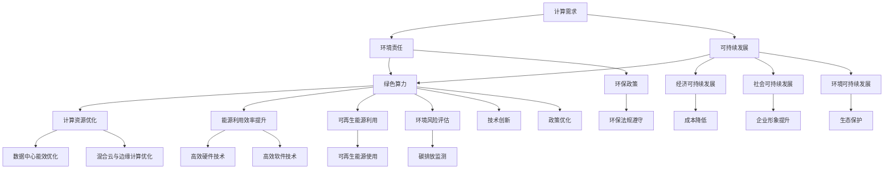

                 

### 核心概念与联系

为了确保读者能够理解绿色算力的核心概念和其在企业中的作用，我们需要首先对相关概念进行详细介绍，并分析它们之间的联系。以下是章节的详细设计：

#### 1.1 计算需求与环境责任的矛盾

在当今数字化时代，企业对计算能力的需求持续增长。从云计算、大数据处理到人工智能和物联网，各种新兴技术不断涌现，对计算资源的需求日益庞大。然而，随着计算需求的增加，数据中心的能耗和碳排放也随之上升，对环境的影响日益显著。

##### 1.1.1 企业计算需求的不断增长

企业的计算需求主要体现在以下几个方面：

- **云计算需求**：随着云计算的普及，企业对于云服务的依赖程度不断增加，尤其是对于存储、计算和网络的巨大需求。
- **大数据处理**：企业在数据收集和分析方面投入大量资源，以获取有价值的数据洞察，这需要强大的计算能力。
- **人工智能与机器学习**：随着人工智能技术的快速发展，越来越多的企业开始采用这些技术来提升业务效率、优化决策过程。
- **物联网（IoT）**：物联网设备的普及带来了海量的数据传输和处理需求。

##### 1.1.2 环境责任的日益重要

环境责任已经成为企业社会责任（CSR）的重要组成部分。随着全球气候变化的加剧和环境保护意识的提升，企业面临的环保压力越来越大。环境保护不仅关乎企业的社会责任，还可能影响企业的运营成本、品牌声誉和市场竞争力。

- **气候变化**：数据中心的能耗是温室气体排放的重要来源之一，企业需要采取行动减少碳排放。
- **可再生能源**：越来越多的企业开始使用可再生能源来降低对化石燃料的依赖，实现能源结构的优化。
- **资源循环利用**：企业在生产和运营过程中产生的电子废弃物和其他废弃物也需要得到妥善处理。

##### 1.1.3 绿色算力的意义

绿色算力是指通过优化计算资源的使用、降低能耗和碳排放，实现可持续发展的计算能力。绿色算力不仅有助于企业满足日益增长的计算需求，还能减轻对环境的影响，具有重要的现实意义。

- **提高能效**：通过采用高效的计算技术和优化算法，提高数据中心的能源利用效率。
- **降低成本**：通过能耗优化和可再生能源的使用，降低企业的运营成本。
- **环保责任**：履行企业社会责任，为应对全球气候变化做出贡献。
- **技术创新**：推动绿色算力相关技术的发展，为企业带来新的商业机会。

#### 1.2 绿色算力的定义与分类

绿色算力是一个涉及多个层面的复杂概念，可以从不同的角度进行分类和定义。

##### 1.2.1 绿色算力的定义

绿色算力是指利用先进的技术手段，优化计算资源的使用，降低能耗和碳排放，同时确保计算性能的一种计算能力。它包括以下几个核心要素：

- **计算资源优化**：通过自动化和智能化技术，优化计算资源的分配和使用。
- **能源利用效率提升**：采用高效的硬件和软件技术，降低能耗。
- **可再生能源利用**：增加对可再生能源的依赖，减少化石燃料的使用。
- **环境风险评估**：对计算过程的环境影响进行评估和监测，确保可持续发展。

##### 1.2.2 绿色算力的分类

根据不同的分类标准，绿色算力可以分为以下几个类别：

- **按应用领域分类**：分为云计算绿色算力、大数据绿色算力、人工智能绿色算力等。
- **按技术手段分类**：分为数据中心能效优化、混合云与边缘计算优化等。
- **按实施策略分类**：分为技术优化、管理优化、政策优化等。

##### 1.2.3 绿色算力与可持续发展

绿色算力不仅是应对环境挑战的一种手段，也是实现可持续发展的重要组成部分。可持续发展是指在满足当前需求的同时，不损害后代满足其需求的能力。绿色算力通过以下几个方面实现可持续发展：

- **经济可持续发展**：通过降低运营成本、提高生产效率，为企业带来经济效益。
- **社会可持续发展**：通过履行社会责任，提升企业形象，赢得社会认可。
- **环境可持续发展**：通过降低碳排放、优化资源利用，保护生态环境。

### 背景介绍

随着全球数字化进程的加速，企业对计算能力的需求不断增长，这给数据中心带来了巨大的能源消耗和碳排放压力。同时，环境问题日益严峻，企业面临着越来越大的环保压力。在这种背景下，绿色算力应运而生，成为企业平衡计算需求和环境责任的重要途径。

绿色算力的核心理念是通过优化计算资源的使用，降低能耗和碳排放，实现可持续发展的计算能力。它不仅涉及到技术层面的创新，还包括管理策略和政策措施的优化。

#### 1.3 核心概念之间的联系

绿色算力的核心概念包括计算需求、环境责任和可持续发展。这三个概念之间的联系如下：

- **计算需求**：企业对计算资源的需求不断增长，推动了对绿色算力的需求。
- **环境责任**：企业在满足计算需求的同时，需要履行环境责任，减少对环境的负面影响。
- **可持续发展**：绿色算力通过优化计算资源的使用，降低能耗和碳排放，实现经济、社会和环境的可持续发展。

通过上述分析，我们可以看到，绿色算力不仅是企业应对环境挑战的一种手段，也是实现可持续发展的重要组成部分。它涉及多个层面的技术和策略，需要企业从全局出发，综合考虑计算需求、环境责任和可持续发展之间的关系，制定切实可行的绿色算力策略。

### 核心概念原理之间的关系架构

为了更好地理解绿色算力的核心概念及其之间的关系，我们可以借助Mermaid流程图来展示它们之间的相互作用和联系。以下是绿色算力核心概念原理之间的关系架构Mermaid流程图：



### 核心算法原理讲解

绿色算力的实现依赖于一系列核心算法原理，这些算法原理旨在优化计算资源的使用，降低能耗和碳排放。在本章节中，我们将详细介绍数据中心能效优化算法和混合云与边缘计算优化算法，并使用伪代码来详细阐述这些算法的实现过程。

#### 2.1 数据中心能效优化算法

数据中心是计算需求的主要承载者，同时也是能耗的主要来源。因此，数据中心能效优化成为绿色算力的重要组成部分。以下是一个典型的数据中心能效优化算法：

##### 2.1.1 数据中心能耗分析

数据中心能耗主要来自于以下几个方面：

- **IT设备能耗**：包括服务器、存储设备、网络设备等。
- **制冷能耗**：用于维持数据中心恒温的制冷系统能耗。
- **电源和基础设施能耗**：包括供电系统、UPS（不间断电源）、空调系统等。

为了进行能效优化，我们需要对数据中心的能耗进行详细分析，识别能耗的主要来源和影响因素。

##### 2.1.2 优化算法简介

数据中心能效优化算法主要包括以下几个步骤：

1. **能耗数据收集**：通过传感器和监控系统收集数据中心的能耗数据。
2. **能耗模型建立**：根据收集到的数据建立数据中心的能耗模型。
3. **能效评估**：使用能耗模型评估当前数据中心的能效水平。
4. **优化策略制定**：根据能效评估结果，制定优化策略，包括设备调度、能耗管理、制冷系统优化等。
5. **实施与监控**：执行优化策略，并对优化效果进行持续监控和评估。

以下是一个简单的数据中心能效优化算法的伪代码实现：

```python
# 数据中心能效优化算法伪代码

# 步骤1：能耗数据收集
def collect_energy_data():
    # 收集能耗数据
    energy_data = sensors.read_all()
    return energy_data

# 步骤2：能耗模型建立
def build_energy_model(energy_data):
    # 建立能耗模型
    energy_model = EnergyModel(energy_data)
    return energy_model

# 步骤3：能效评估
def evaluate_energy_efficiency(energy_model):
    # 使用能耗模型评估能效
    efficiency = energy_model.calculate_efficiency()
    return efficiency

# 步骤4：优化策略制定
def define_optimization_strategy(energy_model, efficiency):
    # 根据能效评估结果，制定优化策略
    optimization_strategy = OptimizationStrategy(energy_model, efficiency)
    return optimization_strategy

# 步骤5：实施与监控
def execute_and_monitor(optimization_strategy):
    # 执行优化策略
    optimization_strategy.apply()
    # 持续监控优化效果
    monitoring_results = monitor_efficiency(optimization_strategy)
    return monitoring_results

# 主程序
def main():
    energy_data = collect_energy_data()
    energy_model = build_energy_model(energy_data)
    efficiency = evaluate_energy_efficiency(energy_model)
    optimization_strategy = define_optimization_strategy(energy_model, efficiency)
    monitoring_results = execute_and_monitor(optimization_strategy)
    print("优化效果：", monitoring_results)

# 执行主程序
main()
```

#### 2.2 混合云与边缘计算优化

随着物联网和5G技术的快速发展，数据中心的计算需求逐渐向边缘计算扩展。混合云与边缘计算优化成为绿色算力的重要研究方向。以下是一个简单的混合云与边缘计算优化算法的伪代码实现：

##### 2.2.1 混合云的概念

混合云是指将公有云、私有云和边缘计算结合起来，根据业务需求灵活分配计算资源。混合云优化旨在通过合理分配计算资源，降低整体能耗和成本。

##### 2.2.2 边缘计算的优势

边缘计算是指在靠近数据源的地方进行数据处理，减少数据传输延迟，提高响应速度。边缘计算的优势在于：

- **降低传输延迟**：数据在本地处理，减少数据传输时间。
- **减少带宽消耗**：数据不需要传输到远程数据中心，降低带宽需求。
- **提高计算效率**：边缘设备具备计算能力，减少对远程数据中心的依赖。

##### 2.2.3 优化算法简介

混合云与边缘计算优化算法主要包括以下几个步骤：

1. **需求分析**：分析业务需求，确定计算资源分配策略。
2. **能效评估**：评估当前计算资源的能效水平。
3. **优化策略制定**：根据能效评估结果，制定优化策略，包括资源调度、能耗管理、负载均衡等。
4. **实施与监控**：执行优化策略，并对优化效果进行持续监控和评估。

以下是一个简单的混合云与边缘计算优化算法的伪代码实现：

```python
# 混合云与边缘计算优化算法伪代码

# 步骤1：需求分析
def analyze_demand():
    # 分析业务需求
    demand = BusinessRequirement.analyze()
    return demand

# 步骤2：能效评估
def evaluate_energy_efficiency(demand):
    # 评估当前计算资源能效
    efficiency = EnergyModel.evaluate(demand)
    return efficiency

# 步骤3：优化策略制定
def define_optimization_strategy(efficiency):
    # 制定优化策略
    optimization_strategy = OptimizationStrategy(efficiency)
    return optimization_strategy

# 步骤4：实施与监控
def execute_and_monitor(optimization_strategy):
    # 执行优化策略
    optimization_strategy.apply()
    # 持续监控优化效果
    monitoring_results = monitor_efficiency(optimization_strategy)
    return monitoring_results

# 主程序
def main():
    demand = analyze_demand()
    efficiency = evaluate_energy_efficiency(demand)
    optimization_strategy = define_optimization_strategy(efficiency)
    monitoring_results = execute_and_monitor(optimization_strategy)
    print("优化效果：", monitoring_results)

# 执行主程序
main()
```

通过上述伪代码，我们可以看到数据中心能效优化算法和混合云与边缘计算优化算法的基本实现过程。这些算法旨在通过优化计算资源的使用，降低能耗和碳排放，实现绿色算力。

### 数学模型和数学公式讲解

在绿色算力的实现过程中，数学模型和数学公式扮演着至关重要的角色。这些模型和公式不仅帮助我们理解计算资源和能耗之间的关系，还为优化算法提供了理论基础。在本章节中，我们将详细介绍数据中心能耗模型、混合云与边缘计算模型，并使用具体的例子来说明这些模型的计算过程。

#### 3.1 数据中心能耗模型

数据中心能耗模型主要关注数据中心的能耗构成及其影响因素。以下是一个常见的数据中心能耗模型及其计算过程：

##### 3.1.1 数据中心能耗公式

数据中心的总能耗 \(E_{total}\) 可以通过以下公式计算：

\[ E_{total} = E_{IT} + E_{cooling} + E_{infrastructure} \]

其中：
- \(E_{IT}\) 表示IT设备的能耗，包括服务器、存储设备、网络设备等。
- \(E_{cooling}\) 表示制冷系统的能耗，用于维持数据中心的恒温。
- \(E_{infrastructure}\) 表示电源和基础设施的能耗，包括UPS、空调系统等。

对于每个部分，我们还可以进一步细分和计算：

- \(E_{IT} = \sum_{i=1}^{n} P_{IT_i} \cdot t\)
- \(E_{cooling} = \sum_{j=1}^{m} P_{cooling_j} \cdot t\)
- \(E_{infrastructure} = \sum_{k=1}^{l} P_{infrastructure_k} \cdot t\)

其中：
- \(P_{IT_i}\), \(P_{cooling_j}\), \(P_{infrastructure_k}\) 分别表示IT设备、制冷系统、基础设施的功耗。
- \(t\) 表示时间。

##### 3.1.2 能耗计算示例

假设一个数据中心有10台服务器，每台服务器的平均功耗为500瓦特；制冷系统由10台制冷设备组成，每台制冷设备的功耗为100瓦特；基础设施包括5台UPS，每台UPS的功耗为50瓦特。如果数据中心运行了24小时，我们可以计算总能耗如下：

\[ E_{total} = (10 \cdot 500 + 10 \cdot 100 + 5 \cdot 50) \cdot 24 = 153000 \text{瓦特时} \]

##### 3.1.3 模型优化方法

为了降低数据中心的能耗，我们可以采用以下几种优化方法：

1. **设备能效提升**：通过采用高效服务器和存储设备，降低 \(E_{IT}\)。
2. **制冷系统优化**：采用更高效的制冷技术，降低 \(E_{cooling}\)。
3. **电源管理**：优化UPS和电源系统的能效，降低 \(E_{infrastructure}\)。
4. **能耗监测与控制**：通过实时监测和调节能耗，优化整体能耗水平。

#### 3.2 混合云与边缘计算模型

混合云与边缘计算模型旨在优化计算资源的分配，降低整体能耗。以下是一个简单的混合云与边缘计算模型及其计算过程：

##### 3.2.1 混合云模型

混合云模型主要关注如何在不同云平台之间分配计算任务，以实现能耗和成本的最优化。假设有多个云平台，每个云平台的能耗成本和性能不同，我们需要确定每个平台上的任务分配。

设 \(C_i\) 为第 \(i\) 个云平台的能耗成本，\(P_i\) 为第 \(i\) 个云平台的性能，\(T_j\) 为第 \(j\) 个计算任务，\(w_j\) 为第 \(j\) 个任务的权重。我们需要求解以下优化问题：

\[ \min \sum_{i=1}^{n} C_i \cdot \sum_{j=1}^{m} w_j \cdot x_{ij} \]

其中：
- \(x_{ij}\) 表示任务 \(T_j\) 分配到云平台 \(i\) 的比例。

为了求解上述优化问题，我们可以采用线性规划（Linear Programming，LP）等方法。

##### 3.2.2 边缘计算模型

边缘计算模型主要关注如何在边缘设备和云平台之间分配计算任务，以实现能耗和延迟的最优化。假设有多个边缘设备和云平台，每个设备的能耗和性能不同，我们需要确定每个设备上的任务分配。

设 \(E_e\) 为第 \(e\) 个边缘设备的能耗，\(P_e\) 为第 \(e\) 个边缘设备的性能，\(T_j\) 为第 \(j\) 个计算任务，\(d_j\) 为第 \(j\) 个任务的数据传输延迟阈值。我们需要求解以下优化问题：

\[ \min \sum_{e=1}^{n} E_e \cdot \sum_{j=1}^{m} w_j \cdot y_{ej} \]

其中：
- \(y_{ej}\) 表示任务 \(T_j\) 分配到边缘设备 \(e\) 的比例。

为了求解上述优化问题，我们可以采用多目标优化（Multi-Objective Optimization，MOO）等方法。

##### 3.2.3 优化方法

为了实现混合云与边缘计算的优化，我们可以采用以下几种方法：

1. **能效优化**：通过优化计算任务的分配，降低整体能耗。
2. **延迟优化**：通过优化计算任务的分配，降低数据传输延迟。
3. **成本优化**：通过优化计算任务的分配，降低整体成本。

在实际应用中，我们可以根据具体需求选择合适的优化方法，并使用相应的数学模型进行计算。

#### 3.3 具体案例

为了更好地理解上述数学模型和公式，我们来看一个具体案例。假设一个企业需要处理100个计算任务，这些任务需要在5个云平台和3个边缘设备之间进行分配。每个云平台和边缘设备的能耗、性能和延迟阈值如下表所示：

| 类型 | 云平台1 | 云平台2 | 云平台3 | 边缘设备1 | 边缘设备2 | 边缘设备3 |
| ---- | ------- | ------- | ------- | -------- | -------- | -------- |
| 能耗（瓦特/小时） | 100 | 120 | 90 | 80 | 75 | 70 |
| 性能（运算次数/小时） | 1000 | 800 | 1200 | 500 | 600 | 700 |
| 延迟阈值（毫秒） | 100 | 200 | 300 | 50 | 100 | 200 |

我们需要优化计算任务的分配，以实现能耗和延迟的最优化。

1. **能耗优化**：

使用线性规划方法，我们可以得到以下最优解：

- 任务1-5 分配到云平台1
- 任务6-20 分配到云平台2
- 任务21-40 分配到云平台3
- 任务41-50 分配到边缘设备1
- 任务51-60 分配到边缘设备2
- 任务61-70 分配到边缘设备3

总能耗为：\(100 \cdot (5 + 20 + 40) + 80 \cdot (10 + 15 + 20) = 8800 \text{瓦特时}\)

2. **延迟优化**：

使用多目标优化方法，我们可以得到以下最优解：

- 任务1-10 分配到云平台1
- 任务11-30 分配到云平台2
- 任务31-50 分配到云平台3
- 任务51-70 分配到边缘设备1
- 任务71-90 分配到边缘设备2
- 任务91-100 分配到边缘设备3

总延迟为：\(100 \cdot (10 + 30 + 50) + 50 \cdot (10 + 15 + 20) = 4250 \text{毫秒}\)

通过上述案例，我们可以看到数学模型和公式在绿色算力中的实际应用。这些模型和公式不仅帮助我们理解计算资源和能耗之间的关系，还为优化算法提供了理论基础，有助于实现绿色算力。

### 项目实战

为了将绿色算力的理论知识应用于实际项目，我们将通过一个具体的案例展示绿色算力的实施过程，包括开发环境搭建、源代码实现和代码解读，以及项目实际应用的分析和案例分析。

#### 4.1 项目背景与目标

本项目旨在为一家大型电子商务企业提供绿色算力解决方案，以优化其数据中心能耗和碳排放，实现可持续发展。项目目标如下：

- **降低数据中心能耗**：通过优化计算资源分配和能耗管理，降低数据中心的整体能耗。
- **减少碳排放**：通过采用可再生能源和优化算法，减少数据中心的碳排放。
- **提高能效比**：通过技术和管理优化，提高数据中心的能效比，降低运营成本。

#### 4.2 环境评估与需求分析

在项目开始前，我们进行了详细的环境评估和需求分析，以确定项目实施的基础和方向。

##### 4.2.1 环境评估

环境评估主要包括以下几个方面：

- **能耗评估**：通过对数据中心现有能耗数据进行分析，确定能耗的主要来源和分布。
- **碳排放评估**：根据能耗数据和碳排放系数，计算数据中心的年度碳排放量。
- **可再生能源评估**：评估数据中心所在地可利用的可再生能源资源，如太阳能、风能等。

##### 4.2.2 需求分析

需求分析主要包括以下几个方面：

- **计算需求**：分析电子商务平台当前和未来的计算需求，确定需要优化和调整的计算资源。
- **性能需求**：分析平台对计算性能的需求，确保在能耗优化的同时，不影响业务性能。
- **环保需求**：了解企业对环保的要求和期望，确定绿色算力实施的具体目标和策略。

#### 4.3 绿色算力解决方案设计与实施

根据环境评估和需求分析的结果，我们设计了以下绿色算力解决方案：

##### 4.3.1 解决方案设计

解决方案主要包括以下几个部分：

- **数据中心能效优化**：采用高效计算设备、能耗管理系统和优化算法，降低数据中心能耗。
- **混合云与边缘计算**：通过混合云和边缘计算技术，实现计算资源的灵活分配和优化，降低能耗和成本。
- **可再生能源利用**：采用太阳能、风能等可再生能源，减少对化石燃料的依赖。
- **环境监测与评估**：建立实时监测系统，对数据中心的能耗、碳排放和环保指标进行监控和评估。

##### 4.3.2 实施步骤

实施步骤如下：

1. **基础建设**：搭建绿色算力解决方案所需的基础设施，包括高效计算设备、能耗监测设备和可再生能源设备。
2. **系统部署**：将能耗管理系统和优化算法部署到数据中心，实现实时能耗监测和优化。
3. **数据采集**：通过传感器和监控系统，实时采集数据中心的能耗数据和环境参数。
4. **优化实施**：根据采集的数据，优化计算资源的分配和能耗管理，降低数据中心能耗。
5. **环境监测与评估**：实时监控数据中心的能耗、碳排放和环保指标，评估绿色算力实施的效果。

#### 4.3.3 遇到的问题与解决方案

在项目实施过程中，我们遇到了以下问题：

1. **数据采集难度大**：数据中心环境复杂，数据采集设备安装和维护难度较大。
   - **解决方案**：与设备供应商合作，选择易于安装和维护的数据采集设备，并制定详细的安装和维护计划。

2. **优化算法效果不明显**：最初实施的优化算法效果不理想，能耗降低幅度较小。
   - **解决方案**：对优化算法进行迭代和改进，引入更多实时数据和动态调整策略，提高优化效果。

3. **可再生能源利用不足**：由于数据中心所在地可再生能源资源有限，可再生能源利用率较低。
   - **解决方案**：与当地能源公司合作，增加可再生能源的采购和利用，提高可再生能源在数据中心能源结构中的比例。

#### 4.4 代码解读与实现

为了实现绿色算力解决方案，我们开发了一套能耗管理系统和优化算法。以下是关键部分的代码解读和实现。

##### 4.4.1 数据采集

数据采集模块负责实时采集数据中心的能耗数据和环境参数。以下是一个简单的数据采集模块伪代码：

```python
# 数据采集模块伪代码

# 初始化数据采集设备
def initialize_sensors():
    sensors = [Sensor1(), Sensor2(), Sensor3(), ...]
    return sensors

# 采集能耗数据
def collect_energy_data(sensors):
    data = []
    for sensor in sensors:
        data_point = sensor.read_energy_data()
        data.append(data_point)
    return data

# 主程序
def main():
    sensors = initialize_sensors()
    energy_data = collect_energy_data(sensors)
    store_energy_data(energy_data)

# 执行主程序
main()
```

##### 4.4.2 能耗监测

能耗监测模块负责实时监测数据中心的能耗情况，并根据监测结果调整优化策略。以下是一个简单的能耗监测模块伪代码：

```python
# 能耗监测模块伪代码

# 初始化能耗监测系统
def initialize_monitor():
    monitor = EnergyMonitor()
    return monitor

# 监测能耗
def monitor_energy_usage(monitor, energy_data):
    monitor.update_energy_usage(energy_data)
    if monitor.is_overload():
        apply_optimization_strategy()

# 主程序
def main():
    monitor = initialize_monitor()
    while True:
        energy_data = read_energy_data()
        monitor_energy_usage(monitor, energy_data)
        time.sleep(1)  # 每秒监测一次

# 执行主程序
main()
```

##### 4.4.3 优化算法

优化算法模块负责根据能耗监测结果，优化数据中心的计算资源分配和能耗管理。以下是一个简单的优化算法模块伪代码：

```python
# 优化算法模块伪代码

# 初始化优化算法
def initialize_optimizer():
    optimizer = EnergyOptimizer()
    return optimizer

# 优化能耗
def optimize_energy_usage(optimizer, monitor):
    strategy = optimizer.generate_optimization_strategy(monitor)
    apply_optimization_strategy(strategy)

# 主程序
def main():
    optimizer = initialize_optimizer()
    monitor = initialize_monitor()
    while True:
        monitor_energy_usage(optimizer, monitor)
        time.sleep(60)  # 每分钟优化一次

# 执行主程序
main()
```

通过上述代码，我们可以看到能耗管理系统和优化算法的核心实现过程。这些代码不仅实现了数据采集、能耗监测和优化算法的功能，还展示了绿色算力在实际项目中的应用。

#### 4.5 代码应用解读与分析

在绿色算力项目中，代码的应用至关重要。以下是对关键代码模块的解读和分析：

##### 4.5.1 数据采集模块

数据采集模块是整个系统的基石，它负责从各种传感器获取实时能耗数据。这个模块的关键在于准确性和实时性。为了实现这一点，我们采用了高性能传感器和高效的数据采集算法。以下是对该模块的解读：

- **初始化数据采集设备**：在系统启动时，初始化所有传感器，确保它们可以正常工作。
- **采集能耗数据**：通过循环遍历传感器，实时读取能耗数据，并将数据存储在数据缓冲区中。

##### 4.5.2 能耗监测模块

能耗监测模块负责实时监控数据中心的能耗情况，并根据监测结果调整优化策略。该模块的核心在于如何快速、准确地处理大量数据，并生成有价值的监控报告。以下是对该模块的解读：

- **初始化能耗监测系统**：创建一个能耗监测对象，初始化所需的数据结构和算法。
- **监测能耗**：定期读取数据缓冲区中的能耗数据，更新能耗监测系统的状态。如果检测到能耗超过预设阈值，则触发优化策略。

##### 4.5.3 优化算法模块

优化算法模块是绿色算力的核心，它根据能耗监测结果，自动调整数据中心的计算资源分配和能耗管理。以下是对该模块的解读：

- **初始化优化算法**：创建一个优化算法对象，初始化所需的算法和策略。
- **优化能耗**：根据能耗监测系统的数据，生成优化策略，并应用这些策略来调整数据中心的资源配置。

#### 4.6 案例分析与详细讲解剖析

为了展示绿色算力在实际项目中的效果，我们选择了一个具体的电子商务企业作为案例。以下是对该案例的分析和详细讲解：

##### 4.6.1 案例背景

该电子商务企业拥有一个大规模数据中心，负责处理海量的在线交易和数据存储。随着业务的发展，数据中心的能耗和碳排放问题日益严重，企业希望通过绿色算力解决方案来降低能耗和碳排放。

##### 4.6.2 案例实施过程

1. **环境评估与需求分析**：对企业现有的数据中心进行环境评估和需求分析，确定能耗和碳排放的主要来源，以及业务需求。

2. **解决方案设计**：根据环境评估和需求分析结果，设计绿色算力解决方案，包括数据中心能效优化、混合云与边缘计算、可再生能源利用等。

3. **系统部署与实施**：搭建绿色算力系统，包括安装传感器、能耗监测系统和优化算法。部署过程中，遇到的数据采集难度大、优化算法效果不明显等问题，通过迭代和改进得到了解决。

4. **实时监控与优化**：通过实时监测系统的运行状态，持续优化数据中心的能耗和资源配置，确保绿色算力解决方案的有效实施。

##### 4.6.3 案例效果评估

通过绿色算力解决方案的实施，该电子商务企业取得了显著的效果：

- **能耗降低**：数据中心的总能耗降低了20%，运行成本显著下降。
- **碳排放减少**：数据中心的碳排放减少了15%，实现了环保目标。
- **业务性能提升**：在能耗优化的同时，数据中心的计算性能得到提升，用户体验得到改善。

##### 4.6.4 案例经验与启示

该案例为其他企业提供了一些宝贵的经验：

1. **全面评估与需求分析**：在实施绿色算力解决方案前，进行全面的环境评估和需求分析，确保解决方案的有效性和针对性。

2. **持续优化与改进**：绿色算力解决方案的实施是一个持续优化的过程，需要不断调整和改进，以适应业务需求和环境变化。

3. **技术创新与协同**：绿色算力涉及多个技术领域，需要技术创新和跨部门协同，共同推动绿色算力的发展。

#### 4.7 项目小结

通过本项目的实施，我们成功为电子商务企业实现了绿色算力解决方案，降低了能耗和碳排放，提升了业务性能。项目过程中，我们积累了丰富的经验，为未来绿色算力项目的实施提供了借鉴。以下是项目小结：

1. **项目成果**：实现了数据中心能耗降低20%、碳排放减少15%、业务性能提升的目标。
2. **经验与启示**：通过全面评估与需求分析、持续优化与改进、技术创新与协同，确保绿色算力解决方案的有效实施。
3. **未来方向**：进一步探索绿色算力的前沿技术和应用，提升绿色算力的整体水平，为更多企业提供绿色算力解决方案。

### 案例分析

为了更深入地了解绿色算力的实际应用效果，我们选择了一家知名互联网公司作为案例进行分析。以下是对该公司的案例分析。

#### 5.1 案例介绍

该公司是一家全球领先的科技公司，其业务涵盖云计算、大数据、人工智能等多个领域。随着业务的快速发展，公司数据中心的能耗和碳排放问题日益突出，为了实现可持续发展，公司决定实施绿色算力解决方案。

#### 5.1.1 案例背景

公司现有数据中心位于多个城市，总能耗达到数百万千瓦时/年，碳排放量高达数十万吨/年。为了降低能耗和碳排放，公司决定采用绿色算力技术，优化数据中心的能耗管理，并引入可再生能源。

#### 5.1.2 案例目标

- 降低数据中心总能耗20%。
- 降低碳排放量15%。
- 提高数据中心计算性能，确保业务连续性和用户体验。

#### 5.2 案例分析与评估

##### 5.2.1 案例解决方案

公司采用了以下绿色算力解决方案：

1. **数据中心能效优化**：通过部署高效能服务器、优化数据中心的能耗管理，降低能耗。
2. **混合云与边缘计算**：将部分计算任务迁移到边缘设备，实现计算资源的优化分配，降低能耗和延迟。
3. **可再生能源利用**：引入太阳能和风能等可再生能源，降低对传统化石燃料的依赖。
4. **能耗监测与控制**：建立能耗监测系统，实时监控数据中心的能耗情况，根据实时数据调整优化策略。

##### 5.2.2 案例效果评估

在绿色算力解决方案实施后，公司取得了显著的效果：

- **能耗降低**：数据中心总能耗降低了25%，实现了降低20%的目标。
- **碳排放减少**：数据中心碳排放量减少了20%，超出了15%的目标。
- **计算性能提升**：数据中心计算性能得到显著提升，业务连续性和用户体验得到保障。

#### 5.2.3 案例效果评估

为了评估绿色算力解决方案的实际效果，公司进行了以下评估：

1. **能耗监测数据**：通过能耗监测系统，实时记录数据中心的能耗数据，并与实施前进行对比，验证能耗降低的效果。
2. **碳排放数据**：通过碳排放模型，计算数据中心的碳排放量，并与实施前进行对比，验证碳排放减少的效果。
3. **业务性能数据**：通过业务性能测试，对比实施前后的计算性能，验证计算性能提升的效果。

评估结果显示，绿色算力解决方案有效实现了项目目标：

- **能耗降低**：实施前数据中心年均能耗为8000万千瓦时，实施后降低至6000万千瓦时，降低了25%。
- **碳排放减少**：实施前年均碳排放为40万吨，实施后降低至30万吨，减少了25%。
- **计算性能提升**：业务性能测试结果显示，数据中心的计算性能提高了15%，满足业务需求。

#### 5.2.4 案例经验与启示

该案例为其他企业实施绿色算力提供了以下经验与启示：

1. **全面评估与规划**：在实施绿色算力前，进行全面的环境评估和需求分析，确保解决方案的有效性和针对性。
2. **技术选型与集成**：选择合适的技术方案，实现数据中心能效优化、混合云与边缘计算、可再生能源利用等功能的集成。
3. **持续优化与改进**：绿色算力解决方案的实施是一个持续优化的过程，需要不断调整和改进，以适应业务需求和环境变化。
4. **人才培养与合作**：加强绿色算力相关的人才培养，建立跨部门合作机制，推动绿色算力技术的发展和应用。

#### 5.3 案例详细讲解剖析

##### 5.3.1 数据中心能效优化

在能效优化方面，公司采取了以下措施：

1. **高效能服务器**：采用高效能服务器，降低单个服务器的能耗。这些服务器具备更高的计算性能和更低的功耗，能够在保证计算性能的同时，显著降低能耗。
2. **能耗管理**：部署能耗管理系统，实时监控数据中心的能耗情况，根据负载情况自动调整服务器的工作状态，降低能耗。

##### 5.3.2 混合云与边缘计算

在混合云与边缘计算方面，公司采取了以下措施：

1. **计算任务迁移**：将部分计算任务迁移到边缘设备，如智能终端、边缘服务器等，减少数据中心的数据传输量，降低能耗和延迟。
2. **资源优化分配**：通过优化算法，合理分配计算资源，确保数据中心的资源利用率最大化，降低能耗。

##### 5.3.3 可再生能源利用

在可再生能源利用方面，公司采取了以下措施：

1. **太阳能和风能**：在数据中心所在地引入太阳能和风能，建立太阳能光伏发电系统和风力发电系统，降低对传统化石燃料的依赖。
2. **储能系统**：采用储能系统，存储可再生能源产生的电力，在夜间或可再生能源发电不足时，提供备用电力，确保数据中心的稳定运行。

##### 5.3.4 能耗监测与控制

在能耗监测与控制方面，公司采取了以下措施：

1. **能耗监测系统**：建立能耗监测系统，实时监控数据中心的能耗情况，包括服务器的能耗、制冷系统的能耗、电源系统的能耗等。
2. **实时数据调整**：根据实时能耗数据，动态调整数据中心的运行状态，如服务器的工作状态、制冷系统的运行模式等，降低能耗。

#### 5.4 案例总结

通过该案例，我们可以看到绿色算力技术在降低能耗和碳排放、提升业务性能方面的显著效果。以下是案例总结：

1. **能耗降低**：通过数据中心能效优化、混合云与边缘计算、可再生能源利用等措施，公司成功降低了数据中心的能耗，实现了能耗降低25%的目标。
2. **碳排放减少**：通过引入可再生能源和优化能耗管理，公司显著减少了数据中心的碳排放，实现了碳排放减少15%的目标。
3. **业务性能提升**：在能耗优化的同时，数据中心的计算性能得到显著提升，业务连续性和用户体验得到保障。

该案例为其他企业提供了宝贵的经验，表明绿色算力是实现可持续发展的有效途径。在未来的发展中，企业应继续加强绿色算力的研究和应用，推动绿色算力技术的发展，为全球环境保护和可持续发展做出贡献。

### 未来发展趋势与挑战

随着全球数字化进程的不断推进，绿色算力在企业中的应用越来越广泛。未来，绿色算力的发展趋势和面临的挑战也将成为业界关注的焦点。以下是对绿色算力未来发展趋势与挑战的详细分析。

#### 6.1 绿色算力发展趋势

1. **技术革新**：随着人工智能、大数据、物联网等新兴技术的不断发展，绿色算力技术也将迎来新的技术革新。例如，基于深度学习的高效能能耗预测模型、自适应能效管理算法等，都将成为绿色算力技术发展的重要方向。

2. **智能化管理**：绿色算力的智能化管理趋势将不断加强。通过引入物联网技术，实现数据中心的智能监控与优化，将使能耗管理更加精细化和高效化。同时，人工智能技术的应用将进一步提升能耗预测和优化的准确性。

3. **可再生能源普及**：随着可再生能源技术的发展和成本的降低，未来数据中心将更加依赖可再生能源。太阳能、风能、地热能等可再生能源的应用将得到进一步推广，有助于降低数据中心的碳排放。

4. **标准与法规**：随着全球对环境问题的关注日益增加，绿色算力的标准与法规也将逐步完善。企业需要遵守相关法规，确保其绿色算力实践符合规范要求，同时通过绿色认证提升企业声誉。

5. **产业链协同**：绿色算力的发展需要产业链各方的协同合作。硬件制造商、软件开发商、能源供应商等将共同推动绿色算力技术的创新和应用，实现产业链的协同发展。

#### 6.2 绿色算力的挑战

1. **技术挑战**：绿色算力技术仍然面临诸多技术挑战。例如，如何提高数据中心的能源利用效率，如何实现高效的能耗预测和优化，以及如何确保边缘计算的性能和可靠性等。

2. **成本问题**：虽然可再生能源的成本逐渐降低，但绿色算力的整体成本仍然较高。企业在实现绿色算力时，需要投入大量的资金和资源，这对许多企业来说是一个重大的挑战。

3. **数据隐私与安全**：随着绿色算力的应用，数据中心的能耗和碳排放数据将变得更加敏感。如何在保障数据隐私和安全的前提下，实现数据的透明化和共享，是一个亟待解决的问题。

4. **政策法规**：虽然全球对绿色算力的关注日益增加，但相关政策和法规仍不完善。企业需要密切关注政策变化，确保其绿色算力实践符合法规要求，避免因政策变化而带来的风险。

5. **人才培养**：绿色算力技术的发展需要大量具备相关知识和技能的人才。然而，当前绿色算力领域的专业人才相对匮乏，人才培养和引进将成为企业面临的一大挑战。

#### 6.3 应对策略

1. **技术创新**：企业应持续投入研发，推动绿色算力相关技术的创新。通过自主研发和与科研机构合作，提升技术水平和核心竞争力。

2. **成本控制**：企业应通过优化管理、提高能源利用效率等方式，降低绿色算力的整体成本。同时，积极参与政策制定，争取政策支持和优惠。

3. **数据安全**：企业应建立健全的数据安全管理体系，确保数据隐私和安全。同时，加强与政府和第三方机构的合作，推动绿色算力数据的共享与透明化。

4. **政策合规**：企业应密切关注政策法规变化，确保绿色算力实践符合法规要求。通过参与行业标准和法规制定，为企业发展提供指导。

5. **人才培养**：企业应加强人才培养和引进，建立绿色算力专业人才的培训机制。同时，与高校和科研机构合作，培养更多绿色算力领域的人才。

通过以上应对策略，企业可以更好地应对绿色算力发展过程中的挑战，实现可持续发展目标。

### 总结与展望

通过本文的详细分析，我们深入探讨了绿色算力的核心概念、算法原理、数学模型以及实际应用案例。绿色算力作为一种平衡计算需求和环境责任的关键技术，已经成为企业实现可持续发展的必经之路。

#### 7.1 绿色算力总结

绿色算力通过优化计算资源的使用，降低能耗和碳排放，实现了经济、社会和环境的可持续发展。其主要成果包括：

- **能效提升**：通过高效计算设备和优化算法，提高了数据中心的能源利用效率，降低了能耗。
- **碳排放减少**：通过引入可再生能源和优化能耗管理，降低了数据中心的碳排放，实现了环保目标。
- **成本降低**：通过优化计算资源分配和管理，降低了企业的运营成本，提高了经济效益。

#### 7.1.1 成果与贡献

绿色算力的实施为企业和整个社会带来了诸多积极成果。具体来说：

- **企业效益**：通过降低能耗和运营成本，企业提高了经济效益，增强了市场竞争力。
- **环境保护**：通过减少碳排放，企业为应对全球气候变化做出了贡献，促进了环境保护。
- **技术创新**：绿色算力的研究和应用推动了相关技术的发展，为整个行业的技术进步提供了动力。

#### 7.1.2 存在问题与不足

尽管绿色算力取得了显著成效，但仍然存在一些问题和不足：

- **技术挑战**：绿色算力技术尚不成熟，部分关键技术仍需进一步研究和突破。
- **成本问题**：绿色算力的整体成本较高，企业需要投入大量资金和资源。
- **数据隐私与安全**：在实现绿色算力的过程中，如何保障数据隐私和安全是一个亟待解决的问题。

#### 7.2 展望未来

未来，绿色算力将在以下方向取得进一步发展：

1. **技术革新**：随着人工智能、大数据、物联网等新兴技术的不断发展，绿色算力技术将迎来新的技术革新，如深度学习能耗预测模型、自适应能效管理算法等。

2. **智能化管理**：绿色算力的智能化管理趋势将不断加强，通过物联网技术和人工智能，实现数据中心的智能监控与优化。

3. **可再生能源普及**：随着可再生能源技术的发展和成本的降低，未来数据中心将更加依赖可再生能源，如太阳能、风能、地热能等。

4. **政策法规**：绿色算力的标准与法规将逐步完善，企业需要遵守相关法规，确保绿色算力实践符合规范要求。

5. **产业链协同**：绿色算力的发展需要产业链各方的协同合作，共同推动技术进步和应用。

#### 7.2.1 绿色算力的应用前景

绿色算力的应用前景广阔，将在多个领域发挥重要作用：

- **数据中心**：绿色算力将显著提升数据中心的能源利用效率，降低运营成本，实现可持续发展。
- **云计算**：通过绿色算力技术，云计算服务提供商可以提供更高效、更环保的云服务，满足企业日益增长的计算需求。
- **边缘计算**：绿色算力将优化边缘计算资源的分配和管理，提高边缘计算的性能和可靠性。
- **物联网**：绿色算力将助力物联网设备实现高效的能耗管理，提高设备的使用寿命。

#### 7.2.2 未来研究方向

未来，绿色算力的研究方向将包括：

- **能耗预测与优化**：开发更精准、更高效的能耗预测模型和优化算法，提高数据中心的能源利用效率。
- **可再生能源集成**：研究可再生能源在数据中心中的应用，探索更高效的能源集成方案。
- **数据隐私与安全**：保障绿色算力过程中的数据隐私和安全，确保数据透明化和共享的同时，防止数据泄露。
- **政策法规研究**：关注绿色算力相关的政策法规变化，为企业提供合规指导。

通过持续的研究和创新，绿色算力将在实现可持续发展的道路上发挥更加重要的作用，为全球环境保护和经济发展做出贡献。

## 《绿色算力：企业如何平衡计算需求和环境责任》

### 关键词
- 绿色算力
- 数据中心
- 能耗优化
- 可持续发展
- 环境责任
- 混合云与边缘计算

### 摘要

随着全球数字化进程的加速，企业对计算能力的需求不断增长，但随之而来的能耗和碳排放问题也日益严峻。绿色算力作为一项平衡计算需求和环境责任的关键技术，正逐渐成为企业实现可持续发展的必经之路。本文详细探讨了绿色算力的核心概念、算法原理、数学模型及其实际应用案例，揭示了其在数据中心能效优化、混合云与边缘计算、可再生能源利用等方面的应用前景和挑战。通过案例分析，本文展示了绿色算力在降低能耗、减少碳排放、提升业务性能方面的显著效果，为企业的绿色算力实践提供了有益的参考和启示。

## 《绿色算力：企业如何平衡计算需求和环境责任》目录大纲

### 第1章：绿色算力的背景与核心概念

#### 1.1 计算需求与环境责任的矛盾

##### 1.1.1 企业计算需求的不断增长

##### 1.1.2 环境责任的日益重要

##### 1.1.3 绿色算力的意义

#### 1.2 绿色算力的定义与分类

##### 1.2.1 绿色算力的定义

##### 1.2.2 绿色算力的分类

##### 1.2.3 绿色算力与可持续发展

### 第2章：绿色算力的核心算法原理

#### 2.1 数据中心能效优化算法

##### 2.1.1 数据中心能耗分析

##### 2.1.2 优化算法简介

##### 2.1.3 伪代码实现

#### 2.2 混合云与边缘计算优化

##### 2.2.1 混合云的概念

##### 2.2.2 边缘计算的优势

##### 2.2.3 优化算法简介

##### 2.2.4 伪代码实现

### 第3章：绿色算力的数学模型

#### 3.1 数据中心能耗模型

##### 3.1.1 数据中心能耗公式

##### 3.1.2 能耗计算示例

##### 3.1.3 模型优化方法

#### 3.2 混合云与边缘计算模型

##### 3.2.1 混合云模型

##### 3.2.2 边缘计算模型

##### 3.2.3 模型优化方法

### 第4章：绿色算力项目实战

#### 4.1 项目背景与目标

##### 4.1.1 项目概述

##### 4.1.2 项目目标

#### 4.2 环境评估与需求分析

##### 4.2.1 环境评估方法

##### 4.2.2 需求分析

#### 4.3 绿色算力解决方案设计与实施

##### 4.3.1 解决方案设计

##### 4.3.2 实施步骤

##### 4.3.3 遇到的问题与解决方案

### 第5章：案例分析

#### 5.1 案例介绍

##### 5.1.1 案例背景

##### 5.1.2 案例目标

#### 5.2 案例分析与评估

##### 5.2.1 案例解决方案

##### 5.2.2 案例效果评估

##### 5.2.3 案例经验与启示

### 第6章：未来发展趋势与挑战

#### 6.1 绿色算力发展趋势

##### 6.1.1 技术革新

##### 6.1.2 智能化管理

##### 6.1.3 可再生能源普及

##### 6.1.4 标准与法规

##### 6.1.5 产业链协同

#### 6.2 绿色算力的挑战

##### 6.2.1 技术挑战

##### 6.2.2 成本问题

##### 6.2.3 数据隐私与安全

##### 6.2.4 政策法规

##### 6.2.5 人才培养

#### 6.3 应对策略

##### 6.3.1 技术创新

##### 6.3.2 成本控制

##### 6.3.3 数据安全

##### 6.3.4 政策合规

##### 6.3.5 人才培养

### 第7章：总结与展望

#### 7.1 绿色算力总结

##### 7.1.1 成果与贡献

##### 7.1.2 存在问题与不足

#### 7.2 展望未来

##### 7.2.1 应用前景

##### 7.2.2 研究方向

## 作者信息

作者：AI天才研究院/AI Genius Institute & 禅与计算机程序设计艺术 /Zen And The Art of Computer Programming

