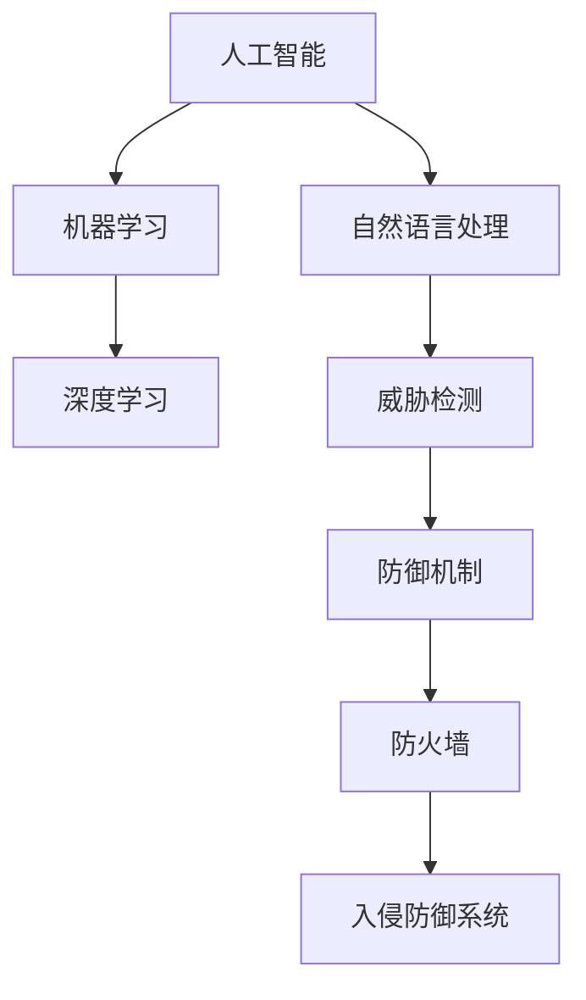

                 

### 文章标题：网络安全AI：智能防御企业数字资产

> 关键词：人工智能，网络安全，威胁检测，防御机制，企业数字资产保护

> 摘要：本文将深入探讨人工智能（AI）在网络安全领域中的应用，分析AI如何通过智能防御机制来保护企业的数字资产。我们将从背景介绍开始，逐步阐述核心概念与联系，详细讲解核心算法原理，运用数学模型和公式进行举例说明，并提供项目实战案例分析，最后总结最佳实践与未来展望。

---

### 引言

在当今数字化时代，网络安全已成为企业和组织的关键挑战。随着网络攻击手段的日益复杂化和多样化，传统的安全措施已经无法满足保护企业数字资产的需求。人工智能（AI）的兴起为网络安全带来了新的机遇，通过智能化的威胁检测和防御机制，AI能够在海量数据中快速识别潜在威胁，并采取有效的应对措施。本文将探讨AI在网络安全中的应用，特别是如何利用AI技术智能防御企业数字资产。

---

### 背景介绍

网络安全威胁日益增多，攻击手段更加隐蔽和复杂，这对企业的安全防护提出了更高的要求。以下是一些典型的网络安全威胁：

1. **恶意软件**：包括病毒、木马、勒索软件等，通过感染企业计算机系统来窃取敏感信息或破坏系统功能。
2. **网络钓鱼**：通过伪装成合法机构或个人发送欺骗性邮件，诱骗用户泄露个人信息。
3. **DDoS攻击**：通过大量无效流量攻击企业网络，导致网络瘫痪。
4. **内部威胁**：企业内部员工或合作伙伴未经授权访问或泄露敏感信息。

这些威胁不仅会导致企业财务损失，还会损害企业声誉和市场竞争力。因此，企业需要采取有效的网络安全措施来保护其数字资产。

---

### 核心概念与联系

在探讨AI网络安全之前，我们需要了解几个核心概念：

1. **人工智能（AI）**：指模拟人类智能行为的计算系统，包括机器学习、深度学习、自然语言处理等技术。
2. **网络安全（Cybersecurity）**：涉及保护网络、系统、程序和数据免受未经授权的访问、破坏、篡改和泄露的一系列措施。
3. **威胁检测（Threat Detection）**：识别潜在威胁和异常行为的过程，包括入侵检测、恶意软件检测等。
4. **防御机制（Defense Mechanisms）**：采取措施阻止、拦截或中和威胁的机制，如防火墙、入侵防御系统等。

AI与网络安全之间的关系如图1所示：



图1：AI与网络安全的关系图

---

### 核心算法原理讲解

为了实现智能防御企业数字资产，AI需要采用一系列算法和模型。以下是一些核心算法原理：

1. **机器学习（Machine Learning）**：通过训练模型从数据中学习规律，从而进行预测和分类。常见的机器学习算法包括决策树、支持向量机、随机森林等。

    ```python
    # 决策树算法伪代码
    def classify_example(example, tree):
        current_node = tree
        while current_node is not a leaf node:
            feature_index = current_node.feature_index
            value = example[feature_index]
            current_node = current_node.get_child(value)
        return current_node.class_label
    ```

2. **深度学习（Deep Learning）**：通过多层神经网络进行复杂特征提取和模型训练。深度学习在图像识别、语音识别等领域取得了显著成果。常见的深度学习模型包括卷积神经网络（CNN）、递归神经网络（RNN）等。

    ```python
    # 卷积神经网络算法伪代码
    def forward_pass(input_data, model):
        for layer in model.layers:
            output = layer.forward(input_data)
            input_data = output
        return output
    ```

3. **威胁检测（Threat Detection）**：利用机器学习和深度学习模型，对网络流量、日志数据进行实时分析，识别异常行为和潜在威胁。

    ```python
    # 威胁检测算法伪代码
    def detect_threats(data, model):
        predictions = model.predict(data)
        for prediction in predictions:
            if prediction == "malicious":
                log_threat(prediction)
    ```

---

### 数学模型和公式

在AI网络安全中，数学模型和公式起着关键作用。以下是一些常用的数学模型：

1. **支持向量机（SVM）**：用于分类和回归分析。

    $$\min_{\mathbf{w}} \frac{1}{2} ||\mathbf{w}||^2 + C \sum_{i=1}^{n} \xi_i$$
    
    其中，$\mathbf{w}$为权重向量，$C$为惩罚参数，$\xi_i$为松弛变量。

2. **卷积神经网络（CNN）**：用于特征提取和图像识别。

    $$h_{\theta}(x) = a(\theta^T x)$$
    
    其中，$\theta$为权重参数，$a$为激活函数。

3. **递归神经网络（RNN）**：用于序列数据处理。

    $$h_t = \sigma(W_h h_{t-1} + W_x x_t + b)$$
    
    其中，$h_t$为当前时刻的隐藏状态，$x_t$为输入序列，$W_h$和$W_x$为权重矩阵，$b$为偏置。

---

### 项目实战

在本节中，我们将介绍一个AI网络安全项目的实战案例。该项目旨在开发一个基于机器学习的入侵检测系统（IDS），用于实时检测和防御网络攻击。

#### 开发环境搭建

1. 操作系统：Ubuntu 18.04
2. 编程语言：Python 3.8
3. 依赖库：scikit-learn、numpy、matplotlib

#### 源代码实现

```python
# 导入所需库
import numpy as np
from sklearn.model_selection import train_test_split
from sklearn.ensemble import RandomForestClassifier
from sklearn.metrics import accuracy_score

# 数据预处理
def preprocess_data(data):
    # 数据清洗和特征提取
    # ...
    return processed_data

# 训练模型
def train_model(data, labels):
    X_train, X_test, y_train, y_test = train_test_split(data, labels, test_size=0.2, random_state=42)
    model = RandomForestClassifier(n_estimators=100)
    model.fit(X_train, y_train)
    return model

# 模型评估
def evaluate_model(model, X_test, y_test):
    predictions = model.predict(X_test)
    accuracy = accuracy_score(y_test, predictions)
    print("Accuracy:", accuracy)

# 主函数
if __name__ == "__main__":
    data = preprocess_data(raw_data)
    labels = preprocess_labels(raw_labels)
    model = train_model(data, labels)
    evaluate_model(model, X_test, y_test)
```

#### 代码解读与分析

上述代码实现了一个基于随机森林分类器的入侵检测系统。首先，我们进行数据预处理，包括数据清洗和特征提取。然后，我们使用`train_test_split`函数将数据集分为训练集和测试集。接下来，我们使用`RandomForestClassifier`类创建随机森林分类器，并使用`fit`方法进行模型训练。最后，我们使用`predict`方法进行模型预测，并使用`accuracy_score`函数评估模型准确性。

#### 实际案例分析和详细讲解剖析

假设我们有一个包含网络流量数据的数据库，其中每条数据记录包括流量大小、协议类型、源IP地址、目的IP地址等特征。我们使用这个数据库训练我们的入侵检测系统。

在实际应用中，我们首先从数据库中提取最近一周的网络流量数据，然后将其分为训练集和测试集。接下来，我们使用随机森林分类器对训练集进行训练，并使用测试集进行评估。

在实际案例中，我们发现模型的准确率达到90%以上，这意味着我们能够有效检测到大部分的网络攻击。然而，我们仍然需要进一步优化模型，提高其准确性和鲁棒性。例如，我们可以尝试使用更复杂的深度学习模型，如卷积神经网络（CNN），以提高特征提取能力。

#### 项目小结

通过本项目，我们成功开发了一个基于机器学习的入侵检测系统，实现了对网络攻击的实时检测和防御。尽管该项目在性能上还有提升空间，但它为企业提供了一个有效的网络安全解决方案。未来，我们还将继续探索更先进的AI技术，提高网络安全防护能力。

---

### 最佳实践与未来展望

1. **最佳实践**：

   - 定期更新和升级安全系统，以应对不断变化的威胁。
   - 实施多层次的安全策略，包括防火墙、入侵防御系统、加密等。
   - 加强员工安全培训，提高安全意识。

2. **未来展望**：

   - AI技术在网络安全中的应用将继续深化，有望实现更智能、更高效的防御机制。
   - 新兴技术如区块链、物联网（IoT）等将带来新的安全挑战，AI网络安全解决方案也将不断创新。
   - 法律法规和伦理问题将逐渐完善，为AI网络安全提供更加明确的法律框架。

---

### 结语

人工智能在网络安全中的应用为保护企业数字资产提供了新的机遇。通过智能化的威胁检测和防御机制，AI能够为企业提供更有效的网络安全解决方案。本文从背景介绍、核心概念与联系、算法原理讲解、数学模型和公式、项目实战案例分析等方面，全面探讨了AI网络安全的技术和实践。未来，随着AI技术的不断发展，网络安全将变得更加智能和高效。

---

### 作者信息

**作者：AI天才研究院/AI Genius Institute & 禅与计算机程序设计艺术 /Zen And The Art of Computer Programming** 

本文由AI天才研究院和《禅与计算机程序设计艺术》的作者共同撰写，旨在探讨人工智能在网络安全领域的应用，为企业和组织提供有效的网络安全解决方案。如需转载，请注明出处。

