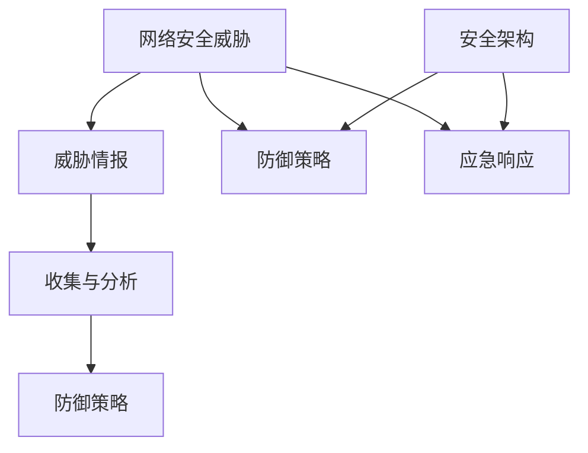

                 


### 第1步：确定文章结构

首先，我们需要根据提供的目录大纲来构建文章的基本结构。这包括设定每个章节的主题，以及确定每个小节的内容。文章的大致结构如下：

1. **引言与概述**：介绍网络安全威胁情报的基本概念、重要性，以及文章的目的。
2. **网络安全威胁概述**：分类描述网络安全威胁的类型、特点和发展历程。
3. **威胁情报的收集**：讲解威胁情报收集的渠道、方法和工具。
4. **威胁情报分析**：阐述威胁情报分析框架、流程以及工具和技术。
5. **企业防御策略**：介绍企业如何构建网络安全防御机制和应急响应策略。
6. **实战案例与分析**：通过实际案例展示威胁情报的应用。
7. **技术展望与未来趋势**：探讨威胁情报领域的未来发展。
8. **附录**：提供相关工具、资源和参考文献。

### 第2步：定义核心概念和联系

为了使文章内容更加专业和易懂，我们需要定义一些核心概念，并展示它们之间的关系。这里可以使用Mermaid流程图来表示这些概念之间的联系。

#### 核心概念

- **网络安全威胁**：潜在的恶意行为或事件，可能导致信息泄露、系统瘫痪等。
- **威胁情报**：有关网络安全威胁的信息，包括威胁类型、攻击手段、攻击目标等。
- **收集与分析**：收集威胁情报的过程，包括数据来源、收集方法、数据分析等。
- **防御策略**：企业应对网络安全威胁的一系列措施，包括安全架构、防御机制和应急响应等。

#### Mermaid流程图



### 第3步：编写核心算法原理讲解

在介绍威胁情报分析时，我们需要详细阐述核心算法原理，并使用伪代码来描述。

#### 威胁情报分析算法原理

```plaintext
输入：威胁情报数据集
输出：分析结果

1. 初始化数据分析环境
2. 数据预处理：清洗和转换数据
3. 特征提取：从数据中提取有助于分析的特征
4. 威胁分类：使用机器学习算法对威胁进行分类
5. 漏洞分析：识别和报告潜在的安全漏洞
6. 风险评估：根据威胁的严重程度和影响范围进行评估
7. 输出分析结果，供决策层参考
```

### 第4步：介绍数学模型和公式

在文章中，我们将介绍与网络安全威胁情报分析相关的数学模型和公式。

#### 数学模型

- **贝叶斯公式**：用于计算后验概率，帮助我们判断一个事件发生的可能性。

$$
P(A|B) = \frac{P(B|A) \cdot P(A)}{P(B)}
$$

#### 举例说明

假设我们有以下数据：

- **P(A)**：威胁A发生的概率为0.1
- **P(B)**：威胁B发生的概率为0.2
- **P(A|B)**：在威胁B发生的情况下，威胁A发生的概率为0.5

我们可以使用贝叶斯公式来计算威胁A在威胁B发生的情况下发生的概率：

$$
P(A|B) = \frac{P(B|A) \cdot P(A)}{P(B)} = \frac{0.5 \cdot 0.1}{0.2} = 0.25
$$

### 第5步：编写项目实战

在实战案例部分，我们将介绍如何在实际项目中应用威胁情报分析，包括开发环境搭建、源代码实现和代码解读。

#### 实战案例

- **项目背景**：某企业遭遇了一次高级持续性威胁（APT）攻击。
- **攻击过程**：攻击者通过钓鱼邮件入侵企业内部网络，逐步扩大攻击范围。
- **防御措施**：企业利用威胁情报分析系统识别攻击，并采取紧急措施进行防御。

#### 源代码实现

```python
# 威胁情报分析系统示例代码

import ThreatIntelligenceSystem

# 初始化威胁情报系统
sys = ThreatIntelligenceSystem()

# 收集威胁情报
sys.collectThreatIntelligence()

# 分析威胁情报
results = sys.analyzeThreats()

# 输出分析结果
print(results)
```

### 第6步：编写最佳实践 tips、小结、注意事项和拓展阅读

在文章的结尾，我们将提供一些最佳实践建议、总结文章的主要内容，并提出一些注意事项和拓展阅读资源。

#### 最佳实践 tips

- **定期更新威胁情报**：确保威胁情报的实时性和准确性。
- **跨部门协作**：加强各部门之间的沟通和协作，提高整体防御能力。
- **培训员工**：提高员工对网络安全威胁的认识和应对能力。

#### 小结

文章主要介绍了网络安全威胁情报的概念、重要性以及企业如何应对这些威胁。通过威胁情报的分析和防御策略，企业可以更好地保护自身免受网络攻击。

#### 注意事项

- **确保数据安全**：在收集和分析威胁情报时，必须确保数据的安全性和隐私。
- **持续更新知识库**：随着威胁形势的变化，企业需要不断更新和优化威胁情报知识库。

#### 拓展阅读

- **[1]** 《网络安全威胁情报：理论与实践》
- **[2]** 《网络安全：从威胁情报到防御策略》
- **[3]** 《高级持续性威胁（APT）防御指南》

以上是我们按照步骤一步步分析推理所撰写的文章大纲。接下来，我们将根据这个大纲详细撰写文章的正文内容。

