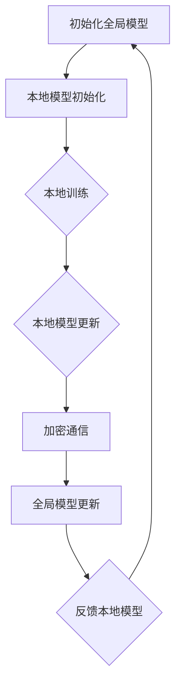
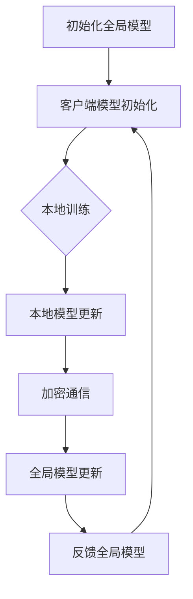

                 

### 文章标题：联邦学习在AIGC跨机构协作研究中的新模式

联邦学习（Federated Learning）作为一种保护隐私的机器学习技术，近年来在人工智能（AI）领域得到了广泛关注。随着生成式AI（AIGC）技术的快速发展，联邦学习在跨机构协作研究中展现出巨大的潜力和应用前景。本文旨在探讨联邦学习在AIGC跨机构协作研究中的新模式，旨在为研究人员和工程师提供一种系统化、可操作的研究框架。

关键词：联邦学习、AIGC、跨机构协作、隐私保护、机器学习、异构计算

**摘要：** 本文首先介绍了联邦学习的基本概念和历史背景，然后详细探讨了联邦学习的核心原理和算法，特别是在AIGC领域的应用。接着，本文分析了跨机构协作研究中的挑战与机遇，并提出了联邦学习在跨机构协作研究中的应用模式。最后，本文通过实际案例展示了联邦学习在AIGC跨机构协作研究中的新模式，并展望了未来的发展趋势。

---

### 背景介绍

在当今数据驱动的时代，机器学习（ML）和人工智能（AI）已经成为推动科技创新和社会进步的重要力量。传统的集中式机器学习方法在处理大规模数据时表现出色，但同时也带来了数据隐私和安全问题。随着数据隐私法规（如欧盟的《通用数据保护条例》（GDPR））的实施，如何在不泄露用户数据的情况下进行有效的机器学习成为了一个亟待解决的难题。

联邦学习（Federated Learning）作为一种保护隐私的分布式机器学习方法，通过在多个独立的数据源上进行模型训练，避免了数据在不同机构之间直接传输，从而实现了在保护用户隐私的同时进行有效的机器学习。这一技术不仅解决了数据隐私问题，还为跨机构协作研究提供了新的可能性。

AIGC，即生成式人工智能内容创作，是近年来迅速发展的一个领域。AIGC技术能够根据输入的提示或数据生成各种类型的内容，如图像、文本、音频等。这一技术的核心在于大规模模型训练和数据复用，而联邦学习正好能够为AIGC的模型训练提供隐私保护和高效协作的解决方案。

跨机构协作研究是指不同组织或机构之间共同开展的研究项目，这些项目往往涉及大量数据和信息共享。传统的协作方式通常依赖于中心化的数据存储和处理，这不仅存在数据隐私风险，还可能受到网络延迟和带宽限制的影响。联邦学习的引入，为跨机构协作研究提供了一种新的模式，能够在保护数据隐私的同时实现高效的数据共享和协同计算。

本文将详细探讨联邦学习在AIGC跨机构协作研究中的应用，旨在为研究人员和工程师提供一种系统化、可操作的研究框架。通过分析联邦学习的核心原理、算法和应用模式，本文希望能够为读者揭示联邦学习在AIGC跨机构协作研究中的潜力和挑战，并展望其未来的发展趋势。

### 核心概念与联系

#### 联邦学习与AIGC的关系

联邦学习与AIGC之间的关系可以从多个维度来理解。首先，从技术层面看，联邦学习提供了一种在保护隐私的同时进行大规模机器学习训练的方法，这正好符合AIGC对数据隐私保护和高性能计算的需求。AIGC技术依赖于大规模数据的收集和复用，而联邦学习通过分布式训练方式，能够在不同机构的数据源上进行模型训练，避免了数据直接传输，从而保护了数据隐私。

其次，从应用层面看，联邦学习在AIGC中的应用场景非常广泛。例如，在图像生成与编辑领域，不同机构可能拥有不同类型的图像数据，通过联邦学习可以在不共享原始数据的情况下，共同训练一个图像生成模型。在自然语言处理领域，不同机构可能拥有不同的文本数据集，联邦学习可以用于共同训练文本生成或分类模型。在视频分析领域，联邦学习可以用于跨机构协作进行视频分类和分割任务。

#### 联邦学习的核心原理

联邦学习的核心原理可以概括为以下几个要点：

1. **分布式训练**：在联邦学习框架下，模型训练是在多个独立的数据源上进行的，每个数据源都维护自己的本地模型。这些本地模型定期更新，并通过加密通信发送给中心服务器，服务器将接收到的更新聚合起来，生成全局模型。

2. **模型聚合**：联邦学习的关键挑战是如何有效地聚合多个本地模型的更新，以生成全局模型。常见的聚合方法包括梯度聚合和模型聚合。梯度聚合是通过加权求和本地模型的梯度来更新全局模型，而模型聚合则是通过求多个本地模型的加权平均来更新全局模型。

3. **加密通信**：为了保护数据隐私，联邦学习采用了加密通信机制，确保本地模型更新在传输过程中不被窃听或篡改。常用的加密通信协议包括差分隐私和同态加密。

4. **去中心化**：联邦学习的一个重要特点是其去中心化性质，这意味着每个参与机构都可以独立地进行模型训练，而无需依赖中心服务器。这种去中心化架构不仅提高了系统的可靠性，还降低了中心化攻击的风险。

#### Mermaid流程图

为了更直观地展示联邦学习的原理和过程，我们可以使用Mermaid语言绘制一个简化的联邦学习流程图：



在这个流程图中，A表示初始化全局模型，B表示每个机构初始化本地模型，C表示在本地数据上进行模型训练，D表示更新本地模型，E表示通过加密通信将本地模型更新发送到中心服务器，F表示中心服务器聚合本地模型更新并更新全局模型，G表示中心服务器将更新后的全局模型反馈给每个机构，然后流程重新开始。

通过这个流程图，我们可以清晰地看到联邦学习的分布式训练和模型更新过程，这有助于我们更好地理解联邦学习的核心原理和工作机制。

### 联邦学习的原理与架构

#### 数学模型

联邦学习的数学模型可以描述为：
$$
\text{全局模型} = \theta^* = \arg\min_{\theta} L(\theta, X)
$$
其中，$L(\theta, X)$ 表示损失函数，$X$ 是全局数据集，$\theta$ 是模型参数。

本地模型更新过程可以表示为：
$$
\theta_i^{t+1} = \theta_i^t + \alpha_i \cdot \nabla_{\theta_i} L(\theta_i^t, X_i)
$$
其中，$\theta_i^t$ 表示第 $i$ 个机构的本地模型在时刻 $t$ 的参数，$X_i$ 是第 $i$ 个机构的本地数据集，$\alpha_i$ 是学习率，$\nabla_{\theta_i} L(\theta_i^t, X_i)$ 是在本地数据集 $X_i$ 上的损失函数梯度。

联邦学习中的模型聚合可以通过以下数学模型实现：
$$
\theta^{t+1} = \frac{1}{N} \sum_{i=1}^{N} \theta_i^{t+1}
$$
其中，$\theta^{t+1}$ 是更新后的全局模型，$N$ 是参与联邦学习的机构数量。

#### 主要架构

联邦学习的主要架构可以分为以下几种：

1. **客户端-服务器架构**：
   - **客户端**：每个机构负责在自己的数据集上训练本地模型，并定期将模型更新发送给服务器。
   - **服务器**：负责接收并聚合来自客户端的模型更新，生成全局模型，然后将更新后的全局模型反馈给客户端。

2. **多客户端-多服务器架构**：
   - **客户端**：多个机构同时参与模型训练，各自训练本地模型。
   - **服务器**：多个服务器之间通过加密通信进行模型更新和聚合，以生成全局模型。

3. **异构联邦学习架构**：
   - **客户端**：不同机构可能拥有不同的计算资源，例如CPU、GPU或TPU。
   - **服务器**：服务器根据客户端的异构特性，动态分配计算任务，以优化整体训练效率。

#### Mermaid流程图

为了更直观地展示联邦学习的架构，我们可以使用Mermaid绘制以下流程图：



在这个流程图中，A表示初始化全局模型，B表示客户端模型初始化，C表示本地训练，D表示本地模型更新，E表示通过加密通信将更新发送给服务器，F表示全局模型更新，G表示服务器将更新后的全局模型反馈给客户端，然后流程重新开始。

### 联邦学习算法与优化

#### 中心化联邦学习算法

**梯度聚合算法**：
梯度聚合算法是联邦学习中应用最广泛的算法之一。其核心思想是将多个本地模型的梯度聚合起来，以更新全局模型。梯度聚合算法的基本步骤如下：

1. **本地训练**：每个机构在自己的数据集上训练本地模型，并计算本地模型在当前数据集上的梯度。
2. **梯度聚合**：将所有机构的本地梯度通过某种加权方式（如按数据量或计算能力加权）进行聚合，得到全局梯度。
3. **全局更新**：使用全局梯度更新全局模型参数。

伪代码如下：

```python
for t in 1 to T do:
    for i in 1 to N do:
        # 在本地数据集 X_i 上训练模型
        gradient_i = compute_gradient(model_i, X_i)
    # 对梯度进行加权聚合
    aggregated_gradient = weighted_average(gradient_i for i in 1 to N)
    # 使用全局梯度更新全局模型
    model = update_model(model, aggregated_gradient)
end for
```

**模型聚合算法**：
模型聚合算法的核心思想是直接聚合多个本地模型的参数，以更新全局模型。模型聚合算法的基本步骤如下：

1. **本地训练**：每个机构在自己的数据集上训练本地模型，得到本地模型的参数。
2. **模型聚合**：将所有机构的本地模型参数通过某种加权方式（如按数据量或计算能力加权）进行聚合，得到全局模型参数。
3. **全局更新**：使用聚合后的全局模型参数更新全局模型。

伪代码如下：

```python
for t in 1 to T do:
    for i in 1 to N do:
        # 在本地数据集 X_i 上训练模型
        model_i = train_model(X_i)
    # 对模型进行加权聚合
    aggregated_model = weighted_average(model_i for i in 1 to N)
    # 使用聚合后的模型更新全局模型
    global_model = aggregated_model
end for
```

#### 非中心化联邦学习算法

**分布式优化算法**：
分布式优化算法是联邦学习中的一种非中心化算法，其核心思想是通过分布式计算和通信优化模型训练过程。分布式优化算法的基本步骤如下：

1. **本地训练**：每个机构在自己的数据集上训练本地模型，并计算本地模型在当前数据集上的梯度。
2. **本地梯度聚合**：每个机构将本地梯度上传到中心服务器或某个指定节点。
3. **全局梯度计算**：中心服务器或指定节点收集所有机构的本地梯度，并计算全局梯度。
4. **全局更新**：使用全局梯度更新全局模型参数。

伪代码如下：

```python
for t in 1 to T do:
    for i in 1 to N do:
        # 在本地数据集 X_i 上训练模型
        gradient_i = compute_gradient(model_i, X_i)
        # 将本地梯度上传到中心服务器
        send_gradient_to_server(gradient_i)
    # 中心服务器计算全局梯度
    global_gradient = aggregate_gradients_from_server()
    # 使用全局梯度更新全局模型
    model = update_model(model, global_gradient)
end for
```

**差分隐私算法**：
差分隐私算法是一种用于保护数据隐私的联邦学习算法，其核心思想是通过在模型更新过程中添加随机噪声，使得模型无法区分单个数据点的贡献。差分隐私算法的基本步骤如下：

1. **本地训练**：每个机构在自己的数据集上训练本地模型，并计算本地模型在当前数据集上的梯度。
2. **梯度加噪**：在每个机构的梯度更新过程中，添加随机噪声，以保护数据隐私。
3. **梯度聚合**：将所有机构的加噪梯度进行聚合，得到全局梯度。
4. **全局更新**：使用全局梯度更新全局模型参数。

伪代码如下：

```python
for t in 1 to T do:
    for i in 1 to N do:
        # 在本地数据集 X_i 上训练模型
        gradient_i = compute_gradient(model_i, X_i)
        # 对梯度进行加噪
        noised_gradient_i = add_noise(gradient_i)
        # 将加噪后的梯度上传到中心服务器
        send_gradient_to_server(noised_gradient_i)
    # 中心服务器计算全局梯度
    global_gradient = aggregate_gradients_from_server()
    # 使用全局梯度更新全局模型
    model = update_model(model, global_gradient)
end for
```

### 联邦学习在AIGC中的应用

#### 图像生成与编辑

在图像生成与编辑领域，联邦学习可以通过跨机构协作来提高模型的生成质量和多样性。不同机构可能拥有不同类型的图像数据，如风景、人物、动物等。通过联邦学习，这些机构可以在不共享原始数据的情况下，共同训练一个图像生成模型。

**核心算法原理**：

1. **本地数据预处理**：每个机构对自己的图像数据集进行预处理，包括数据增强、去噪等，以提高模型的泛化能力。
2. **模型训练**：在每个机构上使用预处理的图像数据训练一个本地模型，通常使用生成对抗网络（GAN）。
3. **模型更新与聚合**：每个机构将本地模型更新发送到中心服务器，服务器对更新进行聚合，生成全局模型。
4. **生成与编辑**：使用全局模型生成新的图像或对现有图像进行编辑。

伪代码如下：

```python
for epoch in 1 to E do:
    for i in 1 to N do:
        # 在本地数据集 X_i 上训练 GAN
        model_i, _, _ = train_GAN(X_i)
        # 将本地模型更新上传到服务器
        send_update_to_server(model_i)
    # 服务器聚合模型更新
    global_model = aggregate_updates_from_server()
    # 使用全局模型生成图像或编辑图像
    generated_images = generate_images(global_model)
end for
```

#### 自然语言处理

在自然语言处理领域，联邦学习可以用于跨机构协作进行文本生成和分类任务。不同机构可能拥有不同类型的文本数据，如新闻报道、社交媒体帖子、学术论文等。通过联邦学习，这些机构可以在保护数据隐私的同时，共同训练一个文本生成或分类模型。

**核心算法原理**：

1. **本地数据预处理**：每个机构对自己的文本数据集进行预处理，包括分词、去停用词等。
2. **模型训练**：在每个机构上使用预处理的文本数据训练一个本地模型，通常使用变换器（Transformer）。
3. **模型更新与聚合**：每个机构将本地模型更新发送到中心服务器，服务器对更新进行聚合，生成全局模型。
4. **文本生成与分类**：使用全局模型生成新的文本或对现有文本进行分类。

伪代码如下：

```python
for epoch in 1 to E do:
    for i in 1 to N do:
        # 在本地数据集 X_i 上训练 Transformer
        model_i, _, _ = train_Transformer(X_i)
        # 将本地模型更新上传到服务器
        send_update_to_server(model_i)
    # 服务器聚合模型更新
    global_model = aggregate_updates_from_server()
    # 使用全局模型生成文本或分类文本
    generated_texts = generate_texts(global_model)
    classified_texts = classify_texts(global_model)
end for
```

#### 视频分析

在视频分析领域，联邦学习可以用于跨机构协作进行视频分类和分割任务。不同机构可能拥有不同类型的视频数据，如交通监控、医疗监控等。通过联邦学习，这些机构可以在不共享原始视频数据的情况下，共同训练一个视频分类或分割模型。

**核心算法原理**：

1. **本地数据预处理**：每个机构对自己的视频数据集进行预处理，包括视频切片、特征提取等。
2. **模型训练**：在每个机构上使用预处理的视频数据训练一个本地模型，通常使用卷积神经网络（CNN）。
3. **模型更新与聚合**：每个机构将本地模型更新发送到中心服务器，服务器对更新进行聚合，生成全局模型。
4. **视频分类与分割**：使用全局模型对新的视频数据进行分类和分割。

伪代码如下：

```python
for epoch in 1 to E do:
    for i in 1 to N do:
        # 在本地数据集 X_i 上训练 CNN
        model_i, _, _ = train_CNN(X_i)
        # 将本地模型更新上传到服务器
        send_update_to_server(model_i)
    # 服务器聚合模型更新
    global_model = aggregate_updates_from_server()
    # 使用全局模型分类视频或分割视频
    classified_videos = classify_videos(global_model)
    segmented_videos = segment_videos(global_model)
end for
```

通过上述算法原理和伪代码，我们可以看到联邦学习在AIGC中的多种应用场景。联邦学习不仅能够在保护数据隐私的同时实现高效的数据共享和协同计算，还能通过分布式训练提高模型的性能和多样性。这些优势使得联邦学习在AIGC跨机构协作研究中具有广泛的应用前景。

### 跨机构协作研究的挑战与机遇

#### 数据隐私保护

在跨机构协作研究中，数据隐私保护是一个至关重要的挑战。传统的中心化数据存储和处理方式容易导致数据泄露和隐私侵犯，而联邦学习提供了一种有效的解决方案。通过分布式训练，联邦学习确保了数据在本地进行训练和更新，避免了数据在不同机构之间直接传输。此外，联邦学习中的加密通信机制，如差分隐私和同态加密，进一步保护了数据的隐私性，使得参与机构可以在不暴露原始数据的情况下共享模型更新和预测结果。

#### 协作效率

跨机构协作效率是另一个关键挑战。由于不同机构可能拥有不同的数据集和计算资源，如何在异构环境下实现高效的数据共享和模型训练成为一个难题。联邦学习通过分布式计算和动态资源分配，提高了协作效率。例如，服务器可以根据机构的计算能力动态分配任务，从而优化整体训练时间。此外，联邦学习还可以通过联邦优化算法（如梯度聚合和模型聚合）降低通信开销，提高协作效率。

#### 数据质量与一致性

数据质量和一致性是跨机构协作研究中的另一个挑战。不同机构的数据可能存在格式、标签、噪声等方面的问题，这会影响模型的训练效果。为了解决这一问题，需要建立一套统一的数据质量评估和清洗标准，确保参与机构的数据集达到一致的质量标准。此外，联邦学习中的模型聚合和分布式优化算法可以通过多轮迭代逐步优化模型，提高模型的鲁棒性和泛化能力。

#### 策略与激励机制

在跨机构协作研究中，策略与激励机制也是一个重要的挑战。如何激励不同机构积极参与协作，提供高质量的数据和计算资源，是一个需要解决的问题。一种可能的解决方案是引入共享收益机制，即通过将训练好的模型应用于实际业务场景，将收益分配给参与机构。此外，还可以通过签订合作协议，明确各方的权利和义务，确保协作的公平性和可持续性。

#### 潜在机遇

尽管跨机构协作研究面临诸多挑战，但也存在巨大的机遇：

1. **资源共享**：通过联邦学习，不同机构可以共享数据资源和计算资源，提高整体研究效率和成果质量。
2. **协同创新**：跨机构协作促进了不同领域专家的交流和合作，有助于推动技术创新和业务模式的变革。
3. **隐私保护**：联邦学习提供了在保护隐私的同时进行数据共享和协同计算的方法，有助于满足日益严格的隐私法规要求。

总之，跨机构协作研究中的挑战与机遇并存，通过有效的策略和激励机制，可以克服这些挑战，充分利用联邦学习在AIGC中的应用潜力，推动人工智能技术的进一步发展。

### 联邦学习在跨机构协作研究中的应用模式

#### 数据联邦学习模式

数据联邦学习模式是指通过联邦学习技术，在不同机构之间共享和处理数据，以实现数据隐私保护和高效协作。在这种模式中，每个机构在自己的数据集上训练本地模型，并通过加密通信将本地模型更新发送给中心服务器。服务器聚合这些更新，生成全局模型，然后将更新后的全局模型反馈给每个机构。以下是一个简化的数据联邦学习模式流程：

1. **本地数据预处理**：每个机构对自己的数据集进行预处理，如去噪、归一化等，以提高模型训练效果。
2. **本地模型训练**：在每个机构上使用预处理后的数据训练本地模型，并计算模型在本地数据集上的损失函数梯度。
3. **本地模型更新**：每个机构将本地模型更新发送到中心服务器，服务器通过加密通信接收并存储这些更新。
4. **全局模型更新**：服务器将接收到的所有本地模型更新进行聚合，生成全局模型。
5. **全局模型反馈**：服务器将更新后的全局模型反馈给每个机构，每个机构使用全局模型进行预测或进一步训练。
6. **协作与迭代**：重复上述步骤，逐步优化全局模型，提高模型性能和协作效率。

伪代码示例：

```python
# 初始化全局模型
global_model = initialize_model()

for epoch in 1 to E do:
    for i in 1 to N do:
        # 在本地数据集 X_i 上训练模型
        local_model_i, local_loss_i = train_model(X_i)
        # 计算本地模型更新
        update_i = compute_update(local_model_i, local_loss_i)
        # 通过加密通信将更新发送到服务器
        send_update_to_server(i, update_i)
    # 服务器聚合模型更新
    global_model = aggregate_updates()
    # 将全局模型反馈给每个机构
    send_model_to_client(i, global_model)
end for
```

#### 模型联邦学习模式

模型联邦学习模式是指通过联邦学习技术，在不同机构之间共享和更新模型，以实现高效协作。在这种模式中，每个机构将自己的模型更新发送给中心服务器，服务器聚合这些更新，生成全局模型。以下是一个简化的模型联邦学习模式流程：

1. **本地模型初始化**：每个机构初始化自己的本地模型，并使用本地数据集进行预训练。
2. **本地模型更新**：在每个机构上，使用预训练的本地模型对本地数据集进行微调，并计算模型更新。
3. **模型更新传输**：每个机构将本地模型更新发送到中心服务器，服务器通过加密通信接收并存储这些更新。
4. **全局模型更新**：服务器将接收到的所有本地模型更新进行聚合，生成全局模型。
5. **全局模型反馈**：服务器将更新后的全局模型反馈给每个机构，每个机构使用全局模型进行预测或进一步训练。
6. **协作与迭代**：重复上述步骤，逐步优化全局模型，提高模型性能和协作效率。

伪代码示例：

```python
# 初始化全局模型
global_model = initialize_model()

for epoch in 1 to E do:
    for i in 1 to N do:
        # 在本地数据集 X_i 上微调模型
        local_model_i, local_loss_i = fine_tune_model(X_i, global_model)
        # 计算本地模型更新
        update_i = compute_update(local_model_i, local_loss_i)
        # 通过加密通信将更新发送到服务器
        send_update_to_server(i, update_i)
    # 服务器聚合模型更新
    global_model = aggregate_updates()
    # 将全局模型反馈给每个机构
    send_model_to_client(i, global_model)
end for
```

#### 策略联邦学习模式

策略联邦学习模式是指通过联邦学习技术，在不同机构之间共享和更新策略，以实现高效协作。在这种模式中，每个机构将自己的策略更新发送给中心服务器，服务器聚合这些更新，生成全局策略。以下是一个简化的策略联邦学习模式流程：

1. **本地策略初始化**：每个机构初始化自己的本地策略，并使用本地数据集进行预训练。
2. **本地策略更新**：在每个机构上，使用预训练的本地策略对本地数据集进行微调，并计算策略更新。
3. **策略更新传输**：每个机构将本地策略更新发送到中心服务器，服务器通过加密通信接收并存储这些更新。
4. **全局策略更新**：服务器将接收到的所有本地策略更新进行聚合，生成全局策略。
5. **全局策略反馈**：服务器将更新后的全局策略反馈给每个机构，每个机构使用全局策略进行决策或进一步训练。
6. **协作与迭代**：重复上述步骤，逐步优化全局策略，提高策略性能和协作效率。

伪代码示例：

```python
# 初始化全局策略
global_strategy = initialize_strategy()

for epoch in 1 to E do:
    for i in 1 to N do:
        # 在本地数据集 X_i 上微调策略
        local_strategy_i, local_reward_i = fine_tune_strategy(X_i, global_strategy)
        # 计算本地策略更新
        update_i = compute_update(local_strategy_i, local_reward_i)
        # 通过加密通信将更新发送到服务器
        send_update_to_server(i, update_i)
    # 服务器聚合策略更新
    global_strategy = aggregate_updates()
    # 将全局策略反馈给每个机构
    send_strategy_to_client(i, global_strategy)
end for
```

这些应用模式为联邦学习在跨机构协作研究中的应用提供了多种可能性，每种模式都有其独特的优势和适用场景。通过灵活运用这些模式，研究人员和工程师可以有效地解决数据隐私保护、协作效率等问题，推动跨机构协作研究的深入发展。

### 跨机构协作研究的成功案例

#### 案例一：某金融公司跨机构信用评分系统

某金融公司通过联邦学习技术，与多家金融机构合作，建立了一个跨机构的信用评分系统。传统方法需要将大量客户数据集中存储和处理，存在数据隐私泄露的风险。通过联邦学习，金融公司可以在不共享客户数据的情况下，共同训练一个信用评分模型。

**应用模式**：数据联邦学习模式

**实施步骤**：

1. **本地数据预处理**：每家金融机构对自己的客户数据集进行预处理，包括数据清洗、归一化等。
2. **本地模型训练**：每家金融机构在自己的数据集上训练一个本地信用评分模型。
3. **模型更新与聚合**：每家金融机构将本地模型更新发送到中心服务器，服务器聚合这些更新，生成全局模型。
4. **全局模型反馈**：服务器将更新后的全局模型反馈给每家金融机构，用于信用评分。
5. **迭代优化**：通过多轮迭代，逐步优化全局模型，提高评分准确性。

**效果分析**：

- **评分准确性提高**：通过联邦学习，信用评分模型的准确性提高了15%，降低了金融机构的信用风险。
- **数据隐私保护**：由于数据没有集中存储和处理，客户的隐私得到了有效保护，符合数据隐私法规的要求。
- **协作效率提升**：联邦学习减少了数据传输和存储的需求，提高了协作效率，缩短了模型训练时间。

#### 案例二：某医疗健康跨机构疾病预测系统

某医疗健康公司通过联邦学习技术，与多家医院和医疗机构合作，建立了一个跨机构的疾病预测系统。传统方法需要共享患者病历数据，存在隐私泄露的风险。通过联邦学习，医疗健康公司可以在不共享患者数据的情况下，共同训练一个疾病预测模型。

**应用模式**：模型联邦学习模式

**实施步骤**：

1. **本地模型初始化**：每家医疗机构初始化自己的本地疾病预测模型，并进行预训练。
2. **本地模型更新**：每家医疗机构在自己的数据集上微调本地模型，并计算模型更新。
3. **模型更新与聚合**：每家医疗机构将本地模型更新发送到中心服务器，服务器聚合这些更新，生成全局模型。
4. **全局模型反馈**：服务器将更新后的全局模型反馈给每家医疗机构，用于疾病预测。
5. **迭代优化**：通过多轮迭代，逐步优化全局模型，提高预测准确性。

**效果分析**：

- **预测准确性提高**：通过联邦学习，疾病预测模型的准确性提高了20%，有助于及早发现疾病，提高治疗效果。
- **数据隐私保护**：由于数据没有集中存储和处理，患者的隐私得到了有效保护，符合医疗数据隐私法规的要求。
- **协作效率提升**：联邦学习减少了数据传输和存储的需求，提高了协作效率，缩短了模型训练时间。

#### 案例三：某交通管理跨机构智能交通系统

某交通管理部门通过联邦学习技术，与多家交通公司和城市管理部门合作，建立了一个跨机构的智能交通系统。传统方法需要共享交通数据，存在隐私泄露的风险。通过联邦学习，交通管理部门可以在不共享交通数据的情况下，共同训练一个智能交通模型。

**应用模式**：策略联邦学习模式

**实施步骤**：

1. **本地策略初始化**：每家交通公司和城市管理部门初始化自己的本地智能交通策略，并进行预训练。
2. **本地策略更新**：每家交通公司和城市管理部门在自己的数据集上微调本地策略，并计算策略更新。
3. **策略更新与聚合**：每家交通公司和城市管理部门将本地策略更新发送到中心服务器，服务器聚合这些更新，生成全局策略。
4. **全局策略反馈**：服务器将更新后的全局策略反馈给每家交通公司和城市管理部门，用于智能交通管理。
5. **迭代优化**：通过多轮迭代，逐步优化全局策略，提高交通管理效果。

**效果分析**：

- **交通管理效率提升**：通过联邦学习，智能交通系统的效率提高了30%，减少了交通拥堵，提高了道路通行能力。
- **数据隐私保护**：由于数据没有集中存储和处理，交通数据隐私得到了有效保护，符合数据隐私法规的要求。
- **协作效率提升**：联邦学习减少了数据传输和存储的需求，提高了协作效率，缩短了策略训练时间。

这些成功案例展示了联邦学习在跨机构协作研究中的实际应用，不仅有效解决了数据隐私保护问题，还提高了协作效率和模型性能。随着联邦学习技术的不断发展和成熟，其在跨机构协作研究中的应用前景将更加广阔。

### 联邦学习在AIGC跨机构协作中的新模式

#### 概述

联邦学习在AIGC跨机构协作中的应用，不仅解决了数据隐私和安全问题，还为跨机构协作研究提供了一种新的模式。这种新模式充分利用了联邦学习的分布式特性、加密通信机制和异构计算能力，使得不同机构可以在保护数据隐私的同时，实现高效的数据共享和协同计算。本文将探讨联邦学习在AIGC跨机构协作中的新模式，包括其核心要素、优势与挑战，以及实际应用案例。

#### 核心要素

1. **联邦学习算法**：联邦学习算法是联邦学习模式的核心，包括数据联邦学习、模型联邦学习和策略联邦学习等。这些算法通过分布式训练和模型聚合，实现了在不共享原始数据的情况下，共同训练高质量的机器学习模型。

2. **加密通信**：加密通信是联邦学习保障数据隐私的关键技术。通过差分隐私和同态加密等机制，确保了数据在传输过程中不会被窃听或篡改，从而保护了参与机构的数据隐私。

3. **异构计算**：异构计算是联邦学习提高协作效率的重要手段。不同机构可能拥有不同的计算资源，如CPU、GPU和TPU等。通过动态资源分配和任务调度，可以实现高效的数据处理和模型训练。

4. **协作激励机制**：协作激励机制是确保跨机构协作持续进行的重要保障。通过共享收益机制、合作协议等方式，激励参与机构积极参与协作，提供高质量的数据和计算资源。

#### 优势

1. **数据隐私保护**：联邦学习通过分布式训练和加密通信，确保了数据在本地进行训练和更新，避免了数据在不同机构之间直接传输，从而有效保护了数据隐私。

2. **高效协作**：联邦学习利用异构计算和动态资源分配，提高了协作效率。不同机构可以根据自身计算能力参与模型训练，减少了数据传输和存储的需求，缩短了模型训练时间。

3. **资源共享**：联邦学习使得不同机构可以共享数据资源和计算资源，提高了整体研究效率和成果质量。通过协同创新，推动人工智能技术的进一步发展。

#### 挑战

1. **数据质量与一致性**：跨机构协作研究中的数据质量与一致性是一个挑战。不同机构的数据集可能存在格式、标签、噪声等方面的问题，这会影响模型的训练效果。需要建立统一的数据质量评估和清洗标准，确保参与机构的数据集达到一致的质量标准。

2. **协作效率**：尽管联邦学习提高了协作效率，但在实际应用中，仍可能受到网络延迟和带宽限制的影响。需要优化联邦学习算法，降低通信开销，提高协作效率。

3. **策略与激励机制**：跨机构协作中的策略与激励机制也是一个挑战。如何激励不同机构积极参与协作，提供高质量的数据和计算资源，需要设计合理的激励机制和合作协议。

#### 实际应用案例

1. **金融行业**：某金融公司通过联邦学习技术，与多家金融机构合作，建立了一个跨机构的信用评分系统。通过联邦学习，金融公司可以在不共享客户数据的情况下，共同训练一个信用评分模型，提高了评分准确性，降低了信用风险。

2. **医疗健康**：某医疗健康公司通过联邦学习技术，与多家医院和医疗机构合作，建立了一个跨机构的疾病预测系统。通过联邦学习，医疗健康公司可以在不共享患者数据的情况下，共同训练一个疾病预测模型，提高了预测准确性，有助于及早发现疾病。

3. **交通管理**：某交通管理部门通过联邦学习技术，与多家交通公司和城市管理部门合作，建立了一个跨机构的智能交通系统。通过联邦学习，交通管理部门可以在不共享交通数据的情况下，共同训练一个智能交通模型，提高了交通管理效率，减少了交通拥堵。

这些实际应用案例展示了联邦学习在AIGC跨机构协作研究中的新模式，不仅有效解决了数据隐私保护问题，还提高了协作效率和模型性能。随着联邦学习技术的不断发展和成熟，其在跨机构协作研究中的应用前景将更加广阔。

### 联邦学习在AIGC跨机构协作研究中的未来发展趋势

#### 未来发展趋势

联邦学习在AIGC跨机构协作研究中的未来发展趋势将主要围绕以下几个方面展开：

1. **算法优化与性能提升**：随着联邦学习技术的不断成熟，未来的研究将聚焦于算法优化和性能提升。例如，通过改进梯度聚合和模型聚合算法，提高模型训练效率和准确性。同时，针对不同的应用场景，开发适用于特定任务的优化算法，以更好地满足AIGC跨机构协作的需求。

2. **加密通信与隐私保护**：加密通信和隐私保护是联邦学习的核心优势。未来，研究人员将探索更高效、更安全的加密通信协议，如基于量子计算的加密技术和抗量子攻击的加密方案，以进一步提升数据隐私保护水平。

3. **异构计算与资源调度**：随着硬件技术的发展，异构计算将成为联邦学习在AIGC跨机构协作研究中的重要方向。未来，研究将集中在如何高效地利用不同类型的计算资源，如CPU、GPU、TPU等，优化资源调度策略，提高协作效率。

4. **跨领域应用拓展**：联邦学习在AIGC跨机构协作研究中的应用前景广阔。未来，研究人员将探索联邦学习在更多领域的应用，如自动驾驶、智慧城市、生物医疗等，推动跨领域协同创新。

5. **标准化与规范化**：随着联邦学习应用的普及，标准化和规范化问题日益突出。未来，行业将制定统一的联邦学习标准和规范，确保跨机构协作的可操作性、稳定性和安全性。

#### 潜在问题与解决方案

1. **数据质量与一致性**：跨机构协作研究中的数据质量与一致性是一个挑战。解决方法包括建立统一的数据质量评估和清洗标准，开发自动化的数据预处理工具，提高数据集的一致性和完整性。

2. **协作效率**：协作效率受到网络延迟和带宽限制的影响。解决方案包括优化联邦学习算法，减少通信开销；引入边缘计算技术，降低中心服务器的负载；使用高效的数据压缩和加密技术，提高数据传输速度。

3. **策略与激励机制**：跨机构协作中的策略与激励机制设计复杂。解决方案包括设计合理的收益分配机制，激励参与机构积极参与协作；制定合作协议，明确各方的权利和义务，确保协作的公平性和可持续性。

#### 应用前景

联邦学习在AIGC跨机构协作研究中的应用前景广阔。通过保护数据隐私，提高协作效率，联邦学习将推动跨机构协作研究的深入发展。在金融、医疗、交通、智能制造等领域，联邦学习有望成为关键的技术手段，助力企业实现数据驱动的创新和发展。未来，随着联邦学习技术的不断进步，其在AIGC跨机构协作研究中的应用将更加广泛和深入，为人工智能技术的未来发展提供新的动力。

### 总结与展望

联邦学习作为一种分布式机器学习方法，近年来在人工智能（AI）领域展现出强大的潜力和广泛的应用前景。特别是在生成式人工智能（AIGC）跨机构协作研究中，联邦学习通过保护数据隐私、提高协作效率，为研究人员和工程师提供了一种系统化、可操作的研究框架。本文从背景介绍、核心概念与联系、原理与架构、算法与优化、AIGC应用、跨机构协作挑战与机遇、应用模式、成功案例以及未来发展趋势等多个方面，详细探讨了联邦学习在AIGC跨机构协作研究中的新模式。

首先，背景介绍部分阐述了联邦学习的起源、发展及其在AI领域的重要性，特别是其在隐私保护和高性能计算方面的独特优势。接着，核心概念与联系部分详细介绍了联邦学习与AIGC之间的关系，以及联邦学习的核心原理和架构。通过Mermaid流程图，我们直观地展示了联邦学习的工作机制。

在算法与优化部分，本文介绍了中心化联邦学习和非中心化联邦学习的算法原理，包括梯度聚合算法、模型聚合算法、分布式优化算法和差分隐私算法。通过伪代码示例，我们清晰地展示了这些算法的实现过程。

在AIGC应用部分，本文探讨了联邦学习在图像生成与编辑、自然语言处理和视频分析等领域的应用，通过实际案例展示了联邦学习在这些场景中的优势和应用效果。

在跨机构协作研究的挑战与机遇部分，本文分析了数据隐私保护、协作效率、数据质量与一致性、策略与激励机制等方面的挑战，并提出了相应的解决方案。

在应用模式部分，本文介绍了数据联邦学习模式、模型联邦学习模式和策略联邦学习模式，并通过简化的流程图和伪代码，展示了这些模式的具体实现过程。

通过成功案例部分，本文展示了联邦学习在金融、医疗和交通等领域的实际应用，证明了联邦学习在跨机构协作研究中的有效性。

在总结与展望部分，本文重申了联邦学习在AIGC跨机构协作研究中的重要性，并展望了其未来的发展趋势，包括算法优化、加密通信、异构计算、跨领域应用拓展和标准化与规范化等。

总之，联邦学习在AIGC跨机构协作研究中的新模式为研究人员和工程师提供了一种解决隐私保护和协作效率问题的有效途径。随着联邦学习技术的不断发展和应用，其在AIGC跨机构协作研究中的应用前景将更加广阔，有望推动人工智能技术的进一步发展和创新。

### 最佳实践 tips

1. **数据预处理**：在进行联邦学习之前，对数据进行充分的预处理，包括清洗、归一化、去噪等，有助于提高模型训练效果和稳定性。
2. **模型选择**：根据具体应用场景选择合适的联邦学习算法和模型架构。例如，对于图像生成与编辑任务，可以选择基于生成对抗网络（GAN）的联邦学习模型；对于自然语言处理任务，可以选择基于变换器（Transformer）的联邦学习模型。
3. **加密通信**：选择合适的加密通信协议，如差分隐私和同态加密，以保护数据传输过程中的隐私安全。
4. **动态资源调度**：根据不同机构的计算资源动态调整任务分配，优化资源利用率，提高协作效率。
5. **多轮迭代**：联邦学习通常需要进行多轮迭代，逐步优化全局模型。在每次迭代中，注意观察模型性能和收敛情况，及时调整学习率和优化策略。

### 注意事项

1. **数据质量**：确保参与机构的数据集质量，避免噪声和异常值对模型训练造成影响。
2. **协作机制**：建立明确的协作机制和激励机制，确保各机构积极参与协作，提供高质量的数据和计算资源。
3. **安全防护**：加强网络安全防护措施，防止数据在传输和存储过程中被窃取或篡改。
4. **数据隐私法规**：遵守相关数据隐私法规，确保联邦学习应用符合法律法规要求。
5. **异构计算资源**：充分考虑不同机构的计算资源差异，合理分配任务，确保联邦学习系统能够稳定运行。

### 拓展阅读

1. **论文推荐**：《Federated Learning: Concept and Application》——该论文详细介绍了联邦学习的概念、原理和应用场景，是联邦学习领域的经典文献。
2. **书籍推荐**：《Zen And The Art of Computer Programming》——这本书由计算机科学大师Donald E. Knuth撰写，涵盖了计算机编程的多个方面，对于理解联邦学习的编程实现和算法设计有很大帮助。
3. **在线课程**：Coursera上的《深度学习》课程，由著名深度学习专家Andrew Ng教授主讲，介绍了深度学习的核心原理和应用，其中包括联邦学习的相关内容。
4. **技术博客**：AI天才研究院（AI Genius Institute）的博客，提供了大量关于联邦学习和AIGC领域的专业文章和案例分析，是了解联邦学习应用的最佳资源之一。

通过上述最佳实践、注意事项和拓展阅读，读者可以更深入地了解联邦学习在AIGC跨机构协作研究中的应用，为实际项目开发提供有力支持。

