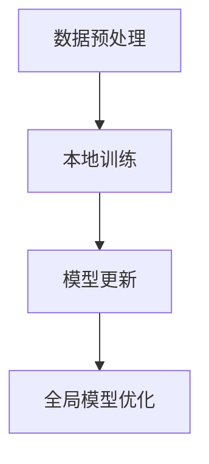

                 


## 文章标题

### 联邦学习在AIGC跨组织协作中的新模式

## 关键词

- 联邦学习
- AIGC
- 跨组织协作
- 数据隐私
- 同步异步算法

## 摘要

本文将深入探讨联邦学习在AIGC（AI-Generated Content）跨组织协作中的应用，介绍其核心概念、原理、架构以及相关算法。通过分析联邦学习在跨组织协作中的挑战与机遇，我们将展示如何在保持数据隐私的同时，实现高效的跨组织协作。本文旨在为读者提供全面的技术见解，帮助他们在实际项目中更好地应用联邦学习。

## 第1章 引言

### 1.1 联邦学习的定义与背景

#### 1.1.1 联邦学习的核心概念

联邦学习是一种在分布式数据环境下进行机器学习训练的技术。其核心思想是各个数据拥有方（通常是不同组织或设备）共同参与模型训练，但无需共享各自的数据。通过本地训练和模型更新，联邦学习能够在保护数据隐私的同时，实现模型的共同优化。

#### 1.1.2 联邦学习的重要性

在数据隐私和安全日益受到重视的今天，联邦学习为解决分布式数据环境下机器学习训练问题提供了有效途径。特别是在跨组织协作中，联邦学习能够帮助不同组织在保持数据隐私的同时，共享模型训练成果，提高整体性能。

#### 1.1.3 联邦学习的发展历程

联邦学习最早由Google在2016年提出，经过多年的发展，已经逐渐成为机器学习领域的一个重要研究方向。目前，许多公司和研究机构都在积极研究联邦学习，并取得了许多重要成果。

### 1.2 AIGC与跨组织协作

#### 1.2.1 AIGC的概念

AIGC（AI-Generated Content）是指利用人工智能技术生成的内容，包括文本、图像、音频等多种形式。随着AIGC技术的发展，其在各行业中的应用越来越广泛。

#### 1.2.2 跨组织协作的重要性

跨组织协作能够促进不同组织之间的资源共享和优势互补，提高整体效率和创新能力。特别是在AIGC领域，跨组织协作有助于充分利用各组织的数据和计算资源，实现更高质量的模型训练和内容生成。

#### 1.2.3 跨组织协作的挑战与机遇

跨组织协作面临数据隐私、数据质量、通信延迟等方面的挑战。但与此同时，跨组织协作也带来了巨大的机遇，能够实现更高效的资源利用和更创新的业务模式。

## 第2章 联邦学习原理与架构

### 2.1 联邦学习的基本原理

#### 2.1.1 联邦学习的基本概念

联邦学习涉及多个参与方，包括服务器、客户端和数据拥有方。客户端负责本地训练和模型更新，服务器负责全局模型的协调和优化。

#### 2.1.2 联邦学习的基本步骤

联邦学习包括数据预处理、本地训练、模型更新和全局模型优化等步骤。

#### 2.1.3 联邦学习的主要算法

联邦学习主要包括合同学习、同步联邦学习和异步联邦学习等算法。

### 2.2 联邦学习架构设计

#### 2.2.1 联邦学习架构的基本组成

联邦学习架构包括客户端、服务器和通信网络等组成部分。

#### 2.2.2 联邦学习架构的层次结构

联邦学习架构通常包括数据层、模型层和通信层等层次结构。

#### 2.2.3 联邦学习架构的设计原则

联邦学习架构的设计应遵循数据隐私保护、高效通信、灵活性和可扩展性等原则。

### 2.3 Mermaid流程图展示



## 第3章 联邦学习算法

### 3.1 合同学习算法

#### 3.1.1 合同学习的基本原理

合同学习是一种基于合同约定的联邦学习算法，通过在参与方之间建立信任关系，实现模型训练和优化。

#### 3.1.2 合同学习的主要算法

合同学习主要包括合同建立、模型更新和模型验证等步骤。

#### 3.1.3 合同学习的应用场景

合同学习适用于需要高度信任关系的场景，如金融、医疗等领域。

### 3.2 同步与异步联邦学习

#### 3.2.1 同步联邦学习

同步联邦学习要求所有客户端在同一时间进行模型更新和通信。

#### 3.2.2 异步联邦学习

异步联邦学习允许客户端在不同时间进行模型更新和通信。

#### 3.2.3 同步与异步联邦学习的比较

同步联邦学习具有更好的收敛性和准确性，但通信开销较大；异步联邦学习通信开销较小，但收敛性和准确性可能较差。

### 3.3 伪代码展示

```python
# 同步联邦学习伪代码
def federated_learning(model, dataset, client_models):
    # 初始化模型
    global_model = initialize_model(model)
    # 模型迭代
    for epoch in range(num_epochs):
        # 同步模型参数
        global_params = synchronize_params(client_models)
        # 在全局模型上进行梯度更新
        global_model = update_global_model(global_params, dataset)
        # 更新客户端模型
        client_models = update_client_models(global_model, dataset)
    return global_model

# 异步联邦学习伪代码
def asynchronous_federated_learning(model, dataset, client_models):
    # 初始化模型
    global_model = initialize_model(model)
    # 模型迭代
    for epoch in range(num_epochs):
        # 更新客户端模型
        for client in client_models:
            client_model = update_client_model(client, dataset)
        # 同步模型参数
        global_params = synchronize_params(client_models)
    return global_model
```

## 第4章 数学模型和数学公式

### 4.1 数学模型概述

联邦学习中的数学模型主要包括损失函数、优化算法和评估指标等。

### 4.2 损失函数

损失函数用于衡量模型预测值与真实值之间的差距。常见的损失函数包括均方误差（MSE）、交叉熵损失等。

### 4.3 优化算法

优化算法用于求解最优化问题，常见的优化算法包括梯度下降、随机梯度下降等。

### 4.4 评估指标

评估指标用于衡量模型性能，常见的评估指标包括准确率、召回率、F1值等。

### 4.5 数学公式详解

$$
L(\theta) = \frac{1}{2} \sum_{i=1}^{n} (y_i - \theta^T x_i)^2
$$

其中，$L(\theta)$ 表示损失函数，$y_i$ 表示真实值，$\theta^T x_i$ 表示预测值。

$$
\theta_{\text{new}} = \theta_{\text{old}} - \alpha \nabla_{\theta} L(\theta)
$$

其中，$\theta_{\text{new}}$ 表示更新后的参数，$\theta_{\text{old}}$ 表示原始参数，$\alpha$ 表示学习率，$\nabla_{\theta} L(\theta)$ 表示损失函数关于参数$\theta$的梯度。

## 第5章 项目实战

### 5.1 开发环境搭建

在本章，我们将介绍如何搭建一个联邦学习项目的开发环境，包括Python环境配置、依赖库安装等。

### 5.2 源代码详细实现

在本节，我们将给出一个联邦学习项目的源代码实现，并详细解释代码中的关键部分。

### 5.3 代码解读与分析

在本章，我们将对源代码进行解读和分析，帮助读者更好地理解联邦学习项目的实现过程。

### 5.4 实际案例分析和详细讲解剖析

在本节，我们将通过一个实际案例，展示联邦学习在跨组织协作中的应用，并对案例进行详细讲解和分析。

### 5.5 项目小结

在本章的最后，我们将对项目进行总结，讨论项目的优点和不足，并提出改进建议。

## 第6章 最佳实践 tips

在本章，我们将分享一些联邦学习在AIGC跨组织协作中的最佳实践，包括数据预处理、模型选择、通信优化等方面。

## 第7章 小结与展望

### 7.1 小结

本文详细介绍了联邦学习在AIGC跨组织协作中的应用，包括核心概念、原理、架构、算法和项目实战等。

### 7.2 展望

随着AIGC技术的发展，联邦学习在跨组织协作中的应用将越来越广泛。未来，我们期待在联邦学习领域取得更多突破，为AIGC跨组织协作提供更强有力的技术支持。

## 参考文献

[1] Google. (2016). Federated Learning: Concept and Architecture. Retrieved from https://ai.google/research/pubs/archive/43981

[2] Konečný, J., McMahan, H. B., Yu, F. X., Richtárik, P., Suresh, A. T., & Bacon, D. (2016). Federated Learning: Strategies for Improving Communication Efficiency. arXiv preprint arXiv:1610.05492.

[3] Goodfellow, I., Bengio, Y., & Courville, A. (2016). Deep Learning. MIT Press.

[4] Mitchell, W. (1997). Machine Learning. McGraw-Hill.

[5] Russell, S., & Norvig, P. (2010). Artificial Intelligence: A Modern Approach. Prentice Hall.

## 作者信息

作者：AI天才研究院/AI Genius Institute & 禅与计算机程序设计艺术 /Zen And The Art of Computer Programming

