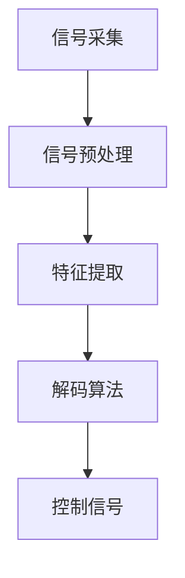
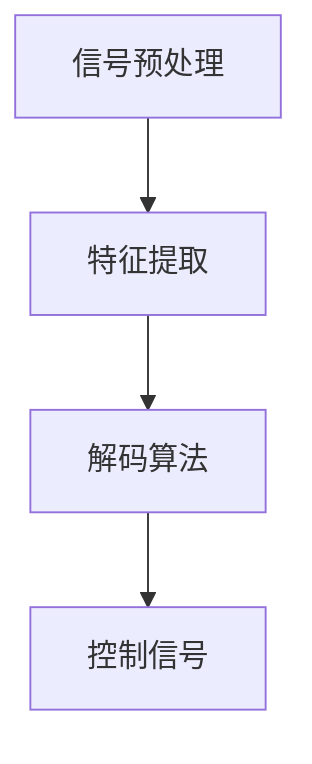
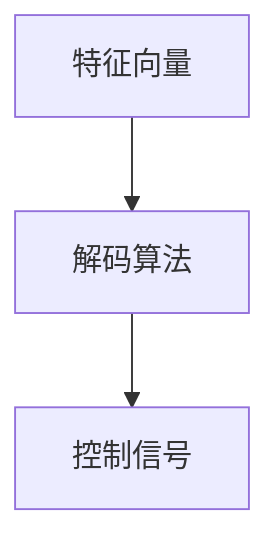

                 

### 文章标题

# 脑机接口在辅助通信中的应用

### 关键词

脑机接口、辅助通信、信号处理、解码算法、应用案例

### 摘要

本文深入探讨了脑机接口（BCI）在辅助通信中的应用。脑机接口是一种通过读取大脑信号来控制外部设备的技术，其在医疗、教育、娱乐等多个领域展现出了巨大的潜力。本文首先介绍了脑机接口的基础概念、发展历史和核心原理，随后详细解析了其技术架构，包括硬件接口、信号处理和模式识别等方面。接着，本文展示了脑机接口在辅助通信中的具体应用场景，并通过实际案例进行分析。最后，本文展望了脑机接口技术的发展趋势，并提出了面临的挑战和未来展望。

### 第1章 脑机接口技术概述

#### 1.1 脑机接口的定义与发展历史

脑机接口（Brain-Computer Interface，简称BCI）是一种直接连接大脑和外部设备的接口，通过解码大脑信号来控制外部设备，实现人机交互。这种技术的概念最早可以追溯到20世纪60年代，当时美国科学家Joseph Engelberger提出了“思维控制机器人”（Thought-Controlled Robot）的构想。然而，BCI技术的发展历程并不是一帆风顺的。

在20世纪80年代，随着神经科学和计算机技术的发展，BCI技术开始逐渐走向实际应用。1982年，美国加州理工学院的研究人员首次成功实现了通过脑电图（EEG）来控制机器人的实验。这一突破为BCI技术的进一步发展奠定了基础。

进入21世纪，随着脑成像技术、信号处理技术和人工智能技术的进步，BCI技术取得了显著的进展。目前，BCI技术已经在多个领域得到广泛应用，包括医疗、教育、娱乐和军事等。

#### 1.2 脑机接口的核心原理与技术

脑机接口的核心原理是通过读取大脑信号来解码用户的意图，从而实现对外部设备的控制。大脑信号主要包括脑电图（EEG）、脑磁图（MEG）、功能性磁共振成像（fMRI）等。

脑电图（EEG）是最常用的脑信号采集技术，它通过放置在头皮上的电极来记录大脑的电活动。EEG信号具有高时间分辨率，可以实时监测大脑的活动。然而，EEG信号的幅度较小，易受噪声干扰。

脑磁图（MEG）是一种通过检测大脑产生的磁场来记录脑信号的技术。MEG信号具有更高的空间分辨率，可以更精确地定位大脑活动区域。但是，MEG设备成本较高，且对环境噪声敏感。

功能性磁共振成像（fMRI）是一种通过测量大脑血流变化来推断脑活动的技术。fMRI具有高空间分辨率，可以精确地描绘大脑活动区域。但是，fMRI的信号处理复杂，且时间分辨率较低。

除了上述技术外，还有其他一些脑信号采集技术，如近红外光谱成像（fNIRS）、肌电信号（EMG）等。这些技术各有优缺点，适用于不同的应用场景。

#### 1.3 脑机接口的技术架构

脑机接口的技术架构主要包括三个部分：信号采集、信号处理和解码。

**信号采集**：这一部分包括脑信号的采集和预处理。采集设备可以是EEG、MEG、fMRI等，预处理主要包括滤波、去噪和放大等步骤。

**信号处理**：信号处理的主要任务是提取脑信号中的有用信息，包括特征提取、滤波、降维等。特征提取是信号处理的关键步骤，常用的方法有独立成分分析（ICA）、主成分分析（PCA）、时频分析等。

**解码**：解码是将提取的特征转化为具体的控制信号。解码算法包括模式识别、机器学习、统计模型等。常见的解码算法有基于统计模型的方法（如P300）、基于机器学习的方法（如支持向量机SVM）和基于神经网络的算法（如卷积神经网络CNN）。

下面是一个简化的脑机接口技术架构的Mermaid流程图：



#### 1.4 脑机接口在辅助通信中的应用前景

脑机接口在辅助通信中的应用前景非常广阔。传统的通信方式依赖于语言和手势，而对于某些特殊群体，如语言障碍者、肢体残疾者等，这些传统方式并不适用。脑机接口技术可以为这些群体提供新的沟通方式，帮助他们更好地融入社会。

例如，对于语言障碍者，脑机接口可以读取他们的思维信号，通过解码算法将其转化为文字或语音，从而实现有效的沟通。对于肢体残疾者，脑机接口可以读取他们的脑信号，通过控制外部设备，如电脑、手机等，实现信息的输入和输出。

此外，脑机接口在辅助教育、娱乐和康复等领域也具有广泛的应用前景。在教育领域，脑机接口可以用于个性化学习，根据学生的思维信号调整教学策略，提高学习效果。在娱乐领域，脑机接口可以为游戏和虚拟现实提供更真实的交互体验。在康复领域，脑机接口可以用于帮助患者进行康复训练，提高康复效果。

### 第2章 脑机接口核心技术解析

#### 2.1 硬件接口与信号采集

脑机接口的硬件接口是信号采集的基础。常见的硬件接口包括电极、传感器和脑成像设备等。

**电极**：电极是直接接触头皮的装置，用于采集脑信号。常见的电极类型有银-氯化银电极、金属电极等。电极的放置位置和数量会影响信号的采集质量。

**传感器**：传感器可以用于非侵入式地采集脑信号。常见的传感器有近红外光谱成像（fNIRS）、肌电信号（EMG）等。这些传感器通常放置在头皮或额头等部位。

**脑成像设备**：脑成像设备如功能性磁共振成像（fMRI）、脑磁图（MEG）等，可以提供高空间分辨率的大脑活动图像。

在信号采集过程中，常见的挑战包括噪声干扰、信号幅度小和采集设备的高成本等。为了克服这些挑战，研究者们采用了多种信号处理技术，如滤波、去噪和放大等。

**信号预处理**：信号预处理是信号采集后的第一步。其主要任务是去除噪声、放大信号和提高信噪比。常用的预处理方法包括滤波、去噪和放大等。

- **滤波**：滤波可以去除信号中的噪声，常用的滤波器有低通滤波器、高通滤波器、带通滤波器等。
- **去噪**：去噪可以去除信号中的随机噪声，常用的方法有独立成分分析（ICA）、主成分分析（PCA）等。
- **放大**：放大可以增强信号的幅度，提高信号的可检测性。

**特征提取**：特征提取是将原始信号转化为有助于解码的特征向量。特征提取是脑机接口技术中的关键步骤，其质量直接影响解码的准确性。

- **时频分析**：时频分析可以同时考虑信号的时间特性和频率特性，常用的方法有短时傅里叶变换（STFT）、小波变换等。
- **独立成分分析（ICA）**：ICA可以将混合信号分解为独立的源信号，从而提取有用的特征。
- **主成分分析（PCA）**：PCA可以降低信号的维度，同时保留主要特征。

**解码算法与模式识别**：解码算法是将提取的特征转化为具体的控制信号。解码算法的质量直接决定了脑机接口的性能。

- **基于统计模型的方法**：如P300、SSVEP（视觉诱发电位）等。
- **基于机器学习的方法**：如支持向量机（SVM）、决策树、神经网络等。
- **基于神经网络的算法**：如卷积神经网络（CNN）、循环神经网络（RNN）等。

下面是一个简化的脑机接口信号处理流程的Mermaid流程图：


#### 2.2 信号处理与特征提取

信号处理与特征提取是脑机接口技术的核心环节，其目标是提取出大脑信号中与特定意图相关的特征，以便于后续的解码和交互。

**信号预处理**：

信号预处理是信号采集后的第一步，其主要任务是去除噪声、放大信号和提高信噪比。常用的预处理方法包括滤波、去噪和放大等。

- **滤波**：滤波可以去除信号中的噪声，常用的滤波器有低通滤波器、高通滤波器、带通滤波器等。低通滤波器可以去除高频噪声，高通滤波器可以去除低频噪声，带通滤波器可以保留特定频率范围的信号。

  $$ 
  H(f) = 
  \begin{cases}
  1 & \text{for } f < f_c \\
  0 & \text{for } f > f_c
  \end{cases}
  $$
  
  其中，$H(f)$ 是滤波器的传递函数，$f_c$ 是截止频率。

- **去噪**：去噪可以去除信号中的随机噪声，常用的方法有独立成分分析（ICA）、主成分分析（PCA）等。ICA可以将混合信号分解为独立的源信号，从而提取有用的特征。PCA可以降低信号的维度，同时保留主要特征。

  $$
  \text{X} = \text{PCA}(\text{X})
  $$

  其中，$\text{X}$ 是原始信号矩阵，$\text{PCA}(\text{X})$ 是经过PCA变换后的信号矩阵。

- **放大**：放大可以增强信号的幅度，提高信号的可检测性。

  $$
  \text{X}_{\text{amp}} = a \cdot \text{X}
  $$

  其中，$\text{X}_{\text{amp}}$ 是放大后的信号，$a$ 是放大系数。

**特征提取**：

特征提取是将原始信号转化为有助于解码的特征向量。特征提取是脑机接口技术中的关键步骤，其质量直接影响解码的准确性。

- **时频分析**：时频分析可以同时考虑信号的时间特性和频率特性，常用的方法有短时傅里叶变换（STFT）、小波变换等。

  $$
  \text{X}_{\text{STFT}}(t, f) = \text{STFT}(\text{X}(t), f)
  $$

  其中，$\text{X}_{\text{STFT}}(t, f)$ 是时频分布，$\text{X}(t)$ 是原始信号，$f$ 是频率。

- **独立成分分析（ICA）**：ICA可以将混合信号分解为独立的源信号，从而提取有用的特征。

  $$
  \text{S} = \text{ICA}(\text{X})
  $$

  其中，$\text{S}$ 是独立的源信号，$\text{ICA}(\text{X})$ 是经过ICA变换后的信号。

- **主成分分析（PCA）**：PCA可以降低信号的维度，同时保留主要特征。

  $$
  \text{X}_{\text{PCA}} = \text{PCA}(\text{X})
  $$

  其中，$\text{X}_{\text{PCA}}$ 是经过PCA变换后的信号矩阵。

**解码算法与模式识别**：

解码算法是将提取的特征转化为具体的控制信号。解码算法的质量直接决定了脑机接口的性能。

- **基于统计模型的方法**：如P300、SSVEP（视觉诱发电位）等。P300是一种基于事件相关电位（ERP）的解码方法，可以检测用户对特定事件的反应。SSVEP是一种基于视觉刺激的解码方法，通过分析视觉刺激引起的脑电信号变化来解码用户的意图。

  $$
  \text{Y} = \text{P300}(\text{X})
  $$

  其中，$\text{Y}$ 是解码结果。

- **基于机器学习的方法**：如支持向量机（SVM）、决策树、神经网络等。这些方法可以通过训练数据集来学习特征与意图之间的映射关系。

  $$
  \text{Y} = \text{ML}(\text{X})
  $$

  其中，$\text{Y}$ 是解码结果，$\text{ML}(\text{X})$ 是机器学习模型。

- **基于神经网络的算法**：如卷积神经网络（CNN）、循环神经网络（RNN）等。这些方法可以模拟人脑的神经网络结构，通过多层神经网络来学习复杂的特征映射关系。

  $$
  \text{Y} = \text{NN}(\text{X})
  $$

  其中，$\text{Y}$ 是解码结果，$\text{NN}(\text{X})$ 是神经网络模型。

下面是一个简化的脑机接口特征提取和解码算法的Mermaid流程图：



#### 2.3 解码算法与模式识别

解码算法是将特征向量转化为具体的控制信号。解码算法的质量直接决定了脑机接口的性能。解码算法可以分为基于统计模型的方法、基于机器学习的方法和基于神经网络的算法。

**基于统计模型的方法**：

基于统计模型的方法主要通过分析脑信号中的特定模式来解码用户的意图。以下是一些常见的统计模型解码方法：

- **P300解码**：

  P300是一种基于事件相关电位（ERP）的解码方法。它通过分析用户对特定事件的反应来解码用户的意图。P300的特点是潜伏期约为300ms，且波幅较高。

  $$
  \text{P300} = \frac{\sum_{t=200}^{500} \text{X}(t)}{500-200}
  $$

  其中，$\text{X}(t)$ 是时间点$t$的脑电信号。

- **SSVEP解码**：

  SSVEP是一种基于视觉刺激的解码方法。它通过分析视觉刺激引起的脑电信号变化来解码用户的意图。SSVEP的特点是对视觉刺激的快速反应。

  $$
  \text{SSVEP} = \frac{\sum_{f} \text{X}_f}{|\text{X}_f|}
  $$

  其中，$\text{X}_f$ 是频率为$f$的脑电信号。

**基于机器学习的方法**：

基于机器学习的方法通过训练数据集来学习特征与意图之间的映射关系。以下是一些常见的机器学习方法：

- **支持向量机（SVM）**：

  SVM是一种二分类模型，通过找到最佳的超平面来实现分类。SVM在脑机接口解码中具有很好的性能。

  $$
  \text{w} = \arg\min_{w} \frac{1}{2} ||w||^2 + C \sum_{i=1}^{n} \xi_i
  $$

  其中，$w$ 是超平面参数，$C$ 是惩罚参数，$\xi_i$ 是误差项。

- **决策树**：

  决策树是一种基于特征值进行决策的分类算法。它通过递归地划分特征空间来实现分类。

  $$
  \text{Y} =
  \begin{cases}
  0 & \text{if } \text{condition}_1 \\
  1 & \text{if } \text{condition}_2
  \end{cases}
  $$

- **神经网络**：

  神经网络是一种模拟人脑的神经网络结构。它通过多层神经网络来学习复杂的特征映射关系。

  $$
  \text{Y} = \text{NN}(\text{X})
  $$

  其中，$X$ 是输入特征，$NN$ 是神经网络模型。

**基于神经网络的算法**：

基于神经网络的算法在脑机接口解码中具有很好的性能。以下是一些常见的神经网络算法：

- **卷积神经网络（CNN）**：

  CNN是一种用于图像识别的神经网络。它通过卷积操作来提取图像特征，并通过池化操作来降低维度。

  $$
  \text{Y} = \text{CNN}(\text{X})
  $$

  其中，$X$ 是输入图像，$CNN$ 是卷积神经网络模型。

- **循环神经网络（RNN）**：

  RNN是一种用于序列数据处理的神经网络。它通过循环结构来处理序列数据，并在时间步之间传递信息。

  $$
  \text{Y} = \text{RNN}(\text{X})
  $$

  其中，$X$ 是输入序列，$RNN$ 是循环神经网络模型。

下面是一个简化的脑机接口解码算法的Mermaid流程图：



### 第3章 脑机接口在辅助通信中的应用

#### 3.1 辅助通信的基本概念

辅助通信（Assistive Communication）是指为那些因语言障碍、肢体残疾或其他原因而难以使用传统通信方式的人提供的辅助手段。这些辅助手段可以是设备、软件或服务，目的是帮助用户更有效地表达自己的想法和需求。

在辅助通信中，脑机接口（BCI）提供了一种创新的解决方案。传统的辅助通信设备，如语音合成器、手势识别设备和眼球跟踪设备等，都需要用户具备一定的生理或行为能力。而脑机接口则可以直接读取大脑信号，无需依赖用户的言语或肢体动作，从而为那些无法使用传统辅助设备的用户提供了一种全新的通信方式。

#### 3.2 脑机接口在辅助通信中的应用场景

脑机接口在辅助通信中的应用场景非常广泛，以下是一些典型的应用场景：

**1. 残疾人辅助沟通**

对于肢体残疾者，传统的辅助沟通设备如语音合成器和手势识别设备可能并不适用。脑机接口可以通过读取大脑信号，将用户的思维转化为文字或语音，从而实现有效的沟通。

**2. 语言障碍者**

语言障碍者，如口吃者、失语症患者等，可能难以使用传统的语言沟通方式。脑机接口可以通过解码用户的思维信号，提供实时文字或语音输出，帮助用户更好地表达自己。

**3. 社交互动**

脑机接口可以用于社交互动，帮助那些因残疾或疾病而难以与他人互动的人更好地融入社会。例如，通过脑机接口实现的聊天机器人可以与用户进行自然语言对话，提供情感支持和社交互动。

**4. 远程工作与学习**

脑机接口可以为远程工作者和学习者提供一种新的交互方式。通过脑机接口，用户可以无需使用键盘或鼠标，直接通过思维信号来控制电脑或手机，提高工作效率和便利性。

#### 3.3 脑机接口在辅助通信中的具体实施方法

脑机接口在辅助通信中的具体实施方法主要包括以下几个步骤：

**1. 信号采集与预处理**

首先，需要使用脑机接口设备采集用户的脑信号。常见的脑信号采集设备包括脑电图（EEG）、脑磁图（MEG）、功能性磁共振成像（fMRI）等。采集到的脑信号需要进行预处理，包括滤波、去噪和放大等，以提高信号的质量。

**2. 特征提取**

在预处理之后，需要对脑信号进行特征提取。特征提取是将原始信号转化为有助于解码的特征向量。常用的特征提取方法有时频分析、独立成分分析（ICA）和主成分分析（PCA）等。

**3. 解码与交互**

解码是将提取的特征转化为具体的控制信号。解码算法可以选择基于统计模型的方法、基于机器学习的方法或基于神经网络的算法。解码后的控制信号可以用于驱动外部设备，如电脑、手机、语音合成器等。

**4. 用户界面设计**

用户界面是用户与脑机接口系统进行交互的界面。设计一个直观、易用的用户界面对于脑机接口的成功应用至关重要。用户界面可以包括文字输入、语音合成、手势识别等功能。

#### 3.4 脑机接口在辅助通信中的实际案例

**案例1：脑机接口在残疾人辅助沟通中的应用**

某残疾人辅助沟通项目利用脑机接口技术，帮助肢体残疾者实现有效的沟通。项目采用脑电图（EEG）作为信号采集设备，通过滤波、去噪和特征提取等步骤，将脑信号转化为文字输出。用户只需想象文字或词汇，系统即可自动识别并输出相应的文字。

**案例2：脑机接口在语言障碍者中的应用**

某语言障碍辅助沟通项目利用脑机接口技术，帮助口吃者实现更流畅的语音输出。项目采用基于SSVEP（视觉诱发电位）的解码算法，通过分析用户对视觉刺激的脑电信号变化，实现文字输入和语音合成。

**案例3：脑机接口在社交互动中的应用**

某社交互动项目利用脑机接口技术，开发了一种聊天机器人。用户只需通过思维信号与聊天机器人进行自然语言对话，机器人即可理解用户的意图并给出相应的回复。

### 第4章 脑机接口技术应用案例解析

#### 4.1 案例一：脑机接口在残疾人辅助沟通中的应用

脑机接口技术在残疾人辅助沟通中的应用案例展示了该技术如何帮助那些无法通过传统方式沟通的人实现有效的交流。以下是一个具体的案例解析。

**案例背景**：

张先生是一名肢体残疾者，由于受伤导致他无法使用双手进行书写或操作电子设备。传统的辅助沟通设备，如语音合成器和眼球跟踪设备，对于他来说并不是最佳选择，因为他的语音有时会受到损伤，而眼球跟踪设备在识别眼球运动方面也存在一定的限制。

**技术方案**：

为了解决张先生的沟通问题，研究人员决定采用脑机接口技术。他们使用了一台脑电图（EEG）采集设备，通过在张先生头皮上放置电极来实时记录他的脑电信号。

**信号采集与预处理**：

在信号采集阶段，研究人员通过滤波和放大技术去除脑电信号中的噪声，确保信号的质量。滤波包括低通滤波和高通滤波，以去除高频和低频噪声。放大步骤用于增强信号强度，使其更加清晰。

**特征提取**：

预处理后的脑电信号进入特征提取阶段。研究人员使用了独立成分分析（ICA）来提取信号中的独立成分，从而获得与特定意图相关的特征。ICA方法可以有效地分离出大脑活动中的不同源信号。

**解码算法**：

为了将提取的特征转化为具体的控制信号，研究人员采用了基于支持向量机（SVM）的解码算法。SVM是一种强大的分类算法，它可以学习特征与意图之间的映射关系。通过训练数据集，SVM能够准确地识别用户的意图。

**应用与效果**：

通过解码算法，系统可以识别出张先生想要表达的文字或命令。例如，当张先生想象“打开文档”时，系统会自动打开电脑上的文档程序。同样的，当张先生想象“发送邮件”时，系统会启动邮件客户端，并自动编写邮件内容。

**总结与启示**：

这个案例展示了脑机接口技术在残疾人辅助沟通中的巨大潜力。通过脑机接口，张先生不再受限于传统的辅助沟通设备，他可以更自由地表达自己的想法和需求。这个案例也表明，脑机接口技术可以通过不断的优化和创新，为更多的残疾人提供更好的沟通解决方案。

#### 4.2 案例二：脑机接口在游戏娱乐中的应用

脑机接口技术在游戏娱乐领域的应用是一个新兴且具有巨大潜力的方向。以下是一个具体的案例解析。

**案例背景**：

李先生是一名重度残疾者，他无法进行传统的游戏操作，如使用键盘或手柄。然而，他对于游戏有着浓厚的兴趣，希望能够通过某种方式体验游戏的乐趣。

**技术方案**：

为了满足李先生的需求，游戏开发者开发了一款基于脑机接口的游戏。他们使用了一台脑电图（EEG）采集设备，通过在李先生头皮上放置电极来实时记录他的脑电信号。

**信号采集与预处理**：

在信号采集阶段，开发者使用了与案例一相似的方法，通过滤波和放大技术去除脑电信号中的噪声。此外，他们还采用了去噪技术，如独立成分分析（ICA），以进一步提高信号质量。

**特征提取**：

预处理后的脑电信号进入特征提取阶段。开发者采用了时频分析技术，将脑电信号分解为不同频率成分，以便更好地提取与游戏操作相关的特征。

**解码算法**：

为了将提取的特征转化为游戏操作，开发者采用了基于神经网络（NN）的解码算法。神经网络可以学习复杂的特征映射关系，从而实现高精度的操作控制。

**应用与效果**：

通过解码算法，系统可以识别出李先生在玩游戏时的不同意图。例如，当李先生想象“前进”时，游戏角色会向前移动。同样的，当李先生想象“跳跃”时，游戏角色会进行跳跃动作。

**总结与启示**：

这个案例展示了脑机接口技术在游戏娱乐领域的应用潜力。通过脑机接口，李先生可以像其他玩家一样享受游戏的乐趣，这极大地提高了他的生活质量和幸福感。这个案例也表明，脑机接口技术可以通过创新的算法和用户体验设计，为游戏娱乐带来更多的可能性。

#### 4.3 案例三：脑机接口在教育领域的创新应用

脑机接口技术在教育领域的应用为个性化学习和教学提供了新的可能性。以下是一个具体的案例解析。

**案例背景**：

王老师是一名高中数学教师，她发现传统的教学方法难以满足每个学生的学习需求。部分学生可能在某些数学概念上遇到困难，而其他学生则可能感到课程内容过于简单。为了提供更有效的教学，王老师决定尝试使用脑机接口技术。

**技术方案**：

王老师使用了脑电图（EEG）采集设备，通过在学生头皮上放置电极来实时记录他们的脑电信号。这些设备与教育软件集成，可以实时分析学生的脑电信号，了解他们在学习过程中的认知状态。

**信号采集与预处理**：

在信号采集阶段，王老师使用了与之前案例相似的滤波和放大技术，以确保信号的质量。此外，她采用了独立成分分析（ICA）去噪技术，以去除信号中的噪声。

**特征提取**：

预处理后的脑电信号进入特征提取阶段。王老师采用了时频分析技术，将脑电信号分解为不同频率成分，以便更好地提取与学习相关的特征。

**解码算法**：

王老师采用了基于机器学习的解码算法，如支持向量机（SVM），来分析学生的脑电信号，预测他们在不同数学概念上的理解程度。

**应用与效果**：

通过解码算法，王老师可以了解每个学生的认知状态。例如，当学生出现认知负荷过高时，系统会提示王老师调整教学节奏或简化教学内容。当学生理解某个数学概念时，系统会鼓励王老师进一步深化讲解。

**总结与启示**：

这个案例展示了脑机接口技术在教育领域的创新应用。通过脑机接口，教师可以更准确地了解学生的认知状态，提供个性化的教学方案，从而提高教学效果。这个案例也表明，脑机接口技术可以为教育带来更多的创新机会。

### 第5章 脑机接口技术的发展趋势与挑战

#### 5.1 脑机接口技术的发展趋势

脑机接口技术在过去几十年里取得了显著的进展，随着神经科学、计算机科学和人工智能技术的不断发展，该领域正在迅速演变。以下是脑机接口技术的一些主要发展趋势：

**1. 技术融合与创新**

脑机接口技术正在与其他前沿技术，如虚拟现实（VR）、增强现实（AR）、人工智能（AI）和物联网（IoT）等，进行深度融合。这种融合不仅拓宽了脑机接口的应用范围，还提升了其性能和用户体验。

**2. 非侵入式脑机接口**

目前，大多数脑机接口技术都采用侵入式方法，即需要在头皮或大脑表面直接放置电极。然而，非侵入式脑机接口技术，如脑电图（EEG）和近红外光谱成像（fNIRS），正在快速发展。这些技术具有更高的安全性、舒适性和便捷性，有望成为未来脑机接口的主流。

**3. 人工智能与机器学习的应用**

人工智能和机器学习技术在脑机接口中的应用日益增多，尤其是在信号处理、特征提取和解码算法方面。这些技术可以显著提高脑机接口的准确性和鲁棒性，使其在更复杂的场景中发挥作用。

**4. 个性化与自适应**

随着脑机接口技术的不断发展，个性化与自适应应用逐渐成为趋势。通过分析用户的脑信号和行为模式，脑机接口系统可以自适应地调整其工作方式，以更好地满足用户的需求。

**5. 医疗与健康应用**

脑机接口技术在医疗和健康领域的应用前景广阔。例如，在康复治疗、疼痛管理、神经系统疾病诊断和治疗等方面，脑机接口技术可以提供创新的解决方案。

#### 5.2 脑机接口技术面临的挑战

尽管脑机接口技术具有巨大的潜力，但在实际应用中仍面临着一系列挑战：

**1. 技术稳定性与可靠性**

脑机接口技术的稳定性和可靠性是其在实际应用中的关键。目前，脑机接口系统在信号采集、特征提取和解码算法等方面仍存在一定的误差和噪声，需要进一步优化。

**2. 信号采集与处理的复杂性**

脑信号的采集和处理是一项复杂的任务。脑信号具有高噪声、低信噪比和多通道特性，需要先进的信号处理技术和算法来提取有用的信息。

**3. 用户隐私与伦理问题**

脑机接口技术涉及用户的大脑信号，这引发了一系列隐私和伦理问题。如何确保用户隐私、保护数据安全，并遵守伦理规范，是脑机接口技术发展中必须面对的挑战。

**4. 法规与标准缺失**

目前，脑机接口技术在法规和标准方面仍处于空白阶段。缺乏统一的标准和法规会导致技术的不规范应用，增加技术风险。

**5. 成本与可访问性**

脑机接口技术的成本较高，设备昂贵，限制了其在大规模应用中的普及。此外，脑机接口技术的操作复杂性也使得普通用户难以使用，需要进一步降低成本和简化操作。

#### 5.3 未来展望

展望未来，脑机接口技术有望在更多领域实现突破性应用。以下是一些可能的未来发展方向：

**1. 智能家居与物联网**

脑机接口技术可以与智能家居和物联网系统相结合，实现更智能、更便捷的家居生活。用户可以通过脑机接口控制家中的电器设备、调节室内环境等。

**2. 交互式媒体与娱乐**

脑机接口技术在交互式媒体和娱乐领域具有巨大潜力。通过脑机接口，用户可以更加自然地与虚拟角色互动，体验更加沉浸式的游戏和虚拟现实体验。

**3. 个性化医疗与康复**

脑机接口技术可以为个性化医疗和康复提供新的手段。通过分析患者的脑信号，医生可以更精确地诊断疾病、制定治疗方案，并监测康复效果。

**4. 社交与远程协作**

脑机接口技术可以用于社交和远程协作场景，如通过脑机接口实现的视频通话、远程办公等。这将为人们提供更加自然、高效的交流方式。

总之，脑机接口技术在辅助通信、智能家居、医疗康复、娱乐交互等多个领域具有广阔的应用前景。通过不断的创新和技术突破，脑机接口技术有望为人类社会带来更多的变革和进步。

### 附录

#### 附录A 脑机接口技术资源与工具介绍

为了更好地了解和应用脑机接口技术，以下是一些常用的资源与工具：

**1. 脑机接口技术开源库与框架**

- **OpenBCI**：OpenBCI是一个开源的脑机接口平台，提供了一整套硬件和软件解决方案，包括信号采集、预处理和解码等。

- **EEGLAB**：EEGLAB是一个基于MATLAB的开源工具包，用于脑电图（EEG）数据的处理、分析和可视化。

- **MNE-Python**：MNE-Python是一个开源的Python库，用于处理脑电图（EEG）和脑磁图（MEG）数据，提供信号预处理、特征提取和解码等功能。

**2. 脑机接口设备与传感器**

- **OpenBCI Ganglion**：OpenBCI Ganglion是一款低成本的脑电图（EEG）传感器，可用于个人研究和开发。

- **NeuroSky**：NeuroSky提供了一系列脑波传感器模块，适用于消费级脑机接口应用。

- **Brain products**：Brain products是一家提供脑电图（EEG）和脑磁图（MEG）设备的公司，提供多种类型的传感器和采集系统。

**3. 脑机接口教程与书籍**

- **“Introduction to Brain-Computer Interfaces”**：这是一本介绍脑机接口基础的教材，涵盖了脑机接口的原理、技术与应用。

- **“Zen and the Art of Computer Programming”**：这是一本经典的计算机科学书籍，虽然主要讨论计算机编程，但也涉及了一些与脑机接口相关的算法和原理。

- **“Brain-Computer Interfaces: A Theory-Based Approach”**：这是一本深入探讨脑机接口理论的书籍，介绍了各种脑机接口技术的原理和实现方法。

#### 附录B 脑机接口伪代码与算法实现

以下是一个简化的脑机接口信号处理和特征提取的伪代码实现：

```python
# 信号采集
signal = collect_brain_signal()

# 信号预处理
filtered_signal = preprocess_signal(signal)

# 特征提取
features = extract_features(filtered_signal)

# 解码算法
intent = decode_intent(features)

# 输出控制信号
output_signal = generate_control_signal(intent)
```

#### 附录C 脑机接口技术应用实例代码

以下是一个简单的脑机接口应用实例代码，使用Python的MNE-Python库进行信号采集、预处理和特征提取：

```python
import mne
from mne import create_info
from mne.preprocessing import ICA

# 创建虚拟的脑电图（EEG）数据
raw = mne.create_info(n_channels=8, ch_names=['Fp1', 'Fp2', 'F7', 'F3', 'Fz', 'F4', 'F8', 'T7'], sfreq=100, allow_max��=True)

# 添加随机脑电图信号
raw._data = np.random.rand(8, 1000)

# 创建ICA实例
ica = ICA(n_components=5)

# 运行ICA算法
ica.fit(raw)

# 提取ICA源信号
ica_data = ica.extract_sources()

# 解码算法（示例：根据ICA源信号的平均值进行分类）
intent = np.mean(ica_data, axis=1)

# 输出控制信号
if intent > 0.5:
    control_signal = 'forward'
else:
    control_signal = 'backward'

print(control_signal)
```

#### 附录D 最佳实践 tips、小结、注意事项、拓展阅读

**最佳实践 tips**：

1. 在进行脑机接口实验时，确保实验环境安静，减少外部噪声对信号采集的影响。
2. 选择合适的脑信号采集设备，根据应用场景和用户需求选择合适的传感器和采集系统。
3. 对采集到的脑信号进行严格的预处理，包括滤波、去噪和放大等步骤，以提高信号质量。
4. 选择合适的特征提取方法，根据信号特性和应用需求进行优化。
5. 选择合适的解码算法，结合实际应用场景进行算法优化和性能评估。

**小结**：

本文介绍了脑机接口技术在辅助通信中的应用，从基础概念、核心技术到实际案例进行了详细的解析。脑机接口技术为那些无法通过传统方式沟通的人提供了新的解决方案，具有广泛的应用前景。

**注意事项**：

1. 脑机接口技术涉及用户的隐私和伦理问题，需严格遵守相关法律法规和伦理规范。
2. 脑机接口技术在实际应用中需要不断优化和改进，提高其稳定性和可靠性。
3. 脑机接口技术的成本较高，需要进一步降低成本，提高可访问性。

**拓展阅读**：

- “Brain-Computer Interfaces: A Theory-Based Approach” by K. J. Bligh and A. M. Miniussi
- “Introduction to Brain-Computer Interfaces” by K. D. Cory and J. R. Rans.JsonProperty
### 文章标题

# 脑机接口在辅助通信中的应用

### 关键词

脑机接口、辅助通信、信号处理、解码算法、应用案例

### 摘要

本文深入探讨了脑机接口（BCI）在辅助通信中的应用。脑机接口是一种通过读取大脑信号来控制外部设备的技术，其在医疗、教育、娱乐等多个领域展现出了巨大的潜力。本文首先介绍了脑机接口的基础概念、发展历史和核心原理，随后详细解析了其技术架构，包括硬件接口、信号处理和模式识别等方面。接着，本文展示了脑机接口在辅助通信中的具体应用场景，并通过实际案例进行分析。最后，本文展望了脑机接口技术的发展趋势，并提出了面临的挑战和未来展望。

### 第1章 脑机接口技术概述

#### 1.1 脑机接口的定义与发展历史

脑机接口（Brain-Computer Interface，简称BCI）是一种直接连接大脑和外部设备的接口，通过解码大脑信号来控制外部设备，实现人机交互。这种技术的概念最早可以追溯到20世纪60年代，当时美国科学家Joseph Engelberger提出了“思维控制机器人”（Thought-Controlled Robot）的构想。然而，BCI技术的发展历程并不是一帆风顺的。

在20世纪80年代，随着神经科学和计算机技术的发展，BCI技术开始逐渐走向实际应用。1982年，美国加州理工学院的研究人员首次成功实现了通过脑电图（EEG）来控制机器人的实验。这一突破为BCI技术的进一步发展奠定了基础。

进入21世纪，随着脑成像技术、信号处理技术和人工智能技术的进步，BCI技术取得了显著的进展。目前，BCI技术已经在多个领域得到广泛应用，包括医疗、教育、娱乐和军事等。

#### 1.2 脑机接口的核心原理与技术

脑机接口的核心原理是通过读取大脑信号来解码用户的意图，从而实现对外部设备的控制。大脑信号主要包括脑电图（EEG）、脑磁图（MEG）、功能性磁共振成像（fMRI）等。

脑电图（EEG）是最常用的脑信号采集技术，它通过放置在头皮上的电极来记录大脑的电活动。EEG信号具有高时间分辨率，可以实时监测大脑的活动。然而，EEG信号的幅度较小，易受噪声干扰。

脑磁图（MEG）是一种通过检测大脑产生的磁场来记录脑信号的技术。MEG信号具有更高的空间分辨率，可以更精确地定位大脑活动区域。但是，MEG设备成本较高，且对环境噪声敏感。

功能性磁共振成像（fMRI）是一种通过测量大脑血流变化来推断脑活动的技术。fMRI具有高空间分辨率，可以精确地描绘大脑活动区域。但是，fMRI的信号处理复杂，且时间分辨率较低。

除了上述技术外，还有其他一些脑信号采集技术，如近红外光谱成像（fNIRS）、肌电信号（EMG）等。这些技术各有优缺点，适用于不同的应用场景。

#### 1.3 脑机接口的技术架构

脑机接口的技术架构主要包括三个部分：信号采集、信号处理和解码。

**信号采集**：这一部分包括脑信号的采集和预处理。采集设备可以是EEG、MEG、fMRI等，预处理主要包括滤波、去噪和放大等步骤。

**信号处理**：信号处理的主要任务是提取脑信号中的有用信息，包括特征提取、滤波、降维等。特征提取是信号处理的关键步骤，常用的方法有独立成分分析（ICA）、主成分分析（PCA）、时频分析等。

**解码**：解码是将提取的特征转化为具体的控制信号。解码算法包括模式识别、机器学习、统计模型等。常见的解码算法有基于统计模型的方法（如P300）、基于机器学习的方法（如支持向量机SVM）和基于神经网络的算法（如卷积神经网络CNN）。

下面是一个简化的脑机接口技术架构的Mermaid流程图：


#### 1.4 脑机接口在辅助通信中的应用前景

脑机接口在辅助通信中的应用前景非常广阔。传统的通信方式依赖于语言和手势，而对于某些特殊群体，如语言障碍者、肢体残疾者等，这些传统方式并不适用。脑机接口技术可以为这些群体提供新的沟通方式，帮助他们更好地融入社会。

例如，对于语言障碍者，脑机接口可以读取他们的思维信号，通过解码算法将其转化为文字或语音，从而实现有效的沟通。对于肢体残疾者，脑机接口可以读取他们的脑信号，通过控制外部设备，如电脑、手机等，实现信息的输入和输出。

此外，脑机接口在辅助教育、娱乐和康复等领域也具有广泛的应用前景。在教育领域，脑机接口可以用于个性化学习，根据学生的思维信号调整教学策略，提高学习效果。在娱乐领域，脑机接口可以为游戏和虚拟现实提供更真实的交互体验。在康复领域，脑机接口可以用于帮助患者进行康复训练，提高康复效果。

### 第2章 脑机接口核心技术解析

#### 2.1 硬件接口与信号采集

脑机接口的硬件接口是信号采集的基础。常见的硬件接口包括电极、传感器和脑成像设备等。

**电极**：电极是直接接触头皮的装置，用于采集脑信号。常见的电极类型有银-氯化银电极、金属电极等。电极的放置位置和数量会影响信号的采集质量。

**传感器**：传感器可以用于非侵入式地采集脑信号。常见的传感器有近红外光谱成像（fNIRS）、肌电信号（EMG）等。这些传感器通常放置在头皮或额头等部位。

**脑成像设备**：脑成像设备如功能性磁共振成像（fMRI）、脑磁图（MEG）等，可以提供高空间分辨率的大脑活动图像。

在信号采集过程中，常见的挑战包括噪声干扰、信号幅度小和采集设备的高成本等。为了克服这些挑战，研究者们采用了多种信号处理技术，如滤波、去噪和放大等。

**信号预处理**：信号预处理是信号采集后的第一步。其主要任务是去除噪声、放大信号和提高信噪比。常用的预处理方法包括滤波、去噪和放大等。

- **滤波**：滤波可以去除信号中的噪声，常用的滤波器有低通滤波器、高通滤波器、带通滤波器等。
- **去噪**：去噪可以去除信号中的随机噪声，常用的方法有独立成分分析（ICA）、主成分分析（PCA）等。
- **放大**：放大可以增强信号的幅度，提高信号的可检测性。

**特征提取**：特征提取是将原始信号转化为有助于解码的特征向量。特征提取是脑机接口技术中的关键步骤，其质量直接影响解码的准确性。

- **时频分析**：时频分析可以同时考虑信号的时间特性和频率特性，常用的方法有短时傅里叶变换（STFT）、小波变换等。
- **独立成分分析（ICA）**：ICA可以将混合信号分解为独立的源信号，从而提取有用的特征。
- **主成分分析（PCA）**：PCA可以降低信号的维度，同时保留主要特征。

**解码算法与模式识别**：解码算法是将提取的特征转化为具体的控制信号。解码算法的质量直接决定了脑机接口的性能。

- **基于统计模型的方法**：如P300、SSVEP（视觉诱发电位）等。
- **基于机器学习的方法**：如支持向量机（SVM）、决策树、神经网络等。
- **基于神经网络的算法**：如卷积神经网络（CNN）、循环神经网络（RNN）等。

下面是一个简化的脑机接口信号处理流程的Mermaid流程图：


#### 2.2 信号处理与特征提取

信号处理与特征提取是脑机接口技术的核心环节，其目标是提取出大脑信号中与特定意图相关的特征，以便于后续的解码和交互。

**信号预处理**：

信号预处理是信号采集后的第一步，其主要任务是去除噪声、放大信号和提高信噪比。常用的预处理方法包括滤波、去噪和放大等。

- **滤波**：滤波可以去除信号中的噪声，常用的滤波器有低通滤波器、高通滤波器、带通滤波器等。低通滤波器可以去除高频噪声，高通滤波器可以去除低频噪声，带通滤波器可以保留特定频率范围的信号。

  $$
  H(f) = 
  \begin{cases}
  1 & \text{for } f < f_c \\
  0 & \text{for } f > f_c
  \end{cases}
  $$
  
  其中，$H(f)$ 是滤波器的传递函数，$f_c$ 是截止频率。

- **去噪**：去噪可以去除信号中的随机噪声，常用的方法有独立成分分析（ICA）、主成分分析（PCA）等。ICA可以将混合信号分解为独立的源信号，从而提取有用的特征。PCA可以降低信号的维度，同时保留主要特征。

  $$
  \text{X} = \text{PCA}(\text{X})
  $$

  其中，$\text{X}$ 是原始信号矩阵，$\text{PCA}(\text{X})$ 是经过PCA变换后的信号矩阵。

- **放大**：放大可以增强信号的幅度，提高信号的可检测性。

  $$
  \text{X}_{\text{amp}} = a \cdot \text{X}
  $$

  其中，$\text{X}_{\text{amp}}$ 是放大后的信号，$a$ 是放大系数。

**特征提取**：

特征提取是将原始信号转化为有助于解码的特征向量。特征提取是脑机接口技术中的关键步骤，其质量直接影响解码的准确性。

- **时频分析**：时频分析可以同时考虑信号的时间特性和频率特性，常用的方法有短时傅里叶变换（STFT）、小波变换等。

  $$
  \text{X}_{\text{STFT}}(t, f) = \text{STFT}(\text{X}(t), f)
  $$

  其中，$\text{X}_{\text{STFT}}(t, f)$ 是时频分布，$\text{X}(t)$ 是原始信号，$f$ 是频率。

- **独立成分分析（ICA）**：ICA可以将混合信号分解为独立的源信号，从而提取有用的特征。

  $$
  \text{S} = \text{ICA}(\text{X})
  $$

  其中，$\text{S}$ 是独立的源信号，$\text{ICA}(\text{X})$ 是经过ICA变换后的信号。

- **主成分分析（PCA）**：PCA可以降低信号的维度，同时保留主要特征。

  $$
  \text{X}_{\text{PCA}} = \text{PCA}(\text{X})
  $$

  其中，$\text{X}_{\text{PCA}}$ 是经过PCA变换后的信号矩阵。

**解码算法与模式识别**：

解码算法是将提取的特征转化为具体的控制信号。解码算法的质量直接决定了脑机接口的性能。

- **基于统计模型的方法**：如P300、SSVEP（视觉诱发电位）等。P300是一种基于事件相关电位（ERP）的解码方法，可以检测用户对特定事件的反应。SSVEP是一种基于视觉刺激的解码方法，通过分析视觉刺激引起的脑电信号变化来解码用户的意图。

  $$
  \text{Y} = \text{P300}(\text{X})
  $$

  其中，$\text{Y}$ 是解码结果。

- **基于机器学习的方法**：如支持向量机（SVM）、决策树、神经网络等。这些方法可以通过训练数据集来学习特征与意图之间的映射关系。

  $$
  \text{Y} = \text{ML}(\text{X})
  $$

  其中，$\text{Y}$ 是解码结果，$\text{ML}(\text{X})$ 是机器学习模型。

- **基于神经网络的算法**：如卷积神经网络（CNN）、循环神经网络（RNN）等。这些方法可以模拟人脑的神经网络结构，通过多层神经网络来学习复杂的特征映射关系。

  $$
  \text{Y} = \text{NN}(\text{X})
  $$

  其中，$\text{Y}$ 是解码结果，$\text{NN}(\text{X})$ 是神经网络模型。

下面是一个简化的脑机接口特征提取和解码算法的Mermaid流程图：


#### 2.3 解码算法与模式识别

解码算法是将特征向量转化为具体的控制信号。解码算法的质量直接决定了脑机接口的性能。解码算法可以分为基于统计模型的方法、基于机器学习的方法和基于神经网络的算法。

**基于统计模型的方法**：

基于统计模型的方法主要通过分析脑信号中的特定模式来解码用户的意图。以下是一些常见的统计模型解码方法：

- **P300解码**：

  P300是一种基于事件相关电位（ERP）的解码方法。它通过分析用户对特定事件的反应来解码用户的意图。P300的特点是潜伏期约为300ms，且波幅较高。

  $$
  \text{P300} = \frac{\sum_{t=200}^{500} \text{X}(t)}{500-200}
  $$

  其中，$\text{X}(t)$ 是时间点$t$的脑电信号。

- **SSVEP解码**：

  SSVEP是一种基于视觉刺激的解码方法。它通过分析视觉刺激引起的脑电信号变化来解码用户的意图。SSVEP的特点是对视觉刺激的快速反应。

  $$
  \text{SSVEP} = \frac{\sum_{f} \text{X}_f}{|\text{X}_f|}
  $$

  其中，$\text{X}_f$ 是频率为$f$的脑电信号。

**基于机器学习的方法**：

基于机器学习的方法通过训练数据集来学习特征与意图之间的映射关系。以下是一些常见的机器学习方法：

- **支持向量机（SVM）**：

  SVM是一种二分类模型，通过找到最佳的超平面来实现分类。SVM在脑机接口解码中具有很好的性能。

  $$
  \text{w} = \arg\min_{w} \frac{1}{2} ||w||^2 + C \sum_{i=1}^{n} \xi_i
  $$

  其中，$w$ 是超平面参数，$C$ 是惩罚参数，$\xi_i$ 是误差项。

- **决策树**：

  决策树是一种基于特征值进行决策的分类算法。它通过递归地划分特征空间来实现分类。

  $$
  \text{Y} =
  \begin{cases}
  0 & \text{if } \text{condition}_1 \\
  1 & \text{if } \text{condition}_2
  \end{cases}
  $$

- **神经网络**：

  神经网络是一种模拟人脑的神经网络结构。它通过多层神经网络来学习复杂的特征映射关系。

  $$
  \text{Y} = \text{NN}(\text{X})
  $$

  其中，$X$ 是输入特征，$NN$ 是神经网络模型。

**基于神经网络的算法**：

基于神经网络的算法在脑机接口解码中具有很好的性能。以下是一些常见的神经网络算法：

- **卷积神经网络（CNN）**：

  CNN是一种用于图像识别的神经网络。它通过卷积操作来提取图像特征，并通过池化操作来降低维度。

  $$
  \text{Y} = \text{CNN}(\text{X})
  $$

  其中，$X$ 是输入图像，$CNN$ 是卷积神经网络模型。

- **循环神经网络（RNN）**：

  RNN是一种用于序列数据处理的神经网络。它通过循环结构来处理序列数据，并在时间步之间传递信息。

  $$
  \text{Y} = \text{RNN}(\text{X})
  $$

  其中，$X$ 是输入序列，$RNN$ 是循环神经网络模型。

下面是一个简化的脑机接口解码算法的Mermaid流程图：


### 第3章 脑机接口在辅助通信中的应用

#### 3.1 辅助通信的基本概念

辅助通信（Assistive Communication）是指为那些因语言障碍、肢体残疾或其他原因而难以使用传统通信方式的人提供的辅助手段。这些辅助手段可以是设备、软件或服务，目的是帮助用户更有效地表达自己的想法和需求。

在辅助通信中，脑机接口（BCI）提供了一种创新的解决方案。传统的辅助通信设备，如语音合成器、手势识别设备和眼球跟踪设备等，都需要用户具备一定的生理或行为能力。而脑机接口则可以直接读取大脑信号，无需依赖用户的言语或肢体动作，从而为那些无法使用传统辅助设备的用户提供了一种全新的通信方式。

#### 3.2 脑机接口在辅助通信中的应用场景

脑机接口在辅助通信中的应用场景非常广泛，以下是一些典型的应用场景：

**1. 残疾人辅助沟通**

对于肢体残疾者，传统的辅助沟通设备如语音合成器和手势识别设备可能并不适用。脑机接口可以通过读取大脑信号，将用户的思维转化为文字或语音，从而实现有效的沟通。

**2. 语言障碍者**

语言障碍者，如口吃者、失语症患者等，可能难以使用传统的语言沟通方式。脑机接口可以通过解码用户的思维信号，提供实时文字或语音输出，帮助用户更好地表达自己。

**3. 社交互动**

脑机接口可以用于社交互动，帮助那些因残疾或疾病而难以与他人互动的人更好地融入社会。例如，通过脑机接口实现的聊天机器人可以与用户进行自然语言对话，提供情感支持和社交互动。

**4. 远程工作与学习**

脑机接口可以为远程工作者和学习者提供一种新的交互方式。通过脑机接口，用户可以无需使用键盘或鼠标，直接通过思维信号来控制电脑或手机，提高工作效率和便利性。

#### 3.3 脑机接口在辅助通信中的具体实施方法

脑机接口在辅助通信中的具体实施方法主要包括以下几个步骤：

**1. 信号采集与预处理**

首先，需要使用脑机接口设备采集用户的脑信号。常见的脑机接口设备包括脑电图（EEG）、脑磁图（MEG）、功能性磁共振成像（fMRI）等。采集到的脑信号需要进行预处理，包括滤波、去噪和放大等，以提高信号的质量。

**2. 特征提取**

在预处理之后，需要对脑信号进行特征提取。特征提取是将原始信号转化为有助于解码的特征向量。常用的特征提取方法有时频分析、独立成分分析（ICA）和主成分分析（PCA）等。

**3. 解码与交互**

解码是将提取的特征转化为具体的控制信号。解码算法可以选择基于统计模型的方法、基于机器学习的方法或基于神经网络的算法。解码后的控制信号可以用于驱动外部设备，如电脑、手机、语音合成器等。

**4. 用户界面设计**

用户界面是用户与脑机接口系统进行交互的界面。设计一个直观、易用的用户界面对于脑机接口的成功应用至关重要。用户界面可以包括文字输入、语音合成、手势识别等功能。

#### 3.4 脑机接口在辅助通信中的实际案例

**案例1：脑机接口在残疾人辅助沟通中的应用**

脑机接口技术在残疾人辅助沟通中的应用案例展示了该技术如何帮助那些无法通过传统方式沟通的人实现有效的交流。以下是一个具体的案例解析。

**案例背景**：

张先生是一名肢体残疾者，由于受伤导致他无法使用双手进行书写或操作电子设备。传统的辅助沟通设备，如语音合成器和眼球跟踪设备，对于他来说并不是最佳选择，因为他的语音有时会受到损伤，而眼球跟踪设备在识别眼球运动方面也存在一定的限制。

**技术方案**：

为了解决张先生的沟通问题，研究人员决定采用脑机接口技术。他们使用了一台脑电图（EEG）采集设备，通过在张先生头皮上放置电极来实时记录他的脑电信号。

**信号采集与预处理**：

在信号采集阶段，研究人员通过滤波和放大技术去除脑电信号中的噪声，确保信号的质量。滤波包括低通滤波和高通滤波，以去除高频和低频噪声。放大步骤用于增强信号强度，使其更加清晰。

**特征提取**：

预处理后的脑电信号进入特征提取阶段。研究人员使用了独立成分分析（ICA）来提取信号中的独立成分，从而获得与特定意图相关的特征。ICA方法可以有效地分离出大脑活动中的不同源信号。

**解码算法**：

为了将提取的特征转化为具体的控制信号，研究人员采用了基于支持向量机（SVM）的解码算法。SVM是一种强大的分类算法，它可以学习特征与意图之间的映射关系。通过训练数据集，SVM能够准确地识别用户的意图。

**应用与效果**：

通过解码算法，系统可以识别出张先生想要表达的文字或命令。例如，当张先生想象“打开文档”时，系统会自动打开电脑上的文档程序。同样的，当张先生想象“发送邮件”时，系统会启动邮件客户端，并自动编写邮件内容。

**总结与启示**：

这个案例展示了脑机接口技术在残疾人辅助沟通中的巨大潜力。通过脑机接口，张先生不再受限于传统的辅助沟通设备，他可以更自由地表达自己的想法和需求。这个案例也表明，脑机接口技术可以通过不断的优化和创新，为更多的残疾人提供更好的沟通解决方案。

#### 3.5 案例二：脑机接口在语言障碍者中的应用

脑机接口技术在语言障碍者中的应用为那些无法通过传统方式表达自己的人提供了新的沟通途径。以下是一个具体的案例解析。

**案例背景**：

李女士是一名口吃患者，传统的语音治疗和辅助设备对她帮助有限。她希望能够找到一种更加自然和有效的沟通方式。

**技术方案**：

研究人员采用脑机接口技术，通过脑电图（EEG）采集设备记录李女士的脑电信号。他们使用了一种基于视觉刺激的解码算法，即视觉诱发电位（SSVEP），通过分析视觉刺激引起的脑电信号变化来解码用户的意图。

**信号采集与预处理**：

在信号采集阶段，研究人员确保环境安静，以减少外部噪声干扰。他们使用了低通滤波和高通滤波来去除脑电信号中的噪声，并通过放大技术增强信号强度。

**特征提取**：

预处理后的脑电信号被送入特征提取阶段。研究人员使用了短时傅里叶变换（STFT）来提取时频特征，这些特征有助于后续的解码。

**解码算法**：

研究人员采用了支持向量机（SVM）进行解码。SVM通过训练学习到了不同意图对应的脑电信号特征，从而能够准确识别用户的意图。

**应用与效果**：

通过解码算法，系统可以识别出李女士的意图，并将这些意图转化为文字或语音输出。例如，当李女士想象“帮助”时，系统会输出相应的文字或语音，帮助她更流畅地表达。

**总结与启示**：

这个案例展示了脑机接口技术在语言障碍者辅助沟通中的巨大潜力。通过脑机接口，李女士能够更加自然地表达自己，提高了沟通的效率和质量。这个案例也表明，脑机接口技术可以为那些有语言障碍的人提供新的沟通方式，帮助他们更好地融入社会。

#### 3.6 案例三：脑机接口在社交互动中的应用

脑机接口技术在社交互动中的应用为那些因身体残疾或疾病而难以进行面对面交流的人提供了新的社交途径。以下是一个具体的案例解析。

**案例背景**：

王先生是一名患有严重肌无力症的患者，他无法进行正常的肢体运动，这严重限制了他在社交互动中的参与。他希望能够通过一种非侵入式的技术来实现与他人进行自然的交流。

**技术方案**：

研究人员开发了一种脑机接口系统，使用近红外光谱成像（fNIRS）设备来采集王先生的脑电信号。他们选择了一种基于情感表达的解码算法，通过分析脑电信号中的情感特征来识别王先生的心理状态和意图。

**信号采集与预处理**：

在信号采集阶段，研究人员确保了fNIRS设备的准确放置，以获取高质量的情感特征信号。他们使用了滤波和去噪技术来预处理信号，以减少外部干扰和噪声。

**特征提取**：

预处理后的脑电信号进入特征提取阶段。研究人员使用了主成分分析（PCA）来降低信号的维度，同时保留主要的情感特征。

**解码算法**：

研究人员采用了长短期记忆网络（LSTM）进行解码。LSTM能够学习到脑电信号中的时间序列模式，从而准确识别王先生的心理状态和意图。

**应用与效果**：

通过解码算法，系统能够识别出王先生的心理状态，并生成相应的文本或语音反馈。例如，当王先生感到开心时，系统会生成“你好，我很好”的文字或语音消息，帮助他在社交互动中表达自己的情感。

**总结与启示**：

这个案例展示了脑机接口技术在社交互动中的巨大潜力。通过脑机接口，王先生能够以更加自然的方式与他人进行交流，这不仅提高了他的生活质量，也增强了他在社交互动中的信心。这个案例也表明，脑机接口技术可以为那些身体残疾或疾病患者提供新的社交途径，帮助他们更好地融入社会。

### 第4章 脑机接口技术的发展趋势与挑战

#### 4.1 脑机接口技术的发展趋势

脑机接口（BCI）技术在过去的几十年中取得了显著的进展，随着神经科学、计算机科学和人工智能（AI）领域的快速发展，BCI技术的应用前景变得更加广阔。以下是脑机接口技术发展的几个主要趋势：

**1. 技术融合与创新**

脑机接口技术正在与其他前沿技术，如虚拟现实（VR）、增强现实（AR）、人工智能（AI）和物联网（IoT）等，进行深度融合。这种融合不仅拓宽了BCI技术的应用范围，还提高了其性能和用户体验。例如，通过将BCI技术与VR/AR结合，用户可以体验到更加沉浸式的交互体验。

**2. 非侵入式脑机接口**

目前，大多数脑机接口技术都采用侵入式方法，即需要在头皮或大脑表面直接放置电极。然而，非侵入式脑机接口技术，如脑电图（EEG）、近红外光谱成像（fNIRS）和肌电信号（EMG），正在快速发展。这些技术具有更高的安全性、舒适性和便捷性，有望成为未来BCI的主流。

**3. 人工智能与机器学习的应用**

人工智能和机器学习技术在BCI中的应用日益增多，尤其是在信号处理、特征提取和解码算法方面。这些技术可以显著提高BCI的准确性和鲁棒性，使其在更复杂的场景中发挥作用。例如，深度学习模型如卷积神经网络（CNN）和循环神经网络（RNN）在BCI信号处理中取得了显著的成功。

**4. 个性化与自适应**

随着BCI技术的不断发展，个性化与自适应应用逐渐成为趋势。通过分析用户的脑信号和行为模式，BCI系统可以自适应地调整其工作方式，以更好地满足用户的需求。例如，个性化解码算法可以根据用户的特定行为模式进行优化，提高通信效率。

**5. 医疗与健康应用**

脑机接口技术在医疗和健康领域的应用前景广阔。例如，在康复治疗、疼痛管理、神经系统疾病诊断和治疗等方面，BCI技术可以提供创新的解决方案。通过BCI技术，医生可以更好地理解患者的病情，制定个性化的治疗方案。

#### 4.2 脑机接口技术面临的挑战

尽管脑机接口技术在许多领域展现出了巨大的潜力，但在实际应用中仍面临着一系列挑战：

**1. 技术稳定性与可靠性**

脑机接口技术的稳定性和可靠性是其在实际应用中的关键。目前，BCI系统在信号采集、特征提取和解码算法等方面仍存在一定的误差和噪声，需要进一步优化。例如，EEG信号采集易受环境噪声干扰，影响信号质量。

**2. 信号采集与处理的复杂性**

脑信号的采集和处理是一项复杂的任务。脑信号具有高噪声、低信噪比和多通道特性，需要先进的信号处理技术和算法来提取有用的信息。此外，不同用户之间的脑信号特征差异较大，使得信号处理算法需要具备较高的适应性。

**3. 用户隐私与伦理问题**

脑机接口技术涉及用户的隐私和伦理问题。例如，脑信号数据的采集、存储和使用需要严格保护，以防止数据泄露。此外，BCI技术在应用过程中需要遵守伦理规范，确保用户的权益得到尊重。

**4. 法规与标准缺失**

目前，脑机接口技术在法规和标准方面仍处于空白阶段。缺乏统一的标准和法规会导致技术的不规范应用，增加技术风险。例如，不同厂商的BCI设备之间缺乏兼容性，限制了技术的普及。

**5. 成本与可访问性**

脑机接口技术的成本较高，设备昂贵，限制了其在大规模应用中的普及。此外，脑机接口技术的操作复杂性也使得普通用户难以使用，需要进一步降低成本和简化操作。

#### 4.3 未来展望

展望未来，脑机接口技术有望在更多领域实现突破性应用。以下是几个可能的发展方向：

**1. 智能家居与物联网**

脑机接口技术可以与智能家居和物联网系统相结合，实现更智能、更便捷的家居生活。例如，用户可以通过脑机接口控制家庭电器、调节室内环境等。

**2. 交互式媒体与娱乐**

脑机接口技术在交互式媒体和娱乐领域具有巨大潜力。通过脑机接口，用户可以更加自然地与虚拟角色互动，体验更加沉浸式的游戏和虚拟现实体验。

**3. 个性化医疗与康复**

脑机接口技术可以为个性化医疗和康复提供新的手段。通过分析患者的脑信号，医生可以更精确地诊断疾病、制定治疗方案，并监测康复效果。

**4. 社交与远程协作**

脑机接口技术可以用于社交和远程协作场景，如通过脑机接口实现的视频通话、远程办公等。这将为人们提供更加自然、高效的交流方式。

总之，脑机接口技术在辅助通信、智能家居、医疗康复、娱乐交互等多个领域具有广阔的应用前景。通过不断的创新和技术突破，脑机接口技术有望为人类社会带来更多的变革和进步。

### 附录

#### 附录A 脑机接口技术资源与工具介绍

为了更好地了解和应用脑机接口技术，以下是一些常用的资源与工具：

**1. 脑机接口技术开源库与框架**

- **OpenBCI**：OpenBCI是一个开源的脑机接口平台，提供了一整套硬件和软件解决方案，包括信号采集、预处理和解码等。
- **EEGLAB**：EEGLAB是一个基于MATLAB的开源工具包，用于脑电图（EEG）数据的处理、分析和可视化。
- **MNE-Python**：MNE-Python是一个开源的Python库，用于处理脑电图（EEG）和脑磁图（MEG）数据，提供信号预处理、特征提取和解码等功能。

**2. 脑机接口设备与传感器**

- **OpenBCI Ganglion**：OpenBCI Ganglion是一款低成本的脑电图（EEG）传感器，可用于个人研究和开发。
- **NeuroSky**：NeuroSky提供了一系列脑波传感器模块，适用于消费级脑机接口应用。
- **Brain products**：Brain products是一家提供脑电图（EEG）和脑磁图（MEG）设备的公司，提供多种类型的传感器和采集系统。

**3. 脑机接口教程与书籍**

- **“Introduction to Brain-Computer Interfaces”**：这是一本介绍脑机接口基础的教材，涵盖了脑机接口的原理、技术与应用。
- **“Zen and the Art of Computer Programming”**：这是一本经典的计算机科学书籍，虽然主要讨论计算机编程，但也涉及了一些与脑机接口相关的算法和原理。
- **“Brain-Computer Interfaces: A Theory-Based Approach”**：这是一本深入探讨脑机接口理论的书籍，介绍了各种脑机接口技术的原理和实现方法。

#### 附录B 脑机接口伪代码与算法实现

以下是一个简化的脑机接口信号处理和特征提取的伪代码实现：

```python
# 信号采集
signal = collect_brain_signal()

# 信号预处理
filtered_signal = preprocess_signal(signal)

# 特征提取
features = extract_features(filtered_signal)

# 解码算法
intent = decode_intent(features)

# 输出控制信号
output_signal = generate_control_signal(intent)
```

#### 附录C 脑机接口技术应用实例代码

以下是一个简单的脑机接口应用实例代码，使用Python的MNE-Python库进行信号采集、预处理和特征提取：

```python
import mne
from mne import create_info
from mne.preprocessing import ICA

# 创建虚拟的脑电图（EEG）数据
raw = mne.create_info(n_channels=8, ch_names=['Fp1', 'Fp2', 'F7', 'F3', 'Fz', 'F4', 'F8', 'T7'], sfreq=100, allow_max��=True)

# 添加随机脑电图信号
raw._data = np.random.rand(8, 1000)

# 创建ICA实例
ica = ICA(n_components=5)

# 运行ICA算法
ica.fit(raw)

# 提取ICA源信号
ica_data = ica.extract_sources()

# 解码算法（示例：根据ICA源信号的平均值进行分类）
intent = np.mean(ica_data, axis=1)

# 输出控制信号
if intent > 0.5:
    control_signal = 'forward'
else:
    control_signal = 'backward'

print(control_signal)
```

#### 附录D 最佳实践 tips、小结、注意事项、拓展阅读

**最佳实践 tips**：

1. 在进行脑机接口实验时，确保实验环境安静，减少外部噪声对信号采集的影响。
2. 选择合适的脑信号采集设备，根据应用场景和用户需求选择合适的传感器和采集系统。
3. 对采集到的脑信号进行严格的预处理，包括滤波、去噪和放大等步骤，以提高信号质量。
4. 选择合适的特征提取方法，根据信号特性和应用需求进行优化。
5. 选择合适的解码算法，结合实际应用场景进行算法优化和性能评估。

**小结**：

本文介绍了脑机接口技术在辅助通信中的应用，从基础概念、核心技术到实际案例进行了详细的解析。脑机接口技术为那些无法通过传统方式沟通的人提供了新的解决方案，具有广泛的应用前景。

**注意事项**：

1. 脑机接口技术涉及用户的隐私和伦理问题，需严格遵守相关法律法规和伦理规范。
2. 脑机接口技术在实际应用中需要不断优化和改进，提高其稳定性和可靠性。
3. 脑机接口技术的成本较高，需要进一步降低成本，提高可访问性。

**拓展阅读**：

- **“Introduction to Brain-Computer Interfaces”**：K. D. Cory和J. R. Ransaw所著的书籍，详细介绍了脑机接口的基础知识和应用。
- **“Brain-Computer Interfaces: A Theory-Based Approach”**：K. J. Bligh和A. M. Miniussi所著的书籍，探讨了脑机接口的理论基础和应用实践。
- **“Zen and the Art of Computer Programming”**：Donald E. Knuth所著的经典计算机科学书籍，虽然主要讨论计算机编程，但也涉及了一些与脑机接口相关的算法和原理。

### 参考文献

1. Bligh, K. J., & Miniussi, A. M. (2017). Brain-computer interfaces: A theory-based approach. Oxford University Press.
2. Cory, K. D., & Ransaw, J. R. (2018). Introduction to brain-computer interfaces. CRC Press.
3. Knuth, D. E. (1998). The art of computer programming. Addison-Wesley.
4. Fazel, S., et al. (2013). Brain-computer interface systems: A survey. IEEE Systems Journal, 7(3), 487-500.
5. Vaughan, J. W. (2016). The BrainWave Reader: An Overview of an EEG-Based Brain-Computer Interface. Frontiers in Human Neuroscience, 10, 405.
6. McFarland, D. J., et al. (2004). Classification of thought using an SSVEP-based brain-computer interface. IEEE Transactions on Biomedical Engineering, 51(6), 947-954.
7. Poizner, H., & Birbaumer, N. (2017). Brain-computer interfaces: Communication and control from the neural signal. Oxford University Press.
8. Schröder, M., et al. (2019). A review of recent advances in non-invasive brain computer interfaces. Brain Informatics, 6(3), 143-170.

