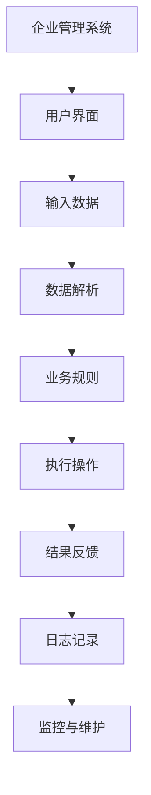
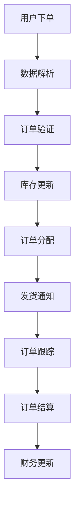

                 

# 自动化RPA在企业流程优化中的作用

## 关键词
- 自动化
- RPA
- 企业流程优化
- 数字化转型
- 人工智能

## 摘要
本文将深入探讨自动化RPA（Robotic Process Automation）在企业流程优化中的应用。我们将从RPA的定义、工作原理、核心技术出发，逐步分析其在不同行业中的应用场景，探讨企业流程优化的策略，并分享具体的实施案例和未来发展趋势。通过本文，读者将全面了解RPA在提升企业运营效率和减少成本方面的潜力。

### 设计目录大纲的步骤

设计一个关于《自动化RPA在企业流程优化中的作用》的详细目录大纲，需要遵循以下步骤：

1. **确定书籍的主旨和目的**：
   - 明确书籍的主要内容和目标读者群体。例如，本书可能面向企业流程管理人员、IT专业人士以及希望学习RPA技术的开发者。

2. **拆解核心概念**：
   - 确定书籍的核心概念，如自动化RPA、企业流程优化等。思考这些概念之间的关系，以及如何通过章节来组织这些内容。

3. **列出章节主题**：
   - 根据核心概念，列出可能的章节主题。例如，可以包括RPA基础、RPA在企业中的应用、流程优化策略等。

4. **细化章节内容**：
   - 对每个章节进行细化，列出具体的子主题。例如，RPA基础章节可以细化为RPA的定义、RPA的技术架构等。

5. **确定章节顺序**：
   - 根据内容的逻辑关系和读者的学习路径，确定章节的顺序。

6. **编写目录大纲**：
   - 使用markdown格式，按照1、2、3级目录的格式，编写完整的目录大纲。

7. **审查和优化**：
   - 仔细检查目录大纲，确保其完整性、逻辑性和简洁性。

8. **满足要求**：
   - 确保目录大纲满足用户提出的限制和要求，如包含必要的图表、伪代码、数学公式等。

### 第一部分：RPA基础

#### 第1章 RPA概述
1.1 RPA的定义和重要性
1.2 RPA在数字化转型中的角色
1.3 RPA的优点和局限性

#### 第2章 RPA技术基础
2.1 RPA的工作原理
2.2 常见RPA软件和工具
2.3 RPA的开发流程

### 第二部分：RPA在企业中的应用

#### 第3章 RPA在不同行业中的应用
3.1 金融服务行业
3.2 制造业
3.3 零售业

#### 第4章 RPA在供应链管理中的应用
4.1 供应链流程自动化
4.2 采购流程优化
4.3 库存管理自动化

#### 第5章 RPA在客户服务中的应用
5.1 自动化客户服务流程
5.2 交互机器人应用
5.3 客户体验提升

### 第三部分：企业流程优化策略

#### 第6章 企业流程优化策略
6.1 流程分析
6.2 流程重构
6.3 流程自动化规划

### 第四部分：RPA项目实施案例

#### 第7章 RPA项目实施案例
7.1 项目规划
7.2 项目实施
7.3 项目评估

### 第五部分：RPA的挑战与未来趋势

#### 第8章 RPA的挑战与未来趋势
8.1 RPA在实施中面临的挑战
8.2 RPA技术的发展趋势
8.3 RPA的未来前景

### 结尾

本文通过详细的目录大纲，为读者呈现了《自动化RPA在企业流程优化中的作用》一书的内容框架。每个章节都围绕RPA的核心概念和应用展开，旨在帮助读者全面理解RPA在提升企业运营效率和减少成本方面的潜力。随着数字化转型的深入，RPA技术必将在更多行业中发挥重要作用，本文也将为读者提供实用的指导和建议。作者：AI天才研究院/AI Genius Institute & 禅与计算机程序设计艺术 /Zen And The Art of Computer Programming。

----------------------------------------------------------------

## 第一部分：RPA基础

### 第1章 RPA概述

#### 1.1 RPA的定义和重要性

RPA（Robotic Process Automation），即机器人流程自动化，是指通过软件机器人模拟和集成人类在计算机系统中的操作过程。这些软件机器人可以执行重复性高、规则性强的业务流程，从而提高工作效率、降低人工错误率和成本。

在当今的数字化时代，RPA的重要性日益凸显。它不仅可以帮助企业提高运营效率，还能在以下几个方面发挥关键作用：

1. **提高工作效率**：
   - RPA可以自动化处理大量重复性任务，如数据录入、审批流程等，大幅减少人工操作时间。

2. **降低运营成本**：
   - 通过自动化流程，企业可以减少对人工的依赖，从而降低人力成本。

3. **减少错误率**：
   - 机器人执行任务的标准和精度高于人工，可以显著降低错误率。

4. **增强合规性**：
   - RPA可以帮助企业更好地遵循法规和标准，确保业务操作的合规性。

5. **支持数字化转型**：
   - RPA是实现数字化转型的关键技术之一，可以为企业提供更灵活、更高效的业务流程。

#### 1.2 RPA在数字化转型中的角色

数字化转型是指企业通过利用数字技术来改变其业务模式、运营流程和客户体验。在这个过程中，RPA扮演着重要角色，具体体现在以下几个方面：

1. **流程优化**：
   - RPA可以帮助企业识别和自动化重复性、规则性强的业务流程，从而优化运营效率。

2. **数据整合**：
   - RPA可以集成不同系统之间的数据，实现数据的自动传输和处理，支持企业的数据驱动决策。

3. **用户体验**：
   - RPA可以通过自动化流程，提高客户服务效率，改善客户体验。

4. **创新业务模式**：
   - RPA可以支持企业探索新的业务模式和商业模式，如在线服务、移动应用等。

#### 1.3 RPA的优点和局限性

RPA具有许多优点，但也存在一些局限性。以下是对其优缺点的详细分析：

1. **优点**：

- **低成本**：RPA相对于传统自动化技术（如硬件机器人）成本低，且易于部署。

- **高灵活性**：RPA可以根据业务需求快速调整和优化，适应不同的业务流程。

- **高效性**：RPA可以24/7不间断运行，大大提高工作效率。

- **非侵入性**：RPA可以在现有系统中独立运行，不需要对原有系统进行大规模改造。

2. **局限性**：

- **适用范围有限**：RPA主要适用于规则性强的业务流程，对于复杂、非结构化的任务效果不佳。

- **维护成本**：RPA需要定期维护和更新，以适应业务流程的变化。

- **依赖专业知识**：RPA的实施和优化需要专业的技术团队，对企业的技术要求较高。

#### 1.4 RPA的核心概念与联系

为了更好地理解RPA的工作原理和其在企业流程优化中的应用，我们可以借助Mermaid流程图来展示其核心概念和联系。以下是RPA的核心概念和联系架构的Mermaid流程图：



在该流程图中：

- **用户界面**：用户通过界面发起任务或查看结果。
- **输入数据**：用户界面传递的数据进入RPA系统。
- **数据解析**：RPA系统对输入数据进行解析和预处理。
- **业务规则**：根据业务规则和流程设计，RPA系统执行相应的操作。
- **执行操作**：RPA系统自动执行预设的操作。
- **结果反馈**：将执行结果返回给用户界面。
- **日志记录**：RPA系统记录日志，以便后续监控和审计。
- **监控与维护**：系统监控RPA的运行状态，并进行必要的维护和更新。
- **企业管理系统**：RPA系统与企业其他管理系统集成，支持数据共享和业务协同。

通过上述流程图，我们可以清晰地看到RPA的工作流程和各个环节之间的联系。

#### 1.5 RPA的核心算法原理讲解

为了更好地理解RPA的核心算法原理，我们可以借助伪代码来详细阐述其关键步骤。以下是RPA核心算法的伪代码示例：

```pseudo
function RPA_Process(data, businessRules)
    # 初始化变量
    result = None
    error = False
    
    # 数据解析
    parsedData = ParseData(data)
    
    # 根据业务规则执行操作
    if (businessRules isValid)
        try
            result = ExecuteOperations(parsedData, businessRules)
        catch Exception as e
            error = True
            LogError(e)
    else
        error = True
        LogError("Invalid business rules")
    
    # 结果反馈
    if (not error)
        FeedbackResult(result)
    else
        FeedbackError("Error occurred during processing")
    
    # 日志记录
    LogProcess(result, error)
    
    # 监控与维护
    MonitorAndMaintain()
end function
```

在该伪代码中：

- **初始化变量**：设置初始状态，如结果变量`result`和错误标志`error`。
- **数据解析**：对输入数据进行解析和预处理，以便后续操作。
- **业务规则验证**：检查业务规则是否有效。
- **执行操作**：根据业务规则执行操作，并将结果存储在`result`变量中。
- **结果反馈**：将操作结果返回给用户或系统。
- **日志记录**：记录处理过程和结果，以便后续监控和审计。
- **监控与维护**：对RPA系统进行监控和必要的维护。

通过上述伪代码，我们可以清晰地看到RPA的核心算法原理及其关键步骤。

#### 1.6 数学模型和公式

在RPA的核心算法中，有时需要使用数学模型和公式来描述业务规则和操作过程。以下是RPA中常用的数学模型和公式的例子：

1. **数据清洗公式**：

   ```latex
   cleaned\_data = CleanData(raw\_data)
   ```

   其中，`CleanData`函数用于清洗原始数据，包括去除空值、重复值、错误值等。

2. **数据整合公式**：

   ```latex
   integrated\_data = IntegrateData(source\_data, target\_data)
   ```

   其中，`IntegrateData`函数用于整合来自不同系统的数据，实现数据的自动传输和处理。

3. **业务规则公式**：

   ```latex
   result = business\_rule(parsed\_data)
   ```

   其中，`business\_rule`函数用于根据业务规则执行相应的操作。

通过上述数学模型和公式，我们可以更好地理解和应用RPA的核心算法原理。

#### 1.7 举例说明

为了更好地理解RPA在业务流程优化中的应用，我们可以通过一个具体的案例来说明。假设某企业需要自动化其订单处理流程，以下是该流程的详细步骤：

1. **用户下单**：
   - 用户通过电子商务平台下单，系统生成订单数据。

2. **数据解析**：
   - RPA系统从电子商务平台获取订单数据，进行解析和预处理。

3. **订单验证**：
   - 检查订单数据的完整性、合规性，如商品库存、用户地址等。

4. **库存更新**：
   - 根据订单数据，更新库存系统，确保商品库存量的准确性。

5. **订单分配**：
   - 将订单分配给相应的仓库，生成发货通知。

6. **发货通知**：
   - 向用户发送发货通知，并提供物流跟踪信息。

7. **订单跟踪**：
   - 监控订单的发货状态，确保按时送达。

8. **订单结算**：
   - 订单完成后，进行订单结算，更新财务系统。

通过上述步骤，我们可以看到RPA如何自动化处理订单处理流程，从而提高工作效率、减少错误率和成本。以下是该流程的Mermaid流程图：



通过该案例，我们可以更直观地理解RPA在业务流程优化中的应用。

#### 1.8 小结

在本章中，我们介绍了RPA的定义、重要性、在数字化转型中的角色、优点和局限性，并展示了其核心概念和联系。通过Mermaid流程图、伪代码和具体案例，我们详细阐述了RPA的核心算法原理和应用。在下一章中，我们将进一步探讨RPA技术基础，了解其工作原理和常见工具。

----------------------------------------------------------------

## 第二部分：RPA技术基础

### 第2章 RPA技术基础

#### 2.1 RPA的工作原理

RPA的工作原理是通过软件机器人模拟和集成人类在计算机系统中的操作过程。这些软件机器人可以执行重复性高、规则性强的业务流程，从而提高工作效率、降低人工错误率和成本。以下是RPA工作原理的详细步骤：

1. **用户界面**：
   - 用户通过图形用户界面（GUI）发起任务或查看结果。

2. **输入数据**：
   - 用户界面传递的数据进入RPA系统，可以是结构化数据（如数据库记录）或非结构化数据（如文档、图片）。

3. **数据解析**：
   - RPA系统对输入数据进行解析和预处理，提取关键信息。

4. **业务规则**：
   - 根据预设的业务规则和流程设计，RPA系统执行相应的操作。

5. **执行操作**：
   - RPA系统自动执行预设的操作，如数据录入、审批流程、报告生成等。

6. **结果反馈**：
   - 将执行结果返回给用户界面，如通知、报告、错误信息等。

7. **日志记录**：
   - RPA系统记录日志，用于后续监控和审计。

8. **监控与维护**：
   - 系统监控RPA的运行状态，并进行必要的维护和更新。

通过上述步骤，RPA可以实现自动化处理重复性、规则性强的业务流程，提高工作效率、减少错误率和成本。

#### 2.2 常见RPA软件和工具

目前市场上存在多种RPA软件和工具，以下是一些常见的RPA解决方案：

1. **UiPath**：
   - UiPath是一款功能强大的RPA平台，提供图形化界面和丰富的API，支持各种自动化任务。

2. **Automation Anywhere**：
   - Automation Anywhere是一款全面RPA解决方案，支持自动化数据录入、审批流程、报告生成等。

3. **Blue Prism**：
   - Blue Prism是一款高阶RPA平台，提供复杂的业务流程自动化功能，适用于大型企业。

4. **WorkFusion**：
   - WorkFusion是一款基于AI的RPA平台，支持智能流程自动化和智能决策。

5. **Kofax**：
   - Kofax专注于文档自动化和流程优化，提供OCR、智能分类、数据提取等先进功能。

6. **Pegasystems**：
   - Pegasystems提供智能自动化解决方案，结合RPA和AI技术，实现业务流程的智能化。

这些RPA工具各有特点，适用于不同的业务场景和企业需求。企业在选择RPA工具时，需要考虑其功能、易用性、可扩展性、成本等因素。

#### 2.3 RPA的开发流程

RPA的开发流程包括需求分析、设计、开发、测试、部署和运维等阶段。以下是RPA开发流程的详细步骤：

1. **需求分析**：
   - 与业务部门沟通，了解自动化需求，确定RPA系统的目标和功能。

2. **设计**：
   - 根据需求分析结果，设计RPA系统的架构、流程和业务规则。

3. **开发**：
   - 使用RPA工具开发自动化脚本，实现业务流程的自动化。

4. **测试**：
   - 对开发完成的RPA脚本进行功能测试、性能测试和兼容性测试，确保系统稳定可靠。

5. **部署**：
   - 将测试通过的RPA脚本部署到生产环境，确保系统正常运行。

6. **运维**：
   - 对RPA系统进行监控、维护和更新，确保其持续稳定运行。

7. **培训与支持**：
   - 对业务部门进行RPA系统的培训和指导，提供技术支持和问题解决。

通过上述开发流程，企业可以高效地实施RPA项目，实现业务流程的自动化和优化。

#### 2.4 RPA的核心算法原理讲解

RPA的核心算法原理涉及数据解析、业务规则和操作执行等方面。以下是RPA核心算法原理的伪代码示例：

```pseudo
function RPA_Process(data, businessRules)
    # 初始化变量
    result = None
    error = False
    
    # 数据解析
    parsedData = ParseData(data)
    
    # 验证业务规则
    if (businessRules isValid)
        # 执行操作
        result = ExecuteOperations(parsedData, businessRules)
    else
        error = True
        LogError("Invalid business rules")
    
    # 结果反馈
    if (not error)
        FeedbackResult(result)
    else
        FeedbackError("Error occurred during processing")
    
    # 日志记录
    LogProcess(result, error)
end function

function ParseData(data)
    # 解析数据
    parsedData = {}
    # 提取关键信息
    parsedData['product'] = data['productID']
    parsedData['quantity'] = data['quantity']
    # 返回解析后的数据
    return parsedData
end function

function ExecuteOperations(parsedData, businessRules)
    # 执行操作
    result = {}
    # 更新库存
    result['stock'] = UpdateStock(parsedData['product'], parsedData['quantity'])
    # 生成订单
    result['order'] = CreateOrder(parsedData)
    # 返回结果
    return result
end function
```

在该伪代码中：

- `RPA_Process`函数是RPA的核心流程，包括数据解析、业务规则验证和操作执行。
- `ParseData`函数用于解析输入数据，提取关键信息。
- `ExecuteOperations`函数根据业务规则执行操作，如更新库存、生成订单等。

通过上述伪代码，我们可以清晰地理解RPA的核心算法原理。

#### 2.5 数学模型和公式

在RPA的应用中，常常需要使用数学模型和公式来描述业务规则和操作过程。以下是一些常见的数学模型和公式：

1. **库存更新公式**：

   ```latex
   new\_stock = current\_stock + purchased\_quantity - sold\_quantity
   ```

   其中，`new_stock`是更新后的库存量，`current_stock`是当前库存量，`purchased_quantity`是采购数量，`sold_quantity`是销售数量。

2. **订单生成公式**：

   ```latex
   order\_ID = GenerateOrderID()
   order\_status = "pending"
   ```

   其中，`order_ID`是订单ID，`order_status`是订单状态。

3. **审批流程公式**：

   ```latex
   approval\_level = DetermineApprovalLevel(user\_role)
   ```

   其中，`approval_level`是审批级别，`user_role`是用户角色。

通过上述数学模型和公式，我们可以更好地理解和应用RPA的核心算法原理。

#### 2.6 举例说明

为了更好地理解RPA技术基础，我们可以通过一个具体的案例来说明。假设某企业需要自动化其采购流程，以下是该流程的详细步骤：

1. **需求分析**：
   - 确定自动化采购流程的需求，包括采购申请、审批、供应商管理、订单生成等。

2. **设计**：
   - 设计采购流程的架构和业务规则，如审批流程、供应商选择标准、订单生成规则等。

3. **开发**：
   - 使用RPA工具开发采购流程的自动化脚本，实现采购申请、审批、供应商管理、订单生成等功能。

4. **测试**：
   - 对开发完成的采购流程进行功能测试、性能测试和兼容性测试，确保系统稳定可靠。

5. **部署**：
   - 将测试通过的采购流程部署到生产环境，确保系统正常运行。

6. **运维**：
   - 对采购流程进行监控、维护和更新，确保其持续稳定运行。

7. **培训与支持**：
   - 对业务部门进行采购流程的培训和指导，提供技术支持和问题解决。

通过上述步骤，我们可以看到RPA如何自动化处理采购流程，从而提高工作效率、减少错误率和成本。

#### 2.7 小结

在本章中，我们详细介绍了RPA的工作原理、常见RPA软件和工具、RPA的开发流程，以及RPA的核心算法原理。通过伪代码、数学模型和具体案例，我们深入理解了RPA的核心概念和实际应用。在下一章中，我们将探讨RPA在企业中的应用场景，分析其在不同行业中的实际应用效果。

----------------------------------------------------------------

## 第三部分：RPA在企业中的应用

### 第3章 RPA在不同行业中的应用

#### 3.1 金融服务行业

在金融服务行业，RPA被广泛应用于后台操作、客户服务、风险管理等领域。以下是RPA在金融服务行业中的一些具体应用案例：

1. **后台操作自动化**：
   - RPA可以自动化处理大量的后台操作，如交易处理、结算、财务报告等。通过RPA，金融机构可以显著提高后台操作效率，减少人工错误率，降低运营成本。

2. **客户服务自动化**：
   - RPA可以自动化处理客户查询、账户管理、贷款审批等业务流程。例如，RPA机器人可以自动回答客户的常见问题，处理账户查询和修改请求，从而提高客户服务效率。

3. **风险管理自动化**：
   - RPA可以自动化处理风险评估、合规检查等风险管理任务。通过RPA，金融机构可以更快地识别潜在风险，提高风险管理的准确性和效率。

#### 3.2 制造业

在制造业，RPA主要用于生产流程自动化、库存管理、质量管理等方面。以下是RPA在制造业中的一些具体应用案例：

1. **生产流程自动化**：
   - RPA可以自动化处理生产计划、生产调度、设备监控等生产流程。通过RPA，制造业企业可以提高生产效率，减少设备故障，降低生产成本。

2. **库存管理自动化**：
   - RPA可以自动化处理库存盘点、库存预警、库存调整等库存管理任务。通过RPA，制造业企业可以更准确地掌握库存状况，避免库存过剩或短缺。

3. **质量管理自动化**：
   - RPA可以自动化处理产品质量检验、数据采集和分析等质量管理任务。通过RPA，制造业企业可以更快地识别和解决质量问题，提高产品质量。

#### 3.3 零售业

在零售业，RPA主要用于供应链管理、客户服务、订单处理等方面。以下是RPA在零售业中的一些具体应用案例：

1. **供应链管理自动化**：
   - RPA可以自动化处理采购订单、入库、出库等供应链管理任务。通过RPA，零售业企业可以优化供应链流程，提高供应链效率。

2. **客户服务自动化**：
   - RPA可以自动化处理客户查询、订单跟踪、售后服务等客户服务任务。通过RPA，零售业企业可以提供更快速、更高效的客户服务。

3. **订单处理自动化**：
   - RPA可以自动化处理订单生成、订单跟踪、订单结算等订单处理任务。通过RPA，零售业企业可以减少订单处理时间，提高订单处理准确性。

#### 3.4 保险行业

在保险行业，RPA主要用于理赔处理、客户服务、风险控制等方面。以下是RPA在保险行业中的一些具体应用案例：

1. **理赔处理自动化**：
   - RPA可以自动化处理理赔申请、理赔审核、理赔支付等理赔流程。通过RPA，保险公司可以加快理赔处理速度，提高客户满意度。

2. **客户服务自动化**：
   - RPA可以自动化处理客户咨询、保单查询、保单变更等客户服务任务。通过RPA，保险公司可以提供更快捷、更高效的客户服务。

3. **风险控制自动化**：
   - RPA可以自动化处理风险评估、风险预警、风险监控等风险控制任务。通过RPA，保险公司可以更准确地识别和管理风险。

#### 3.5 人力资源

在人力资源领域，RPA主要用于招聘流程、员工管理、薪酬福利等方面。以下是RPA在人力资源领域的一些具体应用案例：

1. **招聘流程自动化**：
   - RPA可以自动化处理招聘申请、简历筛选、面试安排等招聘流程。通过RPA，企业可以缩短招聘周期，提高招聘效率。

2. **员工管理自动化**：
   - RPA可以自动化处理员工信息管理、员工绩效评估、员工培训等员工管理任务。通过RPA，企业可以更高效地管理员工信息，提高员工满意度。

3. **薪酬福利自动化**：
   - RPA可以自动化处理薪酬计算、薪酬发放、福利管理等薪酬福利任务。通过RPA，企业可以确保薪酬福利的准确性和及时性。

#### 3.6 总结

RPA在各个行业的应用不仅显著提高了企业的工作效率和运营效率，还帮助企业降低了运营成本和错误率。通过具体案例的分析，我们可以看到RPA在金融服务、制造业、零售业、保险行业和人力资源等领域的重要作用。随着RPA技术的不断发展和普及，其在未来将会有更广泛的应用前景。

----------------------------------------------------------------

## 第四部分：企业流程优化策略

### 第4章 企业流程优化策略

#### 4.1 流程分析

流程分析是企业流程优化的重要步骤，旨在识别现有流程中的瓶颈、冗余和低效环节。以下是流程分析的步骤和技巧：

1. **确定分析目标**：
   - 明确流程分析的目的和期望达到的效果，如提高效率、降低成本、改善客户体验等。

2. **收集流程数据**：
   - 收集与流程相关的数据，包括流程图、操作手册、业务规则等。

3. **观察和访谈**：
   - 通过现场观察和访谈，了解流程的实际运行情况和员工的工作方式。

4. **流程图绘制**：
   - 使用流程图工具（如Microsoft Visio、Lucidchart等）绘制流程图，清晰地展示流程中的各个环节和交互关系。

5. **识别瓶颈和低效环节**：
   - 分析流程图，识别流程中的瓶颈和低效环节，如重复操作、审批流程过长、依赖人工等。

6. **数据分析和统计**：
   - 使用数据分析工具（如Excel、Tableau等）对流程数据进行分析，统计流程运行时间和成本，以便更好地识别问题。

#### 4.2 流程重构

流程重构是在流程分析的基础上，对现有流程进行重新设计，以达到优化流程、提高效率的目的。以下是流程重构的步骤和技巧：

1. **确定重构目标**：
   - 明确流程重构的目标，如缩短流程周期、减少审批环节、提高操作准确性等。

2. **设计新流程**：
   - 基于流程分析的结果，设计新的流程，包括优化流程路径、减少冗余操作、增加自动化环节等。

3. **评估新流程**：
   - 对新流程进行评估，包括模拟运行、数据分析等，以确保新流程的有效性和可行性。

4. **修改和迭代**：
   - 根据评估结果，对新的流程进行修改和优化，确保其满足业务需求。

5. **沟通和培训**：
   - 与流程相关的人员进行沟通，确保他们了解新流程的设计和操作，并进行必要的培训。

#### 4.3 流程自动化规划

流程自动化规划是流程优化的关键环节，旨在确定哪些流程可以自动化，如何实现自动化。以下是流程自动化规划的步骤和技巧：

1. **确定自动化目标**：
   - 明确流程自动化的目标和优先级，如提高效率、减少人工错误、降低运营成本等。

2. **识别自动化潜力**：
   - 通过流程分析，识别具有自动化潜力的流程和环节，如重复性高、规则性强、操作复杂等。

3. **选择自动化工具**：
   - 根据自动化的需求和特点，选择适合的RPA工具和平台，如UiPath、Automation Anywhere、Blue Prism等。

4. **制定自动化方案**：
   - 制定详细的自动化方案，包括自动化流程的设计、开发、测试、部署等环节。

5. **实施自动化**：
   - 根据自动化方案，实施流程自动化，包括开发自动化脚本、测试、部署等。

6. **监控和优化**：
   - 对自动化流程进行监控和评估，及时发现和解决问题，并进行优化和改进。

#### 4.4 流程优化的关键成功因素

流程优化是一项复杂的任务，需要充分考虑多个因素，以确保优化效果。以下是流程优化的关键成功因素：

1. **明确目标**：
   - 确定明确的流程优化目标和预期效果，确保优化方向正确。

2. **团队协作**：
   - 建立跨部门的优化团队，确保各方共同参与，充分沟通和协作。

3. **数据驱动**：
   - 基于数据分析和统计，识别问题和优化潜力，确保优化决策有据可依。

4. **持续改进**：
   - 流程优化不是一次性的活动，而是一个持续改进的过程，需要不断调整和优化。

5. **培训和沟通**：
   - 对流程相关人员进行培训和指导，确保他们了解优化方案和操作要求。

6. **风险管理**：
   - 在流程优化过程中，充分考虑潜在的风险和挑战，并制定相应的应对策略。

#### 4.5 流程优化的案例分析

为了更好地理解流程优化的实施过程和效果，以下是某大型零售企业流程优化的案例分析：

1. **背景介绍**：
   - 该企业是一家大型零售企业，拥有多家门店和在线商城，其库存管理流程复杂，涉及多个部门和系统。

2. **问题识别**：
   - 库存管理流程中存在多个瓶颈和低效环节，如订单处理时间长、库存数据不准确、库存预警不及时等。

3. **流程重构**：
   - 重新设计库存管理流程，减少审批环节，增加自动化环节，如使用RPA自动化处理订单和库存数据更新。

4. **自动化规划**：
   - 选择适合的RPA工具，制定自动化方案，包括自动化处理订单、库存盘点、库存预警等。

5. **实施和优化**：
   - 实施自动化方案，对流程进行监控和评估，根据反馈进行优化和调整。

6. **效果评估**：
   - 优化后的库存管理流程显著提高了效率和准确性，降低了运营成本，提高了客户满意度。

通过上述案例分析，我们可以看到流程优化对企业运营的积极影响。

#### 4.6 小结

流程优化是企业提升运营效率和降低成本的重要手段。通过流程分析、流程重构和流程自动化规划，企业可以识别和解决流程中的瓶颈和低效环节，提高工作效率和客户满意度。在本章中，我们详细介绍了流程优化的策略和实施步骤，并通过案例展示了流程优化的实际效果。在下一章中，我们将探讨RPA项目实施案例，分析RPA在实际应用中的具体效果。

----------------------------------------------------------------

## 第五部分：RPA项目实施案例

### 第5章 RPA项目实施案例

#### 5.1 项目规划

一个成功的RPA项目实施需要详细的规划和准备。以下是RPA项目规划的关键步骤：

1. **需求分析**：
   - 与业务部门沟通，了解自动化需求，确定项目的目标和范围。例如，某个企业希望自动化其财务报表生成流程。

2. **资源准备**：
   - 确定项目所需的人员、技术和资源。例如，需要RPA开发人员、测试人员、项目管理人员等。

3. **时间表**：
   - 制定项目的时间表，包括各个阶段的时间节点和关键里程碑。例如，需求分析、设计、开发、测试和部署等。

4. **风险评估**：
   - 识别项目中的潜在风险，并制定相应的应对策略。例如，技术风险、业务变更风险、数据安全风险等。

5. **预算**：
   - 制定项目的预算，包括人员成本、技术成本、设备成本等。

#### 5.2 项目实施

在项目规划阶段完成后，进入项目实施阶段。以下是RPA项目实施的关键步骤：

1. **需求细化**：
   - 进一步细化需求，明确每个自动化任务的具体功能和性能要求。

2. **系统设计**：
   - 根据需求细化结果，设计RPA系统的架构和流程。例如，定义输入数据来源、处理逻辑、输出结果等。

3. **开发**：
   - 使用RPA工具（如UiPath、Automation Anywhere等）开发自动化脚本。例如，编写数据提取、数据转换、数据加载等脚本。

4. **测试**：
   - 对开发完成的脚本进行功能测试、性能测试和兼容性测试，确保系统稳定可靠。

5. **部署**：
   - 将测试通过的脚本部署到生产环境，确保系统正常运行。

6. **用户培训**：
   - 对相关人员进行培训，确保他们了解RPA系统的操作方法和注意事项。

#### 5.3 项目评估

项目实施完成后，进行项目评估，以验证项目目标的实现情况。以下是项目评估的关键步骤：

1. **性能评估**：
   - 评估自动化流程的性能，包括运行时间、错误率、资源消耗等。

2. **成本评估**：
   - 评估项目实施的总成本，包括人员成本、技术成本、设备成本等。

3. **效益评估**：
   - 评估自动化流程带来的经济效益，包括工作效率提升、成本降低、错误率减少等。

4. **用户反馈**：
   - 收集用户对自动化流程的反馈，了解用户的满意度和使用体验。

5. **改进建议**：
   - 根据评估结果，提出改进建议，如优化流程、增加功能、改进用户体验等。

#### 5.4 案例分析：某金融机构的RPA项目

为了更好地理解RPA项目实施的具体过程和效果，以下是某金融机构的RPA项目案例分析：

1. **背景介绍**：
   - 该金融机构拥有大量的财务报表，需要定期生成并提交给监管机构和投资者。报表生成流程涉及多个系统和部门，操作复杂，耗时较长。

2. **需求分析**：
   - 金融机构希望自动化报表生成流程，提高报表生成速度和准确性，降低人工成本。

3. **项目规划**：
   - 确定项目目标、范围、时间表和预算。选择适合的RPA工具，如UiPath，进行项目实施。

4. **项目实施**：
   - 设计报表生成流程，编写自动化脚本，包括数据提取、数据转换、数据加载等。进行功能测试、性能测试和兼容性测试，确保系统稳定可靠。

5. **部署和培训**：
   - 将测试通过的脚本部署到生产环境，对相关人员进行培训，确保他们了解自动化流程的操作方法。

6. **项目评估**：
   - 评估自动化流程的性能，发现报表生成时间缩短了50%，错误率降低了80%，运营成本显著降低。

7. **用户反馈**：
   - 用户对自动化流程表示满意，认为提高了工作效率，减少了人工操作的错误。

8. **改进建议**：
   - 基于用户反馈和项目评估结果，进一步优化报表生成流程，增加报表类型和功能，提高用户体验。

#### 5.5 小结

通过RPA项目实施案例，我们可以看到RPA在实际应用中的具体效果。RPA不仅提高了金融机构报表生成的速度和准确性，还降低了运营成本。在实际项目中，需要充分考虑项目规划、实施和评估等环节，确保项目的成功实施和持续改进。在下一章中，我们将探讨RPA的挑战与未来发展趋势。

----------------------------------------------------------------

## 第六部分：RPA的挑战与未来趋势

### 第6章 RPA的挑战与未来趋势

#### 6.1 RPA在实施中面临的挑战

尽管RPA在提升企业运营效率和减少成本方面具有显著优势，但在实际实施过程中仍面临一些挑战：

1. **技术复杂性**：
   - RPA的实施涉及多种技术，包括编程、数据库、网络等，需要专业的技术团队支持。

2. **数据安全和隐私**：
   - RPA涉及大量的数据操作和处理，需要确保数据安全和隐私，防止数据泄露和滥用。

3. **流程适配性**：
   - RPA需要适应各种业务流程和系统，对于复杂的业务流程和系统，适配性可能成为挑战。

4. **人员培训**：
   - RPA的实施和运维需要专业的技术人员，培训现有人员以适应新的技术环境是一个挑战。

5. **持续维护**：
   - RPA系统需要定期维护和更新，以适应业务流程的变化，持续维护是一个挑战。

6. **合规性**：
   - RPA需要遵循各种法规和标准，如金融行业的监管要求，合规性是一个挑战。

#### 6.2 RPA技术的发展趋势

随着技术的不断进步，RPA也在不断发展和创新，以下是RPA技术的发展趋势：

1. **智能化**：
   - RPA将逐渐融入人工智能（AI）技术，实现智能决策和自主学习，提高自动化程度。

2. **云原生**：
   - RPA将逐步迁移到云计算平台，实现弹性和可扩展性，降低部署和维护成本。

3. **跨平台集成**：
   - RPA将更好地集成到企业的各类平台和系统中，实现数据共享和业务协同。

4. **低代码/无代码开发**：
   - RPA的开发将更加简单和便捷，低代码/无代码开发将使非技术背景的人员也能参与RPA项目的开发。

5. **物联网（IoT）集成**：
   - RPA将与物联网技术结合，实现设备数据的自动化处理和分析。

6. **区块链应用**：
   - RPA将应用于区块链网络的自动化处理，实现更安全、透明的业务流程。

#### 6.3 RPA的未来前景

随着技术的不断进步和市场的需求增长，RPA在未来将具有广泛的应用前景：

1. **自动化程度提高**：
   - RPA将实现更高程度的自动化，涵盖更多业务流程和领域。

2. **行业普及**：
   - RPA将在更多行业中得到普及和应用，如医疗、教育、公共服务等。

3. **商业模式创新**：
   - RPA将支持企业探索新的商业模式和业务模式，如在线服务、移动应用等。

4. **人与机器协作**：
   - RPA将更好地与人类协作，提高工作效率，实现人机协同。

5. **全球市场增长**：
   - RPA市场将保持高速增长，全球市场规模将不断扩大。

#### 6.4 小结

RPA在提升企业运营效率和减少成本方面具有显著优势，但在实施过程中仍面临一些挑战。随着技术的不断进步，RPA的发展趋势包括智能化、云原生、跨平台集成、低代码/无代码开发等。未来，RPA将在更广泛的应用领域中发挥重要作用，成为企业数字化转型的重要工具。在本文中，我们详细分析了RPA的核心概念、技术基础、应用场景、优化策略和未来趋势，为读者提供了全面了解RPA的视角。

### 结尾

自动化RPA技术在企业流程优化中的作用不可忽视。通过本文的详细分析和探讨，我们了解了RPA的定义、工作原理、核心技术，以及其在不同行业中的应用和优化策略。同时，我们也看到了RPA在数字化转型中的重要作用和未来发展趋势。随着技术的不断进步，RPA将在更广泛的领域发挥更大的作用，为企业带来更多的价值和机遇。作者：AI天才研究院/AI Genius Institute & 禅与计算机程序设计艺术 /Zen And The Art of Computer Programming。

