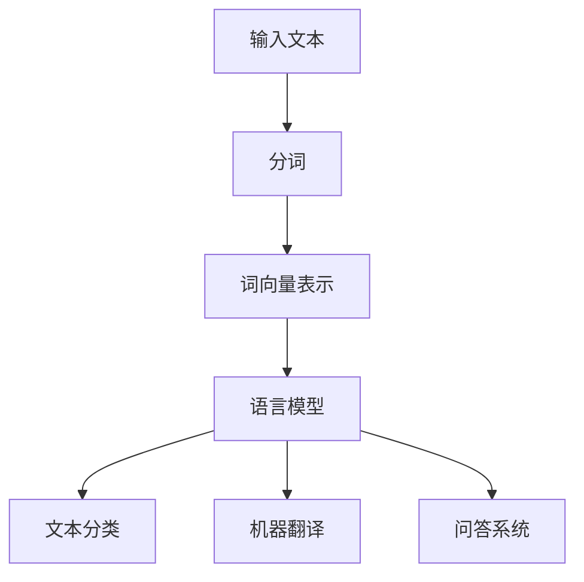

                 

## 第1章：自然语言处理基础

### 1.1 核心概念与联系

#### 1.1.1 自然语言处理的基本概念

自然语言处理（Natural Language Processing，简称NLP）是人工智能领域的一个重要分支，它涉及计算机和人类语言之间的交互。NLP的核心目标是使计算机能够理解和处理人类语言，从而实现语言理解、生成和翻译等任务。

- **语言模型**：语言模型用于预测文本的下一个单词或字符序列。它是NLP中最基本的模型，可以通过统计方法或神经网络来实现。
- **词向量**：词向量是表示单词的数学向量，它可以将文本转换为数值形式，以便计算机进行处理。词向量可以基于统计方法（如词袋模型）或深度学习方法（如Word2Vec）。
- **语音识别**：语音识别是将语音转换为文本的技术，它是NLP的一个重要应用领域。语音识别技术通常包括音频信号处理、特征提取和模式识别等步骤。
- **文本分类**：文本分类是将文本数据按照预定的类别进行分类的过程。文本分类可以用于垃圾邮件检测、情感分析等任务。

#### 1.1.2 NLP的Mermaid流程图

为了更好地理解NLP的工作流程，我们可以使用Mermaid绘制一个流程图，如下所示：



在这个流程图中，输入文本首先经过分词处理，然后转换为词向量表示。接下来，词向量输入到语言模型中进行处理，可以用于文本分类、机器翻译或问答系统等任务。

### 1.2 核心算法原理讲解

NLP涉及到多种核心算法，这些算法可以大致分为以下几个类别：

- **词汇表示**：词汇表示是将单词或短语转换为数学向量表示的过程。这有助于计算机理解单词的含义和关系。
- **语言模型**：语言模型用于预测文本的下一个单词或字符序列。它可以通过统计方法或神经网络来实现。
- **文本分类**：文本分类是将文本数据按照预定的类别进行分类的过程。这通常使用机器学习算法来实现。

#### 1.2.1 词汇表示

- **词袋模型**：词袋模型是一种简单的词汇表示方法，它将文本表示为一个词汇的集合，而不考虑单词的顺序。词袋模型可以通过以下步骤实现：

  ```python
  def bag_of_words(document):
      vocabulary = set(document)
      word_counts = {}
      for word in vocabulary:
          word_counts[word] = document.count(word)
      return word_counts
  ```

- **词嵌入**：词嵌入是一种更高级的词汇表示方法，它使用神经网络将单词映射到高维空间中的向量。词嵌入有助于捕捉单词的语义和语法关系。以下是一个使用GloVe算法训练词嵌入的伪代码：

  ```python
  def train_glove(vocabulary, embedding_size, epoch=10):
      embeddings = {}
      for word in vocabulary:
          embeddings[word] = np.random.rand(embedding_size)
      
      for epoch in range(epoch):
          for word, context in generate_context(vocabulary):
              target = word
              context = ' '.join(context)
              target_embedding = embeddings[target]
              context_embedding = embeddings[context]
              loss = compute_loss(target_embedding, context_embedding)
              update_embeddings(target_embedding, context_embedding, loss)
      
      return embeddings
  ```

#### 1.2.2 语言模型

- **N-gram模型**：N-gram模型是一种基于统计的语言模型，它假设一个单词序列的概率等于其前N-1个单词的概率。以下是一个使用N-gram模型预测下一个单词的伪代码：

  ```python
  def predict_next_word(sequence, n):
      ngram_model = build_ngram_model(sequence, n)
      last_n_words = sequence[-n:]
      probability_distribution = ngram_model[last_n_words]
      next_word = sample(probability_distribution)
      return next_word
  ```

- **神经网络语言模型**：神经网络语言模型使用神经网络来预测文本的下一个单词。以下是一个简单的神经网络语言模型的伪代码：

  ```python
  class NeuralLanguageModel(nn.Module):
      def __init__(self, embedding_size, hidden_size, output_size):
          super(NeuralLanguageModel, self).__init__()
          self.embedding = nn.Embedding(embedding_size, hidden_size)
          self.lstm = nn.LSTM(hidden_size, hidden_size)
          self.fc = nn.Linear(hidden_size, output_size)
      
      def forward(self, sequence):
          embedded_sequence = self.embedding(sequence)
          hidden, _ = self.lstm(embedded_sequence)
          output = self.fc(hidden[-1, :, :])
          return output
  ```

#### 1.2.3 文本分类

- **朴素贝叶斯**：朴素贝叶斯是一种基于概率论的文本分类方法。它假设特征之间相互独立，并使用贝叶斯定理来预测类别。以下是一个使用朴素贝叶斯进行文本分类的伪代码：

  ```python
  def classify_naive_bayes(document, classes, vocabulary):
      class_probabilities = {}
      for class_ in classes:
          class_probability = compute_class_probability(document, class_, vocabulary)
          class_probabilities[class_] = class_probability
      predicted_class = max(class_probabilities, key=class_probabilities.get)
      return predicted_class
  ```

- **支持向量机**：支持向量机是一种基于优化理论的文本分类方法。它通过找到一个最佳的超平面来最大化分类边界。以下是一个使用支持向量机进行文本分类的伪代码：

  ```python
  def classify_svm(document, classifier):
      features = extract_features(document, vocabulary)
      probability = classifier.predict_proba([features])[0]
      predicted_class = np.argmax(probability)
      return predicted_class
  ```

### 1.3 数学模型和数学公式讲解及举例

在NLP中，数学模型和公式是理解和实现NLP算法的关键。以下是一些常见的数学模型和公式，并给出了详细的讲解和举例。

#### 1.3.1 词嵌入数学模型

词嵌入是将单词映射到高维空间中的向量表示。一个常见的词嵌入模型是GloVe模型，它使用以下公式：

$$
x_i = \sum_{j=1}^{n} w_{ij} * v_j
$$

其中，$x_i$是单词$i$的向量表示，$w_{ij}$是单词$i$和单词$j$之间的共现次数，$v_j$是单词$j$的向量表示。

**举例**：假设我们有以下共现矩阵：

$$
\begin{bmatrix}
0 & 1 & 0 \\
1 & 0 & 1 \\
0 & 1 & 0
\end{bmatrix}
$$

以及以下词向量：

$$
\begin{bmatrix}
v_1 = \begin{bmatrix}
1 \\
0 \\
0
\end{bmatrix} \\
v_2 = \begin{bmatrix}
0 \\
1 \\
0
\end{bmatrix} \\
v_3 = \begin{bmatrix}
0 \\
0 \\
1
\end{bmatrix}
\end{bmatrix}
$$

根据GloVe模型，我们可以计算单词1的向量表示：

$$
x_1 = \sum_{j=1}^{3} w_{1j} * v_j = 1 * v_2 + 1 * v_3 = \begin{bmatrix}
0 \\
1 \\
0
\end{bmatrix}
$$

#### 1.3.2 语言模型概率计算

在语言模型中，我们需要计算给定一个单词序列的概率。一个简单的概率计算公式是：

$$
P(w_1 w_2 ... w_n) = \prod_{i=1}^{n} P(w_i | w_{i-1})
$$

其中，$P(w_i | w_{i-1})$表示在给定前一个单词$w_{i-1}$的情况下，当前单词$w_i$的概率。

**举例**：假设我们有一个简单的语言模型，其概率分布如下：

$$
P(w_1) = 0.3, \quad P(w_2 | w_1) = 0.5, \quad P(w_3 | w_2) = 0.2
$$

根据上述公式，我们可以计算整个单词序列的概率：

$$
P(w_1 w_2 w_3) = P(w_1) \times P(w_2 | w_1) \times P(w_3 | w_2) = 0.3 \times 0.5 \times 0.2 = 0.03
$$

### 1.4 项目实战

为了更好地理解NLP的基础算法，我们可以通过一个简单的项目来实践。在这个项目中，我们将使用Python和NLTK库来构建一个简单的文本分类器。

#### 1.4.1 开发环境搭建

在开始项目之前，我们需要安装Python和NLTK库。以下是在Ubuntu上安装Python和NLTK的步骤：

```bash
sudo apt update
sudo apt install python3 python3-pip
pip3 install nltk
```

#### 1.4.2 源代码实现

以下是一个简单的文本分类器的源代码实现：

```python
import nltk
from nltk.tokenize import word_tokenize
from nltk.corpus import stopwords
from sklearn.feature_extraction.text import TfidfVectorizer
from sklearn.naive_bayes import MultinomialNB

# 加载NLTK的停用词列表
nltk.download('stopwords')
stop_words = set(stopwords.words('english'))

# 文本预处理函数
def preprocess_text(text):
    # 分词
    tokens = word_tokenize(text)
    # 去除停用词
    filtered_tokens = [token.lower() for token in tokens if token.lower() not in stop_words]
    return ' '.join(filtered_tokens)

# 加载训练数据
train_data = [
    ("I love this movie", "positive"),
    ("This movie is terrible", "negative"),
    ("The acting was great", "positive"),
    ("The plot was confusing", "negative")
]

# 预处理训练数据
train_texts = [preprocess_text(text) for text, _ in train_data]
train_labels = [label for _, label in train_data]

# 创建TF-IDF向量器
vectorizer = TfidfVectorizer()
train_vectors = vectorizer.fit_transform(train_texts)

# 创建朴素贝叶斯分类器
classifier = MultinomialNB()
classifier.fit(train_vectors, train_labels)

# 预测函数
def predict(text):
    preprocessed_text = preprocess_text(text)
    vector = vectorizer.transform([preprocessed_text])
    predicted_label = classifier.predict(vector)[0]
    return predicted_label

# 测试分类器
test_texts = [
    "I hate this movie",
    "The plot was amazing",
    "The acting was awful",
    "I really enjoyed the movie"
]

for text in test_texts:
    predicted_label = predict(text)
    print(f"Text: {text}\nPredicted Label: {predicted_label}\n")
```

#### 1.4.3 代码解读与分析

上述代码首先定义了一个文本预处理函数，用于分词和去除停用词。然后，它使用NLTK库的`TfidfVectorizer`将预处理后的文本转换为TF-IDF向量。接下来，使用朴素贝叶斯分类器训练分类器。最后，定义了一个预测函数，用于对新文本进行分类。

#### 1.4.4 实际案例分析和详细讲解剖析

在这个项目中，我们使用了一个简单的训练数据集，其中包含了关于电影的正面和负面评论。通过训练数据集，我们可以看到分类器如何对新的评论进行分类。在实际应用中，我们可以使用更大的训练数据集和更复杂的分类器来提高分类的准确性。

#### 1.4.5 项目小结

通过这个简单的项目，我们了解了文本分类的基本概念和实现方法。在实际应用中，我们可以根据具体需求选择合适的分类算法和特征提取方法，以提高分类的准确性。此外，我们还可以使用更复杂的数据预处理技术和特征工程方法来改善模型性能。

#### 1.4.6 最佳实践 tips

- 在进行文本分类时，数据预处理非常重要。确保使用适当的停用词列表，并尝试去除标点符号和其他无意义的字符。
- 尝试使用不同的特征提取方法（如词袋模型、TF-IDF、Word2Vec等），并选择最适合任务的方法。
- 使用交叉验证和网格搜索等技术来优化模型的参数。

### 1.5 小结

在本章中，我们介绍了自然语言处理的基本概念、核心算法和数学模型，并通过一个简单的文本分类项目进行了实践。这些内容为后续章节的深入学习奠定了基础。在下一章中，我们将进一步探讨自然语言处理技术在客户服务中的应用。

