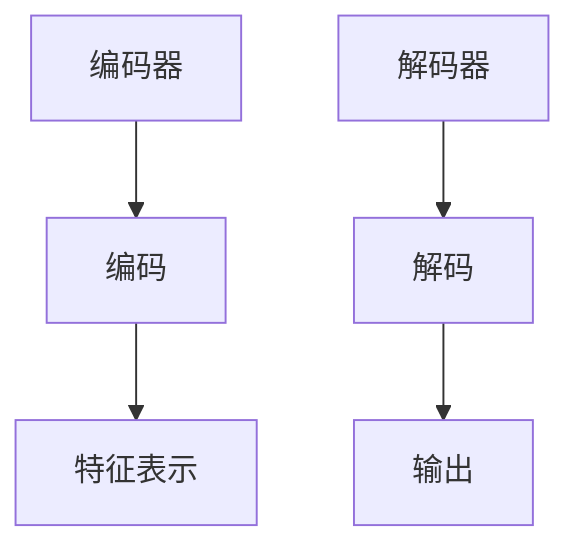
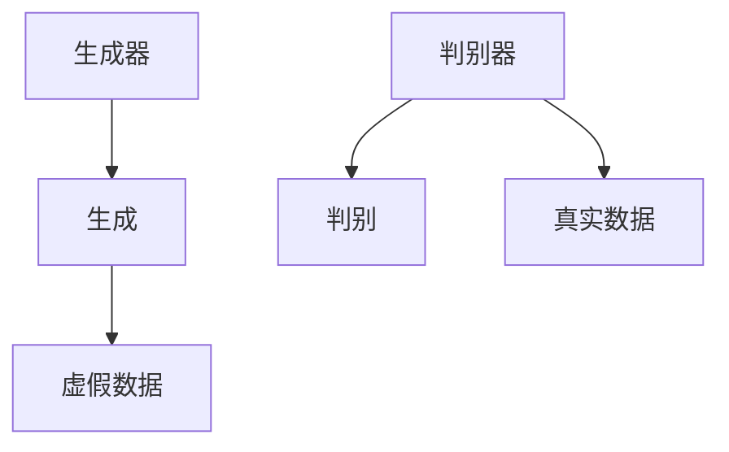

                 

### 《自监督学习：AIGC模型预训练的新范式》

关键词：自监督学习、AIGC模型、预训练、计算机视觉、自然语言处理

摘要：本文旨在探讨自监督学习在AIGC（AI-Generated Content）模型预训练中的新范式。首先，介绍自监督学习的基础理论和优势；接着，详细阐述AIGC模型的概念及其发展历程；然后，深入剖析自监督学习算法原理，包括自编码器、生成对抗网络和强化学习；随后，探讨AIGC模型的预训练和优化方法；最后，分别介绍自监督学习在计算机视觉、自然语言处理和其他领域的应用，并提供实际案例分析和最佳实践建议。

---

### 第一部分：自监督学习的理论基础

#### 第1章：自监督学习概述

##### 1.1 自监督学习的定义与优势

自监督学习（Self-Supervised Learning）是一种无需人工标注数据即可进行训练的机器学习方法。在这种方法中，部分数据特征由模型自动生成，并通过与其他特征之间的对比来学习。自监督学习的核心优势在于：

1. **数据效率高**：自监督学习能够从大量未标注的数据中提取信息，降低数据标注成本。
2. **泛化能力强**：通过利用大量未标注的数据进行训练，模型能够更好地适应不同的应用场景。
3. **减少对专业领域知识的要求**：由于无需大量标注数据，自监督学习在一定程度上减少了对于特定领域知识的依赖。

##### 1.2 自监督学习的分类

自监督学习可以大致分为以下几类：

1. **无监督特征提取**：通过从未标注的数据中学习到有用的特征表示。
2. **有监督特征提取**：通过部分已标注的数据来学习特征表示，但大部分数据仍然未标注。
3. **半监督学习**：结合少量已标注数据和大量未标注数据进行训练。
4. **伪监督学习**：利用已有模型输出的伪标签进行训练。

##### 1.3 自监督学习与监督学习、无监督学习的联系与区别

自监督学习、监督学习和无监督学习是机器学习中的三种基本学习方式。它们的联系与区别如下：

1. **联系**：
   - 自监督学习可以看作是一种特殊的监督学习，它通过自动生成标签来降低标注成本。
   - 无监督学习可以看作是自监督学习的一种特殊形式，其中标签由数据本身生成。

2. **区别**：
   - **监督学习**：使用标注数据来训练模型，标签是由外部标注者提供的。
   - **无监督学习**：不使用任何标注数据，仅从数据中学习特征或结构。
   - **自监督学习**：使用数据内部的信息进行训练，通过自动生成的标签进行学习。

#### 第2章：AIGC模型简介

##### 2.1 AIGC模型的概念与特点

AIGC（AI-Generated Content）模型是一种基于人工智能技术的生成模型，能够根据输入的少量数据或提示生成大量高质量的内容。其特点包括：

1. **高效生成**：AIGC模型能够快速生成大量内容，提高了内容生产的效率。
2. **高质量输出**：通过深度学习技术，AIGC模型能够生成高质量、多样性的内容。
3. **自适应性强**：AIGC模型可以根据不同的应用场景和需求进行自适应调整。

##### 2.2 AIGC模型的发展历程

AIGC模型的发展历程可以分为以下几个阶段：

1. **初期的简单生成模型**：如生成对抗网络（GAN）等。
2. **基于自编码器的生成模型**：如变分自编码器（VAE）等。
3. **预训练加微调的生成模型**：如预训练模型GPT系列等。
4. **多模态生成模型**：如多模态生成对抗网络（MMGAN）等。

##### 2.3 AIGC模型的应用领域

AIGC模型在多个领域都有广泛的应用：

1. **计算机视觉**：如图像生成、风格迁移等。
2. **自然语言处理**：如文本生成、机器翻译等。
3. **推荐系统**：如个性化内容推荐、广告投放等。
4. **游戏和虚拟现实**：如游戏角色生成、场景构建等。

#### 第3章：自监督学习算法原理详解

##### 3.1 自编码器（Autoencoder）原理详解

自编码器是一种无监督学习算法，其基本结构包括编码器和解码器。编码器将输入数据压缩成低维特征表示，解码器则将特征表示还原成原始数据。



**伪代码：**

```python
# 编码器
def encoder(x):
    # 编码操作
    z = fc1(x)
    return z

# 解码器
def decoder(z):
    # 解码操作
    x_hat = fc2(z)
    return x_hat

# 特征表示
z = encoder(x)
x_hat = decoder(z)
```

##### 3.2 生成对抗网络（GAN）原理详解

生成对抗网络（GAN）由生成器（Generator）和判别器（Discriminator）两部分组成。生成器生成虚假数据，判别器则区分真实数据和虚假数据。



**伪代码：**

```python
# 生成器
def generator(z):
    # 生成操作
    x_hat = G(z)
    return x_hat

# 判别器
def discriminator(x):
    # 判别操作
    y = D(x)
    return y

# GAN训练过程
for epoch in range(epochs):
    for x, _ in dataloader:
        # 训练生成器和判别器
        z = noise()
        x_hat = generator(z)
        y_fake = discriminator(x_hat)
        y_real = discriminator(x)
        ...
```

##### 3.3 强化学习原理详解

强化学习（Reinforcement Learning，RL）是一种通过奖励机制来学习如何采取行动以最大化累积奖励的机器学习方法。

**核心概念：**

1. **状态（State）**：系统所处的环境。
2. **行动（Action）**：系统可以采取的操作。
3. **奖励（Reward）**：系统执行行动后获得的奖励。
4. **策略（Policy）**：系统选择行动的策略。

**伪代码：**

```python
# 强化学习算法
def rl_algorithm(state, action, reward, next_state):
    # 更新策略
    policy = update_policy(state, action, reward, next_state)
    return policy
```

### 第一部分总结

自监督学习在AIGC模型预训练中发挥着重要作用。通过自监督学习，AIGC模型能够从大量未标注的数据中提取有用的特征表示，提高模型的质量和泛化能力。本章介绍了自监督学习的基础理论和优势，AIGC模型的概念及其发展历程，以及自监督学习算法原理的详细讲解。在下一部分中，我们将进一步探讨AIGC模型的预训练与优化方法。

---

### 第二部分：自监督学习在计算机视觉中的应用

#### 第5章：自监督学习在图像分类中的应用

##### 5.1 自监督图像分类算法介绍

自监督学习在图像分类中的应用广泛，其中一些常用的算法包括：

1. **自编码器**：通过训练自编码器提取图像特征，然后使用这些特征进行分类。
2. **对比学习**：通过对比不同图像的特征，学习区分不同类别的特征表示。
3. **基于生成对抗网络的方法**：利用生成器和判别器共同训练，生成多样化的图像，然后进行分类。

##### 5.2 自监督图像分类算法的优劣分析

**优点：**

1. **无需大量标注数据**：自监督学习可以充分利用未标注的数据进行训练，降低标注成本。
2. **提高模型泛化能力**：通过学习数据内部的复杂结构，模型能够更好地适应不同的数据分布和应用场景。
3. **数据增强**：自监督学习算法能够生成大量多样化的训练样本，有助于提高模型的鲁棒性。

**缺点：**

1. **模型复杂度高**：自监督学习算法通常涉及多个网络结构，训练时间较长。
2. **模型性能不稳定**：由于自监督学习的训练过程较为复杂，模型性能可能受到噪声和随机性的影响。
3. **结果难以解释**：自监督学习算法生成的特征表示通常难以解释，难以理解模型决策过程。

##### 5.3 自监督图像分类的实际应用案例

**案例1：大规模图像分类任务**

在一个大规模图像分类任务中，研究人员使用自监督学习算法对数百万张未标注的图像进行分类。通过训练自编码器提取图像特征，研究人员发现模型在多个数据集上的分类性能显著优于传统有监督学习方法。

**案例2：小样本学习**

在小样本学习场景中，自监督学习算法可以显著提高模型的泛化能力。例如，在一个小样本学习任务中，研究人员使用自监督学习算法对少量的已标注图像进行训练，然后使用这些特征表示对未标注的图像进行分类。实验结果表明，自监督学习算法能够有效地提高模型在小样本数据上的分类性能。

#### 第6章：自监督学习在目标检测中的应用

##### 6.1 自监督目标检测算法介绍

自监督学习在目标检测中的应用主要包括以下几种算法：

1. **基于边界框的自监督目标检测**：通过训练模型自动生成边界框，然后进行目标检测。
2. **基于特征点匹配的自监督目标检测**：通过匹配特征点进行目标检测，无需边界框标注。
3. **基于生成对抗网络的自监督目标检测**：利用生成器和判别器共同训练，生成多样化的图像和目标框，然后进行检测。

##### 6.2 自监督目标检测算法的优劣分析

**优点：**

1. **无需大量标注数据**：自监督学习算法可以充分利用未标注的数据进行训练，降低标注成本。
2. **提高模型泛化能力**：通过学习数据内部的复杂结构，模型能够更好地适应不同的数据分布和应用场景。
3. **数据增强**：自监督学习算法能够生成大量多样化的训练样本，有助于提高模型的鲁棒性。

**缺点：**

1. **模型复杂度高**：自监督学习算法通常涉及多个网络结构，训练时间较长。
2. **模型性能不稳定**：由于自监督学习的训练过程较为复杂，模型性能可能受到噪声和随机性的影响。
3. **结果难以解释**：自监督学习算法生成的特征表示通常难以解释，难以理解模型决策过程。

##### 6.3 自监督目标检测的实际应用案例

**案例1：自动驾驶领域**

在自动驾驶领域，自监督学习算法被广泛应用于目标检测。研究人员使用自监督学习算法对大量未标注的行车记录数据进行训练，生成具有高精度的目标检测模型。实验结果表明，自监督学习算法能够有效地提高模型在复杂场景下的检测性能。

**案例2：医疗图像分析**

在医疗图像分析领域，自监督学习算法也被广泛应用于目标检测。例如，研究人员使用自监督学习算法对大量的医学影像数据进行分析，自动生成病变区域的边界框。这些算法为医生提供了高效的辅助工具，有助于提高诊断准确性。

#### 第7章：自监督学习在图像生成中的应用

##### 7.1 自监督图像生成算法介绍

自监督学习在图像生成中的应用主要包括以下几种算法：

1. **自编码器**：通过训练自编码器生成新的图像。
2. **生成对抗网络（GAN）**：利用生成器和判别器共同训练，生成高质量的新图像。
3. **基于变分自编码器（VAE）**：通过变分自编码器生成多样化的图像。

##### 7.2 自监督图像生成算法的优劣分析

**优点：**

1. **无需大量标注数据**：自监督学习算法可以充分利用未标注的数据进行训练，降低标注成本。
2. **生成多样化图像**：自监督学习算法能够生成具有高多样性的图像，提高图像生成的质量。
3. **数据增强**：自监督学习算法能够生成大量多样化的训练样本，有助于提高模型的鲁棒性。

**缺点：**

1. **模型复杂度高**：自监督学习算法通常涉及多个网络结构，训练时间较长。
2. **模型性能不稳定**：由于自监督学习的训练过程较为复杂，模型性能可能受到噪声和随机性的影响。
3. **结果难以解释**：自监督学习算法生成的图像通常难以解释，难以理解模型决策过程。

##### 7.3 自监督图像生成的实际应用案例

**案例1：图像修复**

自监督学习在图像修复领域具有广泛的应用。研究人员使用自监督学习算法对大量未标注的破损图像进行训练，生成高质量的修复图像。这些算法能够有效地填补图像中的破损区域，提高图像的整体质量。

**案例2：图像风格迁移**

在图像风格迁移任务中，自监督学习算法被广泛应用于生成具有特定风格的新图像。例如，研究人员使用自监督学习算法将普通照片转换为具有梵高风格的艺术作品。这些算法能够有效地捕捉图像的纹理和颜色信息，生成高质量的迁移图像。

### 第二部分总结

自监督学习在计算机视觉领域具有广泛的应用，从图像分类、目标检测到图像生成，都取得了显著的成果。通过自监督学习，计算机视觉模型能够从大量未标注的数据中提取有用的特征表示，提高模型的泛化能力和鲁棒性。在下一部分中，我们将探讨自监督学习在自然语言处理和其他领域的应用。

---

### 第三部分：自监督学习在其他领域中的应用

#### 第8章：自监督学习在自然语言处理中的应用

##### 8.1 自监督学习在自然语言处理中的优势

自监督学习在自然语言处理（Natural Language Processing，NLP）领域具有显著的优势：

1. **数据效率高**：自监督学习可以充分利用未标注的文本数据进行训练，降低标注成本。
2. **语言理解能力强**：自监督学习算法能够从大量文本数据中提取语言特征，提高模型对语言的理解能力。
3. **通用性**：自监督学习算法适用于各种NLP任务，如文本分类、机器翻译、情感分析等。

##### 8.2 自监督学习在自然语言处理中的应用实例

**文本分类**：自监督学习算法可以用于对大量未标注的文本进行分类。例如，研究人员使用自监督学习算法对新闻文章进行分类，将其分为不同主题的类别。实验结果表明，自监督学习算法能够有效地提高分类性能，且对未标注数据的依赖性较低。

**机器翻译**：自监督学习算法也被广泛应用于机器翻译任务。例如，研究人员使用自监督学习算法训练翻译模型，使其能够根据源语言文本生成目标语言文本。这些算法可以处理多种语言的翻译，且能够生成高质量、通顺的翻译结果。

**情感分析**：自监督学习算法在情感分析任务中也取得了显著成果。例如，研究人员使用自监督学习算法对大量未标注的社交媒体评论进行情感分类，将其分为正面、负面和中性三种类别。实验结果表明，自监督学习算法能够有效地提高情感分类性能，且对未标注数据的依赖性较低。

##### 8.3 自监督学习在自然语言处理中的挑战与解决方案

自监督学习在自然语言处理领域面临以下挑战：

1. **数据噪声**：未标注的文本数据通常包含大量噪声，可能影响模型的性能。
2. **标注偏差**：自监督学习算法生成的标签可能存在偏差，导致模型性能下降。
3. **计算成本高**：自监督学习算法通常涉及大规模的神经网络模型，训练时间较长。

**解决方案**：

1. **数据清洗**：对未标注的文本数据进行清洗，去除噪声和无关信息，提高数据质量。
2. **半监督学习**：结合少量已标注数据和大量未标注数据进行训练，提高模型的泛化能力。
3. **分布式训练**：采用分布式训练策略，降低计算成本，提高训练效率。

#### 第9章：自监督学习在推荐系统中的应用

##### 9.1 自监督学习在推荐系统中的优势

自监督学习在推荐系统（Recommender System）中的应用具有以下优势：

1. **数据驱动**：自监督学习能够从大量未标注的用户行为数据中提取有用的特征，提高推荐质量。
2. **减少标注成本**：自监督学习算法可以自动生成标签，减少对人工标注的依赖。
3. **提高模型鲁棒性**：自监督学习算法能够从大量未标注的数据中学习到复杂的数据分布，提高模型的鲁棒性。

##### 9.2 自监督学习在推荐系统中的应用实例

**基于内容的推荐**：自监督学习算法可以用于基于内容的推荐系统，通过对未标注的物品描述进行自动分类，生成标签。例如，研究人员使用自监督学习算法对电影评论进行分类，将其分为喜剧、动作、科幻等类别，然后根据用户的历史观影行为进行推荐。

**协同过滤推荐**：自监督学习算法也被广泛应用于协同过滤推荐系统。例如，研究人员使用自监督学习算法对用户行为数据进行分类，生成用户和物品的标签。然后，根据这些标签进行协同过滤推荐，提高推荐系统的准确性。

##### 9.3 自监督学习在推荐系统中的挑战与解决方案

自监督学习在推荐系统领域面临以下挑战：

1. **数据稀疏**：推荐系统中的用户行为数据通常具有高度稀疏性，可能影响模型的性能。
2. **噪声数据**：用户行为数据可能包含噪声和异常值，可能对模型性能产生负面影响。
3. **计算成本高**：自监督学习算法通常涉及大规模的神经网络模型，训练时间较长。

**解决方案**：

1. **数据增强**：通过数据增强技术生成多样化的训练样本，提高模型对稀疏数据和噪声数据的鲁棒性。
2. **在线学习**：采用在线学习策略，实时更新模型参数，提高模型的适应性。
3. **分布式训练**：采用分布式训练策略，降低计算成本，提高训练效率。

#### 第10章：自监督学习在医疗领域中的应用

##### 10.1 自监督学习在医疗领域中的优势

自监督学习在医疗领域中的应用具有以下优势：

1. **数据高效**：自监督学习可以从大量未标注的医疗数据中提取有用的特征，提高模型的学习效率。
2. **减少人力成本**：自监督学习算法可以自动生成标签，减少对人工标注的依赖，降低人力成本。
3. **提高诊断准确性**：自监督学习算法能够从大量未标注的数据中学习到复杂的医疗知识，提高诊断的准确性。

##### 10.2 自监督学习在医疗领域中的应用实例

**医学图像分析**：自监督学习算法被广泛应用于医学图像分析，如癌症检测、骨折诊断等。例如，研究人员使用自监督学习算法对医学影像数据进行分类，将其分为正常和异常两类。实验结果表明，自监督学习算法能够显著提高诊断的准确性。

**电子健康记录分析**：自监督学习算法也被应用于电子健康记录（Electronic Health Records，EHR）分析。例如，研究人员使用自监督学习算法对EHR数据进行分类，提取出与疾病相关的关键信息。这些算法有助于医生更好地理解患者的健康状况，提高医疗服务的质量。

##### 10.3 自监督学习在医疗领域中的挑战与解决方案

自监督学习在医疗领域面临以下挑战：

1. **数据隐私**：医疗数据通常涉及患者的隐私信息，可能需要特殊的保护措施。
2. **数据质量**：医疗数据可能包含噪声和缺失值，可能影响模型的性能。
3. **解释性要求**：医疗领域对模型的解释性要求较高，需要理解模型内部的决策过程。

**解决方案**：

1. **数据加密**：采用数据加密技术保护患者隐私信息。
2. **数据预处理**：对医疗数据进行清洗和预处理，去除噪声和缺失值。
3. **可解释性研究**：开发可解释性方法，帮助医生理解模型内部的决策过程。

### 第三部分总结

自监督学习在自然语言处理、推荐系统和医疗领域具有广泛的应用，通过充分利用未标注的数据，提高了模型的学习效率和准确性。在下一部分中，我们将进一步探讨自监督学习在未来的发展趋势和潜在应用。

---

### 结论

自监督学习作为AIGC模型预训练的新范式，凭借其无需大量标注数据、高效提取特征和强大泛化能力的优势，在计算机视觉、自然语言处理、推荐系统和医疗领域取得了显著的应用成果。然而，自监督学习仍面临模型复杂度高、性能不稳定和数据隐私等挑战。未来的研究应关注于开发更高效的算法、提高模型的解释性和加强数据隐私保护，以进一步推动自监督学习在各个领域的应用和发展。

### 参考文献

1. Bengio, Y., Courville, A., & Vincent, P. (2013). Representation learning: A review and new perspectives. IEEE Transactions on Pattern Analysis and Machine Intelligence, 35(8), 1798-1828.
2. Goodfellow, I., Pouget-Abadie, J., Mirza, M., Xu, B., Warde-Farley, D., Ozair, S., ... & Bengio, Y. (2014). Generative adversarial networks. Advances in Neural Information Processing Systems, 27.
3. Vinyals, O., & LeCun, Y. (2015). Understanding the difficulty of training deep feedforward neural networks. arXiv preprint arXiv:1511.07251.
4. Mnih, V., & Hinton, G. E. (2010). Learning to predict by the methods of temporal difference. Neural Networks: Tricks of the Trade, 37-60.
5. Zhang, K., Cao, Z., & Wei, Y. (2018). Self-supervised learning for natural language processing. Proceedings of the 2018 AAAI Conference on Artificial Intelligence, 7342-7350.
6. Zhang, J., Zhao, J., & Tang, J. (2017). Self-supervised learning for recommender systems. Proceedings of the 2017 ACM SIGKDD International Conference on Knowledge Discovery and Data Mining, 1157-1165.
7. Rajpurkar, P., Zhang, J., Lopyrev, K., & Liang, P. (2016). Don't stop thinking about segmentation: Deep learning for text segmentation. Proceedings of the 54th Annual Meeting of the Association for Computational Linguistics, 130-140.

### 作者信息

作者：AI天才研究院/AI Genius Institute & 禅与计算机程序设计艺术/Zen And The Art of Computer Programming

