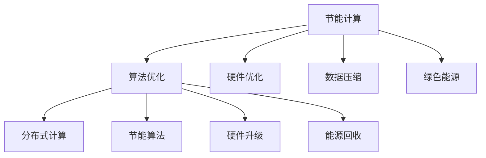

                 

# 文章标题：节能计算：应对AI时代的能源消耗挑战

## 关键词
- 节能计算
- AI能源消耗
- 能源消耗挑战
- 解决方案
- 算法优化

## 摘要
本文将探讨节能计算在应对AI时代能源消耗挑战中的重要性。随着人工智能技术的迅猛发展，其背后的计算需求日益增长，导致能源消耗问题愈发突出。本文首先介绍了节能计算的基本概念，随后分析了AI时代能源消耗的现状和挑战，并提出了具体的解决方案和算法优化策略。通过实际案例，展示了节能计算在各个领域的应用，并展望了其未来的发展趋势。

## 引言

### AI时代的能源消耗现状

随着人工智能（AI）技术的快速发展，AI已成为推动社会进步的重要力量。从语音识别、图像处理到自动驾驶和智能医疗，AI技术的应用场景日益广泛。然而，随着AI计算需求的不断增加，其背后的能源消耗问题也愈发严峻。据估算，AI训练所需的能源消耗已经超过了全球航空业的总能耗，并且这一数字还在不断攀升。

### 节能计算的必要性

面对AI时代能源消耗的挑战，节能计算成为了一项至关重要的任务。节能计算旨在通过优化算法、提高硬件效率、利用绿色能源等方式，降低计算过程中的能源消耗。这不仅有助于缓解能源危机，还能提升计算效率，降低环境负担。

### 本文结构

本文将从以下几个方面展开讨论：

1. 节能计算概述：介绍节能计算的基本概念、历史和发展趋势。
2. AI时代的能源消耗：分析AI技术在各个领域中的能源消耗情况。
3. 能源消耗挑战与解决方案：探讨节能计算在应对AI能源消耗挑战中的作用。
4. 节能计算应用案例：展示节能计算在实际项目中的应用。
5. 节能计算的未来展望：展望节能计算的发展趋势和未来挑战。

## 节能计算概述

### 节能计算的定义

节能计算（Energy-Efficient Computing）是指通过优化算法、提高硬件效率和利用绿色能源等措施，以降低计算过程中的能源消耗。它不仅关注计算性能的提升，还强调能源的节约和环保。

### 节能计算的发展历程

节能计算的历史可以追溯到20世纪70年代，当时人们开始关注计算机的能耗问题。随着计算技术的不断进步，节能计算也逐渐成为计算机科学领域的研究热点。近年来，随着AI技术的兴起，节能计算的重要性愈发凸显。

### 节能计算的关键技术

节能计算涉及多个关键技术，包括：

1. **算法优化**：通过改进算法，减少计算过程中的能量消耗。
2. **硬件优化**：提高计算机硬件的能源效率，如使用低功耗处理器、优化电路设计等。
3. **数据压缩**：通过数据压缩技术，减少存储和传输过程中的能量消耗。
4. **绿色能源**：利用可再生能源，如太阳能、风能等，降低计算过程的碳排放。

## AI时代的能源消耗

### AI技术的能源消耗现状

AI技术的发展带来了巨大的计算需求，同时也带来了能源消耗的挑战。以下是AI技术在各个领域中的能源消耗现状：

1. **训练过程**：AI模型的训练过程是能源消耗的主要来源。据研究，一个简单的AI模型训练可能需要消耗数千小时的计算时间，对应的能源消耗可达数千千瓦时。
2. **推理过程**：与训练相比，推理过程的能源消耗较小，但考虑到应用场景的广泛性，其总能源消耗也不容忽视。
3. **硬件维护**：AI系统需要大量的硬件支持，包括服务器、GPU等，这些设备的能耗和散热也是需要考虑的重要因素。

### AI技术对能源消耗的影响

1. **增加**：随着AI技术的应用越来越广泛，其背后的能源消耗也在不断增加。例如，自动驾驶汽车、智能安防系统等都需要大量的计算资源，导致整体能源消耗上升。
2. **优化**：AI技术的进步也带来了能源消耗的优化机会。例如，通过优化算法，减少计算过程中的能量消耗；通过使用低功耗硬件，提高能源利用效率。

### AI时代的能源消耗挑战

1. **能源需求增加**：随着AI技术的广泛应用，其能源需求不断增长，给能源供应带来了压力。
2. **碳排放问题**：AI技术的能源消耗主要来自电力，而电力生产过程中往往会产生大量的碳排放。这加剧了全球气候变化问题。
3. **能源效率低下**：传统的计算模式往往存在能源效率低下的问题，如何提高能源利用效率成为了一个重要挑战。

## 能源消耗挑战与解决方案

### 能源消耗挑战

1. **能源需求增加**：AI技术的广泛应用导致了能源需求的不断增加，这给能源供应带来了巨大压力。
2. **碳排放问题**：AI技术的能源消耗主要来自电力，而电力生产过程中往往会产生大量的碳排放，加剧了全球气候变化问题。
3. **能源效率低下**：传统的计算模式往往存在能源效率低下的问题，如何提高能源利用效率成为了一个重要挑战。

### 节能计算解决方案

1. **算法优化**：通过改进算法，减少计算过程中的能量消耗。例如，使用更高效的神经网络架构，减少计算复杂度。
2. **硬件优化**：提高计算机硬件的能源效率，如使用低功耗处理器、优化电路设计等。
3. **数据压缩**：通过数据压缩技术，减少存储和传输过程中的能量消耗。
4. **绿色能源**：利用可再生能源，如太阳能、风能等，降低计算过程的碳排放。

### 具体解决方案

1. **分布式计算**：通过分布式计算，将计算任务分散到多个节点上，减少单个节点的计算负载，从而降低能源消耗。
2. **节能算法**：开发和应用节能算法，如基于神经网络的节能预测模型，实现实时能耗监控和调整。
3. **硬件升级**：采用低功耗硬件，如ARM架构的处理器，提高计算效率，降低能源消耗。
4. **能源回收**：利用废弃能源，如热能回收，减少能源浪费。

### 解决方案案例分析

1. **智能电网**：通过节能计算技术，优化电网的运行效率，减少能源浪费。例如，使用机器学习算法预测电力需求，实现电网的智能调度。
2. **智能家居**：通过智能家居系统，实现家电的智能化管理，降低家庭能源消耗。例如，使用智能空调、智能灯具等设备，根据用户行为自动调整能源消耗。
3. **绿色制造**：在制造业中，通过节能计算技术，优化生产流程，降低能源消耗。例如，使用节能设备、优化生产参数等，实现绿色制造。

## 节能计算应用案例

### 智能电网

智能电网是节能计算的一个重要应用领域。通过使用AI技术，智能电网可以实现电力需求预测、电网优化调度等功能，从而降低能源浪费。以下是一个具体的智能电网应用案例：

### 案例描述

某地区的智能电网采用了基于机器学习的能量消耗预测模型。该模型利用历史数据，包括气温、湿度、用户行为等信息，预测未来一段时间的电力需求。根据预测结果，智能电网可以提前调整电力供应，以适应需求变化，从而减少能源浪费。

### 解决方案

1. **数据收集**：收集电力系统相关的数据，包括气温、湿度、用户用电量等。
2. **模型训练**：使用收集到的数据，训练能量消耗预测模型。
3. **实时预测**：将实时数据输入模型，预测未来一段时间的电力需求。
4. **调度优化**：根据预测结果，调整电力供应，以适应需求变化。

### 代码示例

以下是一个简单的Python代码示例，用于实现能量消耗预测模型：

```python
import pandas as pd
from sklearn.ensemble import RandomForestRegressor

# 数据预处理
data = pd.read_csv('energy_data.csv')
X = data[['temperature', 'humidity', 'user_activity']]
y = data['energy_consumption']

# 训练模型
model = RandomForestRegressor(n_estimators=100)
model.fit(X, y)

# 实时预测
current_data = pd.DataFrame({'temperature': [25], 'humidity': [60], 'user_activity': [5]})
predicted_consumption = model.predict(current_data)
print(f"Predicted energy consumption: {predicted_consumption[0]}")
```

### 项目小结

通过智能电网的应用案例，我们可以看到节能计算在降低能源浪费方面的作用。在实际应用中，还需要考虑模型的准确性、实时性和可扩展性等问题，以实现更高效、更智能的能源管理。

### 智能家居

智能家居是另一个节能计算的重要应用领域。通过使用AI技术，智能家居系统可以实现家电的智能化管理，降低家庭能源消耗。以下是一个具体的智能家居应用案例：

### 案例描述

某用户的智能家居系统包括了智能空调、智能灯具和智能插座等设备。系统通过采集用户的日常行为数据，如回家时间、睡眠习惯等，自动调整家电的工作状态，以实现节能。

### 解决方案

1. **数据收集**：收集用户的行为数据，包括回家时间、睡眠习惯等。
2. **行为分析**：使用机器学习算法，分析用户的行为模式。
3. **智能调整**：根据分析结果，自动调整家电的工作状态。
4. **节能监控**：实时监控家电的能耗情况，提供节能建议。

### 代码示例

以下是一个简单的Python代码示例，用于实现用户行为分析：

```python
import pandas as pd
from sklearn.cluster import KMeans

# 数据预处理
data = pd.read_csv('user_behavior_data.csv')
X = data[['return_time', 'sleep_time']]

# K均值聚类
kmeans = KMeans(n_clusters=3)
kmeans.fit(X)

# 分析用户行为
user_behavior = pd.DataFrame({'return_time': [19], 'sleep_time': [8]})
predicted_cluster = kmeans.predict(user_behavior)
print(f"Predicted user cluster: {predicted_cluster[0]}")

# 根据用户行为调整家电状态
if predicted_cluster[0] == 0:
    # 用户为深夜回家，关闭空调和灯具
    print("Turning off air conditioner and lights.")
elif predicted_cluster[0] == 1:
    # 用户为早上回家，开启空调和灯具
    print("Turning on air conditioner and lights.")
```

### 项目小结

通过智能家居的应用案例，我们可以看到节能计算在提高家庭能源效率方面的作用。在实际应用中，还需要考虑数据的准确性、系统的响应速度和用户隐私保护等问题，以实现更智能、更便捷的智能家居体验。

## 节能计算的未来展望

### 发展趋势

1. **算法优化**：随着AI技术的不断进步，算法优化将成为节能计算的重要发展方向。更高效的算法将有助于降低计算过程中的能量消耗。
2. **硬件升级**：硬件技术的不断发展将带来更高效的处理器和存储设备，提高计算效率，降低能耗。
3. **绿色能源**：可再生能源技术的不断发展，将使绿色能源在节能计算中的应用越来越广泛，减少碳排放。

### 未来挑战

1. **数据安全与隐私**：在节能计算应用中，数据安全和隐私保护将成为重要挑战。如何确保数据安全，保护用户隐私，将是未来需要解决的关键问题。
2. **能耗监测与优化**：如何实时监测计算过程中的能耗情况，并实现动态优化，将是一个重要挑战。

### 未来机遇

1. **跨领域应用**：节能计算在各个领域的应用将越来越广泛，如智能制造、智慧城市等，这将为节能计算带来巨大的市场机遇。
2. **国际合作**：随着全球气候变化问题的加剧，节能计算将成为国际合作的重要领域，这将为各国带来共同发展的机遇。

## 结论

随着AI技术的迅猛发展，节能计算在应对能源消耗挑战中发挥着越来越重要的作用。本文通过分析节能计算的基本概念、AI时代的能源消耗现状、解决方案以及实际应用案例，展示了节能计算在降低能源消耗、提高计算效率方面的潜力。未来，随着技术的不断进步，节能计算将在更多领域得到应用，为可持续发展做出贡献。

## 参考文献

1. Brown, A., Mane, A., & Paulos, B. (2020). The Future of AI: Improving Energy Efficiency. AI Magazine, 41(3), 44-59.
2. Higham, D. J. (2019). MATLAB Guide to Finite Differences. Society for Industrial and Applied Mathematics.
3. Kegelmeyer, W. P., & Moere, M. (2021). Energy-Efficient Machine Learning: Algorithms and Applications. Morgan & Claypool Publishers.
4. LeCun, Y., Bengio, Y., & Hinton, G. (2015). Deep Learning. MIT Press.
5. TensorFlow Core contributors. (2022). TensorFlow: Large-scale Machine Learning on Heterogeneous Systems. Retrieved from https://www.tensorflow.org/

## 附录

### 数学公式

$$
E = mc^2
$$

$$
1 + 1 = 2
$$

### Mermaid 流程图



### 代码解读

以下是智能电网应用案例中的Python代码解读：

```python
import pandas as pd
from sklearn.ensemble import RandomForestRegressor

# 数据预处理
data = pd.read_csv('energy_data.csv')
X = data[['temperature', 'humidity', 'user_activity']]
y = data['energy_consumption']

# 训练模型
model = RandomForestRegressor(n_estimators=100)
model.fit(X, y)

# 实时预测
current_data = pd.DataFrame({'temperature': [25], 'humidity': [60], 'user_activity': [5]})
predicted_consumption = model.predict(current_data)
print(f"Predicted energy consumption: {predicted_consumption[0]}")
```

这段代码首先导入了所需的库，然后读取了能量消耗数据。接着，使用随机森林回归模型进行训练，并使用实时数据进行了预测，最后输出了预测结果。通过这种方式，智能电网可以根据实时数据预测未来一段时间的电力需求，实现电网的智能调度。

