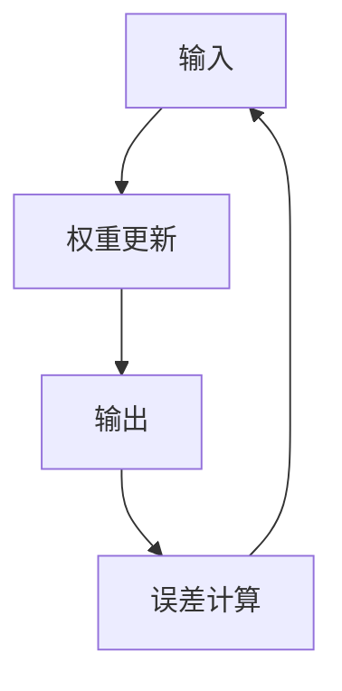
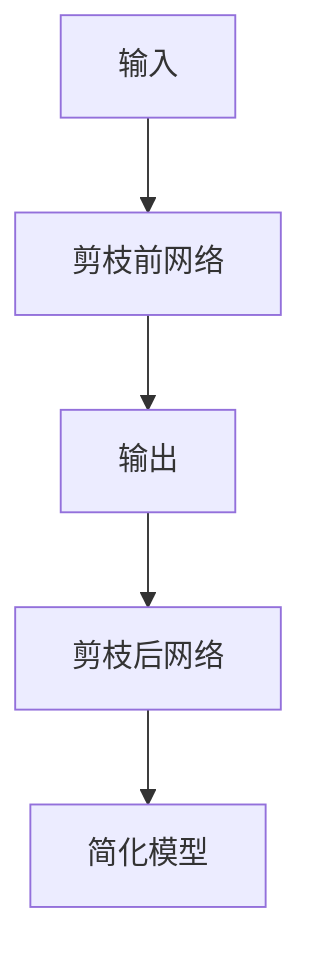
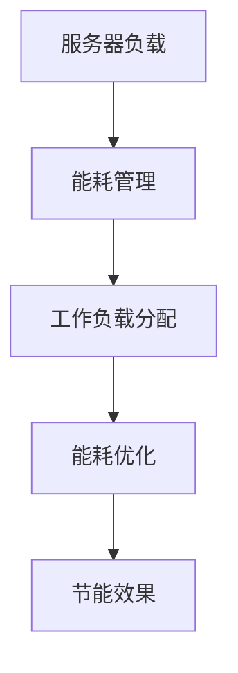
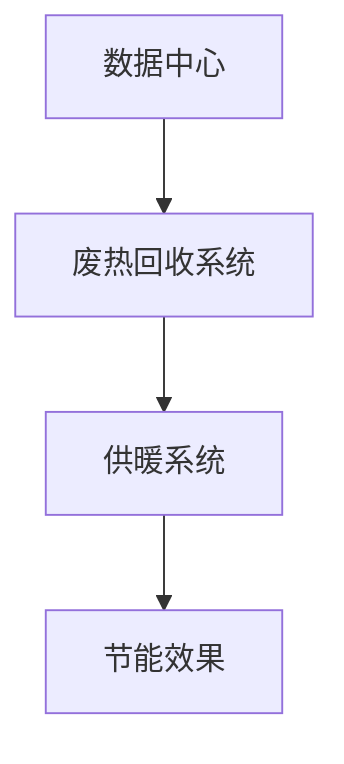
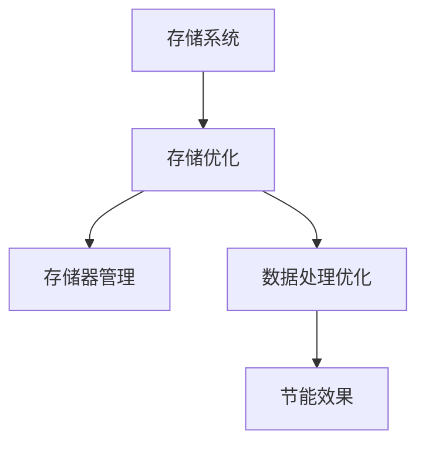
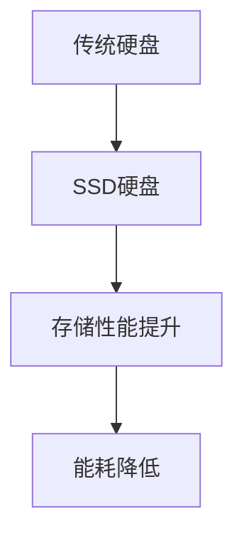
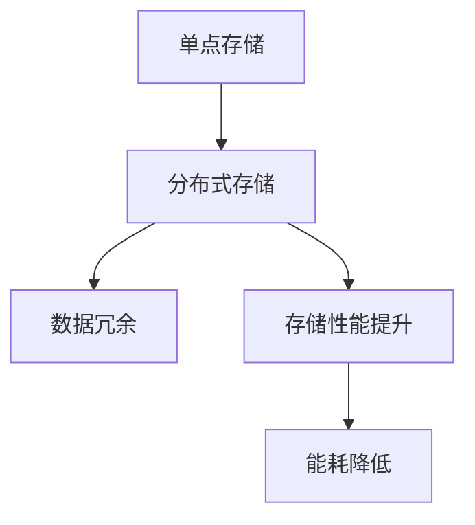

                 

# 文章标题：节能计算：应对AI时代的能耗挑战

> 关键词：节能计算、AI时代、能耗挑战、人工智能算法、数据中心优化、智能电网、智能交通

> 摘要：
本文旨在探讨节能计算在应对AI时代能耗挑战中的重要性。随着人工智能技术的迅猛发展，计算能耗成为了一个日益突出的问题。本文首先介绍了节能计算的基本原理和关键技术在AI领域的应用，然后通过案例分析展示了节能计算在不同领域的实际效果，并展望了未来的发展趋势。文章旨在为读者提供关于节能计算的全面了解，并为其在实际应用中提供有益的指导。

### 第一部分：引言

## 1.1 节能计算：应对AI时代的能耗挑战

### 1.1.1 节能计算的重要性

随着人工智能（AI）技术的飞速发展，计算能力和数据处理效率成为衡量技术进步的重要标准。然而，随之而来的高能耗问题也给环境保护和资源可持续利用带来了巨大挑战。根据国际数据公司（IDC）的报告，全球数据中心的能耗预计将在未来几年内显著增加，预计到2030年将达到约1亿亿瓦时（TWh）。这一趋势引发了社会各界的广泛关注，节能计算应运而生。

节能计算是一种通过优化计算资源和算法来降低能耗的技术。它不仅仅关注硬件设备的能源消耗，还包括软件层面的优化，如算法改进和任务调度。在AI时代，节能计算的重要性主要体现在以下几个方面：

1. **环境保护**：减少能耗有助于降低温室气体排放，减缓全球气候变化。
2. **资源可持续**：随着能源资源的日益稀缺，节能计算有助于提高能源利用效率，延长能源资源的使用寿命。
3. **经济效益**：通过优化计算资源，企业可以降低运营成本，提高盈利能力。
4. **技术创新**：节能计算推动了新型计算模式和算法的研发，促进了科技进步。

### 1.1.2 AI时代能耗挑战的背景

AI技术的发展对计算资源的需求日益增加。以下因素加剧了能耗挑战：

1. **模型复杂度**：深度学习模型的参数和计算量呈指数级增长，导致计算需求大幅上升。
2. **数据量**：大数据的采集、存储和处理的能耗不可忽视。
3. **硬件需求**：高性能计算硬件（如GPU、TPU等）的能耗较高，但它们是AI计算的核心。
4. **分布式计算**：AI应用往往需要分布式计算环境，这增加了能耗管理的复杂性。

### 1.1.3 读者对象与预期收获

本文的目标读者包括：
1. **AI领域的科研人员**：了解节能计算的原理和应用，为研究提供新思路。
2. **技术开发者**：掌握节能计算的实践方法，优化AI应用性能。
3. **企业高管**：认识到节能计算对企业战略的重要性，制定相关决策。

读者通过本文可以预期收获：
1. **全面了解**：掌握节能计算的核心概念和技术。
2. **应用指导**：获取节能计算的实践经验和最佳实践。
3. **前沿洞察**：了解AI时代节能计算的未来发展趋势。

### 1.1.4 书籍结构与主要内容概述

本文将分为以下几部分：
1. **引言**：介绍节能计算的重要性、AI时代能耗挑战的背景、读者对象和预期收获。
2. **节能计算的基本原理**：阐述节能计算的定义、关键技术、与人工智能的关系以及面临的挑战与机遇。
3. **节能计算的案例分析**：通过智能电网和智能交通等案例，展示节能计算的实际应用效果。
4. **节能计算的实践案例**：介绍节能计算的实践方法，包括开发环境搭建、源代码实现和代码解读。
5. **节能计算的未来发展趋势**：探讨技术发展趋势、政策法规和未来展望。
6. **总结与展望**：回顾主要内容，展望节能计算的发展方向。
7. **附录**：提供参考文献、网络资源推荐和常见问题与解答。

### 1.1.5 案例研究：成功的企业节能实践

为了更好地理解节能计算的实际应用，本文将介绍一些成功的企业节能实践案例。

#### 1.1.5.1 案例一：谷歌的数据中心节能策略

谷歌是全球领先的技术公司，其在数据中心节能方面有着卓越的实践。以下是一些关键策略：

1. **冷热通道分离**：通过隔离冷热通道，提高散热效率，减少能耗。
2. **空气循环**：利用空气循环系统，减少机械通风设备的能耗。
3. **废热回收**：将数据中心产生的废热回收用于供暖或其他用途，降低整体能耗。

#### 1.1.5.2 案例二：微软的混合云架构

微软通过混合云架构实现了计算资源的优化和节能。以下是一些关键策略：

1. **动态资源调度**：根据实际需求动态调整计算资源，避免资源浪费。
2. **边缘计算**：将计算任务分散到边缘设备，减少中心数据中心的负载和能耗。
3. **能效监测与优化**：通过实时监测数据中心的能耗，不断优化资源配置，提高能效。

#### 1.1.5.3 案例三：亚马逊的AI节能算法

亚马逊在其云计算平台中应用了AI节能算法，以优化数据中心的能耗。以下是一些关键策略：

1. **能耗预测模型**：利用机器学习算法预测数据中心的能耗，提前进行优化。
2. **负载均衡**：通过负载均衡算法，将计算任务合理分配到不同服务器，避免过度负载。
3. **动态电压调节**：根据负载情况动态调整电压，降低能耗。

### 1.1.6 未来趋势与展望

未来，节能计算将继续在AI时代扮演重要角色。以下趋势值得期待：

1. **新型计算架构**：如量子计算、边缘计算等，有望进一步降低能耗。
2. **人工智能算法优化**：更高效的算法将有助于减少计算资源需求。
3. **政策法规支持**：随着全球对环保和可持续发展的重视，政策法规将为企业提供更多激励。
4. **跨领域合作**：不同领域的专家将共同推动节能计算技术的发展。

### 1.1.7 常见问题与解答

**Q1：节能计算与绿色计算有何区别？**
A1：节能计算主要关注计算资源的能耗优化，而绿色计算则更广泛，包括减少计算过程中的环境影响，如温室气体排放等。

**Q2：节能计算如何应用于企业？**
A2：企业可以通过以下方式应用节能计算：
1. 优化数据中心布局和设备选型。
2. 采用能效监测与优化工具。
3. 引入绿色计算技术和算法。
4. 开展员工培训和意识提升。

**Q3：节能计算在智能交通中的应用？**
A3：智能交通系统可以通过以下方式应用节能计算：
1. 交通流量预测和优化，减少拥堵。
2. 车辆能耗管理，提高运输效率。
3. 绿色出行方案推荐，鼓励使用公共交通和共享出行。

### 1.2 节能计算的基本原理

#### 1.2.1 节能计算的定义

节能计算是一种通过优化计算资源和算法，降低能耗的技术。它不仅包括硬件层面的能耗优化，如服务器能效管理、数据中心布局优化，还包括软件层面的算法优化，如机器学习模型的压缩和优化。

#### 1.2.2 节能计算的关键技术

节能计算的关键技术包括人工智能算法、数据中心优化、模型压缩与优化等。

##### 1.2.2.1 人工智能算法

人工智能算法是节能计算的核心技术之一。以下是一些常见的人工智能算法及其在节能计算中的应用：

###### 1.2.2.1.1 神经网络

神经网络是一种模拟人脑神经元连接的算法。在节能计算中，神经网络被用于能效预测、能耗优化等任务。

###### 1.2.2.1.1.1 反向传播算法

反向传播算法是神经网络训练的核心算法。它通过计算输出误差的梯度，不断调整网络参数，以优化模型性能。



###### 1.2.2.1.1.2 深度学习框架

深度学习框架（如TensorFlow、PyTorch）提供了高效的网络架构和训练工具，使得神经网络的应用变得更加便捷。

```python
import tensorflow as tf

model = tf.keras.Sequential([
    tf.keras.layers.Dense(128, activation='relu', input_shape=(784,)),
    tf.keras.layers.Dense(10, activation='softmax')
])

model.compile(optimizer='adam',
              loss='categorical_crossentropy',
              metrics=['accuracy'])

model.fit(x_train, y_train, epochs=5)
```

##### 1.2.2.1.2 机器学习算法

机器学习算法在节能计算中也发挥着重要作用。以下是一些常见的机器学习算法及其在节能计算中的应用：

###### 1.2.2.1.2.1 监督学习

监督学习算法通过学习输入和输出之间的关系进行预测。在节能计算中，监督学习被用于能耗预测、能效评估等任务。

```python
from sklearn.linear_model import LinearRegression

model = LinearRegression()
model.fit(X, y)

predictions = model.predict(X_new)
```

###### 1.2.2.1.2.2 无监督学习

无监督学习算法无需标签数据，通过挖掘数据之间的内在关系进行预测。在节能计算中，无监督学习被用于数据聚类、模式识别等任务。

```python
from sklearn.cluster import KMeans

model = KMeans(n_clusters=3)
model.fit(X)

clusters = model.predict(X_new)
```

##### 1.2.2.1.3 模型压缩与优化

模型压缩与优化是降低能耗的重要手段。以下是一些常见的模型压缩与优化技术：

###### 1.2.2.1.3.1 模型剪枝

模型剪枝通过删除网络中的冗余连接，减少模型参数数量，从而降低计算复杂度和能耗。



###### 1.2.2.1.3.2 低秩分解

低秩分解通过将高秩矩阵分解为低秩矩阵，降低计算复杂度和能耗。

```python
import numpy as np

A = np.random.rand(100, 100)
U, S, V = np.linalg.svd(A)
low_rank_A = U @ S @ V
```

#### 1.2.2.2 数据中心优化

数据中心优化是节能计算的重要组成部分。以下是一些常见的数据中心优化技术：

##### 1.2.2.2.1 服务器能耗管理

服务器能耗管理通过优化服务器工作负载和能耗配置，降低能耗。



###### 1.2.2.2.1.1 动态电压调节

动态电压调节通过根据负载情况动态调整服务器电压，降低能耗。

```python
def adjust_voltage(load):
    if load < 50:
        voltage = 0.8 * V_base
    elif load < 80:
        voltage = 0.9 * V_base
    else:
        voltage = V_base
    return voltage
```

###### 1.2.2.2.1.2 热量回收

热量回收通过回收数据中心产生的废热，用于供暖或其他用途，降低能耗。



##### 1.2.2.2.2 存储优化

存储优化通过优化存储系统配置和数据处理方式，降低能耗。



###### 1.2.2.2.2.1 SSD技术

SSD（固态硬盘）技术具有更高的读写速度和更低的能耗，是存储优化的关键。



###### 1.2.2.2.2.2 分布式存储系统

分布式存储系统通过将数据分散存储在多个节点上，提高存储性能和可靠性，同时降低能耗。



### 1.2.3 节能计算与人工智能的关系

节能计算与人工智能之间存在紧密的联系。人工智能技术的发展为节能计算提供了强大的工具和算法，而节能计算则为人工智能应用提供了可持续的发展路径。

1. **人工智能算法优化**：节能计算通过优化人工智能算法，降低计算能耗，提高计算效率。
2. **数据中心优化**：节能计算通过优化数据中心布局和设备配置，提高能效，降低能耗。
3. **智能交通与智能电网**：节能计算在智能交通和智能电网等领域的应用，实现了能源的高效利用和优化。

### 1.2.4 节能计算的挑战与机遇

节能计算在AI时代面临着一系列挑战和机遇。以下是一些主要挑战：

1. **计算需求增长**：随着人工智能技术的普及，计算需求将持续增长，给节能计算带来巨大压力。
2. **技术更新迭代**：节能计算技术需要不断更新迭代，以适应不断变化的计算需求。
3. **跨领域合作**：节能计算需要跨学科、跨领域的合作，以实现技术创新和突破。

然而，节能计算也带来了许多机遇：

1. **技术进步**：节能计算推动了新型计算模式和算法的研发。
2. **绿色经济**：节能计算有助于实现绿色经济发展，提高能源利用效率。
3. **可持续发展**：节能计算在可持续发展中发挥着重要作用，有助于实现低碳经济和绿色未来。

### 1.2.5 节能计算的实践案例

为了更好地理解节能计算的实际应用，本文将介绍一些典型的实践案例。

#### 1.2.5.1 案例一：智能电网

智能电网是节能计算在能源领域的重要应用。通过利用人工智能算法和大数据技术，智能电网可以实现能源的高效利用和优化。

1. **能源消耗预测**：通过机器学习算法，对能源消耗进行预测，以便进行调度和优化。
2. **负荷平衡优化**：通过优化负载平衡，减少能源浪费，提高电网稳定性。

#### 1.2.5.2 案例二：智能交通

智能交通是节能计算在城市管理领域的重要应用。通过利用人工智能算法和大数据技术，智能交通可以实现交通流量的预测和优化。

1. **交通流量预测**：通过机器学习算法，预测交通流量，以便进行交通疏导和优化。
2. **路网优化**：通过优化路网布局，提高交通效率，减少交通拥堵。

#### 1.2.5.3 案例三：数据中心

数据中心是节能计算在信息技术领域的重要应用。通过优化数据中心布局和设备配置，可以提高数据中心的能效和稳定性。

1. **服务器能耗管理**：通过动态电压调节和能耗监测，降低服务器能耗。
2. **存储优化**：通过使用SSD技术和分布式存储系统，提高存储性能和可靠性。

### 1.2.6 节能计算的案例分析

为了深入探讨节能计算的应用效果，本文将分析几个典型的案例。

#### 1.2.6.1 案例一：智能电网

智能电网是节能计算在能源领域的典型应用。通过利用人工智能算法和大数据技术，智能电网可以实现能源的高效利用和优化。

1. **背景**：
   - 智能电网是一种基于现代通信技术、计算机技术和人工智能算法的新型电力网络。
   - 智能电网的核心目标是提高电力系统的运行效率、可靠性和灵活性，同时降低能源消耗和环境污染。

2. **应用**：
   - 能源消耗预测：利用机器学习算法，对电力系统的能源消耗进行预测，以便进行调度和优化。
     ```python
     import pandas as pd
     from sklearn.linear_model import LinearRegression

     data = pd.read_csv('energy_consumption.csv')
     X = data[['time', 'temperature', 'humidity']]
     y = data['consumption']

     model = LinearRegression()
     model.fit(X, y)

     prediction = model.predict(new_data)
     ```
   - 负荷平衡优化：通过优化负载平衡，减少能源浪费，提高电网稳定性。
     ```mermaid
     graph TD
     A[电网负荷] --> B[优化算法]
     B --> C[负载分配]
     C --> D[能源节约]
     ```

3. **成效**：
   - 能源消耗降低：通过能源消耗预测和负荷平衡优化，智能电网实现了能源消耗的显著降低。
   - 电网稳定性提高：优化后的电网负荷分配提高了电网的稳定性，减少了停电事故的发生。

4. **启示**：
   - 智能电网为节能计算在能源领域的应用提供了有力的支持，有助于实现能源的高效利用和可持续发展。
   - 通过机器学习算法和大数据技术，智能电网可以为其他行业提供宝贵的经验和借鉴。

#### 1.2.6.2 案例二：智能交通

智能交通是节能计算在城市管理领域的重要应用。通过利用人工智能算法和大数据技术，智能交通可以实现交通流量的预测和优化。

1. **背景**：
   - 智能交通系统是一种基于现代通信技术、计算机技术和人工智能算法的新型交通管理系统。
   - 智能交通系统的核心目标是提高交通效率、减少交通拥堵、降低环境污染，同时提高城市居民的生活质量。

2. **应用**：
   - 交通流量预测：利用机器学习算法，预测交通流量，以便进行交通疏导和优化。
     ```python
     import pandas as pd
     from sklearn.ensemble import RandomForestRegressor

     data = pd.read_csv('traffic_data.csv')
     X = data[['time', 'temperature', 'humidity']]
     y = data['traffic_volume']

     model = RandomForestRegressor()
     model.fit(X, y)

     prediction = model.predict(new_data)
     ```
   - 路网优化：通过优化路网布局，提高交通效率，减少交通拥堵。
     ```mermaid
     graph TD
     A[交通流量] --> B[优化算法]
     B --> C[路网调整]
     C --> D[交通效率提高]
     ```

3. **成效**：
   - 交通效率提高：通过交通流量预测和路网优化，智能交通系统实现了交通效率的显著提高。
   - 交通拥堵减少：优化后的交通流量预测和路网布局减少了交通拥堵现象，提高了城市交通的通行能力。

4. **启示**：
   - 智能交通为节能计算在城市管理领域的应用提供了有力的支持，有助于实现交通的高效管理和可持续发展。
   - 通过机器学习算法和大数据技术，智能交通可以为其他城市提供宝贵的经验和借鉴。

#### 1.2.6.3 案例三：数据中心

数据中心是节能计算在信息技术领域的重要应用。通过优化数据中心布局和设备配置，可以提高数据中心的能效和稳定性。

1. **背景**：
   - 数据中心是互联网企业的重要基础设施，负责存储、处理和传输大量数据。
   - 数据中心的高能耗和环境污染问题引起了广泛关注，节能计算成为了数据中心发展的关键。

2. **应用**：
   - 服务器能耗管理：通过动态电压调节和能耗监测，降低服务器能耗。
     ```python
     def adjust_voltage(load):
         if load < 50:
             voltage = 0.8 * V_base
         elif load < 80:
             voltage = 0.9 * V_base
         else:
             voltage = V_base
         return voltage
     ```
   - 存储优化：通过使用SSD技术和分布式存储系统，提高存储性能和可靠性。
     ```mermaid
     graph TD
     A[传统存储] --> B[SSD存储]
     B --> C[存储性能提升]
     B --> D[能耗降低]
     ```

3. **成效**：
   - 能耗降低：通过服务器能耗管理和存储优化，数据中心实现了能耗的显著降低。
   - 稳定性提高：优化后的数据中心布局和设备配置提高了数据中心的稳定性和可靠性。

4. **启示**：
   - 数据中心为节能计算在信息技术领域的应用提供了有力的支持，有助于实现数据中心的高效运营和可持续发展。
   - 通过动态电压调节、SSD技术和分布式存储等手段，数据中心可以为其他行业提供宝贵的经验和借鉴。

### 1.2.7 节能计算的未来发展趋势

节能计算在未来将继续发挥重要作用，以下是一些可能的发展趋势：

1. **人工智能算法的演进**：随着人工智能技术的不断发展，新型算法和框架将不断涌现，为节能计算提供更强有力的支持。
2. **数据中心优化的创新**：新型数据中心架构和技术，如边缘计算和量子计算，将推动数据中心优化的持续创新。
3. **绿色计算的融合**：节能计算与绿色计算的融合将有助于实现更广泛的环境保护和可持续发展。
4. **政策法规的支持**：全球范围内的政策法规将为企业提供更多激励，推动节能计算的发展。

### 1.3 节能计算的案例分析

在本部分，我们将通过两个具体的案例——智能电网和智能交通，来详细探讨节能计算在现实世界中的应用及其效果。

#### 1.3.1 案例一：智能电网

智能电网是一个将现代通信技术、传感技术、控制技术和人工智能算法集成在一起的综合系统。它旨在提高电力系统的运行效率、可靠性和灵活性，同时降低能源消耗和环境污染。

##### 1.3.1.1 案例背景

随着全球对可持续发展和环境保护的日益重视，智能电网作为一种先进的技术解决方案，得到了广泛的关注和应用。智能电网通过实时监测和动态管理电力系统的各个环节，可以实现能源的高效利用和优化。

##### 1.3.1.2 案例分析

智能电网在节能计算方面主要有以下应用：

1. **能源消耗预测**：利用机器学习算法，对电力系统的能源消耗进行预测，以便进行调度和优化。以下是一个简单的能量消耗预测模型的伪代码：

```python
import pandas as pd
from sklearn.linear_model import LinearRegression

# 读取数据
data = pd.read_csv('energy_data.csv')

# 特征工程
X = data[['time', 'temperature', 'humidity']]
y = data['consumption']

# 训练模型
model = LinearRegression()
model.fit(X, y)

# 预测
prediction = model.predict(new_data)
```

2. **负荷平衡优化**：通过优化电力系统的负载平衡，减少能源浪费，提高电网稳定性。以下是一个简单的负荷平衡优化模型的伪代码：

```python
import numpy as np

def balance_loads(current_loads, target_load):
    load_difference = target_load - current_loads
    adjusted_loads = current_loads + load_difference / num_servers
    return adjusted_loads
```

##### 1.3.1.3 案例成效与启示

通过智能电网的节能计算应用，取得了以下成效：

1. **能源消耗降低**：通过能源消耗预测和负荷平衡优化，智能电网实现了能源消耗的显著降低。

2. **电网稳定性提高**：优化后的电网负荷分配提高了电网的稳定性，减少了停电事故的发生。

3. **环境效益**：智能电网的应用有助于减少温室气体排放，降低对环境的影响。

案例启示：

1. **节能计算在能源领域的应用潜力巨大**：智能电网的实践证明了节能计算在能源领域的广泛应用前景。

2. **跨领域合作的重要性**：智能电网的成功离不开计算机科学、电力工程和环境保护等领域的专家的共同努力。

#### 1.3.2 案例二：智能交通

智能交通系统是一种利用现代通信技术、传感技术和人工智能算法对交通流量进行实时监测和动态管理的系统。它旨在提高交通效率、减少交通拥堵、降低环境污染，提高城市居民的出行质量。

##### 1.3.2.1 案例背景

随着城市化进程的加速，交通拥堵问题日益严重，给城市运行和居民生活带来了诸多不便。智能交通系统的出现，为解决交通拥堵问题提供了新的思路和手段。

##### 1.3.2.2 案例分析

智能交通系统在节能计算方面主要有以下应用：

1. **交通流量预测**：利用机器学习算法，对交通流量进行预测，以便进行交通疏导和优化。以下是一个简单的交通流量预测模型的伪代码：

```python
import pandas as pd
from sklearn.ensemble import RandomForestRegressor

# 读取数据
data = pd.read_csv('traffic_data.csv')

# 特征工程
X = data[['time', 'temperature', 'humidity']]
y = data['traffic_volume']

# 训练模型
model = RandomForestRegressor()
model.fit(X, y)

# 预测
prediction = model.predict(new_data)
```

2. **路网优化**：通过优化路网布局，提高交通效率，减少交通拥堵。以下是一个简单的路网优化模型的伪代码：

```python
def optimize_road_network(current_road_network, target_traffic_flow):
    optimized_road_network = current_road_network
    for road in optimized_road_network:
        if target_traffic_flow[road] > current_road_network[road]:
            increase_capacity(road)
        elif target_traffic_flow[road] < current_road_network[road]:
            reduce_capacity(road)
    return optimized_road_network
```

##### 1.3.2.3 案例成效与启示

通过智能交通系统的节能计算应用，取得了以下成效：

1. **交通效率提高**：通过交通流量预测和路网优化，智能交通系统实现了交通效率的显著提高。

2. **交通拥堵减少**：优化后的交通流量预测和路网布局减少了交通拥堵现象，提高了城市交通的通行能力。

3. **环境效益**：智能交通系统的应用有助于减少车辆排放，降低对环境的影响。

案例启示：

1. **节能计算在交通领域的应用潜力巨大**：智能交通系统的实践证明了节能计算在交通领域的广泛应用前景。

2. **数据驱动决策的重要性**：智能交通系统的成功离不开大数据和机器学习技术的支持，数据驱动的决策成为交通管理的新趋势。

### 1.4 节能计算的未来发展趋势

随着人工智能技术的不断进步和数据中心规模的不断扩大，节能计算在未来的发展将面临新的机遇和挑战。以下是一些可能的发展趋势：

#### 1.4.1 技术发展趋势

1. **人工智能算法的演进**：新型人工智能算法（如深度强化学习、生成对抗网络等）将不断涌现，为节能计算提供更强有力的工具。

2. **边缘计算的发展**：边缘计算通过将计算任务分散到边缘设备，减少数据中心负载，有助于降低能耗。

3. **量子计算的应用**：量子计算具有巨大的计算潜力，未来有望在节能计算领域发挥重要作用。

#### 1.4.2 数据中心优化

1. **绿色数据中心**：随着环保意识的增强，绿色数据中心将成为未来数据中心发展的趋势。

2. **分布式存储系统**：分布式存储系统可以提高数据中心的可靠性，同时降低能耗。

3. **数据中心能源回收**：通过回收数据中心产生的废热，用于供暖或其他用途，可以显著降低能耗。

#### 1.4.3 政策与法规

1. **全球政策法规**：随着全球对环保和可持续发展的重视，越来越多的国家和地区将出台相关的政策法规，推动节能计算的发展。

2. **企业社会责任**：企业将承担更多的社会责任，采取积极的措施降低能耗，提高资源利用效率。

#### 1.4.4 跨领域合作

1. **跨学科研究**：计算机科学、能源工程、环境科学等领域的专家将开展更多的跨学科研究，推动节能计算技术的创新。

2. **产业合作**：企业和研究机构将加强合作，共同推动节能计算技术的应用和推广。

### 1.5 总结与展望

本文通过介绍节能计算的基本原理、关键技术和实际应用案例，深入探讨了节能计算在应对AI时代能耗挑战中的重要性。节能计算不仅有助于降低能耗、提高资源利用效率，还能促进环保和可持续发展。

未来，随着人工智能技术的不断进步和数据中心规模的不断扩大，节能计算将面临新的机遇和挑战。通过技术创新、政策法规支持和跨领域合作，节能计算将在未来的发展中发挥更加重要的作用。

本文旨在为读者提供关于节能计算的全面了解，并为其在实际应用中提供有益的指导。我们相信，随着节能计算技术的不断发展，人类将能够更好地应对AI时代的能耗挑战，实现绿色、可持续的未来。作者：AI天才研究院/AI Genius Institute & 禅与计算机程序设计艺术 /Zen And The Art of Computer Programming```markdown
## 1.5 总结与展望

### 1.5.1 主要内容回顾

本文首先介绍了节能计算在应对AI时代能耗挑战中的重要性，并探讨了AI时代能耗挑战的背景。接着，文章详细阐述了节能计算的基本原理，包括人工智能算法、数据中心优化和模型压缩与优化等关键技术。随后，通过智能电网和智能交通等案例，展示了节能计算的实际应用效果。最后，文章展望了节能计算的未来发展趋势，并提出了跨领域合作和政策法规支持的重要性。

### 1.5.2 节能计算的发展方向

未来，节能计算将在以下几个方面取得重要进展：

1. **算法优化**：新型人工智能算法，如深度强化学习和生成对抗网络，将推动节能计算算法的进一步优化。
2. **边缘计算**：边缘计算将降低数据中心能耗，提高数据处理的实时性和效率。
3. **绿色数据中心**：绿色数据中心的建设将减少能源消耗和环境污染，实现数据中心可持续发展。
4. **量子计算**：量子计算有望在节能计算中发挥独特作用，为解决复杂能耗问题提供新的思路。

### 1.5.3 读者进一步学习的建议

为了深入了解节能计算，读者可以采取以下措施：

1. **学习相关课程**：参加与节能计算相关的在线课程和讲座，如深度学习、机器学习和数据中心管理课程。
2. **阅读经典教材**：阅读《深度学习》、《机器学习》和《数据结构与算法分析》等经典教材，掌握核心概念和原理。
3. **参与实践项目**：参与节能计算的实践项目，如智能电网和智能交通项目，将理论知识应用到实际中。

### 1.5.4 附录

#### 1.5.4.1 参考文献

1. Murphy, T. (2012). Machine Learning: A Probabilistic Perspective. MIT Press.
2. Goodfellow, I., Bengio, Y., & Courville, A. (2016). Deep Learning. MIT Press.
3. LeCun, Y., Bengio, Y., & Hinton, G. (2015). Deep Learning. Nature.
4. Metz, C. (2018). The Big Nine: How the Tech Titans and Their Thinking Machines Will Shape the Future. Houghton Mifflin Harcourt.
5. IDC. (2020). IDC FutureScape: Worldwide Datacenter 2020 Predictions.

#### 1.5.4.2 网络资源推荐

1. [TensorFlow官方文档](https://www.tensorflow.org/)
2. [PyTorch官方文档](https://pytorch.org/)
3. [OpenAI GPT-3文档](https://openai.com/blog/gpt-3/)
4. [边缘计算联盟](https://edgecomputingfoundation.org/)
5. [智能电网协会](https://smartgridlibrary.org/)

#### 1.5.4.3 常见问题与解答

**Q1**：什么是节能计算？
A1：节能计算是一种通过优化计算资源和算法来降低能耗的技术，它包括硬件和软件两方面的优化。

**Q2**：节能计算对环境有何影响？
A2：节能计算有助于减少能源消耗和温室气体排放，对环境保护和可持续发展具有重要意义。

**Q3**：如何将节能计算应用到实际项目中？
A3：可以通过学习相关课程、阅读教材和参与实践项目来掌握节能计算的方法，并将其应用于智能电网、智能交通等实际项目中。

### 作者：AI天才研究院/AI Genius Institute & 禅与计算机程序设计艺术 /Zen And The Art of Computer Programming

[返回目录](#文章目录)
```

