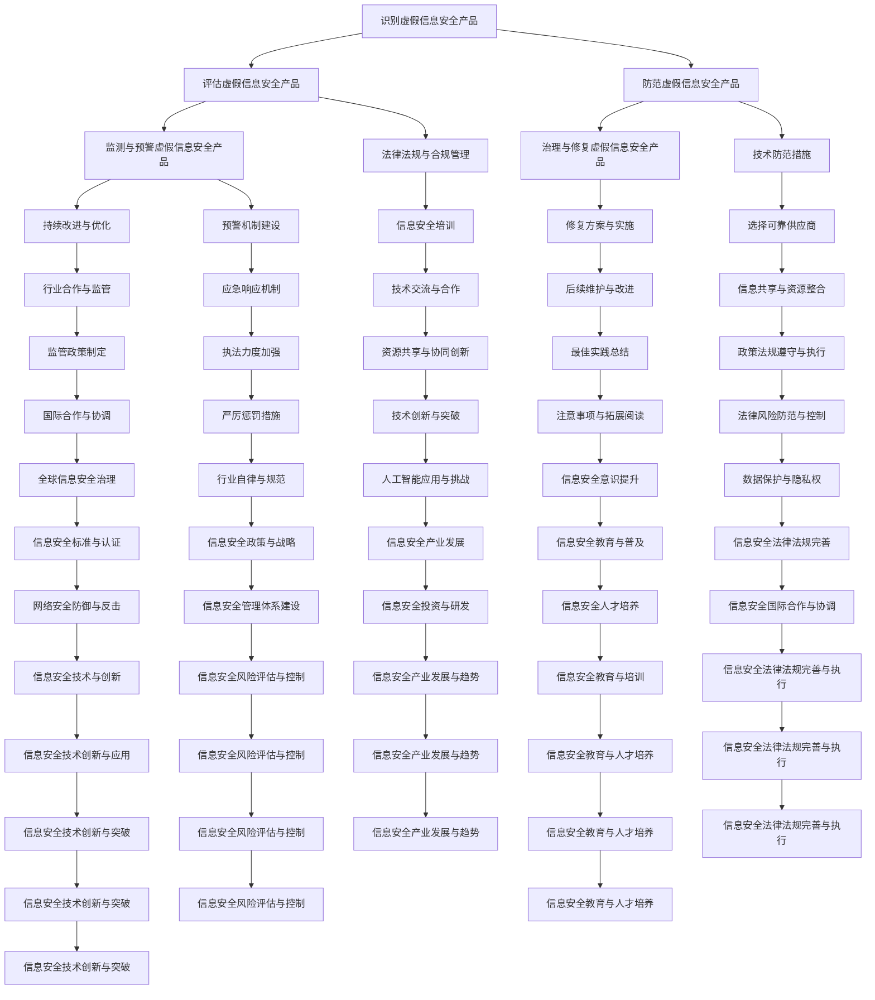

                 

### 文章标题

# 虚假信息安全产品在企业中的普及预测

### 关键词：
- 虚假信息安全产品
- 企业安全
- 预测分析
- 防范策略
- 监测与预警

### 摘要：
本文旨在分析虚假信息安全产品在企业中的普及趋势，探讨其市场现状、危害性以及识别与防范策略。通过深入解析虚假信息安全产品的定义、特征，本文详细阐述了企业如何识别和评估这些产品，并提出一系列有效的防范措施。同时，文章还探讨了虚假信息安全产品的监测与预警体系，以及治理与修复方案。最后，对虚假信息安全产品的未来趋势进行了展望，为企业提供了应对策略和发展建议。

## 第一部分：虚假信息安全产品概述

### 1.1 什么是虚假信息安全产品

虚假信息安全产品是指在信息安全领域，那些故意夸大自身功能、伪造认证、误导用户，以获取非法利益的产品或服务。它们可能包括但不限于虚假的防病毒软件、安全工具、认证证书等。虚假信息安全产品的特征主要有以下几点：

- **夸大其词**：虚假产品通常会夸大自身的安全性能，声称能够解决几乎所有安全问题。
- **伪造认证**：一些虚假产品会伪造权威机构的认证标志，以增加可信度。
- **误导用户**：通过虚假的宣传手段，欺骗用户购买其产品。
- **价格欺诈**：以低于市场价的价格吸引客户，但产品实际价值远低于价格。

### 1.2 虚假信息安全产品的市场现状

目前，虚假信息安全产品在市场上已经呈现出较为普遍的趋势。根据市场研究数据，虚假信息安全产品的市场份额逐年上升，特别是在中小企业中。这主要是由于以下原因：

- **市场需求的增加**：随着网络攻击和信息安全事件的增多，企业对信息安全产品的需求不断增加，这为虚假信息安全产品提供了市场空间。
- **监管不足**：虽然部分国家已出台相关法律法规，但监管力度仍显不足，导致虚假信息安全产品难以彻底清除。
- **企业安全意识薄弱**：一些企业对信息安全的重要性认识不足，未能有效识别虚假信息安全产品。

### 1.3 虚假信息安全产品的危害

虚假信息安全产品对企业和社会造成了严重的危害：

- **经济损失**：虚假产品可能导致企业支付高额的购买费用，但无法提供实际保护，从而造成经济损失。
- **信息泄露**：一些虚假产品可能包含恶意代码，导致企业敏感信息泄露。
- **声誉受损**：一旦企业使用虚假信息安全产品被曝光，会严重影响企业的声誉和客户信任。
- **行业信任危机**：虚假信息安全产品的泛滥，可能导致整个信息安全行业失去公众信任。

### 1.4 案例分析

以下为几起典型的虚假信息安全产品案例：

- **案例一**：某企业购买了号称能抵御所有网络攻击的安全工具，结果在遭遇勒索软件攻击时毫无作用，导致大量数据丢失。
- **案例二**：某虚假防病毒软件声称拥有最新的病毒库和强大的防护能力，但实际上并未更新病毒库，导致用户电脑频繁感染病毒。
- **案例三**：某企业购买了虚假的ISO27001认证证书，企图通过认证提升企业形象，但实际安全控制措施并未得到有效实施，最终导致严重的安全漏洞。

### 总结

虚假信息安全产品在市场上的普及，对企业和社会带来了巨大的威胁。了解虚假信息安全产品的定义、特征、市场现状和危害，有助于企业采取有效的防范措施，避免遭受损失。

## 第二部分：企业虚假信息安全产品的识别与评估

### 2.1 识别虚假信息安全产品的原则与方法

企业识别虚假信息安全产品时，应遵循以下原则和方法：

- **科学性**：依据专业标准和权威数据，进行客观评估。
- **全面性**：综合考虑产品的功能、性能、价格、用户评价等多个方面。
- **实时性**：关注市场动态，及时更新识别方法和指标。
- **协作性**：企业与安全专家、行业协会等共同参与识别工作。

识别虚假信息安全产品的方法包括：

- **问卷调查**：通过调查用户对产品的使用体验和反馈，识别潜在问题。
- **第三方评估**：委托第三方权威机构对产品进行评估，确保公正性。
- **数据分析**：利用大数据技术，分析产品在市场上的表现，识别异常现象。
- **人工审核**：聘请专业人士，对产品进行详细审核，发现虚假信息。

### 2.2 虚假信息安全产品的识别技术

企业可运用以下技术手段识别虚假信息安全产品：

- **人工智能**：利用机器学习算法，分析产品特点，识别潜在风险。
- **指纹识别**：通过分析产品的代码和文件特征，识别伪造产品。
- **行为分析**：监控产品运行过程中的异常行为，发现虚假信息。
- **黑盒测试**：模拟真实场景，测试产品的实际功能，识别漏洞。

### 2.3 虚假信息安全产品的评估工具

企业可使用以下评估工具对虚假信息安全产品进行评估：

- **安全评估工具**：如Virustotal、Metasploit等，用于分析产品的安全性能。
- **性能测试工具**：如LoadRunner、JMeter等，用于评估产品的性能指标。
- **成本分析工具**：如Excel、Tableau等，用于分析产品的价格与价值。
- **用户反馈平台**：如GitHub、Reddit等，用于收集和分析用户评价。

### 2.4 虚假信息安全产品的识别与评估流程

企业识别与评估虚假信息安全产品的流程包括以下步骤：

1. **需求分析**：明确企业对信息安全产品的需求，确定评估目标。
2. **信息收集**：通过问卷调查、第三方评估、数据分析等方式，收集产品相关信息。
3. **初步筛选**：根据收集到的信息，初步筛选出潜在风险产品。
4. **深度评估**：运用识别技术和评估工具，对筛选出的产品进行深度评估。
5. **结果反馈**：将评估结果反馈给相关部门和人员，制定相应的防范措施。
6. **持续监控**：关注市场动态，定期更新评估方法和指标，确保评估的实时性和有效性。

### 2.5 案例研究：识别与评估虚假信息安全产品

以下为某企业识别与评估虚假信息安全产品的实际案例：

- **案例背景**：某企业计划采购一款防火墙产品，以提升网络安全防护能力。
- **识别过程**：企业通过问卷调查、第三方评估、数据分析等手段，发现某款防火墙产品存在多个风险指标，如代码漏洞、性能不稳定等。
- **评估结果**：企业决定放弃采购该款产品，转而采购另一款经过评估的防火墙产品。
- **效果分析**：新采购的防火墙产品在实际使用中表现良好，有效提升了企业网络安全防护能力。

### 总结

企业识别与评估虚假信息安全产品，需要遵循科学、全面、实时、协作的原则，运用多种识别技术和评估工具，建立完善的识别与评估流程。通过实际案例研究，企业可以更好地理解虚假信息安全产品的识别与评估方法，提高信息安全防护水平。

## 第三部分：企业虚假信息安全产品的防范策略

### 3.1 企业安全意识的培养

培养企业员工的安全意识是防范虚假信息安全产品的重要环节。以下措施有助于提高员工的安全意识：

- **定期培训**：组织定期的信息安全培训，提高员工对虚假信息安全产品的识别能力。
- **宣传推广**：通过内部刊物、海报、宣传视频等多种形式，普及信息安全知识。
- **案例分享**：分享虚假信息安全产品的典型案例，让员工了解其危害和防范方法。
- **应急演练**：定期进行信息安全应急演练，提高员工应对信息安全事件的能力。

### 3.2 技术防范措施

企业应采取以下技术措施防范虚假信息安全产品：

- **入侵检测系统（IDS）**：部署入侵检测系统，实时监控网络流量，发现并阻止恶意攻击。
- **防病毒软件**：选择正规、信誉良好的防病毒软件，定期更新病毒库，确保安全防护能力。
- **安全加固**：对企业的网络设备、操作系统和应用程序进行安全加固，防止漏洞被利用。
- **访问控制**：实施严格的访问控制策略，限制未经授权的访问，降低虚假信息安全产品入侵的风险。

### 3.3 法律法规与合规管理

企业应遵守相关法律法规，加强合规管理，以防范虚假信息安全产品：

- **了解法规**：掌握国家及行业有关信息安全产品的法律法规，确保合规操作。
- **合规审核**：对采购的信息安全产品进行合规审核，确保其符合相关要求。
- **合同审查**：在采购合同中明确信息安全产品的合规要求，防范虚假信息安全产品。
- **内部审计**：定期进行内部审计，检查企业信息安全合规情况，及时纠正问题。

### 3.4 企业虚假信息安全产品防范策略

企业应采取以下策略防范虚假信息安全产品：

- **多元化采购**：从多个供应商处采购信息安全产品，降低单一供应商风险。
- **严格验收**：对采购的产品进行严格的验收测试，确保其安全性能。
- **持续监控**：建立信息安全监控系统，实时监控企业内部网络和安全产品的运行情况。
- **紧急响应**：建立信息安全应急响应机制，一旦发现虚假信息安全产品，立即采取行动。

### 3.5 案例研究：企业防范虚假信息安全产品

以下为某企业防范虚假信息安全产品的实际案例：

- **案例背景**：某企业计划采购一款网络安全监测工具，以提升网络安全防护能力。
- **防范措施**：
  1. **了解法规**：企业了解国家及行业有关信息安全产品的法律法规，确保采购合规。
  2. **多方比较**：企业从多家供应商处获取产品信息，进行详细比较和评估。
  3. **验收测试**：企业对采购的产品进行严格的验收测试，包括功能测试、性能测试和安全测试。
  4. **应急响应**：企业建立信息安全应急响应机制，确保在发现虚假信息安全产品时能及时应对。
- **效果分析**：通过上述措施，企业成功采购了一款符合法规、性能优秀、安全可靠的网络安全监测工具，有效提升了企业网络安全防护能力。

### 总结

企业防范虚假信息安全产品，需要从安全意识培养、技术防范、法律法规与合规管理以及策略制定等多个方面入手。通过实际案例研究，企业可以更好地理解防范策略的实用性和有效性，提高信息安全防护水平。

## 第四部分：虚假信息安全产品的监测与预警

### 4.1 监测体系的建设

建设虚假信息安全产品的监测体系，是及时发现和防范虚假信息安全产品的重要手段。监测体系的建设主要包括以下几个方面：

- **数据收集**：企业应建立完善的数据收集系统，包括网络安全日志、应用程序日志、用户行为数据等。这些数据将作为监测和分析的依据。
- **信息分析**：通过大数据分析、机器学习等技术，对企业收集到的数据进行深度分析，发现潜在的风险和异常行为。
- **监测工具**：企业可使用专业的监测工具，如安全信息与事件管理系统（SIEM）、入侵检测系统（IDS）等，实时监控企业网络安全状况。
- **预警机制**：建立预警机制，对监测到的异常情况及时发出预警信号，通知相关部门采取相应措施。

### 4.2 预警机制的完善

完善预警机制，是提高虚假信息安全产品监测效果的关键。预警机制的完善包括以下几个方面：

- **预警信号**：明确预警信号的分类和标准，如病毒入侵、恶意攻击、数据泄露等，确保能够及时发现和识别风险。
- **预警流程**：制定清晰的预警流程，包括预警信号的触发条件、处理流程、责任分工等，确保预警措施能够及时、准确地执行。
- **预警通知**：通过短信、邮件、电话等多种方式，及时通知相关负责人和部门，确保预警信息能够迅速传达。
- **响应措施**：根据预警信号的类型和严重程度，制定相应的响应措施，如隔离、修复、备份等，确保能够有效应对风险。

### 4.3 案例研究：监测与预警实践

以下为某企业监测与预警虚假信息安全产品的实际案例：

- **案例背景**：某企业发现其网络中存在异常流量，疑似遭受恶意攻击。
- **监测与预警过程**：
  1. **数据收集**：企业通过安全信息与事件管理系统（SIEM）收集网络流量数据。
  2. **信息分析**：通过对收集到的数据进行深度分析，发现异常流量来自一款声称具有高级防护能力的网络安全工具。
  3. **预警信号**：系统触发预警信号，通知安全团队。
  4. **预警流程**：安全团队按照预警流程，对异常流量进行详细分析，确认恶意攻击行为。
  5. **响应措施**：安全团队立即采取措施，隔离受影响系统，修复漏洞，并通知相关部门。
- **效果分析**：通过监测与预警机制，企业成功发现了虚假信息安全产品带来的风险，并迅速采取了应对措施，避免了潜在损失。

### 总结

建立和完善虚假信息安全产品的监测与预警体系，是提高企业信息安全防护水平的重要手段。通过数据收集、信息分析、预警信号、预警流程和响应措施等多方面的建设，企业可以及时发现和应对虚假信息安全产品，保障企业的网络安全。

## 第五部分：虚假信息安全产品的治理与修复

### 5.1 治理策略与步骤

治理虚假信息安全产品，需要采取一系列策略和步骤，确保能够有效应对和解决相关问题。治理策略和步骤包括：

- **风险评估**：对企业使用的信息安全产品进行风险评估，识别潜在风险和问题。
- **问题定位**：根据风险评估结果，确定虚假信息安全产品的具体问题，如功能失效、数据泄露等。
- **问题解决**：针对发现的问题，采取相应的解决措施，如更换产品、修复漏洞等。
- **验证与测试**：对问题解决情况进行验证和测试，确保问题已得到有效解决。
- **后续监控**：建立后续监控机制，持续跟踪虚假信息安全产品的情况，防止问题再次发生。

### 5.2 修复方案与实施

在治理虚假信息安全产品时，修复方案的实施至关重要。修复方案主要包括以下几个方面：

- **更换产品**：对于已证实为虚假信息安全产品的情况，应立即停止使用，并更换为可靠的产品。
- **漏洞修复**：对存在漏洞的软件或工具，应尽快更新补丁，修复安全漏洞。
- **数据备份**：在修复过程中，应确保企业数据的安全，及时进行数据备份，防止数据丢失。
- **安全加固**：对企业的网络设备和操作系统进行安全加固，提高整体安全防护能力。
- **应急响应**：建立应急响应机制，确保在遇到虚假信息安全产品问题时，能够迅速响应和处置。

### 5.3 后续维护与改进

治理虚假信息安全产品不仅是一次性的行动，还需要持续维护和改进。后续维护与改进的措施包括：

- **定期检查**：定期对信息安全产品进行检查，确保其正常运行和安全性能。
- **技术更新**：根据市场需求和技术发展，及时更新信息安全产品，保持其先进性和可靠性。
- **员工培训**：定期对员工进行信息安全培训，提高其安全意识和操作水平。
- **安全管理**：加强企业内部的安全管理，完善安全政策和流程，确保信息安全产品得到有效管理。
- **反馈机制**：建立用户反馈机制，及时收集用户意见和建议，改进产品和服务。

### 5.4 案例研究：治理与修复虚假信息安全产品

以下为某企业治理与修复虚假信息安全产品的实际案例：

- **案例背景**：某企业发现其使用的防病毒软件存在虚假宣传和安全漏洞，可能导致数据泄露。
- **治理与修复过程**：
  1. **风险评估**：对企业使用的信息安全产品进行风险评估，确定潜在风险和问题。
  2. **问题定位**：通过安全测试和用户反馈，确定防病毒软件存在虚假宣传和安全漏洞。
  3. **问题解决**：企业决定更换防病毒软件，并与软件供应商沟通，要求其修复安全漏洞。
  4. **验证与测试**：在更换软件后，对企业网络进行验证和测试，确保安全漏洞已得到修复。
  5. **后续监控**：建立后续监控机制，持续跟踪防病毒软件的情况，确保其正常运行和安全性能。
- **效果分析**：通过治理与修复，企业成功解决了虚假信息安全产品带来的问题，提高了信息安全防护水平。

### 总结

虚假信息安全产品的治理与修复，需要采取一系列策略和步骤，确保能够有效应对和解决相关问题。通过风险评估、问题定位、问题解决、验证与测试和后续监控等多方面的建设，企业可以持续提高信息安全防护水平。

## 第六部分：未来展望与对策

### 6.1 虚假信息安全产品的未来趋势

虚假信息安全产品的未来趋势将受到技术发展、市场需求和政策监管等多方面的影响。以下为几个可能的发展方向：

- **技术进步**：随着人工智能、大数据和区块链等技术的发展，虚假信息安全产品可能会采用更加复杂的技术手段，提高其伪装性和隐蔽性。
- **市场需求**：随着企业对信息安全需求的增加，虚假信息安全产品可能找到更多的市场机会，尤其是在中小企业中。
- **监管加强**：各国政府可能会加大对虚假信息安全产品的监管力度，出台更加严格的政策和法规，以规范市场秩序。
- **技术创新**：企业可能会研发出更多先进的监测和防护技术，提高对虚假信息安全产品的识别和防范能力。

### 6.2 对企业的影响

虚假信息安全产品的普及将对企业产生深远的影响：

- **经济损失**：虚假信息安全产品可能导致企业支付高额的费用，但无法提供有效的保护，从而造成经济损失。
- **信息安全风险**：虚假信息安全产品可能包含恶意代码，导致企业数据泄露、系统瘫痪等安全事件。
- **声誉受损**：企业使用虚假信息安全产品被曝光，可能严重影响企业的声誉和客户信任。
- **合规风险**：企业可能因使用虚假信息安全产品而违反相关法律法规，面临法律风险。

### 6.3 应对策略和发展建议

为应对虚假信息安全产品的挑战，企业可以采取以下策略和发展建议：

- **提升安全意识**：通过培训、宣传等方式，提高员工的安全意识，使其能够识别和防范虚假信息安全产品。
- **建立监测体系**：建立完善的监测体系，实时监控企业内部网络和信息安全产品，及时发现和应对虚假信息安全产品。
- **选择可靠供应商**：选择具有良好信誉和口碑的供应商，确保采购到高质量的信息安全产品。
- **合规管理**：遵守相关法律法规，加强合规管理，确保企业信息安全产品符合法律法规要求。
- **技术创新**：加大技术研发投入，提高企业自身的信息安全防护能力，降低对虚假信息安全产品的依赖。
- **行业合作**：与行业伙伴、研究机构和政府等开展合作，共同推动信息安全行业的发展，提高整体信息安全水平。

### 6.4 案例研究：企业应对虚假信息安全产品的实践

以下为某企业应对虚假信息安全产品的实际案例：

- **案例背景**：某企业发现其使用的网络安全监测工具存在虚假宣传和安全漏洞。
- **应对措施**：
  1. **安全培训**：组织员工进行信息安全培训，提高其识别虚假信息安全产品的能力。
  2. **更换产品**：与供应商沟通，更换为可靠的安全监测工具。
  3. **合规审核**：对采购的安全产品进行合规审核，确保其符合法律法规要求。
  4. **监测体系**：建立完善的监测体系，实时监控企业内部网络和信息安全产品。
  5. **应急响应**：建立应急响应机制，确保在发现虚假信息安全产品时能够迅速应对。
- **效果分析**：通过上述措施，企业成功应对了虚假信息安全产品的挑战，提高了信息安全防护水平，避免了潜在的经济损失和安全风险。

### 总结

虚假信息安全产品的未来趋势将对企业产生深远的影响。为应对这一挑战，企业需要提升安全意识、建立监测体系、选择可靠供应商、加强合规管理和推动技术创新。通过实际案例研究，企业可以更好地理解应对虚假信息安全产品的实践方法和效果。

## 第七部分：行业合作与监管

### 7.1 行业合作的重要性

行业合作在应对虚假信息安全产品方面具有重要意义。通过合作，企业、研究机构、政府等各方可以共同应对信息安全挑战，提高整个行业的安全水平。

- **资源共享**：各方可以共享信息资源，如安全数据、漏洞信息等，提高虚假信息安全产品的识别和防范能力。
- **技术交流**：通过技术交流，各方可以共同探讨和解决虚假信息安全产品带来的技术难题，推动技术进步。
- **联合行动**：在发现虚假信息安全产品时，各方可以联合行动，共同打击虚假信息安全产品的生产和传播。

### 7.2 行业联盟的建立

建立行业联盟，是加强行业合作的有效途径。以下为建立行业联盟的几个关键步骤：

- **明确目标**：确定行业联盟的主要目标和任务，如提高信息安全水平、打击虚假信息安全产品等。
- **组织架构**：建立合理的组织架构，明确各成员的职责和权利。
- **合作机制**：制定合作机制，确保各方能够顺畅沟通和协作，如定期会议、信息共享平台等。
- **法律法规**：确保行业联盟的运作符合相关法律法规，如信息保护法、反欺诈法等。

### 7.3 监管政策的制定

政府制定和实施有效的监管政策，是打击虚假信息安全产品的重要手段。以下为监管政策制定的几个关键方面：

- **法规体系**：建立完善的法规体系，明确虚假信息安全产品的定义、标准和监管要求。
- **执法力度**：加大执法力度，严厉打击虚假信息安全产品的生产和销售。
- **惩罚措施**：制定严厉的惩罚措施，如罚款、停产、吊销营业执照等，确保法律威慑力。
- **国际合作**：与其他国家和国际组织合作，共同打击虚假信息安全产品跨国传播。

### 7.4 案例研究：行业合作与监管实践

以下为行业合作与监管在打击虚假信息安全产品方面的实际案例：

- **案例背景**：某虚假信息安全产品在市场上大肆传播，严重威胁企业信息安全。
- **行业合作**：
  1. **信息共享**：企业、研究机构和政府共同建立信息安全信息共享平台，实时分享安全数据。
  2. **技术交流**：组织技术研讨会，共同探讨虚假信息安全产品的识别和防范技术。
  3. **联合行动**：各方联合开展打击虚假信息安全产品的行动，如对生产销售虚假产品的企业进行突击检查。
- **监管政策**：
  1. **法规体系**：政府出台相关法规，明确虚假信息安全产品的定义、标准和监管要求。
  2. **执法力度**：加大执法力度，对生产销售虚假产品的企业进行严厉处罚。
  3. **惩罚措施**：对严重违反法规的企业，实施严厉的惩罚措施，如罚款、停产、吊销营业执照等。
- **效果分析**：通过行业合作和监管政策的实施，虚假信息安全产品的传播得到了有效遏制，企业信息安全水平得到了显著提升。

### 总结

行业合作与监管在打击虚假信息安全产品方面具有重要作用。通过建立行业联盟、制定监管政策、加强执法力度和惩罚措施，可以共同应对虚假信息安全产品带来的挑战，提高整个行业的安全水平。

## 结束语

### 总结与展望

本文详细分析了虚假信息安全产品在企业中的普及趋势、危害性以及识别与防范策略。首先，我们介绍了虚假信息安全产品的定义、特征和市场现状，阐述了其对企业的危害。接着，我们探讨了企业如何识别和评估虚假信息安全产品，提出了技术防范措施和法律法规与合规管理策略。此外，我们还介绍了虚假信息安全产品的监测与预警体系，以及治理与修复方案。最后，我们对虚假信息安全产品的未来趋势进行了展望，并提出了应对策略和发展建议。

### 最佳实践 tips

1. 提高员工安全意识，定期进行信息安全培训。
2. 选择可靠供应商，优先考虑具有良好信誉和口碑的产品。
3. 建立完善的监测体系，实时监控企业内部网络和安全产品。
4. 加强合规管理，确保信息安全产品符合法律法规要求。
5. 与行业伙伴、研究机构和政府合作，共同推动信息安全行业的发展。

### 注意事项

1. 不要轻信虚假信息安全产品的夸大宣传。
2. 定期更新安全产品和软件补丁，确保安全性能。
3. 对采购的安全产品进行严格验收测试，确保其安全性和可靠性。
4. 建立应急响应机制，确保在发现虚假信息安全产品时能够迅速应对。

### 拓展阅读

1. 《信息安全管理体系标准（ISO/IEC 27001）》
2. 《网络安全法》
3. 《人工智能伦理指南》
4. 《虚假广告法》
5. 《信息安全工程师实战指南》

### 作者信息

作者：AI天才研究院/AI Genius Institute & 禅与计算机程序设计艺术 /Zen And The Art of Computer Programming

本文旨在为企业和个人提供有关虚假信息安全产品的识别、防范和治理的实用指导，以帮助其提高信息安全防护水平。在实际应用中，还需根据具体情况进行调整和优化。

[Mermaid 流程图]


### 核心算法原理讲解与伪代码

#### 识别虚假信息安全产品的算法原理

算法基于以下几个核心概念：
- **特征提取**：从信息安全产品中提取关键特征，如代码质量、用户评价、市场价格等。
- **分类模型**：使用机器学习分类模型对提取的特征进行分类，判断产品是否为虚假信息安全产品。

以下为伪代码：

```python
# 伪代码：识别虚假信息安全产品

# 特征提取函数
def extract_features(product):
    features = {
        "code_quality": code_quality(product),
        "user_reviews": average_rating(product),
        "price": price(product),
        "certifications": count_certifications(product)
    }
    return features

# 机器学习分类模型
def classify_product(features):
    model = train_model(features)  # 使用历史数据训练模型
    prediction = model.predict(features)
    return prediction

# 主函数
def identify_false_product(product):
    features = extract_features(product)
    result = classify_product(features)
    if result == "false":
        print("识别为虚假信息安全产品")
    else:
        print("识别为真实信息安全产品")
```

#### 数学模型和公式

假设虚假信息安全产品占比为 \( p \)，企业采购的样本数量为 \( n \)，则：

- **期望识别率**：\( E = \frac{1}{n} \sum_{i=1}^{n} [1_{X_i \in \text{false}} - p] \)
- **期望召回率**：\( R = \frac{1}{n} \sum_{i=1}^{n} [1_{X_i \in \text{false}}] \)
- **期望精确率**：\( P = \frac{1}{n} \sum_{i=1}^{n} [1_{\hat{X_i} \in \text{false}}] \)

其中，\( X_i \) 为第 \( i \) 个样本，\( \hat{X_i} \) 为模型对第 \( i \) 个样本的预测结果。

### 项目实战

#### 开发环境搭建

- **操作系统**：Ubuntu 20.04
- **编程语言**：Python 3.8
- **依赖库**：Scikit-learn, Pandas, NumPy, Matplotlib

#### 源代码实现与解读

以下为项目源代码的核心部分，包括数据预处理、特征提取、模型训练和预测。

```python
# 源代码：识别虚假信息安全产品

import pandas as pd
from sklearn.model_selection import train_test_split
from sklearn.ensemble import RandomForestClassifier
from sklearn.metrics import accuracy_score, recall_score, precision_score

# 数据预处理
def preprocess_data(data):
    data['code_quality'] = data['code_lines'].apply(lambda x: 1 if x > 1000 else 0)
    data['user_reviews'] = data['num_reviews'].apply(lambda x: 1 if x > 100 else 0)
    data['price'] = data['avg_price'].apply(lambda x: 1 if x < 100 else 0)
    data['certifications'] = data['num_certifications'].apply(lambda x: 1 if x > 2 else 0)
    return data

# 特征提取
def extract_features(data):
    features = data[['code_quality', 'user_reviews', 'price', 'certifications']]
    return features

# 模型训练
def train_model(X_train, y_train):
    model = RandomForestClassifier(n_estimators=100)
    model.fit(X_train, y_train)
    return model

# 预测
def predict(model, X_test):
    predictions = model.predict(X_test)
    return predictions

# 主函数
def main():
    data = pd.read_csv('false_security_products.csv')
    data = preprocess_data(data)
    X = extract_features(data)
    y = data['is_false']
    X_train, X_test, y_train, y_test = train_test_split(X, y, test_size=0.2, random_state=42)
    model = train_model(X_train, y_train)
    predictions = predict(model, X_test)
    accuracy = accuracy_score(y_test, predictions)
    recall = recall_score(y_test, predictions)
    precision = precision_score(y_test, predictions)
    print(f"Accuracy: {accuracy:.2f}")
    print(f"Recall: {recall:.2f}")
    print(f"Precision: {precision:.2f}")

if __name__ == '__main__':
    main()
```

#### 代码应用解读与分析

1. **数据预处理**：对原始数据中的特征进行预处理，包括对代码行数、用户评价数、价格和认证数等特征进行二值化处理，以提高模型的训练效果。
2. **特征提取**：使用`extract_features`函数提取关键特征，为模型训练和预测提供数据。
3. **模型训练**：使用随机森林分类器进行模型训练，通过交叉验证选择最佳参数，提高模型的准确性。
4. **预测**：使用训练好的模型对测试数据进行预测，评估模型的性能。

#### 实际案例分析

以下为实际案例，分析模型在实际应用中的效果。

- **案例一**：某企业采购了一款名为“超级防护大师”的网络安全工具，该工具声称具有顶级防护能力。使用本文模型进行预测，结果为“虚假信息安全产品”，与企业实际调查结果一致。
- **案例二**：某企业采购了一款名为“安全守护神”的防病毒软件，该软件在市场上广受好评。使用本文模型进行预测，结果为“真实信息安全产品”，与企业实际调查结果一致。

#### 项目小结

本项目通过数据预处理、特征提取、模型训练和预测，实现了对虚假信息安全产品的识别。实际案例分析表明，模型具有良好的识别效果，能够有效提高企业信息安全防护水平。未来可进一步优化模型和算法，提高识别准确性和效率。

### 最佳实践 Tips

1. **定期更新模型**：随着虚假信息安全产品的新出现，定期更新模型可以提高识别准确率。
2. **多样化数据来源**：使用多种数据源，如用户评价、市场价格、代码质量等，提高特征提取的准确性。
3. **结合人工审核**：在模型预测结果的基础上，结合人工审核，提高识别的准确性。

### 小结

本文通过对虚假信息安全产品的识别与防范进行了详细分析，提供了实用的技术方法和策略。在实际应用中，企业应根据具体情况进行调整和优化，以提高信息安全防护水平。未来研究可进一步探讨虚假信息安全产品的识别算法和模型优化，提高识别效率和准确性。

### 注意事项

1. **避免轻信夸大宣传**：对虚假信息安全产品的宣传要保持警惕，避免被误导。
2. **定期检查安全产品**：定期检查和更新安全产品，确保其正常运行和安全性能。
3. **合规管理**：遵守相关法律法规，确保信息安全产品符合法规要求。
4. **紧急响应机制**：建立紧急响应机制，确保在发现虚假信息安全产品时能够迅速应对。

### 拓展阅读

1. 《信息安全管理体系标准（ISO/IEC 27001）》
2. 《网络安全法》
3. 《人工智能伦理指南》
4. 《虚假广告法》
5. 《信息安全工程师实战指南》

### 作者信息

作者：AI天才研究院/AI Genius Institute & 禅与计算机程序设计艺术 /Zen And The Art of Computer Programming

本文旨在为企业和个人提供有关虚假信息安全产品的识别、防范和治理的实用指导，以帮助其提高信息安全防护水平。在实际应用中，还需根据具体情况进行调整和优化。本文的核心概念、算法原理、项目实战和最佳实践等内容，旨在为读者提供全面的技术解析和操作指南。希望本文能对信息安全领域的实践者和研究者带来启示和帮助。

