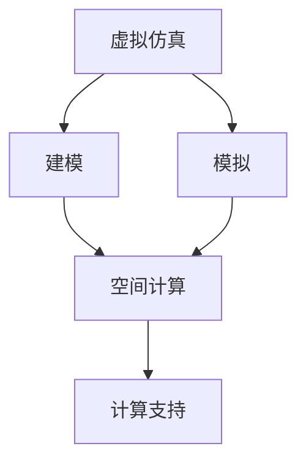
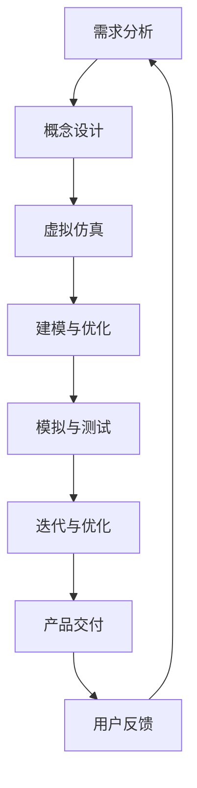

                 

### 虚拟产品开发概述

#### 背景介绍

虚拟产品开发（Virtual Product Development，VPD）是一种以数字化技术为基础，通过虚拟仿真、建模和模拟等手段，提前预测和验证产品性能、功能、用户体验等的一种新型开发方法。相较于传统的实物产品开发，虚拟产品开发具有显著的优越性，例如可以大幅缩短产品开发周期、降低研发成本、提高产品性能等。

随着计算机技术的飞速发展和虚拟现实、增强现实等技术的不断成熟，虚拟产品开发在多个领域得到了广泛应用。例如，在航空航天领域，虚拟仿真技术被用于飞行器的设计和测试，可以有效降低实际测试的风险和成本；在汽车制造领域，虚拟样车技术被用于车辆外观设计和性能评估，可以提高设计效率并优化用户体验；在建筑领域，虚拟现实技术被用于建筑设计和施工模拟，可以实现建筑方案的快速迭代和优化。

#### 核心概念与联系

虚拟产品开发涉及多个核心概念，包括虚拟仿真、建模、模拟、空间计算等。这些概念之间存在着紧密的联系，构成了虚拟产品开发的基础架构。

1. **虚拟仿真**：虚拟仿真是指通过计算机模拟，对产品的性能、功能等进行模拟和预测。它通常包括物理仿真、力学仿真、流体仿真等，可以用于验证产品的可行性和优化设计。

2. **建模**：建模是指通过数学方法或计算机算法，对产品的几何形状、结构、行为等进行描述和表示。建模是虚拟产品开发的基础，它决定了虚拟产品的精度和可靠性。

3. **模拟**：模拟是指通过计算机模拟，对产品的行为、性能等进行预测和评估。模拟可以用于验证产品的设计、测试产品的性能，以及优化产品的性能。

4. **空间计算**：空间计算是指通过计算技术，对空间中的物体、场景、行为等进行处理和分析。空间计算在虚拟产品开发中起着关键作用，它为虚拟仿真、建模和模拟提供了强大的计算支持。

这些概念之间的联系构成了虚拟产品开发的核心架构，如图1所示：

图1：虚拟产品开发核心概念关系图

#### Mermaid流程图

以下是一个简化的虚拟产品开发流程图，展示了从需求分析到产品交付的主要步骤：

图2：虚拟产品开发流程图

通过上述流程，虚拟产品开发可以在较短的周期内完成，从而加速创新周期。

#### 结论

虚拟产品开发作为一种新兴的开发方法，具有显著的优势和应用前景。通过虚拟仿真、建模、模拟和空间计算等技术的结合，虚拟产品开发可以大幅缩短产品开发周期、降低研发成本、提高产品性能和用户体验。因此，虚拟产品开发已经成为现代产品开发的重要手段，有望在未来的发展中发挥更加重要的作用。

---

文章关键词：虚拟产品开发、虚拟仿真、建模、模拟、空间计算、创新周期

文章摘要：
本文介绍了虚拟产品开发的背景、核心概念及其相互关系，并给出了一个简化的虚拟产品开发流程图。通过虚拟仿真、建模、模拟和空间计算等技术的结合，虚拟产品开发可以大幅缩短产品开发周期、降低研发成本、提高产品性能和用户体验，从而加速创新周期。本文为后续章节的详细讨论奠定了基础。

