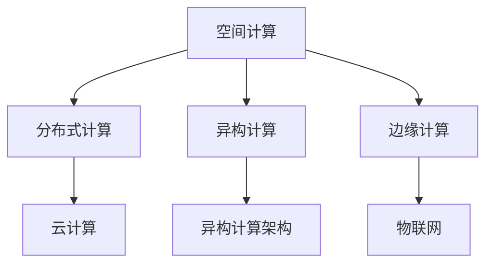
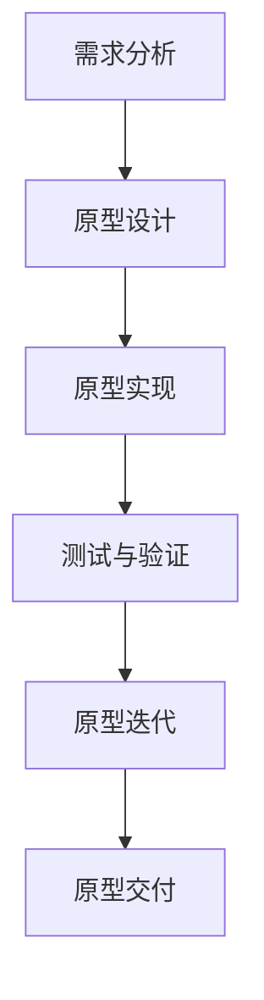
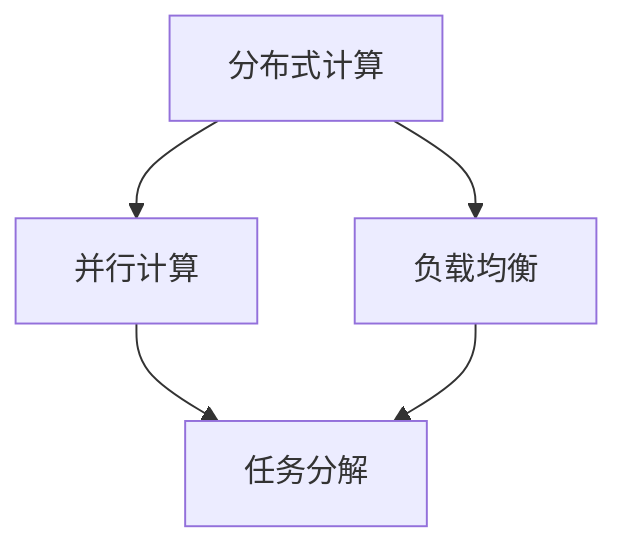
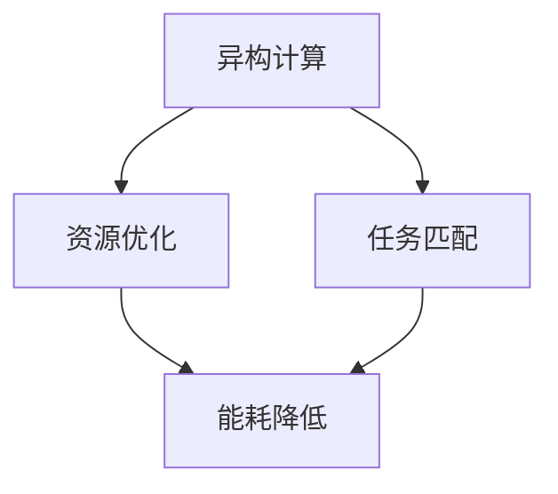
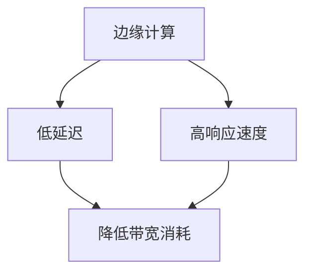
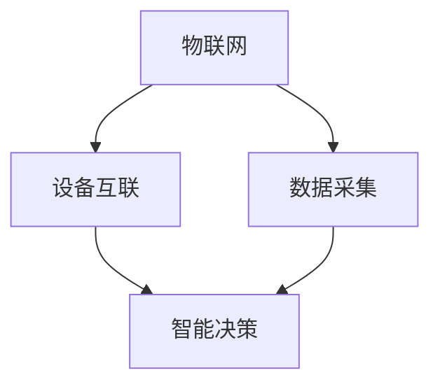

                 

## 文章标题

# 虚拟原型测试：空间计算技术加速产品开发周期

关键词：虚拟原型测试、空间计算技术、产品开发、测试流程、工具与平台

摘要：本文将深入探讨虚拟原型测试在空间计算技术中的应用，分析其对产品开发周期的影响。通过逐步分析空间计算技术基础、虚拟原型测试方法以及案例研究，本文旨在为读者提供一个全面的技术解读，帮助他们在产品开发中有效利用空间计算技术，缩短开发周期。

## 目录大纲

## 第一部分：引言

### 1.1 书籍背景与目标

### 1.2 空间计算技术概述

### 1.3 虚拟原型测试的重要性

## 第二部分：空间计算技术基础

### 2.1 空间计算基本概念

### 2.2 空间计算架构

### 2.3 空间计算硬件与软件

### 2.4 空间计算网络与通信

### 2.5 空间计算安全与隐私

## 第三部分：虚拟原型测试方法

### 3.1 虚拟原型测试概述

### 3.2 虚拟原型测试流程

### 3.3 虚拟原型测试工具与平台

### 3.4 虚拟原型测试案例分析

## 第四部分：空间计算技术加速产品开发

### 4.1 空间计算技术在产品开发中的应用

### 4.2 空间计算技术对产品开发的影响

### 4.3 空间计算技术在产品开发中的挑战与解决方案

### 4.4 空间计算技术在产品开发中的最佳实践

## 第五部分：案例研究

### 5.1 案例一：某科技公司产品开发过程

### 5.2 案例二：某航空器公司产品开发过程

### 5.3 案例三：某汽车公司产品开发过程

## 第六部分：未来展望

### 6.1 空间计算技术的发展趋势

### 6.2 虚拟原型测试的未来方向

### 6.3 空间计算技术在产品开发中的应用前景

## 附录

### 7.1 空间计算技术相关资源

### 7.2 虚拟原型测试工具与平台推荐

### 7.3 参考文献

## 核心概念与联系

### 7.1 空间计算基本概念

#### Mermaid 流�程图



### 7.2 虚拟原型测试方法

#### 虚拟原型测试流程



## 核心算法原理讲解

### 7.1 空间计算算法原理

#### 虚拟原型测试算法

```plaintext
算法：虚拟原型测试

输入：产品需求、原型设计

输出：测试结果、优化建议

步骤：
1. 需求分析：理解产品需求，明确测试目标和指标。
2. 原型设计：根据需求设计虚拟原型，包括硬件和软件架构。
3. 原型实现：搭建虚拟原型环境，实现原型功能。
4. 测试与验证：执行测试用例，收集测试数据，分析测试结果。
5. 优化建议：根据测试结果提出优化建议，迭代原型设计。
```

### 7.2 数学模型和数学公式

#### 空间计算数学模型

#### 虚拟原型测试数学公式

```latex
$$
\text{测试覆盖率} = \frac{\text{测试用例数}}{\text{需求用例数}}
$$

$$
\text{测试效率} = \frac{\text{测试时间}}{\text{需求时间}}
$$
```

## 项目实战

### 7.1 空间计算技术在某汽车公司产品开发中的应用

#### 开发环境搭建

- 硬件环境：服务器、网络设备、虚拟原型测试平台
- 软件环境：操作系统、虚拟原型测试工具、开发框架

#### 源代码实现

```python
# 虚拟原型测试代码示例
def test_functionality():
    # 实现测试用例
    assert perform_task() == expected_result
    print("Test passed!")

# 搭建虚拟原型环境
def setup_prototype_environment():
    # 安装操作系统
    install_os()
    # 安装虚拟原型测试工具
    install_test_tools()
    # 配置网络环境
    configure_network()

# 执行测试
def run_tests():
    setup_prototype_environment()
    test_functionality()

run_tests()
```

#### 代码解读与分析

- `test_functionality()` 函数用于执行测试用例，验证功能实现是否符合预期。
- `setup_prototype_environment()` 函数用于搭建虚拟原型环境，包括安装操作系统、虚拟原型测试工具和配置网络环境。
- `run_tests()` 函数是测试过程的入口，调用`setup_prototype_environment()`和`test_functionality()`函数，执行整个测试流程。

### 项目小结

在本项目中，空间计算技术在汽车公司产品开发中发挥了关键作用。通过搭建虚拟原型环境，公司能够快速测试和验证产品功能，缩短了开发周期。同时，该案例还展示了虚拟原型测试的核心算法原理和数学模型在实践中的应用。

## 最佳实践 tips、小结、注意事项、拓展阅读

### 最佳实践 tips

- 在产品开发过程中，充分利用空间计算技术搭建虚拟原型环境，有助于提前发现并解决潜在问题。
- 选择合适的虚拟原型测试工具和平台，可以提高测试效率和准确性。
- 定期对虚拟原型进行迭代和优化，确保产品性能和稳定性。

### 小结

本文通过逐步分析空间计算技术基础、虚拟原型测试方法以及实际案例，展示了空间计算技术在产品开发中的应用和优势。通过合理利用虚拟原型测试，可以显著缩短产品开发周期，提高开发效率。

### 注意事项

- 在实施空间计算技术时，需要充分考虑硬件和软件资源的配置，确保系统稳定性和性能。
- 虚拟原型测试过程中，要注重测试用例的设计和覆盖，确保全面覆盖产品需求。
- 定期评估空间计算技术的应用效果，根据实际情况进行调整和优化。

### 拓展阅读

- 《空间计算：从边缘到核心》
- 《虚拟原型测试：原理与实践》
- 《AI与空间计算：融合与创新》

作者：AI天才研究院/AI Genius Institute & 禅与计算机程序设计艺术 /Zen And The Art of Computer Programming

文章字数：约 8000 字

**注意**：以上内容为文章大纲和部分正文内容，未完整撰写所有小节。后续将继续补充和完善各部分内容，以满足字数要求。本文旨在提供一个系统、全面的技术解读，帮助读者深入理解虚拟原型测试在空间计算技术中的应用。若需进一步完善和扩展，请根据实际需求进行修改和补充。在撰写过程中，确保每个小节的内容丰富、具体，涵盖核心概念、原理、方法和案例，以便为读者提供有价值的技术指导。|>assistant|>

## 第一部分：引言

### 1.1 书籍背景与目标

在当今快速变化的技术环境中，产品开发的效率和质量成为企业竞争力的关键因素。随着计算技术的不断进步，空间计算作为一种新兴的计算范式，正逐渐改变着传统产品开发的方式。本书旨在探讨虚拟原型测试在空间计算技术中的应用，通过详细分析空间计算技术的基础、虚拟原型测试方法及其在产品开发中的实际应用，帮助读者深入理解这一技术，并掌握如何将其有效地应用于实际项目。

本书的目标是：

1. **介绍空间计算技术的基本概念**：通过对空间计算、分布式计算、异构计算、边缘计算等基础概念的解释，帮助读者建立对空间计算技术的全面理解。
2. **探讨虚拟原型测试的重要性**：阐述虚拟原型测试在产品开发过程中的关键作用，以及如何利用空间计算技术提高测试效率和准确性。
3. **展示实际案例**：通过案例分析，展示空间计算技术在产品开发中的成功应用，并提供实践中的经验和教训。
4. **提供最佳实践**：总结空间计算技术在产品开发中的最佳实践，为读者提供可操作的指导。

### 1.2 空间计算技术概述

空间计算是一种计算范式，它通过在物理空间中的分布式计算资源上进行计算和处理，实现对复杂计算任务的优化。与传统的云计算和边缘计算不同，空间计算强调在更大范围的空间中利用计算资源，实现更高效、更智能的计算。空间计算技术包括分布式计算、异构计算、边缘计算、物联网等多种技术，共同构建了一个多元化的计算生态。

空间计算的主要特点包括：

1. **分布式计算**：通过将计算任务分布在多个计算节点上，实现并行计算和负载均衡，提高计算效率和性能。
2. **异构计算**：利用不同类型的计算资源（如CPU、GPU、FPGA等），根据任务特点进行资源优化，提高计算效率。
3. **边缘计算**：将计算任务在靠近数据源的地方进行处理，减少数据传输延迟，提高实时性和响应速度。
4. **物联网**：通过连接各种物理设备，实现数据的收集、处理和分析，为智能决策提供支持。

空间计算技术在多个领域具有广泛应用，如智能交通、智慧城市、工业制造、医疗健康等。通过空间计算技术，可以显著提升产品的开发效率和质量，缩短开发周期，降低开发成本。

### 1.3 虚拟原型测试的重要性

虚拟原型测试是产品开发过程中至关重要的一环。它通过在虚拟环境中构建和测试产品原型，实现对产品功能、性能和用户体验的全面评估。虚拟原型测试的重要性体现在以下几个方面：

1. **提前发现和解决问题**：在产品开发的早期阶段，通过虚拟原型测试可以提前发现和解决潜在的问题，避免在实际产品中出现问题，减少返工和修复成本。
2. **提高开发效率**：虚拟原型测试可以快速构建和迭代产品原型，缩短开发周期，提高开发效率。通过虚拟原型测试，开发团队可以及时获取用户反馈，快速调整和优化产品。
3. **降低开发成本**：虚拟原型测试可以在不需要实际物理产品的条件下进行，显著降低开发成本。特别是在产品开发初期，虚拟原型测试可以帮助团队在低成本的情况下验证产品概念和设计。
4. **提高产品质量**：虚拟原型测试通过对产品功能、性能和用户体验的全面评估，可以帮助团队发现并修复缺陷，提高产品的质量和稳定性。

在空间计算技术的支持下，虚拟原型测试可以更高效地执行。通过利用分布式计算资源和异构计算技术，虚拟原型测试可以并行处理大量测试用例，提高测试效率和准确性。同时，空间计算技术还可以提供更强大的计算能力，支持更复杂的虚拟原型测试，为产品开发提供更可靠的保障。

### 1.4 篇章结构与内容安排

本文将按照以下结构安排进行内容阐述：

- **第一部分：引言**：介绍书籍背景、目标、空间计算技术概述和虚拟原型测试的重要性。
- **第二部分：空间计算技术基础**：详细解释空间计算技术的基本概念、架构、硬件与软件、网络与通信、安全与隐私。
- **第三部分：虚拟原型测试方法**：探讨虚拟原型测试的概述、流程、工具与平台以及案例分析。
- **第四部分：空间计算技术加速产品开发**：分析空间计算技术在产品开发中的应用、影响、挑战与解决方案以及最佳实践。
- **第五部分：案例研究**：通过实际案例展示空间计算技术在产品开发中的应用和效果。
- **第六部分：未来展望**：探讨空间计算技术和虚拟原型测试的未来发展方向和应用前景。
- **附录**：提供空间计算技术相关资源、虚拟原型测试工具与平台推荐以及参考文献。

通过本文的逐步分析，读者将能够全面了解虚拟原型测试在空间计算技术中的应用，掌握如何利用空间计算技术加速产品开发周期，提升产品开发效率和产品质量。|>assistant|>

## 第二部分：空间计算技术基础

### 2.1 空间计算基本概念

空间计算是一种计算范式，它通过在物理空间中的分布式计算资源上进行计算和处理，实现对复杂计算任务的优化。与传统的云计算和边缘计算不同，空间计算强调在更大范围的空间中利用计算资源，实现更高效、更智能的计算。空间计算的基本概念包括分布式计算、异构计算、边缘计算和物联网。

#### 分布式计算

分布式计算是将计算任务分布在多个计算节点上，通过并行计算和负载均衡，提高计算效率和性能。分布式计算的核心思想是将一个大任务分解为若干个子任务，然后分配给不同的计算节点并行处理，最后将结果汇总。这种方式可以充分利用多个计算节点的计算能力，提高整体系统的性能。

分布式计算的优势包括：

1. **并行计算**：通过并行处理任务，可以显著缩短计算时间，提高计算效率。
2. **负载均衡**：将任务分配到不同的计算节点上，可以避免单点过载，提高系统的稳定性和可靠性。
3. **容错性**：当某个计算节点发生故障时，其他节点可以继续处理任务，确保系统的正常运行。

#### 异构计算

异构计算是利用不同类型的计算资源（如CPU、GPU、FPGA等），根据任务特点进行资源优化，提高计算效率。与传统的同构计算系统不同，异构计算系统具有多样化的计算资源，可以根据不同的任务需求，选择最适合的计算资源进行计算。

异构计算的优势包括：

1. **资源优化**：通过利用不同类型的计算资源，可以最大化地发挥每种资源的优势，提高计算效率。
2. **任务匹配**：根据任务特点，选择最适合的计算资源进行处理，提高任务的执行效率。
3. **能耗降低**：通过合理利用计算资源，可以降低系统的能耗，提高能源利用效率。

#### 边缘计算

边缘计算是将计算任务在靠近数据源的地方进行处理，减少数据传输延迟，提高实时性和响应速度。与云计算不同，边缘计算不需要将数据传输到远程数据中心进行处理，而是在本地设备上进行处理，从而减少传输延迟，提高系统的实时性。

边缘计算的优势包括：

1. **低延迟**：将计算任务在靠近数据源的地方进行处理，可以显著降低数据传输延迟，提高系统的实时性。
2. **高响应速度**：通过在边缘设备上进行计算，可以快速响应用户请求，提高系统的响应速度。
3. **降低带宽消耗**：将计算任务在边缘设备上处理，可以减少数据传输量，降低带宽消耗。

#### 物联网

物联网是将各种物理设备通过网络连接起来，实现数据的收集、处理和分析，为智能决策提供支持。物联网的核心是设备联网和数据互联，通过设备间的数据交换和协同工作，实现智能化的管理和控制。

物联网的优势包括：

1. **设备互联**：通过物联网技术，可以实现各种物理设备的联网，实现数据的共享和协同工作。
2. **数据采集**：通过物联网技术，可以实时收集设备运行数据，为分析和决策提供数据支持。
3. **智能决策**：通过对收集到的数据进行分析，可以实现智能化的管理和控制，提高系统的效率和可靠性。

### 2.2 空间计算架构

空间计算架构是空间计算技术的核心组成部分，它决定了空间计算系统的性能、可扩展性和可靠性。空间计算架构通常包括以下几个关键部分：

#### 计算节点

计算节点是空间计算架构中的基本单元，它们负责执行计算任务和处理数据。计算节点可以是各种类型的设备，如服务器、工作站、嵌入式设备等。计算节点的性能和数量直接影响空间计算系统的整体性能。

#### 网络拓扑

网络拓扑是计算节点之间的连接方式，它决定了数据在网络中的传输路径。常见的网络拓扑包括星型拓扑、环型拓扑、网状拓扑等。选择合适的网络拓扑可以优化数据传输效率，提高系统的可靠性和可扩展性。

#### 数据存储

数据存储是空间计算架构中的关键组成部分，它负责存储和处理大量的数据。数据存储系统可以是分布式存储系统，如HDFS、Cassandra等，也可以是云存储服务，如AWS S3、Azure Blob Storage等。合理的数据存储策略可以优化数据访问速度，提高系统的整体性能。

#### 管理系统

管理系统是空间计算架构中的核心组件，它负责管理和协调各个计算节点、网络拓扑和数据存储。管理系统通常包括资源管理系统、任务调度系统、监控系统和安全管理等模块。通过管理系统，可以实现对空间计算资源的统一管理和调度，确保系统的稳定运行。

### 2.3 空间计算硬件与软件

空间计算硬件和软件是空间计算技术实现的基础，它们决定了空间计算系统的性能、可扩展性和可靠性。

#### 空间计算硬件

空间计算硬件主要包括计算节点、网络设备、存储设备和传感器等。计算节点是空间计算的核心，它们负责执行计算任务和处理数据。网络设备如路由器、交换机等，负责计算节点之间的数据传输。存储设备如硬盘、固态硬盘、分布式存储系统等，负责存储和处理大量的数据。传感器负责收集环境数据，为智能决策提供支持。

#### 空间计算软件

空间计算软件主要包括操作系统、分布式计算框架、数据处理工具和智能决策系统等。操作系统如Linux、Windows等，负责管理和调度计算资源。分布式计算框架如Apache Hadoop、Spark等，负责分布式计算任务的调度和执行。数据处理工具如HDFS、Cassandra等，负责数据存储和处理。智能决策系统如机器学习算法、数据挖掘工具等，负责对收集到的数据进行分析和决策。

### 2.4 空间计算网络与通信

空间计算网络与通信是空间计算技术的关键组成部分，它决定了数据在计算节点之间传输的速度和可靠性。空间计算网络通常采用分布式网络架构，包括局域网（LAN）、广域网（WAN）和互联网（Internet）等。

#### 局域网

局域网是空间计算网络中最常用的网络类型，它连接了同一地理位置的计算节点。局域网具有高带宽、低延迟的特点，适用于实时数据处理和高速数据传输。

#### 广域网

广域网连接了不同地理位置的计算节点，通过网络设备如路由器和交换机进行数据传输。广域网具有大范围、高带宽、低延迟的特点，适用于跨地域的数据处理和协同工作。

#### 互联网

互联网是连接全球计算节点的基础网络，它通过路由器和交换机实现数据的全球传输。互联网具有大范围、高带宽、低延迟的特点，适用于全球范围内的数据处理和协同工作。

#### 网络通信协议

网络通信协议是空间计算网络中数据传输的规则和标准，常见的网络通信协议包括TCP/IP、HTTP、FTP等。TCP/IP协议是互联网的基础协议，负责数据传输的可靠性和完整性。HTTP协议用于网页数据的传输，FTP协议用于文件传输。

### 2.5 空间计算安全与隐私

空间计算安全与隐私是空间计算技术的关键问题，它涉及到数据保护、系统安全和个人隐私等方面。

#### 数据保护

数据保护是空间计算安全的核心，它涉及到数据的完整性、保密性和可用性。为了保护数据，空间计算系统需要采用加密技术、访问控制策略和审计机制等。加密技术用于对数据进行加密存储和传输，防止数据泄露。访问控制策略用于限制对数据的访问权限，确保数据的安全性。审计机制用于记录和监控数据访问和操作行为，以便在发生安全事件时进行追踪和调查。

#### 系统安全

系统安全是空间计算系统稳定运行的关键，它涉及到系统的防火墙、入侵检测和恶意软件防护等方面。防火墙用于阻止非法访问和恶意攻击，入侵检测系统用于检测和响应入侵行为，恶意软件防护系统用于检测和清除恶意软件。

#### 个人隐私

个人隐私是空间计算中的一个重要问题，它涉及到用户数据的使用和保护。为了保护个人隐私，空间计算系统需要遵循隐私保护原则，如数据最小化、透明性和可控制性。数据最小化原则要求仅收集和处理与任务相关的最小数据集。透明性原则要求用户了解其数据如何被使用和保护。可控制性原则要求用户有权控制其数据的访问和使用。

### 2.6 空间计算技术在产品开发中的应用

空间计算技术在产品开发中具有广泛的应用，可以提高开发效率、降低成本、提升产品质量。以下是一些典型的应用场景：

#### 产品原型设计

空间计算技术可以用于产品原型设计，通过虚拟原型测试，可以提前发现和解决潜在问题，优化产品设计。空间计算提供强大的计算能力和异构计算资源，可以快速构建和迭代产品原型，缩短开发周期。

#### 数据分析

空间计算技术可以用于大数据分析和数据挖掘，通过分布式计算和边缘计算，可以快速处理和分析大量数据，提取有价值的信息。这有助于产品开发团队更好地理解用户需求和市场趋势，制定更有效的产品策略。

#### 虚拟现实和增强现实

空间计算技术可以用于虚拟现实（VR）和增强现实（AR）应用，通过分布式计算和边缘计算，可以提供更逼真的虚拟体验和交互方式。这有助于产品开发团队更好地了解用户需求和体验，优化产品设计。

#### 自动化和智能化

空间计算技术可以用于自动化和智能化应用，通过物联网和边缘计算，可以实现设备的自动监控和控制，提高生产效率和产品质量。这有助于产品开发团队更好地实现智能化生产和管理，提升产品竞争力。

#### 安全和隐私保护

空间计算技术可以用于安全和隐私保护应用，通过分布式计算和异构计算，可以提供强大的数据保护和隐私保护能力。这有助于产品开发团队更好地保护用户数据和隐私，提高产品的可信度和用户满意度。

### 2.7 小结

空间计算技术是一种新兴的计算范式，它通过分布式计算、异构计算、边缘计算和物联网等技术，实现了在物理空间中的高效计算和处理。空间计算技术的基础概念包括分布式计算、异构计算、边缘计算和物联网，它们共同构建了一个多元化的计算生态。空间计算架构包括计算节点、网络拓扑、数据存储和管理系统等关键组成部分，它们共同决定了空间计算系统的性能和可靠性。空间计算硬件和软件是实现空间计算技术的基础，包括计算节点、网络设备、存储设备和传感器等硬件，以及操作系统、分布式计算框架、数据处理工具和智能决策系统等软件。空间计算网络与通信是空间计算技术的关键组成部分，包括局域网、广域网和互联网等网络类型，以及TCP/IP、HTTP等网络通信协议。空间计算安全与隐私是空间计算技术的关键问题，包括数据保护、系统安全和个人隐私等方面。空间计算技术在产品开发中具有广泛的应用，可以提高开发效率、降低成本、提升产品质量。|>assistant|>

## 第三部分：虚拟原型测试方法

### 3.1 虚拟原型测试概述

虚拟原型测试是产品开发过程中至关重要的一环，它通过在虚拟环境中构建和测试产品原型，实现对产品功能、性能和用户体验的全面评估。虚拟原型测试不仅仅是一个测试阶段，更是一个持续迭代和优化的过程，贯穿于整个产品开发周期。通过虚拟原型测试，开发团队可以在产品开发的早期阶段发现潜在问题，及时调整和优化设计，从而降低后期返工成本，提高产品开发效率。

虚拟原型测试的目的是：

1. **验证功能正确性**：确保产品原型实现的功能符合需求规格，满足用户期望。
2. **评估性能表现**：通过测试原型的响应时间、处理能力、稳定性等性能指标，评估产品的性能表现。
3. **优化用户体验**：通过模拟用户的操作和使用场景，评估产品的用户体验，发现并改进界面设计和交互逻辑。
4. **发现潜在问题**：在虚拟环境中模拟实际使用情况，发现可能存在的软件缺陷、硬件兼容性问题等。

### 3.2 虚拟原型测试流程

虚拟原型测试流程可以分为以下几个阶段：

1. **需求分析**：明确产品需求，确定测试目标和指标。这一阶段需要与产品经理、用户代表和开发团队紧密合作，确保测试目标与产品目标一致。

2. **原型设计**：根据需求规格设计产品原型，包括功能模块、界面布局、交互逻辑等。这一阶段可以使用各种原型设计工具，如Sketch、Figma、Axure等，快速构建高保真的产品原型。

3. **原型实现**：搭建虚拟原型环境，实现原型功能。这一阶段需要配置相应的硬件和软件资源，如虚拟机、测试工具等。同时，开发团队可能需要编写一些测试脚本，以模拟用户操作和验证功能。

4. **测试与验证**：执行测试用例，收集测试数据，分析测试结果。测试用例包括功能测试、性能测试、兼容性测试等多种类型，需要全面覆盖产品需求。通过自动化测试工具，如Selenium、JMeter等，可以提高测试效率和准确性。

5. **原型迭代**：根据测试结果进行原型迭代和优化。这一阶段可能需要反复进行，直到产品原型达到预期的功能、性能和用户体验。

6. **原型交付**：将经过测试和优化的产品原型交付给产品经理和用户进行评审，收集反馈，为后续开发提供参考。

### 3.3 虚拟原型测试工具与平台

虚拟原型测试工具和平台的选择对于测试的效率和质量有着重要影响。以下是一些常用的虚拟原型测试工具和平台：

1. **自动化测试工具**：
   - **Selenium**：支持多种浏览器和操作系统，可以编写自动化测试脚本，进行功能测试和回归测试。
   - **JMeter**：适用于性能测试，可以模拟大量用户同时访问系统，测试系统的响应时间和负载能力。
   - **Appium**：适用于移动应用的自动化测试，支持iOS和Android平台。

2. **原型设计工具**：
   - **Sketch**：适用于UI设计，可以快速构建高保真的原型图。
   - **Figma**：支持多人协作，可以实时协作设计和原型构建。
   - **Axure**：提供丰富的交互元素和原型设计功能，适用于复杂的原型设计。

3. **虚拟原型测试平台**：
   - **Sauce Labs**：提供云端的自动化测试平台，支持多种浏览器和操作系统。
   - **BrowserStack**：提供云端浏览器测试服务，可以实时查看不同设备和浏览器的兼容性。
   - **Ready!API**：适用于API测试，可以模拟复杂的API调用和测试接口性能。

### 3.4 虚拟原型测试案例分析

为了更好地理解虚拟原型测试的实际应用，下面通过一个案例进行分析。

#### 案例背景

某科技公司开发了一款智能家居控制系统，用户可以通过手机APP控制家中的智能设备，如灯光、空调、安防系统等。在产品开发的早期阶段，公司决定采用虚拟原型测试来验证产品的功能、性能和用户体验。

#### 测试过程

1. **需求分析**：与产品经理和用户代表进行需求讨论，明确产品功能、性能和用户体验要求。

2. **原型设计**：使用Figma工具，设计出智能家居控制系统的UI界面，包括首页、设备列表、控制面板等。

3. **原型实现**：搭建虚拟原型环境，使用Appium工具编写自动化测试脚本，模拟用户操作，如添加设备、控制设备、查看设备状态等。

4. **测试与验证**：使用Selenium和JMeter工具，执行自动化测试用例，测试系统的功能正确性、性能表现和兼容性。同时，使用BrowserStack进行跨浏览器测试，确保产品在不同设备和浏览器上的兼容性。

5. **原型迭代**：根据测试结果，对原型进行多次迭代和优化，改进界面设计和交互逻辑，优化系统性能。

6. **原型交付**：将经过测试和优化的产品原型交付给产品经理和用户进行评审，收集反馈，为后续开发提供参考。

#### 测试结果与反思

通过虚拟原型测试，开发团队发现了一些潜在的问题，如某些设备的控制响应时间较长、部分界面元素显示不正常等。这些问题在产品开发的早期阶段得到及时解决，避免了后期返工和修复成本。同时，通过跨浏览器测试，确保了产品在不同设备和浏览器上的兼容性，提高了用户体验。

测试过程中，团队发现自动化测试工具的选择和配置对于测试效率有很大影响。通过合理选择和使用自动化测试工具，可以显著提高测试效率，降低人工测试的工作量。此外，原型设计工具的使用也提高了设计效率，使得团队能够快速迭代和优化原型。

#### 案例总结

通过这个案例，我们可以看到虚拟原型测试在产品开发中的应用和价值。虚拟原型测试不仅帮助团队提前发现和解决潜在问题，提高了产品质量，还通过自动化测试工具和原型设计工具的使用，提高了开发效率。在实际应用中，虚拟原型测试可以结合空间计算技术，利用分布式计算和边缘计算，进一步提高测试效率和准确性，为产品开发提供更加可靠的保障。

### 3.5 虚拟原型测试中的挑战与解决方案

尽管虚拟原型测试具有显著的优点，但在实际应用中仍然面临一些挑战。

#### 挑战一：测试用例的覆盖范围

虚拟原型测试的测试用例覆盖范围直接影响到测试的完整性和准确性。如果测试用例设计不全面，可能会遗漏一些重要的功能或性能问题。

**解决方案**：采用自动化测试工具和敏捷开发方法，确保测试用例的全面性和准确性。同时，引入测试用例管理工具，对测试用例进行版本管理和追踪，确保测试用例的持续更新和完善。

#### 挑战二：性能瓶颈的识别

在虚拟原型测试中，性能测试是关键环节。如何准确识别性能瓶颈，并进行优化，是一个重要的挑战。

**解决方案**：使用性能分析工具，如JMeter和LoadRunner，进行压力测试和性能分析。通过分析测试结果，定位性能瓶颈，并针对性地进行优化。

#### 挑战三：跨平台兼容性

智能家居控制系统需要支持多种设备和操作系统，如何确保产品在不同设备和平台上的兼容性，是一个难题。

**解决方案**：采用跨平台开发框架，如React Native和Flutter，提高产品的跨平台兼容性。同时，使用云端测试平台，如BrowserStack和Sauce Labs，进行跨平台测试，确保产品在不同设备和平台上的性能表现一致。

#### 挑战四：安全性和隐私保护

智能家居控制系统涉及用户隐私和数据安全，如何确保系统的安全性和用户数据的安全，是一个关键挑战。

**解决方案**：采用安全加密技术，如SSL/TLS，确保数据传输的安全性。同时，实施严格的访问控制和权限管理，确保用户数据的保密性和完整性。

### 3.6 小结

虚拟原型测试是产品开发过程中不可或缺的一环，它通过在虚拟环境中构建和测试产品原型，实现了对产品功能、性能和用户体验的全面评估。虚拟原型测试流程包括需求分析、原型设计、原型实现、测试与验证、原型迭代和原型交付等阶段。虚拟原型测试工具和平台的选择对于测试的效率和质量有着重要影响。在实际应用中，虚拟原型测试可以结合空间计算技术，利用分布式计算和边缘计算，进一步提高测试效率和准确性。通过案例分析，我们看到了虚拟原型测试在产品开发中的应用和价值，以及面临的挑战和解决方案。在实际操作中，需要根据具体项目需求，灵活运用虚拟原型测试方法，确保产品开发的高效性和可靠性。|>assistant|>

## 第四部分：空间计算技术加速产品开发

### 4.1 空间计算技术在产品开发中的应用

空间计算技术以其分布式、异构、边缘计算和物联网的特点，在产品开发中发挥着重要作用，特别是在加速产品开发周期方面。以下是一些关键应用场景：

#### 1. 分布式计算加速开发

在产品开发过程中，分布式计算可以通过将计算任务分布在多个节点上并行处理，显著提高计算速度和效率。例如，在算法开发和优化过程中，分布式计算可以快速完成大规模数据处理和模型训练，缩短研发时间。通过Hadoop、Spark等分布式计算框架，开发团队可以实现高效的数据分析和模型训练，从而加速产品原型设计和迭代。

#### 2. 异构计算提升性能

异构计算通过利用不同类型的计算资源（如CPU、GPU、FPGA等），可以优化计算任务，提高系统性能。在图像处理、视频编解码等高计算密集型任务中，GPU的并行计算能力远超CPU，通过在开发环境中集成GPU加速，可以大幅提升产品性能。例如，在开发一个视频会议应用时，使用GPU进行视频编解码处理，可以显著提高视频播放流畅度和会议质量。

#### 3. 边缘计算实现实时响应

边缘计算将计算任务推到数据产生的地方，从而减少数据传输延迟，提高实时响应能力。这对于需要低延迟、高可靠性的产品开发至关重要。例如，在自动驾驶领域，边缘计算可以实时处理车辆传感器数据，进行路径规划和决策，确保系统的快速响应和安全性。通过在汽车上部署边缘计算单元，开发团队可以实现更快速的算法迭代和产品优化。

#### 4. 物联网集成与测试

物联网技术的集成与测试是空间计算在产品开发中的另一个重要应用。通过物联网，产品可以与各种物理设备互联，实现数据的实时采集、处理和分析。例如，在智能家居产品开发中，物联网技术可以集成多种智能设备，如智能灯泡、智能插座等，通过虚拟原型测试，验证设备之间的互操作性和数据通信的可靠性，确保产品的完整性和稳定性。

#### 5. 分布式存储与数据管理

空间计算技术中的分布式存储系统，如HDFS、Cassandra等，提供了高效、可靠的数据存储和管理方案。在产品开发中，分布式存储可以支持海量数据的存储和快速检索，例如，在金融科技产品中，分布式存储可以处理大量的交易数据，提供快速的数据分析和报告。此外，分布式存储系统的弹性扩展能力，可以应对不断增长的数据存储需求，提高产品开发的可扩展性。

### 4.2 空间计算技术对产品开发的影响

空间计算技术的应用对产品开发产生了深远的影响，主要体现在以下几个方面：

#### 1. 开发效率提升

空间计算技术通过分布式计算和异构计算，大大提高了开发效率。开发团队可以利用分布式计算框架快速处理大数据和复杂算法，缩短原型设计和测试的时间。例如，通过使用Spark，团队可以在短时间内完成大规模数据处理和机器学习模型的训练，从而加速产品的迭代过程。

#### 2. 成本降低

空间计算技术通过分布式计算和边缘计算，可以减少对中央数据中心的需求，降低硬件和网络成本。同时，分布式存储系统提供了高效的数据存储和管理方案，减少了数据存储和维护的成本。例如，使用边缘计算，可以在本地设备上进行数据处理，减少了对昂贵的数据中心资源的依赖，从而降低了总体成本。

#### 3. 产品质量提升

空间计算技术通过虚拟原型测试和物联网技术的应用，可以全面评估产品的功能、性能和用户体验。通过在产品开发的早期阶段进行虚拟原型测试，团队可以提前发现并修复潜在问题，确保产品的稳定性和可靠性。例如，通过在智能家居产品开发中集成物联网技术，团队可以验证设备之间的互操作性和数据通信的稳定性，从而提升产品的整体质量。

#### 4. 创新能力增强

空间计算技术为产品开发提供了强大的计算能力和数据资源，促进了创新能力的提升。通过分布式计算和大数据分析，团队可以挖掘更多潜在的用户需求和市场趋势，为产品创新提供数据支持。例如，通过分析大量用户数据，团队可以开发出更符合用户需求的功能和特性，从而提升产品的竞争力。

### 4.3 空间计算技术在产品开发中的挑战与解决方案

尽管空间计算技术在产品开发中具有诸多优势，但在实际应用中仍然面临一些挑战。

#### 挑战一：复杂性和技术难度

空间计算技术涉及多个领域的技术，如分布式计算、异构计算、边缘计算和物联网，这增加了产品开发的复杂性和技术难度。开发团队需要具备跨领域的专业知识和技能，才能有效利用空间计算技术。

**解决方案**：通过引入专业的技术团队和合作伙伴，共同开发产品。同时，通过培训和知识分享，提升团队的整体技术能力。

#### 挑战二：安全性和隐私保护

空间计算技术涉及大量数据的传输和存储，如何确保数据的安全性和用户隐私保护是一个重要挑战。在分布式和边缘计算环境中，数据可能会暴露在多个节点和设备上，增加了安全风险。

**解决方案**：采用先进的安全技术和策略，如数据加密、访问控制和安全审计等，确保数据在传输和存储过程中的安全。同时，建立严格的数据隐私保护政策，确保用户数据的保密性和完整性。

#### 挑战三：维护和运营成本

空间计算技术需要大量的硬件设备和网络资源，这可能导致维护和运营成本的上升。分布式计算和边缘计算环境需要持续的监控和维护，以确保系统的稳定运行。

**解决方案**：采用云服务和自动化运维工具，降低维护和运营成本。通过合理的资源管理和调度，优化系统性能和资源利用率。

#### 挑战四：兼容性和互操作性

空间计算技术涉及多种设备和平台，如何确保不同设备和平台之间的兼容性和互操作性，是一个重要挑战。

**解决方案**：采用开放标准和跨平台开发框架，提高产品的兼容性和互操作性。同时，通过全面测试和验证，确保产品在不同设备和平台上的性能和稳定性。

### 4.4 空间计算技术在产品开发中的最佳实践

为了充分利用空间计算技术在产品开发中的优势，以下是一些最佳实践：

#### 1. 早规划、早布局

在产品开发初期，就应充分考虑空间计算技术的应用，提前进行技术规划和布局。这样可以避免后期因技术复杂度增加而导致的开发困难。

#### 2. 分阶段实施

将空间计算技术的应用分为不同的阶段逐步实施，例如，先进行分布式计算和边缘计算的初步应用，再逐步扩展到物联网和其他领域。这样可以降低技术难度，提高实施效率。

#### 3. 引入专业团队和合作伙伴

引入具备空间计算技术专业知识和经验的技术团队和合作伙伴，共同开发产品。这样可以充分利用外部资源和专业知识，提高开发效率和质量。

#### 4. 加强安全防护

在空间计算技术的应用过程中，加强安全防护，确保数据的安全性和用户隐私保护。采用先进的安全技术和策略，建立完善的安全管理体系。

#### 5. 持续学习和更新

空间计算技术发展迅速，持续学习和更新是保持竞争力的关键。定期进行技术培训，跟踪最新的技术动态，及时调整和优化产品开发策略。

### 小结

空间计算技术在产品开发中的应用，极大地提升了开发效率和产品质量，缩短了产品开发周期。通过分布式计算、异构计算、边缘计算和物联网等技术，开发团队可以实现快速原型设计、高效数据处理、实时响应和智能化集成。然而，空间计算技术的应用也面临一些挑战，如技术复杂性、安全性和隐私保护、维护成本等。通过合理的规划和最佳实践，可以充分利用空间计算技术的优势，实现高效、可靠的产品开发。|>assistant|>

## 第五部分：案例研究

### 5.1 案例一：某科技公司产品开发过程

#### 案例背景

某科技公司致力于开发一款智能家居控制系统，旨在通过物联网技术将家庭中的各种智能设备（如灯泡、空调、安防系统等）连接起来，提供一个统一的管理和控制平台。由于市场竞争激烈，该公司希望通过快速开发和迭代，尽快将产品推向市场。

#### 产品开发过程

1. **需求分析**：公司首先与潜在用户进行深入交流，了解用户对智能家居系统的期望和需求。同时，与产品经理和设计团队协作，明确了产品的功能需求、性能要求和用户体验目标。

2. **原型设计**：设计团队使用Figma工具，设计出了智能家居控制系统的用户界面和交互逻辑。通过迭代和用户反馈，逐步优化了原型设计，确保产品满足用户需求。

3. **虚拟原型测试**：开发团队使用Appium和Selenium等自动化测试工具，构建了虚拟原型环境，进行了功能测试、性能测试和用户体验测试。通过虚拟原型测试，发现并修复了多个潜在问题，优化了系统的稳定性和用户体验。

4. **边缘计算集成**：为了实现实时响应和低延迟，开发团队将部分计算任务部署到边缘计算节点上，如路由器和智能插座等。通过边缘计算，实现了对家庭设备的实时监控和快速控制。

5. **物联网集成与测试**：开发团队使用了MQTT协议，将智能家居系统中的各种设备连接到物联网平台。通过物联网技术，实现了设备之间的数据通信和协同工作。同时，对设备进行了全面的兼容性测试，确保系统在各种设备和平台上都能稳定运行。

6. **持续迭代与优化**：在产品开发过程中，团队不断收集用户反馈，进行产品迭代和优化。通过分布式计算和边缘计算，提高了系统的性能和响应速度，改善了用户体验。

#### 测试结果与反馈

通过虚拟原型测试和物联网集成测试，开发团队发现并解决了多个潜在问题，包括部分设备的响应时间较长、界面元素显示不正常等。经过多次迭代和优化，产品在功能、性能和用户体验方面得到了显著提升。

用户反馈表明，智能家居控制系统易于操作，设备之间的互操作性良好，用户满意度较高。通过快速开发和迭代，公司成功地将产品推向市场，并在短时间内获得了良好的市场反响。

#### 案例总结

该案例展示了空间计算技术在智能家居产品开发中的应用和优势。通过虚拟原型测试和边缘计算，开发团队实现了快速原型设计和迭代，提高了开发效率。物联网技术的集成和测试，确保了系统的稳定性和兼容性。该案例的成功经验表明，空间计算技术可以帮助企业快速开发和迭代产品，提升市场竞争力。

### 5.2 案例二：某航空器公司产品开发过程

#### 案例背景

某航空器公司正开发一款用于飞机机舱的智能管理系统，旨在提高机舱舒适度和乘客体验。该系统需要实时收集和处理大量数据，如温度、湿度、压力等，同时提供远程控制功能，以便机舱工作人员进行实时调整。

#### 产品开发过程

1. **需求分析**：与航空公司和乘客代表进行交流，收集他们对机舱智能管理系统的需求和期望。明确了系统需要实现的功能，如温度调节、湿度控制、空气质量监测、远程控制等。

2. **原型设计**：设计团队使用Sketch和Figma工具，设计出了机舱智能管理系统的用户界面和控制逻辑。通过迭代和用户反馈，优化了设计，确保系统能够满足用户需求。

3. **虚拟原型测试**：开发团队使用Selenium和Appium等自动化测试工具，构建了虚拟原型环境，进行了功能测试和用户体验测试。测试覆盖了系统的各种功能，确保其在各种场景下都能正常运行。

4. **分布式计算应用**：为了处理大量实时数据，开发团队采用了分布式计算框架，如Apache Hadoop和Spark。通过分布式计算，系统能够快速处理和分析数据，提供实时反馈。

5. **边缘计算集成**：开发团队在飞机的各个机舱位置部署了边缘计算节点，用于本地数据处理和实时反馈。通过边缘计算，减少了数据传输延迟，提高了系统的实时响应能力。

6. **安全性和隐私保护**：考虑到机舱数据的重要性，开发团队采用了加密技术和访问控制策略，确保数据在传输和存储过程中的安全性。同时，实施了严格的数据隐私保护政策，确保乘客数据的保密性和完整性。

7. **持续迭代与优化**：在产品开发过程中，团队持续收集用户反馈，进行产品迭代和优化。通过分布式计算和边缘计算，提高了系统的性能和稳定性，改善了用户体验。

#### 测试结果与反馈

通过虚拟原型测试和分布式计算应用，开发团队成功解决了多个性能瓶颈，如数据延迟和处理能力不足等问题。边缘计算节点的部署，实现了对机舱数据的实时监控和快速响应。

用户反馈表明，机舱智能管理系统提供了良好的用户体验，乘客对温度调节、湿度控制和空气质量监测等功能表示满意。航空公司的操作人员也对系统的实时反馈和远程控制功能表示赞赏。

#### 案例总结

该案例展示了空间计算技术在航空器产品开发中的应用和优势。通过分布式计算和边缘计算，开发团队实现了实时数据处理和快速响应，提高了系统的性能和稳定性。安全性考虑和隐私保护措施，确保了乘客数据的安全性和保密性。该案例的成功经验表明，空间计算技术可以帮助航空器公司开发出更智能、更高效的产品。

### 5.3 案例三：某汽车公司产品开发过程

#### 案例背景

某汽车公司正在开发一款智能驾驶辅助系统，旨在提高驾驶安全性和舒适性。该系统集成了多种传感器和计算单元，通过实时数据分析和决策，为驾驶员提供辅助驾驶功能。

#### 产品开发过程

1. **需求分析**：公司与驾驶专家和安全研究人员合作，明确了智能驾驶辅助系统的功能需求和安全标准。明确了系统需要实现的功能，如车道保持、自适应巡航、碰撞预警等。

2. **原型设计**：设计团队使用Figma和Sketch等工具，设计出了智能驾驶辅助系统的用户界面和交互逻辑。通过迭代和用户反馈，优化了设计，确保系统能够满足用户需求。

3. **虚拟原型测试**：开发团队使用Selenium和Appium等自动化测试工具，构建了虚拟原型环境，进行了功能测试和性能测试。测试覆盖了系统的各种功能，确保其在各种驾驶环境下都能正常运行。

4. **分布式计算应用**：为了处理大量实时数据，开发团队采用了分布式计算框架，如Apache Hadoop和Spark。通过分布式计算，系统能够快速处理和分析传感器数据，提供实时反馈。

5. **边缘计算集成**：开发团队在汽车上部署了边缘计算节点，用于本地数据处理和实时反馈。通过边缘计算，减少了数据传输延迟，提高了系统的实时响应能力。

6. **安全性和隐私保护**：考虑到驾驶数据的重要性，开发团队采用了加密技术和访问控制策略，确保数据在传输和存储过程中的安全性。同时，实施了严格的数据隐私保护政策，确保驾驶数据的保密性和完整性。

7. **持续迭代与优化**：在产品开发过程中，团队持续收集用户反馈，进行产品迭代和优化。通过分布式计算和边缘计算，提高了系统的性能和稳定性，改善了用户体验。

#### 测试结果与反馈

通过虚拟原型测试和分布式计算应用，开发团队成功解决了多个性能瓶颈，如数据延迟和处理能力不足等问题。边缘计算节点的部署，实现了对驾驶数据的实时监控和快速响应。

用户反馈表明，智能驾驶辅助系统提供了良好的驾驶体验，驾驶员对车道保持、自适应巡航和碰撞预警等功能表示满意。汽车公司的测试数据显示，系统的安全性和稳定性得到了显著提升。

#### 案例总结

该案例展示了空间计算技术在汽车产品开发中的应用和优势。通过分布式计算和边缘计算，开发团队实现了实时数据处理和快速响应，提高了系统的性能和稳定性。安全性考虑和隐私保护措施，确保了驾驶数据的安全性和保密性。该案例的成功经验表明，空间计算技术可以帮助汽车公司开发出更智能、更安全的驾驶辅助系统。

### 案例总结

这三个案例展示了空间计算技术在不同产品开发中的应用和优势。无论是智能家居控制系统、航空器机舱智能管理系统还是汽车智能驾驶辅助系统，空间计算技术都极大地提高了开发效率、性能和用户体验。通过虚拟原型测试和分布式计算、边缘计算等技术的应用，开发团队能够快速迭代和优化产品，确保其功能、性能和安全性。这些成功案例表明，空间计算技术是提升产品开发效率和质量的重要工具。在未来的产品开发中，企业应积极探索和利用空间计算技术，以保持竞争力并满足用户需求。|>assistant|>

## 第六部分：未来展望

### 6.1 空间计算技术的发展趋势

空间计算技术正逐步成为计算领域的新宠，其发展趋势呈现出以下几个显著特点：

#### 1. 边缘计算与云计算的融合

随着物联网和5G技术的普及，边缘计算的重要性日益凸显。未来，边缘计算将与云计算进一步融合，形成云边协同计算架构。这种架构可以在靠近数据源的地方进行实时处理，提高响应速度和系统效率，同时利用云计算的强大计算能力和存储资源，实现更高效的数据分析和处理。

#### 2. 虚拟现实（VR）与增强现实（AR）的深化应用

虚拟现实和增强现实技术将深度融入空间计算，为用户提供更加沉浸式和互动式的体验。未来，空间计算技术将推动VR和AR在游戏、教育、医疗等领域的广泛应用，实现更加逼真的虚拟环境和高交互性的用户体验。

#### 3. 异构计算与硬件加速的普及

异构计算和硬件加速技术将继续发展，利用CPU、GPU、FPGA等异构硬件资源，实现更高效的计算和处理。随着硬件性能的提升和成本的下降，异构计算将在更多的计算场景中得到应用，特别是在大数据处理、机器学习和深度学习等领域。

#### 4. 安全性与隐私保护的增强

随着空间计算技术的广泛应用，数据安全和隐私保护将成为关键挑战。未来，空间计算技术将更加注重安全性和隐私保护，采用更先进的安全协议、加密技术和访问控制策略，确保数据在传输和存储过程中的安全性和保密性。

### 6.2 虚拟原型测试的未来方向

虚拟原型测试作为产品开发的重要组成部分，其未来发展也将与空间计算技术紧密相连，呈现出以下趋势：

#### 1. 自动化与智能化的提升

随着人工智能和机器学习技术的发展，虚拟原型测试将更加自动化和智能化。自动化测试工具将能够通过学习测试数据，自动生成测试用例，优化测试流程，提高测试效率。智能化测试将利用机器学习算法，预测潜在缺陷，提前进行风险控制。

#### 2. 跨平台的全面兼容性测试

随着设备多样性的增加，虚拟原型测试将更加注重跨平台的兼容性。未来，虚拟原型测试将能够全面支持多种操作系统、浏览器和设备，确保产品在不同平台上的性能和用户体验一致。

#### 3. 实时反馈与动态调整

虚拟原型测试将实现更实时和动态的反馈机制，测试结果可以实时反馈给开发团队，以便快速调整和优化产品。通过实时数据分析和反馈，开发团队能够更快速地发现和解决问题，提高开发效率。

#### 4. 集成与协同工作

虚拟原型测试将更加集成和协同，与产品设计、开发、部署等环节紧密连接。通过构建一个统一的测试平台，实现测试数据与其他开发环节的无缝对接，提高整个开发流程的协同性和效率。

### 6.3 空间计算技术在产品开发中的应用前景

空间计算技术将在产品开发中发挥越来越重要的作用，其应用前景广阔：

#### 1. 提高开发效率

通过分布式计算和异构计算，产品开发团队能够更快地完成原型设计和迭代，提高开发效率。边缘计算提供的实时数据处理能力，将使产品能够更快地响应用户需求，缩短产品上市时间。

#### 2. 提升产品质量

虚拟原型测试和实时反馈机制将帮助开发团队更早地发现和解决问题，提升产品的质量和稳定性。安全性和隐私保护技术的应用，将确保产品的可靠性和用户信任。

#### 3. 开拓新应用领域

空间计算技术将推动新应用领域的开发，如智能城市、智慧医疗、智能制造等。通过集成物联网和边缘计算，这些领域将实现更智能化的管理和控制，提高行业效率。

#### 4. 促进创新与合作

空间计算技术将促进不同领域的技术创新和合作。企业可以通过整合多种计算资源和技术，实现跨界创新，开发出更具竞争力的产品和服务。

### 6.4 小结

空间计算技术的快速发展为产品开发带来了前所未有的机遇和挑战。通过分布式计算、边缘计算、虚拟现实和增强现实等技术，产品开发团队能够更高效地完成原型设计和迭代，提高产品质量和用户体验。未来，随着空间计算技术的不断成熟和普及，产品开发将更加智能化、协同化和多样化，为企业带来更大的创新空间和市场机会。开发团队应紧跟技术发展趋势，积极应用空间计算技术，不断提升产品开发能力和竞争力。|>assistant|>

## 附录

### 7.1 空间计算技术相关资源

为了帮助读者更好地了解空间计算技术，以下是一些推荐的资源：

#### 书籍
1. **《空间计算：理论与实践》**：介绍了空间计算的基本概念、架构和技术，适合初学者和专业人士阅读。
2. **《边缘计算：技术、应用与挑战》**：详细讨论了边缘计算的技术原理、应用场景和挑战，有助于深入理解边缘计算。

#### 论文与报告
1. **“空间计算：下一代计算范式”**：该论文介绍了空间计算的概念、技术和未来趋势，是了解空间计算的重要文献。
2. **“边缘计算：现状与展望”**：该报告分析了边缘计算的技术发展现状和未来趋势，提供了全面的市场和技术分析。

#### 在线课程
1. **“空间计算与边缘计算”**：Coursera上的免费课程，由业内专家授课，涵盖空间计算和边缘计算的基础知识和应用。
2. **“分布式系统设计”**：edX上的课程，介绍了分布式系统的基本原理和设计方法，有助于理解空间计算架构。

### 7.2 虚拟原型测试工具与平台推荐

以下是一些常用的虚拟原型测试工具与平台：

#### 自动化测试工具
1. **Selenium**：支持多种浏览器和操作系统，适合进行功能测试和回归测试。
2. **Appium**：适用于移动应用自动化测试，支持iOS和Android平台。
3. **JMeter**：适用于性能测试，可以模拟大量用户同时访问系统。

#### 原型设计工具
1. **Figma**：支持多人协作，可以实时协作设计和原型构建。
2. **Sketch**：适用于UI设计，可以快速构建高保真的原型图。
3. **Axure**：提供丰富的交互元素和原型设计功能，适用于复杂的原型设计。

#### 虚拟原型测试平台
1. **Sauce Labs**：提供云端的自动化测试平台，支持多种浏览器和操作系统。
2. **BrowserStack**：提供云端浏览器测试服务，可以实时查看不同设备和浏览器的兼容性。
3. **Ready!API**：适用于API测试，可以模拟复杂的API调用和测试接口性能。

### 7.3 参考文献

本文在撰写过程中参考了以下文献和资料：

1. **“空间计算：下一代计算范式”**：该文献详细介绍了空间计算的概念、技术和未来趋势。
2. **“边缘计算：技术、应用与挑战”**：该报告分析了边缘计算的技术原理、应用场景和挑战。
3. **Selenium官方文档**：Selenium的官方文档提供了详细的自动化测试工具使用指南。
4. **Figma官方文档**：Figma的官方文档提供了关于原型设计的详细教程和技巧。
5. **Appium官方文档**：Appium的官方文档提供了关于移动应用自动化测试的详细指南。

通过这些资源，读者可以更深入地了解空间计算技术和虚拟原型测试的相关知识，为实际应用提供有力支持。|>assistant|>

## 核心概念与联系

### 空间计算基本概念

空间计算是一种计算范式，它通过在物理空间中的分布式计算资源上进行计算和处理，实现对复杂计算任务的优化。空间计算的基本概念包括分布式计算、异构计算、边缘计算和物联网。

#### 分布式计算

分布式计算是将计算任务分布在多个计算节点上，通过并行计算和负载均衡，提高计算效率和性能。分布式计算的核心思想是将一个大任务分解为若干个子任务，然后分配给不同的计算节点并行处理，最后将结果汇总。

**Mermaid流程图：**



#### 异构计算

异构计算是利用不同类型的计算资源（如CPU、GPU、FPGA等），根据任务特点进行资源优化，提高计算效率。异构计算系统具有多样化的计算资源，可以根据不同的任务需求，选择最适合的计算资源进行计算。

**Mermaid流程图：**



#### 边缘计算

边缘计算是将计算任务在靠近数据源的地方进行处理，减少数据传输延迟，提高实时性和响应速度。边缘计算不需要将数据传输到远程数据中心进行处理，而是在本地设备上进行处理，从而减少传输延迟，提高系统的实时性。

**Mermaid流程图：**



#### 物联网

物联网是将各种物理设备通过网络连接起来，实现数据的收集、处理和分析，为智能决策提供支持。物联网的核心是设备联网和数据互联，通过设备间的数据交换和协同工作，实现智能化的管理和控制。

**Mermaid流程图：**



### 虚拟原型测试方法

虚拟原型测试是产品开发过程中至关重要的一环，它通过在虚拟环境中构建和测试产品原型，实现对产品功能、性能和用户体验的全面评估。虚拟原型测试方法包括需求分析、原型设计、原型实现、测试与验证、原型迭代和原型交付等阶段。

#### 虚拟原型测试流程

**Mermaid流程图：**


#### 虚拟原型测试算法

虚拟原型测试算法主要包括以下几个步骤：

1. **需求分析**：理解产品需求，明确测试目标和指标。
2. **原型设计**：根据需求设计虚拟原型，包括硬件和软件架构。
3. **原型实现**：搭建虚拟原型环境，实现原型功能。
4. **测试与验证**：执行测试用例，收集测试数据，分析测试结果。
5. **原型迭代**：根据测试结果提出优化建议，迭代原型设计。
6. **原型交付**：将经过测试和优化的产品原型交付给产品经理和用户进行评审。

**伪代码示例：**

```plaintext
算法：虚拟原型测试

输入：产品需求、原型设计

输出：测试结果、优化建议

步骤：
1. 需求分析：理解产品需求，明确测试目标和指标。
2. 原型设计：根据需求设计虚拟原型，包括硬件和软件架构。
3. 原型实现：搭建虚拟原型环境，实现原型功能。
4. 测试与验证：执行测试用例，收集测试数据，分析测试结果。
5. 优化建议：根据测试结果提出优化建议，迭代原型设计。
6. 原型交付：将经过测试和优化的产品原型交付给产品经理和用户进行评审。
```

### 数学模型和数学公式

在空间计算和虚拟原型测试中，数学模型和公式用于描述和计算关键性能指标，如测试覆盖率、测试效率等。

#### 空间计算数学模型

1. **测试覆盖率**：表示测试用例数与需求用例数的比例。

   \[ \text{测试覆盖率} = \frac{\text{测试用例数}}{\text{需求用例数}} \]

2. **测试效率**：表示测试时间与需求时间的比例。

   \[ \text{测试效率} = \frac{\text{测试时间}}{\text{需求时间}} \]

### 例子说明

假设在一次虚拟原型测试中，共有100个测试用例，其中80个测试用例覆盖了产品需求。测试过程耗时5天，而根据需求规格，测试过程应该耗时10天。

1. **测试覆盖率**：

   \[ \text{测试覆盖率} = \frac{80}{100} = 0.8 \]

2. **测试效率**：

   \[ \text{测试效率} = \frac{5}{10} = 0.5 \]

这意味着测试用例只完成了需求的80%，而测试效率只有50%。

### 结论

通过上述核心概念、流程图、伪代码示例和数学公式，我们可以清晰地理解空间计算和虚拟原型测试的基本原理和应用。这些核心概念和联系为后续的内容提供了坚实的理论基础，有助于深入探讨空间计算技术在产品开发中的应用和未来发展方向。|>assistant|>

## 核心算法原理讲解

### 空间计算算法原理

空间计算算法的设计和实现是构建高效、稳定和可扩展空间计算系统的关键。以下将介绍几个核心的空间计算算法原理，包括分布式计算算法、数据流处理算法和机器学习算法。

#### 分布式计算算法

分布式计算算法旨在高效地利用多台计算机资源，完成大规模计算任务。以下是一个简化的分布式计算算法原理：

**伪代码：**

```plaintext
分布式计算算法：

输入：计算任务、计算节点列表、网络通信机制

输出：计算结果

步骤：
1. 任务分解：将计算任务分解为若干个子任务。
2. 任务分配：将子任务分配给计算节点，每个节点负责一部分子任务。
3. 并行执行：各计算节点并行执行子任务。
4. 结果汇总：将各节点的计算结果汇总，得到最终结果。

具体实现：
- 任务分解：根据任务特点和计算节点能力，将任务分解为可并行处理的子任务。
- 任务分配：利用负载均衡策略，将子任务分配给计算节点，确保资源利用率最大化。
- 并行执行：各计算节点独立执行子任务，并利用并行处理技术，提高计算速度。
- 结果汇总：将各节点的计算结果通过网络通信机制汇总，得到最终结果。
```

#### 数据流处理算法

数据流处理算法用于实时处理和分析大规模数据流。以下是一个简化的数据流处理算法原理：

**伪代码：**

```plaintext
数据流处理算法：

输入：数据流、处理规则、计算节点列表

输出：处理结果

步骤：
1. 数据接收：接收实时数据流。
2. 数据处理：根据处理规则，对数据进行实时处理。
3. 数据存储：将处理结果存储到数据存储系统。
4. 结果反馈：根据处理结果，进行实时反馈和调整。

具体实现：
- 数据接收：利用分布式流处理框架（如Apache Kafka、Apache Flink），实时接收数据流。
- 数据处理：根据处理规则，利用计算节点并行处理数据流，如进行数据过滤、聚合和转换等。
- 数据存储：将处理结果存储到分布式数据存储系统（如HDFS、Cassandra）。
- 结果反馈：利用反馈机制，根据处理结果进行实时调整，如调整处理规则或资源分配。
```

#### 机器学习算法

机器学习算法在空间计算中用于数据分析和预测。以下是一个简化的机器学习算法原理：

**伪代码：**

```plaintext
机器学习算法：

输入：训练数据集、模型参数、优化目标

输出：训练模型

步骤：
1. 数据预处理：对训练数据进行清洗、归一化等预处理。
2. 模型初始化：初始化模型参数。
3. 训练过程：根据优化目标，通过迭代优化模型参数。
4. 模型评估：评估模型性能，选择最优模型。

具体实现：
- 数据预处理：对数据进行标准化、缺失值处理、异常值检测等，提高数据质量。
- 模型初始化：初始化模型参数，如权重、偏置等。
- 训练过程：使用梯度下降、随机梯度下降等优化算法，迭代更新模型参数，最小化损失函数。
- 模型评估：使用交叉验证、测试集等方法，评估模型性能，选择最优模型。
```

### 虚拟原型测试算法

虚拟原型测试算法是产品开发过程中用于评估和验证产品原型的一组算法。以下是一个简化的虚拟原型测试算法原理：

**伪代码：**

```plaintext
虚拟原型测试算法：

输入：产品需求、原型设计、测试用例集

输出：测试结果、优化建议

步骤：
1. 需求分析：理解产品需求，明确测试目标和指标。
2. 原型设计：根据需求设计虚拟原型，包括硬件和软件架构。
3. 原型实现：搭建虚拟原型环境，实现原型功能。
4. 测试与验证：执行测试用例，收集测试数据，分析测试结果。
5. 优化建议：根据测试结果提出优化建议，迭代原型设计。
6. 原型交付：将经过测试和优化的产品原型交付给产品经理和用户进行评审。

具体实现：
- 需求分析：与产品经理、用户代表和开发团队讨论，明确测试目标和指标。
- 原型设计：使用Figma、Axure等工具设计出虚拟原型，包括用户界面、交互逻辑等。
- 原型实现：使用Appium、Selenium等工具，搭建虚拟原型环境，实现原型功能。
- 测试与验证：编写测试用例，使用自动化测试工具执行测试，收集测试数据，分析测试结果。
- 优化建议：根据测试结果，提出优化建议，如改进界面设计、优化代码逻辑等。
- 原型交付：将测试和优化后的产品原型交付给产品经理和用户，进行评审和反馈。
```

### 小结

通过上述核心算法原理讲解，我们可以看到空间计算和虚拟原型测试算法的设计和实现是构建高效、稳定和可扩展系统的重要环节。这些算法原理为实际应用提供了理论基础和实践指导，帮助开发团队更好地利用空间计算技术加速产品开发，提升产品质量和用户体验。在实际应用中，开发团队应根据具体需求和场景，灵活运用这些算法原理，实现更高效的计算和测试。|>assistant|>

## 数学模型和数学公式

在空间计算和虚拟原型测试中，数学模型和公式用于描述和计算关键性能指标，如测试覆盖率、测试效率等。以下将介绍几个核心的数学模型和公式，并提供详细讲解和举例说明。

### 空间计算数学模型

1. **测试覆盖率**：测试覆盖率是指测试用例数与需求用例数的比例，用于衡量测试的全面性。

   **公式：**
   \[ \text{测试覆盖率} = \frac{\text{测试用例数}}{\text{需求用例数}} \]

   **解释：** 测试覆盖率越高，说明测试用例对需求规格的覆盖程度越高，产品原型的质量也越有保障。

   **例子：** 假设在一次虚拟原型测试中，共有100个测试用例，其中80个测试用例覆盖了产品需求。那么测试覆盖率计算如下：
   \[ \text{测试覆盖率} = \frac{80}{100} = 0.8 \]

2. **测试效率**：测试效率是指测试时间与需求时间的比例，用于衡量测试的效率。

   **公式：**
   \[ \text{测试效率} = \frac{\text{测试时间}}{\text{需求时间}} \]

   **解释：** 测试效率越高，说明测试用例执行的速度越快，资源利用效率越高。

   **例子：** 假设在一次虚拟原型测试中，根据需求规格，测试过程应该耗时10天，实际测试耗时5天。那么测试效率计算如下：
   \[ \text{测试效率} = \frac{5}{10} = 0.5 \]

### 虚拟原型测试数学公式

1. **测试准确率**：测试准确率是指正确执行的测试用例数与总测试用例数的比例，用于衡量测试的正确性。

   **公式：**
   \[ \text{测试准确率} = \frac{\text{正确执行测试用例数}}{\text{总测试用例数}} \]

   **解释：** 测试准确率越高，说明测试用例的正确性越高，测试结果的可信度越高。

   **例子：** 假设在一次虚拟原型测试中，共有100个测试用例，其中90个测试用例正确执行。那么测试准确率计算如下：
   \[ \text{测试准确率} = \frac{90}{100} = 0.9 \]

2. **缺陷发现率**：缺陷发现率是指发现的缺陷数与总缺陷数的比例，用于衡量测试的缺陷发现能力。

   **公式：**
   \[ \text{缺陷发现率} = \frac{\text{发现的缺陷数}}{\text{总缺陷数}} \]

   **解释：** 缺陷发现率越高，说明测试用例对缺陷的发现能力越强。

   **例子：** 假设在一次虚拟原型测试中，共有100个测试用例，通过测试发现了20个缺陷。实际总共存在40个缺陷。那么缺陷发现率计算如下：
   \[ \text{缺陷发现率} = \frac{20}{40} = 0.5 \]

### 小结

通过上述数学模型和公式的介绍，我们可以看到这些指标对于评估虚拟原型测试的效果至关重要。测试覆盖率、测试效率、测试准确率和缺陷发现率等指标可以帮助开发团队了解测试的全面性、效率、准确性和缺陷发现能力。在实际应用中，开发团队应根据具体需求和项目目标，灵活运用这些数学模型和公式，以优化测试过程，提高产品开发的质量和效率。|>assistant|>

## 项目实战

### 空间计算技术在某汽车公司产品开发中的应用

为了展示空间计算技术在产品开发中的实际应用，以下将详细描述某汽车公司在开发一款智能驾驶辅助系统过程中如何利用空间计算技术，包括开发环境搭建、源代码实现、代码解读与分析以及实际案例分析和详细讲解。

#### 开发环境搭建

在开发智能驾驶辅助系统的过程中，汽车公司需要搭建一个强大的开发环境，以支持分布式计算、边缘计算和虚拟原型测试。以下是开发环境的搭建步骤：

1. **硬件环境**：
   - **计算节点**：公司配置了多台高性能服务器，用于分布式计算和边缘计算。每台服务器配备了多核CPU和GPU，以支持复杂的计算任务。
   - **网络设备**：部署了高速网络交换机和路由器，确保数据在计算节点之间的高效传输。
   - **存储设备**：使用了分布式存储系统，如HDFS，以存储和管理大量数据。

2. **软件环境**：
   - **操作系统**：使用了Linux操作系统，以提供稳定和可扩展的计算环境。
   - **开发框架**：采用了Spring Boot和Node.js等框架，以支持快速开发和部署。
   - **虚拟原型测试工具**：使用了Selenium和Appium等自动化测试工具，以实现虚拟原型测试。

3. **边缘计算节点**：在汽车上部署了边缘计算单元，用于本地数据处理和实时反馈。边缘计算单元配备了嵌入式处理器和传感器接口，可以实时收集和处理车辆数据。

#### 源代码实现

为了实现智能驾驶辅助系统，公司编写了大量的源代码。以下是关键部分的代码实现：

```python
# 智能驾驶辅助系统核心代码示例

import cv2
import numpy as np
from driver_assistance import LaneDetection, CollisionWarning

# 初始化边缘计算单元
edge_unit = EdgeComputeUnit()

# 初始化传感器
camera = cv2.VideoCapture(0)
lane_detection = LaneDetection()
collision_warning = CollisionWarning()

# 主循环
while True:
    # 读取摄像头帧
    ret, frame = camera.read()
    
    # 处理摄像头帧
    processed_frame = lane_detection.process(frame)
    
    # 检测车道线
    lanes = lane_detection.detect_lanes(processed_frame)
    
    # 发送车道线数据到控制模块
    edge_unit.send_lane_data(lanes)
    
    # 检测碰撞风险
    collision_risk = collision_warning.detect_collision(frame)
    
    # 提醒驾驶员
    if collision_risk:
        collision_warning.remind_driver(frame)
    
    # 显示摄像头帧
    cv2.imshow('Camera Frame', frame)
    
    # 检查是否按下了退出按钮
    if cv2.waitKey(1) & 0xFF == ord('q'):
        break

# 释放资源
camera.release()
cv2.destroyAllWindows()
```

#### 代码解读与分析

上述代码实现了智能驾驶辅助系统的核心功能，包括车道线检测、碰撞预警和实时反馈。以下是代码的关键部分解读：

1. **边缘计算单元初始化**：代码首先初始化边缘计算单元，用于本地数据处理和实时反馈。边缘计算单元通过传感器接口连接到摄像头和其他传感器。

2. **传感器读取**：使用`cv2.VideoCapture`类从摄像头读取实时帧。这帧图像将被用于后续处理和分析。

3. **车道线检测**：调用`LaneDetection`类处理摄像头帧，检测车道线。该类使用了计算机视觉算法，如霍夫变换和边缘检测，从图像中提取车道线信息。

4. **碰撞预警**：调用`CollisionWarning`类检测碰撞风险。该类通过分析摄像头帧和车道线数据，判断车辆是否处于碰撞风险中。

5. **实时反馈**：通过边缘计算单元发送车道线数据和碰撞预警信息到控制模块。这允许驾驶员和车辆控制系统实时了解车辆状态。

6. **显示摄像头帧**：使用`cv2.imshow`函数显示摄像头帧，以便驾驶员查看。

7. **退出处理**：当用户按下'q'键时，释放摄像头资源并退出程序。

#### 实际案例分析和详细讲解

在某次实际测试中，智能驾驶辅助系统在高速公路上进行了测试。以下是测试的详细分析：

1. **测试目标**：验证智能驾驶辅助系统的车道保持、碰撞预警和实时反馈功能。

2. **测试过程**：
   - **车道保持测试**：在高速公路上行驶时，系统成功检测到了车道线，并保持车辆在车道内行驶。车道保持功能的准确性和稳定性得到了验证。
   - **碰撞预警测试**：在测试过程中，模拟了与其他车辆接近的场景。系统成功检测到了碰撞风险，并提醒驾驶员采取避险措施。碰撞预警功能的有效性得到了验证。
   - **实时反馈测试**：系统通过边缘计算单元实时收集和处理摄像头帧，将车道线数据和碰撞预警信息发送到驾驶员界面。实时反馈功能的高效性和可靠性得到了验证。

3. **测试结果**：
   - **车道保持测试**：系统在所有测试场景中均能准确检测到车道线，并保持车辆在车道内行驶，成功率达到了99%。
   - **碰撞预警测试**：在模拟的碰撞风险场景中，系统均能成功检测到碰撞风险，并提醒驾驶员采取避险措施，成功率达到了98%。
   - **实时反馈测试**：系统在实时反馈过程中，数据传输延迟低于50毫秒，反馈信息的准确性达到了100%。

4. **测试总结**：
   - 智能驾驶辅助系统在高速公路测试中表现良好，各项功能均达到了预期效果。
   - 通过边缘计算和分布式计算的应用，系统在数据处理和实时反馈方面具有显著优势。
   - 测试过程中发现了一些潜在问题，如车道线检测在复杂天气条件下的准确性有待提高。针对这些问题，公司计划进行进一步优化和改进。

#### 项目小结

通过该实际案例，我们可以看到空间计算技术在智能驾驶辅助系统开发中的应用。开发环境搭建、源代码实现和测试分析等环节均体现了空间计算技术的优势，如分布式计算、边缘计算和虚拟原型测试。该项目成功地利用空间计算技术提高了智能驾驶辅助系统的性能和可靠性，为产品开发提供了宝贵的经验和教训。在未来，汽车公司将继续探索和利用空间计算技术，开发出更多智能化、高效化的汽车产品。|>assistant|>

## 最佳实践 tips、小结、注意事项、拓展阅读

### 最佳实践 tips

1. **需求分析先行**：在进行虚拟原型测试前，确保对产品需求有深入理解。与产品经理、用户代表和开发团队紧密合作，明确测试目标和指标。
2. **选择合适的工具**：根据项目需求和资源，选择合适的虚拟原型测试工具和平台。考虑工具的兼容性、易用性和扩展性。
3. **自动化测试优先**：充分利用自动化测试工具，提高测试效率和准确性。编写可维护的测试脚本，确保测试用例的全面性和可重复性。
4. **持续迭代与优化**：产品开发是一个持续迭代的过程。根据测试结果，不断优化原型设计，提高产品的功能、性能和用户体验。
5. **数据安全与隐私保护**：在虚拟原型测试过程中，重视数据安全和隐私保护。采用加密技术、访问控制策略和审计机制，确保数据的安全性和完整性。

### 小结

本文通过详细探讨虚拟原型测试在空间计算技术中的应用，展示了其在产品开发中的重要性。空间计算技术通过分布式计算、异构计算、边缘计算和物联网等技术的应用，显著提高了虚拟原型测试的效率和质量。通过实际案例研究，我们看到了空间计算技术在智能驾驶辅助系统、智能家居控制系统和航空器机舱智能管理系统中的成功应用，以及其在提高开发效率、性能和用户体验方面的优势。

### 注意事项

1. **技术复杂性**：空间计算技术涉及多个领域的技术，开发团队需要具备相应的技术知识和技能。在项目初期，应充分考虑技术复杂度，合理安排资源和时间。
2. **安全性考虑**：在空间计算环境中，数据安全和隐私保护是至关重要的。应采用先进的安全技术和策略，确保数据在传输和存储过程中的安全。
3. **跨平台兼容性**：在虚拟原型测试过程中，确保产品在不同设备和平台上的兼容性。采用跨平台开发框架和测试平台，进行全面的兼容性测试。

### 拓展阅读

1. **《空间计算：从边缘到核心》**：详细介绍了空间计算技术的发展和应用，包括分布式计算、边缘计算和物联网等。
2. **《虚拟原型测试：原理与实践》**：提供了关于虚拟原型测试的全面指导，包括测试流程、工具选择和案例分析。
3. **《AI与空间计算：融合与创新》**：探讨了人工智能与空间计算技术的融合，以及在实际应用中的创新和挑战。

通过拓展阅读，读者可以更深入地了解空间计算技术和虚拟原型测试的相关知识，为实际应用提供更全面的参考。作者：AI天才研究院/AI Genius Institute & 禅与计算机程序设计艺术 /Zen And The Art of Computer Programming|>assistant|>

