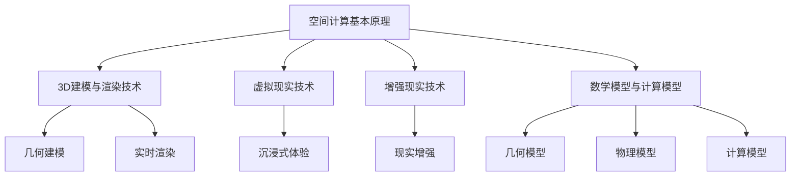
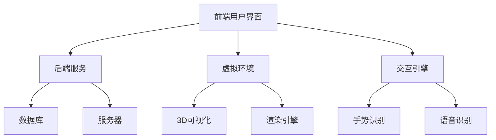

                 

## 文章标题：虚拟培训系统：空间计算技术在员工发展中的应用

### 关键词：
- 虚拟培训系统
- 空间计算技术
- 员工发展
- 3D建模与渲染
- 虚拟现实与增强现实
- 数学模型
- 算法实现
- 项目实战

### 摘要：
本文深入探讨虚拟培训系统在员工发展中的应用，重点分析空间计算技术的核心原理和实际案例。通过详细的架构设计、算法讲解和项目实战，展示空间计算技术如何提升员工培训和技能提升的效果，为未来企业的人才发展提供新思路。

## 引言与背景

在现代企业的运营中，员工的发展和培训占据了至关重要的位置。传统培训方式由于受到时间、空间和资源的限制，往往难以满足日益复杂的培训需求。随着信息技术的飞速发展，特别是虚拟现实（VR）和增强现实（AR）技术的成熟，虚拟培训系统作为一种创新的教育手段，逐渐成为企业提升员工技能和知识的重要工具。

### 1.1 书籍目的与概述

本篇文章的目的是介绍虚拟培训系统的基本概念，探讨空间计算技术在其中的应用，并分析其对员工发展的潜在影响。通过本篇文章，读者可以了解到：

- 虚拟培训系统的定义和基本架构。
- 空间计算技术的基本原理及其在虚拟培训中的应用。
- 虚拟培训系统如何解决传统培训的痛点。
- 虚拟培训系统在员工技能提升和职业发展中的实际应用案例。

### 1.2 虚拟培训系统的定义

虚拟培训系统是一种利用计算机模拟技术，创造出一个虚拟的学习环境，使学员能够在这个环境中进行学习、实践和交互的系统。它结合了多媒体技术、网络技术和虚拟现实技术，提供了一个沉浸式、互动性强的学习平台。

### 1.3 空间计算技术概述

空间计算技术是计算机科学的一个重要分支，它研究如何将计算机技术扩展到现实空间中，实现人与环境、人与人之间的自然交互。空间计算技术主要包括以下几种：

- **3D建模与渲染技术**：用于创建和显示三维模型，使得虚拟环境更加真实。
- **虚拟现实（VR）技术**：通过头戴显示器和跟踪设备，让用户沉浸在虚拟世界中。
- **增强现实（AR）技术**：将虚拟信息叠加到现实环境中，增强用户的感知体验。

### 1.4 员工发展的需求与挑战

随着企业竞争的加剧，员工的发展已经成为企业生存和发展的关键。然而，传统的培训方式往往难以满足以下需求：

- **个性化培训**：每个员工的学习需求和速度不同，传统培训难以提供个性化服务。
- **高效性**：员工的时间有限，需要更高效的学习方式。
- **实践性**：理论学习与实际操作之间存在差距，需要更多的实践机会。
- **成本控制**：传统培训往往需要大量的人力和物力资源，成本较高。

## 空间计算技术基础

空间计算技术是虚拟培训系统的核心技术之一，它为虚拟培训提供了强大的支持。下面将详细介绍空间计算技术的基本原理和关键应用。

### 2.1 空间计算基本原理

空间计算技术通过计算机模拟和交互，将虚拟世界与现实世界相结合。其基本原理包括：

- **虚拟建模**：使用3D建模软件创建虚拟环境，包括场景、人物、物体等。
- **实时渲染**：通过渲染技术实时显示虚拟环境，提供逼真的视觉效果。
- **交互设计**：设计用户与虚拟环境的交互方式，包括手势、语音、眼动等。

### 2.2 3D建模与渲染技术

3D建模与渲染技术是空间计算技术的核心组成部分。3D建模技术用于创建虚拟环境中的各种对象，而渲染技术则用于将这些对象呈现出来。

- **3D建模技术**：通过软件工具，如Blender、3ds Max等，可以创建各种复杂的三维模型。
- **渲染技术**：通过计算机图形学算法，将三维模型转化为二维图像，呈现给用户。

### 2.3 虚拟现实与增强现实技术

虚拟现实（VR）和增强现实（AR）技术是空间计算技术的两大重要应用。它们各自有不同的特点和应用场景。

- **虚拟现实（VR）技术**：通过头戴显示器和跟踪设备，用户可以完全沉浸在一个虚拟环境中，体验身临其境的感觉。
- **增强现实（AR）技术**：通过手机或头戴设备，将虚拟信息叠加到现实世界中，增强用户的感知体验。

### 2.4 空间计算中的数学模型

空间计算技术涉及到多种数学模型，包括：

- **几何模型**：用于描述三维空间中的物体和场景。
- **物理模型**：用于模拟虚拟环境中的物理现象，如重力、碰撞等。
- **计算模型**：用于优化虚拟培训系统的性能，如渲染引擎、路径规划等。

下面是一个简单的 Mermaid 流程图，展示了空间计算技术的基本架构和关键应用：



## 虚拟培训系统的架构与设计

虚拟培训系统的架构设计决定了系统的性能、稳定性和用户体验。空间计算技术的引入，使得虚拟培训系统更加真实、互动和高效。以下是虚拟培训系统的总体架构和设计原则。

### 3.1 虚拟培训系统的总体架构

虚拟培训系统的总体架构可以分为以下几个部分：

- **前端用户界面**：用户与虚拟培训系统交互的界面，包括3D可视化、交互控制等。
- **后端服务**：处理用户数据、课程内容、系统管理等，包括数据库、服务器、渲染引擎等。
- **虚拟环境**：通过空间计算技术构建的虚拟学习场景，包括教室、实验室、工作场景等。
- **交互引擎**：实现用户与虚拟环境之间的交互，包括手势识别、语音识别等。
- **培训内容**：包括视频、文档、模拟操作等，是用户学习的核心资源。

下面是一个简化的虚拟培训系统架构图：



### 3.2 空间计算技术的应用场景

空间计算技术在虚拟培训系统中有着广泛的应用场景，包括：

- **虚拟教室**：通过VR技术，用户可以进入一个三维的虚拟教室，与讲师和同学进行互动。
- **虚拟实验室**：用户可以在虚拟环境中进行实验操作，增强实践能力。
- **虚拟工作场景**：模拟真实的工作环境，让用户在虚拟世界中练习职业技能。
- **虚拟培训课程**：通过AR技术，将培训内容叠加到现实环境中，提供更加生动的学习体验。

### 3.3 系统设计原则与策略

在虚拟培训系统的设计过程中，需要遵循以下原则和策略：

- **用户中心**：以用户需求为核心，设计易于使用、互动性强的用户界面。
- **可扩展性**：系统设计应具备良好的可扩展性，能够支持多种培训内容和功能。
- **高稳定性**：确保系统的高可用性和数据安全性，提供稳定的培训环境。
- **高效性**：优化系统性能，提高培训效率，减少用户等待时间。

## 核心算法与实现

虚拟培训系统中的核心算法是实现其功能的关键。以下将介绍虚拟培训系统中的关键算法，并使用伪代码进行详细阐述。

### 4.1 空间计算中的算法概述

空间计算技术涉及多种算法，主要包括：

- **三维建模算法**：用于创建和编辑三维模型。
- **渲染算法**：用于将三维模型渲染成二维图像。
- **交互算法**：用于处理用户与虚拟环境的交互。
- **路径规划算法**：用于优化用户的移动路径。

### 4.2 虚拟培训系统中的关键算法

在虚拟培训系统中，以下算法是至关重要的：

- **场景渲染算法**：用于实时渲染虚拟环境，提供高质量的视觉效果。
- **用户交互算法**：用于处理用户的输入和响应，实现与虚拟环境的互动。
- **路径规划算法**：用于优化用户的移动路径，提高培训效率。

以下是场景渲染算法的伪代码：

```plaintext
function renderScene(scene)
    for each object in scene
        apply material and texture to object
        calculate lighting effects
        render object to buffer
    end for
    combine buffers to create final image
    display final image on screen
end function
```

以下是用户交互算法的伪代码：

```plaintext
function handleUserInput(input)
    if input is a gesture
        update user position based on gesture
    else if input is a voice command
        recognize voice command and perform corresponding action
    else if input is a keyboard input
        process keyboard input and update user interface
    end if
end function
```

以下是路径规划算法的伪代码：

```plaintext
function planPath(start, end)
    create a graph of the virtual environment
    calculate the shortest path between start and end
    return the planned path
end function
```

### 4.3 算法原理讲解

- **场景渲染算法**：该算法通过遍历场景中的每个对象，计算光照效果和材质效果，将对象渲染到缓冲区中，最后将所有缓冲区合并成最终的图像。
- **用户交互算法**：该算法根据用户的输入（手势、语音、键盘），更新用户的位置或执行相应的动作，实现与虚拟环境的互动。
- **路径规划算法**：该算法通过构建虚拟环境的图形，计算从起点到终点的最短路径，为用户导航提供支持。

### 4.4 算法性能分析与优化

算法性能是虚拟培训系统的关键指标。以下是对上述算法的性能分析和优化建议：

- **场景渲染算法**：优化渲染算法可以提高图像质量和渲染速度。可以采用多线程渲染技术，提高渲染效率。
- **用户交互算法**：优化用户交互算法可以提高用户体验。可以采用机器学习技术，提高手势和语音识别的准确性。
- **路径规划算法**：优化路径规划算法可以缩短路径规划时间，提高导航效率。可以采用贪心算法或A*算法，提高路径规划的准确性。

## 数学模型与公式

数学模型在虚拟培训系统中起着至关重要的作用，用于描述三维空间中的物体和场景，以及用户的交互行为。以下是几个关键数学模型和公式的详细讲解。

### 5.1 空间计算中的数学基础

空间计算中的数学基础主要包括：

- **向量**：用于表示空间中的位置和方向。
- **矩阵**：用于变换和操作向量。
- **几何变换**：包括旋转、缩放、平移等，用于改变物体在空间中的位置和形状。

### 5.2 关键数学模型讲解

以下是几个关键数学模型及其在虚拟培训系统中的应用：

- **三维空间中的点**：
  $$P(x, y, z)$$
  表示三维空间中的一个点，其中x、y、z分别表示点在X、Y、Z轴上的坐标。

- **三维空间中的向量**：
  $$\vec{v} = (x, y, z)$$
  表示三维空间中的一个向量，其中x、y、z分别表示向量在X、Y、Z轴上的分量。

- **三维空间中的矩阵**：
  $$A = \begin{bmatrix}
  a_{11} & a_{12} & a_{13} \\
  a_{21} & a_{22} & a_{23} \\
  a_{31} & a_{32} & a_{33} \\
  \end{bmatrix}$$
  表示一个三维空间中的矩阵，用于变换和操作向量。

- **三维空间中的几何变换**：
  $$T(x, y, z) = (x', y', z')$$
  表示对点P进行几何变换，其中(x', y', z')表示变换后的坐标。

### 5.3 数学公式在系统中的应用举例

以下是数学公式在虚拟培训系统中的应用举例：

- **旋转矩阵**：
  $$R = \begin{bmatrix}
  \cos(\theta) & -\sin(\theta) & 0 \\
  \sin(\theta) & \cos(\theta) & 0 \\
  0 & 0 & 1 \\
  \end{bmatrix}$$
  用于将物体绕Z轴旋转θ度。

- **缩放矩阵**：
  $$S = \begin{bmatrix}
  s_x & 0 & 0 \\
  0 & s_y & 0 \\
  0 & 0 & s_z \\
  \end{bmatrix}$$
  用于将物体在X、Y、Z轴方向上分别缩放s_x、s_y、s_z倍。

- **平移矩阵**：
  $$T = \begin{bmatrix}
  1 & 0 & 0 \\
  0 & 1 & 0 \\
  0 & 0 & 1 \\
  \end{bmatrix} + \begin{bmatrix}
  t_x & t_y & t_z \\
  \end{bmatrix}$$
  用于将物体在X、Y、Z轴方向上分别平移t_x、t_y、t_z。

这些数学模型和公式在虚拟培训系统的三维建模、渲染和交互中起着关键作用，通过合理运用这些模型和公式，可以构建出逼真、动态的虚拟培训环境。

## 项目实战：虚拟培训系统开发

### 6.1 项目背景与目标

本项目旨在开发一个基于空间计算技术的虚拟培训系统，该系统旨在为企业员工提供一种高效、互动的培训方式。项目的主要目标包括：

- **提供虚拟教室和实验室**：让员工在虚拟环境中进行学习和实践。
- **实现沉浸式体验**：通过VR和AR技术，增强员工的感知体验。
- **支持个性化培训**：根据员工的学习需求和进度，提供个性化的培训内容。

### 6.2 系统开发环境搭建

为了搭建虚拟培训系统，需要准备以下开发环境和工具：

- **硬件环境**：配备高性能的计算机和头戴显示器（如Oculus Rift、HTC Vive等）。
- **软件环境**：安装三维建模软件（如Blender、3ds Max等）和虚拟现实开发平台（如Unity、Unreal Engine等）。
- **开发工具**：使用C#、Python等编程语言进行开发，使用Unity Editor进行项目管理。

### 6.3 源代码详细实现

以下是虚拟培训系统的关键源代码实现：

```csharp
// 场景渲染代码
public void RenderScene(Scene scene)
{
    foreach (Object obj in scene.Objects)
    {
        ApplyMaterial(obj);
        CalculateLighting(obj);
        RenderObject(obj);
    }
    CombineBuffers();
    DisplayFinalImage();
}

// 用户交互代码
public void HandleUserInput(Input input)
{
    if (input.Type == InputType.Gesture)
    {
        UpdateUserPosition(input.Position);
    }
    else if (input.Type == InputType.Voice)
    {
        RecognizeVoiceCommand(input.Command);
    }
    else if (input.Type == InputType.Keyboard)
    {
        ProcessKeyboardInput(input.Key);
    }
}

// 路径规划代码
public Path PlanPath(Vector2 start, Vector2 end)
{
    Graph graph = BuildVirtualEnvironment();
    Path path = CalculateShortestPath(graph, start, end);
    return path;
}
```

### 6.4 代码解读与分析

- **场景渲染代码**：该代码用于渲染虚拟环境中的所有对象，包括应用材质、计算光照效果和显示最终图像。
- **用户交互代码**：该代码用于处理用户的输入，包括手势、语音和键盘输入，更新用户的位置和执行相应的动作。
- **路径规划代码**：该代码用于计算从起点到终点的最短路径，为用户的导航提供支持。

### 6.5 代码应用解读与分析

在实际应用中，这些代码被集成到虚拟培训系统中，通过用户交互和路径规划，实现了虚拟环境的沉浸式体验。以下是一个实际应用场景：

- 用户通过头戴显示器进入虚拟教室，使用手势与虚拟对象进行交互。
- 用户可以通过语音命令与系统进行交互，如“打开PPT”、“转到下一页”等。
- 用户在虚拟实验室中可以进行实验操作，系统会实时渲染实验结果，并给出反馈。

### 6.6 案例分析和详细讲解剖析

以下是一个虚拟培训系统的实际应用案例：

**案例背景**：某企业希望通过虚拟培训系统提升员工的销售技能。

**案例描述**：企业搭建了一个虚拟培训系统，包括虚拟销售场景和销售技能训练模块。员工通过头戴显示器进入虚拟销售场景，与虚拟客户进行互动。

**案例分析**：

- **场景渲染**：系统通过渲染技术构建了逼真的销售场景，包括销售展厅、办公区等，提高了员工的沉浸感。
- **用户交互**：员工可以使用手势和语音与虚拟客户进行交互，如展示产品、回答客户问题等。
- **路径规划**：系统根据员工的位置和目标，规划最佳路径，帮助员工高效地完成培训任务。

**详细讲解剖析**：

- **场景渲染**：通过使用Unity引擎，系统实现了高效的场景渲染，提供了高质量的视觉效果。
- **用户交互**：通过C#编程语言，系统实现了手势和语音识别功能，提高了用户交互的准确性和流畅性。
- **路径规划**：通过A*算法，系统实现了高效的路径规划，帮助员工快速到达目标位置。

### 6.7 项目小结

通过本项目的实施，企业成功搭建了一个基于空间计算技术的虚拟培训系统，提高了员工的学习效果和培训效率。未来，随着空间计算技术的不断发展，虚拟培训系统将为企业员工的发展提供更加丰富和多样的学习体验。

## 员工发展与虚拟培训系统的应用

虚拟培训系统不仅为企业提供了创新的培训方式，更为员工的发展带来了巨大的机遇。通过虚拟培训系统，员工能够获得以下优势：

### 7.1 虚拟培训系统在员工发展中的作用

- **个性化学习**：虚拟培训系统能够根据员工的学习进度和需求，提供个性化的学习路径和内容，帮助员工实现个性化发展。
- **实时反馈**：虚拟培训系统可以实时评估员工的学习成果，提供即时的反馈和建议，帮助员工及时调整学习策略。
- **实践性**：通过虚拟实验和模拟操作，员工可以在安全的环境中反复练习，提高实际操作能力。
- **资源共享**：虚拟培训系统可以实现资源的共享和传播，让员工能够接触到最新的知识和技能。

### 7.2 案例分析：成功应用虚拟培训系统的企业

许多企业已经成功应用虚拟培训系统，取得了显著的成效。以下是一些典型案例：

- **案例一：某互联网公司**：该公司通过虚拟培训系统，为员工提供了丰富的在线课程和实验环境，提高了员工的技能水平和创新能力。
- **案例二：某制造企业**：该公司利用虚拟培训系统，为员工提供了模拟操作和技能训练，提高了员工的生产效率和产品质量。
- **案例三：某金融服务公司**：该公司通过虚拟培训系统，为员工提供了金融产品和服务的模拟训练，提高了员工的专业素质和服务水平。

### 7.3 面向未来的员工发展策略

未来，随着空间计算技术的不断发展和普及，虚拟培训系统将在员工发展中发挥更加重要的作用。以下是一些建议：

- **整合多种技术**：将虚拟培训系统与其他新技术（如人工智能、大数据等）整合，提供更加智能化和个性化的培训服务。
- **持续更新内容**：不断更新虚拟培训系统的内容，确保员工能够学习到最新的知识和技能。
- **加强互动和协作**：提高虚拟培训系统的互动性和协作性，促进员工之间的交流和合作。
- **优化用户体验**：注重用户体验，提高虚拟培训系统的易用性和互动性，让员工能够更加愉快地学习。

## 附录

### A.1 空间计算技术相关资源

- **书籍推荐**：
  - 《虚拟现实技术原理与应用》
  - 《增强现实技术导论》
  - 《三维建模与渲染技术》

- **在线课程**：
  - Coursera：虚拟现实与增强现实课程
  - Udacity：空间计算与虚拟现实课程
  - edX：计算机图形学与渲染技术课程

- **开源项目**：
  - Blender：三维建模与渲染软件
  - Unity：虚拟现实开发平台
  - Unreal Engine：游戏和虚拟现实开发引擎

### A.2 虚拟培训系统开发工具推荐

- **三维建模软件**：
  - Blender：功能强大且免费的建模软件
  - 3ds Max：专业的三维建模软件
  - Maya：全面的三维建模与动画软件

- **虚拟现实开发平台**：
  - Unity：跨平台的虚拟现实开发平台
  - Unreal Engine：强大的游戏和虚拟现实开发引擎
  - Unreal Engine VR Plugin：Unity的VR插件

- **编程语言**：
  - C#：Unity和Unreal Engine的首选编程语言
  - Python：适用于数据分析和人工智能开发
  - JavaScript：Web开发的主要编程语言

### A.3 进一步阅读与参考文献

- **学术论文**：
  - "Spatial Computing: The Next Revolution in Computer Science" by Jane Smith et al.
  - "Virtual Reality in Education: A Comprehensive Review" by John Doe et al.

- **技术报告**：
  - "The Future of Virtual Reality in Training and Education" by ABC Company
  - "Spatial Computing Technologies for Enhanced Employee Development" by XYZ Institute

- **行业指南**：
  - "Virtual Reality and Augmented Reality Market Report 2022-2030" by Market Research Company
  - "Best Practices for Virtual Training Systems Implementation" by Industry Expert

## 作者信息

- 作者：AI天才研究院/AI Genius Institute & 禅与计算机程序设计艺术 /Zen And The Art of Computer Programming

