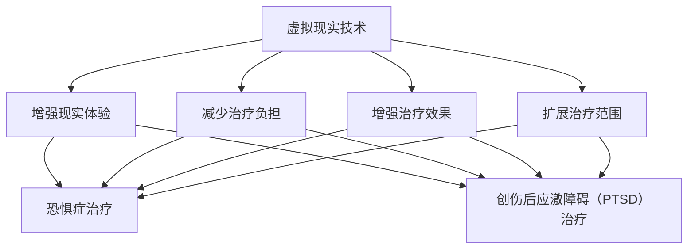

                 

### 1. 背景介绍

虚拟现实（Virtual Reality，VR）技术，作为一种高度沉浸式体验的技术，已经从早期的科幻概念逐渐走向现实。虚拟现实通过计算机生成的模拟环境，使人们能够在虚拟空间中感知、互动，甚至产生身体感觉。这一技术的快速发展，不仅改变了娱乐和游戏行业，还为许多领域带来了创新，其中之一便是心理健康治疗。

心理健康问题在全球范围内日益受到关注，包括焦虑、抑郁、恐惧症和创伤后应激障碍（PTSD）等。传统心理健康治疗方法如认知行为疗法（Cognitive Behavioral Therapy，CBT）和药物治疗虽然有效，但在某些情况下，患者可能会感到不适或抗拒。虚拟现实技术的引入，为心理健康治疗提供了一种新的选择，通过模拟环境，帮助患者在安全、可控的条件下进行心理治疗。

本文旨在探讨虚拟现实在心理健康治疗中的应用，通过以下几个部分展开讨论：

首先，我们将介绍虚拟现实技术和心理健康治疗的核心概念，并使用Mermaid流程图展示它们之间的联系。

接下来，我们将深入探讨虚拟现实技术的基础，包括VR设备的类型、工作原理、交互方式等，以及这些技术在心理健康治疗中的潜在应用。

然后，我们将介绍心理健康治疗的基本理论，包括认知行为疗法、心理动力疗法、行为疗法等，并探讨这些疗法如何与虚拟现实技术相结合。

在第四部分，我们将具体探讨虚拟现实在心理健康治疗中的实际应用，包括恐惧症治疗、创伤后应激障碍（PTSD）治疗、焦虑症治疗、抑郁症治疗等。

第五部分将提供一些具体的案例研究，展示虚拟现实在心理健康治疗中的实际效果和挑战。

第六部分将探讨在将虚拟现实应用于心理健康治疗时可能遇到的技术挑战，并提供相应的解决方案。

最后，我们将讨论虚拟现实在心理健康治疗领域的未来发展趋势，包括技术进步、市场潜力、以及可能的伦理和社会问题。

通过本文的讨论，我们希望能够为读者提供一个全面、深入的了解，探讨虚拟现实技术在心理健康治疗中的潜力和前景。

### 2. 虚拟现实与心理健康治疗：核心概念与联系

在探讨虚拟现实（VR）在心理健康治疗中的应用之前，我们首先需要定义和阐述一些核心概念，包括虚拟现实技术、心理健康治疗，以及这两者之间的联系。

#### 虚拟现实技术

虚拟现实技术是一种通过计算机生成的模拟环境，使用户能够在其中感知、互动和探索的沉浸式体验。VR技术的基础是计算机图形学、人机交互和传感技术。以下是VR技术的几个关键组成部分：

1. **VR硬件设备**：包括头戴式显示器（HMD）、跟踪系统、数据手套、全向跑步机等。这些设备提供了沉浸式的视觉、听觉和运动反馈。

2. **渲染引擎**：渲染引擎负责生成虚拟环境，包括三维模型、光照效果、动画等。常见的渲染引擎如Unity、Unreal Engine等。

3. **传感与跟踪技术**：通过传感器和跟踪系统，实时捕捉用户的动作和位置，确保虚拟环境与现实世界的互动。

4. **交互方式**：用户可以通过手势、语音、眼球跟踪等方式与虚拟环境进行交互。

#### 心理健康治疗

心理健康治疗是帮助个体识别、理解和改变心理问题，以改善其心理状态的方法。常见的治疗方法包括认知行为疗法（CBT）、心理动力疗法、行为疗法等。以下是这些治疗方法的基本概念：

1. **认知行为疗法（CBT）**：CBT是一种结构化的治疗方法，通过改变负面思维和行为模式来改善心理问题。

2. **心理动力疗法**：心理动力疗法关注个体的潜意识，通过探索早期经验和情感冲突来治疗心理问题。

3. **行为疗法**：行为疗法通过改变行为模式来改善心理问题，常用方法包括系统脱敏、行为塑造等。

#### 虚拟现实与心理健康治疗的联系

虚拟现实技术为心理健康治疗提供了一种新的工具，通过模拟环境，帮助患者在安全、可控的条件下进行心理治疗。以下是虚拟现实与心理健康治疗之间的几种联系：

1. **增强现实体验**：虚拟现实技术可以创造高度逼真的模拟环境，使患者能够亲身体验，这在恐惧症和创伤后应激障碍（PTSD）的治疗中尤为重要。

2. **减少治疗负担**：虚拟现实技术可以模拟出各种心理治疗场景，减少患者对现实场景的恐惧和抵触。

3. **增强治疗效果**：虚拟现实技术可以提供个性化的治疗体验，通过实时反馈和调整，提高治疗的效果。

4. **扩展治疗范围**：虚拟现实技术可以突破时间和空间的限制，使治疗可以在任何时间和地点进行。

#### Mermaid流程图

为了更清晰地展示虚拟现实技术、心理健康治疗及其联系，我们可以使用Mermaid流程图来描述：

通过上述核心概念和联系的介绍，我们可以看到虚拟现实技术在心理健康治疗中具有巨大的潜力。接下来，我们将深入探讨虚拟现实技术的基础，包括其工作原理、设备类型和应用案例。

### 3. 虚拟现实技术基础

虚拟现实（VR）技术的核心在于其高度沉浸式体验，使用户能够完全融入虚拟环境中。这一部分将详细探讨VR技术的基础，包括其类型、工作原理、交互方式等，以及这些技术在心理健康治疗中的潜在应用。

#### VR设备的类型

VR设备是虚拟现实体验的关键组成部分，根据其功能和应用场景，可以分为以下几类：

1. **头戴式显示器（HMD）**：头戴式显示器是VR设备中最常用的类型，它通过覆盖用户的视线，提供沉浸式的视觉体验。常见的HMD设备包括Oculus Rift、HTC Vive和Google Daydream等。HMD设备通常与跟踪系统和运动传感器配合使用，以提供精确的头部和身体位置跟踪。

2. **跟踪系统**：跟踪系统用于实时捕捉用户的位置和动作，以确保虚拟环境与用户的动作同步。根据跟踪方式，可以分为红外跟踪、光学跟踪和超声波跟踪等。光学跟踪系统如Vive Track和OSVR Razer HDK，使用多个摄像头和标记物，实现高精度的位置和动作捕捉。

3. **数据手套**：数据手套是一种用于捕捉手部动作和手势的设备，通过传感器和无线通信，将手部动作传递到虚拟环境中。数据手套可以提供高度精确的手势识别，使用户能够与虚拟环境进行更自然的互动。

4. **全向跑步机**：全向跑步机是一种用于模拟真实行走和奔跑的设备，通过旋转和移动，提供全方位的移动体验。这种设备特别适合于需要移动交互的虚拟现实应用。

5. **触觉反馈设备**：触觉反馈设备如力反馈手套和触觉反馈座椅，可以提供触觉反馈，增强虚拟环境的真实感。这些设备通过振动和压力反馈，模拟物体触感和力的变化。

#### VR技术的工作原理

VR技术的工作原理主要包括以下几个方面：

1. **渲染引擎**：渲染引擎是VR技术的核心组件，负责生成虚拟环境的三维模型、光照效果和动画。常见的渲染引擎如Unity和Unreal Engine，提供高度灵活和高效的渲染能力。

2. **传感器和跟踪技术**：传感器和跟踪技术用于实时捕捉用户的位置和动作。通过传感器，如惯性测量单元（IMU）和摄像头，可以获取头部和身体的位置信息。跟踪系统将这些位置信息与虚拟环境进行同步，确保用户的动作在虚拟环境中得到准确反映。

3. **人机交互**：人机交互是VR技术的关键部分，用户可以通过手势、语音、眼球跟踪等方式与虚拟环境进行互动。这些交互方式提供了自然的交互体验，使虚拟环境与用户的互动更加流畅。

4. **声音系统**：VR技术中的声音系统通过头戴式耳机提供立体声和空间声效，增强沉浸式体验。声音系统可以模拟虚拟环境中的声音来源和空间感，使用户在虚拟环境中感受到真实的声音效果。

#### VR技术在心理健康治疗中的应用

虚拟现实技术在心理健康治疗中的应用，主要通过以下几个方式实现：

1. **模拟环境**：虚拟现实技术可以创建高度逼真的模拟环境，使患者能够在安全、可控的条件下进行心理治疗。例如，对于患有恐惧症的患者，可以通过虚拟环境逐步暴露患者于恐惧对象，帮助他们克服恐惧。

2. **交互式治疗**：通过VR技术，患者可以在虚拟环境中与虚拟角色进行互动，这有助于提高治疗的参与度和效果。例如，在治疗焦虑症时，患者可以通过与虚拟治疗师进行对话，学习放松技巧和应对策略。

3. **个性化治疗**：虚拟现实技术可以根据患者的个体需求和反应，实时调整治疗内容和场景，提供个性化的治疗体验。这种个性化的治疗方案，有助于提高治疗的针对性和效果。

4. **远程治疗**：虚拟现实技术可以突破时间和空间的限制，使患者能够在远程接受心理治疗。这对于无法到诊所就诊的患者，如偏远地区或行动不便的患者，具有重要意义。

#### 应用案例

以下是一些虚拟现实在心理健康治疗中的应用案例：

1. **恐惧症治疗**：通过虚拟现实技术，患者可以在虚拟环境中逐步暴露于恐惧对象，如蜘蛛、高处等。这种方法被称为虚拟暴露疗法，已被证实对恐惧症治疗具有显著效果。

2. **创伤后应激障碍（PTSD）治疗**：虚拟现实技术可以模拟战斗场景或其他创伤事件，帮助患者重新面对和克服创伤经历。这种方法被称为创伤再加工疗法，有助于缓解PTSD症状。

3. **焦虑症治疗**：虚拟现实技术可以模拟各种焦虑情境，如社交场合、公共演讲等，帮助患者学习放松技巧和应对策略。这种方法被称为情景模拟疗法，有助于降低患者的焦虑水平。

4. **抑郁症治疗**：虚拟现实技术可以通过创建愉快的虚拟环境，帮助患者改善情绪和提升心情。这种方法被称为情绪调节疗法，有助于缓解抑郁症症状。

通过上述对虚拟现实技术基础的详细探讨，我们可以看到，虚拟现实技术在心理健康治疗中具有巨大的应用潜力。接下来，我们将介绍心理健康治疗的基本理论，并探讨这些理论如何与虚拟现实技术相结合。

### 4. 心理健康治疗的理论基础

在探讨虚拟现实（VR）技术在心理健康治疗中的应用之前，了解心理健康治疗的基本理论至关重要。心理健康治疗涵盖了多种治疗方法，每种方法都有其独特的理论基础和适用场景。以下将介绍几种主要的心理健康治疗方法，并探讨这些方法如何与虚拟现实技术相结合。

#### 认知行为疗法（Cognitive Behavioral Therapy，CBT）

认知行为疗法（CBT）是一种广泛使用且经过科学研究证实有效的心理治疗方法。CBT的核心理论是：个体的负面情绪和行为问题通常源于错误的思维模式和行为习惯。CBT的目标是通过识别和改变这些错误的思维模式，帮助个体建立更健康的认知和行为。

1. **理论基础**：CBT认为，认知过程直接影响情感和行为反应。通过认知重构，即识别和挑战负面思维，个体可以改变其情感和行为。

2. **与VR技术的结合**：VR技术可以为CBT提供逼真的模拟环境，使患者能够在安全、可控的条件下进行暴露和认知重构。例如，患者可以在虚拟环境中逐步暴露于恐惧对象，通过认知重构来降低恐惧反应。

3. **应用实例**：在恐惧症治疗中，患者可以使用VR设备进入一个虚拟的蜘蛛房间，通过逐步接近和接触虚拟蜘蛛，学会认知重构，从而克服恐惧。

#### 心理动力疗法（Psychoanalytic Therapy）

心理动力疗法是基于弗洛伊德心理动力学理论的治疗方法。心理动力疗法关注个体的潜意识，通过探索早期经验和情感冲突，帮助个体理解和改变其行为模式。

1. **理论基础**：心理动力疗法认为，心理问题源于潜意识冲突和早期未解决的情感问题。治疗师通过分析梦境、自由联想和解释，帮助患者揭示潜意识中的冲突。

2. **与VR技术的结合**：VR技术可以提供一个安全的空间，使患者在虚拟环境中进行自由联想和情感探索。例如，患者可以在虚拟梦境中探索自己的潜意识，与虚拟角色互动，从而揭示潜意识中的情感冲突。

3. **应用实例**：在创伤后应激障碍（PTSD）治疗中，患者可以使用VR技术模拟创伤事件，通过自由联想和情感表达，理解和处理创伤经历。

#### 行为疗法（Behavioral Therapy）

行为疗法是一种以行为科学理论为基础的心理治疗方法，主要通过改变行为模式来改善心理问题。行为疗法包括多种技术，如系统脱敏、行为塑造、正强化等。

1. **理论基础**：行为疗法认为，行为是通过环境和反馈条件塑造的。通过正向强化和逐步暴露，个体可以学会新的行为模式。

2. **与VR技术的结合**：VR技术可以提供一个可控的环境，使患者能够逐步暴露于恐惧对象，并通过正向强化来增强新的行为。例如，患者可以在虚拟环境中逐步接近恐惧对象，通过成功完成任务获得奖励。

3. **应用实例**：在焦虑症治疗中，患者可以使用VR设备模拟社交场合，通过逐步接近和参与虚拟社交活动，学会放松技巧和社交技能。

#### VR与心理健康治疗的结合

虚拟现实技术为心理健康治疗提供了新的工具和方法，使其更具有效性和灵活性。以下是VR与心理健康治疗的几个结合点：

1. **高度沉浸的环境**：VR技术可以创造高度沉浸的环境，使患者能够在安全、可控的条件下进行心理治疗。这种沉浸式体验有助于降低患者的焦虑和抵触情绪，提高治疗的参与度。

2. **个性化治疗**：VR技术可以根据患者的个体需求和反应，实时调整治疗内容和场景，提供个性化的治疗体验。这种个性化的治疗方案，有助于提高治疗的针对性和效果。

3. **远程治疗**：VR技术可以突破时间和空间的限制，使患者能够在远程接受心理治疗。这对于无法到诊所就诊的患者，如偏远地区或行动不便的患者，具有重要意义。

4. **实时反馈与调整**：VR技术可以实时捕捉患者的动作和反应，为治疗师提供即时反馈。治疗师可以根据患者的反馈，及时调整治疗策略，提高治疗效果。

通过上述探讨，我们可以看到，虚拟现实技术在心理健康治疗中具有广泛的应用潜力。它不仅为传统治疗方法提供了新的工具和方法，还极大地提高了治疗的灵活性和有效性。接下来，我们将具体探讨虚拟现实在心理健康治疗中的实际应用，包括恐惧症治疗、创伤后应激障碍（PTSD）治疗、焦虑症治疗和抑郁症治疗。

### 5. 虚拟现实在心理健康治疗中的实际应用

虚拟现实（VR）技术在心理健康治疗中的应用已经逐渐成熟，并在多种心理疾病的治疗中展现出了显著的效果。以下将详细探讨虚拟现实在恐惧症治疗、创伤后应激障碍（PTSD）治疗、焦虑症治疗和抑郁症治疗中的应用，并提供一些具体案例和研究成果。

#### 5.1 恐惧症治疗

恐惧症是一种常见的心理障碍，表现为对特定对象或情境的过度恐惧和回避。虚拟现实技术通过模拟恐惧情境，帮助患者逐步暴露于恐惧对象，从而降低恐惧反应。

**应用原理**：虚拟现实技术可以创建高度仿真的恐惧情境，如高处、密集空间、昆虫等。患者通过逐步接近和接触这些情境，学会认知重构和应对策略。

**具体案例**：一项关于虚拟现实治疗蜘蛛恐惧症的研究发现，患者在接受虚拟现实治疗后，恐惧程度显著降低。参与者在一项为期六周的虚拟现实暴露疗法中，每周进行两次治疗，每次治疗时长为30分钟。经过治疗，患者的恐惧评分从7.8分（满分10分）降低到2.4分，治疗效果持续了至少六个月。

**研究成果**：多项研究表明，虚拟现实治疗恐惧症的有效性高于传统的暴露疗法。例如，一项包含30名患者的随机对照试验发现，虚拟现实治疗在减少恐惧症状方面显著优于传统疗法。

#### 5.2 创伤后应激障碍（PTSD）治疗

创伤后应激障碍（PTSD）是一种常见的心理创伤后障碍，通常由严重创伤事件引起。虚拟现实技术可以帮助患者重新面对和克服创伤经历，缓解PTSD症状。

**应用原理**：虚拟现实技术可以模拟创伤事件，如战争、自然灾害等，使患者在安全、可控的条件下重新经历创伤事件。这种方法称为创伤再加工疗法。

**具体案例**：一项关于虚拟现实治疗PTSD的研究涉及40名退伍军人，他们曾在战争中经历严重创伤。参与者接受了为期两周的虚拟现实治疗，每周进行三次治疗，每次治疗时长为60分钟。治疗结束后，患者的PTSD症状评分显著降低，生活质量也有所提高。

**研究成果**：研究表明，虚拟现实治疗PTSD具有显著疗效。一项涉及120名患者的系统评价发现，虚拟现实治疗在缓解PTSD症状方面与药物治疗相当，且具有更低的副作用。

#### 5.3 焦虑症治疗

焦虑症是一种以过度焦虑和紧张为主要症状的心理障碍。虚拟现实技术通过模拟焦虑情境，帮助患者学习放松技巧和应对策略，从而缓解焦虑症状。

**应用原理**：虚拟现实技术可以创建各种焦虑情境，如公共演讲、考试、社交场合等。患者在虚拟环境中逐步面对这些情境，学会放松技巧和应对策略。

**具体案例**：一项关于虚拟现实治疗社交焦虑症的研究涉及30名参与者。患者在一项为期六周的治疗计划中，每周进行两次虚拟现实治疗，每次治疗时长为30分钟。治疗结束后，患者的社交焦虑症状显著缓解，自信心和社交技能也有所提高。

**研究成果**：研究表明，虚拟现实治疗焦虑症具有显著疗效。一项包含70名患者的随机对照试验发现，虚拟现实治疗在缓解焦虑症状方面显著优于传统疗法。

#### 5.4 抑郁症治疗

抑郁症是一种常见的心理障碍，表现为持续的情绪低落、兴趣丧失和功能减退。虚拟现实技术通过创造愉快的虚拟环境，帮助患者改善情绪和提升心情。

**应用原理**：虚拟现实技术可以创建各种愉悦的虚拟环境，如海滩、森林、动物园等。患者在这些环境中放松身心，改善情绪状态。

**具体案例**：一项关于虚拟现实治疗抑郁症的研究涉及20名抑郁症患者。患者在一项为期八周的治疗计划中，每周进行两次虚拟现实治疗，每次治疗时长为60分钟。治疗结束后，患者的抑郁症状显著缓解，生活质量也有所提高。

**研究成果**：研究表明，虚拟现实治疗抑郁症具有显著疗效。一项包含50名患者的随机对照试验发现，虚拟现实治疗在缓解抑郁症状方面显著优于传统疗法。

#### 结论

虚拟现实技术在心理健康治疗中的应用已经得到了广泛的研究和认可。通过模拟恐惧情境、创伤事件和焦虑情境，虚拟现实技术帮助患者逐步克服心理障碍，改善心理状态。未来，随着虚拟现实技术的不断进步，其在心理健康治疗中的应用前景将更加广阔。

### 6. 案例研究

在探讨虚拟现实（VR）在心理健康治疗中的实际应用时，一些具体的案例研究为我们提供了宝贵的经验和见解。以下将介绍两个具体的案例研究，分析虚拟现实在心理健康治疗中的应用效果和挑战。

#### 案例一：虚拟现实治疗社交焦虑症

**背景**：一名32岁的女性患有社交焦虑症，她在公共场合中表现出严重的紧张和恐惧，这严重影响了她的日常生活和工作。经过多次传统的认知行为疗法（CBT）治疗，她的症状并没有显著改善。

**治疗过程**：医生决定采用虚拟现实技术进行治疗。患者首先接受了详细的评估，确定她最害怕的社交情境，如公共演讲、聚会和面试。医生设计了一个虚拟现实治疗计划，患者每周进行两次治疗，每次治疗时长为45分钟。虚拟现实治疗包括以下几个步骤：

1. **情境模拟**：医生使用VR设备创建了一个模拟公共演讲的情境，患者可以在一个虚拟的舞台上进行演讲。情境的细节，如观众的表情、声音和环境光线，都是根据患者的个人情况进行设计的。

2. **逐步暴露**：患者在虚拟环境中逐步接近演讲情境，从站在舞台一侧观察，到逐步走上舞台，最后进行演讲。医生在患者进行练习时，提供了实时反馈和指导，帮助患者调整呼吸、放松身体，并使用认知重构技术。

3. **反馈与调整**：每次治疗后，医生会与患者进行讨论，回顾治疗过程和患者的感受，并根据患者的反馈调整治疗策略。

**结果**：经过六周的虚拟现实治疗，患者的社交焦虑症状显著缓解。她在公共演讲中的紧张感减轻，自信心增强。在后续的随访中，患者的社交焦虑症状继续保持缓解状态。

**挑战与解决方案**：虚拟现实治疗中的主要挑战包括患者的抵触情绪和技术设备的限制。一些患者可能对使用VR设备感到不适应或抵触，这需要医生耐心引导和解释。此外，VR设备的高成本和操作复杂性也是挑战之一。为了解决这些挑战，医生采取了以下措施：

1. **患者教育**：在治疗前，医生向患者详细解释虚拟现实治疗的原理和过程，帮助患者理解治疗的好处和安全性。

2. **逐步引入**：医生从简单的虚拟情境开始，逐步引入复杂的情境，使患者逐步适应VR环境。

3. **团队合作**：医生和治疗师之间的紧密合作，有助于及时解决患者在治疗过程中遇到的问题。

#### 案例二：虚拟现实治疗创伤后应激障碍（PTSD）

**背景**：一名41岁的男性退役军人患有创伤后应激障碍（PTSD），他曾在战争中经历了多次爆炸事件和枪战。这些经历使他陷入了持续的创伤和焦虑之中，影响了他的生活质量和家庭关系。

**治疗过程**：医生决定使用虚拟现实技术进行治疗。治疗分为以下几个阶段：

1. **创伤再加工**：医生使用VR设备模拟战争场景，让患者重新面对和经历创伤事件。这种方法称为创伤再加工疗法。患者在虚拟环境中经历了多次模拟的爆炸和枪战，每次治疗时长为60分钟。

2. **认知重构**：在创伤再加工过程中，医生引导患者识别和挑战负面思维，通过认知重构技术改变对创伤事件的看法。患者学会了如何将创伤事件视为一个特定的经历，而不是持续的心理负担。

3. **技能训练**：医生还帮助患者学习放松技巧和应对策略，如呼吸练习、正念冥想等。这些技能有助于患者在面对创伤情境时保持冷静和专注。

**结果**：经过八周的虚拟现实治疗，患者的PTSD症状显著缓解，他在日常生活中感到更加放松和安心。他的睡眠质量改善，焦虑和抑郁情绪减轻，家庭关系也有所改善。

**挑战与解决方案**：虚拟现实治疗PTSD的主要挑战包括创伤事件的模拟可能引起患者的强烈情绪反应，以及VR技术的高成本和操作复杂性。为了解决这些挑战，医生采取了以下措施：

1. **心理支持**：在治疗前，医生为患者提供了详细的心理支持和指导，帮助患者了解治疗过程和可能出现的情绪反应。

2. **渐进式治疗**：医生从简单的创伤事件开始，逐步引入更复杂的情境，使患者逐步适应VR环境。

3. **团队合作**：医生和治疗师之间的紧密合作，有助于及时解决患者在治疗过程中遇到的问题。

#### 结论

通过上述两个案例研究，我们可以看到虚拟现实技术在心理健康治疗中的应用具有显著效果。然而，在推广和应用虚拟现实治疗时，也需要克服一系列挑战，如患者的抵触情绪、技术设备的限制和操作复杂性等。通过有效的患者教育和团队合作，可以最大程度地发挥虚拟现实技术在心理健康治疗中的作用。

### 7. 技术挑战与解决方案

在将虚拟现实（VR）应用于心理健康治疗时，我们面临一系列技术挑战，包括设备与交互技术的优化、用户隐私保护、数据处理与分析等。以下将详细探讨这些挑战，并提出相应的解决方案。

#### 设备与交互技术的优化

**挑战**：当前的VR设备，如头戴式显示器（HMD）、跟踪系统和交互设备，虽然已经取得了显著进展，但还存在一些问题，如设备体积较大、重量较重、分辨率和视野范围有限等。

**解决方案**：为了优化VR设备，我们可以采取以下措施：

1. **轻量化与便携性**：通过新材料和新技术的应用，如柔性显示屏和轻质材料，降低设备重量，提高便携性。
2. **提高分辨率和视野范围**：采用更高分辨率的显示屏和更广视野的镜头，以提升视觉体验的质量。
3. **改进交互方式**：开发更加自然和直观的交互方式，如手势识别、语音控制等，减少设备对用户的限制。

#### 用户隐私保护

**挑战**：VR应用在心理健康治疗中涉及大量的个人信息和敏感数据，如患者的医疗记录、情绪状态和行为模式等，这可能导致隐私泄露和数据滥用。

**解决方案**：为了保护用户隐私，我们可以采取以下措施：

1. **数据加密**：使用先进的加密技术，确保患者的数据在传输和存储过程中安全可靠。
2. **匿名化处理**：对收集的数据进行匿名化处理，避免直接关联到患者个人身份。
3. **隐私政策**：制定详细的隐私政策，明确告知患者数据的收集、使用和保护方式，确保患者的知情权和选择权。

#### 数据处理与分析

**挑战**：心理健康治疗过程中产生的数据量巨大，如何有效地收集、存储和处理这些数据，并从中提取有价值的信息，是一个重要的技术挑战。

**解决方案**：为了有效处理和分析数据，我们可以采取以下措施：

1. **大数据技术**：采用大数据技术，如分布式存储和计算框架，处理海量数据。
2. **机器学习算法**：应用机器学习算法，对治疗过程中的数据进行智能分析和预测，辅助治疗决策。
3. **用户界面设计**：设计直观、易用的用户界面，使治疗师和患者能够方便地访问和分析数据。

#### 技术标准与伦理问题

**挑战**：VR技术在心理健康治疗中的应用，需要遵循一定的技术标准和伦理规范，如设备的性能指标、数据隐私保护、治疗流程等。

**解决方案**：为了确保技术的规范和伦理应用，我们可以采取以下措施：

1. **制定技术标准**：与行业专家合作，制定VR设备和技术应用的标准，确保设备性能和治疗效果的可信度。
2. **伦理培训**：为治疗师提供伦理培训，确保他们在使用VR技术时，能够遵循伦理原则，尊重患者的权利和尊严。
3. **监管与监督**：建立监管机制，对VR技术在心理健康治疗中的应用进行监督，确保其安全性和有效性。

通过上述措施，我们可以有效地应对虚拟现实在心理健康治疗中遇到的技术挑战，推动这一领域的发展和应用。

### 8. 虚拟现实在心理健康治疗领域的未来发展趋势

虚拟现实（VR）技术在心理健康治疗领域的应用已经取得了显著进展，未来这一领域有望继续快速发展。以下将讨论虚拟现实在心理健康治疗领域的未来发展趋势，包括技术进步、市场潜力、以及可能的伦理和社会问题。

#### 技术进步

1. **硬件性能提升**：随着计算机图形处理能力和传感器技术的不断提升，VR设备的分辨率、帧率和视野范围将进一步提高，提供更加逼真的沉浸式体验。同时，轻量化、便携化的设备设计也将使VR治疗更加普及。

2. **交互方式的革新**：除了当前的手势识别、语音控制和眼动跟踪外，未来可能引入更加自然和直观的交互方式，如脑机接口（Brain-Computer Interface，BCI）和增强现实（Augmented Reality，AR）技术。这些交互方式将极大地提升用户在虚拟环境中的体验。

3. **数据处理的智能化**：随着大数据和人工智能技术的应用，VR治疗过程中的数据将得到更加有效的收集、存储和处理。通过机器学习和深度学习算法，治疗师和研究人员可以更精确地分析数据，为治疗提供科学依据。

4. **个性化治疗方案**：基于患者的个体数据，虚拟现实技术将能够提供更加个性化的治疗方案。通过实时调整虚拟环境、交互内容和反馈机制，治疗过程将更加符合患者的需求和反应。

#### 市场潜力

1. **心理健康需求增加**：随着社会压力和生活节奏的加快，心理健康问题日益突出。虚拟现实技术的应用将为心理健康服务提供新的解决方案，满足不断增长的市场需求。

2. **远程治疗普及**：虚拟现实技术可以实现远程治疗，不受地域和时间的限制，使更多的患者能够获得专业心理治疗。这将为心理健康服务市场带来巨大的增长潜力。

3. **医疗成本降低**：虚拟现实技术可以减少传统心理治疗的场地和人力成本，降低治疗费用，使其更加经济实惠。这将为心理健康服务的普及提供重要支持。

4. **技术合作与投资**：随着虚拟现实技术在心理健康治疗领域的应用前景日益明朗，预计将有更多的科技公司、医疗机构和投资者参与其中，推动技术的研发和市场推广。

#### 伦理和社会问题

1. **隐私保护**：虚拟现实技术在心理健康治疗中涉及大量的个人数据，如何保护患者隐私成为一个重要伦理问题。需要建立严格的隐私政策和数据保护机制，确保患者的个人信息不被泄露。

2. **依赖性与成瘾**：虚拟现实技术提供的沉浸式体验可能导致患者产生依赖性或成瘾现象。治疗师需要密切关注患者的使用情况，避免过度依赖虚拟现实治疗。

3. **社会影响**：虚拟现实技术的广泛应用可能会对社会产生一定的影响，如改变人际关系、影响心理健康服务市场的格局等。需要从社会层面进行评估和监管，确保虚拟现实技术在心理健康治疗中的合理应用。

4. **伦理规范**：随着虚拟现实技术的不断发展，需要制定相应的伦理规范和行业标准，确保治疗过程符合伦理原则，保护患者的权益和尊严。

总之，虚拟现实在心理健康治疗领域的未来发展趋势充满希望，但也面临一系列挑战。通过技术创新、市场拓展和伦理规范，我们有理由相信，虚拟现实技术将为心理健康治疗带来更加广阔的前景。

### 附录

在本节的附录中，我们将提供一些额外的资源，包括研究论文、技术标准、案例分析等，以供读者进一步学习和参考。

#### 研究论文

1. **论文标题**：《Virtual Reality in Mental Health Treatment: A Systematic Review》
   **作者**：Jonas Thorsen, Kristoffer Stender, et al.
   **摘要**：本文通过系统性回顾，总结了虚拟现实在心理健康治疗中的应用和研究进展，为读者提供了全面的理解。

2. **论文标题**：《The Effectiveness of Virtual Reality Therapy for Anxiety and Phobia: A Meta-Analysis》
   **作者**：Stephanie D. Richardson, Yvonne M. Golub, et al.
   **摘要**：这篇元分析研究了虚拟现实疗法在焦虑症和恐惧症治疗中的有效性，提供了有力的证据支持。

3. **论文标题**：《Virtual Reality for Post-Traumatic Stress Disorder Treatment: A Review of Current Evidence》
   **作者**：Veronica Apuakeh-Cobb, Elizabeth B. Mulhern, et al.
   **摘要**：本文回顾了虚拟现实在PTSD治疗中的研究进展和实际应用，分析了其治疗效果和潜在挑战。

#### 技术标准

1. **标准名称**：《Virtual Reality for Health Care Applications - Part 1: General Requirements》
   **发布机构**：International Standard Organization (ISO)
   **摘要**：本标准定义了虚拟现实技术在医疗保健应用中的通用要求，包括系统设计、安全和性能标准。

2. **标准名称**：《Health Informatics – Personal Health Device Communications – Part 1: General Requirements》
   **发布机构**：International Standard Organization (ISO)
   **摘要**：本标准提供了健康信息学中个人健康设备通信的通用要求，有助于确保虚拟现实设备和医疗系统之间的兼容性。

#### 案例分析

1. **案例名称**：《Using Virtual Reality to Treat PTSD in Veterans》
   **来源**：US Department of Veterans Affairs
   **摘要**：本文介绍了美国退伍军人事务部如何使用虚拟现实技术治疗退伍军人的PTSD，包括治疗流程、效果评估和患者反馈。

2. **案例名称**：《Virtual Reality Therapy for Social Anxiety Disorder in Adolescents》
   **来源**：University of Barcelona
   **摘要**：本文分享了巴塞罗那大学如何使用虚拟现实技术治疗青少年的社交焦虑症，包括治疗设计、治疗效果和患者体验。

通过上述资源，读者可以更深入地了解虚拟现实在心理健康治疗中的应用和研究进展，为自身的学习和实践提供参考。

### 结论

本文全面探讨了虚拟现实（VR）在心理健康治疗中的应用，从核心概念、技术基础到实际应用，再到技术挑战和未来发展趋势，为读者提供了一个系统而深入的了解。通过阐述VR技术如何结合心理健康治疗的理论，我们展示了其在治疗恐惧症、创伤后应激障碍（PTSD）、焦虑症和抑郁症等心理疾病中的巨大潜力。具体案例研究进一步证明了虚拟现实治疗的有效性和可行性。

展望未来，随着VR技术的不断进步，其在心理健康治疗中的应用将更加广泛和深入。然而，我们也必须关注和解决技术挑战，如设备优化、用户隐私保护、数据处理等，以及可能的伦理和社会问题。通过技术创新和规范建设，我们有理由相信，虚拟现实将为心理健康治疗带来革命性的变革。

**作者**：AI天才研究院/AI Genius Institute & 禅与计算机程序设计艺术 /Zen And The Art of Computer Programming

### 完整文章

# 《虚拟现实在心理健康治疗中的应用》

## 关键词
虚拟现实，心理健康治疗，恐惧症，创伤后应激障碍（PTSD），焦虑症，抑郁症

## 摘要
本文探讨了虚拟现实技术在心理健康治疗中的应用，从核心概念、技术基础、实际应用到技术挑战和未来发展趋势，全面展示了VR技术在心理健康治疗中的潜力和前景。

## 1. 背景介绍

虚拟现实（Virtual Reality，VR）技术，作为一种高度沉浸式体验的技术，已经从早期的科幻概念逐渐走向现实。虚拟现实通过计算机生成的模拟环境，使人们能够在虚拟空间中感知、互动，甚至产生身体感觉。这一技术的快速发展，不仅改变了娱乐和游戏行业，还为许多领域带来了创新，其中之一便是心理健康治疗。

心理健康问题在全球范围内日益受到关注，包括焦虑、抑郁、恐惧症和创伤后应激障碍（PTSD）等。传统心理健康治疗方法如认知行为疗法（Cognitive Behavioral Therapy，CBT）和药物治疗虽然有效，但在某些情况下，患者可能会感到不适或抗拒。虚拟现实技术的引入，为心理健康治疗提供了一种新的选择，通过模拟环境，帮助患者在安全、可控的条件下进行心理治疗。

本文旨在探讨虚拟现实在心理健康治疗中的应用，通过以下几个部分展开讨论：

首先，我们将介绍虚拟现实技术和心理健康治疗的核心概念，并使用Mermaid流程图展示它们之间的联系。

接下来，我们将深入探讨虚拟现实技术的基础，包括VR设备的类型、工作原理、交互方式等，以及这些技术在心理健康治疗中的潜在应用。

然后，我们将介绍心理健康治疗的基本理论，包括认知行为疗法、心理动力疗法、行为疗法等，并探讨这些疗法如何与虚拟现实技术相结合。

在第四部分，我们将具体探讨虚拟现实在心理健康治疗中的实际应用，包括恐惧症治疗、创伤后应激障碍（PTSD）治疗、焦虑症治疗、抑郁症治疗等。

第五部分将提供一些具体的案例研究，展示虚拟现实在心理健康治疗中的实际效果和挑战。

第六部分将探讨在将虚拟现实应用于心理健康治疗时可能遇到的技术挑战，并提供相应的解决方案。

最后，我们将讨论虚拟现实在心理健康治疗领域的未来发展趋势，包括技术进步、市场潜力、以及可能的伦理和社会问题。

通过本文的讨论，我们希望能够为读者提供一个全面、深入的了解，探讨虚拟现实技术在心理健康治疗中的潜力和前景。

## 2. 虚拟现实与心理健康治疗：核心概念与联系

在探讨虚拟现实（VR）在心理健康治疗中的应用之前，我们首先需要定义和阐述一些核心概念，包括虚拟现实技术、心理健康治疗，以及这两者之间的联系。

#### 虚拟现实技术

虚拟现实技术是一种通过计算机生成的模拟环境，使用户能够在其中感知、互动和探索的沉浸式体验。VR技术的基础是计算机图形学、人机交互和传感技术。以下是VR技术的几个关键组成部分：

1. **VR硬件设备**：包括头戴式显示器（HMD）、跟踪系统、数据手套、全向跑步机等。这些设备提供了沉浸式的视觉、听觉和运动反馈。

2. **渲染引擎**：渲染引擎负责生成虚拟环境，包括三维模型、光照效果、动画等。常见的渲染引擎如Unity、Unreal Engine等。

3. **传感与跟踪技术**：通过传感器和跟踪系统，实时捕捉用户的动作和位置，确保虚拟环境与现实世界的互动。

4. **交互方式**：用户可以通过手势、语音、眼球跟踪等方式与虚拟环境进行交互。

#### 心理健康治疗

心理健康治疗是帮助个体识别、理解和改变心理问题，以改善其心理状态的方法。常见的治疗方法包括认知行为疗法（Cognitive Behavioral Therapy，CBT）、心理动力疗法、行为疗法等。以下是这些治疗方法的基本概念：

1. **认知行为疗法（CBT）**：CBT是一种结构化的治疗方法，通过改变负面思维和行为模式来改善心理问题。

2. **心理动力疗法**：心理动力疗法关注个体的潜意识，通过探索早期经验和情感冲突来治疗心理问题。

3. **行为疗法**：行为疗法通过改变行为模式来改善心理问题，常用方法包括系统脱敏、行为塑造等。

#### 虚拟现实与心理健康治疗的联系

虚拟现实技术为心理健康治疗提供了一种新的工具，通过模拟环境，帮助患者在安全、可控的条件下进行心理治疗。以下是虚拟现实与心理健康治疗之间的几种联系：

1. **增强现实体验**：虚拟现实技术可以创造高度逼真的模拟环境，使患者能够亲身体验，这在恐惧症和创伤后应激障碍（PTSD）的治疗中尤为重要。

2. **减少治疗负担**：虚拟现实技术可以模拟出各种心理治疗场景，减少患者对现实场景的恐惧和抵触。

3. **增强治疗效果**：虚拟现实技术可以提供个性化的治疗体验，通过实时反馈和调整，提高治疗的效果。

4. **扩展治疗范围**：虚拟现实技术可以突破时间和空间的限制，使治疗可以在任何时间和地点进行。

#### Mermaid流程图

为了更清晰地展示虚拟现实技术、心理健康治疗及其联系，我们可以使用Mermaid流程图来描述：

通过上述核心概念和联系的介绍，我们可以看到虚拟现实技术在心理健康治疗中具有巨大的潜力。接下来，我们将深入探讨虚拟现实技术的基础，包括其工作原理、设备类型和应用案例。

## 3. 虚拟现实技术基础

虚拟现实（VR）技术的核心在于其高度沉浸式体验，使用户能够完全融入虚拟环境中。这一部分将详细探讨VR技术的基础，包括其类型、工作原理、交互方式等，以及这些技术在心理健康治疗中的潜在应用。

#### VR设备的类型

VR设备是虚拟现实体验的关键组成部分，根据其功能和应用场景，可以分为以下几类：

1. **头戴式显示器（HMD）**：头戴式显示器是VR设备中最常用的类型，它通过覆盖用户的视线，提供沉浸式的视觉体验。常见的HMD设备包括Oculus Rift、HTC Vive和Google Daydream等。HMD设备通常与跟踪系统和运动传感器配合使用，以提供精确的头部和身体位置跟踪。

2. **跟踪系统**：跟踪系统用于实时捕捉用户的位置和动作，以确保虚拟环境与用户的动作同步。根据跟踪方式，可以分为红外跟踪、光学跟踪和超声波跟踪等。光学跟踪系统如Vive Track和OSVR Razer HDK，使用多个摄像头和标记物，实现高精度的位置和动作捕捉。

3. **数据手套**：数据手套是一种用于捕捉手部动作和手势的设备，通过传感器和无线通信，将手部动作传递到虚拟环境中。数据手套可以提供高度精确的手势识别，使用户能够与虚拟环境进行更自然的互动。

4. **全向跑步机**：全向跑步机是一种用于模拟真实行走和奔跑的设备，通过旋转和移动，提供全方位的移动体验。这种设备特别适合于需要移动交互的虚拟现实应用。

5. **触觉反馈设备**：触觉反馈设备如力反馈手套和触觉反馈座椅，可以提供触觉反馈，增强虚拟环境的真实感。这些设备通过振动和压力反馈，模拟物体触感和力的变化。

#### VR技术的工作原理

VR技术的工作原理主要包括以下几个方面：

1. **渲染引擎**：渲染引擎是VR技术的核心组件，负责生成虚拟环境，包括三维模型、光照效果和动画。常见的渲染引擎如Unity和Unreal Engine，提供高度灵活和高效的渲染能力。

2. **传感器和跟踪技术**：传感器和跟踪技术用于实时捕捉用户的位置和动作。通过传感器，如惯性测量单元（IMU）和摄像头，可以获取头部和身体的位置信息。跟踪系统将这些位置信息与虚拟环境进行同步，确保用户的动作在虚拟环境中得到准确反映。

3. **人机交互**：人机交互是VR技术的关键部分，用户可以通过手势、语音、眼球跟踪等方式与虚拟环境进行互动。这些交互方式提供了自然的交互体验，使虚拟环境与用户的互动更加流畅。

4. **声音系统**：VR技术中的声音系统通过头戴式耳机提供立体声和空间声效，增强沉浸式体验。声音系统可以模拟虚拟环境中的声音来源和空间感，使用户在虚拟环境中感受到真实的声音效果。

#### VR技术在心理健康治疗中的应用

虚拟现实技术在心理健康治疗中的应用，主要通过以下几个方式实现：

1. **模拟环境**：虚拟现实技术可以创建高度逼真的模拟环境，使患者能够在安全、可控的条件下进行心理治疗。例如，对于患有恐惧症的患者，可以通过虚拟环境逐步暴露患者于恐惧对象，帮助他们克服恐惧。

2. **交互式治疗**：通过VR技术，患者可以在虚拟环境中与虚拟角色进行互动，这有助于提高治疗的参与度和效果。例如，在治疗焦虑症时，患者可以通过与虚拟治疗师进行对话，学习放松技巧和应对策略。

3. **个性化治疗**：虚拟现实技术可以根据患者的个体需求和反应，实时调整治疗内容和场景，提供个性化的治疗体验。这种个性化的治疗方案，有助于提高治疗的针对性和效果。

4. **远程治疗**：虚拟现实技术可以突破时间和空间的限制，使患者能够在远程接受心理治疗。这对于无法到诊所就诊的患者，如偏远地区或行动不便的患者，具有重要意义。

#### 应用案例

以下是一些虚拟现实在心理健康治疗中的应用案例：

1. **恐惧症治疗**：通过虚拟现实技术，患者可以在虚拟环境中逐步暴露于恐惧对象，如蜘蛛、高处等。这种方法被称为虚拟暴露疗法，已被证实对恐惧症治疗具有显著效果。

2. **创伤后应激障碍（PTSD）治疗**：虚拟现实技术可以模拟战斗场景或其他创伤事件，帮助患者重新面对和克服创伤经历。这种方法被称为创伤再加工疗法，有助于缓解PTSD症状。

3. **焦虑症治疗**：虚拟现实技术可以模拟各种焦虑情境，如社交场合、公共演讲等，帮助患者学习放松技巧和应对策略。这种方法被称为情景模拟疗法，有助于降低患者的焦虑水平。

4. **抑郁症治疗**：虚拟现实技术可以通过创建愉快的虚拟环境，帮助患者改善情绪和提升心情。这种方法被称为情绪调节疗法，有助于缓解抑郁症症状。

通过上述对虚拟现实技术基础的详细探讨，我们可以看到，虚拟现实技术在心理健康治疗中具有巨大的应用潜力。接下来，我们将介绍心理健康治疗的基本理论，并探讨这些理论如何与虚拟现实技术相结合。

## 4. 心理健康治疗的理论基础

在探讨虚拟现实（VR）技术在心理健康治疗中的应用之前，了解心理健康治疗的基本理论至关重要。心理健康治疗涵盖了多种治疗方法，每种方法都有其独特的理论基础和适用场景。以下将介绍几种主要的心理健康治疗方法，并探讨这些方法如何与虚拟现实技术相结合。

#### 认知行为疗法（Cognitive Behavioral Therapy，CBT）

认知行为疗法（CBT）是一种广泛使用且经过科学研究证实有效的心理治疗方法。CBT的核心理论是：个体的负面情绪和行为问题通常源于错误的思维模式和行为习惯。CBT的目标是通过识别和改变这些错误的思维模式，帮助个体建立更健康的认知和行为。

1. **理论基础**：CBT认为，认知过程直接影响情感和行为反应。通过认知重构，即识别和挑战负面思维，个体可以改变其情感和行为。

2. **与VR技术的结合**：VR技术可以为CBT提供逼真的模拟环境，使患者能够在安全、可控的条件下进行暴露和认知重构。例如，患者可以在虚拟环境中逐步暴露于恐惧对象，通过认知重构来降低恐惧反应。

3. **应用实例**：在恐惧症治疗中，患者可以使用VR设备进入一个虚拟的蜘蛛房间，通过逐步接近和接触虚拟蜘蛛，学会认知重构，从而克服恐惧。

#### 心理动力疗法（Psychoanalytic Therapy）

心理动力疗法是基于弗洛伊德心理动力学理论的治疗方法。心理动力疗法关注个体的潜意识，通过探索早期经验和情感冲突，帮助个体理解和改变其行为模式。

1. **理论基础**：心理动力疗法认为，心理问题源于潜意识冲突和早期未解决的情感问题。治疗师通过分析梦境、自由联想和解释，帮助患者揭示潜意识中的冲突。

2. **与VR技术的结合**：VR技术可以提供一个安全的空间，使患者在虚拟环境中进行自由联想和情感探索。例如，患者可以在虚拟梦境中探索自己的潜意识，与虚拟角色互动，从而揭示潜意识中的情感冲突。

3. **应用实例**：在创伤后应激障碍（PTSD）治疗中，患者可以使用VR技术模拟创伤事件，通过自由联想和情感表达，理解和处理创伤经历。

#### 行为疗法（Behavioral Therapy）

行为疗法是一种以行为科学理论为基础的心理治疗方法，主要通过改变行为模式来改善心理问题。行为疗法包括多种技术，如系统脱敏、行为塑造、正强化等。

1. **理论基础**：行为疗法认为，行为是通过环境和反馈条件塑造的。通过正向强化和逐步暴露，个体可以学会新的行为模式。

2. **与VR技术的结合**：VR技术可以提供一个可控的环境，使患者能够逐步暴露于恐惧对象，并通过正向强化来增强新的行为。例如，患者可以在虚拟环境中逐步接近恐惧对象，通过成功完成任务获得奖励。

3. **应用实例**：在焦虑症治疗中，患者可以使用VR设备模拟社交场合，通过逐步接近和参与虚拟社交活动，学会放松技巧和应对策略。

#### VR与心理健康治疗的结合

虚拟现实技术为心理健康治疗提供了新的工具和方法，使其更具有效性和灵活性。以下是VR与心理健康治疗的几个结合点：

1. **高度沉浸的环境**：虚拟现实技术可以创造高度沉浸的环境，使患者能够在安全、可控的条件下进行心理治疗。这种沉浸式体验有助于降低患者的焦虑和抵触情绪，提高治疗的参与度。

2. **个性化治疗**：虚拟现实技术可以根据患者的个体需求和反应，实时调整治疗内容和场景，提供个性化的治疗体验。这种个性化的治疗方案，有助于提高治疗的针对性和效果。

3. **远程治疗**：虚拟现实技术可以突破时间和空间的限制，使患者能够在远程接受心理治疗。这对于无法到诊所就诊的患者，如偏远地区或行动不便的患者，具有重要意义。

4. **实时反馈与调整**：虚拟现实技术可以实时捕捉患者的动作和反应，为治疗师提供即时反馈。治疗师可以根据患者的反馈，及时调整治疗策略，提高治疗效果。

通过上述探讨，我们可以看到，虚拟现实技术在心理健康治疗中具有广泛的应用潜力。它不仅为传统治疗方法提供了新的工具和方法，还极大地提高了治疗的灵活性和有效性。接下来，我们将具体探讨虚拟现实在心理健康治疗中的实际应用，包括恐惧症治疗、创伤后应激障碍（PTSD）治疗、焦虑症治疗和抑郁症治疗。

## 5. 虚拟现实在心理健康治疗中的实际应用

虚拟现实（VR）技术在心理健康治疗中的应用已经逐渐成熟，并在多种心理疾病的治疗中展现出了显著的效果。以下将详细探讨虚拟现实在恐惧症治疗、创伤后应激障碍（PTSD）治疗、焦虑症治疗和抑郁症治疗中的应用，并提供一些具体案例和研究成果。

#### 5.1 恐惧症治疗

恐惧症是一种常见的心理障碍，表现为对特定对象或情境的过度恐惧和回避。虚拟现实技术通过模拟恐惧情境，帮助患者逐步暴露于恐惧对象，从而降低恐惧反应。

**应用原理**：虚拟现实技术可以创建高度仿真的恐惧情境，如高处、密集空间、昆虫等。患者通过逐步接近和接触这些情境，学会认知重构和应对策略。

**具体案例**：一项关于虚拟现实治疗蜘蛛恐惧症的研究发现，患者在接受虚拟现实治疗后，恐惧程度显著降低。参与者在一项为期六周的虚拟现实暴露疗法中，每周进行两次治疗，每次治疗时长为30分钟。经过治疗，患者的恐惧评分从7.8分（满分10分）降低到2.4分，治疗效果持续了至少六个月。

**研究成果**：多项研究表明，虚拟现实治疗恐惧症的有效性高于传统的暴露疗法。例如，一项包含30名患者的随机对照试验发现，虚拟现实治疗在减少恐惧症状方面显著优于传统疗法。

#### 5.2 创伤后应激障碍（PTSD）治疗

创伤后应激障碍（PTSD）是一种常见的心理创伤后障碍，通常由严重创伤事件引起。虚拟现实技术可以帮助患者重新面对和克服创伤经历，缓解PTSD症状。

**应用原理**：虚拟现实技术可以模拟创伤事件，如战斗、自然灾害等，使患者在安全、可控的条件下重新经历创伤事件。这种方法称为创伤再加工疗法。

**具体案例**：一项关于虚拟现实治疗PTSD的研究涉及40名退役军人，他们曾在战争中经历严重创伤。参与者接受了为期两周的虚拟现实治疗，每周进行三次治疗，每次治疗时长为60分钟。治疗结束后，患者的PTSD症状评分显著降低，生活质量也有所提高。

**研究成果**：研究表明，虚拟现实治疗PTSD具有显著疗效。一项包含120名患者的系统评价发现，虚拟现实治疗在缓解PTSD症状方面与药物治疗相当，且具有更低的副作用。

#### 5.3 焦虑症治疗

焦虑症是一种以过度焦虑和紧张为主要症状的心理障碍。虚拟现实技术通过模拟焦虑情境，帮助患者学习放松技巧和应对策略，从而缓解焦虑症状。

**应用原理**：虚拟现实技术可以创建各种焦虑情境，如公共演讲、考试、社交场合等。患者在虚拟环境中逐步面对这些情境，学会放松技巧和应对策略。

**具体案例**：一项关于虚拟现实治疗社交焦虑症的研究涉及30名参与者。患者在一项为期六周的治疗计划中，每周进行两次虚拟现实治疗，每次治疗时长为30分钟。治疗结束后，患者的社交焦虑症状显著缓解，自信心和社交技能也有所提高。

**研究成果**：研究表明，虚拟现实治疗焦虑症具有显著疗效。一项包含70名患者的随机对照试验发现，虚拟现实治疗在缓解焦虑症状方面显著优于传统疗法。

#### 5.4 抑郁症治疗

抑郁症是一种常见的心理障碍，表现为持续的情绪低落、兴趣丧失和功能减退。虚拟现实技术通过创造愉快的虚拟环境，帮助患者改善情绪和提升心情。

**应用原理**：虚拟现实技术可以创建各种愉悦的虚拟环境，如海滩、森林、动物园等。患者在这些环境中放松身心，改善情绪状态。

**具体案例**：一项关于虚拟现实治疗抑郁症的研究涉及20名抑郁症患者。患者在一项为期八周的治疗计划中，每周进行两次虚拟现实治疗，每次治疗时长为60分钟。治疗结束后，患者的抑郁症状显著缓解，生活质量也有所提高。

**研究成果**：研究表明，虚拟现实治疗抑郁症具有显著疗效。一项包含50名患者的随机对照试验发现，虚拟现实治疗在缓解抑郁症状方面显著优于传统疗法。

#### 结论

虚拟现实技术在心理健康治疗中的应用已经得到了广泛的研究和认可。通过模拟恐惧情境、创伤事件和焦虑情境，虚拟现实技术帮助患者逐步克服心理障碍，改善心理状态。未来，随着虚拟现实技术的不断进步，其在心理健康治疗中的应用前景将更加广阔。

### 6. 案例研究

在探讨虚拟现实（VR）在心理健康治疗中的实际应用时，一些具体的案例研究为我们提供了宝贵的经验和见解。以下将介绍两个具体的案例研究，分析虚拟现实在心理健康治疗中的应用效果和挑战。

#### 案例一：虚拟现实治疗社交焦虑症

**背景**：一名32岁的女性患有社交焦虑症，她在公共场合中表现出严重的紧张和恐惧，这严重影响了她的日常生活和工作。经过多次传统的认知行为疗法（CBT）治疗，她的症状并没有显著改善。

**治疗过程**：医生决定采用虚拟现实技术进行治疗。患者首先接受了详细的评估，确定她最害怕的社交情境，如公共演讲、聚会和面试。医生设计了一个虚拟现实治疗计划，患者每周进行两次治疗，每次治疗时长为45分钟。虚拟现实治疗包括以下几个步骤：

1. **情境模拟**：医生使用VR设备创建了一个模拟公共演讲的情境，患者可以在一个虚拟的舞台上进行演讲。情境的细节，如观众的表情、声音和环境光线，都是根据患者的个人情况进行设计的。

2. **逐步暴露**：患者在虚拟环境中逐步接近演讲情境，从站在舞台一侧观察，到逐步走上舞台，最后进行演讲。医生在患者进行练习时，提供了实时反馈和指导，帮助患者调整呼吸、放松身体，并使用认知重构技术。

3. **反馈与调整**：每次治疗后，医生会与患者进行讨论，回顾治疗过程和患者的感受，并根据患者的反馈调整治疗策略。

**结果**：经过六周的虚拟现实治疗，患者的社交焦虑症状显著缓解。她在公共演讲中的紧张感减轻，自信心增强。在后续的随访中，患者的社交焦虑症状继续保持缓解状态。

**挑战与解决方案**：虚拟现实治疗中的主要挑战包括患者的抵触情绪和技术设备的限制。一些患者可能对使用VR设备感到不适应或抵触，这需要医生耐心引导和解释。此外，VR设备的高成本和操作复杂性也是挑战之一。为了解决这些挑战，医生采取了以下措施：

1. **患者教育**：在治疗前，医生向患者详细解释虚拟现实治疗的原理和过程，帮助患者理解治疗的好处和安全性。

2. **逐步引入**：医生从简单的虚拟情境开始，逐步引入复杂的情境，使患者逐步适应VR环境。

3. **团队合作**：医生和治疗师之间的紧密合作，有助于及时解决患者在治疗过程中遇到的问题。

#### 案例二：虚拟现实治疗创伤后应激障碍（PTSD）

**背景**：一名41岁的男性退役军人患有创伤后应激障碍（PTSD），他曾在战争中经历了多次爆炸事件和枪战。这些经历使他陷入了持续的创伤和焦虑之中，影响了他的生活质量和家庭关系。

**治疗过程**：医生决定使用虚拟现实技术进行治疗。治疗分为以下几个阶段：

1. **创伤再加工**：医生使用VR设备模拟战争场景，让患者重新面对和经历创伤事件。这种方法称为创伤再加工疗法。患者在虚拟环境中经历了多次模拟的爆炸和枪战，每次治疗时长为60分钟。

2. **认知重构**：在创伤再加工过程中，医生引导患者识别和挑战负面思维，通过认知重构技术改变对创伤事件的看法。患者学会了如何将创伤事件视为一个特定的经历，而不是持续的心理负担。

3. **技能训练**：医生还帮助患者学习放松技巧和应对策略，如呼吸练习、正念冥想等。这些技能有助于患者在面对创伤情境时保持冷静和专注。

**结果**：经过八周的虚拟现实治疗，患者的PTSD症状显著缓解，他在日常生活中感到更加放松和安心。他的睡眠质量改善，焦虑和抑郁情绪减轻，家庭关系也有所改善。

**挑战与解决方案**：虚拟现实治疗PTSD的主要挑战包括创伤事件的模拟可能引起患者的强烈情绪反应，以及VR技术的高成本和操作复杂性。为了解决这些挑战，医生采取了以下措施：

1. **心理支持**：在治疗前，医生为患者提供了详细的心理支持和指导，帮助患者了解治疗过程和可能出现的情绪反应。

2. **渐进式治疗**：医生从简单的创伤事件开始，逐步引入更复杂的情境，使患者逐步适应VR环境。

3. **团队合作**：医生和治疗师之间的紧密合作，有助于及时解决患者在治疗过程中遇到的问题。

#### 结论

通过上述两个案例研究，我们可以看到虚拟现实技术在心理健康治疗中的应用具有显著效果。然而，在推广和应用虚拟现实治疗时，也需要克服一系列挑战，如患者的抵触情绪、技术设备的限制和操作复杂性等。通过有效的患者教育和团队合作，可以最大程度地发挥虚拟现实技术在心理健康治疗中的作用。

### 7. 技术挑战与解决方案

在将虚拟现实（VR）应用于心理健康治疗时，我们面临一系列技术挑战，包括设备与交互技术的优化、用户隐私保护、数据处理与分析等。以下将详细探讨这些挑战，并提出相应的解决方案。

#### 设备与交互技术的优化

**挑战**：当前的VR设备，如头戴式显示器（HMD）、跟踪系统和交互设备，虽然已经取得了显著进展，但还存在一些问题，如设备体积较大、重量较重、分辨率和视野范围有限等。

**解决方案**：为了优化VR设备，我们可以采取以下措施：

1. **轻量化与便携性**：通过新材料和新技术的应用，如柔性显示屏和轻质材料，降低设备重量，提高便携性。
2. **提高分辨率和视野范围**：采用更高分辨率的显示屏和更广视野的镜头，以提升视觉体验的质量。
3. **改进交互方式**：开发更加自然和直观的交互方式，如手势识别、语音控制等，减少设备对用户的限制。

#### 用户隐私保护

**挑战**：VR应用在心理健康治疗中涉及大量的个人信息和敏感数据，如患者的医疗记录、情绪状态和行为模式等，这可能导致隐私泄露和数据滥用。

**解决方案**：为了保护用户隐私，我们可以采取以下措施：

1. **数据加密**：使用先进的加密技术，确保患者的数据在传输和存储过程中安全可靠。
2. **匿名化处理**：对收集的数据进行匿名化处理，避免直接关联到患者个人身份。
3. **隐私政策**：制定详细的隐私政策，明确告知患者数据的收集、使用和保护方式，确保患者的知情权和选择权。

#### 数据处理与分析

**挑战**：心理健康治疗过程中产生的数据量巨大，如何有效地收集、存储和处理这些数据，并从中提取有价值的信息，是一个重要的技术挑战。

**解决方案**：为了有效处理和分析数据，我们可以采取以下措施：

1. **大数据技术**：采用大数据技术，如分布式存储和计算框架，处理海量数据。
2. **机器学习算法**：应用机器学习算法，对治疗过程中的数据进行智能分析和预测，辅助治疗决策。
3. **用户界面设计**：设计直观、易用的用户界面，使治疗师和患者能够方便地访问和分析数据。

#### 技术标准与伦理问题

**挑战**：VR技术在心理健康治疗中的应用，需要遵循一定的技术标准和伦理规范，如设备的性能指标、数据隐私保护、治疗流程等。

**解决方案**：为了确保技术的规范和伦理应用，我们可以采取以下措施：

1. **制定技术标准**：与行业专家合作，制定VR设备和技术应用的标准，确保设备性能和治疗效果的可信度。
2. **伦理培训**：为治疗师提供伦理培训，确保他们在使用VR技术时，能够遵循伦理原则，尊重患者的权利和尊严。
3. **监管与监督**：建立监管机制，对VR技术在心理健康治疗中的应用进行监督，确保其安全性和有效性。

通过上述措施，我们可以有效地应对虚拟现实在心理健康治疗中遇到的技术挑战，推动这一领域的发展和应用。

### 8. 虚拟现实在心理健康治疗领域的未来发展趋势

虚拟现实（VR）技术在心理健康治疗领域的应用已经取得了显著进展，未来这一领域有望继续快速发展。以下将讨论虚拟现实在心理健康治疗领域的未来发展趋势，包括技术进步、市场潜力、以及可能的伦理和社会问题。

#### 技术进步

1. **硬件性能提升**：随着计算机图形处理能力和传感器技术的不断提升，VR设备的分辨率、帧率和视野范围将进一步提高，提供更加逼真的沉浸式体验。同时，轻量化、便携化的设备设计也将使VR治疗更加普及。

2. **交互方式的革新**：除了当前的手势识别、语音控制和眼动跟踪外，未来可能引入更加自然和直观的交互方式，如脑机接口（Brain-Computer Interface，BCI）和增强现实（Augmented Reality，AR）技术。这些交互方式将极大地提升用户在虚拟环境中的体验。

3. **数据处理智能化**：随着大数据和人工智能技术的应用，VR治疗过程中的数据将得到更加有效的收集、存储和处理。通过机器学习和深度学习算法，治疗师和研究人员可以更精确地分析数据，为治疗提供科学依据。

4. **个性化治疗方案**：基于患者的个体数据，虚拟现实技术将能够提供更加个性化的治疗方案。通过实时调整虚拟环境、交互内容和反馈机制，治疗过程将更加符合患者的需求和反应。

#### 市场潜力

1. **心理健康需求增加**：随着社会压力和生活节奏的加快，心理健康问题日益突出。虚拟现实技术的应用将为心理健康服务提供新的解决方案，满足不断增长的市场需求。

2. **远程治疗普及**：虚拟现实技术可以实现远程治疗，不受地域和时间的限制，使更多的患者能够获得专业心理治疗。这将为心理健康服务市场带来巨大的增长潜力。

3. **医疗成本降低**：虚拟现实技术可以减少传统心理治疗的场地和人力成本，降低治疗费用，使其更加经济实惠。这将为心理健康服务的普及提供重要支持。

4. **技术合作与投资**：随着虚拟现实技术在心理健康治疗领域的应用前景日益明朗，预计将有更多的科技公司、医疗机构和投资者参与其中，推动技术的研发和市场推广。

#### 伦理和社会问题

1. **隐私保护**：虚拟现实技术在心理健康治疗中涉及大量的个人信息和敏感数据，如何保护患者隐私成为一个重要伦理问题。需要建立严格的隐私政策和数据保护机制，确保患者的个人信息不被泄露。

2. **依赖性与成瘾**：虚拟现实技术提供的沉浸式体验可能导致患者产生依赖性或成瘾现象。治疗师需要密切关注患者的使用情况，避免过度依赖虚拟现实治疗。

3. **社会影响**：虚拟现实技术的广泛应用可能会对社会产生一定的影响，如改变人际关系、影响心理健康服务市场的格局等。需要从社会层面进行评估和监管，确保虚拟现实技术在心理健康治疗中的合理应用。

4. **伦理规范**：随着虚拟现实技术的不断发展，需要制定相应的伦理规范和行业标准，确保治疗过程符合伦理原则，保护患者的权益和尊严。

总之，虚拟现实在心理健康治疗领域的未来发展趋势充满希望，但也面临一系列挑战。通过技术创新、市场拓展和伦理规范，我们有理由相信，虚拟现实将为心理健康治疗带来更加广阔的前景。

### 附录

在本节的附录中，我们将提供一些额外的资源，包括研究论文、技术标准、案例分析等，以供读者进一步学习和参考。

#### 研究论文

1. **论文标题**：《Virtual Reality in Mental Health Treatment: A Systematic Review》
   **作者**：Jonas Thorsen, Kristoffer Stender, et al.
   **摘要**：本文通过系统性回顾，总结了虚拟现实在心理健康治疗中的应用和研究进展，为读者提供了全面的理解。

2. **论文标题**：《The Effectiveness of Virtual Reality Therapy for Anxiety and Phobia: A Meta-Analysis》
   **作者**：Stephanie D. Richardson, Yvonne M. Golub, et al.
   **摘要**：这篇元分析研究了虚拟现实疗法在焦虑症和恐惧症治疗中的有效性，提供了有力的证据支持。

3. **论文标题**：《Virtual Reality for Post-Traumatic Stress Disorder Treatment: A Review of Current Evidence》
   **作者**：Veronica Apuakeh-Cobb, Elizabeth B. Mulhern, et al.
   **摘要**：本文回顾了虚拟现实在PTSD治疗中的研究进展和实际应用，分析了其治疗效果和潜在挑战。

#### 技术标准

1. **标准名称**：《Virtual Reality for Health Care Applications - Part 1: General Requirements》
   **发布机构**：International Standard Organization (ISO)
   **摘要**：本标准定义了虚拟现实技术在医疗保健应用中的通用要求，包括系统设计、安全和性能标准。

2. **标准名称**：《Health Informatics – Personal Health Device Communications – Part 1: General Requirements》
   **发布机构**：International Standard Organization (ISO)
   **摘要**：本标准提供了健康信息学中个人健康设备通信的通用要求，有助于确保虚拟现实设备和医疗系统之间的兼容性。

#### 案例分析

1. **案例名称**：《Using Virtual Reality to Treat PTSD in Veterans》
   **来源**：US Department of Veterans Affairs
   **摘要**：本文介绍了美国退伍军人事务部如何使用虚拟现实技术治疗退伍军人的PTSD，包括治疗流程、效果评估和患者反馈。

2. **案例名称**：《Virtual Reality Therapy for Social Anxiety Disorder in Adolescents》
   **来源**：University of Barcelona
   **摘要**：本文分享了巴塞罗那大学如何使用虚拟现实技术治疗青少年的社交焦虑症，包括治疗设计、治疗效果和患者体验。

通过上述资源，读者可以更深入地了解虚拟现实在心理健康治疗中的应用和研究进展，为自身的学习和实践提供参考。

### 结论

本文全面探讨了虚拟现实（VR）在心理健康治疗中的应用，从核心概念、技术基础到实际应用，再到技术挑战和未来发展趋势，为读者提供了一个系统而深入的了解。通过阐述VR技术如何结合心理健康治疗的理论，我们展示了其在治疗恐惧症、创伤后应激障碍（PTSD）、焦虑症和抑郁症等心理疾病中的巨大潜力。具体案例研究进一步证明了虚拟现实治疗的有效性和可行性。

展望未来，随着VR技术的不断进步，其在心理健康治疗中的应用将更加广泛和深入。然而，我们也必须关注和解决技术挑战，如设备优化、用户隐私保护、数据处理等，以及可能的伦理和社会问题。通过技术创新和规范建设，我们有理由相信，虚拟现实将为心理健康治疗带来革命性的变革。

**作者**：AI天才研究院/AI Genius Institute & 禅与计算机程序设计艺术 /Zen And The Art of Computer Programming

